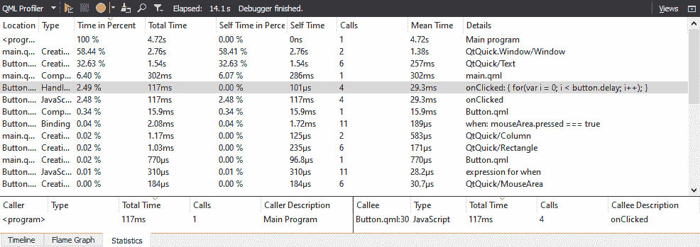
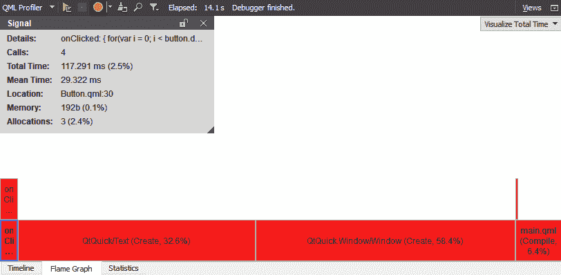
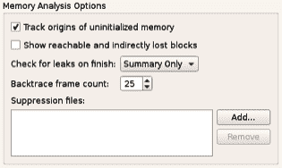
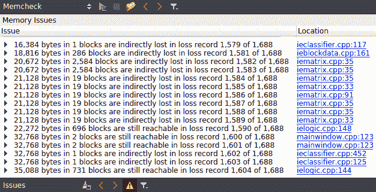
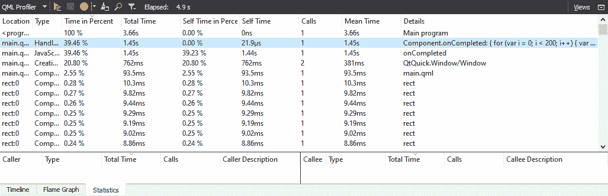
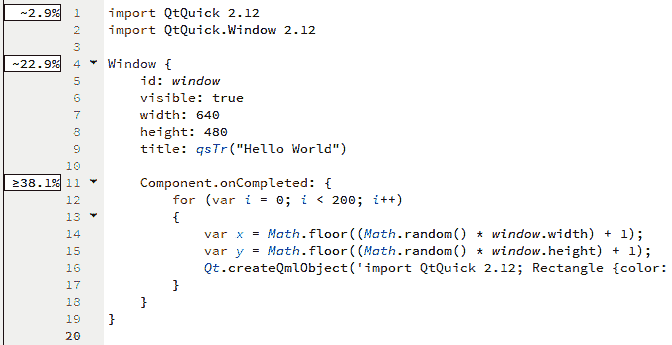
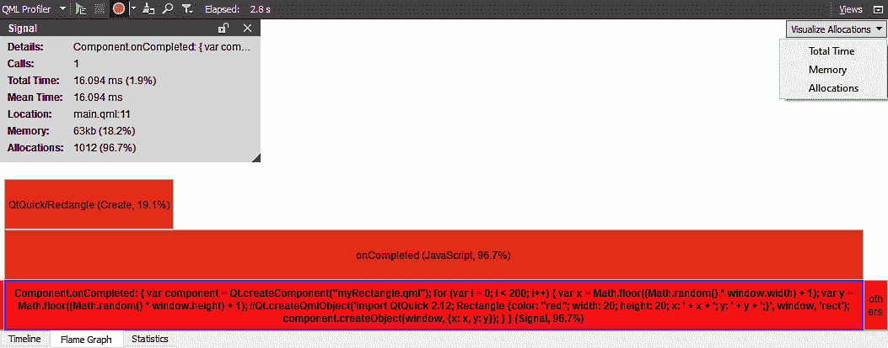
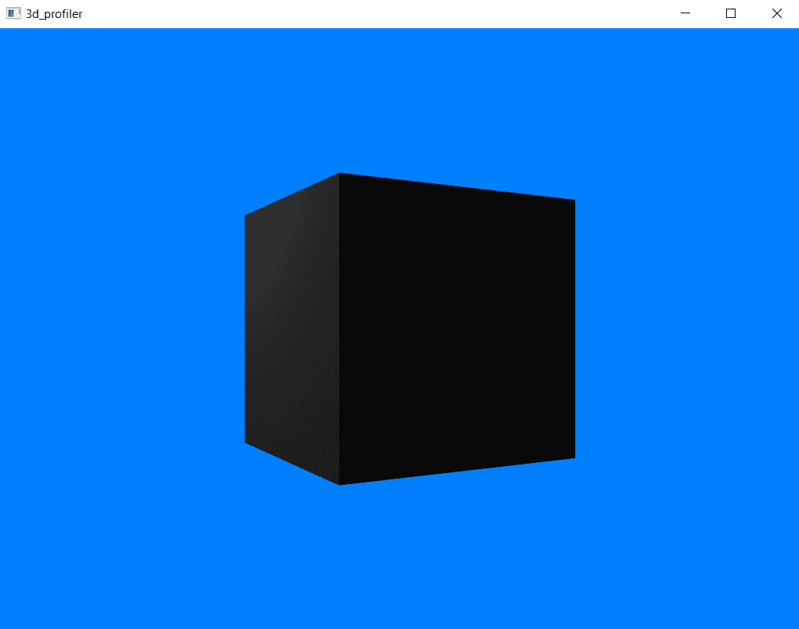
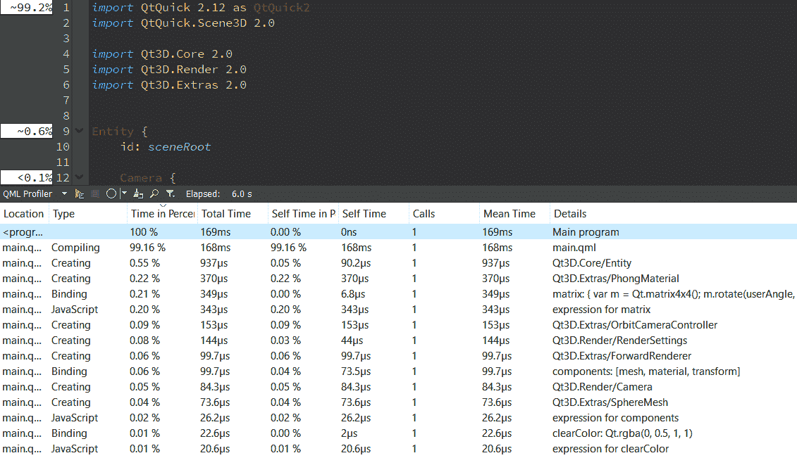
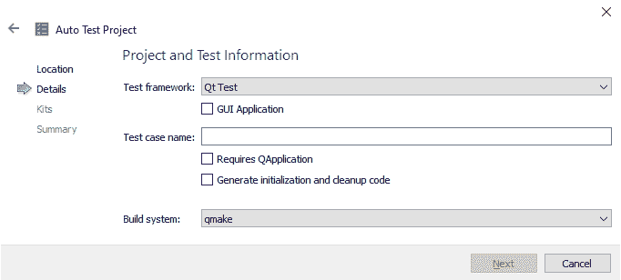

# 十一、使用 Qt Creator 优化性能

我们不是每天都使用性能分析工具，但我们很高兴在我们需要它们的时候它们就在我们身边。 商业工具，如 Microsoft Visual Studio 附带的工具，或独立的工具，如 IBM 的 Rational Rose Purify，可能会因为它们的复杂性和对初学者不友好的设计而让您感到困惑。 幸运的是，Qt Creator 拥有您需要的大部分内置支持，用于使用开源工具来帮助您分析应用的运行时和内存性能。

在本章中，我们将了解如何使用 QML 性能分析器执行 QML 应用的运行时性能分析，并了解如何读取它生成的报告来识别性能问题。 然后，我们将把注意力转向使用 Qt Creator 的 Valgrind 进行内存性能分析，Qt Creator 是一个免费选项，可以帮助您查找 Linux 平台上的内存泄漏和堆损坏。

在本章中，我们将介绍以下主题：

*   介绍 QML 性能分析
*   QML Profiler 简介
*   使用 QML Profiler 执行更多操作
*   实施测试集成
*   增加了对测试集成的更好支持

# 技术要求

本章的技术要求包括 Qt 5.12.3、MinGW 64 位、Qt Creator 4.9.0 和 Windows 10。

# QML 性能分析简介

Qt Quick 应用应该是快速的，用户界面流畅流畅。 在许多情况下，使用 QML 很容易做到这一点；QML 和 Qt Quick 运行时的贡献者花费了大量精力来创建一个在各种环境下都能很好地运行的环境。 然而，有时候，无论您如何尝试，您都会发现您无法从您的应用中挤出您想要的性能。 一些错误是显而易见的，例如：

*   在状态更改或触发绘制操作的操作之间执行大量计算密集型任务
*   同时显示数千个元素的过于复杂的视图层次结构
*   在非常有限的硬件上运行(通常与前两个问题结合在一起)

Knuth 说过一句名言，“*过早优化是万恶之源*，”他绝对是对的。 但是，有时您可能需要测量应用的性能，Qt Creator 为此提供了一个特殊的性能分析器。 这样，您就可以查看应用在每个 QML 方法中花费的时间，并测量应用处于控制边缘的关键方面，例如创建应用的视图层次结构需要多长时间。

让我们仔细看看。

# QtSlowButton--一个需要性能调优的 Qt Quick 应用

让我们分析一下`QtSlowButton`的性能，这是我编写的一个性能不佳的示例程序。 `QtSlowButton`程序有两个 QML 组件：一个基于[第 3 章](03.html)中的计算器按钮的按钮、*使用 Qt Designer 设计应用(*创建 Qt 应用*部分下的*)的按钮，以及一个带有您可以按下的按钮的视图。 下面是按钮实现：

```cpp
import QtQuick 2.12

Rectangle { 
    id: button 

    width: 128 
    height: 64 

    property alias label: buttonText.text 
    property int delay: 0 

    color: "green" 

    Rectangle { 
        id: shade 
        anchors.fill: button; 
        color: "black"; opacity: 0 
    } 

    Text { 
        id: buttonText 
        anchors.centerIn: parent; 
        color: "white" 
        font.pointSize: 16 
    } 

    MouseArea { 
        id: mouseArea 
        anchors.fill: parent 
        onClicked: { 
            for(var i = 0; i < button.delay; i++); 
        } 
    } 

    states: [ 
        State { 
            name: "pressed"; when: mouseArea.pressed === true 
            PropertyChanges { target: shade; opacity: .4 } 
        } 
    ] 
} 
```

当您按下每个按钮时，它只会运行一个`for`循环；它的`delay`属性控制循环的次数。 此外，每个按钮都有一个名为`buttonText`的`label`实例，该按钮在可点击区域的中心绘制该实例。

该程序的主用户界面由`Column`中的三个按钮组成，标记为`fast`、`medium`、[0]和`slow`，延迟时间逐渐延长：

```cpp
import QtQuick 2.12
import QtQuick.Window 2.12

Window {
    visible: true
    width: 180
    height: 360
    title: qsTr("Slow Button")

    Column
    {
        spacing: 20
        Button    // custom Button from button.qml
        {
            delay: 10000;
            label: "fast";
        }
        Button    // custom Button from button.qml
        {
            delay: 100000;
            label: "medium";
        }
        Button    // custom Button from button.qml
        {
            delay: 300000;
            label: "slow";
        }
    }
}
```

对于本例，您可以加载本书附带的源项目，也可以创建一个新的 Qt Quick 项目，并使用此代码构建一个按钮和一个主视图。 现在构建并运行该程序。 您应该会看到如下所示：一个窗口，其中有三个标记为快速、中等和缓慢的按钮：


执行以下步骤以分析应用的性能：

1.  通过单击左面板上的 Build 按钮构建应用。
2.  从分析窗口中选择 QML Profiler。 应用将启动，Qt Creator 将切换到 Analyze 视图。
3.  单击每个按钮几次。 预计在您单击按钮后会等待。
4.  退出应用并查看 QML Profiler 窗口。

QML Profiler uses TCP/IP to make a connection between the running application and the profiler, by default, on port `3768`. You might have to tinker with your host's firewall settings in order to get things to work correctly. On Windows, be sure to permit the connection in the Windows Firewall dialog that appears.

以下屏幕截图显示了应用运行后的分析视图：


QML Profiler 有以下三个选项卡，默认情况下显示第一个选项卡：

*   第一个选项卡是 Timeline，它指示在应用的哪个时间点发生了什么，以及花费了多长时间。
*   第二个选项卡 Flame Graph 列出了 QML 应用处理的事件以及每个事件花费的时间。
*   第三个选项卡(Statistics)列出了程序在运行时遇到的 JavaScript 函数，以及应用在每个函数的总运行中花费的时间。

我已经单击了处理信号行，以展开应用处理的信号。

您可以看到，它处理了一个信号，即`onClicked`信号，总共处理了三次，每次花费的时间在图表上显示为不同的条。 显然，如果这是真正的工作，这里就会有提高性能的机会。

下一个屏幕截图显示了此信息的不同视图，即您的应用的 JavaScript 运行时。 这表明直到数值精度极限，应用将其测量的所有时间都花在按钮的`onClicked`处理程序上-显然，在本例中是性能*热点*：



从前面的屏幕截图中，我们可以看到，有趣的是，我的 JavaScript 的每个事件都是在这里测量的，包括在按钮被按下时将不透明过滤器放在按钮前面的`$when`子句(所选行下面的三行)。 如果您需要从广义上观察应用中正在发生的事情，那么查看此视图会非常有帮助。

性能极客可能对下一个屏幕截图最感兴趣，因为它显示了 QML 在运行应用时处理每个事件所花费的时间：



我们可以看到，`onClicked`处理程序消耗了大部分处理器资源，但也显示了其他内容，例如为视图创建矩形和为按钮状态创建变量绑定。 通常，我们将使用 Statistics 视图来大致了解您的应用中的问题所在，而我们将使用 Flame Graph 视图来聚焦于特定的问题。

在本节中，我们了解了如何通过查看 QML Profiler 中的详细信息来识别 Qt Quick 项目中的问题。 让我们继续下一节，看看如何在 Valgrind 的帮助下轻松检测 Qt 表单项目中的问题。 请注意，Valgrind 只支持 Linux，因此在此之后，我们还将研究如何检测其他操作系统上的问题。

# QtLeakyButton-需要内存帮助的 Qt C++ 应用

**QtLeakyButton**是一个做一件事的应用：显示一个按钮，当单击该按钮时，将分配 512KB 的 RAM。 下面是代码(您可以运行本书附带的示例代码，也可以创建一个 QtGUI 应用，只有一个按钮和一个标签，然后将此代码用于您的`MainWindow`类)。

首先，我们来看一下`mainwindow.h`中的变化：

```cpp
public slots: 
    void leakPressed(); 

private: 
    Ui::MainWindow *ui; 
    int m_count; 
```

之后，我们来看看`mainwindow.cpp`中的更改：

```cpp
MainWindow::MainWindow(QWidget *parent) : QMainWindow(parent), 
    ui(new Ui::MainWindow), m_count(0) 
{ 
    ui->setupUi(this); 
    connect(ui->leakButton, &QPushButton::clicked, this, &MainWindow::leakPressed); 
} 

void MainWindow::leakPressed() 
{ 
    void *p = new char[512 * 1024]; 
    m_count++ ; 
    ui->leakCount->setText(QString::number(m_count)); 
} 
```

从代码中，我们可以观察到以下几点：

*   `MainWindow`类有一个整数计数器和一个用于实例化形式的`ui`槽。
*   `MainWindow`构造函数实例化此窗体，然后将`leakButton`单击的信号连接到`MainWindow::leakPressed`。
*   `leakPressed`方法只是分配内存并颠簸计数器，用您按下按钮的次数更新计数器。

# 使用 Valgrind 检测 Linux 上的内存泄漏

要使用 Valgrind，我们需要向您的应用添加一个新的运行目标。 要完成此操作，请执行以下步骤：

1.  单击左侧面板中的项目，然后单击运行。
2.  当您进入运行设置页面时，您将看到 Valgrind 设置界面。 默认设置应该有效。 如果要设置其他设置，请确保您知道要做什么以及要从调试信息中查找什么。
3.  如果要查找在程序退出之前可能已释放的指针，请在“内存分析选项”下启用“显示可到达和间接丢失的块”。

4.  您还可以要求 Valgrind 通过为 Check for Leaks on Finish 下拉框选择不同的选项(即，仅摘要或完整)来显示应用运行时发生的不同数量的泄漏。 下面的屏幕截图显示了这一点：



现在，您可以为您的应用选择 Valgrind 运行目标。 您需要对调试版本执行此操作，因为 Valgrind 需要应用中的调试符号才能生成有意义的报告。 要使用 Valgrind，请启动应用并单击该按钮几次。 Valgrind 进程不断地输出信息，但是大部分输出都是在我们退出应用之后输出的。

Valgrind 会生成大量输出，这可能需要一些时间来整理。 我们正在查找泄漏摘要，它指示肯定丢失和间接丢失的字节数。 绝对丢失的块是您分配的未释放的内存；间接丢失的内存是因为被另一个指针引用而引用的指针没有释放而泄漏的内存。

输出将类似于以下代码：

```cpp
X bytes in 1 blocks are definitely lost in loss record n of m at 0x........: function_name (filename:line number) 
```

`X`表示泄漏的字节数，泄漏块的地址显示在第二行。 记录号表示应用的内存分配器使用的内部记录号，可能对您没有太大帮助。 下面的屏幕截图显示了它的实际效果：



我们应该关注应用中的泄漏，因为 Qt 本身也可能有泄漏。 Valgrind 支持抑制文件，这些文件指示应该忽略的泄漏；如果您可以找到并下载针对构建所依据的 Qt 版本的抑制文件，则可以通过修改参数行来包含对抑制文件的引用，如下所示：

```cpp
-q --tool=memcheck --leak-check=full --leak-resolution=low --suppressions=suppresion.txt ./[your-app-target-name] 
```

# 使用可视化泄漏检测器检测 Windows 上的内存泄漏

由于 Valgrind 只支持 Linux，让我们来看看如何检测 Windows 上的内存泄漏。 对于 Windows 平台，您可以使用的最佳工具是 Visual Studio 本身，它可以免费下载。 您还必须使用 Visual C++ 编译器而不是 MinGW 编译项目，以便 Visual Studio 检漏器正常工作。 然后，您需要下载 Visual Left Detector，这是一个在现有 Visual C++ 检测器之上添加功能的库。 您可以从[https://kinddragon.github.io/vld](https://kinddragon.github.io/vld)下载视觉检漏仪。

安装可视检漏仪后，再次打开 Leaky Button 示例。 这一次，切换到一个支持 Visual Studio 编译器的工具包，然后打开项目文件(`.pro`)并向其中添加以下代码：

```cpp
INCLUDEPATH += "C:/Program Files (x86)/Visual Leak Detector/include/"
LIBS += -L"C:/Program Files (x86)/Visual Leak Detector/lib/Win64" -lvld
```

前面的代码将把包含可视化泄漏检测器的头文件和库文件的文件夹与您的项目链接起来。 接下来，打开`main.cpp`并包含以下标题：

```cpp
#include <vld.h>
```

然后，将以下文件从 Visual 检漏仪安装文件夹复制到应用的 Build 文件夹：

*   `dbghelp.dll`
*   `Microsoft.DTfW.DHL.manifest`
*   `vld_x64.dll`

现在，构建并运行该程序，在调试模式下启动应用时，您应该在 Application Output 窗口中看到以下行：

```cpp
Visual Leak Detector read settings from: C:\Program Files (x86)\Visual Leak Detector\vld.ini
Visual Leak Detector Version 2.5.1 installed.
```

如果您看到前面的消息，祝贺您！ 已成功为您的项目实现可视泄漏检测器。 之后，按下泄漏钮。 每次按下按钮时，您将看到该数字仅增加 1`1`，因为视觉检漏仪已检测到泄漏并已停止操作。 现在，您可以关闭您的程序并查看告诉您可能面临的问题的长消息。 如果您逐行仔细查看，您可能会从消息中注意到类似以下内容：

```cpp
f:\dd\vctools\crt\vcstartup\src\startup\exe_winmain.cpp (17): QtLeakyButton.exe!WinMainCRTStartup()
KERNEL32.DLL!BaseThreadInitThunk() + 0x14 bytes
ntdll.dll!RtlUserThread ucrtbased.dll!malloc()
f:\dd\vctools\crt\vcstartup\src\heap\new_array.cpp (29): QtLeakyButton.exe!operator new[]()
c:\users\leezh\desktop\qtleakybutton\mainwindow.cpp (19): QtLeakyButton.exe!MainWindow::leakPressed() + 0xA bytes
```

第一行指示程序已启动。 然后是关键字`malloc`和`new`，这意味着问题与内存分配有关。 之后，我们还可以看到`leakPressed`，它正是导致内存泄漏的函数。 从这里，我们知道`leakPressed`函数出了问题，这与未使用的指针未被清除有关，因此我们可以在代码中修复该问题。 根据您面临的问题，调试消息看起来可能会有所不同，因此请仔细查看这些消息，确保不会遗漏任何重要的细节。

查找应用中的内存泄漏部分是艺术，部分是科学。 在应用开发期间定期检查这是一个很好的练习，以确保在您最熟悉您正在运行的新代码的同时，快速发现您可能引入的漏洞。接下来，我们将继续学习如何使用 QML Profiler 做更多工作并优化我们现有的应用。

# QML Profiler 简介

在上一节*介绍 QML 性能分析*中，我们向您介绍了 QML Profiler 及其基本功能。 在本节中，我们将探索 QML Profiler 还可以提供哪些其他功能来使我们的调试过程更快、更有效。 我们还将学习如何检查 QML Profiler 中显示的数据以及这些数据表明了什么，以便我们可以确定应用速度减慢或崩溃的原因。

为了演示这一点，让我们执行以下步骤：

1.  让我们创建一个新的 Qt Quick 项目，并将`main.qml`代码更改为：

```cpp
import QtQuick 2.12
import QtQuick.Window 2.12

Window {
    id: window
    visible: true
    width: 640
    height: 480
    title: qsTr("Hello World")

    Component.onCompleted: {
        for (var i = 0; i < 200; i++)
        {
            var x = Math.floor((Math.random() * window.width) + 1);
            var y = Math.floor((Math.random() * window.height) + 1);
            Qt.createQmlObject('import QtQuick 2.12; Rectangle 
              {color: "red"; width: 20; height: 20; x: ' + x + ';
               y: ' + y + ';}', window, 'rect');
        }
    }
}
```

在前面的代码中，我们为`Window`对象设置了一个名为`window`的`id`实例。 当创建`window`图形时，将调用`onCompleted`图形函数，我们告诉程序开始在屏幕上的任意位置生成 200 个矩形图形。 我们使用`Math.random`生成每个矩形的`x`和`y`两个值，随机生成器的范围从`1`到`width`或`height`的值`window`。

2.  如果我们现在运行该程序，我们应该看到如下所示：


3.  之后，进入分析界面|QML Profiler 界面，打开 QML Profiler，开始分析应用。 一旦程序启动并生成矩形，您现在就可以关闭它并转到 QML Profiler 界面。
4.  在访问 Timeline 或 Flame Graph 之前，最好先查看统计数据，因为这是以线性方式获得应用整体性能概览的最快方式：



如你所见，在我的电脑上，`onCompleted`函数完成其任务所需的总时间是 1.45 秒，这是我们在屏幕上产生 200 个矩形时预计的结果。 您可以尝试将`i`的数量增加到 300 或 400，并查看在 QML Profiler 中生成所有这些矩形需要多少秒。 您可以双击列表上的单个项目以查看操作的细分详细信息，以进一步调查。 通过 Statistics 窗口，我们可以很容易地检查应用的性能，并发现降低程序速度的操作。

5.  除此之外，您还可以查看脚本的左侧，以百分比为单位查看您自己的时间数据，该数据也可以在您的统计数据窗口中找到：



6.  接下来，我们来看一看火焰图表的窗口：



Flame Graph 窗口主要用于以条形图的形式可视化应用的整体性能，包括编译和创建每个组件所花费的总时间、其内存使用情况以及函数执行的内存分配数量。

7.  现在，让我们进入下一个时间线窗口。 时间线窗口基本上显示的数据与统计数据窗口中的数据相似。 但是，它还按照时间线列出所有操作，告诉您哪些操作发生在什么时间(从程序执行开始)，以及运行任何特定操作需要多长时间。 除此之外，它还显示每个操作的内存使用情况和场景图的渲染持续时间。
8.  让我们来看看我们的示例程序的时间表，看看我们是否能发现性能问题。 如果你在时间线窗口中滚动，你会看到一大堆五颜六色的条形图，沿着这条线编辑和创建不同的部分。 这些条中的每一个都表示在我们的应用窗口中创建了一个单独的矩形形状：


很快，我们注意到编译时间比创建时间长得多。 创建每个矩形只需要几纳秒，而编译则需要几毫秒。 这是因为我们要求我们的程序在每次尝试创建矩形时加载新的 QML 代码，因此它需要重复编译，即使每个矩形本质上具有相同的属性(除了`x`和`y`)。 在时间线窗口中，我们发现了一个可以进一步改进的性能问题。

9.  要解决这个问题，让我们将矩形的 QML 代码移到一个单独的 QML 文件中，方法是转到文件|新建 QML 文件或项目。然后，在“文件和类”|“Qt”类别下选择“QML 文件(Qt Quick 2)(QML 文件(Qt Quick 2)”)。 之后，打开新创建的文件(这里我将其称为`myRectangle.qml`)，并将代码更改为以下代码：

```cpp
import QtQuick 2.12;

Rectangle{
    color: "red";
    width: 20;
    height: 20;
    x: 0;
    y: 0;
}
```

前面的代码与我们在`main.qml`中使用的矩形代码基本相同，不同之处在于现在默认情况下将参数`x`和参数`y`的值设置为参数`0`。 在生成单个矩形之后，我们将稍后设置每个`x`和`y`的值。

然后，在`main.qml`中，我们更改`onCompleted`函数中的代码：

```cpp
Component.onCompleted: {
    var component = Qt.createComponent("myRectangle.qml");

    for (var i = 0; i < 200; i++)
    {
        var x = Math.floor((Math.random() * window.width) + 1);
        var y = Math.floor((Math.random() * window.height) + 1);

        component.createObject(window, {x: x, y: y});
    }
}
```

我们不必在每次生成矩形形状时都编译新的 QML 代码，而是现在只需在`for`循环之前编译一次。 我们通过调用`Qt.createComponent`并加载存储矩形的 QML 代码的`myRectangle.qml`来做到这一点。 然后，我们调用`component.createObject`命令来生成矩形，并将其参数`x`和参数`y`的值更改为随机数。`createObject`将从内存中复制已编译的矩形组件，因此不需要额外的编译。

如果我们再次运行 QML Profiler，我们应该会在时间轴窗口中看到完全不同的东西：


现在我们只需要 8 毫秒，而不是花费大约 1.6 秒来编译所有的 200 个矩形形状，因为我们只需要编译一次，而不是 200 次。 结果，我们的程序得到了优化，并且执行得更好了！ 尽管 1 秒的改进在这里看起来并不重要，但是随着您的程序的增长，这里和那里会出现越来越多的性能问题，这些问题会滚雪球般地发展成性能噩梦。

# 使用 QML Profiler 执行更多操作

现在，让我们了解如何将 QML 分析器用于除普通 GUI 应用之外的其他应用。 在下面的示例中，我们将尝试使用 Qt Quick 创建一个简单的 3D 渲染器，并使用 QML Profiler 检查其性能。

首先，让我们创建一个空的 Qt Quick 项目。 然后打开`main.qml`，添加以下模块：

```cpp
import QtQuick 2.12 as QtQuick2
import QtQuick.Scene3D 2.0
import Qt3D.Core 2.0
import Qt3D.Render 2.0
import Qt3D.Extras 2.0
```

我们添加了以后使用所需的 3D 渲染模块。 我们还为`QtQuick`模块设置了别名`QtQuick2`，稍后我们将在代码中使用它。 之后，让我们删除默认的`Window`项并添加`Entity`。 我们将其称为`Entity`实例`sceneRoot`，它将充当 3D 场景中所有对象的父项。 我们还添加了一个`Camera`实例来设置渲染的视点：

```cpp
Entity {
    id: sceneRoot

    Camera {
        id: camera
        projectionType: CameraLens.PerspectiveProjection
        fieldOfView: 45
        aspectRatio: 16/9
        nearPlane : 0.1
        farPlane : 1000.0
        position: Qt.vector3d(0, 0, -30)
        upVector: Qt.vector3d(0, 1, 0)
        viewCenter: Qt.vector3d(0, 0, 0)
    }
```

我们将相机定位在`x:0``y:0``z:-30`，然后将其查看目标设置在原点。 之后，添加`ForwardRenderer`，它将场景从摄影机视图渲染到我们的 Qt 窗口中。 我们通过设置`clearColor`属性将背景颜色设置为浅蓝色：

```cpp
    components: [
        RenderSettings {
            activeFrameGraph: ForwardRenderer {
                clearColor: Qt.rgba(0, 0.5, 1, 1)
                camera: camera
            }
        }
    ]
```

下一步则更为复杂。 我们创建另一个`Entity`实例，这一次它将携带一个 3D 立方体模型。 要实现这一点，我们需要三个不同的组件：网格、材质和变换：

```cpp
    PhongMaterial {
        id: material
    }

    CuboidMesh {
        id: mesh
        xExtent: 10
        yExtent: 10
        zExtent: 10
    }

    Transform {
        id: transform
        property real userAngle: 0.0
        matrix: {
            var m = Qt.matrix4x4();
            m.rotate(userAngle, Qt.vector3d(0, 1, 0));
            m.translate(Qt.vector3d(0, 0, 0));
            return m;
        }
    }

    Entity {
        id: entity
        components: [mesh, material, transform]
    }
```

网格本质上是包含所有顶点位置信息的 3D 数据。 在本例中，我们只需要一个简单的立方体模型，所以我们使用了`CuboidMesh`组件，它是一个类似于立方体的内置形状。 材质是三维网格曲面特性的定义，例如颜色、粗糙度和反射率。 在这种情况下，我们只需将标准 Phong 材质应用于 3D 网格。 变换组件是网格的位置、旋转和缩放，由矩阵值表示。 然后，我们将这些组件提供给`Entity`项以形成 3D 对象。

最后，我们使用`NumberAnimation`动画类型无限旋转立方体，这样我们就可以在 3D 场景中看到一些运动。 我们使用开始时创建的`QtQuick2`别名来调用`NumberAnimation`，因为它属于`QtQuick`模块：

```cpp
    QtQuick2.NumberAnimation
    {
        target: transform
        property: "userAngle"
        duration: 10000
        from: 0
        to: 360

        loops: QtQuick2.Animation.Infinite
        running: true
    }
}
```

在构建我们的项目之前，让我们打开`main.cpp`并将整个`main`函数更改为：

```cpp
#include <QGuiApplication>
#include <Qt3DQuickExtras/qt3dquickwindow.h>

int main(int argc, char *argv[])
{
    QGuiApplication app(argc, argv);
    Qt3DExtras::Quick::Qt3DQuickWindow view;
    view.setSource(QUrl("qrc:/main.qml"));
    view.show();

    return app.exec();
}
```

我们将窗口类更改为`Qt3DQuickWindow`，因为我们不再需要普通的 GUI 窗口。 现在让我们构建并运行该程序。 您应该看到如下所示：



要分析该程序，请转到分析|QML Profiler。 从 QML Profiler 窗口，我们可以看到设置 3D 模型需要多长时间，渲染每个帧需要多长时间，等等。 此示例场景非常简单，因此一切看起来都很快，但如果您有一个包含许多高度多边形模型和复杂材质的复杂场景，则会注意到此处的瓶颈：



仅此而已-我们不仅使用 QML Profiler 来分析普通 GUI 程序的性能，而且这次我们还学习了如何使用 QML Profiler 来分析 3D 渲染器。

接下来，我们将学习如何在我们的 Qt 应用中实现测试集成。

# 实施测试集成

单元测试是应用开发过程中的一个非常重要的阶段，但往往被开发人员，尤其是初学者忽视。 单元测试可确保应用的质量达到标准，并改善用户体验。 单元测试的方法之一是将自动测试集成到项目中。 在本节中，我们将学习如何在 Qt Creator 中实现不同类型的自动测试。

Qt 测试框架由两部分组成-Qt 测试和 Qt 快速测试，它们测试 C++、QML 和 GUI 特性，而其他两个框架只测试 C++ 特性。 选一个最适合你的项目。 我们将在这里逐一研究它们。

# 创建 Qt 和 Qt 快速测试

Qt 和 Qt 快速测试内置于 Qt Creator 中，因此您不需要在项目中安装任何第三方组件。 按照下面给出的步骤了解如何创建 Qt 或 Qt 快速测试：

1.  通过转到文件|新建文件或项目来创建新项目。
2.  在“其他项目”类别下选择“自动测试项目”。
3.  在 Project and Test Information(项目和测试信息)对话框中，为 Test framework 选项选择 Qt Test(Qt 测试)或 Qt Quick Test(Qt 快速测试)。
4.  Qt Test 下还有两个额外的选项，分别是 GUI 应用和需要 QApplication 的选项。 如果您正在构建一个图形用户界面应用，您可以选中这两个选项。
5.  在此之后，填写测试用例名称-任何东西都可以。
6.  选择您的构建系统。 如果您不确定要做什么，请将其保留为 qmake。 只有在使用其他构建系统(如 CMake 或 QBS)时，才需要更改此选项。
7.  按 Next(下一步)并完成该过程的其余部分。 下面的屏幕截图显示了这一点：



创建项目后，打开`.pro`文件。 您将看到一些与我们在前面所有示例项目中使用的普通项目文件完全不同的内容：

```cpp
QT += testlib
QT += gui
CONFIG += qt warn_on depend_includepath testcase
```

如您所见，此项目默认附带`testlib`模块。 此模块包含我们在本节后面执行测试所需的所有功能。 在配置部分中，我们还包括了`warn_on`、`depend_includepath`和`testcase`，这对我们来说都是新的：

*   `warn_on`：此选项告诉编译器输出尽可能多的警告。 我们需要此功能来显示自动测试期间发生的任何问题。
*   `depend_includepath`：此选项告诉 Qt 追加`INCLUDEPATH`和`DEPENDPATH`的值，以便正确加载所有依赖项。
*   `testcase`：我们必须在我们的项目中包含此选项，以指示它是自动测试。 在运行测试之前，检查目标将被添加到 Makefile。 如果没有此选项，Qt Creator 将不会将应用作为自动测试执行。

之后，打开项目目录中的 cpp 文件。 CPP 文件中的类以您在创建项目期间插入的测试用例名称命名。 在类下为您创建了三个槽函数-`initTestCase`、`cleanupTestCase`和`test_case1`。

*   `initTestCase`：这是一个内置插槽，不会被视为测试函数。 此函数将在测试开始前调用。 您可以使用它来初始化测试所需的变量或指针。
*   `cleanupTestCase`：顾名思义，此函数用于在执行完所有测试后清除变量或指针。
*   `test_case1`：这是默认情况下为您创建的示例测试函数。 您可以自己创建更多的槽函数，所有这些函数都将被视为测试函数。 您可以创建的测试函数数量没有限制，您可以对测试函数使用任何名称，只要它们不与`initTestCase`、`cleanupTestCase`、`init`和`cleanup`冲突。

除了`initTestCase`和`cleanupTestCase`之外，还有另外两个槽函数`init`和`cleanup`不被视为测试函数；它们在前面已简要说明：

*   `init`：与`initTestCase`不同，此槽函数在每个测试函数之间调用。 如果此功能失败，将跳过下面的测试功能，测试将进入下一个测试功能。
*   `cleanup`：这类似于`cleanupTestCase`，但在每个测试函数之后运行。

让我们来看看一些简单的代码，以及如何创建我们自己的自动测试：

```cpp
void Testing::test_case1()
{
    QString str = "Testing";
    QVERIFY(str.toUpper() == "TESTING");
}
```

如果我们现在运行该应用，我们应该看到类似以下内容：

```cpp
********* Start testing of Testing *********
Config: Using QtTest library 5.13.1, Qt 5.13.1 (x86_64-little_endian-llp64 shared (dynamic) debug build; by GCC 7.3.0)
PASS : Testing::initTestCase()
PASS : Testing::test_case1()
PASS : Testing::cleanupTestCase()
Totals: 3 passed, 0 failed, 0 skipped, 0 blacklisted, 1ms
********* Finished testing of Testing *********
```

我们使用`QVERIFY`进行测试。 如果结果为`true`，则测试将通过。 否则，测试将失败。 现在，让我们更改代码中的某些内容，使其失败：

```cpp
void Testing::test_case1()
{
    QString str = "Testing1234";
    QVERIFY(str.toUpper() == "TESTING");
}
```

现在，让我们再运行一次程序。 现在，您应该会看到显示失败状态：

```cpp
********* Start testing of Testing *********
Config: Using QtTest library 5.13.1, Qt 5.13.1 (x86_64-little_endian-llp64 shared (dynamic) debug build; by GCC 7.3.0)
PASS : Testing::initTestCase()
FAIL! : Testing::test_case1() 'str.toUpper() == "TESTING"' returned FALSE. ()
..\autotest\tst_testing.cpp(44) : failure location
PASS : Testing::cleanupTestCase()
Totals: 2 passed, 1 failed, 0 skipped, 0 blacklisted, 2ms
********* Finished testing of Testing *********
```

您可以使用`QVERIFY`检查特定函数或变量。 只要结果返回`true`，测试就会通过并继续进行。 除了`QVERIFY`，您还可以使用`QCOMPARE`比较两个值。 让我们创建第二个测试函数，并在其中使用`QCOMPARE`：

```cpp
class Testing : public QObject
{
    Q_OBJECT
public:
    Testing();
    ~Testing();
private slots:
    void initTestCase();
    void cleanupTestCase();
    void test_case1();
    void test_case2();
};

void Testing::test_case2()
{
 int a = 10;
 QCOMPARE(a, 10);
}
```

`QCOMPARE`的工作方式与`QVERIFY`非常相似。 唯一的区别是它只接受两个输入，而不是一个。

To learn more about the functions and macros provided by the QTest namespace, please check out the documentation at [https://doc.qt.io/qt-5/qtest.html](https://doc.qt.io/qt-5/qtest.html).

# 使用 QSignalSpy 测试信号和插槽

我们还可以使用`QSignalSpy`类测试程序中的信号和插槽。 `QSignalSpy`是 Qt 提供的一个类，用于连接到任何物体的信号并记录其发射。 `QSignalSpy`然后将把信号的参数附加到`QVariant`列表中进行单元测试。

让我们继续前面的代码，并添加一个名为`test_signalslot`的新槽函数：

```cpp
private slots:
    void initTestCase();
    void cleanupTestCase();
    void test_case1();
    void test_case2();
    void test_signalslot();
```

接下来，在`Testing`类的构造函数中，我们创建一个新的`QObject`，并将其`objectNameChanged`信号连接到`test_signalslot`槽函数。 我们还将`objectNameChanged`信号连接到`QSignalSpy`对象，以便它可以记录发射。 之后，我们通过更改对象名称来触发信号，如下所示：

```cpp
Testing::Testing()
{
    QObject* object = new QObject(this);
    connect(object, &QObject::objectNameChanged, this, 
      &Testing::test_signalslot);
    spy = new QSignalSpy(object, &QObject::objectNameChanged);
    object->setObjectName("New Name");
}
```

然后，我们实现`test_signalslot`函数。 首先，我们检查信号是否已经发出。 我们还考虑了`QSignalSpy`记录的所有参数，并检查第一个参数是否为`"New Name"`，这样我们就可以验证该信号就是我们刚才发出的信号：

```cpp
void Testing::test_signalslot()
{
    QCOMPARE(spy->count(), 1);
    QList<QVariant> arguments = spy->takeFirst();
    QVERIFY(arguments.at(0).toString() == "New Name");
}
```

现在构建并运行该程序，您应该会看到如下所示：

```cpp
********* Start testing of Testing *********
Config: Using QtTest library 5.13.0, Qt 5.13.0 (x86_64-little_endian-llp64 shared (dynamic) debug build; by GCC 7.3.0)
PASS : Testing::initTestCase()
PASS : Testing::test_case1()
PASS : Testing::test_case2()
PASS : Testing::test_signalslot()
PASS : Testing::cleanupTestCase()
Totals: 5 passed, 0 failed, 0 skipped, 0 blacklisted, 1ms
********* Finished testing of Testing *********
```

您可以更改`QCOMPARE`和`QVERIFY`中的值，以查看如果单元测试失败会发生什么情况。 如果您正在测试没有立即发出的定时器信号，您可以使用`wait`函数要求 Qt 在验证之前等待几毫秒：

```cpp
QVERIFY(spy->wait(1000));
```

就这样。 我们已经学习了如何利用 Qt 和 Qt 快速测试来自动检查我们的代码，并确保质量得到适当的维护。 我们还了解了如何通过`QSignalSpy`对 Qt 应用中的信号和槽进行单元测试。

To learn more about the `QSignalSpy` class, please visit [https://doc.qt.io/qt-5/qsignalspy.html](https://doc.qt.io/qt-5/qsignalspy.html).

接下来，我们将转向第三方自动测试套件，并使我们的测试集成更加多样化和更好。

# 增加了对测试集成的更好支持

尽管 Qt 和 Qt Quick Testing 都是非常好的自动测试框架，但我们也可以集成其他一些第三方单元测试框架来测试不同的问题。 您还可以比较来自不同框架的结果，以确保没有误报，并确保您的产品质量处于最佳状态。 除了他们自己的 Qt 测试框架外，Qt Creator 还在编辑器中集成了其他几个不同的自动测试套件，如 Google C++ 测试框架和 Boost.Test，用于自动化单元测试。

首先，我们将学习如何将 Google Test 集成到我们的项目中。

# 创建 Google 测试

在我们开始设置谷歌测试之前，让我们从 GitHub 链接下载谷歌 C++ 测试框架：[https://github.com/google/googletest](https://github.com/google/googletest)。 单击“克隆”或“下载”按钮，然后单击“下载 ZIP：


拥有所有必需的文件后，将这些文件解压缩到 PC 上的一个目录中，然后按照以下步骤创建一个测试项目：

1.  通过转到“文件”|“新建文件”或“项目”来创建新项目。
2.  在“其他项目”类别下选择“汽车测试项目”。
3.  在 Project and Test Information(测试项目和测试信息)对话框中，为测试框架(Test Framework)选项选择`Google Test`选项。
4.  之后，填写“测试套件名称”和“测试用例名称”字段。
5.  如果要在测试中支持 C++ 11 功能，请选中“启用 C++ 11”复选框。
6.  对于 Google 测试存储库字段，选择您刚刚从 GitHub 下载的文件解压的目录-例如，*`C:\googletest-master`。
7.  选择您的虚拟构建系统。 如果您不确定要做什么，请将其保留为 qmake。 只有在使用某些其他构建系统(如 CMake 或 QBS)时，才需要更改此选项。
8.  按下下一步，完成剩下的流程。

一旦创建了项目，您将看到我们刚才介绍的项目向导已经为您设置了几项内容。 如果打开`gtest_dependency.pri`，可以看到已经为您设置了`INCLUDEPATH`、`SOURCES`等设置。 包含测试函数的实际源文件位于*`tst_testscene.h`，如下所示：

```cpp
#ifndef TST_TESTCASE_H
#define TST_TESTCASE_H

#include <gtest/gtest.h>
#include <gmock/gmock-matchers.h>

using namespace testing;

TEST(TestSuite, TestCase)
{
    EXPECT_EQ(1, 1);
    ASSERT_THAT(0, Eq(0));
}

#endif // TST_TESTCASE_H
```

与 Qt Test 类似，Google Test 也使用诸如`EXPECT_EQ`和`ASSERT_THAT`等宏来进行测试。 他们是这样做的：

*   `EXPECT_EQ`：执行简单真/假条件测试的非致命断言，类似于`QCOMPARE`。 检测到故障时，任何以“`EXPECT_`”开头的宏都不会终止自动测试。 终端显示故障后进行测试。
*   `ASSERT_THAT`：*此宏允许执行复杂得多的测试。 第一个输入是要用此断言测试的值，而第二个输入是测试的条件。 在前面的示例中，断言测试值`0`，条件等于`0`，这可以由*`Eq(0)`表示。 你可以用它来比较复杂得多的变量，比如地图或向量--例如，`ASSERT_THAT(v, ElementsAre(5, 10, 15));`。而关键字`ASSERT_`告诉我们，这是一个致命的断言，这意味着当检测到失败时，测试将立即停止。

如果您现在构建并运行该项目，您应该会看到类似如下的结果：


To learn more about the other macros available in Google C++ Testing Framework, visit [https://github.com/google/googletest/blob/master/googletest/docs/primer.md](https://github.com/google/googletest/blob/master/googletest/docs/primer.md).

现在，让我们看看 Boost 测试是如何工作的。

# 创建助推测试

最后，我们将学习如何创建 Boost 测试。 顾名思义，Boost 测试需要一组名为 Boost 的第三方 C++ 库。 你可以从 Boost 官网下载，网址是：[https://www.boost.org](https://www.boost.org)。 下载完 ZIP 文件后，将其解压到您 PC 上的某个位置，因为我们稍后会用到它。 完成后，检查以下步骤以创建一个测试项目：

1.  通过转到“文件”|“新建文件”或“项目”来创建新项目。
2.  在“其他项目”类别下选择“汽车测试项目”。
3.  在 Project and Test Information(测试项目和测试信息)对话框中，为 Test Framework(测试框架)选项选择 Boost Test(增强测试)。
4.  之后，填写“测试套件名称”和“测试用例名称”字段。
5.  然后，转到您解压下载的 Boost 目录，然后将目录路径复制到 Boost Include dir(可选)字段-例如，*`C:\boost_1_71_0`。
6.  选择您的虚拟构建系统。 如果您不确定要做什么，请将其保留为 qmake。 只有在使用某些其他构建系统(如 CMake 或 QBS)时，才需要更改此选项。
7.  按下下一步，完成剩下的流程。

创建项目后，打开`main.cpp`：

```cpp
#define BOOST_TEST_MODULE TestSuite
#include <boost/test/included/unit_test.hpp>

BOOST_AUTO_TEST_CASE( testCase )
{
    BOOST_TEST( true /* test assertion */ );
}
```

我们可以看到不同单元测试套件之间的相似之处。 Boost 也使用宏，尽管它们以`BOOST_`开头，而且它的工作原理也非常类似于 Qt Test 和 Google Test。 您将使用的最常见的宏是`BOOST_TEST`，它适用于大多数测试用例。 例如，我们可以按如下方式更改`BOOST_AUTO_TEST_CASE`函数：

```cpp
BOOST_AUTO_TEST_CASE( testCase )
{
    int a = 5;
    int b = 6;
    BOOST_TEST(a != b - 1);
}
```

正如您从前面的代码中看到的，我们有意将其设置为失败测试，只是为了看看应用的结果是什么。 现在让我们构建并运行该程序。 您应该会看到类似以下屏幕截图的内容：


除此之外，Boost 还支持不同严重级别的断言：

*   `BOOST_TEST_WARN`：最低严重级别。 如果测试执行失败，这甚至不会增加错误计数。 如果当前测试失败，自动测试将继续执行下一个测试功能。
*   `BOOST_TEST_CHECK`：中等严重级别。 这实际上与我们在上一个示例中使用的`BOOST_TEST`相同。 如果此测试执行失败，则会增加错误计数，但不会阻止自动测试继续进行。

*   `BOOST_TEST_REQUIRE`：最高严重级别。 此断言既会增加错误计数，又会在测试返回失败结果时停止自动测试。

There are plenty of other macros that you can use to test various types of test cases. To learn more about this, please visit the Boost documentation at [https://www.boost.org/doc/libs/1_71_0/libs/test/doc/html](https://www.boost.org/doc/libs/1_71_0/libs/test/doc/html).

在本节中，我们了解了如何使用各种类型的单元测试套件设置有效的自动测试。

# 简略的 / 概括的 / 简易判罪的 / 简易的

Qt Creator 提供了 QML 分析器，它允许您执行 Qt 应用的运行时分析。 您可以看到应用如何运行的图形(在时间上)，还可以深入了解有关应用如何花费时间绘制、绑定到变量和执行 JavaScript 的详细信息。

Qt Creator 还可以很好地与 Linux 上的 Valgrind 集成，让您可以查找应用中的内存泄漏。 在 Linux 上使用 Valgrind，您可以查看已分配但未释放的块，更重要的是，可以查看它们有多大，以及它们在代码中的分配位置，这让您在确定它们未被释放的原因方面领先一步。 因为 Valgrind 只能在 Linux 上运行，所以我们还讨论了另一个内存泄漏检测器，称为 Visual Leak Detector，它在 Windows 上工作得很好。

除此之外，我们还学习了如何使用 Qt Test、Google Test 和 Boost 测试实现自动化单元测试，以帮助提高应用的质量。 说到质量，我们还了解了如何使用 QML Profiler 通过检查内存使用和代码效率来提高应用的性能。

在下一章中，我们将把注意力从 Qt Creator 的特定部分转移到它最激动人心的方面之一：使用 Qt Creator 编译和测试 Android 等移动平台上的应用的能力。