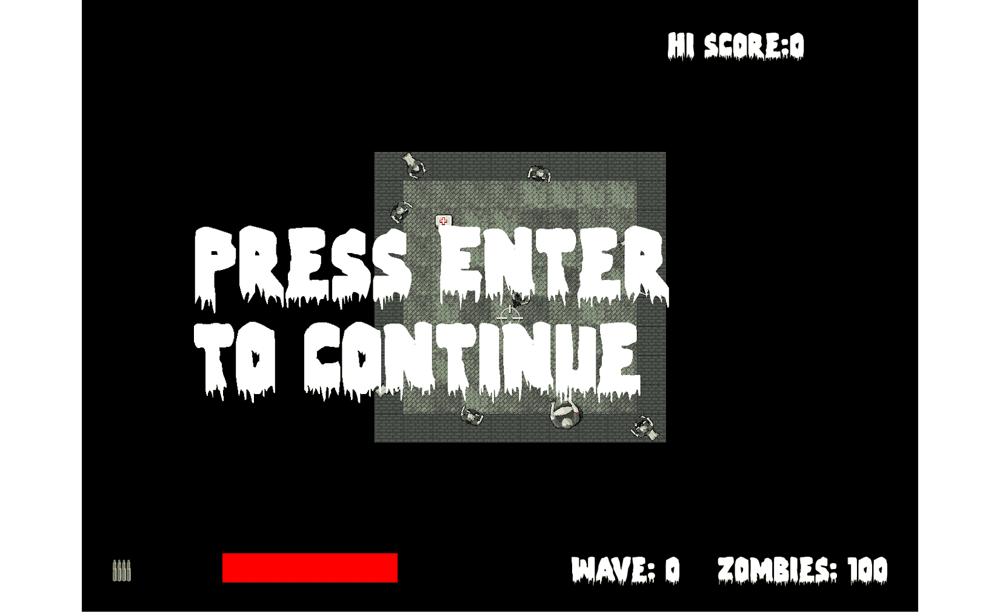
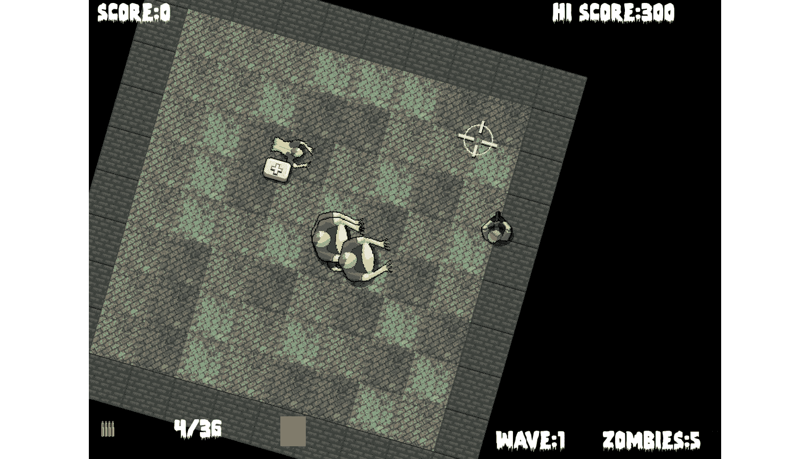

# 十二、视图分层与 HUD 实现

在本章中，我们将看到 SFML 视图的真正价值。 我们将添加一个大的 SFML`Text`对象数组，并对它们进行操作，就像我们之前在 Timber 中做的那样!! 项目和 Pong 项目。 新的是，我们将使用第二个视图实例来绘制 HUD。 通过这种方式，HUD 将保持在主要游戏动作的上方，而不管背景、玩家、僵尸和其他游戏对象在做什么。

以下是本章的内容:

*   添加文本和背景到主/游戏结束屏幕
*   在升级屏幕上添加文本
*   创建第二个视图
*   添加一个住房和城市发展部

# 添加所有文本和 HUD 对象

我们将在这一章中处理一些字符串。 我们这么做是为了在 HUD 和升级屏幕上添加必要的文本。

添加额外的`include`指令在下面的代码中高亮显示，这样我们就可以创建一些`sstream`对象来实现这一点:

```cpp
#include <sstream>
#include <SFML/Graphics.hpp>
#include "ZombieArena.h"
#include "Player.h"
#include "TextureHolder.h"
#include "Bullet.h"
#include "Pickup.h"
using namespace sf;
```

接下来，添加这段相当长但很容易解释的代码。 为了帮助确定应该添加代码的位置，新代码会高亮显示，而现有代码不会:

```cpp
int score = 0;
int hiScore = 0;
// For the home/game over screen
Sprite spriteGameOver;
Texture textureGameOver = TextureHolder::GetTexture("graphics/background.png");
spriteGameOver.setTexture(textureGameOver);
spriteGameOver.setPosition(0, 0);
// Create a view for the HUD
View hudView(sf::FloatRect(0, 0, resolution.x, resolution.y));
// Create a sprite for the ammo icon
Sprite spriteAmmoIcon;
Texture textureAmmoIcon = TextureHolder::GetTexture(
 "graphics/ammo_icon.png");
spriteAmmoIcon.setTexture(textureAmmoIcon);
spriteAmmoIcon.setPosition(20, 980);
// Load the font
Font font;
font.loadFromFile("fonts/zombiecontrol.ttf");
// Paused
Text pausedText;
pausedText.setFont(font);
pausedText.setCharacterSize(155);
pausedText.setFillColor(Color::White);
pausedText.setPosition(400, 400);
pausedText.setString("Press Enter \nto continue");
// Game Over
Text gameOverText;
gameOverText.setFont(font);
gameOverText.setCharacterSize(125);
gameOverText.setFillColor(Color::White);
gameOverText.setPosition(250, 850);
gameOverText.setString("Press Enter to play");
// LEVELING up
Text levelUpText;
levelUpText.setFont(font);
levelUpText.setCharacterSize(80);
levelUpText.setFillColor(Color::White);
levelUpText.setPosition(150, 250);
std::stringstream levelUpStream;
levelUpStream <<
 "1- Increased rate of fire" <<
 "\n2- Increased clip size(next reload)" <<
 "\n3- Increased max health" <<
 "\n4- Increased run speed" <<
 "\n5- More and better health pickups" <<
 "\n6- More and better ammo pickups";
levelUpText.setString(levelUpStream.str());
// Ammo
Text ammoText;
ammoText.setFont(font);
ammoText.setCharacterSize(55);
ammoText.setFillColor(Color::White);
ammoText.setPosition(200, 980);
// Score
Text scoreText;
scoreText.setFont(font);
scoreText.setCharacterSize(55);
scoreText.setFillColor(Color::White);
scoreText.setPosition(20, 0);
// Hi Score
Text hiScoreText;
hiScoreText.setFont(font);
hiScoreText.setCharacterSize(55);
hiScoreText.setFillColor(Color::White);
hiScoreText.setPosition(1400, 0);
std::stringstream s;
s << "Hi Score:" << hiScore;
hiScoreText.setString(s.str());
// Zombies remaining
Text zombiesRemainingText;
zombiesRemainingText.setFont(font);
zombiesRemainingText.setCharacterSize(55);
zombiesRemainingText.setFillColor(Color::White);
zombiesRemainingText.setPosition(1500, 980);
zombiesRemainingText.setString("Zombies: 100");
// Wave number
int wave = 0;
Text waveNumberText;
waveNumberText.setFont(font);
waveNumberText.setCharacterSize(55);
waveNumberText.setFillColor(Color::White);
waveNumberText.setPosition(1250, 980);
waveNumberText.setString("Wave: 0");
// Health bar
RectangleShape healthBar;
healthBar.setFillColor(Color::Red);
healthBar.setPosition(450, 980);
// The main game loop
while (window.isOpen())
```

前面的代码非常简单，没有什么新内容。 它基本上创建了一大堆 SFML`Text`对象。 它分配它们的颜色和大小，然后使用我们之前见过的函数格式化它们的位置。

需要注意的最重要的一点是，我们创建了另一个名为`hudView`的`View`对象，并将其初始化以适应屏幕的分辨率。

正如我们所看到的，主要的`View`对象随着玩家滚动。 相反，我们将永远不会移动`hudView`。 这样做的结果是，如果我们在绘制 HUD 元素之前切换到这个视图，我们将创造出允许游戏世界在下方滚动而玩家的 HUD 保持静止的效果。

提示

打个比方，你可以想象在电视屏幕上放一块透明的塑料，上面写着一些字。 电视将像往常一样播放移动的图像，而塑料薄膜上的文字将保持不变，不管下面发生了什么。 在下一个项目中，当我们分割屏幕并分离游戏世界的移动视图时，我们将进一步发展这一概念。

然而，需要注意的另一件事是，高分数并没有以任何有意义的方式设置。 我们将需要等到下一章，当我们调查文件 I/O，保存和检索高分。

另一点值得注意的是，我们声明并初始化名为`healthBar`的`RectangleShape`，这将是玩家剩余生命值的可视化表示。 这将以几乎相同的方式工作的时间条在木材!! 项目，但它将代表生命值而不是时间。

在前面的代码中，有一个名为`ammoIcon`的新的`Sprite`实例，它为我们将在其旁边绘制的子弹和剪辑统计信息提供上下文，该实例位于屏幕的左下角。

虽然我们刚刚添加的大量代码并没有什么新的或技术上的东西，但请务必熟悉这些细节——尤其是变量名——以便更容易理解本章的其余部分。

# 更新 HUD

如您所料，我们将在代码的更新部分更新 HUD 变量。 然而，我们不会每一个帧都这样做。 原因在于，这是不必要的，它也会减慢我们的游戏循环。

举个例子，假设玩家杀死僵尸并获得更多积分。 保存分数的`Text`对象是否在千分之一秒、百分之一秒或甚至十分之一秒内更新都无关紧要。 玩家看不出有什么区别。 这意味着我们不需要在每一帧为`Text`对象重新构建字符串。

因此，我们可以计算何时更新 HUD 以及更新频率。 添加以下突出显示的变量:

```cpp
// Debug HUD
Text debugText;
debugText.setFont(font);
debugText.setCharacterSize(25);
debugText.setFillColor(Color::White);
debugText.setPosition(20, 220);
std::ostringstream ss;
// When did we last update the HUD?
int framesSinceLastHUDUpdate = 0;
// How often (in frames) should we update the HUD
int fpsMeasurementFrameInterval = 1000;
// The main game loop
while (window.isOpen())
```

在之前的代码中，我们有变量来跟踪自上次 HUD 更新以来的帧数，而间隔(以帧为单位)我们希望在 HUD 更新之间等待。

现在，我们可以使用这些新变量并更新每一帧 HUD。 然而，我们不会看到所有 HUD 元素发生改变，除非我们在下一章中开始操作最后的变量，如`wave`。

在游戏循环的更新部分添加以下高亮代码，如下所示:

```cpp
    // Has the player touched ammo pickup
    if (player.getPosition().intersects
        (ammoPickup.getPosition()) && ammoPickup.isSpawned())
    {
        bulletsSpare += ammoPickup.gotIt();

    }
 // size up the health bar
 healthBar.setSize(Vector2f(player.getHealth() * 3, 50));
 // Increment the number of frames since the previous update
 framesSinceLastHUDUpdate++ ;
 // re-calculate every fpsMeasurementFrameInterval frames
 if (framesSinceLastHUDUpdate > fpsMeasurementFrameInterval)
 {
 // Update game HUD text
 std::stringstream ssAmmo;
 std::stringstream ssScore;
 std::stringstream ssHiScore;
 std::stringstream ssWave;
 std::stringstream ssZombiesAlive;
 // Update the ammo text
 ssAmmo << bulletsInClip << "/" << bulletsSpare;
 ammoText.setString(ssAmmo.str());
 // Update the score text
 ssScore << "Score:" << score;
 scoreText.setString(ssScore.str());
 // Update the high score text
 ssHiScore << "Hi Score:" << hiScore;
 hiScoreText.setString(ssHiScore.str());
 // Update the wave
 ssWave << "Wave:" << wave;
 waveNumberText.setString(ssWave.str());
 // Update the high score text
 ssZombiesAlive << "Zombies:" << numZombiesAlive;
 zombiesRemainingText.setString(ssZombiesAlive.str());
 framesSinceLastHUDUpdate = 0;
 }// End HUD update
}// End updating the scene
```

在新代码中，我们更新了`healthBar`精灵的大小，然后增加了`framesSinceLastHUDUpdate`变量。

接下来，我们启动一个`if`块，测试`framesSinceLastHUDUpdate`是否大于存储在`fpsMeasurementFrameInterval`中的首选间隔。

在这个`if`块中是所有动作发生的地方。 首先，为需要设置为`Text`对象的每个字符串声明一个`stringstream`对象。

然后，我们依次使用这些`stringstream`对象，并使用`setString`函数将结果设置为相应的`Text`对象。

最后，在退出`if`块之前，将`framesSinceLastHUDUpdate`设置回零，以便重新开始计数。

现在，当我们重新绘制场景时，新的值将出现在玩家的 HUD 中。

# 绘制 HUD、主页和升级屏幕

以下三个代码块中的所有代码都处于游戏循环的绘制阶段。 我们所需要做的就是在主游戏循环的绘制部分中，在适当的状态下绘制适当的`Text`对象。

在`PLAYING`状态下，添加以下突出显示的代码:

```cpp
    //Draw the crosshair
    window.draw(spriteCrosshair);
 // Switch to the HUD view
 window.setView(hudView);
 // Draw all the HUD elements
 window.draw(spriteAmmoIcon);
 window.draw(ammoText);
 window.draw(scoreText);
 window.draw(hiScoreText);
 window.draw(healthBar);
 window.draw(waveNumberText);
 window.draw(zombiesRemainingText);
}
if (state == State::LEVELING_UP)
{
}
```

在前面的代码块中需要注意的重要事情是，我们将视图切换到 HUD 视图。 这将导致所有内容都在我们赋予 HUD 元素的精确屏幕位置上绘制。 他们永远不会移动。

在`LEVELING_UP`状态下，添加以下突出显示的代码:

```cpp
if (state == State::LEVELING_UP)
{
 window.draw(spriteGameOver);
 window.draw(levelUpText);
}
```

在`PAUSED`状态下，添加以下突出显示的代码:

```cpp
if (state == State::PAUSED)
{
 window.draw(pausedText);
}
```

在`GAME_OVER`状态下，添加以下突出显示的代码:

```cpp
if (state == State::GAME_OVER)
{
 window.draw(spriteGameOver);
 window.draw(gameOverText);
 window.draw(scoreText);
 window.draw(hiScoreText);
}
```

现在，我们可以运行游戏并在游戏过程中看到 HUD 更新:


下面的截图显示了主页/游戏结束界面的最高分和分数:


接下来，我们看到文本告诉玩家他们的升级选项是什么，尽管这些选项还没有任何作用:


在这里，我们可以在暂停屏幕上看到一个有用的信息:



提示

SFML 视图比这个简单的 HUD 所能展示的更强大。 要深入了解 SFML`View`类的潜力以及它们使用起来有多容易，请查看在[https://www.sfml-dev.org/tutorials/2.5/graphics-view.php](https://www.sfml-dev.org/tutorials/2.5/graphics-view.php)上关于`View`的 SFML 网站教程。

# 总结

这是一个快速而简单的章节。 我们了解了如何使用`sstream`显示不同类型变量所持有的值，然后学习了如何使用第二个 SFML`View`对象在主要游戏动作的顶部绘制它们。

现在我们几乎完成了《僵尸竞技场》。 本章的所有截图都显示了一个小舞台，不能充分利用整个显示器。

在下一章中，也就是这个项目的最后一章，我们将进行一些收尾工作，如升级、音效和保存高分。 然后，该竞技场可以扩大到与显示器相同的大小，甚至更大。

# 常见问题解答

这里有一个你可能会想到的问题:

问:我在哪里可以看到更多的`View`的力量?

A)看看《Zombie Arena》游戏的增强版。 您可以使用光标键盘键旋转和缩放游戏。 警告! 旋转场景会使控制变得笨拙，但你可以看到一些可以用 View 类完成的事情:



在主游戏循环的输入处理部分，只需几行代码就可以实现缩放和旋转功能。 您可以在下载包的`Zombie Arena Enhanced Version`文件夹中看到代码，或者从`Runnable Games/Zombie Arena`文件夹中运行增强版本。