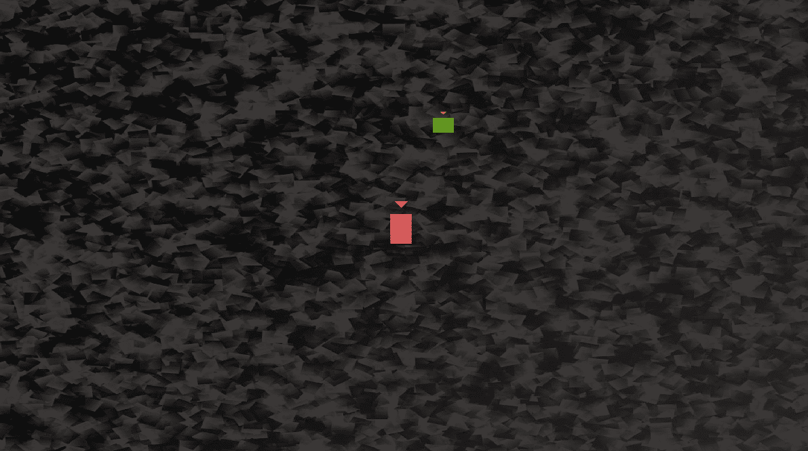

# 十五、高级 OOP——继承与多态

在本章中，我们将通过查看**继承**和**多态性**的稍微高级的概念来进一步扩展我们对 OOP 的了解。然后，我们将能够使用这些新知识来实现我们游戏中的明星人物，托马斯和鲍勃。以下是我们将在本章中介绍的内容:

*   了解如何使用继承来扩展和修改类
*   通过使用多态性，将类的对象视为不止一种类型的类
*   了解抽象类，以及设计从未实例化的类实际上有多有用
*   建立一个抽象的`PlayableCharacter`类
*   将继承用于`Thomas`和`Bob`类
*   将托马斯和鲍勃添加到游戏项目中

# 遗传

我们已经看到了如何通过实例化来自 SFML 图书馆的类的对象来利用其他人的辛勤工作。但是这整个面向对象的事情甚至比这更进一步。

如果有一个类中有很多有用的功能，但并不是我们想要的，该怎么办？在这种情况下，我们可以从另一个类**继承**。就像听起来的那样，**继承**意味着我们可以利用其他人的类的所有特性和好处，包括封装，同时进一步细化或扩展代码，使其专门适合我们的情况。在这个项目中，我们将继承和扩展一些 SFML 类；我们也会在自己的课堂上这样做。

让我们看一些使用继承的代码。

## 扩展一个类

考虑到所有这些，让我们看一个示例类，看看我们如何扩展它，只看语法，作为第一步。

首先，我们定义一个要继承的类。这与我们创建任何其他类的方式没有什么不同。看一下这个假设的`Soldier`类声明:

```cpp
class Soldier
{
    private:
        // How much damage can the soldier take
        int m_Health;
        int m_Armour;
        int m_Range;
        int m_ShotPower;

    Public:
        void setHealth(int h);
        void setArmour(int a);    
        void setRange(int r);
        void setShotPower(int p);
};
```

在前面的代码中，我们定义了一个`Soldier`类。它有四个私有变量:`m_Health`、`m_Armour`、`m_Range`和`m_ShotPower`。它还有四个公共功能:`setHealth`、`setArmour, setRange`和 `setShotPower`。我们不需要看到这些函数的定义；他们将简单地初始化适当的变量，这样他们的名字就显而易见了。

我们也可以想象一个完全实现的`Soldier`类会比这个深入得多。它可能会有`shoot`、`goProne`等功能。如果我们在 SFML 项目中实现了一个`Soldier`类，它可能会有一个`Sprite`对象，以及一个`update`和一个`getPostion`函数。

如果我们想了解继承，我们在这里介绍的简单场景是合适的。现在，让我们看看一些新的东西:从`Soldier`类继承。请看下面的代码，尤其是突出显示的部分:

```cpp
class Sniper : public Soldier
{
public:
    // A constructor specific to Sniper
    Sniper::Sniper();
};
```

通过在`Sniper`类声明中添加`: public Soldier`，`Sniper`继承自`Soldier`。但这到底意味着什么？`Sniper` **是一个** `Soldier`。它拥有`Soldier`的所有变量和功能。然而，继承甚至不止于此。

还要注意，在前面的代码中，我们声明了一个`Sniper`构造函数。这个构造器是`Sniper`独有的。我们不仅继承了`Soldier`；我们有**扩展** `Soldier`。`Soldier`类的所有功能(定义)将由`Soldier`类处理，但是`Sniper`构造函数的定义必须由`Sniper`类处理。

假设的`Sniper`构造函数定义可能是这样的:

```cpp
// In Sniper.cpp
Sniper::Sniper()
{
    setHealth(10);
    setArmour(10);    
    setRange(1000);
    setShotPower(100);
}
```

我们可以继续写一堆其他类，它们是`Soldier`类的扩展，也许是`Commando`和`Infantryman`。每一个都有完全相同的变量和函数，但是每一个都可以有一个唯一的构造函数来初始化那些适合于特定类型`Soldier`的变量。`Commando`可能有很高的`m_Health`和`m_ShotPower`，但真的微不足道`m_Range`。`Infantryman`可能介于`Commando`和`Sniper`之间，每个变量的值都一般。

好像 OOP 还不够有用，我们现在可以对现实世界的对象建模，包括它们的层次结构。我们可以通过子类化/扩展/继承其他类来实现这一点。

我们在这里可能要学习的术语是，从扩展而来的类是**超类**，从超类继承而来的类是**子类**。我们也可以说**家长**和**孩子**班。

小费

你可能会问自己这个关于继承的问题:为什么？原因大概是这样的:我们可以编写一次通用代码；在父类中，我们可以更新公共代码，并且从它继承的所有类也被更新。此外，子类只能使用公共的和**受保护的**实例变量和函数。因此，如果设计得当，这也增强了封装的目标。

你是说受保护吗？是的。有一个类变量和函数的访问说明符叫做**保护**。您可以将受保护变量视为介于公共变量和私有变量之间。下面是访问说明符的快速总结，以及关于`protected`说明符的更多细节:

*   `Public`任何拥有该类实例的人都可以访问和使用变量和函数。
*   `Private`变量和函数只能由类的内部代码访问/使用，不能直接从实例中访问/使用。这对于封装以及当我们需要访问/更改私有变量时是有好处的，因为我们可以提供公共的 getter 和 setter 函数(比如`getSprite`)。如果我们扩展一个有`private`变量和函数的类，子类**不能**直接访问其父类的私有数据。
*   `Protected`变量和函数几乎和 private 一样。类的实例不能直接访问/使用它们。然而，它们**可以被任何扩展了它们所声明的类的类直接使用。所以，这就像他们是私人的，除了给孩子上课。**

 **为了充分理解什么是受保护的变量和函数，以及它们如何有用，让我们先看另一个主题。然后，我们会看到他们在行动。

# 多态性

**多态性**允许我们编写更少依赖于我们试图操作的类型的代码。这可以使我们的代码更加清晰和高效。多态性意味着多种形式。如果我们编码的对象可以是多种类型的东西，那么我们可以利用这一点。

重要说明

但是多态性对我们意味着什么呢？归结为最简单的定义，多态性意味着:任何子类都可以被用作使用超类的代码的一部分。这意味着我们可以编写更简单、更容易理解、也更容易修改或更改的代码。此外，我们可以为超类编写代码，并依赖于这样一个事实，即无论它被子类化多少次，在某些参数内，代码仍然会工作。

我们来讨论一个例子。

假设我们想使用多态性来帮助编写一个动物园管理游戏，在这个游戏中，我们必须喂养和照顾动物的需求。我们可能会想要一个像`feed`这样的功能。我们可能还想把要喂养的动物的一个实例传递给`feed`函数。

当然，动物园里有很多动物，比如狮子、大象和三趾树懒。有了我们对 C++ 继承的新知识，编写一个`Animal`类并让所有不同类型的动物继承它是有意义的。

如果我们想写一个函数(`feed`)，我们可以将`Lion`、`Elephant`和`ThreeToedSloth`作为参数传入，似乎我们需要为每种类型的`Animal`写一个`feed`函数。然而，我们可以用多态返回类型和参数编写多态函数。看看下面假设的 feed 函数的定义:

```cpp
void feed(Animal& a)
{
    a.decreaseHunger();
}
```

前面的函数有一个`Animal`引用作为参数，这意味着从扩展`Animal`的类构建的任何对象都可以传递到其中。

这意味着您可以在今天编写代码，并在一周、一个月或一年内创建另一个子类，并且相同的函数和数据结构仍然可以工作。此外，我们可以对子类强制执行一组规则，关于它们可以做什么和不可以做什么，以及它们如何做。所以，一个阶段的好设计可以影响到其他阶段。

但是我们真的会想要实例化一个真实的动物吗？

# 抽象类——虚拟和纯虚拟函数

**抽象类**是一个不能实例化的类，因此不能成为对象。

小费

这里我们可能想了解的一些术语是*具体*类。一个**具体类**是任何不是抽象的类。换句话说，到目前为止，我们编写的所有类都是具体的类，可以实例化为可用的对象。

那么，这是永远不会被使用的代码？但这就像花钱请建筑师来设计你的房子，然后永远不要建造它！

如果我们，或者一个类的设计者，想强制它的用户在使用他们的类之前继承它，他们可以让一个类**抽象**。如果发生这种情况，我们就不能用它制造一个物体；因此，我们必须首先从它继承，并从子类中创建一个对象。

为此，我们可以制作一个函数**纯虚**，不提供任何定义。然后，该函数必须在继承它的任何类中被**覆盖** ( **重写**)。

我们来看一个例子；会有帮助的。我们可以通过添加抽象的`Animal`类这样的纯虚函数来做一个类抽象，只能执行`makeNoise`的泛型动作:

```cpp
Class Animal
    private:
        // Private stuff here
    public:
        void virtual makeNoise() = 0;
        // More public stuff here
};
```

如您所见，我们在函数声明之前添加了 C++ 关键字`virtual,` ，之后添加了`= 0`。现在，任何从`Animal`扩展/继承的类都必须覆盖`makeNoise` 函数。这可能是有道理的，因为不同类型的动物会发出非常不同的噪音。我们可以假设任何扩展`Animal`类的人都足够聪明，能够注意到`Animal`类不能发出声音，他们需要处理它，但是如果他们没有注意到呢？关键是通过制造一个纯虚函数，我们保证他们会，因为他们必须。

抽象类也很有用，因为有时候，我们想要一个可以用作多态类型的类，但是我们需要保证它永远不能用作对象。例如，`Animal`本身并没有真正的意义。我们不谈动物；我们谈论动物的种类。我们不会说，“哦，看看那个可爱的，毛茸茸的，白色的动物！”，或者，“昨天我们去宠物店买了一只动物和一张动物床。”太抽象了。

因此，抽象类有点像**模板**，任何扩展它的类都可以使用它(从它继承)。例如，如果我们正在构建一个玩家管理企业及其员工的*工业帝国*类型游戏，我们可能想要一个`Worker`类，并将其扩展为`Miner`、`Steelworker`、`OfficeWorker`，当然还有`Programmer`。但是普通的`Worker`到底是做什么的呢？为什么我们要实例化一个呢？

答案是，我们不想实例化一个，但我们可能想将其用作多态类型，这样我们就可以在函数之间传递多个`Worker`子类，并拥有可以容纳所有类型工作者的数据结构。

所有纯虚函数都必须被扩展包含纯虚函数的父类的任何类覆盖。这意味着抽象类可以提供一些在其所有子类中都可用的通用功能。例如，`Worker`类可能有`m_AnnualSalary`、`m_Productivity`和`m_Age`成员变量。它也可能有`getPayCheck`函数，它不是纯虚的，在所有子类中都是一样的，但是有一个`doWork`函数，它是纯虚的，必须被覆盖，因为所有不同类型的`Worker`将会有很大的不同。

重要说明

顺便说一下，**虚拟**相对于纯虚拟是一个可以被**随意覆盖的功能**。您可以用与纯虚函数相同的方式声明虚函数，但将`= 0`保留到最后。在目前的游戏项目中，我们将使用一个纯虚拟的功能。

如果这些虚拟的、纯虚拟的或抽象的东西不清楚，使用它可能是理解它的最好方法。

# 构建可玩角色类

既然我们已经知道了继承、多态和纯虚函数的基础，我们将使用它们。我们将建立一个`PlayableCharacter`类，它拥有我们游戏中任何角色都需要的大部分功能。它将有一个纯虚拟功能，称为`handleInput`。`handleInput`函数需要在子类中有很大的不同，所以这是有意义的。

由于`PlayableCharacter`将有一个纯虚函数，它将是一个抽象类，它的任何对象都是不可能的。然后我们将构建`Thomas`和`Bob`类，它们将从`PlayableCharacter`继承，实现纯虚拟函数的定义，并允许我们在游戏中实例化`Bob`和`Thomas`对象。直接实例化`PlayableCharacter`实例是不可能的，但是我们不想，因为它太抽象了。

## 编码可播放字符

像创建类时一样，我们将从包含成员变量和函数声明的头文件开始。新的是，在这个类中，我们将声明一些**受保护的**成员变量。请记住，在从具有受保护变量的类继承的类中，可以像使用公共变量一样使用受保护变量。

右键单击**解决方案资源管理器**中的**头文件**，选择**添加|新项目...**。在**添加新项目**窗口中，突出显示(通过左键单击)**头文件(。h)** 然后在**名称**字段中，输入`PlayableCharacter.h`。最后，点击**添加**按钮。我们现在准备为`PlayableCharacter`类编码头文件。

我们将分三节添加和讨论`PlayableCharacter.h`文件的内容。首先是`protected`段，然后是`private`，然后是`public`。

将以下代码添加到`PlayableCharacter.h`文件中:

```cpp
#pragma once
#include <SFML/Graphics.hpp>
using namespace sf;
class PlayableCharacter
{
protected:
    // Of course we will need a sprite
    Sprite m_Sprite;
    // How long does a jump last
    float m_JumpDuration;
    // Is character currently jumping or falling
    bool m_IsJumping;
    bool m_IsFalling;
    // Which directions is the character currently moving in
    bool m_LeftPressed;
    bool m_RightPressed;
    // How long has this jump lasted so far
    float m_TimeThisJump;
    // Has the player just initiated a jump
    bool m_JustJumped = false;
    // Private variables and functions come next
```

在我们刚刚写的代码中首先要注意的是所有的变量都是`protected`。这意味着，当我们从类继承时，我们刚刚编写的所有变量都可以被扩展它的类访问。我们将通过`Thomas`和`Bob`课程扩展该课程。

小费

术语*从*继承而来*延伸*在本书的大多数上下文中几乎是同义词。然而，有时一个似乎比另一个更合适。

除了`protected`访问规范，之前的代码没有什么新的或者复杂的。然而，值得注意的是一些细节。如果我们这样做了，随着我们的进步，就很容易理解这门课是如何运作的。所以，让我们一次一个地来分析这些`protected`变量。

我们有一些可预测的`Sprite`、`m_Sprite`。我们有一个名为`m_JumpDuration`的`float`变量，它将保存一个代表角色能够跳跃的时间的值。值越大，角色能够跳得越远/越高。

接下来，我们有一个布尔`m_IsJumping`，当角色跳跃时是`true`，否则是`false`。这将有助于确保角色在半空中不能跳跃。

`m_IsFalling`变量的用法与`m_IsJumping`相似。它将被用来知道一个角色何时倒下。

接下来，我们有两个布尔值，如果字符的左或右键盘按钮当前被按下，则这两个布尔值将为真。这些相对取决于角色( *A* 和 *D* 分别代表托马斯，*左*和*右*箭头键分别代表鲍勃)。我们如何回应这些布尔人将在`Thomas`和`Bob`课程中看到。

`m_TimeThisJump`浮动变量在`m_IsJumping`为`true`的每一帧更新。然后我们可以找出`m_JumpDuration`何时到达。

最后的`protected`变量是`m_JustJumped`布尔值。如果在当前帧中开始跳转，这将是`true`。它将被用来让我们知道什么时候播放跳跃音效。

接下来，将以下`private`变量添加到`PlayableCharacter.h`文件中:

```cpp
private:
    // What is the gravity
    float m_Gravity;
    // How fast is the character
    float m_Speed = 400;
    // Where is the player
    Vector2f m_Position;
    // Where are the characters various body parts?
    FloatRect m_Feet;
    FloatRect m_Head;
    FloatRect m_Right;
    FloatRect m_Left;
    // And a texture
    Texture m_Texture;
    // All our public functions will come next
```

在前面的代码中，我们有一些有趣的`private`变量。请记住，这些变量只能由`PlayableCharacter`类中的代码直接访问。`Thomas`和`Bob`类将无法直接访问它们。

`m_Gravity`变量将保存字符每秒下降的像素数。`m_Speed`变量将保存字符每秒可以向左或向右移动的像素数。

`Vector2f`、`m_Position`变量是世界上(不是屏幕上)角色中心所在的位置。

接下来要讨论的四个`FloatRect`对象很重要。当我们在*僵尸竞技场*游戏中进行碰撞检测时，我们只是检查两个`FloatRect`物体是否相交。每个`FloatRect`物体代表一个完整的角色、一辆皮卡或一颗子弹。对于非矩形物体(僵尸和玩家)，这有点不准确。

在这场比赛中，我们需要更加精确。`m_Feet`、`m_Head`、`m_Right`、`m_Left`和`FloatRect`对象将保存角色身体不同部分的坐标。这些坐标将在每帧更新。

通过这些坐标，我们将能够准确地判断一个角色何时降落在平台上，何时在跳跃过程中撞到他们的头，何时用瓷砖擦肩膀。

最后，我们有一个`Texture`。`Texture`是`private`，因为它不被`Thomas`或`Bob`班级直接使用。但是我们看到`Sprite`是`protected`因为是直接使用的。

现在，将所有`public`功能添加到`PlayableCharacter.h`文件中。然后，我们将讨论它们:

```cpp
public:
    void spawn(Vector2f startPosition, float gravity);
    // This is a pure virtual function
    bool virtual handleInput() = 0;
    // This class is now abstract and cannot be instantiated
    // Where is the player
    FloatRect getPosition();
    // A rectangle representing the position 
    // of different parts of the sprite
    FloatRect getFeet();
    FloatRect getHead();
    FloatRect getRight();
    FloatRect getLeft();
    // Send a copy of the sprite to main
    Sprite getSprite();
    // Make the character stand firm
    void stopFalling(float position);
    void stopRight(float position);
    void stopLeft(float position);
    void stopJump();
    // Where is the center of the character
    Vector2f getCenter();
    // We will call this function once every frame
    void update(float elapsedTime);

};// End of the class
```

让我们来谈谈我们刚刚添加的每个函数声明。这将使编码定义更容易理解:

*   `spawn`函数接收一个名为`startPosition`的`Vector2f`和一个名为`gravity`的`float`值。顾名思义，`startPosition`将是角色开始时所在级别的坐标，`gravity`将是角色每秒倒下的像素数。
*   `bool virtual handleInput() = 0`当然是我们的纯虚函数。由于`PlayableCharacter`有这个函数，任何扩展它的类，如果我们想实例化它，必须为这个函数提供一个定义。所以，当我们一分钟写完`PlayableCharacter`的所有函数定义时，我们不会提供`handleInput`的定义。在`Thomas`和`Bob`两个等级中都需要有定义。
*   `getPosition`函数返回一个代表整个字符位置的`FloatRect`对象。
*   `getFeet()`功能以及`getHead`、`getRight`和`getLeft`返回一个表示角色身体特定部位位置的`FloatRect`对象。这正是我们进行详细碰撞检测所需要的。
*   像往常一样，`getSprite`函数向调用代码返回一份`m_Sprite`的副本。
*   `stopFalling`、`stopRight`、`stopLeft`和`stopJump`函数接收单个`float`值，该函数将使用该值来重新定位角色，并阻止其在实心瓷砖中行走或跳跃。
*   `getCenter`函数向调用代码返回一个`Vector2f`对象，让它知道字符的中心到底在哪里。该值保存在`m_Position`中。正如我们将在后面看到的，它被`Engine`类用来将适当的`View`集中在适当的角色周围。
*   我们之前已经多次看到`update`函数，像往常一样，它采用一个`float`参数，这是当前帧所用的几分之一秒。然而，这个`update`功能将需要比之前的`update`功能(来自我们的其他项目)做更多的工作。它将需要处理跳跃以及更新`FloatRect`对象，这些对象代表角色的头部、脚部以及左侧和右侧。

现在，我们可以为所有函数编写定义，当然除了`handleInput`。

## 编码可播放字符

右键单击**解决方案资源管理器**中的**源文件**，并选择**添加|新项目...**。在**添加新项目**窗口中，突出显示(通过左键单击) **C++ 文件(。cpp)** 然后，在**名称**字段中，键入`PlayableCharacter.cpp`。最后，点击**添加**按钮。我们现在准备为`PlayableCharacter`类编码`.cpp`文件。

我们将分解代码并分成几大块讨论。首先，添加包含指令和`spawn`函数的定义:

```cpp
#include "PlayableCharacter.h"
void PlayableCharacter::spawn(
        Vector2f startPosition, float gravity)
{
    // Place the player at the starting point
    m_Position.x = startPosition.x;
    m_Position.y = startPosition.y;
    // Initialize the gravity
    m_Gravity = gravity;
    // Move the sprite in to position
    m_Sprite.setPosition(m_Position);
}
```

`spawn`功能用传入的位置初始化`m_Position`，同时也初始化`m_Gravity`。最后一行代码将`m_Sprite`移动到其起始位置。

接下来，在前一个代码之后立即添加`update`函数的定义:

```cpp
void PlayableCharacter::update(float elapsedTime)
{
    if (m_RightPressed)
    {
        m_Position.x += m_Speed * elapsedTime;
    }
    if (m_LeftPressed)
    {
        m_Position.x -= m_Speed * elapsedTime;
    }
    // Handle Jumping
    if (m_IsJumping)
    {
        // Update how long the jump has been going
        m_TimeThisJump += elapsedTime;
        // Is the jump going upwards
        if (m_TimeThisJump < m_JumpDuration)
        {
            // Move up at twice gravity
            m_Position.y -= m_Gravity * 2 * elapsedTime;
        }
        else
        {
            m_IsJumping = false;
            m_IsFalling = true;
        }
    }
    // Apply gravity
    if (m_IsFalling)
    {
        m_Position.y += m_Gravity * elapsedTime;
    }
    // Update the rect for all body parts
    FloatRect r = getPosition();

    // Feet
    m_Feet.left = r.left + 3;
    m_Feet.top = r.top + r.height - 1;
    m_Feet.width = r.width - 6;
    m_Feet.height = 1;
    // Head
    m_Head.left = r.left;
    m_Head.top = r.top + (r.height * .3);
    m_Head.width = r.width;
    m_Head.height = 1;
    // Right
    m_Right.left = r.left + r.width - 2;
    m_Right.top = r.top + r.height * .35;
    m_Right.width = 1;
    m_Right.height = r.height * .3;
    // Left
    m_Left.left = r.left;
    m_Left.top = r.top + r.height * .5;
    m_Left.width = 1;
    m_Left.height = r.height * .3;
    // Move the sprite into position
    m_Sprite.setPosition(m_Position);
}
```

代码的前两部分检查`m_RightPressed`或`m_LeftPressed`是否为`true`。如果两者都是，则`m_Position`使用与前一项目相同的公式(经过时间乘以速度)进行更改。

接下来，我们看看角色当前是否正在执行跳转。我们从`if(m_IsJumping)`就知道这一点。如果这个`if`语句是`true`，这些是代码要采取的步骤:

1.  用`elapsedTime`更新`m_TimeThisJump`。
2.  检查`m_TimeThisJump`是否仍小于`m_JumpDuration`。如果是，则通过 2x 重力乘以经过的时间来改变`m_Position`的 y 坐标。
3.  在`m_TimeThisJump`不低于`m_JumpDuration`时执行的`else`条款中，`m_Falling`设置为`true`。接下来将会看到这样做的效果。另外，`m_Jumping`设置为`false`。这阻止了我们刚刚讨论的代码执行，因为`if(m_IsJumping)`现在是假的。

`if(m_IsFalling)`块向下移动`m_Position`每帧。使用`m_Gravity`的当前值和经过的时间移动它。

接下来的代码(剩余代码的大部分)相对于整个精灵的当前位置更新了角色的“身体部分”。请看下图，了解代码如何计算角色的虚拟头、脚以及左侧和右侧的位置:


最后一行代码使用`setPosition`功能，在完成`update`功能的所有可能性后，将精灵移动到正确的位置。

现在，在前一个代码之后立即添加`getPosition`、`getCenter`、`getFeet`、`getHead`、`getLeft`、`getRight`和`getSprite`功能的定义:

```cpp
FloatRect PlayableCharacter::getPosition()
{
    return m_Sprite.getGlobalBounds();
}
Vector2f PlayableCharacter::getCenter()
{
    return Vector2f(
        m_Position.x + m_Sprite.getGlobalBounds().width / 2,
        m_Position.y + m_Sprite.getGlobalBounds().height / 2
        );
}
FloatRect PlayableCharacter::getFeet()
{
    return m_Feet;
}
FloatRect PlayableCharacter::getHead()
{
    return m_Head;
}
FloatRect PlayableCharacter::getLeft()
{
    return m_Left;
}
FloatRect PlayableCharacter::getRight()
{
    return m_Right;
}
Sprite PlayableCharacter::getSprite()
{
    return m_Sprite;
}
```

`getPosition`函数返回一个包裹整个精灵的`FloatRect`，而`getCenter`返回一个包含精灵中心的`Vector2f`。请注意，我们将精灵的高度和宽度除以 2，以便动态地得出这个结果。这是因为托马斯和鲍勃会有不同的高度。

`getFeet`、`getHead`、`getLeft`和`getRight`函数返回`FloatRect`对象，这些对象代表我们在`update`函数中每帧更新的角色的身体部分。我们将在下一章中编写使用这些函数的冲突检测代码。

`getSprite`功能像往常一样，返回`m_Sprite`的副本。

最后，对于`PlayableCharacter`类，添加`stopFalling`、`stopRight`、`stopLeft`和`stopJump`函数的定义。在上一个代码之后立即执行此操作:

```cpp
void PlayableCharacter::stopFalling(float position)
{
    m_Position.y = position - getPosition().height;
    m_Sprite.setPosition(m_Position);
    m_IsFalling = false;
}
void PlayableCharacter::stopRight(float position)
{

    m_Position.x = position - m_Sprite.getGlobalBounds().width;
    m_Sprite.setPosition(m_Position);
}
void PlayableCharacter::stopLeft(float position)
{
    m_Position.x = position + m_Sprite.getGlobalBounds().width;
    m_Sprite.setPosition(m_Position);
}
void PlayableCharacter::stopJump()
{
    // Stop a jump early 
    m_IsJumping = false;
    m_IsFalling = true;
}
```

前面的每个函数都接收一个值作为参数，用于重新定位子画面的顶部、底部、左侧或右侧。确切的这些值是什么以及它们是如何获得的将是下一章的内容。前面的每个功能也重新定位了精灵。

最后一个功能是`stopJump`功能，也将用于碰撞检测。它为`m_IsJumping`和`m_IsFalling`设置必要的值来结束跳跃。

# 建立托马斯和鲍勃班

现在，我们可以真正使用继承。我们将为托马斯建一个班，为鲍勃建一个班。它们都将继承我们刚刚编码的`PlayableCharacter`类。然后他们将拥有`PlayableCharacter`类的所有功能，包括直接访问其`protected`变量。我们还将添加纯虚函数`handleInput`的定义。您会注意到`Thomas`和`Bob`的`handleInput`功能会有所不同。

## 编码托马斯

右键单击**解决方案资源管理器**中的**头文件**，选择**添加|新项目...**。在**添加新项目**窗口中，突出显示(通过左键单击)**头文件(。h)** 然后在**名称**字段中，输入`Thomas.h`。最后，点击**添加**按钮。我们现在准备为`Thomas`类编码头文件。

将以下代码添加到`Thomas.h`类中:

```cpp
#pragma once
#include "PlayableCharacter.h"
class Thomas : public PlayableCharacter
{
public:
    // A constructor specific to Thomas
    Thomas::Thomas();
    // The overridden input handler for Thomas
    bool virtual handleInput();
};
```

前面的代码很短很甜。我们可以看到我们有一个构造函数，我们要实现纯虚拟的`handleInput`函数。所以，我们现在就开始吧。

## 编码 Thomas.cpp

右键单击**解决方案资源管理器**中的**源文件**，并选择**添加|新项目...**。在**添加新项目**窗口中，突出显示(通过左键单击) **C++ 文件(。cpp)** 然后，在**名称**字段中，键入`Thomas.cpp`。最后，点击**添加**按钮。我们现在准备为`Thomas`类编码`.cpp`文件。

将`Thomas`构造函数添加到`Thomas.cpp`文件，如下所示:

```cpp
#include "Thomas.h"
#include "TextureHolder.h"
Thomas::Thomas()
{
    // Associate a texture with the sprite
    m_Sprite = Sprite(TextureHolder::GetTexture(
        "graphics/thomas.png"));
    m_JumpDuration = .45;
}
```

我们所需要做的就是加载`thomas.png`图形并将跳转的持续时间(`m_JumpDuration`)设置为。`45` (将近半秒)。

添加`handleInput`函数的定义如下:

```cpp
// A virtual function
bool Thomas::handleInput()
{
    m_JustJumped = false;
    if (Keyboard::isKeyPressed(Keyboard::W))
    {
        // Start a jump if not already jumping
        // but only if standing on a block (not falling)
        if (!m_IsJumping && !m_IsFalling)
        {
            m_IsJumping = true;
            m_TimeThisJump = 0;
            m_JustJumped = true;
        }
    }
    else
    {
        m_IsJumping = false;
        m_IsFalling = true;
    }
    if (Keyboard::isKeyPressed(Keyboard::A))
    {
        m_LeftPressed = true;
    }
    else
    {
        m_LeftPressed = false;
    }
    if (Keyboard::isKeyPressed(Keyboard::D))
    {
        m_RightPressed = true;
    }
    else
    {
        m_RightPressed = false;
    }
    return m_JustJumped;
}
```

这段代码看起来应该很熟悉。我们正在使用 SFML `isKeyPressed`功能查看是否有任何 *W* 、 *A* 或 *D* 键被按下。

当按下 *W* 时，玩家试图跳跃。然后，该代码使用`if(!m_IsJumping && !m_IsFalling)`代码来检查字符是否已经跳跃，也没有下落。当这些测试都为真时，`m_IsJumping`设置为`true`，`m_TimeThisJump`设置为 0，`m_JustJumped`设置为`true`。

前两次测试评估不到`true`时，执行`else`子句，`m_Jumping`设置为`false`，`m_IsFalling`设置为真。

处理如何按下 *A* 和 *D* 键，就像将`m_LeftPressed`和/或`m_RightPressed`设置为`true`或 `false`一样简单。`update`功能现在可以处理移动角色。

函数的最后一行代码返回`m_JustJumped`的值。这将让调用代码知道它是否需要播放跳跃音效。

我们现在将对`Bob`类进行编码。它几乎和`Thomas`类一模一样，只是跳跃能力不同和`Texture`不同，键盘上使用的按键也不同。

## 编码鲍勃

`Bob`类在结构上与`Thomas`类相同。它继承了`PlayableCharacter`，它有一个构造函数，它提供了`handleInput`函数的定义。与`Thomas`的不同之处在于，我们初始化鲍勃的一些成员变量的方式不同，我们处理输入(在`handleInput`函数中)的方式也不同。让我们对类进行编码，并查看细节。

右键单击**解决方案资源管理器**中的**头文件**，选择**添加|新项目...**。在**添加新项目**窗口中，突出显示(通过左键单击)**头文件(。h)** 然后在**名称**字段中，输入`Bob.h`。最后，点击**添加**按钮。我们现在准备为`Bob`类编码头文件。

将以下代码添加到`Bob.h`文件中:

```cpp
#pragma once
#include "PlayableCharacter.h"
class Bob : public PlayableCharacter
{
public:
    // A constructor specific to Bob
    Bob::Bob();
    // The overriden input handler for Bob
    bool virtual handleInput();
};
```

除了类名和构造函数名之外，前面的代码与`Thomas.h`文件相同。

## 编码 Bob.cpp

右键单击**解决方案资源管理器**中的**源文件**，并选择**添加|新项目...**。在**添加新项目**窗口中，突出显示(通过左键单击) **C++ 文件(。cpp)** 然后，在**名称**字段中，键入`Bob.cpp`。最后，点击**添加**按钮。我们现在准备为`Bob`类编码`.cpp`文件。

将`Bob`构造函数的以下代码添加到`Bob.cpp`文件中。请注意，纹理是不同的(`bob.png`),并且`m_JumpDuration`被初始化为一个明显更小的值。鲍勃现在是他自己独特的自己:

```cpp
#include "Bob.h"
#include "TextureHolder.h"
Bob::Bob()
{
    // Associate a texture with the sprite
    m_Sprite = Sprite(TextureHolder::GetTexture(
        "graphics/bob.png"));
    m_JumpDuration = .25;
}
```

在`Bob`构造函数后立即添加`handleInput`代码:

```cpp
bool Bob::handleInput()
{
    m_JustJumped = false;
    if (Keyboard::isKeyPressed(Keyboard::Up))
    {
        // Start a jump if not already jumping
        // but only if standing on a block (not falling)
        if (!m_IsJumping && !m_IsFalling)
        {
            m_IsJumping = true;
            m_TimeThisJump = 0;
            m_JustJumped = true;
        }
    }
    else
    {
        m_IsJumping = false;
        m_IsFalling = true;
    }
    if (Keyboard::isKeyPressed(Keyboard::Left))
    {
        m_LeftPressed = true;
    }
    else
    {
        m_LeftPressed = false;
    }
    if (Keyboard::isKeyPressed(Keyboard::Right))
    {
        m_RightPressed = true;;
    }
    else
    {
        m_RightPressed = false;
    }
    return m_JustJumped;
}
```

请注意，该代码与`Thomas`类的`handleInput`函数中的代码几乎相同。唯一不同的是，我们对不同的键(分别是左右移动的*左*箭头键和*右*箭头键，跳跃的*上*箭头键)做出反应。

现在我们有了一个被`Bob`和`Thomas`类扩展的`PlayableCharacter`类，我们可以在游戏中添加一个`Bob`和一个`Thomas`实例。

# 更新游戏引擎使用托马斯和鲍勃

为了能够运行游戏并看到我们的新角色，我们必须声明它们的实例，调用它们的`spawn`函数，每帧更新它们，每帧绘制它们。我们现在就开始吧。

## 更新 Engine.h 以添加鲍勃和托马斯的实例

打开`Engine.h`文件，添加以下高亮显示的代码行:

```cpp
#pragma once
#include <SFML/Graphics.hpp>
#include "TextureHolder.h"
#include "Thomas.h"
#include "Bob.h"
using namespace sf;
class Engine
{
private:
    // The texture holder
    TextureHolder th;
    // Thomas and his friend, Bob
    Thomas m_Thomas;
    Bob m_Bob;
    const int TILE_SIZE = 50;
    const int VERTS_IN_QUAD = 4;
    ...
    ...
```

现在，我们有一个源自`PlayableCharacter`的`Thomas`和`Bob`的实例。

## 更新输入功能以控制托马斯和鲍勃

现在，我们将添加控制这两个角色的能力。该代码将进入代码的输入部分。当然，对于这个项目，我们有专门的`input`功能。打开`Input.cpp`并添加以下高亮显示的代码:

```cpp
void Engine::input()
{
    Event event;
    while (m_Window.pollEvent(event))
    {
        if (event.type == Event::KeyPressed)
        {
            // Handle the player quitting
            if (Keyboard::isKeyPressed(Keyboard::Escape))
            {
                m_Window.close();
            }
            // Handle the player starting the game
            if (Keyboard::isKeyPressed(Keyboard::Return))
            {
                m_Playing = true;
            }
            // Switch between Thomas and Bob
            if (Keyboard::isKeyPressed(Keyboard::Q))
            {
                m_Character1 = !m_Character1;
            }
            // Switch between full and split-screen
            if (Keyboard::isKeyPressed(Keyboard::E))
            {
                m_SplitScreen = !m_SplitScreen;
            }
        }
    }
    // Handle input specific to Thomas
    if(m_Thomas.handleInput())
    {
        // Play a jump sound
    }
    // Handle input specific to Bob
    if(m_Bob.handleInput())
    {
        // Play a jump sound
    }
}
```

注意前面的代码有多简单:所有的功能都包含在`Thomas`和`Bob`类中。所有代码必须做的就是为每个`Thomas`和`Bob`类添加一个 include 指令。然后，在`input`函数内，代码只调用`m_Thomas`和`m_Bob`上的纯虚`handleInput`函数。我们将每个调用包装在`if`语句中的原因是，它们会根据新的跳转是否刚刚成功启动而返回`true`或`false`。我们将在 [*第 17 章*](17.html#_idTextAnchor340)*声音空间化和 HUD* 中处理跳跃声音效果的播放。

## 更新更新功能以产生和更新可播放角色实例

这分为两部分。首先，我们需要在一个新的级别开始时产生鲍勃和托马斯，其次，我们需要每帧更新他们(通过调用他们的`update`函数)。

### 催生托马斯和鲍勃

随着项目的进展，我们需要在几个不同的地方调用我们的`Thomas`和`Bob`对象的`spawn`函数。最明显的是，我们需要在新的关卡开始时衍生出这两个角色。在下一章中，随着我们在一个关卡开始时需要执行的任务数量的增加，我们将编写一个`loadLevel`函数。现在，让我们在`update`功能中调用`m_Thomas`和`m_Bob`上的`spawn`，如下面的代码所示。添加以下代码，但请记住，它最终会被删除和替换:

```cpp
void Engine::update(float dtAsSeconds)
{
    if (m_NewLevelRequired)
    {
        // These calls to spawn will be moved to a new
        // loadLevel() function soon
        // Spawn Thomas and Bob
        m_Thomas.spawn(Vector2f(0,0), GRAVITY);
        m_Bob.spawn(Vector2f(100, 0), GRAVITY);
        // Make sure spawn is called only once
        m_TimeRemaining = 10;
        m_NewLevelRequired = false;
    }
    if (m_Playing)
    {
        // Count down the time the player has left
        m_TimeRemaining -= dtAsSeconds;
        // Have Thomas and Bob run out of time?
        if (m_TimeRemaining <= 0)
        {
            m_NewLevelRequired = true;
        }
    }// End if playing

}
```

之前的代码只是简单的调用`spawn`并和重力一起通过游戏世界中的一个位置。代码被包装在`if`语句中，该语句检查是否需要新的级别。产卵代码将被移动到专用的`loadLevel`功能，但是`if`条件将是已完成项目的一部分。另外，`m_TimeRemaining`现在被设置为任意 10 秒。

现在，我们可以在游戏循环的每一帧更新实例。

### 每帧更新托马斯和鲍勃

接下来，我们将更新托马斯和鲍勃。我们所需要做的就是调用它们的`update`函数，并传递这个帧所花费的时间。

添加以下突出显示的代码:

```cpp
void Engine::update(float dtAsSeconds)
{
    if (m_NewLevelRequired)
    {
        // These calls to spawn will be moved to a new
        // LoadLevel function soon
        // Spawn Thomas and Bob
        m_Thomas.spawn(Vector2f(0,0), GRAVITY);
        m_Bob.spawn(Vector2f(100, 0), GRAVITY);
        // Make sure spawn is called only once
        m_NewLevelRequired = false;
    }
    if (m_Playing)
    {
        // Update Thomas
        m_Thomas.update(dtAsSeconds);
        // Update Bob
        m_Bob.update(dtAsSeconds);
        // Count down the time the player has left
        m_TimeRemaining -= dtAsSeconds;
        // Have Thomas and Bob run out of time?
        if (m_TimeRemaining <= 0)
        {
            m_NewLevelRequired = true;
        }
    }// End if playing

}
```

现在角色可以移动了，我们需要更新合适的`View`对象，以角色为中心，让他们成为关注的中心。当然，在我们的游戏世界中没有一些物体之前，实际运动的感觉是不会达到的。

添加以下突出显示的代码:

```cpp
void Engine::update(float dtAsSeconds)
{
    if (m_NewLevelRequired)
    {
        // These calls to spawn will be moved to a new
        // LoadLevel function soon
        // Spawn Thomas and Bob
        m_Thomas.spawn(Vector2f(0,0), GRAVITY);
        m_Bob.spawn(Vector2f(100, 0), GRAVITY);
        // Make sure spawn is called only once
        m_NewLevelRequired = false;
    }
    if (m_Playing)
    {
        // Update Thomas
        m_Thomas.update(dtAsSeconds);
        // Update Bob
        m_Bob.update(dtAsSeconds);
        // Count down the time the player has left
        m_TimeRemaining -= dtAsSeconds;
        // Have Thomas and Bob run out of time?
        if (m_TimeRemaining <= 0)
        {
            m_NewLevelRequired = true;
        }
    }// End if playing

    // Set the appropriate view around the appropriate character
    if (m_SplitScreen)
    {
        m_LeftView.setCenter(m_Thomas.getCenter());
        m_RightView.setCenter(m_Bob.getCenter());
    }
    else
    {
        // Centre full screen around appropriate character
        if (m_Character1)
        {
            m_MainView.setCenter(m_Thomas.getCenter());
        }
        else
        {
            m_MainView.setCenter(m_Bob.getCenter());
        }
    }
}
```

前面的代码处理了两种可能的情况。首先，`if(mSplitScreen)`条件将左侧视图定位在`m_Thomas`周围，右侧视图定位在`m_Bob`周围。当游戏处于全屏模式时执行的`else`子句测试`m_Character1`是否为`true`。如果是，则全屏视图(`m_MainView`)以托马斯为中心，否则以鲍勃为中心。你可能还记得，玩家可以用 *E* 键切换分屏模式，用 *Q* 键切换全屏模式下的鲍勃和托马斯。我们在`Engine`类的`input`功能中对此进行了编码，回到 [*第 12 章*](12.html#_idTextAnchor272)*分层视图和实现 HUD* 。

现在，我们可以在屏幕上绘制托马斯和鲍勃的图形。

## 画鲍勃和托马斯

确保`Draw.cpp`文件已打开，并添加以下高亮显示的代码:

```cpp
void Engine::draw()
{
    // Rub out the last frame
    m_Window.clear(Color::White);
    if (!m_SplitScreen)
    {
        // Switch to background view
        m_Window.setView(m_BGMainView);
        // Draw the background
        m_Window.draw(m_BackgroundSprite);
        // Switch to m_MainView
        m_Window.setView(m_MainView);        
        // Draw thomas
        m_Window.draw(m_Thomas.getSprite());
        // Draw bob
        m_Window.draw(m_Bob.getSprite());
    }
    else
    {
        // Split-screen view is active
        // First draw Thomas' side of the screen
        // Switch to background view
        m_Window.setView(m_BGLeftView);
        // Draw the background
        m_Window.draw(m_BackgroundSprite);
        // Switch to m_LeftView
        m_Window.setView(m_LeftView);
        // Draw bob
        m_Window.draw(m_Bob.getSprite());

        // Draw thomas
        m_Window.draw(m_Thomas.getSprite());

        // Now draw Bob's side of the screen
        // Switch to background view
        m_Window.setView(m_BGRightView);
        // Draw the background
        m_Window.draw(m_BackgroundSprite);
        // Switch to m_RightView
        m_Window.setView(m_RightView);
        // Draw thomas
        m_Window.draw(m_Thomas.getSprite());
        // Draw bob
        m_Window.draw(m_Bob.getSprite());

    }
    // Draw the HUD
    // Switch to m_HudView
    m_Window.setView(m_HudView);

    // Show everything we have just drawn
    m_Window.display();
}
```

请注意，我们为全屏幕、左和右绘制了托马斯和鲍勃。此外，请注意我们在分屏模式下绘制字符的方式的细微差别。在绘制屏幕左侧时，我们会切换绘制字符的顺序，并在鲍勃之后绘制托马斯。所以，托马斯永远在左边“顶上”，鲍勃永远在右边顶上。这是因为控制托马斯的玩家分别在左边和右边照顾鲍勃。

您现在可以运行游戏，并在屏幕中央看到托马斯和鲍勃，如下所示:


如果您按下 *Q* 键将焦点从托马斯切换到鲍勃，您将看到`View`进行轻微调整。如果你向左或向右移动角色(托马斯用 *A* 和 *D* ，鲍勃用箭头键)，你会看到他们相对于彼此移动。

试着按下 *E* 键在全屏和分屏之间切换。然后，再次尝试移动两个角色以查看效果。在下面的截图中，您可以看到 Thomas 总是位于左侧窗口的中心，Bob 总是位于右侧窗口的中心:


如果你让游戏运行足够长的时间，角色会每 10 秒钟在原来的位置重生一次。这是我们完成游戏所需功能的开始。该行为是由`m_TimeRemaining`低于 0，然后将`m_NewLevelRequired`变量设置为`true`引起的。

还要注意的是，在我们画出关卡的细节之前，我们无法看到运动的全部效果。事实上，虽然看不到，但两个字符都在以每秒 300 像素的速度连续下降。由于相机每一帧都以它们为中心，并且游戏世界中没有其他物体，因此我们无法看到这种向下的移动。

如果你想自己看这个，就把通话改到`m_Bob.spawn`，如下:

```cpp
m_Bob.spawn(Vector2f(0,0), 0);
```

既然鲍勃没有引力效应，托马斯显然会离他而去。这显示在下面的截图中:



我们会在下一章增加一些可玩的关卡进行互动。

# 总结

在本章中，我们学习了一些新的 C++ 概念，例如继承，它允许我们扩展一个类并获得它的所有功能。我们还了解到，我们可以将变量声明为受保护的，这将使子类能够访问它们，但是它们仍然会被封装(隐藏)在所有其他代码中。我们还使用了纯虚函数，这使得类变得抽象，这意味着类不能被实例化，因此必须从/扩展继承。我们也被介绍了多态性的概念，但是需要等到下一章才能在我们的游戏中使用它。

在下一章中，我们将为游戏添加一些主要功能。在下一章的结尾，托马斯和鲍勃将会行走、跳跃和下落。他们甚至能够跳到对方的头上，并探索从文本文件中加载的一些关卡设计。

# 常见问题

q)我们了解了多态，但是为什么到目前为止我没有注意到游戏代码中有任何多态的地方？

a)当我们编写一个以`PlayerCharacter`为参数的函数时，我们会在下一章看到多态性在起作用。我们将看看如何将鲍勃和托马斯传递给这个新函数。对他们俩来说都一样。**