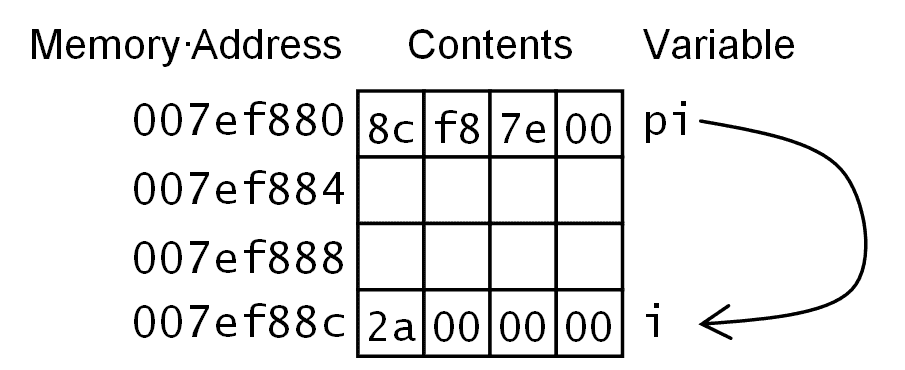

# 四、使用内存、数组和指针

C++ 允许您通过指针直接访问内存。 这为您提供了很大的灵活性，并且潜在地允许您通过消除一些不必要的数据复制来提高代码的性能。 但是，它也提供了额外的错误来源；有些错误对您的应用可能是致命的，甚至更糟(是的，比致命还糟糕！)。 因为内存缓冲区使用不当会在代码中打开安全漏洞，从而允许恶意软件接管机器。 显然，指针是 C++ 的一个重要方面。

在本章中，您将看到如何声明指针并将其初始化到内存位置，如何在堆栈和 C++ 空闲存储上分配内存，以及如何使用 C++ 数组。

# 在 C++ 中使用内存

C++ 使用与 C 相同的语法来声明指针变量并将其分配给内存地址，并且它具有类似于 C 的指针算法。 与 C 一样，C++ 也允许您在堆栈上分配内存，因此当堆栈帧被销毁时会自动清除内存，并且会进行动态分配(在 C++ 空闲存储上)，程序员有责任释放内存。 本节将介绍这些概念。

# 使用 C++ 指针语法

在 C++ 中访问内存的语法很简单。 运算符的作用是：返回对象的地址。 对象*可以是变量、内置类型或自定义类型的实例，甚至可以是函数(函数指针将在下一章介绍)。 该地址被分配一个类型化指针变量或一个`void*`指针。 应该将`void*`指针仅视为内存地址的存储，因为您不能访问数据，也不能在`void*`指针上执行指针算术(即，使用算术运算符操作指针值)。 指针变量通常使用类型和`*`符号声明。 例如：*

```cpp
    int i = 42; 
    int *pi = &i;
```

在这段代码中，变量`i`是一个整数，编译器和链接器将确定将该变量分配到哪里。 通常，函数中的变量将位于堆栈帧上，如后面部分所述。 在运行时，将创建堆栈(实质上将分配一大块内存)，并在堆栈内存中为变量`i`保留空间。 然后，程序将一个值(42)放入该存储器。 接下来，将分配给变量`i`的存储器地址放置在变量`pi`中。 上述代码的内存使用情况如下图所示：



指针保存的值为`0x007ef8c`(请注意，最低字节存储在内存中的最低字节中；这适用于 x86 机器)。 存储单元`0x007ef8c`具有值`0x0000002a`，即，变量`i`的值 42。 因为`pi`也是一个变量，所以它也会占用内存中的空间，在这种情况下，编译器将指针*放在内存中比它所指向的数据更低的位置*，在这种情况下，这两个变量不是连续的。

对于这样在堆栈上分配的变量，您不应该假设变量在内存中的位置，也不应该假设变量相对于其他变量的位置。

此代码假定为 32 位操作系统，因此指针`pi`占用 32 位并包含 32 位地址。 如果操作系统为 64 位，则指针将为 64 位宽(但整数可能仍为 32 位)。 在本书中，为了方便起见，我们将使用 32 位指针，因为 32 位地址比 64 位地址需要更少的打字时间。

类型化指针用`*`符号声明，我们将其称为`int*`指针，因为该指针指向保存`int`的内存。 声明指针时，惯例是将`*`放在变量名旁边，而不是类型旁边。 此语法强调指向的*类型是`int`。 但是，如果在一条语句中声明多个变量，使用此语法非常重要：*

```cpp
    int *pi, i;
```

很明显，第一个变量是`int*`指针，第二个变量是`int`。 以下几点不太清楚：

```cpp
    int* pi, i;
```

您可能会将其解释为两个变量的类型都是`int*`和*，但事实并非如此*，因为它声明了一个指针和一个`int`。 如果要声明两个指针，则对每个变量应用`*`：

```cpp
    int *p1, *p2;
```

在单独的行上声明这两个指针可能更好。

当您将`sizeof`运算符应用于指针时，您将获得指针的大小，而不是它所指向的大小。 因此，在 x86 机器上，`sizeof(int*)`将返回 4；在 x64 机器上，它将返回 8。这是一个重要的观察结果，特别是当我们在后面的部分讨论 C++ 内置数组时。

要访问指针指向的数据，必须使用`*`运算符**取消引用**它：

```cpp
    int i = 42; 
    int *pi = &i; 
    int j = *pi;
```

在赋值的右侧类似这样使用，取消引用的指针提供对指针指向的值的访问，因此`j`被初始化为 42。 将其与指针声明进行比较，在指针声明中也使用了`*`符号，但含义不同。

取消引用操作符不仅仅提供对内存位置上的数据的读取访问权限。 只要指针不限制它(使用*`const`关键字；请参见后面)，您也可以取消引用指针以写入内存位置：

```cpp
    int i = 42; 
    cout << i << endl; 
    int *pi { &i }; 
    *pi = 99; 
    cout << i << endl;
```

在此代码中，指针`pi`指向变量`i`在内存中的位置(在本例中，使用花括号语法)。 分配解除引用的指针会将值分配给指针所指向的位置。 结果是，在最后一行，变量`i`的值将是 99，而不是 42。

# 使用空指针

指针可以指向计算机中安装的内存中的任何位置，通过取消引用的指针进行赋值意味着您可能会覆盖操作系统使用的敏感内存，或者(通过直接内存访问)写入计算机上的硬件使用的内存。 但是，操作系统通常会为可执行文件提供其可以访问的特定内存范围，尝试访问超出此范围的内存将导致操作系统内存访问冲突。

因此，您几乎总是应该使用`&`运算符或通过调用操作系统函数来获取指针值。 您不应该为指针提供绝对地址。 唯一的例外是无效内存地址`nullptr`的 C++ 常量：

```cpp
    int *pi = nullptr; 
    // code 
    int i = 42; 
    pi = &i; 
    // code 
    if (nullptr != pi) cout << *pi << endl;
```

此代码将指针`pi`初始化为`nullptr`。 在代码的后面，指针被初始化为整数变量的地址。 在代码的后面，将使用指针，但不是立即调用它，而是首先检查指针以确保它已被初始化为非空值。 编译器将检查您是否要使用尚未初始化的变量，但如果您正在编写库代码，编译器将不知道代码的调用者是否会正确使用指针。

The type of constant `nullptr` is not an integer, it is `std::nullptr_t`. All pointer types can be implicitly converted to this type, so `nullptr` can be used to initialize variables of all pointer types.

# 内存类型

一般来说，您可以将内存视为以下四种类型之一：

*   静态或全局
*   字符串池
*   自动或堆叠
*   免费商店

当您在全局级别声明变量时，或者如果您在函数中声明变量为`static`，那么编译器将确保变量是从与应用具有相同生存期的内存中分配的--该变量在应用启动时创建，在应用结束时删除。

当您使用字符串文字时，数据实际上也将是一个全局变量，但存储在可执行文件的不同部分。 对于 Windows 可执行文件，字符串文字存储在可执行文件的`.rdata`PE/COFF 部分。 文件的`.rdata`部分用于只读的初始化数据，因此您不能更改数据。 Visual C++ 允许您更进一步，并为您提供了**字符串池**选项。 请考虑以下内容：

```cpp
    char *p1 { "hello" }; 
    char *p2 { "hello" }; 
    cout << hex; 
    cout << reinterpret_cast<int>(p1) << endl; 
    cout << reinterpret_cast<int>(p2) << endl;
```

在此代码中，使用字符串文本`hello`的地址初始化了两个指针。 在以下两行中，每个指针的地址都打印在控制台上。 由于`char*`的`<<`运算符将变量视为指向字符串的指针，因此它将打印字符串而不是指针的地址。 要解决此问题，我们调用`reinterpret_cast`运算符将指针转换为整数并打印该整数的值。
如果您使用 Visual C++ 编译器在命令行编译代码，您将看到打印出两个不同的地址。 这两个地址位于`.rdata`部分，均为只读。 如果使用`/GF`开关编译此代码以启用字符串池(这是 Visual C++ 项目的默认设置)，编译器将看到两个字符串文字相同，并且只会在`.rdata`部分存储一个副本，因此此代码的结果将是在控制台上打印两次单个地址。

在这段代码中，两个变量`p1`和`p2`是自动变量，也就是说，它们是在为当前函数创建的堆栈上创建的。 调用函数时，会为函数分配一块内存，其中包含传递给函数的参数和调用函数的代码的返回地址的空间，以及函数中声明的自动变量的空间。 当函数完成时，堆栈帧将被销毁。

The **calling convention** of the function determines whether the calling function or the called function has the responsibility to do this. In Visual C++, the default is the `__cdecl` calling convention, which means the calling function cleans up the stack. The `__stdcall` calling convention is used by Windows operating system functions and the stack clean up is carried out by the called function. More details will be given in the next chapter.

自动变量只有在函数和此类变量的地址仅在函数内有意义时才有效。 在本章的后面部分，您将看到如何创建数据数组。 分配为自动变量的数组在堆栈上分配为编译时确定的固定大小。 对于大型数组，您可能会超出堆栈的大小，特别是对于递归调用的函数。 在 Windows 上，默认堆栈大小为 1 MB，在 x86 Linux 上，默认堆栈大小为 2 MB。 Visual C++ 允许您使用`/F`编译器开关(或`/STACK`链接器开关)指定更大的堆栈。 GCC 编译器允许您使用`--stack`开关更改默认堆栈大小。

最后一种内存类型是在**空闲存储**上创建的**动态内存**，有时也称为**堆**。 这是使用内存的最灵活方式。 顾名思义，您可以在运行时分配在运行时确定的大小的内存。 空闲存储区的实现取决于 C++ 实现，但您应该将空闲存储区视为与应用具有相同的生存期，因此从空闲存储区分配的内存应该至少与您的应用一样长。

然而，这里存在潜在的危险，特别是对于长期使用的应用。 从空闲存储区分配的所有内存在您使用完后都应该返回到空闲存储区，以便空闲存储区管理器可以重用该内存。 如果没有适当地返回内存，则空闲存储管理器可能会耗尽内存，这将提示它向操作系统请求更多内存，因此，应用的内存使用量将随着时间的推移而增加，从而由于内存分页而导致性能问题。

# 指针运算

指针指向内存，指针的类型确定可以通过指针访问的数据的类型。 因此，`int*`指针将指向内存中的一个整数，您可以取消引用该指针(`*`)以获得该整数。 如果指针允许(未标记为`const`)，则可以通过指针算法更改其值。 例如，您可以递增或递减指针。 内存地址值的变化取决于指针的类型。 由于类型化指针指向一个类型，因此任何指针算法都将以该类型的*大小*为单位更改指针。

如果递增`int*`指针，它将指向内存中下一个*个*整数，内存地址的变化取决于该整数的大小。 这相当于数组索引，例如`v[1]`这样的表达式表示您应该从`v`中第一个项目的内存位置开始，然后在内存中进一步移动一个项目，并将该项目返回到那里：

```cpp
    int v[] { 1, 2, 3, 4, 5 };
    int *pv = v;
    *pv = 11;
    v[1] = 12;
    pv[2] = 13;
    *(pv + 3) = 14;
```

第一行在堆栈上分配一个由五个整数组成的数组，并将这些值初始化为数字 1 到 5。在本例中，因为使用了初始化列表，所以编译器将为所需的项数创建空间，因此没有给出数组的大小。 如果给出方括号之间的数组大小，则初始化列表的项不能多于数组大小。 如果列表中的项较少，则数组中的其余项将初始化为默认值(通常为零)。

此代码中的下一行获取指向数组中第一项的指针。 这一行很重要：数组名称被视为指向数组中第一项的指针。 以下几行以各种方式更改数组项。 其中第一个(`*pv`)通过取消引用指针并为其赋值来更改数组中的第一项。 第二个(`v[1]`)使用数组索引为数组中的第二项赋值。 第三个(`pv[2]`)使用索引，但这次使用指针，并为数组中的第三个值赋值。 最后一个示例(`*(pv + 3)`)使用指针算法来确定数组中第四项的地址(请记住，第一项的索引为 0)，然后取消对指针的引用，为该项赋值。 之后，数组包含值`{ 11, 12, 13, 14, 5 }`，内存布局如下所示：


如果您有一个包含值的内存缓冲区(在本例中，是通过数组分配的)，并且您想要将每个值乘以 3，则可以使用指针算法来执行此操作：

```cpp
    int v[] { 1, 2, 3, 4, 5 }; 
    int *pv = v; 
    for (int i = 0; i < 5; ++ i) 
    { 
        *pv++ *= 3; 
    }
```

LOOP 语句很复杂，您需要重新参考[第 2 章](02.html)和*理解语言功能*中给出的运算符优先级。 后缀增量运算符的优先级最高，其次是取消引用运算符(`*`)，最后，`*=`运算符是这三个运算符中最低的，因此运算符按以下顺序运行：`++ `、`*`、`*=`。 后缀运算符在递增之前返回值*，因此尽管指针递增指向内存中的下一项，但表达式使用递增之前的地址。 然后，该地址被取消引用，该地址由赋值运算符分配，该赋值运算符将该项替换为值乘以 3。这说明了指针和数组名称之间的一个重要区别；您可以递增指针，但不能递增数组：*

```cpp
    pv += 1; // can do this 
    v += 1; // error
```

当然，您可以对数组名称和指针使用索引(使用`[]`)。

# 使用数组

顾名思义，C++ 内置数组是零个或多个相同类型的数据项。 在 C++ 中，方括号用于声明数组和访问数组元素：

```cpp
    int squares[4]; 
    for (int i = 0; i < 4; ++ i)  
    { 
        squares[i] = i * i; 
    }
```

`squares`变量是一个整数数组。 第一行为*四个*整数分配足够的内存，然后`for`循环用前四个正方形初始化内存。 编译器从堆栈分配的内存是连续的，数组中的项是连续的，因此`squares[3]`的内存位置是`squares[2]`之后的`sizeof(int)`。 由于数组是在堆栈上创建的，因此数组的大小是对编译器的指令；这不是动态分配，因此大小必须是常量。

这里有一个潜在的问题：数组的大小被提到了两次，一次是在声明中，一次是在`for`循环中。 如果使用两个不同的值，则可能会初始化太少的项，或者可能会访问数组外部的内存。 RANGED`for`语法允许您访问数组中的每一项；编译器可以确定数组的大小，并将在 RANGED`for`循环中使用它。 在下面的代码中，故意犯了一个错误，显示了数组大小问题：

```cpp
    int squares[5]; 
    for (int i = 0; i < 4; ++ i)  
    { 
        squares[i] = i * i; 
    } 
    for(int i : squares) 
    { 
        cout << i << endl; 
    }
```

数组的大小和第一个`for`循环的范围不一致，因此最后一项将不会初始化。 然而，Range`for`循环将遍历所有五个项目，因此将打印出最后一个值的一些随机值。 如果使用了相同的代码，但是声明了`squares`数组有三个项目，该怎么办呢？ 这取决于您正在使用的编译器以及您是否正在编译调试版本，但显然您将写入分配给数组的内存之外的*。*

有一些方法可以缓解这些问题。 第一个问题在前面的章节中已经提到：声明一个数组大小的常量，并在代码需要知道数组大小时使用该常量：

```cpp
    constexpr int sq_size = 4; 
    int squares[sq_size]; 
    for (int i = 0; i < sq_size; ++ i) 
    { 
        squares[i] = i * i; 
    }
```

数组声明必须有一个大小常量，该常量通过使用`sq_size`常量变量进行管理。

您可能还需要计算已分配数组的大小。 `sizeof`运算符应用于数组时，返回*整个*数组的大小(以字节为单位)，因此您可以通过将该值除以单个项目的大小来确定数组的大小：

```cpp
    int squares[4]; 
    for (int i = 0; i < sizeof(squares)/sizeof(squares[0]); ++ i) 
    { 
        squares[i] = i * i; 
    }
```

这是更安全的代码，但显然是冗长的。 C 运行时库包含一个名为`_countof`的宏，用于执行此计算。

# 函数参数

如图所示，数组会自动转换为适当的指针类型，如果将数组传递给函数或从函数返回数组，就会发生这种情况。 这种退化为哑指针意味着其他代码不能假设数组大小。 指针可以指向堆栈上分配的内存，其中内存寿命由函数确定，或者指向全局变量，其中内存寿命是程序的内存寿命，或者它可以指向动态分配的内存，并且内存由程序员确定。 指针声明中没有任何内容指示内存类型或谁负责释放内存。 在哑指针中也没有任何关于该指针指向多少内存的信息。 当您使用指针编写代码时，您必须严格控制如何使用它们。

函数可以有数组参数，但这意味着比看起来要少得多：

```cpp
    // there are four tires on each car 
    bool safe_car(double tire_pressures[4]);
```

此函数将检查数组的每个成员是否都有一个介于允许的最小值和最大值之间的值。 汽车上的任何时候都有四个轮胎在使用，因此函数*应该使用四个值的数组调用*。 问题是，尽管看起来编译器*应该*检查传递给函数的数组大小是否合适，但事实并非如此。

```cpp
    double car[4] = get_car_tire_pressures(); 
    if (!safe_car(car)) cout << "take off the road!" << endl; 
    double truck[8] = get_truck_tire_pressures(); 
    if (!safe_car(truck)) cout << "take off the road!" << endl;
```

当然，开发人员应该很清楚卡车不是汽车，所以这个开发人员不应该编写这些代码，但是编译语言的通常优点是编译器会为您执行一些*健全性检查*。 在数组参数的情况下，它不会。

原因是该数组是作为指针传递的，因此尽管该参数看起来是一个内置数组，但您不能使用您习惯于与 Range`for`这样的数组一起使用的工具。 事实上，如果`safe_car`函数调用`sizeof(tire_pressures)`，它将获得双指针的大小，而不是四`int`数组的字节大小 16。

这种*衰减为数组参数的指针*特性意味着，函数只有在显式地告诉数组参数的大小时才会知道它的大小。 您可以使用一对空的方括号来指示应向该项传递数组，但它实际上与指针相同：

```cpp
    bool safe_car(double tire_pressures[], int size);
```

这里，该函数有一个参数指示数组的大小。 前面的函数与将第一个参数声明为指针完全相同。 以下不是函数的重载；它是*相同的*函数：

```cpp
    bool safe_car(double *tire_pressures, int size);
```

重要的一点是，当您将数组传递给函数时，数组的*第一维*被视为指针。 到目前为止，数组是一维的，但它们可能有多维。

# 多维数组

数组可以是多维的，要添加另一个维度，需要添加另一组方括号：

```cpp
    int two[2]; 
    int four_by_three[4][3];
```

第一个示例创建一个包含两个整数的数组，第二个示例创建一个包含 12 个整数的二维数组，这些整数排列成四行三列。 当然，*行*和*列*是任意的，它们将二维数组视为传统的电子表格，但它有助于可视化数据在内存中的排列方式。

请注意，每个维度周围都有方括号。 在这方面，C++ 与其他语言不同，因此 C++ 编译器会将声明`int x[10,10]`报告为错误。

初始化多维数组涉及一对大括号和用于初始化维的顺序的数据：

```cpp
    int four_by_three[4][3] { 11,12,13,21,22,23,31,32,33,41,42,43 };
```

在本例中，具有最高位数的值反映最左边的索引，具有较低位数的值反映最右边的索引(在这两种情况下，都比实际索引多一位)。 显然，您可以将其分成几行，并使用空格将值分组在一起，以使其更具可读性。 也可以使用嵌套大括号。 例如：

```cpp
    int four_by_three[4][3] = { {11,12,13}, {21,22,23}, 
                                {31,32,33}, {41,42,43} };
```

如果您阅读从左到右的维度，就可以了解更深层次的嵌套的初始化。 它有四行，因此在外支撑内有四组嵌套的支撑。 有三列，因此在嵌套大括号中有三个初始化值。

嵌套大括号不仅便于格式化 C++ 代码，因为如果您提供一对空的大括号，编译器将使用默认值：

```cpp
    int four_by_three[4][3] = { {11,12,13}, {}, {31,32,33}, {41,42,43} };
```

这里，第二行项目被初始化为 0。

增加尺寸时，原则适用：增加最右侧尺寸的嵌套：

```cpp
    int four_by_three_by_two[4][3][2]  
       = { { {111,112}, {121,122}, {131,132} }, 
           { {211,212}, {221,222}, {231,232} }, 
           { {311,312}, {321,322}, {331,332} }, 
           { {411,412}, {421,422}, {431,432} }  
         };
```

这是四行三列对(如您所见，当维度增加时，术语**行**和**列**在很大程度上是任意的)。

您可以使用相同的语法访问项目：

```cpp
    cout << four_by_three_by_two[3][2][0] << endl; // prints 431
```

就内存布局而言，编译器按以下方式解释语法。 第一个索引以六个整数(3*2)为单位确定距数组开头的偏移量，第二个索引以两个整数为单位表示这六个整数*个块中的一个块*自身的偏移量，第三个索引是以单个整数为单位的偏移量。 因此，`[3][2][0]`是从开头开始的*(3*6)+(2*2)+0=22*个整数，将第一个整数视为索引 0。

多维数组被视为数组的数组，因此每个“行”的类型是`int[3][2]`，并且我们从声明中知道有四个数组。

# 将多维数组传递给函数

您可以将多维数组传递给函数：

```cpp
    // pass the torque of the wheel nuts of all wheels 
    bool safe_torques(double nut_torques[4][5]);
```

这段代码编译后，您可以以 4x5 数组的形式访问参数，假设这辆车有四个轮子，每个轮子上有五个螺母。

如前所述，当您传递数组时，第一维将被视为指针，因此，虽然您可以将 4x5 数组传递给此函数，但您也可以传递 2x5 数组，编译器不会出错。 但是，如果传递 4x3 数组(即第二维与函数中声明的不同)，编译器将发出数组不兼容的错误。 参数可以更准确地描述为`double row[][5]`。 由于第一个维度的大小不可用，因此应该使用该维度的大小声明函数：

```cpp
    bool safe_torques(double nut_torques[][5], int num_wheels);
```

这说明`nut_torques`是一个或多个“行”，每行有五个项目。 由于该数组不提供有关其行数的信息，因此您应该提供该信息。 声明这一点的另一种方式是：

```cpp
    bool safe_torques(double (*nut_torques)[5], int num_wheels);
```

方括号在这里很重要，如果省略它们而使用`double *nut_torques[5]`，则意味着`*`将引用数组中的类型，也就是说，编译器将把`nut_torques`视为由`double*`指针组成的五元数组。 我们以前见过这样一个数组的示例：

```cpp
    void main(int argc, char *argv[]);
```

`argv`参数是一个由`char*`指针组成的数组。 您还可以将`argv`参数声明为`char**`，其含义相同。

通常，如果要将数组传递给函数，最好使用自定义类型或使用 C++ 数组类型。

将 Range`for`与多维数组一起使用比乍一看要复杂一些，需要使用引用，如本章后面的小节所述。

# 使用字符数组

字符串将在[章](09.html)，*中使用 Strings*进行更详细的介绍，但这里值得指出的是，C 字符串是字符数组，可以通过指针变量进行访问。 这意味着，如果要操作字符串，则必须操作指针所指向的内存，而不是操作指针本身。

# 比较字符串

以下代码分配两个字符串缓冲区，并调用`strcpy_s`函数以使用相同的字符串对每个缓冲区进行初始化：

```cpp
    char p1[6]; 
    strcpy_s(p1, 6, "hello"); 
    char p2[6]; 
    strcpy_s(p2, 6, p1); 
    bool b = (p1 == p2);
```

`strcpy_c`函数将字符从最后一个参数中给定的指针(直到终止的`NUL`)复制到第一个参数中给定的缓冲区中，其最大大小在第二个参数中给出。 这两个指针在最后一行进行比较，这将返回值`false`。 问题在于，比较函数比较的是指针的值，而不是指针指向的值。 这两个缓冲区具有相同的字符串，但指针不同，因此`b`将为`false`。

比较字符串的正确方法是逐个字符比较数据，看它们是否相等。 C 运行时提供了`strcmp`来逐个字符比较两个字符串缓冲区，`std::string`类定义了一个名为`compare`的函数，该函数也将执行这样的比较；但是，要小心从这些函数返回的值：

```cpp
    string s1("string"); 
    string s2("string"); 
    int result = s1.compare(s2);
```

返回值不是指示两个字符串是否相同的`bool`类型；而是`int`类型。 这些比较函数执行字典序比较，如果此代码中的参数(`s2`)按字典顺序大于操作数(`s1`)，则返回负值，如果操作数大于参数，则返回正数。 如果两个字符串相同，则函数返回 0。 请记住，对于值 0，`bool`是`false`，对于非零值，`true`是`true`。 标准库为`std::string`的`==`运算符提供了重载，因此可以安全地编写如下代码：

```cpp
    if (s1 == s2) 
    { 
        cout << "strings are the same" << endl; 
    }
```

运算符将比较这两个变量中包含的字符串。

# 防止缓冲区溢出

用于操作字符串的 C 运行时库因允许缓冲区溢出而臭名昭著。 例如，`strcpy`函数将一个字符串复制到另一个字符串，您可以通过`<cstring>`标头(包含在`<iostream>`标头中)访问它。 你可能会忍不住写下这样的话：

```cpp
    char pHello[5];          // enough space for 5 characters 
    strcpy(pHello, "hello");
```

问题是，`strcpy`将复制所有字符，直到(包括终止的`NULL`字符)，因此您将把 6 个字符复制到一个仅有*5*空间的数组中。 您可能会从用户输入(例如，从网页上的文本框中)获取一个字符串，并认为您分配的数组足够大，但恶意用户可能会提供一个故意大于缓冲区的过长字符串，从而覆盖程序的其他部分。 这样的*缓冲区溢出*导致许多程序受到黑客控制服务器的攻击，以至于 C 字符串函数都被更安全的版本所取代。 实际上，如果您想输入前面的代码，您会发现`strcpy`是可用的，但是 Visual C++ 编译器会发出一个错误：

```cpp
error C4996: 'strcpy': This function or variable may be unsafe. 
Consider using strcpy_s instead. To disable deprecation, use _CRT_SECURE_NO_WARNINGS. See online help for details.
```

如果您有使用`strcpy`的现有代码，并且需要编译该代码，则可以在`<cstring>`之前定义符号：

```cpp
    #define _CRT_SECURE_NO_WARNINGS 
    #include <iostream>
```

防止此问题的初始尝试是调用`strncpy`，它将复制特定数量的字符：

```cpp
    char pHello[5];             // enough space for 5 characters 
    strncpy(pHello, "hello", 5);
```

该功能将复制最多五个字符，然后停止。 问题是要复制的字符串有五个字符，因此结果是没有`NULL`终止。 此函数的安全版本有一个参数，您可以使用该参数来说明目标缓冲区有多大：

```cpp
    size_t size = sizeof(pHello)/sizeof(pHello[0]); 
    strncpy_s(pHello, size, "hello", 5);
```

在运行时，这仍然会导致问题。 您已经告诉函数缓冲区的大小是 5 个字符，它将确定缓冲区大小不足以容纳您要求它复制的 6 个字符。 更安全的字符串函数将调用名为**约束处理程序**的函数，而不是允许程序静默继续和缓冲区溢出导致问题，默认版本将关闭程序，理由是缓冲区溢出意味着程序受到危害。

C 运行时库字符串函数最初是为了返回函数结果而编写的，现在更安全的版本返回错误值。 还可以告诉`strncpy_s`函数截断副本，而不是调用约束处理程序：

```cpp
    strncpy_s(pHello, size, "hello", _TRUNCATE);
```

C++ `string`类可以保护您免受此类问题的影响。

# 在 C++ 中使用指针

指针在 C++ 中显然非常重要，但与任何强大的功能一样，也存在问题和危险，因此值得指出一些主要问题。 指针指向内存中的单个位置，指针的类型指示应该如何解释该内存位置。 您最多可以假定的是，内存中该位置的字节数就是指针类型的大小。 就这样。 这意味着指针本质上是不安全的。 然而，在 C++ 中，它们是使进程中的代码能够访问大量数据的最快方式。

# 越界访问

当您分配一个缓冲区(无论是在堆栈上还是在空闲存储上)并获得一个指针时，几乎没有什么可以阻止您访问未分配的内存--无论是在缓冲区位置之前还是之后。 这意味着当您在数组上使用指针算法或索引访问时，要仔细检查是否要访问超出界限的数据。 有时错误可能不会立即显现：

```cpp
    int arr[] { 1, 2, 3, 4 }; 
    for (int i = 0; i < 4; ++ i)  
    { 
        arr[i] += arr[i + 1]; // oops, what happens when i == 3? 
    }
```

在使用索引时，您必须不断提醒自己，数组是从零开始编制索引的，因此最高索引是数组大小减去 1。

# 指向已释放内存的指针

这适用于堆栈上分配的内存和动态分配的内存。 以下是一个编写不佳的函数，它返回函数中堆栈上分配的字符串：

```cpp
    char *get() 
    { 
        char c[] { "hello" };
        return c;
    }
```

前面的代码分配了一个 6 个字符的缓冲区，然后用字符串文字`hello`的 5 个字符和终止字符`NULL`对其进行初始化。 问题是，一旦函数完成，堆栈帧就会被拆除，以便可以重用内存，并且指针将指向可能被其他对象使用的内存。 此错误是由糟糕的编程引起的，但它可能不像本例中那样明显。 如果函数使用多个指针并执行指针赋值，您可能不会立即注意到返回了指向堆栈分配的对象的指针。 最好的做法就是不从函数返回原始指针，但是如果您确实想要使用这种风格的编程，请确保内存缓冲区是通过参数传入的(因此函数不拥有缓冲区)，或者是动态分配的，并且您正在将所有权传递给调用者。

这就引出了另一个问题。 如果您在指针上调用`delete`，然后在代码中稍后尝试访问该指针，则您将访问可能正在被其他变量使用的内存。 要缓解此问题，您可以养成在删除指针时将指针分配给`null_ptr`的习惯，并在使用指针之前检查是否有`null_ptr`。 或者，您也可以使用智能指针对象，它将为您完成此操作。 智能指针将在[第](06.html)章*类*中介绍。

# 转换指针

您可以输入指针，也可以使用`void*`指针。 类型化指针将访问内存，就像它是指定的类型一样(当您对类进行继承时，这会产生有趣的结果，但这将留给[第 6 章](06.html)、*类*和[第 7 章](07.html)、*面向对象编程简介*)。 因此，如果您强制转换指向另一个类型的指针并取消对其的引用，则内存将被视为包含该强制转换类型。 这样做很少有意义。 无法取消引用`void*`指针，因此永远不能通过`void*`指针访问数据，要访问必须强制转换指针的数据。 `void*`指针类型的全部原因是它可以指向任何东西。 通常，只有当类型与该函数无关时才应使用`void*`指针。 例如，C`malloc`函数返回一个`void*`指针，因为该函数只分配内存；它并不关心内存将用于什么。

# 常量指针

指针可以声明为`const`，这取决于应用指针的位置，这意味着指针指向的内存通过指针是只读的，或者指针的值是只读的：

```cpp
    char c[] { "hello" }; // c can be used as a pointer 
    *c = 'H';             // OK, can write thru the pointer 
    const char *ptc {c};  // pointer to constant 
    cout << ptc << endl;  // OK, can read the memory pointed to 
    *ptc =  'Y';          // cannot write to the memory 
    char *const cp {c};   // constant pointer 
    *cp = 'y';            // can write thru the pointer 
    cp++ ;                 // cannot point to anything else
```

这里，`ptc`是指向常量`char`的指针，也就是说，虽然您可以更改`ptc`指向的内容，也可以读取它指向的内容，但不能使用它来更改内存。 另一方面，`cp`是一个常量指针，这意味着您可以读写指针所指向的内存，但不能更改它所指向的位置。 通常会传递指向函数的前`const char*`个指针，因为函数不知道字符串已分配到哪里或缓冲区的大小(调用者可能会传递一个无法更改的文字)。 请注意，没有`const*`运算符，因此`char const*`被视为指向常量缓冲区的指针`const char*`。

可以使用强制转换将指针设置为常量、更改或移除。 为了证明这一点，下面对关键字`const`做了一些相当无意义的更改：

```cpp
    char c[] { "hello" }; 
    char *const cp1 { c }; // cannot point to any other memory 
    *cp1 = 'H';            // can change the memory 
    const char *ptc = const_cast<const char*>(cp1); 
    ptc++ ;                 // change where the pointer points to 
    char *const cp2 = const_cast<char *const>(ptc); 
    *cp2 = 'a';            // now points to Hallo
```

指针`cp1`和`cp2`可用于更改它们所指向的内存，但一旦分配，这两个指针都不能指向其他内存。 第一个`const_cast`去掉了指向一个指针的`const`-ness，该指针可以更改为指向其他内存，但不能用来更改该内存，`ptc`。 第二个`const_cast`去掉了`ptc`的`const`性质，以便可以通过指针`cp2`改变内存。

# 更改指向的类型

`static_cast`运算符用于转换时进行编译时检查，而不是运行时检查，因此这意味着指针必须是相关的。 `void*`指针可以转换为任何指针，因此下面的编译是有意义的：

```cpp
    int *pi = static_cast<int*>(malloc(sizeof(int))); 
    *pi = 42; 
    cout << *pi << endl; 
    free(pi);
```

C`malloc`函数返回一个`void*`指针，因此您必须转换它才能使用内存。 (当然，C++ `new`操作符消除了这种强制转换的需要。)。 内置类型的相关性不足以让`static_cast`在指针类型之间进行转换，因此不能使用`static_cast`将`int*`指针转换为`char*`指针，即使`int`和`char`都是整数类型。 对于通过继承关联的自定义类型，可以使用`static_cast`强制转换指针，但没有运行时检查强制转换是否正确。 要使用运行时检查进行强制转换，您应该使用`dynamic_cast`，更多细节将在[第 6 章](06.html)、*类*和[第 7 章](07.html)、*面向对象编程简介*中给出。

`reinterpret_cast`操作符是强制转换操作符中最灵活、最危险的，因为它无需任何类型检查就可以在任何指针类型之间进行转换。 它本质上是不安全的。 例如，下面的代码使用文字初始化宽字符数组。 数组`wc`将有六个字符，`hello`后跟`NULL`。 `wcout`对象将`wchar_t*`指针解释为指向`wchar_t`字符串中第一个字符的指针，因此插入`wc`将打印该字符串(直到`NUL`的每个字符)。 要获取实际内存位置，必须将指针转换为整数：

```cpp
    wchar_t wc[] { L"hello" }; 
    wcout << wc << " is stored in memory at "; 
    wcout << hex; 
    wcout << reinterpret_cast<int>(wc) << endl;
```

同样，如果您将`wchar_t`插入到`wcout`对象中，它将打印字符，而不是数值。 因此，要打印出单个字符的代码，我们需要将指针转换为合适的整数指针。 此代码假设 a`short`与 a`wchar_t`大小相同：

```cpp
    wcout << "The characters are:" << endl; 
    short* ps = reinterpret_cast<short*>(wc); 
    do  
    {  
        wcout << *ps << endl;  
    } while (*ps++);
```

# 在代码中分配内存

C++ 定义了两个运算符`new`和`delete`，这两个运算符从空闲存储区分配内存，并将内存释放回空闲存储区。

# 分配单个对象

`new`运算符与分配内存的类型一起使用，它将返回指向该内存的类型化指针：

```cpp
    int *p = new int; // allocate memory for one int
```

`new`运算符将为它创建的每个对象调用自定义类型的*默认构造函数*(如[第 6 章](06.html)，*类*中所述)。 内置类型没有构造函数，因此将进行类型初始化，这通常会将对象初始化为零(在本例中为零整数)。

通常，在未显式初始化内存的情况下，不应使用为内置类型分配的内存。 事实上，在 Visual C++ 中，`new`运算符的调试版本会将内存初始化为每个字节的值`0xcd`，以在调试器中直观地提醒您尚未初始化内存。 对于自定义类型，初始化分配的内存留给类型的作者。

重要的是，当您用完内存后，应将其归还给空闲存储，以便分配器可以重用它。 为此，您可以调用`delete`运算符：

```cpp
    delete p;
```

删除指针时，将调用该对象的**析构函数**。 对于内置类型，此操作不起任何作用。 在删除指针之后初始化指向`nullptr`的指针是很好的做法，如果您使用在使用指针之前检查指针的值的约定，这将保护您不会使用已删除的指针。 C++ 标准规定，如果删除一个值为`nullptr`的指针，`delete`运算符将不起作用。

C++ 允许您在调用`new`运算符时通过两种方式初始化值：

```cpp
    int *p1 = new int (42); 
    int *p2 = new int {42};
```

对于自定义类型，`new`运算符将调用该类型的构造函数；对于内置类型，最终结果是相同的，并通过将项初始化为提供的值来执行。 您还可以使用初始化的列表语法，如前面代码中的第二行所示。 重要的是要注意，初始化是指向的内存，而不是指针变量。

# 分配对象数组

您还可以使用`new`运算符在动态内存中创建对象数组。 您可以通过在一对方括号中提供要创建的项目数来实现这一点。 下面的代码为两个整数分配内存：

```cpp
    int *p = new int[2]; 
    p[0] = 1; 
    *(p + 1) = 2; 
    for (int i = 0; i < 2; ++ i) cout << p[i] << endl; 
    delete [] p;
```

运算符返回指向分配的类型的指针，您可以使用指针算术或数组索引来访问内存。 不能在`new`语句中初始化内存；必须在创建缓冲区后执行此操作。 使用`new`为多个对象创建缓冲区时，必须使用适当版本的`delete`运算符：`[]`用于指示删除了多个项目，并将调用每个对象的析构函数。 务必始终使用与用于创建指针的`new`版本相对应的正确版本的`delete`。

自定义类型可以为单个对象定义自己的运算符`new`和运算符`delete`，也可以为对象数组定义运算符`new[]`和运算符`delete[]`。 自定义类型作者可以使用它们为其对象使用自定义内存分配方案。

# 处理失败的分配

如果`new`运算符无法为对象分配内存，它将抛出`std::bad_alloc`异常，返回的指针将为`nullptr`。 异常在[第 10 章](10.html)，*诊断和调试*中有介绍，因此这里只简要概述语法。 在生产代码中检查内存分配失败非常重要。 下面的代码显示如何保护分配，以便您可以捕获`std::bad_alloc`异常并处理它：

```cpp
    // VERY_BIG_NUMER is a constant defined elsewhere 
    int *pi; 
    try 
    { 
        pi = new int[VERY_BIG_NUMBER]; 
        // other code 
    } 
    catch(const std::bad_alloc& e)  
    {  
        cout << "cannot allocate" << endl;  
        return; 
    } 
    // use pointer 
    delete [] pi;
```

如果`try`块中的任何代码抛出异常控制，它将被传递给`catch`子句，忽略任何其他尚未执行的代码。 `catch`子句检查异常对象的类型，如果它是正确的类型(在本例中是分配错误)，它会创建对该对象的引用，并将控制权传递给`catch`块，异常引用的范围就是这个块。 在本例中，代码只是打印一个错误，但您可以使用它来执行操作，以确保内存分配失败不会影响后续代码。

# 使用新运算符的其他版本

此外，自定义类型可以定义放置运算符`new`，这允许您向自定义`new`函数提供一个或多个参数。 放置`new`的语法是通过括号提供放置字段。

C++ 标准库版的`new`运算符提供了一个可以接受常量`std::nothrow`作为放置字段的版本。 如果分配失败，本版本不会抛出异常，只能根据返回指针的值判断失败：

```cpp
    int *pi = new (std::nothrow) int [VERY_BIG_NUMBER]; 
    if (nullptr == pi)  
    { 
        cout << "cannot allocate" << endl; 
    } 
    else 
    { 
        // use pointer 
        delete [] pi; 
    }
```

类型前的圆括号用于传递放置字段。 如果在类型后面使用圆括号，则在分配成功时，这些圆括号将给出一个值来初始化对象。

# 内存寿命

由`new`分配的内存将保持有效，直到您调用`delete`。 这意味着您可能拥有生命周期较长的内存，并且代码可能会在代码中传递各种函数。 请考虑以下代码：

```cpp
    int *p1 = new int(42); 
    int *p2 = do_something(p1); 
    delete p1; 
    p1 = nullptr; 
    // what about p2?
```

这段代码创建一个指针并初始化它所指向的内存，然后将该指针传递给函数，该函数本身返回一个指针。 由于不再需要`p1`指针，因此将其删除并分配给`nullptr`，以便不能再次使用。 这段代码看起来不错，但问题是如何处理函数返回的指针？ 假设该函数简单地操作指针指向的数据：

```cpp
    int *do_something(int *p) 
    { 
        *p *= 10; 
        return p; 
    }
```

实际上，调用`do_something`会创建指针的副本，但不会创建指针指向的对象的副本。 这意味着当删除`p1`指针时，它所指向的内存不再可用，因此指针`p2`指向无效内存。

这个问题可以使用一种称为**资源获取是初始化**(**RAII**)的机制来解决，这意味着使用 C++ 对象的特性来管理资源。 C++ 中的 RAII 需要类，特别是复制构造函数和析构函数。 智能指针类可用于管理指针，以便在复制指针时，也会复制指针所指向的内存。 析构函数是当对象超出作用域时自动调用的函数，因此智能指针可以使用它来释放内存。 智能指针和析构函数将在[第 6 章](06.html)、*类*中介绍。

# Windows SDK 和指针

从函数返回指针有其固有的危险：内存的责任被传递给调用者，调用者必须确保适当地释放内存，否则这可能会导致内存泄漏并相应地降低性能。 在本节中，我们将了解 Windows 的**软件开发工具包**(**SDK**)提供内存缓冲区访问的一些方式，并学习 C++ 中使用的一些技术。

首先，值得指出的是，Windows SDK 中任何返回字符串或具有字符串参数的函数都有两个版本。 以`A`为后缀的版本表示函数使用 ANSI 字符串，而`W`版本将使用宽字符串。 出于本讨论的目的，更容易使用 ANSI 函数。

`GetCommandLineA`函数具有以下原型(考虑到 Windows SDK`typedef`)：

```cpp
    char * __stdcall GetCommandLine();
```

所有 Windows 函数都定义为使用`__stdcall`调用约定。 通常，您会看到`WINAPI`的`typedef`用于`__stdcall`调用约定。

该函数可以按如下方式调用：

```cpp
    //#include <windows.h>
    cout << GetCommandLineA() << endl;
```

请注意，我们没有采取任何措施来释放返回的缓冲区。 原因是指针指向在您的进程的生命周期中存在的内存，所以您*不应该*释放它。 事实上，如果你要发布它，你会怎么做？ 您不能保证函数是使用与您正在使用的相同编译器或库编写的，因此不能使用 C++ `delete`运算符或 C`free`函数。

当函数返回缓冲区时，一定要查阅文档，了解是谁分配了缓冲区，以及谁应该释放它。

另一个例子是`GetEnvironmentStringsA`：

```cpp
    char * __stdcall GetEnvironmentStrings();
```

这也会返回一个指向缓冲区的指针，但这一次文档很清楚，在使用缓冲区之后，您应该释放它。 SDK 提供了一个名为`FreeEnvironmentStrings`的函数来执行此操作。 对于形式为`name=value`的每个环境变量，缓冲区包含一个字符串，每个字符串以`NUL`字符结束。 缓冲区中的最后一个字符串只是一个`NUL`字符，也就是说，缓冲区末尾有两个`NUL`字符。 这些函数可以按如下方式使用：

```cpp
    char *pBuf = GetEnvironmentStringsA(); 
    if (nullptr != pBuf) 
    { 
        char *pVar = pBuf; 
        while (*pVar) 
        { 
            cout << pVar << endl; 
            pVar += strlen(pVar) + 1; 
        } 

        FreeEnvironmentStringsA(pBuf); 
    }
```

`strlen`函数是 C 运行时库的一部分，它返回字符串的长度。 您不需要知道`GetEnvironmentStrings`函数如何分配缓冲区，因为`FreeEnvironmentStrings`将调用正确的解除分配代码。

在某些情况下，开发人员有责任分配缓冲区。 Windows SDK 提供了一个名为`GetEnvironmentVariable`的函数来返回命名环境变量的值。 当您调用此函数时，您不知道是否设置了环境变量，或者是否设置了环境变量，也不知道它的值有多大，因此这意味着您很可能需要分配一些内存。 该函数的原型是：

```cpp
    unsigned long __stdcall GetEnvironmentVariableA(const char *lpName,   
        char *lpBuffer, unsigned long nSize);
```

有两个参数是指向 C 字符串的指针。 这里有一个问题，`char*`指针可能正在将中的*字符串传递给函数，或者它可能被用来传入缓冲区，以便将字符串*传出*。 你怎么知道`char*`指针的用途呢？*

您将看到完整参数声明的提示。 `lpName`指针标记为`const`，因此函数不会更改它所指向的字符串；这意味着它是中的*参数。 此参数用于传入要获取的环境变量的名称。 另一个参数只是一个`char*`指针，因此它可以用来将*中的字符串*传递给函数或*传递给*，或者实际上，同时传递*中的*和*中的*。 了解如何使用此参数的唯一方法是阅读文档。 在本例中，它是一个*out*参数；如果变量存在，函数将在`lpBuffer`中返回环境变量的值，或者如果变量不存在，函数将保持缓冲区不变并返回值 0。 您有责任以您认为合适的方式分配此缓冲区，并在最后一个参数`nSize`中传递此缓冲区的大小。*

函数的返回值有两个目的。 它用于指示发生了错误(只有一个值 0，这意味着您必须调用`GetLastError`函数来获取错误)，它还用于提供有关缓冲区`lpBuffer`的信息。 如果函数成功，则返回值是复制到缓冲区的字符数，不包括`NULL`终止字符。 但是，如果函数确定缓冲区太小(它从`nSize`参数知道缓冲区的大小)无法容纳环境变量值，则不会进行复制，并且函数将返回所需的缓冲区大小，即环境变量(包括`NULL`终止符)中的字符数。

调用此函数的常见方法是调用两次，第一次使用零大小的缓冲区，然后在再次调用之前使用返回值分配缓冲区：

```cpp
    unsigned long size = GetEnvironmentVariableA("PATH", nullptr, 0); 
    if (0 == size)  
    { 
        cout << "variable does not exist " << endl; 
    } 
    else 
    { 
        char *val = new char[size]; 
        if (GetEnvironmentVariableA("PATH", val, size) != 0) 
        { 
            cout << "PATH = ";
            cout << val << endl; 
        } 
        delete [] val; 
    }
```

通常，与所有库一样，您必须阅读文档以确定如何使用参数。 Windows 文档将告诉您指针参数是 In、Out 还是 In/Out。 它还会告诉您谁拥有内存，以及您是否负责分配和/或释放内存。

无论何时看到函数的指针参数，都要特别注意检查文档，了解指针的用途以及内存是如何管理的。

# 内存和 C++ 标准库

C++ 标准库提供了各种类，允许您操作对象集合。 这些类称为**标准模板库**(**STL**)，提供了将项插入到集合对象中的标准方法，以及访问项和迭代整个集合的方法(称为迭代器)。 STL 定义了实现为队列、堆栈或具有随机访问的向量的集合类。 这些类将使用标准库容器深入讨论[第 8 章](08.html)，*，因此在本节中，我们将只讨论两个行为类似于 C++ 内置数组的类。*

# 标准库阵列

C+Standard Library 提供了两个容器，可以通过索引器随机访问数据。 这两个容器还允许您访问底层内存，并且由于它们保证在内存中按顺序和连续地存储项，因此当您需要提供指向缓冲区的指针时，可以使用它们。 这两种类型都是模板，这意味着您可以使用它们来保存内置类型和自定义类型。 这两个集合类是`array`和`vector`。

# 使用基于堆栈的数组类

`array`类在`<array>`头文件中定义。 该类允许您在堆栈上创建固定大小的数组，并且与内置数组一样，它们不能在运行时收缩或扩展。 因为它们是在堆栈上分配的，所以它们不需要在运行时调用内存分配器，但很明显，它们应该小于堆栈帧大小。 这意味着`array`对于较小的项目数组是一个很好的选择。 编译时必须知道`array`的大小，并将其作为模板参数传递：

```cpp
    array<int, 4> arr { 1, 2, 3, 4 };
```

在此代码中，尖括号(`<>`)中的第一个模板参数是数组中每个项的类型，第二个参数是项数。 此代码使用初始化列表初始化数组，但请注意，您仍然需要在模板中提供数组的大小。 此对象将使用 Range`for`作为内置数组(或者实际上是任何标准库容器)工作：

```cpp
    for (int i : arr) cout << i << endl;
```

原因是`array`实现了此语法所需的`begin`和`end`函数。 您还可以使用索引来访问项目：

```cpp
    for (int i = 0; i < arr.size(); ++ i) cout << arr[i] << endl;
```

`size`函数将返回数组的大小，方括号索引器提供对数组成员的随机访问。 您可以访问数组边界之外的内存，因此对于前面定义的具有四个成员的数组，您可以访问`arr[10]`。 这可能会导致运行时出现意外行为，甚至会出现某种内存故障。 为了防止这种情况，该类提供了一个函数`at`，它将执行范围检查，如果索引超出范围，该类将抛出 C++ 异常`out_of_range`。

使用`array`对象的主要优点是，您可以在编译时进行检查，以查看是否无意中将对象作为哑指针传递给函数。 请考虑以下函数：

```cpp
    void use_ten_ints(int*);
```

在运行时，该函数不知道传递给它的缓冲区的大小，在这种情况下，文档说明您必须传递一个带有 10`int`类型变量的缓冲区，但正如我们已经看到的，C++ 允许将内置数组用作指针：

```cpp
    int arr1[] { 1, 2, 3, 4 }; 
    use_ten_ints(arr1); // oops will read past the end of the buffer
```

没有编译器检查，也没有任何运行时检查来捕获此错误。 `array`类不允许发生这样的错误，因为没有自动转换为哑指针：

```cpp
    array<int, 4> arr2 { 1, 2, 3, 4 };  
    use_ten_ints(arr2); // will not compile
```

如果您真的坚持要获取哑指针，您可以这样做，并保证可以将数据作为一个连续的内存块进行访问，在该内存块中，项是按顺序存储的：

```cpp
    use_ten_ints(&arr2[0]);    // compiles, but on your head be it 
    use_ten_ints(arr2.data()); // ditto
```

该类不仅仅是内置数组的包装器，它还提供了一些附加功能。 例如：

```cpp
    array<int, 4> arr3; 
    arr3.fill(42);   // put 42 in each item 
    arr2.swap(arr3); // swap items in arr2 with items in arr3
```

# 使用动态分配的向量类

标准库还在`<vector>`头中提供了`vector`类。 同样，该类是一个模板，因此您可以将其与内置和自定义类型一起使用。 但是，与`array`不同的是，内存是动态分配的，这意味着可以在运行时扩展或缩小`vector`。 这些项是连续存储的，因此您可以通过调用`data`函数或访问第一个项的地址来访问底层缓冲区(为了支持调整集合的大小，缓冲区可能会改变，因此此类指针只能临时使用)。 当然，与`array`一样，不会自动转换为哑指针。 `vector`类使用方括号语法提供索引随机访问，并使用`at`函数进行范围检查。 该类还实现了允许容器与标准库函数和 Range`for`一起使用的方法。

`vector`类比`array`类更灵活，因为您可以插入项目和移动项目，但这确实会带来一些开销。 因为类的实例在运行时动态分配内存，所以使用分配器的成本很高，并且在初始化和销毁(当`vector`对象超出范围时)有一些额外的开销。 `vector`类的对象也比它保存的数据占用更多的内存。 因此，它不适用于数量较少的项目(当`array`是更好的选择时)。

# 参考文献

引用是对象的别名。 也就是说，它是对象的另一个名称，因此通过引用访问对象与通过对象的变量名访问对象是相同的。 引用是使用引用名称上的`&`符号声明的，其初始化和访问方式与变量完全相同：

```cpp
    int i = 42; 
    int *pi = &i;  // pointer to an integer 
    int& ri1 = i;  // reference to a variable 
    i = 99;        // change the integer thru the variable 
    *pi = 101;     // change the integer thru the pointer 
    ri1 = -1;      // change the integer thru the reference 
    int& ri2 {i};  // another reference to the variable 
    int j = 1000; 
    pi = &j;       // point to another integer
```

在此代码中，声明并初始化一个变量，然后初始化指向该数据的指针，并将引用初始化为变量的别名。 引用`ri1`使用赋值运算符进行初始化，而引用`ri2`使用初始化器列表语法进行初始化。

The pointer and reference have two different meanings. The reference is not initialized to the value of the variable, the variable's data; it is an alias for the variable name.

无论在哪里使用变量，都可以使用引用；无论您对引用做什么，实际上都等同于对变量执行相同的操作。 指针指向数据，因此您可以通过取消引用指针来更改数据，但同样，您可以使指针指向任何数据，并通过取消引用指针来更改该数据(如前面代码的最后两行所示)。 一个变量可以有多个别名，每个别名都必须在声明时初始化为变量。 一旦声明，就不能使引用引用不同的对象。

以下代码将无法编译：

```cpp
    int& r1;           // error, must refer to a variable 
    int& r2 = nullptr; // error, must refer to a variable
```

由于引用是另一个变量的别名，因此在未初始化为变量的情况下它无法存在。 同样，您不能将其初始化为变量名以外的任何值，因此不存在*空引用*的概念。

一旦初始化，引用永远只是一个变量的别名。 实际上，当您使用引用作为对任何运算符的操作数时，将在变量上执行该操作：

```cpp
    int x = 1, y = 2;  
    int& rx = x; // declaration, means rx is an alias for x 
    rx = y;      // assignment, changes value of x to the value of y
```

在这段代码中，`rx`是变量`x`的别名，因此最后一行中的赋值只是将值`y`赋给`x`：赋值是在带别名的变量上执行的。 此外，如果您获取引用的地址，则会返回它引用的变量的地址。 虽然您可以拥有对数组的引用，但不能拥有引用的数组。

# 常量引用

到目前为止使用的引用允许您更改作为其别名的变量，因此它具有左值语义。 还有`const`个左值引用，即对可以读取但不能写入的对象的引用。

与`const`指针一样，您可以在左值引用上使用`const`关键字声明`const`引用。 这实际上使引用成为只读的：您可以访问变量的数据来读取它，但不能更改它。

```cpp
    int i = 42; 
    const int& ri = i; 
    ri = 99;           // error!
```

# 返回引用

有时对象会被传递给函数，而函数的语义是应该返回该对象。 这方面的一个例子是与流对象一起使用的`<<`运算符。 对此运算符的调用是*链接的*：

```cpp
    cout << "The value is " << 42;
```

这实际上是对名为`operator<<`的函数的一系列调用，其中一个采用`const char*`指针，另一个采用`int`参数。 这些函数还具有将使用的流对象的`ostream`参数。 但是，如果这只是一个`ostream`参数，则意味着将复制该参数，并在该副本上执行插入。 流对象通常使用缓冲，因此对流对象副本的更改可能不会产生预期的效果。 此外，为了启用插入操作符的*链接*，插入函数将返回作为参数传递的流对象。 其目的是通过多个函数调用传递相同的流对象。 如果这样的函数返回一个对象，那么它将是一个副本，这不仅意味着一系列插入将涉及制作大量副本，而且这些副本也是临时的，因此对流的任何更改(例如，像`std::hex`这样的操纵器)都不会持久化。 为了解决这些问题，使用了参考文献。 这类函数的典型原型是：

```cpp
    ostream& operator<<(ostream& _Ostr, int _val);
```

显然，您必须小心返回引用，因为您必须确保对象生存期与引用一样长。 此`operator<<`函数将返回在第一个参数中传递的引用，但在下面的代码中，将返回对自动变量的引用：

```cpp
    string& hello() 
    { 
        string str ("hello"); 
        return str; // don't do this! 
    }   // str no longer exists at this point
```

在前面的代码中，`string`对象只存在于函数的生命周期内，因此此函数返回的引用将引用一个不存在的对象。 当然，您可以返回对函数中声明的`static`变量的引用。

从函数返回引用是一种常见的习惯用法，但无论何时考虑这样做，都要确保别名变量的生存期不在函数的作用域之内。

# 临时名词和参考文献

左值引用必须引用一个变量，但是当涉及到堆栈上声明的`const`引用时，C++ 有一些奇怪的规则。 如果引用是`const`，编译器将在引用的生存期内延长临时的生存期。 例如，如果使用初始化列表语法，编译器将创建一个临时的：

```cpp
    const int& cri { 42 };
```

在此代码中，编译器将创建一个临时`int`，并将其初始化为一个值，然后将其别名为`cri`引用(重要的是，此引用为`const`)。 临时值在作用域内时可通过引用获得。 这看起来可能有点奇怪，但请考虑在此函数中使用`const`引用：

```cpp
    void use_string(const string& csr);
```

您可以使用`string`变量调用此函数，该变量将显式转换为`string`或使用`string`文字：

```cpp
    string str { "hello" }; 
    use_string(str);      // a std::string object 
    const char *cstr = "hello"; 
    use_string(cstr);     // a C string can be converted to a std::string 
    use_string("hello");  // a literal can be converted to a std::string
```

在大多数情况下，您不希望对内置类型进行`const`引用，但是使用自定义类型(复制时会有开销)是有好处的，正如您在这里看到的那样，如果需要，编译器将后退到创建临时类型。

# 右值引用

C++ 11 定义了一种新的引用类型，右值引用。 在 C++ 11 之前，代码(如赋值操作符)无法判断传递给它的 r 值是否是临时对象。 如果向这样的函数传递对对象的引用，则该函数必须小心不要更改引用，因为这会影响它所引用的对象。 如果引用的是临时对象，则函数可以随心所欲地处理临时对象，因为该对象在函数完成后将不会存活。 C++ 11 允许您专门为临时对象编写代码，因此在赋值的情况下，临时对象的操作符只需*将数据从临时对象*移到正在赋值的对象中。 相反，如果引用不是对临时对象的引用，则必须*复制数据*。 如果数据很大，则这将防止潜在的昂贵分配和复制。 这启用了所谓的*移动语义*。

考虑一下这段相当做作的代码：

```cpp
    string global{ "global" }; 

    string& get_global() 
    { 
        return global; 
    } 

    string& get_static() 
    { 
        static string str { "static" }; 
        return str; 
    } 

    string get_temp() 
    { 
        return "temp"; 
    }
```

这三个函数返回一个`string`对象。 在前两种情况下，`string`具有程序的生存期，因此可以返回引用。 在最后一个函数中，该函数返回字符串文字，因此构造了一个临时的`string`对象。 这三个参数都可以用来提供`string`值。 例如：

```cpp
    cout << get_global() << endl; 
    cout << get_static() << endl; 
    cout << get_temp() << endl;
```

这三个都可以提供可用于分配`string`对象的字符串。 重要的是，前两个函数返回一个活动对象，而第三个函数返回一个临时对象，但这两个对象可以使用相同的方式。

如果这些函数返回对大型对象的访问，您不会希望将该对象传递给另一个函数，因此，在大多数情况下，您会希望将这些函数返回的对象作为引用进行传递。 例如：

```cpp
    void use_string(string& rs);
```

Reference 参数可防止字符串的另一个副本。 然而，这只是故事的一半。 `use_string`函数可以操作字符串。 例如，下面的函数从参数创建一个新的`string`，但将字母 a、b 和 o 替换为下划线(表示没有这些字母的单词中的空白处，复制没有 A、B 和 O 血型捐献的生活是什么样子)。 简单的实现如下所示：

```cpp
    void use_string(string& rs) 
    { 
        string s { rs }; 
        for (size_t i = 0; i < s.length(); ++ i) 
        { 
            if ('a' == s[i] || 'b' == s[i] || 'o' == s[i])  
            s[i] = '_'; 
        } 
        cout << s << endl; 
    }
```

String 对象有一个索引运算符(`[]`)，因此您可以将其视为一个字符数组，既读取字符值，又为字符位置赋值。 `string`的大小是通过`length`函数获得的，该函数返回一个`unsigned int`(`typedef`到`size_t`)。 由于该参数是一个引用，这意味着对`string`的任何更改都将反映在传递给函数的`string`中。 此代码的目的是保持其他变量不变，因此它首先复制参数。 然后在副本上，代码遍历所有字符，将`a`、`b`和`o`字符更改为下划线，然后打印出结果。

这段代码显然有复制开销--从引用`rs`创建`string`，`s`；但如果我们想要将类似于`get_global`或`get_static`的字符串传递给该函数，这是必要的，因为否则会对实际的全局变量和`static`变量进行更改。

然而，从`get_temp`返回的临时`string`是另一种情况。 此临时对象仅存在到调用`get_temp`的语句的末尾。 因此，在知道该变量不会影响其他任何内容的情况下，可以对其进行更改。 这意味着您可以使用移动语义：

```cpp
    void use_string(string&& s) 
    { 
        for (size_t i = 0; i < s.length(); ++ i) 
        { 
            if ('a' == s[i] || 'b' == s[i] || 'o' == s[i]) s[i] = '_'; 
        } 
        cout << s << endl; 
    }
```

这里只有两个变化。 首先，使用类型的`&&`后缀将参数标识为右值引用。 另一个更改是，更改是在引用引用的对象上进行的，因为我们知道它是临时的，更改将被丢弃，因此它不会影响其他变量。 请注意，现在有两个*个*函数，它们是同名重载：一个具有左值引用，另一个具有右值引用。 调用此函数时，编译器将根据传递给它的参数调用正确的函数：

```cpp
    use_string(get_global()); // string&  version 
    use_string(get_static()); // string&  version 
    use_string(get_temp());   // string&& version 
    use_string("C string");   // string&& version 
    string str{"C++ string"}; 
    use_string(str);          // string&  version
```

回想一下，`get_global`和`get_static`返回对将存在于程序生命周期中的对象的引用，因此编译器选择接受左值引用的`use_string`版本。 更改是在函数内的临时变量上进行的，这会产生复制开销。 `get_temp`返回一个临时对象，因此编译器调用接受右值引用的`use_string`的重载。 此函数更改引用引用的对象，但这并不重要，因为该对象不会超过行尾的分号。 使用类似 C 的字符串文字调用`use_string`也是如此：编译器将创建一个临时的`string`对象，并调用具有 rvalue 引用参数的重载。 在这段代码的最后一个示例中，在堆栈上创建了一个 C++ `string`对象，并将其传递给`use_string`。 编译器发现该对象是一个左值，并且可能会被更改，因此它调用接受左值引用的重载，该引用的实现方式仅改变函数中的临时局部变量。

此示例显示，C++ 编译器将检测参数何时为临时对象，并使用右值引用调用重载。 通常，在编写*复制构造函数*(用于从现有实例创建新的自定义类型的特殊函数)和赋值运算符时使用此工具，以便这些函数可以实现左值引用重载以从参数复制数据，以及实现右值引用重载以将数据从临时对象移动到新对象。 其他用途是编写*仅移动*的自定义类型，其中它们使用无法复制的资源，例如文件句柄。

# 范围和参考文献

作为可以对引用执行操作的示例，值得看一下 C++ 11 中的 Ranged`for`工具。下面的代码非常简单；数组`squares`是用 0 到 4 的平方初始化的：

```cpp
    constexpr int size = 4; 
    int squares[size]; 

    for (int i = 0; i < size; ++ i) 
    { 
        squares[i] = i * i; 
    }
```

编译器知道数组的大小，因此您可以使用 Range`for`打印出数组中的值。 在下面的每个迭代中，局部变量`j`是数组中项的副本。 作为副本，这意味着您可以读取值，但对变量所做的任何更改都不会反映到数组中。 因此，下面的代码按预期工作；它打印出数组的内容：

```cpp
    for (int j : squares) 
    { 
        cout << J << endl; 
    }
```

如果要更改数组中的值，则必须访问实际值，而不是副本。 在范围`for`中执行此操作的方法是使用引用作为循环变量：

```cpp
    for (int& k : squares) 
    { 
        k *= 2; 
    }
```

现在，在每次迭代中，`k`变量都是数组中实际成员的别名，因此您对`k`变量所做的任何操作实际上都是在数组成员上执行的。 在本例中，`squares`数组的每个成员都乘以 2。您不能使用`int*`作为`k`的类型，因为编译器发现数组中的项的类型是`int`，并将其用作范围`for`中的循环变量。 由于引用是变量的别名，编译器将允许引用作为循环变量，而且，由于引用是别名，您可以使用它来更改实际的数组成员。

RANGED`for`对于多维数组来说变得很有趣。 例如，在下面的示例中，声明了一个二维数组，并尝试使用`auto`个变量使用嵌套循环：

```cpp
    int arr[2][3] { { 2, 3, 4 }, { 5, 6, 7} };   
    for (auto row : arr) 
    { 
        for (auto col : row) // will not compile
        { 
            cout << col << " " << endl; 
        } 
    }
```

由于二维数组是数组数组(每行都是一维数组)，因此目的是在外部循环中获取每一行，然后在内部循环中访问该行中的每一项。 这种方法有几个问题，但最直接的问题是此代码无法编译。

编译器会抱怨内部循环，说它找不到类型`int*`的`begin`或`end`函数。 原因是 Range`for`使用迭代器对象，对于数组，它使用 C++ 标准库函数`begin`和`end,`来创建这些对象。 编译器将从外部范围内的`arr`数组中看到，每一项都是一个`int[3]`数组，因此在外部`for`循环中，循环变量将是每个元素的*副本*，在本例中是一个`int[3]`数组。 您不能像这样复制数组，因此编译器将提供指向第一个元素的指针，即`int*`，这将在内部`for`循环中使用。
编译器将尝试获取`int*`的迭代器，但这是不可能的，因为`int*`不包含关于它指向多少项的信息。 有为`int[3]`(以及所有大小的数组)定义的`begin`和`end`版本，但没有为`int*`定义。

一个简单的更改就可以编译此代码。 只需将`row`变量转换为引用：

```cpp
    for (auto& row : arr) 
    { 
        for (auto col : row) 
        { 
            cout << col << " " << endl; 
        } 
    }
```

Reference 参数指示别名用于`int[3]`数组，当然，别名与元素相同。 使用`auto`隐藏了实际发生的事情的丑陋之处。 当然，内部循环变量是`int`，因为这是数组中项的类型。 外部循环变量实际上是`int (&)[3]`。 也就是说，它是对`int[3]`的引用(圆括号用于指示它引用的是`int[3]`，而不是`int&`的数组)。

# 在实践中使用指针

一个常见的要求是拥有一个可以是任意大小并且可以在运行时增大和缩小的集合。 C++ 标准库提供了各种类来允许您这样做，正如将在[章](08.html)，*中使用标准库容器*所描述的那样。 下面的示例说明了如何实现这些标准集合的一些原则。 通常，您应该使用 C++ 标准库类，而不是实现您自己的类。 此外，标准库类*将*代码封装在一个类中，由于我们还没有讨论类，下面的代码将使用可能被错误调用的函数。 因此，您应该将此示例视为示例代码。 链表是一种常见的数据结构。 它们通常用于项目顺序很重要的队列。 例如，先进先出队列，其中按任务插入队列的顺序执行任务。 在本例中，每个任务都表示为一个结构，该结构包含任务描述和指向要执行的下一个任务的指针。
如果指向下一个任务的指针为`nullptr`，则表示当前任务是列表中的最后一个任务：

```cpp
    struct task 
    { 
        task* pNext; 
        string description; 
    };
```

回想上一章，您通过实例使用点运算符访问结构的成员：

```cpp
    task item; 
    item.descrription = "do something";
```

在本例中，编译器将创建一个用字符串文字`do something`初始化的`string`对象，并将其分配给名为`item`的实例的`description`成员。 您还可以使用`new`运算符在免费商店上创建`task`：

```cpp
    task* pTask = new task; 
    // use the object 
    delete pTask;
```

在这种情况下，必须通过指针访问对象的成员，而 C++ 提供了`->`操作符来为您提供此访问权限：

```cpp
    task* pTask = new task; 
    pTask->descrription = "do something"; 
    // use the object 
    delete pTask;
```

在这里，`description`成员被分配给字符串。 请注意，由于`task`是一种结构，因此没有访问限制，这一点对于类很重要，在[第 6 章](06.html)、*类*中进行了描述。

# 正在创建项目

在`C:\Beginning_C++ `下创建一个名为`Chapter_04`的新文件夹。 启动 Visual C++ 并创建一个 C++ 源文件，并将其保存到您刚刚创建的文件夹中，名称为`tasks.cpp`。 添加一个不带参数的简单`main`函数，并使用 C++ 流支持输入和输出：

```cpp
    #include <iostream> 
    #include <string> 
    using namespace std; 

    int main() 
    {
    }
```

在`main`函数上方，添加表示列表中任务的结构定义：

```cpp
    using namespace std;  
 struct task { task* pNext; string description; };
```

它有两个成员。 对象的内部是`description`项。 在我们的示例中，执行任务需要将`description`项打印到控制台。 在实际项目中，您很可能有许多与任务相关的数据项，甚至可能有执行任务的成员函数，但我们还没有讨论成员函数；这是[第 6 章](06.html)、*类*的主题。

链表的管道是另一个成员`pNext`。 请注意，在声明`pNext`成员时，尚未完全定义`task`结构。 这不是问题，因为`pNext`是*指针*。 不能有未定义类型或部分定义类型的数据成员，因为编译器不知道要为它分配多少内存。 您可以拥有指向部分定义类型的指针成员，因为无论指针成员指向的是什么，其大小都是相同的。

如果我们知道列表中的第一个链接，那么我们就可以访问整个列表，在我们的示例中，这将是一个全局变量。 在构造列表时，构造函数需要知道列表的末尾，以便它们可以将新链接附加到列表。 为方便起见，我们再次将其设置为全局变量。 在定义`task`结构后添加以下指针：

```cpp
 task* pHead = nullptr; task* pCurrent = nullptr;  
    int main() 
    {
    }
```

按照目前的情况，代码什么也不做，但这是编译文件以测试是否没有输入错误的好机会：

```cpp
cl /EHsc tasks.cpp
```

# 将任务对象添加到列表

提供代码的下一件事是向任务列表中添加一个新任务。 这需要创建一个新的`task`对象并适当地对其进行初始化，然后通过将列表中的最后一个链接更改为指向新链接来将其添加到列表中。

在`main`函数上方添加以下函数：

```cpp
    void queue_task(const string& name) 
    { 
        ...
    }
```

该参数是一个`const`引用，因为我们不会更改该参数，并且我们不希望产生复制的开销。 该函数必须做的第一件事是创建一个新链接，因此添加以下行：

```cpp
    void queue_task(const string& name) 
    { 
 task* pTask = new task; pTask->description = name; pTask->pNext = nullptr; 
    }
```

第一行在免费商店上创建一个新链接，以下几行对其进行初始化。 这不一定是初始化此类对象的最佳方式，更好的机制-构造函数-将在[第 6 章](06.html)、*类*中介绍。 请注意，`pNext`项被初始化为`nullptr`；这表示链接将位于列表的末尾。

此函数的最后一部分将链接添加到列表中，即使该链接成为列表中的最后一个链接。 但是，如果列表为空，则表示此链接也是列表中的第一个*个*个链接。 代码必须同时执行这两个操作。 将以下代码添加到该函数的末尾：

```cpp
    if (nullptr == pHead) 
    { 
        pHead = pTask; 
        pCurrent = pTask; 
    } 
    else 
    { 
        pCurrent->pNext = pTask; 
        pCurrent = pTask; 
    }
```

第一行检查列表是否为空。 如果`pHead`为`nullptr`，则表示没有其他链接，因此当前链接是第一个链接，因此`pHead`和`pCurrent`都被初始化为新的链接指针。 如果列表中有现有链接，则必须将链接添加到最后一个链接，因此在`else`子句中，第一行使最后一个链接指向新链接，第二行用新链接指针初始化`pCurrent`，使新链接成为列表中任何新插入的最后一个链接。

通过在`main`函数中调用此函数将项目添加到列表中。 在本例中，我们将把任务排队到一个房间的墙纸上。 这包括去除旧墙纸，填满墙上的任何洞，调整墙的大小(用稀释的浆糊粉刷，使墙变得粘性)，然后将粘贴的墙纸挂在墙上。 您必须按此顺序执行这些任务，不能更改顺序，因此这些任务是链表的理想选择。 在`main`函数中添加以下行：

```cpp
    queue_task("remove old wallpaper"); 
    queue_task("fill holes"); 
    queue_task("size walls"); 
    queue_task("hang new wallpaper");
```

在最后一行之后，已经创建了列表。 `pHead`变量指向列表中的第一个项目，您只需跟随`pNext`成员从一个链接到下一个链接，即可访问列表中的任何其他项目。

您可以编译代码，但没有输出。 更糟糕的是，正如代码所示，存在内存泄漏。 该程序没有代码来`delete`由`new`操作符在空闲存储器上创建的`task`对象所占用的内存。

# 正在删除任务列表

遍历列表很简单，您可以沿着`pNext`指针从一个链接到下一个链接。 在执行此操作之前，让我们先修复上一节中介绍的内存泄漏。 在`main`函数上方添加以下函数：

```cpp
    bool remove_head() 
    { 
        if (nullptr == pHead) return false; 
        task* pTask = pHead; 
        pHead = pHead->pNext; 
        delete pTask; 
        return (pHead != nullptr); 
    }
```

此函数将删除列表开头的链接，并确保`pHead`指针指向下一个链接，该链接将成为列表的新开始。 该函数返回一个`bool`值，指示列表中是否还有更多链接。 如果此函数返回`false`，则表示整个列表已被删除。

第一行检查是否使用空列表调用了此函数。 一旦我们确信列表至少有一个链接，我们就会创建此指针的临时副本。 原因是这样做的目的是删除第一项并使`pHead`指向下一项，为此，我们必须反向执行这些步骤：使`pHead`指向下一项，然后删除`pHead`先前指向的项。

要删除整个列表，需要遍历链接，这可以使用`while`循环来实现。 在`remove_head`函数下面添加以下内容：

```cpp
    void destroy_list() 
    { 
        while (remove_head()); 
    }
```

要删除整个列表并解决内存泄漏问题，请在 Main 函数的底部添加以下行

```cpp
 destroy_list(); 
    }
```

现在可以编译代码并运行它。 但是，您将看不到任何输出，因为代码所做的全部工作就是创建一个列表，然后将其删除。

# 迭代任务列表

下一步是从每个`pNext`指针后面的第一个链接开始迭代列表，直到我们到达列表的末尾。 对于访问的每个链接，都应该执行任务。 首先编写一个函数，该函数通过打印任务的描述来执行，然后返回指向下一个任务的指针。 在`main`函数的正上方添加以下代码：

```cpp
    task *execute_task(const task* pTask) 
    { 
        if (nullptr == pTask) return nullptr; 
        cout << "executing " << pTask->description << endl; 
        return pTask->pNext; 
    }
```

这里的参数被标记为`const`，因为我们不会更改指针指向的`task`对象。 这向编译器表明，如果代码确实尝试更改对象，则存在问题。 第一行检查以确保没有使用空指针调用函数。 如果是，则下一行将取消引用无效指针并导致内存访问错误。 最后一行返回指向下一个链接的指针(对于列表中的最后一个链接，指针可以是`nullptr`)，这样就可以在循环中调用该函数。 在此函数之后，添加以下内容以迭代整个列表：

```cpp
    void execute_all() 
    { 
        task* pTask = pHead; 
        while (pTask != nullptr) 
        { 
            pTask = execute_task(pTask); 
        } 
    }
```

此代码从开头`pHead`开始，并对列表中的每个链接调用`execute_task`，直到函数返回`nullptr`。 在`main`函数末尾添加对此函数的调用：

```cpp
 execute_all(); 
        destroy_list(); 
    }
```

现在可以编译和运行代码了。 结果将是：

```cpp
    executing remove old wallpaper
executing fill holes
 executing size walls executing hang new wallpaper
```

# 插入项目

链表的优点之一是，您只需分配一个新项并更改指向它的适当指针，并使其指向列表中的下一项，即可将项插入列表。 这与分配`task`个对象的数组形成对比；如果要在中间的某个位置插入新项，则必须为旧项和新项分配足够大的新数组，然后将旧项复制到新数组中，并将新项复制到正确位置。

墙纸任务清单的问题是，房间里有一些油漆过的木头，正如任何装饰师都知道的那样，最好在挂墙纸之前，通常是在调整墙壁大小之前，先给木器上漆。 我们需要在填补任何洞和调整墙壁大小之间插入一项新任务。 此外，在你做任何装饰之前，你应该在做其他任何事情之前覆盖房间里的所有家具，所以你需要在开始时增加一个新的任务。

第一步是找到我们想要把新任务放在哪里来粉刷木制品。 我们将在插入的任务之前查找我们想要的任务。 在`main`之前添加以下内容：

```cpp
    task *find_task(const string& name) 
    { 
        task* pTask = pHead; 

        while (nullptr != pTask) 
        { 
            if (name == pTask->description) return pTask; 
            pTask = pTask->pNext; 
        }  
        return nullptr; 
    }
```

此代码在整个列表中搜索具有与参数匹配的`description`的链接。 这是通过使用`string`比较运算符的循环执行的，如果找到所需的链接，则返回指向该链接的指针。 如果比较失败，循环会将循环变量初始化为下一个链接的地址，如果该地址为`nullptr`，则表示所需的任务不在列表中。

在 main 函数中创建列表后，添加以下代码以搜索`fill holes`任务：

```cpp
    queue_task("hang new wallpaper"); 

 // oops, forgot to paint 
    woodworktask* pTask = find_task("fill holes"); if (nullptr != pTask) { // insert new item after pTask } 
    execute_all();
```

如果`find_task`函数返回一个有效的指针，那么我们可以在这一点上添加一个项。

执行此操作的函数将允许您在传递给它的列表中的任何项之后添加一个新项，如果您传递`nullptr`，它会将新项添加到开头。 它被称为`insert_after`，但显然，如果你传递`nullptr`，它也意味着在开头之前插入*。 在`main`函数的正上方添加以下内容：*

```cpp
    void insert_after(task* pTask, const string& name) 
    { 
        task* pNewTask = new task; 
        pNewTask->description = name; 
        if (nullptr != pTask) 
        { 
            pNewTask->pNext = pTask->pNext; 
            pTask->pNext = pNewTask; 
        } 
    }
```

第二个参数是`const`引用，因为我们不会更改`string`，但第一个参数不是`const`指针，因为我们将更改它所指向的对象。 此函数创建一个新的`task`对象，并将`description`成员初始化为新的任务名称。 然后，它检查传递给函数的`task`指针是否为空。 如果不是，则可以在列表中的指定链接之后插入*新项。 为此，新链接`pNext`成员被初始化为列表中的下一项，前一链接的`pNext`成员被初始化为新链接的地址。*

当函数传递`nullptr`作为后面要插入的项目时，在开头插入一个项目怎么样？ 添加以下`else`子句。

```cpp
    void insert_after(task* pTask, const string& name) 
    { 
        task* pNewTask = new task; 
        pNewTask->description = name; 
        if (nullptr != pTask) 
        { 
            pNewTask->pNext = pTask->pNext; 
            pTask->pNext = pNewTask; 
        } 
        else { pNewTask->pNext = pHead; pHead = pNewTask; } 
    }
```

在这里，我们使新项的`pNext`成员指向列表的旧开始，然后将`pHead`更改为指向新项。

现在，在`main`函数中，您可以添加一个调用，以插入一个新任务来绘制木制品，而且由于我们还忘记指出，最好在所有家具上覆盖防尘布之后装饰房间，因此在列表中首先添加一个任务来完成此任务：

```cpp
    task* pTask = find_task("fill holes"); 
    if (nullptr != pTask) 
    { 
 insert_after(pTask, "paint woodwork"); 
    } 
 insert_after(nullptr, "cover furniture");
```

现在可以编译代码了。 运行代码时，您应该看到按所需顺序执行的任务：

```cpp
 executing cover furniture executing remove old wallpaper
executing fill holes
executing paint woodwork
executing size walls
executing hang new wallpaper 
```

# 简略的 / 概括的 / 简易判罪的 / 简易的

可以说，使用 C++ 的主要原因之一是您可以使用指针直接访问内存。 这是大多数其他语言的程序员被阻止执行的功能。 这意味着作为一名 C++ 程序员，您是一种特殊类型的程序员：在内存方面值得信赖的人。 在本章中，您已经了解了如何获取和使用指针，以及一些不恰当使用指针会导致代码严重错误的示例。

在下一章中，我们将介绍函数，其中将包括对另一种类型指针的描述：函数指针。 如果你被信任拥有指向数据和函数指针的指针，那么你真的是一种特殊类型的程序员。*