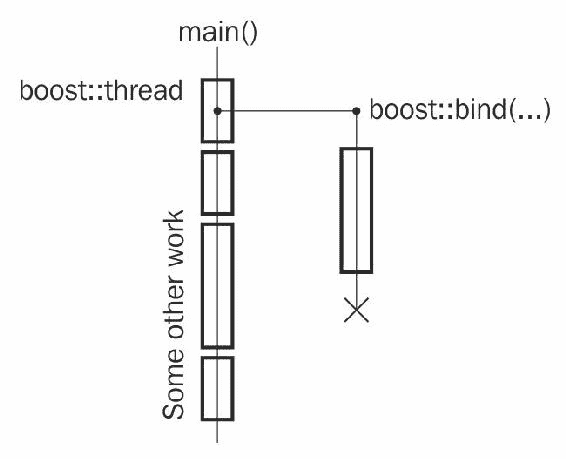

# 五、多线程操作

在本章中，我们将介绍:

*   创建执行线程
*   同步对公共资源的访问
*   使用原子快速访问公共资源
*   创建工作队列类
*   多读取器单写入器锁
*   创建每个线程唯一的变量
*   打断一根线
*   操纵一组线程
*   安全初始化共享变量
*   锁定多个互斥体

# 介绍

在这一章中，我们将关注线程和所有与它们相关的东西。鼓励掌握多线程的基本知识。

**多线程**是指单个进程内存在多个执行线程。线程可以共享进程资源并拥有自己的资源。这些执行线程可以在不同的 CPU 上独立运行，从而产生更快、更负责任的程序。`Boost.Thread`库提供跨操作系统接口的统一，以便与线程一起工作。它不是一个只有标题的库，所以本章的所有例子都需要链接到`libboost_thread`和`libboost_system`库。

# 创建执行线程

在现代多核编译器上，为了获得最大的性能(或者只是为了提供良好的用户体验)，程序通常使用多线程执行。这里有一个激励性的例子，我们需要在绘制用户界面的线程中创建并填充一个大文件:

```cpp
#include <cstddef> // for std::size_t

bool is_first_run(); 

// Function that executes for a long time.
void fill_file(char fill_char, std::size_t size, const char* filename);

// Called in thread that draws a user interface:
void example_without_threads() {
    if (is_first_run()) {
        // This will be executing for a long time during which
        // users interface freezes...
        fill_file(0, 8 * 1024 * 1024, "save_file.txt");
    }
}
```

# 准备好

这个食谱需要了解`boost::bind`或`std::bind`。

# 怎么做...

启动一个执行线程从来没有这么容易:

```cpp
#include <boost/thread.hpp> 

// Called in thread that draws a user interface:
void example_with_threads() {
    if (is_first_run()) {
        boost::thread(boost::bind(
            &fill_file,
            0,
            8 * 1024 * 1024,
            "save_file.txt"
        )).detach();
    }
}
```

# 它是如何工作的...

`boost::thread`变量接受一个可以在没有参数的情况下调用的函数对象(我们使用`boost::bind`提供了一个)，并创建一个单独的执行线程。这个函数对象被复制到一个构造好的执行线程中，并在那里运行。函数对象的返回值被忽略。



We are using version 4 of the `Boost.Thread` in all recipes (defined `BOOST_THREAD_VERSION` to `4`). Important differences between `Boost.Thread` versions are highlighted.

之后，我们调用`detach()`函数，该函数执行以下操作:

*   执行线程与`boost::thread`变量分离，但继续执行
*   `boost::thread`变量开始保持`Not-A-Thread`状态

Without a call to `detach()`, the destructor of `boost::thread` will notice that it still holds an OS thread and will call `std::terminate`. It terminates our program without calling destructors, freeing up resources and without other cleanup.

默认构造的线程也有一个`Not-A-Thread`状态，它们不会创建一个单独的执行线程。

# 还有更多...

如果我们想确保在做其他工作之前创建并编写了一个文件，该怎么办？在这种情况下，我们需要以下列方式连接线程:

```cpp
void example_with_joining_threads() {
    if (is_first_run()) {
        boost::thread t(boost::bind(
            &fill_file,
            0,
            8 * 1024 * 1024,
            "save_file.txt"
        ));

        // Do some work.
        // ...

        // Waiting for thread to finish.
        t.join();
    }
} 
```

线程连接后，`boost::thread`变量保持`Not-A-Thread`状态，其析构函数不调用`std::terminate`。

Remember that the thread must be joined or detached before its destructor is called. Otherwise, your program will terminate!

定义了`BOOST_THREAD_VERSION=2`后，`boost::thread`的析构函数调用`detach()`，并不会导致`std::terminate`。但是这样做会破坏与`std::thread`的兼容性，并且，有一天，当你的项目转移到 C++ 标准库线程时，或者当`BOOST_THREAD_VERSION=2`不被支持时，这会给你很多惊喜。`Boost.Thread`的版本 4 更显更强，在 C++ 语言中通常更可取。

Beware that `std::terminate()` is called when any exception that is not of type `boost::thread_interrupted` leaves a boundary of the functional object that was passed to the `boost::thread` constructor.

有一个非常有用的包装器，它作为线程周围的 RAII 包装器，允许您模拟`BOOST_THREAD_VERSION=2`行为；它被称为`boost::scoped_thread<T>`，其中`T`可以是以下类别之一:

*   `boost::interrupt_and_join_if_joinable`:在破坏时中断并加入一个线程
*   `boost::join_if_joinable`:在毁灭时连接一条线
*   `boost::detach`:破坏时脱离一根线

这里有一个简短的例子:

```cpp
#include <boost/thread/scoped_thread.hpp> 

void some_func(); 

void example_with_raii() { 
    boost::scoped_thread<boost::join_if_joinable> t( 
        boost::thread(&some_func) 
    ); 

    // 't' will be joined at scope exit.
} 
```

`boost::thread`类被接受为 C++ 11 标准的一部分，您可以在`std::`命名空间的`<thread>`头中找到它。Boost 的 Version 4 和 C++ 11 标准库版本的`thread`类没有太大区别。但是，`boost::thread`在 C++ 03 编译器上是可用的，所以它的用法更加通用。

There is a very good reason for calling `std::terminate` instead of joining by default! C and C++ languages are often used in life critical software. Such software is controlled by other software, called **watchdog**. Those watchdogs can easily detect that an application has terminated but can not always detect deadlocks or detect them with longer delays. For example, for defibrillator software, it's safer to terminate, than hang on `join()` for a few seconds waiting for a watchdog reaction. Keep that in mind when designing such applications.

# 请参见

*   本章所有食谱均使用`Boost.Thread`。你可以继续阅读以获得更多关于图书馆的信息。
*   官方文档有一个完整的`boost::thread`方法列表，以及关于它们在 C++ 11 标准库中可用性的注释。按照链接[http://boost.org/libs/thread](http://boost.org/libs/thread)获取其官方文档。
*   *中断一个线程*食谱会让你知道`boost::interrupt_and_join_if_joinable`类做什么。

# 同步对公共资源的访问

既然我们知道了如何启动执行线程，我们希望能够从不同的线程访问一些公共资源:

```cpp
#include <cassert> 
#include <cstddef> 
#include <iostream>

// In previous recipe we included 
// <boost/thread.hpp>, which includes all 
// the classes of Boost.Thread.
// Following header includes only boost::thread. 
#include <boost/thread/thread.hpp> 

int shared_i = 0;

void do_inc() {
    for (std::size_t i = 0; i < 30000; ++ i) {
        const int i_snapshot = ++ shared_i;
        // Do some work with i_snapshot.
        // ...
    }
}

void do_dec() {
    for (std::size_t i = 0; i < 30000; ++ i) {
        const int i_snapshot = --shared_i;
        // Do some work with i_snapshot.
        // ...
    }
}

void run() {
    boost::thread t1(&do_inc);
    boost::thread t2(&do_dec);

    t1.join();
    t2.join();

    assert(global_i == 0); // Oops!
    std::cout << "shared_i == " << shared_i;
}
```

这个`Oops!`不是偶然写在那里的。对于有些人来说，可能是惊喜，但是`shared_i`不等于`0`的可能性很大:

```cpp
    shared_i == 19567
```

Modern compilers and processors have a huge number of different tricky optimizations that can break the preceding code. We won't discuss them here, but there is a useful link in the *See also* section of the document that briefly describes them.

当一个公共资源是非平凡类时，情况会变得更糟；分段错误和内存泄漏可能(也将)发生。

我们需要更改代码，以便在一个时刻只有一个线程修改`shared_i`变量，并绕过所有导致多线程代码的处理器和编译器优化。

# 准备好

这个食谱推荐螺纹的基本知识。

# 怎么做...

让我们看看如何修复前面的例子，并在运行结束时使`shared_i`相等:

1.  首先，我们需要创建一个**互斥体**:

```cpp
#include <boost/thread/mutex.hpp> 
#include <boost/thread/locks.hpp> 

int shared_i = 0; 
boost::mutex i_mutex; 
```

2.  将所有修改或从`shared_i`变量中获取数据的操作置于以下之间:

```cpp
      {   // Critical section begin 
          boost::lock_guard<boost::mutex> lock(i_mutex); 
```

以及以下内容:

```cpp
      }   // Critical section end 
```

它应该是这样的:

```cpp
void do_inc() {
    for (std::size_t i = 0; i < 30000; ++ i) {
        int i_snapshot;
        { // Critical section begin.
            boost::lock_guard<boost::mutex> lock(i_mutex);
            i_snapshot = ++ shared_i;
        } // Critical section end.

        // Do some work with i_snapshot.
        // ...
    }
}

void do_dec() {
    for (std::size_t i = 0; i < 30000; ++ i) {
        int i_snapshot;
        { // Critical section begin.
            boost::lock_guard<boost::mutex> lock(i_mutex);
            i_snapshot = -- shared_i;
        } // Critical section end.

        // Do some work with i_snapshot.
        // ...
    }
} 
```

# 它是如何工作的...

`boost::mutex`类负责所有的同步工作。当一个线程试图通过`boost::lock_guard<boost::mutex>`变量锁定它，并且没有其他线程持有锁时，它成功地获得对代码段的唯一访问，直到锁被解锁或销毁。如果某个其他线程已经持有锁，则尝试获取锁的线程会等待，直到另一个线程解锁锁。所有的锁定/解锁操作都暗示了特定的指令，以便所有线程都可以看到关键部分中所做的更改。此外，您不再需要:

*   确保修改后的资源值对所有内核可见
*   确保值不只是在处理器的寄存器中被修改
*   强制处理器不要对指令重新排序
*   强制编译器不要对指令重新排序
*   强制编译器不删除对未读取的存储的写入
*   一堆其他讨厌的编译器/架构特定的东西

If you have a variable that is used from different threads and at least one thread modifies that variable, usually, all the code that uses it must be treated as a critical section and secured by a mutex.

`boost::lock_guard`类是一个非常简单的 RAII 类，它存储对互斥体的引用，将其锁定在单参数构造函数中，并在析构函数中解锁。

在前面例子中的花括号用法中，`lock`变量是在它们内部构造的，这样在到达`// Critical section end.`结束括号时，`lock`变量的析构函数被调用，互斥体被解锁。即使在关键部分发生了一些异常，互斥体也是正确解锁的。


If you initialize a common variable and then construct threads that only read it, then no mutex or other synchronization is required.

# 还有更多...

锁定互斥可能是一个非常缓慢的操作，这可能会使您的代码停止很长时间，直到其他线程释放锁。尽量使关键部分尽可能小；尝试在代码中减少它们。

让我们来看看一些操作系统如何处理多核 CPU 上的锁定。当运行在 CPU 1 上的`thread #1`试图锁定已经被另一个线程锁定的互斥体时，`thread #1`被操作系统停止，直到锁被释放。停止的线程不会消耗处理器资源，因此操作系统会在 CPU 1 上执行其他线程。现在，我们有一些线程在 CPU 1 上运行；一些其他线程释放锁，现在操作系统必须恢复执行一个`thread #1`。因此，它在当前空闲的 CPU 上恢复执行，例如，CPU2。

这将导致 CPU 缓存未命中，因此在释放互斥体后，代码运行稍慢。通常情况下，事情没有那么糟糕，因为一个好的操作系统会努力在它之前使用的同一个中央处理器上恢复线程。不幸的是，这种特定于操作系统的优化并不总是可行的。减少关键部分的数量及其大小，以减少线程挂起和缓存未命中的机会。

不要试图在同一个线程中锁定一个`boost::mutex`变量两次；这会导致**僵局**。如果需要从单个线程多次锁定互斥体，请使用`<boost/thread/recursive_mutex.hpp>`头中的`boost::recursive_mutex`代替。多次锁定它不会导致死锁。`boost::recursive_mutex`只有在每次`lock()`调用`unlock()`一次后才会解除锁定。不需要的时候避免使用`boost::recursive_mutex`，因为比`boost::mutex`慢，通常表示代码流设计不好。

`boost::mutex`、`boost::recursive_mutex`和`boost::lock_guard`类被 C++ 11 标准库接受，您可以在`std::`命名空间的`<mutex>`头中找到它们。Boost 和标准库版本之间没有太大区别。Boost 版本可能有一些扩展(在官方文档中标记为 *EXTENSION* )并提供更好的可移植性，因为它们甚至可以在 C++ 11 之前的编译器上使用。

# 请参见

*   下一个食谱将告诉你如何让这个例子更快(更短)。
*   阅读本章第一个食谱，了解更多关于`boost::thread`课程的信息。http://boost.org/libs/thread 的官方文件也可能对你有所帮助。
*   要了解第一个例子失败的原因以及多处理器如何使用公共资源的更多信息，请参见[上的*内存障碍:软件黑客的硬件视图*。注意，这是一个很难的话题。](http://www.rdrop.com/users/paulmck/scalability/paper/whymb.2010.07.23a.pdf)

# 使用原子快速访问公共资源

在前面的食谱中，我们看到了如何从不同的线程安全地访问公共资源。但是在这个配方中，我们进行了两次系统调用(锁定和解锁`mutex`)来获取一个整数的值:

```cpp
{   // Critical section begin.
    boost::lock_guard<boost::mutex> lock(i_mutex); 
    i_snapshot = ++ shared_i; 
}   // Critical section end.
```

这看起来又跛又慢！我们能让之前食谱的代码更好吗？

# 准备好

阅读第一份食谱是你从这份食谱开始所需要的。多线程的一些基本知识将是受欢迎的。

# 怎么做...

让我们看看如何改进前面的例子:

1.  现在，我们需要不同的标题:

```cpp
#include <cassert> 
#include <cstddef> 
#include <iostream>

#include <boost/thread/thread.hpp> 
#include <boost/atomic.hpp> 
```

2.  需要改变`shared_i`的类型:

```cpp
boost::atomic<int> shared_i(0); 
```

3.  移除所有`boost::lock_guard`变量:

```cpp
void do_inc() {
    for (std::size_t i = 0; i < 30000; ++ i) {
        const int i_snapshot = ++ shared_i;

        // Do some work with i_snapshot.
        // ...
    }
}

void do_dec() {
    for (std::size_t i = 0; i < 30000; ++ i) {
        const int i_snapshot = -- shared_i;

        // Do some work with i_snapshot.
        // ...
    }
}
```

4.  就这样！现在，它起作用了:

```cpp
int main() {
    boost::thread t1(&do_inc);
    boost::thread t2(&do_dec);

    t1.join();
    t2.join();

    assert(shared_i == 0);
    std::cout << "shared_i == " << shared_i << std::endl;

    assert(shared_i.is_lock_free());
}
```

# 它是如何工作的...

处理器提供特定的**原子操作**，不能被其他处理器或处理器内核干扰。对于系统来说，这些操作似乎是瞬间发生的。`Boost.Atomic`提供围绕系统特定原子操作的类，与编译器合作禁用可能破坏多线程工作的优化，并提供统一的可移植接口来处理原子操作。如果在同一个内存位置上的两个原子操作从不同的线程同时开始，其中一个操作会一直等待，直到另一个操作完成，然后再使用前一个操作的结果。


换句话说，同时使用来自不同线程的`boost::atomic<>`变量是安全的。系统将原子变量上的每个操作视为单个事务。系统将原子变量上的一系列操作视为一系列独立的事务:

```cpp
--shared_i;    // Transaction #1 
// Some other may change value of `shared_i`!!
++ shared_i;    // Transaction #2 
```

Never ever avoid synchronization for a variable that is modified from multiple threads. Even if the variable is a `bool` and all you do is read or write `true`/`false` to it! The compiler has all the rights to optimize away all the stores and reads, breaking your code in a million ways that nobody can even imagine. Guess whom a good employer would punish for such breakage? (The compiler is not the right answer to that question!)

# 还有更多...

`Boost.Atomic`库只能使用 POD 类型；否则，行为未定义。某些平台/处理器不为某些类型提供原子操作，因此`Boost.Atomic`使用`boost::mutex`模拟原子行为。如果类型特定宏设置为`2`，原子类型不使用`boost::mutex`:

```cpp
#include <boost/static_assert.hpp> 
BOOST_STATIC_ASSERT(BOOST_ATOMIC_INT_LOCK_FREE == 2); 
```

`boost::atomic<T>::is_lock_free`成员函数依赖于运行时，因此它不适用于编译时检查，但当运行时检查足够时，它可能会提供更可读的语法:

```cpp
assert(shared_i.is_lock_free()); 
```

原子操作比互斥操作快得多，但仍然比非原子操作慢得多。如果我们比较一个使用互斥体的配方的执行时间(0:00.08 秒)和这个配方中前一个例子的执行时间(0:00.02 秒)，我们会看到差异(在 30，000 次迭代中测试)。

All the known to the book author standard library implementations had issues with atomic operations. All of them! Do not write your own atomics. If you think that your own implementation of atomics would be better and you wish to waste some time--write it, check it using special tools, and think again. Repeat until you understand that you're wrong.

C++ 11 兼容编译器应该在`std::`命名空间的`<atomic>`头中拥有所有原子类、`typedefs`和宏。如果编译器正确支持 C++ 11 内存模型，并且经过专门训练来优化`std::atomic`变量，那么`std::atomic`的编译器特定实现可能比 Boost 的版本工作得更快。

# 请参见

[http://boost.org/libs/atomic](http://boost.org/libs/atomic)的官方文档可能会给你更多关于这个主题的例子和一些理论信息。

# 正在创建工作队列类

让我们调用不带参数的函数对象(简称任务)。

```cpp
typedef boost::function<void()> task_t; 
```

现在，想象一下我们有发布任务的线程和执行发布任务的线程的情况。我们需要设计一个可以被这两种类型的线程安全使用的类。此类必须具有以下功能:

*   获取任务或等待任务直到它被另一个线程发布
*   如果我们有任务，检查并获取一个任务(如果没有剩余任务，返回一个空任务)
*   发布任务

# 准备好

确保您对`boost::thread`或`std::thread`感到舒适，了解互斥体的基础知识，并且知道`boost::function`或`std::function`。

# 怎么做...

我们要实现的类在功能上接近`std::queue<task_t>`，但也有线程同步。让我们开始吧:

1.  我们需要以下标题和成员:

```cpp
#include <deque>
#include <boost/function.hpp>
#include <boost/thread/mutex.hpp>
#include <boost/thread/locks.hpp>
#include <boost/thread/condition_variable.hpp>

class work_queue {
public:
    typedef boost::function<void()> task_type;type;

private:
    std::deque<task_type> tasks_;
    boost::mutex tasks_mutex_;
    boost::condition_variable cond_;
```

2.  将任务放入队列的函数必须如下所示:

```cpp
public:
    void push_task(const task_type& task) {
        boost::unique_lock<boost::mutex> lock(tasks_mutex_);
        tasks_.push_back(task);
        lock.unlock();

        cond_.notify_one();
    }
```

3.  用于获取推送任务或空任务(如果没有剩余任务)的非阻塞功能:

```cpp
    task_type try_pop_task() {
        task_type ret;
        boost::lock_guard<boost::mutex> lock(tasks_mutex_);
        if (!tasks_.empty()) {
            ret = tasks_.front();
            tasks_.pop_front();
        }

        return ret;
    }
```

4.  阻止功能，用于获取推送的任务或在任务被另一个线程推送时进行阻止:

```cpp
    task_type pop_task() {
        boost::unique_lock<boost::mutex> lock(tasks_mutex_);
        while (tasks_.empty()) {
            cond_.wait(lock);
        }

        task_type ret = tasks_.front();
        tasks_.pop_front();

        return ret;
    }
}; 
```

以下是如何使用`work_queue`类:

```cpp
#include <boost/thread/thread.hpp>

work_queue g_queue;

void some_task();
const std::size_t tests_tasks_count = 3000 /*000*/;

void pusher() {
    for (std::size_t i = 0; i < tests_tasks_count; ++ i) {
        g_queue.push_task(&some_task);
    }
}

void popper_sync() {
    for (std::size_t i = 0; i < tests_tasks_count; ++ i) {
        work_queue::task_type t = g_queue.pop_task();
        t();         // Executing task.
    }
}

int main() {
    boost::thread pop_sync1(&popper_sync);
    boost::thread pop_sync2(&popper_sync);
    boost::thread pop_sync3(&popper_sync);

    boost::thread push1(&pusher);
    boost::thread push2(&pusher);
    boost::thread push3(&pusher);

    // Waiting for all the tasks to push.
    push1.join();
    push2.join();
    push3.join();
    g_queue.flush(); 

    // Waiting for all the tasks to pop.
    pop_sync1.join();
    pop_sync2.join();
    pop_sync3.join();

    // Asserting that no tasks remained,
    // and falling though without blocking.
    assert(!g_queue.try_pop_task());

    g_queue.push_task(&some_task);

    // Asserting that there is a task,
    // and falling though without blocking.
    assert(g_queue.try_pop_task());
}
```

# 它是如何工作的...

在这个例子中，我们看到了一个新的 RAII 类`boost::unique_lock`。它只是一个`boost::lock_guard`类，具有显式解锁和锁定互斥锁的附加功能。

回到我们的`work_queue`班。先说`pop_task()`功能。首先，我们获取一个锁，并检查可用的任务。如果有任务，我们就退回去；否则，`cond_.wait(lock)`就叫。此方法自动解锁锁，并暂停执行线程，直到其他线程通知当前线程。

现在，我们来看看`push_task`法。在其中，我们还获取一个锁，在`tasks_.queue`中推送一个任务，解锁锁，调用`cond_.notify_one()`，唤醒`cond_.wait(lock)`中等待的线程(如果有)。因此，在此之后，如果某个线程正在等待一个`pop_task()`方法中的条件变量，该线程将继续执行，在`cond_.wait(lock)`内部调用`lock.lock()`，并在`while`中检查`tasks_empty()`。因为我们刚刚在`tasks_`中添加了一个任务，我们将从`while`循环中退出，解锁`<mutex>`(变量`lock`超出范围)，并返回一个任务。


You must check conditions in a loop, not just in an `if` statement! The `if` statement leads to errors, as the operating system sometimes may wake up the threads without any notify calls from the user.

# 还有更多...

注意，我们在调用`notify_one()`之前明确解锁了互斥体。然而，没有解锁，我们的例子仍然有效。

但是，在这种情况下，已经唤醒的线程可能会在试图调用`cond_wait(lock)`内部的`lock.lock()`时再次被阻塞，这将导致更多的上下文切换和更差的性能。

将`tests_tasks_count`设置为`3000000`并且不进行显式解锁，本示例运行 7 秒钟:

```cpp
 $time -f E ./work_queue
 0:07.38
```

通过显式解锁，此示例运行 5 秒钟:

```cpp
 $ time -f E ./work_queue 
 0:05.39
```

您也可以使用`cond_.notify_all()`通知所有等待特定条件变量的线程。

Some extremely exotic operating systems had an extremely rare issue with calling `notify_one()` outside the critical section (without holding a lock) on Boost before version 1.64 [https://github.com/boostorg/thread/pull/105](https://github.com/boostorg/thread/pull/105). It's doubtful that you will ever work with those. But, anyway, to avoid issues on those platforms, you may add a `flush()` function to the `work_queue` class that holds a lock and calls `notify_all()`:
`void flush() {` `boost::lock_guard<boost::mutex> lock(tasks_mutex_);` `cond_.notify_all();` `}`
Call `flush()` when you are done with pushing tasks in a queue to force the wakeup of all the threads.

C++ 11 标准在`<condition_variable>`头中声明了`std::condition_variable`，在`<mutex>`头中声明了`std::unique_lock`。如果您使用 C++ 03 编译器或仅使用 Boost 的一些扩展，请使用 Boost 版本。

The `work_queue` class could be significantly improved by adding support for **rvalue references** and calling `std::move(tasks_.front())`. This will make the code in the critical section much faster, resulting in less threads, suspends, and wakeups, less cache misses and a much better performance.

# 请参见

*   本章的前三个食谱提供了很多关于`Boost.Thread`的有用信息
*   官方文档可能会给你更多关于这个主题的例子和一些理论信息；可以在[http://boost.org/libs/thread](http://boost.org/libs/thread)找到

# 多读取器单写入器锁

想象一下，我们正在开发一些在线服务。我们有一个无序的注册用户地图，每个用户都有一些属性。这个集合被许多线程访问，但是很少被修改。具有以下设置的所有操作都是以线程安全的方式完成的:

```cpp
#include <unordered_map> 
#include <boost/thread/mutex.hpp> 
#include <boost/thread/locks.hpp> 

struct user_info {
    std::string address;
    unsigned short age;

    // Other parameters
    // ...
};

class users_online {
    typedef boost::mutex mutex_t;

    mutable mutex_t                             users_mutex_;
    std::unordered_map<std::string, user_info>  users_;

public:
    bool is_online(const std::string& username) const {
        boost::lock_guard<mutex_t> lock(users_mutex_);
        return users_.find(username) != users_.end();
    }

    std::string get_address(const std::string& username) const {
        boost::lock_guard<mutex_t> lock(users_mutex_);
        return users_.at(username).address;
    }

    void set_online(const std::string& username, user_info&& data) {
        boost::lock_guard<mutex_t> lock(users_mutex_);
        users_.emplace(username, std::move(data));
    }

    // Other methods:
    // ...
};
```

不幸的是，我们的在线服务有点慢，分析人员显示问题出在`users_online`类。任何操作都会在`mutex_`变量上获得一个唯一的锁，所以即使获得资源也会导致等待一个锁定的互斥体。由于一些资源很难复制，关键部分消耗了大量时间，减慢了`users_online`类的任何操作。

不幸的是，项目需求不允许我们重新设计类。我们能在不改变界面的情况下加快速度吗？

# 准备好

确保您对`boost::thread`或`std::thread`感到舒适，并了解互斥体的基本知识。

# 怎么做...

这可能会有所帮助:

将`boost::mutex`替换为`boost::shared_mutex`。对于不修改数据的方法，将`boost::unique_locks`替换为`boost::shared_lock`:

```cpp
#include <boost/thread/shared_mutex.hpp> 

class users_online {
    typedef boost::shared_mutex mutex_t;

    mutable mutex_t                             users_mutex_;
    std::unordered_map<std::string, user_info>  users_;

public:
    bool is_online(const std::string& username) const {
        boost::shared_lock<mutex_t> lock(users_mutex_);
        return users_.find(username) != users_.end();
    }

    std::string get_address(const std::string& username) const {
        boost::shared_guard<mutex_t> lock(users_mutex_);
        return users_.at(username).address;
    }

    void set_online(const std::string& username, user_info&& data) {
        boost::lock_guard<mutex_t> lock(users_mutex_);
        users_.emplace(username, std::move(data));
    }

    // Other methods:
    // ...
};
```

# 它是如何工作的...

如果多个线程不修改数据，我们可以允许同时从这些线程获取数据。只有当我们要修改互斥体保护的数据时，我们才需要唯一地拥有互斥体。在所有其他情况下，允许同时访问数据。这就是`boost::shared_mutex`的设计目的。它允许共享锁定(读锁定)，这允许多个同时访问资源。

当我们尝试唯一锁定共享锁定的资源时，操作将被阻止，直到没有剩余的读锁定，并且仅在该资源被唯一锁定后，强制新的共享锁定等待，直到唯一锁定被释放。`boost::shared_lock`读写锁定比通常的`boost::mutex`锁定慢很多。不要使用`boost::shared_lock`，除非你确定没有好的方法来重新设计你的代码，并且你确定`boost::shared_lock`会加快速度。

Some readers may see the `mutable` keyword for the first time. This keyword can be applied to non-static and non-constant class members. The `mutable` data member can be modified in the constant member functions and is usually used for mutexes and other helper variables that are not directly related to the class logic.

# 还有更多...

当你确实只需要唯一的锁时，不要使用`boost::shared_mutex`，因为它比通常的`boost::mutex`类慢。

在 C++ 14 之前，共享互斥体在 C++ 中是不可用的。`shared_timed_mutex`和`shared_lock`在`std::`命名空间的`<shared_mutex>`头中定义。它们具有与 Boost 版本相近的性能特征，因此应用前面所有的性能注释。

C++ 17 的`shared_mutex`可能比`shared_timed_mutex`稍快，因为它没有提供定时锁定的方法。这可能会为你节省几个宝贵的纳秒。

# 请参见

*   还有一个`boost::upgrade_mutex`类，对于共享锁需要提升为唯一锁的情况可能有用。更多信息请参见[http://boost.org/libs/thread](http://boost.org/libs/thread)的`Boost.Thread`文档。
*   有关可变关键字的更多信息，请参考[http://herbsutter . com/2013/01/01/video-you-know-const-and-mutatable/](http://herbsutter.com/2013/01/01/video-you-dont-know-const-and-mutable/)。

# 创建每个线程唯一的变量

我们来看一下食谱*创建* *工作队列类*。那里的每个任务都可以在众多线程中的一个线程中执行，我们不知道在哪个线程中执行。假设我们希望使用某种连接发送已执行任务的结果:

```cpp
#include <boost/noncopyable.hpp>

class connection: boost::noncopyable {
public:
    // Opening a connection is a slow operation
    void open();

    void send_result(int result);

    // Other methods
    // ...
};
```

我们有以下解决方案:

*   当我们需要发送数据时，打开一个新的连接(这非常慢)
*   为所有线程建立一个单一连接，并将它们包装在互斥体中(这也很慢)
*   拥有一个连接池，以线程安全的方式从其中获取一个连接，并使用它(需要大量的编码，但是这个解决方案很快)
*   每个线程只有一个连接(实现起来又快又简单)

那么，我们如何实现最后一个解决方案呢？

# 准备好

需要线程的基本知识。

# 怎么做...

是时候创建一个线程局部变量了。在头文件`connection`类定义后声明一个函数:

```cpp
connection& get_connection();
```

使您的源文件如下所示:

```cpp
#include <boost/thread/tss.hpp>
boost::thread_specific_ptr<connection> connection_ptr;

connection& get_connection() {
    connection* p = connection_ptr.get();
    if (!p) {
        connection_ptr.reset(new connection);
        p = connection_ptr.get();
        p->open();
    }

    return *p;
}
```

完成了。使用线程特定的资源从来没有这么容易过:

```cpp
void task() {
    int result;
    // Some computations go there.
    // ...

    // Sending the result:
    get_connection().send_result(result);
}
```

# 它是如何工作的...

`boost::thread_specific_ptr`变量为每个线程保存一个单独的指针。最初，这个指针等于`nullptr`；这就是为什么我们检查`!p`并打开一个连接，如果它是`nullptr`。

因此，当我们从已经启动指针的线程进入`get_connection()`时，`!p`返回值`false`，我们返回已经打开的连接。

`delete`对于存储在`connection_ptr`变量里面的指针是在线程退出的时候调用的，所以我们不需要担心内存泄漏。

# 还有更多...

您可以提供自己的清理函数，该函数将在线程退出时被调用而不是`delete`。清理功能必须有`void (*cleanup_function)(T*)`签名，并且必须在`boost::thread_specific_ptr`施工期间通过。

C++ 11 有一个特殊的关键字`thread_local`，用来声明带有线程本地存储持续时间的变量。C++ 11 没有`thread_specific_ptr`类，但是您可以使用`thread_local T`或`thread_local std::unique_ptr<T>`在支持`thread_local`的编译器上实现相同的行为。`boost::thread_specific_ptr`在 C++ 11 之前的编译器上工作，不像`thread_local`。

C++ 17 有`inline`变量，可以用`thread_local`搭配`inline`在头文件中声明线程局部变量。

# 请参见

*   `Boost.Thread`文档给出了很多不同案例的好例子；可以在[http://boost.org/libs/thread](http://boost.org/libs/thread)找到
*   在[http://stackoverflow . com/questions/13106049/c11-gcc-4-8-Thread-local-performance-pension . html](http://stackoverflow.com/questions/13106049/c11-gcc-4-8-thread-local-performance-penalty.html)阅读本主题，在[http://gcc . GNU . org/online docs/gcc-3 . 3 . 1/gcc/Thread-local . html](http://gcc.gnu.org/onlinedocs/gcc-3.3.1/gcc/Thread-Local.html)阅读关于 GCCs `__thread`关键字，可能会让你对`thread_local`在编译器中的实现方式和速度有所了解

# 打断一根线

有时，我们需要终止一个消耗了太多资源或者执行时间过长的线程。例如，一些解析器在一个线程中工作(并且主动使用`Boost.Thread`，但是我们已经从它那里获得了所需的数据量，所以解析可以停止。这是存根:

```cpp
int main() {
    boost::thread parser_thread(&do_parse);

    // ...

    if (stop_parsing) {
        // No more parsing required.
        // TODO: Stop the parser!
    }

    // ...

    parser_thread.join();
}
```

我们怎么做？

# 准备好

这个食谱几乎不需要任何东西。你只需要至少对线程有一个基本的了解。

# 怎么做...

我们可以通过中断线程来停止它:

```cpp
if (stop_parsing) { 
    // No more parsing required. 
    parser_thread.interrupt(); 
}
```

# 它是如何工作的...

`Boost.Thread`提供一些预定义的**中断点**，通过`interrupt()`调用检查线程是否被中断。如果线程被中断，则抛出异常`boost::thread_interrupted`。当异常通过`do_parse()`内部传播时，它调用所有资源的析构函数，就像典型的异常一样。`boost::thread_interrupted`异常由`Boost.Thread`库专门处理，对于该异常，允许离开线程函数(在我们的示例中为`do_parse()`)。当异常离开线程函数时，它被`boost::thread`内部捕获，并被视为取消线程的请求。

`boost::thread_interrupted` is not derived from `std::exception`! Interruptions work well if you catch exceptions by their type or by references to `std::exception`. But if you catch an exception by `catch (...)` and do not rethrow it, the interruptions won't work.

正如我们从本章的第一个食谱中所知道的，如果传递到线程中的函数没有捕获到异常，并且该异常离开了函数边界，应用就会终止。`boost::thread_interrupted`是那条规则的唯一例外；它可能会离开函数边界，并且不会`std::terminate()`应用。

# 还有更多...

官方文件中列出了`Boost.Thread`库的中断点。根据经验，所有阻挡的东西都会检查是否有干扰。

我们也可以在任何地方手动添加中断点。我们所需要的就是呼叫`boost::this_thread::interruption_point()`:

```cpp
void do_parse() {
    while (not_end_of_parsing) {
        // If current thread was interrupted, the following
        // line will throw an boost::thread_interrupted.
        boost::this_thread::interruption_point();

        // Some parsing goes here.
        // ...
    }
}
```

如果一个项目不需要中断，定义`BOOST_THREAD_DONT_PROVIDE_INTERRUPTIONS`可以稍微提高性能，并且完全禁止线程中断。

C++ 11 没有线程中断，但是您可以使用原子操作来部分模拟它们:

*   创建一个原子`bool`变量
*   检查线程中的原子变量，如果它已经改变，就抛出一个异常
*   不要忘记捕捉传递给线程的函数中的异常(否则应用将终止)

但是，如果代码在条件变量或 sleep 方法中的某个地方等待，这将对您没有帮助。

# 请参见

*   `Boost.Thread`的官方文档在[提供了预定义的中断点列表](http://www.boost.org/doc/libs/1_64_0/doc/html/thread/thread_management.html#thread.thread_management.tutorial.interruption.predefined_interruption_points)
*   作为练习，查看本章中的其他方法，并考虑在哪些地方增加中断点可以改进代码
*   阅读`Boost.Thread`文档的其他部分可能会有用；前往[http://boost.org/libs/thread](http://boost.org/libs/thread)

# 操纵一组线程

那些试图自己重复所有例子的读者，或者那些正在尝试线程的读者，一定已经厌倦了编写下面的代码来启动和连接线程:

```cpp
#include <boost/thread.hpp>

void some_function();

void sample() {
    boost::thread t1(&some_function);
    boost::thread t2(&some_function);
    boost::thread t3(&some_function);

    // ... 

    t1.join();
    t2.join();
    t3.join();
} 
```

也许有更好的方法做到这一点？

# 准备好

对于这个食谱来说，基本的线程知识就足够了。

# 怎么做...

我们可以使用`boost::thread_group`类操纵一组线程。

1.  构造一个`boost::thread_group`变量:

```cpp
#include <boost/thread.hpp>

int main() {
    boost::thread_group threads;
```

2.  在前面的变量中创建线程:

```cpp
    // Launching 10 threads.
    for (unsigned i = 0; i < 10; ++ i) {
        threads.create_thread(&some_function);
    }
```

3.  现在，您可以为`boost::thread_group`内的所有线程调用函数:

```cpp
    // Joining all threads.
    threads.join_all();

    // We can also interrupt all of them
    // by calling threads.interrupt_all();
}
```

# 它是如何工作的...

`boost::thread_group`变量只保存所有构造或移动到它的线程，并可能向所有线程发送一些调用。

# 还有更多...

C++ 11 没有`thread_group`类；它是特定于 Boost 的。

# 请参见

`Boost.Thread`的官方文档可能会给你带来很多本章没有描述的其他有用的类；前往[http://boost.org/libs/thread](http://boost.org/libs/thread)。

# 安全初始化共享变量

假设我们正在设计一个安全关键类，该类从多个线程使用，从服务器接收答案，对它们进行后处理，并输出响应:

```cpp
struct postprocessor {
    typedef std::vector<std::string> answer_t;

    // Concurrent calls on the same variable are safe.
    answer_t act(const std::string& in) const {
        if (in.empty()) {
            // Extremely rare condition.
            return read_defaults();
        }

        // ...
    }
};
```

注意`return read_defaults();`线。由于网络问题或其他一些问题，可能会出现服务器没有响应的情况。在这些情况下，我们尝试从文件中读取默认值:

```cpp
// Executes for a long time.
std::vector<std::string> read_defaults();
```

从前面的代码中，我们遇到了这个问题:服务器可能在一段明显的时间内不可访问，在这段时间里，我们将在每次`act`调用时重新读取文件。这极大地影响了性能。

我们可以尝试通过在类中存储`default_`来修复它:

```cpp
struct postprocessor {
    typedef std::vector<std::string> answer_t;

private:
    answer_t default_;

public:
    postprocessor()
        : default_(read_defaults())
    {}

    // Concurrent calls on the same variable are safe.
    answer_t act(const std::string& in) const {
        if (in.empty()) {
            // Extremely rare condition.
            return default_;
        }

        // ...
    }
};
```

这也不是一个完美的解决方案:我们不知道`postprocessor`类有多少实例是由用户构建的，我们在运行期间可能不需要的默认值上浪费了内存。

因此，我们必须在第一次远程服务器故障时并发安全地读取和存储当前实例中的数据，并且在下一次故障时不再读取。有很多方法可以做到这一点，但让我们看看最正确的方法。

# 准备好

对于这个食谱来说，线程的基础知识已经足够了。

# 怎么做...

1.  我们必须添加变量来存储初始化默认值的信息，并添加变量来存储默认值:

```cpp
#include <boost/thread/once.hpp>

struct postprocessor {
    typedef std::vector<std::string> answer_t;

private:
    mutable boost::once_flag default_flag_;
    mutable answer_t default_;
```

变量是`mutable`，因为我们要在`const`成员函数中修改它们。

2.  让我们初始化变量:

```cpp
public:
    postprocessor()
        : default_flag_(BOOST_ONCE_INIT)
        , default_()
    {}
```

3.  最后，让我们更改`act`功能:

```cpp
    // Concurrent calls on the same variable are safe.
    answer_t act(const std::string& in) const {
        answer_t ret;
        if (in.empty()) {
            // Extremely rare condition.
            boost::call_once(default_flag_, [this]() {
                this->default_ = read_defaults();
            });
            return default_;
        }

        // ...
        return ret;
    }
};
```

# 它是如何工作的...

简而言之，`boost::call_once`和`boost::once_flag`确保作为第二个参数传递的函数只执行一次。

`boost::call_once`函数同步对作为第二个参数传递的函数 *F* 的调用。`boost::call_once`和`boost::once_flag`如果在同一个`once_flag`上有两个或更多并发调用，确保只对功能 *F* 进行一次调用，并确保只对 *F* 进行一次成功调用。

如果对函数 *F* 的调用没有抛出离开 *F* 主体的异常，则`boost::call_once`假设调用成功，并将该信息存储在`boost::once_flag`中。任何随后用相同的`boost::once_flag`打给`boost::call_once`的电话都不起作用。

Do not forget to initialize the `boost::once_flag` with the `BOOST_ONCE_INIT` macro.

# 还有更多..

`boost::call_once`可以将参数传递给要调用的函数:

```cpp
#include <iostream>

void once_printer(int i) {
    static boost::once_flag flag = BOOST_ONCE_INIT;
    boost::call_once(
        flag,
        [](int v) { std::cout << "Print once " << v << '\n'; },
        i // <=== Passed to lambda from above.
    );

    // ...
}
```

现在，如果我们在循环中调用`once_printer`函数:

```cpp
int main() {
    for (unsigned i = 0; i < 10; ++ i) {
        once_printer(i);
    }
}
```

输出中只有一行:

```cpp
Print once 0
```

C++ 11 在`<mutex>`头中有一个`std::call_once`和`std::once_flag`。与 Boost 版本不同的是，`once_flag`的标准库版本不需要通过宏进行初始化，它有一个 constexpr 构造函数。像往常一样，Boost 版本在 C++ 11 之前的编译器上是可用的，所以如果你必须支持旧的编译器，就使用它。

Visual Studio before 2015 was shipping a suboptimal `std::call_once` implementation more than ten times slower than the Boost's version. Stick to the `boost::call_once` if you're not using modern compilers.

# 请参见

`Boost.Thread`文档给出了很多不同案例的好例子。可以在[http://boost.org/libs/thread.](http://boost.org/libs/thread)找到

# 锁定多个互斥体

接下来的几段，你会成为写游戏的人之一。恭喜你，可以上班玩了！

你正在开发一个服务器，你必须为两个用户之间交换战利品编写代码:

```cpp
class user {
    boost::mutex        loot_mutex_;
    std::vector<item_t> loot_;
public:
    // ...

    void exchange_loot(user& u);
};
```

服务器上的不同线程可以同时处理每个用户操作，因此您必须通过互斥来保护资源。初级开发人员试图解决这个问题，但他的解决方案不起作用:

```cpp
void user::exchange_loot(user& u) {
    // Terribly wrong!!! ABBA deadlocks.
    boost::lock_guard<boost::mutex> l0(loot_mutex_);
    boost::lock_guard<boost::mutex> l1(u.loot_mutex_);
    loot_.swap(u.loot_);
}
```

前面代码中的问题是一个众所周知的 **ABBA 死锁**问题。想象一下*线程 1* 锁定*互斥体 A**线程 2* 锁定*互斥体 B* 。现在*线程 1* 试图锁定已经锁定的*互斥体 B* ，*线程 2* 试图锁定已经锁定的*互斥体 A* 。这导致两个线程被彼此无限期锁定，因为它们需要一个被另一个线程锁定的资源来继续，而另一个线程等待当前线程拥有的资源。

现在，如果用户 1 和用户 2 同时为对方呼叫`exchange_loot`，那么我们可能会出现`user1.exchange_loot(user2)`呼叫锁定`user1.loot_mutex_``user2.exchange_loot(user1)`呼叫锁定`user2.loot_mutex_`的情况。`user1.exchange_loot(user2)`等待无穷大试图锁定`user2.loot_mutex_`，`user2.exchange_loot(user1)`等待无穷大试图锁定`user1.loot_mutex_`。

# 准备好

线程和互斥锁的基本知识对于这个食谱来说已经足够了。

# 怎么做...

这个问题有两种现成的解决方案:

1.  需要编译器提供可变模板支持的简短示例:

```cpp
#include <boost/thread/lock_factories.hpp>

void user::exchange_loot(user& u) {
    typedef boost::unique_lock<boost::mutex> lock_t;

    std::tuple<lock_t, lock_t> l = boost::make_unique_locks(
        loot_mutex_, u.loot_mutex_
    );

    loot_.swap(u.loot_);
}
```

相同的代码使用使用`auto`:

```cpp
#include <boost/thread/lock_factories.hpp>

void user::exchange_loot(user& u) {
    auto l = boost::make_unique_locks(
        loot_mutex_, u.loot_mutex_
    );

    loot_.swap(u.loot_);
}
```

2.  便携式解决方案:

```cpp
#include <boost/thread/locks.hpp>

void user::exchange_loot(user& u) {
    typedef boost::unique_lock<boost::mutex> lock_t;

    lock_t l0(loot_mutex_, boost::defer_lock);
    lock_t l1(u.loot_mutex_, boost::defer_lock);
    boost::lock(l0, l1);

    loot_.swap(u.loot_);
}
```

# 它是如何工作的...

核心思想是以某种方式对互斥体进行排序，并始终按照该特定顺序锁定它们。在这种情况下，就不存在 ABBA 问题了，因为所有线程总是会在 *B* 之前锁定互斥体 *A* 。通常，使用其他死锁避免算法，但是为了简单起见，我们假设使用互斥体的顺序。

在第一个例子中，我们使用了`boost::make_unique_locks`，它总是以某种特定的顺序锁定线程，并返回一个持有锁的元组。

在第二个例子中，我们手动创建了锁，但是由于传递了`boost::defer_lock`参数，没有锁定它们。实际的锁定发生在`boost::lock(l0, l1)`调用中，它以某种预定义的顺序锁定互斥体。

现在，如果`user1`和`user2`同时为对方呼叫`exchange_loot`，那么`user1.exchange_loot(user2)`和`user2.exchange_loot(user1)`呼叫都会先尝试锁定`user1.loot_mutex_`或者先尝试锁定`user2.loot_mutex_`。这取决于运行时。

# 还有更多...

`boost::make_unique_locks`和`boost::lock`函数可能接受 2 个以上的锁或互斥体，因此您可以在更高级的情况下使用它们，其中必须同时锁定两个以上的互斥体。

C++ 11 在标题`<mutex>`中定义了一个`std::lock`函数，其行为与`boost::lock`函数完全一样。

C++ 17 有一个更漂亮的解决方案:

```cpp
#include <mutex>

void user::exchange_loot(user& u) {
    std::scoped_lock l(loot_mutex_, u.loot_mutex_);
    loot_.swap(u.loot_);
}
```

在前面的代码中，`std::scoped_lock`是一个接受可变数量锁的类。它有可变的模板参数，这些参数是从 C++ 17 推导指南中自动推导出来的。上例中`std::scoped_lock`的实际类型是:

```cpp
std::scoped_lock<std::mutex, std::mutex>
```

`std::scoped_lock`持有在构造期间传递的所有互斥锁的锁，并避免死锁。换句话说，它的工作方式与第一个示例类似，但看起来稍好一些。

# 请参见

`Boost.Thread`的官方文档可能会给你带来很多本章没有描述的其他有用的类；前往[http://boost.org/libs/thread.](http://boost.org/libs/thread)