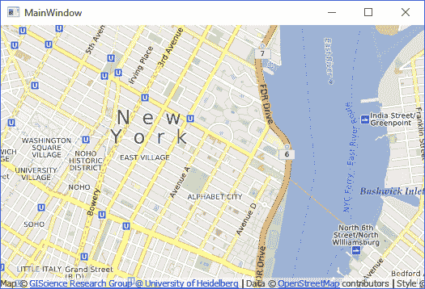
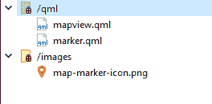
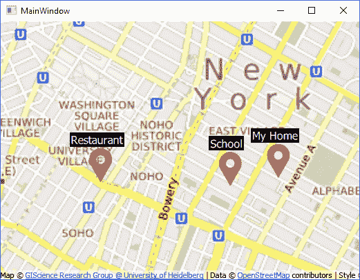
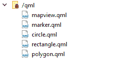

# 七、地图查看器

用户位置和地图显示是这几天变得越来越普遍的两个特征，并且已经被用于各种类型的应用中。它们通常用于后端分析和前端显示。

地图查看器可用于导航、附近的兴趣点查找、基于位置的服务(如叫出租车)等。您可以使用 Qt 来实现大部分功能，但是如果您想要更复杂的东西，您将需要一个高级的数据库系统。

在前一章中，我们学习了如何在应用中嵌入网络浏览器。在这一章中，我们将尝试一些更有趣的东西，包括以下主题:

*   创建地图显示
*   标记和形状显示
*   获取用户的位置
*   地理路由请求

让我们继续创建我们自己的地图查看器！

# 图象显示

Qt 位置模块为开发人员提供地理编码和导航信息。它还允许用户从服务器或用户设备上搜索需要检索数据的位置。

目前，Qt 的地图视图不支持 C++，只支持 QML。这意味着我们只能使用 QML 脚本来改变与视觉相关的任何东西——显示地图、添加标记等等；另一方面，在通过 QML 向用户显示信息之前，我们可以使用模块提供的 C++ 类从数据库或服务提供商那里获取信息。

简单说明一下， **QML** ( **Qt 建模语言**)是 Qt Quick 应用的用户界面标记语言。由于 QML 是由 JavaScript 框架驱动的，它的编码语法几乎与 JavaScript 相似。如果您需要深入学习 QML 和 Qt Quick，请转至[第 14 章](13.html)、 *Qt Quick 和 QML，*，因为这是专门介绍它的一整章。

有很多教程教你如何使用 Qt Quick 和 QML 语言创建一个成熟的地图查看器，但是没有太多的教程教你如何将 C++ 和 QML 结合起来。我们开始吧！

# 设置 Qt 定位模块

1.  首先，创建一个新的 Qt Widgets 应用项目。
2.  之后，打开您的项目文件(`.pro`)并将以下模块添加到您的 Qt 项目中:

```cpp
QT += core gui location qml quickwidgets 
```

除了`location`模块，我们还增加了`qml`和`quickwidgets`模块，这是下一节地图显示小部件所需要的。这就是我们在项目中启用`Qt Location`模块所需做的全部工作。接下来，我们将继续向我们的项目添加地图显示小部件。

# 创建地图显示

一旦你准备好了，让我们打开`mainwindow.ui`并删除菜单栏、工具栏和状态栏，因为我们在这个项目中不需要这些:


之后，将一个 QQuickWidget 从 Widget 框拖到 UI 画布上。然后，单击位于画布顶部的水平布局按钮，向其添加布局属性:


然后，将中央小部件的所有边距属性设置为 0:


接下来，我们需要通过转到文件|新文件或项目来创建一个名为`mapview.qml`的新文件....之后，选择 Qt 类别并遵循 QML 文件(Qt 快速 2):


一旦创建了 QML 文件，将其打开，并添加以下代码以将`location` 和`positioning` 模块包含到该文件中，以便我们以后可以使用其功能:

```cpp
import QtQuick 2.0 
import QtLocation 5.3 
import QtPositioning 5.0 
```

之后，我们创建一个`Plugin`对象并将其命名为 **osm** ( **开放街道地图**)，然后我们创建一个地图对象并将插件应用到其`plugin`属性。我们还将起始坐标设置为(`40.7264175,-73.99735`)，也就是纽约州的某个地方。除此之外，默认的`zoom level`设置为`14`，这足以让城市有一个好的视角:

```cpp
Item 
{ 
    Plugin 
    { 
        id: mapPlugin 
        name: "osm" 
    } 

    Map 
    { 
        id: map 
        anchors.fill: parent 
        plugin: mapPlugin 
        center: QtPositioning.coordinate(40.7264175,-73.99735) 
        zoomLevel: 14 
    } 
} 
```

在我们能够在应用上显示地图之前，我们必须首先创建一个资源文件，并将 QML 文件添加到其中。这可以通过转到文件|创建新文件或项目来完成....然后，选择 Qt 类别并选择 Qt 资源文件。

创建资源文件后，添加一个名为`qml`的前缀，并将 QML 文件添加到前缀中，如下所示:


我们现在可以打开`mainwindow.ui`并将 QQuickWidget 的`source`属性设置为`qrc:/qml/mapview.qml`。您也可以单击 source 属性后面的按钮，直接从资源中选择 QML 文件。

一旦你完成了，让我们编译和运行我们的项目，看看我们有什么！您也可以尝试使用鼠标在地图上平移和缩放:



即使我们可以通过使用 web view 小部件获得同样的结果，它也会让我们编写大量的 JavaScript 代码来显示这样的地图。通过使用 Qt Quick，我们只需要编写几行简单的 QML 代码，仅此而已。

# 标记和形状显示

在前面的部分中，我们成功地创建了一个地图显示，但这只是这个项目的开始。我们需要能够以分层在地图顶部的标记或形状的形式显示自定义数据，以便用户能够理解数据。

# 在地图上显示位置标记

如果我告诉你我最喜欢的餐厅位于(`40.7802655, -74.108644`)，你就说不通了。然而，如果这些坐标以位置标记的形式显示在地图视图上，你马上就会知道它在哪里。让我们看看如何在地图视图中添加位置标记！

首先，我们需要一个标记图像，它应该看起来像这样，或者更好，设计您自己的标记:


之后，我们需要将这个图像注册到我们项目的资源文件中。用 Qt Creator 打开`resource.qrc`，创建一个名为`images`的新前缀。然后，将标记图像添加到新创建的前缀中。务必确保图像具有透明背景，以便在地图上看起来很好:


接下来，打开`mapview.qml`并用以下内容替换代码:

```cpp
Item 
{ 
    id: window 

    Plugin 
    { 
        id: mapPlugin 
        name: "osm" 
    } 

    Image 
    { 
        id: icon 
        source: "qrc:img/map-marker-icon.png" 
        sourceSize.width: 50 
        sourceSize.height: 50 
    } 

    MapQuickItem 
    { 
        id: marker 
        anchorPoint.x: marker.width / 4 
        anchorPoint.y: marker.height 
        coordinate: QtPositioning.coordinate(40.7274175,-73.99835) 

        sourceItem: icon 
    } 

    Map 
    { 
        id: map 
        anchors.fill: parent 
        plugin: mapPlugin 
        center: QtPositioning.coordinate(40.7264175,-73.99735) 
        zoomLevel: 14 

        Component.onCompleted: 
        { 
            map.addMapItem(marker) 
        } 
    } 
} 
```

在前面的代码中，我们首先添加了一个将用作标记图像的图像对象。由于原始图像确实很大，我们必须通过将`sourceSize`属性设置为`50x50`来调整其大小。我们还必须将标记图像的`anchor point`设置为图像的`center-bottom`，因为这是标记尖端所在的位置。

之后，我们创建一个`MapQuickItem`对象，它将作为标记本身。将标记图像设置为`MapQuickItem`对象的`sourceItem`，然后通过调用`map.addMapItem()`将标记添加到地图中。该功能必须在地图创建完成并准备显示后调用，这意味着我们只能在`Component.onCompleted`事件触发后调用。

现在我们已经完成了代码，让我们编译并查看结果:


即使现在看起来一切都很好，我们也不想在 QML 硬编码。想象一下向地图添加数百个标记，使用一组不同的代码手动添加每个标记是不可能的。

为了创建一个允许我们动态创建位置标记的函数，我们需要首先将标记 QML 代码从`mapview.qml`分离到一个新的 QML 文件中。让我们创建一个名为`marker.qml`的新 QML 文件，并将其添加到资源文件中:



接下来，从`mapview.qml`中移除`MapQuickItem`和`Image`物体，并将其移动到`marker.qml`:

```cpp
import QtQuick 2.0 
import QtLocation 5.3 

MapQuickItem 
{ 
    id: marker 
    anchorPoint.x: marker.width / 4 
    anchorPoint.y: marker.height 
    sourceItem: Image 
    { 
        id: icon 
        source: "qrc:img/map-marker-icon.png" 
        sourceSize.width: 50 
        sourceSize.height: 50 
    } 
} 
```

从前面的代码中可以看到，我已经合并了`Image`对象和`MapQuickItem`对象。坐标属性也被移除了，因为我们将只在地图上放置标记时设置它。

现在，再次打开`mapview.qml`，将该功能添加到`Item`对象中:

```cpp
Item 
{ 
    id: window 

    Plugin 
    { 
        id: mapPlugin 
        name: "osm" 
    } 

    function addMarker(latitude, longitude) 
    { 
        var component = Qt.createComponent("qrc:///qml/marker.qml") 
        var item = component.createObject(window, { coordinate: 
        QtPositioning.coordinate(latitude, longitude) }) 
        map.addMapItem(item) 
    } 
```

从前面的代码中，我们首先通过加载`marker.qml`文件创建了一个组件。然后，我们通过调用`createObject()`从组件中创建一个对象/项目。在`createObject()`功能中，我们将窗口对象作为其父对象，并将其位置设置为`addMarker()`功能提供的坐标。最后，我们将该项目添加到地图中进行渲染。

每当我们想要创建一个新的位置标记时，我们只需要调用这个`addMarker()`函数。为了演示这一点，让我们通过调用`addMarker()`三次来创建三个不同的标记:

```cpp
Map 
{ 
    id: map 
    anchors.fill: parent 
    plugin: mapPlugin 
    center: QtPositioning.coordinate(40.7264175,-73.99735) 
    zoomLevel: 14 

    Component.onCompleted: 
    { 
        addMarker(40.7274175,-73.99835) 
        addMarker(40.7276432,-73.98602) 
        addMarker(40.7272175,-73.98935) 
    } 
} 
```

再次构建并运行项目，您应该能够看到如下内容:


我们可以更进一步，给每个标记添加一个文本标签。为此，首先打开`marker.qml`，然后添加另一个名为`QtQuick.Controls`的模块:

```cpp
import QtQuick 2.0 
import QtQuick.Controls 2.0 
import QtLocation 5.3 
```

之后，给名为`labelText`的`MapQuickItem`对象添加一个自定义属性:

```cpp
MapQuickItem 
{ 
    id: marker 
    anchorPoint.x: marker.width / 4 
    anchorPoint.y: marker.height 
    property string labelText 
```

完成后，将其`sourceItem`属性更改为:

```cpp
sourceItem: Item 
{ 
        Image 
        { 
            id: icon 
            source: "qrc:img/map-marker-icon.png" 
            sourceSize.width: 50 
            sourceSize.height: 50 
        } 

        Rectangle 
        { 
            id: tag 
            anchors.centerIn: label 
            width: label.width + 4 
            height: label.height + 2 
            color: "black" 
        } 

        Label 
        { 
            id: label 
            anchors.centerIn: parent 
            anchors.horizontalCenterOffset: 20 
            anchors.verticalCenterOffset: -12 
            font.pixelSize: 16 
            text: labelText 
            color: "white" 
        } 
} 
```

从前面的代码中，我们创建了一个`Item`对象来将多个对象组合在一起。然后，我们创建了一个`Rectangle`对象作为标签背景和一个`Label`对象作为文本。`Label`对象的`text`属性将链接到`MapQuickItem`对象的`labelText`属性。我们可以向`addMarker()`功能添加另一个输入来设置`labelText`属性，如下所示:

```cpp
function addMarker(name, latitude, longitude) 
{ 
        var component = Qt.createComponent("qrc:///qml/marker.qml") 
        var item = component.createObject(window, { coordinate: QtPositioning.coordinate(latitude, longitude), labelText: name }) 
        map.addMapItem(item) 
} 
```

因此，当我们创建标记时，我们可以这样调用`addMarker()`函数:

```cpp
Component.onCompleted: 
{ 
   addMarker("Restaurant", 40.7274175,-73.99835) 
   addMarker("My Home", 40.7276432,-73.98602) 
   addMarker("School", 40.7272175,-73.98935) 
} 
```

再次构建并运行项目，您应该会看到:



很棒，不是吗？然而，我们还没有完成。因为我们很可能使用 C++ 通过 Qt 的 SQL 模块从数据库中获取数据，所以我们需要找到一种从 C++ 中调用 QML 函数的方法。

为此，让我们注释掉`mapview.qml`中的三个`addMarker()`函数，打开`mainwindow.h`和以下标题:

```cpp
#include <QQuickItem> 
#include <QQuickView> 
```

之后打开`mainwindow.cpp`调用`QMetaObject::invokeMethod()`功能，如下图:

```cpp
MainWindow::MainWindow(QWidget *parent) : 
   QMainWindow(parent), 
   ui(new Ui::MainWindow) 
{ 
   ui->setupUi(this); 

 QObject* target = qobject_cast<QObject*>(ui->quickWidget->rootObject()); 
   QString functionName = "addMarker"; 

   QMetaObject::invokeMethod(target, functionName, Qt::AutoConnection, Q_ARG(QVariant, "Testing"), Q_ARG(QVariant, 40.7274175), Q_ARG(QVariant, -73.99835)); 
} 
```

前面的代码看起来可能很复杂，但是如果我们剖析它并分析它的每个参数，它实际上是非常简单的。前面函数的第一个参数是我们要从中调用函数的对象，在本例中，它是地图视图小部件的根对象(在`mapview.qml`中的`Item`对象)。接下来，我们要告诉我们要调用哪个函数名，它就是`addMarker()`函数。之后，第三个参数是信号和插槽系统用来调用此方法的连接类型。对于这个，我们就让它成为默认设置，也就是`Qt::AutoConnection`。其余的是`addMarker()`函数需要的参数。我们使用`Q_ARG`宏来指示数据的类型和值。

最后，再次构建并运行应用。您将看到一个带有标签的标记已添加到地图中，但这一次，它是从我们的 C++ 代码中调用的，而不是 QML:


# 在地图上显示形状

除了在地图上添加标记，我们还可以在地图上绘制不同类型的形状来指示感兴趣的区域或充当地理围栏，每当目标进入或离开形状覆盖的区域时，地理围栏都会发出警告。地理围栏是一种多边形形状，它在地图上为基于位置的服务定义了感兴趣的区域或虚拟地理边界。通常，地理围栏用于在设备进入和/或退出地理围栏时触发警报。使用地理围栏的一个很好的例子是，当您需要购物提醒时，您可以在超市周围画一个地理围栏，并在地理围栏上附上购物清单。当你(和你的手机)进入地理围栏区域时，你会在手机上收到通知，提醒你该买什么。那不是很好吗？

For more information about geofences, please visit: `https://en.wikipedia.org/wiki/Geo-fence`

在本章中，我们不会创建功能性地理围栏，因为这是一个相当高级的主题，它通常作为服务器端服务运行，用于检查和触发警报。我们将只使用 Qt 来绘制形状并在屏幕上直观地显示它。

为了在地图视图小部件上绘制形状，我们将为每种类型的形状再创建几个 QML 文件，并将它们添加到程序的资源中:



对于每个新创建的 QML 文件，我们将做一些类似于位置标记的事情。对于`circle.qml`，看起来是这样的:

```cpp
import QtQuick 2.0 
import QtLocation 5.3 

MapCircle 
{ 
    property int borderWidth 
    border.width: borderWidth 
} 
```

我们只在这个文件中声明`borderWidth`，因为我们可以在后面调用`createCircle()`函数时直接设置其他属性。`rectangle.qml`也是如此:

```cpp
import QtQuick 2.0 
import QtLocation 5.3 

MapRectangle 
{ 
    property int borderWidth 
    border.width: borderWidth 
} 
```

对`polygon.qml`重复类似的步骤:

```cpp
import QtQuick 2.0 
import QtLocation 5.3 

MapPolygon 
{ 
    property int borderWidth 
    border.width: borderWidth 
} 
```

如果需要，您可以设置其他属性，但为了演示起见，我们只更改了一些属性，如颜色、形状和边框宽度。完成后，让我们打开`mapview.qml`并定义一些用于添加形状的函数:

```cpp
Item 
{ 
    id: window 

    Plugin 
    { 
        id: mapPlugin 
        name: "osm" 
    } 

    function addCircle(latitude, longitude, radius, color, borderWidth) 
    { 
       var component = Qt.createComponent("qrc:///qml/circle.qml") 
       var item = component.createObject(window, { center: 
       QtPositioning.coordinate(latitude, longitude), radius: radius, 
       color: color, borderWidth: borderWidth }) 
       map.addMapItem(item) 
    } 

    function addRectangle(startLat, startLong, endLat, endLong, color, 
    borderWidth) 
    { 
        var component = Qt.createComponent("qrc:///qml/rectangle.qml") 
        var item = component.createObject(window, { topLeft: 
       QtPositioning.coordinate(startLat, startLong), bottomRight: 
       QtPositioning.coordinate(endLat, endLong), color: color, 
       borderWidth: borderWidth }) 
        map.addMapItem(item) 
    } 

    function addPolygon(path, color, borderWidth) 
    { 
        var component = Qt.createComponent("qrc:///qml/polygon.qml") 
        var item = component.createObject(window, { path: path, color: 
        color, borderWidth: borderWidth }) 
        map.addMapItem(item) 
    } 
```

这些函数与`addMarker()`函数非常相似，只是它接受不同的参数，这些参数随后被传递给`createObject()`函数。之后，让我们尝试使用前面的函数创建形状:

```cpp
addCircle(40.7274175,-73.99835, 250, "green", 3); 
addRectangle(40.7274175,-73.99835, 40.7376432, -73.98602, "red", 2) 
var path = [{ latitude: 40.7324281, longitude: -73.97602 }, 
            { latitude: 40.7396432, longitude: -73.98666 }, 
            { latitude: 40.7273266, longitude: -73.99835 }, 
            { latitude: 40.7264281, longitude: -73.98602 }]; 
addPolygon(path, "blue", 3); 
```

以下是使用我们刚刚定义的函数创建的形状。我分别调用了每个函数来演示其结果，因此有三个不同的窗口:


# 获取用户的位置

Qt 为我们提供了一套检索用户位置信息的功能，但只有当用户的设备支持地理定位时，它才会起作用。这应该适用于所有现代智能手机，也可能适用于一些现代电脑。

要使用`Qt Location`模块获取用户位置，首先我们打开`mainwindow.h`并添加以下头文件:

```cpp
#include <QDebug> 
#include <QGeoPositionInfo> 
#include <QGeoPositionInfoSource> 
```

之后，在同一文件中声明以下`slot`函数:

```cpp
private slots: 
   void positionUpdated(const QGeoPositionInfo &info); 
```

紧接着，打开`mainwindow.cpp`并将下面的代码添加到您希望它开始获取用户位置的地方。为了演示，我将在`MainWindow`构造函数中调用它:

```cpp
QGeoPositionInfoSource *source = QGeoPositionInfoSource::createDefaultSource(this); 
if (source) 
{ 
   connect(source, &QGeoPositionInfoSource::positionUpdated, 
         this, &MainWindow::positionUpdated); 
   source->startUpdates(); 
} 
```

然后，实现我们前面声明的`positionUpdated()`函数，如下所示:

```cpp
void MainWindow::positionUpdated(const QGeoPositionInfo &info) 
{ 
   qDebug() << "Position updated:" << info; 
} 
```

如果您现在构建并运行应用，您可能会也可能不会获得任何位置信息，这取决于您用来运行测试的设备。如果您收到如下调试消息:

```cpp
serialnmea: No serial ports found
Failed to create Geoclue client interface. Geoclue error: org.freedesktop.DBus.Error.Disconnected
```


那么你可能需要为测试找到一些其他的设备。否则，您可能会得到类似如下的结果:

```cpp
Position updated: QGeoPositionInfo(QDateTime(2018-02-22 19:13:05.000 EST Qt::TimeSpec(LocalTime)), QGeoCoordinate(45.3333, -75.9))
```

我会在这里给你留一个任务，你可以通过使用我们到目前为止创建的函数来尝试和完成。既然您现在可以获得您所在位置的坐标，那么尝试通过在地图显示中添加一个标记来显示您当前所在的位置，从而进一步增强您的应用。一起工作应该很有趣！

# 地理路由请求

还有一个重要的功能叫做**地理路由请求**，它是一组帮助你规划从 A 点到 b 点的路线(通常是最短路线)的功能，这个功能需要服务提供商；在这种情况下，我们将使用**开放街道地图** ( **OSM** )因为它是完全免费的。

请注意，OSM 是一个在线合作项目，这意味着如果您所在地区没有人向 OSM 服务器提供路线数据，那么您将无法获得准确的结果。或者，您也可以使用付费服务，如 Mapbox 或 ESRI。

让我们看看如何在 Qt 中实现地理路由请求！首先，在我们的`mainwindow.h`文件中包含以下标题:

```cpp
#include <QGeoServiceProvider>
#include <QGeoRoutingManager>
#include <QGeoRouteRequest>
#include <QGeoRouteReply>
```

之后，给`MainWindow`类增加两个槽函数，即`routeCalculated()`和`routeError()`:

```cpp
private slots:
    void positionUpdated(const QGeoPositionInfo &info);
    void routeCalculated(QGeoRouteReply *reply);
    void routeError(QGeoRouteReply *reply, QGeoRouteReply::Error error, const QString &errorString);
```

完成后，打开`mainwindow.cpp`并在`MainWindow`构造器方法中创建一个服务提供者对象。我们将使用 OSM 服务，因此我们将在启动`QGeoServiceProvider`课程时使用首字母缩略词`"osm"`:

```cpp
QGeoServiceProvider* serviceProvider = new QGeoServiceProvider("osm");
```

紧接着，我们将从刚刚创建的服务提供商对象中获取路由管理器的指针:

```cpp
QGeoRoutingManager* routingManager = serviceProvider->routingManager();
```

然后，将来自路由管理器的`finished()`信号和`error()`信号与我们刚刚定义的`slot`功能连接起来:

```cpp
connect(routingManager, &QGeoRoutingManager::finished, this, &MainWindow::routeCalculated);
connect(routingManager, &QGeoRoutingManager::error, this, &MainWindow::routeError);
```

当服务提供商对成功的请求做出答复时，或者当请求失败并返回错误消息时，将触发这些槽功能。`routeCalculated()`槽功能看起来像这样:

```cpp
void MainWindow::routeCalculated(QGeoRouteReply *reply)
{
    qDebug() << "Route Calculated";
    if (reply->routes().size() != 0)
    {
        // There could be more than 1 path
        // But we only get the first route
        QGeoRoute route = reply->routes().at(0);
        qDebug() << route.path();
    }
    reply->deleteLater();
}
```

如您所见，`QGeoRouteReply`指针包含服务提供商在请求成功时发送的路由信息。有时它会附带多条路线，因此在示例中，我们只需获取第一条路线，并通过 Qt 的应用输出窗口显示它。或者，您可以使用这些坐标沿路线绘制路径或制作标记动画。

至于`routeError()`槽函数，我们就只输出服务商发送的错误字符串:

```cpp
void MainWindow::routeError(QGeoRouteReply *reply, QGeoRouteReply::Error error, const QString &errorString)
{
    qDebug() << "Route Error" << errorString;
    reply->deleteLater();
}
```

完成后，让我们用`MainWindow`构造器方法启动一个地理路由请求，并将其发送给服务提供商:

```cpp
QGeoRouteRequest request(QGeoCoordinate(40.675895,-73.9562151), QGeoCoordinate(40.6833154,-73.987715));
routingManager->calculateRoute(request);
```

立即构建并运行项目，您应该会看到如下结果:


这里有另一个对你来说具有挑战性的任务——尝试将所有这些坐标放入一个数组中，并创建一个`addLine()`函数，该函数接受数组并绘制一系列代表地理路由服务描述的路线的直线。

自全球定位导航系统发明以来，地理路由一直是最重要的特征之一。希望在完成教程后，您能够创建一些有用的东西！

# 摘要

在本章中，我们学习了如何创建自己的类似于谷歌地图的地图视图。我们已经学习了如何创建地图显示，在地图上放置标记和形状，最后找到用户的位置。请注意，您也可以使用网络视图并调用谷歌的 JavaScript 映射应用编程接口来创建类似的地图显示。然而，使用 QML 要简单得多，轻便得多(我们不必仅仅为了使用地图而加载整个网络引擎模块)，在移动和触摸屏上工作得非常好，并且它也可以轻松地移植到其他地图服务中。希望你能利用这些知识，创造一些真正令人敬畏和有用的东西。

在下一章中，我们将研究如何使用图形项目显示信息。让我们继续前进！