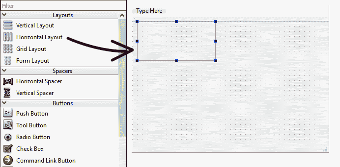
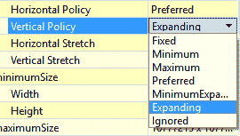
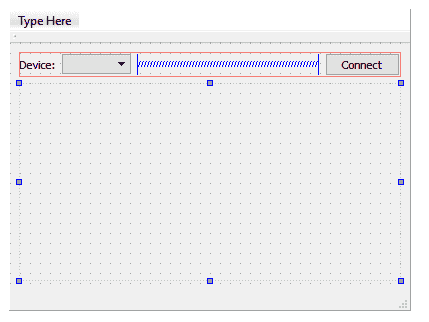
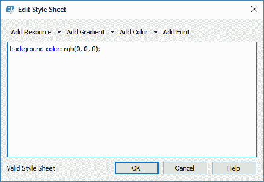
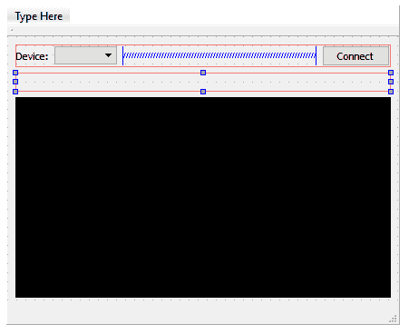
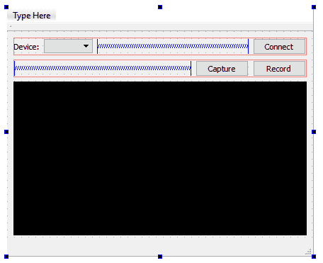
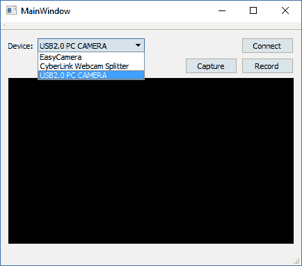

# 九、照相机模块

在以越来越大的难度完成了这么多章节之后，让我们为这一章尝试一些更简单、更有趣的东西吧！我们将学习如何通过 Qt 的多媒体模块访问我们的相机并使用它拍照。

在本章中，我们将涵盖以下主题:

*   Qt 多媒体模块
*   连接到摄像机
*   将摄像机图像捕获到文件中
*   将摄像机视频录制到文件中

您可以使用它来创建视频会议应用、安全摄像头系统等。我们开始吧！

# Qt 多媒体模块

Qt 中的多媒体模块是处理平台多媒体功能的模块，例如媒体回放以及相机和无线电设备的使用。本模块涵盖了广泛的主题，但我们将只关注本章的相机。

# 设置新项目

首先，创建一个新的 Qt Widgets 应用项目。

然后，我们首先需要做的是打开项目文件(`.pro`)并添加两个关键词— `multimedia`和`multimediawidgets`:

```cpp
QT += core gui multimedia multimediawidgets 
```

通过检测项目文件中的这些关键词，Qt 将在编译时将多媒体模块和所有与多媒体相关的小部件包含到您的项目中。多媒体模块包括以下四个主要组件:

*   声音的
*   录像
*   照相机
*   收音机

每个组件都包括一系列提供各自功能的类。通过使用这个模块，您不再需要自己实现低级的、特定于平台的代码。让 Qt 为你做这项工作。真的那么简单。

添加完多媒体模块后，我们打开`mainwindow.ui`将水平布局拖放到主窗口，如下图:



然后，在我们上一步刚刚添加的水平布局中添加一个标签、组合框(命名为`deviceSelection`)和一个按钮。之后，在组合框和按钮之间添加一个水平间隔，将它们相互推开。完成后，选择中心小部件，然后单击位于工作区上方的垂直布局按钮。

然后，在前一个水平布局的底部添加另一个水平布局，并右键单击它，然后选择变形为| QFrame。之后，将其大小策略(水平策略和垂直策略)设置设置为扩展。参考以下截图:



你的程序的用户界面现在应该是这样的:



我们将布局转换为框架的原因是，我们可以将大小策略(水平策略和垂直策略)设置为扩展。然而，如果我们只是从窗口小部件框中添加一个框架窗口小部件(本质上是一个 QFrame)，我们不会在其上获得稍后附加取景器所需的布局组件。

接下来，再次右键单击 QFrame 并选择“更改样式表”。将弹出一个窗口来设置该小部件的样式表。添加以下样式表代码使背景变黑:



此步骤是可选的；我们将其背景设为黑色，只是为了指示取景器的位置。完成后，让我们在 QFrame 上方放置另一个水平布局，如下所示:



之后，向水平布局添加两个按钮，并添加一个水平间隔以保持它们向右对齐:



就是这样；我们已经完成了多媒体模块的项目设置，并为接下来的部分很好地布局了用户界面。

# 连接到摄像机

最激动人心的部分来了。我们将学习如何使用 Qt 的多媒体模块访问我们的相机！首先，打开`mainwindow.h`并添加以下标题:

```cpp
#include <QMainWindow> 
#include <QDebug> 
#include <QCameraInfo> 
#include <QCamera> 
#include <QCameraViewfinder> 
#include <QCameraImageCapture> 
#include <QMediaRecorder> 
#include <QUrl> 
```

接下来，添加以下变量，如下所示:

```cpp
private: 
   Ui::MainWindow *ui; 
   QCamera* camera; 
   QCameraViewfinder* viewfinder; 
   bool connected; 
```

然后，打开`mainwindow.cpp`并在类构造函数中添加以下代码来初始化`QCamera`对象。然后，我们使用`QCameraInfo`类检索连接的摄像机列表，并在组合框小部件中填写该信息:

```cpp
MainWindow::MainWindow(QWidget *parent) : 
   QMainWindow(parent), 
   ui(new Ui::MainWindow) 
{ 
   ui->setupUi(this); 

   connected = false; 
   camera = new QCamera(); 

   qDebug() << "Number of cameras found:" << QCameraInfo::availableCameras().count(); 

   QList<QCameraInfo> cameras = QCameraInfo::availableCameras(); 
   foreach (const QCameraInfo &cameraInfo, cameras) 
   { 
         qDebug() << "Camera info:" << cameraInfo.deviceName() << 
         cameraInfo.description() << cameraInfo.position(); 

         ui->deviceSelection->addItem(cameraInfo.description()); 
   } 
} 
```

让我们现在构建并运行该项目。之后，检查计算机上检测到的任何摄像机的调试输出。已经检测到的摄像机也应该显示在下拉框中。如果您运行的笔记本电脑带有支持的摄像头，您应该会看到它的列表。如果您运行的系统没有内置摄像头，那么调试输出可能不会显示任何内容，下拉框也将保持为空。如果是这种情况，请尝试插入一个便宜的 USB 摄像头，然后再次运行该程序:



之后，打开`mainwindow.ui`，右键点击连接按钮，选择转到插槽....选择`clicked()`选项，点击确定。Qt Creator 会自动为你创建一个`slot`功能；将以下代码添加到函数中，如下所示:

```cpp
void MainWindow::on_connectButton_clicked() 
{ 
   if (!connected) 
   { 
         connectCamera(); 
   } 
   else 
   { 
         camera->stop(); 
         viewfinder->deleteLater(); 
         ui->connectButton->setText("Connect"); 
         connected = false; 
   } 
} 
```

当点击连接按钮时，我们首先通过检查`connect`变量来检查`camera`是否已经连接。如果还没有连接，我们运行`connectCamera()`函数，我们将在下一步中定义该函数。如果摄像机已经连接，我们停止`camera`，删除`viewfinder`，并将连接按钮的文本设置为`Connect`。最后，将`connected`变量设置为`false`。请注意，我们这里使用的是`deleteLater()`而不是`delete()`，这是删除内存指针的推荐方式。`deleteLater()`是对一个生活在没有运行事件循环的线程中的对象调用的，该对象将在线程结束时被销毁。

接下来，我们将在我们的`MainWindow`类中添加一个名为`connectCamera()`的新函数。该函数看起来像下面的代码块:

```cpp
void MainWindow::connectCamera() 
{ 
   QList<QCameraInfo> cameras = QCameraInfo::availableCameras(); 
   foreach (const QCameraInfo &cameraInfo, cameras) 
   { 
         qDebug() << cameraInfo.description() << ui->deviceSelection-
         >currentText(); 

         if (cameraInfo.description() == ui->deviceSelection- 
         >currentText()) 
         { 
               camera = new QCamera(cameraInfo); 
               viewfinder = new QCameraViewfinder(this); 
               camera->setViewfinder(viewfinder); 
               ui->webcamLayout->addWidget(viewfinder); 

               connected = true; 
               ui->connectButton->setText("Disconnect"); 

               camera->start(); 

               return; 
         } 
   } 
} 
```

在`connectCamera()`功能中，我们重复我们在构建中所做的，并获得当前连接的摄像机列表。然后，我们在列表中循环，并将摄像机的名称(存储在`description`变量中)与组合框小部件上当前选择的设备名称进行比较。

如果有一个匹配的名称，这意味着用户打算连接到那个特定的摄像机，因此我们将通过初始化一个`QCamera`对象和一个新的`QCameraViewFinder`对象来连接到那个摄像机。然后我们将`viewfinder`链接到`camera`并将`viewfinder`添加到黑色背景的布局中。然后，我们将`connected`变量设置为`true`，并将连接按钮的文本设置为`Disconnect`。最后，调用`start()`功能开始运行摄像头。

立即构建并运行项目。选择要连接的摄像机，然后单击“连接”按钮。您应该能够连接到相机，并在程序中看到自己:


如果您的相机无法连接，请执行以下步骤来显示操作系统返回的任何错误。首先，打开`mainwindow.h`并加入以下`slot`功能:

```cpp
private slots: 
   void cameraError(QCamera::Error error); 
```

之后，打开`mainwindow.cpp`并在`connectCamera()`功能中添加以下代码，将`error()`信号连接到`cameraError()`、`slot`功能:

```cpp
void MainWindow::connectCamera() 
{ 
   QList<QCameraInfo> cameras = QCameraInfo::availableCameras(); 
   foreach (const QCameraInfo &cameraInfo, cameras) 
   { 
         qDebug() << cameraInfo.description() << ui->deviceSelection-
         >currentText(); 

         if (cameraInfo.description() == ui->deviceSelection-
         >currentText()) 
         { 
               camera = new QCamera(cameraInfo); 
               viewfinder = new QCameraViewfinder(this); 
               camera->setViewfinder(viewfinder); 
               ui->webcamLayout->addWidget(viewfinder); 

               connect(camera, SIGNAL(error(QCamera::Error)), this, 
               SLOT(cameraError(QCamera::Error))); 

               connected = true; 
               ui->connectButton->setText("Disconnect"); 

               camera->start(); 

               return; 
         } 
   } 
} 
```

`cameraError()`槽功能如下:

```cpp
void MainWindow::cameraError(QCamera::Error error) 
{ 
   qDebug() << "Camera error:" << error; 

   connected = false; 
   camera->stop(); 
   ui->connectButton->setText("Connect"); 
} 
```

在前面的代码中，我们显示了错误消息，并确保摄像机已经完全停止，以防万一。通过查看错误消息，您应该能够更容易地调试问题。

# 将摄像机图像捕获到文件中

在前一节中，我们已经学习了如何使用 Qt 的多媒体模块连接到我们的相机。现在，我们将尝试从相机中捕获静止图像，并将其保存到 JPEG 文件中。用 Qt 其实非常非常简单。

首先，打开`mainwindow.h`并添加以下变量:

```cpp
private: 
   Ui::MainWindow *ui; 
   QCamera* camera; 
   QCameraViewfinder* viewfinder; QCameraImageCapture* imageCapture; bool connected; 
```

然后，右键单击`mainwindow.ui`中的捕获按钮，并选择转到插槽....然后，选择`clicked()`并按确定。现在，将在`mainwindow.cpp`中为您创建一个新的`slot`功能。添加以下代码以从相机捕获图像:

```cpp
void MainWindow::on_captureButton_clicked() 
{ 
   if (connected) 
   { 
         imageCapture = new QCameraImageCapture(camera); 
         camera->setCaptureMode(QCamera::CaptureStillImage); 
         camera->searchAndLock(); 
         imageCapture->capture(qApp->applicationDirPath()); 
         camera->unlock(); 
   } 
} 
```

我们在前面的代码中所做的基本上是创建一个新的`QCameraImageCapture`对象，并将其媒体对象设置为活动摄像机。然后，将其捕捉模式设置为静止图像。在我们要求`QCameraImageCapture`对象捕捉图像之前，我们必须锁定相机，以便在捕捉图像的过程中设置保持不变。成功拍摄图像后，您可以通过调用`camera->unlock()`来解锁。

我们使用`qApp->applicationDirPath()`获取应用目录，这样图像将与可执行文件一起保存。您可以将其更改为您想要的任何目录。您也可以将所需的文件名放在目录路径后面；否则，它将使用以`IMG_00000001.jpg`、`IMG_00000002.jpg`等开头的默认文件名格式依次保存图像。

# 将摄像机视频录制到文件中

在我们学习了如何从相机中捕捉静止图像之后，让我们继续学习如何录制视频。首先，打开`mainwindow.h`并添加以下变量:

```cpp
private: 
   Ui::MainWindow *ui; 
   QCamera* camera; 
   QCameraViewfinder* viewfinder; 
   QCameraImageCapture* imageCapture; 
   QMediaRecorder* recorder; 

   bool connected; 
   bool recording; 
```

接下来，再次打开`mainwindow.ui`，右键点击记录按钮。选择转到插槽...从菜单中选择`clicked()`选项，然后点击确定按钮。将为您创建一个`slot`功能；然后将以下代码添加到`slot`功能中:

```cpp
void MainWindow::on_recordButton_clicked() 
{ 
   if (connected) 
   { 
         if (!recording) 
         { 
               recorder = new QMediaRecorder(camera); 
               camera->setCaptureMode(QCamera::CaptureVideo); 
               recorder->setOutputLocation(QUrl(qApp-
               >applicationDirPath())); 
               recorder->record(); 
               recording = true; 
         } 
         else 
         { 
               recorder->stop(); 
               recording = false; 
         } 
   } 
} 
```

这次我们用一个`QMediaRecorder`来代替录制视频。在调用`recorder->record()`之前，我们还必须将相机的拍摄模式设置为`QCamera::CaptureVideo`。

要检查媒体记录器在记录阶段产生的错误信息，您可以将媒体记录器的`error()`信号连接到如下的`slot`功能:

```cpp
void MainWindow::on_recordButton_clicked() 
{ 
   if (connected) 
   { 
         if (!recording) 
         { 
               recorder = new QMediaRecorder(camera); 
               connect(recorder, SIGNAL(error(QMediaRecorder::Error)), 
               this, SLOT(recordError(QMediaRecorder::Error))); 
               camera->setCaptureMode(QCamera::CaptureVideo); 
               recorder->setOutputLocation(QUrl(qApp-
               >applicationDirPath())); 
               recorder->record(); 
               recording = true; 
         } 
         else 
         { 
               recorder->stop(); 
               recording = false; 
         } 
   } 
} 
```

然后，只需在`slot`功能中显示错误信息:

```cpp
void MainWindow::recordError(QMediaRecorder::Error error) 
{ 
   qDebug() << errorString(); 
} 
```

请注意，在撰写本章时，`QMediaRecorder`类仅支持在 macOS、Linux、移动平台和 Windows XP 上进行视频录制。它目前在 Windows 8 和 Windows 10 上不起作用，但它将在即将到来的版本之一中移植。主要原因是 Qt 正在使用微软的`DirectShow` API 在 Windows 平台上录制视频，但此后就被 Windows 操作系统弃用了。希望在您阅读这本书的时候，这个特性已经在适用于 Windows 8 和 10 的 Qt 中完全实现了。

如果还没有，你可以使用使用`OpenCV` API 录制视频的第三方插件，比如 **Qt 媒体编码库** ( **QtMEL** ) API，作为临时解决方案。请注意，QtMEL 中使用的代码与我们在本章中展示的代码完全不同。

For more information about QtMEL, please check out the following link:
[http://kibsoft.ru](http://kibsoft.ru).

# 摘要

在本章中，我们学习了如何使用 Qt 连接到我们的相机。我们还学习了如何从相机中捕捉图像或录制视频。在下一章中，我们将学习网络模块，并尝试使用 Qt 制作即时消息！