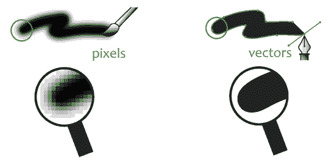
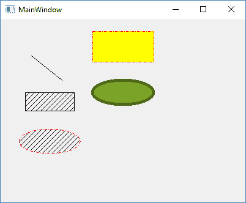
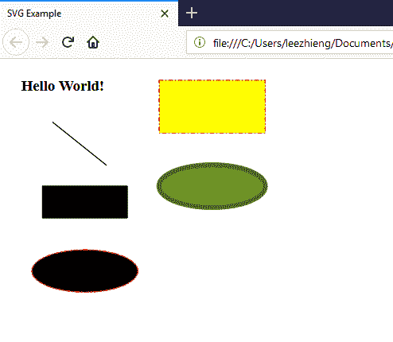
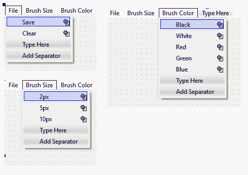
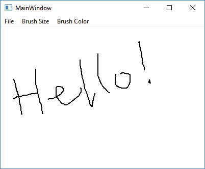
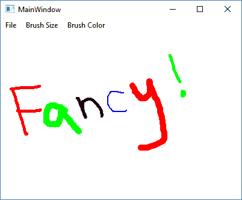

# 十一、实现图形编辑器

Qt 使用`QPainter`类为我们提供了低级别的图形渲染。Qt 能够渲染位图和矢量图像。在本章中，我们将学习如何使用 Qt 绘制形状，最后，创建一个我们自己的绘制程序。

在本章中，我们将涵盖以下主题:

*   绘制矢量形状
*   将矢量图像保存到 SVG 文件中
*   创建绘画程序

你准备好了吗？我们开始吧！

# 绘制矢量形状

在下一节中，我们将学习如何使用 QPainter 类在我们的 Qt 应用上渲染矢量图形。

# 矢量与位图

计算机图形学中有两种格式——位图和矢量。位图图像(也称为光栅图像)是存储为一系列称为**像素**的微小点的图像。每个像素将被分配一种颜色，并以存储的方式显示在屏幕上——像素和屏幕上显示的内容之间是一一对应的。

另一方面，矢量图像不是基于位图模式，而是使用数学公式来表示可以组合以创建几何形状的直线和曲线。

这里列出了这两种格式的主要特征:

*   位图:
    *   通常是更大的文件大小
    *   不能放大到更高的分辨率，因为图像质量会受到影响
    *   用于显示具有多种颜色的复杂图像，如照片
*   矢量:
    *   文件大小非常小
    *   图形可以在不影响图像质量的情况下调整大小
    *   每个形状只能应用有限数量的颜色(单色、渐变或图案)
    *   复杂的形状需要产生高处理能力

下图比较了位图和矢量图形:



在这一节中，我们将重点学习如何使用 Qt 绘制矢量图形，但我们也将在本章稍后介绍位图图形。

# 使用 QPainter 绘制矢量形状

首先，通过转到文件|新文件或项目来创建另一个 Qt 项目。然后在应用类别下选择 Qt 小部件应用。项目创建完成后，打开`mainwindow.h`并在`QPainter`表头添加:

```cpp
#include <QMainWindow> 
#include <QPainter> 
```

之后，我们还声明了一个名为`paintEvent()`的虚拟函数，这是 Qt 中的一个标准事件处理程序，每当有需要绘制的内容时都会被调用，无论是图形用户界面更新、窗口大小调整还是手动调用`update()`函数:

```cpp
public:
    explicit MainWindow(QWidget *parent = 0);
    ~MainWindow();
    virtual void paintEvent(QPaintEvent *event); 
```

然后，打开`mainwindow.cpp`并添加`paintEvent()`功能:

```cpp
void MainWindow::paintEvent(QPaintEvent *event) 
{ 
   QPainter painter; 
   painter.begin(this); 

   // Draw Line 
   painter.drawLine(QPoint(50, 60), QPoint(100, 100)); 

   // Draw Rectangle 
   painter.setBrush(Qt::BDiagPattern); 
   painter.drawRect(QRect(40, 120, 80, 30)); 

   // Draw Ellipse 
   QPen ellipsePen; 
   ellipsePen.setColor(Qt::red); 
   ellipsePen.setStyle(Qt::DashDotLine); 
   painter.setPen(ellipsePen); 
   painter.drawEllipse(QPoint(80, 200), 50, 20); 

   // Draw Rectangle 
   QPainterPath rectPath; 
   rectPath.addRect(QRect(150, 20, 100, 50)); 
   painter.setPen(QPen(Qt::red, 1, Qt::DashDotLine, Qt::FlatCap, 
   Qt::MiterJoin)); 
   painter.setBrush(Qt::yellow); 
   painter.drawPath(rectPath); 

   // Draw Ellipse 
   QPainterPath ellipsePath; 
   ellipsePath.addEllipse(QPoint(200, 120), 50, 20); 
   painter.setPen(QPen(QColor(79, 106, 25), 5, Qt::SolidLine, 
   Qt::FlatCap, Qt::MiterJoin)); 
   painter.setBrush(QColor(122, 163, 39)); 
   painter.drawPath(ellipsePath); 

   painter.end(); 
} 
```

如果现在构建程序，您应该会看到以下内容:



前面的代码真的很长。我们把它分解一下，这样你更容易理解。每当`paintEvent()`被调用时(通常需要绘制窗口时会调用一次)，我们就调用`QPainter::begin()`告诉 Qt 我们要绘制一些东西，完成后我们就调用`QPainter::end()`。因此，绘制图形的代码将包含在`QPainter::begin()`和`QPainter::end()`中。

让我们看看以下步骤:

1.  我们画的第一个东西是一条直线，很简单——只需调用`QPainter::drawLine()`并将起点和终点值插入到函数中。请注意，Qt 使用的坐标系是像素格式的。它的原点从应用窗口的左上角开始，根据 *x* 和 *y* 的值，向右和向下增加。 *x* 值的增量将位置向右移动，而 *y* 值的增量将位置向下移动。
2.  接下来，在形状中绘制一个带有阴影图案的矩形。这次我们先调用`QPainter::setBrush()`设置模式，再调用`drawRect()`。
3.  之后，我们绘制了一个椭圆形状，该形状内有点划线轮廓和阴影图案。既然上一步已经设置好了模式，就不用再做了。相反，我们使用 QPen 类在调用`drawEllipse()`之前设置轮廓样式。请记住，在 Qt 的术语中，画笔用于定义形状的内部颜色或图案，而钢笔用于定义轮廓。
4.  接下来的两个形状与前面的基本相似；我们只是改变了不同的颜色和图案，这样你就可以看到它们和前面例子的区别。

# 绘图文本

此外，还可以使用`QPainter`类绘制文本。你只需要在调用`QPainter::drawText()`之前调用`QPainter::setFont()`设置字体属性，比如:

```cpp
QPainter painter; 
painter.begin(this); 

// Draw Text 
painter.setFont(QFont("Times", 14, QFont::Bold)); 
painter.drawText(QPoint(20, 30), "Testing"); 

// Draw Line 
painter.drawLine(QPoint(50, 60), QPoint(100, 100)) 
```

`setFont()`功能是可选的，因为如果您不指定它，您将获得默认字体。完成后，构建并运行程序。你应该看看 Hello World 这个词！显示在窗口中:


正如您在这里看到的，矢量形状基本上是由 Qt 实时生成的，无论您如何重新缩放窗口并更改其纵横比，它看起来都非常好。如果您转而渲染位图图像，当它随窗口一起重新缩放或纵横比改变时，它的视觉质量可能会降低。

# 将矢量图像保存到 SVG 文件中

除了绘制矢量图形，Qt 还允许我们将这些图形保存到矢量图像文件中，称为 **SVG** ( **可缩放矢量图形**)文件格式。SVG 格式是一种开放格式，被许多软件使用，包括显示矢量图形的网络浏览器。事实上，Qt 也可以读取 SVG 文件并在屏幕上呈现它们，但我们现在将跳过这一点。让我们来看看如何将矢量图形保存到一个 SVG 文件中！

这个例子延续了我们在上一节中留下的内容。因此，我们不必创建一个新的 Qt 项目，只需坚持之前的项目即可。

首先，让我们在主窗口中添加一个菜单栏，如果它还没有的话。然后，打开`mainwindow.ui`，在表单编辑器中，右键单击层次窗口上的主窗口对象，选择创建菜单栏:


完成后，将“文件”添加到菜单栏中，然后在它下面添加“另存为 SVG”:


然后，转到底部的操作编辑器，右键单击我们刚刚添加的菜单选项，并选择转到插槽...：


会弹出一个窗口，让你选择一个信号。选择已触发()，然后单击确定。在`mainwindow.cpp`会为你创建一个新的槽功能。在我们打开`mainwindow.cpp`之前，让我们打开我们的`project file` ( `.pro`)并添加以下`svg`模块:

```cpp
QT += core gui svg 
```

`svg`关键字告诉 Qt 向您的项目中添加相关的类，可以帮助您处理 SVG 文件格式。然后，我们还需要向我们的`mainwindow.h`添加两个标题:

```cpp
#include <QtSvg/QSvgGenerator> 
#include <QFileDialog> 
```

之后，打开`mainwindow.cpp`，将下面的代码添加到我们上一步刚刚添加的槽函数中:

```cpp
void MainWindow::on_actionSave_as_SVG_triggered() 
{ 
    QString filePath = QFileDialog::getSaveFileName(this, "Save SVG", "", "SVG files (*.svg)"); 

    if (filePath == "") 
        return; 

    QSvgGenerator generator; 
    generator.setFileName(filePath); 
    generator.setSize(QSize(this->width(), this->height())); 
    generator.setViewBox(QRect(0, 0, this->width(), this->height())); 
    generator.setTitle("SVG Example"); 
    generator.setDescription("This SVG file is generated by Qt."); 

    paintAll(&generator); 
} 
```

在前面的代码中，我们使用`QFileDialog`让用户选择他们想要保存 SVG 文件的位置。然后，我们使用`QSvgGenerator`类将图形导出到一个 SVG 文件中。最后，我们调用了`paintAll()`函数，这是我们将在下一步中定义的自定义函数。

实际上，我们需要修改现有的`paintAll()`方法，并将我们的渲染代码放入其中。然后，将`QSvgGenerator`对象作为绘制设备传入功能输入:

```cpp
void MainWindow::paintAll(QSvgGenerator *generator) 
{ 
    QPainter painter; 

    if (generator) 
        painter.begin(generator); 
    else 
        painter.begin(this); 

   // Draw Text 
    painter.setFont(QFont("Times", 14, QFont::Bold)); 
   painter.drawText(QPoint(20, 30), "Hello World!"); 
```

因此，我们的`paintEvent()`现在在`mainwindow.cpp`中简单地看起来是这样的:

```cpp
void MainWindow::paintEvent(QPaintEvent *event) 
{ 
   paintAll(); 
} 
```

这里的过程可能看起来有点混乱，但是它所做的基本上是在创建窗口时调用`paintAll()`函数一次绘制所有图形，然后当您想要将图形保存到一个 SVG 文件时，您再次调用`paintAll()`。

唯一不同的是绘制设备——一个是主窗口本身，我们将其用作绘图画布，对于后一个，我们将传递`QSvgGenerator`对象作为绘制设备，它将把图形保存到一个 SVG 文件中。

现在构建并运行程序，点击文件|保存 SVG 文件，你应该可以将图形保存到一个 SVG 文件中。尝试用网络浏览器打开文件，看看它是什么样子:



似乎我的网络浏览器(火狐)不支持阴影模式，但其他事情证明是好的。由于矢量图形由程序生成，形状不存储在 SVG 文件中(只存储数学公式及其变量)，因此您可能需要确保用户平台支持您使用的功能。

在下一节中，我们将学习如何创建我们自己的绘画程序并使用它绘制位图图像！

# 创建绘画程序

在下一节中，我们将进入像素领域，学习如何使用 Qt 创建一个绘画程序。用户将能够通过使用不同大小和颜色的画笔来绘制像素图像来表达他们的创造力！

# 设置用户界面

同样，对于这个例子，我们将创建一个新的 Qt 小部件应用。之后，打开`mainwindow.ui`，在主窗口增加一个菜单栏。然后，向菜单栏添加以下选项:



菜单栏上有三个菜单项——文件、画笔大小和画笔颜色。“文件”菜单下有将画布保存为位图文件以及清除整个画布的功能。画笔大小类别包含不同的画笔大小选项；最后但同样重要的是，“画笔颜色”类别包含几个设置画笔颜色的选项。

你可以在图形用户界面设计中使用更多类似于*绘画的*或*类似于 Photoshop 的*，但为了简单起见，我们现在将使用这个。

完成所有这些后，打开`mainwindow.h`并在顶部添加以下标题:

```cpp
#include <QMainWindow> 
#include <QPainter> 
#include <QMouseEvent> 
#include <QFileDialog> 
```

之后，我们还声明了几个虚函数，比如:

```cpp
public:
    explicit MainWindow(QWidget *parent = 0);
    ~MainWindow();
    virtual void mousePressEvent(QMouseEvent *event); 
    virtual void mouseMoveEvent(QMouseEvent *event); 
    virtual void mouseReleaseEvent(QMouseEvent *event); 
    virtual void paintEvent(QPaintEvent *event); 
    virtual void resizeEvent(QResizeEvent *event); 
```

除了我们在前面例子中使用的`paintEvent()`函数，我们还可以添加一些用于处理鼠标事件和窗口大小调整事件的函数。然后，我们还将以下变量添加到我们的`MainWindow`类中:

```cpp
private: 
    Ui::MainWindow *ui; 
 QImage image; 
    bool drawing; 
    QPoint lastPoint; 
    int brushSize; 
    QColor brushColor; 
```

之后，我们打开`mainwindow.cpp`，从类构造器开始:

```cpp
MainWindow::MainWindow(QWidget *parent) : 
    QMainWindow(parent), 
    ui(new Ui::MainWindow) 
{ 
    ui->setupUi(this); 

 image = QImage(this->size(), QImage::Format_RGB32); 
    image.fill(Qt::white); 

    drawing = false; 
    brushColor = Qt::black; 
    brushSize = 2; 
} 
```

我们需要首先创建一个`QImage`对象，它充当画布，并设置其大小以匹配我们的窗口大小。然后，我们将默认笔刷颜色设置为黑色，默认大小设置为`2`。之后，我们将看看每个事件处理程序及其工作原理。

首先我们来看一下`paintEvent()`函数，这个函数我们也用在了矢量图形中，比如。这一次，它所做的只是调用`QPainter::drawImage()`并在我们的主窗口上渲染`QImage`对象(我们的图像缓冲区):

```cpp
void MainWindow::paintEvent(QPaintEvent *event)
{
    QPainter canvasPainter(this);
    canvasPainter.drawImage(this->rect(), image, image.rect());
}
```

接下来，我们将看看`resizeEvent()`功能，每当用户调整主窗口大小时，该功能就会被触发。为了避免图像拉伸，我们必须调整图像缓冲区的大小以匹配新的窗口大小。这可以通过创建一个新的`QImage`对象并将其大小设置为与调整大小后的主窗口相同，然后复制先前 QImage 的像素信息并将其放置在新图像缓冲区的完全相同的位置来实现。

这意味着，如果窗口大小小于绘图，您的图像将被裁剪，但至少在调整窗口大小时，画布不会被拉伸和扭曲图像。让我们看看代码:

```cpp
void MainWindow::resizeEvent(QResizeEvent *event) 
{ 
    QImage newImage(event->size(), QImage::Format_RGB32); 
    newImage.fill(qRgb(255, 255, 255)); 

    QPainter painter(&newImage); 
    painter.drawImage(QPoint(0, 0), image); 
    image = newImage; 
} 
```

接下来，我们将看看鼠标事件处理程序，我们使用它在画布上应用颜色。首先是`mousePressEvent()`功能，当我们开始按鼠标键(这里是鼠标左键)的时候就会被触发。此时我们仍然没有绘制任何东西，但是将绘制布尔设置为`true`，并将光标位置保存到`lastPoint`变量:

```cpp
void MainWindow::mousePressEvent(QMouseEvent *event) 
{ 
    if (event->button() == Qt::LeftButton) 
    { 
        drawing = true; 
        lastPoint = event->pos(); 
    } 
} 
```

然后，这里是`mouseMoveEvent()`功能，鼠标光标移动时会调用该功能:

```cpp
void MainWindow::mouseMoveEvent(QMouseEvent *event) 
{ 
    if ((event->buttons() & Qt::LeftButton) && drawing) 
    { 
        QPainter painter(&image); 
        painter.setPen(QPen(brushColor, brushSize, Qt::SolidLine, 
        Qt::RoundCap, Qt::RoundJoin)); 
        painter.drawLine(lastPoint, event->pos()); 

        lastPoint = event->pos(); 
        this->update(); 
    } 
} 
```

在前面的代码中，我们检查在按住鼠标左键的同时是否确实在移动鼠标。如果是的话，那么我们从上一个光标位置到当前光标位置画一条线。然后，我们将当前光标位置保存到`lastPoint`变量，调用`update()`通知 Qt 触发`paintEvent()`功能。

最后，当我们松开鼠标左键时，会调用`mouseReleaseEvent()`。我们只需将绘图变量设置为`false`，我们就完成了:

```cpp
void MainWindow::mouseReleaseEvent(QMouseEvent *event) 
{ 
    if (event->button() == Qt::LeftButton) 
    { 
        drawing = false; 
    } 
} 
```

如果我们现在构建程序并运行它，我们应该能够开始在我们的小画图程序上绘制一些东西:



即使我们现在可以画一些东西，但它的画笔大小和颜色一直都是一样的。那有点无聊！让我们右键单击主菜单中画笔大小类别的每个选项，然后选择转到插槽...，然后选择触发()选项，然后按确定。然后 Qt 会相应地为我们创建槽函数，我们需要在这些函数中做的基本上是更改 brushSize 变量，如下所示:

```cpp
void MainWindow::on_action2px_triggered() 
{ 
    brushSize = 2; 
} 

void MainWindow::on_action5px_triggered() 
{ 
    brushSize = 5; 
} 

void MainWindow::on_action10px_triggered() 
{ 
    brushSize = 10; 
} 
```

“画笔颜色”类别下的所有选项也是如此。这次，我们相应地设置`brushColor`变量:

```cpp
void MainWindow::on_actionBlack_triggered() 
{ 
    brushColor = Qt::black; 
} 

void MainWindow::on_actionWhite_triggered() 
{ 
    brushColor = Qt::white; 
} 

void MainWindow::on_actionRed_triggered() 
{ 
    brushColor = Qt::red; 
} 

void MainWindow::on_actionGreen_triggered() 
{ 
    brushColor = Qt::green; 
} 

void MainWindow::on_actionBlue_triggered() 
{ 
    brushColor = Qt::blue; 
} 
```

如果您再次构建并运行该程序，您将能够使用画笔的各种设置来绘制图像:



除此之外，我们还可以添加一个现有的位图图像到我们的画布上，这样我们就可以在上面画画。假设我有一个 PNG 图像形式的企鹅图像(称为`tux.png`)，然后我们可以将以下代码添加到类构造函数中:

```cpp
MainWindow::MainWindow(QWidget *parent) : 
    QMainWindow(parent), 
    ui(new Ui::MainWindow) 
{ 
    ui->setupUi(this); 

    image = QImage(this->size(), QImage::Format_RGB32); 
    image.fill(Qt::white); 

    QImage tux; 
    tux.load(qApp->applicationDirPath() + "/tux.png"); 
    QPainter painter(&image); 
    painter.drawImage(QPoint(100, 100), tux); 

    drawing = false; 
    brushColor = Qt::black; 
    brushSize = 2; 
} 
```

前面的代码基本上打开了图像文件，并将其移动到 100 x 100 的位置，然后将图像绘制到我们的图像缓冲区。现在，每当我们启动程序时，我们都能在画布上看到一只企鹅:


接下来，我们将查看文件下的清除选项。当用户点击菜单栏上的这个选项时，我们使用以下代码清除整个画布(包括企鹅)并重新开始:

```cpp
void MainWindow::on_actionClear_triggered() 
{ 
    image.fill(Qt::white); 
    this->update(); 
} 
```

最后，当用户单击文件下的保存选项时，我们打开一个文件对话框，让用户将他们的图稿保存到位图文件中。在下面的代码中，我们过滤掉了图像格式，只允许用户保存 PNG 和 JPEG 格式:

```cpp
void MainWindow::on_actionSave_triggered() 
{ 
    QString filePath = QFileDialog::getSaveFileName(this, "Save Image", "", "PNG (*.png);;JPEG (*.jpg *.jpeg);;All files (*.*)"); 

    if (filePath == "") 
        return; 

    image.save(filePath); 
} 
```

就这样，我们成功地用 Qt 从头开始创建了一个简单的绘画程序！您甚至可以将本章学到的知识与上一章结合起来，创建一个在线协作白板！唯一的限制是你的创造力。最后，我要感谢所有的读者使用我们新创建的绘画程序创作了以下杰作:


# 摘要

在这一章中，我们学习了如何绘制矢量和位图图形，随后我们使用 Qt 创建了自己的绘画程序。在下一章中，我们将探讨创建一个将数据传输和存储到云的程序的各个方面。