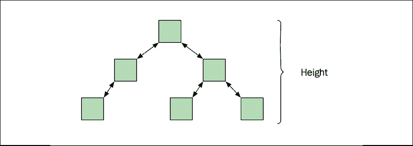
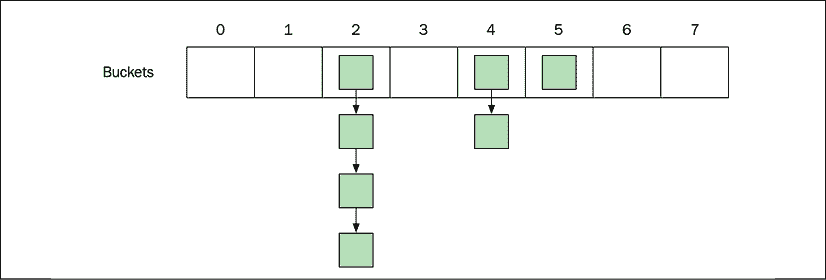
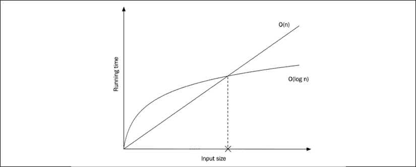
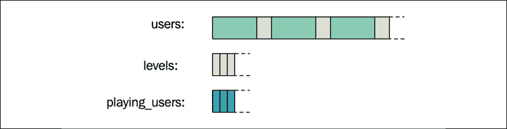

# 四、数据结构

在最后一章中，我们讨论了如何分析时间和内存复杂性以及如何衡量性能。在本章中，我们将讨论如何从标准库中选择和使用数据结构。为了理解为什么某些数据结构在今天的计算机上工作得非常好，我们首先需要介绍一些关于计算机内存的基础知识。在本章中，您将了解:

*   计算机内存的特性
*   标准库容器:序列容器和关联容器
*   标准库容器适配器
*   并行阵列

在我们开始浏览标准库提供的容器和一些其他有用的数据结构之前，我们将简要讨论计算机内存的一些属性。

# 计算机内存的特性

C++ 将内存视为一系列单元。每个单元的大小是 1 字节，每个单元都有一个地址。通过地址访问内存中的一个字节是一个恒定时间的操作，*0(1)*，换句话说，它与内存单元的总数无关。在 32 位机器上，理论上可以寻址 2 <sup class="Superscript--PACKT-">32</sup> 字节，也就是 4 GB 左右，这限制了一个进程一次可以使用的内存量。在 64 位机器上，理论上可以寻址 2 <sup class="Superscript--PACKT-">64</sup> 字节，这个字节太大了，几乎没有地址用完的风险。

下图显示了在内存中布局的存储单元序列。每个单元包含 8 位。十六进制数是存储单元的地址:

<figure class="mediaobject"></figure>

图 4.1:存储单元序列

由于通过地址访问一个字节是一个 *O(1)* 操作，从程序员的角度来看，很容易相信每个存储单元的访问速度都一样快。这种内存方法在很多情况下都很简单，也很有用，但是在选择有效使用的数据结构时，您需要考虑现代计算机中存在的内存层次结构。内存层次结构的重要性增加了，因为与当今处理器的速度相比，从主内存中读取和写入所需的时间变得更加昂贵。下图显示了具有一个中央处理器和四个内核的机器的体系结构:

<figure class="mediaobject"></figure>

图 4.2:具有四个内核的处理器示例；标记为 L1i、L1d、L2 和 L3 的框是内存缓存

我目前正在 2018 年的 MacBook Pro 上写这一章，它配备了英特尔四核 i7 CPU。在这款处理器上，每个内核都有自己的 L1 和 L2 缓存，而三级缓存由所有四个内核共享。从终端运行以下命令:

```cpp
sysctl -a hw 
```

给了我以下信息:

```cpp
hw.memsize: 17179869184
hw.cachelinesize: 64
hw.l1icachesize: 32768
hw.l1dcachesize: 32768
hw.l2cachesize: 262144
hw.l3cachesize: 8388608 
```

上报的`hw.memsize`是主存总量，本例为 16 GB。

向报告的`hw.cachelinesize`是 64 字节，是高速缓存行的大小，也称为块。访问内存中的一个字节时，机器不仅仅是获取被请求的字节；相反，机器总是获取一个高速缓存行，在这种情况下，是 64 字节。中央处理器和主存储器之间的各种高速缓存跟踪 64 字节的块，而不是单个字节。

`hw.l1icachesize`是 L1 指令缓存的大小。这是一个 32 KB 的高速缓存，专用于存储中央处理器最近使用过的指令。`hw.l1dcachesize`也是 32 KB，专用于数据，而不是指令。

最后，我们可以读取 L2 缓存和三级缓存的大小，分别为 256 KB 和 8 MB。一个重要的观察是，与可用的主内存量相比，缓存很小。

在不提供从缓存层次结构中的每一层访问数据所需的实际周期数的任何详细事实的情况下，一个非常粗略的准则是两个相邻层(例如，L1 和 L2)之间的延迟存在数量级的差异。下表显示了彼得·诺维格在一篇名为《十年内自学编程，2001 年》([http://norvig.com/21-days.html](http://norvig.com/21-days.html))的文章中提供的延迟数字摘录。这个完整的表通常被称为*延迟数，每个程序员都应该知道*，并归功于杰夫·迪恩:

<colgroup><col> <col></colgroup> 
| L1 缓存引用 | 0.5 ns |
| L2 缓存引用 | 7 ns |
| 主存储器参考 | 100 ns |

以充分利用高速缓存的方式构建数据会对性能产生巨大影响。访问最近使用过的数据，因此可能已经驻留在缓存中，这将使您的程序更快。这就是所谓的**时间地点**。

此外，访问位于您正在使用的其他数据附近的数据将增加您需要的数据已经在先前从主存储器中提取的高速缓存行中的可能性。这就是所谓的**空间位置**。

不断清除内部循环中的缓存行可能会导致非常糟糕的性能。这就是有时被称为**缓存抖动**。让我们看一个例子:

```cpp
constexpr auto kL1CacheCapacity = 32768; // The L1 Data cache size 
constexpr auto kSize = kL1CacheCapacity / sizeof(int); 
using MatrixType = std::array<std::array<int, kSize>, kSize>; 
auto cache_thrashing(MatrixType& matrix) { 
  auto counter = 0;
  for (auto i = 0; i < kSize; ++ i) {
    for (auto j = 0; j < kSize; ++ j) {
      matrix[i][j] = counter++ ;
    }
  }
} 
```

这个版本在我的电脑上运行大约需要 40 毫秒。但是，只需将内部循环中的线路更改为以下内容，完成该功能所需的时间就会从 40 毫秒增加到 800 毫秒以上:

```cpp
matrix[j][i] = counter++ ; 
```

在第一个例子中，当使用`matrix[i][j]`时，大部分时间我们将访问已经在 L1 缓存中的内存，而在使用`matrix[j][i]`的修改版本中，每次访问都将生成一个 L1 缓存未命中。几张图片可能有助于你理解正在发生的事情。这里显示的是一个微小的 3 x 3 矩阵，而不是绘制完整的 32768 x 32768 矩阵。

<figure class="mediaobject"></figure>

图 4.3:3x 3 矩阵

即使这可能是我们对矩阵如何驻留在记忆中的想象，也没有二维记忆这种东西。相反，当这个矩阵被布置在一维存储空间中时，它看起来像这样:

<figure class="mediaobject"></figure>

图 4.4:一维记忆空间中的二维矩阵

也就是说，它是一个连续的元素数组，一行一行地排列。在我们算法的快速版本中，数字按照它们在内存中连续排列的相同顺序依次访问，如下所示:

<figure class="mediaobject"></figure>

图 4.5:快速顺序跨步-1 访问

而在算法的慢版本中，以完全不同的模式访问元素。使用慢速版本访问前四个元素现在看起来是这样的:

<figure class="mediaobject"></figure>

图 4.6:使用较大步幅的慢速访问

由于空间局部性差，以这种方式访问数据要慢得多。现代处理器通常还配备有**预取器**，它可以自动识别内存访问模式，并尝试将数据从内存预取到可能在不久的将来被访问的缓存中。对于较小的步幅，预取员往往表现最好。你可以在兰道尔·e·布莱恩特和大卫·r·O·哈拉伦的优秀著作《计算机系统，程序员的视角》中读到更多关于这方面的内容。

总结这一节，即使内存访问是恒定时间操作，缓存也会对访问内存的实际时间产生显著影响。在使用或实现新的数据结构时，这一点要时刻牢记在心。

接下来，我将介绍一组来自 C++ 标准库的数据结构，称为容器。

# 标准库容器

C++ 标准库提供了一组非常有用的容器类型。容器是包含元素集合的数据结构。容器管理它保存的元素的内存。这意味着我们不必显式地创建和删除放在容器中的对象。我们可以将在堆栈上创建的对象传递给一个容器，该容器会将它们复制并存储在自由存储中。

迭代器用于访问容器中的元素，因此是理解标准库中算法和数据结构的基本概念。迭代器的概念包含在*第 5 章*、*算法*中。对于本章来说，知道迭代器可以被认为是指向元素的指针就足够了，迭代器根据它们所属的容器定义了不同的运算符。例如，类似数组的数据结构为其元素提供随机访问迭代器。这些迭代器支持使用`+`和`-`的算术表达式，而例如链表的迭代器只支持`++ `和`--`运算符。

容器分为三类:序列容器、关联容器和容器适配器。本节将简要介绍这三类容器中的每一类，并阐述当性能成为问题时需要考虑的最重要的事情。

## 序列容器

序列容器将元素按照我们在向容器添加元素时指定的顺序保存。标准库中的序列容器有`std::array`、`std::vector`、`std::deque`、`std::list`和`std::forward_list`。我也将在这一节讨论`std::basic_string`，虽然它不是一个正式的通用序列容器，因为它只处理字符类型的元素。

在选择序列容器之前，我们应该知道以下问题的答案:

1.  元素的数量是多少(数量级)？
2.  有哪些使用模式？您多久添加一次数据？读取/遍历数据？删除数据？重新排列数据？
3.  在序列中，您最常添加数据的位置是哪里？在结尾，在开头，还是在序列的中间？
4.  需要对元素进行排序吗？或者你在乎订单吗？

根据这些问题的答案，我们可以确定哪些序列容器或多或少适合我们的需求。但是，要做到这一点，我们需要对每种序列容器的接口和性能特征有一个基本的了解。

接下来的章节将简要介绍不同的序列容器，首先介绍一个最广泛使用的容器。

### 向量和数组

`std::vector`大概是最常用的容器类型，而且理由很充分。向量是一个数组在需要时动态增长。添加到向量中的元素保证在内存中连续布局，这意味着您可以通过数组的索引在恒定时间内访问数组中的任何元素。这也意味着，由于前面提到的空间局部性，它在按照元素的布局顺序遍历元素时提供了出色的性能。

一个向量有一个**大小**和一个**容量**。大小是容器中当前容纳的元素数量，容量是向量在需要分配更多空间之前可以容纳的元素数量:

<figure class="mediaobject"></figure>

图 4.7:标准向量的大小和容量

使用`push_back()`功能将元素添加到向量的末尾是快速的，只要大小小于容量即可。当添加一个元素并且没有更多空间时，向量将分配一个新的内部缓冲区，然后将所有元素移动到新的空间。正如我们在*第三章*、*分析和测量性能*中所讨论的那样，容量将以很少发生调整缓冲区大小的方式增长，从而使`push_back()`成为摊销的恒定时间操作。

类型为`std::vector<Person>`的矢量模板实例将按值存储`Person`对象。当向量需要重新排列`Person`对象时(例如，作为插入的结果)，值将被复制构造或移动。如果对象具有`nothrow`移动构造函数，它们将被移动。否则，这些对象将被复制构造，以保证强异常安全:

```cpp
Person(Person&& other) {         // Will be copied 
   // ...
} 
Person(Person&& other) noexcept { // Will be moved 
   // ...
} 
```

在内部，`std::vector`使用`std::move_if_noexcept`来确定对象是应该复制还是移动。`<type_traits>`头可以帮助您在编译时验证您的类在移动时保证不会抛出异常:

```cpp
static_assert(std::is_nothrow_move_constructible<Person>::value); 
```

如果您要将新创建的对象添加到矢量中，您可以利用`emplace_back()`功能，该功能将为您就地创建对象，而不是创建一个对象，然后使用`push_back()`功能将其复制/移动到矢量中:

```cpp
persons.emplace_back("John", 65); 
```

向量的容量可以通过以下方式改变:

*   通过在`capacity == size`时向向量添加一个元素
*   通过呼叫`reserve()`
*   通过呼叫`shrink_to_fit()`

除此之外，向量不会改变容量，因此不会分配或解除分配动态内存。例如，成员函数`clear()`清空一个向量，但不改变其容量。这些内存保证使得向量即使在实时环境中也是可用的。

从 C++ 20 开始，还有两个自由函数可以从`std::vector`中删除元素。在 C++ 20 之前，我们必须使用*擦除-移除成语*，我们将在*第 5 章*、*算法*中讨论。然而，现在推荐的从`std::vector`中删除元素的方法是使用`std::erase()`和`std::erase_if()`。下面是如何使用这些功能的一个简短示例:

```cpp
auto v = std::vector{-1, 5, 2, -3, 4, -5, 5};
std::erase(v, 5);                               // v: [-1,2,-3,4,-5]
std::erase_if(v, [](auto x) { return x < 0; }); // v: [2, 4] 
```

作为动态大小向量的替代，标准库还提供了一个名为`std::array`的固定大小版本，该版本通过使用堆栈而不是自由存储来管理其元素。数组的大小是在编译时指定的模板参数，这意味着大小和类型元素成为具体类型的一部分:

```cpp
auto a = std::array<int, 16>{};
auto b = std::array<int, 1024>{}; 
```

在本例中，`a`和`b`不是同一个类型，这意味着当使用类型作为函数参数时，您必须指定大小:

```cpp
auto f(const std::array<int, 1024>& input) { 
  // ... 
} 

f(a);  // Does not compile, f requires an int array of size 1024 
```

这一开始看起来有点乏味，但这实际上是内置数组类型(C 数组)的最大优势，它在传递给函数时会丢失大小信息，因为它会自动将指针转换为数组的第一个元素:

```cpp
// input looks like an array, but is in fact a pointer 
auto f(const int input[]) {  
  // ... 
} 

int a[16]; 
int b[1024]; 
f(a); // Compiles, but unsafe 
```

失去大小信息的阵列通常被称为**阵列衰减**。稍后，您将在一章中看到如何通过使用`std::span`将连续数据传递给函数来避免数组衰减。

### 双端队列

有时候，你会发现自己处于的情况，你需要频繁地在一个序列的开头和结尾添加元素。如果你使用的是`std::vector`并且需要加速前面的插页，你可以改为使用`std::deque`，这是**双头队列**的缩写。`std::deque`通常被实现为固定大小数组的集合，这使得在恒定时间内通过元素的索引来访问元素成为可能。但是，如下图所示，并非所有元素都连续存储在内存中，这就是`std::vector`和`std::array`的情况。

<figure class="mediaobject"></figure>

图 4.8:标准的可能布局

### 列表和转发列表

`std::list`是一个**双向链表**，这意味着每个元素都有一个到下一个元素的链接和一个到前一个元素的链接。这使得向后和向前遍历列表成为可能。还有一个**单链表**名为`std::forward_list`。你不会总是选择双向链表而不是`std::forward_list`的原因是双向链表中的反向指针占用了过多的内存。所以，如果不需要向后遍历列表，使用`std::forward_list`。转发列表的另一个有趣的特性是，它针对非常短的列表进行了优化。当列表为空时，它只占用一个单词，这使得它成为稀疏数据的可行数据结构。

请注意，即使元素是按顺序排列的，它们也是*而不是*像向量和数组一样在内存中连续排列，这意味着与向量相比，迭代链表很可能会产生更多的缓存未命中。

简单回顾一下，`std::list`是一个双向链表，带有指向下一个和上一个元素的指针:

<figure class="mediaobject"></figure>

图 4.9: std::list 是一个双向链表

`std::forward_list`是一个单链表，带有指向下一个元素的指针:

<figure class="mediaobject"></figure>

图 4.10: std::forward_list 是一个单链表

`std::forward_list`的内存效率更高，因为它只有一个指向下一个元素的指针。

列表也是唯一支持**拼接**的容器，这是一种在列表之间传输元素的方式，无需复制或移动元素。这意味着，例如，可以在恒定时间内将两个列表连接成一个，*0(1)*。其他容器至少需要线性时间进行这种操作。

### 基本字符串

我们将在本节中介绍的最后一个模板类是`std::basic_string`。`std::string`是`std::basic_string<char>`的`typedef`。从历史上看，`std::basic_string`并不能保证在记忆中连续布局。C++ 17 改变了这一点，它使得将字符串传递给需要字符数组的 API 成为可能。例如，下面的代码将整个文件读入一个字符串:

```cpp
auto in = std::ifstream{"file.txt", std::ios::binary | std::ios::ate}; 
if (in.is_open()) { 
  auto size = in.tellg(); 
  auto content = std::string(size, '\0'); 
  in.seekg(0); 
  in.read(&content[0], size); 
  // "content" now contains the entire file 
} 
```

通过使用`std::ios::ate`打开文件，位置指示器被设置到流的末尾，这样我们就可以使用`tellg()`来检索文件的大小。之后，我们将输入位置设置到流的开头并开始读取。

`std::basic_string`的大多数实现都利用了一种叫做**小对象优化**的东西，这意味着如果字符串的大小很小，它们不会分配任何动态内存。我们将在本书后面讨论小对象优化。现在，让我们继续讨论关联容器。

## 关联容器

关联容器基于元素本身放置它们的元素。例如，不可能像我们使用`std::vector::push_back()`或`std::list::push_front()`那样，在关联容器的后面或前面添加元素。相反，添加元素的方式使得无需扫描整个容器就可以找到元素。因此，关联容器对我们想要存储在容器中的对象有一些要求。我们将在稍后查看这些要求。

关联容器有两个主要类别:

*   **有序关联容器**:这些容器基于树；容器使用一棵树来存储它们的元素。它们要求元素由小于运算符(`<`)排序。在基于树的容器中，添加、删除和查找元素的功能都是 O(log n)。容器命名为`std::set`、`std::map`、`std::multiset`和`std::multimap`。
*   **无序关联容器**:这些容器基于哈希表；容器使用散列表来存储它们的元素。它们要求将元素与等式运算符(`==`)进行比较，并且有一种基于元素计算哈希值的方法。稍后会有更多。添加、删除和查找元素的功能都是基于哈希表的容器中的 *O(1)* 。容器命名为`std::unordered_set`、`std::unordered_map`、`std::unordered_multiset`和`std::unordered_multimap`。

从 C++ 20 开始，所有的关联容器都配备了一个名为`contains()`的函数，当你想知道一个容器是否包含一些特定的元素时，应该使用这个函数。在 C++ 的早期版本中，需要使用`count()`或`find()`来找出容器是否包含元素。

始终使用专门的功能，如`contains()`、`empty()`，而不是使用`count() > 0`或`size() == 0`。专门的功能保证是最有效的。

### 有序集和映射

有序关联容器保证插入、删除和搜索可以在对数时间内完成，*0(对数 n)* 。如何实现这一点取决于标准库的实现。然而，我们所知道的实现确实使用了某种自平衡二叉查找树。树保持近似平衡的事实对于控制树的高度是必要的，因此也是访问元素时最坏情况下的运行时间。树不需要预先分配内存，因此，通常情况下，每次插入元素时，树都会在空闲存储上分配内存，并且每当元素被擦除时，树也会释放内存。看下图，平衡树的高度为 *O(log n)* :

<figure class="mediaobject"></figure>

图 4.11:如果平衡，树的高度为 0(对数 n)

### 无序集和映射

集合和映射的无序版本为基于树的版本提供了基于散列的替代版本。这种数据结构通常被称为哈希表。理论上，散列表提供摊销的常数时间插入、添加和删除操作，这可以与在 *O(log n)* 中运行的基于树的版本相比较。然而，在实践中，这种差异可能并不那么明显，尤其是在容器中没有存储大量元素的情况下。

让我们看看哈希表如何提供 *O(1)* 操作。散列表将其元素保存在某种桶数组中。向哈希表中添加元素时，将使用哈希函数为元素计算一个整数。整数通常被称为元素的**散列**。哈希值然后被限制到数组的大小(例如，通过使用模运算)，以便新的限制值可以用作数组中的索引。一旦计算出索引，哈希表就可以将元素存储在该索引处的数组中。元素的查找以类似的方式工作，首先计算我们正在寻找的元素的哈希值，然后访问数组。

除了计算哈希值之外，这种技术似乎很简单。不过，这只是故事的一半。如果两个不同的元素生成相同的索引，要么是因为它们生成了相同的哈希值，要么是因为两个不同的哈希值被限制在相同的索引中，该怎么办？当两个不相等的元素在同一个索引处结束时，我们称之为**哈希冲突**。这不仅仅是边缘情况:这种情况会经常发生，即使我们使用的是一个很好的哈希函数，尤其是当数组与我们添加的元素数量相比很小时。有多种方法来处理哈希冲突。在这里，我们将集中在标准库中正在使用的一个，它被称为**单独链接**。

单独链接解决了两个不相等的元素在同一个索引处结束的问题。数组不是直接将元素存储在数组中，而是一系列**桶**。每个存储桶可以包含多个元素，也就是说，所有元素都被散列到同一个索引。所以，每个桶也是某种容器。用于存储桶的确切数据结构没有定义，不同的实现可能会有所不同。然而，我们可以把它看作一个链表，并假设在一个特定的桶中找到一个元素是缓慢的，因为它需要线性扫描桶中的元素。

下图显示了一个包含八个桶的哈希表。元素落在三个不同的桶里。带索引的桶 **2** 包含四个元素，带索引的桶 **4** 包含两个元素，带索引的桶 **5** 只包含一个元素。其他桶是空的:

<figure class="mediaobject"></figure>

图 4.12:每个桶包含 0 个或更多元素

#### 散列和等于

哈希值可以是相对于容器的大小在恒定时间内计算的，它决定了元素将被放置在哪个桶中。因为可能有多个对象会生成相同的哈希值，因此最终会在同一个桶中，所以每个键还需要提供一个 equals 函数，用于将我们正在寻找的键与桶中的所有键进行比较。

如果两个密钥相等，则需要它们生成相同的哈希值。然而，两个对象返回相同的哈希值而彼此不相等是完全合法的。

一个好的散列函数计算起来很快，并且还会在存储桶之间平均分配密钥，以便最小化每个存储桶中的元素数量。

下面是一个非常糟糕但有效的散列函数的例子:

```cpp
auto my_hash = [](const Person& person) {
  return 47; // Bad, don't do this!
}; 
```

它是有效的，因为它将为两个相等的对象返回相同的哈希值。散列函数也非常快。但是，由于所有元素都将产生相同的哈希值，因此所有键都将在同一个桶中结束，这意味着找到一个元素将是 *O(n)* ，而不是我们要寻找的 *O(1)* 。

另一方面，好的散列函数确保元素在桶中均匀分布，以最小化散列冲突。C++ 标准实际上对此有一个注释，声明散列函数为两个不同的对象产生相同的散列值应该是非常罕见的。幸运的是，标准库已经为我们提供了良好的基本类型散列函数。在许多情况下，我们可以在为用户定义的类型编写自己的散列函数时重用这些函数。

假设我们想在`unorordered_set`中使用`Person`类作为键。`Person`类有两个数据成员:`age`，是`int`和`name`，是`std::string`。我们从写相等谓词开始:

```cpp
auto person_eq = [](const Person& lhs, const Person& rhs) {
  return lhs.name() == rhs.name() && lhs.age() == rhs.age();
}; 
```

两个`Person`对象要相等，需要同名同岁。我们现在可以通过组合 equals 谓词中包含的所有数据成员的散列值来定义散列谓词。不幸的是，在 C++ 标准中还没有函数来组合哈希值，但是在 Boost 中有一个很好的函数，我们将在这里使用它:

```cpp
#include <boost/functional/hash.hpp>
auto person_hash = [](const Person& person) { 
  auto seed = size_t{0};
  boost::hash_combine(seed, person.name()); 
  boost::hash_combine(seed, person.age()); 
  return seed;
}; 
```

如果因为某种原因，你不能使用 Boost，`boost::hash_combine()`真的只是一个单行，可以从[https://www . Boost . org/doc/libs/1 _ 55 _ 0/doc/html/hash/reference . html # Boost . hash _ combine](https://www.boost.org/doc/libs/1_55_0/doc/html/hash/reference.html#boost.hash_combine)找到的文档中复制。

定义了等式和散列函数后，我们最终可以创建我们的`unordered_set`:

```cpp
using Set = std::unordered_set<Person, decltype(person_hash),                                decltype(person_eq)>; 
auto persons = Set{100, person_hash, person_eq}; 
```

一个很好的经验法则是，在生成哈希值时，始终使用 equal 函数中使用的所有数据成员。这样，我们遵守了 equals 和 hash 之间的约定，同时，这使我们能够提供有效的 hash 值。例如，在计算哈希值时只使用名称是正确但低效的，因为这将意味着所有具有相同名称的`Person`对象将结束在同一个桶中。然而，更糟糕的是在散列函数中包含 equals 函数中没有使用的数据成员。这很可能会导致一场灾难，在这场灾难中，你无法在你的`unordered_set`中找到事实上可以同等比较的物体。

#### 哈希策略

除了创建散列值在桶之间平均分配密钥之外，我们还可以通过拥有多个桶来减少冲突的数量。每个铲斗的平均元件数量称为**负载系数**。在前面的例子中，我们创建了一个有 100 个桶的`unordered_set`。如果我们向集合中添加 50 个`Person`对象，`load_factor()`将返回 0.5。`max_load_factor`是负载系数的上限，当达到该值时，该组将需要增加铲斗的数量，因此，还需要重新存储该组中当前的所有元素。也可以通过`rehash()`和`reserve()`成员功能手动触发重挂。

让我们继续看第三类:容器适配器。

## 集装箱适配器

标准库中有三个容器适配器:`std::stack`、`std::` `queue`和`std::` `priority_queue`。容器适配器与序列容器和关联容器有很大不同，因为它们代表了**抽象数据类型**，可以由底层序列容器实现。例如，支持栈顶推弹出的**后进先出** ( **LIFO** )数据结构的栈，可以通过使用`vector`、`list`、`deque`或任何其他支持`back()`、`push_back()`和`pop_back()`的自定义序列容器来实现。`queue`也是如此，它是**先进先出** ( **先进先出**)数据结构，`priortiy_queue`。

在本节中，我们将重点讨论`std::priority_queue`，这是一个非常有用的数据结构，很容易忘记。

### 优先队列

一个**优先级队列**提供一个具有最高优先级的元素的恒定时间查找。优先级是使用元素的小于运算符定义的。插入和删除都在对数时间内运行。优先级队列是一种部分排序的数据结构，当使用优先级队列而不是完全排序的数据结构(例如，树或排序向量)时，这可能并不明显。但是，在某些情况下，优先级队列可以为您提供所需的功能，并且比完全排序的容器成本更低。

标准库已经提供了部分排序算法，所以我们不需要自己编写。但是让我们看看如何使用优先级队列实现部分排序算法。假设我们正在编写一个程序来搜索给定查询的文档。匹配的文档(搜索命中)应该按排名排序，我们只对排名最高的前 10 个搜索命中感兴趣。

文档由以下类表示:

```cpp
class Document { 
public:  
  Document(std::string title) : title_{std::move(title)} {}
private:  
  std::string title_; 
  // ... 
}; 
```

搜索时，算法选择与查询匹配的文档，并计算搜索命中的排名。每个匹配的文档由一个`Hit`表示:

```cpp
struct Hit { 
  float rank_{}; 
  std::shared_ptr<Document> document_; 
}; 
```

最后，我们需要对点击进行排序，并返回顶部的 *m* 文档。点击排序有哪些选项？如果命中包含在提供随机访问迭代器的容器中，我们可以使用`std::sort()`并且只返回 *m* 第一个元素。或者，如果点击总数比我们要返回的 *m* 文档大得多，我们可以使用`std::partial_sort()`，这将比`std::sort()`更有效。

但是如果我们没有随机访问迭代器呢？也许匹配算法只提供命中的前向迭代器。在这种情况下，我们可以使用一个优先级队列，并仍然提出一个有效的解决方案。我们的排序界面如下所示:

```cpp
template<typename It>
auto sort_hits(It begin, It end, size_t m) -> std::vector<Hit> { 
```

我们可以用任何定义了增量运算符的迭代器来调用这个函数。接下来，我们创建一个由一个`std::vector`支持的`std::priority_queue`，使用一个自定义的比较函数将*最低的*排名点击保持在队列的顶部:

```cpp
 auto cmp = [](const Hit& a, const Hit& b) { 
    return a.rank_ > b.rank_; // Note, we are using greater than 
  };
  auto queue = std::priority_queue<Hit, std::vector<Hit>,                                    decltype(cmp)>{cmp}; 
```

我们最多只会在优先级队列中插入 *m* 个元素。优先级队列将包含迄今为止排名最高的命中。在当前优先级队列中的元素中，等级最低的命中将是最高的元素:

```cpp
 for (auto it = begin; it != end; ++ it) { 
    if (queue.size() < m) { 
      queue.push(*it); 
    } 
    else if (it->rank_ > queue.top().rank_) { 
      queue.pop(); 
      queue.push(*it); 
    } 
  } 
```

现在，我们已经收集了优先级队列中排名最高的命中，所以剩下唯一要做的就是将它们以相反的顺序放入一个向量中，并返回*m*-排序的命中:

```cpp
 auto result = std::vector<Hit>{}; 
  while (!queue.empty()) { 
    result.push_back(queue.top()); 
    queue.pop(); 
  } 
  std::reverse(result.begin(), result.end()); 
  return result; 
} // end of sort_hits() 
```

这个算法的复杂度是多少？如果我们用 n 表示命中次数，用 *m* 表示返回的命中次数，我们可以看到内存消耗是 *O(m)* ，而时间复杂度是 *O(n * log m)* ，因为我们是迭代 *n* 个元素。此外，在每次迭代中，我们可能不得不执行推送和/或弹出，这两种操作都在 *O(log m)* 时间内运行。

我们现在将离开标准库容器，专注于几个与标准容器密切相关的新的有用的类模板。

# 使用视图

在本节中，我们将讨论 C++ 标准库中一些相对较新的类模板:`std::string_view`来自 C++ 17 和`std::span`，它们是在 C++ 20 中引入的。

这些类模板不是容器，而是一系列连续元素的轻量级视图(或切片)。视图是指通过值复制的小对象。它们不分配内存，也不提供任何关于它们所指向的内存寿命的保证。换句话说，它们是非自有引用类型，与本章前面描述的容器有很大不同。同时，它们与`std::string`、`std::array`、`std::vector`密切相关，我们很快就会看到。我先描述一下`std::string_view`。

### 使用字符串视图避免复制

一个`std::string_view`包含一个指针，指向一个不可变的字符串缓冲区的开始和一个大小。由于字符串是连续的字符序列，指针和大小完全定义了有效的子字符串范围。典型地，一个`std::string_view`指向一个`std::string`拥有的一些记忆。但是它也可以指向具有静态存储持续时间的字符串，或者类似于内存映射文件的东西。下图显示了一个`std::string_view`指向一个`std::string`拥有的内存:

<figure class="mediaobject"></figure>

图 4.13:一个 std::string_view 对象，指向 std::string 实例所拥有的内存

由`std::string_view`定义的字符序列不需要以空字符结束，但是具有包含空字符的字符序列是完全有效的。另一方面，`std::string`需要能够从`c_str()`返回一个空终止的字符串，这意味着它总是在序列的末尾存储一个额外的空字符。

`string_view`不需要空终止符的事实意味着它可以比 C 风格的字符串或`std::string`更有效地处理子字符串，因为它不必仅仅为了添加空终止符而创建新的字符串。使用`std::string_view`的`substr()`的复杂性是恒定的，这应该与以线性时间运行的`std::string`的`substr()`版本相比较。

当将字符串传递给函数时，也有性能上的优势。考虑以下代码:

```cpp
auto some_func(const std::string& s) {
  // process s ...
}
some_func("A string literal"); // Creates a std::string 
```

将字符串文字传递给`some_func()`时，编译器需要构造一个新的`std::string`对象来匹配参数的类型。但是，如果我们让`some_func()`接受一个`std::string_view`，就不再需要建造一个`std::string`:

```cpp
auto some_func(std::string_view s) { // Pass by value
  // process s ... 
}
some_func("A string literal"); 
```

一个`std::string_view`实例可以从一个`std::string`和一个字符串有效地构造出来，因此是一个非常适合函数参数的类型。

### 使用标准::span 消除阵列衰减

在本章前面讨论`std::vector`和`std::array`时，我提到当内置数组传递给函数时，数组衰减(失去数组的大小信息)会发生:

```cpp
// buffer looks like an array, but is in fact a pointer 
auto f1(float buffer[]) {
  const auto n = std::size(buffer);   // Does not compile!
  for (auto i = 0u; i < n; ++ i) {     // Size is lost!
    // ...
  }
} 
```

我们可以通过添加一个大小参数来解决这个问题:

```cpp
auto f2(float buffer[], size_t n) {
  for (auto i = 0u; i < n; ++ i) {
    // ...
  }
} 
```

虽然这在技术上可行，但是将正确的数据传递给这个函数既容易出错又繁琐，如果`f2()`将缓冲区传递给其他函数，就需要记住传递大小正确的变量`n`。`f2()`的呼叫站点可能是这样的:

```cpp
float a[256]; 
f2(a, 256);     
f2(a, sizeof(a)/sizeof(a[0])); // A common tedious pattern
f2(a, std::size(a)); 
```

数组衰减是许多与绑定相关的 bug 的来源，在使用内置数组的情况下(由于这样或那样的原因)，`std::span`提供了一种更安全的方式将数组传递给函数。由于 span 将指向内存的指针和大小一起保存在一个对象中，因此在将元素序列传递给函数时，我们可以将它用作单一类型:

```cpp
auto f3(std::span<float> buffer) {  // Pass by value
  for (auto&& b : buffer) {         // Range-based for-loop
    // ...
  }
}
float a[256]; 
f3(a);          // OK! Array is passed as a span with size
auto v = std::vector{1.f, 2.f, 3.f, 4.f};
f3(v);          // OK! 
```

span 在内置数组上使用也更方便，因为它更像一个支持迭代器的常规容器。

`std::string_view`和`std::span`在数据成员(指针和大小)和成员函数方面有很多相似之处。但是也有一些显著的区别:由`std::span`指向的记忆是可变的，而`std::string_view`总是指向恒定的记忆。`std::string_view`还包含特定于字符串的功能，如`hash()`和`substr()`，它们自然不是`std::span`的一部分。最后，`std::span`中没有`compare()`功能，所以无法直接在`std::span`对象上使用比较运算符。

现在是时候在使用标准库中的数据结构时，强调一些与性能相关的要点了。

# 一些性能考虑

我们现在已经涵盖了三个主要的容器类别:序列容器、关联容器和容器适配器。本节将为您提供一些在使用容器时需要考虑的一般性能建议。

## 复杂性保证和开销之间的平衡

在容器之间进行选择时，了解数据结构的时间和内存复杂性非常重要。但是同样重要的是要记住，每个容器都受到开销成本的困扰，这对较小数据集的性能影响更大。复杂性保证只有在足够大的数据集上才会变得有趣。然而，这取决于您决定在您的用例中什么是足够大的含义。同样，在这里，您需要在执行程序时对其进行测量，以获得洞察力。

此外，计算机配备内存缓存的事实使得对缓存友好的数据结构的使用更有可能表现得更好。这通常有利于`std::vector`，它具有较低的内存开销，并且将其元素连续存储在内存中，使得访问和遍历更快。

下图显示了两种算法的实际运行时间。一个以线性时间运行， *O(n)* ，另一个以对数时间运行， *O(log n)* ，但开销较大。当输入大小低于标记的阈值时，对数算法比线性时间算法慢:

<figure class="mediaobject"></figure>

图 4.14:对于小尺寸的 n，线性算法 O(n)比在 O(log n)中运行的算法更快

我们要记住的下一点是更具体的，并强调使用最合适的 API 函数的重要性。

## 了解并使用适当的应用编程接口函数

在 C++ 中，做某事的方式通常不止一种。语言和库在继续发展，但是很少有特性被弃用。当新的函数被添加到标准库中时，我们应该学习何时使用它们，并思考我们可能已经使用了什么模式来补偿以前丢失的函数。

在这里，我们将重点关注两个小但重要的函数，它们可以在标准库中找到:`contains()`和`empty()`。检查关联容器中是否存在元素时，使用`contains()`。如果你想知道一个容器是否有任何元素或者是空的，使用`empty()`。除了更清楚地表达意图，它还有性能优势。检查链表的大小是一个 *O(n)* 操作，而调用链表上的`empty()`是在恒定时间内运行的， *O(1)* 。

在 C++ 20 和`contains()`函数引入之前，每次我们想检查关联容器中是否存在某个值时，都要绕道而行。您很可能偶然发现了使用各种方法来寻找元素存在的代码。假设我们有一个用`std::multiset`实现的单词包:

```cpp
auto bag = std::multiset<std::string>{}; // Our bag-of-words
// Fill bag with words ... 
```

如果我们想知道某个特定的单词是否在我们的单词包中，有许多方法可以前进。一种替代方法是使用`count()`，如下所示:

```cpp
auto word = std::string{"bayes"}; // Our word we want to find
if (bag.count(word) > 0) {
   // ...
} 
```

这似乎是合理的，但它可能会有轻微的开销，因为它计算了所有与我们的话相匹配的*元素。另一种选择是使用`find()`，但是它有相同的开销，因为它返回所有匹配的单词，而不仅仅是第一个出现的单词:*

```cpp
if (bag.find(word) != bag.end()) {
  // ...
} 
```

在 C++ 20 之前，推荐的方法是使用`lower_bound()`，因为它只返回第一个匹配的元素，如下所示:

```cpp
if (bag.lower_bound(word) != bag.end()) { 
  // ...
} 
```

现在，有了 C++ 20 和`contains()`的引入，我们可以更清楚地表达我们的意图，并且当我们只想检查一个元素的存在时，也可以确信库将为我们提供最有效的实现:

```cpp
if (bag.contains(word)) { // Efficient and with clear intent 
  // ...
} 
```

一般规则是，如果有一个特定的成员函数或一个为特定容器设计的自由函数，那么如果它符合您的需求，就使用它。它将是高效的，并且它将更清楚地表达意图。不要因为没有学会完整的 API，或者因为你有用某种方式做事的旧习惯，就走前面展示的弯路。

还应该说，零开销原则特别适用于像这样的函数，所以不要花时间通过手工制作自己的函数来试图智胜库实现者。

我们现在将继续看一个更长的例子，说明我们如何以不同的方式对数据重新排序，以优化特定用例的运行时性能。

# 并行阵列

我们将通过讨论迭代元素和探索迭代类似数组的数据结构时提高性能的方法来结束这一章。我已经提到了访问数据时性能的两个重要因素:空间局部性和时间局部性。当迭代内存中连续存储的元素时，由于空间局部性，如果我们设法保持对象较小，我们将增加我们需要的数据已经被缓存的概率。显然，这将对性能产生很大影响。

回想一下本章开头显示的缓存抖动示例，其中我们遍历了一个矩阵。它表明，我们有时需要考虑我们访问数据的方式，即使我们有一个相当紧凑的数据表示。

接下来，我们将比较迭代不同大小的对象需要多长时间。我们将从定义两个结构`SmallObject`和`BigObject`开始:

```cpp
struct SmallObject { 
  std::array<char, 4> data_{}; 
  int score_{std::rand()}; 
};

struct BigObject { 
 std::array<char, 256> data_{}; 
 int score_{std::rand()}; 
}; 
```

`SmallObject`和`BigObject`是相同的，除了初始数据数组的大小。这两个结构都包含一个名为`score_`的`int`，我们初始化为一个随机值只是为了测试。我们可以让编译器通过使用`sizeof`运算符告诉我们对象的大小:

```cpp
std::cout << sizeof(SmallObject); // Possible output is 8 
std::cout << sizeof(BigObject);   // Possible output is 260 
```

为了评估性能，我们需要大量的对象。创建一百万个各种类型的对象:

```cpp
auto small_objects = std::vector<SmallObject>(1'000'000); 
auto big_objects = std::vector<BigObject>(1'000'000); 
```

现在开始迭代。假设我们想要对所有对象的分数求和。我们倾向于使用`std::accumulate()`，我们将在本书的后面介绍，但是，现在，一个简单的`for`循环就可以了。我们把这个函数写成一个模板，这样我们就不必为每种类型的对象手工编写一个版本。该函数对对象进行迭代，并对所有分数求和:

```cpp
template <class T> 
auto sum_scores(const std::vector<T>& objects) {  
  ScopedTimer t{"sum_scores"};    // See chapter 3 

  auto sum = 0; 
  for (const auto& obj : objects) { 
    sum += obj.score_; 
  } 
  return sum; 
} 
```

现在，我们准备好看一下将小对象与大对象的分数相加需要多长时间:

```cpp
auto sum = 0; 
sum += sum_scores(small_objects); 
sum += sum_scores(big_objects); 
```

为了获得可靠的结果，我们需要重复测试几次。在我的电脑上，计算小物体的总和大约需要 1 毫秒，计算大物体的总和需要 10 毫秒。这个例子类似于本章开头的高速缓存抖动的例子，造成巨大差异的一个原因还是因为计算机使用高速缓存层次结构从主内存中获取数据的方式。

当使用比前面的例子更真实的场景时，我们如何利用迭代较小对象的集合比迭代较大对象更快的事实？

显然，我们可以尽最大努力保持班级规模小，但这往往说起来容易做起来难。此外，如果我们正在使用一个已经增长了一段时间的旧代码库，我们很有可能会遇到一些非常大的类，它们有太多的数据成员和太多的责任。

我们现在来看一个在线游戏系统中代表用户的类，看看我们如何将它分成更小的部分。该类具有以下数据成员:

```cpp
struct User { 
  std::string name_; 
  std::string username_; 
  std::string password_; 
  std::string security_question_; 
  std::string security_answer_; 
  short level_{}; 
  bool is_playing_{}; 
}; 
```

用户有一个经常使用的名称和一些很少使用的身份验证信息。该类还跟踪玩家当前在哪个级别玩。最后，`User`结构还通过存储`is_playing_`布尔值知道用户当前是否在玩。

`sizeof`运算符报告在为 64 位架构编译时，`User`类是 128 字节。下图显示了数据成员的大致布局:

<figure class="mediaobject"></figure>

图 4.15:用户类的内存布局

所有用户都被保存在一个`std::vector`中，有两个全局函数被调用的非常频繁，需要快速运行:`num_users_at_level()`和`num_playing_users()`。这两个函数迭代所有用户，因此我们需要快速迭代用户向量。

第一个函数返回达到特定级别的用户数量:

```cpp
auto num_users_at_level(const std::vector<User>& users, short level) { 
  ScopedTimer t{"num_users_at_level (using 128 bytes User)"}; 

  auto num_users = 0; 
  for (const auto& user : users)
    if (user.level_ == level)
      ++ num_users; 
  return num_users; 
} 
```

第二个函数计算当前有多少用户在玩:

```cpp
auto num_playing_users(const std::vector<User>& users) { 
  ScopedTimer t{"num_playing_users (using 128 bytes User)"}; 

  return std::count_if(users.begin(), users.end(), 
    [](const auto& user) { 
      return user.is_playing_; 
    }); 
} 
```

这里，我们使用算法`std::count_if()`代替手写循环，就像我们在`num_users_at_level()`中所做的那样。`std::count_if()`将调用我们在用户向量中为每个用户提供的谓词，并返回谓词返回`true`的次数。这基本上也是我们在第一个函数中所做的，所以我们也可以在第一个例子中使用`std::count_if()`。这两个函数都以线性时间运行。

用一百万个用户的向量调用这两个函数会产生以下输出:

```cpp
11 ms num_users_at_level (using 128 bytes User)
10 ms num_playing_users (using 128 bytes User) 
```

我们假设通过使`User`类变小，迭代向量会更快。如前所述，密码和安全数据字段很少使用，可以在单独的结构中分组。这将为我们提供以下课程:

```cpp
struct AuthInfo { 
  std::string username_; 
  std::string password_; 
  std::string security_question_; 
  std::string security_answer_; 
}; 

struct User { 
  std::string name_; 
  std::unique_ptr<AuthInfo> auth_info_; 
  short level_{}; 
  bool is_playing_{}; 
}; 
```

此更改将`User`类的大小从 128 字节减少到 40 字节。我们使用指针来引用新的`AuthInfo`对象，而不是在`User`类中存储四个字符串。下图显示了我们如何将`User`类分成两个更小的类:

<figure class="mediaobject"></figure>

图 4.16:当身份验证信息保存在单独的类中时的内存布局

从设计的角度来看，这种改变也是有意义的。将认证数据保存在单独的类中增加了`User`类的内聚性。`User`类包含一个指向认证信息的指针。当然，用户数据占用的内存总量并没有减少，但是现在重要的是收缩`User`类，以便加快迭代所有用户的函数。

从优化的角度来看，我们必须再次测量这一点，以验证我们关于较小数据的假设是有效的。事实证明，这两个函数的运行速度是较小的`User`类的两倍多。运行修改版本时的输出是:

```cpp
4 ms num_users_at_level with User
3 ms num_playing_users with User 
```

接下来，我们将尝试一种更激进的方法，通过使用**并行数组**来减少我们需要迭代的数据量。首先，一个警告:这是一个优化，在许多情况下，有太多的缺点，是一个可行的替代方案。不要把这当成一般的技巧，不假思索地应用。在看了几个例子后，我们将回到并行阵列的优缺点。

通过使用并行数组，我们简单地将大的结构分成更小的类型，类似于我们对`User`类的认证信息所做的。但是，我们不是使用指针来关联对象，而是将较小的结构存储在大小相等的独立数组中。共享同一索引的不同数组中较小的对象构成完整的原始对象。

一个例子将阐明这个技巧。我们使用的`User`类由 40 个字节组成。它现在只包含一个用户名字符串、一个指向认证信息的指针、一个用于当前级别的整数和`is_playing_`布尔值。通过使用户对象变小，我们看到在迭代对象时性能得到了提高。用户对象数组的内存布局如下图所示。我们将暂时忽略内存对齐和填充，但将在*第 7 章*、*内存管理*中回到这些主题:

<figure class="mediaobject"></figure>

图 4.17:连续存储在向量中的用户对象

我们可以将所有的`short`级别和`is_playing_`标志存储在单独的向量中，而不是一个向量包含用户对象。用户数组中索引 0 处的用户的当前级别也存储在级别数组中的索引 0 处。这样，我们就可以避免使用指向级别的指针，而是只使用索引来连接数据字段。我们可以对布尔`is_playing_`域做同样的事情，最后得到三个平行的数组，而不是只有一个。三个向量的内存布局如下所示:

<figure class="mediaobject"></figure>

图 4.18:使用三个并行阵列时的内存布局

我们使用三个平行阵列在一个特定的领域快速迭代。`num_users_at_level()`功能现在可以只使用级别数组计算特定级别的用户数量。该实现现在只是`std::count()`的包装器:

```cpp
auto num_users_at_level(const std::vector<int>& users, short level) { 
  ScopedTimer t{"num_users_at_level using int vector"}; 
  return std::count(users.begin(), users.end(), level); 
} 
```

同样的，`num_playing_users()`函数只需要遍历布尔向量就可以确定播放用户的数量。同样，我们使用`std::count()`:

```cpp
auto num_playing_users(const std::vector<bool>& users) { 
  ScopedTimer t{"num_playing_users using vector<bool>"}; 
  return std::count(users.begin(), users.end(), true); 
} 
```

有了并行数组，我们根本不用使用用户数组。提取的数组所占用的内存量远远小于用户数组，因此让我们检查一下在一百万个用户上再次运行这些函数时，性能是否有所提高:

```cpp
auto users = std::vector<User>(1'000'000); 
auto levels = std::vector<short>(1'000'000); 
auto playing_users = std::vector<bool>(1'000'000); 

// Initialize data 
// ... 

auto num_at_level_5 = num_users_at_level(levels, 5);
auto num_playing = num_playing_users(playing_users); 
```

使用整数数组时，计算某个级别的用户数量只需 0.7 ms 左右。概括地说，最初使用 128 字节的`User`类的版本花费了大约 11 毫秒。较小的`User`类在 4 毫秒内执行，现在，通过仅使用`levels`数组，我们下降到 0.7 毫秒。这是一个相当戏剧性的变化。

对于第二个功能`num_playing_users()`，变化更大——只需要 0.03 ms 左右就能统计出当前有多少用户在玩。之所以能这么快，是因为有一种叫做**位数组**的数据结构。原来`std::vector<bool>`根本不是 C++ `bool`对象的标准向量。相反，在内部，它是一个位数组。像`count()`和`find()`这样的操作可以在一个位数组中非常有效地优化，因为它一次可以处理 64 位(在 64 位机器上)，或者通过使用 SIMD 寄存器可能会更多。`std::vector<bool>`的未来尚不清楚，它可能很快会被弃用，取而代之的是固定大小的`std::bitset`和新的动态大小的位集。Boost 中已经有一个名为`boost::dynamic_bitset`的版本。

这一切都太棒了，但我警告过你一些缺点。首先，从字段实际所属的类中提取字段会对代码的结构产生很大的影响。在某些情况下，将大型类分成更小的部分是非常合理的，但在其他情况下，它完全破坏了封装，并暴露了可能隐藏在具有更高抽象的接口后面的数据。

确保数组同步也很麻烦，因此我们总是需要确保构成一个对象的字段存储在所有数组的相同索引处。像这样的隐性关系很难维持，而且容易出错。

最后一个缺点实际上与性能有关。在前面的示例中，您看到对于一次迭代一个字段的算法，性能有很大的提高。然而，如果我们有一个算法需要访问已经提取到不同数组中的多个字段，它将比迭代一个具有更大对象的数组慢得多。

因此，与处理性能时的情况一样，没有什么是不需要成本的，公开数据和将一个简单的阵列拆分为多个阵列的成本可能会也可能不会太高。这完全取决于您所面临的场景，以及您在测量后遇到的性能提升。在真正面临性能问题之前，不要考虑并行阵列。总是首先选择合理的设计原则，并倾向于明确的方式来表达对象之间的关系，而不是含蓄的方式。

# 摘要

本章介绍了标准库中的容器类型。您了解到，我们构建数据的方式对我们在对象集合上执行某些操作的效率有很大影响。当在不同的数据结构中进行选择时，标准库容器的渐近复杂性规格是需要考虑的关键因素。

此外，您还了解了现代处理器中的缓存层次结构如何影响我们组织数据以有效访问内存的方式。高效利用缓存级别的重要性怎么强调都不为过。这也是为什么将元素连续保存在内存中的容器使用最多的原因之一，比如`std::vector`和`std::string`。

在下一章中，我们将研究如何使用迭代器和算法来有效地操作容器。*