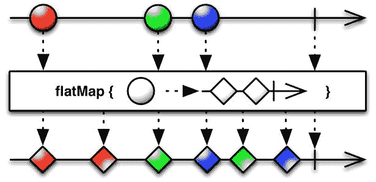
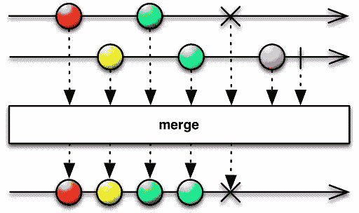

# 七、数据流计算和 RxCpp 库简介

从这一章开始，我们将进入反应式编程模型的核心。您可以将前面的章节视为理解反应式编程模型的一种先决条件，更具体地说，是功能反应式编程。如果我们回顾一下，我们涵盖了必要的先决条件，包括以下内容:

*   各种图形用户界面平台上的事件编程模型
*   现代 C++ 语言的旋风之旅(包括函数式编程)
*   更好的并发系统的语言级并发
*   无锁编程模型(朝着声明性编程迈出的一步)
*   先进的设计模式和可观察的概念
*   事件流编程

在**功能反应编程** ( **玻璃钢**)的情况下，所有这些主题以系统的方式结合在一起。

简单地说，反应式编程就是用异步数据流编程。通过对 Streams 应用各种操作，我们可以实现不同的计算目标。反应式程序的主要任务是将数据转换成流，而不考虑数据的来源。事件流通常被称为可观察的，事件流订阅者被称为**观察者**。在可观测值和观测值之间，有流操作符(过滤器/变换)。

由于隐式假设在数据通过运算符传递时数据源不会发生变化，因此我们可以在 Observables 和 Observers 之间有多个运算符路径。不变性为无序执行提供了选项，调度可以委托给一个称为调度器的特殊软件。因此，观察器、观察器、流操作器和调度器构成了玻璃钢模型的主干。

在本章中，我们将涵盖以下主题:

*   浅谈数据流计算范式
*   RxCpp 库及其编程模型介绍
*   一些基本的 RxCpp 程序来让我们的脚湿
*   接收流操作符
*   大理石图表
*   行程安排
*   `flat` / `concat`地图古怪
*   更多操作员

# 数据流计算范式

传统上，程序员根据控制流来编码他们的程序。这意味着我们将程序编码为一系列小语句(序列、分支、迭代)或函数(包括递归)，以及它们的相关状态。我们使用构造，例如选择(`if` / `else`)、迭代(`while` / `for`)和递归函数来编码我们的计算。为这些类型的程序处理并发性和状态管理确实是有问题的，它们会导致微妙的错误。我们需要围绕共享的可变状态放置锁和其他同步原语。在编译器层面，语言编译器将解析源代码，创建**抽象语法树** ( **AST** )，进行类型分析、代码生成和代码生成。事实上，AST 是一个信息流图，您可以在其中执行数据流分析(用于数据/寄存器级优化)和控制流分析，以利用处理器级的代码流水线优化。即使程序员根据控制流来编码程序，编译器(至少是它的一部分)也试图根据数据流来看程序。这里的底线是，每个程序中都有一个隐藏的隐式数据流图。

数据流计算将计算组织为一个显式图，其中节点是计算，边是数据在节点之间流动的路径。如果我们对节点上的计算设置某些限制(例如通过处理输入数据的副本来保存数据状态，避免原地算法)，我们就可以利用并行的机会。调度程序将通过对图形数据结构进行拓扑排序来寻找并行的机会。我们将使用流(`Path`)和流上的操作(`Node`)来构建图。这可以通过声明的方式完成，因为操作符可以被编码为 Lambdas，它进行一些本地计算。有一套基本的标准(函数/流)操作符，如`map`、`reduce`、`filter`和`take`，由函数编程社区识别。数据流计算框架中有一项规定，将数据转换为流。机器学习的 TensorFlow 库就是使用这种范式的一个库。RxCpp 库也可以被认为是一个数据流计算库，即使图形创建不是完全显式的，就像 TensorFlow 的情况一样。因为函数式编程构造支持惰性评估，所以当我们用异步数据流和操作构造流管道时，我们正在创建一个计算流图。

# RxCpp 库简介

在本书的其余部分，我们将使用 RxCpp 库来编写我们的反应程序。RxCpp 库是一个只有头文件的 C++ 库，可以从 GitHub repo 下载:[http://reactive-extensions.github.io/RxCpp/](http://reactive-extensions.github.io/RxCpp/)。RxCpp 依赖于现代 C++ 构造，如语言级并发、Lambda 函数/表达式、函数组合/转换和运算符重载，来实现反应式编程构造。RxCpp 库是按照`Rx.net`和`Rxjava`这样的库来构建的。

像任何其他反应式编程框架一样，在编写第一行代码之前，每个人都应该了解一些关键的构造。它们是:

*   可观察的(可观察的流)
*   观察员(订阅《观察家报》)
*   运算符(例如，筛选器、转换和缩减)
*   调度程序

RxCpp 是一个只有头部的库，大部分计算都是基于可观测的概念。该库提供了许多原语来从各种数据源创建可观察的流。数据源可以是范围、STL 容器等等。我们可以将操作者放在 Observables 和他们的消费者(被称为观察者)之间。由于函数式编程结构支持函数的组合，我们可以将一系列操作符作为单个实体放在订阅流的 Observables 和 Observers 之间。与库相关联的调度器将确保当数据在可观察流中可用时，它将通过操作者传递，并且在一系列过滤和转换之后，如果存在数据，将向订阅者发出通知。当来自订阅者的 Lambda 方法被调用时，观察者需要操心一些事情。观察员可以专注于他们主要负责的任务。

# RxCpp 库及其编程模型

在这一部分，我们将编写一些程序，帮助读者理解 RxCpp 库的编程模型。这些程序的目的是阐明接收概念，它们本质上大多是琐碎的。代码对于程序员来说足够了，只要稍加调整就可以将它们合并到生产实现中。数据生产者及其可观测性将基于范围、STL 容器等。

# 简单的可观察/观察者互动

让我们编写一个简单的程序，帮助我们理解 RxCpp 库的编程模型。在这个特定的程序中，我们将有一个可观察的流和一个订阅该流的观察者。我们将使用 range 对象生成一系列从 1 到 12 的数字。在创建了值的范围和其上的可观测值之后，我们将为可观测值附加一个订户。当我们执行该程序时，它会将一系列数字打印到控制台，并进行额外的测试:

```cpp
////////// 
// First.cpp 
// g++ -I<PathToRxCpplibfoldersrc> First.cpp 
#include "rxcpp/rx.hpp" 
#include <ioStream> 
int main() { 
 //------------- Create an Observable.. a Stream of numbers 
 //------------- Range will produce a sequence from 1 to 12 
 auto observable = rxcpp::observable<>::range(1, 12);
```

```cpp
 //------------ Subscribe (only OnNext and OnCompleted Lambda given 
 observable.Subscribe(  
    [](int v){printf("OnNext: %dn", v);}, 
    [](){printf("OnCompleted\n");}); 
} 
```

前面的程序会把数字打印到控制台上，`OnCompleted`会发射到控制台上。这个程序演示了我们如何创建一个可观察的流，并使用`Subscribe`方法将一个观察者连接到该流。

# 可观察的过滤器和转换

除了使用 subscribe 方法将观察者连接到可观测流的常见机制之外，以下程序将帮助我们理解过滤器和`map`操作符是如何工作的。filter 方法计算流中每个项目上的谓词，如果该计算恰好产生一个肯定断言，则该项目将出现在输出流中。`map`运算符对输入流的每个元素应用一个表达式，并帮助生成一个输出队列:

```cpp
/////////////////////////////////////// 
// Second.cpp 
#include "rxcpp/rx.hpp" 
#include <ioStream> 
int main() { 
  auto values = rxcpp::observable<>::range(1, 12). 
      filter([](int v){ return v % 2 ==0 ;}). 
      map([](int x) {return x*x;});  
  values.subscribe( 
           [](int v){printf("OnNext: %dn", v);}, 
           [](){printf("OnCompleted\n");}); 
} 
```

前面的程序生成一个数字流，并通过一个过滤函数传递该流。`filter`功能尝试检测数字是否为偶数。输出流将被传递到`map`函数，该函数将对流的内容进行平方。最终，流的内容将被打印到控制台。

# 从 C++ 容器流式传输值

即使接收意味着处理随时间变化的数据，我们也可以将 STL 容器转换为反应流。我们需要使用 Iterate 运算符进行转换。这有时很方便，并且有助于集成来自使用 STL 的代码库的代码:

```cpp
// STLContainerStream.cpp
#include "rxcpp/rx.hpp"
#include <ioStream>
#include <array>
int main() {
    std::array< int, 3 > a={{1, 2, 3}};
    auto values = rxcpp::observable<>::iterate(a);
    values.subscribe([](int v){printf("OnNext: %dn", v);},
    [](){printf("OnCompleted\n");});
}
```

# 从头开始创建观察点

到目前为止，我们已经编写了从范围对象或 STL 容器创建可观察流的程序。让我们看看如何从头开始创建一个可观察的流。嗯，差不多:

```cpp
// ObserverFromScratch.cpp 
#include "rxcpp/rx.hpp" 
#include "rxcpp/rx-test.hpp" 
int main() { 
      auto ints = rxcpp::observable<>::create<int>(  [](rxcpp::subscriber<int> s){ 
            s.on_next(1); 
            s.on_next(4); 
            s.on_next(9); 
           s.on_completed(); 
    }); 
    ints.subscribe( [](int v){printf("OnNext: %dn", v);}, 
                             [](){printf("OnCompletedn");}); 
} 
```

前面的程序调用`next`方法来发出一系列完美平方的数字。这些数字将被打印到控制台上。

# 连接可观察的流

我们可以将两个流连接起来形成一个新的流，这在某些情况下会很方便。让我们通过编写一个简单的程序来看看这是如何工作的:

```cpp
//------------- Concactatenate.cpp 
#include "rxcpp/rx.hpp" 
#include "rxcpp/rx-test.hpp" 
int main() { 
 auto values = rxcpp::observable<>::range(1);  
 auto s1 = values.take(3).map([](int prime) { return 2*prime;);}); 
 auto s2 = values.take(3).map([](int prime) { return prime*prime);}); 
 s1.concat(s2).subscribe(rxcpp::util::apply_to( 
            []( int p) { printf(" %dn", p);})); 
} 
```

串联操作符通过保持顺序一个接一个地附加流。

# 取消订阅可观察的流

下面的程序展示了如何订阅可观察的流并停止订阅。该程序仅显示了可用的选项，应参考文档以:

```cpp
//---------------- Unsubscribe.cpp 
#include "rxcpp/rx.hpp" 
#include "rxcpp/rx-test.hpp" 
#include <ioStream> 
int main() { 
    auto subs = rxcpp::composite_subscription(); 
    auto values = rxcpp::observable<>::range(1, 10); 
    values.subscribe( 
        subs,[&subs](int v){ 
            printf("OnNext: %dn", v); 
            if (v == 6) 
                subs.unsubscribe(); //-- Stop recieving events 
        }, 
        [](){printf("OnCompletedn");}); 
}
```

# 视觉表现用大理石图介绍

很难可视化反应流，因为数据异步流动。Rx 系统的设计者已经创建了一组可视化提示，称为**大理石图**:

```cpp
//------------------ Map.cpp 
#include "rxcpp/rx.hpp" 
#include "rxcpp/rx-test.hpp" 
#include <ioStream> 
#include <array> 
int main() { 
    auto ints = rxcpp::observable<>::range(1,10). 
                 map( [] ( int n  ) {return n*n; }); 
    ints.subscribe( 
            [](int v){printf("OnNext: %dn", v);}, 
            [](){printf("OnCompletedn");}); 
} 
```

我们先来看一个描绘`map`运算符的大理石图，而不是描述大理石图:


大理石图的顶部显示了两条时间线，这些时间线将通过将第二条时间线的内容附加到第一条时间线来组合在一起，以形成复合时间线。

# 流操作符

面向流的处理的主要优势之一是我们可以在其上应用函数式编程原语。用 RxCpp 的话来说，处理是使用运算符完成的。它们只不过是流上的过滤器、转换、聚合和缩减。在前面的例子中，我们已经看到了`map`、`filter`和`take`操作符是如何工作的。

# 平均算子

`average`运算符计算可观测流的算术平均值。支持的其他统计运算符包括:

*   福建话
*   最大
*   数数
*   总和

下面的程序只是演示了`average`操作符。对于前面列表中的其他运算符，模式是相同的:

```cpp
//----------- Average.cpp 
#include "rxcpp/rx.hpp" 
#include "rxcpp/rx-test.hpp" 
#include <ioStream> 
int main() { 
    auto values = rxcpp::observable<>::range(1, 20).average(); 
    values.subscribe( 
            [](double v){printf("average: %lfn", v);}, 
            [](){printf("OnCompletedn");}); 
} 
```

# 扫描操作员

`scan`运算符依次对流的每个元素应用一个函数，并将该值累积为一个种子值。当数值累加时，下列程序产生一系列数字的平均值:

```cpp
//----------- Scan.cpp 
#include "rxcpp/rx.hpp" 
#include "rxcpp/rx-test.hpp" 
#include <ioStream> 
int main() { 
    int count = 0; 
    auto values = rxcpp::observable<>::range(1, 20). 
        scan( 0,[&count](int seed, int v){ 
                count++ ; 
                return seed + v; 
            }); 
    values.subscribe( 
        [&](int v){printf("Average through Scan: %fn", (double)v/count);}, 
        [](){printf("OnCompletedn");}); 
} 
```

运行平均值将打印在控制台上。`OnNext`在`OnCompleted`被调用之前会被调用十九次。

# 通过管道操作器组成操作器

RxCpp 库允许您链接或组合运算符以启用运算符组合。该库允许您使用`pipe` ( `|`)运算符来组成运算符，程序员可以将一个运算符的输出管道传输到另一个运算符，就好像它们在 UNIX shell 的命令行中一样。这使我们能够理解一段代码的作用。以下程序使用`|`操作符绘制范围。RxCpp 示例包含许多使用管道函数的示例:

```cpp
//------------------ Map_With_Pipe.cpp 
#include "rxcpp/rx.hpp" 
#include "rxcpp/rx-test.hpp" 
namespace Rx { 
using namespace rxcpp; 
using namespace rxcpp::sources; 
using namespace rxcpp::operators; 
using namespace rxcpp::util; 
} 
using namespace Rx; 
#include <ioStream> 
int main() { 
    //---------- chain map to the range using the pipe operator 
    //----------- avoids the use of . notation. 
    auto ints = rxcpp::observable<>::range(1,10) |  
                 map( [] ( int n  ) {return n*n; }); 
    ints.subscribe( 
            [](int v){printf("OnNext: %dn", v);}, 
            [](){printf("OnCompletedn");}); 
}
```

# 使用调度程序

在前一节中，我们已经了解了可观测值、操作符和观测值。我们已经知道，在可观测值和观测值之间，我们可以应用标准的接收操作符来过滤和转换流。在函数式编程的情况下，我们编写不可变的函数(没有副作用的函数)，不可变的一个后果是可能会无序执行。如果我们能保证运算符的输入永远不会被修改，那么我们求值的顺序就无关紧要了。由于一个接收程序将操作多个观察器和订阅器，我们可以将选择执行顺序的任务委托给调度器模块。默认情况下，RxCpp 将在我们称为`subscriber`方法的线程中调度执行。可以使用`observe_on`和`subscriber_on`操作符指定不同的螺纹。此外，一些可观察的操作符将调度器作为参数，其中执行可以发生在由调度器管理的线程中。

RxCpp 库支持以下两种调度程序类型:

*   `ImmediateScheduler`
*   `EventLoopScheduler`

默认情况下，RxCpp 库是单线程的。但是您可以使用某些操作符将其配置为在多个线程中运行:

```cpp
//----------ObserveOn.cpp 
#include "rxcpp/rx.hpp" 
#include "rxcpp/rx-test.hpp" 
#include <ioStream> 
#include <thread> 
int main(){ 
 //---------------- Generate a range of values 
 //---------------- Apply Square function 
 auto values = rxcpp::observable<>::range(1,4). 
               map([](int v){ return v*v;}); 
 //------------- Emit the current thread details 
 std::cout  << "Main Thread id => "  
            << std::this_thread::get_id()  
            << std::endl; 
 //---------- observe_on another thread.... 
 //---------- make it blocking to  
 values.observe_on(rxcpp::synchronize_new_thread()).as_blocking(). 
 subscribe( [](int v){  
                   std::cout << "Observable Thread id => "  
                             << std::this_thread::get_id()  
                             << "  " << v << std::endl ;}, 
                  [](){ std::cout << "OnCompleted" << std::endl; }); 
 //------------------ Print the main thread details 
 std::cout << "Main Thread id => "  
           << std::this_thread::get_id()  
           << std::endl;   
} 
```

前面的程序将产生以下输出。我们将使用 STD C++ 线程 ID 来帮助我们区分新线程中调度的项目(其中一个不同于主线程):

```cpp
Main Thread id => 1 
Observable Thread id => 2  1 
Observable Thread id => 2  4 
Observable Thread id => 2  9 
Observable Thread id => 2  16 
OnCompleted 
Main Thread id => 1 
```

以下程序将演示`subscribe_on`方法的用法。`observe_on`和`subscribe_on`方法在行为方面有细微的区别。我们将在下一章探讨这个问题。下面列表的目的是显示可用于声明性调度的选项:

```cpp
//---------- SubscribeOn.cpp 
#include "rxcpp/rx.hpp" 
#include "rxcpp/rx-test.hpp" 
#include <ioStream> 
#include <thread> 
#include <mutex> 
//------ A global mutex for output synch. 
std::mutex console_mutex; 
//------ Print the Current Thread details 
void CTDetails() { 
   console_mutex.lock(); 
   std::cout << "Current Thread id => "  
           << std::this_thread::get_id()  << std::endl;  
   console_mutex.unlock();  
} 
//---------- a function to Yield control to other threads 
void Yield( bool y ) { 
   if (y) { std::this_thread::yield(); } 

} 
int main(){ 
    auto threads = rxcpp::observe_on_event_loop(); 
    auto values = rxcpp::observable<>::range(1); 
    //------------- Schedule it in another thread 
    auto s1 = values.subscribe_on(threads). 
        map([](int prime) {  
             CTDetails(); Yield(true); return std::make_tuple("1:", prime);}); 
    //-------- Schedule it in Yet another theread 
    auto s2 = values. subscribe_on(threads).  
        map([](int prime) { 
           CTDetails(); Yield(true) ; return std::make_tuple("2:", prime);}); 

    s1.merge(s2). take(6).as_blocking().subscribe(rxcpp::util::apply_to( 
            [](const char* s, int p) { 
                CTDetails(); 
                console_mutex.lock(); 
                printf("%s %dn", s, p); 
                console_mutex.unlock(); 
            })); 
} 
```

# 两个操作符的故事——平面图对串联图

开发人员的困惑来源通常集中在`flat`地图和`concat`地图操作符上。它们之间的差异非常微妙，我们将在本节中介绍它们。让我们来看看`flat`地图操作符及其工作原理:

```cpp
//----------- Flatmap.cpp 
#include "rxcpp/rx.hpp" 
#include "rxcpp/rx-test.hpp" 
#include <ioStream> 
namespace rxu=rxcpp::util; 
#include <array> 
int main() { 
     std::array< std::string,4 > a={{"Praseed", "Peter", "Sanjay","Raju"}}; 
     //---------- Apply Flatmap on the array of names 
     //---------- Flatmap returns an Observable<T> ( map returns T ) 
     //---------- The First lamda creates a new Observable<T> 
     //---------- The Second Lambda manipulates primary Observable and  
     //---------- Flatmapped Observable 
     auto values = rxcpp::observable<>::iterate(a).flat_map( 
              [] (std::string v ) { 
                   std::array<std::string,3> salutation= 
                       { { "Mr." ,  "Monsieur" , "Sri" }}; 
                   return rxcpp::observable<>::iterate(salutation); 
              }, 
              [] ( std::string f , std::string s ) {return s + " " +f;}); 
     //-------- As usual subscribe  
     //-------- Here the value will be interleaved as flat_map merges the  
     //-------- Two Streams 
     values.subscribe(  
              [] (std::string f) { std::cout << f <<  std::endl; } ,  
              [] () {std::cout << "Hello World.." << std::endl;} ); 
      } 
```

前一个程序以交错方式产生输出。程序的输出如下所示。这种行为的原因与映射操作后流的后处理有关:

```cpp
Mr. Praseed 
Monsieur Praseed 
Mr. Peter 
Sri Praseed 
Monsieur Peter 
Mr. Sanjay 
Sri Peter 
Monsieur Sanjay 
Mr. Raju 
Sri Sanjay 
Monsieur Raju 
Sri Raju 
Hello World.. 
```

下面的大理石图显示了操作的模式。`flat`图将λ应用于可观测流，并产生一个新的可观测流。产生的流被合并在一起以提供输出。在图中，红球被转换成一对相似颜色的钻石，而绿球和蓝球的输出产生交错的钻石作为新创建的可观察的输出:



让我们通过一个列表来看看`concat_map`运算符。程序列表是相同的。唯一的变化是`flatMap`更名为`concatMap`。即使列表中没有差异，但输出行为有明显的差异。也许`concatMap`产生的输出适合程序员的心智模式:

```cpp
//----------- ConcatMap.cpp 
#include "rxcpp/rx.hpp" 
#include "rxcpp/rx-test.hpp" 
#include <ioStream> 
namespace rxu=rxcpp::util; 

#include <array> 
int main() { 

     std::array< std::string,4 > a={{"Praseed", "Peter", "Sanjay","Raju"}}; 
     //---------- Apply Concat map on the array of names 
     //---------- Concat Map returns an Observable<T> ( oncat returns T ) 
     //---------- The First lamda creates a new Observable<T> 
     //---------- The Second Lambda manipulates primary Observable and  
     //---------- Concatenated Observable 
     auto values = rxcpp::observable<>::iterate(a).flat_map( 
              [] (std::string v ) { 
                   std::array<std::string,3> salutation= 
                       { { "Mr." ,  "Monsieur" , "Sri" }}; 
                   return rxcpp::observable<>::iterate(salutation); 
              }, 
              [] ( std::string f , std::string s ) {return s + " " +f;}); 

     //-------- As usual subscribe  
     //-------- Here the value will be interleaved as concat_map concats the  
     //-------- Two Streams 
     values.subscribe(  
              [] (std::string f) { std::cout << f <<  std::endl; } ,  
              [] () {std::cout << "Hello World.." << std::endl;} ); 
 } 
```

以下是输出的外观:

```cpp
Mr. Praseed 
Monsieur Praseed 
Sri Praseed 
Mr. Peter 
Monsieur Peter 
Sri Peter 
Mr. Sanjay 
Monsieur Sanjay 
Sri Sanjay 
Mr. Raju 
Monsieur Raju 
Sri Raju 
Hello World.. 
```

下图为运行中的`concatMap`。与平面图大理石图不同，输出是同步的(红色、绿色和蓝色球按照处理输入的顺序产生相同颜色的输出):


在`flatMap`的情况下，我们以交错的方式得到输出。但是在`concatMap`的情况下，我们按照预期输出的顺序得到了值。这里真正的区别是什么？为了明确区别，让我们看一下两个操作符:`concat`和`merge`。让我们来看看流的串联是如何工作的。它基本上一个接一个地附加流的内容，保持顺序:

```cpp
//---------------- Concat.cpp 
#include "rxcpp/rx.hpp" 
#include "rxcpp/rx-test.hpp" 
#include <ioStream> 
#include <array> 
int main() { 
    auto o1 = rxcpp::observable<>::range(1, 3); 
    auto o3 = rxcpp::observable<>::from(4, 6); 
    auto values = o1.concat(o2); 
    values.subscribe( 
            [](int v){printf("OnNext: %dn", v);},[](){printf("OnCompletedn");}); 
} 
```

下面的大理石图清楚地显示了当一个`concat`操作符应用于两个流时会发生什么。我们通过将第二个附加到第一个的内容来创建一个新的流。这保持了顺序:


现在，让我们看看当两个流合并时会发生什么。下面的代码显示了如何合并两个流:

```cpp
//------------ Merge.cpp 
#include "rxcpp/rx.hpp" 
#include "rxcpp/rx-test.hpp" 
#include <ioStream> 
#include <array> 
int main() { 
    auto o1 = rxcpp::observable<>::range(1, 3); 
    auto o2 = rxcpp::observable<>::range(4, 6); 
    auto values = o1.merge(o2); 
    values.subscribe( 
            [](int v){printf("OnNext: %dn", v);}, 
             [](){printf("OnCompletedn");}); 
} 
```

下面的大理石图清楚地显示了当我们合并两个可观察的流时会发生什么。输出队列的内容将是两个流的交错组合:



`flat`地图和`concact`地图或多或少都做同样的操作。区别在于价值观结合在一起的方式。`flat`地图使用`merge`运算符，`concat`地图使用`concact`运算符。在`merge`的情况下，顺序无关紧要。`concat`运算符一个接一个地追加可观察值。这就是为什么你按照我们期望的顺序得到这些值。

# 更多重要的操作符

我们现在理解了反应式编程模型的关键，因为我们涵盖了基本主题，如可观察对象、观察器、操作器和调度器。为了更好地编写逻辑，我们应该了解更多的运算符。在本节中，我们将介绍`tap`和`buffer`操作员。我们将探索`tap`运算符，它有助于查看流的内容:

```cpp
//----------- TapExample.cpp 
#include "rxcpp/rx.hpp" 
#include "rxcpp/rx-test.hpp" 
#include <ioStream> 
int main() { 
    //---- Create a mapped Observable 
     auto ints = rxcpp::observable<>::range(1,3). 
                 map( [] ( int n  ) {return n*n; }); 
     //---- Apply the tap operator...The Operator  
     //---- will act as a filter/debug operator 
     auto values = ints.tap( 
          [](int v)  {printf("Tap -       OnNext: %dn", v);}, 
          [](){printf("Tap -       OnCompletedn"); 
     }); 
     //------- Do some action 
     values.subscribe( 
          [](int v){printf("Subscribe - OnNext: %dn", v);}, 
          [](){printf("Subscribe - OnCompletedn");}); 
 } 
```

现在，我们来看看`defer`运算符。`defer`运算符将一个可观察工厂作为参数，为每个订阅它的客户端创建一个可观察工厂。在下面的程序中，当有人试图连接到指定的可观测值时，我们调用`observable_factory`λ:

```cpp
//----------- DeferExample.cpp 
#include "rxcpp/rx.hpp" 
#include "rxcpp/rx-test.hpp" 
#include <ioStream> 
int main() { 
    auto observable_factory = [](){ 
         return rxcpp::observable<>::range(1,3). 
                 map( [] ( int n  ) {return n*n; }); 
    }; 
    auto ints = rxcpp::observable<>::defer(observable_factory); 
    ints.subscribe([](int v){printf("OnNext: %dn", v);}, 
            [](){printf("OnCompletedn");}); 
    ints.subscribe( 
            [](int v){printf("2nd OnNext: %dn", v);}, 
            [](){printf("2nd OnCompletedn");}); 
} 
```

`buffer`运算符发出一个可观测值，该值包含一个可观测值的非重叠内容，每个可观测值最多包含计数参数指定的项目数。这将帮助我们以适合内容的方式处理项目:

```cpp
//----------- BufferExample.cpp 
#include "rxcpp/rx.hpp" 
#include "rxcpp/rx-test.hpp" 
#include <ioStream> 
int main() { 
   auto values = rxcpp::observable<>::range(1, 10).buffer(2); 
   values.subscribe( [](std::vector<int> v){ 
                printf("OnNext:{"); 
                std::for_each(v.begin(), v.end(), [](int a){ 
                    printf(" %d", a); 
                }); 
                printf("}n"); 
            }, 
            [](){printf("OnCompletedn");}); 
} 
```

`timer`运算符发出一个以间隔周期为参数的可观测值。可以选择将`Scheduler`对象指定为参数。库中有这个函数的各种版本；我们在下面的代码中显示了一个:

```cpp
//----------- TimerExample.cpp 
#include "rxcpp/rx.hpp" 
#include "rxcpp/rx-test.hpp" 
#include <ioStream> 
int main() { 
     auto Scheduler = rxcpp::observe_on_new_thread(); 
     auto period = std::chrono::milliseconds(1); 
     auto values = rxcpp::observable<>::timer(period, Scheduler). 
            finally([](){ 
            printf("The final actionn"); 
        });     
      values.as_blocking().subscribe( 
         [](int v){printf("OnNext: %dn", v);}, 
         [](){printf("OnCompletedn");}); 
} 
```

# 对我们尚未涉及的事物的一瞥

Rx 编程模型可视为以下因素的融合:

*   数据流计算
*   声明式并发
*   函数式编程
*   流处理(事件)
*   设计模式和习惯用语

为了全面了解整个学科，您需要广泛地使用编程模型。最初，事情不会有太大意义。在某个时刻，你会到达一个*点击点*，在那里一切都将变得有意义。到目前为止，我们已经讨论了以下主题:

*   可观察物和观察者
*   基本和中间操作符
*   基本和中间调度

这只是一个开始，我们需要覆盖更多的主题来熟悉编程模型。它们是:

*   冷热观察([第 9 章](09.html#4U9TC0-51c8384cc2cb48e691b461190723b468)、*使用 Qt/C++* 的反应式图形用户界面编程)
*   Rx 组件的详细探索([第 9 章](https://cdp.packtpub.com/c___reactive_programming/wp-admin/post.php?post=79&action=edit#post_86)，*使用 Qt/C++* 的反应式图形用户界面编程)
*   高级调度([第 9 章](https://cdp.packtpub.com/c___reactive_programming/wp-admin/post.php?post=79&action=edit#post_86)，*使用 Qt/C++ 的反应式图形用户界面编程)*
*   使用 Qt/C++ 编程图形用户界面系统([第 9 章](https://cdp.packtpub.com/c___reactive_programming/wp-admin/post.php?post=79&action=edit#post_86)、*反应式图形用户界面编程)*
*   高级操作符([第 9 章](https://cdp.packtpub.com/c___reactive_programming/wp-admin/post.php?post=79&action=edit#post_86)、*使用 Qt/C++* 的反应式图形用户界面编程)
*   反应式设计模式([第 10 章](10.html#5GDO20-51c8384cc2cb48e691b461190723b468)、*c++ Rx 编程的设计模式和习惯用法*
*   鲁棒性编程([第 12 章](12.html#6FSQK0-51c8384cc2cb48e691b461190723b468)、*高级流和处理错误*)

# 摘要

在这一章中，我们讨论了理解 Rx 编程模型的一些基础知识，特别是 RxCpp。我们从数据流计算范式的概念概述开始，然后很快开始编写一些基本的 RxCpp 程序。在介绍了 Rx 大理石图之后，我们了解了 RxCpp 库支持的一组运算符。我们还介绍了调度器的重要主题，最后讨论了`flat`地图和`concat`地图操作符的区别。在下一章中，我们将讨论`hot`和`cold`可观测值、高级调度以及本章中未涉及的主题。