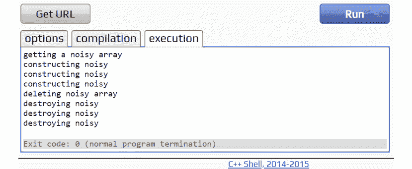
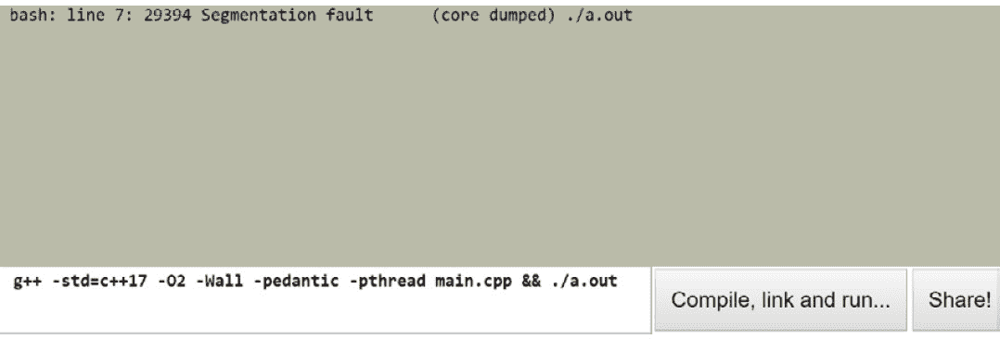
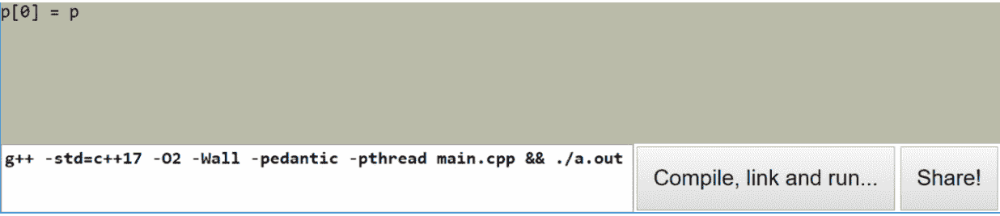
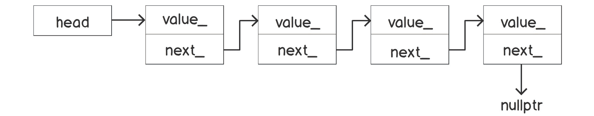
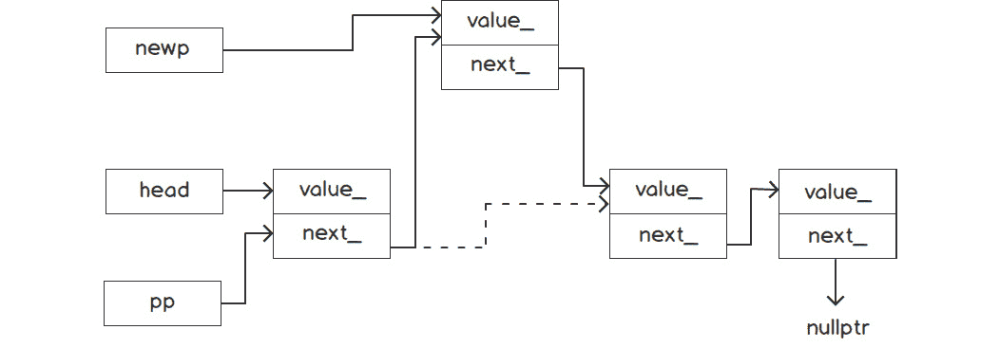
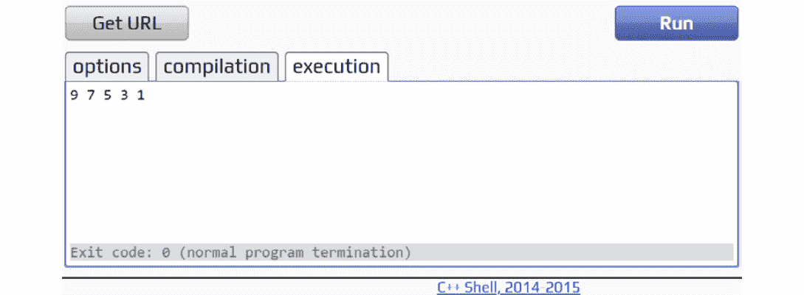
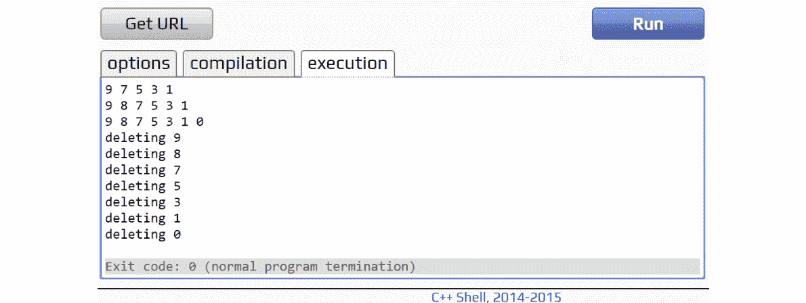

# 六、动态变量

概观

本章介绍了动态变量，即可以在需要时创建的变量，它可以保存任意大量的数据，只受可用内存量的限制。本章结束时，您将能够描述为什么动态变量很重要；创建动态变量和数组；描述堆栈和堆之间的区别；通过指针引用动态变量和数组；删除动态变量和数组，并使用指针创建链接数据结构。

# 简介

到目前为止介绍的所有基本类型的变量、数组和结构都有一个在编译时已知的固定大小。固定大小的变量有很多优点；它们可以首尾相连，以便有效地使用内存。编译后的机器代码可以非常快速地访问固定大小的变量，但是固定大小的变量有一个缺点。没有办法在固定大小的变量中保存任意大的数据结构。开发人员必须预料到程序将被要求解决的最大问题。当一个程序解决一个较小的问题时，内存就被浪费了，当一个程序试图超过它的容量时，它就会失败。

例如，想象一下，一个开发人员想要将所有的单词存储在一本书里，但是只能使用固定大小的变量。他们可以声明一个二维数组`char`来保存单词，但是数组应该有多大呢？

平均每本书有 75，000 到 100，000 字。开发者可以选择 100，000 字的最差大小来容纳许多书，但可能不是全部。英语单词平均长度约为 8 个字符，但最长的单词要长得多。开发人员也必须为单词选择最差的大小——例如 20 个字符。因此，数组的声明如下:

```cpp
char book[100000][20];
```

这个数组的大小是 200 万字节，以现代的比较标准来看，这是适度的。但是不管你把数组做得多大，一本书可能都放不下，要么是因为它有很长的单词，要么是因为它有太多的单词。开发人员可能会发明比普通数组更复杂的数据结构，但他们都会遇到其中一个或两个问题。运行程序的计算机可能有千兆字节的可用内存，但程序无法利用它。

幸运的是，C++ 为这个问题提供了一个名为**动态变量**的解决方案。

# 动态变量

全局变量在程序启动时分配的单个内存块中首尾相连。因此，声明一个全局变量没有运行时成本，但是所有的全局变量在程序的整个生命周期中都继续占用存储空间，即使它们没有被使用。

由`{`和`}`界定的函数或其他块范围的局部变量在局部变量堆栈的顶部首尾相连。为局部变量分配内存的成本可以忽略不计。当执行离开该块时，该块中局部变量的存储从堆栈顶部弹出。下次执行进入块范围时，可以有效地重用该存储。

动态变量由可执行语句构造，而不是像其他类型的变量一样声明。每个动态变量的存储空间是从称为堆的内存区域中单独分配的。当执行退出由`{`和`}`限定的块范围或程序结束时，动态变量不会自动销毁。相反，每个动态变量都被另一个可执行语句显式删除，其存储被单独返回到堆中。

堆是未使用的内存块的集合。当程序请求新的动态变量时，C++ 运行时系统在堆中搜索适当大小的内存块。C++ 运行时系统可以从堆中返回一个可用的块，可以将一个较大的内存块分成两部分并返回其中的一部分，或者可以向操作系统请求一个新的内存块。当程序删除一个动态变量时，该动态变量的存储被返回到堆的可用内存块集合中，以便该存储可以被另一个动态变量重用。

对于可以创建的动态变量的数量或大小没有固定的限制。然而，这并不意味着程序可以创建无限数量的动态变量。这只是意味着计算机、操作系统和先前请求的模式都对特定请求能否得到满足有所贡献。

当无法满足创建动态变量的请求时，C++ 会引发异常。本书*第 13 章【C++ 中的异常处理】*中介绍了异常。

动态变量的力量不是免费的。创建和删除动态变量有很大的运行时成本。事实上，创建和删除动态变量是 C++ 内置的最昂贵的操作。这是因为需要在可用内存块堆中扫描适当大小的块。

使用`new`表达式创建动态变量。`new`-表达式将一个类型作为其操作数，并返回一个指向命名类型实例的指针。动态变量是通过这个指针知道的，而不是像全局变量和局部变量这样的名字。`new`-表达式不只是返回一些随机字节的存储；它将变量构造到返回的存储中，根据类型初始化它或调用它的构造函数。

以下是使用`new`表达式创建动态变量的一些示例:

```cpp
char *p1 = new char;
int *p2 = new int{12345};
someclass *p3 = new someclass("testing", 123);
```

这里，`p1`被分配了一个指向足以保存`char`的存储器的指针。因为没有指定初始值，`char`没有被初始化为任何值，但是包含当它被分配给新的动态变量时在存储器中的随机位。`p2`被分配一个足以容纳`int`的存储指针。`int`初始化为`12345`。`p3`被分配一个指向足以保存类实例的存储的指针`someclass`。通过调用构造函数`someclass::someclass(char const*, int)`来构造实例。创建动态`char`或`int`变量不是很有用，在程序中也很少见到。然而，程序经常创建动态的`class`或`struct`实例。

使用`delete`表达式删除动态变量。当动态变量被删除时，C++ 运行时系统调用其**析构函数成员函数**，如果有的话，其存储由 C++ 运行时系统返回堆。一个`delete`-表达式获取一个指向由一个`new`表达式创建的对象的指针，并返回`void`。

上面创建的三个动态变量被以下三行代码删除:

```cpp
delete p1;
delete p2;
delete p3;
```

虽然删除指针会破坏指向的对象并将它所占用的存储空间返回给 C++ 运行时系统，但它不会改变指针的值。指针仍然包含内存地址；只是现在，这个地址不是动态变量的地址。如果程序试图访问这个无效地址，程序很可能会崩溃，但可能不会马上崩溃。

每个用`new`-表达式创建的动态变量必须被匹配的`delete`-表达式删除，否则程序将无法访问该变量占用的存储空间；内存将从程序中泄漏*。如果内存泄漏的程序长时间运行，可能会耗尽计算机上的所有内存，导致程序、其他程序或操作系统变得不稳定并崩溃。*

 *接下来的四个练习涵盖了创建和删除动态变量和数组的基础知识。

## 练习 37:创建和删除基本类型的动态变量

第一个练习包括一个简短的程序来创建和销毁一些动态变量。它检查指向这些变量的指针并检查变量的值，只是为了证明`new`和`delete`的行为符合预期。

注意

练习的完整代码可以在[https://packt.live/349pGjw](https://packt.live/349pGjw)找到。

以下是执行本练习的步骤:

1.  进入骨架`main()`功能，如下:

    ```cpp
    #include <iostream>
    using namespace std;
    int main()
    {
        return 0;
    }
    ```

2.  在`main()`的左花括号后，输入以下代码创建一个动态`int`变量。声明一个指向名为`pint`的`int`的指针，并将其初始化为`nullptr`。然后，给`pint`分配一个新的`int`。`new`-表达式从堆中检索足以容纳`int`的存储，并将指向该存储的指针分配到`pint` :

    ```cpp
        int* pint = nullptr;
        pint = new int;
    ```

    中
3.  输出`pint`表示有内存地址，不再是`nullptr` :

    ```cpp
        cout << "pint = " << pint << endl;
    ```

4.  删除`pint`。这会将动态`int`变量占用的存储空间返回到堆:

    ```cpp
        delete pint;
    ```

5.  Finally, output `pint` again to demonstrate that it still holds a pointer to the invalid memory location that was formerly a dynamic `int` variable:

    ```cpp
        cout << "pint = " << pint << endl;
    ```

    注意

    因为动态变量没有初始化，所以它的值是随机的。我们没有让程序打印它的值，因为一些操作系统将新的和删除的存储设置为零，以帮助调试。假设不必为动态变量设置初始值，依赖这种行为是一个可怕的想法。总有一天，你会用一个不同行为的编译器，你的程序会神秘地出现故障。

    到目前为止，该程序如下所示:

    ```cpp
    #include <iostream>
    using namespace std;
    int main()
    {
        int* pint = nullptr;
        pint = new int;
        cout << "pint = " << pint << endl;
        delete pint;
        cout << "pint = " << pint << endl;
        return 0;
    }
    ```

6.  Compile and run the program and observe the result, which looks something like this:

    

    图 6.1:练习 37 中程序的输出

    十六进制数字是机器地址。您的程序可能会报告不同的十六进制数，但这两个数字是相同的。

    给`pint`分配新的`int`后，`pint`包含一个内存地址。这是动态`int`变量的地址。删除`pint`后，仍包含相同的内存地址，但该地址不再有效。这意味着它不再指向动态变量。在删除指针所指向的变量后使用指针是 C++ 程序中常见的错误原因。

7.  按照刚才添加的代码，创建一个新的动态`int`变量，并将其分配给`pint`。`pint`可以重用，因为它没有指向任何有效的东西。请注意，`new`表达式在`int`后面有一个初始值设定项，它将动态`int`变量设置为`33333`。输出动态`int`变量的值，只是为了证明它是按预期初始化的。然后，删除动态`int`变量。代码如下:

    ```cpp
        pint = new int{33333};
        cout << "*pint = " << *pint << endl;
        delete pint;
    ```

8.  完整的程序是这样的。

    ```cpp
    #include <iostream>
    using namespace std;
    int main() 
    {
        int * pint = nullptr;
        pint = new int;
        cout << "pint = " << pint << endl;
        delete pint;
        cout << "pint = " << pint << endl;
        pint = new int {33333};
        cout << "*pint = " << * pint << endl;
        delete pint;
        return 0;
    }
    ```

9.  编译并运行完成的程序。该程序具有以下输出:


图 6.2:练习 37 的修订程序的输出

`pint`指向的动态变量已按预期初始化。

虽然创建基本数据类型(如`int`或`char`)的动态实例相对不常见，但创建动态`class`或`struct`实例却很常见。类实例构成了链接数据结构的基本构件，如列表、树和图形。

## 练习 38:创建和删除动态类实例

本练习演示创建动态类实例的基础。动态类实例，如`int`或`char`变量，是用`new`表达式创建的。唯一的区别是类实例是用构造函数参数列表初始化的。

注意

练习的完整代码可以在[https://packt.live/35kwCKR](https://packt.live/35kwCKR)找到。

以下是执行本练习的步骤:

1.  在`main()`功能的框架中键入。看起来是这样的:

    ```cpp
    #include <iostream>
    using namespace std;
    int main()
    {
        return 0;
    }
    ```

2.  Following `using namespace std;`, type in a definition of class `noisy`. Now, `noisy` is useful for illustrating the behavior of dynamic variables. Its constructor function, which runs when an instance of `noisy` is created, prints the message `constructing noisy X`, where `X` is the value of the constructor argument. The constructor uses a constructor initializer instead of a simple assignment in the body of the constructor. A constructor initializer list can set the value of any member variable, and may use constructor arguments or expressions containing constructor arguments.

    当`noisy`的实例被删除时运行的析构函数打印消息`destroying noisy X`。

    由于`noisy`是类而不是`struct`，成员默认是私有的，所以需要`public:`访问控制声明。以下是`noisy`的定义:

    ```cpp
    class noisy
    {
        int i;
    public:
        noisy(int i) : i_(i)
        { 
            cout << "constructing noisy " << i << endl; 
        }
       ~noisy() 
        { 
            cout << "destroying noisy " << i_ << endl;
        }
    };
    ```

3.  在`main()`的左花括号之后，声明一个名为`N`的`noisy`实例。传递 1 给`N`的构造者。当我们运行该程序时，N 将打印一条消息来证明本地类实例在作用域退出时被自动销毁:

    ```cpp
        noisy N(1);
    ```

4.  声明一个指向名为`p`的`noisy`的指针，并将`p`初始化为`noisy`的新实例，初始化为`noisy(2)`。然后，删除`p`。这表明必须使用`delete`表达式销毁动态类实例。代码如下:

    ```cpp
        noisy* p = new noisy(2);
        delete p;
    ```

5.  完整的程序是这样的。

    ```cpp
    #include <iostream>
    using namespace std;
    class noisy
    {
        int i_;
    public:
        noisy(int i) : i_(i)
        { 
            cout << "constructing noisy " << i << endl; 
        }
       ~noisy() 
        { 
            cout << "destroying noisy " << i_ << endl;
        }
    };
    int main()
    {
        noisy N(1);
        noisy* p = new noisy(2);
        delete p;
        return 0;
    }
    ```

6.  编译并运行程序。输出如下:


图 6.3:练习 38 的程序输出

这个节目是怎么回事？嗯，当执行进入`main()`的时候，就构造了一个`noisy`的实例。调用`noisy`构造函数，打印第一条消息`constructing noisy 1`。

下一条语句创建一个动态`noisy`实例。构建`noisy`实例，打印第二条消息`constructing noisy 2`。下一条语句删除`p`，导致`noisy 2`的析构函数打印一条消息。执行离开`main()`的范围，导致局部变量`N`超出范围，触发对`noisy 1`析构函数的调用。这是您对具有函数作用域的变量的期望。

## 动态数组

**可以创建基本类型或类或结构实例的动态数组**。它们遵循与动态变量相同的规则。

动态数组在运行时使用`new[]`表达式创建。像动态变量一样，当执行退出作用域或程序结束时，动态数组不会被破坏。它们必须通过`delete[]`表达式明确删除。像其他动态变量一样，动态数组不是通过名称知道的，而是通过指向动态数组的指针知道的。

创建新的动态数组时，可以在运行时通过表达式指定动态数组的大小。大小不必像数组声明中的大小一样是常数。如果动态数组有两个或更多维度，则在运行时只能指定最左边维度的大小。

## 练习 39:创建和删除基本类型的动态数组

这个简短的练习创建并删除一个`char`的动态数组，并用一个空终止的文字字符串填充它。这是 C 编程中非常常见的一个习惯用法。在 C++ 中，有一个更复杂的名为`std::string`的字符串容器类，它有许多用于插入和提取子字符串的有用函数。本书第 12 章*容器和迭代器*中还有更多关于`std::string`的内容。

注意

练习的完整代码可以在[https://packt.live/35nB0ZO](https://packt.live/35nB0ZO)找到。

以下是执行本练习的步骤:

在 C++ 编译器中输入骨架`main()`函数。代码如下所示:

```cpp
#include <iostream>
using namespace std;
int main()
{
    return 0;
}
```

1.  这个程序将使用标准库函数来处理空终止的字符串，所以它必须包含`<cstring>`头。在`#include <iostream>`预处理器指令后添加以下一行:

    ```cpp
    #include <cstring>
    ```

2.  在函数`main()`中，声明一个名为`cp`的`char const`指针，并将其初始化为任何以空终止的字符串。接下来，声明一个名为`buffer`的`char`指针。创建一个新的动态`char`数组，足以容纳`cp`指向的空终止字符串。长度可以通过从标准库中调用函数`strlen()`来确定，该函数计算字符串中的字符数。还必须为空终止标记`\0`预留空间，该标记不包括在`strlen()` :

    ```cpp
        char const* cp = "arbitrary null terminated text string";
        char* buffer = new char[ strlen(cp)+1 ];
    ```

    返回的计数中
3.  Copy the string pointed to by `cp` into `buffer`, using the standard library `strcpy()` function. `strcpy()` copies the characters from a null-terminated string source into the destination array until it copies the null-termination at the end of the source string:

    ```cpp
        strcpy(buffer, cp);
    ```

    一些编译器在程序使用`strcpy()`时会发出警告，因为它不做任何事情来确保目标数组中有足够的空间来保存源字符串。在这种情况下，到目前为止编写的代码计算目标数组缓冲区的大小，因此没有风险。

4.  输出`buffer`的内容证明复制成功:

    ```cpp
        cout << "buffer = " << buffer << endl;
    ```

5.  Delete `buffer` using a `delete[]`-expression. The resulting code looks like this:

    ```cpp
        delete[] buffer;
    ```

    完整的程序如下所示:

    ```cpp
    #include <iostream>
    #include <cstring>
    using namespace std;
    int main()
    {
        char const* cp = "arbitrary null terminated text string";
        char* buffer = new char[ strlen(cp)+1 ];
        strcpy(buffer, cp);
        cout << "buffer = " << buffer << endl;
        delete[] buffer;
        return 0;
    }
    ```

6.  编译并运行程序。它的输出是`buffer`的副本，如下所示:


图 6.4:练习 39 中程序的输出

除了`new[]` -和`delete[]`-表达式的语法略有不同之外，创建和删除动态数组遵循与基本类型的动态变量相同的规则。

## 练习 40:创建和删除类的动态数组

也可以创建和删除类实例的动态数组。关于类实例的动态数组，有趣的是，数组中的每个实例都是构造的；也就是说，调用它的构造函数成员函数。销毁类实例的数组会调用每个实例的析构函数。

注意

练习的完整代码可以在[https://packt.live/35o4BlL](https://packt.live/35o4BlL)找到。

以下是执行本练习的步骤:

1.  在 C++ 编译器中输入骨架`main()`函数。代码如下:

    ```cpp
    #include <iostream>
    using namespace std;
    int main()
    {
        return 0;
    }
    ```

2.  在`using namespace`声明后键入类`noisy`的定义。从*练习 38* 、*创建和删除动态类实例*、`noisy`中可以看到`noisy`实例的构造和销毁。这个版本的`noisy`被定义为一个结构而不是一个类，它的两个小成员函数被内联定义。这减少了这个熟悉的类占用的空间:

    ```cpp
    struct noisy
    {
        noisy() { cout << "constructing noisy" << endl; }
       ~noisy() { cout << "destroying noisy" << endl; }
    };
    ```

3.  在`main()`里面，输出一条消息`getting a noisy array`。声明一个指向名为`pnoisy`的`noisy`的指针，并为其分配一个由三个`noisy`实例组成的新动态数组:

    ```cpp
        cout << "getting a noisy array" << endl;
        noisy* pnoisy = new noisy[3];
    ```

4.  输出信息`deleting noisy array`。然后，使用参数为`pnoisy`的`delete[]`表达式删除`noisy`数组。生成的代码如下所示:

    ```cpp
        cout << "deleting noisy array" << endl;
        delete[] pnoisy;
    ```

5.  完整的程序是这样的。

    ```cpp
    #include <iostream>
    using namespace std;
    struct noisy
    {
        noisy() { cout << "constructing noisy" << endl; }
       ~noisy() { cout << "destroying noisy" << endl; }
    };
    int main()
    {
        cout << "getting a noisy array" << endl;
        noisy* pnoisy = new noisy[3];
        cout << "deleting noisy array" << endl;
        delete[] pnoisy;
        return 0;
    }
    ```

6.  编译并运行程序。结果输出如下:



图 6.5:创建和删除类的动态数组

需要注意的重要一点是，动态数组中的每个类实例都是构造的，而不是碰巧在内存中的随机位。删除阵列后，实例将被销毁。

简单来说就是这样:如何创建新的动态变量和数组，以及如何删除它们。也许你听说过 C++ 指针和引用有多难。也许你现在想知道这些喧嚣是怎么回事。下一个主题讨论了程序员在使用动态变量时可能出错的一些方式。

# 七种动态可变捷联惯导系统

接下来的七个练习说明了滥用动态变量会破坏程序的七种方式，要么是将其发送到堆损坏的混乱中，要么是调用操作系统陷阱的突然霹雳。

以下几个练习是为了打印错误信息并终止程序而设计的。产生的特定消息既取决于 C++ 运行时系统版本，也取决于运行程序的操作系统。不能保证您会看到相同的错误消息，因此每个示例都包含对所发生情况的描述。

## 练习 41:在创建动态变量之前使用它

第一个致命的动态变量 sin 是在创建动态变量之前使用指向动态变量的指针。显而易见，取消指向无效存储的指针将导致未定义的行为，这可能包括崩溃，或者仅仅产生错误的结果。

注意

练习的完整代码可以在[https://packt.live/2XAak52](https://packt.live/2XAak52)找到。

以下是执行本练习的步骤:

1.  进入以下简写骨架`main()`功能:

    ```cpp
    int main()
    {
        return 0;
    }
    ```

2.  在`main()`内部，创建一个名为`p` :

    ```cpp
        char* p = nullptr;
    ```

    的字符指针
3.  Set `p[10]` to `'!'`.This symbol is known to typesetters as "bang”:

    ```cpp
        p[10] = '!';
    ```

    完整的程序如下所示:

    ```cpp
    #include<iostream>
    using namespace std;
    int main() 
    {
        char * p = nullptr;
        p[10] = '!';
        return 0;
    }
    ```

4.  Compile and run the program. If you are using an online compiler, use a compiler that displays the output from the operating system, such as Coliru; cpp.sh does not. The output of the program is an error message (depending on the operating system):

    

图 6.6:在练习 41 中运行程序产生的错误消息

在这个简短的例子中，错误是显而易见的；没有动态变量被分配给`p`。在更大的程序中，指针可能设置在一个地方，在另一个地方使用，在第三个地方删除。在错误发生的地方可能不太清楚是什么代码路径导致使用变量而不创建它。嵌入式操作系统可能无法捕捉到对无效地址的写入，而是可能覆盖关键的系统信息，使嵌入式程序不稳定，而不是立即崩溃。

相对信息丰富的`segmentation fault`错误消息的出现是因为这个特定的指针被初始化为`nullptr`。操作系统捕获了对未映射内存的访问。如果指针有一些其他无效地址，它可能会覆盖变量或损坏堆的空闲块列表，从而在程序中远离问题来源的某个点产生不同的错误消息。这只是为什么初始化指向`nullptr`的指针是个好主意的一个原因。

## 练习 42:删除动态变量后使用它

第二个致命的动态变量 sin 是删除一个动态变量，然后继续使用指针，就好像它仍然引用那个动态变量一样。

注意

练习的完整代码可以在[https://packt.live/338B65K](https://packt.live/338B65K)找到。

以下是执行本练习的步骤:

1.  进入`main()`功能的骨架:

    ```cpp
    #include <iostream>
    using namespace std;
    int main()
    {
        return 0;
    }
    ```

2.  在`main()`内部，创建一个名为`p`的`char`指针，该指针被初始化为`new[]`表达式的结果，创建一个由 10 个`char`组成的数组:

    ```cpp
        char* p = new char[10];
    ```

3.  将`p[0]`设置为`'!'` :

    ```cpp
        p[0] = '!';
    ```

4.  使用`delete[]`表达式删除`p`，因为`p`指向一个数组:

    ```cpp
        delete[] p;
    ```

5.  打印`p[0]`的值。请记住，`p`在这一点上没有指向任何有效的东西:

    ```cpp
        cout << "p[0] = " << p[0] << endl;
    ```

6.  完整的程序是这样的。

    ```cpp
    #include <iostream>
    using namespace std;
    int main() 
    {
        char * p = new char[10];
        p[0] = '!';
        delete[] p;
        cout << "p[0] = " << p[0] << endl;
        return 0;
    }
    ```

7.  Compile and run the program. Its output on one particular compiler and operating system is as follows:

    

图 6.7:练习 42 中程序的输出

您可能希望`p[0]`的值为`'!'`，因为您可以看到设置为`'!'`的代码行。然而，当程序删除`p`时，它向 C++ 运行时系统发出信号，程序是使用`p`指向的存储完成的。之后，C++ 用它做了一些其他的事情。C++ 运行时系统可能会将指向空闲内存块列表中下一个项目的指针放入`p`的开头。然而，它可以做任何事情。程序打印字符`'p'`的事实纯属巧合。肯定没有打印`'!'`。

一个特殊的地狱圈是为犯了这种罪的程序保留的，因为程序不会立即崩溃。该错误的症状包括变量意外改变值，或者后续的`new`表达式或`delete`表达式崩溃，该表达式可能出现在远离发生错误的程序行的一行上。

## 练习 43:不删除动态变量

下一个致命的动态变量 sin 是创建一个动态变量，然后忘记删除它。

注意

练习的完整代码可以在[https://packt.live/2CZPSRU](https://packt.live/2CZPSRU)找到。

以下是执行本练习的步骤:

1.  进入骨架`main()`功能:

    ```cpp
    #include <iostream>
    using namespace std;
    int main()
    {
        return 0;
    }
    ```

2.  在`main()`中，创建一个名为`p`的字符指针，初始化为一个`new[]`表达式的结果，创建一个由 10 个字符组成的数组:

    ```cpp
        char* p = new char[10];
    ```

3.  将`p[0]`设置为`'!'` :

    ```cpp
        p[0] = '!';
    ```

4.  打印`p[0]`的值:

    ```cpp
        cout << "p[0] = " << p[0] << endl;
    ```

5.  完整的程序是这样的。

    ```cpp
    #include <iostream>
    using namespace std;
    int main() 
    {
        char * p = new char[10];
        p[0] = '!';
        cout << "p[0] = " << p[0] << endl;
        return 0;
    }
    ```

6.  Compile and run the program. The output is as you expected. It looks like this:

    

图 6.8:练习 43 中程序的输出

也没有错误消息。那么，为什么这是一种致命的罪恶呢？问题是，用`new`表达式或`new[]`表达式创建的每个动态变量都必须被匹配的`delete`表达式或`delete[]`表达式删除。否则，程序将无法访问变量占用的存储空间；也就是说，内存会从程序中*泄漏*。

如果一个内存泄漏的程序长时间运行，那么它会把运行它的整个计算机送到内存耗尽的地狱，导致运行的程序、其他程序或者操作系统本身变得不稳定和崩溃。一些操作系统在程序终止时回收泄漏的内存。其他人没有。依赖操作系统来回收未删除的动态变量是老 Unix 程序员的一个坏习惯，建议您避免。

## 练习 44:覆盖指向动态变量的指针

如果覆盖了指向动态变量的有效指针，可能会破坏对该变量的最后一次引用，导致其泄漏。这是一种致命的动态变量罪。

注意

练习的完整代码可以在[https://packt.live/2KD5DSU](https://packt.live/2KD5DSU)找到。

以下是执行本练习的步骤:

1.  重新键入来自*练习 38:创建和删除动态类实例*的代码。代码如下:

    ```cpp
    #include <iostream>
    using namespace std;
    class noisy 
    {
        int i_;
    public:
        noisy(int i): i_(i) 
        {
            cout << "constructing noisy " << i << endl;
        }
       ~noisy() 
        {
            cout << "destroying noisy " << i_ << endl;
        }
    };
    int main() 
    {
        noisy N(1);
        noisy * p = new noisy(2);
        p = new noisy(3);
        delete p;
        return 0;
    }
    ```

2.  就在删除`p`之前，添加一条语句，将初始化为`noisy(3)`的`noisy`的另一个新实例分配给`p`。代码如下:

    ```cpp
        p = new noisy(3);
    ```

3.  完整的程序如下:

    ```cpp
    #include <iostream>
    using namespace std;
    class noisy
    {
        int i_;
    public:
        noisy(int i) : i_(i)
        {
            cout << "constructing noisy " << i << endl; 
        }
       ~noisy() 
        { 
            cout << "destroying noisy " << i_ << endl;
        }
    };
    int main()
    {
        noisy N(1);
        noisy* p = new noisy(2);
        p = new noisy(3);
        delete p;
        return 0;
    }
    ```

4.  编译并运行完成的程序。该程序的输出如下:


图 6.9:练习 44 中程序的输出

当执行进入`main()`时，会创建一个`noisy`的实例。调用`noisy`构造函数，打印第一条消息`constructing noisy 1`。

下一条语句创建第一个动态噪声实例，导致打印第二条消息`constructing noisy 2`。下一条语句构造另一个`noisy`实例`noisy 3`，并将指向该实例的指针分配给`p`，替换指向`noisy 2`的指针。

下一条语句删除`p`，导致`noisy 3`的析构函数打印一条消息。然后`main()`返回，导致局部变量`N`超出范围，触发对`noisy 1`析构函数的调用。

`noisy 2`怎么了？一个动态变量必须被删除，但是程序中没有剩下指向`noisy 2`的指针，因为它被指向`noisy 3`的指针覆盖了，所以`noisy 2`不能被删除。然而，`noisy 2`并不只是不复存在。操作系统不知道`noisy 2`的存储在哪里。操作系统把`noisy 2`的存储管理交给了程序，但是程序忘记了`noisy 2`在哪里；`noisy 2`已经*泄露*出程序。

之后会发生什么取决于操作系统。Linux 让你轻松，释放程序使用的所有内存。然而，在嵌入式系统和视窗系统上，泄漏的内存可能会消失，直到下次计算机重新启动。每次程序运行时，`noisy 2`的另一个实例变得不可访问。如果这种情况发生足够多次，操作系统将没有足够的内存来运行程序。它将变得不稳定，并导致操作系统内核崩溃。

## 练习 45:删除动态变量两次

下一个致命的动态变量 sin 是多次删除一个动态变量——也就是说，在多个`delete`表达式中使用同一个指针。

当一个程序删除一个动态变量时，该动态变量的存储会回到堆的可用存储块列表中。然而，指针没有改变；它仍然指向过去动态变量的开始。如果程序再次删除同一个指针，C++ 运行时系统会尝试调用已经被破坏的前一个动态变量的析构函数，这可能会导致程序崩溃。

然后，C++ 试图将已经在可用存储列表上的前一个动态变量的存储再次放到可用存储块列表上，这很可能会破坏可用存储块列表。

注意

本练习的完整代码可以在[https://packt.live/330kHjW](https://packt.live/330kHjW)找到。

1.  进入简化骨架`main()`程序:

    ```cpp
    #include <iostream>
    using namespace std;
    int main()
    {
        return 0;
    }
    ```

2.  在`main()`内部，声明一个新的指向 char 的指针，名为`p`。将其初始化为新的 10 `char`动态数组:

    ```cpp
        char* p = new char[10];
    ```

3.  Add two lines that each say `delete[] p;`:

    ```cpp
        delete[] p;
        delete[] p;
    ```

    完整的程序如下:

    ```cpp
    #include <iostream>
    using namespace std;
    int main() 
    {
        char * p = new char[10];
        delete[] p;
        delete[] p;
        return 0;
    }
    ```

4.  编译并运行程序。如果您使用的是在线编译器，请使用显示操作系统输出的编译器，如 coliru。输出可能包含一条错误消息，在 Linux 上看起来像这样:


图 6.10:练习 45 中程序的错误输出

这条信息还会持续很多行。并非所有的 C++ 编译器都会为此程序生成运行时错误消息；这取决于编译器和编译选项。该编译器的运行时系统检查是否删除了已删除的动态变量，并打印一条警告。不能保证 C++ 运行时系统会打印此错误消息，尤其是当您命令编译器执行优化时。相反，当程序试图执行一个`new`表达式或`delete`表达式时，操作系统可能会在未来的某个时候将程序抛入火坑。

## 练习 46:用 delete 而不是 delete[]删除动态数组

使用`delete`删除动态数组是下一个致命的动态变量 sin。

注意

本练习的完整代码可以在[https://packt.live/2OAtSlO](https://packt.live/2OAtSlO)找到。

1.  进入骨架`main()`功能和结构`noisy`的定义。看起来是这样的:

    ```cpp
    #include <iostream>
    using namespace std;
    struct noisy
    {
        noisy() { cout << "constructing noisy" << endl; }
       ~noisy() { cout << "destroying noisy" << endl; }
    };
    int main()
    {
        return 0;
    }
    ```

2.  在`main()`内部，声明一个名为`p`的`noisy`指针，使用`new[]`表达式

    ```cpp
        noisy* p = new noisy[3];
    ```

    将其初始化为三个`noisy`实例的动态数组
3.  用`delete`表达式代替`delete[]`表达式删除`p`:

    ```cpp
        delete p;
    ```

4.  完整的程序是这样的。

    ```cpp
    #include <iostream>
    using namespace std;
    struct noisy
    {
        noisy() { cout << "constructing noisy" << endl; }
       ~noisy() { cout << "destroying noisy" << endl; }
    };
    int main()
    {
        noisy* p = new noisy[3];
        delete p;
        return 0;
    }
    ```

5.  编译并运行程序。如果您使用的是在线编译器，请使用显示操作系统输出的编译器，如 coliru。以下是操作系统的代表性输出:

![Figure 6.11: Error message when deleting a dynamic array with delete instead of delete[] ](img/C14195_06_11.jpg)

图 6.11:用 delete 而不是 delete[]删除动态数组时的错误消息

从输出来看，除了崩溃报告之外，这个问题还有一个很好的征兆。构建了三个`noisy`实例，但只销毁了一个`noisy`实例，而不是三个。

在这个特定的编译器和操作系统上，C++ 运行时系统检测到一个问题，打印一条消息，然后终止程序。不能保证另一个 C++ 运行时系统会检测到问题。有保证`noisy`的另外两个实例没有被破坏，所以它们泄露了它们包含的任何动态变量。至少`noisy`阵列的部分存储没有返回到空闲存储列表中，所以也泄漏了。还有一种可能是，堆的空闲内存块列表已经损坏，因此，最终，程序将变得不稳定。

## 练习 47:用 delete[]而不是 delete 删除动态变量

这最后一个致命的动态变量 sin 与前一个相反:用`delete[]`删除一个非数组动态变量，用于删除数组。

注意

本练习的完整代码可以在[https://packt.live/2qwT8l3](https://packt.live/2qwT8l3)找到。

1.  进入骨架`main()`功能和结构`noisy`的定义。看起来是这样的:

    ```cpp
    #include <iostream>
    using namespace std;
    struct noisy
    {
        noisy() { cout << "constructing noisy" << endl; }
       ~noisy() { cout << "destroying noisy" << endl; }
    };
    int main()
    {
        return 0;
    }
    ```

2.  在`main()`内部，声明一个名为`p`的`noisy`指针，使用`new`表达式将其初始化为一个新的动态`noisy`实例:

    ```cpp
    noisy* p = new noisy;
    ```

3.  用`delete[]`表达式代替`delete`表达式删除`p`:

    ```cpp
    delete[] p;
    ```

4.  完整的程序是这样的。

    ```cpp
    #include <iostream>
    using namespace std;
    struct noisy
    {
        noisy() { cout << "constructing noisy" << endl; }
       ~noisy() { cout << "destroying noisy" << endl; }
    };
    int main()
    {
        noisy* p = new noisy;
        delete[] p;
        return 0;
    }
    ```

5.  编译并运行程序。Linux 操作系统输出示例如下所示:

![Figure 6.12: Error message when deleting a dynamic variable with delete instead of delete[] ](img/C14195_06_12.jpg)

图 6.12:用 delete[]而不是 delete 删除动态变量时的错误消息

这里发生了什么？构建了一个嘈杂的实例，但是删除了无数个实例。

一个`new[]`-表达式保存它分配的数组的大小，这样它可以为数组中的每个实例调用一个析构函数。a`new`-表达式不保存该值。`delete[]`-表达式查找实例的秘密计数并读取垃圾。除非垃圾恰好等于 1，这是非常不可能的，`delete[]`会尝试删除不存在的实例。然后，程序将下降到混乱的地狱循环，称为**未定义的行为**。

C++ 提供了非常强大、非常高效的工具。然而，效率是以警惕为代价的。C++ 不会检查程序员做的每一件事，以确保他们做得对。忘记做正确的事情，C++ 将为你的程序面临可怕的命运。C++ 会让开发者做大事。然而，它不会溺爱他们。如果这在之前不明显的话，研究动态变量有望让这一点变得清晰。正如第一章已经提到的，如果 C++ 有哲学的话，那就是*权力越大，责任越大*。

管理动态变量已经够难的了，现代 C++ 定义了一种叫做*智能指针*的东西；也就是说，当智能指针超出范围时，自动删除其动态变量的类。智能指针包含在*第 7 章，动态变量的所有权和寿命*中。智能指针是处理动态变量的唯一好方法。在我们找到智能指针之前，你必须用传统的方式处理动态变量。

# 动态容器

一个**容器**是一个由同一数据类型的多个实例组成的数据结构。例如，C++ 数组是一种简单的容器。数组的类型表示它包含哪种数据。数组具有在编译时指定的固定大小。动态数组是具有固定类型和任意大小的容器，但是在创建容器时大小是固定的。

## 链接列表

使用动态类实例，每个实例包含一个指针，程序可以创建一个容器，该容器可以增长到一个不预先确定的大小。容器中的每个条目都是一个类(或结构)实例。该类有一个有效负载(一个名为`value_`的成员，在下面的例子中是`int`)和一个指针成员(在下面的例子中是名为`next_`，它引用容器中的下一个实例。类定义如下所示:

```cpp
struct numeric_item
{
    int value_;
    numeric_item* next_;
};
```

这个类的动态创建的实例可以使用它们的`next_`成员链接在一起。下图中称为`head`的指针变量指向整个容器。链条末端的`next_`指针设置为`nullptr`:



图 6.13:可视化链表

这样的容器叫做**链表**。

## 二分搜索法树

使用动态类实例，每个包含两个指针，程序可以创建另一种容器，它可以增长到一个不预先确定的大小。容器中的每个条目都是一个类实例。该类有一个有效载荷(在下面的例子中称为`value_`的`int`成员)和两个指针成员(在这个例子中称为`left_`和`right_`)。类定义如下所示:

```cpp
struct numeric_tree
{
    int value_;
    numeric_tree* left_;
    numeric_tree* right_;
};
```

这个类的动态创建的实例可以使用它们的`left_`和`right_`成员链接在一起。下图中称为`root`的指针变量指向整个容器。不指向实例的`left_`和`right_`指针设置为`nullptr`。产生的数据结构类似于一棵倒着生长的树:


图 6.14:一个颠倒生长的二叉查找树

这样的容器叫做二叉树。

## 递归数据结构

链表和二叉树是递归数据结构的例子，也就是说，数据结构是根据它们自己定义的。例如，链接列表可以定义为`nullptr`或具有指向链接列表的单个链接的项目。二叉树是一种数据结构，要么是`nullptr`，要么是由一个带有两个链接的项目组成，称为**左子树**和**右子树**，它们指向二叉树。递归定义的数据结构很有趣，因为它可以由本身是递归的函数来操作，尽管这不能保证是有效的。

A **二叉查找树**是一个二叉树，额外的属性是一个项目左边子树上所有项目的值都小于那个项目的值，右边子树上所有项目的值都大于那个项目的值。上图中的二叉树是二叉查找树树。二叉查找树的一个优点是，有一种算法可以按照升序或降序有效地访问二叉查找树的节点。

## 访问递归数据结构中的项目

链表的递归定义告诉我们如何编写一个函数来访问链表中的所有项目并打印每个项目。如果链表为空，除了`endl`没有什么可以打印的。否则，打印项目，然后递归打印`next_`指针作为链表。该函数如下所示:

```cpp
void print_recursive(numeric_item* p)
{
    if (p == nullptr)
    {
        cout << endl;
    }
    else
    {
        cout << p->value_ << " ";
        print_recursive(p->next_);
    }
}
```

递归打印链表的唯一问题是，如果链表中有 *n* 项，那么在递归函数开始返回之前，会有 *n* 个嵌套调用。如果`n = 10`这个没问题，但是如果 *n* 是 100 万确实是一个很大的问题。幸运的是，有一种非递归的方法可以打印链表。一个`while`循环打印当前列表项，而不是`nullptr`，然后打印循环后的`endl`。这类似于递归函数，用循环代替递归调用。迭代(即非递归)`print`函数如下所示:

```cpp
void print(numeric_item* p)
{
    while (p != nullptr)
    {
        cout << p->value_ << " ";
        p = p->next_;
    }
    cout << endl;
}
```

为了递归地访问和打印二叉查找树的项目，如果树是空的，函数立即返回；否则，它递归地访问左边的子树，打印当前项目，并递归地访问右边的子树。这样一个`print`函数看起来是这样的:

```cpp
void print(numeric_tree* item)
{
    if (item == nullptr)
    {
        return;
    }
    print(item->left_);
    cout << item->value_ << " ";
    print(item->right_);
}
```

有一种迭代的方法来打印二叉树，但是它使用模拟函数调用堆栈的堆栈。与递归函数相比，它没有任何优势。如果项目在二叉查找树中插入的顺序是随机的，那么一个百万项目树将只有大约 20 级递归调用。这比一百万个嵌套调用更不可能引起问题。*图 6.2* 中树的插入顺序为`4, 2, 1, 3, 6, 5`。有些插入顺序会产生更深的树。例如，插入顺序`1, 2, 3, 4, 5, 6`将生成一棵树，它的所有左子树都是空的，并且具有最坏情况下的递归深度。

## 寻找物品

通过将项目与键值进行比较并返回找到的项目的指针，可以在列表或树中找到项目，如果没有找到项目，则返回`nullptr`。这个指针让开发人员可以访问找到的项的字段，但它不能访问指向该项的指针，这对于插入或移除项非常方便。一个稍微不同的函数使用并返回一个指向指针的指针来遍历指向每个项目的指针，这样如果需要，可以在找到的项目之前插入一个新项目。

链表的迭代解决方案使用`while`循环。初始条件(在`while`循环之前)将`pp`设置为`head`的地址。如果`*pp`是`nullptr`(到达列表末尾)，或者如果`(*pp)->value_`等于`v`，循环终止。循环步骤表达式将`pp`设置为`(*pp)->next_`的地址:

```cpp
    numeric_item** pp = &head;
    while((*pp) != nullptr && (*pp)->value_ != v)
    {
         pp = &((*pp)->next_);
    }
```

最初，`pp`指向`head`的地址，这样`(*pp)`指向第一个列表项，或者`nullptr`。如果`(*pp)`为`nullptr`或者列表项的`value_`等于目标值`v`，则执行脱离循环。否则，指向指针`pp`的指针将步进指向列表项的`next_`指针的地址，该地址指向下一个列表项。循环结束后，要么`(*pp)`指向值为`v`的项目，要么`(*pp)`等于`nullptr`。`pp`指向在`v`之前应该插入新项目的指针；否则，如果没有找到`v`，则指向列表中的最后一个指针。

使用相同指针对指针习惯用法的递归函数在二叉查找树中找到插入点。如果指针为`nullptr`，则`if`块的第一个分支结束递归。否则，`find()`使用二叉查找树属性，如果键小于当前节点的值，则向下递归左子树，否则向下递归右子树:

```cpp
numeric_tree** find(int v, numeric_tree** pp)
{
    if (*pp == nullptr)
    {
       return pp;
    }
    else if (v < (*pp)->value_)
    {
       return find(v, &((*pp)->left_));
    }
    else
    {
        return find(v, &((*pp)->right_));
    }
}
```

## 添加项目

要将项目添加到链接列表中，该列表在概念上分为位于插入项目之前的头部和位于插入项目之后的尾部。头部可能只有列表指针(即图中的变量`head`)那么短，也可能有整个列表那么长。插入的项目首先添加到列表尾部的前面，然后添加到列表头部的后端。

列表头的后端由列表头中最后一个指针的地址表示——也就是一个指向指针的指针，在下面的代码中称为`pp`。列表头部的最后一个指针指向尾部。要插入的列表项由`newp`指向。

指向尾部的指针从列表头部的最后一个指针复制到插入项的`next_`指针。这将插入的项目链接到列表的尾部。然后列表头部的最后一个指针被更新，通过指针指向指针，指向插入的项目。这会将插入的项目附加到列表的头部。如果`pp`是指向头部末端的指针的指针，`newp`是指向要插入的新项目的指针，如下所示:

```cpp
    newp->next_ = *pp;
    *pp = newp->next_;
```

下图显示了如何向链接列表添加项目:



图 6.15:向链表添加项目

这个代码可以在任何位置添加一个项目，甚至在前面，因为`pp`可以设置为`head`的地址。上图显示了添加项目之前(虚线)和之后(实线)的列表。

插入二叉查找树更容易。`find()`返回的值总是指向插入点，因此将指向新项目的指针分配给`find()`返回的取消引用指针会插入新项目。

## 删除动态项目

必须删除动态创建的项目，以避免内存泄漏。删除链表的一个常见习惯是从链表头删除每一项，然后删除该项。用户经常犯的一个错误就是删除动态变量`head`指向，然后说`head = head->next_;`。这个代码的问题在于删除`head`后，它不再指向任何有效的东西。根据您的编译器，这个不正确的习惯用法可能看起来有效，但可能会在将来某个时候意外失败。

而是使用一个指针变量，在下面的代码中称为`p`，来临时保存`head`的值，将`head`设置为`head->next_`，然后删除`p`:

```cpp
    while (head != nullptr)
    {
        numeric_item* p = head;
        head = head->next_;
        delete p;
    }
```

这些成语值得记忆。在用 C++ 编程时，您将多次使用它们。

## 练习 48:创建类实例的链接列表

在本练习中，您将创建一个用于存储一系列数字的容器。您将需要在列表中添加一个项目、在列表中查找一个项目以及打印一个列表的功能，因此本练习将比前面的一些练习稍长一些:

注意

本练习的完整代码可以在[https://packt.live/2QqiWJO](https://packt.live/2QqiWJO)找到。

1.  开始练习，进入`main()`程序的框架:

    ```cpp
    #include <iostream>
    using namespace std;
    int main()
    {
         return 0;
    }
    ```

2.  在`main()`上方，添加结构`numeric_item`的定义。`numeric_item`有一个名为`value_`的 int 成员和一个名为`next_` :

    ```cpp
    struct numeric_item
    {
        int value_;
        numeric_item* next_;
    };
    ```

    的指向`numeric_item`的指针
3.  声明`numeric_item`列表指针`head`。将`head`初始化为`nullptr`，因为这是程序判断列表为空的方式:

    ```cpp
    numeric_item* head = nullptr;
    ```

4.  So far, the program looks like this; you can compile the program, but it doesn't do anything yet:

    ```cpp
    #include <iostream>
    using namespace std;
    struct numeric_item
    {
        int value_;
        numeric_item* next_;
    };
    numeric_item* head = nullptr;
    int main()
    {
         return 0;
    }
    ```

    **遍历链表**

    下一个函数遍历列表，打印列表中每个`numeric_item`结构的值:

5.  在`head`声明之后，定义一个`void`函数`print()`。`print()`的骨架是这样的:

    ```cpp
    void print()
    {
    }
    ```

6.  `print()`包含一个`for`循环来打印每个列表条目。初始化子句声明了一个指向名为`p`的`numeric_item`的指针，该指针被初始化为`head`，这是指向列表第一项的指针。如果`p`为`nullptr`，则终止子句退出循环，并且步骤子句通过将`p->next`分配给`p`来将`p`前进到下一列表项。`for`语句看起来是这样的:

    ```cpp
        for (numeric_item* p = head; p != nullptr; p = p->next_)
    ```

7.  If the list is empty, `head` will be equal to `nullptr`, so `p` will initially be set equal to `nullptr` and the loop will terminate. Otherwise, the value of the list entry will be printed. When the function is done printing the item, `p` is set to `p->next_`—that is, the next list item. This repeats for each list item. The final list item's `next_` pointer is equal to `nullptr`. When `p->next_` is assigned to `p`, it becomes equal to `nullptr`, and the `for` loop terminates. The code looks like this:

    ```cpp
        for (numeric_item* p = head; p != nullptr; p = p->next_)
        {
             cout << p->value_ << " ";
        }
    ```

    这个练习展示了`for`循环不仅仅可以对整数值进行计数或者通过数组进行递增。你可以编译代码，但是运行它还不行。

8.  输出的列表项带有一个分隔空格，没有`endl`，以便将线路冲洗到终端。在`for`循环结束时，输出`endl`，这样输出线变得可见:

    ```cpp
        cout << endl;
    ```

9.  The complete `print()` function looks like this:

    ```cpp
    void print()
    {
         for (numeric_item* p = head; p != nullptr; p = p->next_)
         {
            cout << p->value_ << " ";
         }
         cout << endl;
    }
    ```

    如果你愿意，你可以在这一点上编译程序，但它仍然不会做任何事情。

    **将项目插入链表**

    下一个函数在列表中的任何位置插入一个项目:

10.  在`print()`下方增加`add()`功能。现在，`add()`取两个参数:一个`int`值，`v`，将初始化一个新的动态`numeric_item`；和一个指向名为`pp`的指针的指针，该指针将成为插入点。`add()`是一个`void`函数，因为它根本不返回任何东西。`add()`的骨架是这样的:

    ```cpp
    void add(int v, numeric_item** pp)
    {
    }
    ```

11.  `add()`定义一个名为`newp`的`numeric_item`指针，并将创建动态`numeric_item`实例的结果分配给`newp`。`newp`的`value_`成员设置为`v`参数:

    ```cpp
        numeric_item* newp = new numeric_item;
        newp->value_ = v;
    ```

12.  新项目指向列表尾部，当前由`*pp`给出。现在，`*pp`更新为指向新物品，`newp` :

    ```cpp
        newp->next_ = *pp;
        *pp = newp;
    ```

13.  完成的`add()`功能如下:

    ```cpp
    void add(int v, numeric_item** pp)
    {
        numeric_item* newp = new numeric_item;
        newp->value_ = v;
        newp->next_ = *pp;
        *pp = newp;
    }
    ```

14.  现在程序中有足够的机器来实际做一些事情。在`main()`中，编写一个`for`循环，向列表中添加一些`numeric_item`实例。使用`for`循环感应变量设置这些`numeric_item`实例的值。从 1 开始循环，并在每次迭代中添加 2，以创建包含值 1、3、5、7 和 9 的实例:

    ```cpp
        for (int i = 1; i < 10; i = i + 2)
        {
             insert_at(i, &head);
        }
    ```

15.  After the `for` loop, call `print()` to output the list that was just created:

    ```cpp
        print();
    ```

    `main()`的内容是这样的:

    ```cpp
    int main()
    {
         for (int i = 1; i < 10; i = i + 2)
         {
            insert_at(i, &head);
         }
         print();
         return 0;
    }
    ```

16.  Compile and run the program. Its output should look like this:

    

    图 6.16:练习 48 中程序的第一个版本的输出

    请注意，我们刚刚运行的程序犯了动态变量的七大致命错误之一——在完成后不删除动态变量。我们会尽快解决的。

    **在列表中查找项目**

17.  定义一个名为`find()`的函数。该函数在由指向指针`pp`给出的链表中找到一个项目，其值等于`int`参数`v`。它返回指向找到的项目的指针的地址，换句话说，就是指向指针的指针。需要指向指针的指针，以便将项目插入列表中找到的位置。如果没有找到任何项目，它将返回一个指向列表末尾的指针。进入`find()`的骨架，看起来是这样的:

    ```cpp
    numeric_item** find(int v, numeric_item** pp)
    {
    }
    ```

18.  在列表中循环指针到指针，寻找其`value_`成员等于函数参数`v`的项目。最初，`pp`被设置为`head`的地址。如果`pp`是`nullptr`(即已经到达列表的末尾)或者如果`(pp)->value_`等于`v`，则循环终止。该步骤将`pp`设置为`(*pp)->next_`的地址。完成的`find()`功能如下:

    ```cpp
    numeric_item** find(int v, numeric_item** pp)
    {
        while ((*pp) != nullptr && (*pp)->value_ != v)
        {
             pp = &((*pp)->next_);
        }
        return pp;
    }
    ```

19.  若要继续执行`main()`，请使用`find()`查找一些项目，并在它们之前插入新项目。将指针声明为指向`numeric_item`的指针，并将其称为`pp`。将`pp`设置为找到第 7 项的结果。`pp`现在指向第 7 项的指针。使用`add()`功能，在第 7 项前增加第 8 项。使用`print()`输出结果。代码如下:

    ```cpp
        numeric_item** pp;
        pp = find(7, &head);
        add(8, pp);
        print();
    ```

20.  Now insert another item. You can use `find()` to get a pointer to the end of the list by searching for an item that is known not to be in the list. Search for -1\. Insert an item, 0, at the end of the list. Output the result using `print()`. The code below is another way to do that:

    ```cpp
        add(0, find(-1, &head));
        print();
    ```

    **删除链表中的动态项**

    必须销毁动态创建的列表项，以避免内存泄漏:

21.  进入`while`循环。当`head`不等于`nullptr` :

    ```cpp
        while (head != nullptr)
        {
        }
    ```

    时，循环继续
22.  在循环中，创建一个指针`p`，以记住列表中的第一项:

    ```cpp
            numeric_item* p = head;
    ```

23.  指定`head`指向下一个列表项:

    ```cpp
            head = head->next_;
    ```

24.  Delete `p`:

    ```cpp
            cout << "deleting " << p->value_ << endl;
            delete p;
    ```

    完成的`while`循环如下所示:

    ```cpp
        while (head != nullptr)
        { 
             numeric_item* p = head;
             head = head->next_;
             cout << "deleting " << p->value_ << endl;
             delete p;
        }
    ```

25.  编译并运行程序。该程序的输出如下:



图 6.17:练习 48 中程序的输出

这种链接动态数据结构的优点是，限制它变大的唯一因素是有多少内存可用。回顾一下我们的图书示例，我们可以在这个列表中为图书中的每个单词创建一个条目，但是条目的值将是包含一个单词的动态数组。我们可以创造 70，000 个单词，或者 100，000 个，或者 120，000 个——也就是说，无论这本书需要什么。

构建动态数据结构是指针和动态变量如此强大的原因。

## 活动 6:创建类实例的二分搜索法树

写一个构建二分搜索法树的程序。应该有一个功能`add()`给树增加一个项目，一个功能`delete_tree()`删除一棵树，一个功能`find()`在树中找到一个插入点，一个功能`print()`打印树。

注意

本次活动的完整代码可在[https://packt.live/331I6Bu](https://packt.live/331I6Bu)找到。

以下是完成活动的步骤:

1.  从一个骨架`main()`功能开始。
2.  为结构`numeric_tree`添加一个定义。它需要一个 int `value_`成员，以及指向左右子树的指针，左右子树本身就是`numeric_tree`实例。
3.  添加一个名为`root`的变量作为树根。这是指向`numeric_tree`的指针。
4.  添加功能框架`add()`。`add()`将一个要添加的`int`值和一个指向树的指针地址的指针作为参数，也就是指向指针的指针。这类似于链表的`add()`功能。对于`add()`功能，认识到添加的项目将总是被添加到等于`nullptr`的子树中。
5.  为`delete_tree()`功能添加骨架。`delete_tree()`以一个指向树的指针作为参数。`delete_tree()`最容易实现为递归函数。
6.  添加`find()`功能的骨架。`find()`将一个要添加的`int`值和一个指向树指针地址的指针作为参数，也就是指向指针的指针。`find()`返回一个指向指针的指针。`find()`可以递归或迭代实现。本章前面已经定义了递归版本。
7.  `print()`功能之前已经描述过。最好递归实现。
8.  在`main()`中，一次可以添加一个项目，但是我们选择了自动化过程，使用`for`循环从一组`int`值中插入每个项目。`for`循环为每个值调用`add()`。
9.  打印新构造的树(否则程序可能根本没有任何输出)。
10.  树是一种动态数据结构。完成后，必须将其删除。

以下是一些提示:

1.  The functions are the same functions you implemented to build the linked list.

    函数可以递归定义，使用上面二叉查找树的递归定义作为指导，或者可以迭代定义。

    所有的函数都以一棵树作为参数。

2.  The function to add an item can use the pointer-to-pointer idiom used in the function `add()` for linked lists.

    添加项目的顺序很重要。如果按照`1, 2, 3, 4, 5, 6`的顺序添加项目，树只会使用右边的子树指针。实际上，这将是一个链表。`4, 2, 1, 3, 6, 5`的插入顺序会做出一个很好的对称树，类似于*图 6.14* ，会对你的程序进行更多的测试。

    注意

    这个活动的解决方案可以在第 529 页找到。

列表和树是两种易于定义的数据结构，但它们只是触及了动态变量的表面。在 C++ 的头 20 年里，开发人员构建了与这些非常相似的数据结构。

*第 12 章*、*容器和迭代器*探讨了 C++ 标准库的容器类。这些容器最初是在 20 世纪 90 年代末引入的，它们提供了标准化的、复杂的列表、树和其他数据结构版本，可以通过预编写的代码来满足大多数用户的需求，这些代码可以通过模板进行定制。现代 C++ 开发人员几乎总是使用标准的库容器，而不是编写自己的自定义容器类。

# 总结

在本章中，您了解到程序可以创建的动态变量或数组的数量没有固定的限制。唯一的限制是可用内存的数量。您了解到动态变量是由一个显式语句创建的，并由另一个显式语句销毁。有两种`new`表达式和两种`delete`表达式——普通变量和数组各一个。您了解到，创建、使用和删除动态变量时所犯的错误会导致不同的后果，具体取决于操作系统和编译器，但通常会导致程序崩溃。您了解到动态变量是由指针引用的，它们可以通过指针链接到列表、树和其他数据结构中。

下一章讨论动态变量的所有权和生命周期。理解这些概念可以让开发人员更可靠地管理动态变量，这样当不再需要它们时，它们就会被删除，并且不会泄漏。*