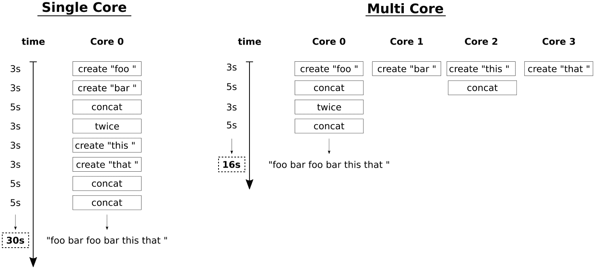

# 八、并行性和并发性

在本章中，我们将介绍以下食谱:

*   使用标准算法自动并行化代码
*   让程序休眠特定的时间
*   启动和停止线程
*   与`std::unique_lock`和`std::shared_lock`执行异常安全共享锁定
*   避免与`std::scoped_lock`的僵局
*   同步并发`std::cout`使用
*   通过`std::call_once`安全推迟初始化
*   使用`std::async`将任务的执行推到后台
*   用`std::condition_variable`实现生产者/消费者习惯用法
*   用`std::condition_variable`实现多生产者/消费者习惯用法
*   使用`std::async`并行化 ASCII 曼德尔布罗渲染器
*   用`std::future`实现微小的自动并行化库

# 介绍

在 C++ 11 之前，C++ 不太支持并行化。这并不意味着启动、控制、停止和同步线程是不可能的，但是使用特定于操作系统的库是必要的，因为线程本质上与操作系统相关。

借助 C++ 11，我们获得了`std::thread`，它支持跨所有操作系统的基本可移植线程控制。为了同步线程，C++ 11 还引入了互斥类和舒适的 RAII 风格的锁包装器。除此之外，`std::condition_variable`允许线程间灵活的事件通知。

其他一些真正有趣的增加是`std::async`和`std::future` -我们现在可以将任意的普通函数包装到`std::async`调用中，以便在后台异步执行它们。这种包装的函数返回`std::future`对象，这些对象承诺稍后包含函数的结果，所以我们可以在等待它的到来之前做一些其他的事情。

STL 的另一个实际上巨大的改进是*执行策略*，它可以添加到已经存在的 69 个*算法中。这种添加意味着，我们只需向旧程序中现有的标准算法调用添加一个执行策略参数，就可以获得并行化，而无需复杂的重写。*

在这一章中，我们将通过所有这些补充来了解关于它们的最重要的事情。之后，我们将对 C++ 17 STL 中的并行化支持有足够的监督。我们没有涵盖所有的细节，但最重要的。从这本书获得的概述有助于快速理解其余的并行编程机制，您可以随时在线查阅 C++ 17 STL 文档。

最后，本章包含两个奖励食谱。在一个方法中，我们将并行化来自[第 23 章](05.html)、*STL 算法的高级使用*的 Mandelbrot ASCII 渲染器，只做最小的改变。在最后一个方法中，我们将实现一个小型库，帮助隐式和自动地并行化复杂的任务。

# 使用标准算法自动并行化代码

C++ 17 为并行性带来了一个真正的主要扩展:e .标准算法的执行策略。69 种算法被扩展为接受执行策略，以便在多个内核上并行运行，甚至支持向量化。

对于用户来说，这意味着如果我们已经在任何地方使用 STL 算法，我们将免费获得一个不错的并行化奖励。我们只需在现有的 STL 算法调用中添加一个执行策略参数，就可以轻松地为我们的应用提供后续的并行化。

在这个食谱中，我们将实现一个简单的程序(使用不太严重的用例场景)，该程序将多个 STL 算法调用排列在一起。在使用这些的同时，我们将看到使用 C++ 17 执行策略以便让它们运行多线程是多么容易。在本节的最后几个小节中，我们将详细了解不同的执行策略。

# 怎么做...

在这一节中，我们将编写一个使用一些标准算法的程序。这个程序本身更像是一个真实场景的例子，而不是真实工作场景的例子。在使用这些标准算法时，我们嵌入了执行策略，以加快代码的速度:

1.  首先，我们需要包含一些头，并声明我们使用`std`命名空间。`execution`表头是新的；它附带了 C++ 17:

```cpp
      #include <iostream>
      #include <vector>
      #include <random>
      #include <algorithm>
      #include <execution>      

      using namespace std;
```

2.  为了举例，我们将声明一个谓词函数，它告诉一个数是否是奇数。我们稍后将使用它:

```cpp
      static bool odd(int n) { return n % 2; }
```

3.  让我们首先在主函数中定义一个大向量。我们会用大量数据填充它，这样就需要一些时间来对它进行计算。这个代码的执行速度会有很大的变化*，这取决于执行这个代码的计算机。较小/较大的矢量大小在不同的计算机上可能更好:*

```cpp
      int main()
      {
          vector<int> d (50000000);
```

4.  为了获得向量的大量随机数据，让我们实例化一个随机数生成器和一个分布，并将它们打包在一个可调用的对象中。如果这看起来很奇怪，请先看看[第 25 章](07.html)、*效用类*中处理随机数生成器和分布的食谱:

```cpp
          mt19937 gen;
          uniform_int_distribution<int> dis(0, 100000);

          auto rand_num ([=] () mutable { return dis(gen); });
```

5.  现在，让我们使用`std::generate`算法用随机数据填充向量。这个算法有一个新的 C++ 17 版本，可以采用一种新的参数:执行策略。我们在这里放入`std::par`，允许自动并行化这段代码。通过这样做，我们允许多个线程开始一起填充向量，如果计算机有多个 CPU，这将减少执行时间，这通常是现代计算机的情况:

```cpp
          generate(execution::par, begin(d), end(d), rand_num);
```

6.  `std::sort`的方法应该也已经很熟悉了。C++ 17 版本也支持定义执行策略的附加参数:

```cpp
          sort(execution::par, begin(d), end(d));
```

7.  这同样适用于`std::reverse`:

```cpp
          reverse(execution::par, begin(d), end(d));
```

8.  然后我们用`std::count_if`来统计向量中所有的奇数。我们甚至可以通过再次添加执行策略来实现并行化！

```cpp
          auto odds (count_if(execution::par, begin(d), end(d), odd));
```

9.  整个程序没有做任何真正的科学工作，因为我们只是想看看如何并行化标准算法，但是让我们在最后打印一些东西:

```cpp
          cout << (100.0 * odds / d.size()) 
               << "% of the numbers are odd.n";
      }
```

10.  编译并运行该程序会给出以下输出。在这一点上，有趣的是，当使用没有执行策略的算法时，与所有其他执行策略相比，执行速度有何不同。这样做是留给读者的练习。试试看；可用的执行策略有`seq`、`par`和`par_vec`。我们应该为它们中的每一个获得不同的执行时间:

```cpp
      $ ./auto_parallel
      50.4% of the numbers are odd.
```

# 它是如何工作的...

特别是因为这个食谱没有用任何复杂的现实问题解决方案分散我们的注意力，我们能够完全专注于标准的库函数调用。很明显，它们的并行版本与经典的顺序版本几乎没有什么不同。它们的区别仅在于*一个额外的*参数，即*执行政策*。

让我们看一下调用并回答三个核心问题:

```cpp
generate(execution::par, begin(d), end(d), rand_num);
sort(    execution::par, begin(d), end(d));
reverse( execution::par, begin(d), end(d));

auto odds (count_if(execution::par, begin(d), end(d), odd));
```

# 我们可以这样并行化哪些 STL 算法？

在 C++ 17 标准中，69 个现有的 STL 算法被升级为支持并行，还有 7 个新算法也支持并行。虽然这样的升级对于实现来说可能是相当具有侵略性的，但是在它们的接口方面并没有太大的变化——它们都有一个额外的`ExecutionPolicy&& policy`参数，仅此而已。这并不是说*不是*意味着我们*总是*必须提供一个执行政策论证。只是他们*另外*支持接受执行政策作为他们的第一个论点。

这是 69 个升级的标准算法。还有从一开始就支持执行策略的七个新的(以*粗体*突出显示):

| `std::adjacent_difference`
`std::adjacent_find`
`std::all_of`
`std::any_of`
`std::copy`
`std::copy_if`
`std::copy_n`
`std::count`
`std::count_if`
`std::equal` `**std::exclusive_scan**`
`std::fill`
`std::fill_n`

`std::find_first_of`
`std::find_if`
`**std::for_each**`
`**std::for_each_n**``std::generate`
`std::generate_n`
`std::includes` `**std::inclusive_scan**`
 | `std::inplace_merge` `std::is_heap` `std::is_heap_until`
`std::is_partitioned`
`std::is_sorted`
`std::is_sorted_until`
`std::lexicographical_compare`
`std::max_element`
`std::merge`
`std::min_element`
`std::minmax_element`
`std::mismatch`
`std::move`

`std::partial_sort`
`std::partial_sort_copy`

`std::partition_copy`
`std::remove`
`std::remove_copy`

`std::remove_if`
`std::replace` | `std::replace_if`
`std::reverse`
`std::reverse_copy`
`std::rotate`
`std::rotate_copy`
`std::search`
`std::search_n`
`std::set_difference`
`std::set_intersection`
`std::set_symmetric_difference`
`std::set_union`
`std::sort`
`std::stable_partition`

`std::transform`
`**std::transform_inclusive_scan**` `**std::transform_reduce**`
`std::uninitialized_copy``std::uninitialized_copy_n`
`std::uninitialized_fill`
`std::uninitialized_fill_n`
`std::unique` |

升级这些算法是个好消息！我们的旧程序越多地使用 STL 算法，我们就越容易追溯性地向它们添加并行性。请注意，这并不意味着这种变化会使每个程序自动地加快“than 次，因为多道程序比这复杂得多。

然而，我们现在可以以一种非常优雅的、独立于操作系统的方式并行化标准任务，而不是使用`std::thread`、`std::async`或通过包含外部库来设计我们自己的复杂并行算法。

# 这些执行策略是如何工作的？

执行策略告诉我们允许标准算法调用自动并行化的策略。

`std::execution`命名空间中存在以下三种策略类型:

| **政策** | **表示** |
| --- | --- |
| `sequenced_policy` | 该算法必须以类似于没有执行策略的原始算法的顺序形式执行。全局可用实例的名称为`std::execution::seq`。 |
| `parallel_policy` | 该算法可以用以并行方式共享工作的多个线程来执行。全局可用实例的名称为`std::execution::par`。 |
| `parallel_unsequenced_policy` | 该算法可以在多个线程共享工作的情况下执行。除此之外，还允许对代码进行矢量化。在这种情况下，由于向量化，容器访问可以在线程之间以及同一线程内交错进行。全局可用实例的名称为`std::execution::par_unseq`。 |

执行政策对我们意味着特定的约束。特定约束越严格，我们可以允许的并行化策略措施就越多:

*   并行算法*使用的所有元素访问函数不得*导致*死锁*或*数据竞争*
*   在并行和向量化的情况下，所有访问函数*不得使用任何类型的阻塞同步*

只要我们遵守这些规则，我们就应该避免使用并行版本的 STL 算法带来的错误。

Note that just using parallel STL algorithms correctly does not always lead to guaranteed speedup. Depending on the problem we try to solve, the problem size, and the efficiency of our data structures and other access methods, measurable speedup will vary very much or not occur at all. *Multiprogramming is still hard.*

# 矢量化是什么意思？

矢量化是中央处理器和编译器都需要支持的功能。让我们快速浏览一下一个简单的示例，以简要了解什么是矢量化及其工作原理。假设我们想从一个非常大的向量中总结数字。此任务的简单实现如下所示:

```cpp
std::vector<int> v {1, 2, 3, 4, 5, 6, 7 /*...*/};

int sum {std::accumulate(v.begin(), v.end(), 0)};
```

编译器最终将从`accumulate`调用中生成一个循环，如下所示:

```cpp
int sum {0};
for (size_t i {0}; i < v.size(); ++ i) {
    sum += v[i];
}
```

从这一点出发，在允许并启用矢量化的情况下，编译器可以生成以下代码。该循环在一个循环步骤中执行四个累积步骤，并且迭代次数减少了四倍。为了简单起见，如果向量不包含`N * 4`元素，则该示例不处理余数:

```cpp
int sum {0};
for (size_t i {0}; i < v.size() / 4; i += 4) {
    sum += v[i] + v[i+1] + v[i + 2] + v[i + 3];
}
// if v.size() / 4 has a remainder, 
// real code has to deal with that also.
```

它为什么要这样做？许多中央处理器只需一步，就能提供执行数学运算的指令，如`sum += v[i] + v[i+1] + v[i + 2] + v[i + 3];`。将尽可能多的*数学运算压入尽可能少的*指令是目标，因为这加快了程序的速度。**

自动矢量化很难，因为编译器需要在一定程度上理解我们的程序，以便使我们的程序更快，但又不影响其*正确性*。至少，我们可以通过尽可能频繁地使用标准算法来帮助编译器，因为对于编译器来说，这些算法比具有复杂数据流依赖关系的复杂手工循环更容易掌握。

# 让程序休眠特定的时间

C++ 11 提供了一种控制线程的简单可行的方法。它引入了`this_thread`命名空间，其中包括只影响调用方线程的函数。它包含两个不同的函数，允许让一个线程休眠一定的时间，所以我们不再需要为这样的任务使用任何外部的或操作系统相关的库。

在这个食谱中，我们专注于如何将线程挂起一定的时间，或者如何让它们进入*睡眠*。

# 怎么做...

我们将编写一个简短的程序，让主线程休眠一定的时间:

1.  让我们首先包含所有需要的头，并声明我们将使用`std`和`chrono_literals`名称空间。`chrono_literals`命名空间包含用于创建时间跨度值的简便缩写:

```cpp
      #include <iostream>
      #include <chrono>
      #include <thread>      

      using namespace std;
      using namespace chrono_literals;
```

2.  让我们立即让主线程休眠 5 秒 300 毫秒。感谢`chrono_literals`，我们可以用非常易读的格式表达这一点:

```cpp
      int main()
      {
          cout << "Going to sleep for 5 seconds"
                  " and 300 milli seconds.n";

          this_thread::sleep_for(5s + 300ms);
```

3.  最后一个睡眠声明是`relative`。我们也可以表达`absolute`睡眠请求。让我们一直睡到时间点，也就是*现在的*加上`3`秒:

```cpp
          cout << "Going to sleep for another 3 seconds.n";

          this_thread::sleep_until(
              chrono::high_resolution_clock::now() + 3s);
```

4.  在退出程序之前，让我们打印一些其他的东西来表示第二个睡眠周期的结束:

```cpp
          cout << "That's it.n";
      }
```

5.  编译和运行程序会产生以下结果。Linux、Mac 和其他类似 UNIX 的操作系统提供`time`命令，它接受另一个命令以便执行它并停止它所花费的时间。用`time`运行我们的程序显示它运行了`8.32`秒，这大致是我们让程序休眠的`5.3`和`3`秒。运行程序时，可以计算打印行到达终端之间的时间:

```cpp
      $ time ./sleep 
      Going to sleep for 5 seconds and 300 milli seconds.
      Going to sleep for another 3 seconds.
      That's it.

      real 0m8.320s
      user 0m0.005s
      sys  0m0.003s
```

# 它是如何工作的...

`sleep_for`和`sleep_until`函数已经被添加到 C++ 11 中，并且位于`std::this_thread`命名空间中。它们会在特定的时间内阻塞当前线程(而不是整个进程或程序)。线程被阻塞时不会消耗 CPU 时间。它只是被操作系统置于非活动状态。当然，操作系统会提醒自己再次唤醒线程。最好的一点是，我们不需要关心我们的程序在哪个操作系统上运行，因为 STL 从我们这里抽象出了这个细节。

`this_thread::sleep_for`功能接受一个`chrono::duration`值。在最简单的情况下，这只是`1s`或`5s + 300ms`，就像在我们的示例代码中一样。为了获得如此好的时间跨度文字，我们需要声明`using namespace std::chrono_literals;`。

`this_thread::sleep_until`功能接受`chrono::time_point`而不是时间跨度。如果我们希望让线程休眠到某个特定的挂钟时间，这是很舒服的。

唤醒的时间只有在操作系统允许的情况下才是准确的。对于大多数操作系统来说，这通常是足够精确的*，但是如果某些应用需要纳秒级的粒度，这可能会变得困难。*

 *另一种短时间让线程休眠的可能性是`this_thread::yield`。它接受*否*的参数，这意味着我们无法知道线程的执行延迟了多长时间。原因是这个函数并没有真正实现休眠或驻留线程的概念。它只是以一种协作的方式告诉操作系统，它可以重新调度任何其他进程的任何其他线程。如果没有，那么线程将立即再次执行。由于这个原因，`yield`通常比只睡很少但特定的时间有用。

# 启动和停止线程

C++ 11 附带的另一个功能是`std::thread`类。它提供了一种干净简单的方式来启动和停止线程，而不需要任何外部库，也不需要知道操作系统是如何实现的。这些都包含在 STL 中。

在这个食谱中，我们将实现一个启动和停止线程的程序。有一些小细节需要知道线程一旦启动后该做什么，所以我们也将讨论这些细节。

# 怎么做...

我们将启动多个线程，看看当我们释放多个处理器内核来同时执行部分代码时，我们的程序会如何运行:

1.  首先，我们只需要包含两个头，然后我们声明使用`std`和`chrono_literals`名称空间:

```cpp
      #include <iostream>
      #include <thread>      

      using namespace std;
      using namespace chrono_literals;
```

2.  为了启动一个线程，我们需要能够告诉它应该执行什么代码。那么，让我们定义一个可以执行的函数。函数是线程天然的潜在入口点。示例函数接受一个参数`i`，它充当线程标识。这样我们就可以知道哪个打印行来自哪个线程。此外，我们使用线程标识让所有线程等待不同的时间，因此我们可以确保它们不会试图在完全相同的时间使用`cout`。如果他们这样做了，那将会破坏输出。本章中的另一个方法专门处理这个问题:

```cpp
      static void thread_with_param(int i)
      {
          this_thread::sleep_for(1ms * i);

          cout << "Hello from thread " << i << 'n';

          this_thread::sleep_for(1s * i);

          cout << "Bye from thread " << i << 'n';
      }
```

3.  在主功能中，我们可以，只是出于好奇，使用`std::thread::hardware_concurrency`打印出可以同时运行多少个线程。这取决于机器真正有多少内核，以及 STL 实现支持多少内核。这意味着在其他每台计算机上，这可能是一个不同的数字:

```cpp
      int main()
      {
          cout << thread::hardware_concurrency()
               << " concurrent threads are supported.n";
```

4.  让我们现在终于开始线程。每一个都有不同的标识，我们开始三个线程。当用诸如`thread t {f, x}`的表达式实例化一个线程时，这会导致新线程调用`f(x)`。这样，我们可以为每个线程赋予`thread_with_param`函数不同的参数:

```cpp
          thread t1 {thread_with_param, 1};
          thread t2 {thread_with_param, 2};
          thread t3 {thread_with_param, 3};
```

5.  由于这些线程是自由运行的，当它们完成工作时，我们需要再次停止它们。我们使用`join`功能来实现。它将阻塞调用线程，直到我们试图加入的线程返回:

```cpp
          t1.join();
          t2.join();
```

6.  连接的替代方法是*分离*。如果我们不调用`join`或分离，`thread`对象的析构函数一执行，整个应用就会被大量的烟雾和噪音终止。通过调用`detach`，我们告诉`thread`我们真的想让线程 3 继续运行，即使它的`thread`实例被破坏:

```cpp
          t3.detach();
```

7.  在退出主功能和整个程序之前，我们打印另一条消息:

```cpp
          cout << "Threads joined.n";
      }
```

8.  编译和运行代码显示了以下输出。我们可以看到我的机器有八个 CPU 核心。然后，我们看到来自所有线程的 *hello* 消息，但是 *bye* 消息仅来自我们实际加入的两个线程。线程 3 仍处于 3 秒的等待期，但在第二个线程完成等待 2 秒后，整个程序确实已经终止。这样，我们就看不到来自线程 3 的 bye 消息，因为它被简单地杀死了，没有任何完成的机会(也没有噪音):

```cpp
      $ ./threads 
      8 concurrent threads are supported.
      Hello from thread 1
      Hello from thread 2
      Hello from thread 3
      Bye from thread 1
      Bye from thread 2
      Threads joined.
```

# 它是如何工作的...

启动和停止线程是一件非常简单的事情。多道程序设计开始变得复杂，线程需要一起工作(共享资源、相互等待等等)。

为了启动一个线程，我们首先需要一些将由它执行的函数。这个函数不需要特别，因为一个线程实际上可以执行每个函数。让我们确定一个启动线程并等待其完成的最小示例程序:

```cpp
void f(int i) { cout << i << 'n'; }

int main()
{
    thread t {f, 123};
    t.join();
}
```

`std::thread`的构造函数调用接受一个函数指针或一个可调用对象，后跟应该与函数调用一起使用的参数。当然，也可以在不接受任何参数的函数上启动线程。

如果系统有多个 CPU 内核，那么线程可以并行运行*和*并发运行。并行和并发有什么区别？如果计算机只有一个中央处理器内核，那么可能会有许多线程并行运行，但绝不会并发运行，因为一个中央处理器内核一次只能运行一个线程。然后线程以交错的方式运行，每个线程执行一秒钟的某些部分，然后暂停，然后下一个线程获得一个时间片(对于人类用户来说，这看起来像是它们同时运行)。如果它们不需要共享一个中央处理器内核，那么它们可以并发运行，就像在*真正同时运行*一样。

在这一点上，我们对以下细节绝对*无法控制*:

*   共享一个中央处理器内核时线程交错的*顺序*。
*   一个线程的*优先级*，或者哪一个比另一个更重要。
*   事实上，线程实际上是分布在所有的中央处理器内核中的，或者如果操作系统只是将它们固定在同一个内核中。虽然机器有 100 多个内核，但我们所有的线程都只在一个内核上运行，这确实是*可能的*。

大多数操作系统也提供了控制多道程序设计的这些方面的可能性，但是在这一点上，这些特性并不包含在 STL 中。

但是，我们可以启动和停止线程，并告诉它们何时处理什么以及何时暂停。这对一大类应用来说应该足够了。我们在这一节中所做的是我们启动了三个额外的线程。之后，我们*加入了*大部分，而*分离了最后一个*。让我们用简单的图表总结一下发生了什么:


从上到下阅读这个图表，它显示了一个时间点，在这个时间点，我们将程序工作流分成总共四个线程。我们启动了三个额外的线程来做一些事情(即等待和打印)，但是在启动线程之后，执行主功能的主线程仍然没有工作。

每当一个线程完成了它开始执行的函数时，它将从这个函数返回。然后，标准库会做一些整理工作，导致线程从操作系统的时间表中移除，并可能导致其销毁，但我们不需要担心。

我们*唯一需要*担心的就是*加入*。当一个线程在另一个`thread`对象上调用函数`x.join()`时，它被置于睡眠状态，直到线程`x`返回。请注意，如果线程被困在一个无尽的循环中，我们就倒霉了！如果我们想让一个线程继续生存，直到它决定终止自己，我们可以称之为`x.detach()`。这样做之后，我们就不再对线程有外部控制了。无论我们决定什么-我们*必须*始终*连接*或*分离*螺纹。如果我们不做这两者之一，`thread`对象的析构函数将调用`std::terminate()`，这将导致应用突然关闭。

当我们的主函数返回时，整个应用当然会终止。然而，与此同时，我们的分离线程`t3`在向终端打印其*再见*消息之前仍在睡觉。操作系统并不在乎——它只是终止了我们的整个程序，而没有等待那个线程完成。这是我们需要考虑的事情。如果额外的线程必须完成一些重要的事情，我们必须让主函数*等待*完成它。

# 使用 std::unique_lock 和 std::shared_lock 执行异常安全共享锁定

由于线程的操作是一个与操作系统支持密切相关的事情，并且 STL 为此提供了良好的与操作系统无关的接口，因此为线程之间的*同步*提供 STL 支持也是明智的。这样，我们不仅可以在没有外部库的情况下启动和停止线程，还可以用来自单一统一库(STL)的抽象来同步它们。

在这个食谱中，我们将看看 STL 互斥类和 RAI 锁抽象。当我们在具体的配方实现中使用其中的一些时，我们还将获得 STL 提供的更多同步助手的概述。

# 怎么做...

我们将编写一个程序，在其*独占*和*共享*模式下使用一个`std::shared_mutex`实例，看看这意味着什么。此外，我们自己不调用锁定和解锁功能，而是使用 RAII 助手通过自动解锁进行锁定:

1.  首先，我们需要包含所有必要的标题。因为我们一直将 STL 函数和数据结构与时间文字一起使用，所以我们声明使用`std`和`chrono_literal`名称空间:

```cpp
      #include <iostream>
      #include <shared_mutex>
      #include <thread>
      #include <vector>      

      using namespace std;
      using namespace chrono_literals;
```

2.  整个程序围绕一个共享互斥体，为了简单起见，让我们定义一个全局实例:

```cpp
      shared_mutex shared_mut;
```

3.  我们将使用`std::shared_lock`和`std::unique_lock` RAII 助手。为了让它们的名字看起来不那么笨拙，我们为它们定义了简短的类型别名:

```cpp
      using shrd_lck = shared_lock<shared_mutex>;
      using uniq_lck = unique_lock<shared_mutex>;
```

4.  在开始使用主函数之前，我们定义了两个辅助函数，它们都试图在*独占*模式下锁定互斥体。这个函数将在共享互斥体上实例化一个`unique_lock`实例。第二个构造函数参数`defer_lock`告诉对象保持锁未锁定。否则，它的构造函数会试图锁定互斥体，然后阻塞直到成功。然后我们在`exclusive_lock`对象上调用`try_lock`。这个调用将立即返回，它的布尔返回值告诉我们它是否获得了锁，或者互斥锁是否已经在其他地方被锁定:

```cpp
      static void print_exclusive()
      {
          uniq_lck l {shared_mut, defer_lock};

          if (l.try_lock()) {
              cout << "Got exclusive lock.n";
          } else {
              cout << "Unable to lock exclusively.n";
          }
      }
```

5.  另一个助手函数也试图以独占模式锁定互斥体。它会一直锁着直到拿到锁。然后我们通过抛出一个异常来模拟一些错误情况(它只携带一个简单的整数，而不是一个更复杂的异常对象)。虽然这导致我们持有锁定互斥体的上下文立即退出，但是互斥体将被干净地再次释放。那是因为`unique_lock`的析构函数在任何情况下都会通过设计释放锁:

```cpp
      static void exclusive_throw()
      {
          uniq_lck l {shared_mut};
          throw 123;
      }
```

6.  现在来看主要功能。首先，我们打开另一个范围并实例化一个`shared_lock`实例。它的构造函数立即在`shared`模式下锁定互斥体。我们将在接下来的步骤中了解这意味着什么:

```cpp
      int main()
      {
          {
              shrd_lck sl1 {shared_mut};

              cout << "shared lock once.n";
```

7.  现在我们打开另一个作用域，并在同一个互斥体上实例化第二个`shared_lock`实例。我们现在有两个`shared_lock`实例，它们都持有互斥体的共享锁。事实上，我们可以在同一个互斥体上任意实例化多个`shared_lock`实例。然后我们调用`print_exclusive`，试图在*独占*模式下锁定互斥。这不会成功，因为它已经锁定在*共享*模式:

```cpp
              {
                  shrd_lck sl2 {shared_mut};

                  cout << "shared lock twice.n";

                  print_exclusive();
              }
```

8.  离开最新的作用域后，`shared_lock` `sl2`的析构函数释放对互斥体的共享锁。`print_exclusive`函数将再次失败，因为互斥体仍处于共享锁模式:

```cpp
              cout << "shared lock once again.n";

              print_exclusive();

          }
          cout << "lock is free.n";
```

9.  同样离开另一个范围后，所有`shared_lock`对象被销毁，互斥体再次处于解锁状态。*现在*我们终于可以在独占模式下锁定互斥了。我们先打电话给`exclusive_throw`，然后打电话给`print_exclusive`来解决这个问题。请记住，我们在`exclusive_throw`中抛出了一个异常。但是因为`unique_lock`是一个 RAII 对象，它给了我们异常安全，所以不管我们从`exclusive_throw`怎么返回，互斥体都会被再次解锁。这样`print_exclusive`就不会阻塞错误锁定的互斥体:

```cpp
          try {
              exclusive_throw();
          } catch (int e) {
              cout << "Got exception " << e << 'n';
          }

          print_exclusive();
      }
```

10.  编译并运行代码会产生以下输出。前两行显示我们获得了两个共享锁实例。那么`print_exclusive`功能无法在独占模式下锁定互斥体。离开内部范围并解锁第二个共享锁后，`print_exclusive`功能仍然失败。在离开了最终再次释放互斥体的另一个范围之后，`exclusive_throw`和`print_exclusive`终于能够锁定互斥体了:

```cpp
      $ ./shared_lock 
      shared lock once.
      shared lock twice.
      Unable to lock exclusively.
      shared lock once again.
      Unable to lock exclusively.
      lock is free.
      Got exception 123
      Got exclusive lock.
```

# 它是如何工作的...

当查看 C++ 文档时，首先有点困惑的是有不同的互斥类和 RAII 锁助手。在查看我们的具体代码示例之前，让我们总结一下 STL 为我们提供了什么。

# 互斥类

术语互斥体代表 **mut** ual **ex** clusion。为了防止并发运行的线程以可能导致数据损坏的非协调方式改变同一个对象，我们可以使用互斥对象。STL 提供了不同专业的互斥类。它们都有一个共同点，那就是它们有一个`lock`和一个`unlock`方法。

每当一个线程第一个对一个之前没有被锁定的互斥体调用`lock()`时，它就拥有这个互斥体。此时，其他线程将阻塞它们的`lock`调用，直到第一个线程再次调用`unlock`。`std::mutex`恰恰可以做到这一点。

STL 中有许多不同的互斥类:

| **类型名称** | **描述** |
| --- | --- |
| `mutex` | 带有`lock`和`unlock`方法的标准互斥体。提供额外的非阻塞`try_lock`方法。 |
| `timed_mutex` | 与互斥体相同，但提供了额外的`try_lock_for`和`try_lock_until`方法，允许*超时*，而不是永远阻塞。 |
| `recursive_mutex` | 与`mutex`相同，但是如果一个线程已经锁定了它的一个实例，它可以在同一个互斥对象上多次调用`lock`而不会阻塞。它是在拥有名为`unlock`的线程后发布的，就像它经常名为`lock`一样。 |
| `recursive_timed_mutex` | 提供`timed_mutex`和`recursive_mutex`的功能。 |
| `shared_mutex` | 这个互斥体在这方面是特殊的，它可以锁定在*独占*模式和*共享*模式。在独占模式下，它显示与标准互斥类相同的行为。如果一个线程在共享模式下锁定它，其他线程也有可能在共享模式下锁定它。最后一个共享模式锁所有者一释放它，它就会被解锁。当锁在共享模式下被锁定时，不可能获得独占所有权。这和`shared_ptr`的行为很像，只是它不管理内存，而是锁所有权。 |
| `shared_timed_mutex` | 将`shared_mutex`和`timed_mutex`的功能结合起来，用于独占和共享模式。 |

# 锁定类

只要线程只是锁定一个互斥体，访问一些并发保护的对象并再次解锁互斥体，一切都很好很容易。一旦一个健忘的程序员在锁定互斥体后错过了在某个地方解锁互斥体，或者当互斥体仍然被锁定时抛出了一个异常，事情看起来就会变得很糟糕。在最好的情况下，程序只是立即挂起，并且丢失的解锁调用被快速识别。然而，这种错误与内存泄漏非常相似，内存泄漏也发生在缺少显式`delete`调用的时候。

关于内存管理，我们有`unique_ptr`、`shared_ptr`和`weak_ptr`。这些助手提供了非常方便的方法来避免内存泄漏。互斥体也有这样的助手。最简单的就是`std::lock_guard`。它可以如下使用:

```cpp
void critical_function()
{
    lock_guard<mutex> l {some_mutex};

    // critical section
}
```

`lock_guard`元素的构造函数接受一个互斥体，并立即调用`lock`。整个构造函数调用将阻塞，直到它获得互斥锁。销毁后，它会再次解锁互斥锁。这样很难让`lock` / `unlock`循环出错，因为它是自动发生的。

C++ 17 STL 提供了以下不同的 RAI 锁助手。它们都接受一个模板参数，该参数应该与互斥体的类型相同(尽管由于 C++ 17，编译器可以自己推导出该类型):

| **名称** | **描述** |
| --- | --- |
| `lock_guard` | 这个类只提供了一个构造函数和一个析构函数，它们分别是`lock`和`unlock`互斥体。 |
| `scoped_lock` | 类似于`lock_guard`，但是在其构造函数中支持任意多的互斥。将在析构函数中以相反的顺序释放它们。 |
| `unique_lock` | 以独占模式锁定互斥体。构造函数还接受指示它超时的参数，而不是永远阻塞锁调用。也有可能根本不锁定互斥体，或者假设它已经被锁定，或者只*尝试*锁定互斥体。额外的方法允许在`unique_lock`锁的有效期内锁定和解锁互斥锁。 |
| `shared_lock` | 与`unique_lock`相同，但所有操作都以共享模式应用于互斥体。 |

而`lock_guard`和`scoped_lock`有死简单的接口，只由构造函数和析构函数组成，`unique_lock`和`shared_lock`更复杂，但也更通用。我们将在本章后面的食谱中看到，如果不是简单的锁区域，它们还可以如何使用。

现在让我们回到食谱代码。虽然我们只在单线程上下文中运行代码，但是我们已经看到了如何使用锁助手。`shrd_lck`类型别名代表`shared_lock<shared_mutex>`，允许我们在共享模式下多次锁定一个实例。只要`sl1`和`sl2`存在，没有`print_exclusive`调用能够在独占模式下锁定互斥。这还是很简单的。

现在让我们来看看主函数后面的排他锁函数:

```cpp
int main()
{
    {
        shrd_lck sl1 {shared_mut};
        {
            shrd_lck sl2 {shared_mut};

            print_exclusive();
        }
        print_exclusive();
    }

    try {
        exclusive_throw();
    } catch (int e) {
        cout << "Got exception " << e << 'n';
    }
    print_exclusive();
}
```

一个重要的细节是从`exclusive_throw`返回后，`print_exclusive`函数能够再次锁定互斥体，尽管`exclusive_throw`由于抛出异常而没有干净地退出。

我们再来看看`print_exclusive`，因为它使用了一个奇怪的构造函数调用:

```cpp
void print_exclusive()
{
    uniq_lck l {shared_mut, defer_lock};

    if (l.try_lock()) {
        // ...
    }
}
```

在本程序中，我们不仅提供了`shared_mut`而且还提供了`defer_lock`作为`unique_lock`的构造函数参数。`defer_lock`是一个空的全局对象，可以用来选择一个不同的`unique_lock`的构造函数，它只是不锁定互斥体。这样做，我们以后就能调用`l.try_lock()`了，不堵。如果互斥已经被锁定，我们可以做些别的事情。如果真的有可能拿到锁，我们还有析构函数在后面整理。

# 使用 std::scoped_lock 避免死锁

如果在道路交通中发生了死锁，它们看起来会像下面的情况:


为了让交通再次畅通，我们要么需要一台大型起重机，从街道十字路口的中心随机挑选一辆车，并将其移走。如果这是不可能的，那么我们需要足够多的司机合作。死锁可以通过一个方向的所有司机向后行驶几米来解决，为其他司机继续行驶腾出空间。

在多线程程序中，这种情况当然需要程序员严格避免。然而，当程序非常复杂时，在这方面很容易失败。

在这个方法中，我们将编写故意引发死锁情况的代码。然后我们将看到如何编写获取导致其他代码陷入死锁的相同资源的代码，但是使用 C++ 17 附带的新的 STL 锁类`std::scoped_lock`，以避免这个错误。

# 怎么做...

本节的代码包含两对应该由并发线程执行的函数，它们以互斥体的形式获取两个资源。一对引发僵局，另一对避免僵局。在主功能中，我们将试用它们:

1.  让我们首先包含所有需要的头，并声明我们使用名称空间`std`和`chrono_literals`:

```cpp
      #include <iostream>
      #include <thread>
      #include <mutex>      

      using namespace std;
      using namespace chrono_literals;
```

2.  然后，我们实例化两个互斥对象，这是我们遇到死锁所需要的:

```cpp
      mutex mut_a;
      mutex mut_b;
```

3.  为了用两种资源挑起僵局，我们需要两种功能。一个函数试图锁定互斥体 A，然后锁定互斥体 B，而另一个函数将以相反的顺序锁定。通过让这两个函数在锁之间休眠一段时间，我们可以确保这段代码永远阻塞在死锁上。(这是为了演示。如果我们反复启动一个没有一些睡眠线的程序，它可能会成功运行而不会出现死锁。)
    请注意，我们不使用`'n'`字符来打印换行符，而是使用`endl`。`endl`不仅执行换行，还会刷新`cout`的流缓冲区，因此我们可以确定打印不会被聚集和推迟:

```cpp
      static void deadlock_func_1()
      {
          cout << "bad f1 acquiring mutex A..." << endl;
          lock_guard<mutex> la {mut_a};

          this_thread::sleep_for(100ms);

          cout << "bad f1 acquiring mutex B..." << endl;
          lock_guard<mutex> lb {mut_b};

          cout << "bad f1 got both mutexes." << endl;
      }
```

4.  正如在最后一步中承诺的那样，`deadlock_func_2`看起来与`deadlock_func_1`完全相同，但是它以相反的顺序锁定互斥体 A 和 B:

```cpp
      static void deadlock_func_2()
      {
          cout << "bad f2 acquiring mutex B..." << endl;
          lock_guard<mutex> lb {mut_b};

          this_thread::sleep_for(100ms);

          cout << "bad f2 acquiring mutex A..." << endl;
          lock_guard<mutex> la {mut_a};

          cout << "bad f2 got both mutexes." << endl;
      }
```

5.  现在，我们为刚刚实现的这两个函数编写一个无死锁的变体。他们使用类`scoped_lock`，这个类锁定了我们作为构造函数参数提供的所有互斥。它的析构器再次解锁它们。在锁定互斥体的同时，它在内部为我们应用了一种避免死锁的策略。请注意，两个函数仍然以相反的顺序使用互斥体 A 和 B:

```cpp
      static void sane_func_1()
      {
          scoped_lock l {mut_a, mut_b};

          cout << "sane f1 got both mutexes." << endl;
      }

      static void sane_func_2()
      {
          scoped_lock l {mut_b, mut_a};

          cout << "sane f2 got both mutexes." << endl;
      }
```

6.  在主功能中，我们将经历两个场景。首先，我们在多线程环境中使用 *sane* 函数:

```cpp
      int main()
      {
          {
              thread t1 {sane_func_1};
              thread t2 {sane_func_2};

              t1.join();
              t2.join();
          }
```

7.  然后，我们使用不使用任何死锁避免策略的引发死锁的函数:

```cpp
          {
              thread t1 {deadlock_func_1};
              thread t2 {deadlock_func_2};

              t1.join();
              t2.join();
          }
      }
```

8.  编译并运行程序会产生以下输出。前两行显示*神智清醒*锁定功能场景工作正常，两个功能永远不阻塞返回。另外两个函数陷入了死锁。我们可以看出这是一个死锁，因为我们看到打印行告诉我们单个线程试图锁定互斥体 A 和 B，然后永远等待*。两者都没有达到成功锁定两个互斥体的程度。我们可以让这个程序运行几个小时，几天，几年，什么都不会发生。
    该应用需要从外部取消，例如通过按键 *Ctrl* + *C* :*

```cpp
      $ ./avoid_deadlock 
      sane f1 got both mutexes
      sane f2 got both mutexes
      bad f2 acquiring mutex B...
      bad f1 acquiring mutex A...
      bad f1 acquiring mutex B...
      bad f2 acquiring mutex A...
```

# 它是如何工作的...

通过实现故意导致死锁的代码，我们已经看到了这种不想要的场景发生得有多快。在一个大型项目中，多个程序员编写的代码需要共享一组公共的互斥保护资源，所有程序员在锁定和解锁互斥时都需要遵守*相同的顺序*。虽然这样的策略或规则确实很容易遵循，但也很容易忘记。这个问题的另一个术语是*锁定顺序反转*。

`scoped_lock`在这种情况下是真正的帮助。它附带了 C++ 17，工作方式与`lock_guard`和`unique_lock`相同:它的构造函数执行锁定，它的析构函数执行互斥锁的解锁。`scoped_lock`的特长是可以通过*多个*互斥体做到这一点。

`scoped_lock`使用`std::lock`函数，该函数应用特殊算法，对提供的所有互斥体执行一系列`try_lock`调用，以防止死锁。因此，在同一组锁上使用`scoped_lock`或调用`std::lock`是完全安全的，但顺序不同。

# 同步并发标准::cout 使用

多线程程序的一个不便之处在于，我们必须切实保护它们修改的每一个*数据结构，用互斥或其他措施来防止不受控制的并发修改。*

 *一种通常用于打印的数据结构是`std::cout`。如果多个线程并发访问`cout`，那么输出会以有趣的混合模式出现在终端上。为了防止这种情况，我们需要编写自己的函数，以并发安全的方式打印。

我们将学习如何提供一个`cout`包装器，它由最少的代码组成，并且使用起来和`cout`一样舒服。

# 怎么做...

在本节中，我们将实现一个从多个线程并发打印到终端的程序。为了防止由于并发而导致的消息乱码，我们实现了一个小的助手类来同步线程之间的打印:

1.  一如既往，首先包括:

```cpp
      #include <iostream>
      #include <thread>
      #include <mutex>
      #include <sstream>
      #include <vector>      

      using namespace std;
```

2.  然后我们实现我们的助手类，我们称之为`pcout`。`p`代表*并行*，因为它在并行上下文中以同步的方式工作。想法是`pcout`公开继承`stringstream`。这样我们就可以在它的实例上使用`operator<<`。一旦`pcout`实例被销毁，它的析构函数就锁定一个互斥体，然后打印`stringstream`缓冲区的内容。我们将在下一步中了解如何使用它:

```cpp
      struct pcout : public stringstream {
          static inline mutex cout_mutex;

          ~pcout() {
              lock_guard<mutex> l {cout_mutex};
              cout << rdbuf();
              cout.flush();
          }
      };
```

3.  现在让我们编写两个可以由附加线程执行的函数。两者都接受线程标识作为参数。那么，它们唯一的区别就是第一个简单的用`cout`进行打印。另一个看起来几乎一样，但是它没有直接使用`cout`，而是实例化了`pcout`。这个实例是一个临时对象，只为这一行代码而存在。执行完所有`operator<<`调用后，内部字符串流中会填充我们想要打印的内容。然后调用`pcout`实例的析构函数。我们已经看到析构函数的作用:它锁定所有`pcout`实例共享的特定互斥体，并打印:

```cpp
      static void print_cout(int id)
      {
          cout << "cout hello from " << id << 'n';
      }

      static void print_pcout(int id)
      {
           pcout{} << "pcout hello from " << id << 'n';
      }
```

4.  让我们试试看。首先我们要用`print_cout`，它只是用`cout`进行打印。我们启动 10 个并发打印字符串的线程，并等待它们完成:

```cpp
      int main()
      {
          vector<thread> v;

          for (size_t i {0}; i < 10; ++ i) {
              v.emplace_back(print_cout, i);
          }

          for (auto &t : v) { t.join(); }
```

5.  然后我们用`print_pcout`函数做同样的事情:

```cpp
          cout << "=====================n";

          v.clear();
          for (size_t i {0}; i < 10; ++ i) {
              v.emplace_back(print_pcout, i);
          }

          for (auto &t : v) { t.join(); }
      }
```

6.  编译并运行程序会产生以下结果。如我们所见，前 10 张照片完全乱码了。这就是`cout`在没有锁定的情况下并发使用时的样子。节目的最后 10 行是`print_pcout`行，没有任何乱码的迹象。我们可以看到它们是从不同的线程中打印出来的，因为每次我们再次运行程序时，它们的顺序都是随机的:


# 它是如何工作的...

好了，我们已经构建了这个*“cout 包装器”*，它自动序列化并发打印尝试。它是如何工作的？

让我们按照我们的`pcout`助手手动完成的步骤来做，不需要任何魔法。首先，它实例化一个字符串流，并接受我们输入的输入:

```cpp
stringstream ss;
ss << "This is some printed line " << 123 << 'n';
```

然后它锁定一个全局可用的互斥体:

```cpp
{
    lock_guard<mutex> l {cout_mutex};
```

在这个锁定的范围内，它访问字符串流`ss`的内容，打印它，并通过离开范围再次释放互斥体。`cout.flush()`行告诉流对象立即打印到终端。如果没有这一行，程序可能会运行得更快，因为多行打印的行可以在以后的一次运行中集中打印。在我们的食谱中，我们希望立即看到所有输出行，因此我们使用`flush`方法:

```cpp
    cout << ss.rdbuf();
    cout.flush();
}
```

好吧，如果我们不得不一次又一次地做同样的事情，这很简单，但是写起来很乏味。我们可以将`stringstream`实例化缩短如下:

```cpp
stringstream{} << "This is some printed line " << 123 << 'n';
```

这将实例化一个字符串流对象，将我们想要打印的所有内容输入其中，然后再次对其进行析构。字符串流的生存期缩短到只有这一行。之后，我们无法再打印它，因为我们无法访问它。哪个代码是最后一个能够访问流内容的代码？是`stringstream`的析构器。

我们不能修改`stringstream`实例的成员方法，但是我们可以通过继承将自己的类型包装在它周围来扩展它们:

```cpp
struct pcout : public stringstream {
    ~pcout() {
        lock_guard<mutex> l {cout_mutex};
        cout << rdbuf();
        cout.flush();
    }
};
```

这个类*仍然是*一个字符串流，我们可以像使用任何其他字符串流一样使用它。唯一不同的是，它会锁定一个互斥体，并使用`cout`打印自己的缓冲区。

我们还将`cout_mutex`对象作为静态实例移动到结构`pcout`中，因此我们将两者捆绑在一个地方。

# 使用 std::call_once 安全地推迟初始化

有时我们有特定的代码段，可以由多个线程在并行上下文中运行，义务是一些*设置代码*必须在执行实际函数之前恰好执行一次。一个简单的解决方案是，在程序进入可以不时执行并行代码的状态之前，只执行现有的设置函数。

这种方法的缺点如下:

*   如果并行函数来自库，用户一定不要忘记调用设置函数。这并没有让图书馆更容易使用。
*   如果设置函数在某种程度上是昂贵的，并且在需要该设置的并行函数甚至不总是被使用的情况下，它甚至可能不需要被执行，那么我们需要决定何时/是否运行它的代码。

在这个食谱中，我们将看一下`std::call_once`，这是一个以简单易用且优雅含蓄的方式为我们解决这个问题的助手函数。

# 怎么做...

我们将编写一个程序，用完全相同的代码启动多个线程。尽管它们被编程为执行完全相同的代码，但我们的示例设置函数只会被调用一次:

1.  首先，我们需要包含所有必要的标题:

```cpp
      #include <iostream>
      #include <thread>
      #include <mutex>
      #include <vector>     

      using namespace std;
```

2.  稍后我们将使用`std::call_once`。为了使用它，我们需要某个地方的`once_flag`实例。在特定功能上使用`call_once`的所有线程的同步都需要它:

```cpp
      once_flag callflag;
```

3.  只能执行一次的函数如下。它只打印一个感叹号:

```cpp
      static void once_print()
      {
          cout << '!';
      }
```

4.  所有线程都将执行打印功能。我们做的第一件事就是通过函数`std::call_once`调用函数`once_print`。`call_once`需要我们之前定义的变量`callflag`。它将使用它来编排线程:

```cpp
      static void print(size_t x)
      {
          std::call_once(callflag, once_print);
          cout << x;
      }
```

5.  好了，现在让我们开始 10 个线程，它们都使用`print`功能:

```cpp
      int main()
      {
          vector<thread> v;

          for (size_t i {0}; i < 10; ++ i) {
              v.emplace_back(print, i);
          }

          for (auto &t : v) { t.join(); }
          cout << 'n';
      }
```

6.  编译和运行会产生以下输出。首先，我们从`once_print`功能看到感叹号。然后我们看到所有线程标识。`call_once`不仅确保`once_print`只被叫过一次。此外，它还同步了所有线程，因此在执行 `once_print`之前不会打印任何标识*:*

```cpp
      $ ./call_once
      !1239406758
```

# 它是如何工作的...

`std:call_once`像屏障一样工作。它维护对函数(或可调用对象)的访问。第一个到达它的线程开始执行函数。在完成之前，到达`call_once`线的任何其他螺纹都被阻塞。第一个线程从函数返回后，所有其他线程也被释放。

为了组织这个小编排，需要一个变量，其他线程可以从中确定它们是否必须等待以及何时再次释放。这就是我们的变量`once_flag callflag;`的意义。每一行`call_once`还需要一个`once_flag`实例作为参数，前置一个只能调用一次的函数。

另一个很好的细节是:如果发生了`call_once` *中被选中执行函数的线程由于抛出了一些*异常*而失败*，那么下一个线程被允许再次执行函数。发生这种情况是希望下次不会抛出异常。

# 使用 std::async 将任务的执行推到后台

每当我们想要在后台执行一些代码时，我们可以简单地启动一个新的线程来执行这些代码。当这种情况发生时，我们可以做些别的事情，然后等待结果。很简单:

```cpp
std::thread t {my_function, arg1, arg2, ...};
// do something else
t.join(); // wait for thread to finish
```

但随之而来的不便就开始了:`t.join()`并没有给我们`my_function`的返回值。为了做到这一点，我们需要编写一个调用`my_function`的函数，并将它的返回值存储在某个变量中，这个变量对于我们启动新线程的第一个线程也是可访问的。如果这种情况反复发生，那么这就代表了我们不得不一次又一次地编写大量的样板代码。

从 C++ 11 开始，我们就有了`std::async`，它可以为我们完成这项工作，而不仅仅是这项工作。在这个食谱中，我们将编写一个简单的程序，使用异步函数调用同时做多件事情。由于`std::async`比单独的那个更强大一点，我们将仔细看看它的不同方面。

# 怎么做...

我们将实现一个同时做多件不同事情的程序，但是我们使用`std::async`和`std::future`来代替显式启动线程:

1.  首先，我们包括所有必要的头，并声明我们使用`std`命名空间:

```cpp
      #include <iostream>
      #include <iomanip>
      #include <map>
      #include <string>
      #include <algorithm>
      #include <iterator>
      #include <future>      

      using namespace std;
```

2.  我们实现了三个功能，这些功能与并行性无关，但可以完成有趣的任务。第一个函数接受一个字符串，并创建该字符串中所有字符的直方图:

```cpp
      static map<char, size_t> histogram(const string &s)
      {
          map<char, size_t> m;

          for (char c : s) { m[c] += 1; }

          return m;
      }
```

3.  第二个函数也接受一个字符串并返回它的排序副本:

```cpp
      static string sorted(string s)
      {
          sort(begin(s), end(s));
          return s;
      }
```

4.  第三个计算它接受的字符串中有多少元音:

```cpp
      static bool is_vowel(char c)
      {
          char vowels[] {"aeiou"};
          return end(vowels) != 
                 find(begin(vowels), end(vowels), c);
      }

      static size_t vowels(const string &s)
      {
          return count_if(begin(s), end(s), is_vowel);
      }
```

5.  在主函数中，我们将整个标准输入读入一个字符串。为了不把输入分割成文字，我们停用`ios::skipws`。这样，无论输入包含多少空格，我们都会得到一个大字符串。之后我们在结果字符串上使用`pop_back`，因为我们得到了一个终止`''`字符的字符串，这种方式太多了:

```cpp
      int main()
      {
          cin.unsetf(ios::skipws);
          string input {istream_iterator<char>{cin}, {}};
          input.pop_back();
```

6.  现在让我们从之前实现的所有函数中获取返回值。为了加快超长输入的执行速度，我们异步*启动它们。`std::async`函数接受一个策略、一个函数以及该函数的参数。我们称`histogram`、`sorted`、`vowels`和`launch::async`为政策(我们稍后会看到这意味着什么)。所有函数都获得相同的输入字符串作为参数:*

```cpp
          auto hist        (async(launch::async, 
                                  histogram, input));
          auto sorted_str  (async(launch::async, 
                                  sorted,    input));
          auto vowel_count (async(launch::async, 
                                  vowels,    input));
```

7.  `async`调用会立即返回，因为它们实际上并不执行我们的功能。相反，他们建立了同步结构，这将在以后获得函数调用的结果。结果现在由额外的线程同时计算。与此同时，我们可以自由地做任何我们想做的事情，因为我们可以在以后重拾这些价值观。返回值`hist`、`sorted_str`和`vowel_count`属于函数`histogram`、`sorted`和`vowels`返回的类型，但是它们被`std::async`包装在一个`future`类型中。这种类型的对象表示它们将在某个时间点包含它们的值。通过在它们上面使用`.get()`，我们可以制作主功能块，直到值到达，然后使用它们进行打印:

```cpp
          for (const auto &[c, count] : hist.get()) {
              cout << c << ": " << count << 'n';
          }

          cout << "Sorted string: " 
               << quoted(sorted_str.get()) << 'n'
               << "Total vowels: "  
               << vowel_count.get()        << 'n';
      }
```

8.  编译和运行代码如下所示。我们使用了一个简短的示例字符串，它并不值得并行化，但是为了这个示例，代码仍然是并发执行的。此外，与简单的顺序版本相比，程序的整体结构没有太大变化:

```cpp
      $ echo "foo bar baz foobazinga" | ./async 
       : 3
      a: 4
      b: 3
      f: 2
      g: 1
      i: 1
      n: 1
      o: 4
      r: 1
      z: 2
      Sorted string: "   aaaabbbffginoooorzz"
      Total vowels: 9
```

# 它是如何工作的...

如果我们不使用`std::async`的话，串行非并行代码可能看起来就这么简单:

```cpp
auto hist        (histogram(input));
auto sorted_str  (sorted(   input));
auto vowel_count (vowels(   input));

for (const auto &[c, count] : hist) {
    cout << c << ": " << count << 'n';
}
cout << "Sorted string: " << quoted(sorted_str) << 'n';
cout << "Total vowels: "  << vowel_count        << 'n';
```

为了并行化代码，我们所做的唯一一件事如下。我们将这三个函数调用包装成`async(launch::async, ...)`调用。这样，这三个函数就不会被我们当前运行的主线程执行。相反，`async`启动新的线程，并让它们同时执行这些功能。这样，我们只需执行启动另一个线程的开销，就可以继续下一行代码，而所有工作都在后台进行:

```cpp
auto hist        (async(launch::async, histogram, input));
auto sorted_str  (async(launch::async, sorted,    input));
auto vowel_count (async(launch::async, vowels,    input));

for (const auto &[c, count] : hist.get()) {
    cout << c << ": " << count << 'n';
}
cout << "Sorted string: " 
     << quoted(sorted_str.get()) << 'n'
     << "Total vowels: "  
     << vowel_count.get()        << 'n';
```

例如`histogram`返回给我们一个地图实例，`async(..., histogram, ...)`返回给我们一个之前包裹在`future`对象中的地图。这个`future`对象是一个空的*占位符*，直到执行`histogram`函数的线程返回。然后，生成的地图被放入`future`对象中，这样我们就可以最终访问它。`get`功能让我们可以访问封装的结果。

让我们看看另一个最小的例子。考虑以下代码片段:

```cpp
auto x (f(1, 2, 3));
cout << x;
```

除了编写前面的代码，我们还可以执行以下操作:

```cpp
auto x (async(launch::async, f, 1, 2, 3));
cout << x.get();
```

基本上就是这样。在标准 C++ 中，在后台执行任务可能从来没有这么容易过。还有一件事需要解决:`launch::async`是什么意思？`launch::async`是定义启动策略的标志。有两个策略标志允许三个星座:

| **政策选择** | **表示** |
| --- | --- |
| `launch::async` | 该函数保证由另一个线程执行。 |
| `launch::deferred` | 该函数由同一个线程执行，但稍后(*懒评估*)。当`get`或`wait`在未来被调用时，执行就发生了。如果两者都没有发生*，则该功能根本不被称为*。** |
| `launch::async &#124; launch::deferred` | 设置了这两个标志后，STL 的`async`实现可以自由选择应该遵循哪个策略。如果没有提供策略，这是默认选择。 |

By just calling `async(f, 1, 2, 3)` without a policy argument, we automatically select *both* policies. The implementation of `async` is then free to choose which policy to employ. This means that we cannot be *sure* that another thread is started at all, or if the execution is just deferred in the current thread.

# 还有更多...

确实还有最后一件事我们应该知道。假设，我们编写如下代码:

```cpp
async(launch::async, f);
async(launch::async, g);
```

这可能是因为在并发线程中执行函数`f`和`g`(在本例中，我们不关心它们的返回值)，然后同时做不同的事情。当运行这样的代码时，我们会注意到代码*在这个调用上阻塞了*，这很可能不是我们想要的。

那么它为什么会阻塞呢？`async`不都是无阻塞异步调用吗？是的，但是有一个特殊的特性:如果通过`launch::async`策略的异步调用获得了未来，那么它的析构函数执行*阻塞等待*。

这意味着这个短示例中的*和*异步调用都被阻塞了，因为它们返回的期货的生命周期在同一行结束！我们可以通过在寿命更长的变量中捕获它们的返回值来解决这个问题。

# 用 std::condition_variable 实现生产者/消费者习惯用法

在这个食谱中，我们将实现一个典型的具有多线程的生产者/消费者程序。总的想法是，有一个线程产生项目，并将它们放入队列。然后还有另一个线程消耗这样的项目。如果没有要生产的东西，生产者线程就会休眠。如果队列中没有要消费的项目，消费者就会休眠。

由于两个线程都可以访问的队列在一个项目被产生或消费时也会被两个线程修改，所以它需要被互斥体保护。

另一个需要考虑的问题是:如果队列中没有商品，消费者会怎么做？它是否每秒轮询一次队列，直到看到新项目？这是没有必要的，因为我们可以让消费者等待由生产者触发的唤醒*事件*，只要有新的项目。

C++ 11 为这类事件提供了一个很好的数据结构`std::condition_variable`。在这个食谱中，我们将实现一个简单的生产者/消费者应用来利用这一点。

# 怎么做...

我们将实现一个简单的生产者/消费者程序，它在自己的线程中运行单个值生产者，在另一个线程中运行单个消费者线程:

1.  首先，我们需要执行所有需要的操作，包括:

```cpp
      #include <iostream>
      #include <queue>
      #include <tuple>
      #include <condition_variable>
      #include <thread>      

      using namespace std;
      using namespace chrono_literals;
```

2.  我们实例化一个简单数值的队列，并将其称为`q`。生产者将把价值推入其中，消费者将从中获取价值。为了同步两者，我们需要一个互斥体。除此之外，我们还实例化了一个`condition_variable` `cv`。变量`finished`将是生产者告诉消费者不再有价值的方式:

```cpp
      queue<size_t>      q;
      mutex              mut;
      condition_variable cv;
      bool               finished {false};
```

3.  让我们首先实现生产者函数。它接受一个参数`items`，该参数限制了产品的最大数量。在一个简单的循环中，它将为每个项目休眠 100 毫秒，这模拟了一些计算*复杂性*。然后我们锁定同步队列访问的互斥体。成功生产并插入队列后，我们称之为`cv.notify_all()`。该功能唤醒消费者。稍后我们将在消费者端看到这是如何工作的:

```cpp
      static void producer(size_t items) {
          for (size_t i {0}; i < items; ++ i) {
              this_thread::sleep_for(100ms);
              {
                  lock_guard<mutex> lk {mut};
                  q.push(i);
              }
              cv.notify_all();
          }
```

4.  在产生所有项目之后，我们再次锁定互斥体，因为我们要改变设置`finished`位。然后我们再次调用`cv.notify_all()`:

```cpp
          {
              lock_guard<mutex> lk {mut};
              finished = true;
          }
          cv.notify_all();
      }
```

5.  现在我们可以实现消费函数了。它不需要参数，因为它会盲目地消耗，直到队列清空。在只要`finished`没有设置就执行的循环中，它将首先锁定保护队列和`finished`标志的互斥体。一旦有了锁，它就用锁和 lambda 表达式作为参数调用`cv.wait`。lambda 表达式是一个谓词，它告诉生产者线程是否还活着，以及队列中是否有要消费的东西:

```cpp
      static void consumer() {
          while (!finished) {
              unique_lock<mutex> l {mut};

              cv.wait(l, [] { return !q.empty() || finished; });
```

6.  `cv.wait`调用解锁锁并等待，直到谓词函数描述的条件成立。然后，它再次锁定互斥体，并消耗队列中的所有内容，直到它显示为空。如果生产者还活着，它将再次遍历循环。否则，它将终止，因为`finished`被设置，这是生产者发出不再生产物品的信号的方式:

```cpp
              while (!q.empty()) {
                  cout << "Got " << q.front() 
                       << " from queue.n";
                  q.pop();
              }
          }
      }
```

7.  在主函数中，我们启动一个生产 10 个项目的生产者线程和一个消费者线程。然后我们等到他们完成并终止程序:

```cpp
      int main() {
          thread t1 {producer, 10};
          thread t2 {consumer};
          t1.join();
          t2.join();
          cout << "finished!n";
      }
```

8.  编译并运行程序会产生以下输出。当程序执行时，我们可以看到每行之间有一些时间(100 毫秒)，因为项目的生产需要一些时间:

```cpp
      $ ./producer_consumer
      Got 0 from queue.
      Got 1 from queue.
      Got 2 from queue.
      Got 3 from queue.
      Got 4 from queue.
      Got 5 from queue.
      Got 6 from queue.
      Got 7 from queue.
      Got 8 from queue.
      Got 9 from queue.
      finished!
```

# 它是如何工作的...

在这个食谱中，我们只是启动了两个线程。第一个线程产生项目并将它们放入队列。另一个从队列中取出项目。每当这些线程中的一个以任何方式接触到队列时，它都会锁定两个线程都可以访问的公共互斥体`mut`。这样，我们确保了不会发生两个线程同时操作队列状态的情况。

除了队列和互斥体之外，我们一般声明了生产者-消费者事件中涉及的四个变量:

```cpp
queue<size_t>      q;
mutex              mut;
condition_variable cv;
bool               finished {false};
```

变量`finished`很容易解释。当生产者生产完固定数量的产品时，它被设置为`true`。当消费者看到这个变量是`true`时，它会消耗队列中的最后一个项目并停止消耗。但是`condition_variable`T4 是干什么的呢？我们在两个不同的上下文中使用了`cv`。其中一个上下文是*等待一个特定的条件*，另一个上下文是*发出该条件的信号*。

等待特定条件的消费者方是这样的。使用者线程在一个块上循环，该块首先将互斥体`mut`锁定在`unique_lock`中。然后它叫`cv.wait`:

```cpp
while (!finished) {
    unique_lock<mutex> l {mut};

 cv.wait(l, [] { return !q.empty() || finished; });

    while (!q.empty()) {
        // consume
    }
}
```

该代码在某种程度上*相当于下面的替代代码。我们将很快详细说明为什么它不是真正相同的:*

```cpp
while (!finished) {
    unique_lock<mutex> l {mut};

 while (q.empty() && !finished) {
 l.unlock();
 l.lock();
 }

    while (!q.empty()) {
        // consume
    }
}
```

这意味着我们通常首先获取锁，然后检查我们的场景:

1.  有可以消费的物品吗？然后保持锁，消耗，释放锁，重新开始。
2.  否则，如果没有*可消耗物品*但是生产者仍然*活着，*释放互斥体给生产者一个增加物品到队列的机会。然后，尝试再次锁定它，希望情况发生变化，我们可以看到情况 1。

`cv.wait`线不等同于`while (q.empty() && ... )`构造的真正原因是，我们不能简单地循环一个`l.unlock(); l.lock();`循环。如果生产者线程在一段时间内处于非活动状态，那么这将导致互斥锁的持续锁定和解锁，这是没有意义的，因为它不必要地消耗了 CPU 周期。

类似`cv.wait(lock, predicate)`的表情会等到`predicate()`返回`true`。但它不是通过不断解锁和锁定`lock`来做到这一点的。为了唤醒阻塞`condition_variable`对象的`wait`调用的线程，另一个线程必须在同一对象上调用`notify_one()`或`notify_all()`方法。只有这样，等待线程才会被踢出休眠状态，以检查`predicate()`是否成立。

检查谓词的`wait`调用的好处是，如果有一个*虚假的*唤醒调用，线程将立即再次进入睡眠状态。这意味着，如果我们有太多的 notify 调用，它不会真正损害程序流(但可能会影响性能)。

在制作方方面，我们只是在制作方将一个项目插入队列并制作出最后一个项目并将`finished`标志设置为`true`后调用`cv.notify_all()`。这足以引导消费者。

# 用 std::condition_variable 实现多生产者/消费者习惯用法

让我们从上一个食谱中拾起生产者/消费者的问题，让它变得更复杂一点:我们让*多个*生产者生产物品，*多个*消费者消费物品。除此之外，我们还定义了队列不得超过最大大小。

这种方式不仅消费者在队列中没有商品时要不时睡觉，而且生产者在队列中有足够多的*商品时也要不时睡觉。*

 *我们将看到如何用多个`std::condition_variable`对象来解决这个问题，并将使用它们的方式与上一个食谱中略有不同。

# 怎么做...

在本节中，我们将实现一个与之前的配方一样的程序，但这次有多个生产者和多个消费者:

1.  首先，我们需要包含所有需要的头，我们声明我们使用命名空间`std`和`chrono_literals`:

```cpp
      #include <iostream>
      #include <iomanip>
      #include <sstream>
      #include <vector>
      #include <queue>
      #include <thread>
      #include <mutex>
      #include <condition_variable>
      #include <chrono>     

      using namespace std;
      using namespace chrono_literals;
```

2.  然后，我们从本章的另一个配方中实现同步打印助手，因为我们将进行大量并发打印:

```cpp
      struct pcout : public stringstream {
          static inline mutex cout_mutex;
          ~pcout() {
              lock_guard<mutex> l {cout_mutex};
              cout << rdbuf();
          }
      };
```

3.  所有生产者将值写入同一队列，所有消费者也将从该队列中取出值。除了队列之外，我们还需要一个互斥体来保护队列，以及一个标志来判断生产是否在某个时刻停止:

```cpp
      queue<size_t> q;
      mutex         q_mutex; 
      bool          production_stopped {false};
```

4.  我们将在这个程序中使用两种不同的`condition_variables`。在单个生产者/消费者配方中，我们有一个`condition_variable`告诉我们队列中有新的项目。在这种情况下，我们让它变得更复杂一点。我们希望生产商生产，直到队列中包含一定数量的*库存*物品。如果达到库存数量，他们将*休眠*。通过这种方式，`go_consume`变量可以用来唤醒消费者，然后消费者又可以用`go_produce`变量唤醒生产者:

```cpp
      condition_variable go_produce;
      condition_variable go_consume;
```

5.  生产者函数接受生产者标识号、要生产的产品总数和库存限制作为参数。然后它进入自己的生产循环。在那里，它首先锁定队列的互斥体，并在`go_produce.wait`调用中再次解锁。它等待队列大小低于`stock`阈值的条件:

```cpp
      static void producer(size_t id, size_t items, size_t stock)
      {
          for (size_t i = 0; i < items; ++ i) {
              unique_lock<mutex> lock(q_mutex);
              go_produce.wait(lock, 
                  [&] { return q.size() < stock; });
```

6.  生产者被唤醒后，它产生一个项目并将其推入队列。队列值由表达式`id * 100 + i`计算得出。这样我们以后可以看到是哪个制作人制作的，因为数字中的百是制作人 ID。我们还将生产事件打印到终端。打印的格式可能看起来很奇怪，但它将与终端中的消费者输出很好地保持一致:

```cpp
              q.push(id * 100 + i);

              pcout{} << "   Producer " << id << " --> item "
                      << setw(3) << q.back() << 'n';
```

7.  生产后，我们可以唤醒沉睡的消费者。90 毫秒的睡眠时间模拟生产物品需要一些时间:

```cpp
              go_consume.notify_all();
              this_thread::sleep_for(90ms);
           }

           pcout{} << "EXIT: Producer " << id << 'n';
      }
```

8.  现在转到只接受消费者标识作为参数的消费者函数。如果生产没有停止，或者队列不是空的，它将继续等待项目。如果队列为空，但生产尚未停止，则可能很快会有新项目:

```cpp
      static void consumer(size_t id)
      {
           while (!production_stopped || !q.empty()) {
               unique_lock<mutex> lock(q_mutex);
```

9.  锁定队列互斥体后，我们再次解锁，以便等待`go_consume`事件变量。lambda 表达式参数描述了当队列包含项时，我们希望从等待调用中返回。第二个论点`1s`告诉我们，我们不想永远等待。如果时间超过 1 秒，我们希望退出等待功能。我们可以区分`wait_for`函数是因为谓词条件成立而返回，还是因为超时而退出，因为超时时它会返回`false`。如果队列中有新的项目，我们会使用它们并将此事件打印到终端:

```cpp
               if (go_consume.wait_for(lock, 1s, 
                       [] { return !q.empty(); })) {
                   pcout{} << "                  item "
                           << setw(3) << q.front() 
                           << " --> Consumer "
                           << id << 'n';
                   q.pop();
```

10.  在项目消费之后，我们通知生产者并休眠 130 毫秒，以模拟消费项目也很耗时:

```cpp
                  go_produce.notify_all();
                  this_thread::sleep_for(130ms);
              }
          }

          pcout{} << "EXIT: Producer " << id << 'n';
      }
```

11.  在主函数中，我们为工作线程实例化一个向量，为消费线程实例化另一个向量:

```cpp
      int main()
      {
          vector<thread> workers;
          vector<thread> consumers;
```

12.  然后我们生成三个生产者线程和五个消费者线程:

```cpp
          for (size_t i = 0; i < 3; ++ i) {
              workers.emplace_back(producer, i, 15, 5);
          }

          for (size_t i = 0; i < 5; ++ i) {
              consumers.emplace_back(consumer, i);
          }
```

13.  我们首先让生产者线程完成。所有人一回来，我们就设置`production_stopped`标志，也将带领消费者完成。我们需要收集这些，然后我们可以退出该计划:

```cpp
          for (auto &t : workers)   { t.join(); }
          production_stopped = true;
          for (auto &t : consumers) { t.join(); }
      }
```

14.  编译和运行程序会产生以下输出。输出很长，这就是为什么在这里被截断。我们可以看到生产者时不时地睡觉，让消费者吃光一些物品，直到他们最终再次生产。改变生产者/消费者的等待时间，以及操纵生产者/消费者的数量和库存项目是很有趣的，因为这完全改变了输出模式:

```cpp
      $ ./multi_producer_consumer
         Producer 0 --> item   0
         Producer 1 --> item 100
                        item   0 --> Consumer 0
         Producer 2 --> item 200
                        item 100 --> Consumer 1
                        item 200 --> Consumer 2
         Producer 0 --> item   1
         Producer 1 --> item 101
                        item   1 --> Consumer 0
      ...
         Producer 0 --> item  14
      EXIT: Producer 0
         Producer 1 --> item 114
      EXIT: Producer 1
                        item  14 --> Consumer 0
         Producer 2 --> item 214
      EXIT: Producer 2
                        item 114 --> Consumer 1
                        item 214 --> Consumer 2
      EXIT: Consumer 2
      EXIT: Consumer 3
      EXIT: Consumer 4
      EXIT: Consumer 0
      EXIT: Consumer 1
```

# 它是如何工作的...

这个食谱是前面食谱的延伸。我们实现了一个将`M`生产者与`N`消费者同步的程序，而不是只将一个生产者与一个消费者同步。除此之外，不仅消费者会在没有剩余商品的情况下睡觉，商品队列变得*太长*时，生产者也会睡觉。

当多个消费者等待同一个队列填满时，这通常也适用于来自一个生产者/一个消费者场景的消费者代码。只要只有一个线程锁定保护队列的互斥体，然后从其中取出项目，代码就是安全的。有多少线程同时等待锁并不重要。这同样适用于生产者，因为在这两种情况下，唯一重要的事情是队列永远不会被一个以上的线程同时访问。

因此，让这个程序比仅仅运行一个生产者/一个消费者的例子更复杂的是，当项目队列长度达到某个阈值时，我们就让生产者线程停止。为了满足这一要求，我们用自己的`condition_variable`实现了两种不同的信号:

1.  `go_produce`表示队列没有完全填满到最大值，生产者可能会再次填满。
2.  `go_consume`表示队列达到最大长度，消费者可以再次自由消费物品。

这样，生产者将项目填充到队列中，并向消费线程发送`go_consume`事件信号，消费线程在下面一行等待:

```cpp
if (go_consume.wait_for(lock, 1s, [] { return !q.empty(); })) {
    // got the event without timeout
}
```

另一方面，生产者在下面的线上等待，直到他们被允许再次生产:

```cpp
go_produce.wait(lock, [&] { return q.size() < stock; });
```

一个有趣的细节是，我们不会让消费者永远等待*。在`go_consume.wait_for`调用中，我们额外添加了 1 秒的超时参数。这是消费者的退出机制:如果队列空了一秒钟以上，可能就没有活跃的生产者了。*

 *为了简单起见，代码试图将队列长度*始终保持在最大值*。一个更复杂的程序可以让消费者线程发送唤醒通知，只有当队列只有最大长度的一半大时*。这样，生产者将在队列再次清空之前被唤醒，但不会在队列中仍然有足够的项目时被不必要地提前唤醒。*

 *`condition_variable`为我们优雅地解决的一种情况如下:如果消费者发出`go_produce`通知，可能会有一大群生产商竞相生产下一件商品。如果只有一个项目丢失，那么将只有一个生产者生产它。如果所有的生产者总是在`go_produce`事件一触发就生产一个项目，我们经常会看到队列被填满超过其允许的最大值的情况。

让我们想象一下这样一种情况，我们在队列中有`(max - 1)`个项目，并且想要生产一个新项目，以便队列再次被填满。无论一个消费线程调用`go_produce.notify_one()`(只唤醒一个等待线程)还是`go_produce.notify_all()`(唤醒所有*等待线程)，我们都保证只有一个生产者线程会退出`go_produce.wait`调用，因为对于所有其他生产者线程来说，`q.size() < stock`等待条件在被唤醒后一旦获得互斥体就不再成立。*

 *# 使用 std::async 并行化 ASCII 曼德勃罗渲染器

还记得[第 23 章](05.html)*中的 *ASCII 曼德勃罗渲染器*吗？在这个配方中，我们将使用线程来加快它的计算时间。*

首先，我们将修改原始程序中限制每个选定坐标迭代次数的线。这将使程序*比我们在终端上实际显示的更慢*并且其结果*比我们在终端上实际显示的更精确*，但是我们有一个很好的并行化示例目标。

然后，我们将对程序进行小的修改，看看整个程序如何运行得更快。修改后，程序运行`std::async`和`std::future`。为了完全理解这个食谱，理解原始程序是至关重要的。

# 怎么做...

在本节中，我们采用了我们在[第 23 章](05.html)、*高级使用 STL 算法*中实现的 ASCII 曼德勃罗分形渲染器。首先，我们将通过增加计算限制来使计算花费更多的时间。然后，为了并行化程序，我们只对程序做了四个小改动，从而获得了一些加速:

1.  为了遵循这些步骤，最好只是从另一个食谱中复制整个程序。然后按照以下步骤中的说明进行所有需要的调整。与原程序的所有差异都在*粗体*中突出显示。
    第一个变化是增加了一个表头，`<future>`:

```cpp
      #include <iostream>
      #include <algorithm>
      #include <iterator>
      #include <complex>
      #include <numeric>
      #include <vector>
 #include <future>      

      using namespace std;
```

2.  `scaler`和`scaled_cmplx`功能不需要任何改变:

```cpp
      using cmplx = complex<double>;

      static auto scaler(int min_from, int max_from,
                         double min_to, double max_to)
      {
          const int w_from {max_from - min_from};
          const double w_to {max_to - min_to};
          const int mid_from {(max_from - min_from) / 2 + min_from};
          const double mid_to {(max_to - min_to) / 2.0 + min_to};

          return [=] (int from) {
              return double(from - mid_from) / w_from * w_to + mid_to;
          };
      }

      template <typename A, typename B>
      static auto scaled_cmplx(A scaler_x, B scaler_y)
      {
          return [=](int x, int y) {
              return cmplx{scaler_x(x), scaler_y(y)};
          };
      }
```

3.  在函数`mandelbrot_iterations`中，我们将增加迭代次数，以使程序计算量更大:

```cpp
      static auto mandelbrot_iterations(cmplx c)
      {
          cmplx z {};
          size_t iterations {0};
          const size_t max_iterations {100000};
          while (abs(z) < 2 && iterations < max_iterations) {
              ++ iterations;
              z = pow(z, 2) + c;
          }
          return iterations;
      }
```

4.  那么我们就有了主功能的一部分，不再需要任何改变:

```cpp
      int main()
      {
          const size_t w {100};
          const size_t h {40};

          auto scale (scaled_cmplx(
              scaler(0, w, -2.0, 1.0),
              scaler(0, h, -1.0, 1.0)
          ));

          auto i_to_xy ([=](int x) { 
              return scale(x % w, x / w); 
          });
```

5.  在`to_iteration_count`函数中，我们不再直接调用`mandelbrot_iterations(x_to_xy(x))`，而是使用`std::async`进行异步调用:

```cpp
          auto to_iteration_count ([=](int x) {
              return async(launch::async,
 mandelbrot_iterations, i_to_xy(x));
          });
```

6.  在最后一次改变之前，函数`to_iteration_count`返回给我们一个特定坐标收敛曼德勃罗算法所需的迭代次数。现在它返回一个`future`变量，该变量稍后将包含相同的值，因为它是异步计算的。正因为如此，我们需要一个保存所有未来值的向量，所以我们只需添加一个。我们提供的输出迭代器`transform`作为第三个参数，必须是新输出向量`r`的开始迭代器:

```cpp
          vector<int> v (w * h);
 vector<future<size_t>> r (w * h);
          iota(begin(v), end(v), 0);
          transform(begin(v), end(v), begin(r), 
                    to_iteration_count);
```

7.  为我们完成所有打印的`accumulate`调用不再将`size_t`值作为其第二个参数，而是`future<size_t>`值。我们需要将它调整为这种类型(如果我们从一开始就使用`auto&`作为它的类型，那么这甚至没有必要)，然后我们需要调用`x.get()`，我们之前刚刚访问了`x`，以便等待值到达:

```cpp
          auto binfunc ([w, n{0}] (auto output_it, future<size_t> &x) 
                  mutable {
              *++ output_it = (x.get() > 50 ? '*' : ' ');
              if (++ n % w == 0) { ++ output_it = 'n'; }
              return output_it;
          });

          accumulate(begin(r), end(r), 
                     ostream_iterator<char>{cout}, binfunc);
      }
```

8.  编译和运行给了我们和以前一样的输出。唯一有趣的区别是执行速度。如果我们也增加程序原始版本的迭代次数，那么并行版本的计算速度应该会更快。在我的计算机上，有四个带超线程的中央处理器内核(这导致了 8 个虚拟内核)，我用 GCC 和 clang 得到了不同的结果。加速最好的是`5.3`，最差的是`3.8`。当然，结果也会因机器而异。

# 它是如何工作的...

首先理解整个程序是至关重要的，因为很明显，所有的 CPU 密集型工作都发生在主函数的一行代码中:

```cpp
transform(begin(v), end(v), begin(r), to_iteration_count);
```

向量`v`包含所有映射到复坐标的索引，然后用曼德勃罗算法依次迭代。每次迭代的结果保存在向量`r`中。

在原程序中，这是消耗计算分形图像所有处理时间的单行。所有在它之前的代码只是设置工作，所有在它之后的代码只是为了打印。这意味着并行化这一行是提高性能的关键。

并行化的一种可能方法是将从`begin(v)`到`end(v)`的整个线性范围分成相同大小的块，并在所有内核中均匀分布。这样，所有内核将分担工作量。如果我们使用具有并行执行策略的并行版本的`std::transform`，情况将完全如此。不幸的是，这不是解决*问题的正确策略，因为曼德勃罗集合中的每一个点都显示了非常独立的迭代次数。*

 *我们这里的方法是稍后将代表终端上单独打印的字符单元的每一个单独的向量项变成异步计算的`future`值。由于源向量和目标向量都是很大的`w * h`项，这意味着`100 * 40`在我们的例子中，我们有一个 4000 个未来值的向量，它们是异步计算的。如果我们的系统有 4000 个中央处理器内核，那么这将意味着我们启动 4000 个线程，这些线程实际上同时执行曼德勃罗迭代。在具有更少内核的正常系统中，每个内核中的中央处理器只会处理一个接一个的异步项目。

虽然`to_iteration_count`异步版本的`transform`调用本身并不进行*计算*，而是设置线程和未来对象，但它实际上立即返回。由于迭代耗时太长，程序的原始版本在这一点上被阻止了。

该程序的并行版本当然也会在某个地方阻塞*。在终端上打印我们所有值的函数必须从期货内部访问结果。为了做到这一点，它在所有值上调用`x.get()`。这就是诀窍:当它等待打印第一个值时，会同时计算许多其他值。所以如果第一个未来的`get()`召唤回来，下一个未来可能也已经准备好印刷了！*

 *万一`w * h`导致更多的数字，在创建和同步所有这些期货时将会有一些可测量的开销。在这种情况下，开销不会太大。在我搭载英特尔 i7 处理器的笔记本电脑上，该处理器具有 4 个超线程(T2)内核(可产生 8 个虚拟内核)，该程序的并行版本运行速度比原始程序快 3-5 倍以上。理想的并行化将使其速度提高 8 倍。当然，这种加速在不同的计算机之间会有所不同，因为这取决于很多因素。

# 用 std::future 实现小型自动并行化库

大多数复杂的任务可以分解成子任务。从所有子任务中，我们可以画出一个**有向无环图** ( **DAG** )来描述哪个子任务依赖于哪些其他子任务来完成更高级别的任务。例如，让我们假设我们想要产生字符串`"foo bar foo bar this that "`，我们只能通过创建单个单词并将它们与其他单词或它们自己连接起来来实现这一点。假设这个功能由三个基本功能`create`、`concat`和`twice`提供。

考虑到这一点，我们可以绘制下面的 DAG，可视化它们之间的依赖关系，以便获得最终结果:


在代码中实现这一点时，很明显，一切都可以在一个 CPU 内核上以串行方式实现。或者，所有不依赖于其他子任务或已经完成的其他子任务的子任务都可以在多个中央处理器内核上同时执行*。*

 *编写这样的代码可能看起来很乏味，即使使用`std::async`也是如此，因为子任务之间的依赖关系需要建模。在这个食谱中，我们将实现两个小的库助手函数，帮助将正常函数`create`、`concat`和`twice`转换为异步工作的函数。有了这些，我们将找到一个真正优雅的方法来建立依赖图。在执行过程中，为了尽可能快地计算结果，图形会以一种看似智能的*方式并行化。*

# 怎么做...

在本节中，我们将实现一些函数来模拟相互依赖的计算密集型任务，并让它们尽可能并行运行:

1.  让我们首先包括所有必要的标题:

```cpp
      #include <iostream>
      #include <iomanip>
      #include <thread>
      #include <string>
      #include <sstream>
      #include <future>      

      using namespace std;
      using namespace chrono_literals;
```

2.  我们需要同步对`cout`的并发访问，所以让我们使用本章中其他配方的同步助手:

```cpp
      struct pcout : public stringstream {
          static inline mutex cout_mutex;

          ~pcout() {
              lock_guard<mutex> l {cout_mutex};
              cout << rdbuf();
              cout.flush();
          }
      };
```

3.  现在让我们实现三个转换字符串的函数。第一个函数将从一个 C 字符串创建一个`std::string`对象。我们让它休眠 3 秒钟，以模拟字符串创建是计算密集型的:

```cpp
      static string create(const char *s)
      {
          pcout{} << "3s CREATE " << quoted(s) << 'n';
          this_thread::sleep_for(3s);
          return {s};
      }
```

4.  下一个函数接受两个字符串对象作为参数，并返回它们的串联。我们给它 5 秒钟的等待时间来模拟这是一项耗时的任务:

```cpp
      static string concat(const string &a, const string &b)
      {
          pcout{} << "5s CONCAT "
                  << quoted(a) << " "
                  << quoted(b) << 'n';
          this_thread::sleep_for(5s);
          return a + b;
      }
```

5.  最后一个计算量大的函数接受一个字符串，并将其与自身连接起来。执行此操作需要 3 秒钟:

```cpp
      static string twice(const string &s)
      {
          pcout{} << "3s TWICE " << quoted(s) << 'n';
          this_thread::sleep_for(3s);
          return s + s;
      }
```

6.  我们现在已经可以在一个串行程序中使用这些函数，但是我们想获得一些优雅的自动并行化。让我们为此实现一些助手。*请注意*，下面三个功能看起来真的很复杂。`asynchronize`接受一个函数`f`并返回一个捕获它的可调用对象。我们可以用任意数量的参数调用这个可调用对象，然后它会在返回给我们的另一个可调用对象中与`f`一起捕获这些参数。最后一个可调用对象可以在没有参数的情况下调用。然后，它会异步调用`f`及其捕获的所有参数:

```cpp
      template <typename F>
      static auto asynchronize(F f)
      {
          return [f](auto ... xs) {
              return [=] () {
                  return async(launch::async, f, xs...);
              };
          };
      }
```

7.  下一个函数将被我们在下一步中声明的函数使用。它接受一个函数`f`，并将其捕获在返回的可调用对象中。该对象可以用许多未来的对象来调用。然后，它将调用所有期货的`.get()`，对它们应用`f`，并返回结果:

```cpp
      template <typename F>
      static auto fut_unwrap(F f)
      {
          return [f](auto ... xs) {
              return f(xs.get()...);
          };
      }
```

8.  最后一个辅助函数也接受一个函数`f`。它返回一个捕获`f`的可调用对象。该可调用对象可以用任意数量的可调用对象作为参数来调用，它返回与另一个可调用对象中的`f`一起捕获的参数。然后可以在没有参数的情况下调用最终的可调用对象。然后它会调用在`xs...`包中捕获的所有可调用对象。这些需要用`fut_unwrap`拆开包装的退货期货。使用`std::async`对来自期货的真实值的真实函数`f`的未来展开和实际应用再次异步发生:

```cpp
      template <typename F>
      static auto async_adapter(F f)
      {
          return [f](auto ... xs) {
              return [=] () {
                  return async(launch::async, 
                               fut_unwrap(f), xs()...);
              };
          };
      }
```

9.  好吧，这可能有点疯狂，有点像电影*《盗梦空间》*，因为 lambda 表达式返回 lambda 表达式。稍后我们将详细讨论这个巫毒法典。现在让我们取函数`create`、`concat`和`twice`并使它们异步。函数`async_adapter`使一个完全正常的函数等待未来的参数并返回未来的结果。这是一种从同步到异步世界的翻译包装。我们将其应用于`concat`和`twice`。我们必须在`create`上使用`asynchronize`，因为它将返回一个未来，但我们将用真实的价值而不是未来来喂养它。任务依赖链必须以`create`调用开始:

```cpp
      int main()
      {
          auto pcreate (asynchronize(create));
          auto pconcat (async_adapter(concat));
          auto ptwice  (async_adapter(twice));
```

10.  现在，我们已经自动并行化了与原始同步函数同名的函数，但带有`p`前缀。现在让我们建立一个复杂的示例依赖树。首先，我们创建字符串`"foo "`和`"bar "`，我们立即将其连接到`"foo bar "`。然后使用`twice`将该字符串与其自身连接起来。然后我们创建字符串`"this "`和`"that "`，并将其连接到`"this that "`。最后，我们将结果连接到`"foo bar foo bar this that "`。结果应保存在变量`callable`中。然后最后调用`callable().get()`开始计算并等待其返回值，以便也打印出来。在我们调用`callable()`之前没有计算，在这个调用之后，所有的魔法都开始了:

```cpp
          auto result (
              pconcat(
                  ptwice(
                      pconcat(
                          pcreate("foo "),
                          pcreate("bar "))),
                  pconcat(
                      pcreate("this "),
                      pcreate("that "))));

          cout << "Setup done. Nothing executed yet.n";

          cout << result().get() << 'n';
      }
```

11.  编译运行程序显示所有`create`调用同时执行，然后执行其他调用。看起来他们被聪明地安排好了。整个程序运行 16 秒。如果这些步骤没有并行执行，需要 30 秒才能完成。请注意，我们需要一个至少有四个 CPU 内核的系统，以便能够同时执行所有`create`调用。如果系统的 CPU 内核较少，那么一些调用将不得不共享 CPU，这当然会消耗更多的时间:

```cpp
      $ ./chains 
      Setup done. Nothing executed yet.
      3s CREATE "foo "
      3s CREATE "bar "
      3s CREATE "this "
      3s CREATE "that "
      5s CONCAT "this " "that "
      5s CONCAT "foo " "bar "
      3s TWICE  "foo bar "
      5s CONCAT "foo bar foo bar " "this that "
      foo bar foo bar this that
```

# 它是如何工作的...

没有任何`async`和`future`魔法的这个程序的普通系列版本看起来如下:

```cpp
int main()
{
    string result {
        concat(
            twice(
                concat(
                    create("foo "),
                    create("bar "))),
            concat(
                create("this "),
                create("that "))) };

    cout << result << 'n';
}
```

在这个食谱中，我们编写了帮助函数`async_adapter`和`asynchronize`，它们帮助我们从`create`、`concat`和`twice`创建新的函数。我们称这些新的异步函数为`pcreate`、`pconcat`和`ptwice`。

让我们先忽略`async_adapter`和`asynchronize`实现的复杂性，以便先看看这给我们带来了什么。

串行版本看起来类似于以下代码:

```cpp
string result {concat( ... )};
cout << result << 'n';
```

并行版本类似于以下内容:

```cpp
auto result (pconcat( ... ));
cout << result().get() << 'n';
```

好了，现在我们进入复杂的部分。并行化结果的类型不是`string`，而是返回`future<string>`的可调用对象，我们可以在上面调用`get()`。起初这看起来确实很疯狂。

那么，我们到底是如何以及为什么会有返回期货的可调用对象的呢？我们的`create`、`concat`、`twice`方法的问题是*慢*。(好吧，我们人为地让它们变慢，因为我们试图模拟消耗大量 CPU 时间的现实生活任务)。但是我们发现描述数据流的依赖树有可以并行执行的独立部分。让我们看一下两个示例时间表:



在左侧，我们看到一个*单核*时间表。所有的函数调用都必须一个接一个地完成，因为我们只有一个中央处理器。也就是说，当`create`花费 3 秒、`concat`花费 5 秒、`twice`花费 3 秒时，需要 30 秒才能得到最终结果。

在右侧，我们看到一个*并行调度*，在函数调用之间的依赖关系允许的情况下，尽可能多的并行完成。在一个有四个核心的理想世界中，我们可以同时创建所有子字符串，然后将它们连接起来，以此类推。获得最佳并行计划结果的最短时间是 16 秒。如果我们不能让函数调用自己更快，我们就不能走得更快。只需四个 CPU 内核，我们就可以达到这个执行时间。我们明显地达到了最佳计划。它是如何工作的？

我们可以天真地编写以下代码:

```cpp
auto a (async(launch::async, create, "foo "));
auto b (async(launch::async, create, "bar "));
auto c (async(launch::async, create, "this "));
auto d (async(launch::async, create, "that "));
auto e (async(launch::async, concat, a.get(), b.get()));
auto f (async(launch::async, concat, c.get(), d.get()));
auto g (async(launch::async, twice, e.get()));
auto h (async(launch::async, concat, g.get(), f.get()));
```

这对于`a`、`b`、`c`和`d`来说是一个好的开始，它们首先代表了四个子串。这些是在后台异步创建的。不幸的是，这段代码阻塞在我们初始化`e`的那一行。为了连接`a`和`b`，我们需要在两者上调用`get()`，这*阻塞*直到这些值*准备好*。显然，这不是一个好主意，因为并行化在第一次`get()`调用时停止并行化。我们需要一个更好的策略。

好了，让我们展开我们编写的复杂助手函数。第一个是`asynchronize`:

```cpp
template <typename F>
static auto asynchronize(F f)
{
    return [f](auto ... xs) {
        return [=] () {
            return async(launch::async, f, xs...);
        };
    };
}
```

当我们有一个函数`int f(int, int)`时，我们可以执行以下操作:

```cpp
auto f2 ( asynchronize(f) );
auto f3 ( f2(1, 2) );
auto f4 ( f3() );
int result { f4.get() };
```

`f2`是我们异步版本的`f`。它可以用和`f`一样的论点来称呼，因为它*模仿* `f`。然后它返回一个可调用的对象，我们保存在`f3`中。`f3`现在捕获`f`和参数`1, 2`，但它还没有调用任何东西。这只是关于捕捉。

当我们现在呼唤`f3()`的时候，那么我们终于得到了未来，因为`f3()`做着`async(launch::async, **f, 1, 2**);`的呼唤！从这个意义上来说，`f3`的语义是“*”把捕获的函数和参数一起扔进`std::async`。*”。

不接受任何参数的内部 lambda 表达式为我们提供了间接性。有了它，我们可以设置并行调度的工作，但不需要调用任何阻塞的东西，*还*。在复杂得多的函数`async_adapter`中，我们遵循同样的原则:

```cpp
template <typename F>
static auto async_adapter(F f)
{
    return [f](auto ... xs) {
        return [=] () {
            return async(launch::async, fut_unwrap(f), xs()...);
        };
    };
}
```

这个函数也确实首先返回一个模拟`f`的函数，因为它接受相同的参数。然后，该函数返回一个可调用对象，该对象同样不接受任何参数。然后这个可调用对象最终不同于其他辅助函数。

`async(launch::async, fut_unwrap(f), xs()...);`线是什么意思？`xs()...`部分意味着，所有保存在包`xs`中的参数都被假定为可调用对象(就像我们一直在创建的对象！)，所以都是不带参数的调用。那些我们一直在生产的可调用对象本身会产生未来的价值，我们可以称之为`get()`。这就是`fut_unwrap`发挥作用的地方:

```cpp
template <typename F>
static auto fut_unwrap(F f)
{
    return [f](auto ... xs) {
        return f(xs.get()...);
    };
}
```

`fut_unwrap`只是将一个函数`f`转换成一个接受一系列参数的函数对象。该函数对象然后调用所有的*上的`.get()`，然后最终将它们转发给`f`。*

慢慢消化这一切。当我们在主函数中使用这个时，`auto result (pconcat(...));`调用链只是构造了一个包含所有函数和所有参数的大型可调用对象。此时尚未完成`async`呼叫。然后，当我们呼叫`result()`时，我们*释放了一个小雪崩`async`和`.get()`的呼叫，它们以正确的顺序出现，不会彼此阻塞。事实上，在并非所有`async`呼叫都已发出之前，不会发生`get()`呼叫。*

最后，我们终于可以在`result()`返回的未来值上调用`.get()`，在那里我们有了最终的字符串。*************