# 六、STL 中数据结构和算法的挖掘

掌握数据结构对程序员来说至关重要。大多数时候存储数据的方式决定了应用的整体效率。例如，考虑一个电子邮件客户端。你可以设计一个电子邮件客户端，显示最新的 10 封电子邮件，它可以有最好的用户界面；显示 10 封最近的电子邮件几乎可以在任何设备上顺利工作。例如，在使用你的应用的两年内，你的电子邮件应用的用户将收到数十万封电子邮件。当用户需要搜索电子邮件时，您的数据结构知识将在其中发挥重要作用。你存储成千上万封电子邮件的方式以及你用来分类和搜索它们的方法(算法)将是你的程序区别于其他程序的地方。

程序员在项目中努力寻找日常问题的最佳解决方案。使用成熟的数据结构和算法可以极大地改善程序员的工作。一个好程序最重要的特征之一是它的速度，我们通过设计新的算法或使用现有的算法来获得速度。

最后，C++ 20 引入了**概念**来定义**元类型**—描述其他类型的类型。这种语言的强大特性使得数据架构变得完整。

C++ **标准模板库** ( **STL** )涵盖了大量的数据结构和算法。我们将探索通过利用 STL 容器，使用数据结构有效组织数据的方法。然后我们将深入研究 STL 提供的算法实现。理解和使用 STL 容器中的概念至关重要，因为 C++ 20 通过引入迭代器概念对迭代器进行了很大的改进。

本章将涵盖以下主题:

*   数据结构
*   STL 容器
*   概念和迭代器
*   掌握算法
*   探索树和图形

# 技术要求

带有选项`-std=c++ 2a`的 g++ 编译器用于编译整个章节的示例。您可以在 https://github.com/PacktPublishing/Expert-CPP 的本书 GitHub 资源库中找到本章使用的源文件。

# 数据结构

作为一名程序员，您可能熟悉使用数组来存储和排序数据集合。程序员在他们的项目中大量使用数组以外的数据结构。了解并应用正确的数据结构可能会在程序性能中发挥重要作用。为了选择正确的数据结构，您需要更好地了解它们。一个显而易见的问题是，我们是否需要研究大量的数据结构——向量、链表、散列表、图表、树等等。为了回答这个问题，让我们设想一个场景，在这个场景中，对更好的数据结构的需求将自然变得明显。

在介绍性内容中，我们提到了设计电子邮件客户端。让我们大致了解一下它的设计和实现过程中的基本任务。

电子邮件客户端是一个列出从不同发件人处收到的电子邮件的应用。我们可以将其安装在台式电脑或智能手机上，或者使用浏览器版本。电子邮件客户端应用的主要任务包括发送和接收电子邮件。现在让我们假设我们正在设计一个足够简单的电子邮件客户端。就像在编程书籍中经常发生的那样，让我们假设我们使用了一些封装了发送和接收电子邮件工作的库。我们更愿意专注于设计专门用于存储和检索电子邮件的机制。电子邮件客户端用户应该能够查看应用的**收件箱**部分中的电子邮件列表。我们还应该考虑用户可能想要对电子邮件执行的操作。他们可以一个接一个地删除，或者一次删除很多。他们可以选择任何随机选择的电子邮件，并回复其发件人或将电子邮件转发给其他人。

我们在[第 10 章](10.html)、*设计真实世界应用*中讨论软件设计过程和最佳实践。现在，让我们绘制一个描述电子邮件对象的简单结构，如下所示:

```cpp
struct Email
{
  std::string subject;
  std::string body;
  std::string from;
  std::chrono::time_point datetime;
};
```

第一件应该困扰我们的事情是将一组电子邮件存储在一个容易访问的结构中。数组听起来可能不错。假设我们将所有传入的电子邮件存储在一个数组中，如下面的代码块所示:

```cpp
// let's suppose a million emails is the max for anyone
const int MAX_EMAILS = 1'000'000; 
Email inbox[MAX_EMAILS];
```

我们可以以任何形式存储 10 封电子邮件，这不会影响应用的性能。然而，很明显，随着时间的推移，电子邮件的数量将会增长。对于每个新收到的电子邮件，我们将一个带有相应字段的`Email`对象推入`inbox`数组。数组的最后一个元素代表最近收到的电子邮件。因此，为了显示最近十封电子邮件的列表，我们需要读取并返回数组的最后十个元素。

当我们试图操纵存储在`inbox`数组中的数千封电子邮件时，问题就出现了。如果我们想在所有的邮件中搜索`friend`这个词呢？我们必须扫描数组中的所有电子邮件，并在单独的数组中收集包含`friend`一词的邮件。请看下面的伪代码:

```cpp
std::vector<Email> search(const std::string& word) {
  std::vector<Email> search_results;  
  for (all-million-emails) {
    if (inbox[i].subject.contains(word)) {
      search_results.push_back(inbox[i]);
    }
  }
  return search_results;
}
```

使用数组存储所有数据对于小集合来说已经足够了。在处理更大数据集的真实应用中，情况发生了巨大变化。使用特定数据结构的目的是使应用运行得更流畅。前面的例子显示了一个简单的问题:在电子邮件列表中搜索以匹配特定的值。在一封邮件中找到这个价值需要相当长的时间。

如果我们假设一封电子邮件的主题字段可能由多达十个单词组成，那么在电子邮件主题中搜索一个特定的单词需要将该单词与主题中的所有单词进行比较。在*最坏的情况*下，没有匹配。我们强调最坏的情况，因为这是查找需要检查主题中每个单词的唯一情况。对几千或几十万封电子邮件做同样的事情会让用户等得不合理。

就应用效率而言，为特定问题选择正确的数据结构至关重要。例如，假设我们使用哈希表将单词映射到电子邮件对象。每个单词将被映射到包含该单词的电子邮件对象列表。这种方法将提高搜索操作的效率，如下图所示:


`search()`函数将返回哈希表键引用的列表:

```cpp
std::vector<Email> search(const std::string& word) {
  return table[word];
}
```

这种方法只需要处理每封收到的电子邮件，将其拆分成单词并更新哈希表。

For the sake of simplicity, we use `Email` objects as values rather than references. Note that it would be better to store pointers to `Email` in the vector.

现在让我们来看看不同的数据结构及其应用。

# 顺序数据结构

开发人员使用的最常见的数据结构之一是动态增长的一维数组，通常称为向量。STL 提供了一个同名的容器:`std::vector`。向量背后的关键思想是它包含按顺序放置在内存中的相同类型的项目。例如，由 4 字节整数组成的向量将具有以下内存布局。每个方框代表一个四字节的空间。向量的索引位于下图的右侧:


向量的物理结构允许实时访问它的任何元素。

We should differentiate containers with their operations in order to apply them properly in specific problems. To do so we usually define the complexity of running time of their operations in relation to the number of elements in the container. For example, the vector's element access is defined as a constant time operation, which means that it takes the same number of instructions to fetch a vector item regardless of the vector length.

访问向量的第一个元素和访问向量的第 100 个<sup>元素需要相同的工作量，因此，我们称之为恒定时间操作，也称为 ***O(1)* 操作**。</sup>

虽然 vector 中的元素访问速度很快，但添加新元素有些棘手。每当我们在向量的末尾插入一个新的项时，我们也应该考虑向量的容量。当没有更多空间分配给向量时，它的大小应该会动态增长。看看下面这个带有`push_back()`功能的`Vector`类:

```cpp
template <typename T>
class Vector
{
public:
  Vector() : buffer_{nullptr}, capacity_{2}, size_{0}
  {
    buffer_ = new T[capacity_]; // initializing an empty array
  }
  ~Vector() { delete [] buffer_; }
  // code omitted for brevity

public:
  void push_back(const T& item)
 {
 if (size_ == capacity_) {
 // resize
 }
 buffer_[size_++ ] = item;
 }
  // code omitted for brevity
};
```

在进入`push_back()`功能的实现之前，让我们看一下下图:


我们应该分配一个全新的数组，将旧数组的所有元素复制到新数组中，然后在新数组末尾的下一个空闲槽中添加新插入的元素。这在下面的代码片段中显示:

```cpp
template <typename T>
class Vector
{
public:
  // code omitted for brevity
  void push_back(const T& item)
  {
    if (size_ == capacity_) {
 capacity_ *= 2; // increase the capacity of the vector twice
 T* temp_buffer = new T[capacity_];
      // copy elements of the old into the new
 for (int ix = 0; ix < size_; ++ ix) {
 temp_buffer[ix] = buffer_[ix];
 }
 delete [] buffer_; // free the old array
 buffer_ = temp_buffer; // point the buffer_ to the new array
 }
    buffer_[size_++ ] = item;
  }
  // code omitted for brevity
};
```

可以选择不同的大小调整因子–我们将其设置为`2`，这使得向量在满的时候增长两倍。因此，我们可以坚持认为，在大多数情况下，在向量的末尾插入一个新项目需要恒定的时间。它只是在空闲槽处添加项目，并增加其`private size_`变量。有时，添加新元素需要分配一个新的、更大的向量，并将旧的向量复制到新的向量中。对于这种情况，据说操作需要**摊销**恒定时间才能完成。

当我们在向量的前面加上一个元素时，我们不能说同样的话。关键是，所有其他元素应该向右移动一个槽，以便为新元素释放一个槽，如下图所示:

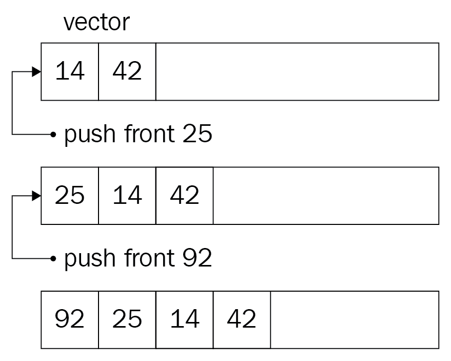

下面是我们如何在`Vector`类中实现它:

```cpp
// code omitted for brevity
void push_front(const T& item)
{
  if (size_ == capacity_) {
    // resizing code omitted for brevity
  }
  // shifting all the elements to the right
 for (int ix = size_ - 1; ix > 0; --ix) {
 buffer_[ix] = buffer[ix - 1];
 }
  // adding item at the front buffer_[0] = item;
  size_++ ;
}
```

在只需要在容器前面插入新元素的情况下，选择向量不是一个好的选择。这是应该考虑其他容器的例子之一。

# 基于节点的数据结构

基于节点的数据结构不占用连续的内存块。基于节点的数据结构为其元素分配节点，没有任何顺序——它们可能在内存中随机分布。我们将每个项目表示为链接到其他节点的节点。

最流行和介绍性的基于节点的数据结构是链表。下图显示了双向链表的视觉结构:

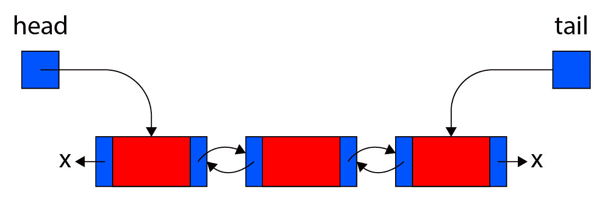

链表和向量非常不同。它的一些运算速度更快，尽管它缺乏向量的紧凑性。

简而言之，让我们在列表的前面实现元素插入。我们将把每个节点作为一个结构:

```cpp
template <typename T>
struct node 
{
  node(const T& it) : item{it}, next{nullptr}, prev{nullptr} {}
  T item;
  node<T>* next;
  node<T>* prev;
};
```

注意`next`成员——它指向同一个结构，这种方式允许将节点链接在一起，如上图所示。

要实现一个链表，我们只需要保持一个指针指向它的第一个节点，通常称为链表的头部。在列表的前面插入一个元素很简单:

```cpp
template <typename T>
class LinkedList 
{
  // code omitted for brevity
public:
  void push_front(const T& item) 
 {
 node<T>* new_node = new node<T>{item};
 if (head_ != nullptr) {
 new_node->next = head_->next;
 if (head_->next != nullptr) {
 head_->next->prev = new_node;
 }
 }
 new_node->next = head_;
 head_ = new_node;
 }
private:
  node<T>* head_; 
};
```

在列表中插入元素时，我们应该考虑三种情况:

*   如前所述，在列表前面插入一个元素需要以下步骤:


*   在列表末尾插入一个元素如下图所示:


*   最后，在列表中间插入一个元素的操作如下:


在前面的图中，将元素插入到向量中显然不同于将元素插入到列表中。你会如何在向量和列表之间做出选择？你应该专注于操作和它们的速度。例如，从向量中读取任何元素需要恒定的时间。我们可以在一个向量中存储一百万封电子邮件，并在 834，000 位置检索一封，而无需任何额外的努力。对于链表，操作是线性的。因此，如果您需要存储大部分是读取的而不是写入的数据集合，那么使用向量显然是一个合理的选择。

在列表中的任何位置插入一个元素需要一个恒定时间的操作，而向量将努力在随机位置插入一个元素。因此，当您需要一个可以集中添加/删除数据的对象集合时，更好的选择是链表。

我们还应该考虑高速缓存。向量具有良好的数据局部性。读取向量的第一个元素需要将第一个 *N 个*元素复制到缓存中。向量元素的进一步读取将会更快。我们不能对链表说同样的话。为了找出原因，让我们继续比较向量和链表的内存布局。

# 内存中的容器

正如您在前面几章中已经知道的，对象占用了提供给进程的一个内存段的内存空间。大多数时候，我们对堆栈或堆内存感兴趣。自动对象占用堆栈上的空间。以下两个声明都位于堆栈中:

```cpp
struct Email 
{
  // code omitted for brevity
};

int main() {
  Email obj;
  Email* ptr;
}
```

虽然`ptr`代表指向`Email`对象的指针，但它会占用堆栈上的空间。它可以指向堆上分配的内存位置，但指针本身(存储内存位置地址的变量)驻留在堆栈上。在进一步研究向量和列表之前，理解和记住这一点至关重要。

正如我们在本章前面所看到的，实现一个向量需要封装一个指向内部缓冲区的指针，该缓冲区代表指定类型的元素数组。当我们声明一个`Vector`对象时，它需要必要数量的堆栈内存来存储其成员数据。`Vector`班有以下三名成员:

```cpp
template <typename T>
class Vector
{
public:
  // code omitted for brevity

private:
  int capacity_;
  int size_;
  T* buffer_;
};
```

假设一个整数占用 4 字节，一个指针占用 8 字节，那么下面的`Vector`对象声明将占用至少 16 字节的堆栈内存:

```cpp
int main()
{
  Vector<int> v;
}
```

下面是我们如何描绘前面代码的内存布局:


插入元素后，堆栈上向量的大小将保持不变。堆来到现场。`buffer_`数组指向使用`new[]`运算符分配的存储位置。例如，请看下面的代码:

```cpp
// we continue the code from previous listing
v.push_back(17);
v.push_back(21);
v.push_back(74);
```

我们推送到向量的每个新元素都会占用堆上的空间，如下图所示:

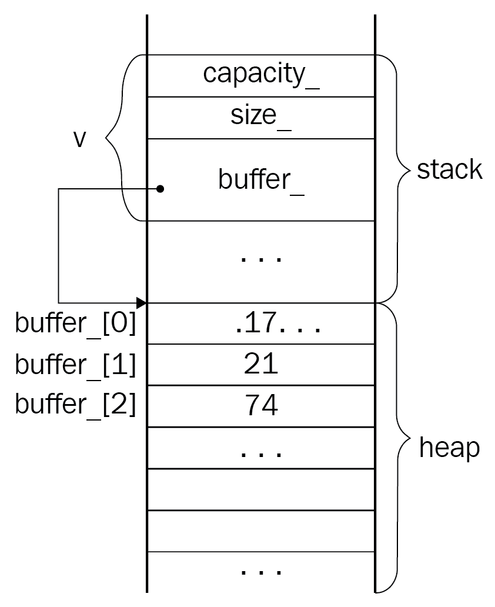

每个新插入的元素位于`buffer_`数组的最后一个元素之后。这就是为什么我们可以说向量是一个缓存友好的容器。

声明链表对象也会占用堆栈上的内存空间来存放其数据成员。如果我们讨论仅存储`head_`指针的简单实现，下面的列表对象声明将占用至少 8 字节的内存(仅用于`head_`指针):

```cpp
int main()
{
  LinkedList<int> list;
}
```

下图描述了前面代码的内存布局:


插入新元素会在堆上创建一个类型为`node`的对象。请看下面一行:

```cpp
list.push_back(19);
```

以下是插入新元素后内存插图的变化:


注意节点及其所有数据成员都驻留在堆上。该项目存储我们插入的值。当我们插入另一个元素时，将再次创建一个新节点。这一次，第一个节点的下一个指针将指向新插入的元素。新插入的节点的 prev 指针将指向列表的前一个节点。下图描述了插入第二个元素后链表的内存布局:

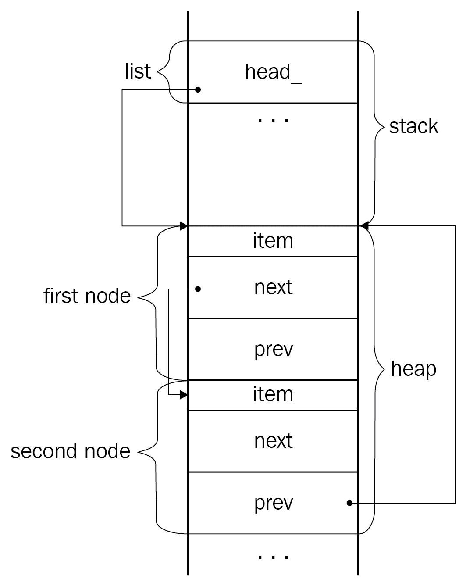

当我们在将元素插入列表之间的堆上分配一些随机对象时，会发生一件有趣的事情。例如，下面的代码将一个节点插入列表，然后为一个整数(与列表无关)分配空间。最后，它再次向列表中插入一个元素:

```cpp
int main()
{
  LinkedList<int> list;
  list.push_back(19);
  int* random = new int(129);
  list.push_back(22);
}
```

这个中间的随机对象声明破坏了列表元素的顺序，如下图所示:


上图给了我们一个提示，列表不是一个缓存友好的容器，因为它的结构和元素的分配。

Pay attention to the memory overhead created by incorporating each new node into the code. We pay an additional 16 bytes (considering the pointer takes 8 bytes of memory) for one element. Thus, lists lose the game of optimal memory use to vectors.

我们可以尝试通过在列表中引入预分配的缓冲区来解决这种情况。每个新节点的创建将通过**放置新的**操作符。然而，选择更适合感兴趣的问题的数据结构更明智。

在现实世界的应用开发中，程序员很少实现自己的向量或链表。他们通常使用经过测试和稳定的库版本。C++ 为向量和链表提供了标准容器。此外，它为单链表和双链表提供了两个独立的容器。

# STL 容器

STL 是一个强大的算法和容器的集合。虽然理解和实现数据结构对程序员来说是一项很好的技能，但是您不必在项目中每次需要时都实现它们。库提供商负责为我们实现稳定且经过测试的数据结构和算法。通过了解数据结构和算法的内部细节，我们在解决问题的同时，也在更好地选择 STL 容器和算法。

前面讨论的向量和链表在 STL 中实现为`std::vector<T>`和`std::list<T>`，其中`T`是集合中每个元素的类型。除了类型，容器还采用第二个默认`template`参数作为分配器。例如，`std::vector`声明如下:

```cpp
template <typename T, typename Allocator = std::allocator<T> >
class vector;
```

如前一章所介绍的，分配器处理容器元素的有效分配/解除分配。`std::allocator`是 STL 中所有标准容器的默认分配器。基于内存资源行为不同的更复杂的分配器是`std::pmr::polymorphic_allocator`。STL 提供`std::pmr::vector`作为别名模板，它使用多态分配器，定义如下:

```cpp
namespace pmr {
  template <typename T>
  using vector = std::vector<T, std::pmr::polymorphic_allocator<T>>;
}
```

现在让我们仔细看看`std::vector`和`std::list`。

# 使用标准::矢量和标准::列表

`std::vector`在`<vector>`表头定义。下面是最简单的用法示例:

```cpp
#include <vector>

int main()
{
  std::vector<int> vec;
  vec.push_back(4);
  vec.push_back(2);
  for (const auto& elem : vec) {
    std::cout << elem;
  }
}
```

`std::vector`动态增长。我们应该考虑增长因素。当声明一个向量时，它有一些默认容量，在元素插入时会增加。每当元素的数量超过向量的容量时，它就会以一个给定的因子增加其容量(通常是其容量的两倍)。如果我们知道向量中所需元素的大致数量，我们可以通过使用`reserve()`方法为向量初始分配容量来优化其使用。例如，以下代码保留了 10，000 个元素的容量:

```cpp
std::vector<int> vec;
vec.reserve(10000);
```

它强制向量为 10，000 个元素分配空间，从而避免在元素插入期间调整大小(除非我们达到 10，000 个元素的阈值)。

另一方面，如果我们遇到容量比向量中元素的实际数量大得多的情况，我们可以收缩向量来释放未使用的内存。我们需要调用`shrink_to_fit()`函数，如下例所示:

```cpp
vec.shrink_to_fit();
```

这降低了适应向量大小的能力。

访问向量元素的方式与我们访问常规数组的方式相同，使用`operator[]`。然而，`std::vector`提供了两个访问其元素的选项。其中一种方法被认为是安全的方法，通过`at()`功能完成，如下所示:

```cpp
std::cout << vec.at(2);
// is the same as
std::cout << vec[2];
// which is the same as
std::cout << vec.data()[2];
```

`at()`和`operator[]`的区别在于`at()`通过边界检查访问指定元素；也就是说，下面一行抛出`std::out_of_range`异常:

```cpp
try {
  vec.at(999999);
} catch (std::out_of_range& e) { }
```

我们使用`std::list`的方式几乎相同。这些列表大多有类似的公共接口。在本章的后面，我们将讨论迭代器，它允许从特定的容器中抽象出来，这样我们就可以用一个向量替换一个列表，而不会有太大的损失。在此之前，让我们看看列表和向量的公共接口之间的区别。

除了两个容器都支持的标准功能集，如`size()`、`resize()`、`empty()`、`clear()`、`erase()`等，列表还有`push_front()`功能，在列表前面插入一个元素。这是有效的，因为`std::list`代表一个双向链表。如下图所示，`std::list`也支持`push_back()`:

```cpp
std::list<double> lst;
lst.push_back(4.2);
lst.push_front(3.14);
// the list contains: "3.14 -> 4.2"
```

该列表支持在许多情况下派上用场的附加操作。例如，要合并两个排序列表，我们使用`merge()`方法。它采用另一个列表作为参数，并将其所有元素移动到当前列表。作为参数传递给`merge()`方法的列表在操作后变为空。

The STL also provides a singly linked list, represented by `std::forward_list`. To use it, you should include the `<forward_list>` header. As the singly linked list node has only one pointer, it's cheaper in terms of memory than the doubly linked list.

`splice()`方法有点类似于`merge()`，只是它移动了作为参数提供的列表的一部分。通过移动，我们意味着将内部指针指向适当的列表节点。这对`merge()`和`splice()`都是如此。

当我们使用容器来存储和操作复杂的对象时，复制元素的价格对程序的性能起着很大的作用。考虑以下表示三维点的结构:

```cpp
struct Point
{
  float x;
  float y;
  float z;

  Point(float px, float py, float pz)
    : x(px), y(py), z(pz)
  {}

  Point(Point&& p)
    : x(p.x), y(p.y), z(p.z)
  {}
};
```

现在，看看下面的代码，它将一个`Point`对象插入到一个向量中:

```cpp
std::vector<Point> points;
points.push_back(Point(1.1, 2.2, 3.3));
```

构建一个临时对象，然后将其移动到向量的相应槽中。我们可以直观地表示如下:

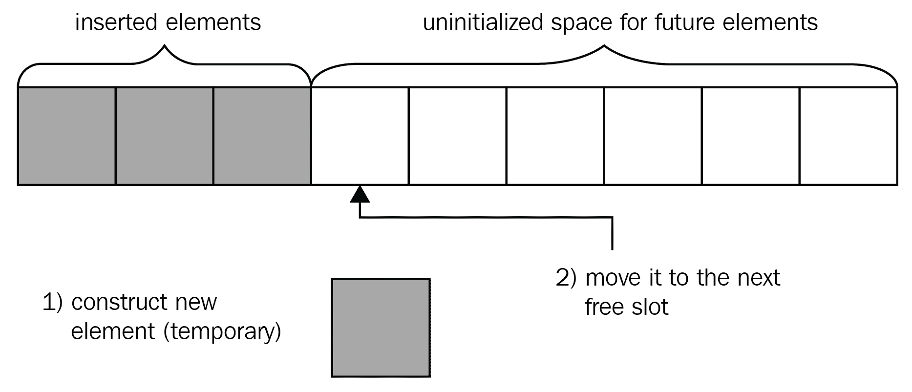

显然，向量预先占据了更多的空间来尽可能长时间地延迟调整大小的操作。当我们插入一个新元素时，向量会将其复制到下一个可用的槽中(如果空间已满，会重新分配更多空间)。我们可以使用这个未初始化的空间来创建一个新的元素。向量为此提供了`emplace_back()`函数。我们可以这样使用它:

```cpp
points.emplace_back(1.1, 2.2, 3.3);
```

注意我们直接传递给函数的参数。下图描述了`emplace_back()`的使用:

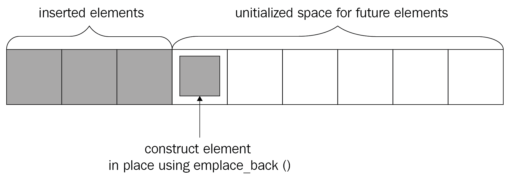

`emplace_back()`通过`std::allocator_traits::construct()`构建元素。后者通常使用新操作符的位置在已经分配的未初始化空间中构造元素。

`std::list`还提供了一种`emplace_front()`方法。这两个函数都返回对插入元素的引用。唯一的要求是元素的类型是`EmplaceConstructible`。对于向量，类型也应该是`MoveInsertable`。

# 使用容器适配器

您可能遇到过将堆栈和队列描述为数据结构(或者用 C++ 来说是*容器*)的情况。从技术上讲，它们不是数据结构，而是数据结构适配器。在 STL 中，`std::stack`和`std::queue`通过提供一个特殊的接口来访问容器来适配容器。术语*栈*几乎无处不在。到目前为止，我们已经使用它来描述具有自动存储持续时间的对象的内存段。由于其分配/解除分配策略，该段采用名称*堆栈*。

我们说，每次声明对象时，都会将它们推送到堆栈中，并在销毁时弹出。对象以被推送的相反顺序弹出。这就是将内存段称为堆栈的原因。相同的**后进先出** ( **后进先出**)方法适用于堆栈适配器。`std::stack`提供的关键功能如下:

```cpp
void push(const value_type& value);
void push(value_type&& value);
```

`push()`函数有效调用底层容器的`push_back()`。通常，堆栈是使用向量实现的。我们已经在[第 3 章](03.html)、*面向对象编程的细节*中讨论过这样的场景，当时我们引入了保护继承。`std::stack`有两个模板参数；其中之一就是集装箱。选择什么不重要，但一定要有`push_back()`会员功能。`std::stack`和`std::queue`的默认容器是`std::deque`。

`std::deque`允许在其开头和结尾快速插入。它是一个类似于`std::vector`的索引顺序容器。德格这个名字代表*双头队列*。

让我们看看 stack 的实际应用:

```cpp
#include <stack>

int main()
{
  std::stack<int> st;
  st.push(1); // stack contains: 1
  st.push(2); // stack contains: 2 1
  st.push(3); // stack contains: 3 2 1
}
```

`push()`功能的更好替代方案是`emplace()`。因此，它调用底层容器的`emplace_back()`，在适当的位置构造元素。

为了拉出元素，我们调用`pop()`函数。它不接受任何参数，也不返回任何内容，只是从堆栈中移除顶部元素。为了访问堆栈的顶部元素，我们调用`top()`函数。让我们修改前面的示例，在弹出所有堆栈元素之前打印它们:

```cpp
#include <stack>

int main()
{
  std::stack<int> st;
  st.push(1);
  st.push(2);
  st.push(3);
  std::cout << st.top(); // prints 3
  st.pop();
  std::cout << st.top(); // prints 2
  st.pop();
  std::cout << st.top(); // prints 1
  st.pop();
  std::cout << st.top(); // crashes application
}
```

`top()`函数返回对顶部元素的引用。它调用底层容器的`back()`函数。注意我们在空栈上调用的最后一个`top()`函数。我们建议您在调用空堆栈上的`top()`之前，使用`size()`检查堆栈的大小。

`queue`是另一个行为与堆栈略有不同的适配器。队列背后的逻辑是先返回第一个插入的元素:它保持了**先进先出** ( **先进先出**)的原则。请看下图:

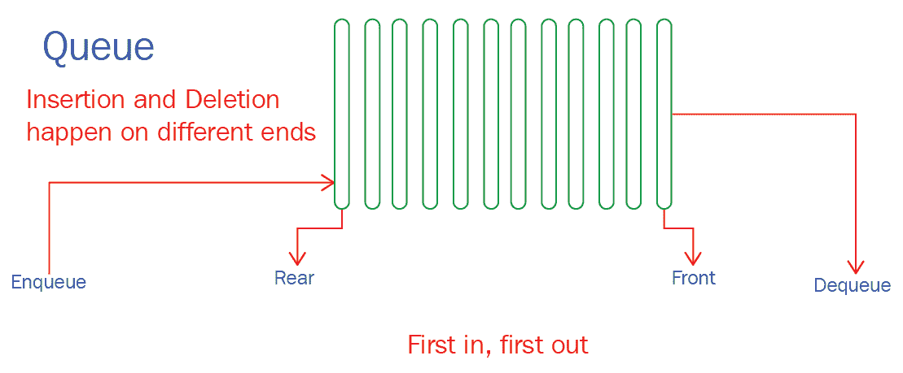

队列中插入和检索操作的正式名称是**查询**和**出列**。`std::queue`保持一致的方法，提供`push()`和`pop()`功能。要访问队列的第一个和最后一个元素，您应该使用`front()`和`back()`。两者都返回对元素的引用。下面是一个简单的用法示例:

```cpp
#include <queue>

int main()
{
 std::queue<char> q;
  q.push('a');
  q.push('b');
  q.push('c');
  std::cout << q.front(); // prints 'a'
  std::cout << q.back(); // prints 'c'
  q.pop();
  std::cout << q.front(); // prints 'b'
}
```

当您正确应用各种容器和适配器时，了解它们是非常有用的。为各种问题选择合适的容器并不是万能的。许多编译器使用堆栈来解析代码表达式。例如，使用堆栈很容易验证以下表达式中的括号:

```cpp
int r = (a + b) + (((x * y) - (a / b)) / 4);
```

试着练习一下。编写一个小程序，使用堆栈验证前面的表达式。

队列的应用更加广泛。我们将在[第 11 章](11.html)、*中看到其中一个，使用设计模式*设计一个策略游戏，在这里我们设计一个策略游戏。

另一个容器适配器是`std::priority_queue`。优先级队列通常采用平衡的、基于节点的数据结构，如最大堆或最小堆。在本章的最后，我们将研究树和图，看看优先级队列是如何工作的。

# 迭代容器

不可重复使用的集装箱的想法就像一辆不能驾驶的汽车。毕竟，容器是项目的集合。迭代容器元素的常见方法之一是使用普通的旧`for`循环:

```cpp
std::vector<int> vec{1, 2, 3, 4, 5};
for (int ix = 0; ix < vec.size(); ++ ix) {
  std::cout << vec[ix];
}
```

容器为元素访问提供了一组不同的操作。例如，向量提供`operator[]`，而列表不提供。`std::list`有`front()`和`back()`方法，分别返回第一个和最后一个元素。如前所述，`std::vector`还提供了`at()`和`operator[]`。

这意味着我们不能使用前面的循环来迭代列表元素。但是我们可以用基于范围的`for`循环遍历列表(和向量)，如下所示:

```cpp
std::list<double> lst{1.1, 2.2, 3.3, 4.2};
for (auto& elem : lst) {
  std::cout << elem;
} 
```

这可能看起来令人困惑，但诀窍隐藏在基于范围的`for`实现中。它使用`std::begin()`函数检索指向容器第一个元素的迭代器。

**迭代器**是一个指向容器元素的对象，可以根据容器的物理结构前进到下一个元素。下面的代码声明了一个`vector`迭代器，并用指向`vector`开头的迭代器初始化它:

```cpp
std::vector<int> vec{1, 2, 3, 4};
std::vector<int>::iterator it{vec.begin()};
```

容器提供了两个成员函数`begin()`和`end()`，分别将迭代器返回到容器的开头和结尾。下图显示了我们如何处理容器的开头和结尾:


使用基于范围的`for`迭代列表元素的前一个代码可以被认为如下:

```cpp
auto it_begin = std::begin(lst);
auto it_end = std::end(lst);
for ( ; it_begin != it_end; ++ it_begin) {
  std::cout << *it_begin;
}
```

注意我们在前面的代码中使用的`*`运算符，它通过迭代器访问底层元素。我们认为迭代器是指向容器元素的聪明的 T2 指针。

The `std::begin()` and `std::end()` functions typically call the containers' `begin()` and `end()` methods, respectively. However, they are also applicable to regular arrays. 

容器迭代器确切地知道如何使用容器元素。例如，推进向量迭代器会将其移动到数组的下一个槽，而推进列表迭代器会使用相应的指针将其移动到下一个节点，如以下代码所示:

```cpp
std::vector<int> vec;
vec.push_back(4);
vec.push_back(2);
std::vector<int>::iterator it = vec.begin();
std::cout << *it; // 4
it++ ;
std::cout << *it; // 2

std::list<int> lst;
lst.push_back(4);
lst.push_back(2);
std::list<int>::iterator lit = lst.begin();
std::cout << *lit; // 4
lit++ ;
std::cout << *lit; // 2
```

每个容器都有自己的迭代器实现；这就是为什么列表迭代器和向量迭代器有相同的接口，但行为不同。迭代器的行为由其*类别*定义。例如，向量的迭代器是随机访问迭代器，这意味着我们可以使用迭代器随机访问任何元素。下面的代码通过向向量的迭代器添加`3`来访问向量的第四个元素，如下所示:

```cpp
auto it = vec.begin();
std::cout << *(it + 3);
```

STL 中有六个迭代器类别:

*   投入
*   输出(与输入相同，但支持写访问)
*   向前
*   双向的
*   随机存取
*   接触的

**i** **nput 迭代器**提供读访问(通过调用`*`运算符)，并允许使用前缀和后缀增量运算符转发迭代器位置。一个输入迭代器不支持多次传递，也就是说，我们只能使用一个迭代器对容器进行一次迭代。另一方面，**正向迭代器**支持多遍。多遍支持意味着我们可以多次通过迭代器读取元素的值。

**输出迭代器**不提供对元素的访问，但是它允许给元素赋值。具有多遍特性的输入迭代器和输出迭代器的组合构成了前向迭代器。然而，正向迭代器只支持增量操作，而**双向迭代器**支持将迭代器移动到任何位置。它们支持递减操作。例如，`std::list`支持双向迭代器。

最后，**随机访问迭代器**允许*通过在迭代器中增加/减少一个数字来跳过*元素。迭代器将跳转到算术运算指定的位置。`std::vector`提供随机访问迭代器。

每个类别都定义了可以应用于迭代器的操作集。例如，输入迭代器可以用来读取元素的值，并通过递增迭代器前进到下一个元素。另一方面，随机访问迭代器允许用任意值递增和递减迭代器，读取和写入元素的值，等等。

本节到目前为止描述的所有特性的组合属于**连续迭代器**类别，它也期望容器是连续的。这意味着容器元素保证紧挨着另一个。连续容器的一个例子是`std::array`。

像`distance()`这样的函数使用迭代器的信息来实现最快的执行结果。例如，两个双向迭代器之间的`distance()`函数需要线性执行时间，而随机访问迭代器的相同函数在恒定时间内运行。

下面的伪代码演示了一个示例实现:

```cpp
template <typename Iter>
std::size_type distance(Iter first, Iter second) {
  if (Iter is a random_access_iterator) {
    return second - first; 
  }
  std::size_type count = 0;
  for ( ; first != last; ++ count, first++) {}
  return count;
}
```

虽然前面例子中显示的伪代码运行良好，但是我们应该考虑在运行时检查迭代器的类别不是一个选项。它是在编译时定义的，所以我们需要使用模板专门化来为随机访问迭代器生成`distance()`函数。一个更好的解决方案是使用`<type_traits>`中定义的`std::is_same`类型特征:

```cpp
#include <iterator>
#include <type_traits>

template <typename Iter>
typename std::iterator_traits<Iter>::difference_type distance(Iter first, Iter last)
{
  using category = std::iterator_traits<Iter>::iterator_category;
  if constexpr (std::is_same_v<category, std::random_access_iterator_tag>) {
    return last - first;
  }
  typename std::iterator_traits<Iter>::difference_type count;
  for (; first != last; ++ count, first++) {}
  return count;
}
```

`std::is_same_v`是`std::is_same`的辅助模板，定义如下:

```cpp
template <class T, class U>
inline constexpr bool is_same_v = is_same<T, U>::value;
```

迭代器最重要的特性是在容器和算法之间提供松散的耦合:

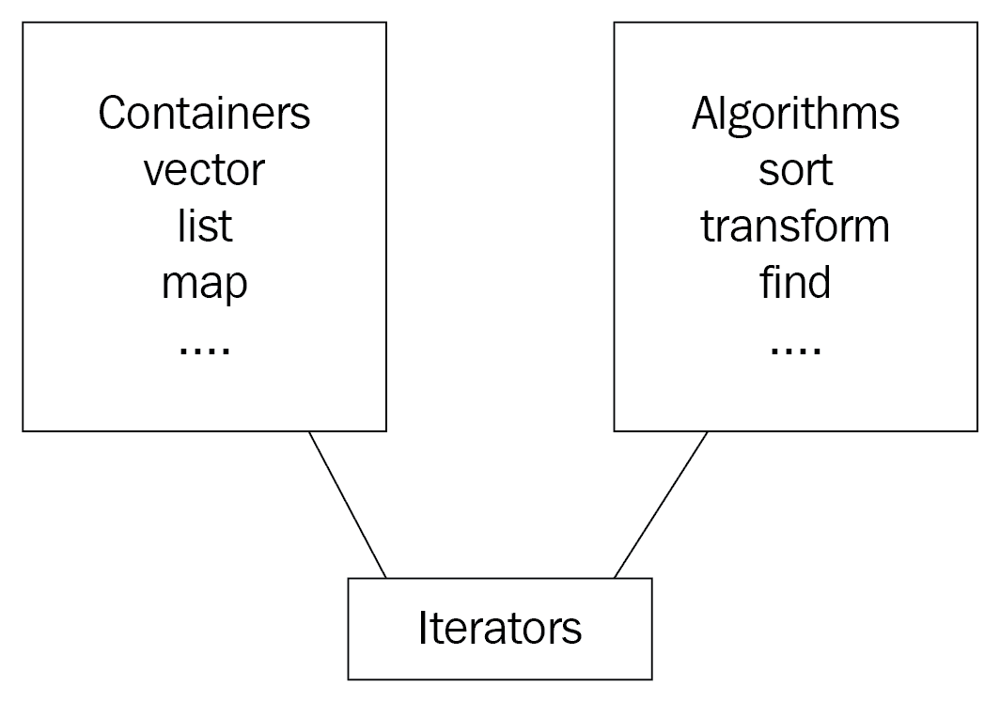

STL 基于这三个概念:容器、算法和迭代器。虽然向量、列表或任何其他容器是不同的，但它们有相同的目的:存储数据。

另一方面，算法是处理数据的函数；大部分时间他们都在收集数据。算法定义通常表示指定处理容器元素应该采取的步骤的一般方式。例如，排序算法按升序或降序对容器元素进行排序。

向量是连续的容器，而列表是基于节点的容器。对它们进行分类需要更深入地了解特定容器的物理结构。为了正确地对一个向量进行排序，应该为它实现一个单独的排序函数。同样的逻辑也适用于列表。

迭代器将实现的多样性提升到了一个通用的水平。它们为库设计者提供了实现一个排序函数的能力，该函数将只处理迭代器，从容器类型中抽象出来。在 STL 中，`sort()`算法(在`<algorithm>`中定义)处理迭代器，我们可以用相同的函数对向量和列表进行排序:

```cpp
#include <algorithm>
#include <vector>
#include <list>
...
std::vector<int> vec;
// insert elements into the vector
std::list<int> lst;
// insert elements into the list

std::sort(vec.begin(), vec.end());
std::sort(lst.begin(), lst.end());
```

本节中描述的迭代器现在被认为是遗留特性。C++ 20 引入了一个基于**概念**的新迭代器系统。

# 概念和迭代器

C++ 20 引入了**概念**作为其主要特性之一。除了概念，C++ 20 还有基于概念的新迭代器。尽管本章中讨论的迭代器现在被认为是遗留特性，但是已经使用它们编写了许多代码行。这就是为什么我们在继续新的迭代器概念之前首先介绍了它们。现在，让我们找出什么是概念以及如何使用它们。

# 理解概念

抽象在计算机编程中是必不可少的。我们在[第 3 章](03.html)、*面向对象编程的细节、*中引入了类，作为将数据和操作表示为抽象实体的一种方式。之后，在[第 4 章](04.html)、*理解和设计模板*中，我们深入到模板中，看到了如何通过为各种聚合类型重用它们来使类更加灵活。模板不仅提供了特定类型的抽象，还包含了实体和聚合类型之间的松散耦合。以`std::vector`为例。它提供了一个通用接口来存储和操作对象集合。我们可以很容易地声明三个不同的向量，它们将包含三种不同类型的对象，如下所示:

```cpp
std::vector<int> ivec;
std::vector<Person> persons;
std::vector<std::vector<double>> float_matrix;
```

如果不是模板，我们将不得不对前面的代码进行如下操作:

```cpp
std::int_vector ivec;
std::custom_vector persons; // supposing the custom_vector stores void* 
std::double_vector_vector float_matrix;
```

虽然前面的代码是不可接受的，但是我们应该同意模板是泛型编程的基础这一事实。概念给泛型编程带来了更大的灵活性。现在可以对模板参数设置限制，检查约束，并在编译时发现不一致的行为。模板类声明具有以下形式:

```cpp
template <typename T>
class Wallet
{
  // the body of the class using the T type
};
```

注意前面代码块中的`typename`关键字。概念更进一步:它们允许用描述模板参数的类型描述来替换它。假设我们想让`Wallet`处理可以添加在一起的类型，也就是说，它们应该是*可添加的*。下面是如何使用一个概念来帮助我们在代码中实现这一点:

```cpp
template <addable T>
class Wallet
{
  // the body of the class using addable T's
};
```

因此，现在我们可以通过提供可添加的类型来创建`Wallet`实例。只要类型不满足约束，编译器就会抛出一个错误。看起来有点超自然。下面的代码片段声明了两个`Wallet`对象:

```cpp
class Book 
{
  // doesn't have an operator+
  // the body is omitted for brevity
};

constexpr bool operator+(const Money& a, const Money& b) { 
  return Money{a.value_ + b.value_}; 
}

class Money
{
  friend constexpr bool operator+(const Money&, const Money&);
  // code omitted for brevity
private:
  double value_;
};

Wallet<Money> w; // works fine
Wallet<Book> g; // compile error
```

`Book`类没有`+`操作符，因此`g`的构建会因为`template`参数类型限制而失败。

概念的声明使用`concept`关键字完成，其形式如下:

```cpp
template <*parameter-list*>
concept *name-of-the-concept* = *constraint-expression*;
```

如您所见，概念也是使用模板声明的。我们可以称它们为描述其他类型的类型。概念严重依赖**约束**。约束是指定模板参数要求的一种方式，如下所示，概念是一组约束。下面是我们如何实现前面的可添加概念:

```cpp
template <typename T>
concept addable = requires (T obj) { obj + obj; }
```

标准概念在`<concepts>`标题中定义。

我们也可以通过要求新概念支持其他概念来将几个概念组合成一个概念。为此，我们使用`&&`运算符。让我们看看迭代器如何利用概念，并带来一个结合其他概念的`incrementable`迭代器概念的例子。

# 在 C++ 20 中使用迭代器

在介绍完概念之后，很明显迭代器是最先充分利用它们的。迭代器及其类别现在被认为是遗留的，因为从 C++ 20 开始，我们使用迭代器概念，如 **`readable`** (它指定通过应用`*`运算符可以读取类型)和`writable`(它指定一个值可以被写入迭代器引用的对象)。如承诺的那样，让我们看看`<iterator>`标题中如何定义`incrementable`:

```cpp
template <typename T>
concept incrementable = std::regular<T> && std::weakly_incrementable<T>
            && requires (T t) { {t++} -> std::same_as<T>; };
```

所以`incrementable`概念要求类型为`std::regular`。这意味着它应该是默认可构造的，并且有一个复制构造器和`operator==()`。除此之外，`incrementable`概念要求类型为`weakly_incrementable`，这意味着该类型支持前后增量运算符，除了该类型不要求相等可比。这就是为什么`incrementable`加入`std::regular`要求类型是平等可比的。最后，加法`requires`约束指出了类型在增量后不应该改变的事实，也就是说，它应该与之前的类型相同。虽然`std::same_as`被表示为一个概念(在`<concepts>`中定义)，但在之前的版本中，我们习惯使用`<type_traits>`中定义的`std::is_same`。他们基本上做了同样的事情，但是 C++ 17 版本–`std::is_same_v`–冗长，带有额外的后缀。

所以，我们现在不是指迭代器类别，而是指迭代器概念。除了我们前面介绍的概念，还应该考虑以下概念:

*   `input_iterator`指定该类型允许读取其引用值，并且在**之前和之后都是可递增的**。
*   `output_iterator`指定该类型的值可以被写入，并且该类型在**之前和之后都是可递增的**。
*   `input_or_output_iterator`，不必要的长名字放在一边，指定类型是**可增量**，可以取消引用。
*   `forward_iterator`指定类型为`input_iterator`，额外支持相等比较和多遍。

*   `bidirectional_iterator`指定类型支持`forward_iterator`并额外支持向后移动。
*   `random_access_iterator`指定类型为`bidirectional_iterator`，支持恒定时间推进和订阅。
*   `contiguous_iterator`指定类型为`random_access_iterator`，指内存中连续的元素。

它们几乎重复了我们之前讨论过的遗留迭代器，但是现在它们可以在声明模板参数时使用，这样编译器就可以处理剩下的部分。

# 掌握算法

如前所述，算法是接受一些输入、处理输入并返回输出的函数。通常，STL 环境中的算法意味着一个处理数据集合的函数。数据集合以容器的形式呈现，如`std::vector`、`std::list`等。

选择一个有效的算法是程序员的日常工作。例如，使用二分搜索法算法搜索排序向量将比使用顺序搜索更有效。为了比较算法的效率，执行所谓的**渐近分析**，其考虑了算法相对于输入数据大小的速度。这意味着我们实际上不应该通过将两个算法应用于包含十个或一百个元素的容器来比较它们。

当应用到足够大的*容器时，算法的实际差异就显现出来了，有一百万甚至十亿条记录。衡量算法的效率也称为验证其复杂性。你可能遇到过 *O(n)* 算法或者 *O(log N)* 算法。 *O()* 函数(发音为 *big-oh* )定义了算法的复杂度。*

让我们看看搜索算法，并比较它们的复杂性。

# 搜索

在容器中搜索元素是一项常见的任务。让我们实现向量中元素的顺序搜索:

```cpp
template <typename T>
int search(const std::vector<T>& vec, const T& item)
{
  for (int ix = 0; ix < vec.size(); ++ ix) {
    if (vec[ix] == item) {
      return ix;
    }
  }
  return -1; // not found
}
```

这是一个简单的算法，它遍历一个向量并返回索引，在该索引处元素等于作为搜索关键字传递的值。我们称之为顺序搜索，因为它顺序扫描矢量元素。它的复杂度是线性的: *O(n)* 。为了衡量它，我们应该以某种方式定义算法找到结果所需的操作次数。假设向量包含 *n* 元素，下面的代码在搜索函数的每一行都包含一个关于其操作的注释:

```cpp
template <typename T>
int search(const std::vector<T>& vec, const T& item)
{
  for (int ix = 0;           // 1 copy
       ix < vec.size;        // n + 1 comparisons 
       ++ ix)                 // n + 1 increments
  {  
    if (vec[ix] == item) {   // n comparisons
      return ix;             // 1 copy
    }
  }
  return -1;                 // 1 copy
}
```

我们有三个复制操作， *n + 1* 和 *n* (即 *2n + 1* )比较， *n + 1* 增量操作。如果想要的元素在向量的第一个位置呢？在这种情况下，我们只扫描向量的第一个元素，然后从函数返回。

然而，这并不意味着我们的算法如此高效，只需一步就能完成任务。为了衡量算法的复杂性，我们应该考虑最坏的情况:期望的元素要么不存在于向量中，要么位于向量的最后一个位置。下图显示了我们将要找到的元素的三个场景:


我们应该只考虑最坏的情况，因为它也涵盖了所有其他情况。如果我们把算法的复杂性定义为最坏的情况，我们可以肯定它不会比最坏的情况慢。

为了找出算法的复杂性，我们应该找到运算数量和输入大小之间的联系。在这种情况下，输入的大小就是容器的长度。让我们将副本表示为 A，将比较表示为 C，将增量运算表示为 I，这样我们就有了 3A + (2n + 1)C + (n + 1)I 运算。算法的复杂性定义如下:

*O(3A + (2n + 1)C + (n + 1)I)*

这可以通过以下方式简化:

*   *O(3A + (2n + 1)C + (n + 1)I) =*
*   *o(3a+2a NC+2c+ni+I)=*
*   *O(n(2C + I) + (3A + C + I)) =*
*   *O(n(2C + I))*

最后， *O()的*属性允许我们去掉常数系数和较小的成员，因为实际的算法复杂度只和输入的大小有关，也就是 *n* ，我们得到的最终复杂度等于 *O(n)* 。换句话说，顺序搜索算法具有线性时间复杂度。

如前所述，STL 的本质是通过迭代器连接容器和算法。这就是为什么顺序搜索实现不被认为是 STL 兼容的:因为它对输入参数有严格的限制。为了使它通用，我们应该考虑只使用迭代器来实现它。为了覆盖广泛的容器类型，使用前向迭代器。下面的代码在类型`Iter`上使用运算符，假设它是一个前向迭代器:

```cpp
template <typename Iter, typename T>
int search(Iter first, Iter last, const T& elem)
{
  for (std::size_t count = 0; first != last; first++, ++ count) {
    if (*first == elem) return count;
  }
  return -1;
}
...
std::vector<int> vec{4, 5, 6, 7, 8};
std::list<double> lst{1.1, 2.2, 3.3, 4.4};

std::cout << search(vec.begin(), vec.end(), 5);
std::cout << search(lst.begin(), lst.end(), 5.5);
```

实际上，任何类型的迭代器都可以传递给`search()`函数。我们通过对迭代器本身应用操作来确保使用正向迭代器。我们只使用增量(向前移动)、读取(T1)操作符和严格比较(`==`和`!=`，这些都是向前迭代器所支持的。

# 二进位检索

另一方面是二分搜索法算法，它很容易解释。首先，它寻找向量的中间元素，并将搜索关键字与它进行比较，如果它相等，那么算法就完成了:它返回索引。否则，如果搜索关键字小于中间元素，它将前进到向量的左侧。如果搜索关键字大于中间元素，算法将前进到右侧子向量。

为了让二分搜索法正确地处理一个向量，它应该被排序。二分搜索法的本质意味着将搜索关键字与向量元素进行比较，并前进到左侧或右侧子向量，与向量的中间元素相比，每个子向量包含更小或更大的元素。请看下图，它描述了二分搜索法算法的实际应用:


二分搜索法算法有一个优雅的递归实现(尽管最好使用迭代实现)——看看下面的代码:

```cpp
template <typename T>
std::size_t binsearch(const std::vector<T>& vec, const T& item, int start, int end)
{
  if (start > end) return -1;
  int mid = start + (end - start) / 2;
  if (vec[mid] == item) {
    return mid; // found
  }
  if (vec[mid] > item) {
    return binsearch(vec, item, start, mid - 1);
  }
  return binsearch(vec, item, mid + 1, end);
}
```

注意中间元素计算。代替`(start + end) / 2;`，我们使用`start + (end - start) / 2;`技术只是为了避免二分搜索法实现中著名的 bug(假设我们没有留下其他 bug)。重点是，对于开始和结束的大值，它们的和(*开始+结束*)会产生整数溢出，这会使程序在某个时刻崩溃。

现在让我们来看看二分搜索法的复杂性。很明显，在执行的每一步，源数组都会减半，这样我们就可以在下一步处理更小或更大的一半。这意味着最坏的情况是我们分割向量，直到只剩下一个元素或者没有元素。为了找到算法中的步数，我们应该找到关于向量大小的除法数。如果向量有 10 个元素，那么我们把它除，得到一个五个元素的子向量；通过再次划分它，我们得到了双元素子向量，最后，再次划分它将把我们带到单个元素。所以，对于 10 元向量，除法的个数是 3。对于 *n* 元素向量，除法的个数是 *log(n)* ，因为在每一步上， *n* 变成 *n/2* ，然后变成 *n/4* 等等。二分搜索法的复杂度是 *O(logn)* (也就是对数)。

STL 算法在`<algorithm>`头文件中定义；二分搜索法协定的执行所在。如果元素存在于容器中，STL 实现返回真。看看它的原型:

```cpp
template <typename Iter, typename T>
bool binary_search(Iter start, Iter end, const T& elem);
```

STL 算法不直接使用容器，而是使用迭代器。这允许我们从特定的容器中进行抽象，并使用`binary_search()`让所有的容器支持一个前向迭代器。以下示例为向量和列表调用`binary_search()`函数:

```cpp
#include <vector>
#include <list>
#include <algorithm>
...
std::vector<int> vec{1, 2, 3, 4, 5};
std::list<int> lst{1, 2, 3, 4};
binary_search(vec.begin(), vec.end(), 8);
binary_search(lst.begin(), lst.end(), 3);
```

`binary_search()`检查迭代器的类别，在随机访问迭代器的情况下，它使用二分搜索法算法的全部能力(否则，它退回到顺序搜索)。

# 整理

二分搜索法算法仅适用于已分拣的集装箱。对于计算机程序员来说，排序是一项众所周知的老任务，他们现在很少自己编写排序算法的实现。你可能已经使用`std::sort()`很多次了，甚至不关心它的实现。基本上，排序算法将一个集合作为输入，并返回一个新的排序集合(按照算法用户定义的顺序)。

在众多排序算法中，最流行(甚至是最快)的是**快速排序**。任何排序算法的基本思想都是找到更小(或更大)的元素，并用更大(或更小)的元素交换它们，直到整个集合被排序。例如，选择排序在逻辑上将集合分为两部分，排序的和未排序的，其中排序的子数组最初是空的，如下所示:

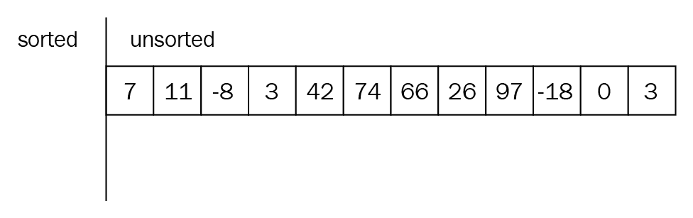

该算法开始在未排序的子阵列中寻找最小的元素，并通过与未排序的子阵列的第一个元素进行交换将其放入排序的子阵列中。在每一步之后，排序的子阵列的长度增加一，而未排序的子阵列的长度减少，如下所示:

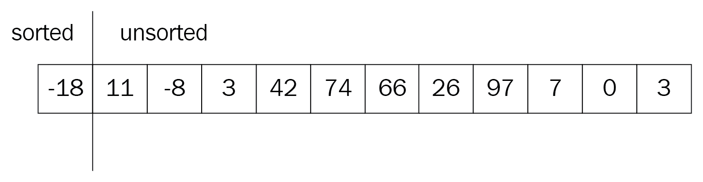

该过程一直持续到未排序的子阵列变空。

STL 提供`std::sort()`函数，使用两个随机访问迭代器:

```cpp
#include <vector>
#include <algorithm>
...
std::vector<int> vec{4, 7, -1, 2, 0, 5};
std::sort(vec.begin(), vec.end());
// -1, 0, 2, 4, 5, 7
```

排序函数不能应用于`std::list`，因为它不支持随机访问迭代器。相反，您应该调用列表的`sort()`成员函数。尽管这与 STL 具有通用函数的想法相矛盾，但这样做是为了提高效率。

`sort()`函数有第三个参数:比较函数，可以用来比较容器元素。假设我们在矢量中存储`Product`对象:

```cpp
struct Product
{
  int price;
  bool available;
  std::string title;
};

std::vector<Product> products;
products.push_back({5, false, "Product 1"});
products.push_back({12, true, "Product 2"});
```

要对容器进行正确排序，其元素必须支持小于运算符或`<`。我们应该为自定义类型定义相应的运算符。但是，如果我们为自定义类型创建一个单独的比较器函数，我们可以省略运算符定义，如下块所示:

```cpp
class ProductComparator
{
public:
 bool operator()(const Product& a, const Product& b) {
 return a.price > b.price;
 }
};
```

将`ProductComparator`传递给`std::sort()`函数允许它比较矢量元素，而无需深入其元素类型的细节，如下所示:

```cpp
std::sort(products.begin(), products.end(), ProductComparator{});
```

虽然这是一种很好的技术，但是使用 lambda 函数会更好，lambda 函数是匿名函数，非常适合前面的场景。我们可以这样覆盖它:

```cpp
std::sort(products.begin(), products.end(), 
  [](const Product& a, const Product& b) { return a.price > b.price; })
```

前面的代码允许省略`ProductComparator`的声明。

# 探索树和图形

二分搜索法算法和排序算法结合在一起，产生了一个容器的想法，默认情况下，该容器保持项目排序。一个这样的容器是`std::set`，基于平衡树。在讨论平衡树本身之前，让我们先来看看二叉查找树，它是快速查找的完美选择。

二叉查找树的思想是节点左边子树的值小于节点的值。相比之下，节点右侧子树的值大于节点的值。这里有一个二叉查找树的例子:


从上图中可以看到，值为 15 的元素位于左侧子树中，因为它小于 30(根元素)。另一方面，值为 60 的元素位于右边的子树中，因为它大于根元素。同样的逻辑也适用于其余的树元素。

二叉树节点表示为包含该项和指向每个子节点的两个指针的结构。下面是树节点的示例代码表示:

```cpp
template <typename T>
struct tree_node
{
  T item;
  tree_node<T>* left;
  tree_node<T>* right;
};
```

在完全平衡的二叉查找树中，搜索、插入或移除一个元素需要 *O(logn)* 。STL 没有为树提供单独的容器，但是它有基于树实现的类似容器。例如，`std::set`容器基于一个平衡树，它以排序顺序唯一地存储元素:

```cpp
#include <set>
...
std::set<int> s{1, 5, 2, 4, 4, 4, 3};
// s has {1, 2, 3, 4, 5}
```

`std::map`也是基于平衡树的，但是这个提供了一个容器，将一个键映射到某个值，例如:

```cpp
#include <map>
...
std::map<int, std::string> numbers;
numbers[3] = "three";
numbers[4] = "four";
...
```

如前面的代码所示，函数`map` `numbers`将整数映射为字符串。因此，当我们告诉地图将`3`的值存储为键，将字符串`three`存储为值时，它会在其内部树中添加一个新节点，键等于`3`，值等于`three`。

`set`和`map`运算是对数运算，这使得它在大多数情况下都是非常高效的数据结构。然而，接下来是更高效的数据结构。

# 散列表

哈希表是目前最快的数据结构。它基于向量索引的简单思想。想象一个包含列表指针的大向量:

```cpp
std::vector<std::list<T> > hash_table;
```

访问向量元素需要恒定的时间。这是病媒的主要超级力量。哈希表允许我们使用任何类型作为容器的键。哈希表的基本思想是使用精心设计的哈希函数，为输入键生成唯一的索引。例如，当我们使用字符串作为哈希表键时，哈希表使用哈希函数生成哈希作为基础向量的索引值:

```cpp
template <typename T>
int hash(const T& key)
{
  // generate and return and efficient
  // hash value from key based on the key's type
}

template <typename T, typename U>
void insert_into_hashtable(const T& key, const U& value)
{
  int index = hash(key);
  hash_table[index].push_back(value); // insert into the list
}
```

下面是我们如何说明哈希表:

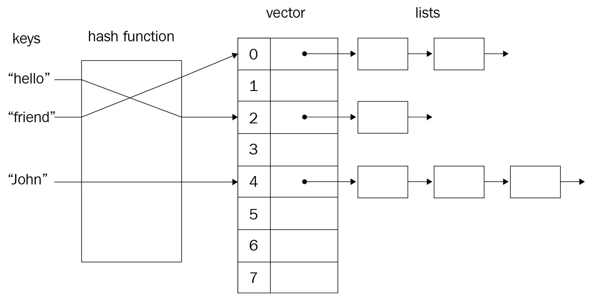

访问哈希表需要恒定的时间，因为它是基于向量进行操作的。虽然可能有不同的关键字会导致相同的哈希值，但是通过使用一个值列表作为向量元素(如上图所示)，这些冲突得到了解决。

STL 支持名为`std::unordered_map`的哈希表:

```cpp
#include <unordered_map>
...
std::unordered_map<std::string, std::string> hashtable;
hashtable["key1"] = "value 1";
hashtable["key2"] = "value 2";
...
```

要为提供的密钥生成哈希值，函数`std::unordered_map`使用在`<functional>`头中定义的`std::hash()`函数。您可以为哈希函数指定自定义实现。`std::unordered_map`的第三个`template`参数是哈希函数，默认为`std::hash`。

# 图形

二叉查找树的平衡本质是基于许多搜索索引的实现。例如，数据库系统使用称为 B 树的平衡树进行表索引。B 树不是*二进制*树，但它遵循相同的平衡逻辑，如下图所示:


另一方面，图表示没有适当顺序的连接节点:

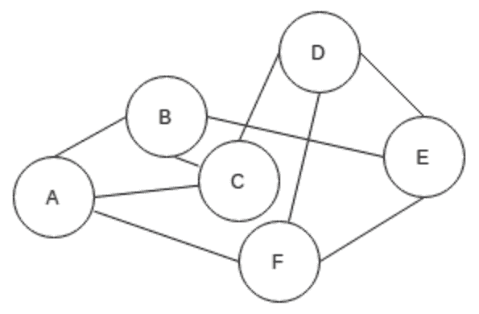

假设我们正在建立一个社交网络，最终将脸书挤出市场。社交网络中的用户可以相互跟随，这可以表示为图形。例如，如果 A 跟在 B 后面，B 跟在 C 后面，而 C 既跟在 B 后面又同时跟在 A 后面，那么我们可以将这些关系表示为下图:

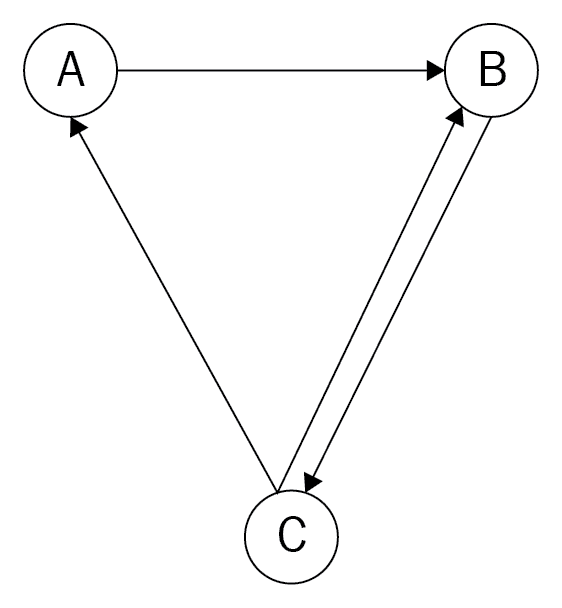

一个节点在图中称为**顶点**。两个节点之间的连接称为一条**边**。实际上没有固定的图形表示，所以我们应该从几个中选择。让我们想想我们的社交网络——我们将如何表示用户 A 跟随用户 B 的信息？

这里最好的选择之一是使用哈希表。我们可以将每个用户映射到他们关注的所有用户:


图形实现变成了一个混合容器:

```cpp
#include <list>
#include <unordered_map>

template <typename T>
class Graph
{
public: 
  Graph();
  ~Graph();
  // copy, move constructors and assignment operators omitted for brevity

public:
  void insert_edge(const T& source, const T& target);
  void remove_edge(const T& source, const T& target);

  bool connected(const T& source, const T& target);

private:
  std::unordered_map<T, std::list<T> > hashtable_;
};
```

为了制作一个 STL 兼容的容器，让我们为这个图添加一个迭代器。虽然迭代一个图不是一个好主意，但是添加一个迭代器也不是一个坏主意。

# 用线串

字符串类似于向量:它们存储字符，它们公开迭代器，并且它们是容器。然而，它们有些不同，因为它们专门表达一种数据:字符串。下图将字符串 **hello，C++** 描述为以特殊的 **\0** 字符结尾的字符数组:

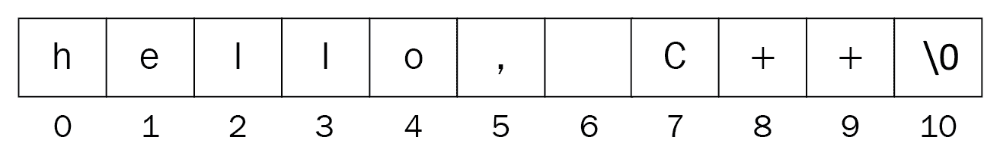

特殊的 **\0** 字符(也称为空字符)用作字符串终止符。编译器一个接一个地读取字符，直到遇到空字符。

字符串的实现方式与我们在本章开头实现向量的方式相同:

```cpp
class my_string
{
public:
 my_string();
 // code omitted for brevity

public:
 void insert(char ch);
 // code omitted for brevity

private:
 char* buffer_;
 int size_;
 int capacity_;
};
```

C++ 有它强大的`std::string`类，它提供了一堆可以使用的函数。除了`std::string`成员函数外，`<algorithm>`中定义的算法也适用于字符串。

# 摘要

数据结构和算法是开发高效软件的关键。通过理解和利用本章中讨论的数据结构，您将拥有 C++ 20 的全部能力来使您的程序运行得更快。市场上更需要一个解决问题能力强的程序员，这不是什么秘密。解决问题的技巧首先是通过深入理解基本算法和数据结构获得的。正如您在本章中已经看到的，在搜索任务中利用二分搜索法算法使代码的运行速度比顺序算法快得多。高效的软件节省时间并提供更好的用户体验，这最终使您的软件成为现有软件的杰出替代品。

在本章中，我们讨论了基本数据结构及其差异。我们学会了根据问题分析来使用它们。例如，由于链表元素访问操作的复杂性，在需要随机查找的问题中应用链表被认为是耗时的。在这种情况下，使用一个动态增长的向量更合适，因为它的常量时间元素访问。相反，在需要在容器前面快速插入的问题中使用一个向量比，例如，列表更昂贵。

本章还介绍了算法和衡量效率的方法。我们比较了几个问题，以应用更好的算法来更有效地解决它们。

在下一章中，我们将讨论 C++ 中的函数式编程。学习了 STL 的基本知识后，我们现在将在容器上应用函数式编程技术。

# 问题

1.  描述将元素插入到动态增长的向量中。
2.  在链表前面插入元素和在向量前面插入元素有什么区别？
3.  实现一个混合数据结构，将它的元素存储在一个向量和一个列表中。对于每个操作，选择操作实现最快的底层数据结构。
4.  如果我们以递增的顺序插入 100 个元素，二叉查找树会是什么样子？
5.  选择排序和插入排序算法有什么区别？
6.  实现本章中描述的排序算法，称为计数排序。

# 进一步阅读

有关更多信息，请参考以下资源:

*   *编程珍珠*作者乔恩·本特利，可从[https://www . Amazon . com/Programming-Pearls-2nd-乔恩-本特利/dp/0201657880/](https://www.amazon.com/Programming-Pearls-2nd-Jon-Bentley/dp/0201657880/) 获得
*   *使用 C++ 的数据抽象和问题解决:墙壁和镜子*作者:Frank Carrano 和 Timothy Henry，可从[获得](https://www.amazon.com/Data-Abstraction-Problem-Solving-Mirrors/dp/0134463978/)
*   *算法介绍*作者:科曼、莱瑟森、瑞文斯特和斯坦，可查阅[https://www . Amazon . com/Introduction-Algorithms-3rd-MIT-Press/DP/0262033844/](https://www.amazon.com/Introduction-Algorithms-3rd-MIT-Press/dp/0262033844/)
*   *Wisnu Anggoro 编写的 C++ 数据结构和算法*，可从[https://www . packtpub . com/application-development/C-数据结构和算法](https://www.packtpub.com/application-development/c-data-structures-and-algorithms)获得