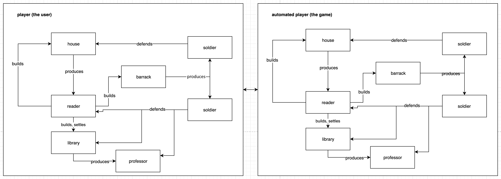
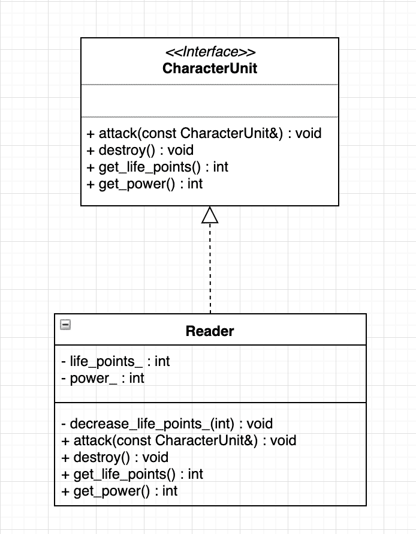
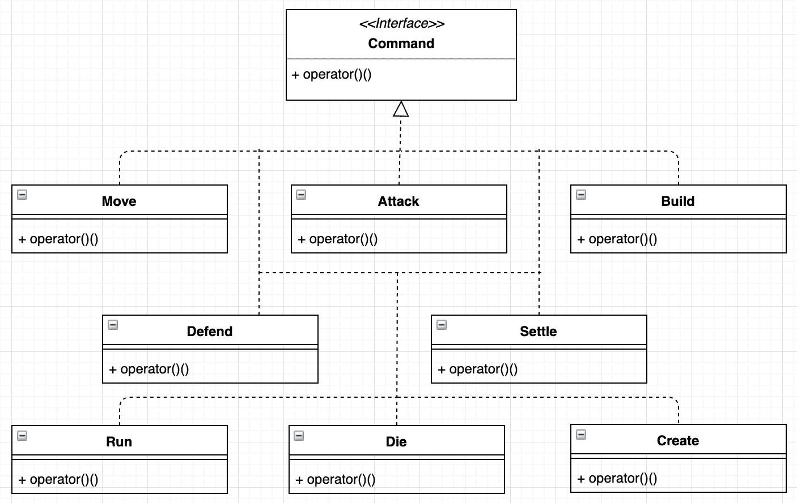
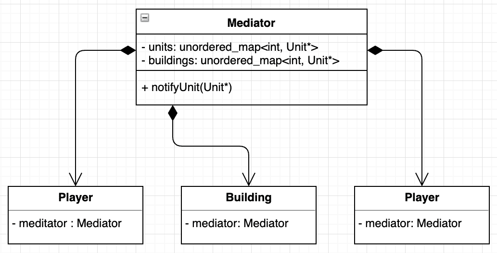

# 十一、使用设计模式设计策略游戏

游戏开发是软件工程中最有趣的话题之一。C++ 因其高效性而被广泛应用于游戏开发中。然而，由于这种语言没有图形用户界面组件，它被用在后端。在本章中，我们将学习如何在后端设计一个策略游戏。我们将合并几乎所有我们在前面章节中学习的内容，包括设计模式和多线程。

我们将要设计的游戏是一款名为**读者与干扰者**的策略游戏。在这里，玩家创建单位，称为读者，他们能够建造图书馆和其他建筑，以及士兵，他们保护这些建筑免受敌人的攻击。

在本章中，我们将涵盖以下主题:

*   游戏设计导论
*   深入游戏设计过程
*   使用设计模式
*   设计游戏循环

# 技术要求

带有`-std=c++ 2a`选项的 g++ 编译器将用于编译本章中的示例。您可以在[https://github.com/PacktPublishing/Expert-CPP](https://github.com/PacktPublishing/Expert-CPP)找到本章将用到的源文件。

# 游戏设计导论

在这一章中，我们将设计一个策略游戏的后端，玩家可以在其中创建单位(工人、士兵)、建造建筑和对抗敌人。每当你设计一款游戏，无论是策略游戏还是第一人称射击游戏，都有几个基本的组成部分是相同的，比如游戏物理，用来让游戏给玩家带来更真实、更身临其境的感觉。

游戏设计中有一些组件几乎在所有游戏中都重复出现，比如碰撞检测机制、音频系统、图形渲染等等。在设计游戏时，我们可以区分引擎和游戏，或者开发一个强绑定的应用，将引擎和游戏都表示为一个结果。单独设计游戏引擎可以让它扩展到其他版本，甚至可以用于其他游戏。毕竟，游戏有相同的机制和流程。他们最大的不同在于他们的情节。

在设计游戏引擎时，您应该仔细规划将使用该引擎设计的游戏类型。尽管大多数基本特征是相同的。独立于游戏类型，3D 射击游戏和策略游戏是有区别的。在一个策略游戏中，玩家在一个大的游戏区域内战略性地部署单位。游戏世界是从自上而下的视角显示的。

# 读者与干扰者游戏介绍

游戏的基本思想很简单:玩家拥有的资源有限。这些资源可以用来为游戏角色建造建筑。我们命名角色单位，分为读者和士兵。读者是建造图书馆和其他建筑的聪明人。每个建成的图书馆最多可容纳 10 名读者。如果玩家将 10 名读者移入图书馆，在指定的时间后，图书馆会产生一名教授。教授是一个强大的单位，可以一次消灭三名敌兵。教授可以为玩家的士兵创造更好的武器。

游戏从一栋已经建成的房子、两名士兵和三名读者开始。一所房子每 5 分钟产生一个新的读者。读者可以建造新房子，然后产生更多的读者。他们也可以建造生产士兵的兵营。

玩家的目标是建立五个图书馆，每个图书馆至少培养出一名教授。玩家必须在游戏中保护他/她的建筑和读者免受敌人的攻击。敌人被称为**扰乱者**，因为他们的目标是扰乱读者的主要目标:在图书馆内学习。

# 策略游戏组件

正如我们之前提到的，我们的战略游戏将包括基本组件——读者和士兵(我们将把他们称为单位)、建筑和地图。游戏地图包含游戏中每个物体的坐标。我们将讨论一个游戏地图的较轻版本。现在，让我们利用我们的项目设计技能来分解游戏本身。

游戏由以下角色单元组成:

*   读者
*   一名士兵
*   教授

它还包括以下建筑:

*   Java library
*   房子
*   兵营

现在，让我们讨论一下游戏每个组件的属性。游戏角色具有以下属性:

*   生命值(一个整数，在敌人每次攻击后减少)
*   力量(一个整数，定义一个单位可以对敌方单位造成的伤害)
*   打字(读者、士兵或教授)

life 属性应该具有基于单位类型的初始值。例如，一个读者的初始生命值是 10，而一个士兵的生命值是 12。当在游戏中互动时，所有的单位都可能被敌方单位攻击。每次攻击都被描述为生命值的降低。我们减少生命值的数量是基于攻击者的力量值。例如，士兵的力量被设置为 3，这意味着士兵的每次攻击都会减少受害者 3 点生命值。当受害者生命值变为零时，角色单位将被摧毁。

建筑也是如此。一个建筑有一个建造期限，它将完全由。一个完整的建筑也有生命值，敌人对建筑造成的任何伤害都会降低这些生命值。以下是建筑属性的完整列表:

*   生命点
*   类型

*   施工持续时间
*   单位生产持续时间

单位生产持续时间是生产一个新的角色单位所需的时间。例如，一个兵营每 3 分钟产生一名士兵，一所房子每 5 分钟产生一名读者，当最后一名失踪的读者进入图书馆时，图书馆立即从 10 名读者中产生一名教授。

现在我们已经定义了游戏组件，让我们来讨论它们之间的交互。

# 组件之间的交互

《读者与干扰者》游戏设计中的下一件重要事情是角色之间的互动。我们已经提到读者可以建造建筑。在游戏中，应该注意这个过程，因为每种类型的建筑都有其建造的持续时间。因此，如果读者忙于建筑过程，我们应该测量时间，以确保建筑在指定时间后准备就绪。然而，为了让游戏更好，我们应该考虑到不止一个读者可以参与构建过程。这应该会使建造一座建筑更快。比如一个工棚，一个读者 5 分钟建好，那么应该两个读者 2 分半钟建好，以此类推。这是游戏中复杂交互的一个例子，可以用下图来描述:


Complex interaction 

接下来是攻击处理。当一个单位被敌人攻击时，我们应该降低被告的生命值。被告本身可以攻击攻击者(为自己辩护)。每当有一个以上的攻击者或防御者时，我们应该相应地处理每个被攻击单位的生命点如何减少。我们还应该定义单位每次命中的持续时间。一个单位不应该很快击中另一个单位。为了让事情更自然一点，我们可能会在每次点击之间引入 1 秒或 2 秒的停顿。下图描述了一个简单的攻击交互。这将在本章后面用一个类交互图来代替:


Simple attack interaction

一个更大的互动正在游戏中发生。游戏中有两组，其中一组由玩家控制。另一个由游戏本身自动控制。这意味着我们作为游戏设计者，有义务定义敌方部队的生命周期。游戏将自动创建读者，读者将被分配创建图书馆、兵营和房屋的任务。每个士兵都应该负责保卫建筑物和读者(人民)。有时，士兵们应该聚集在一起执行攻击任务。

我们将设计一个平台，让玩家创造一个帝国；但是，游戏也应该创造敌人，让游戏完整。玩家将面临敌人的常规攻击，敌人将通过建造更多的建筑和生产更多的单位来进化。总的来说，我们可以使用下图来描述交互:



Illustration between the player and the automated player

我们在设计游戏时会定期参考前面的图表。

# 设计游戏

虽然游戏不是一个典型的软件，但它的设计与常规的应用设计没有太大区别。我们将从主要实体开始，并将它们进一步分解为类及其关系。

在前一节中，我们讨论了所有必要的游戏组件及其交互。我们根据项目开发生命周期进行了需求分析和收集。现在，我们开始设计游戏。

# 设计字符单元

下面的类图代表一个读者:


当我们浏览其他角色单元时，我们将为每个角色单元提供一个基类。每个特定单元将从该基类继承，并添加其特定属性(如果有)。以下是角色单元的完整类图:



注意基类——它是一个接口，而不是一个普通的类。它定义了要在派生类中实现的纯虚函数。下面是`CharacterUnit`界面的代码:

```cpp
class CharacterUnit
{
public:
  virtual void attack(const CharacterUnit&) = 0;
  virtual void destroy() = 0;
  virtual int get_power() const = 0;
  virtual int get_life_points() const = 0;
};
```

`attack()`法降低角色生命点，`destroy()`则破坏角色。摧毁不仅意味着从场景中移除角色，还意味着停止该单元正在进行的所有交互(如建造建筑、自卫等)。

派生类为`CharacterUnit`接口类的纯虚函数提供了一个实现。让我们看看`Reader`字符单元的代码:

```cpp
class Reader : public CharacterUnit
{
public:
  Reader();
  Reader(const Reader&) = delete;
  Reader& operator=(const Reader&) = delete;

public:
  void attack(const CharacterUnit& attacker) override {
    decrease_life_points_by_(attacker.get_power());
  }

  void destroy() override {
    // we will leave this empty for now
  }

  int get_life_points() const override {
    return life_points_;
  }

  int get_power() const override {
    return power_;
  }

private:
  void decrease_life_points_(int num) {
    life_points_ -= num;
    if (life_points_ <= 0) {
      destroy();
    }
  }

private:
  int life_points_;
  int power_;
};
```

现在，我们可以通过以下任何方式声明来创建`Reader`单位:

```cpp
Reader reader;
Reader* pr = new Reader();
CharacterUnit* cu = new Reader();
```

我们将主要通过基本接口类来引用字符单元。

Pay attention to the copy constructor and the assignment operators. We intentionally marked them as deleted because we don't want to create units by copying others. We will use the `Prototype` pattern for that behavior. This will be discussed later in this chapter.

在我们应该对不同类型的单元做同样的事情的场景中，拥有`CharacterUnit`界面是至关重要的。例如，假设我们必须计算两个士兵、一个读者和一个教授对一栋建筑可能造成的完全破坏。我们可以自由地将它们都称为`CharacterUnits`，而不是保留三个不同的引用来指代三种不同类型的单元。以下是如何:

```cpp
int calculate_damage(const std::vector<CharacterUnit*>& units)
{
  return std::reduce(units.begin(), units.end(), 0, 
            [](CharacterUnit& u1, CharacterUnit& u2) {
                return u1.get_power() + u2.get_power();
            }
  );
}
```

`calculate_damage()`功能从单元类型中抽象出来；它不关心读者或士兵。它只是调用`CharacterUnit`接口的`get_power()`方法，保证对特定对象有实现。

我们将更新角色单元类。现在，让我们继续为建筑设计课程。

# 设计建筑

建筑物的类在公共接口方面类似于角色单元。例如，我们可以从如下定义房子的类别开始:

```cpp
class House
{
public:
  House();
  // copying will be covered by a Prototype
  House(const House&) = delete;
  House& operator=(const House&) = delete;

public:
  void attack(const CharacterUnit&);
  void destroy();
  void build(const CharacterUnit&);
  // ...

private:
  int life_points_;
  int capacity_;
  std::chrono::duration<int> construction_duration_;
};
```

这里，我们使用`std::chrono::duration`为`House`施工持续时间保持一个时间间隔。它在`<chrono>`标题中被定义为刻度数和刻度周期，其中刻度周期是从一个刻度到下一个刻度的秒数。

`House`类需要更多的细节，但是我们很快就会意识到我们需要一个用于所有建筑的基础接口(甚至是一个抽象类)。本章将要描述的建筑都有一些共同的行为。`Building`界面如下:

```cpp
class IBuilding
{
public:
  virtual void attack(const CharacterUnit&) = 0;
  virtual void destroy() = 0;
  virtual void build(CharacterUnit*) = 0;
  virtual int get_life_points() const = 0;
};
```

注意`Building`前面的`I`前缀。许多开发人员建议为接口类使用前缀或后缀，以提高可读性。例如，`Building`可能已经被命名为`IBuilding`或`BuildingInterface`。我们将对前面描述的`CharacterUnit`使用相同的命名技术。

`House`、`Barrack`和`Library`类实现了`IBuilding`接口，并且必须提供纯虚拟方法的实现。例如，`Barrack`类将如下所示:

```cpp
class Barrack : public IBuilding
{
public:
  void attack(const ICharacterUnit& attacker) override {
    decrease_life_points_(attacker.get_power());
  }

  void destroy() override {
    // we will leave this empty for now
  }

  void build(ICharacterUnit* builder) override {
    // construction of the building
  }

  int get_life_points() const override {
    return life_points_;
  }

private:
  int life_points_;
  int capacity_;
  std::chrono::duration<int> construction_duration_;
};
```

让我们更详细地讨论一下施工工期的实施，此时，`std::chrono::`工期点，保留下来是为了提醒我们施工需要一定的时间。此外，请注意，课程的最终设计可能会在本章的过程中发生变化。现在，让我们找出我们将如何使游戏的组件相互作用。

# 设计游戏控制器

为角色单位和建筑设计类只是设计游戏本身的第一步。游戏中最重要的事情之一是设计这些组件之间的交互。我们应该仔细分析和设计案例，比如两个或更多的角色建造一座建筑。我们已经介绍了一个建筑的建造时间，但是我们没有考虑到一个建筑可能由多个读者建造(可以建造建筑的角色单元)。

我们可以说，由两个读者建造的建筑应该比由一个读者建造的建筑快一倍。如果另一个读者加入了构建，我们应该重新计算持续时间。然而，我们应该限制可以建造同一栋建筑的读者数量。

如果任何一个读者被敌人攻击，那应该会扰乱读者的建筑，这样他们就可以集中精力自卫。当读者停止在大楼上工作时，我们应该再次重新计算施工时间。这次袭击是另一个类似于建筑的案例。当一个角色受到攻击时，它应该通过反击来保护自己。每次命中都会降低角色的生命值。一个角色可能同时被多个敌方角色攻击。这会更快地降低他们的生命值。

一个建筑有一个计时器，因为它周期性地产生一个角色。设计最重要的是游戏动态——也就是循环。在每个特定的时间范围内，游戏中都会发生一些事情。这可能是敌方士兵靠近，角色单位在建造什么，或者其他什么。一个动作的执行并不严格地与另一个不相关的动作的完成联系在一起。这意味着建筑的建造与人物的塑造同时发生。与大多数应用不同，游戏应该继续运行，即使用户没有提供任何输入。如果玩家没有执行动作，游戏不会冻结。角色单位可能会等待一个命令，但是建筑会继续做他们的工作——产生新的角色。同样，敌方玩家(自动玩家)为胜利而奋斗，从不停顿。

# 并发操作

游戏中的许多动作同时发生。正如我们刚刚讨论的，建筑的建造不应该因为一个没有参与建造的单位被敌人攻击而停止。如果敌人进攻，一个建筑不应该停止产生新的角色。这意味着我们应该为游戏中的许多对象设计并发行为。

在 C++ 中实现并发的最好方法之一是使用线程。我们可以重新设计单位和建筑，使它们在基类中包含一个可重写的动作，该动作将在单独的线程中执行。让我们重新设计`IBuilding`，使它成为一个抽象类，拥有一个额外的`run()`虚拟函数:

```cpp
class Building
{
public:
  virtual void attack(const ICharacterUnit&) = 0;
  virtual void destroy() = 0;
  virtual void build(ICharacterUnit*) = 0;
  virtual int get_life_points() const = 0;

public:  
 void run() {
 std::jthread{Building::background_action_, this};
 }

private:
  virtual void background_action_() {
 // no or default implementation in the base class 
 }
};
```

注意`background_action_()`功能；这是私人的，但是虚拟的。我们可以在派生类中重写它。`run()`功能不是虚拟的；它在线程中运行私有实现。这里，派生类可能为`background_action_()`提供一个实现。当一个单元被指定建造建筑时，调用`build()`虚拟功能。`build()`功能将计算施工时间的工作委托给`run()`功能。

# 游戏事件循环

解决这个问题最简单的方法是定义一个事件循环。事件循环如下所示:

```cpp
while (true)
{
  processUserActions();
  updateGame();
}
```

即使用户(玩家)没有动作，游戏仍然通过调用`updateGame()`功能继续进行。请注意，前面的代码只是事件循环的一般介绍。如你所见，它无限循环，并在每次迭代中处理和更新游戏。

每次循环迭代都会推进游戏的状态。如果用户操作处理需要很长时间，它可能会阻塞循环。游戏会暂时停止。我们通常以每秒**帧** ( **FPS** )来衡量游戏的速度。它的值越高，游戏就越流畅。

我们需要设计在游戏过程中持续运行的游戏循环。重要的是以用户动作处理不会阻塞循环的方式来设计它。

游戏循环照顾游戏中发生的一切，包括 AI。所谓 AI，我们指的是我们之前讨论过的敌方玩家的自动化。除此之外，游戏循环处理角色和建筑的动作，并相应地更新游戏的状态。

在进入游戏循环设计之前，让我们了解几种设计模式，它们将帮助我们完成这项复杂的任务。毕竟游戏循环是另一种设计模式！

# 使用设计模式

使用**面向对象** **编程** ( **OOP** )范式设计游戏是很自然的。毕竟，一个游戏代表了一组相互强烈互动的物体。在我们的战略游戏中，我们有按单位建造的建筑。单位保护自己免受敌方单位的伤害，等等。这种相互交流导致了复杂性的增长。随着项目的发展和获得更多的特性，支持它将变得更加困难。对我们来说已经很明显了，设计是建筑项目中最重要(如果不是最重要)的部分之一。结合设计模式将极大地改善设计过程和项目支持。

让我们检查一些在游戏开发中有用的设计模式。我们将从经典模式开始，然后讨论更多特定于游戏的模式。

# 命令模式

开发人员将设计模式分为创造类、结构类和行为类。命令模式是一种行为设计模式。行为设计模式主要关注在对象之间的通信中提供灵活性。在这种情况下，命令模式将一个动作封装在一个对象中，该对象包含必要的信息以及动作本身。这样，命令模式就像一个智能函数。用 C++ 实现它的最简单方法是为一个类重载`operator()`，如下所示:

```cpp
class Command
{
public:
  void operator()() { std::cout << "I'm a smart function!"; }
};
```

一个重载`operator()`的类有时被称为**函子**。前面的代码与下面的常规函数声明几乎相同:

```cpp
void myFunction() { std::cout << "I'm not so smart!"; }
```

调用正则函数和`Command`类的对象看起来很相似，如下所示:

```cpp
myFunction();
Command myCommand;
myCommand();
```

每当我们需要为函数使用状态时，这两者之间的区别就显而易见了。为了存储常规函数的状态，我们使用静态变量。为了在对象中存储状态，我们使用对象本身。以下是我们如何跟踪过载操作员的呼叫数量:

```cpp
class Command
{
public:
  Command() : called_(0) {}

  void operator()() {
    ++ called_;
    std::cout << "I'm a smart function." << std::endl;
    std::cout << "I've been called" << called_ << " times." << std::endl;
  }

private:
  int called_;
};
```

对于`Command`类的每个实例，调用次数是唯一的。下面的代码声明了`Command`的两个实例，并分别调用了两次和三次:

```cpp
Command c1;
Command c2;
c1();
c1();
c2();
c2();
c2();
// at this point, c1.called_ equals 2, c2.called_ equals 3
```

现在，让我们尝试将这种模式应用到我们的策略游戏中。游戏的最终版本有一个图形界面，允许用户使用各种按钮和鼠标点击来控制游戏。比如让一个角色单位盖房子，而不是工棚，我们应该在游戏面板上选择对应的图标。让我们想象一个游戏面板，上面有游戏地图和一堆控制游戏动态的按钮。

游戏向玩家提供以下命令:

*   将字符单元从 A 点移动到 B 点
*   攻击敌人
*   建造一座建筑
*   安顿好房子

游戏命令的设计如下:


每个类封装了动作逻辑。客户端代码与处理操作无关。它使用命令指针进行操作，每个指针都指向具体的**命令**(如上图所示)。注意，我们只描述了玩家将要执行的命令。游戏本身使用命令在模块之间进行通信。自动命令的例子包括**运行**、**防御**、**死亡**和**创建**。以下是显示游戏中命令的大图:



上述命令执行游戏过程中出现的任何上述事件。要收听这些事件，我们应该考虑使用观察者模式。

# 观察者模式

观察者模式是一种允许我们订阅对象状态变化的架构机制。我们说我们观察物体的变化。观察者模式也是一种行为设计模式。

大多数策略游戏都包含了资源的概念。这可能是岩石、黄金、木头等等。例如，在建造一座建筑时，玩家必须花费 20 单位的木材、40 单位的岩石和 10 单位的黄金。最终，玩家将耗尽资源，不得不收集它们。这位玩家创造了更多的角色单位，并通过收集资源来完成任务——几乎就像现实生活中发生的那样。

现在，假设我们在游戏中有类似的资源收集或消费活动。当玩家要求单位收集资源时，他们应该在每次收集到固定数量的资源时通知我们。玩家是所收集的**资源**事件的订阅者。

建筑也是如此。一栋建筑产生一个角色——订户会收到通知。一个角色单元完成了建筑施工——订户会收到通知。在大多数情况下，订户是玩家。我们更新玩家仪表盘，让玩家的游戏状态保持最新；也就是说，玩家在玩游戏的时候监督有多少资源，有多少单位，有多少建筑。

Observer 涉及实现一个类，该类存储其订阅者并调用事件上的指定函数。它由两个实体组成:订阅者和发布者。如下图所示，订户数量不限于一个:


例如，当一个角色单位被分配建造一座建筑时，它将不断努力建造它，除非它被停止。出现这种情况有多种原因:

*   玩家决定取消建造建筑的过程。
*   角色单位必须防御敌人的攻击并暂停建造过程。
*   建筑已经完成，所以角色单位停止工作。

玩家也希望在建造完成时得到通知，因为他们可能有计划让角色单位在完成建造过程后执行其他任务。我们可以设计构建过程，以便它在事件完成时通知它的侦听器(订阅者)。下面的类图还包括一个 Action 接口。将其视为命令模式的实现:


开发关于观察者的类将我们引向一个点，在这个点上，游戏中几乎所有的实体都是订阅者、发布者或两者兼而有之。如果您遇到类似的场景，您可以考虑使用中介器——另一种行为模式。对象通过中介对象相互通信。触发事件的对象让中介知道它。然后，中介将消息传递给“订阅”对象状态的任何相关对象。下图是 Mediator 集成的简化版本:



每个对象都包含一个用于通知订阅者有关更改的中介。中介对象通常包含所有相互通信的对象。在一个事件中，每个对象通过中介通知相关方。例如，当构建完成时，它会触发中介器，而中介器又会通知所有订阅方。为了接收这些通知，每个对象都应该预先订阅给中介。

# 飞行重量模式

Flyweight 是一种结构设计模式。结构模式负责将对象和类组装成更大、更灵活的结构。Flyweight 允许我们通过共享对象的公共部分来缓存对象。

在我们的策略游戏中，我们要处理许多呈现在屏幕上的对象。游戏过程中物体的数量会增加。玩家玩游戏的时间越长，他们创造的角色单位和建筑就越多(自动敌人也是如此)。游戏中的每个单元代表一个包含数据的独立对象。一个字符单元至少占用 16 字节的内存(用于它的两个整数数据成员和虚拟表指针)。

当我们向单位添加额外的字段以便在屏幕上呈现它们时，情况会变得更糟；例如，它们的高度、宽度和子画面(代表渲染单位的图像)。游戏除了人物单元之外，还应该有辅助物品，让用户体验更好，比如树木、石头等装饰物品。在某个时候，我们会得出结论，我们有大量的对象要在屏幕上渲染，每个对象代表几乎相同的对象，但是它们的状态略有不同。Flyweight 模式在这里发挥了作用。对于角色单元，它的高度、宽度和精灵在所有单元中存储几乎相同的数据。

Flyweight 模式建议将一个重物分解成两个:

*   一个不可变的对象，它包含每个同类对象的相同数据
*   一个可变对象，它唯一地将自己与其他对象区分开来

例如，一个移动的角色单元有它自己的高度、长度和精灵，所有这些对所有角色单元都是重复的。因此，我们可以将这些属性表示为一个不可变的对象，所有对象的属性值都相同。然而，一个角色单元在屏幕上的位置可能与其他角色不同，当玩家命令该单元移动到其他地方或开始建造建筑时，该单元的位置会不断变化，直到到达终点。在每一步，都应该在屏幕上重新绘制单元。通过这样做，我们得到了以下设计:


左侧是修改前的`CharacterUnit`，而右侧代表最近使用 Flyweight 模式进行的修改。游戏现在可以处理一堆`CharacterUnit`对象，而每个对象将存储对几个`UnitData`对象的引用。这样，我们节省了大量的内存。我们将每个单元特有的值存储在`CharacterUnit`对象中。这些值会随着时间而变化。尺寸和精灵是恒定的，所以我们可以用这些值保持一个单一的对象。这个不可变的数据被称为**内在状态**，而对象的可变部分(T4)被称为**外在**T9】状态。

我们有意将数据成员移动到`CharacterUnit`，从而将其从一个接口重新设计为一个抽象类。正如我们在[第三章](03.html)、*面向对象编程的细节*中所讨论的，抽象类几乎与可能包含实现的接口相同。`move()`方法是所有类型单元默认实现的一个例子。这样，派生类只提供必要的行为，因为所有单元共享公共属性，例如生命点和力量。

优化内存使用后，我们应该处理复制对象。游戏包括大量创造新的物体。每个建筑产生一个特定的角色单元；角色单位建造建筑，游戏世界本身渲染装饰元素(树木、岩石等)。现在，让我们尝试通过引入克隆功能来改进`CharacterUnit`。在本章的前面，我们有意删除了复制构造函数和赋值运算符。现在，是时候提供一种从现有对象创建新对象的机制了。

# 原型模式

这种模式允许我们独立于对象的类型来创建对象的副本。下面的代码代表了关于我们最近修改的`CharacterUnit`类的最终版本。我们还将添加新的`clone()`成员函数，以便包含原型模式:

```cpp
class CharacterUnit
{
public:
  CharacterUnit() {}
  CharacterUnit& operator=(const CharacterUnit&) = delete;
  virtual ~Character() {}

 virtual CharacterUnit* clone() = 0;

public:
  void move(const Point& to) {
    // the graphics-specific implementation
  }
  virtual void attack(const CharacterUnit&) = 0;
  virtual void destroy() = 0;

  int get_power() const { return power_; }
  int get_life_points() const { return life_points_; }

private:
  CharacterUnit(const CharacterUnit& other) {
    life_points_ = other.life_points_;
    power_ = other.power_;
  }

private:
  int life_points_;
  int power_;
};
```

我们删除了赋值运算符，并将复制构造函数移到了私有部分。派生类覆盖`clone()`成员函数，如下所示:

```cpp
class Reader : public CharacterUnit
{
public:
 Reader* clone() override {
 return new Reader(*this);
 }

 // code omitted for brevity
};
```

原型模式将克隆委托给对象。公共接口允许我们从对象的类中分离客户端代码。现在，我们可以克隆一个角色单位，而不知道它是`Reader`还是`Soldier`。请看下面的例子:

```cpp
// The unit can have any of the CharacterUnit derived types
CharacterUnit* new_unit = unit->clone();
```

每当我们需要将对象转换为特定类型时，动态转换都可以很好地工作。

在这一节中，我们讨论了许多有用的设计模式。如果你是这些模式的新手，这可能会显得有些难以承受；然而，正确地使用它们允许我们设计灵活和可维护的项目。让我们最终回到前面介绍的游戏循环。

# 设计游戏循环

策略游戏是变化最大的游戏之一。在每个时间点，许多动作同时发生。读者完成他们的建筑；兵营培养出一名士兵；一名士兵被敌人攻击；玩家命令单位移动、建造、攻击或奔跑；等等。游戏循环处理一切。通常，游戏引擎提供设计良好的游戏循环。

当我们玩游戏时，游戏循环运行。正如我们已经提到的，循环处理玩家的动作，更新游戏状态，并且渲染游戏(使状态变化对玩家可见)。它在每次迭代中都这样做。循环还应该控制游戏的速率，也就是它的 FPS。游戏循环一次迭代的常用术语是帧，这就是为什么我们强调 FPS 是游戏的速度。例如，如果你设计一个以 60 FPS 运行的游戏，这意味着每帧大约需要 16 毫秒。

以下代码在本章前面用于一个简单的游戏循环:

```cpp
while (true)
{
  processUserActions();
  updateGame();
}
```

如果没有长时间的用户操作要处理，前面的代码将快速运行。它将在快速机器上运行得更快。你的目标是坚持 16 毫秒为一帧。这可能需要我们在处理动作和更新游戏状态后等待一段时间，如下图所示:


每次更新都会将游戏时间提前固定的量，这需要固定的真实世界时间来处理。另一方面，如果一帧的处理时间超过指定的毫秒数，游戏就会变慢。

游戏中发生的一切大部分都包含在游戏的更新部分，如上图所示。大多数情况下，更新可能需要一次执行几个操作。此外，正如我们前面提到的，我们必须在后台保留游戏中发生的一些操作的计时器。这主要取决于我们想要制作游戏的细节。例如，建造一座建筑可以表示为两种状态:初始状态和最终状态。

就平面设计而言，这两种状态应该代表两种不同的图像。第一张图片包含了建筑的一些基本部分，可能包括几块岩石围绕着它，好像它正准备建造。下一张图片代表最终建造的建筑。当一个角色单元刚刚开始建造建筑时，我们向玩家展示第一个图像(周围有几块石头的基础)。当建筑完成后，我们用包含最终建筑的图像替换第一个图像。为了使这个过程更自然(更真实)，我们人为地使它花费更长的时间。这意味着我们在图像的两种状态之间保持一个持续 30 秒或更长的计时器。

我们用最少的细节描述了最简单的情况。如果我们需要让游戏更详细，例如，通过渲染建筑在建造过程中的每一个变化，我们应该在代表建筑每一步的大量图像之间保留大量的计时器。再看一遍前面的图表。更新游戏后，我们等待 *N* 毫秒。等待更多的毫秒往往会使游戏的流程更接近现实生活。更新时间太长，玩家体验落后怎么办？在这种情况下，我们需要优化游戏，使其符合在用户体验方面最佳的时间框架。现在，假设更新游戏需要执行数百个以上的操作；玩家实现了一个繁荣的帝国；现在正在建造许多建筑，并且用许多士兵攻击敌人。

一个角色单位的每一个动作，比如从一个点移动到另一个点，攻击一个敌方单位，建造一个建筑，等等，都会准时呈现在屏幕上。现在，如果我们同时在屏幕上呈现数百个单位的状态会怎么样？这就是我们使用多线程方法的地方。每个动作都包括独立修改一个对象的状态(一个对象是游戏中的任何单位，包括静态建筑)。

# 摘要

设计一个游戏是一项复杂的任务。我们可以将游戏开发视为一个独立的编程领域。游戏有不同的流派，策略游戏就是其中之一。策略游戏设计包括设计游戏组件，如单位和建筑。通常，战略游戏包括收集资源、建立帝国和打击敌人。游戏玩法涉及游戏组件之间的动态交流，比如角色单位建造建筑和收集资源，士兵保卫土地不受敌人侵犯等等。

为了恰当地设计一个策略游戏，我们结合了面向对象的设计技巧和设计模式。设计模式在设计整个游戏及其组件如何交互方面起着巨大的作用。在本章中，我们讨论了命令模式，它封装了对象下的动作；观察者模式，用于订阅对象事件；以及用于将观察者提升到组件之间复杂交互的层次的 Mediator 模式。

游戏最重要的部分是它的循环。游戏循环控制渲染、游戏状态的及时更新以及其他子系统。设计它需要使用事件队列和计时器。现代游戏使用网络，允许多个玩家通过互联网一起玩。

在下一章中，我们将介绍 C++ 中的网络编程，这样您将拥有将网络融入游戏所需的技能。

# 问题

1.  重写私有虚函数的目的是什么？
2.  描述命令设计模式。
3.  Flyweight 模式如何节省内存使用？
4.  观察者模式和中介模式有什么区别？
5.  为什么我们把游戏循环设计成无限循环？

# 进一步阅读

*   *游戏开发模式和最佳实践:更好的游戏，更少的麻烦*作者:John P. Doran，Matt Casanova:[https://www . Amazon . com/Game-Development-Patterns-Best-Practices/DP/1787127834/](https://www.amazon.com/Game-Development-Patterns-Best-Practices/dp/1787127834/)。