# 一、虚幻引擎介绍

概述

本章将介绍虚幻引擎编辑器。您将了解编辑器的界面；如何在级别中添加、移除和操作对象；如何使用虚幻引擎的蓝图可视化脚本语言；以及如何结合网格使用材料。

到本章结束时，您将能够导航虚幻引擎编辑器，创建您自己的演员，在关卡中操纵他们，并创建素材。

# 简介

欢迎来到*虚幻引擎*游戏开发项目。如果这是你第一次使用**虚幻引擎 4** ( **UE4** )，这本书将支持你开始使用市场上最受欢迎的游戏引擎之一。你将发现如何建立你的游戏开发技能，以及如何通过创建自己的视频游戏来表达自己。如果你已经尝试使用 UE4，这本书将帮助你进一步发展你的知识和技能，这样你就可以更容易和有效地构建游戏。

游戏引擎是一个软件应用，允许你从头开始制作视频游戏。它们的功能集差异很大，但通常允许您导入多媒体文件，如 3D 模型、图像、音频和视频，并通过使用编程来操作这些文件，其中您可以使用编程语言，如 C++、Python 和 Lua 等。

虚幻引擎 4 使用两种主要的编程语言，C++ 和蓝图，后者是一种可视化脚本语言，允许你做 C++ 也允许的大部分事情。虽然我们将在本书中教授一点蓝图，但我们将主要关注 C++，因此希望您对该语言有一个基本的了解，包括诸如*变量*、*函数*、*类*、*继承*和*多态性*等主题。在适当的地方，我们会在整本书中提醒您这些主题。

用虚幻引擎 4 制作的热门电子游戏包括*堡垒之夜*、*最终幻想七重制*、*边境地带 3* 、*星球大战:绝地堕落阶*、*齿轮 5* 和*盗贼之海*等。所有这些都具有非常高的视觉保真度，是众所周知的，并且拥有或曾经拥有数百万玩家。

在下面的链接中，你可以看到一些用虚幻引擎 4 制作的伟大游戏:[https://www.youtube.com/watch?v=lrPc2L0rfN4](https://www.youtube.com/watch?v=lrPc2L0rfN4)。这个展示将向您展示虚幻引擎 4 允许您制作的各种游戏，包括视觉和游戏风格。

如果你想有一天制作视频中展示的游戏，或者以任何方式为它们做贡献，你已经朝着这个方向迈出了第一步。

我们现在从第一步开始，开始学习虚幻引擎编辑器。我们将学习它的界面，如何操作关卡内部的对象，如何创建我们自己的对象，如何使用蓝图脚本语言，以及主要的游戏事件是做什么的，以及如何为网格创建材质。

让我们从学习如何在第一个练习中创建一个新的虚幻引擎 4 项目开始这一章。

注意

在继续本章之前，请确保您已经安装了*前言*中提到的所有必要软件。

## 练习 1.01:创建虚幻引擎 4 项目

在第一个练习中，我们将学习如何创建一个新的虚幻引擎 4 项目。UE4 有预定义的项目模板，允许您实现项目的基本设置。在本练习中，我们将使用`Third Person`模板项目。

以下步骤将帮助您完成本练习:

1.  安装虚幻引擎 4.24 版本后，点击版本图标的`Launch`按钮启动编辑器。
2.  完成后，您将看到引擎的“项目”窗口，该窗口将显示您可以打开和处理的现有项目，并为您提供创建新项目的选项。因为我们还没有项目，`Recent Projects`部分会是空的。要创建一个新项目，你首先必须选择`Project Category`，在我们的例子中是`Games`。
3.  选择该选项后，点击`Next`按钮。之后，您将看到项目模板窗口。此窗口将显示虚幻引擎中所有可用的项目模板。当创建一个新的项目时，您可以选择添加一些现成的资产和代码，然后根据自己的喜好进行修改，而不是让这个项目一开始就空着。不同类型的游戏有几种项目模板，但在这种情况下，我们希望使用`Third Person`项目模板。
4.  Select that template and click the `Next` button, which should take you to the `Project Settings` window.

    在此窗口中，您可以选择几个与项目相关的选项:

    *   `Blueprint or C++ `:选择是否希望能够添加 C++ 类。默认选项可能是`Blueprint`，但是在我们的例子中，我们想要选择`C++ `选项。
    *   `Quality`:选择是希望项目拥有高质量的图形还是高性能。您可以将该选项设置为`Maximum Quality`。
    *   `Raytracing`:选择是启用还是禁用光线追踪。光线追踪是一种新颖的图形渲染技术，它允许您通过模拟光线在数字环境中的路径来渲染对象。尽管这种技术在性能方面相当昂贵，但它也提供了更逼真的图形，尤其是在照明方面。可以设置为`disabled`。
    *   `Target Platforms`:选择你希望这个项目运行的主要平台。将该选项设置为`Desktop/Console`。
    *   `Starter Content`:选择是否希望这个项目附带一套额外的基础资产。将该选项设置为`With Starter Content`。
    *   `Location and Name`:在窗口的底部，你可以选择你的项目在电脑上的存储位置和名称。
5.  确保所有选项都设置为预期值后，单击`Create Project`按钮。这将导致根据您设置的参数创建项目，可能需要几分钟时间才能完成。

现在让我们通过执行下一节中的步骤开始学习虚幻引擎 4，在这里我们将学习使用编辑器的一些基础知识。

# 认识不真实

现在将向您介绍虚幻引擎编辑器，这是熟悉虚幻引擎 4 的一个基本主题。

当您的项目完成生成后，您应该会看到虚幻引擎编辑器自动打开。这个屏幕很可能是您在使用虚幻引擎时看到最多的屏幕，所以习惯它很重要。

让我们分解一下在编辑器窗口中看到的内容:

图 1.1:虚幻引擎编辑器分为六个主窗口

1.  `Content Browser`: The window that occupies the majority of the bottom of the screen is the `Content Browser`. This window will let you browse and manipulate all the files and assets located inside your project's folder. As was mentioned at the start of the chapter, Unreal Engine will allow you to import several types of multimedia files, and `Content Browser` is the window that will allow you to browse and edit them in their respective sub-editors. Whenever you create an Unreal Engine project, it will always generate a `Content` folder. This folder will be the **root directory** of the `Content Browser`, meaning you can only browse files inside that folder. You can see the directory you're currently browsing inside `Content Browser` by looking at the top of it, which, in our case, is `Content -> ThirdPersonCPP`.

    如果你点击`Filters`按钮左边的图标，在`Content Browser`的最左边，你将能够看到`Content`文件夹的目录层次。该目录视图允许您在项目的`Content`文件夹中选择、展开和折叠单个目录:

    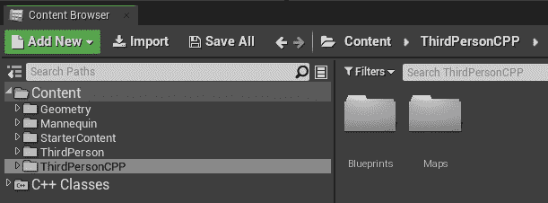

    图 1.2:内容浏览器的目录视图

2.  `Viewport`:在屏幕的正中央，你可以看到`Viewport`窗口。这将向您显示当前级别的内容，并允许您浏览您的级别以及在其中添加、移动、移除和编辑对象。它还包含关于视觉滤镜、对象滤镜(您可以看到哪些对象)和您的级别中的照明的几个不同参数。
3.  `World Outliner`:在屏幕右上角，你会看到`World Outliner`。这将允许您快速列出和操作您所在级别的对象。`Viewport`和`World Outliner`携手合作，让你管理自己的水平，前者会向你展示它的样子，后者会帮助你管理和组织它。与`Content Browser`类似，`World Outliner`允许你在目录中组织你所在级别的对象，不同的是`Content Browser`显示你项目中的*资产*，而`World Outliner`显示你所在级别的*对象*。
4.  The `Details` panel and `World Settings`: At the far right of the screen, below `World Outliner`, you'll be able to see two windows – the `Details` panel and the `World Settings` window. The `Details` window allows you to edit the properties of an object that you selected in your level. As there are no objects selected in the screenshot, it is empty. However, if you select any object in your level by *left-clicking* on it, its properties should appear in this window, as shown in the following screenshot:

    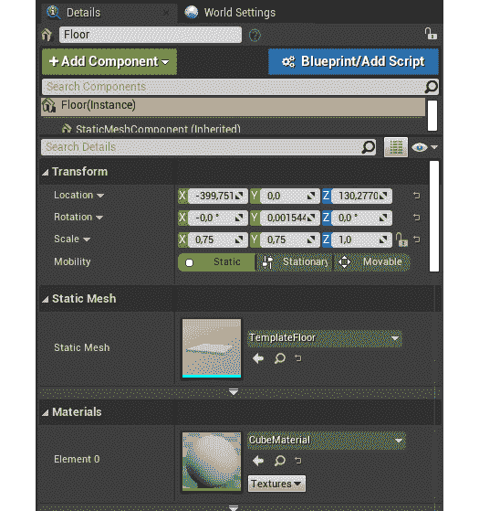

    图 1.3:详细信息选项卡

    `World Settings`窗口允许您设置您的级别的整体设置，而不是单个对象的设置。在这里，您可以更改诸如 Kill Z(您希望对象被破坏的高度)和所需的照明设置等内容:

    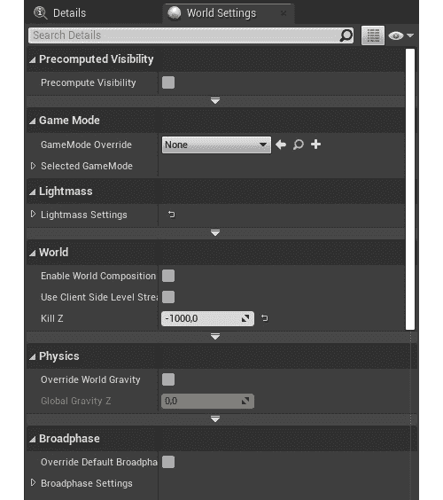

    图 1.4:世界设置窗口

5.  `Toolbar`: At the top of the screen you'll see the editor `Toolbar`, where you'll be able to save your current level, access the project and editor settings, and play your level, among other things.

    注意

    我们将只使用这些工具栏中的一些按钮，即`Save Current`、`Settings`、`Blueprints`、`Build`和`Play`按钮。

6.  `Modes`:在屏幕的最左边，你会看到`Modes`窗口。它将允许您将对象拖动到您的级别，例如立方体和球体、光源以及为各种目的设计的其他类型的对象。

现在我们已经了解了虚幻引擎编辑器的主窗口，让我们看看如何管理这些窗口。

# 编辑器窗口

正如我们所看到的，虚幻引擎编辑器由许多窗口组成，所有窗口都是可调整大小、可移动的，并且在它们的顶部有一个相应的选项卡。你可以点击并按住一个窗口的标签并拖动它，以便将它移动到其他地方。您可以通过右键单击标签并选择`Hide`选项来隐藏标签标签:

图 1.5:如何隐藏选项卡

如果标签标签已经被隐藏，你可以通过点击该窗口左上角的*黄色三角形*让它们重新出现，如下图所示:

图 1.6:允许您显示窗口选项卡的黄色三角形

请记住，您可以通过单击编辑器左上角的`Window`按钮来浏览和打开编辑器中所有可用的窗口，包括刚才提到的窗口。

另一件你应该知道的非常重要的事情是如何从编辑器内部发挥你的水平(也称为 **PIE** )。在编辑器`Toolbar`的右边，你会看到`Play`按钮。如果您点按它，您将开始在编辑器中播放当前打开的级别。

一旦点击`Play`，就可以使用 *W* 、 *A* 、 *S* 、 *D* 键移动玩家角色，空格键跳跃，移动`Mouse`旋转摄像头:

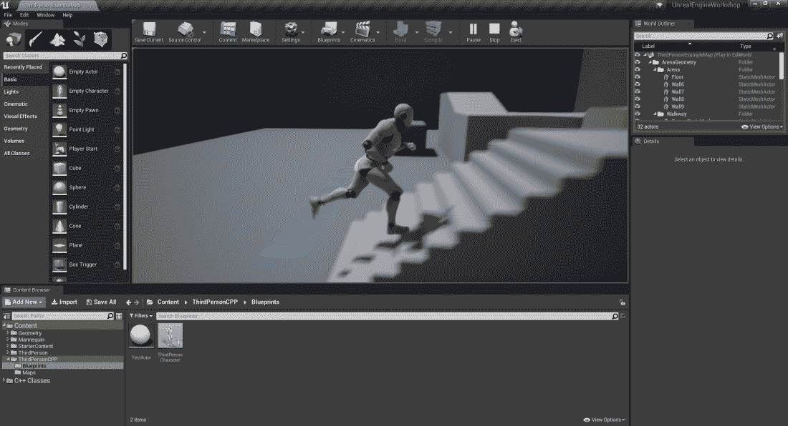

图 1.7:编辑器中正在播放的级别

然后您可以按下 *Esc* 键(退出)，以停止播放该级别。

现在我们已经习惯了编辑器的一些窗口，让我们更深入地看看`Viewport`窗口。

# 视口导航

我们在上一节中提到`Viewport`窗口将允许你可视化你的水平，以及操纵它里面的物体。因为这是您可以使用的一个非常重要的窗口，并且有很多功能，所以我们将在本节中了解更多信息。

在我们开始了解`Viewport`窗口之前，让我们快速了解一下**等级**。在 UE4 中，级别表示对象的**集合**，以及它们的位置和属性。`Viewport`窗口将始终向您显示当前所选级别的内容，在本例中，该级别已经创建并与`Third Person`模板项目一起生成。在这个关卡中，你将能够看到四个墙壁物体、一个地面物体、一组楼梯和其他一些高架物体，以及由 UE4 人体模型代表的玩家角色。您可以通过从`Content Browser`打开多个级别来创建多个级别并在它们之间切换。

为了操作和浏览当前选择的级别，您必须使用`Viewport`窗口。按住窗口内的*鼠标左键*，向左移动鼠标**向右移动*即可水平旋转摄像头，向前移动鼠标**向后移动*即可前后移动摄像头。按住*鼠标右键*也可以达到类似的效果，只是向前移动鼠标*和向后移动*时相机会垂直旋转，可以水平和垂直旋转相机。****

 ***此外，您也可以通过点击并按住*鼠标右键*(鼠标左键的*也可以，但使用它进行移动并没有那么有用，因为旋转相机时没有那么大的自由度)并使用 *W* 和 *S* 键向前和向后移动， *A* 和 *D* 键向侧面移动， *E 【T14**

如果你看`Viewport`窗口的右上角，你会看到一个小的摄像头图标，旁边有一个数字，这将允许你改变摄像头在`Viewport`窗口中的移动速度。

您可以在`Viewport`窗口中做的另一件事是更改其可视化设置。您可以通过单击当前显示`Lit`的按钮来更改`Viewport`窗口中的可视化类型，该按钮将向您显示不同照明和其他类型可视化过滤器的所有可用选项。

如果您点击`Perspective`按钮，您将可以选择从透视图和正交视图中查看您的关卡，后者可以帮助您更快地构建关卡。

现在让我们继续讨论在您的级别中操纵对象(也称为演员)的主题。

# 操纵演员

在虚幻引擎中，所有可以放置在一个级别中的对象都被称为演员。在电影中，演员是扮演角色的人，但在 UE4 中，你在关卡中看到的每一个物体，包括墙壁、地板、武器和角色，都是演员。

每个演员都必须拥有所谓的`Transform`属性，它是三个东西的集合:

*   **位置**:一个`Vector`属性，表示该演员在 *X* 、 *Y、*和 *Z* 轴中的位置。一个向量只是一个包含三个浮点数的元组，每个浮点数代表一个点在每个轴上的位置。
*   **旋转**:表示该演员沿 *X* 、 *Y、*和 *Z* 轴旋转的`Rotator`属性。旋转器也是一个有三个浮点数的元组，每个轴上有一个浮点数表示旋转的角度。
*   **比例**:一个`Vector`属性，表示该演员在 *X* 、 *Y、*和 *Z* 轴的级别中的比例(表示大小)。这也是三个浮点数的集合，每个轴中的比例值一个。

演员可以在一个级别中移动、旋转和缩放，这将相应地修改他们的`Transform`属性。为此，通过左键单击选择您所在级别的任何对象。您应该会看到**移动**工具出现:

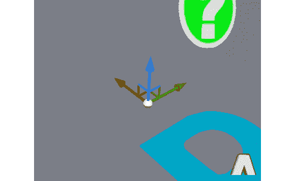

图 1.8:移动工具，它允许你在关卡中移动一个参与者

移动工具是一个三轴小控件，允许您同时在任意轴上移动对象。移动工具的红色箭头(指向上图左侧)代表 *X* 轴，绿色箭头(指向上图右侧)代表 *Y* 轴，蓝色箭头(指向上图)代表 *Z* 轴。如果您单击并按住这些箭头中的任意一个，然后在关卡中拖动它们，您将在关卡中沿着该轴移动您的演员。如果您点按将两个箭头连接在一起的控制柄，您将同时沿着这两个轴移动角色，如果您点按所有箭头交叉点处的白色球体，您将沿着所有三个轴自由移动角色:

图 1.9:使用移动工具在 Z 轴上移动演员

“移动”工具将允许您在层级中移动一个演员，但是如果您想要旋转或缩放一个演员，您需要分别使用“旋转”和“缩放”工具。您可以通过分别按下 *W* 、 *E* 和 *R* 键在移动、旋转和缩放工具之间切换。按下 *E* 切换到旋转工具:

图 1.10:旋转工具，它允许你旋转一个演员

如预期的那样，旋转工具将允许您在您的级别中旋转演员。您可以*单击并按住*任意弧线，以围绕其相关轴旋转演员。红色弧线(上图左上)将围绕 *X* 轴旋转演员，绿色弧线(上图右上)将围绕 *Y* 轴旋转演员，蓝色弧线(上图下中心)将围绕 *Z* 轴旋转演员:

图 1.11:绕 X 轴旋转 30 度前后的立方体

请记住，物体围绕 *X* 轴的旋转通常被指定为**滚动**，其围绕 *Y* 轴的旋转通常被指定为**俯仰**，其围绕 *Z* 轴的旋转通常被指定为**偏航**。

最后，我们有缩放工具。按下 *R* 切换到:

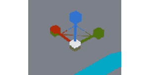

图 1.12:缩放工具

缩放工具将允许您在 *X* 、 *Y* 和 *Z* 轴上增加和减少演员的比例(大小)，其中红色手柄(上图左侧)将在 *X* 轴上缩放演员，绿色手柄(上图右侧)将在 *Y* 轴上缩放演员，蓝色手柄(上图上部)将在 *Z* 轴上缩放演员

图 1.13:在所有三个轴上缩放前后的角色演员

您也可以通过单击`Viewport`窗口顶部的以下图标在移动、旋转和缩放工具之间切换:

图 1.14:移动、旋转和缩放工具图标

此外，您可以通过移动、旋转和缩放工具图标右侧的网格捕捉选项来更改移动、旋转和缩放对象的增量。通过按下当前橙色的按钮，您可以完全禁用捕捉，通过按下显示当前捕捉增量的按钮，您可以更改这些增量:

图 1.15:用于移动、旋转和缩放的网格捕捉图标

现在，您已经知道如何操作已经存在于您的级别中的演员，让我们在下一个练习中学习如何在我们的级别中添加和移除演员。

## 练习 1.02:添加和移除演员

在本练习中，我们将在我们的级别中添加和移除演员。

当涉及到向您的级别添加演员时，有两种主要方法可以做到这一点:从`Content Browser`拖动资产，或者从`Modes`窗口的放置模式拖动默认资产。

以下步骤将帮助您完成本练习:

1.  If you go to the `ThirdPersonCPP -> Blueprints` directory inside `Content Browser`, you will see the `ThirdPersonCharacter` Actor. If you drag that asset to your level using the *left mouse button*, you will be able to add an instance of that Actor to it, and it will be placed wherever you let go of the *left mouse button*:

    

    图 1.16:将第三个人角色参与者的实例拖到我们的级别

2.  You can similarly drag an Actor from the `Modes` window to your level as well:

    

    图 1.17:拖动一个圆柱体演员到我们的水平

3.  In order to delete an Actor, you can simply select the Actor and press the *Delete* key. You can also *right-click* on an Actor to take a look at the many other options available to you regarding that Actor.

    注意

    虽然我们不会在本书中讨论这个主题，但是为了原型的目的，开发人员可以用简单的盒子和几何图形填充他们的级别的方法之一是 BSP 画笔。这些可以很快塑造成你想要的形状，因为你建立你的水平。想了解更多关于 BSP 笔刷的信息，请访问本页:[https://docs.unrealengine.com/en-US/Engine/Actors/Brushes](https://docs.unrealengine.com/en-US/Engine/Actors/Brushes)。

至此，我们结束了本练习，并学习了如何在我们的级别中添加和移除参与者。

现在我们已经知道如何导航`Viewport`窗口，让我们了解蓝图演员。

# 蓝图演员

在 UE4 中，蓝图这个词可以用来指两种不同的东西:UE4 的可视化脚本语言或特定类型的资产，也称为蓝图类或蓝图资产。

正如我们之前提到的，Actor 是一个可以放置在关卡中的对象。该对象可以是 C++ 类的实例，也可以是蓝图类的实例，两者都必须从 Actor 类继承(直接或间接)。那么，你可能会问，C++ 类和蓝图类有什么区别？有几个:

*   如果将编程逻辑添加到 C++ 类中，您将能够访问比创建蓝图类时更高级的引擎功能。
*   在蓝图类中，您可以轻松地查看和编辑该类的可视组件，如 3D 网格或触发器盒碰撞，以及修改在暴露给编辑器的 C++ 类中定义的属性，这使得管理这些属性变得更加容易。
*   在蓝图类中，您可以很容易地引用项目中的其他资产，而在 C++ 中，您也可以这样做，但是不那么简单和灵活。
*   在蓝图可视化脚本上运行的编程逻辑在性能方面比 C++ 类慢。
*   It's simple to have more than one person work on a C++ class simultaneously without conflicts in a source version platform, whereas with a Blueprint class, which is interpreted as a binary file instead of a text file, this will cause conflicts in your source version platform if two different people edit the same Blueprint class.

    注意

    如果你不知道什么是源版本平台，这就是几个开发人员如何在同一个项目上工作，并让它随着其他开发人员所做的工作而更新。在这些平台中，不同的人通常可以同时编辑同一个文件，只要他们编辑该文件的不同部分，并且仍然接收到其他程序员所做的更新，而不会影响您对同一文件的工作。最受欢迎的源代码版本平台之一是 GitHub。

请记住，蓝图类可以从 C++ 类继承，也可以从另一个蓝图类继承。

最后，在我们继续创建我们的第一个蓝图类之前，您应该知道的另一件重要的事情是，您可以在 C++ 类中编写编程逻辑，然后创建一个从该类继承的蓝图类，但是如果您在 C++ 类中指定，也可以访问它的属性和方法。您可以使用蓝图脚本语言，让蓝图类编辑在 C++ 类中定义的属性，以及调用和重写函数。我们将在这本书里做一些这样的事情。

现在您对蓝图类有了更多的了解，让我们在下一个练习中创建自己的蓝图类。

## 练习 1.03:创建蓝图演员

在这个简短的练习中，我们将学习如何创建一个新的蓝图演员。

以下步骤将帮助您完成本练习:

1.  Go to the `ThirdPersonCPP -> Blueprints` directory inside `Content Browser` and *right-click* inside it. The following window should pop up:

    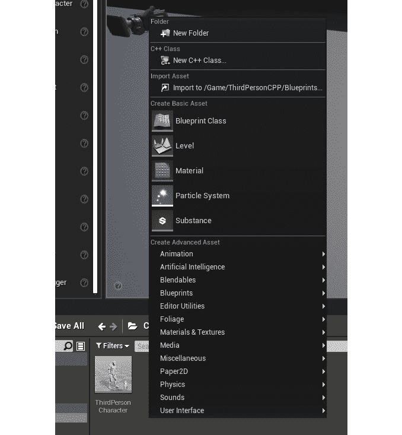

    图 1.18:在内容浏览器中右键单击时出现的选项窗口

    此选项菜单包含您可以在 UE4 中创建的资产类型(蓝图只是一种资产类型，还有其他类型的资产，如`Level`、`Material`和`Sound`)。

2.  Click the `Blueprint Class` icon to create a new Blueprint class. When you do, you will be given the option to choose the C++ or Blueprint class that you want to inherit from:

    

    图 1.19:创建新蓝图类时弹出的选择父类窗口

3.  从该窗口中选择第一个类`Actor`类。之后，您将自动选择新蓝图类的文本，以便根据您的需要对其进行命名。命名这个蓝图类`TestActor`并按`Enter`键接受这个名字。

完成这些步骤后，您将已经创建了蓝图类，因此已经完成了本练习。创建该资产后，用鼠标左键*双击该资产，打开蓝图编辑器。*

 *# 蓝图编辑器

蓝图编辑器是虚幻引擎编辑器中的一个子编辑器，专门用于蓝图类。在这里，您将能够编辑蓝图类或其父类的属性和逻辑，以及它们的视觉外观。

当您打开一个 Actor 蓝图类时，您应该会看到蓝图编辑器。这是允许您在 UE4 中编辑蓝图类的窗口。让我们了解一下您当前看到的窗口:

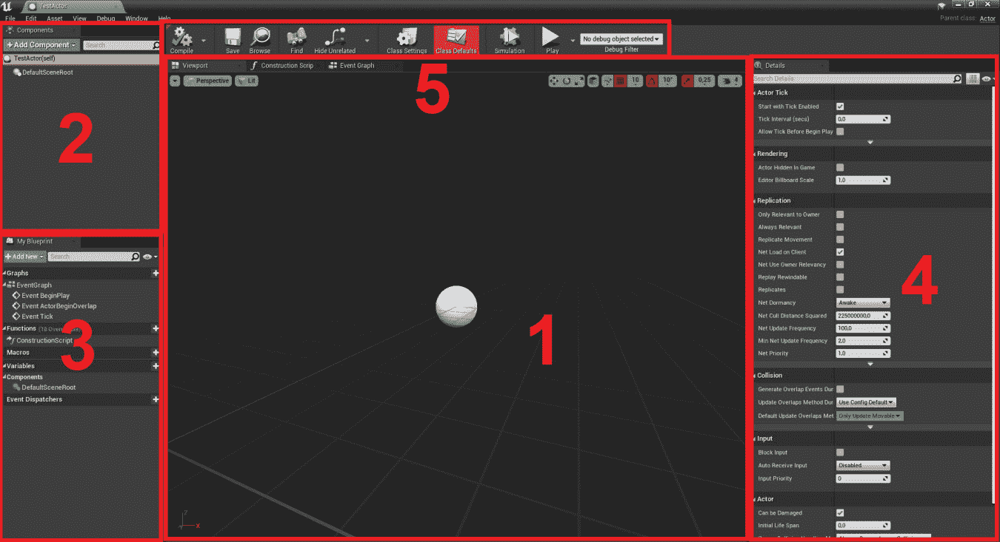

图 1.20:蓝图编辑器窗口分为五个部分

1.  `Viewport`: Front and center in the editor you have the `Viewport` window. This window, similar to the `Level Viewport` window that we already learned about, will allow you to visualize your Actor and edit its components. Every actor can have several Actor Components, some of which have a visual representation, such as Mesh Components and Collision Components. We'll be talking about Actor Components in more depth in later chapters.

    从技术上讲，这个中心窗口包含三个选项卡，其中只有一个是`Viewport`窗口，但是我们将在处理这个编辑器的界面后讨论另一个重要的选项卡`Event Graph`。第三个标签是`Construction Script`窗口，我们不会在本书中涉及。

2.  `Components`:在编辑器的左上角，有`Components`窗口。如前所述，参与者可以有几个参与者组件，这个窗口将允许您在蓝图类中添加和删除这些参与者组件，以及访问在它继承的 C++ 类中定义的参与者组件。
3.  `My Blueprint`:在编辑器的左下方，有`My Blueprint` 窗口。这将允许您浏览、添加和删除在这个蓝图类及其继承的 C++ 类中定义的变量和函数。请记住，蓝图有一种特殊的功能，称为**事件**，用于表示游戏中发生的事件。你应该在这个窗口看到其中的三个:`BeginPlay`、`ActorBeginOverlap`和`Tick`。我们将在几个段落中讨论这些。
4.  `Details`:在编辑器的右边，有`Details`窗口。类似于编辑器的`Details`窗口，该窗口将向您显示当前选定的参与者组件、函数、变量、事件或该蓝图类的任何其他单个元素的属性。如果您当前没有选择任何元素，此窗口将为空。
5.  `Toolbar`:在编辑器的顶部中央有`Toolbar`窗口。这个窗口将允许你编译你在这个蓝图类中写的代码，保存它，在`Content Browser`中找到它，并且访问这个类的设置，等等。

通过查看蓝图编辑器的右上角，可以看到蓝图类的父类。如果您单击父类的名称，您将通过虚幻引擎编辑器转到相应的蓝图类，或者通过 Visual Studio 转到 C++ 类。

此外，您可以通过单击蓝图编辑器左上角的`File`选项卡并选择`Reparent Blueprint`选项来更改蓝图类的父类，这将允许您指定该蓝图类的新父类。

既然我们已经了解了蓝图编辑器的基础知识，让我们来看看它的事件图。

# 事件图

`Event Graph`窗口是您编写所有蓝图可视化脚本代码、创建变量和函数以及访问该类父类中声明的其他变量和函数的地方。

如果您选择`Event Graph`选项卡，您应该可以在`Viewport`选项卡的右侧看到该选项卡，您将看到`Event Graph`窗口，而不是`Viewport`窗口。点击`Event Graph`选项卡，会出现如下窗口:

图 1.21:显示三个禁用事件的事件图窗口

您可以通过按住*鼠标右键*并在图形内拖动来导航`Event Graph`，您可以通过滚动*鼠标滚轮*来放大和缩小，您可以通过单击*鼠标左键*或按住选择节点区域来从图形中选择节点。

你也可以在`Event Graph`窗口内*右键*进入蓝图的动作菜单，可以在`Event Graph`中进行动作，包括获取和设置变量、调用函数或事件等。

蓝图中脚本的工作方式是使用引脚连接节点。有几种类型的节点，如变量、函数和事件。您可以通过引脚连接这些节点，引脚有两种类型:

1.  **Execution pins**: These will dictate the order in which the nodes will be executed. If you want node 1 to be executed and then node 2 to be executed, you link the output execution pin of node 1 to the input execution pin of node 2, as shown in the following screenshot:

    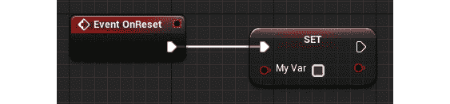

    图 1.22:重置节点上事件的输出执行引脚连接到我的变量的设置节点的输入执行引脚

2.  **Variable pins**: These work as parameters (also known as input pins), at the left of the node, and return values (also known as output pins), at the right side of the node, representing a value of a certain type (integer, float, Boolean, and others):

    

图 1.23:获取标量参数值函数调用节点，它有两个输入变量引脚和一个输出变量引脚

让我们通过下一个练习更好地理解这一点。

## 练习 1.04:创建蓝图变量

在本练习中，我们将看到如何通过创建`Boolean`类型的新变量来创建蓝图变量。

在蓝图中，变量的工作方式类似于 C++ 中使用的变量。你可以创造它们，获得它们的价值，并设定它们。

以下步骤将帮助您完成本练习:

1.  To create a new Blueprint variable, head to the `My Blueprint` window and click the `+ Variable` button:

    

    图 1.24:在“我的蓝图”窗口中突出显示的+变量按钮，允许您创建一个新的蓝图变量

2.  After that, you'll automatically be allowed to name your new variable. Name this new variable `MyVar`:

    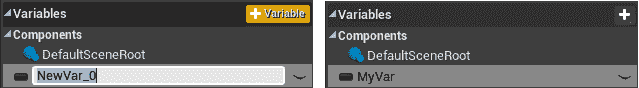

    图 1.25:命名新变量 MyVar

3.  Compile your Blueprint by clicking the `Compile` button on the left side of the `Toolbar` window. If you now take a look at the `Details` window, you should see the following:

    

    图 1.26:详细信息窗口中的变量设置

4.  Here, you'll be able to edit all the settings related to this variable, the most important ones being `Variable Name`, `Variable Type`, and its `Default Value` at the end of the settings. Boolean variables can have their value changed by clicking the gray box to their right:

    

    图 1.27:变量类型下拉菜单中可用的变量类型

5.  You can also drag a getter or setter for a variable inside the `My Blueprint` tab into the `Event Graph` window:

    

    图 1.28:将 MyVar 拖到事件图窗口中，并选择是添加一个 getter 还是 setter

    Getters 是包含变量当前值的节点，setters 是允许您更改变量值的节点。

6.  To allow a variable to be editable in each of the instances of this Blueprint class, you can click the eye icon to the right of that variable inside the `My Blueprint` window:

    

    图 1.29:点击眼睛图标来展示一个变量，并允许它是实例可编辑的

7.  You can then drag an instance of this class to your level, select that instance, and see the option to change that variable's value in the `Details` window of the editor:

    

图 1.30:公开的 MyVar 变量，可以通过该对象的细节面板进行编辑

至此，我们结束了本练习，现在知道如何创建我们自己的蓝图变量。现在让我们看看如何在下一个练习中创建蓝图函数。

## 练习 1.05:创建蓝图功能

在本练习中，我们将创建第一个蓝图函数。在蓝图中，函数和事件相对相似，唯一的区别是事件只有一个输出引脚，通常是因为它是从蓝图类外部调用的:

图 1.31:一个事件(左)、一个不需要执行引脚的纯函数调用(中间)和一个普通函数调用(右)

以下步骤将帮助您完成本练习:

1.  Click the `+ Function` button inside the `My Blueprint` window:

    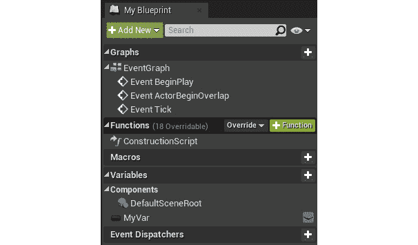

    图 1.32:悬停在+ Function 按钮上，这将创建一个新的函数

2.  命名新功能`MyFunc`。
3.  Compile your Blueprint by clicking the `Compile` button in the `Toolbar` window:

    

    图 1.33:编译按钮

4.  If you now take a look at the `Details` window, you should see the following:

    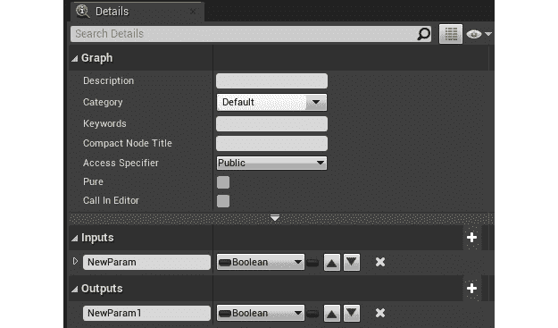

    图 1.34:选择 MyFunc 函数并添加输入和输出引脚后的详细信息面板

    在这里，您可以编辑与该功能相关的所有设置，最重要的是设置末尾的`Inputs`和`Outputs`。这将允许您指定该函数必须接收并将返回的变量。

    最后，您可以从`My Blueprint`窗口通过*点击*来编辑该功能。这将在中央窗口中打开一个新的选项卡，允许您指定该功能的作用。在这种情况下，这个函数每次被调用时都会简单地返回`false`:

    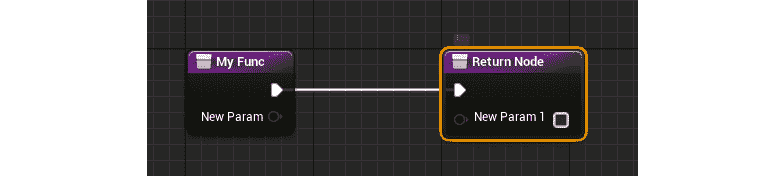

    图 1.35:my func 函数的内容，接收一个布尔参数，并返回一个布尔类型

5.  要保存我们对此蓝图类所做的修改，请单击工具栏上`Compile`按钮旁边的`Save`按钮。或者，您可以选择该选项，以便每次成功编译时蓝图都会自动保存。

完成这些步骤后，您现在知道如何创建自己的蓝图函数了。现在让我们看一下我们将在本章后面使用的蓝图节点。

# 浮点乘法节点

蓝图包含更多与变量或函数无关的节点。一个这样的例子是算术节点(即加法、减法、乘法等等。).如果你在蓝图动作菜单上搜索`float * float`，你会发现*浮点乘法*节点:

图 1.36:浮点乘法节点

该节点允许您输入两个或多个浮点参数(您可以通过单击`Add pin`文本右侧的`+`图标添加更多参数)，并输出所有参数的乘法结果。我们将在本章的活动中使用这个节点。

# 开始播放并打勾

现在让我们来看看 UE4 中最重要的两个事件:`BeginPlay`和`Tick`。

如前所述，事件通常从蓝图类外部调用。在`BeginPlay`事件的情况下，当这个蓝图类的一个实例被放置在关卡中并且开始玩关卡时，或者当这个蓝图类的一个实例在玩游戏时被动态产生时，这个事件被调用。您可以将`BeginPlay`事件视为将在该蓝图的实例上调用的第一个事件，您可以将其用于初始化。

UE4 要知道的另一个重要事件是`Tick`事件。您可能知道，游戏以一定的帧速率运行，最常见的是 30 FPS(每秒帧数)或 60 FPS:这意味着游戏每秒将渲染游戏的更新图像 30 或 60 次。`Tick`事件将在游戏每次这样做时被调用，这意味着如果游戏以 30 FPS 运行，`Tick`事件将每秒被调用 30 次。

转到您的蓝图类的`Event Graph`窗口，通过选择所有事件并单击`Delete`键删除三个灰色事件，这将导致`Event Graph`窗口变空。之后，*在`Event Graph` 窗口中右键单击*，输入`BeginPlay`，通过单击`Enter`键或在蓝图操作菜单中单击该选项选择`Event BeginPlay`节点。这将导致该事件被添加到`Event Graph`窗口:

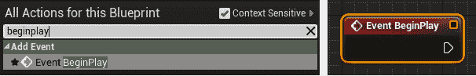

图 1.37:开始播放事件通过蓝图操作菜单被添加到事件图窗口

*右键点击`Event Graph`窗口内的*，输入`Tick`，选择`Event Tick`节点。这将导致该事件被添加到`Event Graph`窗口:

图 1.38:滴答事件

与`BeginPlay`事件不同，`Tick`事件将使用参数`DeltaTime`调用。此参数是一个浮点数，指示自渲染最后一帧以来经过的时间。如果您的游戏以 30 FPS 运行，这意味着渲染的每个帧之间的时间间隔(增量时间)平均为 1/30 秒，约为 0.033 秒(33.33 毫秒)。如果帧 1 被渲染，然后帧 2 被渲染 0.2 秒，那么帧 2 的增量时间将是 0.2 秒。如果帧 3 在帧 2 之后 0.1 秒被渲染，则帧 3 的增量时间将是 0.1 秒，以此类推。

但是`DeltaTime`参数为什么这么重要呢？让我们看看下面的场景:您有一个蓝图类，每当使用`Tick`事件渲染一帧时，它在 *Z* 轴上的位置都会增加 1 个单位。然而，你面临一个问题:玩家有可能以不同的帧率运行你的游戏，比如 30 FPS 和 60 FPS。以 60 FPS 运行游戏的玩家将导致`Tick`事件被调用的次数是以 30 FPS 运行游戏的玩家的两倍，蓝图类将因此而以两倍的速度移动。这就是增量时间发挥作用的地方:因为以 60 FPS 运行的游戏将以较低的增量时间值调用`Tick`事件(渲染的帧之间的间隔要小得多)，所以您可以使用该值来更改 *Z* 轴上的位置。虽然在 60 FPS 的游戏中，`Tick`事件被调用的次数是两倍，但是它的增量时间是这个值的一半，所以它是平衡的。这将导致两个以不同帧速率玩游戏的玩家得到相同的结果。

注意

如果您想要一个使用增量时间移动的蓝图，您可以通过将增量时间乘以您想要它每秒移动的单位数来使它移动得更快或更慢(例如，如果您想要一个蓝图在 *Z* 轴上每秒移动 3 个单位，您可以告诉它每帧移动`3 * DeltaTime`个单位)。

现在让我们尝试另一个练习，它将包括使用蓝图节点和大头针。

## 练习 1.06:在 Z 轴上偏移测试器类

在本练习中，当游戏开始时，您将使用`BeginPlay`事件来偏移(移动) *Z* 轴上的`TestActor`。

以下步骤将帮助您完成本练习:

1.  打开`TestActor`蓝图类。
2.  使用`Blueprint Actions`菜单，将`Event BeginPlay`节点添加到图形中，如果它还没有出现的话。
3.  添加`AddActorWorldOffset`功能，并将`BeginPlay`事件的输出执行引脚连接到该功能的输入执行引脚。该功能负责在预定轴( *X* 、 *Y* 和 *Z* )中移动演员，并接收以下参数:
    *   `Target`:应该调用该函数的 Actor，将是调用该函数的 Actor。默认行为是在调用该函数的 Actor 上调用该函数，这正是我们想要的，并使用`self`属性显示。
    *   `DeltaLocation`:我们希望在三个轴(X、Y 和 z)的每一个轴上抵消该演员的量
    *   We won't be getting into the other two parameters, `Sweep` and `Teleport`, so you can leave them as is. They are both Boolean types and should be left as `false`:

        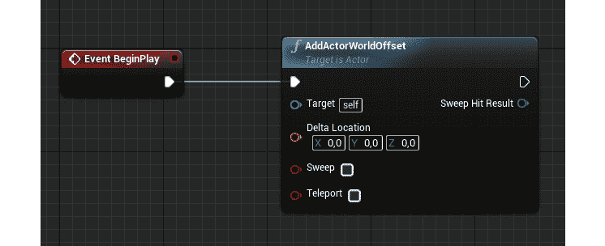

图 1.39:调用 AddActorWorldOffset 函数的 BeginPlay 事件

1.  Split the `Delta Location` input pin, which will cause this `Vector` property to be split into three float properties. You can do this to any variable type that is comprised of one or more subtypes (you wouldn't be able to do this to the float type because it's not comprised of any variable subtypes) by *right-clicking* on them and selecting `Split Struct Pin`:

    

    图 1.40:增量位置参数被从一个向量分割成三个浮点数

2.  用鼠标左键点击*，输入数字，然后按*回车*键，将`Delta Location`的`Z`属性设置为`100`单位。这将导致我们的`TestActor`在游戏开始时在 *Z* 轴上向上移动`100`个单位。*
**   Add a cube shape to your `TestActor`, using the `Components` window, so that we can see our Actor. You can do this by clicking the `+ Add Component` button, typing `Cube`, and then selecting the first option under the `Basic Shapes` section:

    

    图 1.41:添加立方体形状

    *   点击`Compile`按钮，编译并保存你的蓝图类。*   Go back to the level's `Viewport` window and place an instance of your `TestActor` Blueprint class inside the level, if you haven't done so already:

    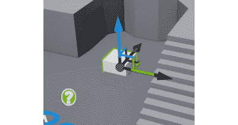

    图 1.42:向级别添加一个测试器实例

    *   When you play the level, you should notice that the `TestActor` we added to the level is in a more elevated position:

    

    图 1.43:游戏开始时，测试器在 Z 轴上增加位置

    *   进行这些修改后，通过按下 *Ctrl + S* 或单击编辑器`Toolbar`上的`Save Current`按钮，保存对我们级别所做的更改。*

 *在本练习中，您已经学习了如何使用自己的蓝图脚本逻辑创建第一个 Actor 蓝图类。

注意

本次演练最终结果的`TestActor`蓝图资产和`Map`资产均可在此找到:[https://packt.live/3lfYOa9](https://packt.live/3lfYOa9)。

现在我们已经完成了这一步，让我们进一步了解一下`ThirdPersonCharacter`蓝图课程。

# 第三个人物蓝图类

我们来看看`ThirdPersonCharacter`蓝图类，它是代表玩家控制的角色的蓝图，再来看看它包含的 Actor Components。

转到`Content Browser`内的`ThirdPersonCPP -> Blueprints`目录，打开`ThirdPersonCharacter`资产:

图 1.44:第三个人角色蓝图类

在上一节中，我们介绍了蓝图编辑器中的`Components`窗口，我们提到了**演员组件**。

参与者组件是必须存在于参与者内部的实体，允许您将参与者的逻辑扩展到几个不同的参与者组件中。在这个蓝图中，我们可以看到有四个可视化的参与者组件:

*   骨骼网格组件，显示 UE4 人体模型
*   相机组件，显示玩家可以从哪里看到游戏
*   一个箭头组件，它允许我们看到角色面对的地方(这主要用于开发目的，而不是在玩游戏的时候)
*   胶囊组件，指定该角色的碰撞范围

如果您查看`Components`窗口，您将看到比我们在`Viewport`窗口中看到的演员组件更多的演员组件。这是因为一些 Actor 组件没有可视化表示，纯粹由 C++ 或蓝图代码组成。我们将在下一章和*第九章*、*视听元素*中深入探讨演员组件。

如果你看一下这个蓝图类的`Event Graph`窗口，你会发现它本质上是空的，就像我们用我们的`TestActor`蓝图类看到的一样，尽管它有一些相关的逻辑。这是因为该逻辑是在 C++ 类中定义的，而不是在这个蓝图类中。我们将在下一章研究如何做到这一点。

为了解释这个蓝图类的骨骼网格组件，我们应该首先谈论网格和材质。

# 网格和材料

对于计算机来说，要在视觉上表示一个三维物体，它需要两样东西:一个三维网格和一种材料。

## 网格

三维网格允许您指定对象的大小和形状，就像这个代表猴子头的网格:

图 1.45:猴子头部的三维网格

网格由几个顶点、边和面组成。顶点只是一个三维坐标，具有 *X* 、 *Y、*和 *Z* 位置；边是两个顶点之间的连接(即一条线)；面是三个或更多个边的连接。在上图中，您可以看到网格的各个顶点、边和面，其中每个面的颜色介于白色和黑色之间，具体取决于面反射的光量。如今，视频游戏可以渲染成千上万个顶点的网格，以至于你无法区分单个顶点，因为有太多的顶点靠得很近。

## 材料

另一方面，材质允许您指定如何表示网格。它们允许您指定网格的颜色，在其表面绘制纹理，甚至操纵其单个顶点。

在撰写本书时，创建网格在 UE4 中还没有得到适当的支持，应该在另一个软件中完成，例如 Blender 或 Autodesk Maya，因此我们在这里不会详细讨论这个问题。但是，我们将学习如何为现有网格创建材质。

在 UE4 中，您可以通过从 Actor Component 类继承而来的网格组件来添加网格。有几种类型的网格组件，但最重要的两种是静态网格组件，用于没有动画的网格(例如，立方体、静态级别几何图形)，以及骨骼网格组件，用于有动画的网格(例如，播放运动动画的角色网格)。正如我们之前看到的，`ThirdPersonCharacter`蓝图类包含一个骨骼网格组件，因为它用于表示播放运动动画的角色网格。在下一章中，我们将学习如何将网格等资产导入到我们的 UE4 项目中。

现在让我们在下一个练习中看看 UE4 中的材料。

# 操纵 UE4 中的材料

在本节中，我们将了解材料在 UE4 中是如何工作的。

回到你的`Level Viewport`窗口，选择这个`Cube`对象:

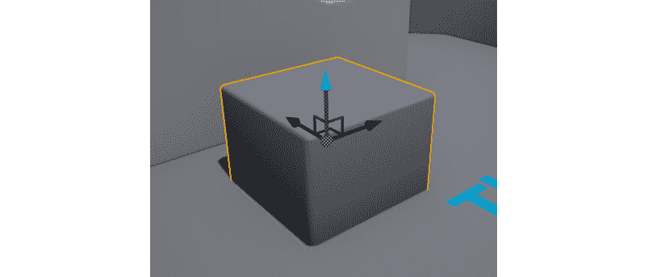

图 1.46:立方体对象，在文本旁边写着第三人称在地板上

看看`Details`窗口，在这里你可以看到与这个对象的`Static Mesh`组件相关的网格和材质:

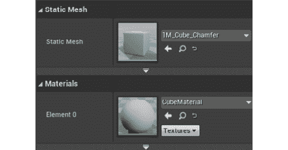

图 1.47:立方体对象的静态网格组件的静态网格和材质(元素 0)属性

注意

请记住，网格可以有多种材质，但必须至少有一种。

单击`Content Browser`中要带到该材料位置的`Material`属性旁边的*视镜*图标。该图标适用于编辑器中对任何资源的引用，因此您可以对被引用为立方体对象的`Static Mesh`的资源执行相同的操作:

图 1.48:视镜图标(左)，它将您带到内容浏览器中该资产的位置(右)

*用鼠标左键双击*该资产，在`Material`编辑器中打开该资产。让我们打破`Material editor`中的窗户:

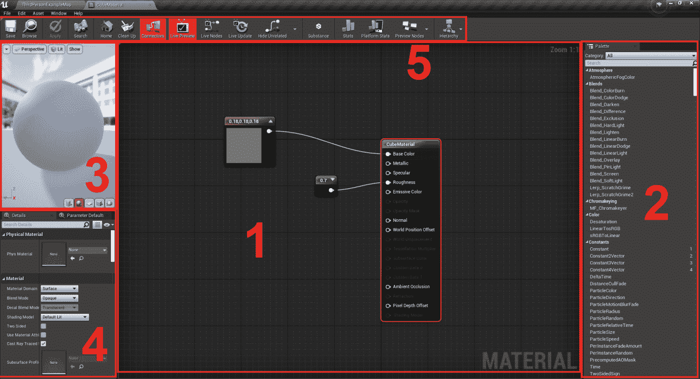

图 1.49:材料编辑器窗口分为五个部分

1.  `Graph`:编辑器中的前方和中央，有`Graph`窗口。类似于蓝图编辑器的`Event Graph`窗口，`Material`编辑器的图形也是基于节点的，在这里你也可以找到通过管脚连接的节点，虽然这里你找不到执行管脚，只有输入和输出管脚。
2.  `Palette`:在屏幕的右边，你会看到`Palette`窗口，在这里你可以搜索所有可以添加到`Graph`窗口的节点。您也可以在蓝图编辑器的`Event Graph`窗口中通过右键单击`Graph`窗口中的*并键入您想要添加的节点来完成此操作。*
**   `Viewport`:在屏幕左上角，你会看到`Viewport`窗口。在这里，您将能够预览材质的结果，以及它将如何出现在一些基本形状上，如球体、立方体和平面。*   `Details`:在屏幕的左下角，你会看到`Details`窗口，类似于蓝图编辑器，你可以在`Graph`窗口看到这个`Material`资产或者当前选中节点的详细信息。*   `Toolbar`:在屏幕的上边缘，你会看到`Toolbar`窗口，在这里你可以应用和保存对你的素材所做的更改，以及执行与`Graph`窗口相关的几个动作。*

 *在 UE4 中的每个材质编辑器中，您会发现一个名为`Material`资源的节点，通过将该节点的引脚插入其他节点，您可以指定与其相关的几个参数。

在这种情况下，您可以看到有一个名为`0.7`的节点被插入到`Roughness`引脚。这个节点是一个`Constant`节点，它允许你指定一个与之相关的号码——在这个例子中是`0.7`。您可以创建单个数字的常量节点、2 个向量(例如，`(1, 0.5)`)、3 个向量(例如，`(1, 0.5, 4)`)和 4 个向量(例如，`(1,0.5, 4, 0)`)。要创建这些节点，您可以在按住`1`、`2`、`3`或`4`数字键的同时，用鼠标左键*按下`Graph`窗口。*

材料有几个输入参数，所以让我们来看一些最重要的参数:

*   `BaseColor`:这个参数简单来说就是材质的颜色。通常，常数或纹理样本用于连接到此引脚，以使对象具有特定颜色或映射到特定纹理。
*   `Metallic`:这个参数将决定你的物体看起来有多像金属表面。您可以通过连接一个范围从 0(非金属性)到 1(非常金属性)的常数单个数字节点来实现这一点。
*   `Specular`:这个参数将决定你的物体会反射多少光。您可以通过连接一个范围从 0(不反射任何光)到 1(反射所有光)的常数单个数字节点来实现这一点。如果你的物体已经很有金属质感，你会发现很少或没有区别。
*   `Roughness`: This parameter will dictate how much the light that your object reflects will be scattered (the more the light scatters, the less clear this object will reflect what's around it). You can do this by connecting a constant single number node that ranges from 0 (the object essentially becomes a mirror) to 1 (the reflection on this object is blurry and unclear).

    注意

    要了解更多类似上述输入的信息，请访问。

UE4 还允许您将图像(`.jpeg`、`.png`)作为`Texture`资产导入，然后可以使用`Texture Sample`节点在材质中引用这些图像:

图 1.50:纹理样本节点，它允许你指定一个纹理，并使用它或它的单个颜色通道作为管脚

注意

在下一章中，我们将了解如何将文件导入 UE4。

为了创建一个新的`Material`资产，你可以通过在`Content Browser`内你想要创建新资产的目录上*右键*来创建，这将允许你选择创建哪个资产，然后选择`Material`。

现在你知道如何在 UE4 中创建和操纵材质了。

现在让我们跳到本章的活动，这将是本书的第一个活动。

## 活动 1.01:在 Z 轴上无限推进测试器

在本活动中，您将使用`TestActor`的`Tick`事件在 *Z* 轴上无限移动它，而不是在游戏开始时只做一次。

以下步骤将帮助您完成本活动:

1.  打开`TestActor`蓝图类。
2.  将`Event Tick`节点添加到蓝图的`Event Graph`窗口。
3.  添加`AddActorWorldOffset`功能，拆分其`DeltaLocation`引脚，并将`Tick`事件的输出执行引脚连接到该功能的输入执行引脚，类似于我们在*练习 1.01* 、*创建虚幻引擎 4 项目*中所做的。
4.  向`Event Graph`窗口添加*浮点乘法*节点。
5.  将`Tick`事件的`Delta Seconds`输出引脚连接到*浮点乘法*节点的第一个输入引脚。
6.  创建一个`float`类型的新变量，称之为`VerticalSpeed,`，并将其默认值设置为`25`。
7.  向`Event Graph`窗口的`VerticalSpeed`变量添加一个 getter，并将其引脚连接到*浮点乘法*节点的第二个输入引脚。之后，将*浮点乘法*节点的输出引脚连接到`AddActorWorldOffset`功能的`Delta Location Z`引脚。
8.  删除`BeginPlay`事件和与之相关的`AddActorWorldOffset`功能，这两个都是我们在*练习 1.01* 、*创建虚幻引擎 4 项目*中创建的。
9.  Play the level and notice our `TestActor` rising from the ground and up into the air over time:

    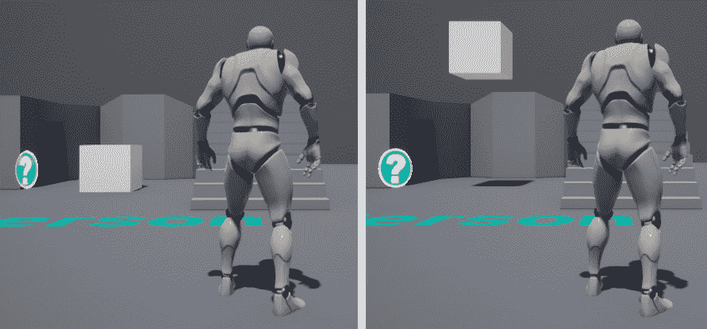

图 1.51:测试器垂直推进

完成这些步骤后，我们就结束了这个活动——这是本书的第一个活动。我们现在已经整合了在蓝图编辑器的`Event Graph`窗口中添加和移除节点，并使用`Tick`事件及其`DeltaSeconds`属性来创建游戏逻辑，以保持不同帧速率下的一致性。

注意

这个活动的解决方案可以在:[https://packt.live/338jEBx](https://packt.live/338jEBx)找到。

`TestActor`蓝图资产可以在这里找到:[https://packt.live/2U8pAVZ](https://packt.live/2U8pAVZ)。

# 总结

通过完成这一章，您已经通过学习虚幻引擎 4 迈出了游戏开发旅程的第一步。现在，您已经知道如何在虚幻引擎编辑器中导航，如何操作关卡中的角色，如何创建自己的角色，如何使用蓝图脚本语言，以及如何在虚幻引擎 4 中表示 3D 对象。

希望你能意识到前方有一个充满可能性的世界，天空是你使用这个游戏开发工具所能创造的东西的极限。

在下一章中，您将重新创建本章中从头开始自动生成的项目模板。您将学习如何创建自己的 C++ 类，然后创建可以操作其父类中声明的属性的蓝图类，以及如何将角色网格和动画导入虚幻引擎 4，并熟悉其他动画相关资产，如*动画蓝图*。******