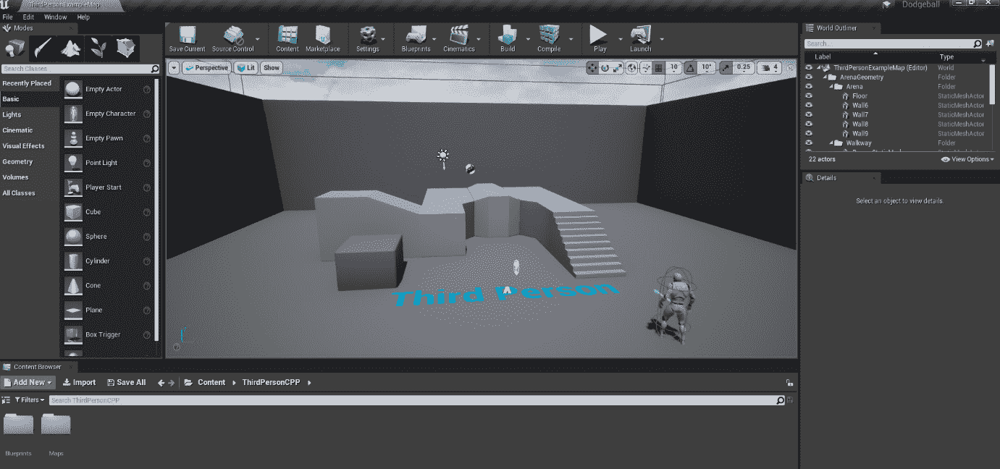
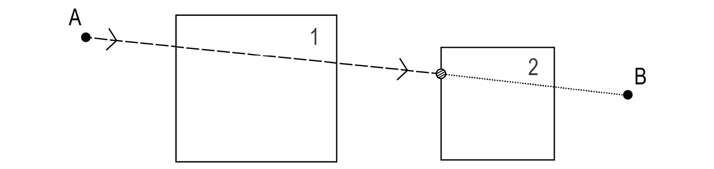
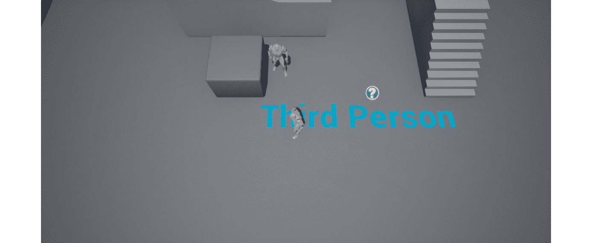
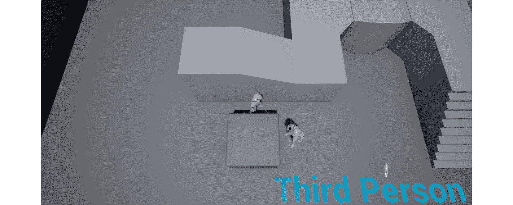
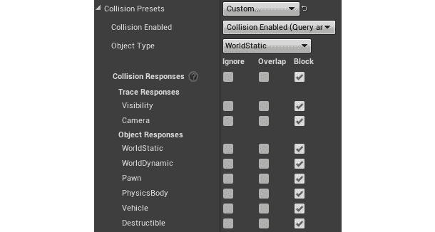
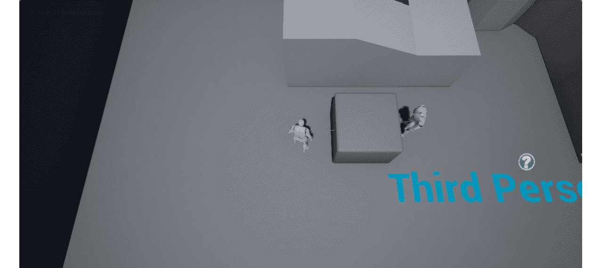
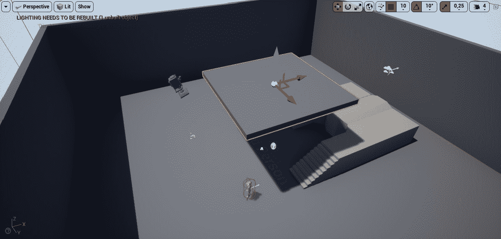

# 五、线条痕迹

概述

本章将是一个名为躲避球的新游戏项目的开始，我们将从头开始创建一个基于碰撞概念的力学游戏。在本章中，您将修改第三人称模板项目，使其具有自上而下的视角。然后，将向您介绍线条痕迹，这是游戏开发中的一个关键概念，并了解它们的潜力和用例。

到本章结束时，您将能够通过执行不同类型的线条追踪来使用 UE4 的内置线条追踪功能(在其他游戏开发工具中也称为光线投射或光线追踪)；创建您自己的跟踪通道；以及修改对象对每个跟踪通道的响应。

# 简介

在前面的章节中，我们学习了如何重现虚幻引擎团队提供给我们的第三人称模板项目，以便理解 UE4 工作流程和框架的一些基本概念。

在本章中，您将从头开始创建另一个游戏。在这个游戏中，玩家将从自上而下的角度控制一个角色(*类似于金属齿轮固体 1、2、3 等游戏*)。自上而下的视角意味着玩家控制一个角色，看起来就像被人看不起一样，通常摄像机的旋转是固定的(摄像机不旋转)。在我们的游戏中，玩家角色必须从 A 点到 B 点，而不会被遍布整个关卡的敌人扔向玩家的躲避球击中。这个游戏中的关卡本质上将是迷宫一样的，玩家将有多条路径可供选择，所有这些路径都将有敌人试图向玩家投掷躲避球。

我们将在本章中讨论的具体主题是线跟踪(单个和多个)、扫描跟踪、跟踪通道和跟踪响应。第一节，我们先来了解一下*碰撞*在电竞世界里是什么。

# 碰撞

碰撞基本上是两个物体相互接触的点(例如，两个物体碰撞，一个物体撞到一个角色，一个角色走进一堵墙，等等)。大多数游戏开发工具都有自己的一套功能，允许碰撞和物理存在于游戏中。这组特征被称为**物理引擎**，负责与碰撞相关的一切。它负责执行线轨迹，检查两个对象是否相互重叠，阻止彼此的移动，从墙上反弹等等。当我们要求游戏执行或通知我们这些碰撞事件时，游戏本质上是要求物理引擎执行它，然后向我们显示这些碰撞事件的结果。

在你将要构建的`Dodgeball`游戏中，需要考虑碰撞的例子包括检查敌人是否能够看到玩家(这将使用本章中介绍的线条追踪来实现)，在一个行为类似躲避球的物体上模拟物理，检查是否有任何东西阻挡玩家角色的移动，等等。

碰撞是大多数游戏最重要的方面之一，因此理解它对于开始游戏开发至关重要。

在我们开始构建基于碰撞的特性之前，我们首先需要建立新的`Dodgeball`项目，以便支持我们将要实现的游戏机制。这个过程从下一节描述的步骤开始:*项目设置*。

# 项目设置

让我们从创建我们的虚幻引擎项目开始这一章:

1.  `Launch` UE4。选择`Games`项目类别，然后按`Next`。
2.  选择`Third Person template`，然后按`Next`。
3.  确保第一个选项设置为`C++ `而不是`Blueprint`。
4.  Select the location of the project according to your preference and name your project `Dodgeball`, then press `Create Project`.

    生成项目后，您应该会在屏幕上看到以下内容:

    

    图 5.1:躲避球项目加载完毕

5.  代码生成完成，项目打开后，关闭 UE4 编辑器，在 Visual Studio 中打开生成的第三人称角色类`DodgeballCharacter`的文件，如下图所示:


图 5.2:在 Visual studio 中生成的文件

如前所述，您的项目将具有自上而下的视角。鉴于我们是从第三人称模板开始这个项目的，在我们把它变成一个自上而下的游戏之前，我们必须改变一些事情。这将主要涉及更改现有字符类中的一些代码行。

## 练习 5.01:将躲避球角色转换为自上而下的视角

在本练习中，您将对生成的`DodgeballCharacter`类进行必要的更改。请记住，它目前采用第三人称视角，角色的旋转由玩家的输入决定(*即鼠标或右模拟杆*)。

在本练习中，您将把它改为自上而下的视角，无论玩家如何输入，视角都保持不变，相机总是从上方跟随角色。

以下步骤将帮助您完成本练习:

1.  前往`DodgeballCharacter`类的构造函数，更新`CameraBoom`属性，如以下步骤所述。
2.  将`CameraBoom`的属性`TargetArmLength`改为`900.0f`，以增加摄像头与玩家之间的距离:

    ```cpp
    // The camera follows at this distance behind the character
    CameraBoom->TargetArmLength = 900.0f;
    ```

3.  接下来，使用`SetRelativeRotation`功能，添加一条将相对音高设置为`-70`的线，这样摄像机就可以俯视玩家了。`FRotator`建造商的参数分别是*俯仰*、*偏航*和*滚转*:

    ```cpp
    //The camera looks down at the player
    CameraBoom->SetRelativeRotation(FRotator(-70.f, 0.f, 0.f));
    ```

4.  将`bUsePawnControlRotation`更改为`false`，这样相机的旋转就不会被玩家的移动输入所改变:

    ```cpp
    // Don't rotate the arm based on the controller
    CameraBoom->bUsePawnControlRotation = false;
    ```

5.  Add a line that sets `bInheritPitch`, `bInheritYaw`, and `bInheritRoll` to `false`, so that the camera's rotation isn't changed by the character's orientation:

    ```cpp
    // Ignore pawn's pitch, yaw and roll
    CameraBoom->bInheritPitch = false;
    CameraBoom->bInheritYaw = false;
    CameraBoom->bInheritRoll = false;
    ```

    在我们做了这些修改之后，我们将移除角色的跳跃能力(我们不希望玩家那么容易从躲避球中逃脱)，并从玩家的旋转输入中旋转相机。

6.  转到`DodgeballCharacter's`源文件中的`SetupPlayerInputComponent`功能，删除以下代码行，以删除跳转能力:

    ```cpp
    // REMOVE THESE LINES
    PlayerInputComponent->BindAction("Jump", IE_Pressed, this,   &ACharacter::Jump);
    PlayerInputComponent->BindAction("Jump", IE_Released, this,   Acharacter::StopJumping);
    ```

7.  Next, add the following lines in order to remove the player's rotation input:

    ```cpp
    // REMOVE THESE LINES
    PlayerInputComponent->BindAxis("Turn", this,   &APawn::AddControllerYawInput);
    PlayerInputComponent->BindAxis("TurnRate", this,   &ADodgeballCharacter::TurnAtRate);
    PlayerInputComponent->BindAxis("LookUp", this,   &APawn::AddControllerPitchInput);
    PlayerInputComponent->BindAxis("LookUpRate", this,   &ADodgeballCharacter::LookUpAtRate);
    ```

    这个步骤是可选的，但是为了保持代码干净，您应该删除`TurnAtRate`和`LookUpAtRate`函数的声明和实现。

8.  最后，完成这些更改后，从 Visual Studio 运行项目。
9.  When the editor has loaded, play the level. The camera's perspective should look like this and should not rotate based on the player's input or the character's rotation:

    

图 5.3:将相机旋转锁定到自上而下的视角

这就是本章的第一个练习，也是你新项目`Dodgeball`的第一步。

接下来，您将创建`EnemyCharacter`类。当玩家在视野中时，这个角色将是向玩家投掷躲避球的敌人。但这里出现的问题是:敌人怎么知道它能不能看到玩家角色？

这将通过**线迹**(也称为**光线投射**或**光线追踪**的力量来实现，您将在下一节中看到。

# 线条痕迹

任何游戏开发工具最重要的特性之一是它能够执行线条追踪。这些可通过该工具使用的物理引擎获得。

线迹是一种让游戏告诉你在游戏世界中两点之间是否有任何东西的方式。游戏将在你指定的这两个点之间*发射一条射线*，并返回被击中的物体(如果有的话)、它们被击中的位置、角度等等。

在下图中，您可以看到线轨迹的表示，其中我们假设对象`1`被忽略，而对象`2`被检测到，这是由于它们的轨迹通道属性(在以下段落中进一步解释):



图 5.4:从点 A 到点 B 执行的线跟踪

在*图 5.4* 中:

*   虚线表示击中对象之前的线迹。
*   箭头表示线迹的方向。
*   虚线表示击中对象后的线条轨迹。
*   带条纹的圆圈代表线条痕迹的撞击点。
*   大方块表示在线迹路径中的两个对象(对象`1`和`2`)。

我们注意到只有物体`2`被线迹击中，没有物体`1`，虽然它也在线迹的路径上。这是由于对对象`1`的跟踪通道属性所做的假设，这将在本章后面讨论。

线迹用于许多游戏功能，例如:

*   检查武器开火时是否击中目标
*   突出显示玩家可以在角色观看时与之交互的项目
*   当玩家角色绕过拐角时，自动旋转相机

线迹的一个常见且重要的特征是**迹线通道**。执行行跟踪时，您可能希望只检查特定类型的对象，这就是跟踪通道的用途。它们允许您指定在执行行跟踪时要使用的过滤器，以便它不会被不需要的对象阻塞。例如:

*   您可能只想执行行跟踪来检查可见的对象。这些物体会阻塞`Visibility`追踪通道。例如，不可见的墙，也就是游戏中用来阻挡玩家移动的不可见的几何图形，将不可见，因此不会阻挡`Visibility`追踪通道。
*   您可能只想执行行跟踪来检查可以交互的对象。这些物体会阻塞`Interaction`追踪通道。
*   你可能只想执行一个线追踪来检查可以在游戏世界中移动的棋子。这些物体会阻塞`Pawn`追踪通道。

您可以指定不同对象对不同跟踪通道的反应，以便只有一些对象阻止特定的跟踪通道，而其他对象忽略它们。在我们的例子中，我们想知道敌人和玩家角色之间是否有任何东西，这样我们就知道敌人是否能看到玩家。为此，我们将使用线追踪，通过使用`Tick`事件检查任何阻挡敌人视线到玩家角色的东西。

在下一节中，我们将使用 C++ 创建`EnemyCharacter`类。

# 创建 EnemyCharacter C++ 类

在我们的`Dodgeball`游戏中，`EnemyCharacter`类将不断地观察玩家角色，如果他们在视野之内的话。这就是后来会向玩家投掷躲避球的同一个职业；然而，我们将把它留到下一章。在这一章中，我们将集中讨论允许我们的敌人角色看玩家的逻辑。

那么，让我们开始吧:

1.  右键点击编辑器内的`Content Browser`，选择`New C++ Class`。
2.  选择`Character`类作为父类。
3.  命名新类`EnemyCharacter`。

在 Visual Studio 中创建了类并打开了它的文件之后，让我们在它的`header`文件中添加`LookAtActor`函数声明。这个函数应该是`public`，不返回任何东西，只接收`AActor* TargetActor`参数，这将是它应该面对的演员。看看下面的代码片段，它显示了这个函数:

```cpp
// Change the rotation of the character to face the given actor
void LookAtActor(AActor* TargetActor);
```

注意

即使我们只希望敌人看玩家的角色，为了执行好的软件开发实践，我们将把这个函数再抽象一点，允许`EnemyCharacter`看任何一个 Actor，因为允许一个 Actor 看另一个 Actor 或者看玩家角色的逻辑是完全一样的。

请记住，您不应该在编写代码时创建不必要的限制。如果你可以写类似的代码，同时允许更多的可能性，你应该这样做，如果这不会使你的程序逻辑过于复杂的话。

继续往前走，如果`EnemyCharacter`看不到`Target` `Actor`，就不应该在看。为了检查敌人是否能看到演员，应该看一下`LookAtActor`函数，它将调用另一个函数，`CanSeeActor`函数。这是你在下一个练习中要做的。

## 练习 5.02:创建执行行跟踪的 CanSeeActor 函数

在本练习中，我们将创建`CanSeeActor`功能，该功能将返回敌方角色是否能看到给定的演员。

以下步骤将帮助您完成本练习:

1.  Create the declaration for the `CanSeeActor` function in the header file of the `EnemyCharacter` class, which will return a `bool` and receive a `const Actor* TargetActor` parameter, which is the Actor we want to look at. This function will be a `const` function, because it doesn't change any of the class's attributes, and the parameter will also be `const` because we won't need to modify any of its properties; we'll only need to access them:

    ```cpp
    // Can we see the given actor
    bool CanSeeActor(const AActor* TargetActor) const;
    ```

    现在，让我们进入有趣的部分，即执行行跟踪。

    为了调用与线路追踪相关的函数，我们必须用`GetWorld`函数获取敌人的当前世界。但是，我们没有在这个文件中包含`World`类，所以让我们在下面的步骤中这样做:

    注意

    任何参与者都可以访问`GetWorld`功能，该功能将返回参与者所属的`World`对象。请记住，为了执行线跟踪，世界是必要的。

2.  Open the `EnemyCharacter` source file and find the following code line:

    ```cpp
    #include "EnemyCharacter.h"
    ```

    在前一行代码之后添加以下一行:

    ```cpp
    #include "Engine/World.h"
    ```

3.  Next, create the implementation of the `CanSeeActor` function in the `EnemyCharacter` source file, where you'll start by checking whether our `TargetActor` is a `nullptr`. If it is, we return `false`, given that we have no valid Actor to check our sight to:

    ```cpp
    bool AEnemyCharacter::CanSeeActor(const AActor * TargetActor)   const
    {
      if (TargetActor == nullptr)
      {
        return false;
      }
    }
    ```

    接下来，在添加我们的 Line Trace 函数调用之前，我们需要设置一些必要的参数；我们将在以下步骤中实现这些。

4.  After the previous `if` statement, create a variable to store all the necessary data relative to the results of the Line Trace. Unreal already has a built-in type for this called the `FHitResult` type:

    ```cpp
    // Store the results of the Line Trace
    FHitResult Hit;
    ```

    这是我们将发送给我们的行跟踪函数的变量，它将用执行的行跟踪的相关信息填充它。

5.  为我们的线迹的`Start`和`End`位置创建两个`FVector`变量，并将它们分别设置为我们敌人的当前位置和我们目标的当前位置:

    ```cpp
    // Where the Line Trace starts and ends
    FVector Start = GetActorLocation();
    FVector End = TargetActor->GetActorLocation();
    ```

6.  Next, set the Trace Channel we wish to compare against. In our case, we want to have a `Visibility` Trace Channel specifically designated to indicate whether an object blocks another object's view. Luckily for us, such a Trace Channel already exists in UE4, as shown in the following code snippet:

    ```cpp
    // The trace channel we want to compare against
    ECollisionChannel Channel = ECollisionChannel::ECC_Visibility;
    ```

    `ECollisionChannel` `enum`代表所有可用于比较的可能跟踪通道。我们将使用代表`Visibility`跟踪通道的`ECC_Visibility`值。

7.  Now that we've set up all our necessary parameters, we can finally call the `LineTrace` function, `LineTraceSingleByChannel`:

    ```cpp
    // Execute the Line Trace
    GetWorld()->LineTraceSingleByChannel(Hit, Start, End,   Channel);
    ```

    这个函数会考虑我们发送给它的参数，执行 Line Trace，并通过修改我们的`Hit`变量返回它的结果。

    在我们继续之前，还有几件事我们需要考虑。

    如果线迹从我们的敌人角色内部开始，这就是我们的情况，这意味着线迹很可能会直接击中我们的敌人角色，并就此停止，因为我们的角色可能会阻挡`Visibility`跟踪通道。为了解决这个问题，我们需要告诉行跟踪忽略它。

8.  使用内置的`FCollisionQueryParams`类型，它允许我们给我们的线轨迹更多的选择:

    ```cpp
    FCollisionQueryParams QueryParams;
    ```

9.  Now, update the `Line Trace` to ignore our enemy, by adding itself to the list of Actors to ignore:

    ```cpp
    // Ignore the actor that's executing this Line Trace
    QueryParams.AddIgnoredActor(this);
    ```

    我们还应该将我们的目标添加到我们要忽略的演员列表中，因为我们不想知道它是否会阻塞`EnemySight`频道；我们只是想知道敌人和玩家角色之间的某些东西是否会阻塞那个通道。

10.  将目标参与者添加到要忽略的参与者列表中，如以下代码片段所示:

    ```cpp
    // Ignore the target we're checking for
    QueryParams.AddIgnoredActor(TargetActor);
    ```

11.  接下来，将我们的`FCollisionQueryParams`作为`LineTraceSingleByChannel`函数的最后一个参数添加到线路轨迹中:

    ```cpp
    // Execute the Line Trace
    GetWorld()->LineTraceSingleByChannel(Hit, Start, End, Channel,   QueryParams);
    ```

12.  Finalize our `CanSeeActor` function, by returning whether the Line Trace hits anything or not. We can do that by accessing our `Hit` variable and checking whether there was a blocking hit, using the `bBlockingHit` property. If there was, that means we can't see our `TargetActor`. This can be achieved with the following code snippet:

    ```cpp
    return !Hit.bBlockingHit;
    ```

    注意

    虽然我们不需要从`Hit`结果中获得更多信息，但是除了是否有阻塞命中之外，`Hit`变量可以为我们提供更多关于线轨迹的信息，例如:

    通过访问`Hit.GetActor()`功能，获得被线轨迹击中的演员的信息(如果没有击中演员，则为`nullptr`)

    通过访问`Hit.GetComponent()`功能，关于被线跟踪命中的执行元组件的信息(如果没有执行元组件被命中，则为`nullptr`)

    通过访问`Hit.Location`变量获得命中位置的信息

    命中的距离可以通过访问`Hit.Distance`变量找到

    线迹击中物体的角度，可以通过访问`Hit.ImpactNormal`变量找到

最后，我们的`CanSeeActor`功能完成了。我们现在知道如何执行线跟踪，我们可以用它来分析敌人的逻辑。

通过完成本练习，我们已经完成了`CanSeeActor`功能；我们现在可以回到`LookAtActor`功能。然而，有一些东西我们应该首先看:可视化我们的线轨迹。

# 可视化线条轨迹

当创建利用行跟踪的新逻辑时，在执行行跟踪时实际可视化它是非常有用的，这是行跟踪函数不允许您做的事情。为了做到这一点，我们必须使用一组助手调试函数，这些函数可以在运行时动态绘制对象，如线、立方体、球体等。

然后让我们添加一个我们的线轨迹可视化。为了使用调试功能，我们必须做的第一件事是在最后一行`include`下面添加以下`include`:

```cpp
#include "DrawDebugHelpers.h"
```

我们将希望调用`DrawDebugLine`函数来可视化线迹，这需要以下输入，非常类似于线迹函数接收的输入:

1.  电流`World`，我们将提供`GetWorld`功能
2.  线的`Start`和`End`点，与`LineTraceSingleByChannel`功能相同
3.  游戏中需要的线条颜色，可以设置为`Red`

然后，我们可以在我们的 Line Trace 函数调用下面添加`DrawDebugLine`函数调用，如下面的代码片段所示:

```cpp
// Execute the Line Trace
GetWorld()->LineTraceSingleByChannel(Hit, Start, End, Channel,   QueryParams);
// Show the Line Trace inside the game
DrawDebugLine(GetWorld(), Start, End, FColor::Red);
```

这将允许您在执行时可视化行跟踪，这非常有用。

注意

如果您觉得有必要，还可以指定更多的可视化线条跟踪属性，例如其寿命和厚度。

有许多`DrawDebug`功能可以用来绘制立方体、球体、圆锥体、甜甜圈，甚至自定义网格。

既然我们可以执行和可视化我们的线轨迹，让我们在`LookAtActor`函数中使用我们在上一个练习中创建的`CanSeeActor`函数。

## 练习 5.03:创建 LookAtActor 函数

在本练习中，我们将创建我们的`LookAtActor`函数的定义，这将改变敌人的旋转，使其面对给定的演员。

以下步骤将帮助您完成练习:

1.  在`EnemyCharacter`源文件中创建`LookAtActor`函数定义。
2.  首先检查我们的`TargetActor`是否是`nullptr`，如果是(因为无效)，则立即不返回任何内容，如下面的代码片段所示:

    ```cpp
    void AEnemyCharacter::LookAtActor(AActor * TargetActor)
    {
      if (TargetActor == nullptr)
      {
        return;
      }
    }
    ```

3.  Next, we want to check whether we can see our Target Actor, using our `CanSeeActor` function:

    ```cpp
    if (CanSeeActor(TargetActor))
    {
    }
    ```

    如果这个`if`的说法是真的，那就意味着我们可以看到 Actor，我们将设置我们的旋转方式，让我们面对那个 Actor。幸运的是，UE4 中已经有一个功能允许我们这样做:功能`FindLookAtRotation`。该功能将接收高程中的两点作为输入，即点 A(T2 点)和点 B(T3 点)，并返回起点处的对象必须进行的旋转，以便面向终点处的对象。

4.  为了使用该功能，包括`KismetMathLibrary`，如下面的代码片段所示:

    ```cpp
    #include "Kismet/KismetMathLibrary.h"
    ```

5.  `FindLookAtRotation`功能必须接收一个`Start`和`End`点，分别是我们敌人的位置和我们目标演员的位置:

    ```cpp
    FVector Start = GetActorLocation();
    FVector End = TargetActor->GetActorLocation();
    // Calculate the necessary rotation for the Start point to   face the End point
    FRotator LookAtRotation =   UKismetMathLibrary::FindLookAtRotation(Start, End);
    ```

6.  Finally, set your enemy character's rotation to the same value as our `LookAtRotation`:

    ```cpp
    //Set the enemy's rotation to that rotation
    SetActorRotation(LookAtRotation);
    ```

    `LookAtActor`功能到此为止。

    现在最后一步是在 Tick 事件内部调用`LookAtActor`函数，将玩家角色作为`TargetActor`发送，也就是我们要看的 Actor。

7.  要获取玩家当前控制的角色，我们可以使用`GameplayStatics`对象。和其他 UE4 对象一样，我们必须首先包含它们:

    ```cpp
    #include "Kismet/GameplayStatics.h"
    ```

8.  Next, head to your Tick function's body and call the `GetPlayerCharacter` function from `GameplayStatics`:

    ```cpp
    // Fetch the character currently being controlled by the   player
    ACharacter* PlayerCharacter =   UGameplayStatics::GetPlayerCharacter(this, 0);
    ```

    该功能接收以下输入:

    *   世界上下文对象，本质上是属于我们当前世界的对象，用于让函数知道要访问哪个世界对象。这个世界上下文对象可以简单地是`this`指针。
    *   玩家指数，假设我们的游戏是单人游戏，我们可以安全地假设是`0`(第一个玩家)。
9.  接下来，调用`LookAtActor`函数，发送我们刚刚获取的玩家角色:

    ```cpp
    // Look at the player character every frame
    LookAtActor(PlayerCharacter);
    ```

10.  本练习的最后一步是在 Visual Studio 中编译您的更改。

现在你已经完成了这个练习，你的`EnemyCharacter`类已经具备了面对玩家角色的所有必要逻辑，如果在视野范围内，我们可以开始创建`EnemyCharacter`蓝图类了。

# 创建敌人角色蓝图类

既然我们已经完成了我们的`EnemyCharacter` C++ 类的逻辑，我们必须创建我们的蓝图类，它派生自:

1.  在编辑器中打开我们的项目。
2.  转到`Content Browser`中`ThirdPersonCPP`文件夹内的`Blueprints`文件夹。
3.  *右键点击*，选择新建蓝图类的选项。
4.  展开`Pick Parent Class`窗口底部附近的`All Classes`选项卡，搜索我们的`EnemyCharacter` C++ 类，并选择它作为父类。
5.  命名蓝图类`BP_EnemyCharacter`。
6.  打开蓝图类，从`Components`选项卡中选择`SkeletalMeshComponent`(称为`Mesh`)，将其`Skeletal Mesh`属性设置为`SK_Mannequin`，其`Anim Class`属性设置为`ThirdPerson_AnimBP`。
7.  将`SkeletalMeshComponent`的*偏航*改变为`-90º`(在 *z 轴*上)并将其在 *z 轴*上的位置改变为`-83`单位。
8.  在你设置好蓝图类之后，它的网格设置应该和我们的`DodgeballCharacter`蓝图类非常相似。
9.  Drag an instance of the `BP_EnemyCharacter` class to your level, in a location near an object that can block its line of sight, such as this location (the selected character is `EnemyCharacter`):

    

    图 5.5:将 BP _ EnemyCharacter 类拖动到级别中

10.  Now we can finally play the game and verify that our enemy does look at our player character whenever it's within view:

    

    图 5.6:使用线条追踪清晰观察玩家的敌方角色

11.  我们还可以看到，只要不在视野范围内，敌人就会停止看到玩家，如图*图 5.7* :



图 5.7:敌人看不见玩家

这就是我们的逻辑。在下一节中，我们将研究扫掠轨迹。

# 扫掠痕迹

在我们继续我们的项目之前，了解线条轨迹的一个变体很重要，它是**扫掠轨迹**。虽然我们不会在我们的项目中使用它们，但是了解它们以及如何使用它们是很重要的。

线迹基本上*在两点之间发射光线*，而扫迹将模拟*在直线上两点之间投掷物体*。被*投掷的物体*是模拟的(游戏中实际不存在)，可以有各种形状。在扫掠轨迹中，`Hit`位置将是虚拟对象(我们称之为**形状**)撞击另一个对象的第一个点，如果它是从起点抛向终点的话。扫掠轨迹的形状可以是长方体、球体或胶囊。

这是从点`A`到点`B`的扫掠轨迹的表示，其中我们假设对象`1`由于其轨迹通道属性而被忽略，使用一个盒子形状:


图 5.8:扫描轨迹的表示

从*图 5.8* 中，我们注意到以下情况:

*   从 A 点到 b 点执行的扫描轨迹，使用盒形
*   虚线框表示扫描轨迹在碰到对象之前的情况。
*   虚线框表示击中对象后的扫掠轨迹。
*   条纹圆表示扫掠轨迹与对象`2`的碰撞点，这是扫掠轨迹框形状的表面与对象`2`的表面相互碰撞的点。
*   大方块表示线扫轨迹路径中的两个对象(对象`1`和`2`)。
*   由于基于其跟踪通道属性的假设，对象`1`在扫描跟踪中被忽略。

在某些情况下，扫描轨迹比常规的线轨迹更有用。让我们以我们的敌人角色为例，他会扔躲避球。如果我们想为玩家添加一种方法，让玩家不断地想象敌人扔出的下一个躲避球会落在哪里，那可以通过扫掠追踪来更好地实现:我们会用我们的躲避球的形状(一个球体)朝着我们的玩家进行扫掠追踪，检查撞击点，并在那个撞击点上显示一个球体，玩家可以看到这个球体。如果“横扫追踪”击中某处的墙壁或角落，玩家会知道，如果敌人在那一刻投掷躲避球，那就是它首先击中的地方。出于同样的目的，您可以使用简单的线跟踪，但是设置必须相当复杂才能获得相同质量的结果，这就是为什么在这种情况下扫掠跟踪是更好的解决方案。

现在让我们快速了解一下如何在代码中进行扫描跟踪。

## 练习 5.04:执行扫描轨迹

在本练习中，我们将在代码中实现扫描跟踪。虽然我们不会在我们的项目中使用它，但是通过执行这个练习，您将会熟悉这样的操作。

转至前几节中创建的`CanSeeActor`功能的末尾，并按照以下步骤操作:

1.  The function responsible for the Sweep Trace is `SweepSingleByChannel`, which is available within UE4 and requires the following parameters as inputs:

    一个`FHitResult`类型，用来存储扫描的结果(我们已经有一个这样的类型，所以没有必要再创建一个这样的类型的变量):

    ```cpp
    // Store the results of the Line Trace
    FHitResult Hit;
    ```

    `Start`和`End`点的扫描(我们已经有了这两个，所以没有必要创建另一个这种类型的变量):

    ```cpp
    // Where the Sweep Trace starts and ends
    FVector Start = GetActorLocation();
    FVector End = TargetActor->GetActorLocation();
    ```

2.  使用形状的预期旋转，其形式为`FQuat`类型(表示四元数)。在这种情况下，通过访问`FQuat``Identity`属性:

    ```cpp
    // Rotation of the shape used in the Sweep Trace
    FQuat Rotation = FQuat::Identity; 
    ```

    ，它在所有轴上都被设置为`0`旋转
3.  现在，使用预期的跟踪通道对其进行比较(我们已经有了其中的一个，所以没有必要创建另一个这种类型的变量):

    ```cpp
    // The trace channel we want to compare against
    ECollisionChannel Channel = ECollisionChannel::ECC_Visibility;
    ```

4.  最后，通过调用`FcollisionShape` `MakeBox`函数并为其提供我们想要的长方体形状的半径(在所有三个轴上)，使用长方体形状进行扫掠追踪。这显示在下面的代码片段中:

    ```cpp
    // Shape of the object used in the Sweep Trace
    FCollisionShape Shape = FCollisionShape::MakeBox(FVector(20.f,   20.f, 20.f));
    ```

5.  接下来，调用`SweepSingleByChannel`函数:

    ```cpp
    GetWorld()->SweepSingleByChannel(Hit,
                                     Start,
                                     End,
                                     Rotation,
                                     Channel,
                                     Shape);
    ```

完成这些步骤后，我们就完成了“扫掠轨迹”练习。考虑到我们不会在我们的项目中使用扫描轨迹，您应该注释掉`SweepSingleByChannel`函数，这样我们的`Hit`变量就不会被修改并丢失我们的线轨迹的结果。

现在我们已经完成了“扫掠轨迹”部分，让我们回到我们的`Dodgeball`项目，学习如何更改对象对轨迹通道的响应。

## 改变能见度轨迹响应

在我们当前的设置中，每个可见的对象都会阻挡`Visibility`追踪通道；然而，如果我们想改变一个对象是否完全阻塞了那个通道呢？为了做到这一点，我们必须改变组件对该通道的响应。请看下面的例子:

1.  We select the cube that we've been using to block the enemy's sight in our level as shown in *Figure 5.9*:

    

    图 5.9:角色的默认版本

2.  Then, you go to the `Collision` section of this object's `Details Panel` (its default place in the `Editor`'s interface):

    

    图 5.10:虚幻中细节面板的碰撞标签

3.  在这里，你会发现几个与碰撞相关的选项。我们现在要关注的是`CollisionPresets`选项。其电流值为`Default`；但是，我们想根据自己的喜好进行更改，所以我们会点击下拉框，将其值更改为`Custom`。
4.  Once you do this, you'll notice a whole group of new options pops up:

    

    图 5.11:碰撞预设设置为自定义

    这组选项允许您指定该对象如何响应线轨迹和对象碰撞，以及碰撞对象的类型。

    你应该注意的选项是`Visibility`。你会注意到它被设置为`Block`，但是你也可以设置为`Overlap`和`Ignore`。

    此时，立方体正在阻挡`Visibility`追踪通道，这就是为什么我们的敌人在这个立方体后面看不到角色的原因。但是，如果我们将对象对`Visibility`跟踪通道的响应更改为`Overlap`或`Ignore`，对象将不再阻止检查可见性的行跟踪(这是您刚刚用 C++ 编写的行跟踪的情况)。

5.  Let's change the cube's response to the `Visibility` channel to `Ignore`, and then play the game. You'll notice that the enemy is still looking toward the player character, even when it's behind the cube:

    

    图 5.12:敌人角色透过一个物体看着玩家

    这是因为立方体不再阻挡`Visibility`追踪通道，所以敌人正在执行的线追踪在试图到达玩家角色时不再命中任何东西。

    现在，我们已经了解了如何更改对象对特定跟踪通道的响应，让我们将立方体对`Visibility`通道的响应更改回`Block`。

    然而，有一件事值得一提:如果我们将立方体对`Visibility`通道的响应设置为`Overlap`，而不是`Ignore`，结果将是一样的。但是为什么会这样，有这两种反应的目的是什么？为了解释这一点，我们将看看多线轨迹。

    ## 多线轨迹

    在使用*练习 5.02* 、*中的`CanSeeActor`函数创建执行线迹*的 CanSeeActor 函数时，您可能会对我们使用的线迹函数的名称`LineTraceSingleByChannel`感到疑惑，特别是它为什么使用单词 *Single* 。原因是因为你也可以处决`LineTraceMultiByChannel`。

    但是这两条线迹有什么不同呢？

    虽然单线跟踪将在它击中一个对象后停止检查阻挡它的对象，并告诉我们那是它击中的对象，但是多线跟踪可以检查被同一线跟踪击中的任何对象。

    单线跟踪将:

    *   忽略线跟踪正在使用的跟踪通道上响应设置为`Ignore`或`Overlap`的对象
    *   当它发现一个其响应设置为`Block`的对象时停止

但是，多线追踪不会忽略其响应设置为`Overlap`的对象，而是将它们作为在线追踪期间找到的对象添加，并且仅当它找到阻挡所需追踪通道的对象时(*或当它到达终点*时停止。在下图中，您将看到正在执行的多行跟踪的图示:


图 5.13:从 A 点到 B 点执行的多线跟踪

在*图 5.13* 中，我们注意到以下情况:

*   虚线表示在遇到阻挡它的对象之前的线轨迹。
*   虚线表示线迹碰到阻挡它的对象后的线迹。
*   条纹圆圈代表线条追踪的冲击点，在这种情况下，只有最后一个是阻挡命中。

就输入而言，`LineTraceSingleByChannel`和`LineTraceMultiByChannel`功能之间的唯一区别是后者必须接收一个`TArray<FHitResult>`输入，而不是单个`FHitResult`。所有其他输入都是相同的。

当模拟具有强穿透力的子弹的行为时，多线轨迹非常有用，这些子弹可以在完全停止之前穿过几个对象。请记住，您也可以通过调用`SweepMultiByChannel`功能来执行多扫描轨迹。

注意

关于`LineTraceSingleByChannel`函数，您可能想知道的另一件事是`ByChannel`部分。这种区别与使用跟踪通道有关，与对象类型相反。您可以通过调用`LineTraceSingleByObjectType`函数来执行使用对象类型而不是跟踪通道的线跟踪，该函数也可以从世界对象中获得。对象类型与我们将在下一章讨论的主题相关，所以我们暂时不会详细讨论这个函数。

## 摄像机跟踪通道

当更改我们的立方体对`Visibility`跟踪通道的响应时，您可能已经注意到另一个现成的跟踪通道:`Camera`。

此通道用于指定对象是否阻挡摄像机弹簧臂和与其关联的角色之间的视线。为了在行动中看到这一点，我们可以将一个对象拖到我们的水平，并将其放置在相机和我们的玩家角色之间。

请看下面的例子；我们从复制`floor`物体开始。

注意

您可以通过按住 *Alt* 键并向任意方向拖动*移动工具*的箭头之一，轻松地在关卡中复制对象。



图 5.14:选择楼层对象

1.  Next, we change its `Transform` values as shown in the following figure:

    

    图 5.15:更新转换值

2.  Now when you play your game, you'll notice that when the character goes under our duplicated floor object, you won't lose sight of the player's character, but rather the spring arm will cause the camera to move down until you can see the character:

    

    图 5.16:相机角度的变化

3.  为了了解当物体没有阻挡`Camera`追踪通道时，弹簧臂的行为有何不同，请将我们复制的地板对`Camera`通道的响应更改为`Ignore`，然后再次播放关卡。会发生的是，当我们的角色在复制的地板下时，我们会看不到角色。

完成这些步骤后，您可以看到`Camera`通道用于指定当某个对象与该对象相交时，该对象是否会导致弹簧臂将相机移近播放器。

既然我们知道如何使用现有的跟踪通道，如果我们想创建自己的跟踪通道呢？

## 练习 5.05:创建自定义敌人追踪通道

正如我们之前讨论过的，UE4 有两个现成的跟踪通道:`Visibility`和`Camera`。第一个是通用通道，我们可以使用它来指定哪些对象阻挡了对象的视线，而第二个通道允许我们指定一个对象是否阻挡了相机的弹簧臂和与其关联的角色之间的视线。

但是我们如何创建自己的跟踪通道呢？这就是我们将在本练习中研究的内容。我们将创建一个新的`EnemySight`追踪通道，并使用它来检查敌人是否能看到玩家角色，而不是内置的`Visibility`通道:

1.  按编辑器左上角的`Edit`按钮打开`Project Settings`，进入`Collision`部分。在那里你会找到`Trace Channels`部分。它目前是空的，因为我们还没有创建任何自己的跟踪通道。
2.  选择`New Trace Channel`选项。应该会弹出一个窗口，让您可以选择命名新频道，并根据项目中的对象设置其默认响应。命名我们新的追踪通道`EnemySight`并将其默认响应设置为`Block`，因为我们希望大多数对象都这样做。
3.  After you've created the new Trace Channel, we must go back to our `EnemyCharacter` C++ class and change the trace we're comparing against in our Line Trace:

    ```cpp
    // The trace channel we want to compare against
    ECollisionChannel Channel = ECollisionChannel::ECC_Visibility;
    ```

    鉴于我们不再使用`Visibility`频道，我们必须参考我们的新频道，但我们如何做到这一点？

    在你的项目目录中，你会找到`Config`文件夹。该文件夹包含多个与您的项目相关的`ini`文件，如`DefaultGame.ini`、`DefaultEditor.ini`、`DefaultEngine.ini`等。其中每一个都包含几个将在项目加载时初始化的属性。属性由名称-值对(`property=value`)设置，您可以根据需要更改它们的值。

4.  When we created our `EnemySight` channel, the project's `DefaultEngine.ini` file was updated with our new Trace Channel. Somewhere in that file, you'll find this line:

    ```cpp
    +DefaultChannelResponses=(Channel=ECC_GameTraceChannel1,  DefaultResponse=ECR_Block,bTraceType=True,bStaticObject=False,  Name="EnemySight")
    ```

    注意

    前面的代码行可以在这里高亮显示:[https://packt.live/3eFpz5r](https://packt.live/3eFpz5r)。

    这一行表示有一个名为`EnemySight`的自定义跟踪通道，它的默认响应是 Block，最重要的是，它可以在 C++ 中使用我们之前提到的碰撞`enum``ECollisionChannel`的`ECC_GameTraceChannel1`值。这是我们将在代码中引用的通道:

    ```cpp
    // The trace channel we want to compare against
    ECollisionChannel Channel =   ECollisionChannel::ECC_GameTraceChannel1;
    ```

5.  验证我们的敌人的行为在我们做了所有的改变后保持不变。这意味着敌人必须仍然面对玩家的角色，只要它在所述敌人的视野之内。

通过完成本练习，我们现在知道如何为任何期望的目的制作我们自己的跟踪通道。

回到 ou r 敌方角色，还是有办法可以提升其逻辑的。现在，当我们获取敌人的位置作为线迹的起点时，该点在敌人臀部周围的某个地方，因为这是演员的原点。然而，人们的眼睛通常不在那里，让人形角色从臀部而不是头部看没有多大意义。

所以，让我们改变这一点，让我们的敌人角色检查它是否从眼睛而不是臀部开始看到玩家角色。

## 活动 5.01:创建视觉源属性

在这个活动中，我们将改进敌人的逻辑，以确定它是否应该看玩家。目前，在我们的`BP_EnemyCharacter`蓝图中，正在进行的确定是*从我们角色的臀部周围拍摄*(`0,0,0`)的线迹，我们希望这更有意义一点，所以我们将使线迹从靠近敌人眼睛的某个地方开始。那我们开始吧。

以下步骤将帮助您完成活动:

1.  在我们的`EnemyCharacter` C++ 类中声明一个名为`SightSource`的新`SceneComponent`。请务必使用`VisibleAnywhere`、`BlueprintReadOnly`、`Category = LookAt`和`meta = (AllowPrivateAccess = "true")`标签将其声明为`UPROPERTY`。
2.  使用`CreateDefaultSubobject`功能在`EnemyCharacter`构造器中创建该组件，并将其附加到`RootComponent`上。
3.  将`CanSeeActor`功能中线迹的开始位置改为`SightSource`组件的位置，而不是演员的位置。
4.  打开`BP_EnemyCharacter`蓝图类，将`SightSource`组件的位置更改为敌人头部`(10, 0, 80)`的位置，就像在*创建敌人角色蓝图类*部分中所做的那样，更改为`BP_EnemyCharacter`的`SkeletalMeshComponent`属性。

**提示**:这可以从`Editor Panel`中的`Transform`选项卡中实现，如*图 5.17* 所示。


图 5.17:更新视觉源组件的值

预期产出:


图 5.18:显示从臀部到眼睛的更新线迹的预期输出

注意

这个活动的解决方案可以在:[https://packt.live/338jEBx](https://packt.live/338jEBx)找到。

通过完成本活动，我们已经更新了我们的`EnemyCharacter`的`SightSource`属性。

# 总结

通过完成本章，您已经为您的皮带添加了一个新工具:线迹。您现在知道如何执行线跟踪和扫掠跟踪，包括单个和多个；如何更改对象对特定跟踪通道的响应；以及如何创建自己的跟踪通道。

在接下来的章节中，你会很快意识到这些是游戏开发中必不可少的技能，你会在未来的项目中很好地利用它们。

现在我们知道了如何使用线轨迹，我们已经为下一步做好了准备，这就是对象碰撞。在下一章中，您将学习如何设置对象之间的碰撞，以及如何使用碰撞事件来创建自己的游戏逻辑。你将创建躲避球演员，这将受到实时物理模拟的影响；墙演员，它会阻挡角色的动作和躲避球；以及当玩家接触到游戏时负责结束游戏的演员。