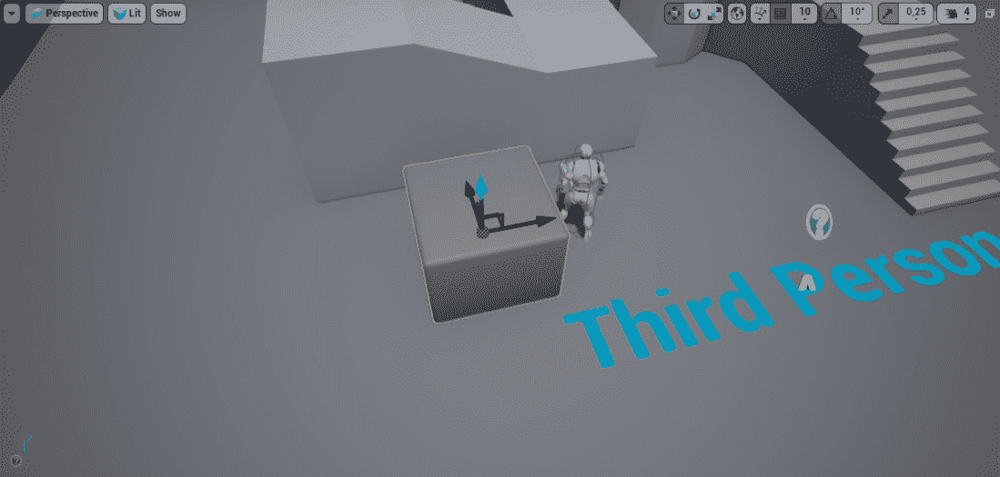
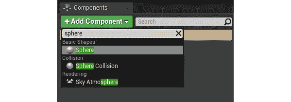
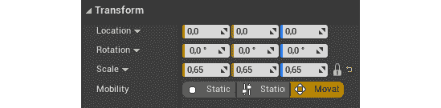
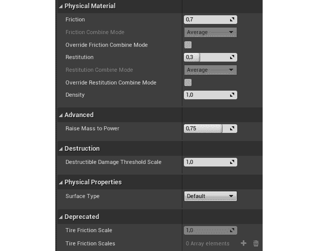
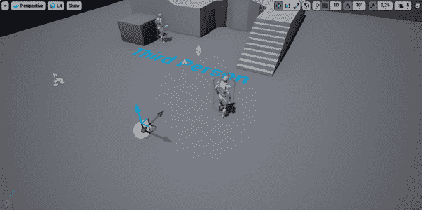
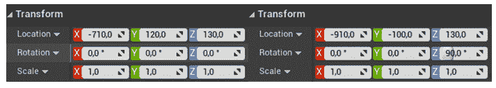
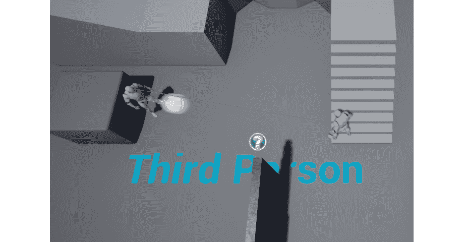

# 六、碰撞物体

概观

在这一章中，我们将通过给我们的游戏添加更多的机制和对象来继续我们在上一章中介绍的基于碰撞的游戏。首先，我们将从上一章开始，介绍对象碰撞。您将学习如何使用碰撞盒、碰撞触发器、重叠事件、碰撞事件和物理模拟。您还将学习如何使用计时器、投射物运动组件和物理材料。

# 简介

在前一章中，我们遇到了碰撞的一些基本概念，即线条痕迹和扫掠痕迹。我们学习了如何执行不同类型的线跟踪，如何创建自己的自定义跟踪通道，以及如何更改对象对特定通道的响应方式。您在上一章中学到的许多东西将在本章中使用，我们将在本章中了解对象碰撞。

在本章中，我们将继续通过添加围绕物体碰撞的游戏机制来建立自上而下的`Dodgeball`游戏。我们将创建**躲避球演员**，它将充当从地板和墙壁上反弹的躲避球；一个**墙演员**，会遮挡所有物体；一个**鬼壁演员**，只会挡住玩家，不会挡住敌人的视线或者躲避球；以及**胜利箱演员**，当玩家进入胜利箱时将结束游戏，代表关卡结束。

在开始创建我们的`Dodgeball`类之前，我们将在下一节复习对象碰撞的基本概念。

# UE4 中的物体碰撞

每个游戏开发工具都必须有一个物理引擎来模拟多个对象之间的碰撞，如前一章所述。碰撞是如今发布的大多数游戏的支柱，无论是 2D 还是 3D。在许多游戏中，这是玩家作用于环境的主要方式，无论是奔跑、跳跃还是射击，环境都会通过让玩家着陆、被击中等方式做出相应的反应。毫不夸张地说，如果没有模拟碰撞，根本不可能制作很多游戏。

因此，让我们从碰撞组件开始，了解物体碰撞在 UE4 中是如何工作的，以及我们可以使用它的方式。

# 碰撞部件

在 UE4 中，有两种类型的组件可以影响和被影响碰撞；它们如下:

*   网状物
*   形状对象

**网格**可以像立方体一样简单，也可以像拥有数万个顶点的高分辨率角色一样复杂。网格的碰撞可以通过在网格旁边导入到 UE4 中的自定义文件来指定(这不在本书的范围内)，也可以由 UE4 自动计算并由您自定义。

通常，保持碰撞网格尽可能简单(几个三角形)是一个好的做法，这样物理引擎可以在运行时有效地计算碰撞。可能发生碰撞的网格类型如下:

*   静态网格
*   骨骼网格
*   程序网格
*   等等

**形状对象**，是以线框模式表示的简单网格，用于通过引起和接收碰撞事件来表现为碰撞对象。

注意

线框模式是游戏开发中常用的可视化模式，通常用于调试目的，它允许您看到没有任何面或纹理的网格–只能通过它们的边看到它们，这些边由它们的顶点连接。当我们向演员添加一个形状组件时，你会看到什么是线框模式。

请注意，形状对象本质上是不可见的网格，它们的三种类型如下:

*   盒子碰撞(C++ 中的盒子组件)
*   球体碰撞(C++ 中的球体组件)
*   Capsule Collider (Capsule Component in C++)

    注意

    有一个类，所有提供几何和碰撞的组件都继承自这个类，这就是`Primitive`组件。该组件是包含任何几何图形的所有组件的基础，网格组件和形状组件就是这种情况。

那么，这些组件如何碰撞，当它们碰撞时会发生什么？我们将在下一节“碰撞事件”中看到这一点。

# 碰撞事件

假设有两个物体相互碰撞。可能会发生两件事:

*   它们相互重叠，就好像另一个对象不在那里，在这种情况下，调用`Overlap`事件。
*   它们相互碰撞并阻止对方继续前进，在这种情况下`Block`事件被称为。

在前一章中，我们学习了如何改变对象对特定`Trace`通道的响应。在这个过程中，我们了解到物体的反应可以是`Block`、`Overlap`或`Ignore`。

现在，让我们看看在碰撞过程中，这些反应会发生什么。

**阻挡**:两个物体只有对另一个物体的反应都设置为`Block`时才会互相阻挡；

*   两个对象的`OnHit`事件都将被调用。每当两个物体在碰撞时挡住彼此的路径时，就会调用此事件。如果其中一个对象正在模拟物理，该对象必须将其`SimulationGeneratesHitEvents`属性设置为`true`。
*   两个物体会物理地阻止彼此继续它们的进程。

请看下图，该图显示了两个对象被抛出并相互弹开的示例:


图 6.1:对象 A 和对象 B 相互阻塞

**重叠**:两个物体如果不相互遮挡，也没有一个物体忽略另一个物体，两个物体就会重叠；

*   如果两个对象的`GenerateOverlapEvents`属性都设置为`true`，那么它们的`OnBeginOverlap`和`OnEndOverlap`事件将被调用。当一个对象开始和停止与另一个对象重叠时，分别调用这些重叠事件。如果其中至少有一个没有将此属性设置为`true`，则它们都不会调用这些事件。
*   这些对象的行为就像另一个对象不存在一样，并且会相互重叠。

举个例子，假设玩家的角色走进一个标志关卡结束的触发框，这个触发框只对玩家的角色做出反应。

请看下图，该图显示了两个对象相互重叠的示例:


图 6.2:对象 A 和对象 B 相互重叠

**忽略**:如果两个对象中至少有一个忽略了另一个，那么这两个对象就会互相忽略:

*   两个对象上都不会调用任何事件。
*   类似于`Overlap`响应，对象会表现得好像另一个对象不存在一样，并且会相互重叠。

两个对象相互忽略的一个例子是，当玩家角色以外的对象进入标志关卡结束的触发框时，触发框只对玩家角色做出反应。

注意

可以看看上图，两个物体相互重叠的地方，了解**忽略**。

下面的表格有助于您理解两个对象必须具有的必要响应，以便触发前面描述的情况:


图 6.3:基于块、重叠和忽略的对象响应结果

根据此表，假设您有两个对象-对象 A 和对象 B:

*   如果对象 A 将其对对象 B 的响应设置为`Block`，而对象 B 将其对对象 A 的响应设置为`Block`，它们将相互`Block`。
*   如果对象 A 将其对对象 B 的响应设置为`Block`，而对象 B 将其对对象 A 的响应设置为`Overlap`，它们将相互`Overlap`。
*   If Object A has set its response to Object B to `Ignore` and Object B has set its response to Object A to `Overlap`, they will `Ignore` each other.

    注意

    你可以在这里找到 UE4 碰撞交互的完整参考资料:[https://docs . unrealengine . com/en-US/Engine/Physics/conflict/Overview](https://docs.unrealengine.com/en-US/Engine/Physics/Collision/Overview)。

物体之间的碰撞有两个方面:

【时间】物理学【时间】T1:所有与物理模拟相关的碰撞，例如球受重力影响而从地板和墙壁上反弹。

游戏内碰撞的物理模拟响应，可以是:

*   两个物体继续它们的轨迹，好像另一个物体不在那里(没有物理碰撞)。
*   两个物体碰撞并改变它们的轨迹，通常其中至少有一个物体继续运动，也就是说，阻挡了彼此的路径。

**查询**:查询可以分为两个方面的碰撞，如下:

*   与游戏调用的对象碰撞相关的事件，您可以使用这些事件来创建附加逻辑。这些事件与我们之前提到的相同:
*   `OnHit`事件
*   `OnBeginOverlap`事件
*   `OnEndOverlap`事件
*   游戏内碰撞的物理反应，可以是:
*   两个物体继续运动，就好像另一个物体不在那里一样(没有物理碰撞)
*   两个物体相互碰撞并阻挡对方的道路

物理方面的物理响应听起来可能类似于查询方面的物理响应；然而，尽管这些都是物理反应，但它们会导致对象行为不同。

“物理”方面的物理响应(物理模拟)仅适用于对象模拟物理时(例如，受重力影响、从墙壁和地面反弹等)。例如，这样的物体，当碰到墙壁时，会反弹回来，继续向另一个方向移动。

另一方面，来自查询方面的物理响应适用于所有不模拟物理的对象。当由代码控制时(例如，通过使用`SetActorLocation`功能或通过使用角色移动组件)，对象可以在不模拟物理的情况下移动。在这种情况下，根据您使用的移动对象及其属性的方法，当对象碰到墙壁时，它将简单地停止移动，而不是弹回。这是因为你只是告诉物体向某个方向移动，而有东西挡住了它的路径，所以物理引擎不允许那个物体继续移动。

在下一节中，我们将研究碰撞通道。

# 碰撞通道

在前一章，我们看了一下现有的 Trace channel(*可见度**相机*)并学习了如何制作自己的定制通道。现在，您已经了解了跟踪通道，现在是时候讨论对象通道了，也称为对象类型。

虽然跟踪通道仅用于线跟踪，但对象通道用于对象碰撞。您可以为每个`Object`通道指定一个“目的”，就像跟踪通道一样，如棋子、静态对象、物理对象、投射体等。然后，您可以指定希望每个对象类型如何通过阻止、重叠或忽略该类型的对象来响应所有其他对象类型。

# 碰撞属性

现在我们已经了解了碰撞是如何工作的，让我们回到上一章中选择的立方体的碰撞设置，在那里我们更改了它对可见性通道的响应。

这个立方体可以在下面的截图中看到:



图 6.4:立方体挡住敌人的视线来源

在编辑器中打开级别，选择立方体并进入其详细信息面板的`Collision`部分:


图 6.5:级别编辑器中的变化

在这里，我们可以看到一些对我们很重要的选项:

*   `SimulationGeneratesHitEvents`，当物体模拟物理时，允许调用`OnHit`事件(我们将在本章后面讨论)。
*   `GenerateOverlapEvents`，允许调用`OnBeginOverlap`和`OnEndOverlap`事件。
*   `CanCharacterStepUpOn`，可以让角色轻松登上这个物体。
*   `CollisionPresets`，允许我们指定该对象如何响应每个碰撞通道。

让我们将`CollisionPresets`值从`Default`更改为`Custom`，并查看显示的新选项:


图 6.6:碰撞预设的变化

这些选项中的第一个是`CollisionEnabled`属性。它允许您指定要考虑碰撞的哪些方面:查询、物理、两者或无。同样，物理碰撞与物理模拟有关(该对象是否会被模拟物理的其他对象考虑)，而查询碰撞与碰撞事件以及对象是否会阻止彼此的移动有关:


图 6.7:为查询和物理启用冲突

第二个选项是`ObjectType`属性。这与跟踪通道概念非常相似，但专门用于对象碰撞，最重要的是，它规定了这是什么类型的碰撞对象。UE4 附带的对象类型值如下:

*   `WorldStatic`:不动的物体(建筑物、构筑物等)
*   `WorldDynamic`:可以移动的物体(由代码触发移动的物体，玩家可以拾取移动的物体，等等)
*   `Pawn`:用于可以在关卡中控制和移动的棋子
*   `PhysicsBody`:用于模拟物理的物体
*   `Vehicle`:用于车辆对象
*   `Destructible`:用于可破坏的网格

如前所述，您也可以创建自己的自定义对象类型(这将在本章后面提到)，类似于您可以如何创建自己的跟踪通道(*，这在上一章*中有介绍)。

我们最后的选择与`Collision Responses`有关。假定这个`Cube`对象有默认的碰撞选项，所有的响应都被设置为`Block`，这意味着这个对象将阻挡所有的线轨迹和所有阻挡`WorldStatic`对象的对象，假定这是这个对象的类型。

由于碰撞属性有如此多的不同组合，UE4 允许您以碰撞预设的形式对碰撞属性值进行分组。

回到`CollisionPresets`属性，当前设置为`Custom`，*点击*，可以看到所有可能的选项。现有的一些`Collision Presets`如下:

**无碰撞**:用于不受任何碰撞影响的物体:

*   `Collision Enabled` : `NoCollision`
*   `Object Type` : `WorldStatic`
*   答复:不相关
*   示例:纯视觉和远距离的对象，例如玩家永远无法触及的对象

**阻挡所有**:用于静止的物体，阻挡所有其他物体:

*   `Collision Enabled` : `Query`和`Physics`
*   `Object Type` : `WorldStatic`
*   响应:`Block`所有通道
*   示例:靠近玩家角色并阻止其移动的对象，例如地板和墙壁，它们将始终保持静止

**全部重叠**:用于静态对象，并与所有其他对象重叠:

*   `Collision Enabled`:仅限`Query`
*   `Object Type` : `WorldStatic`
*   响应:`Overlap`所有通道
*   示例:放置在关卡中的触发框，该关卡将始终保持静止

**阻挡所有动态**:类似于`Block All`预设，但是对于在游戏过程中可能改变变换的动态对象(`Object Type` : `WorldDynamic`)

**重叠所有动态**:类似于`Overlap All`预设，但是对于在游戏过程中可能改变变换的动态对象(`Object Type` : `WorldDynamic`)

**棋子**:用于棋子和人物:

*   `Collision Enabled` : `Query`和`Physics`
*   `Object Type` : `Pawn`
*   响应:`Block`所有通道，`Ignore`能见度通道
*   示例:玩家角色和不可玩角色

**物理演员**:用于模拟物理的物体:

*   `Collision Enabled` : `Query`和`Physics`
*   `Object Type` : `PhysicsBody`
*   响应:`Block`所有通道
*   示例:受物理影响的对象，例如从地板和墙壁反弹的球

就像其他碰撞属性一样，您也可以创建自己的碰撞预设。

注意

你可以在这里找到 UE4 碰撞响应的完整参考资料:[https://docs . unrealengine . com/en-US/Engine/Physics/conflict/Reference](https://docs.unrealengine.com/en-US/Engine/Physics/Collision/Reference)。

现在我们已经了解了碰撞的基本概念，让我们开始创建`Dodgeball`类。下一个练习将引导你去做。

## 练习 6.01:创建躲避球课

在本练习中，我们将创建我们的`Dodgeball`类，它将被我们的敌人投掷并从地板和墙壁上反弹，就像一个真正的躲避球一样。

在我们真正开始创建`Dodgeball` C++ 类及其逻辑之前，我们应该为它设置所有必要的冲突设置。

以下步骤将帮助您完成本练习:

1.  打开我们的`Project Settings`，进入`Engine`部分的`Collision`小节。目前没有对象通道，所以您需要创建一个新的。
2.  按下`New Object Channel`按钮，命名为`Dodgeball`，将其`Default Response`设置为`Block`。
3.  完成后，展开`Preset`部分。在这里，你可以找到 UE4 中所有可用的默认预设。如果您选择其中一个并按下`Edit`选项，您可以更改`Preset`碰撞的设置。
4.  通过按下`New`选项创建您自己的`Preset`。我们希望我们的`Dodgeball` `Preset`设置如下:
    *   `Name` : `Dodgeball`
    *   `CollisionEnabled` : `Collision Enabled (Query and Physics)`(我们希望在物理模拟和碰撞事件中考虑这一点)
    *   `Object Type` : `Dodgeball`
    *   `Collision Responses`:大部分选项选择*遮挡*，但是*忽略*摄像头和`EnemySight`(我们不希望躲避球遮挡摄像头或者敌人的视线)
5.  Once you've selected the correct options, press `Accept`.

    现在`Dodgeball`类的碰撞设置已经设置好了，让我们创建`Dodgeball` C++ 类。

6.  在`Content Browser`内，*右键点击*，选择`New C++ Class`。
7.  选择`Actor`作为父类。
8.  选择`DodgeballProjectile`作为类的名称(我们的项目已经命名为`Dodgeball`，所以我们不能把这个新类也命名为那个)。
9.  在 Visual Studio 中打开`DodgeballProjectile`类文件。我们要做的第一件事是添加躲避球的碰撞组件，所以我们将在我们的类头中添加一个`SphereComponent`(*演员组件属性通常是私有的* ):

    ```cpp
    UPROPERTY(VisibleAnywhere, BlueprintReadOnly, Category =   Dodgeball, meta = (AllowPrivateAccess = "true"))
    class USphereComponent* SphereComponent;
    ```

10.  Next, include the `SphereComponent` class at the top of our source file:

    ```cpp
    #include "Components/SphereComponent.h"
    ```

    注意

    请记住，所有头文件包含必须在. generated.h include 之前。

    现在，转到`DodgeballProjectile`类的构造函数，在其源文件中，并执行以下步骤。

11.  创建`SphereComponent`对象:

    ```cpp
    SphereComponent = CreateDefaultSubobject<USphereComponent>(TEXT("Sphere   Collision"));
    ```

12.  将其`radius`设置为`35`单位:

    ```cpp
    SphereComponent->SetSphereRadius(35.f);
    ```

13.  将其`Collision Preset`设置为我们创建的`Dodgeball`预设:

    ```cpp
    SphereComponent->SetCollisionProfileName(FName("Dodgeball"));
    ```

14.  我们希望`Dodgeball`模拟物理，所以通知这个组件，如下面的代码片段所示:

    ```cpp
    SphereComponent->SetSimulatePhysics(true);
    ```

15.  We want the `Dodgeball` to call the `OnHit` event while simulating physics, so call the `SetNotifyRigidBodyCollision` function in order to set that to `true` (this is the same as the `SimulationGeneratesHitEvents` property that we saw in the `Collision` section of an object's properties):

    ```cpp
    //Simulation generates Hit events
    SphereComponent->SetNotifyRigidBodyCollision(true);
    ```

    我们也会想听听`SphereComponent`的`OnHit`事件。

16.  在`DodgeballProjectile`类的头文件中为`OnHit`事件被触发时将被调用的函数创建一个声明。这个功能应该叫`OnHit`。应该是`public`，什么都不返回(`void`)，有`UFUNCTION`宏，接收一些参数，按照这个顺序:
    *   `UPrimitiveComponent* HitComp`:被击中的属于这个演员的部件。基本组件是具有`Transform`属性和某种几何图形的参与者组件(例如，`Mesh`或`Shape`组件)。
    *   `AActor* OtherActor`:碰撞中涉及的另一个演员。
    *   `UPrimitiveComponent* OtherComp`:被击中的属于对方演员的部件。
    *   `FVector NormalImpulse`:物体被击中后移动的方向，以及用多大的力(通过检查矢量的大小)。此参数仅对模拟物理的对象非零。
    *   `FHitResult& Hit`: The data of the `Hit` resulting from the collision between this object and the other object. As we saw in the previous chapter, it contains properties such as the location of the `Hit`, its normal, which component and actor it hit, and so on. Most of the relevant information is already available to us through the other parameters, but if you need more detailed information, you can access this parameter:

        ```cpp
        UFUNCTION()
        void OnHit(UPrimitiveComponent* HitComp, AActor* OtherActor,   UPrimitiveComponent* OtherComp, FVector NormalImpulse, const   FHitResult& Hit);
        ```

        将`OnHit`函数的实现添加到类的源文件中，并且在该函数中，至少在目前，当躲避球击中玩家时摧毁它。

17.  Cast the `OtherActor` parameter to our `DodgeballCharacter` class and check if the value is not a `nullptr`. If it's not, which means that the other actor we hit is a `DodgeballCharacter`, we'll destroy this `DodgeballProjectile` actor:

    ```cpp
    void ADodgeballProjectile::OnHit(UPrimitiveComponent *   HitComp, AActor * OtherActor, UPrimitiveComponent *   OtherComp, FVector NormalImpulse, const FHitResult & Hit)
    {
      if (Cast<ADodgeballCharacter>(OtherActor) != nullptr)
      {
        Destroy();
      }
    }
    ```

    假设我们引用的是`DodgebalCharacter`类，我们需要将它包含在这个类的源文件的顶部:

    ```cpp
    #include "DodgeballCharacter.h"
    ```

    注意

    在下一章中，我们将改变这个功能，这样我们就可以让躲避球在摧毁自己之前先伤害玩家。当我们谈论演员组件时，我们将这样做。

18.  Head back to the `DodgeballProjectile` class's constructor and add the following line at the end in order to listen to the `OnHit` event of `SphereComponent`:

    ```cpp
    // Listen to the OnComponentHit event by binding it to our   function
    SphereComponent->OnComponentHit.AddDynamic(this,   &ADodgeballProjectile::OnHit);
    ```

    这将把我们创建的`OnHit`函数绑定到这个`SphereComponent` `OnHit`事件(因为这是一个演员组件，这个事件被称为`OnComponentHit`，这意味着我们的函数将与那个事件一起被调用。

19.  Lastly, make `SphereComponent` this actor's `RootComponent`, as shown in the following code snippet:

    ```cpp
    // Set this Sphere Component as the root component,
    // otherwise collision won't behave properly
    RootComponent = SphereComponent;
    ```

    注意

    为了让一个移动的演员在碰撞中表现正确，无论是否模拟物理，演员的主要碰撞成分通常必须是它的`RootComponent`。

    例如，`Character`类的`RootComponent`是一个胶囊碰撞器组件，因为那个演员会四处移动，而那个组件是角色与环境碰撞的主要方式。

    现在我们已经添加了`DodgeballProjectile` C++ 类的逻辑，让我们继续创建我们的蓝图类。

20.  编译您的更改并打开编辑器。
21.  进入内容浏览器中的`Content` > `ThirdPersonCPP` > `Blueprints`目录，右键点击，新建一个蓝图类。
22.  展开`All Classes`部分，搜索`DodgeballProjectile`类，然后将其设置为父类。
23.  命名新蓝图类`BP_DodgeballProjectile`。
24.  打开这个新的蓝图类。
25.  Notice the wireframe representation of the `SphereCollision` component in the actor's Viewport window (this is hidden by default during the game, but you can change that property in this component's `Rendering` section by changing its `HiddenInGame` property):

    

    图 6.8:球体生态网格组件的可视化线框表示

26.  Now, add a new `Sphere` mesh as a child of the existing `Sphere Collision` component:

    

    图 6.9:添加球体网格

27.  Change its scale to `0.65`, as shown in the following screenshot:

    

    图 6.10:更新比例

28.  Set its `Collision Presets` to `NoCollision`:

    

    图 6.11:将碰撞预设更新为无碰撞

29.  Finally, open our level and place an instance of the `BP_DodgeballProjectile` class near the player (this one was placed at a height of 600 units):

    

图 6.12:躲避球在地上弹跳

做完这些后，再玩关卡。你会注意到躲避球会受到重力的影响，在静止之前会离开地面几次。

通过完成本练习，您已经创建了一个行为类似于物理对象的对象。

现在，您知道如何创建自己的碰撞对象类型，使用`OnHit`事件，以及更改对象的碰撞属性。

注意

上一章我们简单提到了`LineTraceSingleByObjectType`。现在我们已经知道了对象碰撞是如何工作的，我们可以简单地提到它的用途:当执行一个检查跟踪通道的线跟踪时，您应该使用`LineTraceSingleByChannel`功能；当执行检查`Object`通道(对象类型)的线跟踪时，您应该使用`LineTraceSingleByObjectType`功能。应该明确的是，与`LineTraceSingleByChannel`函数不同，该函数不会检查阻挡特定对象类型的对象，而是检查那些特定对象类型的对象。这两个函数具有完全相同的参数，并且跟踪通道和对象通道都可以通过`ECollisionChannel`枚举获得。

但是如果你想让球从地板上反弹更多次呢？如果你想让它更有弹性呢？这就是物理材料的来源。

# 物理材料

在 UE4 中，您可以通过“物理材料”自定义对象在模拟物理时的行为方式。为了进入这种新型资产，让我们创建自己的:

1.  在`Content`文件夹内创建一个名为`Physics`的新文件夹。
2.  *在该文件夹中右键单击`Content Browser`上的*，在`Create Advanced Asset`部分下，转到`Physics`子部分并选择`Physical Material`。
3.  命名这种新的物理材料`PM_Dodgeball`。
4.  Open the asset and take a look at the available options.

    

图 6.13:资产选项

我们应该注意的主要选项如下:

*   `Friction`:这个属性从`0`到`1`指定摩擦力会对这个物体产生多大的影响(`0`表示这个物体会像在冰上一样滑动，`1`表示这个物体会像一块口香糖一样粘在一起)。
*   `Restitution`(也称*弹跳*):该属性从`0`到`1`并指定与另一个物体碰撞后将保持多少速度(`0`表示该物体永远不会从地面反弹，而`1`表示该物体将长时间反弹)。
*   `Density`:此属性指定该对象的密度(即相对于其网格的重量)。两个物体的大小可以相同，但是如果一个物体的密度是另一个物体的两倍，那就意味着它的重量是另一个物体的两倍。

为了让我们的`DodgeballProjectile`对象表现得更接近真实的躲避球，它必须承受相当大的摩擦(默认值是`0.7`，这已经足够高了)并且非常有弹性。让我们将该物理材料的`Restitution`属性增加到`0.95`。

完成此操作后，打开`BP_DodgeballProjectile`蓝图类，并将球体碰撞组件在其`Collision`部分内的物理材质更改为我们刚刚创建的材质`PM_Dodgeball`:


图 6.14:更新 BP _ 躲避球投射蓝图类

注意

确保你添加到关卡中的躲避球演员的实例也有这个物理材料。

如果你再玩一次我们在*练习 6.01* 、*创建躲避球类*中创建的关卡，你会注意到我们的`BP_DodgeballProjectile`现在会在静止之前从地面反弹几次，表现得更像一个真正的躲避球。

做了所有这些，我们只是错过了一件事，让我们的`Dodgeball`演员表现得像一个真正的躲避球。现在，我们没有办法扔掉它。因此，让我们通过创建一个投射物运动组件来解决这个问题，这是我们将在下一个练习中做的事情。

在前面的章节中，当我们复制第三人称模板项目时，我们了解到 UE4 附带的`Character`类有一个`CharacterMovementComponent`。这个 actor 组件允许一个 actor 以各种方式在级别中移动，并且有许多属性允许您根据自己的偏好对其进行自定义。然而，还有另一个同样常用的运动部件:`ProjectileMovementComponent`。

`ProjectileMovementComponent` actor 组件用于将投射物的行为归于一个 actor。它允许你设置初始速度，重力，甚至一些物理模拟参数，如`Bounciness`和`Friction`。然而，鉴于我们的`Dodgeball Projectile`已经在模拟物理，我们将使用的唯一属性是`InitialSpeed`。

## 练习 6.02:向躲避球投射体添加投射体移动组件

在本练习中，我们将在`DodgeballProjectile`上添加一个`ProjectileMovementComponent`，使其具有初始水平速度。我们这样做是为了让它能被我们的敌人抛出，而不只是垂直落下。

以下步骤将帮助您完成本练习:

1.  向`DodgeballProjectile`类的头文件添加一个`ProjectileMovementComponent`属性:

    ```cpp
    UPROPERTY(VisibleAnywhere, BlueprintReadOnly, Category =   Dodgeball, meta = (AllowPrivateAccess = "true"))
    class UProjectileMovementComponent* ProjectileMovement;
    ```

2.  在类的源文件顶部包含`ProjectileMovementComponent`类:

    ```cpp
    #include "GameFramework/ProjectileMovementComponent.h"
    ```

3.  在类构造函数的末尾，创建`ProjectileMovementComponent`对象:

    ```cpp
    ProjectileMovement = CreateDefaultSubobject<UProjectileMovementComponent>(TEXT("Pro   jectile Movement"));
    ```

4.  然后，将其`InitialSpeed`设置为`1500`单位:

    ```cpp
    ProjectileMovement->InitialSpeed = 1500.f;
    ```

完成后，编译您的项目并打开编辑器。为了演示躲避球的初始速度，降低其在 *Z* 轴上的位置，并将其放在玩家后面(*这一个被放置在 200 单位的高度*):



图 6.15:躲避球沿 X 轴移动

当你玩关卡时，你会注意到躲避球开始向它的 *X* 轴(*红色箭头*)移动:

这样，我们就可以结束我们的练习了。我们的`DodgeballProjectile`现在表现得像一个真正的躲避球。它落下，反弹，然后被抛出。

我们项目的下一步将是给我们的`EnemyCharacter`添加逻辑，这样它就可以向玩家扔躲避球，但是在我们解决这个问题之前，我们必须解决计时器的概念。

# 计时器

考虑到电子游戏的性质和它们强烈基于事件的事实，每个游戏开发工具都必须有一种方法让你在事情发生之前造成延迟或等待时间。例如，当你玩在线死亡匹配游戏时，你的角色可以死亡然后重生，通常，重生事件不会在你的角色死亡的瞬间发生，而是在几秒钟后。有许多情况下，你希望某件事发生，但只是在一定时间后。我们的`EnemyCharacter`将会是这种情况，每隔几秒就会投掷闪避球。这种延迟或等待时间可以通过定时器来实现。

一个**定时器**允许你在一定时间后调用一个函数。您可以选择以一个时间间隔循环函数调用，也可以在循环开始前设置一个延迟。如果你想让计时器停止，你也可以这样做。

我们将使用计时器，以便我们的敌人每`X`时间扔一个闪避球，无限期地，只要它能看到玩家角色，然后当敌人不能再看到它的目标时停止那个计时器。

在我们开始给我们的`EnemyCharacter`类添加逻辑，让它向玩家扔闪避球之前，我们应该看一下另一个话题，那就是如何催生演员。

# 产卵演员

在*第 1 章**虚幻引擎介绍*中，你通过编辑器学会了如何在关卡中放置你创建的一个演员，但是如果你想在游戏进行的时候将那个演员放置在关卡中呢？这就是我们现在要看的。

与大多数其他游戏开发工具一样，UE4 允许您在游戏本身运行时在游戏中放置一个演员。这个过程叫做**产卵**。为了在 UE4 中产生一个参与者，我们需要调用`SpawnActor`函数，该函数可从`World`对象获得(如前所述，我们可以使用`GetWorld`函数访问该对象)。但是`SpawnActor`函数有几个参数需要传递，如下所示:

*   一个`UClass*`属性，它让函数知道将要产生的对象的类。该属性可以是 C++ 类，可通过`NameOfC++ Class::StaticClass()`函数获得，也可以是蓝图类，可通过`TSubclassOf`属性获得。一般来说，最好不要直接从 C++ 类中派生出参与者，而是创建一个蓝图类并生成它的实例。
*   `TSubclassOf`属性是一种在 C++ 中引用蓝图类的方式。它用于引用 C++ 代码中的一个类，这个类可能是一个蓝图类。您用模板参数声明了一个`TSubclassOf`属性，它是类必须继承的 C++ 类。在下一个练习中，我们将了解如何在实践中使用这个属性。
*   要么是`FTransform`属性，要么是`FVector`和`FRotator`属性，这将指示我们想要生成的对象的位置、旋转和缩放。
*   一个可选的`FActorSpawnParameters`属性，允许你指定更多特定于产卵过程的属性，比如谁导致了行为人产卵(也就是`Instigator`)，如果它产卵的位置被其他对象占据了，那么如何处理对象产卵，这可能会导致重叠或者阻塞事件等等。

`SpawnActor`函数会将一个实例返回给这个函数产生的执行元。假设它也是一个模板函数，您可以这样调用它:您可以直接使用模板参数接收对您生成的参与者类型的引用:

```cpp
GetWorld()->SpawnActor<NameOfC++ Class>(ClassReference,   SpawnLocation, SpawnRotation);
```

在这种情况下，`SpawnActor`函数被调用，在这里我们生成了一个`NameOfC++ Class`类的实例。这里，我们提供了对具有`ClassReference`属性的类的引用，以及分别使用`SpawnLocation`和`SpawnRotation`属性生成的角色的位置和旋转。

您将在*练习 6.03* 、*向敌人角色*中学习如何应用这些属性。

不过，在我们继续练习之前，我想简单地提一下`SpawnActor`函数的一个变体，它也可能派上用场:`SpawnActorDeferred`函数。虽然`SpawnActor`函数将创建您指定的对象的一个实例，然后将其放置在世界中，但这个新的`SpawnActorDeferred`函数将创建您想要的对象的一个实例，并且仅在您调用演员的`FinishSpawning`函数时将其放置在世界中。

例如，假设我们想在闪避球产生的那一刻改变它的`InitialSpeed`。如果我们使用`SpawnActor`功能，躲避球有可能会在我们设置其`InitialSpeed`属性之前开始移动。然而，通过使用`SpawnActorDeferred`功能，我们可以创建一个闪避球的实例，然后将其`InitialSpeed`设置为我们想要的任何值，并且只有通过调用新创建的闪避球的`FinishSpawning`功能才能将其放置在世界上，该功能的实例由`SpawnActorDeferred`功能返回给我们。

现在我们知道了如何在世界上产生一个演员，也知道了计时器的概念，我们可以将负责投掷闪避球的逻辑添加到我们的`EnemyCharacter`类中，这就是我们在下一个练习中要做的。

## 练习 6.03:给敌人角色添加投掷逻辑

在本练习中，我们将把负责投掷我们刚刚创建的躲避球演员的逻辑添加到我们的`EnemyCharacter`类中。

在 Visual Studio 中打开该类的文件以便开始。我们将从修改我们的`LookAtActor`函数开始，这样我们就可以保存告诉我们是否可以看到玩家的值，并使用它来管理我们的计时器。

按照以下步骤完成本练习:

1.  在`EnemyCharacter`类的头文件中，将`LookAtActor`函数的返回类型从`void`改为`bool` :

    ```cpp
    // Change the rotation of the character to face the given   actor
    // Returns whether the given actor can be seen
    bool LookAtActor(AActor* TargetActor);
    ```

2.  在函数的实现中，在类的源文件中做同样的事情，同时在我们调用`CanSeeActor`函数的`if`语句的末尾返回`true`。此外，在第一个`if`语句中返回`false`，在这里我们检查`TargetActor`是否是`nullptr`并且在函数的末尾:

    ```cpp
    bool AEnemyCharacter::LookAtActor(AActor * TargetActor)
    {
      if (TargetActor == nullptr) return false;
      if (CanSeeActor(TargetActor))
      {
        FVector Start = GetActorLocation();
        FVector End = TargetActor->GetActorLocation();
        // Calculate the necessary rotation for the Start point to   face the End point
        FRotator LookAtRotation = UKismetMathLibrary::FindLookAtRotation(Start, End);
        //Set the enemy's rotation to that rotation
        SetActorRotation(LookAtRotation);
        return true;
      }
      return false;
    }
    ```

3.  接下来，添加两个`bool`属性，`bCanSeePlayer`和`bPreviousCanSeePlayer`，在你类的头文件中设置为`protected`，分别代表从敌方角色的角度是否可以在这一帧看到玩家，以及在最后一帧是否可以看到玩家:

    ```cpp
    //Whether the enemy can see the player this frame
    bool bCanSeePlayer = false;
    //Whether the enemy could see the player last frame
    bool bPreviousCanSeePlayer = false;
    ```

4.  然后，转到您的类的`Tick`函数实现，并将`bCanSeePlayer`的值设置为`LookAtActor`函数的返回值。这将取代之前对`LookAtActor`功能的调用:

    ```cpp
    // Look at the player character every frame
    bCanSeePlayer = LookAtActor(PlayerCharacter);
    ```

5.  之后，将`bPreviousCanSeePlayer`的值设置为`bCanSeePlayer`的值:

    ```cpp
    bPreviousCanSeePlayer = bCanSeePlayer;
    ```

6.  在前两行之间，添加一条`if`语句，检查`bCanSeePlayer`和`bPreviousCanSeePlayer`的值是否不同。这将意味着要么我们看不到玩家最后一帧，现在我们可以，要么我们可以看到玩家最后一帧，现在我们不能:

    ```cpp
    bCanSeePlayer = LookAtActor(PlayerCharacter);
    if (bCanSeePlayer != bPreviousCanSeePlayer)
    {
    }
    bPreviousCanSeePlayer = bCanSeePlayer;
    ```

7.  在这个`if`语句中，如果我们能看到玩家，我们想启动一个计时器，如果我们不能再看到玩家，我们想停止这个计时器:

    ```cpp
    if (bCanSeePlayer != bPreviousCanSeePlayer)
    {
      if (bCanSeePlayer)
      {
        //Start throwing dodgeballs
      }
      else
      {
        //Stop throwing dodgeballs
      }
    }
    ```

8.  为了启动计时器，我们需要在类的头文件中添加以下属性，这些属性都可以是`protected`:
    *   一个`FTimerHandle`属性，负责识别我们要启动哪个定时器。它基本上作为一个特定定时器的标识符:

        ```cpp
        FTimerHandle ThrowTimerHandle;
        ```

    *   一个`float`属性，表示投掷躲避球之间等待的时间(间隔)，这样我们就可以循环计时器。我们给它一个默认值`2`秒:

        ```cpp
        float ThrowingInterval = 2.f;
        ```

    *   另一个`float`属性，表示计时器开始循环之前的初始延迟。让我们给它一个默认值`0.5`秒:

        ```cpp
        float ThrowingDelay = 0.5f;
        ```

    *   A function to be called every time the timer ends, which we will create and call `ThrowDodgeball`. This function doesn't return anything and doesn't receive any parameters:

        ```cpp
        void ThrowDodgeball();
        ```

        在我们调用适当的函数来启动计时器之前，我们需要在源文件中为负责的对象`FTimerManager`添加一个`#include`。

        每个`World`都有一个定时器管理器，可以启动和停止定时器，并访问与它们相关的功能，如它们是否仍然活跃，运行多长时间等:

        ```cpp
        #include "TimerManager.h"
        ```

9.  现在，使用`GetWorldTimerManager`功能进入当前世界的计时器管理器:

    ```cpp
    GetWorldTimerManager()
    ```

10.  接下来，调用定时器管理器的`SetTimer`功能，如果我们能看到玩家角色，以便启动负责投掷闪避球的定时器。`SetTimer`功能接收以下参数:
    *   代表所需计时器的`FTimerHandle`:`ThrowTimerHandle`。
    *   要调用的函数所属的对象:`this`。
    *   要调用的函数，必须在它的名字前面加上`&ClassName::`来指定，结果是`&AEnemyCharacter::ThrowDodgeball`。
    *   计时器的速率或间隔:`ThrowingInterval`。
    *   这个计时器是否会循环:`true`。
    *   The delay before this timer starts looping: `ThrowingDelay`.

        以下代码片段包含这些参数:

        ```cpp
        if (bCanSeePlayer)
        {
          //Start throwing dodgeballs
          GetWorldTimerManager().SetTimer(ThrowTimerHandle,this,  &AEnemyCharacter::ThrowDodgeball,ThrowingInterval,true,  ThrowingDelay);
        }
        ```

11.  If we can no longer see the player and we want to stop the timer, we can do so using the `ClearTimer` function. This function only needs to receive an `FTimerHandle` property as a parameter:

    ```cpp
    else
    {
      //Stop throwing dodgeballs
      GetWorldTimerManager().ClearTimer(ThrowTimerHandle);
    }
    ```

    唯一剩下的就是实现`ThrowDodgeball`功能。该功能将负责产生一个新的`DodgeballProjectile`演员。为了做到这一点，我们需要一个对我们想要生成的类的引用，这个类必须从`DodgeballProjectile`继承，所以接下来我们需要做的是使用`TSubclassOf`对象创建适当的属性。

12.  在`EnemyCharacter`头文件中创建`TSubclassOf`属性，可以是`public` :

    ```cpp
    //The class used to spawn a dodgeball object
    UPROPERTY(EditDefaultsOnly, BlueprintReadOnly, Category =   Dodgeball)
    TSubclassOf<class ADodgeballProjectile> DodgeballClass;
    ```

13.  因为我们将使用`DodgeballProjectile`类，我们还需要将它包含在`EnemyCharacter`源文件中:

    ```cpp
    #include "DodgeballProjectile.h"
    ```

14.  然后，在源文件中的`ThrowDodgeball`函数实现中，首先检查该属性是否为`nullptr`。如果是，我们`return`立即:

    ```cpp
    void AEnemyCharacter::ThrowDodgeball()
    {
      if (DodgeballClass == nullptr)
      {
        return;
      }
    }
    ```

15.  Next, we will be spawning a new actor from that class. Its location will be `40` units in front of the enemy and its rotation will be the same as the enemy. In order to spawn the Dodgeball in front of the enemy character, we'll need to access the enemy's `ForwardVector` property, which is a unitary `FVector` (*meaning that its length is 1*) that indicates the direction an actor is facing, and multiply it by the distance at which we want to spawn our dodgeball, which is `40` units:

    ```cpp
    FVector ForwardVector = GetActorForwardVector();
    float SpawnDistance = 40.f;
    FVector SpawnLocation = GetActorLocation() + (ForwardVector *   SpawnDistance);
    //Spawn new dodgeball
    GetWorld()->SpawnActor<ADodgeballProjectile>(DodgeballClass,   SpawnLocation, GetActorRotation());
    ```

    我们需要对`EnemyCharacter`类进行的修改到此结束。在我们设置完这个逻辑的蓝图之前，让我们快速修改一下我们的`DodgeballProjectile`类。

16.  在 Visual Studio 中打开`DodgeballProjectile`类的源文件。
17.  Within its `BeginPlay` event, set its `LifeSpan` to `5` seconds. This property, which belongs to all actors, dictates how much longer they will remain in the game before being destroyed. By setting our dodgeball's `LifeSpan` to `5` seconds on its `BeginPlay` event, we are telling UE4 to destroy that object 5 seconds after it's spawned (*or, if it's already been placed in the level, 5 seconds after the game starts*). We will do this so that the floor isn't filled with dodge balls after a certain amount of time, which would make the game unintentionally difficult for the player:

    ```cpp
    void ADodgeballProjectile::BeginPlay()
    {
      Super::BeginPlay();

      SetLifeSpan(5.f);
    }
    ```

    现在我们已经完成了与`EnemyCharacter`类的躲避球投掷逻辑相关的 C++ 逻辑，让我们编译我们的更改，打开编辑器，然后打开我们的`BP_EnemyCharacter`蓝图。在那里，前往`Class Defaults`面板，将`DodgeballClass`房产的价值更改为`BP_DodgeballProjectile`:

    

图 6.16:更新躲避球类

完成此操作后，您可以移除我们在关卡中放置的`BP_DodgeballProjectile`类的现有实例，如果它仍然存在的话。

现在，我们可以发挥我们的水平。你会注意到，敌人几乎会立即开始向玩家投掷闪避球，并且只要玩家角色在视野中，就会继续这样做:


图 6.17:如果玩家在视线范围内，敌方角色投掷躲避球

至此，我们已经完成了`EnemyCharacter`的闪避投球逻辑。你现在知道如何使用计时器了，计时器是任何游戏程序员的必备工具。

# 墙壁

我们项目的下一步是创建`Wall`类。我们将有两种类型的墙:

*   一面普通的墙，它会挡住敌人的视线，玩家角色和闪避球。
*   一面鬼墙，只会挡住玩家角色，无视敌人的视线和闪避球。您可能会在特定类型的益智游戏中发现这种类型的碰撞设置。

在下一个练习中，我们将创建这两个 Wall 类。

## 练习 6.04:创建墙类

在本练习中，我们将创建代表普通`Wall`和`GhostWall`的`Wall`类，它们只会阻挡玩家角色的移动，而不会阻挡敌人的视线或他们投掷的闪避球。

让我们从正常的`Wall`课开始。这个 C++ 类将基本上是空的，因为它唯一需要的是一个网格，以便反射投射物并阻挡敌人的视线，这将通过它的蓝图类来添加。

以下步骤将帮助您完成本练习:

1.  打开编辑器。
2.  在内容浏览器的左上角，按下绿色的`Add New`按钮。
3.  选择顶部的第一个选项；`Add Feature or Content Pack`。
4.  会出现一个新窗口。选择`Content Packs`标签，然后选择`Starter Content`包装，然后按下`Add To Project`按钮。这将向项目中添加一些基本资产，我们将在本章和后面的一些章节中使用这些资产。
5.  创建一个新的 C++ 类，名为`Wall`，以`Actor`类为父类。
6.  接下来，在 Visual Studio 中打开该类的文件，并添加一个`SceneComponent`作为我们的 Wall 的`RootComponent`:
    *   `Header`文件如下:

        ```cpp
        private:
        UPROPERTY(VisibleAnywhere, BlueprintReadOnly, Category = Wall,   meta = (AllowPrivateAccess = "true"))
        class USceneComponent* RootScene;
        ```

    *   `Source`文件如下:

        ```cpp
        AWall::AWall()
        {
          // Set this actor to call Tick() every frame.  You can turn   this off to improve performance if you don't need it.
          PrimaryActorTick.bCanEverTick = true;
          RootScene = CreateDefaultSubobject<USceneComponent>(TEXT("Root"));
          RootComponent = RootScene;
        }
        ```

7.  编译您的代码并打开编辑器。
8.  接下来，转到内容浏览器中的`Content` > `ThirdPersonCPP` > : `Blueprints`目录，创建一个继承自`Wall`类的新蓝图类，将其命名为`BP_Wall`，并打开该资产。
9.  添加静态网格组件，并将其`StaticMesh`属性设置为`Wall_400x300`。
10.  将其`Material`属性设置为`M_Metal_Steel`。
11.  Set the Static Mesh Component's location on the *X* axis to `–200` units (*so that the mesh is centered relative to our actor's origin*):

    

图 6.18:更新静态网格组件的位置

这是您的蓝图类的视口应该是什么样子:


图 6.19:蓝图类的视口墙

注意

一般来说，当不需要碰撞组件时，最好添加一个`SceneComponent`作为对象的`RootComponent`，以便允许其子组件具有更大的灵活性。

演员的`RootComponent`不能修改其位置或旋转，这就是为什么，在我们的例子中，如果我们在 Wall C++ 类中创建了一个静态网格组件，并将其设置为根组件，而不是使用场景组件，我们将很难偏移它。

现在我们已经建立了常规的`Wall`类，让我们创建我们的`GhostWall`类。因为这些类没有任何逻辑设置，我们只是将`GhostWall`类创建为`BP_Wall`蓝图类的子类，而不是我们的 C++ 类。

1.  *右键单击`BP_Wall`资产的*，选择`Create Child Blueprint Class`。
2.  命名新蓝图`BP_GhostWall`。
3.  打开它。
4.  更改静态网格组件的碰撞属性:
    *   将其`CollisionPreset`设置为`Custom`。
    *   将其对`EnemySight`和`Dodgeball`频道的响应更改为`Overlap`。
5.  Change the Static Mesh Component's `Material` property to `M_Metal_Copper`.

    你的`BP_GhostWall`视窗现在应该是这样的:

    

图 6.20:创建幽灵墙

现在，您已经创建了这两个沃尔演员，请将他们放入关卡中进行测试。将它们的变换设置为以下变换值:

*   墙:`Location` : `(-710, 120, 130)`
*   Ghost Wall: `Location`: `(-910, -100, 130)`; `Rotation`: `(0, 0, 90)`:

    

图 6.21:更新幽灵墙的位置和旋转

最终结果应该是这样的:


图 6.22:鬼墙和墙的最终结果

你会注意到，当你将你的角色隐藏在普通`Wall`(右边的那个)后面时，敌人不会向玩家投掷闪避球；然而，当你试图将你的角色隐藏在`GhostWall`(左边的那个)后面时，即使敌人无法通过，敌人也会向角色投掷躲避球，他们会像墙不存在一样穿过墙！

我们的练习到此结束。我们制造了我们的`Wall`演员，他们要么表现正常，要么无视敌人的视线和躲避球！

# 胜利箱

我们项目的下一步将是创造`VictoryBox`演员。考虑到玩家已经击败了关卡，当玩家角色进入游戏时，这个演员将负责结束游戏。为了做到这一点，我们将使用`Overlap`事件。下面的练习将帮助我们理解胜利盒子。

## 练习 6.05:创建维多利亚盒子类

在本练习中，我们将创建`VictoryBox`类，当玩家角色输入时，该类将结束游戏。

以下步骤将帮助您完成本练习:

1.  创建一个从 actor 继承的新 C++ 类，并将其称为`VictoryBox`。
2.  在 Visual Studio 中打开该类的文件。
3.  创建一个新的`SceneComponent`属性，它将被用作`RootComponent`，就像我们对我们的`Wall` C++ 类所做的那样:
    *   `Header`文件:

        ```cpp
        private:
        UPROPERTY(VisibleAnywhere, BlueprintReadOnly, Category =   VictoryBox, meta = (AllowPrivateAccess = "true"))
        class USceneComponent* RootScene;
        ```

    *   `Source`文件:

        ```cpp
        AVictoryBox::AVictoryBox()
        {
          // Set this actor to call Tick() every frame.  You can turn   this off to improve performance if you don't need it.
          PrimaryActorTick.bCanEverTick = true;
          RootScene =   CreateDefaultSubobject<USceneComponent>(TEXT("Root"));
          RootComponent = RootScene;
        }
        ```

4.  在头文件中声明一个`BoxComponent`，用于检查与玩家角色的重叠事件，也应该是`private` :

    ```cpp
    UPROPERTY(VisibleAnywhere, BlueprintReadOnly, Category =   VictoryBox, meta = (AllowPrivateAccess = "true"))
    class UBoxComponent* CollisionBox;
    ```

5.  在类的源文件中包含`BoxComponent`文件:

    ```cpp
    #include "Components/BoxComponent.h"
    ```

6.  创建`RootScene`组件后，创建`BoxComponent`，也应该是`private` :

    ```cpp
    RootScene = CreateDefaultSubobject<USceneComponent>(TEXT("Root"));
    RootComponent = RootScene;
    CollisionBox =   CreateDefaultSubobject<UBoxComponent>(TEXT("Collision Box"));
    ```

7.  使用`SetupAttachment`功能将其连接到`RootComponent`:

    ```cpp
    CollisionBox->SetupAttachment(RootComponent);
    ```

8.  将其`BoxExtent`属性设置为所有轴上的`60`单位。这将使`BoxComponent`的规模增加一倍`(120 x 120 x 120)` :

    ```cpp
    CollisionBox->SetBoxExtent(FVector(60.0f, 60.0f, 60.0f));
    ```

9.  使用`SetRelativeLocation`功能:

    ```cpp
    CollisionBox->SetRelativeLocation(FVector(0.0f, 0.0f,   120.0f));
    ```

    将其在 *Z* 轴上的相对位置偏移`120`个单位
10.  Now, you will require a function that will listen to the `BoxComponent`'s `OnBeginOverlap` event. This event will be called whenever an object enters the `BoxComponent`. This function must be preceded by the `UFUNCTION` macro, be `public`, return nothing, and have the following parameters:

    ```cpp
    UFUNCTION()
    void OnBeginOverlap(UPrimitiveComponent* OverlappedComp,   AActor* OtherActor, UPrimitiveComponent* OtherComp, int32   OtherBodyIndex, bool bFromSweep, const FHitResult&   SweepResult);
    ```

    参数如下:

    *   `UPrimitiveComponent* OverlappedComp`:重叠的属于这个演员的组件。
    *   `AActor* OtherActor`:参与重叠的另一个演员。
    *   `UPrimitiveComponent* OtherComp`:重叠的属于另一个行动者的成分。
    *   `int32 OtherBodyIndex`:被命中的图元中的项目的索引(通常对实例化静态网格组件有用)。
    *   `bool bFromSweep`:重叠是否源于扫掠痕迹。
    *   `FHitResult& SweepResult`: The data of the Sweep Trace resulting from the collision between this object and the other object.

        注意

        虽然我们不会在这个项目中使用`OnEndOverlap`事件，但您很可能迟早会需要使用它，所以下面是该事件所需的函数签名，它看起来与我们刚刚了解到的非常相似:

        `UFUNCTION()`

        `void OnEndOverlap(UPrimitiveComponent* OverlappedComp, AActor* OtherActor, UPrimitiveComponent* OtherComp, int32 OtherBodyIndex);`

11.  接下来，我们需要将这个函数绑定到`BoxComponent`的`OnComponentBeginOverlap`事件:

    ```cpp
    CollisionBox->OnComponentBeginOverlap.AddDynamic(this,   &AVictoryBox::OnBeginOverlap);
    ```

12.  Within our `OnBeginOverlap` function implementation, we're going to check whether the actor we overlapped is a `DodgeballCharacter`. Because we'll be referencing this class, we also need to include it:

    ```cpp
    #include "DodgeballCharacter.h" 
    void AVictoryBox::OnBeginOverlap(UPrimitiveComponent *   OverlappedComp, AActor * OtherActor, UPrimitiveComponent *   OtherComp, int32 OtherBodyIndex, bool bFromSweep, const   FHitResult & SweepResult)
    {
      if (Cast<ADodgeballCharacter>(OtherActor))
      {
      }
    }
    ```

    如果我们重叠的演员是一个`DodgeballCharacter`，我们要退出游戏。

13.  我们将为此目的使用`KismetSystemLibrary`。`KismetSystemLibrary`类包含在您的项目中通用的有用函数:

    ```cpp
    #include "Kismet/KismetSystemLibrary.h"
    ```

14.  In order to quit the game, we will call `KismetSystemLibrary`'s `QuitGame` function. This function receives the following:

    ```cpp
    UKismetSystemLibrary::QuitGame(GetWorld(),
      nullptr,
      EQuitPreference::Quit,
      true);
    ```

    前面代码片段中的重要参数解释如下:

    *   一个`World`对象，我们可以用`GetWorld`功能访问。
    *   一个`PlayerController`对象，我们将其设置为`nullptr`。我们这样做是因为这个函数会自动找到一个。
    *   一个`EQuitPreference`对象，意思是我们想要结束游戏的方式，要么退出，要么只是把它作为一个后台进程。我们会想实际退出游戏，而不仅仅是把它作为一个后台进程。
    *   A `bool`, which indicates whether we want to ignore the platform's restrictions when it comes to quitting the game, which we will set to `true`.

        接下来，我们将创建我们的蓝图类。

15.  编译你的修改，打开编辑器，进入`Content Browser`里面的`Content` → `ThirdPersonCPP` → `Blueprint`目录，新建一个继承自`VictoryBox`的蓝图类，命名为`BP_VictoryBox`。打开该资产并进行以下修改:
    *   添加新的静态网格组件。
    *   将其`StaticMesh`属性设置为`Floor_400x400`。
    *   将其`Material`属性设置为`M_Metal_Gold`。
    *   在所有三个轴上将其刻度设置为`0.75`单位。
    *   Set its location to `(-150, -150, 20)`, on the *X*, *Y*, and *Z* axes, respectively.

        完成这些更改后，蓝图的“视口”选项卡应该如下所示:

        

图 6.23:放置在蓝图视口选项卡中的胜利框

将蓝图放入您的级别，测试它的功能:


图 6.24:测试级别的胜利箱蓝图

如果你玩了关卡，踩在金盘上(和碰撞框重叠)，你会注意到游戏突然结束，正如预期的那样。

就这样，我们结束了`VictoryBox`课！现在，您知道如何在自己的项目中使用重叠事件了。您可以使用这些事件创建多种游戏机制，因此祝贺您完成本练习。

我们现在已经非常接近本章的结尾，在这里我们将完成一个新的活动，但是首先，我们需要对我们的`DodgeballProjectile`类进行一些修改，即在它的`ProjectileMovementComponent`中添加一个 getter 函数，这将在下一个练习中进行。

getter 函数是一个只返回特定属性而不做其他事情的函数。这些函数通常被标记为内联的，这意味着当代码编译时，对该函数的调用将简单地被其内容替换。它们通常也被标记为`const`，因为它们不修改类的任何属性。

## 练习 6.06:在闪避弹中添加项目移动组件获取器函数

在本练习中，我们将向`DodgeballProjectile`类的`ProjectileMovement`属性添加一个 getter 函数，以便其他类可以访问它并修改它的属性。我们将在本章的活动中做同样的事情。

为此，您需要遵循以下步骤:

1.  在 Visual Studio 中打开`DodgeballProjectile`类的头文件。
2.  Add a new `public` function called `GetProjectileMovementComponent`. This function will be an inline function, which in UE4's version of C++ is replaced with the `FORCEINLINE` macro. The function should also return a `UProjectileMovementComponent*` and be a `const` function:

    ```cpp
    FORCEINLINE class UProjectileMovementComponent*   GetProjectileMovementComponent() const
    {
      return ProjectileMovement;
    }
    ```

    注意

    对特定函数使用`FORCEINLINE`宏时，不能将该函数的声明添加到头文件中，也不能将其实现添加到源文件中。两者必须在头文件中同时完成，如前所示。

至此，我们结束这个快速练习。在这里，我们已经给我们的`DodgeballProjectile`类添加了一个简单的`getter`函数，我们将在本章的活动中使用这个函数，我们将用`SpawnActorDeferred`函数替换`EnemyCharacter`类中的`SpawnActor`函数。这将允许我们在生成一个实例之前安全地编辑我们的`DodgeballProjectile`类的属性。

## 活动 6.01:用 EnemyCharacter 中指定的 SpawnActor 替换 SpawnActor 函数

在本活动中，您将更改 EnemyCharacter 的`ThrowDodgeball`功能，以便使用`SpawnActorDeferred`功能而不是`SpawnActor`功能，这样我们就可以在生成`DodgeballProjectile`之前更改其`InitialSpeed`。

以下步骤将帮助您完成本活动:

1.  在 Visual Studio 中打开`EnemyCharacter`类的源文件。
2.  转到`ThrowDodgeball`功能的实现。
3.  因为`SpawnActorDeferred`函数不能只接收种子位置和旋转属性，而必须接收`FTransform`属性，所以我们需要在调用该函数之前创建一个这样的属性。让我们称之为`SpawnTransform`并按此顺序发送产卵轮换和位置，作为其构造器的输入，这将分别是这个敌人的轮换和`SpawnLocation`属性。
4.  然后，将`SpawnActor`函数调用更新为`SpawnActorDeferred`函数调用。代替发送产卵位置和产卵旋转作为它的第二和第三个参数，用我们刚刚创建的`SpawnTransform`属性替换它们，作为第二个参数。
5.  Make sure you save the return value of this function call inside a `ADodgeballProjectile*` property called `Projectile`.

    完成此操作后，您将成功创建一个新的`DodgeballProjectile`对象。然而，我们仍然需要改变它的`InitialSpeed`属性，并实际上衍生它

6.  调用`SpawnActorDeferred`函数后，调用`Projectile`属性的`GetProjectileMovementComponent`函数，该函数返回其射弹运动分量，并将其`InitialSpeed`属性更改为`2200`单位。
7.  因为我们将在`EnemyCharacter`类中访问属于投射物运动组件的属性，所以我们需要包含该组件，就像我们在*练习 6.02* 、*中所做的那样，向躲避球投射物*添加投射物运动组件。
8.  更改了`InitialSpeed`属性的值后，剩下要做的唯一事情就是调用`Projectile`属性的`FinishSpawning`函数，该函数将接收我们创建的`SpawnTransform`属性作为参数。
9.  After you've done this, compile your changes and open the editor.

    预期产出:

    

图 6.25:向玩家投掷躲避球

注意

这个活动的解决方案可以在:[https://packt.live/338jEBx](https://packt.live/338jEBx)找到。

通过完成本活动，您已经巩固了`SpawnActorDeferred`功能的使用，并知道如何在未来的项目中使用它。

# 总结

在本章中，您学习了如何使用物理模拟影响对象，创建自己的对象类型和碰撞预设，使用`OnHit`、`OnBeginOverlap`和`OnEndOverlap`事件，更新对象的物理材质，以及使用计时器。

现在，您已经学习了碰撞主题的这些基本概念，您将能够在创建自己的项目时提出新的和创造性的方法来使用它们。

在下一章中，我们将了解 Actor 组件、接口和蓝图函数库，它们对于保持项目的复杂性可管理性和高度模块化非常有用，从而允许您轻松地将一个项目的部分内容添加到另一个项目中。