# 十二、动画混合和蒙太奇

概观

在本章结束时，您将能够使用`Animation Montage`工具，使用您在*第 10 章*、*中导入的`Throw`动画序列创建一个独特的投掷动画，创建一个超视频滚动游戏*。有了这个蒙太奇，您将创建和使用动画插槽，这将允许您在动画蓝图中为玩家角色混合动画。您还将了解如何使用混合节点来有效地混合角色的移动和投掷动画。

在完成玩家角色动画后，你将为敌人 AI 创建所需的职业和资产，并了解更多关于材料和`Material Instances`的信息，这将为这个敌人赋予独特的视觉颜色，以便在游戏中区分。最后，敌人将准备好*第 13 章*、*敌人人工智能*，在这里你将开始创建人工智能行为逻辑。

# 简介

在最后一章中，您可以通过在`Blend Space`中实现运动动画并在动画蓝图中使用`Blend Space`根据玩家的速度驱动动画来使玩家角色栩栩如生。然后，您可以基于玩家的输入在 C++ 中实现功能，以允许角色冲刺。最后，您利用动画状态机内置的动画蓝图来驱动角色的运动状态和跳跃状态，以允许行走和跳跃之间的流畅转换。

随着玩家角色动画蓝图和状态机的工作，是时候通过实现角色的`Throw`动画来引入动画蒙太奇和动画插槽了。在本章中，您将了解更多关于动画混合的信息，了解虚幻引擎如何通过创建一个`Animation Montage`来处理多个动画的混合，并为玩家的投掷动画使用一个新的**动画插槽**。从那里，你将通过实现`Save Cached Pose`和`Layered blend per bone`等新功能来使用玩家动画蓝图中的动画槽，这样玩家就可以将你在上一章中处理的运动动画与你将在本章中实现的新投掷动画正确混合。

让我们从了解什么是动画蒙太奇和动画插槽以及它们如何用于角色动画开始。

# 动画混合、动画片段和动画蒙太奇

动画混合是尽可能无缝地在骨架网格上的多个动画之间转换的过程。你已经熟悉了动画混合的技术，因为你在*第 11 章*、*混合空间 1D、键绑定和状态机*中为玩家角色创建了`Blend Spaces`资源。在这个`Blend Space`中，角色在`Idle`、`Walking`和`Running`动画之间流畅地融合。现在，您将通过探索和实现新的添加技术来扩展这一知识，将角色的运动动画与投掷动画相结合。通过使用`Anim Slot`，你将投掷动画发送到一组上半身骨骼及其儿童骨骼，以允许运动和投掷动画同时应用，而不会对其他骨骼产生负面影响。但是首先，让我们更多地谈谈动画蒙太奇。

动画蒙太奇是一个非常强大的资产，允许您组合多个动画，并将这些组合的动画分割成所谓的**部分**。然后，片段可以按特定顺序单独播放，甚至循环播放。

动画蒙太奇也很有用，因为你可以从蓝图或 C++ 通过蒙太奇控制动画；这意味着你可以根据正在播放的动画片段调用逻辑、更新变量、复制数据等等，或者如果有`Notifies`在蒙太奇内被调用。C++ 中有`UAnimInstance`对象，可以用来调用`UAnimInstance::Montage_Play`之类的函数，可以从 C++ 中访问和播放蒙太奇。

注意

这个方法将在*第 14 章*、*生成玩家抛射物*中使用，当你开始给游戏添加光鲜的时候。更多关于 C++ 中虚幻引擎 4 如何处理动画和`Notifies`的信息，可以在[https://docs . unrealengine . com/en-US/API/Runtime/Engine/Animation/animannotify/UAnimNotifyState/index . html](https://docs.unrealengine.com/en-US/API/Runtime/Engine/Animation/AnimNotifies/UAnimNotifyState/index.html)找到。

在本章的第一个练习中，您将学习更多关于`Notifies`的知识，并且您将在*第 14 章*、*生成玩家投射物*中编码自己的通知状态。

下图显示了动画蒙太奇的`Persona`编辑器。然而，这将在*练习 12.01* 、*设置动画蒙太奇*中进一步分解:

图 12.1:编辑动画蒙太奇时打开的角色编辑器

就像在动画序列中一样，动画蒙太奇允许沿着动画一部分的时间线触发`Notifies`，然后可以触发声音、粒子效果和事件。`Event` `Notifies`将允许我们从蓝图或 C++ 调用逻辑。史诗游戏在其文档中提供了一个武器重装`Animation Montage`的例子，该武器重装在`reload start`、`reload loop`和`reload complete`的动画之间分割。通过拆分这些动画并将`Notifies`应用于`sounds`和`events`，开发人员可以根据内部变量完全控制`reload loop`将播放多长时间，并控制动画过程中要播放的任何附加声音或效果。

最后，动画蒙太奇支持所谓的**动画槽**。动画片段允许您对动画或一组动画进行分类，这些动画稍后可以在动画蓝图中引用，以允许基于片段的独特混合行为。这意味着您可以定义一个动画槽，以后可以在动画蓝图中使用，以允许使用该槽的动画以任何您想要的方式混合在基础移动动画的顶部；在我们的情况下，只影响玩家角色的上半身而不影响下半身。

让我们从第一个练习中为玩家角色的`Throw`动画创建`Animation Montage`开始。

## 练习 12.01:设置动画蒙太奇

你需要为玩家角色做的最后一件事是设置动画槽，它将把这个动画单独归类为上身动画。您将在动画蓝图中结合混合功能使用这个动画槽，以允许玩家角色投掷投射物，同时在移动和跳跃时仍然正确地为下半身制作动画。

到本练习结束时，玩家角色将只能用上半身玩`Throw`动画，而下半身仍将使用您在上一章中定义的`movement animation`。

让我们从为角色创建`Animation Montage`开始，在那里抛出并设置动画槽:

1.  首先，导航到`/MainCharacter/Animation`目录，这是所有动画资源的位置。
2.  现在，在内容浏览器中右键单击，并将鼠标悬停在可用下拉菜单中的`Animation`选项上。
3.  然后，*左键单击*从出现的附加下拉菜单中选择`Animation Montage`选项。
4.  就像创建其他基于动画的资产一样，例如`Blend Spaces`或`Animation Blueprints`，虚幻引擎会要求您为此`Animation Montage`分配一个`Skeleton`对象。在这种情况下，选择`MainCharacter_Skeleton`。
5.  Name the new `Animation Montage` `AM_Throw`. Now, *double-left-click* to open the montage:

    

图 12.2:您已经成功创建了动画蒙太奇资产

当你打开`Animation Montage`资源时，你会看到一个类似的编辑器布局，就像你打开`Animation Sequence`一样。有一个`Preview`窗口，显示默认 T 姿势的主要角色骨骼，但是一旦你添加动画到这个蒙太奇，骨骼将更新以反映这些变化。

完成本练习后，您已经成功地为`Super SideScroller`项目创建了一个`Animation Montage`资产。现在是时候了解更多关于动画蒙太奇以及如何添加所需的`Throw`动画和动画槽，以便将`Throw`动画与现有的角色移动动画混合。

# 动画剪辑

请看下图:

图 12.3:动画蒙太奇角色编辑器中的动画预览窗口

在`Preview`窗口下方，除了其他部分，还有主蒙太奇时间线；让我们从上到下评估这些部分:

*   **蒙太奇**:`Montage`部分是动画的集合，可以添加一个或多个动画到。您也可以在时间轴上的任意点上右键单击*来创建**部分**。部分允许您将蒙太奇的不同部分划分为它们自己的独立部分，可以在`Sections`区域进行引用和操作。*
*   **片段**:如前所述，片段可以让你设置单个动画序列的播放顺序，以及一个片段是否应该循环播放。

出于投掷蒙太奇的目的，您不需要使用此功能，因为您将只在此蒙太奇中使用一个动画:

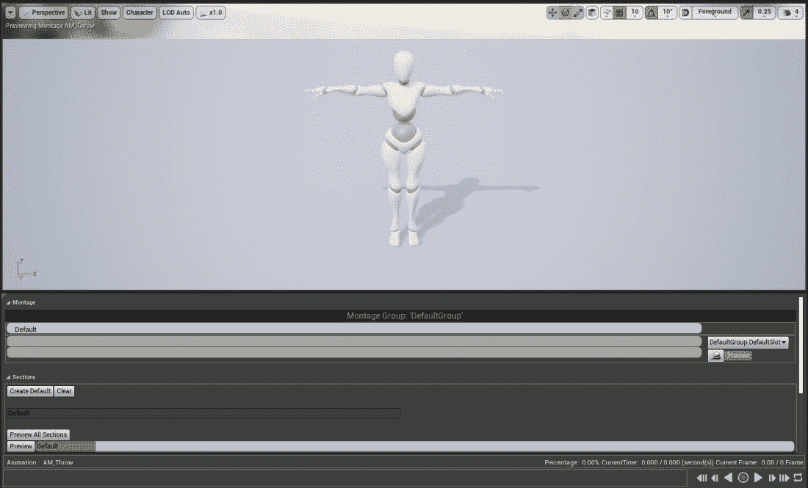

图 12.4:预览窗口以及蒙太奇和部分区域

*   **元素计时**:`Elemental Timing`部分给你一个蒙太奇的预览和蒙太奇不同方面的顺序。`Notifies`、`Montage`部分的回放顺序和其他元素将在这里直观显示，让您快速预览蒙太奇将如何工作。
*   **通知** : `Notifies`让你能够在动画时间框架中添加点，然后可以通知其他系统执行动作或从蓝图和 C++ 调用逻辑。通知选项，如`Play Sound`或`Play Particle Effect`，允许您在动画中的特定时间播放声音或粒子。一个例子是在武器的重装动画中；您可以在动画的时间线中添加 notify，以便在重新加载的精确时刻播放重新加载声音。稍后在本项目中，当您实施投掷投射物时，您将使用这些`Notifies`:

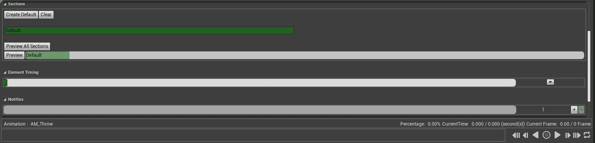

图 12.5:元素定时和通知区域

现在您已经熟悉了动画蒙太奇的界面，可以按照下一个练习将`Throw`动画添加到蒙太奇中。

## 练习 12.02:在蒙太奇中添加投掷动画

现在，您已经更好地了解了什么是动画蒙太奇以及这些资源是如何工作的，现在是时候将`Throw`动画添加到您在*练习 12.01* 、*中创建的蒙太奇中设置动画蒙太奇*。虽然您将只向该蒙太奇添加一个动画，但需要强调的是，您可以向蒙太奇添加多个独特的动画，然后可以回放。现在，让我们从添加您在*第 10 章**中导入到项目中的`Throw`动画开始，创建一个超视频滚动游戏*:

在`Asset Browser`中，找到`Throw`动画资产。然后，*左键单击*并将其拖到`Montage`部分下的时间线上:

图 12.6:带有基于动画的资产的资产浏览器窗口

一旦动画被添加到动画蒙太奇中，`Preview`窗口中的角色骨架将更新以反映这一变化，并开始播放动画:

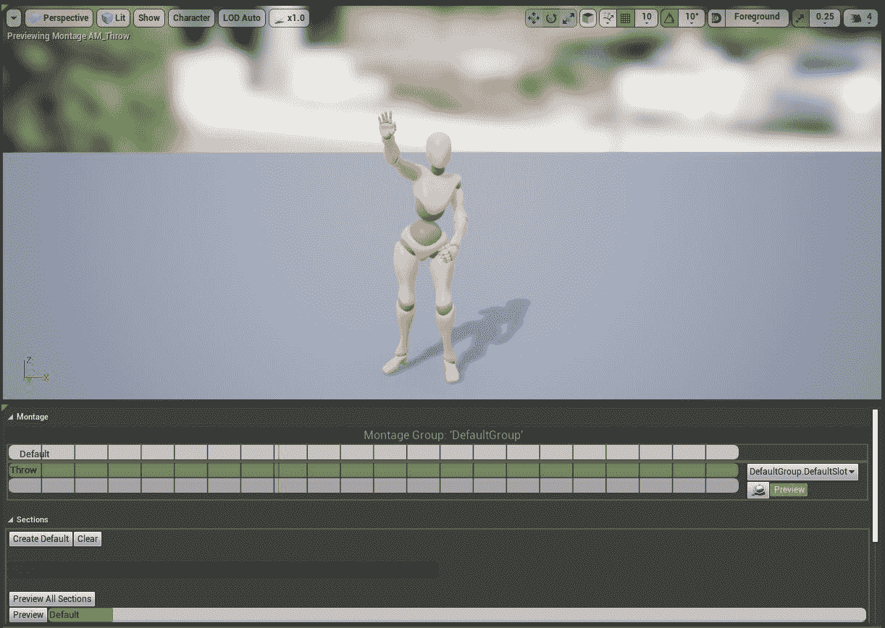

图 12.7:玩家角色开始动画化

现在`Throw`动画已经添加到动画蒙太奇中，您可以继续创建`Anim Slot`。

`Anim Slot Manager`标签应该停靠在右侧的`Asset Browser`标签旁边。如果您没有看到`Anim Slot Manager`选项卡，您可以通过导航到`Animation Montage`编辑器窗口顶部工具栏中的`Window`选项卡来访问它。在那里，*左键点击*选择`Anim Slot Manager`选项，窗口出现。

完成本练习后，您已经将`Throw`动画添加到新的动画蒙太奇中，并且可以通过`Persona`回放动画以预览其在编辑器中的外观。

现在，在本章稍后添加您自己独特的动画插槽用于动画混合之前，您可以继续了解更多关于动画插槽和`Anim Slot Manager`的信息。

# 动漫吃角子老虎管理器

`Anim Slot Manager`顾名思义，就是你管理你的`Anim Slots`的地方。在该选项卡中，您可以创建新的**组**，这允许您更好地组织插槽。例如，您可以通过在`Add Group`选项上左键单击*并将其标记为`Face`来创建一个`Group`，以向其他人阐明该组中的槽会影响角色的面部。默认情况下，虚幻引擎为您提供了一个名为`DefaultGroup`的`Group`和一个名为`DefaultSlot`的`Anim Slot`，它们在该组中。*

 *让我们创建一个新的动漫槽。

## 练习 12.03:添加新动漫槽

现在你对 Anim Slot 和`Anim Slot Manager`有了更好的了解，你可以按照这些步骤创建一个新的 Anim Slot，你将称之为`Upper Body`。一旦创建了这个新的槽，就可以在动画蓝图中使用和引用它来处理动画混合，这将在后面的练习中进行。

让我们通过执行以下操作来创建动画插槽:

1.  在`Anim Slot Manager`*中，左键单击`Add Slot`选项上的*。
2.  When adding a new slot, Unreal will ask you to give this `Anim Slot` a name. Name this slot `Upper Body`. Anim Slot naming is important, much like naming any other assets and parameters, because you will be referencing this slot in the Animation Blueprint later.

    随着动画槽的创建，您现在可以更新用于`Throw`蒙太奇的槽。

3.  In the `Montage` section, there is a drop-down menu that displays the applied `Anim Slot`; by default, it's set to `DefaultGroup.DefaultSlot`. *Left-click*, and from the drop-down menu, select `DefaultGroup.Upper Body`:

    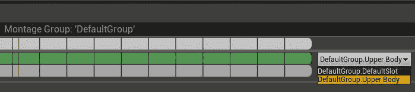

    图 12.8:新的动漫槽将出现在下拉列表中

    注意

    更改`Anim Slot`后，你可能会注意到玩家角色停止动画，回到 T 姿势。别担心——如果发生这种情况，只需关闭`Animation Montage`并重新打开即可。一旦重新打开，角色将再次播放`Throw`动画。

    随着你的`Anim Slot`被创建并在`Throw`蒙太奇中就位，现在是你更新动画蓝图的时候了，这样玩家角色就知道这个位置，并根据它正确地制作动画。

4.  导航至`/MainCharacter/Blueprints/`目录中的`AnimBP_SuperSideScroller_MainCharacter`资产。
5.  通过*双击*并打开`Anim Graph`打开该资产。

完成本练习后，您已经使用`Anim Slot Manager`创建了您的第一个动画片段，该片段在动画蒙太奇中可用。有了这个槽，现在可以在玩家角色动画蓝图中使用和引用它来处理混合`Throw`动画和您在上一章中实现的运动动画所需的动画混合。在此之前，您需要了解更多关于动画蓝图中`Save Cached Pose`节点的信息。

# 保存缓存的姿势

有些情况下，当处理复杂的动画和角色时，需要引用状态机在多个位置输出的姿势。如果你还没有注意到，你的`Movement`状态机的输出姿态不能连接到一个以上的其他节点。这就是`Save Cached Pose`节点派上用场的地方；它允许您缓存或存储一个姿势，然后可以同时在多个位置引用该姿势。你需要用它来为上半身动画设置新的动画槽。

我们开始吧。

## 练习 12.04:保存运动状态机的缓存姿势

要有效地将`Throw`动画(使用您在上一练习中创建的`Upper Body Anim Slot`)与已经为玩家角色准备好的运动动画混合，您需要能够引用动画蓝图中的`Movement`状态机。为此，请执行以下操作来实现动画蓝图中的`Save Cached Pose`节点:

1.  In `Anim Graph`, *right-click* and search for `New Save Cached Pose`. Name this `Movement Cache`:

    

    图 12.9:姿态将每帧评估一次，然后缓存

2.  Now, instead of connecting your `Movement` state machine directly to the output pose, connect it to the cache node:

    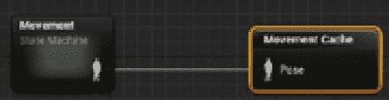

    图 12.10:正在缓存移动状态机

3.  With the `Movement` state machine pose being cached, all you have to do now is reference it. This can be done by searching for the `Use Cached Pose` node.

    注意

    所有缓存的姿势都将显示在上下文菜单中。只需确保选择缓存的姿势，并使用您在*步骤 1* 中给它的名称。

4.  With the cached pose node available, connect it to `Output Pose` of the `AnimGraph`:

    

图 12.11:这等同于将运动状态机直接连接到输出姿态

你现在会注意到，在*第 4 步*之后，主角会正确地动画化，并在最后一章之后按照你的预期移动。这证明`Movement`状态机的缓存工作正常。下图显示了玩家角色在动画蓝图的预览窗口中回到他的`Idle`动画中。

现在您已经使`Movement`状态机的缓存工作，您将使用该缓存基于您创建的`Anim Slot`来混合骨架中的动画:

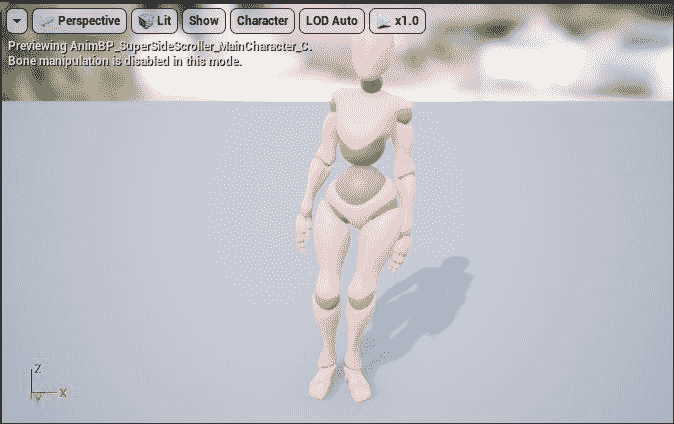

图 12.12:主角正在按预期制作动画

完成本练习后，您现在可以在动画蓝图中的任何位置引用缓存的`Movement`状态机姿势。有了这个辅助工具，你现在可以使用一个叫做`Layered blend per bone`的函数，使用缓存的姿势开始在缓存的运动姿势和`Upper Body`动画槽之间进行混合。

# 每个骨骼的分层混合

您将在这里使用的混合动画的节点是`Layered blend per bone`。该节点屏蔽了角色骨架上的一组骨骼，以便动画忽略这些骨骼。

在我们的玩家角色和`Throw`动画的情况下，你将屏蔽掉下半身，这样只有上半身动画。目标是能够同时执行投掷和移动动画，并使这些动画融合在一起；否则，当您执行投掷时，移动动画将完全中断。

## 练习 12.05:将动画与上半身动画槽混合

`Layered blend per bone`功能允许我们将`Throw`动画与您在上一章中实现的运动动画混合，并让您控制`Throw`动画对玩家角色骨骼的影响程度。

在本练习中，您将使用`Layered blend per bone`功能在播放`Throw`动画时完全遮挡角色的下半身，使其不影响下半身的角色移动动画。

让我们从添加`Layered blend per bone`节点开始，讨论它的输入参数和设置:

1.  Inside the Animation Blueprint, *right-click* and search for `Layered blend per bone` in the `Context Sensitive` search.

    *图 12.13* 显示了`Layered blend per bone`节点及其参数。

    *   第一个参数`Base Pose`是角色的基础姿势；在这种情况下，`Movement`状态机的缓存姿态将是基础姿态。
    *   第二个参数是你想在`Base Pose`上面叠加的`Blend Pose 0`节点；请记住，选择`Add Pin`将创建附加的`Blend Pose`和`Blend Weights`参数。目前，您将只使用一个`Blend Pose`节点。
    *   The last parameter is `Blend Weights`, which is how much `Blend Pose` will affect `Base Pose` on a scale from `0.0` to `1.0` as an alpha:

        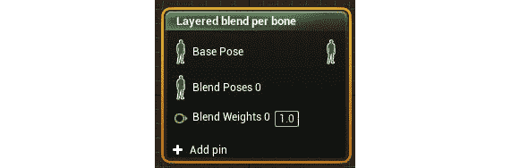

图 12.13:每个骨节点的分层混合

在将任何东西连接到此节点之前，您需要向其属性添加一个层。

1.  *Left-click* to select the node and navigate to `Details`. You will need to *left-click* on the arrow next to `Layer Setup` to find the first index, `0`, of this setup. *Left-click* on `+` next to `Branch Filters` to create a new filter.

    这里还有两个参数，即:

    *   `Bone Name`: The bone to specify where the blending will take place and determine the child hierarchy of bones masked out. In the case of the main character skeleton for this project, set `Bone Name` to `Spine`. *Figure 12.14* shows how the `Spine` bone and its children are unassociated with the lower body of the main character. This can be seen in the `Skeleton` asset, `MainCharacter_Skeleton`:

        

图 12.14:脊椎骨骼及其子骨骼与主要角色的上半身相关联

*   `Blend Depth`:骨骼及其子体受动画影响的深度。`0`的值不会影响所选骨骼的根孩子。
*   `Mesh Space Rotation Blend`: Determines whether or not to blend bone rotations in `mesh space` or in `local space`. `Mesh Space` rotation refers to the skeletal mesh's bounding box as its base rotation, while `Local Space` rotation refers to the local rotation of the bone name in question. In this case, we want the rotation blend to occur in mesh space, so we will set this parameter to true.

    混合将传播到骨骼的所有子骨骼，以停止特定骨骼上的混合，将它们添加到数组中，并使它们的混合深度值`0`。最终结果如下:

    

图 12.15:您可以用一个混合节点设置多个层

1.  With the settings in place on the `Layered blend per bone` node, you can connect the `Movement Cache` cached pose into the `Base Pose` node of the layered blend. Make sure you connect the output of the `Layered blend per bone` node to `Output Pose` of the Animation Blueprint:

    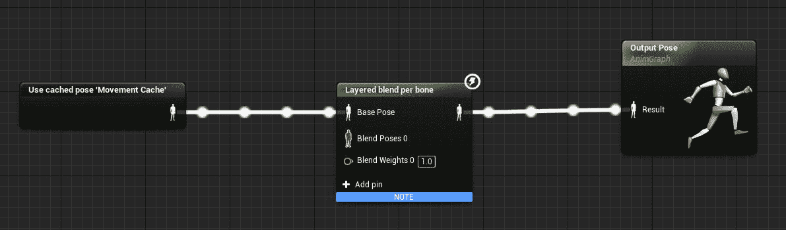

    图 12.16:将运动状态机的缓存姿势添加到每个骨骼节点的分层混合中

    现在是时候使用您之前创建的动画槽来通过`Layered blend per bone`节点过滤使用该槽的动画了。

2.  *Right-click* in the `AnimGraph` and search for `DefaultSlot`. *Left-click* to select the `Slot` node and navigate to `Details`. There, you will find the `Slot Name` property. *Left-click* on this drop-down to find and select the `DefaultGroup.Upper Body` slot.

    更改`Slot Name`属性时，`Slot`节点将更新以表示该新名称。`Slot`节点需要一个源姿态，它将再次引用`Movement`状态机。这意味着您需要为`Movement Cache`姿势创建另一个`Use Cached Pose`节点。

3.  Connect the cached pose into the source of the `Slot` node:

    

    图 12.17:通过动画槽过滤缓存的运动姿势

4.  All that is left to do now is connect the `Upper Body` slot node to the `Blend Pose 0` input. Then, connect the final pose of `Layered blend per bone` to the result of the `Output Pose` Animation Blueprint:

    

图 12.18:主角动画蓝图的最终设置

随着动画槽和`Layered blend per bone`节点在主角的动画蓝图中就位，你终于完成了主角的动画部分。

接下来，让我们简单讨论一下动画混合对于`Throw`动画的重要性以及`Throw`动画将用于什么，然后继续进行*练习 12.06* 、*预览投掷动画*，您将在游戏中预览`Throw`动画。

# 投掷动画

到目前为止，您已经做了大量工作来确保`Throw`动画与您在上一章的动画蓝图中设置的`Movement`动画正确融合。这种努力背后的主要原因是为了在同时执行多个动画时确保角色的视觉保真度。您将直接了解在前面的练习和活动中错误设置动画混合的视觉后果。

回到`Throw`动画，每一款现代电子游戏都以这样或那样的形式实现动画融合，只要艺术方向和游戏机制需要这样的功能。一个特别使用动画的现代游戏系列的例子是由顽皮狗 T4 开发的未知 T2 系列。

如果你不熟悉这个系列，可以在这里观看最新一期的完整玩法:[https://www.youtube.com/watch?v=5evF_funE8A](https://www.youtube.com/watch?v=5evF_funE8A)。

*未知的*系列做得非常好的是使用数千种动画和混合技术，给玩家角色一种不可思议的*真实感*、*重量*和*运动*，当你玩游戏的时候感觉真的很好。虽然`Super SideScroller`项目不会像现在这样完美，但你正在学习制作令人难以置信的视频游戏动画所需的基础知识:

## 练习 12.06:预览投掷动画

在前面的练习中，通过使用`Save Cached Pose`和`Layered blend per bone`节点，您做了大量工作来允许玩家角色的`Movement`动画和`Throw`动画之间的动画混合。执行以下步骤，在游戏中预览`Throw`动画，看看你的劳动成果:

1.  导航到`/MainCharacter/Blueprints/`目录，打开角色的`BP_SuperSideScroller_MainCharacter`蓝图。
2.  如果你还记得，在最后一章你用`ThrowProjectile`的名字创造了`Input Action`来投掷。
3.  Inside `Event Graph` of the character's Blueprint, *right-click* and search for `ThrowProjectile` in the `Context Sensitive` drop-down search. Select it with a *left-click* to create the event node in the graph.

    有了这个事件，你需要一个功能，当玩家使用*鼠标左键*投掷时，你可以玩一个`Animation Montage`。

4.  *Right-click* in `Event Graph` and search for `Play Montage`. Make sure not to confuse this with a similar function `Play Anim Montage`.

    `Play Montage`功能需要两个重要的输入:

    *   `Montage to Play`
    *   `In Skeletal Mesh Component`

        我们先来处理`Skeletal Mesh Component`。

5.  The player character has a `Skeletal Mesh Component` that can be found in the Components tab labeled `Mesh`. Left-click and drag out a `Get` reference to this variable and connect it to the `In Skeletal Mesh Component` input of this function:

    

    图 12.19:玩家角色的网格连接到骨骼网格组件输入

    现在要做的最后一件事就是告诉这个功能该玩哪个蒙太奇。幸运的是，这个项目中只有一个蒙太奇:`AM_Throw`。

6.  *左键单击`Montage to Play`输入下的下拉菜单中的*，左键单击*选择`AM_Throw`。*
7.  Finally, connect the `Pressed` execution output of the `ThrowProjectile` event to the execution input pin of the `Play Montage` function:

    

    图 12.20:当玩家按下投掷弹输入动作时，会播放 AM_Throw 蒙太奇

8.  现在，当你点击你的*鼠标左键*，玩家角色将进行投掷`Animation Montage`。

现在请注意，您可以如何在投掷的同时行走和奔跑，并且每个动画混合在一起，以免相互干扰:

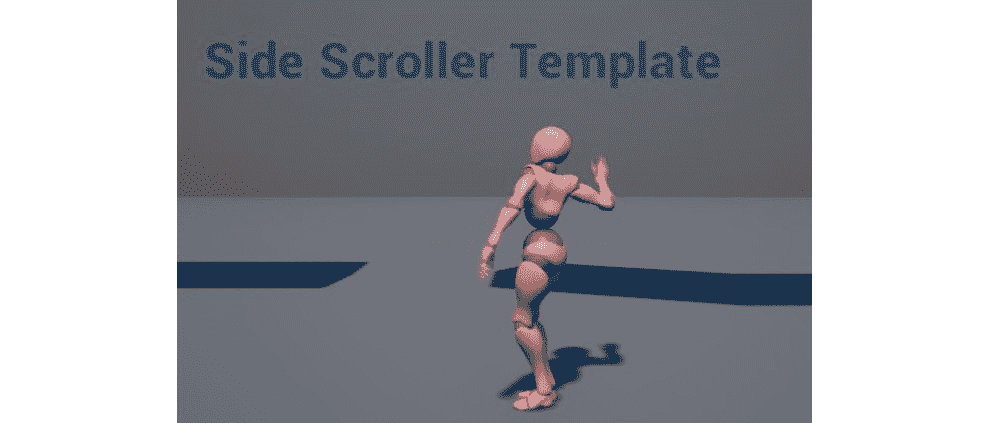

图 12.21:玩家角色现在可以移动和投掷

不用担心使用*鼠标左键*动作反复播放`Throw`蒙太奇时可能会看到的任何 bugs 这些问题将在您实现投射体时得到解决，投射体将在本项目的后面章节中抛出。现在，你只想知道在`Anim Slot`和`Animation Blueprint`上完成的工作给出了动画混合的期望结果。

让我们继续`SuperSideScroller`项目，现在创建 C++ 类、蓝图和设置敌人所需的材料，以便在下一章中使用。

# 超级侧滚游戏敌人

随着玩家角色在移动和执行`Throw`动画时正确地动画化，是时候谈论`SuperSideScroller`游戏将会出现的敌人类型了。我们会有一个简单类型的敌人。

这个敌人会有一个基本的来回移动模式，不会支持任何攻击；只有与玩家角色发生碰撞，它才能造成伤害。

在接下来的练习中，你将在 C++ 中为第一个敌人类型设置基础敌人类，并配置敌人的蓝图和动画蓝图，为*第 13 章*、*敌人人工智能*做准备，在这里你将实现这个敌人的 AI。为了效率和时间，你将使用`SideScroller`模板中虚幻引擎 4 已经为敌人提供的资产。这意味着您将使用默认人体模型资产的骨骼、骨骼网格、动画和动画蓝图。让我们从创建第一个敌人类开始。

## 练习 12.07:创建敌人基础 C++ 类

本练习的目标是从头开始创建一个新的敌人职业，并在开发人工智能时让敌人准备好在*第 13 章*、*敌人人工智能*中使用。首先，按照以下步骤在 C++ 中创建新的敌人类:

1.  在编辑器中，导航至`File`并选择`New C++ Class`开始创建新的敌人职业。
2.  接下来，在尝试搜索一个类之前，确保选中`Choose Parent Class`窗口提示顶部的`Show All Classes`框。然后，搜索`SuperSideScrollerCharacter`、*左键点击*选择其为父类。
3.  Lastly, you need to give this class a name and select a directory. Name this class `EnemyBase` and do not change the directory path. When ready, *left-click* on the `Create Class` button to have Unreal Engine create the new class for you.

    当你创建一个新的类时，虚幻引擎会自动为你打开 Visual Studio，准备好`.cpp`和`.h`文件。目前，您不会对代码进行任何更改，因此请关闭 Visual Studio。

    接下来让我们在内容浏览器中为敌人资产创建文件夹结构。

4.  Head back to the Unreal Engine 4 editor, navigate to the content browser, and create a new folder called `Enemy`:

    

    图 12.22:通过右键单击现有文件夹并选择新建文件夹来创建新文件夹

5.  在`Enemy`文件夹中，创建另一个名为`Blueprints`的文件夹，您将在其中为敌人创建并保存蓝图资产。
6.  In the `/Enemy/Blueprints` directory, *right-click* and select `Blueprint Class`. From `Pick Parent Class`, search for the new C++ class you just made, `EnemyBase`, as shown:

    

    图 12.23:现在，新的 EnemyBase 类可供您创建蓝图

7.  命名这个`BP_Enemy`。

现在你有了第一个使用`EnemyBase`类作为父类的敌人`Blueprint`，是时候处理`Animation Blueprint`了。您将使用`SideScroller`模板项目中虚幻引擎提供给您的默认`Animation Blueprint`。按照下一个练习中的步骤创建现有`Animation Blueprint`的副本，并将其移动到`/Enemy/Blueprints`目录。

## 练习 12.08:创建和应用敌人动画蓝图

在上一个练习中，您使用`EnemyBase`类作为父类为第一个敌人创建了一个`Blueprint`。在本练习中，您将使用动画蓝图。

以下步骤将帮助您完成本练习:

1.  导航至`/Mannequin/Animations`目录，找到`ThirdPerson_AnimBP`资产。
2.  现在，复制`ThirdPerson_AnimBP`资产。复制资产有两种方法:
    *   在内容浏览器中选择所需的资产，然后按下 *CTRL* + *W* 。
    *   *在内容浏览器中右键单击所需资产上的*，并从下拉菜单中选择`Duplicate`。
3.  现在，*左键点击*，将该重复资产拖动到`/Enemy/Blueprints`目录中，松开*左键点击*选择要移动的选项。
4.  Name this duplicate asset `AnimBP_Enemy`. It is best to create a duplicate of an asset that you can later modify if you so desire without risking the functionality of the original:

    随着敌人`Blueprint`和`Animation Blueprint`的创建，是时候更新敌人蓝图，使用默认的`Skeletal Mesh`人体模型和新的`Animation Blueprint`副本了。

5.  导航至`/Enemy/Blueprints`并打开`BP_Enemy`。
6.  Next, navigate to the `Mesh` component and select it to access its `Details` panel. First, assign `SK_Mannequin` to the `Skeletal Mesh` parameter, as shown:

    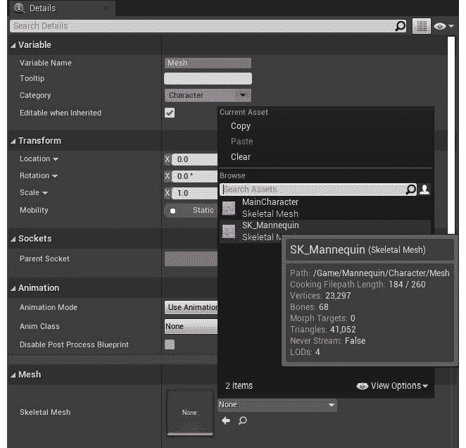

    图 12.24:你将为新敌人使用默认的 SK_Mannequin 骨骼网格

7.  Now you need to apply the `AnimBP_Enemy Animation Blueprint` to the `Mesh` component. Navigate to the `Animation` category of the `Mesh` component's `Details` panel, and under `Anim Class`, assign `AnimBP_Enemy`:

    

    图 12.25:为敌方角色分配新的动画蓝图作为动画类

8.  最后，在`Preview`窗口预览角色时，你会注意到角色网格的位置和旋转不正确。通过将`Mesh`组件的`Transform`属性设置为以下内容来解决此问题:
    *   `Location` : ( `X` = `0.000000`、`Y` = `0.000000`、`Z` = `-90.000000`)
    *   `Rotation`:(侧倾= `0.000000`、俯仰= `0`、偏航= `-90.000000`)
    *   `Scale`: (`X` = `1.000000`, `one` = `1.000000`, `Z` = `1.000000`)

        `Transform`设置将出现如下:

        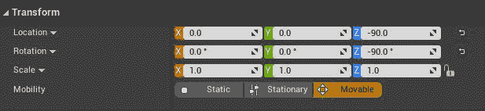

图 12.26:这些是变换设置，以便你的角色被正确定位和旋转

下图显示了到目前为止`Mesh`组件的设置。请确保您的设置与此处显示的匹配:

图 12.27:敌人角色的网格组件的设置

这里要做的最后一件事是创建一个人体模型的主要材料`Material Instance`，这样这个敌人就可以有一个独特的颜色，有助于将其与其他敌人类型区分开来。

让我们首先了解更多关于材料和`Material Instances`的知识。

# 材料和材料实例

在进入下一个练习之前，我们需要先简单讨论一下什么是材料和`Material Instances`，然后你才能使用这些资产并将其应用到新的敌人角色上。虽然这本书更侧重于使用虚幻引擎 4 开发游戏的技术方面，但重要的是你要知道，从表面上看，什么是材料和`Material Instances`以及它们是如何在电子游戏中使用的。

注意

有关材料的更多信息，请参考以下史诗游戏文档:[https://docs . unrealengine . com/en-US/Engine/Rendering/Materials/index . html](https://docs.unrealengine.com/en-US/Engine/Rendering/Materials/index.html)。

材质是一种可以应用于网格的资源，它可以控制网格在游戏中的外观。`Material`编辑器让您可以控制最终视觉结果的许多部分，包括对参数的控制，如`Textures`、`Emissive`和`Specular`等。下图显示了应用了`M_UE4Man_Body``Material`资源的默认人体模型骨骼网格:

图 12.28:应用了基本材质的默认人体模型骨骼网格

一个`Material Instance`是一个`Material`的延伸，在这里你不能访问或控制`Material Instance`来源的基地`Material`，但是你可以控制`Material`的创造者向你展示的参数。许多参数可以从`Material Instances`内部暴露给你使用。

虚幻引擎为我们提供了一个名为`M_UE4Man_ChestLogo`的`Side Scroller`模板项目中的`Material Instance`的例子，可以在`/Mannequin/Character/Materials/`目录中找到。下图显示了基于母材质`M_UE4Man_Body`给`Material Instance`的曝光参数集。最重要的参数是`Vector`参数，称为`BodyColor`。您将在下一个练习中创建的`Material Instance`中使用该参数，给敌人一个独特的颜色:

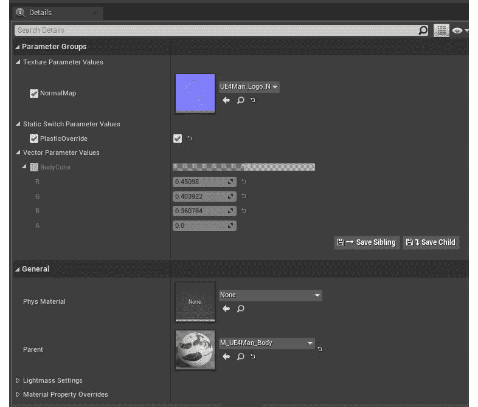

图 12.29:M _ ue4 man _ ChestLogo 材质实例资产的参数列表

## 练习 12.09:创建和应用敌方材料实例

现在您已经对什么是材质和材质实例有了基本的了解，是时候从`M_UE4ManBody`资产创建自己的`Material Instance`了。有了这个`Material Instance`，你将调整`BodyColor`参数，给敌人角色一个独特的视觉表现。让我们从创造新的`Material Instance`开始。

以下步骤将帮助您完成本练习:

1.  导航到`/Mannequin/Character/Materials`目录，找到默认人体模型角色`M_UE4ManBody`使用的`Material`。
2.  A `Material Instance` can be created by *right-clicking* on the `Material` asset, `M_UE4Man_Body`, and *left-clicking* on the `Create Material Instance` option. Name this asset `MI_Enemy01`.

    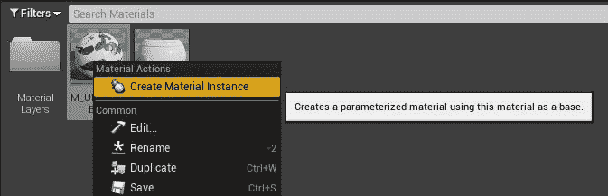

    图 12.30:任何材质都可以用来创建材质实例

    在`Enemy`文件夹中创建新文件夹`Materials`。*左键单击*并将`Material Instance`拖动到`/Enemy/Materials`目录，将资产移动到这个新文件夹:

    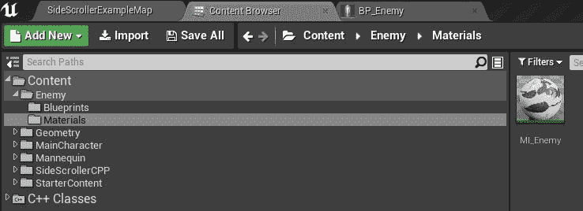

    图 12.31:重命名材料实例 MI _ 敌人

3.  *Double-left-click* the `Material Instance` and find the `Details` panel on the left-hand side. There, you will find a `Vector Parameter` property called `BodyColor`. Make sure the checkbox is checked to enable this parameter, and then change its value to a red color. Now, `Material Instance` should be colored red, as shown:

    

    图 12.32:现在，敌方材料为红色

4.  Save the `Material Instance` asset and navigate back to the `BP_Enemy01` Blueprint. Select the `Mesh` component and update the `Element 0` material parameter to `MI_Enemy`:

    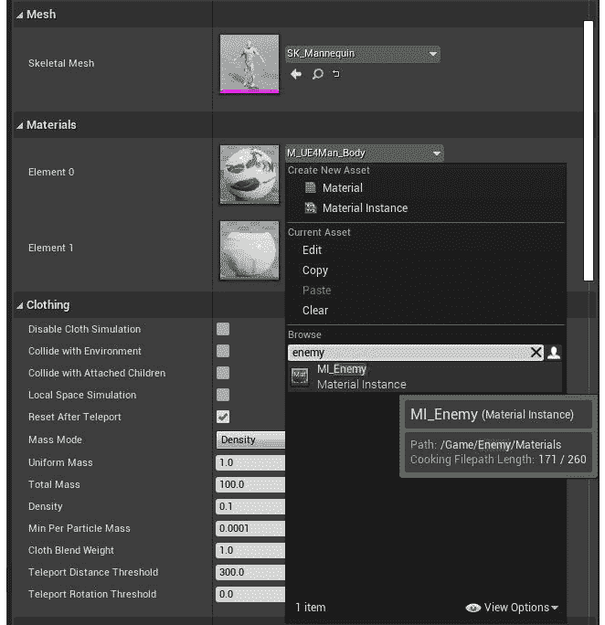

    图 12.33:为网格组件的材料元素 0 分配新的材料实例资产 MI _ 敌人

5.  Now, the first enemy type is visually ready and has the appropriate `Blueprint` and Animation Blueprint assets prepared for the next chapter, where you will develop its AI:

    

图 12.34:最终的敌人角色设置

完成本练习后，您现在已经创建了一个`Material Instance`，并将其应用于敌方角色，使其具有独特的视觉表现。

让我们通过一个简短的活动来结束这一章，该活动将帮助您更好地理解使用早期练习中使用的`Layered blend per bone`节点的动画混合。

## 活动 12.01:更新混合权重

在*练习 12.06* 、*预览投掷动画*结束时，您可以混合移动动画和`Throw`动画，以便它们可以同时播放，而不会对彼此产生负面影响。结果是玩家角色在行走或跑步时正确地制作动画，同时也在上半身执行`Throw`动画。

在本练习中，您将实验`Layered blend per bone`节点的混合偏置值和参数，以更好地理解动画混合的工作原理。

以下步骤将帮助您完成活动:

1.  Update the `Blend Weights` input parameter of the `Layered blend per bone` node so that there is absolutely no blending of the `Throw` animation additive pose with the base movement pose. Try using values here such as `0.0f` and `0.5f` to compare the differences in the animation.

    注意

    完成后，确保将该值返回到`1.0f`，以免影响您在上一练习中设置的混合。

2.  更新`Layered blend per bone`节点的设置，改变哪个骨骼受融合影响，这样整个角色的身体都受融合影响。从`MainCharacter_Skeleton`资产骨架层次中的根骨开始是个好主意。
3.  Keeping the settings from the previous step in place, add a new array element to the branch filters and, in this new array element, add the bone name and a blend depth value of `–1.0f`, which allows only the character's left leg to continue to animate the movement correctly when blending the `Throw` animation.

    注意

    完成此活动后，请确保将`Layered blend per bone`节点的设置恢复到您在第一个练习结束时设置的值，以确保角色动画中不会丢失任何进度。

预期产出如下:

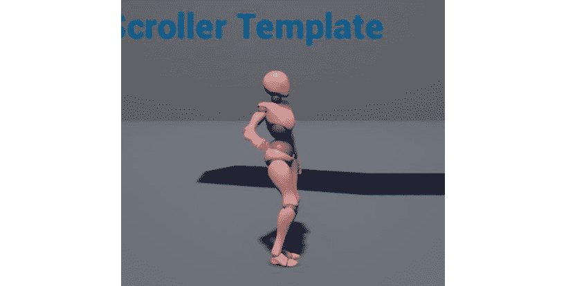

图 12.35:显示整个角色身体受影响的输出

图 12.36:当混合投掷动画时，左腿继续正确地制作运动动画

图 12.37:角色的右腿随着投掷动画的结束而移动

注意

这个活动的解决方案可以在:[https://packt.live/338jEBx](https://packt.live/338jEBx)找到。

在结束本活动之前，请将`Layered blend per bone`设置返回到您在*练习 12.05* 、*将动画与上半身动画槽*混合结束时设置的值。如果您不将这些值恢复到它们的原始设置，在接下来的章节中，动画在即将进行的练习和活动中的效果将会不同。您可以手动设置回原始值，也可以通过以下链接参考具有这些设置的文件:[https://packt.live/2GKGMxM](https://packt.live/2GKGMxM)。

完成本活动后，您现在可以更好地理解动画混合是如何工作的，以及混合权重如何使用`Layered blend per bone`节点影响添加姿势对基本姿势的影响。

注意

在这个项目中有很多你没有使用过的动画混合技术，强烈建议你研究一下这些技术，从[https://docs . unrealengine . com/en-US/Engine/Animation/Animation blending/index . html](https://docs.unrealengine.com/en-US/Engine/Animation/AnimationBlending/index.html)的文档开始。

# 总结

敌人用 C++ 类、蓝图和材料设置好了，你就可以进入下一章了，在这一章中，你将利用虚幻引擎 4 中的行为树等系统为这个敌人创建人工智能。

从本章的练习和活动中，您学习了如何创建允许播放动画的`Animation Montage`。你还学会了如何在这个蒙太奇中设置一个动画槽，为玩家角色的上半身分类。

接下来，您学习了如何使用`Use Cached Pose`节点缓存状态机的输出姿势，以便该姿势可以在多个实例中被引用，用于更复杂的动画蓝图。然后，通过学习`Layered blend per bone`功能，您可以使用动画槽将基本运动姿势与`Throw`动画的附加层混合在一起。

最后，您通过创建 C++ 类、蓝图和其他资产来整合敌人的基础，以便他们为下一章做好准备。敌人准备好了，让我们继续创建敌人的人工智能，这样它就可以与玩家互动。*