# 十五、收藏品、加强和拾取

概观

在这一章中，我们将为玩家创造可收集的硬币和药剂。此外，我们将使用虚幻运动图形用户界面设计器为可收集的硬币设计用户界面，或者更常见的 UMG。最后，我们将制作砖块，将这些收藏品藏在里面。到本章结束时，你将能够在关卡环境中为玩家角色实现收藏品和启动。

# 简介

在前一章中，您创建了玩家投射体，并在`Throw`动画期间使用`Anim Notifies`来生成玩家投射体。玩家投射物将作为玩家的主要进攻游戏机制，在整个关卡中用来对抗敌人。由于虚幻引擎 4 提供的默认`Anim Notifies`和你自己定制的`Anim_ProjectileNotify`职业的结合，玩家弹丸机械师看起来和感觉都很棒。

我们需要开发的最后一套机制是硬币收集和药剂启动。让我们简要地分析一下收藏品和启动是如何影响其他游戏的，以及它们将为我们的`SuperSideScroller`游戏带来什么。

**硬币收藏品**

收藏品给了玩家一个彻底探索关卡的动力。在许多游戏中，比如*空心骑士*，收藏品也是一种货币形式，可以用来为你的角色和物品购买升级。在其他情况下，更经典的平台，如超级马里奥或索尼克，收藏品可以在玩家穿越关卡时提高玩家的分数。

在当今的游戏格局中，人们期望游戏包含成就。收藏品是将成就融入游戏的好方法；例如，收集一个关卡或整个游戏中所有硬币的成就。对于`SuperSideScroller`游戏，硬币收藏品将作为玩家探索游戏关卡以找到尽可能多的硬币的令人满意的手段。

**药水加电**

加电给玩家提供了永久或暂时的优势来对抗敌人或玩家必须穿越的环境。有许多利用加电的游戏例子，其中最著名的是 Metroid 系列。Metroid 使用加电来让玩家探索新的区域并与更强的敌人战斗。

加电也是将成就融入游戏的另一种方式。例如，你可以有一个成就来摧毁特定数量的敌人与特定的权力。对于`SuperSideScroller`游戏，药水加电将作为一种手段，通过提高玩家的移动速度和跳跃高度来提高玩家在关卡环境中的导航能力。

在这一章中，你将学习如何使用 C++ 创建硬币收藏品和药水加电，为`SuperSideScroller`游戏增加更多的游戏性。这些游戏元素将从你将创建的同一个基础`actor`类中派生出来。您还将为收藏品和电源添加视觉和听觉元素，使它们更加精美。

为了让硬币收藏和药剂加电对玩家来说更具视觉趣味性，我们将为这些演员添加旋转组件，以吸引玩家对他们的注意力。这是`URotatingMovementComponent`非常有用的地方；它允许我们以一种非常优化和直接的方式向演员添加旋转，而不是编写我们自己的逻辑来处理演员的不断旋转。让我们从了解这个组件开始。

# 尿调节运动组件

`URotatingMovementComponent`是虚幻引擎 4 中存在的少数运动组件之一。单从`SuperSideScroller`游戏项目来看`CharacterMovementComponent` 和`ProjectileMovementComponent`你已经很熟悉了，`RotatingMovementComponent`也不过如此——另一个动作组件。作为复习，动作组件允许不同类型的动作发生在他们所属的演员或角色身上。

注意

`CharacterMovementComponent`，可以控制角色的移动速度和跳跃高度等移动参数，在*第 10 章*、*创建超视频 Scroller Game* 中有介绍，当时你创建了`SuperSideScroller`玩家角色。`ProjectileMovementComponent`允许你为演员添加基于投射物的移动功能，如速度和重力，在你开发玩家投射物时，在*第 14 章*、*生成玩家投射物*中有所介绍。

`RotatingMovementComponent`与`CharacterMovementComponent`相比是一个非常简单的运动组件，那是因为它只涉及到旋转`RotatingMovementComponent`所属的演员；仅此而已。`RotatingMovementComponent`基于定义的`Rotation Rate`、枢轴平移和在局部空间或世界空间中使用旋转的选项来执行组件的连续旋转。

此外，`RotatingMovementComponent`比其他轮换演员的方法更有效，例如通过蓝图中的`Event Tick`或`Timelines`。

注意

更多关于运动组件的信息可以在这里找到:[https://docs . unrealengine . com/en-US/Engine/Components/Movement/index . html # rotating Movement component](https://docs.unrealengine.com/en-US/Engine/Components/Movement/index.html#rotatingmovementcomponent)。

我们将使用`RotatingMovementComponent`来允许硬币收集和药剂加电沿着偏航轴原地旋转。这种旋转将吸引玩家对收藏品的注意，并给他们一个视觉提示，即收藏品很重要。

现在你对`RotatingMovementComponent`有了更好的理解，让我们继续创建`PickableActor_Base`类，这是硬币收集和药剂加电的来源。

## 练习 15.01:创建可选择的 actor _ 基类并添加尿统计移动组件

在本练习中，您将创建`PickableActor_Base`演员类，该类将被用作可收集硬币和药剂加电的基础类。您还将从这个 C++ 基类创建一个蓝图类来预览`URotatingMovementComponent`是如何工作的。按照以下步骤完成本练习:

注意

在整个`SuperSideScroller`游戏项目中，您已经无数次执行了以下许多步骤，因此将有有限的图像来帮助指导您。只有在引入一个新概念的时候，才会有一个伴随的形象。

1.  在虚幻引擎 4 编辑器中，*左键单击编辑器左上角的*`File`选项，*左键单击`New C++ Class`选项。*
2.  在`Choose Parent Class`窗口中，选择`Actor`选项，然后在该窗口底部的`Next`按钮上*左键单击*。
3.  命名这个类`PickableActor_Base`并保持默认的`Path`目录不变。然后，选择该窗口底部的`Create Class`按钮。
4.  选择`Create Class`按钮后，虚幻引擎 4 将重新编译项目代码，并自动打开带有`PickableActor_Base`类头文件和源文件的 Visual Studio。
5.  默认情况下，`Actor`类在头文件中为您提供了`virtual void Tick(float DeltaTime) override;`函数声明。出于`PickableActor_Base`类的目的，我们将不需要`Tick`函数，因此从`PickableActor_Base.h`头文件中删除该函数声明。
6.  Next, you will also need to remove the function from the `PickableActor_Base.cpp` file; otherwise, you will receive a compile error. In this source file, find and remove the following code:

    ```cpp
    void PickableActor_Base::Tick(float DeltaTime)
    {
      Super::Tick(DeltaTime);
    }
    ```

    注意

    在许多情况下，使用`Tick()`功能进行移动更新会导致性能问题，因为`Tick()`功能在每一帧都被调用。相反，尝试使用`Gameplay Timer`功能以指定的时间间隔执行特定的更新，而不是在每一帧上。您可以在这里了解更多关于`Gameplay Timers`的信息:[。](https://docs.unrealengine.com/en-US/Programming/UnrealArchitecture/Timers/index.html)

7.  Now, it is time to add the components that the `PickableActor_Base` class requires. Let's start with `USphereComponent`, which you will use to detect overlap collision with the player. Add the following code underneath the `Protected` access modifier inside the `PickableActor_Base.h` header file:

    ```cpp
    UPROPERTY(VisibleDefaultsOnly, Category = PickableItem)
    class USphereComponent* CollisionComp;
    ```

    `USphereComponent`的宣言到现在你应该很熟悉了；我们在之前的章节中已经这样做了，比如*第 16 章*、*多人基础*，当时我们创建了`PlayerProjectile`类。

8.  接下来，在`USphereComponent`的声明下面添加下面的代码来创建一个新的`UStaticMeshComponent`。这将用于直观地表示可收集的硬币或药剂的启动:

    ```cpp
    UPROPERTY(VisibleDefaultsOnly, Category = PickableItem)
    class UStaticMeshComponent* MeshComp;
    ```

9.  最后，在`UStaticMeshComponent`的声明下添加以下代码，创建一个新的`URotatingMovementComponent`。这将用于给可收集的硬币和药剂加电简单旋转运动:

    ```cpp
    UPROPERTY(VisibleDefaultsOnly, Category = PickableItem)
    class URotatingMovementComponent* RotationComp;
    ```

10.  现在您已经在`PickableActor_Base.h`头文件中声明了组件，导航到`PickableActor_Base.cpp`源文件，以便您可以为这些添加的组件添加所需的`#includes`。在源文件顶部的第一个`#include "PickableActor_Base.h"`后添加以下几行:

    ```cpp
    #include "Components/SphereComponent.h"
    #include "Components/StaticMeshComponent.h"
    #include "GameFramework/RotatingMovementComponent.h"
    ```

11.  现在您已经有了组件所需的`include`文件，您可以在`APickableActor_Base::APickableActor_Base()`构造函数中添加必要的代码来初始化这些组件:

    ```cpp
    APickableActor_Base::APickableActor_Base()
    {
    }
    ```

12.  首先，通过向`APickableActor_Base::APickableActor_Base()`添加以下代码来初始化`USphereComponent`组件变量`CollisionComp`:

    ```cpp
    CollisionComp = CreateDefaultSubobject   <USphereComponent>(TEXT("SphereComp"));
    ```

13.  接下来，通过在上一步提供的代码下面添加以下代码，用默认的球体半径`30.0f`初始化【T0:

    ```cpp
    CollisionComp->InitSphereRadius(30.0f);
    ```

14.  由于玩家角色需要与该组件重叠，您需要添加以下代码，以便在默认情况下，`USphereComponent`具有`Overlap All Dynamic`的碰撞设置:

    ```cpp
    CollisionComp->BodyInstance.SetCollisionProfileName("OverlapAllDynamic");
    ```

15.  最后，`CollisionComp USphereComponent`应该是这个演员的根成分。添加以下代码进行分配:

    ```cpp
    RootComponent = CollisionComp;
    ```

16.  Now that `CollisionComp USphereComponent` has been initialized, let's do the same for `MeshComp UStaticMeshComponent`. Add the following code. After, we'll discuss what the code is doing for us:

    ```cpp
    MeshComp = CreateDefaultSubobject<UStaticMeshComponent>(TEXT("MeshComp"));
    MeshComp->AttachToComponent(RootComponent,   FAttachmentTransformRules::KeepWorldTransform);
    MeshComp->SetCollisionEnabled(ECollisionEnabled::NoCollision);
    ```

    第一行使用`CreateDefaultSubobject()`模板函数初始化`MeshComp UStaticMeshComponent`。接下来，您将使用`AttachTo()`功能将`MeshComp`附加到您为`CollisionComp`制作的根组件上。最后，`MeshComp UStaticMeshComponent`在默认情况下不应该有任何冲突，所以您正在使用`SetCollisionEnabled()`函数并传入`ECollisionEnable::NoCollision`枚举值。

17.  最后，我们可以通过添加以下代码来初始化【T0:

    ```cpp
    RotationComp =   CreateDefaultSubobject<URotatingMovementComponent>(TEXT("RotationComp"));
    ```

18.  初始化所有组件后，编译 C++ 代码并返回到虚幻引擎 4 编辑器。编译成功后，您将继续为`PickableActor_Base`创建蓝图类。
19.  在`Content Browser`窗口中，通过右键单击`Content`文件夹中的并选择`New Folder`选项，创建一个名为`PickableItems`的新文件夹。
20.  在`PickableItems`文件夹中，*右键单击*，选择`Blueprint Class`。从`Pick Parent Class`窗口，搜索`PickableActor_Base`类和*左键单击* `Select`创建新蓝图。
21.  命名此蓝图`BP_PickableActor_Base`和*双击*打开蓝图。
22.  In the `Components` tab, select `MeshComp Static Mesh Component` and assign the `Shape_Cone` static mesh to the `Static Mesh` parameter in the `Details` panel. Please refer to the following screenshot:

    

    图 15.1:分配给 BP _ 可选择 _ 基本执行元类的网格组件的形状 _ 圆锥网格

23.  接下来，选择`RotationComp` `URotatingMovementComponent`，在`Details`面板的`Rotating Component`类别下找到`Rotation Rate`参数。
24.  Set `Rotation Rate` to the following values:

    ```cpp
    (X=100.000000,Y=100.000000,Z=100.000000)
    ```

    这些值决定了演员每秒沿着每个轴旋转的速度。这意味着锥形演员将在每个轴上以每秒 100 度的速度沿着每个轴旋转。

25.  编译`PickableActor_Base`蓝图，把这个演员加到你的级别。
26.  Now, if you use PIE and look at the `PickableActor_Base` actor in the level, you will see that it is now rotating. Please refer to the following screenshot:

    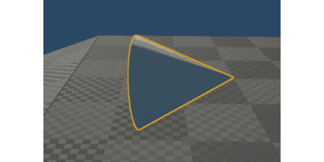

图 15.2:现在，圆锥体网格沿着所有的轴旋转，就像我们添加到泌尿运动组件的旋转速率窗口中的值一样

注意

您可以在这里找到本练习的资产和代码:[https://packt.live/3njhwyt](https://packt.live/3njhwyt)。

完成本练习后，您已经创建了`PickableActor_Base`类所需的基本组件，并学习了如何实现和使用`URotatingMovementComponent`。随着`PickableActor_Base`类的准备，以及`URotatingMovementComponent`在蓝图演员上的实现，我们可以通过添加重叠检测功能来完成这个类，销毁可收集的演员，并在演员被玩家拾取时产生音频效果。在以下活动中，您将添加`PickableActor_Base`课程所需的其余功能。

## 活动 15.01:玩家重叠检测和在 PickableActor _ Base 中产生效果

现在`PickableActor_Base`类已经有了所有需要的组件，并且有了初始化组件的构造函数，是时候添加其功能的剩余方面了。这些将在本章后面的硬币收藏和药剂启动中继承。这个额外的功能包括玩家重叠检测，破坏可收集的演员，并产生一个音频效果，给玩家反馈，它已经被成功地拿起。执行以下步骤添加功能，当收藏品与播放器重叠时，允许播放`USoundBase`类对象:

1.  在`PickableActor_Base`类中创建一个新的函数，将对玩家的引用作为输入参数。调用此功能`PlayerPickedUp`。
2.  创建一个名为`BeginOverlap()`的新`UFUNCTION`。继续之前，请确保包含该功能所需的所有输入参数。参考*第 6 章*、*碰撞物体*，在`VictoryBox`类中使用了这个功能。
3.  为`USoundBase`类添加一个新的`UPROPERTY()`，并将其命名为`PickupSound`。
4.  在`PickableActor_Base.cpp`源文件中，为`BeginOverlap()`和`PlayerPickedUp()`函数创建定义。
5.  现在，在源文件的顶部添加`SuperSideScroller_Player`类和`GameplayStatics`类所需的`#include`文件。
6.  在`BeginOverlap()`功能中，使用该功能的`OtherActor`输入参数创建对玩家的引用。
7.  在`PlayerPickedUp()`函数中，为`GetWorld()`函数返回的`UWorld*`对象创建一个变量。
8.  使用`UGameplayStatics`库在`PickableActor_Base`演员的位置生成`PickUpSound`。
9.  然后，调用`Destroy()`函数，让演员被毁灭，从这个世界上消失。
10.  最后，在`APickableActor_Base::APickableActor_Base()`构造函数中，将`CollisionComp`的`OnComponentBeginOverlap`事件绑定到`BeginOverlap()`函数。
11.  从`Epic Games Launcher`的`Learn`选项卡下载安装`Unreal Match 3`项目。使用您在*第 14 章*、*中获得的知识，将`Match_Combo`声波资产从该项目迁移到您的`SuperSideScroller`项目中，生成玩家投射体*。
12.  将此声音应用于`BP_PickableActor_Base` 蓝图的`PickupSound`参数。
13.  编译蓝图，如果你的等级中没有蓝图，现在在你的等级中添加`BP_PickableActor_Base`演员。
14.  In `PIE`, have your character overlap with the `BP_PickableActor_Base` actor.

    预期产出:

    

图 15.3:BP _ pickle actor _ Base 对象可以被玩家重叠拾取

注意

这个活动的解决方案可以在:[https://packt.live/338jEBx](https://packt.live/338jEBx)找到。

完成本活动后，您已经证明了您对如何将`OnBeginOverlap()`功能添加到您的参与者类以及如何使用该功能为您的参与者执行逻辑的了解。在`PickableActor_Base`的情况下，我们添加了逻辑，它将产生一个定制的声音并摧毁演员。

现在`PickableActor_Base`类已经设置好了，是时候开发可收集的硬币和由此衍生的启动药剂类了。硬币收藏类将继承您刚刚创建的`PickableActor_Base`类。它将覆盖关键功能，如`PlayerPickedUp()`功能，这样当玩家捡到收藏品时，我们可以为其实现独特的逻辑。除了覆盖继承的父级`PickableActor_Base`类的功能之外，硬币收藏类还将拥有自己独特的属性集，例如其当前硬币价值和独特的拾音。在下一个练习中，我们将一起创建硬币收藏类。

## 练习 15.02:创建可选择的参与者 _ 可收集的类

在本练习中，您将创建`PickableActor_Collectable`类，该类将从您在*练习 15.01* 、*中创建的`PickableActor_Base`类派生，创建可选择演员 _ 基础类并添加泌尿运动组件*，并在*活动 15.01* 、*中完成可选择演员 _ 基础中的玩家重叠检测和产卵效果。这个职业将作为玩家在关卡中可以收集的主要可收集硬币。按照以下步骤完成本练习:*

1.  在虚幻引擎 4 编辑器中，*左键单击编辑器左上角的*`File`选项，*左键单击`New C++ Class`选项。*
2.  在`Choose Parent Class`窗口中，选择`PickableActor_Base`选项，然后在该窗口底部的`Next`按钮上*左键单击*。
3.  命名这个类`PickableActor_Collectable`并保持默认的`Path`目录不变。然后，选择该窗口底部的`Create Class`按钮。
4.  选择`Create Class`按钮后，虚幻引擎 4 将重新编译项目代码，并自动打开带有`PickableActor_Collectable`类头文件和源文件的 Visual Studio。
5.  By default, the `PickableActor_Collectable.h` header file has no declared functions or variables within its class declaration. You will need to add the override for the `BeginPlay()` function underneath a new `Protected Access Modifier`. Add the following code:

    ```cpp
    protected:
      virtual void BeginPlay() override;
    ```

    我们覆盖`BeginPlay()`函数的原因是`URotatingMovementComponent`需要演员初始化并使用`BeginPlay()`来正确旋转演员。因此，我们需要创建这个函数的重写声明，并在源文件中创建一个基本定义。然而，首先，我们需要覆盖`PickableActor_Base`父类的另一个重要函数。

6.  Override the `PlayerPickedUp()` function from the `PickableActor_Base` parent class by adding the following code under `Protected Access Modifier`:

    ```cpp
    virtual void PlayerPickedUp(class ASuperSideScroller_Player* Player)   override;
    ```

    因此，我们说我们将使用并覆盖`PlayerPickedUp()`函数的功能。

7.  Lastly, create a new integer called `UPROPERTY()` that will hold the value that the coin collectible will have; in this case, it will have a value of `1`. Add the following code to do this:

    ```cpp
    public:
      UPROPERTY(EditAnywhere, Category = Collectable)
      int32 CollectableValue = 1;
    ```

    在这里，我们正在创建整数变量，该变量将在蓝图中可访问，默认值为`1`。如果你这样选择，用`EditAnywhere UPROPERTY()`关键字，你可以改变一个硬币收藏品的价值。

8.  现在，我们可以进入`PickableActor_Collectable.cpp`源文件，创建被覆盖的`PlayerPickedUp()`函数的定义。在源文件中添加以下代码:

    ```cpp
    void APickableActor_Collectable::PlayerPickedUp(class   ASuperSideScroller_Player* Player)
    {
    }
    ```

9.  For now, we need to make a call to the `PlayerPickedUp()` parent function by using the `Super` keyword. Add the following code to the `PlayerPicked()` function:

    ```cpp
    Super::PlayerPickedUp(Player);
    ```

    使用`Super::PlayerPickedUp(Player)`对父函数的调用将确保您在`PickableActor_Base`类中创建的功能被调用。您可能还记得，父类中的`PlayerPickedUp()`函数调用生成`PickupSound`声音对象并销毁该演员。

10.  接下来，通过添加以下代码在源文件中创建`BeginPlay()`函数的定义:

    ```cpp
    void APickableActor_Collectable::BeginPlay()
    {
    }
    ```

11.  在 C++ 中，这里要做的最后一件事是使用`Super`关键字再次调用`BeginPlay()`父函数。将以下代码添加到`PickableActor_Collectable`类内的`BeginPlay()`函数中:

    ```cpp
    Super::BeginPlay();
    ```

12.  Compile the C++ code and return to the editor.

    注意

    您可以在以下链接找到本练习的资产和代码:[https://packt.live/35fRN3E](https://packt.live/35fRN3E)。

现在您已经成功编译了`PickableActor_Collectable`类，您已经创建了硬币收藏品所需的框架。在下面的活动中，您将从这个类创建一个蓝图，并最终确定硬币可收集的演员。

## 活动 15.02:最终确定可选择的演员 _ 可收集的演员

现在`PickableActor_Collectable`类已经拥有了它需要的所有必要的继承功能和独特属性，是时候从这个类创建蓝图并添加一个`Static Mesh`，更新它的`URotatingMovementComponent`，并对`PickUpSound`属性应用一个声音了。执行以下步骤最终确定`PickableActor_Collectable`演员:

1.  从`Epic Games Launcher`开始，在`Engine Feature Samples`类别下的`Learn`选项卡中找到`Content Examples`项目。
2.  从`Content Examples`项目创建并安装一个新项目。
3.  将`SM_Pickup_Coin`资产及其所有引用的资产从`Content Examples`项目迁移到您的`SuperSideScroller`项目。
4.  在`Content Browser`窗口的`Content/PickableItems`目录中创建新文件夹，并将其命名为`Collectable`。
5.  在这个新的`Collectable`文件夹中，从您在*练习 15.02**中创建的`PickableActor_Collectable`类创建一个新的蓝图，创建可选择的 _ Collectable 类*。命名这个新蓝图`BP_Collectable`。
6.  在此蓝图中，将`MeshComp`组件的`Static Mesh`参数设置为您在本活动前面导入的`SM_Pickup_Coin`网格。
7.  接下来，将`Match_Combo`声音资产添加到收藏品的`PickupSound`参数中。
8.  最后，更新`RotationComp`组件，使演员以每秒 90 度的速度沿 Z 轴旋转。
9.  编译蓝图，将`BP_Collectable`放入你的关卡，使用 PIE。
10.  Overlap the player character with the `BP_Collectable` actor and observe the results.

    预期产出:

    

图 15.4:可收集的硬币旋转，玩家可以重叠

注意

这个活动的解决方案可以在:[https://packt.live/338jEBx](https://packt.live/338jEBx)找到。

完成本活动后，您已经证明了您知道如何将资产迁移到您的虚幻项目中，以及如何使用和更新`URotatingMovementComponent`来满足硬币收藏品的需求。既然硬币收集演员已经完成，是时候给玩家添加功能了，这样玩家就可以记录他们收集了多少硬币。

首先，我们将创建逻辑，使用`UE_LOG`计算硬币，然后在游戏的用户界面上使用 UMG 实现硬币计数器。

# 使用用户设备日志记录变量

在*第 11 章*、*混合空间 1D、键绑定和状态机*中，我们使用并了解了`UE_LOG`功能，以便记录玩家应该何时投掷弹丸。然后我们使用*第 13 章*、*敌方人工智能*中的`UE_LOG`功能，记录玩家弹丸击中物体的时间。`UE_LOG`是一个强大的日志工具，我们可以使用它在玩游戏时将 C++ 函数中的重要信息输出到编辑器内的`Output Log`窗口中。到目前为止，我们只记录了`FStrings`在`Output Log`窗口显示一般文本，以知道我们的函数被调用。现在，是时候学习如何记录变量，以便调试玩家已经收集了多少硬币。

注意

在带有虚幻引擎 4 的 C++ 中还有另一个有用的调试功能，称为`AddOnScreenDebugMessage`。你可以在这里了解更多关于这个函数的信息。

当创建`TEXT()`宏使用的`FString`语法时，我们可以添加格式说明符来记录不同类型的变量。我们将只讨论如何为整数变量添加格式说明符。

注意

通过阅读以下文档，您可以找到关于如何指定其他变量类型的更多信息:[https://www.ue4community.wiki/Logging#Logging_an_FString](https://www.ue4community.wiki/Logging#Logging_an_FString)。

这是`UE_LOG()`经过`FString "Example Text"`时的样子:

```cpp
UE_LOG(LogTemp, Warning, TEXT("Example Text"));
```

这里有`Log Category`、`Log Verbose Level`和实际的`FString`、 `"Example Text"`，显示在日志中。要记录一个整数变量，您需要在`TEXT()`宏内将`%d`添加到您的`FString`中，然后在`TEXT()`宏外添加整数变量名，用逗号分隔。这里有一个例子:

```cpp
UE_LOG(LogTemp, Warning, TEXT("My integer variable %d), MyInteger);
```

格式说明符由`%`符号标识，每个变量类型都有一个与之对应的指定字母。在整数的情况下，使用字母`d`。在下一个练习中，您将使用这种记录整数变量的方法来记录玩家收集的硬币数量。

## 练习 15.03:追踪玩家的硬币数量

在本练习中，您将创建必要的属性和功能，允许您跟踪玩家在整个关卡中收集了多少硬币。在本章的后面，您将使用这个跟踪来显示使用 UMG 的玩家。按照以下步骤完成本练习:

1.  在 Visual Studio 中，找到并打开`SuperSideScroller_Player.h`头文件。
2.  Under `Private Access Modifier`, create a new `int` variable called `NumberofCollectables`, as shown here:

    ```cpp
    int32 NumberofCollectables;
    ```

    这将是一个私人财产，将记录玩家目前收集的硬币数量。您将创建一个返回该整数值的公共函数。出于安全原因，我们这样做是为了确保没有其他类可以修改该值。

3.  Next, under the existing `public` access modifier, create a new `UFUNCTION()` using the `BlueprintPure` keyword called `GetCurrentNumberOfCollectables()`. This function will return an `int`. The following code adds this as an inline function:

    ```cpp
    UFUNCTION(BlueprintPure)
    int32 GetCurrentNumberofCollectables() { return NumberofCollectables; };
    ```

    我们正在使用`UFUNCTION()`和`BlueprintPure`关键字将该功能暴露给蓝图，以便我们以后可以在 UMG 使用它。

4.  Declare a new `void` function, under the `public` access modifier, called `IncrementNumberofCollectables()` that takes in a single integer parameter called `Value`:

    ```cpp
    void IncrementNumberofCollectables(int32  Value);
    ```

    这是你用来记录玩家收集了多少硬币的主要功能。我们还将添加一些安全措施，以确保该值永不为负。

5.  声明`IncrementNumberofCollectables()`函数后，让我们在`SuperSideScroller_Player.cpp`源文件中创建这个函数的定义。
6.  编写以下代码来创建`IncrementNumberofCollectables`函数的定义:

    ```cpp
    void ASuperSideScroller_Player::IncrementNumberofCollectables(int32 Value)
    {
    }
    ```

7.  The main case to handle here is if the integer value that's passed into this function is less than or equal to `0`. In this case, we do not want to bother incrementing the `NumberofCollectables` variable. Add the following code to the `IncrementNumberofCollectables()` function:

    ```cpp
    if(Value== 0)
    {
      return;
    }
    ```

    该`if()`语句表示如果`value`输入参数小于或等于`0`，则功能结束。随着`IncrementNumberofCollectables()`功能返回`void`，以这种方式使用`return`关键字是完全可以的。

    我们添加这个检查是为了确保传递到`IncrementNumberofCollectables()`函数的`value`参数既不是 0 也不是负数，因为建立良好的编码实践很重要；这保证了所有可能的结果都得到处理。在实际的开发环境中，可能会有设计师或其他程序员试图使用`IncrementNumberofCollectables()`函数，并试图传入一个负值，或者等于 0 的值。如果函数没有考虑到这些可能性，那么在开发的后期就有可能出现错误。

8.  现在我们已经处理了`value`小于或等于`0`的边缘情况，让我们继续使用`else()`语句来增加`NumberofCollectables`的功能。在上一步的`if()`语句下添加以下代码:

    ```cpp
    else
    {
      NumberofCollectables += Value;
    }
    ```

9.  Next, let's log `NumberofCollectables` using `UE_LOG` and the knowledge we learned about logging variables. Add the following code after the `else()` statement to properly log `NumberofCollectables`:

    ```cpp
    UE_LOG(LogTemp, Warning, TEXT("Number of Coins: %d"), NumberofCollectables);
    ```

    有了这个`UE_LOG()`，我们正在制作一个更健壮的日志来跟踪硬币的数量。这为用户界面的工作方式奠定了基础。这是因为我们在本章后面通过使用 UMG 将相同的信息记录给玩家。

    添加了`UE_LOG()`之后，我们需要做的就是调用`PickableActor_Collectable`类内部的`IncrementNumberofCollectables()`函数。

10.  在`PickableActor_Collectable.cpp`源文件中，添加如下标题:

    ```cpp
    #include "SuperSideScroller_Player.h"
    ```

11.  接下来，在`PlayerPickedUp()`函数中，在`Super::PlayerPickedUp(Player)`行前添加以下函数调用:

    ```cpp
    Player->IncrementNumberofCollectables(CollectableValue);
    ```

12.  现在我们的`PickableActor_Collectable`类正在调用我们玩家的`IncrementNumberofCollectables`函数，重新编译 C++ 代码并返回到虚幻引擎 4 编辑器。
13.  在 UE4 编辑器中，通过*左键单击* `Window`打开`Output Log`窗口，然后将鼠标悬停在`Developer Tools`选项上。从该附加下拉菜单中，选择`Output Log`。
14.  现在，添加多个`BP_Collectable`演员到你的级别，然后使用 PIE。
15.  When you overlap over each coin collectible, observe the `Output Log` window to find that each time you collect a coin, the `Output Log` window will show you how many coins you've collected.

    注意

    您可以在这里找到本练习的资产和代码:[https://packt.live/36t6xM5](https://packt.live/36t6xM5)。

完成这个练习后，您现在已经完成了开发跟踪玩家收集的硬币数量的 UI 元素所需的一半工作。下半部分将使用在 UMG 内部的这项活动中开发的功能，在屏幕上向玩家显示这些信息。为此，我们需要了解更多关于虚幻引擎 4 里面的 UMG。

# 绕过

UMG，或虚幻运动图形用户界面设计器，是虚幻引擎 4 的主要工具，用于为菜单、游戏中的 HUD 元素(如健康栏)以及您可能想要呈现给玩家的其他用户界面等创建用户界面。

在`SuperSideScroller`游戏中，我们将只在*练习 15.04、* *中使用`Text`小部件来构建我们的`Coin Collection UI`，创建硬币计数器用户界面 HUD 元素*。我们将在下一节中了解更多关于`Text`小部件的信息。

# 文本小部件

`Text`小部件是现存的较简单的小部件之一。这是因为它只允许您向用户显示文本信息并自定义该文本的视觉效果。几乎每一个游戏都以这样或那样的方式使用文本向玩家显示信息。例如，Overwatch 使用基于文本的用户界面向玩家显示关键的比赛数据。如果不使用文本，将很难——甚至不可能——向玩家传达关键的统计数据，例如造成的总伤害、玩游戏的总时间以及许多其他数据。

`Text`小部件出现在 UMG 的`Palette`标签中。当您在`Canvas`面板中添加`Text`部件时，默认情况下，它会显示文本`Text Block`。您可以通过将您的文本添加到小部件的`Text`参数来自定义该文本。或者，您可以使用`Function Binding`来显示可以引用内部或外部变量的更健壮的文本。`Function Binding`应该在需要显示可以改变的信息时使用；这可以是代表玩家分数、玩家有多少钱的文本，或者在我们的例子中，玩家已经收集的硬币数量:

您将使用`Text`小部件的`Function Binding`功能，使用您在*练习 15.03* 、*中创建的`GetCurrentNumberofCollectables()`功能来显示玩家收集的硬币数量。*

现在我们在`Canvas`面板中有了`Text`小部件，是时候将这个小部件定位在我们需要的位置了。为此，我们将利用锚。

## 锚

锚点用于定义小部件在`Canvas`面板上的期望位置。定义完成后，`Anchor`将通过不同的平台设备(如手机、平板电脑和电脑)确保小部件以不同的屏幕尺寸保持该位置。没有锚点，小部件的位置会在不同的屏幕分辨率之间变得不一致，这是永远不希望的。

注意

关于主播的更多信息，请参考以下文档:[https://docs . unrealengine . com/en-US/Engine/UMG/user guide/Anchors/index . html](https://docs.unrealengine.com/en-US/Engine/UMG/UserGuide/Anchors/index.html)。

对于我们的`Coin Collection UI`和您将使用的`Text`小部件来说，`Anchor`点将位于屏幕的左上角。您还将从这个`Anchor`点添加一个位置偏移，以便玩家更容易看到和阅读文本。在继续创建我们的`Coin Collection UI`之前，让我们了解一下`Text Formatting`，您将使用它向玩家显示当前收集的硬币数量。

## 文本格式

很像我们在 C++ 中可以使用的`UE_LOG()`宏，蓝图提供了一个类似的解决方案来显示文本和格式化文本，以允许向其中添加自定义变量。`Format Text`功能接收标记为`Format`的单一文本输入，并返回`Result`文本输出。这可用于显示信息:


图 15.5:格式化文本函数允许我们使用可以传入的格式化参数来自定义文本

`Format Text`函数使用`{}`符号来表示可以传递到字符串中的参数，而不是像`UE_LOG()`那样使用`%`符号。在`{}`符号之间，需要添加一个参数名；这可以是你想要的任何东西，但它应该代表论点是什么。请参考下面截图中显示的示例:


图 15.6:这里，我们将一个示例整数传递给格式化文本

`Format Text`函数仅支持`Byte`、`Integer`、`Float`、`Text`或`EText Gender`变量类型，因此如果您试图将任何其他类型的变量作为参数传递到函数中，则必须将其转换为支持的类型之一。

注意

`Format Text`功能也用于`Text Localization`，可以为你的游戏支持多种语言。关于如何在 C++ 和蓝图中做到这一点的更多信息可以在这里找到:[。](https://docs.unrealengine.com/en-US/Gameplay/Localization/Formatting/index.html)

在下一个练习中，您将在 UMG 结合使用`Format Text`功能和`Text`小部件，我们将创建`Coin Counter UI`小部件来显示玩家已经收集的硬币数量。您还将使用`Anchors`将`Text`部件定位在屏幕左上角。

## 练习 15.04:创建硬币计数器用户界面抬头显示器元素

在本练习中，您将创建 UMG 用户界面资产，该资产将显示和更新玩家收集的硬币数量。您将使用您在*练习 15.02* 、*中创建的`GetCurrentNumberofCollectables()`内联函数创建一个简单的`Text`小部件在屏幕上显示该值。按照以下步骤完成:*

1.  让我们从在`Content Browser`窗口内创建一个名为`UI`的新文件夹开始。通过在编辑器中浏览器目录顶部的`Content`文件夹上右键单击*并选择`New Folder`来完成此操作。*
2.  在新的`/Content/UI`目录中，*右键单击*，不选择`Blueprint Class`，而是将鼠标悬停在该列表底部的`User Interface`选项上，然后*左键单击*`Widget Blueprint`选项。
3.  命名这个新的`Widget Blueprint` `BP_UI_CoinCollection`，然后*双击*资产打开 UMG 编辑器。
4.  By default, the `Widget` panel is empty, and you will find an empty hierarchy on the left-hand side, as shown in the following screenshot:

    

    图 15.7:小部件面板层次结构概述了用户界面的不同元素是如何相互分层的

5.  Above the `Hierarchy` tab is the `Palette` tab, which lists all the available widgets you can use inside your UI. We will only focus on the `Text` widget, which is listed under the `Common` category. Do not mistake this option with the Rich Text Block widget.

    注意

    有关 UMG 境内所有可用`Widgets`的更详细参考，请阅读史诗游戏的以下文档:[https://docs . unrealengine . com/en-US/Engine/UMG/user guide/WidgetTypeReference/index . html](https://docs.unrealengine.com/en-US/Engine/UMG/UserGuide/WidgetTypeReference/index.html)。

6.  Add the `Text` widget to the `UI` panel by either *left-clicking* and dragging the `Text` widget from the `Palette` tab to the `Hierarchy` tab underneath the `Canvas` panel root, or by *left-clicking* and dragging the `Text` widget directly into the `Canvas` panel itself in the middle of the UMG editor.

    在更改这个小部件的文本之前，我们需要更新它的锚点、位置和字体大小，以适应我们向玩家显示信息的需要。

7.  With the `Text` widget selected, you will see many options under its `Details` panel to customize this text. The first thing to do here is anchor the `Text` widget to the top-left corner of the `Canvas` panel. *Left-click* on the `Anchors` dropdown and select the top-left anchoring option, as shown in the following screenshot:

    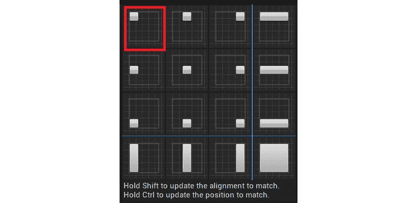

    图 15.8:默认情况下，在屏幕的不同位置有锚定小部件的选项

    锚定允许小部件保持其在`Canvas`面板内的期望位置，而不管不同的屏幕尺寸。

    现在`Text`小部件被锚定到了左上角，我们需要设置它相对于这个锚的位置，这样就有一个偏移量来更好地定位和可读性文本。

8.  在`Details`面板中，`Anchors`选项下方是`Position X`和`Position Y`的参数。将这两个参数设置为`100.0f`。
9.  Next, enable the `Size To Content` parameter so that the size of the `Text` widget will automatically resize itself, depending on the size of the text it is displaying, as shown in the following screenshot:

    

    图 15.9:内容大小参数将确保文本小部件显示其全部内容，并且不会被截断

10.  我们在这里需要做的最后一件事是更新`Text`小部件使用的字体大小。在`Text`小部件的`Details`面板的`Appearance`选项卡下，您将找到`Size`参数。将该值设置为`48`。
11.  The final `Text` widget will look like this:

    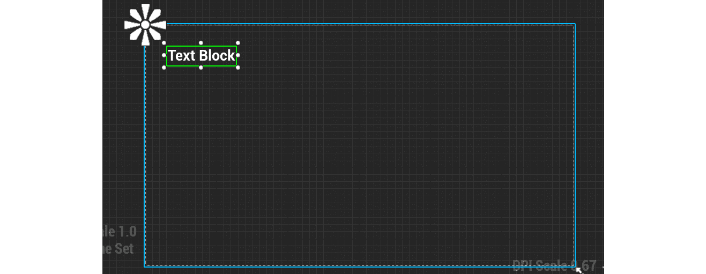

    图 15.10:文本小部件现在固定在画布面板的左上角，相对偏移较小，字体较大，以便于玩家阅读

    现在我们已经按照我们需要的方式定位和调整了`Text`小部件的大小，让我们给文本添加一个新的绑定，这样它将自动更新并匹配玩家收藏数量的值。

12.  选择`Text`部件后，在`Details`面板的`Content`类别下找到`Text`参数。在那里，你会找到`Bind`选项。
13.  *Left-click* the `Bind` option and select `Create Binding`. When doing this, the new `Function Binding` will be created automatically and be given the name `GetText_0`. Please refer to the following screenshot:

    

    图 15.11:始终重命名绑定函数很重要，因为它们的默认名称太通用了

14.  重命名该功能`Get Number of Collectables`。
15.  Before continuing with this function, create a new object reference variable called `Player` that's of the `SuperSideScroller_Player` type. Make this variable `Public` and exposable on spawn by enabling both the `Instance Editable` and `Expose on Spawn` parameters of the variable, as shown in the following screenshot:

    

    图 15.12:玩家变量现在应该启用实例可编辑和产卵时暴露参数

    通过使`Player`变量`Public`在产卵时暴露，您将能够在创建小部件并将其添加到屏幕时分配该变量。我们将在*练习 15.05* 、*中为玩家界面*添加硬币计数器用户界面。

    现在我们有了对`SuperSideScroller_Player`的引用变量，让我们继续`Get Number of Collectables`绑定函数。

16.  将`Player`变量的`Getter`添加到`Get Number of Collectables`函数中。
17.  From this variable, *left-click* and drag and from the context-sensitive drop-down menu, and find and select the `Get Current Number of Collectables` function. Please refer to the following screenshot:

    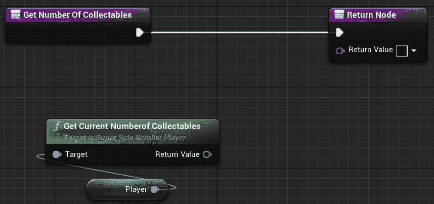

    图 15.13:您在练习 15.03 中创建的获取当前收藏数量 C++ 函数

18.  Next, *left-click* and drag out the `Return Value` text parameter of the `Get Number of Collectables` to `Return Node`. From the context-sensitive drop-down menu, search for and select the `Format Text` option, as shown in the following screenshot:

    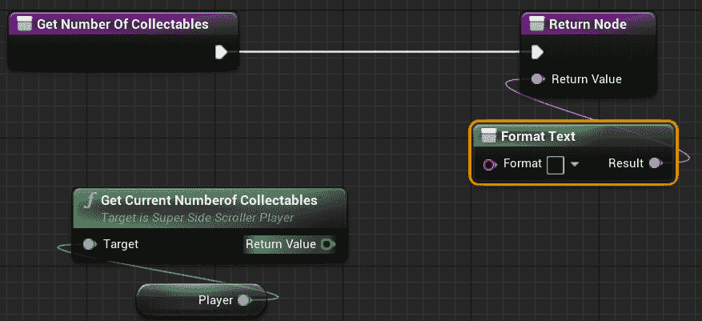

    图 15.14:现在，我们可以创建定制和格式化的文本来满足文本的需求

19.  Within the `Format Text` function, add the following text:

    ```cpp
    Coins: {coins}
    ```

    请参考以下截图:

    

    图 15.15:现在，格式化文本有了一个新的输入参数，我们可以用它来显示定制信息

    请记住，使用`{}`符号表示一个文本参数，它允许您将变量传递到文本中。

20.  Finally, connect the int `Return Value` of the `GetCurrentNumberofCollectables()` function to the wildcard `coins` input pin of the `Format Text` function, as shown here:

    

    图 15.16:现在，文本小部件将根据从获取当前收藏数函数返回的更新值自动更新

21.  Compile and save the `BP_UI_CoinCollection` widget Blueprint.

    注意

    您可以在这里找到本练习的资产和代码:[https://packt.live/3eQJjTU](https://packt.live/3eQJjTU)。

完成本练习后，您已经创建了显示玩家当前收集的硬币数量所需的`UI UMG`小部件。通过使用`GetCurrentNumberofCollectables()` C++ 函数和`Text`小部件的绑定功能，用户界面将始终根据收集的硬币数量更新其值。在下一个练习中，我们将把这个用户界面添加到玩家的屏幕上，但是首先，我们将简要了解如何在玩家屏幕上添加和移除 UMG。

# 添加和创建 UMG 用户小部件

现在我们已经在 UMG 创建了硬币收集用户界面，是时候学习如何在玩家屏幕上添加和移除用户界面了。通过将硬币收集用户界面添加到玩家屏幕，用户界面对玩家变得可见，并且可以随着玩家收集硬币而更新。

在蓝图中，有一个叫做`Create Widget`的函数，如下图截图所示。没有指定的班级，会贴上`Construct None`的标签，但不要让这个迷惑了你:


图 15.17:默认情况下的创建小部件，没有应用类

该功能需要创建`User`小部件的类，并且需要一个`Player Controller`作为该用户界面的拥有者。该函数随后将衍生的用户小部件作为其`Return Value`返回，然后您可以使用`Add to Viewport`函数将其添加到玩家的视口中。`Create Widget`函数只实例化小部件对象；它不会将这个小部件添加到播放器的屏幕上。正是`Add to Viewport`功能使这个小部件在玩家的屏幕上可见:

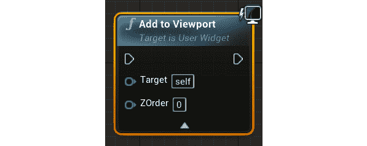

图 15.18:用 ZOrder 添加到视口功能

视口是覆盖你的游戏世界视图的游戏屏幕，在多个 UI 元素需要上下重叠的情况下，它使用所谓的`ZOrder`来确定覆盖深度。默认情况下，`Add to Viewport`功能会将`User`小部件添加到屏幕上，并使其充满整个屏幕；也就是说，除非调用`Set Desired Size In Viewport`函数来设置手动填充的大小:


图 15.19:大小参数决定了传入的用户小部件的期望大小

在 C++ 中，你还有一个叫做`CreateWidget()`的函数:

```cpp
template<typename WidgetT, typename OwnerT>
WidgetT * CreateWidget
(
  OwnerT * OwningObject,
  TSubclassOf < UUserWidget > UserWidgetClass,
  FName WidgetName
)
```

`CreateWidget()`功能可通过`UserWidget`类获得，可在`/Engine/Source/Runtime/UMG/Public/Blueprint/UserWidget.h`中找到。

这方面的一个例子可以在*第 8 章*、*用户界面*中找到，在这里您使用`CreateWidget()`功能创建`BP_HUDWidget`:

```cpp
HUDWidget = CreateWidget<UHUDWidget>(this, BP_HUDWidget);
```

有关 C++ 中`CreateWidget()`功能的更多信息，请参考*第 8 章*、*用户界面*和*练习 8.06、* *创建健康栏 C++ 逻辑*。

该函数的工作原理与蓝图函数几乎相同，因为它采用了`Owning Object`参数，很像蓝图函数的`Owning Player`参数，并且需要创建`User Widget`类。C++ `CreateWidget()`函数还接受一个`FName`参数来表示小部件的名称。

既然我们已经了解了向播放器屏幕添加用户界面的方法，让我们来测试一下这些知识。在下面的练习中，您将实现`Create Widget`和`Add to Viewport`蓝图功能，以便我们可以将我们在*练习 15.04* 、*创建硬币计数器用户界面 HUD 元素*中创建的硬币收集用户界面添加到玩家屏幕上。

## 练习 15.05:将硬币计数器 UI 添加到玩家屏幕

在本练习中，您将创建一个新的`Player Controller`类，以便您可以使用玩家控制器将`BP_UI_CoinCollection`小部件蓝图添加到玩家屏幕上。从那里，你还将创建一个新的`Game Mode`职业，并将这个游戏模式应用到`SuperSideScroller`项目中。执行以下步骤完成本练习:

1.  在虚幻引擎 4 编辑器中，导航至`File`，然后导航至`New C++ Class`。
2.  在`Choose Parent Class`对话框窗口中，找到并选择`Player Controller`选项。
3.  命名新的`Player Controller`类`SuperSideScroller_Controller`，然后*左键点击*`Create Class`按钮。Visual Studio 将自动生成并打开`SuperSideScroller_Controller`类的源文件和头文件，但目前，我们将停留在虚幻引擎 4 编辑器中。
4.  在`Content Browser`窗口的`MainCharacter`文件夹目录下，新建一个名为`PlayerController`的文件夹。
5.  In the `PlayerController` folder, *right-click* and create a new `Blueprint Class` using the new `SuperSideScroller_Controller` class. Please refer to the following screenshot:

    

    图 15.20:找到新的 SuperSideScroller_Controller 类来创建新的蓝图

6.  Name this new Blueprint `BP_SuperSideScroller_PC` and then *double-left-click* the asset to open it.

    要将`BP_UI_CoinCollection`小部件添加到屏幕上，我们需要使用`Add to Viewport`功能和`Create Widget`功能。我们希望在玩家角色被玩家控制器`Possessed`激活后，用户界面被添加到玩家的屏幕上。

7.  *Right-click* inside the Blueprint graph and from the context-sensitive menu, find the `Event On Possess` option and *left-click* to add it to the graph. Please refer to the following screenshot:

    

    图 15.21:每次这个控制器类拥有一个新棋子时，都会调用占有事件选项

    `Event On Possess`事件节点返回`Possessed Pawn`。我们将使用这个棋子进入我们的`BP_UI_CoinCollection UI Widget`，但是首先，我们需要`Cast To``SuperSideScroller_Player`类。

8.  *Left-click* and drag from the output the `Possessed Pawn` parameter of the `Event On Possess` node. Then, search for and find the `Cast to SuperSideScroller_Player` node. Please refer to the following screenshot:

    

    图 15.22:我们需要转换到超级玩家角色类，以确保我们转换到正确的玩家角色类

9.  现在，*右键单击*，搜索`Create Widget`功能，将其添加到蓝图图形中。
10.  From the drop-down class parameter, find and assign the `BP_UI_CoinCollection` asset you created in *Exercise 15.04*, *Creating the Coin Counter UI HUD Element*. Please refer to the following screenshot:

    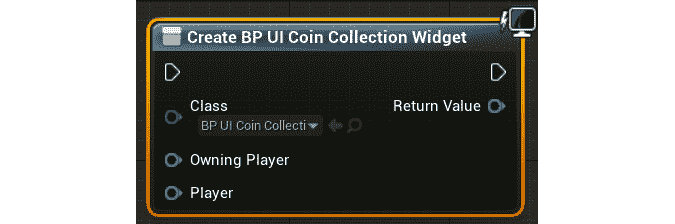

    图 15.23:创建小部件函数将使用传递给它的 UMG 类创建一个新的用户界面对象

    将`Class`参数更新到`BP_UI_CoinCollection`类后，您会注意到`Create Widget`函数将更新以显示您创建的`Player`变量，设置为`Exposed on Spawn`。

11.  *Right-click* in the Blueprint graph to search for and find the `Self` reference variable from the context-sensitive drop-down menu. Connect the `Self` object variable to the `Owning Player` parameter of the `Create Widge`t function, as shown in the following screenshot:

    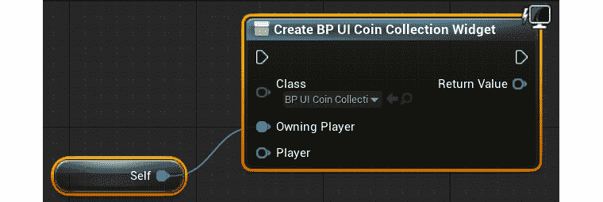

    图 15.24:拥有玩家输入参数属于玩家控制器类型

    `Owning Player`参数是指将显示并拥有该 UI 对象的`Player Controller`类型。由于我们将这个用户界面添加到`SuperSideScroller_Controller`蓝图中，我们可以只使用`Self`引用变量传递到函数中。

12.  Next, pass in the returned `SuperSideScroller_Player` variable from the `Cast` node to the `Player` input node of the `Create Widget` function. Then, connect the execution pins of the `Cast` node and the `Create Widget` function, as shown in the following screenshot:

    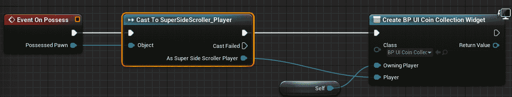

    图 15.25:如果 Cast To SuperSideScroller_Player 有效，我们可以创建 BP_UI_CoinCollection 小部件并传入已经拥有的播放器

    注意

    您可以在以下链接找到前面的全分辨率截图，以便更好地查看:[https://packt.live/3f89m99](https://packt.live/3f89m99)。

13.  *再次右键单击蓝图图内的*，搜索并找到`Add to Viewport`功能，即可将其放置在图中。
14.  将`Create Widget`功能的输出`Return Value`参数连接到`Add to Viewport`功能的`Target`输入参数；不要更改`ZOrder`参数。
15.  Lastly, connect the execution pins of the `Create Widget` and `Add to Viewport` functions, as shown here:

    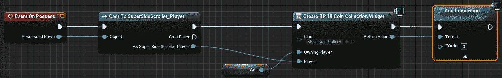

    图 15.26:在创建了 BP_UI_CoinCollection 小部件之后，我们可以将其添加到播放器视口中

    注意

    您可以在以下链接找到前面的全分辨率截图，以便更好地查看:[https://packt.live/2UwufBd](https://packt.live/2UwufBd)。

    现在玩家控制器将`BP_UI_CoinCollection`小部件添加到玩家的视口中，我们需要创建一个`GameMode`蓝图并将`BP_SuperSideScroller_MainCharacter`和`BP_SuperSideScroller_PC`类都应用到这个游戏模式中。

16.  在`Content Browser`窗口中，通过*右键单击`Content`文件夹并选择`New Folder`来创建新文件夹。命名这个文件夹`GameMode`。*
17.  接下来，*右键点击*，选择`Blueprint Class`开始创建游戏模式蓝图。在`Pick Parent Class`对话框窗口中，搜索并找到`All Classes`下的`SuperSideScrollerGameMode`。
18.  Name this new `GameMode` Blueprint `BP_SuperSideScroller_GameMode`. *Double-left-click* this asset to open it.

    `GameMode`蓝图包含一个类列表，您可以使用自己的唯一类进行自定义。目前，我们只会担心`Player Controller Class`和`Default Pawn Class`。

19.  *左键单击`Player Controller Class`下拉菜单中的*，找到并选择您在本练习前面创建的`BP_SuperSideScroller_PC`蓝图。
20.  Then, *left-click* the `Default Pawn Class` dropdown to find and select the `BP_SuperSideScroller_MainCharacter` Blueprint.

    现在我们有了一个自定义`GameMode`，它利用了我们的自定义`Player Controller`和`Player Character`类，让我们将这个游戏模式添加到`Project Settings`窗口，这样当使用 PIE 和烹饪项目的构建时，游戏模式将被默认使用。

21.  从虚幻引擎 4 编辑器中，导航至屏幕顶部的`Edit`选项。*左键点击*这个选项，从下拉菜单中找到并选择`Project Settings`选项。
22.  在`Project Settings`窗口的左侧，您会看到一个分类列表，分为几个部分。在`Project`部分下，*左键单击`Maps & Modes`类别的*。
23.  In the `Maps & Modes` section, you have a handful of parameters related to your project's default maps and game mode. At the top of this section, you have the `Default GameMode` option. *Left-click* this dropdown to find and select the `SuperSideScroller_GameMode` Blueprint you created earlier in this exercise.

    注意

    对`Maps & Modes`部分所做的更改会自动保存并写入`DefaultEngine.ini`文件，该文件可以在项目的`Config`文件夹中找到。`Default GameMode`可以通过更新`GameMode Override`参数来覆盖每一级，该参数可以在你的级别的`World Settings`窗口中找到。

24.  Close the `Project Settings` window and return to your level. Use PIE and start collecting coins. Observe that the `BP_UI_CoinCollection` widget is shown and updated each time you collect a coin, as shown in the following screenshot:

    

图 15.27:现在，你收集的每一枚硬币都会出现在玩家界面上

注意

您可以在这里找到本练习的资产和代码:[https://packt.live/2JRfSFz](https://packt.live/2JRfSFz)。

完成本练习后，您已经创建了显示玩家当前收集的硬币数量所需的`UI UMG`小部件。通过使用`GetCurrentNumberofCollectables()` C++ 函数和`Text`小部件的绑定功能，用户界面将始终根据收集的硬币数量更新其值。

到目前为止，我们专注于可收集的硬币，并允许玩家收集这些硬币，并将收集的硬币总数添加到玩家的用户界面中。现在，我们将专注于药剂加电，并在短时间内给予玩家移动速度和跳跃高度的增加。为了实现这个功能，我们首先需要研究计时器。

# 计时器

虚幻引擎 4 中的计时器允许您在延迟后或每 X 秒执行一次操作。在`SuperSideScroller`药剂加电的情况下，一个计时器将用于恢复玩家的移动，并在 8 秒后跳转到它们的默认值。

注意

在蓝图中，除了计时器句柄之外，您还可以使用延迟节点来实现相同的结果。然而，在 C++ 中，计时器是实现延迟和重复逻辑的最佳手段。

定时器由存在于`UWorld`对象中的`Timer Manager`或`FTimerManager`管理。您将从`FTimerManager`类中使用两个主要功能，称为`SetTimer()`和`ClearTimer()`:

```cpp
void SetTimer
(
    FTimerHandle & InOutHandle,
    TFunction < void )> && Callback,
    float InRate,
    bool InbLoop,
    float InFirstDelay
)
void ClearTimer(FTimerHandle& InHandle)
```

你可能已经注意到，在这两个功能中，都有一个必选的`FTimerHandle`。这个手柄用来控制你设置的定时器。使用这个手柄，您可以暂停、恢复、清除甚至延长计时器。

`SetTimer()`功能在初始设置时还有其他参数帮助你自定义这个`Timer`。`Timer`完成后将调用回调函数，如果`InbLoop`参数为`True`，将无限期继续调用回调函数，直到定时器停止。`InRate`参数是定时器本身的持续时间，而`InFirstDelay`是在定时器开始为`InRate`计时之前应用于定时器的初始延迟。

`FTimerManager`类的头文件可以在这里找到:`/Engine/Source/Runtime/Engine/Public/TimerManager.h`。

注意

您可以通过阅读这里的文档来了解更多关于计时器和`FTimerHandle`的信息。

在下面的练习中，你将在`SuperSideScroller_Player`类中创建自己的`FTimerHandle`，并使用它来控制药剂加电对玩家的影响持续多长时间。

## 练习 15.06:为玩家添加药剂加电行为

在本练习中，您将创建药剂启动背后的逻辑以及它将如何影响玩家角色。您将利用计时器和计时器手柄来确保上电效果只持续很短的时间。按照以下步骤完成:

1.  在 Visual Studio 中，导航并打开`SuperSideScroller_Player.h`头文件。
2.  Under `our Private Access Modifier`, add a new variable of the `FTimerHandle` type and name it `PowerupHandle`:

    ```cpp
    FTimerHandle PowerupHandle;
    ```

    这个计时器句柄将负责跟踪自启动以来已经过去了多长时间。这将允许我们控制药剂启动效果持续的时间。

3.  Next, add a Boolean variable under our `Private Access Modifier` called `bHasPowerupActive`:

    ```cpp
    bool bHasPowerupActive;
    ```

    我们在更新`Sprint()`和`StopSprinting()`功能的时候会用到这个布尔变量，保证我们根据上电是否活跃来适当更新玩家的冲刺移动速度。

4.  Next, declare a new void function called `IncreaseMovementPowerup()` under our `Public Access Modifier`:

    ```cpp
    void IncreaseMovementPowerup();
    ```

    这是将从药剂加电类调用的功能，为玩家启用加电效果。

5.  Finally, you need to create a function that handles when the power-up effects end. Create a function called `EndPowerup()` under `Protected Access Modifier`:

    ```cpp
    void EndPowerup();
    ```

    声明了所有必要的变量和函数后，是时候开始定义这些新函数并处理播放器上电的影响了。

6.  导航至`SuperSideScroller_Player.cpp`源文件。
7.  首先，在源文件顶部添加头文件`#include "TimerManager.h"`；为了使用`Timers`，我们将需要这个类。
8.  通过在源文件中添加以下代码来定义`IncreaseMovementPowerup()`函数:

    ```cpp
    void ASuperSideScroller_Player::IncreaseMovementPowerup()
    {
    }
    ```

9.  调用这个函数时，我们首先要做的就是将`bHasPowerupActive`变量设置为`true`。将以下代码添加到`IncreaseMovementPowerup()`功能中:

    ```cpp
    bHasPowerupActive = true;
    ```

10.  Next, add the following code to increase both the `MaxWalkSpeed` and `JumpZVelocity` components of the player character movement component:

    ```cpp
    GetCharacterMovement()->MaxWalkSpeed = 500.0f;
    GetCharacterMovement()->JumpZVelocity = 1500.0f;
    ```

    这里，我们将`MaxWalkSpeed`从默认的`300.0f`值更改为`500.0f`。大家可能还记得，默认的冲刺速度也是`500.0f`。我们将在本练习的后面部分讨论这个问题，以便在启动时提高冲刺速度。

11.  To take advantage of timers, we need to get a reference to the `UWorld` object. Add the following code:

    ```cpp
    UWorld* World = GetWorld();
    if (World)
    {
    }
    ```

    正如我们之前在这个项目中多次做的那样，我们使用`GetWorld()`函数来获取对`UWorld`对象的引用，并将该引用保存在其变量中。

12.  Now that we have the reference to the `World` object and have performed a validity check, it is safe to use the `TimerManager` to set the power-up timer. Add the following code within the `if()` statement shown in the previous step:

    ```cpp
    World->GetTimerManager().SetTimer(PowerupHandle, this,   &ASuperSideScroller_Player::EndPowerup, 8.0f, false);
    ```

    这里，您正在使用`TimerManager`类设置计时器。`SetTimer()`功能取`FTimerHandle`组件使用；在这种情况下，您创建的`PowerupHandle`变量。接下来，我们需要通过使用`this` 关键字来传递对玩家类的引用。然后，我们需要提供定时器结束后要调用的回调函数，这种情况下就是`&ASuperSideScroller_Player::EndPowerup`函数。`8.0f`代表定时器的持续时间；你可以随意调整，但现在，8 秒钟就可以了。最后，还有一个参数决定这个计时器是否应该循环；在这种情况下，它不应该。

13.  为`EndPowerup()`函数创建函数定义:

    ```cpp
    void ASuperSideScroller_Player::EndPowerup()
    {
    }
    ```

14.  调用`EndPowerup()`函数的第一件事是将`bHasPowerupActive`变量设置为`false`。在`EndPowerup()`功能中添加以下代码:

    ```cpp
    bHasPowerupActive = false;
    ```

15.  Next, change the `MaxWalkSpeed` and `JumpZVelocity` parameters of the character movement component back to their default values. Add the following code:

    ```cpp
    GetCharacterMovement()->MaxWalkSpeed = 300.0f;
    GetCharacterMovement()->JumpZVelocity = 1000.0f;
    ```

    这里，我们将角色移动组件的`MaxWalkSpeed`和`JumpZVelocity`参数都更改为默认值。

16.  同样，为了利用计时器并清除计时器来处理`PowerupHandle`，我们需要获取对`UWorld`对象的引用。添加此代码:

    ```cpp
    UWorld* World = GetWorld();
    if (World)
    {
    }
    ```

17.  Finally, we can add the code to clear the timer handle's `PowerupHandle`:

    ```cpp
    World->GetTimerManager().ClearTimer(PowerupHandle);
    ```

    通过使用`ClearTimer()`功能并传入`PowerupHandle`，我们确保该定时器不再有效，不会再影响玩家。

    现在我们已经创建了处理加电效果和与效果相关的计时器的功能，我们需要更新`Sprint()`和`StopSprinting()`功能，以便它们也考虑到加电激活时玩家的速度。

18.  Update the `Sprint()` function to the following:

    ```cpp
    void ASuperSideScroller_Player::Sprint()
    {
      if (!bIsSprinting)
      {
        bIsSprinting = true;
        if (bHasPowerupActive)
        {
          GetCharacterMovement()->MaxWalkSpeed = 900.0f;
        }
        else
        {
          GetCharacterMovement()->MaxWalkSpeed = 500.0f;
        }
      }
    }
    ```

    这里，我们正在更新`Sprint()`函数，以考虑`bHasPowerupActive`是否为真。如果这个变量为真，那么我们在从`500.0f`冲刺到`900.0f`时增加`MaxWalkSpeed`，如下图所示:

    ```cpp
    if (bHasPowerupActive)
    {
      GetCharacterMovement()->MaxWalkSpeed = 900.0f;
    }
    ```

    如果`bHasPowerupActive`为假，那么我们将`MaxWalkSpeed`增加到`500.0f`，就像我们默认的那样。

19.  Update the `StopSprinting()` function to the following:

    ```cpp
    void ASuperSideScroller_Player::StopSprinting()
    {
      if (bIsSprinting)
      {
        bIsSprinting = false;
        if (bHasPowerupActive)
        {
          GetCharacterMovement()->MaxWalkSpeed = 500.0f;
        }
        else
        {
          GetCharacterMovement()->MaxWalkSpeed = 300.0f;
        }
      }
    }
    ```

    这里，我们正在更新`StopSprinting()`函数，以考虑`bHasPowerupActive`是否为真。如果这个变量为真，那么我们将`MaxWalkSpeed`值设置为`500.0f`而不是`300.0f`，如下图所示:

    ```cpp
    if (bHasPowerupActive)
    {
      GetCharacterMovement()->MaxWalkSpeed = 500.0f;
    }
    ```

    如果`bHasPowerupActive`为假，那么我们将`MaxWalkSpeed`设置为`300.0f`，就像我们默认的那样。

20.  Finally, all we need to do is recompile the C++ code.

    注意

    您可以在这里找到本练习的资产和代码:[https://packt.live/3eP39yL](https://packt.live/3eP39yL)。

完成这个练习后，你已经在玩家角色中创建了药剂启动效果。加电既增加了玩家的默认移动速度，也增加了他们的跳跃高度。此外，加电的效果提高了短跑速度。通过使用定时器手柄，您可以控制上电效果持续的时间。

现在，是时候创建药剂启动演员了，这样我们就可以在游戏中有一个这个启动的代表。

## 活动 15.03:创造药剂启动演员

现在`SuperSideScroller_Player`职业处理药剂加电的效果，是时候创建药剂加电职业和蓝图了。本活动的目的是创建药剂加电类，从`PickableActor_Base`类继承，实现重叠功能以授予您在*练习 15.06* 、*中实现的移动效果，为玩家*添加药剂加电行为，并为药剂加电创建蓝图演员。执行以下步骤创建药剂启动类和药剂蓝图演员:

1.  创建一个从`PickableActor_Base`类继承的新 C++ 类，并命名这个新类`PickableActor_Powerup`。
2.  为`BeginPlay()`和`PlayerPickedUp()`函数添加覆盖函数声明。
3.  为`BeginPlay()`函数创建函数定义。在`BeginPlay()`函数中，添加对父类函数的调用。
4.  为`PlayerPickedUp()`函数创建函数定义。在`PlayerPickedUp()`函数中，添加对`PlayerPickedUp()`父类函数的调用。
5.  接下来，为`SuperSideScroller_Player`类添加必要的`#include`文件，这样我们就可以引用玩家类及其功能。
6.  在`PlayerPickedUp()`函数中，使用函数本身的`Player`输入参数对`IncreaseMovementPowerup()`进行函数调用。
7.  从`Epic Games Launcher`开始，在`Games`类别下的`Learn`选项卡中找到`Action RPG`项目。使用它来创建和安装新项目。
8.  将`A_Character_Heal_Mana_Cue`和`SM_PotionBottle`资产以及它们的所有引用资产从`Action RPG`项目迁移到您的`SuperSideScroller`项目。
9.  在`PickableItems` 目录下的`Content Browser`窗口中创建一个名为`Powerup`的新文件夹。基于`PickableActor_Powerup`类在该目录中创建新蓝图，并将该资产命名为`BP_Powerup`。
10.  在`BP_Powerup`中，更新`MeshComp`组件，以便使用`SM_PotionBottle`静态网格。
11.  接下来，添加`A_Character_Heal_Mana_Cue`，将其导入为`Pickup Sound`参数。
12.  最后，更新`RotationComp`组件，使演员围绕`Pitch`轴每秒旋转 60 度，围绕`Yaw`轴每秒旋转 180 度。
13.  Add `BP_Powerup` to your level and use PIE to observe the results when overlapping with the power-up.

    预期产出:

    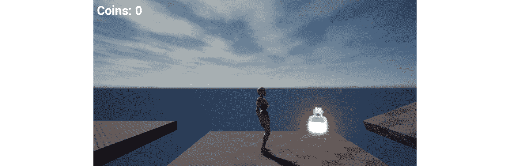

图 15.28:药剂加电现在有了一个很好的视觉表现，可以被玩家叠加来启用它的加电效果

注意

这个活动的解决方案可以在:[https://packt.live/338jEBx](https://packt.live/338jEBx)找到。

完成本练习后，您可以测试您的知识，创建一个新的 C++ 类，该类继承自`PickableActor_Base`类并覆盖`PlayerPickedUp()`函数以添加自定义逻辑。通过从玩家类添加对`IncreaseMovementPowerup()`功能的调用，当与演员重叠时，您可以为玩家添加移动启动效果。然后，通过使用自定义网格、材质和音频资源，您可以将蓝图演员从`PickableActor_Powerup`类中激活。

现在我们已经创建了硬币收藏品和药剂启动，我们需要在项目中实现一个新的游戏特性:`Brick`类。在《超级马里奥》等游戏中，砖块包含隐藏的硬币和电源，供玩家寻找。这些砖块也是到达高架平台和楼层内区域的一种手段。在我们的`SuperSideScroller`项目中，`Brick`类将为玩家提供隐藏的硬币收藏品，并通过使用砖块作为到达难以到达的位置的路径来让玩家到达关卡区域。所以，在下一节中，我们将创建`Brick`类，它需要被打破才能找到隐藏的硬币。

## 练习 15.07:创建砖块类

现在我们已经创建了硬币收藏品和药剂加电，是时候创建`Brick`类了，它将包含玩家的隐藏硬币。砖块是`SuperSideScroller`项目的最终游戏元素。在本练习中，您将创建`Brick`类，它将被用作`SuperSideScroller`游戏项目的平台化机制的一部分，但也是玩家寻找收藏品的一种方式。按照以下步骤创建这个`Brick`类及其蓝图:

1.  在虚幻引擎 4 编辑器中，导航至`File`，然后导航至`New C++ Class`。
2.  在`Choose Parent Class`对话框窗口中，找到并选择`Actor`类。
3.  Name this class `SuperSideScroller_Brick` and *left-click* `Create Class`. Visual Studio and Unreal Engine will recompile the code and open this class for you.

    默认情况下，`SuperSideScroller_Brick`类带有`Tick()`功能，但是我们不需要这个功能给`Brick`类。继续之前，从`SuperSideScroller_Brick.h`头文件中删除`Tick()`的函数声明，并从`SuperSideScroller_Brick.cpp`源文件中删除函数定义。

4.  在`SuperSideScroller_Brick.h`文件的`Private Access Modifier`下，添加以下代码来声明一个新的`UStaticMeshComponent* UPROPERTY()`函数来表示我们游戏世界中的砖块:

    ```cpp
    UPROPERTY(VisibleDefaultsOnly, Category = Brick)
    class UStaticMeshComponent* BrickMesh;
    ```

5.  接下来，我们需要创建一个`UBoxComponent UPROPERTY()`来处理与玩家角色的碰撞。添加以下代码，在我们的`Private Access Modifier`下添加该组件:

    ```cpp
    UPROPERTY(VisibleDefaultsOnly, Category = Brick)
    class UBoxComponent* BrickCollision;
    ```

6.  Create the `UFUNCTION()` declaration for the `OnHit()` function under our `Private Access Modifier`. This will be used to determine when `UBoxComponent` is hit by the player:

    ```cpp
    UFUNCTION()
    void OnHit(UPrimitiveComponent* HitComp, AActor* OtherActor,   UprimitiveComponent* OtherComp, FVector NormalImpulse,   const FHitResult& Hit);
    ```

    注意

    回想一下，您在开发*第十三章**敌方人工智能*中的`PlayerProjectile`类时，为这个项目使用了`OnHit()`功能。有关`OnHit()`功能的更多信息，请查阅该章。

7.  Next, create a new Boolean `UPROPERTY()` under our `Private Access Modifier` using the `EditAnywhere` keyword called `bHasCollectable`:

    ```cpp
    UPROPERTY(EditAnywhere)
    bool bHasCollectable;
    ```

    这个布尔值将决定砖块是否包含玩家可以收集的硬币。

8.  Now, we need a variable that holds how many coin collectibles are available within this brick for the player. We will do this by creating an integer variable called `Collectable Value`. Make this a `UPROPERTY()`, under the `private access modifier`, with the `EditAnywhere` keyword, and give it a default value of `1`, as shown here:

    ```cpp
    UPROPERTY(EditAnywhere)
    int32 CollectableValue = 1;
    ```

    砖块将需要包含一个独特的声音和粒子系统，以便当砖块被玩家破坏时，它有一个很好的抛光层。接下来我们将添加这些属性。

9.  在`SuperSideScroller_Brick.h`头文件中创建新的`Public Access Modifier`。
10.  接下来，使用`EditAnywhere`和`BlueprintReadOnly`关键字为`USoundBase`类的一个变量创建一个新的`UPROPERTY()`。命名这个变量`HitSound`，如下图:

    ```cpp
    UPROPERTY(EditAnywhere, BlueprintReadOnly)
    class USoundBase* HitSound;
    ```

11.  Then, create a new `UPROPERTY()` using the `EditAnywhere` and `BlueprintReadOnly` keywords for a variable of the `UParticleSystem` class. Make sure to put this under the `public access modifier`, and name this variable `Explosion`, as shown here:

    ```cpp
    UPROPERTY(EditAnywhere, BlueprintReadOnly, Category = Brick)
    class UParticleSystem* Explosion;
    ```

    现在我们已经拥有了`Brick`类的所有必要属性，让我们进入`SuperSideScroller_Brick.cpp`源文件，在这里我们将初始化组件。

12.  让我们从为`StaticMeshComponent`和`BoxComponent`添加以下`#include`目录开始。将以下代码添加到源文件的`#include`列表中:

    ```cpp
    #include "Components/StaticMeshComponent.h"
    #include "Components/BoxComponent.h"
    ```

13.  首先，通过向`ASuperSideScroller_Brick::ASuperSideScroller_Brick()`构造函数添加以下代码来初始化`BrickMesh`组件:

    ```cpp
    BrickMesh = CreateDefaultSubobject<UStaticMeshComponent>(TEXT("BrickMesh"));
    ```

14.  接下来，`BrickMesh`组件应该有碰撞，这样玩家就可以走在上面进行平台游戏。为确保默认情况下发生这种情况，添加以下代码将碰撞设置为`"BlockAll"` :

    ```cpp
    BrickMesh->SetCollisionProfileName("BlockAll");
    ```

15.  最后，`BrickMesh`组件将作为`Brick`参与者的根组件。添加以下代码来完成此操作:

    ```cpp
    RootComponent = BrickMesh;
    ```

16.  现在，在构造函数中添加以下代码来初始化我们的`BrickCollision UBoxComponent` :

    ```cpp
    BrickCollision = CreateDefaultSubobject<UBoxComponent>  (TEXT("BrickCollision"));
    ```

17.  就像`BrickMesh`组件一样，`BrickCollision`组件也需要将其碰撞设置为`"BlockAll"`，以便接收我们将在本练习后面添加的`OnHit()`回调事件。添加以下代码:

    ```cpp
    BrickCollision->SetCollisionProfileName("BlockAll");
    ```

18.  接下来，需要将`BrickCollision`组件附着到`BrickMesh`组件上。我们可以通过添加以下代码来做到这一点:

    ```cpp
    BrickCollision->AttachToComponent(RootComponent,   FAttachmentTransformRules::KeepWorldTransform);
    ```

19.  在完成`BrickCollision`组件的初始化之前，我们需要为`OnHit()`函数添加函数定义。在源文件中添加以下定义:

    ```cpp
    void ASuperSideScroller_Brick::OnHit(UPrimitiveComponent* HitComp, AActor*   OtherActor, UPrimitiveComponent* OtherComp, FVector NormalImpulse, const   FHitResult& Hit)
    {
    }
    ```

20.  现在我们已经定义了`OnHit()`函数，我们可以将`OnComponentHit`回调分配给`BrickCollision`组件。将以下代码添加到构造函数中:

    ```cpp
    BrickCollision->OnComponentHit.AddDynamic(this,   &ASuperSideScroller_Brick::OnHit);
    ```

21.  编译`SuperSideScroller_Brick`类的 C++ 代码，返回虚幻引擎 4 编辑器。
22.  在`Content Browser`窗口中，*右键单击`Content`文件夹中的*，选择 `New Folder`选项。命名这个文件夹`Brick`。
23.  *右键单击`Brick`文件夹内的*，选择`Blueprint Class`。在`Pick Parent Class`对话框窗口的`All Classes`搜索栏中，搜索并选择`SuperSideScroller_Brick`类别。
24.  命名这个新蓝图`BP_Brick`，然后*双击*资产将其打开。
25.  从`Components`选项卡中选择`BrickMesh`组件，并将其`Static Mesh`参数设置为`Shape_Cube`网格。
26.  With the `BrickMesh` component still selected, set the `Element 0` material parameter to `M_Brick_Clay_Beveled`. `M_Brick_Clay_Beveled` is a material provided by Epic Games by default when creating a new project. It can be found within the `StarterContent` directory, in the `Content Browser` window.

    我们最后需要对`BrickMesh`组件做的是调整它的比例，使其符合玩家角色的需求，以及`SuperSideScroller`游戏项目的平台化机制。

27.  With the `BrickMesh` component selected, make the following change to its `Scale` parameter:

    ```cpp
    (X=0.750000,Y=0.750000,Z=0.750000)
    ```

    现在`BrickMesh`组件是正常大小的`75%`，当我们将演员放入游戏世界时，以及当我们在关卡中开发有趣的平台化部分时，`Brick`演员对于我们设计师来说将变得更容易管理。

    这里的最后一步是更新`BrickCollision`组件的位置，使其只有部分碰撞从`BrickMesh`组件的底部突出。

28.  Select the `BrickCollision` component from the `Components` tab and update its `Location` parameter to the following values:

    ```cpp
    (X=0.000000,Y=0.000000,Z=30.000000)
    ```

    `BrickCollision`组件现在应定位如下:

    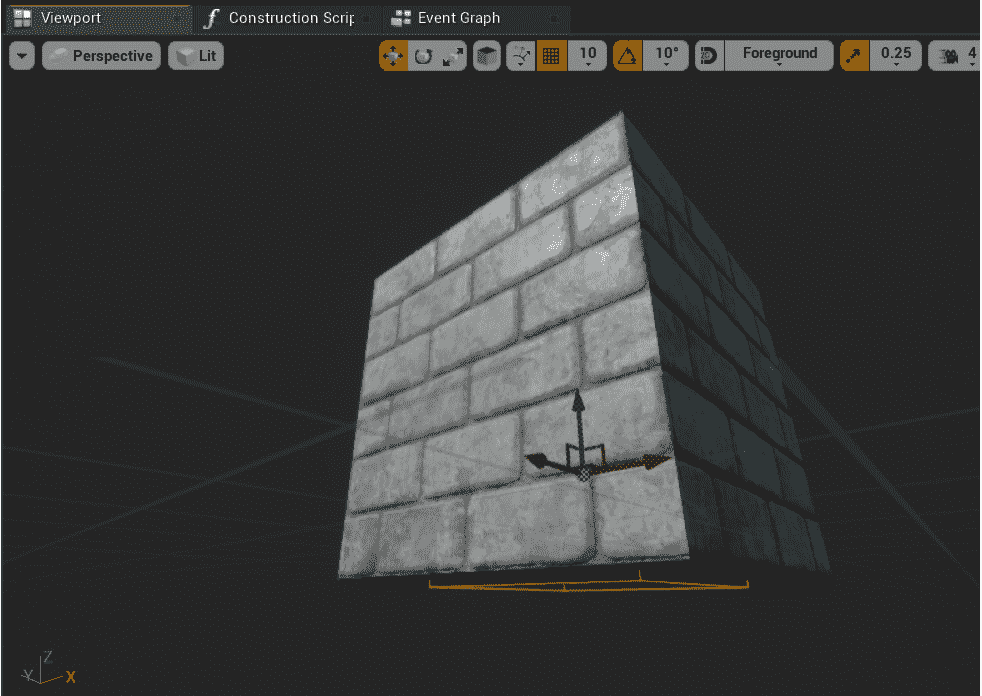

图 15.29:现在，砖块碰撞组件刚好在砖块网格组件之外

我们正在对`BrickCollision`组件的位置进行这种调整，以便玩家在砖块下跳跃时只能击中`UBoxComponent`。通过使其稍微超出`BrickMesh`组件，我们可以更好地控制这一点，并确保该组件不会被玩家以任何其他方式击中。

注意

您可以在这里找到本练习的资产和代码:[https://packt.live/3kr7rh6](https://packt.live/3kr7rh6)。

完成本练习后，您可以为`SuperSideScroller_Brick`类创建基础框架，并组合蓝图参与者来表示游戏世界中的砖块。通过添加立方体网格和砖块材料，您为砖块添加了良好的视觉效果。在下面的练习中，您将把剩余的 C++ 逻辑添加到砖块中。这将允许玩家摧毁砖块并获得收藏品。

## 练习 15.08:添加砖块类 C++ 逻辑

在前面的练习中，您通过添加必要的组件和创建`BP_Brick`蓝图参与者来创建`SuperSideScroller_Brick`类的基础框架。在本练习中，您将在*练习 15.07* 、*的 C++ 代码之上添加创建砖块类*，以将逻辑授予`Brick`类。这将允许砖块给玩家硬币收藏品。执行以下步骤来完成此操作:

1.  To begin, we need to create a function that will add the collectible to the player. Add the following function declaration to the `SuperSideScroller_Brick.h` header file, under our `Private Access Modifier`:

    ```cpp
    void AddCollectable(class ASuperSideScroller_Player* Player);
    ```

    我们希望传入对`SuperSideScroller_Player`类的引用，以便我们可以从该类调用`IncrementNumberofCollectables()`函数。

2.  Next, create a void function declaration called `PlayHitSound()` under our `Private Access Modifier`:

    ```cpp
    void PlayHitSound();
    ```

    `PlayHitSound()`功能将负责生成您在*练习 15.07* 、*中创建的`HitSound`属性，创建砖块类*。

3.  Finally, create another void function declaration called `PlayHitExplosion()` under our `Private Access Modifier`:

    ```cpp
    void PlayHitExplosion();
    ```

    `PlayHitExplosion()`功能将负责生成您在*练习 15.07* 、*中创建的`Explosion` 属性，创建砖块类*。

    在头文件中声明了`SuperSideScroller_Brick`类所需的剩余函数后，让我们继续在源文件中定义这些函数。

4.  At the top of the `SuperSideScroller_Brick.cpp` source file, add the following `#includes` to the list of `include` directories that already exist for this class:

    ```cpp
    #include "Engine/World.h"
    #include "Kismet/GameplayStatics.h"
    #include "SuperSideScroller_Player.h"
    ```

    包含`World`和`GameplayStatics`类对于生成砖块的`HitSound`和`Explosion`效果是必要的。包括`SuperSideScroller_Player`类需要调用`IncrementNumberofCollectables()`类函数。

5.  让我们从`AddCollectable()`函数的函数定义开始。添加以下代码:

    ```cpp
    void ASuperSideScroller_Brick::AddCollectable(class   ASuperSideScroller_Player* Player)
    {
    }
    ```

6.  现在，使用`Player`函数输入参数

    ```cpp
    Player->IncrementNumberofCollectables(CollectableValue);
    ```

    调用`IncrementNumberofCollectables()`函数
7.  对于`PlayHitSound()`函数，在从`UGameplayStatics`类对`SpawnSoundAtLocation`进行函数调用之前，您需要获取对`UWorld*`对象的引用并验证`HitSound`属性是否有效。这是一个你做过很多次的过程，所以这是整个功能代码:

    ```cpp
    void ASuperSideScroller_Brick::PlayHitSound()
    {
      UWorld* World = GetWorld();
      if (World)
      {
        if (HitSound)
        {
          UGameplayStatics::SpawnSoundAtLocation(World, HitSound,         GetActorLocation());
        }
      }
    }
    ```

8.  Just like the `PlayHitSound()` function, the `PlayHitExplosion()` function will work in an almost similar way, and it's a process you have done many times in this project. Add the following code to create the function definition:

    ```cpp
    void ASuperSideScroller_Brick::PlayHitExplosion()
    {
      UWorld* World = GetWorld();
      if (World)
      {
        if (Explosion)
        {
          UGameplayStatics::SpawnEmitterAtLocation(World, Explosion,         GetActorTransform());
        }
      }
    }
    ```

    定义了这些功能之后，让我们更新`OnHit()`功能，这样如果玩家真的击中了`BrickCollision`组件，我们就可以衍生出`HitSound`和`Explosion`，还可以给玩家的收藏增加一枚可收藏的硬币。

9.  首先，在`OnHit()`函数中，创建一个名为`ASuperSideScroller_Player`类型的新变量`Player`，该变量等于该函数的`OtherActor`输入参数的`Cast`，如下图所示:

    ```cpp
    ASuperSideScroller_Player* Player =   Cast<ASuperSideScroller_Player>(OtherActor);
    ```

10.  接下来，我们只想在`Player`有效且`bHasCollectable`为`True`的情况下继续该功能。增加以下`if()`声明:

    ```cpp
    if (Player && bHasCollectable)
    {
    }
    ```

11.  如果满足`if()`语句中的条件，那就是我们需要调用`AddCollectable()`、`PlayHitSound()`和`PlayHitExplosion()`功能的时候。确保在`AddCollectable()`功能中也输入`Player`变量:

    ```cpp
    AddCollectable(Player);
    PlayHitSound();
    PlayHitExplosion();
    ```

12.  最后添加函数调用破坏`if()`语句里面的砖块:

    ```cpp
    Destroy();
    ```

13.  根据我们的需要定义`OnHit()`函数，重新编译 C++ 代码，但不要返回到虚幻引擎 4 编辑器。
14.  对于砖块爆炸的 VFX 和 SFX，我们将需要从`Epic Games Launcher`迁移两个独立项目中的资产，这两个项目是我们可以使用的:`Blueprints` 项目和`Content Examples`项目。
15.  使用您从以前练习中获得的知识，使用 4.24 版引擎下载并安装这些项目。这两个项目都可以在`Engine Feature Samples`类别下的`Learn`选项卡中找到。
16.  安装完成后，打开`Content Examples`项目，在`Content Browser`窗口中找到`P_Pixel_Explosion`资产。
17.  *右键点击*该资产，然后选择`Asset Actions`，再选择`Migrate`。将该资产及其所有引用的资产迁移到您的`SuperSideScroller`项目中。
18.  一旦该资产成功迁移，关闭`Content Examples`项目并打开`Blueprints`项目。
19.  从`Blueprints`项目的`Content Browser`窗口，找到`Blueprints_TextPop01`资产。
20.  *Right-click* this asset, then select `Asset Actions`, and then `Migrate`. Migrate this asset and all its referenced assets into your `SuperSideScroller` project.

    将这些资产迁移到您的项目后，返回到您的`SuperSideScroller`项目的虚幻引擎 4 编辑器。

21.  导航至`Content Browser`窗口中的`Brick`文件夹，双击`BP_Brick`资源的将其打开。
22.  在演员的`Details`面板中，找到`Super Side Scroller Brick`部分，将`HitSound`参数设置为您导入的`Blueprints_TextPop01`声波。
23.  接下来，将导入的`P_Pixel_Explosion`粒子添加到`Explosion`参数中。
24.  重新编译`BP_Brick`蓝图，在你的关卡中增加两个这样的角色。
25.  Set one of the bricks so that the `bHasCollectable` parameter is `True`; set the other to `False`. Please refer to the following screenshot:

    

    图 15.30:这个 Brick 演员将会有一个可收集的种子

26.  Using PIE, observe the differences in behavior between the two brick actors when you attempt to hit the bottom of the brick with the character's head when jumping, as shown in the following screenshot:

    

图 15.31:现在，玩家可以击中砖块，砖块将被摧毁

当`bHasCollectable`为`True`时，`SuperSideScroller_Brick`会玩我们的`HitSound`，产卵`Explosion`粒子系统，给玩家加一枚可收藏的硬币，被消灭。

注意

您可以在这里找到本练习的资产和代码:[https://packt.live/3pjhoAv](https://packt.live/3pjhoAv)。

完成本练习后，您现在已经完成了`SuperSideScroller`游戏项目的游戏机制开发。现在，`SuperSideScroller_Brick`类既可以用于平台游戏，也可以用于我们想要的游戏硬币收集机制。

现在砖块可以被摧毁，隐藏的硬币可以被收集，我们为`SuperSideScroller`游戏项目设定的所有游戏元素都完成了。

# 总结

在本章中，您将对您的知识进行测试，为`SuperSideScroller`游戏项目创建剩余的游戏机制。使用 C++ 和蓝图的组合，你开发了药剂加电和硬币，供玩家在关卡中收集。此外，通过使用您从*第 14 章*、*中获得的知识来生成玩家投射物*，您为这些可收集的物品添加了独特的音频和视觉资产，从而为游戏增添了一层精美的光泽。

你学习并利用了虚幻引擎 4 中的`UMG UI`系统，创建了一个简单而有效的 UI 反馈系统来显示玩家已经收集的硬币数量。通过使用`Text`小部件的绑定功能，您可以用玩家当前收集的硬币数量来更新用户界面。最后，你创建了一个`Brick`类，利用你从`SuperSideScroller`项目中学到的知识为玩家隐藏硬币，以便他们可以收集和找到它们。

`SuperSideScroller`项目是一个广泛的项目，扩展了虚幻引擎 4 中可用的许多工具和实践。在*第 10 章*、*创建超视频 Scroller 游戏*中，我们导入了自定义骨骼和动画资产，用于开发玩家角色的动画蓝图。在*第 11 章*、*混合空间 1D、键绑定和状态机*中，我们使用了`Blend spaces`来允许玩家角色在空闲、行走和冲刺动画之间混合，同时还使用了一个`Animation State Machine`来处理玩家角色的跳跃和移动状态。然后我们学习了如何使用角色移动组件来控制玩家的移动和跳跃高度。

在*第 12 章*、*动画混合和蒙太奇*中，我们通过使用`Layered Blend per Bone`功能和`Saved Cached Poses`了解了更多关于`Animation Blueprints`内部动画混合的信息。通过为玩家角色投掷动画的上半身动画添加新的`AnimSlot`，我们能够让玩家动作动画和投掷动画平滑地融合在一起。在*第 13 章**敌方人工智能*中，我们使用行为树和黑板的健壮系统为敌方开发 AI 行为。我们创建了我们自己的`Task`，这将允许敌人的人工智能从一个定制的蓝图移动到中间点，我们也开发了这个蓝图来确定人工智能的巡逻点。

在*第 14 章**产卵玩家投射物*中，我们学习了如何为玩家角色的投掷创建一个`Anim Notify`以及如何在我们的`Animation Montage`中实现这个通知来产卵玩家投射物。然后，我们学习了如何创建投射物以及如何使用`Projectile Movement Component`让玩家的投射物在游戏世界中移动。

最后，在本章中，我们学习了如何使用`UMG`工具集为硬币收藏品创建 UI，以及如何操纵我们的`Character Movement Component`为玩家创建药剂加电。最后，你创建了一个`Brick`类，可以用来隐藏硬币供玩家寻找和收集。

这个总结只是真正地触及了我们在`SuperSideScroller`项目中学到和完成的东西的表面。在您继续之前，这里有一些挑战供您测试您的知识并扩展项目:

1.  增加一个新的能量，降低玩家角色的重力。导入一个自定义网格和音频资产，使这次加电与您制作的药剂加电相比具有独特的外观。
2.  当玩家角色收集到 10 个硬币时，给玩家加电。
3.  实现当玩家与人工智能重叠时允许玩家被摧毁的功能。包括当这种情况发生时能够让玩家重生。
4.  增加另一个使玩家免疫的加电，这样当他们与敌人重叠时就不会被摧毁。(事实上，当一个敌人与这个加电重叠时，它可以消灭敌人。)
5.  使用您为`SuperSideScroller` 项目开发的所有游戏元素，创建一个新的关卡，利用这些元素打造一个有趣的平台化竞技场。
6.  当玩家在该区域导航时，添加多个具有有趣巡逻点的敌人来挑战玩家。
7.  将加电装置放在难以到达的地方，这样玩家就需要提高他们的平台技能来获得它们。
8.  为玩家制造危险的陷阱，如果玩家从地图上掉下来，就会破坏玩家的功能。

在下一章中，您将了解多人游戏、服务器-客户端架构的基础知识，以及在虚幻引擎 4 中用于多人游戏的游戏框架类。你将利用这些知识来扩展虚幻引擎 4 中的多人 FPS 项目。