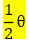
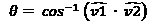
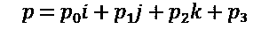
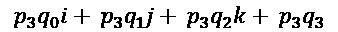
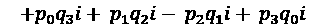
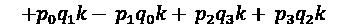
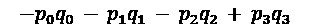
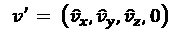
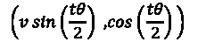

# 四、实现四元数

在这一章中，你将学习四元数。四元数用于编码旋转。四元数是以*x*I*+y*j*+z*k*+w*形式表示的复数。想起 *i、* *j* ，

和 *k* 作为占位符，每个占位符代表一个三维轴。 *w* 是一个实数。虽然四元数不直接编码角度轴对，但很容易想到它们

就像那样——绕任意轴的旋转。

到本章结束时，您应该对什么是四元数以及如何使用它们有了很好的理解，并且您已经在代码中实现了一个健壮的四元数类。本章将涵盖以下主题:

*   创建四元数的不同方法
*   检索四元数的角度和轴
*   基本组件式操作
*   两个四元数的长度和点积
*   反转四元数
*   组合四元数
*   用四元数变换向量
*   四元数之间的插值
*   转换四元数和矩阵

为什么四元数很重要？大多数人形动画只使用旋转来创建，不需要平移或缩放。例如，想想肘关节。肘部的自然运动只是旋转。如果你想平移肘部通过空间，你旋转肩膀。四元数对旋转进行编码，插值效果很好。

重要信息:

在本章中，您将使用直观的代码优先方法实现四元数。如果你对四元数背后更正式的数学感兴趣，看看[https://gabormakesgames.com/quaternions.html](https://gabormakesgames.com/quaternions.html)。

# 创建四元数

四元数用于编码旋转数据。在代码中，四元数将有四个组成部分。它们类似于`vec4`，因为它们有`x`、`y`、`z`和`w`成分。

和`vec4`一样，`w`组件排在最后。

`quat`结构应该有两个构造函数。默认构造函数创建一个单位四元数`(0, 0, 0, 1)`。`(0, 0, 0, 1)`的身份四元数就像`1`。任何数字乘以`1`都保持不变。同样，任何四元数乘以单位四元数都保持不变:

创建一个新文件`quat.h`，来声明四元数结构。`quat`结构将在本书的其余部分中用来表示旋转:

```cpp
#ifndef _H_QUAT_
#define _H_QUAT_
#include "vec3.h"
#include "mat4.h"
struct quat {
   union {
       struct {
           float x;
           float y;
           float z;
           float w;
       };
       struct {
           vec3 vector;
           float scalar;
       };
       float v[4];
   };
   inline quat() :
       x(0), y(0), z(0), w(1) { }
   inline quat(float _x, float _y, float _z, float _w)
               : x(_x), y(_y), z(_z), w(_w) {}
};
#endif
```

`quat`结构中的匿名联合将允许您通过`X`、`Y`、`Z`和`W`下标符号，以向量和标量对或浮点值数组的形式访问四元数中的数据。

接下来，你将学习如何开始创建四元数。

## 角轴

四元数通常使用旋转轴和角度来创建。通过 *θ* 绕轴的旋转可以在球体上表示为，其长度在垂直于旋转轴的平面上为。正角度产生围绕轴的逆时针旋转。

创建新文件，`quat.cpp`。在`quat.cpp`实现`angleAxis`功能。别忘了给`quat.h`添加功能声明:

```cpp
#include "quat.h"
#include <cmath>
quat angleAxis(float angle, const vec3& axis) {
    vec3 norm = normalized(axis);
    float s = sinf(angle * 0.5f);
    return quat(norm.x * s,
                norm.y * s,
                norm.z * s,
                cosf(angle * 0.5f)
    );
}
```

为什么？一个四元数可以跟踪两个完整的旋转，也就是 *720* 度。这使得四元数*的周期为 720* 度。sin/cos 的周期为 *360* 度。将 *θ* 除以 *2* 将四元数的范围映射到 sin/cos 的范围。

在本节中，您学习了旋转的角度和轴是如何在中编码的

四元数。在下一节中，您将学习如何构建角度和轴

用于两个向量之间的旋转，并将其编码为四元数。

## 创建从一个向量到另一个向量的旋转

任何两个单位的向量都可以表示球体上的点。这些点之间的最短弧位于包含点和球体中心的平面上。这架飞机

垂直于这两个向量之间的旋转轴。

为了找到旋转轴，标准化输入向量。求输入向量的叉积。这是旋转轴。求输入向量之间的角度。从 [*第二章*](02.html#_idTextAnchor026)*实现向量*开始，两个向量之间的夹角公式为。由于两个输入向量都是归一化的，这简化为，这意味着 *θ* 的余弦是输入向量的点积:


大家会从 [*第二章*](02.html#_idTextAnchor026)*实现向量*中回想起，点积与两个向量夹角的余弦有关系，叉积与两个向量夹角的正弦有关系。创建四元数时，点积和叉积具有以下属性:


叉积可以扩展为 *x* 、 *y* 和 *z* 分量，前面的等式开始看起来像是从角度和旋转轴创建四元数的代码。找到两个向量之间的角度将是昂贵的，但是半角可以在不知道角度是什么的情况下计算。

要找到半角，找到 *v1* 和 *v2* 输入向量之间的中间向量。使用 *v1* 和这个中间向量构造一个四元数。这将创建导致所需旋转的四元数。

有一种边缘情况——当 *v1* 和 *v2* 平行时会发生什么？或者如果 *v1== -v2* ？用于寻找旋转轴的叉积将产生一个 *0* 向量。如果出现这种边缘情况，请找到两个向量之间最垂直的向量，以创建纯四元数。

执行以下步骤实现`fromTo`功能的:

1.  开始在`quat.cpp`中实现`fromTo`功能，并将功能声明添加到`quat.h`中。首先标准化`from`和`to`向量，确保它们不是同一个向量:

    ```cpp
    quat fromTo(const vec3& from, const vec3& to) {
       vec3 f = normalized(from);
       vec3 t = normalized(to);
       if (f == t) {
          return quat();
       }
    ```

2.  接下来，检查两个向量是否相反。如果是，可以使用`from`向量的最正交轴来创建纯四元数:

    ```cpp
       else if (f == t * -1.0f) {
          vec3 ortho = vec3(1, 0, 0);
          if (fabsf(f.y) <fabsf(f.x)) {
             ortho = vec3(0, 1, 0);
          }
          if (fabsf(f.z)<fabs(f.y) && fabs(f.z)<fabsf(f.x)){
             ortho = vec3(0, 0, 1);
          }
          vec3 axis = normalized(cross(f, ortho));
          return quat(axis.x, axis.y, axis.z, 0);
       }
    ```

3.  最后，在`from`和`to`向量之间创建一个半向量。用半向量和起始向量的叉积计算旋转轴，用两者的点积求旋转角度:

    ```cpp
       vec3 half = normalized(f + t); 
       vec3 axis = cross(f, half);
       return quat(axis.x, axis.y, axis.z, dot(f, half));
    }
    ```

`fromTo`函数是创建四元数最直观的方法之一。接下来，您将学习如何检索定义四元数的角度和轴。

# 检索四元数数据

因为四元数可以从一个角度和一个轴创建，所以期望能够从四元数中检索相同的角度和轴是合理的。要检索旋转轴，请规范化四元数的向量部分。旋转角度是实分量反余弦的两倍。

在`quat.cpp`中实现`getAngle`和`getAxis`功能，并在`quat.h`中为两者添加功能声明:

```cpp
vec3 getAxis(const quat& quat) {
    return normalized(vec3(quat.x, quat.y, quat.z));
}
float getAngle(const quat& quat) {
    return 2.0f * acosf(quat.w);
}
```

能够检索定义四元数的角度和轴将需要稍后进行一些四元数操作。

接下来，您将了解通常在四元数上执行的组件式操作。

# 常用四元数运算

像向量一样，四元数也有分量运算。普通的

组件式操作是加法、减法、乘法或减法

四元数。分量四元数乘法乘以一个四元数

通过单个标量值。

由于这些函数是组件式的，它们只是对输入四元数的类似组件执行适当的操作。在`quat.cpp`中实现这些功能，并在`quat.h`中为每个功能添加声明:

```cpp
quat operator+(const quat& a, const quat& b) {
    return quat(a.x+b.x, a.y+b.y, a.z+b.z, a.w+b.w);
}
quat operator-(const quat& a, const quat& b) {
    return quat(a.x-b.x, a.y-b.y, a.z-b.z, a.w-b.w);
}
quat operator*(const quat& a, float b) {
    return quat(a.x * b, a.y * b, a.z * b, a.w * b);
}
quat operator-(const quat& q) {
    return quat(-q.x, -q.y, -q.z, -q.w);
}
```

这些组件式操作本身没有太多实际用途。它们是构建其余四元数功能的构建块。接下来，您将学习比较四元数的不同方法。

# 比较操作

比较两个四元数可以通过组件的方式完成。两个四元数可以表示相同的旋转，即使它们在组件级别上不相同。这是因为四元数及其逆四元数旋转到同一个点，但它们采用不同的路线:

1.  让`quat.cpp`的`==`和`!=`操作员超载。将这些功能的声明添加到`quat.h` :

    ```cpp
    bool operator==(const quat& left, const quat& right) {
        return (fabsf(left.x - right.x) <= QUAT_EPSILON &&
                fabsf(left.y - right.y) <= QUAT_EPSILON &&
                fabsf(left.z - right.z) <= QUAT_EPSILON &&
                fabsf(left.w - right.w) <= QUAT_EPSILON);
    }
    bool operator!=(const quat& a, const quat& b) {
        return !(a == b);
    }
    ```

2.  为了测试两个四元数是否代表相同的旋转，需要测试两者之间的绝对差异。在`quat.cpp`中实现`sameOrientation`功能。将功能声明添加到`quat.h` :

    ```cpp
    bool sameOrientation(const quat&l, const quat&r) {
        return (fabsf(l.x - r.x) <= QUAT_EPSILON  &&
                fabsf(l.y - r.y) <= QUAT_EPSILON  &&
                fabsf(l.z - r.z) <= QUAT_EPSILON  &&
                fabsf(l.w - r.w) <= QUAT_EPSILON) ||
               (fabsf(l.x + r.x) <= QUAT_EPSILON  &&
                fabsf(l.y + r.y) <= QUAT_EPSILON  &&
                fabsf(l.z + r.z) <= QUAT_EPSILON  &&
                fabsf(l.w + r.w) <= QUAT_EPSILON);
    }
    ```

大多数情况下，您会希望使用等式运算符来比较四元数。`sameOrientation`函数没有那么有用，因为如果四元数被反转，四元数的旋转可以改变。

在下一节中，您将学习如何实现四元数点积。

# 点积

像向量一样，点积度量两个四元数有多相似。实现与向量实现相同。将相似的分量相乘，并对结果求和。

在`quat.cpp`中实现四元数点积函数，并将其声明添加到`quat.h`中:

```cpp
float dot(const quat& a, const quat& b) {
    return a.x * b.x + a.y * b.y + a.z * b.z + a.w * b.w;
}
```

像向量一样，四元数的长度是四元数与其自身的点积。在下一节中，您将学习如何找到四元数的平方长度和长度。

# 长度和平方长度

像向量一样，四元数的平方长度与四元数与其自身的点积相同。四元数的长度是平方长度的平方根:

1.  在`quat.cpp`实现`lenSq`功能，在`quat.h`声明功能:

    ```cpp
    float lenSq(const quat& q) {
      return q.x * q.x + q.y * q.y + q.z * q.z + q.w * q.w;
    }
    ```

2.  在`quat.cpp`中实现`len`功能。别忘了把功能声明添加到`quat.h` :

    ```cpp
    float len(const quat& q) {
      float lenSq = q.x*q.x + q.y*q.y + q.z*q.z + q.w*q.w;
      if (lenSq< QUAT_EPSILON) {
         return 0.0f;
      }
      return sqrtf(lenSq);
    }
    ```

代表旋转的四元数应该总是具有长度 *1* 。在下一节中，您将了解单位四元数，它的长度总是为 *1* 。

# 单位四元数

四元数可以像向量一样归一化。规范化四元数仅表示旋转，非规范化四元数会引入偏斜。在游戏动画的上下文中，四元数应该规范化，以避免给变换增加偏斜。

若要规范化四元数，请将四元数的每个分量除以其长度。结果四元数的长度将为 *1* 。这可以通过以下方式实现:

1.  在`quat.cpp`中实现`normalize`功能，在`quat.h`中声明:

    ```cpp
    void normalize(quat& q) {
       float lenSq = q.x*q.x + q.y*q.y + q.z*q.z + q.w*q.w;
       if (lenSq < QUAT_EPSILON) { 
          return; 
       }
       float i_len = 1.0f / sqrtf(lenSq);
       q.x *= i_len;
       q.y *= i_len;
       q.z *= i_len;
       q.w *= i_len;
    }
    ```

2.  在`quat.cpp`实现`normalized`功能，在`quat.h`申报:

    ```cpp
    quat normalized(const quat& q) {
       float lenSq = q.x*q.x + q.y*q.y + q.z*q.z + q.w*q.w;
       if (lenSq < QUAT_EPSILON) {
          return quat();
       }
       float il = 1.0f / sqrtf(lenSq); // il: inverse length
       return quat(q.x * il, q.y * il, q.z * il,q.w * il);
    }
    ```

有一种快速的方法可以反转任何单位四元数。在下一节中，你将学习如何找到四元数的共轭和逆，以及当涉及到单位四元数时它们之间的关系。

# 共轭和逆

游戏大多使用规范化的四元数，这在反转四元数时很方便。归一化四元数的逆是它的共轭。共轭

四元数翻转其旋转轴:

1.  在`quat.cpp`实现`conjugate`功能，记得在`quat.h`声明功能:

    ```cpp
    quat conjugate(const quat& q) {
        return quat(
            -q.x,
            -q.y,
            -q.z,
             q.w
        );
    }
    ```

2.  四元数的正确逆是共轭除以四元数的平方长度。在`quat.cpp`中实现四元数`inverse`功能。将功能声明添加到`quat.h` :

    ```cpp
    quat inverse(const quat& q) {
       float lenSq = q.x*q.x + q.y*q.y + q.z*q.z + q.w*q.w;
       if (lenSq < QUAT_EPSILON) { 
          return quat(); 
       }
       float recip = 1.0f / lenSq;
       return quat(-q.x * recip,
                   -q.y * recip,
                   -q.z * recip,
                    q.w * recip
       );
    }
    ```

如果你需要知道一个四元数是否归一化，检查平方长度。归一化四元数的平方长度总是 *1* 。如果四元数被归一化，它的共轭和逆是相同的。这意味着你可以使用更快的`conjugate`功能，而不是`inverse`功能。在下一节中，您将学习如何将两个四元数相乘。

# 乘法四元数

两个四元数可以通过相乘连接在一起。和矩阵一样，操作是从右向左进行；首先应用右四元数的旋转，然后应用左四元数的旋转。

假设你有两个四元数， *q* 和 *p* 。分别用`0`、`1`、`2`和`3`下标，分别对应`X`、`Y`、`Z`和`W`组件。这些四元数可以用 *ijk* 符号表示，如图所示:




要将这两个四元数相乘，请将 *p* 的分量分配给 *q* 的分量。分发真实组件很简单。将 *p* 3 分发给 *q* 如下所示:



虚部的分布看起来非常相似。实部和虚部分开组合；虚部的顺序很重要。例如，将 *i* 的 *p* 分配给 *q* 如下所示:


将 *p* 完全分配给 *q* 如下图所示:


开始简化虚数平方的情况。虚数的平方根是 *-1* 。如果把 *-1* 升到 *-1* 的幂，结果也是 *-1* 。这意味着任何一个 *i* 2、 *j* 2 或 *k* 2 的实例都可以被 *-1* 代替，就像这样:


剩下的虚数呢？当谈到四元数时，

*ijk= -1* ，这些分量的平方值也是 *-1* ，这意味着

*I*2*= j*2*= k*2*= ijk*。四元数的这个性质可以用来简化方程的其余部分。

以 *jk* 为例。从 *ijk= -1* 开始，尝试将 *jk* 隔离到等式的一边。

为此，将两边乘以 *i* ，给你留下 *i(ijk)= -i* 。分发 *i* ，剩下的就是 *i* 2 *jk= -i* 。你已经知道 *i* 2 的值是 *-1* 。用它来代替

*-jk= -i* 。将两边乘以 *-1* ，你就找到了*JK-JK = I*的值。

*ki* 和 *ij* 的值可以用类似的方式找到；它们是 *ki=j* 和 *k=ij* 。现在可以用 *j* 、 *ij* 替换 *ki* 的任何实例，用 *k* 替换 *jk* 用 *i* 替换。替换这些值会给您留下以下信息:


剩下的虚数是*ik**Ji*和 *kj* 。和叉积一样，顺序很重要: *ik= -ki* 。由此可以假设 *ik= -j* 、 *ji= -k* 、 *kj= -1* 。替换这些值留给您以下内容:


虚部不同的数不能加在一起。重新排列前面的公式，使类似的虚部彼此相邻。这就产生了四元数乘法的最终方程:








要在代码中实现该公式，请将下标 *ijk* 符号更改回带有`X`、`Y`、`Z`和`W`下标的向量符号。在`quat.cpp`实现四元数乘法函数，别忘了给`quat.h`增加函数声明:

```cpp
quat operator*(const quat& Q1, const quat& Q2) {
   return quat( 
       Q2.x*Q1.w + Q2.y*Q1.z - Q2.z*Q1.y + Q2.w*Q1.x,
      -Q2.x*Q1.z + Q2.y*Q1.w + Q2.z*Q1.x + Q2.w*Q1.y,
       Q2.x*Q1.y - Q2.y*Q1.x + Q2.z*Q1.w + Q2.w*Q1.z,
      -Q2.x*Q1.x - Q2.y*Q1.y - Q2.z*Q1.z + Q2.w*Q1.w
   );
}
```

查看前面的代码时，请注意四元数的实部有一个正分量，但向量部分有一个负分量。重新排列四元数，使负数总是最后一个。用向量符号写下来:

*qp*x*= p*x*q*w*+p*w*q*x*+p*y*q*z*-p*z*q*y

*qp*y =*p*y*q*w+*p*w*q*y+*p*z*q*x-*p*x*q*z

*qp*z =*p*z*q*w+*p*w*q*z+*p*x*q*y-*p*y*q*x

*qp*w =*p*w*q*w-*p*x*q*x-*p*y*q*y-*p*z*q*z

在上式中有两个有趣的部分。如果仔细观察前三行的最后两列，带减法的列就是叉积。前两列只是用其他四元数的标量部分来缩放每个四元数的向量部分。

如果你看最后一行，点积和点积的负数在一起。最后一行基本上是将两个四元数的实部相乘，然后减去它们向量部分的点积。这意味着替代乘法实现可能如下所示:

```cpp
quat operator*(const quat& Q1, const quat& Q2) {
  quat result;
  result.scalar = Q2.scalar * Q1.scalar -
  dot(Q2.vector, Q1.vector);
  result.vector = (Q1.vector * Q2.scalar) +
  (Q2.vector * Q1.scalar)+cross(Q2.vector, Q1.vector);
  return result;
}
```

最初的实现性能更好一点，因为它不需要调用其他函数。本书的示例代码将使用第一个实现。

接下来，你将学习如何用四元数变换向量。

# 变换向量

要将一个向量和一个四元数相乘，首先必须将向量转化为一个纯四元数。什么是纯四元数？它是一个四元数，其`W`分量为`0`，向量部分归一化。假设你有一个四元数， *q* ，和一个向量， *v* 。首先把 *v* 变成纯四元数，表示为 *v* ':




接下来，将 *q* 乘以 *v* ，然后将结果乘以 *q* 的倒数。该乘法的结果是纯四元数，其向量部分包含旋转向量。四元数如下:


为什么 *v* 乘以 *q* 再乘以 *q* -1？乘以 *q* 将使向量旋转两倍于 *q* 的旋转。乘以 *q* -1 会使向量回到预期范围。这个公式可以进一步简化。

推导这个公式超出了本书的范围。给定一个四元数， *q* ，并且

一个向量， *v* ，简化的向量四元数乘法公式如下。

*q* v 指四元数的向量部分， *q* s 指实(或标量)部分:


在`quat.cpp`中执行前面的四元数向量乘法公式。别忘了给`quat.h`添加功能声明:

```cpp
vec3 operator*(const quat& q, const vec3& v) {
    return q.vector * 2.0f * dot(q.vector, v) +
        v * (q.scalar * q.scalar - dot(q.vector, q.vector)) +
        cross(q.vector, v) * 2.0f * q.scalar;
}
```

将一个向量乘以一个四元数将总是产生一个被四元数旋转的向量。在下一节中，您将学习四元数之间的插值。

# 插值四元数

四元数可以用类似于向量的方式进行插值。四元数插值用于动画显示两个关键帧之间的旋转。因为大多数骨骼动画是通过随时间旋转关节来实现的，所以在四元数之间进行插值将是

非常普通的手术。

## 邻里

四元数代表旋转，而不是方向。从球体的一部分旋转到另一部分可以通过两次旋转中的一次来实现。旋转可以采用最短或最长的弧线。一般来说，让四元数沿着最短的弧行进是可取的。在两个四元数之间进行插值时，会选择哪条路径——最短的弧还是最长的？

这个问题叫做睦邻问题。为了解决这个问题，检查被插值的四元数的点积。如果点积为正，将采用较短的弧线。如果点积为负，将采用更长的弧。

如果点积为负，如何修正插值取最短弧？答案是否定其中一个四元数。以下代码示例提供了四元数邻域覆盖的示例:

```cpp
quat SampleFunction(const quat& a, const quat& b) {
    if (dot(a, b) < 0.0f) {
        b = -b;
    }
    return slerp(a, b, 0.5f);
}
```

在四元数之间进行插值时，只需要来进行邻域四元数。接下来，您将学习如何混合线性插值(`lerp`)、归一化线性插值(`nlerp`)和球面线性插值(`slerp`)四元数。请记住，这些函数期望四元数已经在其期望的邻域内。

## 了解混合功能

将两个或多个四元数混合在一起时，每个四元数按某个权重值进行缩放，然后将结果缩放的四元数相加在一起。所有输入四元数的所有权重必须加起来达到 *1* 。

如果所有的输入四元数都是单位长度的，那么得到的四元数也是单位长度的。这个函数达到了与`lerp`相同的结果，但它不是真正的`lerp`函数，因为四元数仍然在圆弧上运动。为了避免混淆，这个函数将被称为`mix`，而不是`lerp`。

`mix`函数假设输入四元数在期望的邻域内。在`quat.cpp`实现`mix`功能，别忘了给`quat.h`添加功能声明:

```cpp
quat mix(const quat& from, const quat& to, float t) {
    return from * (1.0f - t) + to * t;
}
```

## 了解 nlerp 功能

`nlerp`四元数之间是球面插值的一个快速而良好的近似。它的实现与`vec3`类的`nlerp`实现几乎相同。

与`mix`类似，`nlerp`也假设输入向量在期望的邻域内。在`quat.cpp`中实现`nlerp`功能，别忘了给`quat.h`添加功能声明:

```cpp
quat nlerp(const quat& from, const quat& to, float t) {
    return normalized(from + (to - from) * t);
}
```

## slep 简介

`slerp`仅在要求速度一致时使用。大多数情况下，`nlerp`会是比较好的插值方法。根据插值步长的不同，`slerp`最终可能会回落到`nlerp`位置。

为了在两个四元数之间进行球面插值，在两个四元数之间创建一个δ四元数。调整三角形四元数的角度，然后使用四元数乘法将其与起始四元数连接起来。

四元数的角度如何调整？若要调整四元数的角度，请将其提高到所需的幂。例如，要将四元数调整到只旋转一半，可以将其提升到 *0.5* 的幂。

## 功率

要将四元数提升到某个幂，需要将其分解为一个角度和一个轴。然后，角度可以通过幂来调整，并且可以根据调整后的角度和轴来构建新的四元数。如果一个四元数围绕 *v* 轴旋转一个 *θ* 角度，将其提升到某个功率， *t* ，将按如下方式完成:



执行`quat.cpp`中的`power operator`。别忘了给`quat.h`添加功能声明:

```cpp
quat operator^(const quat& q, float f) {
    float angle = 2.0f * acosf(q.scalar);
    vec3 axis = normalized(q.vector);
    float halfCos = cosf(f * angle * 0.5f);
    float halfSin = sinf(f * angle * 0.5f);
    return quat(axis.x * halfSin,
                axis.y * halfSin,
                axis.z * halfSin,
                halfCos
    );
}
```

## 实施 slerp

既然你知道了如何将四元数升到幂，实现`slerp`就变得简单了。如果开始和结束四元数非常接近，`slerp`往往会产生意想不到的结果。如果起点和终点四元数靠得很近，回到`nlerp`上。

要在两个四元数之间进行插值，请找到从开始旋转到结束旋转的增量四元数。这个增量四元数是插值路径。将角度提高到两个四元数之间插值的幂(通常表示为 *t* )并将起始四元数相乘。

在`quat.cpp`中实现`slerp`功能。别忘了给`quat.h`添加函数声明。与其他插值函数一样，`slerp`假设被插值的四元数位于期望的邻域内:

```cpp
quat slerp(const quat& start, const quat& end, float t) {
    if (fabsf(dot(start, end)) > 1.0f - QUAT_EPSILON) {
        return nlerp(start, end, t);
    }
    quat delta = inverse(start) * end;
    return normalized((delta ^ t) * start);
}
```

`slerp`的输入向量应该归一化，这意味着你可以在`slerp`函数中使用`conjugate`代替`inverse`。大多数情况下，`nlerp`会用到`slerp`以上。在下一节中，您将学习如何创建指向特定方向的四元数。

# 看旋转

给定一个方向和一个方向向上的参考，可以创建一个四元数，以正确的方向看向方向。该函数将被称为`lookRotation`—而不是`lookAt`，以避免与矩阵`lookAt`函数混淆。

要实现`lookRotation`功能，找到一个旋转到所需方向的四元数。为此，在世界`forward`向量 *(0，0，1)* 和`desired direction`之间创建一个四元数。这个四元数将旋转到`right`目标，但不考虑`up`可能是什么方向。

要修正这个四元数的`up`方向，首先要找到一个垂直于当前正向和期望的`up`方向的向量。这可以通过取两个向量的叉积来实现。

这个叉积的结果将用于构造三个正交向量——前向向量、这个新向量和一个指向上的向量。你刚找到的那个会指向右边。

接下来，你需要找到一个既垂直于`forward`方向又垂直于`right`方向的向量；这将是正交`up`向量。要找到这个向量，取方向和这个`right`向量的叉积，结果就是物体空间`up`向量。

找到一个从所需的`up`向量旋转到对象`up`向量的四元数。将旋转到目标方向的四元数和从`desired up`旋转到`object up`的四元数相乘。

在`quat.cpp`中实现`lookRotation`功能。别忘了给`quat.h`添加功能声明:

```cpp
quat lookRotation(const vec3& direction, const vec3& up) {
    // Find orthonormal basis vectors
    vec3 f = normalized(direction); // Object Forward
    vec3 u = normalized(up); // Desired Up
    vec3 r = cross(u, f); // Object Right
    u = cross(f, r); // Object Up
    // From world forward to object forward
    quat worldToObject = fromTo(vec3(0, 0, 1), f); 
    // what direction is the new object up?
    vec3 objectUp = worldToObject * vec3(0, 1, 0);
    // From object up to desired up
    quat u2u = fromTo(objectUp, u);
    // Rotate to forward direction first
    // then twist to correct up
    quat result = worldToObject * u2u; 
    // Don't forget to normalize the result
    return normalized(result);
}
```

矩阵`lookAt`函数创建一个视图矩阵，它是相机变换的逆。这意味着`lookAt`的旋转和`lookRotation`的结果将是彼此的逆。在下一节中，您将学习如何将矩阵转换为四元数以及将四元数转换为矩阵。

# 在四元数和矩阵之间转换

由于矩阵和四元数都可以用来编码旋转数据，因此能够在它们之间进行转换将非常有用。为了使两者之间的转换更容易，您必须开始考虑根据基向量的旋转，这些基向量表示 *x* 、 *y* 和 *z* 轴。

4×4 矩阵的上 3×3 子矩阵包含三个基向量。第一列是`right`向量，第二列是`up`向量，第三列是`forward`向量。仅使用`forward`和`up`向量，`lookRotation`函数可用于将矩阵转换为四元数。

要将四元数转换为矩阵，只需将世界基向量乘以四元数，世界基向量是世界的 *x* 、 *y* 和 *z* 轴。将结果向量存储在矩阵的适当部分:

1.  在`quat.cpp`中实现`quatToMat4`功能。别忘了把功能声明添加到`quat.h` :

    ```cpp
    mat4 quatToMat4(const quat& q) {
        vec3 r = q * vec3(1, 0, 0);
        vec3 u = q * vec3(0, 1, 0);
        vec3 f = q * vec3(0, 0, 1);
        return mat4(r.x, r.y, r.z, 0,
                    u.x, u.y, u.z, 0,
                    f.x, f.y, f.z, 0,
                    0  , 0  , 0  , 1
        );
    }
    ```

2.  矩阵使用一些相同的组件存储旋转和缩放数据。为了解决这个问题，需要对基向量进行归一化，并使用叉积来确保得到的向量是正交的。在`quat.cpp`中实现`mat4ToQuat`功能，别忘了给`quat.h`添加功能声明:

    ```cpp
    quat mat4ToQuat(const mat4& m) {
        vec3 up = normalized(vec3(m.up.x, m.up.y, m.up.z));
        vec3 forward = normalized(
             vec3(m.forward.x, m.forward.y, m.forward.z));
        vec3 right = cross(up, forward);
        up = cross(forward, right);
        return lookRotation(forward, up);
    }
    ```

当您需要将旋转数据传递给着色器时，能够将四元数转换为矩阵将会很有用。着色器不知道什么是四元数，但它们有处理矩阵的内置功能。将矩阵转换为四元数对于调试和外部数据源仅提供矩阵旋转的情况非常有用。

# 总结

在本章中，您实现了一个健壮的四元数库。四元数对本书的其余部分很重要，因为所有动画旋转数据都被记录为四元数。您学习了如何创建四元数和常见的四元数运算，将四元数与乘法相结合，通过四元数变换向量，插值四元数和效用函数来创建给定向前和向上方向的四元数，以及在矩阵和四元数之间进行转换。

在下一章中，您将使用向量、矩阵和四元数的组合知识来定义变换对象。