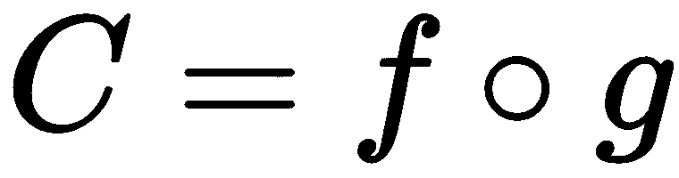
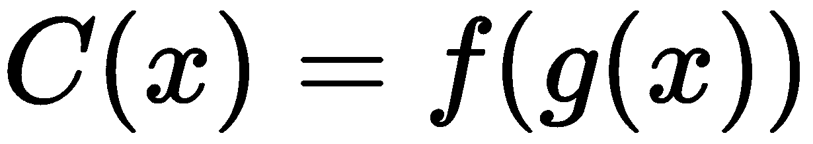

# 四、函数组合思想

在过去的章节中，我们已经看到了如何编写纯函数和 lambdas。这些是函数式编程的基本组件。是时候让他们更上一层楼了。

在本章中，我们将学习如何从现有的函数中获取更多的函数，从而从我们到目前为止看到的简单例子中构建复杂的行为。

本章将涵盖以下主题:

*   用 C++ 编写函数
*   多参数函数的基本分解策略
*   使用功能组合消除重复(或代码相似性)

# 技术要求

您将需要一个支持 C++ 17 的编译器。我用的是 GCC 7.3.0。

代码在[网站上的`Chapter04`文件夹中。它包含并使用了`doctest`，这是一个单头开源单元测试库。你可以在它的 GitHub 储存库中找到它:https://github.com/onqtam/doctest](https://github.com/PacktPublishing/Hands-On-Functional-Programming-with-Cpp)。

# 什么是功能成分？

纯函数和 lambdas 是函数式编程的基本模块。但是到目前为止，我们看到的所有例子都使用非常简单的函数。显然，我们处理的是我们行业中复杂得多的问题。然而，正如我们所看到的，我们仍然希望我们的基本块非常简单，因为我们希望容易理解和维护它们。那么，我们如何从目前看到的简单 lambdas 和纯函数中创建复杂的程序呢？函数式编程有一个简单的答案——让我们通过组合现有的简单函数来创建更复杂的函数。函数编程中创建复杂函数的基本方法是函数组合。

# 操作组合

其核心，功能构成非常简单。我们将用一个基本的例子来说明它。我们将从我们的`increment`功能开始。此外，从现在开始，我将使用测试用例来展示代码是如何工作的。我用的是`doctest`，一个单头开源单元测试库([https://github.com/onqtam/doctest](https://github.com/onqtam/doctest))。

让我们用一个测试用例来看看我们的`increment`函数:

```cpp
auto increment = [](const int value) { return value + 1; };

TEST_CASE("Increments value"){
    CHECK_EQ(2, increment(1));
}
```

我们还可以说，出于某种原因，我们需要将该值增加两次。因为我们在考虑函数，所以我们想重用我们的函数。因此，我们可以称之为两次:

```cpp
TEST_CASE("Increments twice"){
    CHECK_EQ(3, increment(increment(1)));
}
```

如果我们在一个地方只需要双倍的增量，这很好。如果我们在代码的多个地方需要它，我们将需要一个函数。提取执行双增量的函数非常容易:

```cpp
auto incrementTwiceLambda = [](int value){return increment(increment(value));};

TEST_CASE("Increments result of addition with lambda"){
    CHECK_EQ(3, incrementTwiceLambda(1));
}
```

如果我们看一下`incrementTwiceLambda`，我们可以看到它是由`increment`的结果调用`increment`形成的。

让我们暂时停下来，继续另一个案子。我们现在想计算一个数的平方，仍然使用函数。很容易写，再一次:

```cpp
auto square = [](int value){ return value * value; };

TEST_CASE("Squares the number"){
    CHECK_EQ(4, square(2));
}
```

我们的下一个要求是计算一个值的增量平方。再一次，我们可以根据需要提取结合`increment`和`square`的λ:

```cpp
auto incrementSquareLambda = [](int value) { return increment(square(value));};

TEST_CASE("Increments the squared number"){
    CHECK_EQ(5, incrementSquareLambda(2));
}

```

那很好。然而，我们在代码中有一个隐藏的相似之处。我们来看看`incrementTwiceLambda`和`incrementSquareLambda`功能:

```cpp
auto incrementTwiceLambda = [](int value){ return increment(increment(value)); };
auto incrementSquareLambda = [](int value) { return increment(square(value)); };
```

它们都有相同的模式——我们创建了一个函数 *C* ，通过拥有一个函数， *f* 调用另一个函数的结果， *g* ，应用于传递给我们函数的值， *C* 。这是一种代码相似性，当我们使用小的纯函数时，我们可以期望看到很多。如果有一个名字，甚至有一种实现它的方法，而不用写那么多样板代码，那就太好了。

事实证明，它确实有一个名字——这是功能组合。一般来说，对于任何单参数的 *f* 或 *g* 函数，我们可以得到一个函数， *C* ，如下所示:

表示对于 *x* ，的每个值。

符号是函数合成的数学运算符。

如您所见，我们实际上正在尝试通过对函数本身进行操作来从其他函数中获取函数！这是一种使用 lambdas 而不是数字的微积分，定义了对 lambdas 的运算。Lambda 微积分是个恰当的名字，你不觉得吗？

这就是功能组合的概念。下一个问题是——我们能消除样板代码吗？

# 用 C++ 实现函数式组合

如果有一个允许我们执行功能合成的操作符就好了。事实上，其他编程语言提供了一种；例如，在 Groovy 中，我们可以使用`<<`运算符，如下所示:

```cpp
def incrementTwiceLambda = increment << increment
def incrementSquareLambda = increment << square
```

不幸的是，C++ 还没有一个标准的函数组合运算符。然而，C++ 是一种强大的语言，所以应该可以编写我们自己的函数来执行功能组合，至少在有限的情况下是这样。

首先，让我们明确定义问题。我们希望有一个`compose`函数接收两个 lambda，`f`和`g`，并返回一个调用`value -> f(g(value)`的新 lambda。C++ 中最简单的实现如下所示:

```cpp
auto compose(auto f, auto g){
    return [f, g](auto x){ return f(g(x); };
}

TEST_CASE("Increments twice with composed lambda"){
    auto incrementTwice = compose(increment, increment);
    CHECK_EQ(3, incrementTwice(1));
}
```

不幸的是，这段代码无法编译，因为 C++ 不允许带有`auto`类型的参数。一种方法是指定函数类型:

```cpp
function<int(int)> compose(function<int(int)> f,  function<int(int)> g){
    return [f, g](auto x){ return f(g(x); };
}

TEST_CASE("Increments twice with composed lambda"){
    auto incrementTwice = compose(increment, increment);
    CHECK_EQ(3, incrementTwice(1));
}
```

这很好，通过了测试。但是现在我们的`compose`功能取决于功能类型。那不是很有用，因为我们将不得不为我们需要的每种类型的功能重新实现`compose`。它比以前更少的样板，但仍然离理想很远。

但这正是 C++ 模板解决的问题类型。也许他们可以帮忙:

```cpp
template <class F, class G>
auto compose(F f, G g){
    return [=](auto value){return f(g(value));};
}

TEST_CASE("Increments twice with composed lambda"){
    auto incrementTwice = compose(increment, increment);
    CHECK_EQ(3, incrementTwice(1));
}

TEST_CASE("Increments square with composed lambda"){
    auto incrementSquare = compose(increment, square);
    CHECK_EQ(5, incrementSquare(2));
}
```

的确，这个代码起作用了！所以，我们现在知道，虽然 C++ 中没有函数组合的运算符，但我们可以用一个优雅的函数来实现它。

请注意 compose 是如何返回 lambda 的，它使用了惰性计算。因此，我们的函数组合函数也使用了惰性求值。这是一个优势，因为合成的 lambda 只会在我们使用它时被初始化。

# 函数组合是不可交换的

重要的是要认识到函数组合是不可交换的。确实，很容易理解为什么我们说话的时候——*一个值的增量平方*不同于*对一个值的增量平方*。但是，我们在代码中需要小心，因为两者的区别仅在于 compose 函数的参数顺序:

```cpp
auto incrementSquare = compose(increment, square);
auto squareIncrement = compose(square, increment);
```

我们已经看到了什么是功能组合，如何在 C++ 中实现它，以及如何在简单的情况下使用它。我打赌你现在很想尝试一下更复杂的程序。我们会到达那里，但首先让我们看看更复杂的情况。多参数函数呢？

# 复杂功能成分

我们的复合函数有一个问题——它只适用于接收一个参数的 lambdas。那么，如果我们想用多个参数组合函数，我们该怎么做呢？

让我们举下面的例子——给定两个λ，`multiply`和`increment`:

```cpp
auto increment = [](const int value) { return value + 1; };
auto multiply = [](const int first, const int second){ return first * second; };
```

我们能得到一个增加乘法结果的λ吗？

不幸的是，我们不能使用`compose`函数，因为它假设两个函数都有一个参数:

```cpp
template <class F, class G>
auto compose(F f, G g){
    return [=](auto value){return f(g(value));};
}
```

那么，我们有什么选择？

# 实现更多的合成功能

我们可以实现`compose`函数的一个变体，它接受一个函数`f`，这个函数接受一个参数，另一个函数`g`，这个函数接受两个参数:

```cpp
template <class F1, class G2>
auto compose12(F1 f, G2 g){
    return [=](auto first, auto second){ return f(g(first, second)); };
}

TEST_CASE("Increment result of multiplication"){
    CHECK_EQ(5, compose12(increment, multiply)(2, 2));
}
```

这个解决方案足够简单。然而，如果我们需要获得一个将其参数的递增值相乘的函数，我们还需要另一个`compose`变量:

```cpp
template <class F2, class G1>
auto compose21(F2 f, G1 g){
    return [=](auto first, auto second){ return f(g(first), g(second)); };
}

TEST_CASE("Multiplies two incremented values"){
    CHECK_EQ(4, compose21(multiply, increment)(1, 1));
}
```

如果我们只想增加其中一个参数呢？有很多可能的组合，虽然我们可以用 compose 的多种变体来覆盖它们，但也值得访问其他选项。

# 用多个参数分解函数

我们可以查看`multiply`函数本身，而不是实现更多的组合变体:

```cpp
auto multiply = [](const int first, const int second){ return first *  
    second; };
```

我们可以用一个技巧把它分解成两个λ，每个λ取一个参数。关键思想是 lambda 只是一个值，所以它可以由函数返回。我们已经在`compose`函数中看到了这一点；它创建并返回一个新的 lambda:

```cpp
template <class F, class G>
auto compose(F f, G g){
    return [=](auto value){return f(g(value));};
}
```

因此，我们可以通过返回一个带有单个参数的新 lambda 来分解一个带有两个参数的函数，该参数从上下文中捕获`first`参数:

```cpp
auto multiplyDecomposed = [](const int first) { 
    return [=](const int second){ return first * second; }; 
};

TEST_CASE("Adds using single parameter functions"){
    CHECK_EQ(4, multiplyDecomposed(2)(2));
}
```

让我们解开这段代码，因为它非常复杂:

*   `multiplyDecomposed`取一个参数`first`，返回一个λ。
*   返回的 lambda 从上下文中捕获`first`。
*   然后它接收一个参数`second`。
*   返回`first`和`second`相加的结果。

事实证明，任何有两个参数的函数都可以这样分解。因此，我们可以使用模板编写一个通用实现。我们只需要使用同样的技巧——将函数类型指定为模板类型，并在分解中继续使用它:

```cpp
template<class F>
auto decomposeToOneParameter(F f){
    return [=](auto first){
        return [=](auto second){
            return f(first, second);
        };
    };
}

TEST_CASE("Multiplies using single parameter functions"){
    CHECK_EQ(4, decomposeToOneParameter(multiply)(2)(2));
}
```

这种方法很有前途；这可能会简化我们的功能组合实现。让我们看看它是否有效。

# 增加乘法的结果

让我们朝着我们的目标前进。我们可以用`compose`得到一个增加乘法结果的函数吗？现在很容易了，因为`add`被分解成接收一个参数的 lambdas。我们希望用`increment`来创作`multiplyDecomposed`:

```cpp
TEST_CASE("Increment result of multiplication"){
    int first = 2;
    int second = 2;
    auto incrementResultOfMultiplication = compose(increment, 
        multiplyDecomposed);
    CHECK_EQ(5, incrementResultOfMultiplication(first)(second));
}
```

但是，这不会编译。我们的合成函数假设`multiplyDecomposed(first)`的结果可以传递给增量。但是`multiplyDecompose(first)`返回一个λ，`increment`取一个整数。

因此，我们需要用`multipyDecomposed(first)`组成`increment`:

```cpp
TEST_CASE("Increment result of multiplication"){
    int first = 2;
    int second = 2;
    auto incrementResultOfMultiplication = compose(increment, 
        multiplyDecomposed(first));
    CHECK_EQ(5, incrementResultOfMultiplication(second));
}
```

这很有效，但是我们还没有达到我们的目标。我们没有得到接受这两个值的函数；相反，当用`increment`函数组合第一个值时，它被传递给`multiplyDecomposed`。

幸运的是，这是使用 lambda 的最佳位置，如以下代码所示:

```cpp
TEST_CASE("Increment result of multiplication final"){
    auto incrementResultOfMultiplication = [](int first, int second) {
        return compose(increment, multiplyDecomposed(first))(second);
    };

    CHECK_EQ(5, incrementResultOfMultiplication(2, 2));
}
```

这绝对有效，我们已经达到了目标！`incrementResultOfMultiplication`λ取两个参数，返回乘法的增量。不过，如果我们不必重写`multiply`，那就更好了。幸运的是，我们有我们的`decomposeToOneParameter`功能来帮助我们:

```cpp
TEST_CASE("Increment result of multiplication"){
    auto incrementResultOfMultiplication = [](int first, int second) { 
        return compose(increment, decomposeToOneParameter(multiply) 
            (first)) (second);
 };
    int result = incrementResultOfMultiplication(2, 2);
    CHECK_EQ(5, result);
}
```

是时候看看颠倒的构图了——如果我们想把两个论点的增量相乘呢？

# 乘法增量

我们希望通过使用我们的`compose`函数，获得一个将参数增量相乘的函数。不使用`compose`的最简单的代码如下:

```cpp
TEST_CASE("Multiply incremented values no compose"){
    auto multiplyIncrementedValues = [](int first, int second){
        return multiply(increment(first), increment(second)); 
    };
    int result = multiplyIncrementedValues(2, 2);
    CHECK_EQ(9, result);
}
```

正如我们已经看到的，如果我们想使用我们的 compose 版本，我们需要首先分解`multiply`λ:

```cpp
TEST_CASE("Multiply incremented values decompose"){
    auto multiplyIncrementedValues = [](int first, int second){
        return multiplyDecomposed(increment(first))(increment(second)); 
    };
    int result = multiplyIncrementedValues(2, 2);
    CHECK_EQ(9, result);
}
```

现在我们可以看到对`multiplyDecomposed(increment(first))`的调用，这是`multiplyDecomposed`和`increment`之间的合成。我们可以用我们的`compose`功能来代替，如下代码所示:

```cpp
TEST_CASE("Multiply incremented values compose simple"){
    auto multiplyIncrementedValues = [](int first, int second){
        return compose(multiplyDecomposed, increment)(first)
            (increment(second)); 
    };

    int result = multiplyIncrementedValues(2, 2);
    CHECK_EQ(9, result);
}
```

同样，如果我们不必重写我们的`multiply`函数就好了。但是请记住，我们实现了一个有用的函数，它可以将任何具有两个参数的函数分解为两个具有一个参数的函数。我们不用重写`multiply`；我们只需要在上面调用我们的分解工具:

```cpp
TEST_CASE("Multiply incremented values decompose first"){
    auto multiplyIncrementedValues = [](int first, int second){
        return compose(
                decomposeToOneParameter(multiply), 
                increment
               )(first)(increment(second)); 
    };
    int result = multiplyIncrementedValues(2, 2);
    CHECK_EQ(9, result);
}
```

我们达到了目标！

# 关于函数合成与分解的思考

让我们花点时间看看结果和我们的工作方法。好消息是——我们在学习如何在函数中思考方面取得了很大进步。我们前面的例子仅仅通过作为代码的第一级公民操作函数来工作，如果我们想要使用函数范式设计应用，这正是我们所需要的心态。函数的分解和重组非常强大；掌握它，你将能够用很少的代码实现非常复杂的行为。

至于生成的代码，它有一个有趣的特性——我们可以将其推广到许多函数组合中重用。

但是我们还没完呢！我们可以使用这些函数从代码中删除某些类型的重复。让我们看看如何。

# 使用功能组合消除重复

到目前为止，我们已经看到了如何编写以各种方式组成 lambdas 的函数。但是代码倾向于重复本身，所以我们想让这个方法更通用。我们确实可以更进一步；我们来看几个例子。

# 推广乘法的增量结果

让我们再来看看我们的`incrementResultOfMultiplication`λ:

```cpp
 auto incrementResultOfMultiplication = [](int first, int second) { 
     return compose(increment, decomposeToOneParameter(multiply) 
        (first))(second);
  };
```

这里面有一些有趣的东西——它不是针对`increment`和`multiply`的。由于 lambdas 只是值，我们可以将它们作为参数传递，并获得一个通用的`composeWithTwoParameters`函数:

```cpp
template <class F, class G>
auto composeWithTwoParameters(F f, G g){
    return [=](auto first, auto second) { 
        return compose(
                f, 
                decomposeToOneParameter(g)(first)
                )(second);
   };
};

TEST_CASE("Increment result of multiplication"){
    auto incrementResultOfMultiplication =  
    composeWithTwoParameters(increment, multiply);
    int result = incrementResultOfMultiplication(2, 2);
    CHECK_EQ(5, result);
}
```

这个函数允许我们*组成另外任意两个函数，* `f` *和* `g` *，其中* `g` *取两个参数而* `f`只取一个参数。

让我们再做一些。我们来概括一下`multiplyIncrementedValues`。

# 推广多种货币价值

同样，我们可以很容易地推广我们的`multiplyIncrementedValues`λ，如下面的代码所示:

```cpp
    auto multiplyIncrementedValues = [](int first, int second){
        return compose(
                 decomposeToOneParameter(multiply), 
                 increment
                 )(first)(increment(second)); 
    };
```

同样，我们需要将`multiply`和`increment`λ作为参数传递:

```cpp
template<class F, class G>
auto composeWithFunctionCallAllParameters(F f, G g){
    return [=](auto first, auto second){
        return compose(
                decomposeToOneParameter(f), 
                g 
                )(first)(g(second)); 
    };
};

TEST_CASE("Multiply incremented values generalized"){
    auto multiplyIncrementedValues = 
    composeWithFunctionCallAllParameters(multiply, increment);
    int result = multiplyIncrementedValues(2, 2);
    CHECK_EQ(9, result);
}
```

我们可以用这个新函数创建一个函数， *C* ，实现`g(f(first), f(second))`，不管`g`和`f`是什么。

我们在这里的工作暂时结束了。

# 摘要

如果你认为纯函数和 lambdas 是强大的，你现在会意识到你可以通过组合它们来做多少事情！在这一章中，您学习了什么是函数组合，以及如何在 C++ 中组合函数。

我们还做了更重要的事情。在这一章中，我们真正开始思考函数。以下是我们学到的一些东西:

*   lambda 只是一个值，所以我们可以有返回 lambda 的函数，或者返回 lambda 的函数。
*   此外，我们可以让函数接收一个或多个 lambda 并返回一个新的 lambda。
*   任何具有多个参数的函数都可以分解成多个具有单个参数和捕获值的 lambdas。
*   带有函数的操作相当复杂。如果你觉得你的头在旋转，没关系——我们一直在玩非常强大和抽象的概念。
*   当涉及到函数的各种组合方式时，很难立即想出解决方案。最好的方法是循序渐进，有明确的目标和清晰的头脑，并使用本章描述的技巧来改进。
*   功能组合有助于消除某些类型的重复；例如，当您在具有相似签名的不同函数之间有多个组合时。
*   然而，正如我们在本章中所做的那样，实现复合函数族是有代价的——更高层次的抽象。很难理解在 lambdas 上执行操作的函数是如何工作的；的确，相信我，我也很难理解结果。尽管如此，一旦你理解了它们的目标，它们还是很容易使用的。

经过这么多努力，让我们花点时间考虑一下结果。想象一下，在你的代码库中，或者在你使用的库中，你已经拥有的任何两个函数，都可以通过一个函数调用组成，并表示为变量。而且，这些调用可以堆栈；您获得的功能可以组成更多。功能成分极其强大；通过非常简单的 lambdas 和一些带有函数的操作，我们可以非常快速地实现复杂的行为。

我们已经看到了如何组合两个函数。我们还需要学习另一种函数操作——通过玩弄参数来获得新函数。

# 问题

1.  什么是功能成分？
2.  函数组合有一个通常与数学运算相关的性质。这是什么？
3.  如何把一个有两个参数的`add`函数变成一个参数的两个函数？
4.  如何编写包含两个单参数函数的 C++ 函数？
5.  功能性作文有哪些优势？
6.  在函数上实现操作的潜在缺点是什么？