# 一、C++ 机器学习导论

有不同的方法让计算机解决任务。其中一个是定义显式算法，另一个是使用基于数学和统计方法的隐式策略。**机器学习(ML)** 是使用数学和统计方法解决任务的隐式方法之一。这是一门正在积极发展的学科，许多科学家和研究人员发现，这是朝着充当人类级**人工智能** **(人工智能)**的系统前进的最佳方式之一。

一般来说，ML 方法有在给定数据集中搜索模式的想法作为基础。考虑一个新闻提要的推荐系统，它根据用户以前的活动或偏好为用户提供个性化提要。该软件收集关于用户阅读的新闻文章类型的信息，并计算一些统计数据。例如，它可能是一些主题在一组新闻文章中出现的频率。然后，它执行一些预测分析，识别一般模式，并使用它们来填充用户的新闻提要。这种系统定期跟踪用户的活动，更新数据集并计算推荐的新趋势。

ML 已经开始在许多领域发挥重要作用。它用于解决企业业务任务以及科学研究。在**客户关系管理** ( **CRM** )系统中，ML 模型用于分析销售团队活动，帮助他们先处理最重要的请求。ML 模型用于**商业智能** ( **BI** )和分析，以找到必要的数据点。**人力资源** ( **HR** )部门使用 ML 模型来分析其员工的特征，以便确定最有效的特征，并在搜索空缺职位的申请者时使用这些信息。

自动驾驶汽车是一个快速发展的研究方向，深度学习神经网络在这一领域得到了广泛应用。它们用于计算机视觉系统中，用于物体识别以及导航和转向系统，这是汽车驾驶所必需的。

ML 系统的另一个流行用途是电子个人助理，如苹果的 Siri 或亚马逊的 Alexa。此类产品还使用深度学习模型来分析自然语音或书面文本，以处理用户的请求，并在相关上下文中做出自然响应。这种请求可以激活带有首选歌曲的音乐播放器，以及更新用户的个人日程或预订机票。

本章描述了什么是 ML，哪些任务可以用 ML 解决，并讨论了 ML 中使用的不同方法。它旨在展示开始实现最大似然算法所需的最低数学要求。还涵盖了如何在`Eigen`、`xtensor`、`Shark-ML`、`Shogun`、`Dlib`等库中进行基本的线性代数运算，并以线性回归任务为例进行了说明。

本章将涵盖以下主题:

*   理解语言学习的基础
*   线性代数概述
*   线性回归示例概述

# 理解语言学习的基础

有不同的方法来创建和训练 ML 模型。在本节中，我们将展示这些方法是什么以及它们的不同之处。除了我们用来创建 ML 模型的方法之外，还有一些参数可以管理这个模型在训练和评估过程中的行为。模型参数可以分为两个不同的组，应该以不同的方式进行配置。ML 过程的最后一个关键部分是我们用来训练模型的技术。通常，训练技术使用一些数值优化算法来找到目标函数的最小值。在 ML 中，目标函数通常称为损失函数，用于在训练算法出错时对其进行惩罚。我们将在下面的章节中更精确地讨论这些概念。

# 探索人工智能技术

我们可以将 ML 方法分为两种技术，如下所示:

*   监督学习是一种基于使用标记数据的方法。标记数据是一组具有相应已知目标输出的已知数据样本。这种数据被用来建立一个可以预测未来产出的模型。
*   无监督学习是一种不需要标记数据的方法，可以在任意类型的数据中搜索隐藏的模式和结构。

让我们详细看看每一种技术。

# 监督学习

有监督的 ML 算法通常采用有限的一组有标签的数据，并建立能够对新数据做出合理预测的模型。我们可以将监督学习算法分为两个主要部分，分类和回归技术，描述如下:

*   分类模型预测一些有限且不同类型的类别——这可能是一个标签，用于识别电子邮件是否是垃圾邮件，或者图像是否包含人脸。分类模型应用于语音和文本识别、图像上的对象识别、信用评分等。创建分类模型的典型算法有**支持向量机** ( **SVM** )、决策树方法、 **k 近邻** ( **KNN** )、逻辑回归、朴素贝叶斯和神经网络。以下章节描述了其中一些算法的细节。
*   回归模型预测持续的反应，如温度或货币汇率的变化。回归模型应用于算法交易、电力负荷预测、收入预测等。如果给定标记数据的输出是实数，那么创建回归模型通常是有意义的。创建回归模型的典型算法是线性和多元回归、多项式回归模型和逐步回归。我们也可以使用决策树技术和神经网络来创建回归模型。以下章节描述了其中一些算法的细节。

# 无监督学习

无监督学习算法不使用标记数据集。他们创建模型，使用数据中的内在关系来寻找隐藏的模式，用于进行预测。最著名的无监督学习技术是**聚类**。聚类包括根据数据项的一些内在属性将给定的数据集划分为有限数量的组。聚类应用于市场研究、不同类型的探索性分析、**脱氧核糖核酸** ( **脱氧核糖核酸**)分析、图像分割和目标检测。创建用于执行聚类的模型的典型算法是 k-均值、k-med oid、高斯混合模型、层次聚类和隐马尔可夫模型。这些算法中的一些将在本书的后续章节中解释。

# 处理最大似然模型

我们可以将 ML 模型解释为采用不同类型参数的函数。这些函数基于这些参数的值为给定的输入提供输出。开发人员可以通过调整模型参数来配置 ML 模型解决问题的行为。训练一个最大似然模型通常可以看作是一个寻找其参数最佳组合的过程。我们可以将 ML 模型的参数分成两种类型。第一种类型由模型内部的参数组成，我们可以从训练(输入)数据中估计它们的值。第二种类型由模型外部的参数组成，我们无法从训练数据中估计它们的值。模型外部的参数通常称为**超参数**。

内部参数具有以下特征:

*   它们是进行预测所必需的。
*   他们根据给定的问题定义模型的质量。
*   我们可以从训练数据中学习它们。
*   通常，它们是模型的一部分。

如果模型包含固定数量的内部参数，则称为**参数化**。否则，我们可以将其归类为**非参数**。

内部参数示例如下:

*   **人工神经网络** ( **人工神经网络**的权重)
*   SVM 模型的支持向量值
*   线性回归或逻辑回归的多项式系数

另一方面，超参数具有以下特征:

*   它们用于配置估计模型参数的算法。
*   从业者通常指定它们。
*   他们的估计通常基于使用启发式。
*   它们特定于一个具体的建模问题。

很难知道特定问题的模型超参数的最佳值。此外，从业者通常需要对如何调整所需的超参数进行额外的研究，以便模型或训练算法以最佳方式运行。从业者使用经验法则，从类似的项目中复制值，以及特殊的技术，例如用于超参数估计的网格搜索。

超参数的例子如下:

*   分类质量配置的 SVM 算法中使用的 c 和 sigma 参数
*   在神经网络训练过程中用于配置算法收敛的学习速率参数
*   在 KNN 算法中用于配置邻居数量的 *k* 值

# 模型参数估计

模型参数估计通常采用一些优化算法。最终模型的速度和质量可能在很大程度上取决于所选择的优化算法。优化算法的研究是工业界和学术界的热门话题。ML 经常使用基于损失函数优化的优化技术和算法。评估模型对数据预测程度的函数称为**损失函数**。如果预测值与目标输出值相差很大，损失函数将返回一个可能被解释为错误的值，通常是一个很大的数字。以这种方式，当优化算法在错误的方向上移动时，损失函数惩罚它。所以，一般的想法是最小化损失函数的值来减少惩罚。优化算法没有一个通用的损失函数。不同的因素决定了如何选择损失函数。这些因素的例子如下:

*   给定问题的细节——例如，它是回归模型还是分类模型
*   计算导数的简易性
*   数据集中异常值的百分比

在 ML 中，术语**优化器**用于定义一种算法，该算法连接损失函数和用于响应损失函数的值更新模型参数的技术。因此，优化人员调整 ML 模型，通过拟合模型参数，以最准确的方式预测新数据的目标值。有很多优化器:梯度下降，阿达格勒，RMSProp，亚当，和其他。此外，开发新的优化器是一个活跃的研究领域。比如微软的 *ML 和优化*课题组(位于雷德蒙)，其研究领域包括组合优化、凸和非凸优化，以及它们在 ML 和 AI 中的应用。业内其他公司也有类似的研究小组；有许多来自脸书研究、亚马逊研究和开放人工智能小组的出版物。

# 线性代数概述

线性代数的概念对于理解 ML 背后的理论至关重要，因为它们帮助我们理解 ML 算法是如何在幕后工作的。此外，大多数 ML 算法定义使用线性代数术语。

线性代数不仅是一种方便的数学工具，而且线性代数的概念可以用现代计算机体系结构非常有效地实现。ML 的兴起，尤其是深度学习，始于现代**图形处理单元** ( **GPU** )的显著性能提升之后。图形处理器最初被设计用来处理线性代数概念和计算机游戏中使用的大量并行计算。之后，创建了特殊的库来处理一般的线性代数概念。实现基本线性代数例程的库的例子是`Cuda`和`OpenCL`，专门的线性代数库的一个例子是`cuBLAS`。此外，使用**通用图形处理单元** ( **图形处理器**)变得更加普遍，因为它们将现代图形处理器的计算能力转化为强大的通用计算资源。

此外，**中央处理器** ( **中央处理器**)有专门为同时进行数值计算而设计的指令集。这样的计算称为**矢量化**，常见的矢量化指令集有`AVx`、`SSE`和`MMx`。这些指令集还有一个术语**单指令多数据** ( **SIMD** )。许多数值线性代数库，如`Eigen`、`xtensor`、`VienaCL`等，都使用它们来提高计算性能。

# 学习线性代数的概念

线性代数是一个很大的领域。它是代数中研究线性性质的对象的部分:向量(或线性)空间、线性表示和线性方程组。线性代数中使用的主要工具是行列式、矩阵、共轭和张量演算。

要理解 ML 算法，我们只需要一小部分线性代数概念。然而，要研究新的 ML 算法，从业者应该对线性代数和微积分有深刻的理解。

下面的列表包含了理解 ML 算法最有价值的线性代数概念:

*   **标量:**这是单个数。
*   **Vector:** 这是一个有序数字的数组。每个元素都有不同的索引。向量符号是一种粗体小写字体，元素是斜体下标字体，如下例所示:

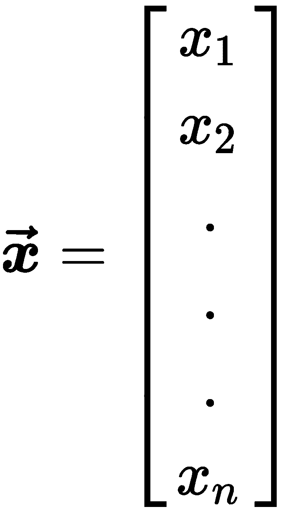

*   **矩阵:**这是一个二维的数字数组。每个元素都有一对不同的索引。矩阵符号是一种粗体大写的名称字体和一种斜体但非粗体的字体，元素下标的索引列表以逗号分隔，如下例所示:

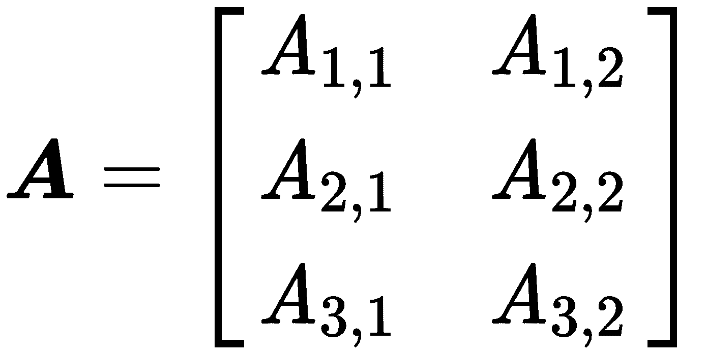

*   **张量:**这是排列在多维规则网格中的数字数组，代表矩阵的推广。它就像一个多维矩阵。例如，尺寸为 2×2×2 的张量 **A** 可以如下所示:


线性代数库和 ML 框架通常使用张量的概念来代替矩阵，因为它们实现了一般的算法，而矩阵只是二维张量的一个特例。同样，我们可以把一个向量看作一个大小为 *n* x *1* 的矩阵。

# 基本线性代数运算

用于线性代数算法编程的最常见操作如下:

*   **元素操作** : 这些操作以元素方式在相同大小的向量、矩阵或张量上执行。结果元素将是对相应输入元素的操作结果，如下所示:

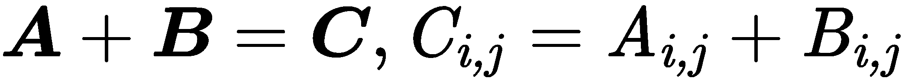


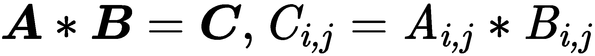


以下示例显示了元素求和:


*   **点积** : 线性代数中张量和矩阵的乘法有两种——一种是元素乘法，另一种是点积乘法。点积处理两个等长的数字序列，并返回一个数字。应用于矩阵或张量的此操作要求矩阵或张量 A 的列数与矩阵或张量 B 的行数相同。以下示例显示了当 **A** 为***n*****x***m*矩阵且 **B** 为 ***m*** **x** 时的点积操作


*   **转置** : 矩阵的转置是将矩阵翻转到其对角线上的操作，这会导致矩阵的列索引和行索引的翻转，从而创建新的矩阵。一般来说，它是用列交换矩阵行。以下示例显示了移调的工作原理:


*   **Norm** : 该操作计算矢量的大小；其结果是一个非负实数。定额公式如下:


这类定额的通用名为 *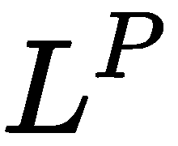定额*为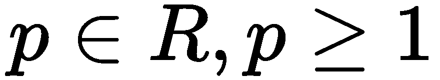。通常，我们使用更具体的规范，例如一个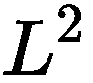 *规范*与 *p = 2* ，这被称为欧几里得规范，我们可以将其解释为点与点之间的欧几里得距离。另一个广泛使用的*范数*是*平方范数*，其计算公式为。平方范数比范数更适合数学和计算运算。与依赖于整个向量的范数的偏导数相比，平方范数的每个偏导数仅依赖于 *x* 的对应元素；这个特性在优化算法中起着至关重要的作用。另一个广泛使用的*范数*运算是 *范数*带有 *p=1* ，当我们关心零和非零元素的区别时，常用在 ML 中。

*   **逆矩阵** : 逆矩阵就是这样一个矩阵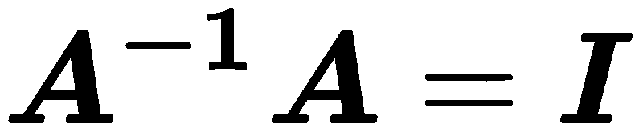，其中 *I* 就是一个身份矩阵。单位矩阵是这样一个矩阵，当我们用这个矩阵乘以一个向量时，它不会改变这个向量。

我们考虑了主要的线性代数概念以及它们的运算。使用这个数学仪器，我们可以定义和编程许多最大似然算法。例如，我们可以使用张量和矩阵来定义用于训练的训练数据集，标量可以用作不同类型的系数。我们可以使用元素操作对整个数据集(矩阵或张量)执行算术运算。例如，我们可以使用元素乘法来缩放数据集。我们通常使用换位来改变向量或矩阵的视图，使它们适合点积运算。点积通常用于将权重表示为矩阵系数的线性函数应用于向量；例如，这个向量可以是一个训练样本。此外，点积运算用于根据算法更新表示为矩阵或张量系数的模型参数。

范数运算通常用于损失函数的公式中，因为它自然地表达了距离概念，并且可以测量目标值和预测值之间的差异。逆矩阵是解析求解线性方程组的一个重要概念。这样的系统经常出现在不同的优化问题中。然而，计算逆矩阵在计算上非常昂贵。

# 计算中的张量表示

我们可以用不同的方式在计算机内存中表示张量对象。最明显的方法是在计算机内存中使用简单的线性阵列(**随机存储器**，或**随机存储器**)。然而，对于现代 CPU 来说，线性阵列也是计算效率最高的数据结构。用内存中的线性数组组织张量有两种标准做法:行主排序和列主排序。在 row-major 排序中，我们将一行的连续元素以线性顺序一个接一个地放置，并且每行也放置在前一行的末尾。在列-主要排序中，我们做同样的事情，但是使用列元素。数据布局对计算性能有很大的影响，因为遍历阵列的速度依赖于现代的中央处理器体系结构，这些体系结构处理顺序数据比处理非顺序数据更有效。CPU 缓存效应是造成这种行为的原因。此外，连续的数据布局使得使用 SIMD 向量化指令更有效地处理顺序数据成为可能，我们可以将它们用作一种并行处理。

不同的库，即使在相同的编程语言中，也可以使用不同的排序。例如，`Eigen`使用列-主要排序，而`PyTorch`使用行-主要排序。因此，开发人员应该知道他们使用的库中的内部张量表示，并且在从头开始执行数据加载或实现算法时也要注意这一点。

考虑以下矩阵:

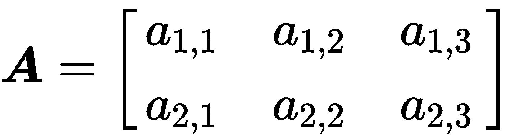

然后，在主要行数据布局中，矩阵的成员在内存中将具有以下布局:

| **0** | **1** | **2** | **3** | **4** | **5** |
| a11 | a12 | a13 | a21 | a22 | a23 |

在列-主要数据布局的情况下，顺序布局将是下一个，如下所示:

| **0** | **1** | **2** | **3** | **4** | **5** |
| a11 | a21 | a12 | a22 | a13 | a23 |

# 线性代数应用编程接口示例

考虑一些 C++ 线性代数 API(简称**应用接口**，看看我们如何使用它们来创建线性代数原语，并用它们来执行代数运算。

# 使用特征

`Eigen`是一个通用的线性代数 C++ 库。在`Eigen,`中，所有矩阵和向量都是`Matrix`模板类的对象，向量是矩阵类型的特化，有一行或一列。张量对象不在官方 API 中呈现，而是作为子模块存在。

我们可以这样定义具有已知维度和浮点数据类型的矩阵的类型:

```cpp
typedef Eigen::Matrix<float, 3, 3> MyMatrix33f;
```

我们可以用以下方式定义向量:

```cpp
typedef Eigen::Matrix<float, 3, 1> MyVector3f;
```

`Eigen`已经有很多向量和矩阵对象的预定义类型，例如，`Eigen::Matrix3f`(浮点 3x3 矩阵类型)或`Eigen::RowVector2f`(浮点 1 x 2 向量类型)。此外，`Eigen`并不局限于我们在编译时知道其维数的矩阵。我们可以定义矩阵类型，它将在运行时初始化时采用行数或列数。为了定义这样的类型，我们可以为名为`Eigen::Dynamic`的`Matrix`类模板参数使用一个特殊的类型变量。例如，要定义具有动态维度的双精度矩阵，我们可以使用以下定义:

```cpp
typedef Eigen::Matrix<double, Eigen::Dynamic, Eigen::Dynamic> MyMatrix;
```

从我们定义的类型初始化的对象如下所示:

```cpp
MyMatrix33f a;
MyVector3f v;
MyMatrix m(10,15);
```

要将一些值放入这些对象，我们可以使用几种方法。我们可以使用特殊的预定义初始化函数，如下所示:

```cpp
a = MyMatrix33f::Zero(); // fill matrix elements with zeros
a = MyMatrix33f::Identity(); // fill matrix as Identity matrix
v = MyVector3f::Random(); // fill matrix elements with random values
```

我们可以使用*逗号初始值设定项*语法，如下所示:

```cpp
a << 1,2,3,
     4,5,6,
     7,8,9;
```

此代码构造以下列方式初始化矩阵值:


我们可以使用直接元素访问来设置或更改矩阵系数。下面的代码示例显示了如何使用`()`运算符进行这样的操作:

```cpp
a(0,0) = 3;
```

我们可以使用`Map`类型的对象来包装`Matrix`类型对象中现有的 C++ 数组或向量。这种映射对象将使用内存和底层对象的值，并且不会分配额外的内存和复制值。以下片段显示了如何使用`Map`类型:

```cpp
int data[] = {1,2,3,4};
Eigen::Map<Eigen::RowVectorxi> v(data,4);
std::vector<float> data = {1,2,3,4,5,6,7,8,9};
Eigen::Map<MyMatrix33f> a(data.data());
```

我们可以在数学运算中使用初始化的矩阵对象。`Eigen`库中的矩阵和向量算术运算是通过标准 C++ 算术运算符(如`+, -, *,`)的重载或通过`dot()`和`cross()`等方法提供的。下面的代码示例展示了如何在`Eigen:`中表达一般的数学运算

```cpp
using namespace Eigen;   
auto a = Matrix2d::Random();
auto b = Matrix2d::Random();
auto result = a + b;
result = a.array() * b.array(); // element wise multiplication
result = a.array() / b.array();
a += b;
result = a * b; // matrix multiplication
//Also it’s possible to use scalars:
a = b.array() * 4;
```

注意在`Eigen,`中`operator+`等算术运算符本身不执行任何计算。这些运算符返回一个*表达式对象*，它描述了要执行什么计算。当整个表达式被求值时，实际的计算发生在后面，通常是在`operator=`算术运算符中。这可能会导致一些奇怪的行为，主要是如果开发人员过于频繁地使用`auto`关键字。

有时，我们只需要对矩阵的一部分进行运算。为此，`Eigen`提供`block`方法，取四个参数:`i,j,p,q`。这些参数是块大小`p,q`和起点`i,j`。下面的代码显示了如何使用此方法:

```cpp
Eigen::Matrixxf m(4,4);
Eigen::Matrix2f b = m.block(1,1,2,2); // copying the middle part of matrix
m.block(1,1,2,2) *= 4; // change values in original matrix
```

还有两种方法可以通过索引访问行和列，这也是一种块操作。下面的代码片段显示了如何使用`col`和`row`方法:

```cpp
m.row(1).array() += 3;
m.col(2).array() /= 4;
```

线性代数库的另一个重要特性是广播，`Eigen`通过`colwise`和`rowwise`方法支持这一点。广播可以通过在一个方向上复制它来解释为矩阵。看看下面的例子，如何给矩阵的每一列添加一个向量:

```cpp
Eigen::Matrixxf mat(2,4);
Eigen::Vectorxf v(2); // column vector
mat.colwise() += v;
```

该操作有如下结果:。

# 使用张量

`xtensor`库是一个用多维数组表达式进行数值分析的 C++ 库。`xtensor`的容器灵感来自 Python 数组编程库 NumPy。ML 算法主要是用 Python 和 NumPy 来描述的，所以这个库可以让它们更容易移动到 C++。以下容器类在`xtensor`库中实现多维数组。

`xarray`类型是一个动态调整大小的多维数组，如下面的代码片段所示:

```cpp
std::vector<size_t> shape = { 3, 2, 4 };
xt::xarray<double, xt::layout_type::row_major> a(shape);
```

`xtensor`类型是多维数组，其维度在编译时是固定的。可以在初始化步骤中配置精确的维度值，如以下代码片段所示:

```cpp
std::array<size_t, 3> shape = { 3, 2, 4 };
xt::xtensor<double, 3> a(shape);
```

`xtensor_fixed`类型是一个多维数组，其维度形状在编译时是固定的，如下面的代码片段所示:

```cpp
xt::xtensor_fixed<double, xt::xshape<3, 2, 4>> a;
```

`xtensor`库也用表达式模板技术实现算术运算符，如`Eigen`(这是用 C++ 实现的数学库的常用方法)。所以，计算是缓慢进行的，实际结果是在整个表达式求值时计算出来的。容器定义也是表达式。还有一个功能是在`xtensor`库中强制一个名为`xt::eval`的表达式求值。

`xtensor`库中有不同种类的容器初始化。
初始化`xtensor`数组可以用 C++ 初始化列表完成，如下所示:

```cpp
        xt::xarray<double> arr1{{1.0, 2.0, 3.0},
                                {2.0, 5.0, 7.0},
                                {2.0, 5.0, 7.0}}; // initialize a 3x3 array
```

`xtensor`库也有特殊张量类型的构建函数。下面的代码片段显示了其中的一些:

```cpp
std::vector<uint64_t> shape = {2, 2};
xt::ones(shape);
xt::zero(shape);
xt::eye(shape); //matrix with ones on the diagonal
```

另外，我们可以使用`xt::adapt`函数将现有的 C++ 数组映射到`xtensor`容器中。此函数返回使用基础对象的内存和值的对象，如以下代码片段所示:

```cpp
std::vector<float> data{1,2,3,4};
std::vector<size_t> shape{2,2};
auto data_x = xt::adapt(data, shape);
```

我们可以使用直接访问容器元素，通过`()`操作符来设置或更改张量值，如下面的代码片段所示:

```cpp
std::vector<size_t> shape = {3, 2, 4};
xt::xarray<float> a = xt::ones<float>(shape);
a(2,1,3) = 3.14f;
```

`xtensor`库通过标准 C++ 算术运算符的重载实现线性代数算术运算，如`+`、`-`和`*`。要使用其他操作，如点积操作，我们必须将应用与名为`xtensor-blas`的库链接起来。这些运算符在`xt::linalg`命名空间中声明。

下面的代码显示了算术运算在`xtensor`库中的使用:

```cpp
auto a = xt::random::rand<double>({2,2});
auto b = xt::random::rand<double>({2,2});
auto c = a + b;
a -= b;
c = xt::linalg::dot(a,b);
c = a + 5;
```

要部分访问`xtensor`容器，我们可以使用`xt::view`功能。以下示例显示了该函数的工作原理:

```cpp
xt::xarray<int> a{{1,  2,  3,  4},
                  {5,  6,  7,  8}
                  {9,  10, 11, 12}
                  {13, 14, 15, 16}};
auto b = xt::view(a, xt::range(1, 3), xt::range(1, 3));
```

这个操作从张量中取出一个矩形块，如下所示:


`xtensor`库在大多数情况下实现自动广播。当运算涉及两个不同维度的数组时，它会将较小维度的数组传输到另一个数组的前导维度上，因此我们可以直接将一个向量添加到矩阵中。下面的代码示例显示了这有多容易:

```cpp
auto m = xt::random::rand<double>({2,2});
auto v = xt::random::rand<double>({2,1});
auto c = m + v;
```

# 使用鲨鱼毫升

`Shark-ML`是一个功能丰富的 C++ ML 库。它还为线性代数例程提供了一个应用编程接口。

在`Shark-ML`库中有四个用于表示矩阵和向量的容器类。请注意，线性代数功能是在`remora`命名空间中声明的，而不是用于其他例程的`shark`命名空间。

下面的代码示例显示了存在于`Shark-ML`库中的容器类，其中`vector`类型是一个动态大小的数组:

```cpp
remora::vector<double> b(100, 1.0); // vector of size 100 and filled with 1.0
```

`compressed_vector`类型是以压缩格式存储值的稀疏数组。

`matrix`类型是一个动态调整大小的密集矩阵，如下面的代码片段所示:

```cpp
remora::matrix<double> C(2, 2); // 2x2 matrix
```

`compressed_matrix`类型是以压缩格式存储值的稀疏矩阵。

`Shark-ML`库中有两种主要的容器初始化类型。

我们可以用接受初始化列表的构造函数来初始化容器对象。下面的代码示例显示了这一点:

```cpp
remora::matrix<float> m_ones{{1, 1}, {1, 1}}; // 2x2 matrix
```

第二种选择是将现有的 C++ 数组包装到容器对象中，并重用其内存和值。下面的代码示例显示了如何使用相同的数组初始化矩阵和向量对象:

```cpp
float data[]= {1,2,3,4};
remora::matrix<float> m(data, 2, 2);
remora::vector<float> v(data, 4);
```

此外，我们可以使用`()`操作符直接访问容器元素来初始化值。下面的代码示例显示了如何为矩阵和向量对象设置值:

```cpp
remora::matrix<float> m(data, 2, 2);
m(0,0) = 3.14f;
remora::vector<float> v(data, 4);
v(0) = 3.14f;

```

`Shark-ML`库通过标准 C++ 算术运算符的重载实现线性代数算术运算，如`+`、`-`和`*`。其他一些操作，如点积，是作为独立的功能实现的。

下面的代码示例展示了如何在`Shark-ML`库中使用算术运算:

```cpp
remora::matrix<float> a(data, 2, 2);
remora::matrix<float> b(data, 2, 2);
auto c = a + b;
a -= b;
c = remora::prod(a,b);
c = a%b; // also dot product operation
c = a + 5;
```

我们可以使用以下函数来部分访问 Shark ML 容器:

*   `subrange (x,i,j)` : 这个函数返回一个 x 的子向量，元素为 *xi* ，…，*XJ*1。
*   `subrange (A,i,j,k,l)`:该函数返回一个 *A* 的子矩阵，元素由 *i* 、…、*j*1 和 *k* 、…、*l*1 表示。
*   `row (A,k)`:这个函数返回 *A* 的 k <sup>第</sup>行作为向量代理。
*   `column (A,k)`:这个函数返回 *A* 的 k <sup>第</sup>列作为向量代理。
*   `rows (A,k,l)` : 该函数返回 *A* 的行 *k* ，…，*l*1 作为矩阵代理。
*   `columns (A,k,l)` : 该函数返回 *A* 的列 *k* ，…，*l*1 作为矩阵代理。

`Shark-ML`库中没有广播实现。对广播的有限支持只以缩减函数的形式存在(为整个矩阵或向量计算一个数值的一组函数)。有两个函数-`as_rows()`和`as_columns()`函数-允许分别对矩阵行或列独立执行约简操作。我们可以将这些函数的结果传递给任何一个归约函数。下面的代码示例显示了如何执行求和简化:

```cpp
remora::matrix<float> m{{1, 2, 3, 4}, {5, 6, 7, 8}};
auto cols = remora::as_columns(m);
remora::sum(cols)
```

独立处理列和行的另一种方法是使用部分访问函数。下面的代码示例显示了如何向每个矩阵列添加相同的向量:

```cpp
remora::vector<float> v{10, 10};
// Update matrix rows
for (size_t i = 0; i < m.size2(); ++ i) {         
   remora::column(m, i) += v;
}
```

# 使用 Dlib

`Dlib`是一个现代 C++ 工具包，包含 ML 算法和工具，用于在 C++ 中创建计算机视觉软件。`Dlib`中的大多数线性代数工具都是处理稠密矩阵的。然而，对使用稀疏矩阵和向量的支持也很有限。特别地，`Dlib`工具使用来自 C++ **标准模板库** ( **STL** )的容器来表示稀疏向量。

在`Dlib`中有两种主要的容器类型来处理线性代数:`matrix`和`vector`类。`Dlib`中的矩阵运算是使用表达式模板技术实现的，这允许它们消除通常从表达式(如`M = A+B+C+D`)返回的临时矩阵对象。

我们可以通过将维度指定为模板参数，以下列方式创建一个在编译时调整大小的矩阵:

```cpp
Dlib::matrix<double,3,1> y;
```

或者，我们可以创建动态大小的矩阵对象。在这种情况下，我们将矩阵维度传递给构造函数，如下面的代码片段所示:

```cpp
Dlib::matrix<double> m(3,3);
```

稍后，我们可以通过以下方法更改该矩阵的大小:

```cpp
m.set_size(6,6);
```

我们可以用逗号运算符初始化矩阵值，如下面的代码片段所示:

```cpp
m = 54.2,  7.4, 12.1,
    1,     2,    3,
    5.9,   0.05, 1;
```

与前面的库一样，我们可以将现有的 C++ 数组包装到 matrix 对象中，如下面的代码片段所示:

```cpp
double data[] = {1,2,3,4,5,6};
auto a = Dlib::mat(data, 2,3); // create matrix with size 2x3
```

此外，我们可以使用`()`运算符访问矩阵元素，以修改或获取特定值，如以下代码片段所示:

```cpp
m(1,2) = 3;
```

`Dlib`库有一组预定义的函数，用于初始化一个矩阵，该矩阵的值如单位矩阵、1 或随机值，如下面的代码片段所示:

```cpp
auto a = Dlib::identity_matrix<double>(3);
auto b = Dlib::ones_matrix<double>(3,4);
auto c = Dlib::randm(3,4); // matrix with random values with size 3x3
```

`Dlib`库中的大多数线性代数算术运算都是通过标准 C++ 算术运算符的重载实现的，如`+, -, *`。其他复杂操作由库作为独立函数提供。

以下示例显示了`Dlib`库中算术运算的使用:

```cpp
auto c = a + b;
auto e = a * b; // real matrix multiplication
auto d  = Dlib::pointwise_multiply(a, b); // element wise multiplication
a += 5;
auto t = Dlib::trans(a); // transpose matrix
```

为了处理对矩阵的部分访问，`Dlib`提供了一组特殊函数。下面的代码示例显示了如何使用其中的一些:

```cpp
a = Dlib::rowm(b,0); // takes first row of matrix
a = Dlib::rowm(b,Dlib::range(0,1));//takes first two rows
a = Dlib::colm(b,0); // takes first column
a = Dlib::subm(b, range(1,2), range(1,2)); // takes a rectangular part from center
Dlib::set_subm(b,range(0,1), range(0,1)) = 7; // initialize part of the matrix
Dlib::set_subm(b,range(0,1), range(0,1)) += 7; // add a value to the part of the matrix
```

`Dlib`库中的广播可以用`set_rowm()`、`set_colm()`和`set_subm()`函数建模，这些函数为原始矩阵的特定矩阵行、列或矩形部分提供修改器对象。从这些函数返回的对象支持所有集合或算术运算。下面的代码片段显示了如何向列添加向量:

```cpp
Dlib::matrix<float, 2,1> x;
Dlib::matrix<float, 2,3> m;
Dlib::set_colm(b,Dlib::range(0,1)) += x;
```

# 线性回归概述

考虑一个名为线性回归的真实世界监督 ML 算法的例子。通常，**线性回归**是基于解释值(独立值)对目标值(依赖值)建模的方法。此方法用于预测和查找值之间的关系。我们可以根据输入(自变量)的数量和输入与输出(因变量)之间的关系类型来对回归方法进行分类。

简单线性回归是自变量个数为 1 的情况，自变量( *x* )与因变量( *y* )之间存在线性关系。

线性回归广泛应用于不同的领域，例如科学研究，它可以描述变量之间的关系，以及工业中的应用，例如收入预测。例如，它可以估计代表股价时间序列数据长期运动的趋势线。它告诉您在给定的时间段内，特定数据集中的兴趣值是增加了还是减少了，如下图所示:

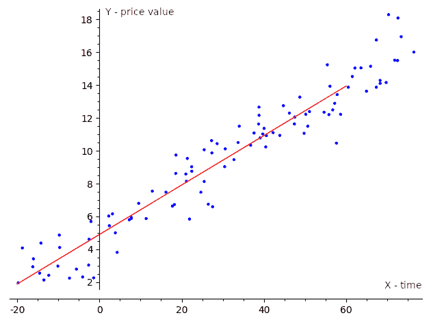

如果我们有一个输入变量(自变量)和一个输出变量(因变量)，这个回归叫做简单，我们用术语**简单线性回归**来表示。有多个自变量，我们称之为**多元线性回归**或**多元线性回归**。通常，当我们处理现实世界的问题时，我们有很多自变量，所以我们用多元回归模型来建模这些问题。多元回归模型有一个涵盖其他类型的通用定义，因此即使是简单的线性回归也经常使用多元回归定义来定义。

# 用不同的库解决线性回归任务

假设我们有一个数据集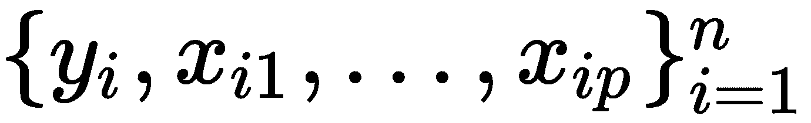，这样我们就可以用数学公式将 *y* 和 *x* 之间的线性关系表达如下:

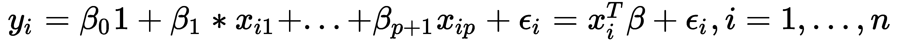

这里 *p* 是自变量的维数， *T* 表示转置，所以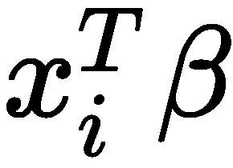是向量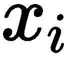和 *β* 之间的内积。此外，我们可以用矩阵表示法重写前面的表达式，如下所示:

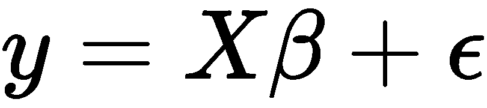

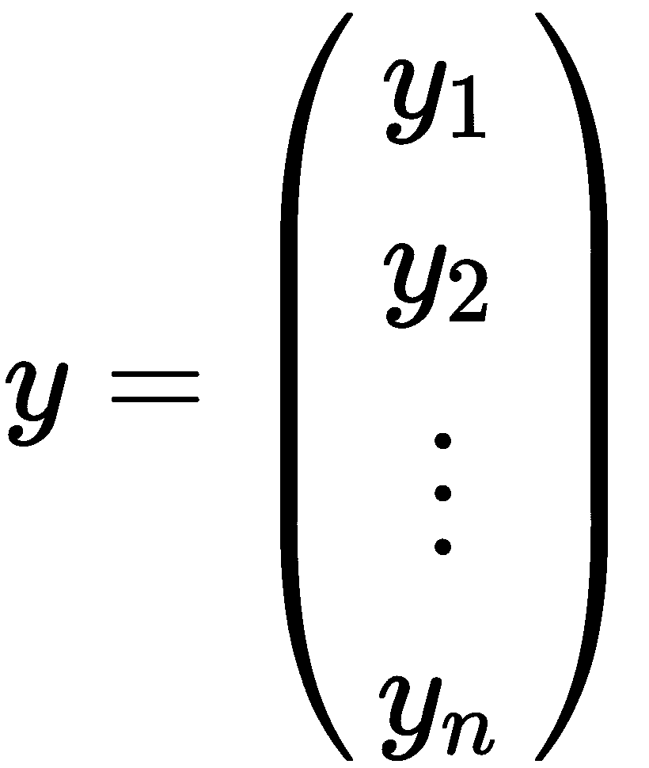、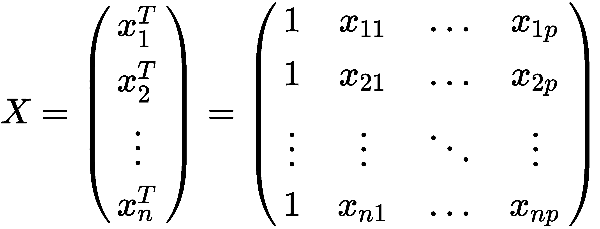、、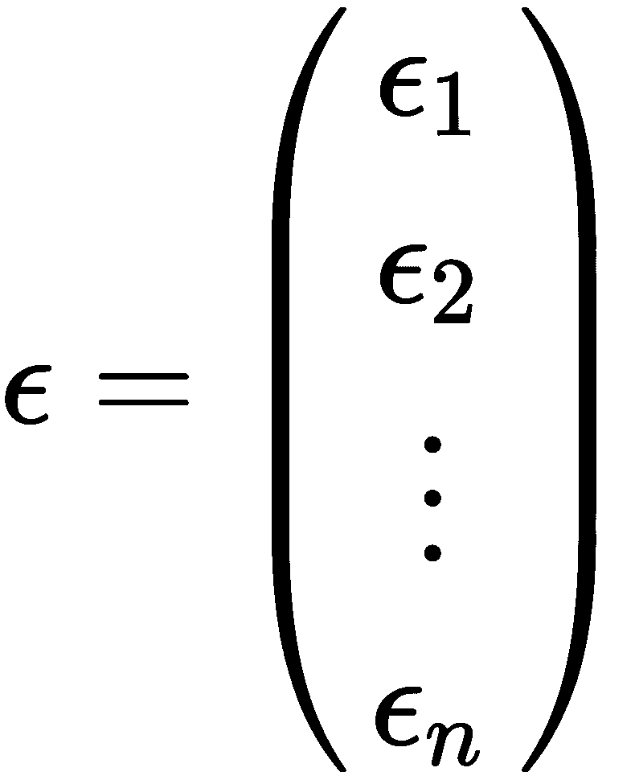

前面的矩阵符号可以解释如下:

*   *y:* 这是观察目标值的向量。
*   *x:* 这是一个行向量矩阵，，被称为解释性或独立值。
*   ←:这是一个( *p+1* )维参数向量。
*   ε:这被称为误差项或噪声。该变量包含除回归变量之外的所有其他影响因变量的因素。

当我们考虑简单线性回归时， *p* 等于 1，方程会是这样的:


线性回归任务的目标是找到满足前面等式的参数向量。通常，这样的线性方程组没有精确的解，所以任务是通过一些假设来估计满足这些方程的参数。最流行的估计方法之一是基于最小二乘法原理的方法:最小化给定数据集中观察到的因变量和线性函数预测到的因变量之间差异的平方和。这叫做**普通最小二乘** ( **OLS** )估计量。所以，这个任务可以用下面的公式来表述:

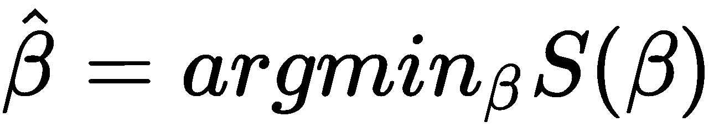

在上式中，目标函数 *S* 由以下矩阵符号给出:

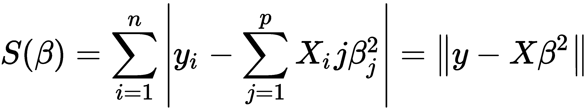

在 *x* 矩阵的 *p* 列是线性独立的情况下，这个最小化问题有一个唯一的解。我们可以通过求解*正规方程*得到这个解，如下:


线性代数库可以用分析方法直接求解这样的方程，但是它有一个显著的缺点——计算成本。在*y**x*维度较大的情况下，对于计算机内存量和计算时间的要求太大，无法解决现实世界的任务。

因此，通常，这个最小化任务是用迭代方法解决的。**梯度下降** ( **GD** )就是这样一个算法的例子。GD 是一种基于以下观察的技术:如果函数被定义并且在点的邻域内是可微的，那么在点处沿着 *S* 的负梯度方向前进时下降最快。

我们可以将我们的目标函数更改为更适合迭代方法的形式。我们可以使用**均方误差** ( **均方误差**)函数来测量估计值和估计值之间的差异，如下图所示:

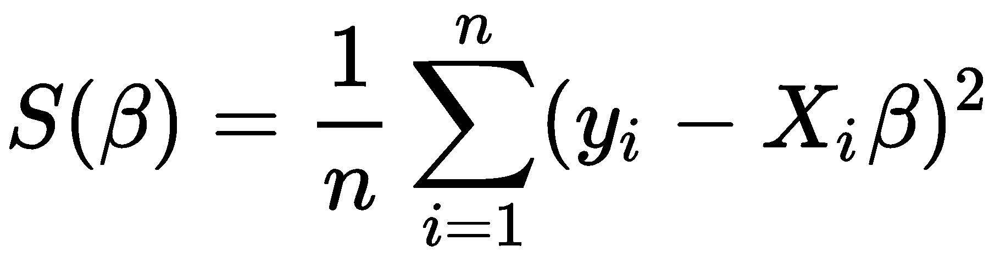

在多元回归的情况下，我们对每个 *x* 分量取该函数的偏导数，如下所示:

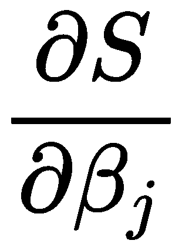

在线性回归的情况下，我们取下列导数:

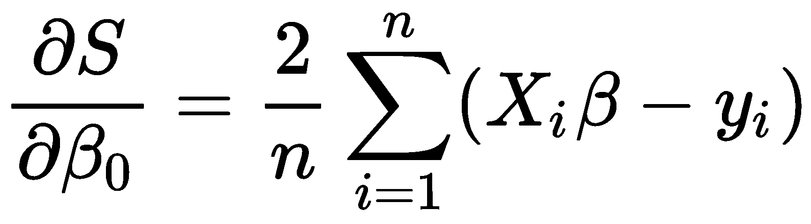


整个算法有如下描述:

1.  用零初始化β。
2.  为学习速率参数定义一个值，该值控制我们在学习过程中调整参数的程度。
3.  计算以下β值:


4.  多次重复步骤 1-3，或者直到均方误差值达到合理的数值。

前面描述的算法是最简单的监督最大似然算法之一。我们用本章前面介绍的线性代数概念来描述它。后来，更明显的是，几乎所有的 ML 算法都在兜帽下使用线性代数。以下示例显示了不同线性代数库中用于解决*线性回归*任务的高级应用编程接口，我们提供它们来展示库如何简化下面使用的复杂数学。我们将在后面的章节中给出这些示例中使用的 API 的细节。

# 用特征值求解线性回归问题

在`Eigen`库中有几种求解形式问题的迭代方法。`LeastSquaresConjugateGradient`类就是其中之一，它允许我们用共轭梯度算法解决线性回归问题。`ConjugateGradient`算法可以比常规的 GD 更快地收敛到函数的最小值，但是需要明确定义矩阵 *A* 以保证数值的稳定性。`LeastSquaresConjugateGradient`类有两个主要设置:最大迭代次数和公差阈值，该阈值用作相对残差的上限的停止标准，如以下代码块所示:

```cpp
typedef float DType;
using Matrix = Eigen::Matrix<DType, Eigen::Dynamic, Eigen::Dynamic>;
int n = 10000;
Matrix x(n,1);
Matrix y(n,1);
Eigen::LeastSquaresConjugateGradient<Matrix> gd;
gd.setMaxIterations(1000);
gd.setTolerance(0.001) ;
gd.compute(x);
auto b = dg.solve(y);
```

对于新的 *x* 输入，我们可以通过矩阵运算预测新的 *y* 值，如下所示:

```cpp
Eigen::Matrixxf new_x(5, 2);
new_x << 1, 1, 1, 2, 1, 3, 1, 4, 1, 5;
auto new_y = new_x.array().rowwise() * b.transpose().array();
```

另外，我们可以通过直接求解*正规方程*来计算参数的 *b* 向量(线性回归任务解)，如下所示:

```cpp
auto b = (x.transpose() * x).ldlt().solve(x.transpose() * y);
```

# 用幕府解决线性回归问题

`Shogun`是一个开源的 ML 库，提供了广泛的统一 ML 算法。`Shogun`库有用于解决简单线性回归问题的`CLinearRidgeRegression`类。这个类以非迭代的方式解决了标准 Cholesky 矩阵分解的问题，如下面的代码块所示:

```cpp
auto x = some<CDenseFeatures<float64_t>>(x_values);
auto y= some<CRegressionLabels>(y_values); // real-valued labels
float64_t tau_regularization = 0.0001;
auto lr = some<CLinearRidgeRegression>(tau_regularization, nullptr, nullptr); // regression model with regularization
lr->set_labels(y);
r->train(x)
```

对于新的 *x* 输入，我们可以通过以下方式预测新的 *y* 值:

```cpp
auto new_x = some<CDenseFeatures<float64_t>>(new_x_values);
auto y_predict = lr->apply_regression(new_x);
```

同样，我们可以得到计算的参数(线性回归任务解)向量，如下所示:

```cpp
auto weights = lr->get_w();
```

此外，我们可以计算 MSE 的值，如下所示:

```cpp
auto y_predict = lr->apply_regression(x);
auto eval = some<CMeanSquaredError>();
auto mse = eval->evaluate(y_predict , y);
```

# 用 Shark-ML 解决线性回归问题

`Shark-ML`库提供了用于表示线性回归问题的`LinearModel`类。这种模型有两个训练器类:`LinearRegression`类，提供解析解，`LinearSAGTrainer`类，提供随机平均梯度迭代方法，如以下代码块所示:

```cpp
using namespace shark;
using namespace std;
Data<RealVector> x;
Data<RealVector> y;
RegressionDataset data(x, y);
LinearModel<> model;
```

```cpp
LinearRegression trainer;
trainer.train(model, data);
```

我们可以通过运行以下代码来获得计算的参数(线性回归任务解)向量:

```cpp
auto b = model.parameterVector();
```

对于新的 *x* 输入，我们可以通过以下方式预测新的 *y* 值:

```cpp
Data<RealVector> new_x;
Data<RealVector> prediction = model(new_x);
```

同样，我们可以计算平方误差的值，如下所示:

```cpp
SquaredLoss<> loss;
auto se = loss(y, prediction)
```

# 用 Dlib 进行线性回归

`Dlib`库提供了`krr_trainer`类，可以得到`linear_kernel`类型的模板参数来求解线性回归任务。这个类用核岭回归算法实现了这类问题的直接解析求解，如下面的代码块所示:

```cpp
std::vector<matrix<double>> x;
std::vector<float> y;
krr_trainer<KernelType> trainer;
trainer.set_kernel(KernelType());
decision_function<KernelType> df = trainer.train(x, y);
```

对于新的 *x* 输入，我们可以通过以下方式预测新的 *y* 值:

```cpp
std::vector<matrix<double>> new_x;
for (auto& v : x) {
    auto prediction = df(v);
    std::cout << prediction << std::endl;
}
```

# 摘要

在这一章中，我们学习了 ML 是什么，它与其他计算机算法有什么不同，以及它是如何变得如此流行的。我们还熟悉了开始使用 ML 算法所需的必要数学背景。我们查看了为线性代数提供 API 的软件库，并实现了我们的第一个 ML 算法——线性回归。

C++ 还有其他线性代数库。此外，流行的深度学习框架使用自己的线性代数库实现。比如 MXNet 框架基于`mshadow`库，PyTorch 框架基于`ATen`库。其中一些库可以使用 GPU 或特殊的 CPU 指令来加速计算。这些特性通常不会改变应用编程接口，但需要一些额外的库初始化设置或显式的对象转换到不同的后端，如中央处理器或图形处理器。

在接下来的两章中，我们将了解更多实现更复杂算法所必需的可用软件工具，我们还将了解更多关于如何管理 ML 算法的理论背景。

# 进一步阅读

*   深度学习基础线性代数:[https://towards data science . com/深度学习线性代数-f21d7e7d7f23](https://towardsdatascience.com/linear-algebra-for-deep-learning-f21d7e7d7f23)
*   深度学习-麻省理工学院出版社图书:[https://www . deep Learning book . org/contents/linear _ 代数. html](https://www.deeplearningbook.org/contents/linear_algebra.html)
*   什么是机器学习？:[https://www.mathworks.com/discovery/machine-learning.html](https://www.mathworks.com/discovery/machine-learning.html)
*   图书馆文献:[http://eigen.tuxfamily.org](http://eigen.tuxfamily.org)
*   图书馆文献:[https://xtensor.readthedocs.io/en/latest/](https://xtensor.readthedocs.io/en/latest/)
*   图书馆文献:[http://dlib.net/](http://dlib.net/)
*   图书馆文献:[http://image.diku.dk/shark/](http://image.diku.dk/shark/)
*   图书馆文献:[http://www.shogun-toolbox.org/](http://www.shogun-toolbox.org/)