# 四、聚类

**聚类**是一种无监督的机器学习方法，用于将对象的原始数据集拆分成按属性分类的组。机器学习中的对象通常被视为多维度量空间中的一个点。每个空间维度对应于一个对象属性(特征)，度量是这些属性的值的函数。根据该空间中维度的类型(可以是数字的也可以是分类的)，我们选择聚类算法的类型和特定的度量函数。这种选择取决于不同对象属性类型的性质。

聚类和分类的主要区别在于未定义的目标组集合，这是由聚类算法决定的。目标组(集群)的集合是算法的结果。

我们可以将聚类分析分为以下几个阶段:

*   选择用于聚类的对象
*   确定我们将用于度量的对象属性集
*   规范化属性值
*   计算度量
*   基于度量值识别不同的对象组

在分析聚类结果之后，可能需要对所选算法的所选度量进行一些校正。

我们可以将集群用于各种实际任务，包括:

*   为广告商将新闻分成几类
*   根据客户群体对市场分析的偏好来识别他们
*   确定用于生物学研究的植物和动物群体
*   确定和分类城市规划和管理的属性
*   探测地震震中群以识别危险区域
*   对保险投保人群体进行风险管理分类

*   给图书馆的书分类
*   在数据中搜索隐藏的结构相似性

本章将涵盖以下主题:

*   聚类中的距离测量
*   聚类算法的类型
*   使用`Shogun`库处理聚类任务样本的例子
*   使用`Shark-ML`库处理聚类任务样本的例子
*   使用`Dlib`库处理聚类任务样本的例子
*   用 C++ 绘制数据

# 技术要求

本章所需的技术和安装包括以下内容:

*   支持 C++ 17 的现代 C++ 编译器
*   CMake 构建系统版本> = 3.8
*   `Dlib`库安装
*   `Shogun-toolbox`库安装
*   `Shark-ML`库安装
*   `plotcpp`库安装

The code files for this chapter can be found at the following GitHub repo: [https://github.com/PacktPublishing/Hands-On-Machine-Learning-with-CPP/tree/master/Chapter04](https://github.com/PacktPublishing/Hands-On-Machine-Learning-with-CPP/tree/master/Chapter04)

# 聚类中的距离测量

度量或距离度量是聚类中的一个基本概念，因为它用于确定对象之间的相似性。然而，在对对象应用距离度量之前，我们必须制作对象特征的向量；通常，这是一组数值，如人体身高或体重。此外，一些算法可以处理分类对象特征(或特性)。标准做法是标准化特征值。规范化确保每个要素在距离度量计算中产生相同的影响。在聚类任务的范围内，有许多距离测量功能可以使用。最常用于数值属性的是欧几里德距离、平方欧几里德距离、曼哈顿距离和切比雪夫距离。以下小节详细描述了它们。

# 欧几里得距离

欧氏距离是最广泛使用的距离度量。一般来说，这是多维空间中的几何距离。以下是欧几里得距离的公式:


# 平方欧几里德距离

平方欧几里德距离具有与欧几里德距离相同的属性，但是它也给远处的值增加了比较近的值更多的重要性(权重)。以下是平方欧几里得距离的公式:

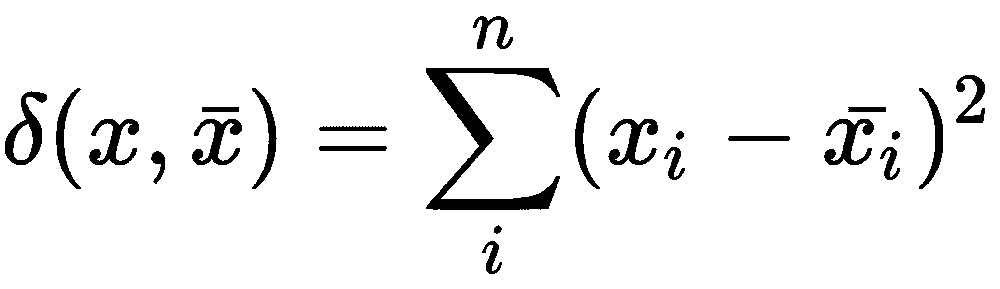

# 曼哈顿距离

曼哈顿距离是坐标的平均差值。在大多数情况下，它的值给出了与欧氏距离相同的聚类结果。然而，它降低了远处值(异常值)的重要性(权重)。下面是曼哈顿距离的公式:


# 切比雪夫距离

当我们需要将两个物体分类为不同时，当它们仅相差一个坐标时，切比雪夫距离会很有用。以下是切比雪夫距离的公式:

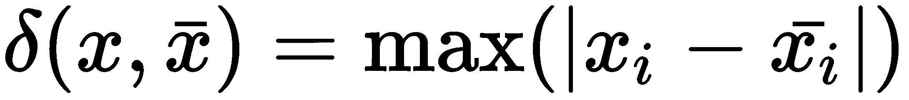

下图显示了不同距离之间的差异:

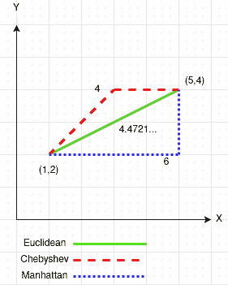

我们可以看到*曼哈顿*距离是两个维度的距离之和，就像走在城市街区一样。*欧几里得*距离只是一条直线的长度。*切比雪夫*距离比*曼哈顿*距离更灵活，因为对角线移动也被考虑在内。

在本节中，我们熟悉了主要的聚类概念，这是一种距离度量。在下一节中，我们将讨论各种类型的聚类算法。

# 聚类算法的类型

有不同类型的聚类，我们可以将其分为以下几类:基于分区的、基于光谱的、基于层次的、基于密度的和基于模型的。基于划分的聚类算法组在逻辑上可以分为基于距离的方法和基于图论的方法。

# 基于划分的聚类算法

基于分区的方法使用相似性度量将对象组合成组。从业者通常自己选择这类算法的相似性度量，使用关于问题的先验知识或试探法来适当地选择度量。有时，需要用相同的算法尝试几种方法来选择最佳方法。此外，基于分区的方法通常需要明确指定所需集群的数量或调节输出集群数量的阈值。

# 基于距离的聚类算法

这类方法中最著名的代表是 k-means 和 k-medoids 算法。它们以 *k* 为输入参数，将数据空间划分为 *k* 个聚类，使得一个聚类中的对象之间的相似度最大。此外，它们使不同集群的对象之间的相似性最小化。相似度值计算为从对象到聚类中心的距离。这些方法的主要区别在于定义聚类中心的方式。

利用 k-means 算法，相似度与到聚类质心的距离成正比。群集质心是数据空间中群集对象坐标的平均值。k-means 算法可以用以下步骤来简要描述。首先，我们选择 *k* 个随机对象，并将它们定义为代表集群质心的集群原型。然后，剩余的对象以更大的相似性附着到集群。之后，重新计算每个簇的质心。对于每个获得的划分，计算特定的评估函数，其值在每个步骤形成收敛的系列。该过程一直持续到指定的系列收敛到其极限值。

换句话说，当集群保持不变时，将对象从一个集群移动到另一个集群就结束了。最小化评估函数可以使生成的集群尽可能紧凑和独立。当集群是紧密的*云*时，k-means 方法工作得很好，这些云彼此明显分离。它对于处理大量数据很有用，但不适用于检测非凸形状的簇或大小非常不同的簇。此外，该方法易受噪声和孤立点的影响，因为即使少量这样的点也会显著影响群集中心质量的计算。

为了减少噪声和孤立点对聚类结果的影响，与 k-means 算法相比，k-medoids 算法使用其中一个聚类对象(称为代表对象)作为聚类中心。与 k-means 方法一样，随机选择 *k* 个代表对象。剩余对象中的每一个都与最近的代表对象组合成一个簇。然后，用数据空间中任意的非代表性对象迭代地替换每个代表性对象。替换过程一直持续到生成的集群的质量提高为止。聚类质量由对象和相应聚类的代表对象之间的偏差之和决定，该方法试图最小化该偏差。因此，迭代继续，直到每个簇中的代表性对象成为 medoid。水母是最靠近星团中心的物体。该算法在处理大量数据时可扩展性较差，但这个问题通过 **CLARANS** ( **基于** **随机化搜索**的聚类大型应用)算法得到了解决，该算法补充了 k-medoids 方法。对于多维聚类，构建 **PROCLUS** ( **投影聚类**)算法。

# 基于图论的聚类算法

基于图论的算法的本质是用图的形式表示目标对象。图形顶点对应对象，边权重等于顶点之间的距离。图聚类算法的优势在于其出色的可见性、相对容易的实现以及基于几何因素进行各种改进的能力。基于图论的主要算法有选择连通分量的算法、构造最小生成树的算法和多层聚类算法。

选择连接组件的算法基于 *R* 输入参数，该算法去除图中距离大于 *R* 的所有边。只有最接近的对象对保持连接。该算法的目标是找到图形折叠成几个相连部分时的 *R* 值。产生的组件是集群。为了选择 *R* 参数，通常会构建成对距离分布的直方图。对于具有明确定义的聚类数据结构的问题，直方图中将有两个峰值——一个对应于聚类内距离，第二个对应于聚类间距离。 *R* 参数是从这些峰值之间的最小区域中选择的。使用距离阈值管理集群的数量可能很困难。

最小生成树算法首先在图上建立最小生成树，然后依次去除权重最高的边。下图显示了为九个对象获得的最小生成树:

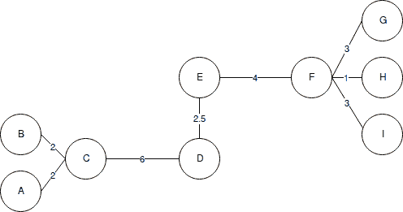

通过去掉 *C* 和 *D* 之间的链接，长度为 6 个单位(距离最大的边)，我们得到两个集群:{ *A* 、 *B* 、 *C* }和{ *D* 、 *E* 、 *F* 、 *G* 、 *H* 、 *I【我们可以通过移除长度为 4 个单位的边缘 *EF* 将第二个簇再分成两个簇。*

多层聚类算法是基于在对象(顶点)之间的某个距离级别上识别图形的连通分量。阈值 *C* 定义距离等级——例如，如果物体之间的距离是 <sub></sub> ，那么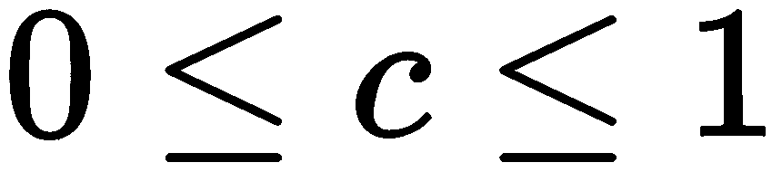。

图层聚类算法生成图形 *G* 的一系列子图形，这些子图形反映了聚类 <sub></sub> 之间的层次关系，适用于以下情况:

*   <sub>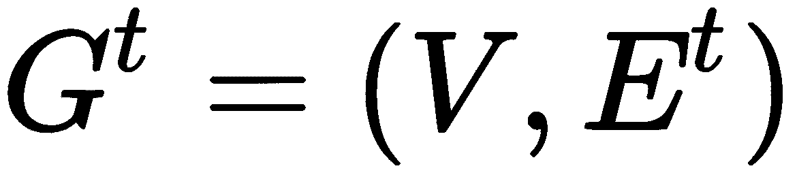</sub> :一个级的子图
*   <sub>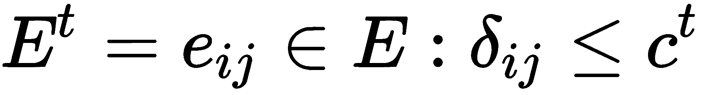</sub>
*   <sub xmlns:epub="http://www.idpf.org/2007/ops">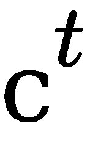</sub> :距离的*t*T5 门槛
*   :层级的数量
*   <sub>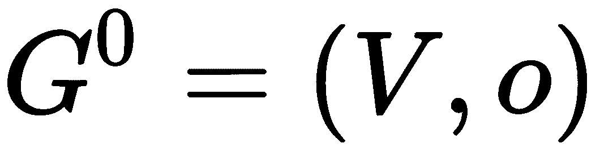</sub> ，o:一组空的图边，当 <sub></sub>
*   :距离无阈值的物体图， <sub></sub>

通过改变 <sub>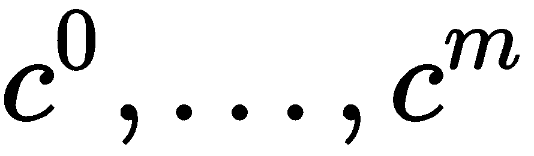</sub> 距离阈值，其中 <sub>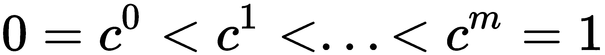</sub> ，可以控制生成的聚类的层次深度。因此，多层聚类算法可以创建平面和分层数据分区。

# 谱聚类算法

谱聚类是指使用图的邻接矩阵的特征向量或从其导出的其他矩阵将一组数据划分为聚类的所有方法。邻接矩阵描述了一个完整的图，其中对象中有顶点，每对对象之间有边，权重对应于这些顶点之间的相似程度。谱聚类是将最初的一组对象转换成空间中的一组点，这些点的坐标是特征向量的元素。这种任务的正式名称是**规范化切割问题**。然后，使用标准方法(例如，k-means 算法)对得到的一组点进行聚类。改变特征向量创建的表示允许我们更清楚地设置原始聚类集的属性。因此，谱聚类可以分离不能通过应用 k-均值来分离的点——例如，当 k-均值方法得到一个凸点集时。谱聚类的主要缺点是它的三次计算复杂度和二次内存需求。

# 分层聚类算法

在层次聚类算法中，主要有两种类型:基于自底向上和自顶向下的算法。自上而下的算法遵循下一个原则:在开始时，所有对象都被放在一个集群中，然后这个集群被分成越来越小的集群。自下而上的算法比自上而下的算法更常见。他们在工作开始时将每个对象放在一个单独的集群中，然后将集群合并成更大的集群，直到数据集中的所有对象都包含在一个集群中，从而构建一个嵌套分区系统。这种算法的结果通常以树的形式呈现，称为树图。这种树的一个经典例子是生命之树，它描述了动物和植物的分类。

分层方法的主要问题是难以确定停止条件，以便隔离自然集群，同时防止它们过度分裂。分层聚类方法的另一个问题是选择聚类的分离点或合并点。这种选择是至关重要的，因为在每个后续步骤中分割或合并集群后，该方法将仅在新形成的集群上运行。因此，在任何步骤中错误选择合并点或分割点都会导致低质量的聚类。此外，分层方法不能应用于大型数据集，因为决定是划分还是合并聚类需要分析大量对象和聚类，这导致该方法的计算复杂度很高。

分层聚类方法中使用的聚类联合有几个指标或链接标准，如下所示:

*   **单联动**(最近邻距离):该方法中，两个簇之间的距离由不同簇中两个最近的物体(最近邻)之间的距离决定。产生的团簇倾向于连锁在一起。
*   **完成联动**(距离最远的邻居之间的距离):该方法中，簇与簇之间的距离由不同簇中任意两个物体之间的最大距离(即距离最远的邻居)决定。当对象来自不同的组时，这种方法通常非常有效。如果集群是拉长的或者它们的自然类型是*链式*，那么这种方法是不合适的。
*   **未加权的成对平均链接**:在该方法中，两个不同聚类之间的距离被计算为其中所有对象对之间的平均距离。当对象形成不同的组时，这种方法很有用，但是它同样适用于拉长的(链式)集群。
*   **加权成对均值链接**:该方法与未加权成对均值方法相同，只是计算中使用了对应聚类的大小(其中包含的对象数量)作为加权因子。因此，当我们假设集群大小不相等时，应该使用这种方法。
*   **加权质心联动**:该方法将两个簇之间的距离定义为它们质心之间的距离。
*   **加权质心链接** **(中值)**:该方法与前一种方法相同，不同之处在于计算使用了聚类大小之间测量距离的权重。因此，如果集群大小存在显著差异，则此方法优于前一种方法。

下图显示了分层聚类树图:


上图显示了分层聚类的树形图示例，您可以看到聚类的数量如何取决于对象之间的距离。距离越大，集群数量越少。

# 基于密度的聚类算法

在基于密度的方法中，聚类被认为是多个对象密度高的区域，它们被对象密度低的区域分开。

**DBSCAN** ( **基于密度的噪声应用空间聚类**)算法是最早的密度聚类算法之一。该算法的基础是几个语句，详细如下:

*   一个物体的 <sub></sub> 是一个物体的 <sub></sub> 半径的邻域。
*   根对象是其 <sub></sub> 包含最小非零数量对象的对象。假设这个最小值等于一个名为 *MinPts* 的预定义值。
*   如果 *p* 在 *q* 的<sub xmlns:epub="http://www.idpf.org/2007/ops">T8 中，并且 *q* 是根对象，则 *p* 对象可以从 *q* 对象直接密集访问。</sub>
*   如果存在一系列 <sub>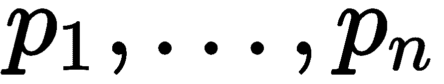</sub> 对象，其中 <sub>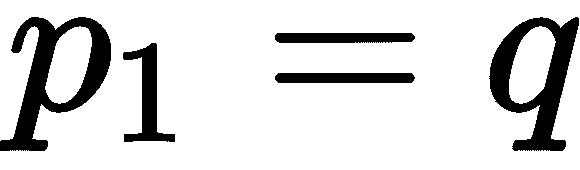</sub> 和 <sub></sub> ，则可以从给定的和 *MinPts* 对象密集访问 *p* 对象，从而可以从<sub></sub><sub>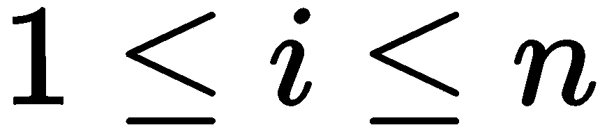</sub>直接密集访问 <sub>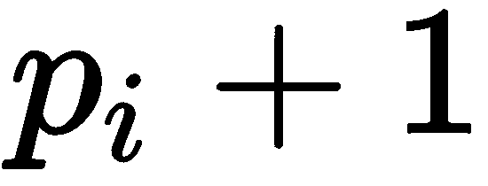</sub> 。
*   对于给定的和 *MinPts* 来说，如果存在 *o* 对象，则 *p* 和 *q* 可以从 *o* 密接，则 *p* 对象与 *q* 对象密接。

DBSCAN 算法检查每个对象的邻域以搜索聚类。如果 *p* 对象的 <sub></sub> 包含比 *MinPts* 更多的点，则使用 *p* 对象作为根对象创建一个新簇。然后，DBSCAN 迭代地从根对象中收集可直接密集访问的对象，这可以导致几个可密集访问的集群的联合。当不能向任何集群添加新对象时，该过程结束。

与基于分区的方法不同，DBSCAN 不要求预先指定集群的数量；它只需要和 *MinPts* 参数的值，直接影响聚类的结果。这些参数的最优值很难确定，尤其是对于多维数据空间。此外，这种空间中的数据分布通常是不对称的，这使得不可能使用全局密度参数进行聚类。对于多维数据空间的聚类，有基于 DBSCAN 算法的**subclou**(**子空间聚类**)算法。

# 基于模型的聚类算法

基于模型的算法假设在数据空间中有一个特定的聚类数学模型，并试图最大化该模型和可用数据的可能性。通常，这使用数理统计的仪器。

**EM** ( **期望–最大化**)算法假设数据集可以使用多维正态分布的线性组合来建模。其目的是估计分布参数，最大化用作模型质量度量的似然函数。换句话说，它假设每个集群中的数据遵循特定的分布规律，即正态分布。有了这个假设，就有可能确定分布律的最佳参数——似然函数最大的均值和方差。因此，我们假设任何物体都属于所有簇，但概率不同。然后，任务将是使该组分布适合数据，然后确定对象属于每个集群的概率。应该将该对象分配给该概率高于其他对象的集群。

EM 算法简单，易于实现。它对孤立的对象不敏感，并且在成功初始化的情况下快速收敛。然而，它要求我们指定集群的 *k* 数量，这意味着关于数据的*先验*知识。此外，如果初始化失败，算法的收敛可能会很慢，或者我们可能会得到一个低质量的结果。这种算法不适用于高维空间，因为在这种情况下，为该空间中的数据分布假设数学模型是复杂的。

在这一节中，我们讨论了各种聚类算法，在接下来的几节中，我们将看到如何在各种 C++ 库的真实示例中使用它们。

# 使用幕府图书馆处理集群任务样本的例子

`Shogun`库包含基于模型、分层和基于分区的聚类方法的实现。基于模型的算法叫做 **GMM** ( **高斯混合模型**)，分区一是 k-means 算法，层次聚类是基于自下而上的方法。

# 幕府将军 GMM

GMM 算法假设聚类可以适合某些高斯(正态)分布；它使用 EM 方法进行培训。在`Shogun`库中有一个`CGMM`类实现了这个算法，如下面的代码片段所示:

```cpp
     Some<CDenseFeatures<DataType>> features;
     int num_clusters = 2;
     ...
     auto gmm = some<CGMM>(num_clusters);
     gmm->set_features(features);
     gmm->train_em();
```

请注意，`CGMM`类的构造函数以期望的簇数作为参数。`CGMM`对象初始化后，我们通过训练特征，使用 EM 方法进行训练。下面这段代码显示了这些步骤，并绘制了聚类结果:

```cpp
 Clusters clusters;
 auto feature_matrix = features->get_feature_matrix();
 for (index_t i = 0; i < features->get_num_vectors(); ++ i) {
     auto vector = feature_matrix.get_column(i);
     auto log_likelihoods = gmm->cluster(vector);
     auto max_el = std::max_element(log_likelihoods.begin(),
     std::prev(log_likelihoods.end()));
     auto label_idx = std::distance(log_likelihoods.begin(), max_el);
     clusters[label_idx].first.push_back(vector[0]);
     clusters[label_idx].second.push_back(vector[1]);
 }
 PlotClusters(clusters, "GMM", name + "-gmm.png");
```

我们使用`CGMM::cluster()`方法来识别我们的对象属于哪个集群。这个方法返回一个概率向量。然后，我们搜索具有最大概率值的向量元素，并将其索引作为簇的编号。

生成的聚类指数被用作`PlotClusters()`函数的参数，该函数可视化了聚类结果，如下图所示:


在前面的截图中，我们可以看到 GMM 算法是如何在不同的人工数据集上工作的。

# 幕府聚类

`Shogun`库中的 k-means 算法在`CKMeans`类中实现。这个类的构造函数接受两个参数:簇的数量和距离度量计算的对象。在下面的例子中，我们将使用用`CEuclideanDistance`类定义的距离对象。在我们构建了`CKMeans`类型的对象之后，我们使用`CKMeans::train()`方法在我们的训练集上训练我们的模型，如下所示:

```cpp
 Some<CDenseFeatures<DataType>> features;
 int num_clusters = 2;
 ...
 CEuclideanDistance* distance = new CEuclideanDistance(features, features);
 CKMeans* clustering = new CKMeans(num_clusters, distance);
 clustering->train(features);
```

当我们训练好 k-means 对象后，可以使用`CKMeans::apply()`方法对输入数据集进行分类。如果我们在没有参数的情况下使用这种方法，训练数据集将用于分类。应用分类的结果是带有标签的容器对象。我们可以将其铸造成`CMulticlassLabels`型，以便更自然地使用。下面的代码示例显示了如何对输入数据进行分类，并绘制了聚类结果:

```cpp
 Clusters clusters;
 auto feature_matrix = features->get_feature_matrix();
 CMulticlassLabels* result = clustering->apply()->as<CMulticlassLabels>();
 for (index_t i = 0; i < result->get_num_labels(); ++ i) {
    auto label_idx = result->get_label(i);
     auto vector = feature_matrix.get_column(i);
     clusters[label_idx].first.push_back(vector[0]);
     clusters[label_idx].second.push_back(vector[1]);
 }
 PlotClusters(clusters, "K-Means", name + "-kmeans.png");
```

我们使用`CMulticlassLabels::get_label()`方法来获取数据集中特定样本的聚类索引。`CMulticlassLabels::get_label()`方法以样本的索引为参数。

我们使用得到的聚类指数来可视化`PlotClusters()`函数的聚类结果，如下图所示:


在前面的截图中，我们可以看到 k-means 算法是如何在不同的人工数据集上工作的。

# 幕府的层次聚类

`Shogun`库中没有层次聚类算法的特征完备实现。有`CHierarachical`类，它实现了距离值的分层聚类。距离可以表示用于聚类的实际对象之间的距离。然而，`CHierarachical`对象返回聚类后得到的新距离值。所以，这样的对象不能直接用于对象聚类；相反，我们可以将其用作自定义聚类算法的构建块。

# 使用 Shark-ML 库处理聚类任务样本的示例

`Shark-ML`库实现了两种聚类算法:层次聚类和 k-means 算法。

# 基于鲨鱼-最大似然的层次聚类

`Shark-ML`库通过以下方式实现层次聚类方法:首先，我们需要将数据放入空间划分树中。例如，我们可以使用`LCTree`类的对象，它实现了二进制空间划分。还有`KHCTree`类，它实现了内核诱导的特征空间划分。这个类的构造函数获取用于分区的数据和一个对象，该对象实现了树构造的一些停止条件。我们使用`TreeConstruction`对象，用树的最大深度和树节点中对象的最大数量来配置它。`LCTree`类假设数据集中使用的要素类型存在欧几里德距离函数。代码可以在下面的块中看到:

```cpp
UnlabeledData<RealVector>& features;
int num_clusters = 2;
 ...
LCTree<RealVector> tree(features,
                             TreeConstruction(0, features.numberOfElements() / num_clusters));
```

构建了分区树之后，我们用`tree`对象作为参数初始化`HierarchicalClustering`类的一个对象。`HierarchicalClustering`类实现了实际的聚类算法。有两种策略可以获得聚类结果，即硬策略和软策略。在硬聚类策略中，每个对象被分配给一个聚类。然而，在软策略中，每个对象被分配给所有聚类，但是具有特定的概率或似然值。在下面的例子中，我们使用`HardClusteringModel`类的对象将对象分配给不同的集群。`HardClusteringModel`类的对象覆盖了函数操作符，所以你可以用它们作为计算的函子。代码可以在下面的代码片段中看到:

```cpp
     HierarchicalClustering<RealVector> clustering(&tree);
     HardClusteringModel<RealVector> model(&clustering);
     Data<unsigned> clusters = model(features);
```

聚类结果是一个容器，其中包含数据集中每个元素的聚类索引，如以下代码片段所示:

```cpp
for (std::size_t i = 0; i != features.numberOfElements(); i++) {
   auto cluster_idx = clusters.element(i);
   auto element = features.element(i);
   ...
}
```

我们遍历`features`容器中的所有项目，并获得每个项目的聚类索引，以可视化我们的聚类结果。该索引用于为每个项目分配不同的颜色，如下图所示:

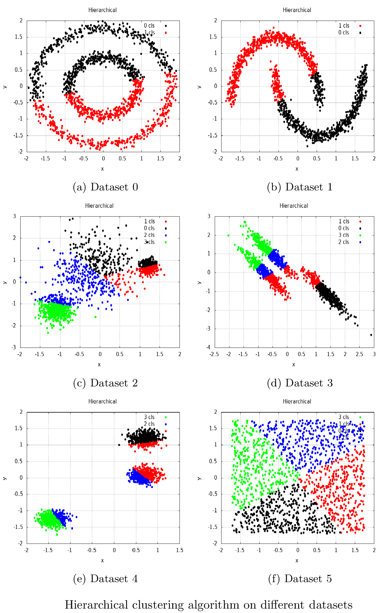

在前面的截图中，我们可以看到`Shark-ML`库中实现的层次聚类算法是如何在不同的人工数据集上工作的。

# 基于鲨鱼最大似然的 k 均值聚类

`Shark-ML`库在`kMeans()`函数中实现 k-means 算法，该算法采用三个参数:训练数据集、期望的聚类数和聚类质心的输出参数。下面的代码示例显示了如何使用该函数:

```cpp
     UnlabeledData<RealVector> features;
     int num_clusters = 2;
     ...
     Centroids centroids;
     kMeans(features, num_clusters, centroids);
```

得到质心后，可以初始化`HardClusteringModel`类的一个对象。与前面的示例一样，我们可以使用该对象来评估新数据或训练数据上的训练模型，如下所示:

```cpp
     HardClusteringModel<RealVector> model(&centroids);
     Data<unsigned> clusters = model(features);

     for (std::size_t i = 0; i != features.numberOfElements(); i++) {
         auto cluster_idx = clusters.element(i);
         auto element = features.element(i);
         ...
     }
```

之后，我们使用`model`对象作为函子来执行聚类。结果是一个容器，其中包含输入数据集每个元素的聚类索引。然后，我们使用这些聚类索引来可视化最终结果，如下图所示:


在前面的截图中，我们可以看到`Shark-ML`库中实现的 k-means 聚类算法是如何在不同的人工数据集上工作的。

# 使用 Dlib 库处理聚类任务样本的示例

`Dlib`库提供了以下聚类方法:k-means、谱聚类、层次聚类以及另外两种图聚类算法:Newman 和 Chinese 耳语。

# 用 Dlib 进行 k-均值聚类

`Dlib`库使用核函数作为 k-means 算法的距离函数。这种函数的一个例子是径向基函数。作为第一步，我们定义所需的类型，如下所示:

```cpp
 typedef matrix<double, 2, 1> sample_type;
 typedef radial_basis_kernel<sample_type> kernel_type;
```

然后，我们初始化一个`kkmeans`类型的对象。它的构造器接受一个定义聚类质心的对象作为输入参数。为此，我们可以使用`kcentroid`类型的对象。它的构造函数取三个参数:第一个是定义核的对象(距离函数)，第二个是质心估计的数值精度，第三个是运行时复杂度的上限(实际上是`kcentroid`对象允许使用的最大字典向量数)，如下面的代码片段所示:

```cpp
 kcentroid<kernel_type> kc(kernel_type(0.1), 0.01, 8);
 kkmeans<kernel_type> kmeans(kc);
```

下一步，我们用`pick_initial_centers()`函数初始化集群中心。该函数将聚类数、中心对象的输出容器、训练数据和距离函数对象作为参数，如下所示:

```cpp
 std::vector<sample_type> samples; //training data-set
 ...
 size_t num_clusters = 2;
 std::vector<sample_type> initial_centers;
 pick_initial_centers(num_clusters, initial_centers, samples,
 kmeans.get_kernel());
```

选择初始中心后，我们可以将它们用于`kkmeans::train()`方法来确定精确的聚类，如下所示:

```cpp
 kmeans.set_number_of_centers(num_clusters);
 kmeans.train(samples, initial_centers);

 for (size_t i = 0; i != samples.size(); i++) {
     auto cluster_idx = kmeans(samples[i]);
     ...
 }
```

我们使用`kmeans`对象作为一个函子来对单个数据项执行聚类。聚类结果将是该项目的聚类索引。然后，我们使用聚类索引来可视化最终的聚类结果，如下图所示:

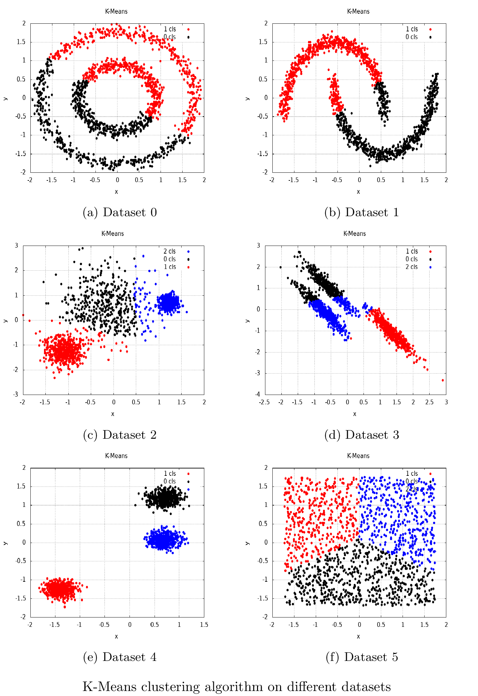

在前面的截图中，我们可以看到`Dlib`库中实现的 k-means 聚类算法是如何在不同的人工数据集上工作的。

# 用 Dlib 进行谱聚类

`Dlib`库中的谱聚类算法在`spectral_cluster`函数中实现。它以距离函数对象、训练数据集和聚类数为参数。因此，它返回一个包含集群索引的容器，这些索引与输入数据具有相同的顺序。在以下示例中，`knn_kernel`类型的对象用作距离函数。您将在随书提供的示例中找到它的实现。这个`knn_kernel`距离函数对象估计给定对象的第一个 **k 近邻** ( **KNN** )对象。这些对象由 KNN 算法确定，该算法使用欧几里德距离作为距离度量，如下所示:

```cpp
 typedef matrix<double, 2, 1> sample_type;
 typedef knn_kernel<sample_type> kernel_type;
 ...
 std::vector<sample_type> samples;
 ...
 std::vector<unsigned long> clusters =
 spectral_cluster(kernel_type(samples, 15), samples, num_clusters);
```

`spectral_cluster()`函数调用用聚类索引值填充了`clusters`对象，我们可以用它来可视化聚类结果，如下图所示:


在前面的截图中，我们可以看到`Dlib`库中实现的谱聚类算法是如何在不同的人工数据集上工作的。

# 用 Dlib 进行层次聚类

`Dlib`库实现了凝聚分层(自下而上)聚类算法。`bottom_up_cluster()`功能实现该算法。该函数将数据集对象之间的距离矩阵、集群索引容器(作为输出参数)和集群数量作为输入参数。请注意，它按照矩阵中提供的距离顺序返回带有聚类索引的容器。

在下面的代码示例中，我们使用输入数据集中每对元素之间的成对欧几里德距离来填充距离矩阵:

```cpp
 matrix<double> dists(inputs.nr(), inputs.nr());
 for (long r = 0; r < dists.nr(); ++ r) {
     for (long c = 0; c < dists.nc(); ++ c) {
       dists(r, c) = length(subm(inputs, r, 0, 1, 2) - subm(inputs, c, 0,
       1, 2));
     }
 }
 std::vector<unsigned long> clusters;
 bottom_up_cluster(dists, clusters, num_clusters);
```

`bottom_up_cluster()`函数调用用聚类索引值填充了`clusters`对象，我们可以用它来可视化聚类结果，如下图所示:


在前面的截图中，我们可以看到`Dlib`库中实现的层次聚类算法是如何在不同的人工数据集上工作的。

# 基于纽曼模块化的 Dlib 图聚类算法

该算法的实现基于 M. E. J .纽曼的工作*模块化和网络中的社区结构*。该算法基于网络或图的模块矩阵，并且不基于特定的图论，但是它与谱聚类有一些相似之处，因为它也使用特征向量。

`Dlib`库在`newman_cluster()`函数中实现该算法，该函数获取加权图边的向量，并输出每个顶点的聚类索引容器。使用该算法的第一步是定义图的边。在下面的代码示例中，我们在几乎每对数据集对象之间创建边。请注意，我们只使用距离大于阈值的对(这是出于性能考虑)。

此外，该算法不需要集群数量的先验知识。它可以自己决定集群的数量。代码可以在下面的块中看到:

```cpp
 std::vector<sample_pair> edges;
 for (long i = 0; i < inputs.nr(); ++ i) {
     for (long j = 0; j < inputs.nr(); ++ j) {
         auto dist = length(subm(inputs, i, 0, 1, 2) - subm(inputs, j, 0, 
         1, 2));
         if (dist < 0.5)
             edges.push_back(sample_pair(i, j, dist));
     }
 }
 remove_duplicate_edges(edges);
 std::vector<unsigned long> clusters;
 const auto num_clusters = newman_cluster(edges, clusters);
```

`newman_cluster()`函数调用用聚类索引值填充了`clusters`对象，我们可以用它来可视化聚类结果。请注意，另一种边缘权重计算方法可能会导致另一种聚类结果。此外，边缘权重值应根据特定任务进行初始化。选择边长只是为了演示。

结果可以在下面的截图中看到:


在前面的截图中，我们可以看到`Dlib`库中实现的纽曼聚类算法是如何在不同的人工数据集上工作的。

# 基于 Dlib 的中文悄悄话图聚类算法

中文悄悄话算法是一种划分加权无向图节点的算法。Chris Biemann 在论文*中描述了一种高效的图聚类算法及其在自然语言处理问题*中的应用。该算法也没有使用任何独特的图论方法，但它使用了使用局部上下文进行聚类的思想，因此可以归类为基于密度的方法。

在`Dlib`库中，该算法在`chinese_whispers()`函数中实现，该函数获取加权图边的向量，并为每个顶点输出带有聚类索引的容器。出于性能考虑，我们使用距离阈值来限制数据集对象之间的边数。此外，与纽曼算法一样，该算法也自行决定生成的聚类数。代码可以在下面的代码片段中看到:

```cpp
 std::vector<sample_pair> edges;
     for (long i = 0; i < inputs.nr(); ++ i) {
         for (long j = 0; j < inputs.nr(); ++ j) {
             auto dist = length(subm(inputs, i, 0, 1, 2) - subm(inputs, j, 
             0, 1, 2));
             if (dist < 1)
              edges.push_back(sample_pair(i, j, dist));
         }
 }
 std::vector<unsigned long> clusters;
 const auto num_clusters = chinese_whispers(edges, clusters);
```

`chinese_whispers()`函数调用用聚类索引值填充了`clusters`对象，我们可以用它来可视化聚类结果。请注意，我们使用`1`作为边缘权重的阈值，另一个阈值可以导致另一个聚类结果。此外，边缘权重值应根据特定任务进行初始化。选择边长只是为了演示。

结果可以在下面的截图中看到:

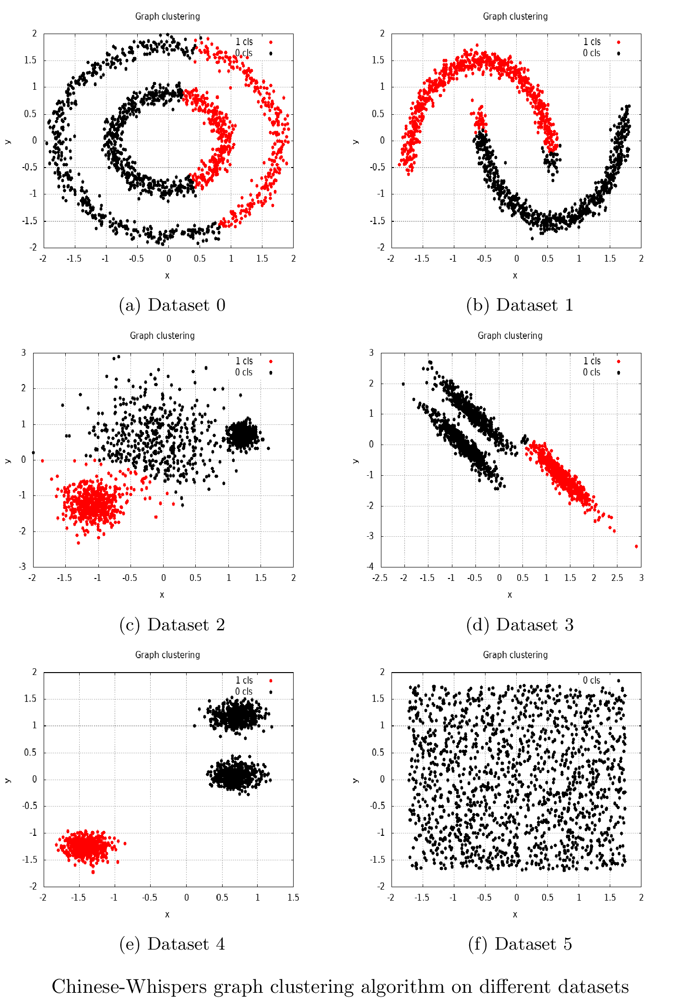

在前面的截图中，我们可以看到`Dlib`库中实现的中文悄悄话聚类算法是如何在不同的人工数据集上工作的。

在当前和之前的部分中，我们看到了许多显示聚类结果的图像示例。下一节将展示使用`plotcpp`库的细节，我们用它来绘制这些图像。

# 用 C++ 绘制数据

我们用`plotcpp`库绘图，它是`gnuplot`命令行实用程序的一个薄包装。有了这个库，我们可以在散点图上画点或画线。开始绘制这个库的第一步是创建一个`Plot`类的对象。然后，我们必须指定绘图的输出目的地。我们可以用`Plot::SetTerminal()`方法设置目的地，这个方法取一个带有目的地点缩写的字符串。可以是`qt`字符串值，用我们的绘图显示**操作系统** ( **OS** )窗口，也可以是带图片文件扩展名的字符串，将绘图保存到文件中，如下面的代码示例所示。此外，我们可以使用`Plot`类方法配置图形标题、轴标签和一些其他参数。然而，它并没有涵盖`gnuplot.`可用的所有可能配置。在我们需要一些独特选项的情况下，我们可以使用`Plot::gnuplotCommand()`方法进行直接`gnuplot`配置。

有两种绘图模式可以在一个绘图上绘制一组不同的图形。我们可以对`Points`或`Lines`类的对象使用`Draw2D()`方法，但是在这种情况下，我们应该在编译之前指定所有的图形配置。第二种选择是使用`Plot::StartDraw2D()`方法得到一个中间的绘图状态对象。然后，我们可以使用`Plot::AddDrawing()`方法为一个情节添加不同的绘图。`Plot::EndDraw2D()`方法应该在我们画完最后一个图形后调用。

我们可以使用`Points`类型来绘制点。这种类型的对象应该用表示坐标的整数数据类型的开始和结束前向迭代器初始化。我们应该为点坐标指定三个迭代器，为它们开始和结束的 *x* 坐标指定两个迭代器，为 *y* 坐标的开始指定一个迭代器。容器中的坐标数量应该相同。最后一个参数是`gnuplot`视觉风格配置。`Lines`类的对象可以用同样的方式配置。

当我们完成所有的绘制操作后，我们应该调用`Plot::Flush()`方法将所有命令渲染到窗口或文件中，如下代码块所示:

```cpp
 ...
 using Coords = std::vector<DataType>;
 using PointCoords = std::pair<Coords, Coords>;
 using Clusters = std::unordered_map<index_t, PointCoords>;

 const std::vector<std::string> colors{"black", "red",  "blue",  
                                       "green", "cyan", "yellow", 
                                       "brown", "magenta"};
 ...
 void PlotClusters(const Clusters& clusters,
     const std::string& name,
     const std::string& file_name) {
     plotcpp::Plot plt;
     plt.SetTerminal("png");
     plt.SetOutput(file_name);
     plt.SetTitle(name);
     plt.SetXLabel("x");
     plt.SetYLabel("y");
     plt.SetAutoscale();
     plt.gnuplotCommand("set grid");

     auto draw_state = plt.StartDraw2D<Coords::const_iterator>();
     for (auto& cluster : clusters) {
         std::stringstream params;
         params << "lc rgb '" << colors[cluster.first] << "' pt 7";
         plt.AddDrawing(draw_state,
         plotcpp::Points(
         cluster.second.first.begin(), cluster.second.first.end(),
         cluster.second.second.begin(),
         std::to_string(cluster.first) + " cls", params.str()));
     }

     plt.EndDraw2D(draw_state);
     plt.Flush();
 }
```

# 摘要

在本章中，我们考虑了什么是聚类，以及它与分类有何不同。我们看到了不同类型的聚类方法，例如基于划分的、谱的、分层的、基于密度的和基于模型的方法。此外，我们观察到基于划分的方法可以分为更多的类别，例如基于距离的方法和基于图论的方法。我们使用这些算法的实现，包括用于图聚类的 k-means 算法(基于距离的方法)、GMM 算法(基于模型的方法)、基于纽曼模块化的算法和中文低语算法。我们还看到了如何在程序中使用分层和谱聚类算法实现。我们发现成功集群的关键问题如下:

*   距离测量功能的选择
*   初始化步骤
*   拆分或合并策略
*   关于聚类数的先验知识

这些问题的组合对于每个特定算法都是唯一的。此外，我们发现聚类算法的结果在很大程度上取决于数据集的特征，我们应该根据这些特征来选择算法。

应用聚类的应用领域非常全面:图像分割、营销、反欺诈、预测和文本分析等。在现阶段，聚类经常被用作数据分析的第一步。聚类的任务是在统计、模式识别、优化和机器学习等科学领域制定的。目前，将一组对象划分成簇的方法数量相当多——几十种算法，如果考虑到它们的各种修改，数量甚至更多。

在本章的最后，我们研究了如何使用`plotcpp`库可视化聚类结果。

在下一章中，我们将了解什么是数据异常，以及存在哪些用于异常检测的机器学习算法。此外，我们将看到异常检测算法如何用于解决现实问题，以及这些算法的哪些属性在不同的任务中发挥更重要的作用。

# 进一步阅读

*   数据科学家需要知道的 5 种聚类算法
*   聚类:[https://scikit-learn.org/stable/modules/clustering.html](https://scikit-learn.org/stable/modules/clustering.html)
*   不同类型的聚类算法:[https://www . geeksforgeeks . org/不同类型-聚类-算法/](https://www.geeksforgeeks.org/different-types-clustering-algorithm/)
*   聚类和不同聚类方法简介:[https://www . analyticsvidhya . com/blog/2016/11/一、聚类和不同聚类方法简介/](https://www.analyticsvidhya.com/blog/2016/11/an-introduction-to-clustering-and-different-methods-of-clustering/)
*   图论入门书籍:*图论* ( *数学研究生教材*)作者:阿德里安·邦迪和 U.S.R .穆尔蒂。
*   这本书涵盖了 ML 理论和算法的很多方面:*统计学习的要素:数据挖掘*、*推理和预测*，作者:特雷弗·哈斯蒂、罗伯特·蒂比什拉尼和杰罗姆·弗里德曼