# 六、降维

在本章中，我们将经历许多降维任务。我们将了解需要降维的条件，并学习如何在 C++ 中使用各种库有效地使用降维算法。降维是指将具有较高维度的数据转换为具有较低维度的新数据表示，同时保留原始数据中最关键的信息。这种转换可以帮助我们可视化多维空间，这在数据探索阶段或识别数据集样本中最相关的特征时非常有用。一些**机器学习** ( **ML** )技术可以表现得更好或更快，如果我们的数据具有更少数量的特征，因为它可以消耗更少的计算资源。这种转换的主要目的是保存基本特征——那些保存原始数据中最关键信息的特征。

本章将涵盖以下主题:

*   降维方法综述
*   探索降维的线性方法
*   探索非线性降维方法
*   用各种с++ 库理解降维算法

# 技术要求

本章需要的技术如下:

*   `Shogun-toolbox`图书馆
*   `Shark-ML`图书馆
*   `Dlib`图书馆
*   `plotcpp`图书馆
*   支持 C++ 17 的现代 C++ 编译器
*   CMake 构建系统，版本> = 3.8

本章的代码文件可在以下 GitHub repo 中找到:[https://GitHub . com/PacktPublishing/动手机器学习与 CPP/tree/master/Chapter06](https://github.com/PacktPublishing/Hands-On-Machine-Learning-with-CPP/tree/master/Chapter06)

# 降维方法综述

降维方法的主要目标是使变换表示的维数与数据的内部维数相对应。换句话说，它应该类似于表达数据的所有可能属性所需的最小变量数。降维有助于减轻高维空间中出现的维数灾难和其他不良属性的影响。因此，降维可以有效地解决关于分类、可视化和压缩高维数据的问题。只有当特定数据冗余时，应用降维才有意义；否则，我们可能会丢失重要信息。换句话说，如果我们能够以相同的效率和精度水平使用较小维度的数据来解决问题，那么我们的一些数据就是冗余的。降维使我们能够减少解决问题的时间和计算成本。它还使数据和数据分析的结果更容易解释。

当可用于定性解决手头问题的信息包含在特定的特征子集中时，减少特征的数量是有意义的。非信息特征是额外噪声的来源，并影响模型参数估计的准确性。此外，具有大量特征的数据集可以包含多组相关变量。这种特征组的存在导致信息的重复，这可能会扭曲模型的结果，并影响模型对其参数值的估计。

围绕降维的方法主要是无监督的，因为我们不知道哪些特征或变量可以从原始数据集中排除，而不会丢失最关键的信息。

降维方法可以分为两类:特征选择和创建新的低维特征。根据数据的性质和所使用的数学工具，这些方法可以细分为*线性*和*非线性*方法。

# 特征选择方法

特征选择方法不改变变量或特征的初始值；相反，它们从源数据集中移除不相关的特定要素。我们可以使用的一些特征选择方法如下:

*   **缺失值比率:**这种方法基于这样一种思想，即缺失许多值的特征应该从数据集中消除，因为它不包含有价值的信息，并且会扭曲模型的性能结果。因此，如果我们有一些识别缺失值的标准，我们可以计算它们与典型值的比率，并设置一个阈值，用于消除具有高缺失值比率的特征。
*   **低方差滤波器**:这种方法用于去除低方差的特征，因为这种特征没有包含足够的信息来提高模型性能。为了应用这种方法，我们需要计算每个特征的方差，按照这个值以升序对它们进行排序，并且只留下方差值最高的那些。
*   **高相关滤波器**:这种方法是基于这样的思想:如果两个特征具有高相关性，那么它们携带相似的信息。此外，高度相关的特征会显著降低一些机器学习模型的性能，例如线性和逻辑回归。因此，这种方法的主要目标是只留下与目标值具有高相关性并且彼此之间没有太多相关性的特征。
*   **随机森林**:这种方法可以有效地进行特征选择(虽然最初并不是为这类任务设计的)。在我们建立了森林之后，我们可以通过估计树节点中的杂质因子来估计哪些特征是最重要的。该因子显示了树节点中分割清晰度的度量，并展示了当前特征(随机树在一个节点中仅使用一个特征来分割输入数据)将数据分割成两个不同的桶的效果。然后，可以对森林中的所有树木进行平均估计。可以选择比其他要素更好地分割数据的要素作为最重要的要素。
*   **后向特征消除和前向特征选择**:这是用于特征选择的迭代方法。在后向特征消除中，在我们使用完整的特征集训练模型并估计其性能后，我们逐个移除其特征，并使用简化的特征集训练模型。然后，我们比较模型的性能，并决定通过消除特征变化提高多少性能——换句话说，我们决定每个特征有多重要。在正向特征选择中，训练过程朝相反的方向进行。我们从一个特性开始，然后添加更多的特性。这些方法计算量很大，只能在小数据集上使用。

# 降维方法

降维方法将原始特征集转换为新的特征集，新的特征集通常包含初始数据集中不存在的新特征。这些方法也可以分为两个子类——线性和非线性。非线性方法通常计算量更大，因此如果我们对特征的数据线性有一个先验假设，我们可以在初始阶段选择更合适的方法。

以下部分将描述我们可以用于降维的各种线性和非线性方法。

# 探索降维的线性方法

本节描述了用于降维的最流行的线性方法。

# 主成分分析

**主成分分析** ( **PCA** )是对数据应用降维并将其投影到特征的正交子空间的最直观简单和最常用的方法之一。在一个非常一般的形式中，它可以被表示为这样一个假设，即我们所有的观察看起来像是我们原始空间的子空间中的某个椭球体。我们在这个空间中的新基础与这个椭球的轴重合。这个假设允许我们同时去掉强相关的特征，因为我们投影到的空间的基向量是正交的。

这个椭球的维数等于原始空间的维数，但我们假设数据位于一个更小维数的子空间，这就允许我们丢弃新投影中的其他子空间；即椭球延伸最小的子空间。我们可以贪婪地这样做，在我们新的子空间的基础上一个接一个地选择一个新的元素，然后从剩余的维度中依次取色散最大的椭球的轴。

为了将我们的数据从降维到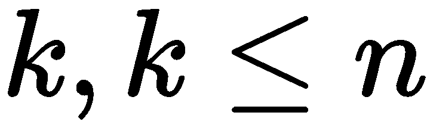，我们需要选择这样一个椭球体的顶部轴，按照沿着轴的离散度降序排列。首先，我们计算原始特征的方差和协方差。这是通过使用协方差矩阵来完成的。根据协方差的定义，对于两个符号和，它们的协方差应该如下:

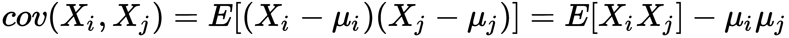

这里，是特征的平均值。

在这种情况下，我们注意到协方差是对称的，向量本身的协方差等于它的离差。因此，协方差矩阵是对称矩阵，其中对应特征的离散位于对角线上，对应特征对的协方差位于对角线之外。在矩阵视图中是观测矩阵，我们的协方差矩阵如下:

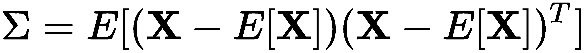

协方差矩阵是多维随机变量情况下方差的推广，它也描述了随机变量的形状(分布)，方差也是如此。像线性算子这样的矩阵有特征值和特征向量。它们之所以有趣，是因为当我们作用于相应的线性空间或用我们的矩阵对其进行变换时，特征向量保持不变，它们只与相应的特征值相乘。这意味着它们定义了一个保持不变的子空间，或者当我们对其应用线性算子矩阵时*进入自身*。形式上，一个特征向量，<sub></sub>与一个矩阵的特征值被简单地定义为 <sub>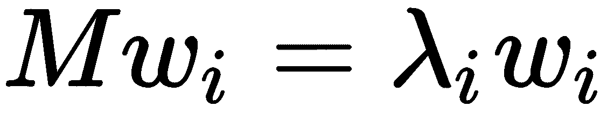</sub> 。

我们样本的协方差矩阵， <sub>，</sub>可以表示为一个乘积， <sub>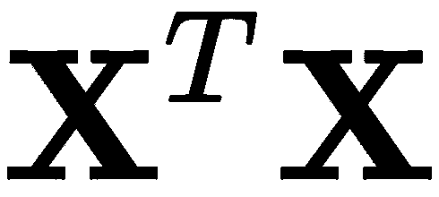</sub> 。根据瑞利关系，我们的数据集的最大变化可以沿着该矩阵的特征向量实现，该特征向量对应于最大特征值。对于更多维度上的投影也是如此–投影到 *m* 维空间上的方差(协方差矩阵)在具有最大特征值的 <sub></sub> 特征向量的方向上最大。因此，我们想要投影数据的主成分仅仅是这个矩阵的特征值的相应顶部 *k* 片段的特征向量。

最大的向量有一个类似于回归线的方向，通过将我们的样本投影到它上面，我们会丢失信息，类似于回归的剩余成员的总和。有必要进行操作， <sub xmlns:epub="http://www.idpf.org/2007/ops"></sub> (向量长度(量级)应等于 1)，执行投影。如果我们没有一个单独的向量，而是有一个超平面，那么我们取基向量的矩阵，而不是向量，<sub xmlns:epub="http://www.idpf.org/2007/ops"></sub>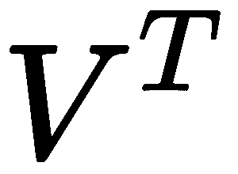。得到的向量(或矩阵)是我们观察到的一系列投影；也就是说，我们需要将我们的数据矩阵乘以基向量矩阵，我们得到数据的正交投影。现在，如果我们将数据矩阵的转置和主成分向量的矩阵相乘，我们将在空间中恢复原始样本，在空间中我们将它投影到主成分的基础上。如果组件的数量小于原始空间的维度，我们会丢失一些信息。

# 奇异值分解

**奇异值分解**是一种重要的数据分析方法。从机器学习的角度来看，由此产生的矩阵分解具有有意义的解释。也可以用来计算主成分分析。SVD 相当慢。因此，当矩阵太大时，使用随机化算法。然而，奇异值分解计算在计算上比原始主成分分析方法中协方差矩阵及其特征值的计算更有效。因此，主成分分析通常是以奇异值分解的形式实现的。让我们来看看。

奇异值分解的本质是纯粹的——任何矩阵(实数或复数)都表示为三个矩阵的乘积:

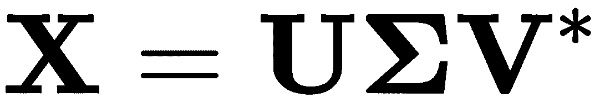

这里，是一个序为的酉矩阵，是一个主对角线上的大小为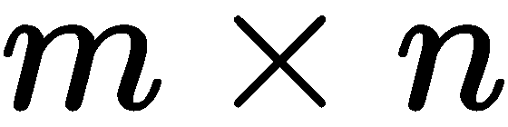的矩阵，这里有称为奇异值的非负数(主对角线之外的元素为零——这种矩阵有时称为矩形对角矩阵)。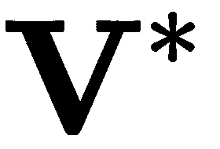是一个埃尔米特共轭的阶矩阵。矩阵的列和矩阵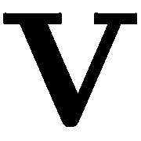的列分别称为矩阵的左右奇异向量。为了减少维数，矩阵很重要，当矩阵的元素上升到二次幂时，可以解释为每个分量放入联合分布的方差，它们按降序排列:。因此，当我们选择奇异值分解中的分量数时(如主成分分析)，我们应该考虑它们的方差之和。

奇异值分解和主成分分析之间的关系可以用以下方式描述:是给出的协方差矩阵。它是一个对称矩阵，所以可以对角化:，其中是特征向量的矩阵(每列是一个特征向量)是特征值的对角矩阵，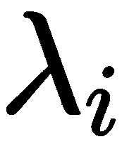，在对角线上按降序排列。特征向量被称为数据的主轴或主方向。数据在主轴上的投影称为**主成分**，也称为**主成分得分**。它们是新转换的变量。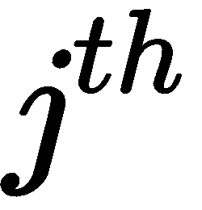主成分由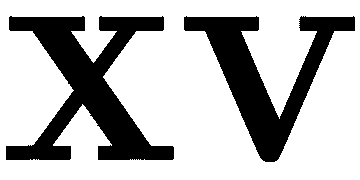的列给出。新主成分空间中数据点的坐标由的行给出。

通过对<sub>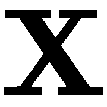</sub>进行奇异值分解，我们得到<sub></sub>，其中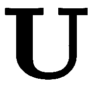是酉矩阵，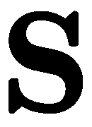是奇异值的对角矩阵，。我们可以观察到<sub></sub>，这意味着右奇异向量是主方向，奇异值通过 <sub></sub> 与协方差矩阵的特征值相关。主要成分由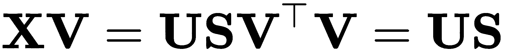给出。

# 独立成分分析

提出了**独立分量分析** ( **ICA** )方法作为解决**盲信号分离** ( **BSS** )问题的方法；即从混合数据中选择独立信号。我们来看一个 BSS 任务的例子。假设我们有两个人在同一个房间里说话，产生声波。我们在房间的不同地方有两个麦克风，记录声音。分析系统从两个麦克风接收两个信号，每个信号都是两个声波的数字化混合——一个来自说话的人，另一个来自其他噪音(例如，播放音乐)。我们的目标是从进入的混合物中选择我们的初始信号。数学上，这个问题可以描述如下。我们以线性组合的形式表示输入混合物，其中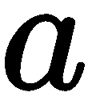表示位移系数，表示独立分量的矢量值:

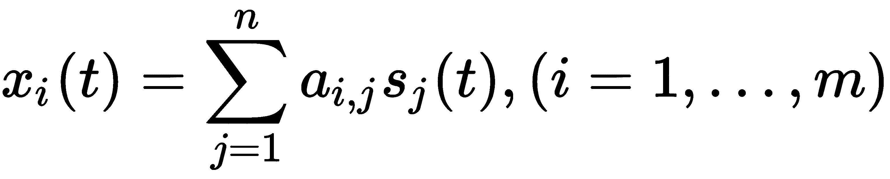

在矩阵形式中，这可以表示如下:


在这里，我们必须找到以下内容:

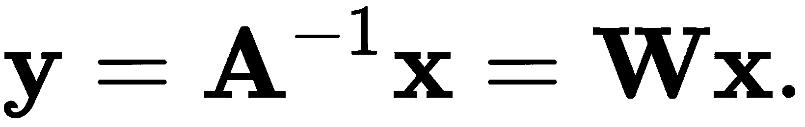

在这个方程中，是输入信号值的矩阵，是位移系数或混合矩阵，是独立分量的矩阵。因此，问题分为两部分。第一部分是得到原始独立成分的变量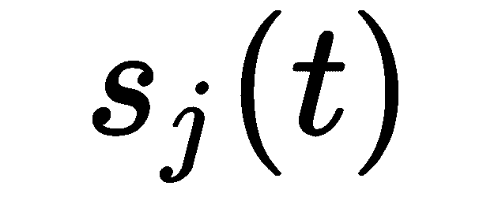的估计值。第二部分是找矩阵，。这种方法的工作原理基于两个原则:

*   独立分量必须是统计独立的(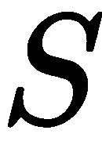矩阵值)。粗略地说，一个独立分量的一个向量的值不影响另一个分量的值。
*   独立分量必须具有非高斯分布。

独立分量分析的理论基础是中心极限定理，该定理指出个独立随机变量之和(平均值或线性组合)的分布对于接近高斯。特别地，如果是相互独立的随机变量，取自平均值为，方差为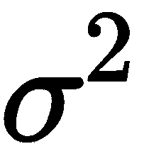的任意分布，那么如果我们将这些变量的平均值表示为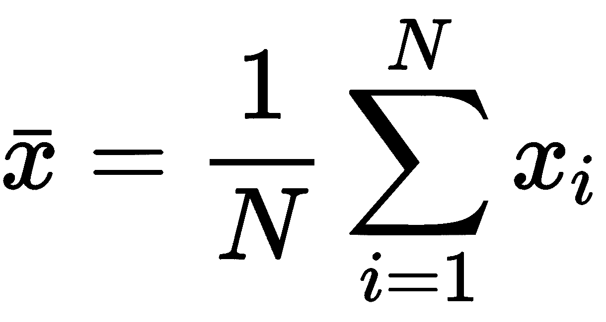，我们可以说接近均值为 0，方差为 1 的高斯分布。解决 BSS 问题，需要找到矩阵，，这样。在此，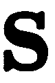应尽可能接近原始独立来源。我们可以把这种方法看作中心极限定理的逆过程。所有独立分量分析方法都基于相同的基本方法——找到一个最大化非高斯性的矩阵 **W** ，从而最小化 <sub></sub> 的独立性。

快速独立分量分析算法旨在最大化功能 <sub></sub> ，其中是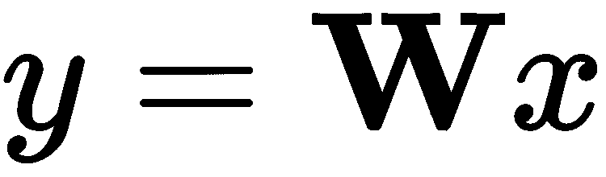的组成部分。因此，我们可以将函数的方程改写为以下形式:


在这里， <sub xmlns:epub="http://www.idpf.org/2007/ops"></sub> 矢是*I*T5】th 行的矩阵， **W** 。

独立分量分析算法执行以下步骤:

1.  选择*的初始值**w .**T3】*
2.  计算，其中是函数的导数， *** G(z) *** 。
3.  正常化。
4.  重复前两步，直到 ***w*** 停止变化。

为了测量非高斯性，快速独立分量分析依赖于非二次非线性函数***【G(z)***，它可以采取以下形式:


# 线性判别分析

**线性判别分析(LDA)** 是一种多元分析，它允许我们同时估计两组或多组对象之间的差异。判别分析的基础是假设每个 *k* <sup>th</sup> 类的对象描述是多维随机变量的实例，该多维随机变量根据正态(高斯)定律分布，具有平均值、 <sub>、</sub>和以下协方差矩阵:


索引表示特征空间的维度。考虑两类情况下线性判别分析算法的简化几何解释。让判别变量成为维欧氏空间的轴。每个对象(样本)都是这个空间的一个点，坐标代表每个变量的固定值。如果两个类在可观察变量(特征)上彼此不同，它们可以被表示为所考虑的空间的不同区域中可能部分重叠的点的集群。为了确定每个类的位置，我们可以计算它的质心，它是一个虚点，其坐标是类中变量(特征)的平均值。判别分析的任务是创建一个额外的轴，该轴通过点云，使得其上的投影提供了两个类别的最佳可分性(换句话说，它最大化了类别之间的距离)。它的位置由线性判别函数(线性判别，LD)和权重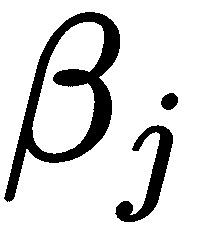给出，确定每个初始变量的贡献:


如果我们假设类 1 和类 2 的对象的协方差矩阵相等，即，那么线性判别式的系数向量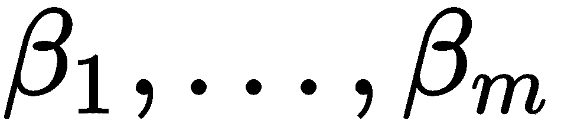可以使用公式来计算，其中是协方差矩阵的逆，是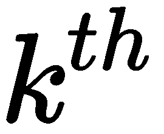类的平均值。得到的轴与穿过两组类对象质心的直线方程一致。广义马氏距离等于它们在多维特征空间中的距离，估计为。因此，除了关于类数据的正态(高斯)分布的假设(这在实践中很少发生)之外，LDA 对于组内离差和相关矩阵的统计相等性有更强的假设。如果它们之间没有显著差异，则它们被合并成一个计算的协方差矩阵，如下所示:

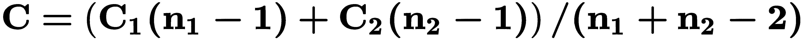

这个原则可以推广到更多的类别。最终的算法可能如下所示:


类间散射矩阵是这样计算的:


这里， <sub>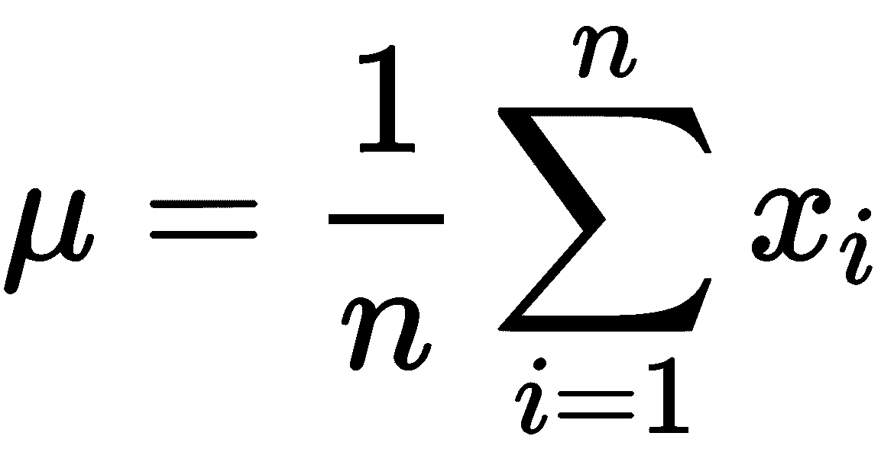是</sub>所有物体(样本)的均值，是类的个数，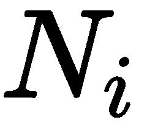是 *i* <sup>th</sup> 类中的物体个数，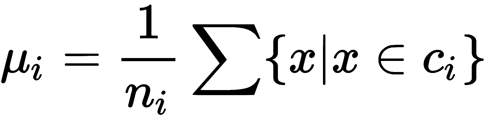是类内均值， <sub>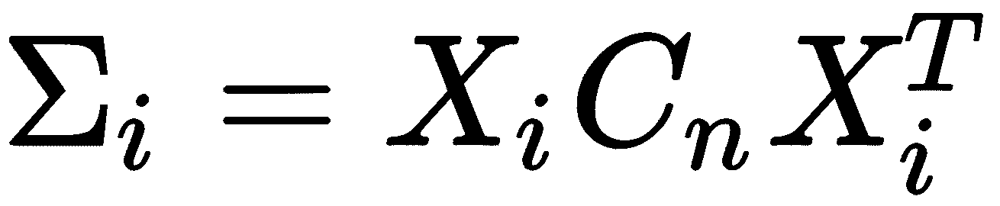</sub> 是 *i* <sup>th</sup> 类的散射矩阵，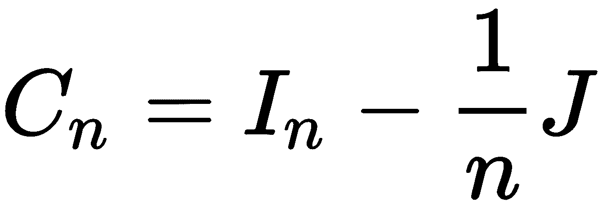是对中矩阵，其中是 *n* x

基于这些矩阵，计算矩阵，为其确定特征值和相应的特征向量。在矩阵的对角元素中，我们必须选择最大特征值的 *** s *** 并变换矩阵，只留下相应的 *** s *** 行。生成的矩阵可用于将所有对象转换到低维空间。

这种方法需要有标签的数据，意味着它是一种有监督的方法。

# 要素分析

因子分析用于减少用于描述数据的变量数量，并确定它们之间的关系。在分析过程中，相互关联的变量被组合成一个因素。结果，组件之间的分散被重新分配，因素的结构变得更容易理解。在组合变量之后，每个因素中的成分的相关性变得高于它们与来自其他因素的成分的相关性。假设已知变量依赖于较少数量的未知变量，并且我们有一个随机误差，可以表示如下:


这里，是负载，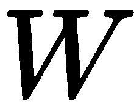是因子。

**因子负荷**的概念是必不可少的。当我们希望从一个新的基础上形成一个特定的向量时，它被用来描述因子(变量)的作用。因子分析的本质是旋转因子的过程，即按照特定的方法重新分配离差。旋转的目的是定义因子载荷的简单结构。旋转可以是正交的也可以是倾斜的。在第一种形式的旋转中，每个连续的因子被确定为最大化先前因子留下的可变性。因此，这些因素是相互独立和不相关的。第二种是各种因素相互关联的转化。这两种形式都有大约 13 种旋转方法。对新基础要素有类似影响的因素被合并成一组。然后，从每组中，建议留下一名代表。一些算法，而不是选择一个代表，计算一个新的因素与一些启发，成为该小组的中心。

降维发生在转换到代表组的因素系统时，其他因素被丢弃。有几种常用的标准来确定因素的数量。这些标准中的一些可以一起使用来相互补充。用于确定因子数量的标准的一个例子是凯泽标准或特征值标准:仅选择特征值等于或大于*一*的因子。这意味着，如果一个因子没有选择与一个变量的至少一个方差相等的方差，那么它就被省略了。一般因素分析算法遵循以下步骤:

1.  计算相关矩阵。
2.  选择要包含的因素数量，例如，使用凯泽标准。
3.  提取初始因子集。有几种不同的提取方法，包括最大似然、主成分分析和主轴提取。
4.  将因子旋转到最终解，该解等于初始提取中获得的解，但具有最直接的解释。

# 多维标度

**当除了相关矩阵之外，任意类型的对象相似性矩阵可以用作输入数据时，多维缩放(MDS)** 可以被认为是因子分析的替代。与其说 MDS 是一个正式的数学过程，不如说是一种有效放置对象的方法，从而在新的特征空间中保持对象之间的适当距离。MDS 新空间的尺寸总是大大小于原来的空间。MDS 用于分析的数据通常是从对象的成对比较矩阵中获得的。主要的 MDS 算法的目标是恢复所分析的特征空间的未知维度，，并为每个对象分配坐标，使得所计算的对象之间的成对欧几里德距离尽可能与指定的成对比较矩阵一致。我们说的是用正交变换的精度恢复新的约简特征空间的坐标，确保对象之间的成对距离不变。

因此，多维缩放方法的目的也可以公式化，以便显示由成对比较矩阵给出的原始多维数据的配置信息。这是作为较低维度的相应空间中的点的配置来提供的。

经典 MDS 假设未知坐标矩阵可以用特征值分解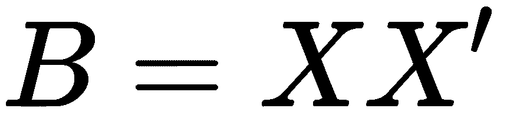来表示。可以通过使用双中心从邻近矩阵(样本间距离的矩阵)中计算出来。通用 MDS 算法遵循以下步骤:

1.  计算邻近矩阵的平方，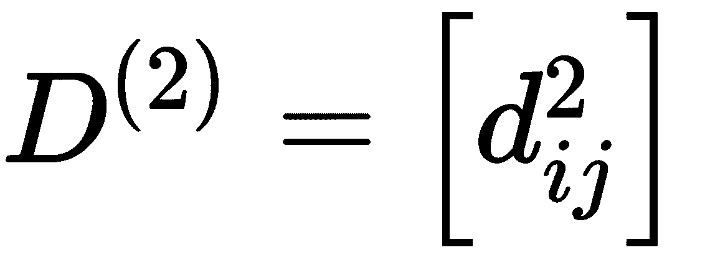 <sub>。</sub>
2.  应用双居中， <sub>，</sub>使用居中矩阵， <sub>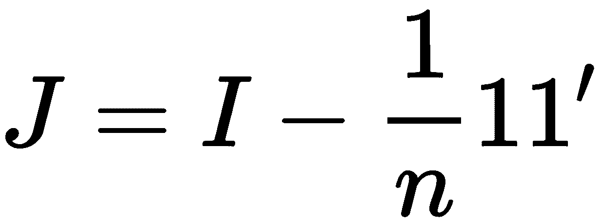</sub> ，其中是对象的数量。
3.  确定的最大特征值和相应的特征向量(其中是输出所需的维数)。
4.  计算，其中是特征向量的矩阵，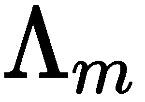是的特征值的对角矩阵。

多维缩放方法的缺点是它没有考虑附近点的分布，因为它在计算中使用了欧几里德距离。如果你曾经发现多维数据躺在一个弯曲的流形上，数据点之间的距离可能比欧几里得要大得多。

既然我们已经讨论了可以用于降维的线性方法，那么让我们看看存在哪些非线性方法。

# 探索非线性降维方法

在本节中，我们将讨论广泛使用的用于降维的非线性方法和算法。

# 核主成分分析

经典的主成分分析是一种线性投影方法，如果数据是线性可分的，这种方法效果很好。然而，在线性不可分离数据的情况下，需要非线性方法。处理线性不可分数据的基本思想是将它投影到具有更多维度的空间中，在那里它变成线性可分的。我们可以选择一个非线性映射函数，这样样本映射 *x* ，就可以写成。这就是所谓的**内核函数**。术语**内核**描述了计算映射(在高阶空间中)样本 *x* 与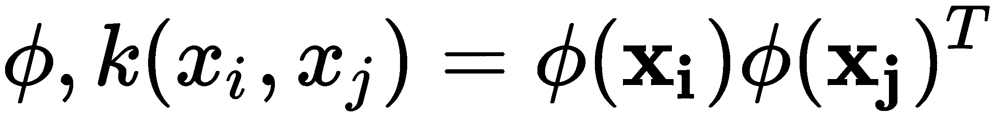的标量积的函数。这个标量积可以解释为在新空间中测量的距离。换句话说，功能通过创建原始对象的非线性组合，将原始的 *d* 维元素映射到更高维的 *k* 维特征空间中。例如，在三维空间中显示 2D 样本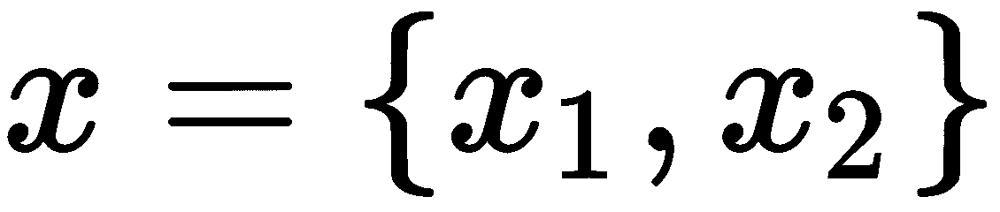的功能可能看起来像。

在线性主成分分析方法中，我们对最大化数据集方差的主成分感兴趣。我们可以通过基于我们数据的协方差矩阵计算对应于最大特征值的特征向量(主成分)来最大化方差，并将我们的数据投影到这些特征向量上。这种方法可以推广到使用核函数映射到更高维空间的数据。但实际上，多维空间中的协方差矩阵并没有明确计算，因为我们可以使用一种称为**核技巧**的方法。内核技巧允许我们将数据投影到主成分上，而无需显式计算投影，这要高效得多。一般方法如下:

1.  计算*核矩阵*等于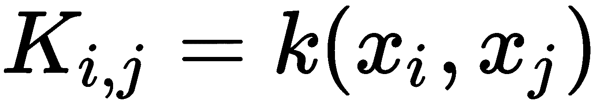。
2.  使其具有零平均值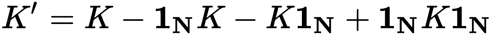，其中是 N×N 大小的矩阵，具有 1/N 个元素。
3.  计算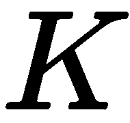的特征值和特征向量。
4.  根据特征值，按降序排列特征向量。
5.  取最大特征值对应的特征向量，其中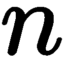为新特征空间的维数。

这些特征向量是我们的数据在相应的主要组成部分上的投影。这个过程的主要困难是选择正确的内核并配置其超参数。两个常用的核是多项式核和高斯核 <sub>【T2 核</sub>。

# IsoMap

IsoMap 算法基于流形投影技术。在数学中，流形是一个拓扑空间(一般来说，它是一组与其邻居的点)，在每个点附近局部类似于欧几里德空间。例如，一维流形包括直线和圆，但不包括具有自相交的图形。二维流形称为**面**；例如，它们可以是球体、平面或圆环体，但这些曲面不能有自相交。例如，圆是嵌入二维空间的一维流形。这里，圆的每个弧局部类似于一条直线段。如果一条三维曲线可以被分割成直线段，这些直线段可以嵌入到三维空间中，而没有自相交，那么它也可以是一个流形。如果三维形状的表面可以分成没有自相交的平面面片，则该形状可以是流形。

应用流形投影技术的基础是搜索接近数据的流形，将数据投影到流形上，然后展开它。用来寻找流形的最流行的技术是基于数据点的信息建立一个图。通常，这些数据点被放置在图节点中，边模拟数据点之间的关系。

IsoMap 算法取决于两个参数:

*   用于搜索大地测量距离的邻居数量
*   最终空间的维度，

简而言之，IsoMap 算法遵循以下步骤:

1.  首先，它构建了一个表示测地线距离的图。对于每个点，我们搜索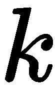最近的邻居，并从到这些最近的邻居的距离构建一个加权的无向图。边缘权重是到邻居的欧几里得距离。

2.  使用一种算法来寻找图中的最短距离，例如，Dijkstra 的算法，我们需要找到每对顶点之间的最短距离。我们可以把这个距离看作流形上的测地线距离。
3.  基于上一步获得的成对测地距离矩阵，训练 MDS 算法。
4.  MDS 算法将维空间中的一组点与初始的一组距离相关联。

# Sammon 映射

**Sammon 映射**是最早的非线性降维算法之一。与传统的降维方法(如 PCA)相比，Sammon 映射不直接定义数据转换函数。相反，它只决定了转换结果(较小维度的特定数据集)与原始数据集结构的对应程度。换句话说，它并不试图寻找原始数据的最优变换；相反，它会搜索另一个更低维度的数据集，其结构尽可能接近原始数据集。该算法可以描述如下。假设我们有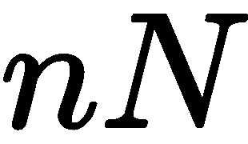-维向量，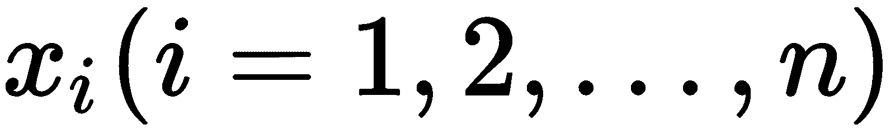。这里，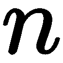向量在维空间中定义，用表示。维空间中的向量之间的距离将由表示，而在维空间中，表示。为了确定向量之间的距离，我们可以使用任何度量；尤其是欧几里得距离。非线性 Sammon 映射的目标是搜索向量的选择，，以便最小化误差函数，，其由以下公式定义:


为了使误差函数最小化，，Sammon 使用了牛顿最小化方法，可以简化如下:


这里， ***η*** 就是学习率。

# 分布式随机邻居嵌入

**随机邻居嵌入** ( **SNE** )问题的公式如下:我们有一个数据集，其中的点由多维变量描述，多维变量的空间维度大大高于 3。有必要获得一个存在于二维或三维空间中的新变量，该变量将最大限度地保留原始数据中的结构和模式。t-SNE 和经典 SNE 的区别在于，修改简化了寻找全局最小值的过程。主要的修改是用低维数据的学生 t 分布代替正态分布。SNE 首先将点与点之间的多维欧几里得距离转换成反映点之间相似性的条件概率。数学上看起来是这样的:


该公式显示了点与点的接近程度，高斯分布在周围，给定偏差为。每个点都不一样。选择它是为了使密度较高的区域中的点比其他区域中的点具有更小的方差。

让我们将(、)对的二维或三维映射表示为(、)对。有必要使用相同的公式来估计条件概率。标准偏差为 <sub></sub> :


如果映射点和正确模拟了更高维的原始点和之间的相似性，那么对应的条件概率和将是等价的。作为对如何反映的质量的一个明显的评估，使用了散度或库尔巴克-莱布勒距离。SNE 使用梯度下降最小化所有映射点的这些距离的总和。以下公式确定了此方法的损失函数:


它具有以下梯度:


这个问题的作者为优化过程提出了以下物理类比。让我们假设弹簧连接了所有的映射点。弹簧连接点和的刚度取决于多维空间中的两点和映射空间中的两点的相似性之间的差异。在这个类比中，梯度是作用在映射空间中一个点上的合力。如果我们放开这个系统，一段时间后，它会产生平衡，这就是期望的分布。在算法上，它会在考虑以下时刻的同时寻找平衡:


这里，是学习率，是惯性系数。经典 SNE 也允许我们得到好的结果，但是在优化损失函数和拥挤问题时会有困难。总的来说，t-SNE 没有解决这些问题，但它让这些问题变得更容易管理。

t-SNE 中的损失函数与经典 SNE 的损失函数有两个主要区别。第一个是它在多维空间中具有对称形式的相似性和更简单的梯度版本。其次，使用 t-分布(Student)代替对来自映射空间的点使用高斯分布。

# 自动编码器

自动编码器代表一类特殊的神经网络，其配置使得自动编码器的输出尽可能接近输入信号。在最直观的表示中，自动编码器可以建模为多层感知器，其中输出层的神经元数量等于输入的数量。下图显示，通过选择较小维度的中间隐藏层，我们将源数据压缩到较低维度。通常，来自该中间层的值是自动编码器的结果:


现在，我们已经了解了可用于降维的线性和非线性方法，并详细探索了每种方法的组成部分，我们可以借助一些实际示例来增强降维的实现。

# 用各种с++ 库理解降维算法

让我们看看如何在实践中使用降维算法。所有这些示例都使用同一个数据集，该数据集包含四个正态分布的 2D 点集，这些点集已通过瑞士滚动映射转换为三维空间。下图显示了此映射的结果。您可以在[http://people . cs . uchicago . edu/~ dinoj/manifold/Swiss roll . html](http://people.cs.uchicago.edu/~dinoj/manifold/swissroll.html)找到原始数据集和映射详情:


此数据集已标记。每个正态分布的部分都有自己的标签，我们可以在结果上看到这些标签是某种颜色。我们使用这些颜色来显示我们将在以下示例中使用的每个算法的转换结果。这让我们了解了算法是如何工作的。以下部分提供了如何使用`Dlib`、`Shogun`和`Shark-ML`库的具体示例。

# 使用 Dlib 库

`Dlib`库中有三种降维方法——两种是线性的，称为 PCA 和 LDA，一种是非线性的，称为 Sammon 映射。

# 污染控制局(Pollution Control Agency)

主成分分析是最流行的降维算法之一，它在`Dlib`库中有几个实现。有`Dlib::vector_normalizer_pca`类型，可以使用对象对用户数据进行主成分分析。该实现还将数据规范化。在某些情况下，这种自动归一化是有用的，因为我们总是必须对归一化数据执行 PCA。这种类型的对象应该用输入数据样本类型参数化。在我们实例化了这种类型的对象之后，我们使用`train()`方法来使模型适合我们的数据。`train()`法以`std::vector`为样本，`eps`值为参数。`eps`值控制主成分分析转换后应保留多少尺寸。这可以在下面的代码中看到:

```cpp
 void PCAReduction(const std::vector<Matrix> &data, double target_dim) {
   Dlib::vector_normalizer_pca<Matrix> pca;
   pca.train(data, target_dim / data[0].nr());

   std::vector<Matrix> new_data;
   new_data.reserve(data.size());
   for (size_t i = 0; i < data.size(); ++ i) {
     new_data.emplace_back(pca(data[i]));
   }

   for (size_t r = 0; r < new_data.size(); ++ r) {
     Matrix vec = new_data[r];
     double x = vec(0, 0);
     double y = vec(1, 0);
   }
 } 
```

算法经过训练后，我们使用对象来变换单个样本。看看代码中的第一个循环，注意`pca([data[i]])`调用是如何执行这个转换的。

下图显示了主成分分析转换的结果:


# 基于主成分分析的数据压缩

我们可以将降维算法用于稍微不同的任务——信息丢失的数据压缩。当将主成分分析算法应用于图像时，这很容易证明。让我们通过使用奇异值分解的`Dlib`库从头开始实现 PCA。我们不能使用现有的实现，因为它以我们无法完全控制的方式执行规范化。

首先，我们需要加载一个图像，并将其转换为矩阵形式:

```cpp
 void PCACompression(const std::string& image_file, long target_dim) {
     array2d<Dlib::rgb_pixel> img;
     load_image(img, image_file);

     array2d<unsigned char> img_gray;
     assign_image(img_gray, img);
     save_png(img_gray, "original.png");

     array2d<DataType> tmp;
     assign_image(tmp, img_gray);
     Matrix img_mat = Dlib::mat(tmp);
     img_mat /= 255.;  // scale

     std::cout << "Original data size " << img_mat.size() << std::endl;
```

加载完 RGB 图像后，我们将其转换为灰度，并将其值转换为浮点。下一步是将图像矩阵转换成我们可以用于 PCA 训练的样本。这可以通过使用`Dlib::subm()`功能将图像分割成大小为 8×8 的矩形面片，然后使用`Dlib::reshape_to_column_vector()`功能将其展平来实现:

```cpp
 std::vector<Matrix> data;
 int patch_size = 8;

 for (long r = 0; r < img_mat.nr(); r += patch_size) {
     for (long c = 0; c < img_mat.nc(); c += patch_size) {
         auto sm = Dlib::subm(img_mat, r, c, patch_size, patch_size);
         data.emplace_back(Dlib::reshape_to_column_vector(sm));
     }
 }
```

当我们有样本时，我们可以通过减去平均值并除以它们的标准偏差来归一化它们。我们可以通过将样本向量转换为矩阵类型来将这些操作矢量化。我们通过`Dlib::mat()`功能来实现:

```cpp
 // normalize data
 auto data_mat = mat(data);
 Matrix m = mean(data_mat);
 Matrix sd = reciprocal(sqrt(variance(data_mat)));

 matrix<decltype(data_mat)::type, 0, 1, decltype(data_mat)::mem_manager_type>
 x(data_mat);
 for (long r = 0; r < x.size(); ++ r)
   x(r) = pointwise_multiply(x(r) - m, sd);
```

准备好数据样本后，我们用`Dlib::covariance()`函数计算协方差矩阵，用`Dlib::svd()`函数进行奇异值分解。奇异值分解的结果是特征值矩阵和特征向量矩阵。我们根据特征值对特征向量进行排序，只留下少量(在我们的例子中，10 个)对应于最大特征值的特征向量。我们留下的特征向量的数量是新特征空间中的维数:

```cpp
 Matrix temp, eigen, pca;
 // Compute the svd of the covariance matrix
 Dlib::svd(covariance(x), temp, eigen, pca);
 Matrix eigenvalues = diag(eigen);

 rsort_columns(pca, eigenvalues);

 // leave only required number of principal components
 pca = trans(colm(pca, range(0, target_dim)));
```

我们的 PCA 变换矩阵叫做`pca`。我们用它通过简单的矩阵乘法来减少每个样本的维数。看下面的循环，注意`pca * data[i]`操作:

```cpp
 // dimensionality reduction
 std::vector<Matrix> new_data;
 size_t new_size = 0;
 new_data.reserve(data.size());
 for (size_t i = 0; i < data.size(); ++ i) {
   new_data.emplace_back(pca * data[i]);
   new_size += static_cast<size_t>(new_data.back().size());
 }

 std::cout << "New data size " << new_size + 
     static_cast<size_t>(pca.size())
 << std::endl;
```

我们的数据已经被压缩，我们可以在控制台输出中看到它的新大小。现在，我们可以恢复数据的原始维度，以便能够看到图像。为此，我们需要使用转置的主成分分析矩阵来乘以缩减的样本。此外，我们需要对恢复的样本进行反规格化，以获得实际的像素值。这可以通过将标准偏差相乘并加上我们从前面步骤中得到的平均值来实现:

```cpp
 auto pca_matrix_t = Dlib::trans(pca);
 Matrix isd = Dlib::reciprocal(sd);
 for (size_t i = 0; i < new_data.size(); ++ i) {
   Matrix sample = pca_matrix_t * new_data[i];
   new_data[i] = Dlib::pointwise_multiply(sample, isd) + m;
 }
```

恢复像素值后，我们会对其进行整形，并将其放置在图像中的原始位置:

```cpp
     size_t i = 0;
     for (long r = 0; r < img_mat.nr(); r += patch_size) {
       for (long c = 0; c < img_mat.nc(); c += patch_size) {
         auto sm = Dlib::reshape(new_data[i], patch_size, patch_size);
         Dlib::set_subm(img_mat, r, c, patch_size, patch_size) = sm;
         ++ i;
       }
     }

     img_mat *= 255.0;
     assign_image(img_gray, img_mat);
     equalize_histogram(img_gray);
     save_png(img_gray, "compressed.png");
 }
```

让我们来看看压缩图像处理中广泛使用的标准测试图像的结果。以下是 Lena 512 x 512 的图片:


其原始灰度大小为 262，144 字节。在我们仅使用 10 个主成分执行 PCA 压缩后，其大小变为 45，760 字节。我们可以在下图中看到结果:


在这里，我们可以看到，尽管压缩率很高，但大部分基本的视觉信息都被保留了下来。

# 皱胃向左移

`Dlib`库也有线性判别分析算法的实现，可以用于降维。这是一个有监督的算法，所以它需要有标签的数据。该算法用`Dlib::compute_lda_transform()`函数实现，该函数取四个参数。第一个是输入/输出参数——作为输入，它用于传递输入训练数据(以矩阵形式)，作为输出，它接收 LDA 变换矩阵。第二个参数是平均值的输出。第三个参数是输入数据的标签，而第四个参数是所需的目标维数。下面的代码展示了一个如何使用`Dlib`库进行降维的例子:

```cpp
 void LDAReduction(const Matrix &data, 
                   const std::vector<unsigned long> &labels,
                   unsigned long target_dim) {
   Dlib::matrix<DataType, 0, 1> mean;
   Matrix transform = data;
   Dlib::compute_lda_transform(transform, mean, labels, target_dim);

   for (long r = 0; r < data.nr(); ++ r) {
     Matrix row = transform * Dlib::trans(Dlib::rowm(data, r)) - mean;
     double x = row(0, 0);
     double y = row(1, 0);
   }
 }
```

为了在训练算法后执行实际的线性判别分析变换，我们将样本与线性判别分析矩阵相乘。在我们的例子中，我们也转置了它们。下面的代码显示了这个例子的基本部分:

```cpp
  transform * Dlib::trans(Dlib::rowm(data, r))
```

下图显示了在两个组件上使用 LDA 缩减的结果:


# Sammon 映射

在`Dlib`库中，Sammon 映射是用`Dlib::sammon_projection`类型实现的。我们需要创建一个这种类型的实例，然后将其用作功能对象。函数对象调用参数是我们需要转换的数据和新特征空间的维数。输入数据应采用`Dlib::matrix`类型的单个样本的`std::vector`形式。所有样品的尺寸应该相同。使用这个函数对象的结果是一个新的样本向量，其维数减少了:

```cpp
 void SammonReduction(const std::vector<Matrix> &data, long target_dim) {
   Dlib::sammon_projection sp;
   auto new_data = sp(data, target_dim);

   for (size_t r = 0; r < new_data.size(); ++ r) {
     Matrix vec = new_data[r];
     double x = vec(0, 0);
     double y = vec(1, 0);
   }
 }
```

下图显示了使用这种降维算法的结果:


# 使用幕府图书馆

`Shogun`库包含许多降维算法，包括线性和非线性算法。它使用`Tapkee`库([http://tapkee.lisitsyn.me/](http://tapkee.lisitsyn.me/))进行后端实现。

# 污染控制局(Pollution Control Agency)

在`Shogun`库中，`CPCA`类实现了 PCA 算法。它有一个主要配置选项-目标尺寸的数量，可以使用`set_target_dim()`方法进行修改。完成配置后，我们需要执行`fit()`方法进行训练，然后使用`apply_to_feature_vector()`方法转换单个样本:

```cpp
 void PCAReduction(Some<CDenseFeatures<DataType>> features,
                   const int target_dim) {
   auto pca = some<CPCA>();
   pca->set_target_dim(target_dim);
   pca->fit(features);

   auto feature_matrix = features->get_feature_matrix();
   for (index_t i = 0; i < features->get_num_vectors(); ++ i) {
     auto vector = feature_matrix.get_column(i);
     auto new_vector = pca->apply_to_feature_vector(vector);
   }
 }
```

下图显示了将`Shogun`主成分分析应用于我们的数据的结果:


# 核主成分分析

`Shogun`库中 PCA 的非线性版本在`CKernelPCA`类中实现。它的工作原理就像我们使用线性版本的`CPCA`类一样。主要区别在于它配置了一个额外的方法`set_kernel()`，应该用来将指针传递给特定的内核对象。在下面的例子中，我们正在为一个内核对象初始化`CGaussianKernel`类的实例:

```cpp
 void KernelPCAReduction(Some<CDenseFeatures<DataType>> features,
                         const int target_dim) {
   auto gauss_kernel = some<CGaussianKernel>(features, features, 0.5);
   auto pca = some<CKernelPCA>();
   pca->set_kernel(gauss_kernel.get());
   pca->set_target_dim(target_dim);
   pca->fit(features);

   auto feature_matrix = features->get_feature_matrix();
   for (index_t i = 0; i < features->get_num_vectors(); ++ i) {
     auto vector = feature_matrix.get_column(i);
     auto new_vector = pca->apply_to_feature_vector(vector);
   }
 }
```

下图显示了对我们的数据应用`Shogun`内核主成分分析实现的结果:


我们可以看到，这种类型的内核使数据的某些部分分离，但其他部分被减少了太多。

# master of dental surgery 牙科硕士

在`MultidimensionalScaling`类的`Shogun`库中实现了多维缩放算法。应该使用`set_target_dim()`方法配置此类对象以及所需特征的数量。然后，应该使用`fit()`方法进行训练。与前面的类型不同，这个类提供了`transform()`方法，它将整个数据集转换成新的维数。它返回一个指向`CDenseFeatures`类型对象的指针:

```cpp
 void MDSReduction(Some<CDenseFeatures<DataType>> features,
                   const int target_dim) {
   auto IsoMap = some<CMultidimensionalScaling>();
   IsoMap->set_target_dim(target_dim);
   IsoMap->fit(features);

   auto new_features =
       static_cast<CDenseFeatures<DataType> *>(IsoMap->transform
       (features));

   auto feature_matrix = new_features->get_feature_matrix();
   for (index_t i = 0; i < new_features->get_num_vectors(); ++ i) {
     auto new_vector = feature_matrix.get_column(i);
   }
 }
```

下图显示了将`Shogun` MDS 算法应用于我们的数据的结果:


# IsoMap

在`Shogun`库中，`CIsoMap`类实现了 IsoMap 降维算法。这个类的对象应该配置有目标维数和图构造的邻居数。为此应使用`set_target_dim()`和`set_k()`方法。训练和数据降维分别采用`fit()`和`transform()`方法:

```cpp
void IsoMapReduction(Some<CDenseFeatures<DataType>> features,
                      const int target_dim) {
   auto IsoMap = some<CIsoMap>();
   IsoMap->set_target_dim(target_dim);
   IsoMap->set_k(100);
   IsoMap->fit(features);

   auto new_features =
       static_cast<CDenseFeatures<DataType> *>(IsoMap->transform
       (features));

   auto feature_matrix = new_features->get_feature_matrix();
   for (index_t i = 0; i < new_features->get_num_vectors(); ++ i) {
     auto new_vector = feature_matrix.get_column(i);
   }
 }
```

下图显示了将`Shogun` IsoMap 实现应用于我们的数据的结果:


# 国际通信机构(International Communications Agency)

在`Shogun`库中，ICA 算法在`CFast ICA`类中实现。这个类的对象没有特定的配置。分别使用`fit()`和`transform()`方法进行训练和数据降维。转换数据后，我们可以使用一些组件作为新功能。

我们还可以使用数量减少的特征来制作低维数据:

```cpp
 void ICAReduction(Some<CDenseFeatures<DataType>> features,
                   const int target_dim) {
   auto ica = some<CFast ICA>();
   ica->fit(features);

   auto new_features =
       static_cast<CDenseFeatures<DataType> *>(ica->transform(features));
   auto casted = 
       CDenseFeatures<float64_t>::obtain_from_generic(new_features);

   Clusters clusters;
   auto unmixed_signal = casted->get_feature_matrix();
   for (index_t i = 0; i < new_features->get_num_vectors(); ++ i) {
     auto new_vector = unmixed_signal.get_column(i);
     // choose 1 and 2 as our main components
     new_vector[1];
     new_vector[2];
   }
 }
```

下图显示了对我们的数据应用`Shogun`独立分量分析实现的结果。在这个例子中，我们只使用了两个可视化组件:


# 要素分析

在`Shogun`库中，因子分析算法在`CFactorAnalysis`类中实现。此类的对象应该配置目标维数。`set_target_dim()`方法用于修改目标维度的值，而`fit()`和`transform()`方法分别用于训练和数据降维:

```cpp
 void FAReduction(Some<CDenseFeatures<DataType>> features,
                  const int target_dim) {
   auto fa = some<CFactorAnalysis>();
   fa->set_target_dim(target_dim);
   fa->fit(features);

   auto new_features =
       static_cast<CDenseFeatures<DataType> *>(fa->transform(features));

   auto feature_matrix = new_features->get_feature_matrix();
   for (index_t i = 0; i < new_features->get_num_vectors(); ++ i) {
     auto new_vector = feature_matrix.get_column(i);
   }
 }
```

下图显示了将`Shogun`因子分析应用于我们的数据的结果:


# t 雪

在`Shogun`库中，t-SNE 算法在`CTDistributedStochasticNeighborEmbedding`类中实现。此类对象应配置目标维数和`set_target_dim()`方法。训练和数据降维分别采用`fit()`和`transform()`方法:

```cpp
 void TSNEReduction(Some<CDenseFeatures<DataType>> features,
                    const int target_dim) {
   auto tsne = some<CTDistributedStochasticNeighborEmbedding>();
   tsne->set_target_dim(target_dim);
   tsne->fit(features);

   auto new_features =
       static_cast<CDenseFeatures<DataType> *>(tsne->transform(features));

   auto feature_matrix = new_features->get_feature_matrix();
   for (index_t i = 0; i < new_features->get_num_vectors(); ++ i) {
     auto new_vector = feature_matrix.get_column(i);
   }
 }
```

下图显示了将`Shogun` t-SNE 实现应用于我们的数据的结果:


# 使用鲨鱼毫升库

`Shark-ML`库包含主成分分析和线性判别分析算法的实现，这两种算法都可以用于数据降维。

# 污染控制局(Pollution Control Agency)

`Shark-ML`库中的 PCA 算法在`PCA`类中实现。此类的对象应该配置目标维度的数量。我们可以用`encoder()`的方法。该方法取两个参数:第一个是对`LinearModel`类对象的引用，第二个是目标维度的个数。`LinearModel`类的对象配置完成后，可用于功能对象的数据转换。其被调用的结果是`Data<RealVector>`类的一个新对象:

```cpp
 void PCAReduction(const UnlabeledData<RealVector> &data, 
                   const UnlabeledData<RealVector>& lables,
                   size_t target_dim) {
   PCA pca(data);
   LinearModel<> encoder;
   pca.encoder(encoder, target_dim);
   auto new_data = encoder(data);

   for (size_t i = 0; i < new_data.numberOfElements(); ++ i) {
     auto x = new_data.element(i)[0];
     auto y = new_data.element(i)[1];
   }
 }
```

下图显示了将`Shark-ML`主成分分析应用于我们的数据的结果:


# 皱胃向左移

`Shark-ML`库中的 LDA 算法在`LDA`类中实现。首先，我们必须用`train()`方法训练算法，该方法采用两个参数:第一个参数是对`LinearClassifier`类的对象的引用，而第二个参数是数据集引用。请注意，LDA 算法使用`LinearClassifier`的对象，因为在`Shark-ML`库中，`LDA`主要用于分类。此外，因为这是一个有监督的算法，我们应该为数据提供标签。我们可以通过初始化`LabeledData<RealVector, unsigned int>`类对象来实现。在下面的例子中，我们可以看到如何将`UnlabeledData<RealVector>`数据集与标签数据集相结合。注意标签应从`0`开始。

`LinearClassifier`类的对象经过训练后，我们可以将其作为功能对象进行数据分类。它的调用结果是一个新的标记数据集。对于降维，我们必须使用决策函数进行数据转换。可以使用`LinearClassifier`类的`decisionFunction()`方法检索该功能。决策函数对象可用于将输入数据转换为可以通过线性判别分析获得的新投影。在我们有了新的标签和投影数据之后，我们可以使用它们来获得降维数据。在下面的例子中，我们只使用了一个标签，它对应于投影的一个维度，这样我们就可以可视化结果。这意味着我们正在对唯一的特征(组件)执行降维:

```cpp
 void LDAReduction(const UnlabeledData<RealVector> &data,
                   const UnlabeledData<RealVector> &labels, 
                   size_t target_dim) {
   LinearClassifier<> encoder;
   LDA lda;

   LabeledData<RealVector, unsigned int> dataset(
       labels.numberOfElements(), InputLabelPair<RealVector, unsigned int>(
                                   RealVector(data.element(0).size()), 0));

   for (size_t i = 0; i < labels.numberOfElements(); ++ i) {
     // labels should start from 0
     dataset.element(i).label =
         static_cast<unsigned int>(labels.element(i)[0]) - 1;
     dataset.element(i).input = data.element(i);
   }
   lda.train(encoder, dataset);

   // project data
   auto new_labels = encoder(data);
   auto dc = encoder.decisionFunction();
   auto new_data = dc(data);

   for (size_t i = 0; i < new_data.numberOfElements(); ++ i) {
     auto l = new_labels.element(i);
     auto x = new_data.element(i)[l];
     auto y = new_data.element(i)[l];
   }
 }
```

下图显示了将`Shark-ML` LDA 降维应用于我们唯一特征的数据的结果:


# 摘要

在本章中，我们了解到降维是将具有较高维度的数据转换为具有较低维度的数据的新表示的过程。它用于减少数据集中相关特征的数量，并提取信息量最大的特征。这种转换有助于提高其他算法的性能，降低计算复杂性，并使人类可读的可视化。

我们了解到有两种不同的方法来解决这个任务。一个是特征选择，不产生新的特征，第二个是降维算法，产生新的特征集。我们还了解到降维算法是线性和非线性的，我们应该根据我们的数据选择其中的一种。我们看到有许多不同的算法，它们具有不同的特性和计算复杂性，尝试不同的算法来看看哪种算法是特定任务的最佳解决方案是有意义的。请注意，不同的库对于相同的算法有不同的实现，因此即使对于相同的数据，它们的结果也可能不同。

降维算法领域是一个不断发展的领域。例如，有一种基于黎曼几何和代数拓扑的新算法叫做**均匀流形逼近和投影(UMAP)** 。它在可视化质量方面与 t-SNE 算法竞争，但在转换完成后也保留了更多原始数据的全局结构。它的计算效率也高得多，这使得它适合大规模数据集。然而，目前还没有它的 C++ 实现。

在下一章中，我们将讨论分类任务以及如何解决它们。通常，当我们必须解决一个分类任务时，我们必须将一组对象分成几个子组。这些子组中的对象共享一些与其他子组中的属性不同的公共属性。

# 进一步阅读

*   降维技术综述:[https://arxiv.org/pdf/1403.2877.pdf](https://arxiv.org/pdf/1403.2877.pdf)
*   降维的简短教程:[https://www . math . uwatelloo . ca/~ aghodsib/courses/f 06 stat 890/readings/tutorial _ stat 890 . pdf](https://www.math.uwaterloo.ca/~aghodsib/courses/f06stat890/readings/tutorial_stat890.pdf)
*   12 种降维技术指南(带 Python 代码):[https://www . analyticsvidhya . com/blog/2018/08/降维技术-python/](https://www.analyticsvidhya.com/blog/2018/08/dimensionality-reduction-techniques-python/)
*   协方差矩阵及其与线性变换关系的几何直观解释，理解和使用 PCA 和 SVD 的基本构件:[https://datascienceplus . com/了解协方差矩阵](https://datascienceplus.com/understanding-the-covariance-matrix)
*   核心技巧:[https://dscm.quora.com/The-Kernel-Trick](https://dscm.quora.com/The-Kernel-Trick)