# 七、分类

在机器学习中，分类的任务是根据对一组观察(对象)的形式描述的分析，将它们分成称为*类*的组。对于分类，每个观察(对象)基于某个定性属性被映射到某个组或名义类别。分类是一项有监督的任务，因为它需要已知类别的训练样本。训练集的标记通常是手动完成的，有特定研究领域的专家参与。同样值得注意的是，如果最初没有定义类，那么集群就会有问题。此外，在分类任务中，可能有两个以上的类(多类)，并且每个对象可能属于一个以上的类(相交)。

在本章中，我们将讨论用机器学习解决分类任务的各种方法。我们将看一些最著名和最广泛的算法，它们是逻辑回归、**支持向量机**(**【SVM】**)和 **k 近邻** ( **kNNs** )。逻辑回归是基于线性回归和特殊损失函数的最直接的算法之一。SVM 是基于支持向量的概念，帮助建立一个决策边界来分离数据。这种方法可以有效地用于高维数据。kNN 有一个简单的实现算法，使用了数据紧凑的思想。此外，我们将展示如何用前面提到的算法解决多类分类问题。我们将实现程序示例，看看如何使用这些算法来解决不同 C++ 库的分类任务。

本章涵盖以下主题:

*   分类方法概述
*   探索各种分类方法
*   使用 C++ 库处理分类任务的示例

# 技术要求

本章所需的技术和安装包括以下内容:

*   `Shogun toolbox`图书馆
*   `Shark-ML`图书馆
*   `Dlib`图书馆
*   `plotcpp`图书馆
*   支持 C++ 17 的现代 C++ 编译器
*   CMake 构建系统版本> = 3.8

The code files for this chapter can be found at the following GitHub repo: [https://github.com/PacktPublishing/Hands-On-Machine-Learning-with-CPP/tree/master/Chapter07](https://github.com/PacktPublishing/Hands-On-Machine-Learning-with-CPP/tree/master/Chapter07)

# 分类方法概述

分类任务是应用统计学和机器学习的基本任务之一，也是**人工智能** ( **AI** )的整体。这是因为分类是最容易理解和解释的数据分析技术之一，分类规则可以用自然语言来制定。在机器学习中，使用监督算法解决分类任务，因为类是预先定义的，并且训练集中的对象具有类标签。解决分类任务的分析模型称为**分类器**。

分类是根据对象的形式化特征将对象移动到预定类别的过程。这个问题中的每个对象通常表示为 *N* 维空间中的一个向量。该空间中的每个维度都是对象特征之一的描述。

我们可以用数学符号来表述分类任务。让 *X* 表示对象描述的集合， *Y* 是有限的名称或类标签的集合。有一个未知的目标函数，即映射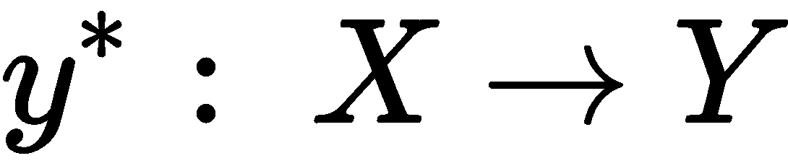，其值仅在最终训练样本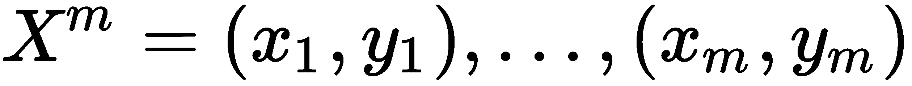的对象上是已知的。因此，我们必须构建一个算法，能够对一个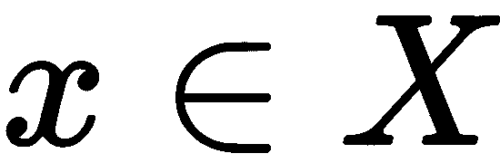任意对象进行分类。在数理统计中，分类问题也被称为判别分析问题。

分类任务适用于许多领域，包括:

*   **交易**:客户和产品的分类可以让企业优化营销策略，刺激销售，降低成本。
*   **电信**:用户分类允许企业评估客户忠诚度，并因此制定忠诚度计划。
*   **医药保健**:通过将人群划分为风险人群，辅助疾病诊断。
*   **银行**:客户分类用于信用评分程序。

分类可以通过以下方法解决:

*   逻辑回归
*   kNN 方法
*   SVM
*   判别分析
*   决策树
*   神经网络

我们已经在[第 6 章](06.html)、*降维*中研究了判别分析作为降维的算法，但是大多数库也提供了一个**应用编程接口** ( **API** )来使用判别分析算法作为分类器。我们将在[第 9 章](09.html)、*集成学习*中讨论决策树，重点是算法集成。我们还将在接下来的章节中讨论神经网络:[第 10 章](10.html)、*图像分类神经网络*。

现在我们已经讨论了什么是分类任务，让我们看看各种分类方法。

# 探索各种分类方法

在本章中，我们将讨论一些分类方法，例如逻辑回归、**核岭回归**(**【KRR】**)、kNN 方法和 SVM 方法。

# 逻辑回归

逻辑回归通过使用逻辑函数确定分类因变量和一个或多个自变量之间的依赖程度。它旨在找到输入变量的系数值，就像线性回归一样。在逻辑回归的情况下，不同之处在于输出值通过使用非线性(逻辑)函数进行转换。逻辑函数本质上看起来像一个大字母 *S* ，并将任何值转换为 0 到 1 范围内的数字。这个属性很有用，因为我们可以将规则应用于逻辑函数的输出，将 0 和 1 绑定到类预测。下面的截图显示了一个逻辑函数图:


例如，如果函数的结果小于 0.5，则输出为 0。预测也不仅仅是一个简单的答案( **+1** 或者 **-1** )，我们可以解读为归类为 **+1** 的概率。

在许多任务中，这种解释是必不可少的业务需求。例如，在传统上使用逻辑回归的信用评分任务中，贷款违约的概率是一个常见的预测。与线性回归的情况一样，如果剔除异常值和相关变量，逻辑回归可以更好地完成任务。逻辑回归模型可以快速训练，非常适合二元分类问题。

线性分类器的基本思想是特征空间可以被超平面分成两个半空间，在每个半空间中预测目标类的两个值之一。如果我们能无误差地划分一个特征空间，那么训练集就叫做**线性可分**。逻辑回归是一种独特的线性分类器，但它能够预测的概率，将的例子归因于类 **+** ，如下所示:

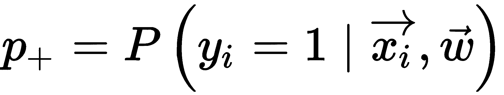

考虑二进制分类的任务，目标类的标签用 **+1** (正例)和 **-1** (负例)表示。我们要预测的概率；因此，目前，我们可以使用以下优化技术构建线性预测: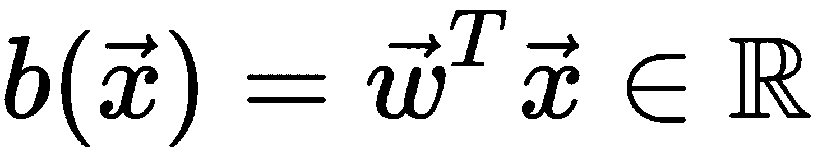。那么，我们如何将结果值转换成极限为[0，1]的概率呢？这种方法需要特定的功能。在逻辑回归模型中，具体函数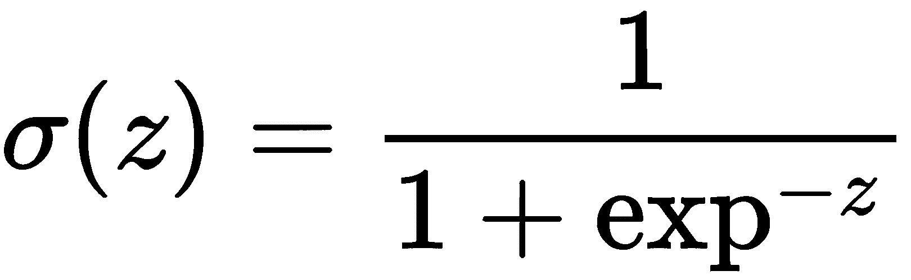用于此。

让我们用事件发生的概率 *X* 来表示 *P(X)* 。概率优势比 *OR(X)* 由确定。这是事件发生或不发生的概率比。我们可以看到概率和优势比都包含相同的信息。但是 *P(X)* 在 0 到 1 的范围内，而 *OR(X)* 在 0 到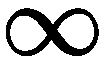的范围内。如果你计算 *OR(X)* 的对数(称为**几率的对数**，或者**概率比的对数**，很容易看出以下适用:。

利用逻辑函数预测的概率，可以从概率比(暂时假设我们也有权重)得到如下:

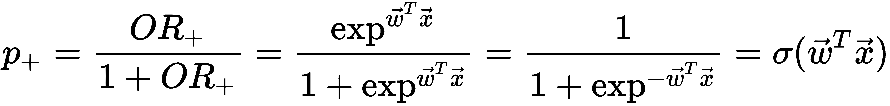

因此，逻辑回归预测将样本分类到 **+** 类的概率，作为模型权重向量以及样本特征向量的线性组合的 sigmoid 变换，如下所示:


从极大似然原理出发，我们可以得到一个逻辑回归求解的优化问题——即逻辑损失函数的最小化。对于 **-** 类，概率由类似的公式确定，如下图所示:


两个类的表达式可以组合成一个，如下图所示:

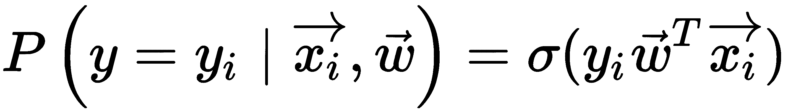

在这里， <sub></sub> 这个表达被称为 <sub></sub> 对象的分类边缘。分类余量可以理解为模型对对象分类的*信心*。对这一差额的解释如下:

*   如果边距向量的绝对值大且为正，则类标签设置正确，对象远离分离超平面。这样的物体因此被自信地分类。
*   如果边距很大(通过取模)但为负，则类别标签设置不正确。物体远离分离超平面。这样的物体很可能是一种异常。
*   如果边距很小(通过取模)，则对象接近分离超平面。在这种情况下，边距符号决定了对象是否被正确分类。

在离散情况下，似然函数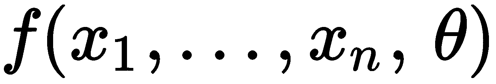可以解释为样本 *X <sub>1</sub> 的概率。。。，* *X <sub> n </sub>* 等于 *x <sub>1</sub> 。。。，* *x <sub> n </sub>* 在给定的一组实验中。此外，该概率取决于 *** θ *** ，如下图所示:


未知参数的最大似然估计称为的值，对于该值，函数达到其最大值(作为 *** θ *** 的函数，具有固定的)，如下图所示:


现在，我们可以写出样本的可能性——即观察样本中给定向量的概率。我们做一个假设——物体独立于单一分布产生，如下图所示:


让我们取这个表达式的对数，因为和比乘积更容易优化，如下所示:


在这种情况下，最大化可能性的原则导致表达式的最小化，如下所示:

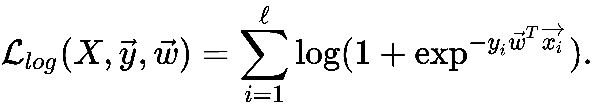

这个公式是一个逻辑损失函数，对训练样本的所有对象求和。通常，在模型中添加一些正则化来处理过拟合是一个好主意。逻辑回归的 L2 正则化的排列方式与线性回归(岭回归)非常相似。然而，通常使用 SVM 模型中使用的受控变量衰减参数 *C* ，其中它表示软裕度参数表示。所以，对于逻辑回归， *C* 等于逆正则化系数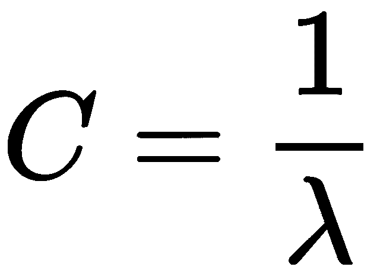。 *C* 和的关系如下:降低 *C* 会加强正则化效果。因此，以下功能应最小化，而不是功能性的 <sub>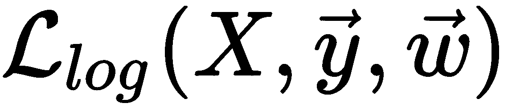</sub> :


对于这个函数最小化，我们可以应用不同的方法——例如，最小二乘法，或者**梯度下降** ( **GD** )方法。逻辑回归的关键问题是它通常是一个线性分类器，以便处理非线性决策边界，这通常使用具有原始特征的多项式特征作为它们的基础。这种方法在前面几章讨论多项式回归时已经讨论过了。

# KRR

KRR 将线性岭回归(线性回归和 L2 范数正则化)与核技巧相结合，可用于分类问题。它学习由选择的核和训练数据产生的高维空间中的线性函数。对于非线性核，它在原始空间中学习非线性函数。

KRR 学习的模型与 SVM 模型相同，但这些方法有以下不同:

*   KRR 方法使用平方误差损失，而 SVM 模型使用不敏感损失或铰链损失进行分类。
*   与 SVM 方法相反，KRR 训练可以以封闭形式完成，因此可以更快地针对中等大小的数据集进行训练。
*   所学习的 KRR 模型是非稀疏的，并且在预测时间方面可能比 SVM 模型慢。

尽管存在这些差异，但这两种方法通常都使用 L2 正则化。

# SVM

SVM 方法是一组用于分类和回归分析任务的算法。考虑到在一个 *N* 维空间中，每个对象属于两个类中的一个，SVM 生成一个( *N-1* )维超平面来将这些点分成两组。这类似于纸上对两种不同类型的点的描绘，这两种类型的点可以线性划分。此外，SVM 选择超平面，其特征在于离最近的组元素的最大距离。

可以使用各种超平面来分离输入数据。最佳超平面是两个类之间具有最大结果分离和最大结果差异的超平面。

想象一下飞机上的数据点。在以下情况下，分隔符只是一条直线:


让我们画出不同的直线，把这些点分成两组。然后，从点尽可能远地选择一条直线，最大化它到每一侧最近点的距离。如果存在这样一条线，那么它被称为最大边缘超平面。直观地，由于超平面本身(它与任何类别的训练样本的最近点的距离最长)，实现了良好的分离，因为一般来说，距离越大，分类器误差越小。

考虑由带有参数的对象组成的集合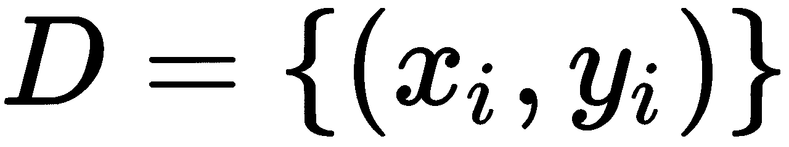给出的学习样本，其中取值-1 或 1，因此定义点的类别。每个点都是维度的向量。我们的任务是找到分隔观测值的最大边缘超平面。我们可以使用解析几何将任何超平面定义为满足条件的一组点，如下图所示:


在这里，<sub></sub><sub>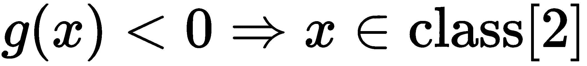</sub>。

因此，线性分离(鉴别)函数由方程 *g(x)=0* 描述。从点到分离函数 *g(x)=0* (从点到平面的距离)的距离等于以下值:

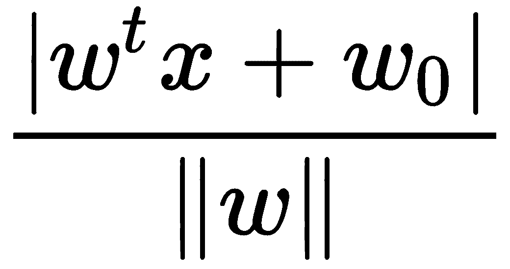

在于边界的闭合即 <sub></sub> 。边界，即分隔条的宽度，需要尽可能大。考虑到边界的闭合满足条件 <sub></sub> ，那么与 <sub>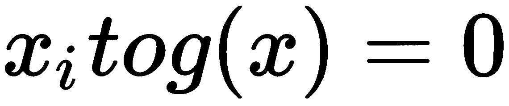</sub> 的距离如下:


因此，分隔条的宽度为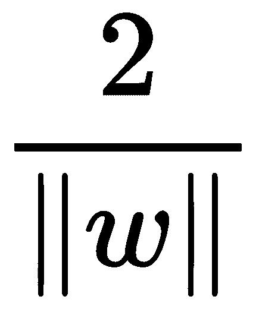。要从分割线中排除点，我们可以写出以下条件:

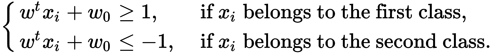

我们也来介绍一下显示属于哪个类的索引函数，如下:

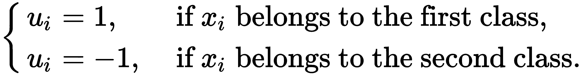

因此，选择产生最大宽度走廊的分离函数的任务可以写成如下:


*J(w)* 功能的引入是假设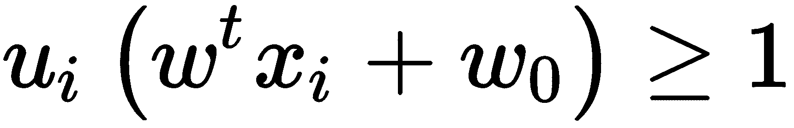适用于所有。由于目标函数是二次的，这个问题有唯一的解。

根据库恩-塔克定理，这个条件等价于以下问题:


前提是和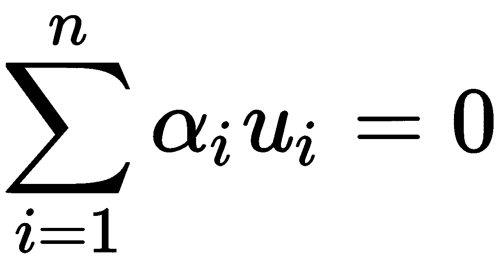，其中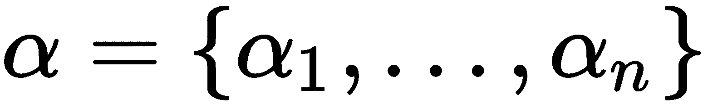是新变量。我们可以将 <sub></sub> 改写成矩阵形式，如下:


矩阵的 *H* 系数可以计算如下: $。二次规划方法可以解决 <sub>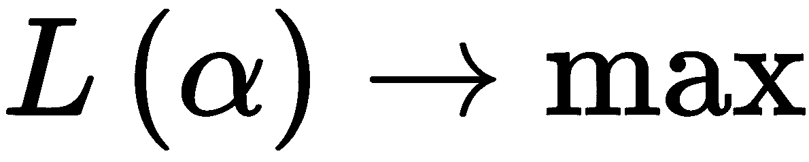</sub> 任务。

在为每个找到最佳后，满足以下两个条件之一:

1.  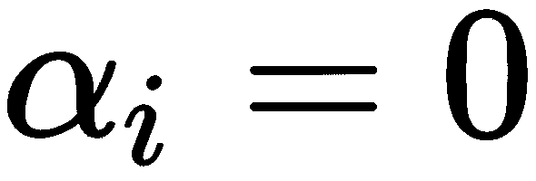 ( *i* 对应于非支持向量。)
2.  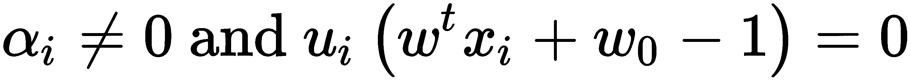 ( *i* 对应一个支持向量。)

然后，从关系中可以找到，考虑到任意一个和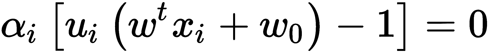，可以确定的值，如下:

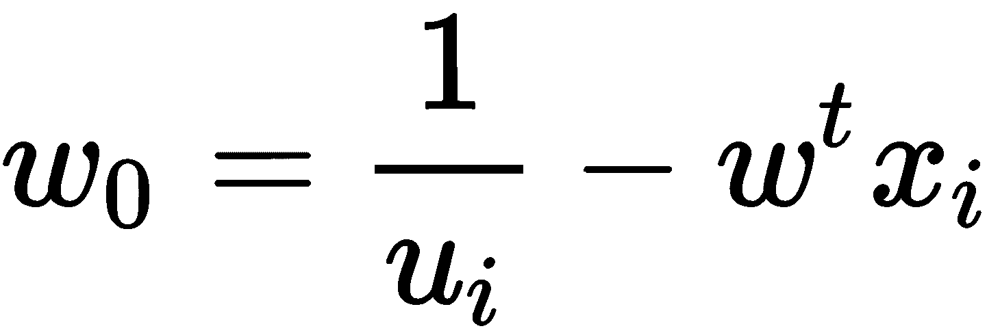

最后，我们可以得到判别函数，如下所示:


注意，求和不是在所有向量上进行的，而是只在集合***【S】***上进行的，这是支持向量的集合 <sub>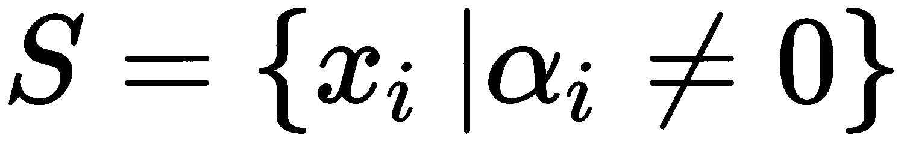</sub> 。

不幸的是，所描述的算法仅针对线性可分离的数据集实现，这本身很少发生。有两种处理线性不可分离数据的方法。

其中之一称为软边界，它选择一个超平面，尽可能纯粹地(以最小的误差)划分训练样本，同时最大化到训练数据集中最近点的距离。为此，我们必须引入额外的变量，这些变量表征了每个物体上的误差大小*x<sub>I</sub>T4。此外，我们可以将总误差的惩罚引入目标函数，如下所示:*

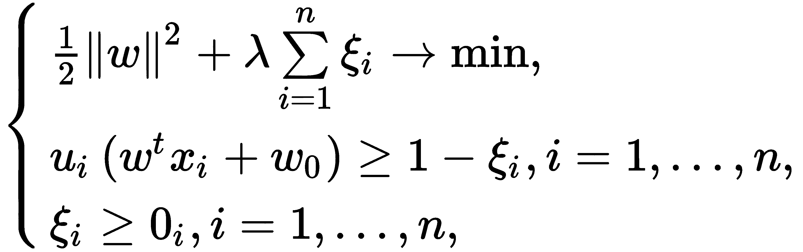

这里，是一个方法调整参数，允许您调整最大化分割条宽度和最小化总误差之间的关系。对应对象*x<sub>I</sub>T5】的罚值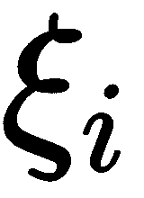取决于对象 *x <sub> i </sub>* 相对于分界线的位置。所以，如果 *x <sub> i </sub>* 位于判别函数的对面，那么我们可以假设罚值，如果 *x <sub> i </sub>* 位于分割线，并且来自它的类。因此，相应的权重为。在理想情况下，我们假设。由此产生的问题可以改写如下:*


请注意，非理想情况下的元素也包含在最小化过程中，如下图所示:

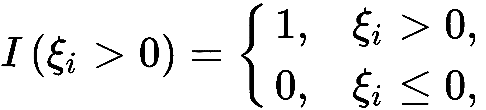

这里，常数***【β】***是考虑到条带宽度的重量。如果***【β】***很小，那么我们可以允许算法在非理想位置(在分割条中)定位相对较多的元素。如果 ***β*** 很大，那么我们要求在非理想位置(分割线)存在少量元素。不幸的是，由于 <sub>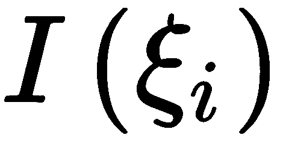</sub> 的不连续性，最小化问题相当复杂。相反，我们可以使用以下最小化:

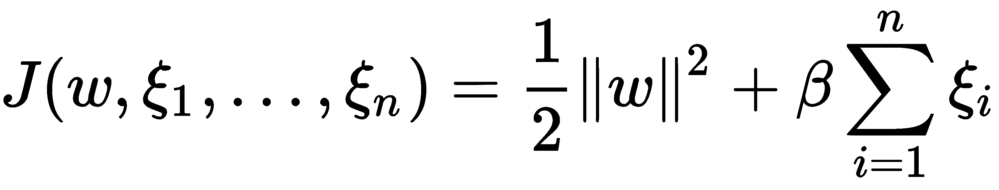

这在限制条件下发生，如下图所示:

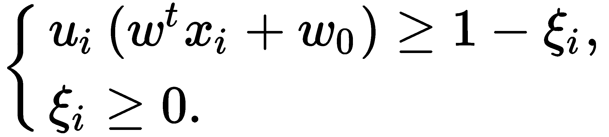

在不可能线性分离类的情况下，SVM 方法的另一个想法是过渡到更高维度的空间，在其中这种分离是可能的。虽然原问题可以在有限维空间中公式化，但经常发生的情况是，用于判别的样本在该空间中不是线性可分的。所以建议把原来的有限维空间映射到更大的维空间，这样分离就容易多了。为了保持计算负荷合理，支持向量算法中使用的映射提供了根据原始空间中的变量，特别是根据核函数计算点的便利性。

首先，选择映射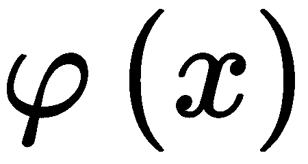的功能，将的数据映射到更高维度的空间。然后，一个非线性判别函数可以写成的形式。该方法的思想是找到核函数 <sub>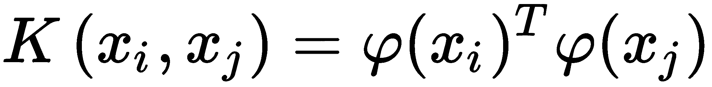</sub> 并最大化目标函数，如下图所示:

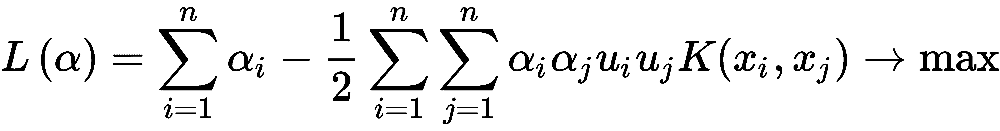

这里，为了最小化计算，不使用数据到更高维空间的直接映射。取而代之的是一种称为内核技巧的方法(参见 [第 6 章](06.html)、*降维*),即 *K(x，y)* ，这是一个内核矩阵。

一般来说，该方法选择的支持向量越多，其推广性就越好。任何不构成支持向量的训练示例，如果出现在测试集中，都会被正确分类，因为正负示例之间的边界仍然在同一个地方。因此，支持向量方法的预期错误率通常等于作为支持向量的示例的比例。随着测量数量的增长，这一比例也在增长，因此该方法无法免受维数灾难的影响，但它比大多数算法更能抵抗维数灾难。
同样值得注意的是，支持向量法对噪声和数据标准化比较敏感。

此外，支持向量机的方法不仅局限于分类任务，也适用于求解回归任务。因此，您通常可以使用相同的 SVM 软件实现来解决分类和回归任务。

# kNN 方法

kNN 是一种流行的分类方法，有时用于回归问题。这是最自然的分类方法之一。该方法的本质是根据邻居中最流行的类别对当前项目进行分类。形式上，该方法的基础是紧性假设:如果成功地阐明了例子之间距离的度量，那么相似的例子更有可能在同一类中。例如，如果你不知道在蓝牙耳机的广告中指定什么类型的产品，你可以找到五个类似的耳机广告。如果其中四个归类为*配件*，只有一个归类为*五金*，常识会告诉你，你的广告大概应该在*配件*一类。

通常，要对对象进行分类，必须按顺序执行以下操作:

1.  计算对象到训练数据集中其他对象的距离。
2.  选择训练对象的 *k* ，与被分类对象的距离最小。
3.  将分类对象类别设置为最近的 *k* 邻居中最常找到的类别。

如果我们取最近邻的数量 *k = 1* ，那么算法就失去了泛化的能力(也就是说，为算法中以前没有遇到的数据产生一个正确的结果)，因为新的项被分配给了最近的类。如果我们设置太高的值，那么算法可能不会揭示许多局部特征。

计算距离的函数必须满足以下规则:

*   <sub>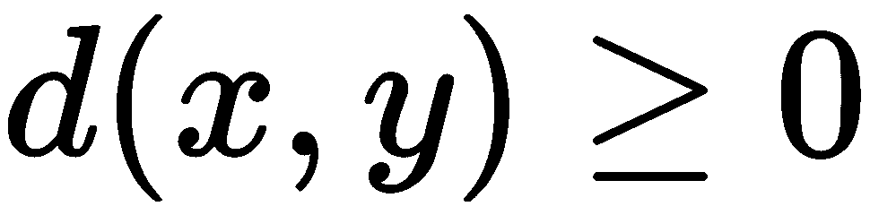</sub>
*   <sub></sub> 只当 *x = y*
*   <sub></sub>
*   <sub></sub> 在点 *x，y，z* 的情况下不要躺在一条直线上

在这种情况下， *x，y，z* 是比较对象的特征向量。对于有序属性值，可以应用欧几里德距离，如下所示:

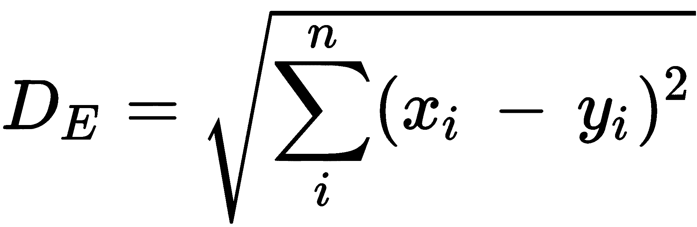

在这种情况下， ***n*** 就是属性的个数。

对于无法排序的字符串变量，可以应用差分函数，其设置如下:


在计算距离时，有时会考虑属性的重要性。通常，属性相关性可以由专家或分析师主观确定，并基于他们自己的经验、专业知识和问题解释。在这种情况下，每个 *i <sup>th</sup>* 的平方差之和乘以系数 *Z <sub>i</sub>* 。例如，如果属性 *A* 比属性 <sub></sub> ( <sub></sub> 、 <sub></sub> )重要三倍，则距离计算如下:


这种技术称为**拉伸轴**，减少了分类误差。

分类对象的类别选择也可以不同，主要有两种方式进行选择:*未加权投票*和*加权投票*。

对于未加权投票，我们通过指定 *k* 号来确定分类任务中有多少对象有投票权。我们通过这些物体到新物体的最小距离来识别它们。每个物体的距离对投票来说不再重要。在一个类定义中，所有人都有平等的权利。每个现有对象为其所属的类投票。我们给一个新对象分配一个票数最多的类。但是，如果几个班级的票数相等，可能会有问题。加权投票消除了这个问题。

在加权投票过程中，我们还会考虑到到新对象的距离。距离越小，投票的贡献越大。类别(公式)的投票如下:


在这种情况下，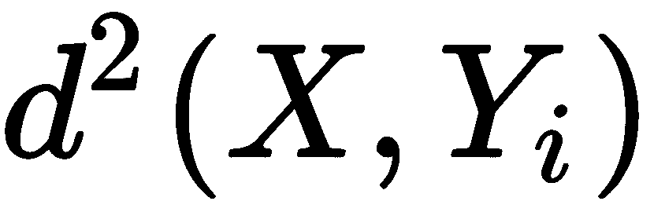是从已知物体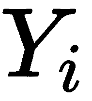到新物体的距离的平方，而是为其计算选票的类别的已知物体的数量。`class`是班级的名字。新对象对应票数最多的类。在这种情况下，几个班级获得相同票数的概率要低得多。当时，新对象被分配到最近邻的类。

kNN 方法的一个显著特点是它的懒惰。懒惰意味着计算只在分类的那一刻开始。当使用 kNN 方法训练样本时，我们不仅要简单地建立模型，还要同时进行样本分类。请注意，最近邻法是一种研究得很好的方法(在机器学习、计量经济学和统计学中，只有线性回归更为人所知)。对于最近邻法，有相当多的关键定理说明在*无限*样本上，kNN 是最优分类方法。经典著作*统计学习的要素*的作者认为 kNN 是一种理论上理想的算法，其适用性仅受计算能力和维数灾难的限制。

kNN 是最简单的分类算法之一，因此它在现实任务中通常是无效的。KNN 算法有几个缺点。当我们没有足够的样本时，除了分类精度低之外，kNN 分类器的问题是分类速度:如果训练集中有 *N* 个对象，并且空间维数为 K，那么对测试样本进行分类的操作次数可以估计为 <sub></sub> 。用于算法的数据集必须具有代表性。模型不能*从数据中分离出来*:要对一个新的例子进行分类，需要用到所有的例子。

积极的特征包括算法抵抗异常异常值的事实，因为这种记录落入 kNN 数量的概率很小。如果发生这种情况，那么 <sub>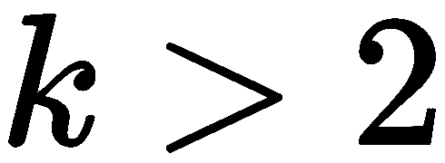</sub> 对投票的影响(唯一加权)也很可能是微不足道的，因此，对分类结果的影响也很小。该算法的程序实现相对简单，算法结果易于解释。因此，适用领域的专家在寻找相似对象的基础上理解算法的逻辑。通过使用最合适的组合函数和度量来修改算法的能力允许您针对特定任务调整算法。

# 多类分类

现有的多类分类方法大多是基于二进制分类器或者简化为二进制分类器。这种方法的一般思想是使用一组经过训练的二进制分类器来将不同的对象组彼此分开。对于这种多类分类，使用一组二进制分类器的各种投票方案。

在 *N* 类的**一对所有**策略中， *N* 分类器被训练，每个分类器将其类与所有其他类分开。在识别阶段，未知向量 *X* 被馈送到所有 *N* 分类器。向量 *X* 的隶属度由给出最高估计的分类器确定。这种方法可以在阶级不平衡出现时解决问题。即使多类分类的任务最初是平衡的(也就是说，它在每个类中具有相同数量的训练样本)，当训练二进制分类器时，每个二进制问题中样本数量的比率随着类数量的增加而增加，因此显著影响类数量显著的任务。

**各对各**策略分配 <sub></sub> 量词。这些分类器被训练来区分所有可能的类别对。对于输入向量，每个分类器给出 <sub>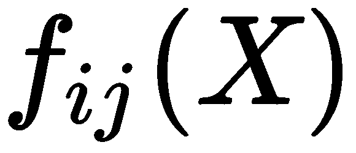</sub> 的估计，反映类和中的成员关系。结果是一个具有最大和的类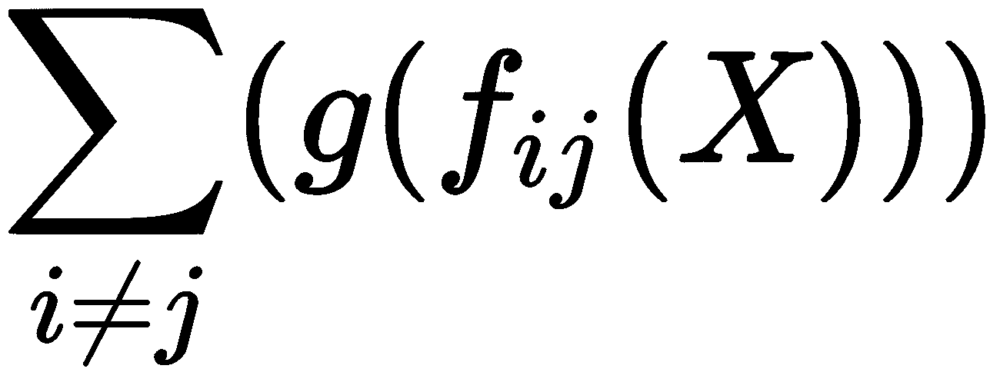，其中 *g* 是一个单调的非递减函数——例如，相同或逻辑。

**射击锦标赛**策略还包括训练分类器来区分所有可能的类别对。与之前的策略不同，在矢量 *X* 的分类阶段，我们安排了一个班间比武。我们创建一个锦标赛树，其中每个职业都有一个对手，只有一个获胜者可以进入下一个锦标赛阶段。因此，在每一步，只有一个分类器确定向量 *X* 类，然后*获胜的*类被用来确定具有下一对类的下一个分类器。这个过程一直进行到只剩下一个优胜班，这应该算是结果。

一些方法可以立即产生多类分类，而不需要额外的配置和组合。kNN 算法或神经网络可以被认为是这种方法的例子。

现在我们已经熟悉了一些最广泛的分类算法，让我们看看如何在不同的 C++ 库中使用它们。

# 使用 C++ 库处理分类任务的示例

现在让我们看看如何使用我们描述的方法来解决人工数据集上的分类任务，我们可以在下面的截图中看到:

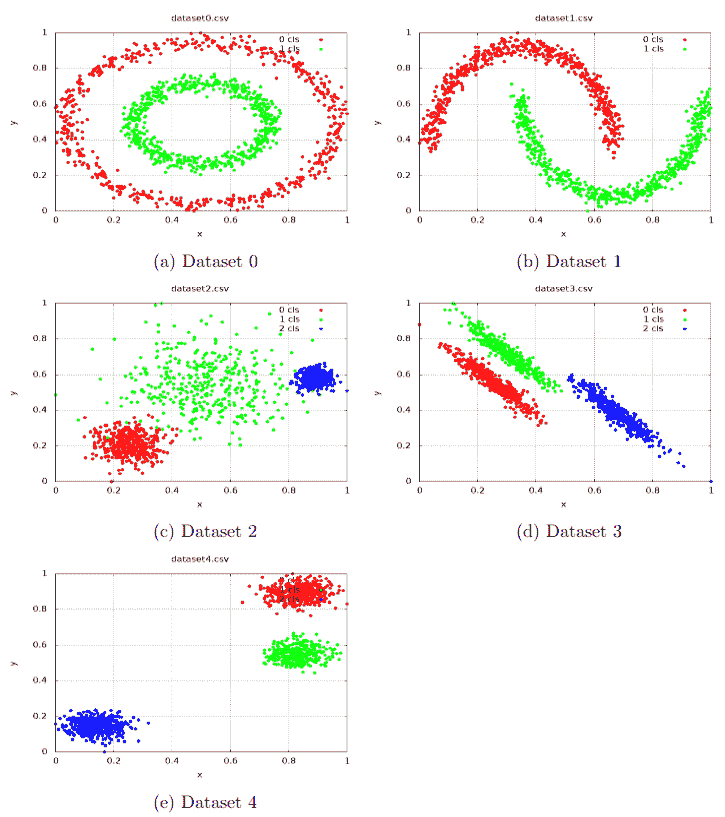

我们可以看到，这些数据集包含两个和三个不同类别的对象，因此使用方法进行多类别分类是有意义的，因为这样的任务在现实生活中出现的频率更高；它们可以很容易地简化为二元分类。

分类是一种有监督的技术，所以我们通常有一个训练数据集，以及用于分类的新数据。为了模拟这种情况，我们将在示例中使用两个数据集，一个用于训练，一个用于测试。它们来自一个大数据集中的相同分布。但是，测试集不会用于训练，因此我们可以评估准确性度量，并查看模型的表现和概括情况。

# 使用幕府图书馆

在本节中，我们将展示如何使用`Shogun`库来解决分类任务。这个库提供了所有三种主要分类算法的实现:逻辑回归、kNN 和 SVM。

# 用逻辑回归

`Shogun`库在`CMulticlassLogisticRegression`类中实现多类逻辑回归。该类有一个名为 *z* 的可配置参数，是一个正则化系数。为了选择最佳值，我们使用交叉验证的网格搜索方法。下面的代码片段展示了这种方法。

假设我们有以下列车和测试数据:

```cpp
Some<CDenseFeatures<DataType>> features;
Some<CMulticlassLabels> labels;
Some<CDenseFeatures<DataType>> test_features;
Some<CMulticlassLabels> test_labels; 
```

当我们决定使用交叉验证过程时，让我们如下定义所需的对象:

```cpp
// search for hyper-parameters
auto root = some<CModelSelectionParameters>();
// z - regularization parameter
CModelSelectionParameters* z = new CModelSelectionParameters("m_z");
root->append_child(z);
z->build_values(0.2, 1.0, R_LINEAR, 0.1);
```

首先，我们用`CModelSelectionParameters`类的实例创建了一个可配置的参数树。正如我们在[第 3 章](03.html)、*测量性能和选择模型*中已经看到的，应该总是有一个根节点和一个具有确切参数名称和值范围的子节点。`Shogun`库中的每一个可训练模型都有`print_model_params()`方法，该方法打印所有可用于`CGridSearchModelSelection`类自动配置的模型参数，因此检查精确的参数名称很有用。代码可以在下面的块中看到:

```cpp
index_t k = 3;
CStratifiedCrossValidationSplitting* splitting =
     new CStratifiedCrossValidationSplitting(labels, k);

auto eval_criterium = some<CMulticlassAccuracy>();

auto log_reg = some<CMulticlassLogisticRegression>();
auto cross = some<CCrossValidation>(log_reg, features, labels, splitting, eval_criterium);

cross->set_num_runs(1);
```

我们配置了`CCrossValidation`类的实例，它采用了拆分策略和评估标准对象的实例，以及用于初始化的训练特征和标签。拆分策略由`CStratifiedCrossValidationSplitting`类的实例和评估指标定义。我们使用`CMulticlassAccuracy`类的实例作为评估标准，如下面的代码块所示:

```cpp
auto model_selection = some<CGridSearchModelSelection>(cross, root);
CParameterCombination* best_params =
wrap(model_selection->select_model(false));
best_params->apply_to_machine(log_reg);
best_params->print_tree();
```

在我们配置了交叉验证对象之后，我们将其与参数树一起用于初始化`CGridSearchModelSelection`类的实例，然后我们使用其方法(即`select_model()`)来搜索最佳模型参数。

该方法返回了`CParameterCombination`类的实例，该实例使用`apply_to_machine()`方法用该对象的特定值初始化模型参数，如以下代码块所示:

```cpp
// train
log_reg->set_labels(labels);
log_reg->train(features);

// evaluate model on test data
auto new_labels = wrap(log_reg->apply_multiclass(test_features)); 

// estimate accuracy
auto accuracy = eval_criterium->evaluate(new_labels, test_labels);

// process results
auto feature_matrix = test_features->get_feature_matrix();
for (index_t i = 0; i < new_labels->get_num_labels(); ++ i) {
    auto label_idx_pred = new_labels->get_label(i);
    auto vector = feature_matrix.get_column(i)
    ...
}
```

找到最佳参数后，我们在完整的训练数据集上训练模型，并在测试集上对其进行评估。`CMulticlassLogisticRegression`类有一个名为`apply_multiclass()`的方法，我们用它对测试数据进行模型评估。这个方法返回了一个`CMulticlassLabels`类的对象。然后使用`get_label()`方法访问标签值。

下面的截图显示了将逻辑回归算法的`Shogun`实现应用于我们的数据集的结果:


注意我们在**数据集 0** 、**数据集 1** 和**数据集 2** 数据集中有分类错误，其他数据集分类几乎正确。

# 使用支持向量机

`Shogun`库还在`CMulticlassLibSVM`类中实现了多类 SVM 算法。这个类的实例可以用一个名为 *C* 的参数来配置，这个参数是对内核对象错误分类的一种度量。在下面的例子中，我们使用一个`CGaussianKernel`类的实例作为内核对象。这个对象也有配置参数，但我们只使用了一个名为`combined_kernel_weight`的参数，因为它在一系列实验后为我们的模型给出了最合理的配置。让我们看看下面代码块中的代码:

```cpp
Some <CDenseFeatures<DataType>> features;
Some<CMulticlassLabels> labels;
Some<CDenseFeatures<DataType>> test_features;
Some<CMulticlassLabels> test_labels;
```

这些是我们训练和测试数据集对象的定义:

```cpp
auto kernel = some<CGaussianKernel>(features, features, 5);
// one vs one classification
auto svm = some<CMulticlassLibSVM>();
svm->set_kernel(kernel); 
```

使用这些数据集，我们初始化了`CMulticlassLibSVM`类对象并配置了它的内核，如下所示:

```cpp
 // search for hyper-parameters
 auto root = some<CModelSelectionParameters>();
 // C - how much you want to avoid misclassifying
 CModelSelectionParameters* c = new CModelSelectionParameters("C");
 root->append_child(c);
 c->build_values(1.0, 1000.0, R_LINEAR, 100.);

 auto params_kernel = some<CModelSelectionParameters>("kernel", kernel);
 root->append_child(params_kernel);

 auto params_kernel_width =
 some<CModelSelectionParameters>("combined_kernel_weight");
 params_kernel_width->build_values(0.1, 10.0, R_LINEAR, 0.5);

 params_kernel->append_child(params_kernel_width);
```

然后，我们配置交叉验证参数对象来寻找最佳超参数组合，如下所示:

```cpp
     index_t k = 3;
     CStratifiedCrossValidationSplitting* splitting =
     new CStratifiedCrossValidationSplitting(labels, k);

     auto eval_criterium = some<CMulticlassAccuracy>();

     auto cross =
     some<CCrossValidation>(svm, features, labels, splitting, 
                            eval_criterium);
     cross->set_num_runs(1);

     auto model_selection = some<CGridSearchModelSelection>(cross, root);
     CParameterCombination* best_params =
     wrap(model_selection->select_model(false));
     best_params->apply_to_machine(svm);
     best_params->print_tree();
```

配置了交叉验证参数后，我们初始化了`CCrossValidation`类对象，并运行了模型选择的网格搜索过程，如下所示:

```cpp
 // train SVM
 svm->set_labels(labels);
 svm->train(features);

 // evaluate model on test data
 auto new_labels = wrap(svm->apply_multiclass(test_features));

 // estimate accuracy
 auto accuracy = eval_criterium->evaluate(new_labels, test_labels);
 std::cout << "svm " << name << " accuracy = " << accuracy << std::endl;

 // process results
 auto feature_matrix = test_features->get_feature_matrix();
 for (index_t i = 0; i < new_labels->get_num_labels(); ++ i) {
 auto label_idx_pred = new_labels->get_label(i);
 auto vector = feature_matrix.get_column(i);
 ...
 }
```

当找到最佳超参数并应用于模型时，我们重复训练并进行评估。

请注意，除了模型配置的不同参数之外，代码与前面的示例相同。我们创建了参数树、交叉验证对象、相同的评估指标对象，并使用网格搜索方法来寻找模型参数的最佳组合。然后，我们对模型进行训练，并使用`apply_multiclass()`方法进行评估。这些事实向您表明，该库具有针对不同算法的统一 API，这允许我们在代码中进行最少修改的情况下尝试不同的模型。

下面的截图显示了将 SVM 算法的`Shogun`实现应用于我们的数据集的结果:


请注意，SVM 又犯了一个分类错误，我们在**数据集 2** 、**数据集 3** 和**数据集 4** 中有不正确的标签。其他数据集分类几乎正确。

# 使用 kNN 算法

`Shogun`库也有 kNN 算法的实现，它被放在`CKNN`类中。在使用该算法之前，我们必须计算训练数据集中所有特征之间的距离。例如，这个操作可以通过实现`CDistance`接口的`CEuclideanDistance`类(或替代类)的实例来完成。`Shogun`库中有很多距离实现类，比如余弦相似度，以及曼哈顿和海明距离。有了包含训练集距离的对象后，我们可以初始化`CKNN`类的对象，它采用距离对象、训练标签和 *k* 参数(搜索邻居的数量)。该对象使用`train()`方法进行模型训练。下面的代码显示了这种方法:

```cpp

 void KNNClassification(Some<CDenseFeatures<DataType>> features,
                        Some<CMulticlassLabels> labels,
                        Some<CDenseFeatures<DataType>> test_features,
                        Some<CMulticlassLabels> test_labels) {
     int32_t k = 3;
     auto distance = some<CEuclideanDistance>(features, features);
     auto knn = some<CKNN>(k, distance, labels);
     knn->train();

     // evaluate model on test data
     auto new_labels = wrap(knn->apply_multiclass(test_features));

     // estimate accuracy
     auto eval_criterium = some<CMulticlassAccuracy>();
     auto accuracy = eval_criterium->evaluate(new_labels, test_labels);

     // process results
     auto feature_matrix = test_features->get_feature_matrix();
     for (index_t i = 0; i < new_labels->get_num_labels(); ++ i) {
         auto label_idx_pred = new_labels->get_label(i);
         ...
     }
 }
```

我们可以看到，代码非常简单。模型训练好之后，我们可以使用已经知道的`apply_multiclass()`方法进行评估。

下面的截图显示了将 kNN 算法的幕府实现应用于我们的数据集的结果:

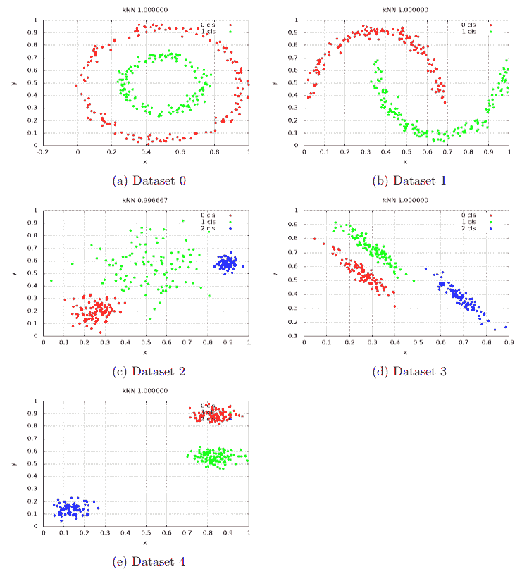

请注意，kNN 算法几乎正确地对所有数据集进行了分类。

# 使用 Dlib 库

`Dlib`库没有很多分类算法。最适用的有两个: *KRR* 和 *SVM* 。这些方法实现为二进制分类器，但是对于多类分类，这个库提供了`one_vs_one_trainer`类，实现了投票策略。请注意，这个类可以使用不同类型的分类器，这样您就可以将 KRR 和 SVM 组合在一个分类任务中。我们还可以指定哪些分类器应该用于哪些不同的类。

# 和 KRR 一起

下面的代码示例显示了如何将 Dlib 的 KRR 算法实现用于多类分类:

```cpp
 void KRRClassification(const Samples& samples,
                        const Labels& labels,
                        const Samples& test_samples,
                        const Labels& test_labels) {
     using OVOtrainer = one_vs_one_trainer<any_trainer<SampleType>>;
     using KernelType = radial_basis_kernel<SampleType>;

     krr_trainer<KernelType> krr_trainer;
     krr_trainer.set_kernel(KernelType(0.1));

     OVOtrainer trainer;
     trainer.set_trainer(krr_trainer);

     one_vs_one_decision_function<OVOtrainer> df = trainer.train(samples, 
                             labels);

     // process results and estimate accuracy
     DataType accuracy = 0;
     for (size_t i = 0; i != test_samples.size(); i++) {
         auto vec = test_samples[i];
         auto class_idx = static_cast<size_t>(df(vec));
         if (static_cast<size_t>(test_labels[i]) == class_idx)
             ++ accuracy;
         ...
     }

     accuracy /= test_samples.size();
 }
```

首先，我们初始化了`krr_trainer`类的对象，然后我们用内核对象的实例配置了它。在这个例子中，我们使用`radial_basis_kernel`类型作为内核对象，以便处理不能线性分离的样本。在我们获得二进制分类器对象之后，我们初始化了`one_vs_one_trainer`类的实例，并用`set_trainer()`方法将这个分类器添加到它的堆栈中。然后，我们使用`train()`方法训练我们的多类分类器。与`Dlib`库中的大多数算法一样，该算法假设训练样本和标签具有`std::vector`类型，由此每个元素具有`matrix`类型。`train()`方法返回一个决策函数——也就是表现为一个函子的对象，然后这个函子获取一个样本并为其返回一个分类标签。该决策函数是`one_vs_one_decision_function`类型的对象。下面这段代码演示了我们如何使用它:

```cpp
   auto vec = test_samples[i];
   auto class_idx = static_cast<size_t>(df(vec));
```

`Dlib`库中没有精度度量的明确实现；因此，在本例中，准确度直接计算为正确分类的测试样本与测试样本总数的比值。

下面的截图显示了将 KRR 算法的 Dlib 实现应用于我们的数据集的结果:

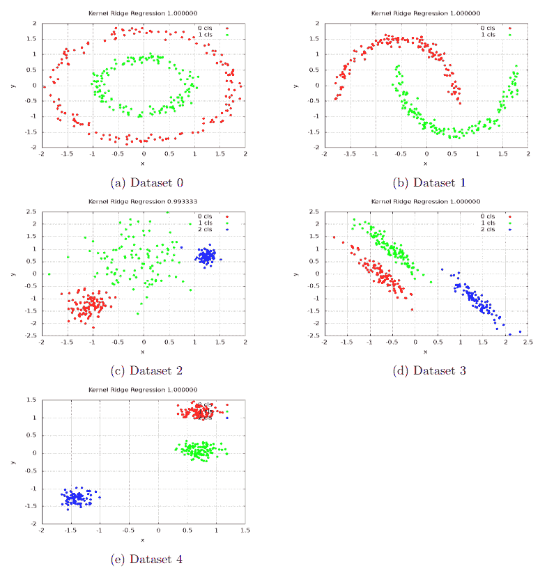

请注意，KRR 算法对所有数据集执行了正确的分类。

# 和 SVM 一起

下面的代码示例展示了如何使用`Dlib`的 SVM 算法实现进行多类分类:

```cpp
 void SVMClassification(const Samples& samples,
                        const Labels& labels,
                        const Samples& test_samples,
                        const Labels& test_labels) {
     using OVOtrainer = one_vs_one_trainer<any_trainer<SampleType>>;
     using KernelType = radial_basis_kernel<SampleType>;

     svm_nu_trainer<KernelType> svm_trainer;
     svm_trainer.set_kernel(KernelType(0.1));

     OVOtrainer trainer;
     trainer.set_trainer(svm_trainer);

     one_vs_one_decision_function<OVOtrainer> df = trainer.train(samples, 
                             labels);

     // process results and estimate accuracy
     DataType accuracy = 0;
     for (size_t i = 0; i != test_samples.size(); i++) {
         auto vec = test_samples[i];
         auto class_idx = static_cast<size_t>(df(vec));
         if (static_cast<size_t>(test_labels[i]) == class_idx)
             ++ accuracy;
         ...
     }

     accuracy /= test_samples.size();
 }
```

这个例子说明`Dlib`库也有一个统一的 API，用于使用不同的算法，与前面例子的主要区别是二进制分类器的对象。对于 SVM 分类，我们使用了一个`svm_nu_trainer`类型的对象，它也配置了`radial_basis_kernel`类型的内核对象。

下面的截图显示了将 KRR 算法的 Dlib 实现应用于我们的数据集的结果:


您可以看到，SVM 算法的 Dlib 实现也在所有数据集上进行了正确的分类，而无需额外的配置。请记住，在某些情况下，相同算法的幕府实现进行了不正确的分类。

# 使用鲨鱼毫升库

`Shark-ML`库对于多类分类问题有一个更低级的方法。逻辑回归和 SVM 分类器被实现为二元分类器。因此，用户必须明确地训练分类器并配置`OneVersusOneClassifier`类的对象，以将它们组合成多类分类器。kNN 算法本质上是一个多类分类器。

# 用逻辑回归

下面的例子展示了如何用`Shark-ML`和逻辑回归算法实现多类分类。下面的代码片段介绍了这种任务的函数声明:

```cpp
void LRClassification(const ClassificationDataset& train,
                       const ClassificationDataset& test,
                       unsigned int num_classes) {
...
}
```

下面的代码片段显示了如何为多类分类配置对象:

```cpp
OneVersusOneClassifier<RealVector> ovo;
unsigned int pairs = num_classes * (num_classes - 1) / 2;
std::vector<LinearClassifier<RealVector> > lr(pairs);

for (std::size_t n = 0, cls1 = 1; cls1 < num_classes; cls1++) {
    using BinaryClassifierType = 
        OneVersusOneClassifier<RealVector>::binary_classifier_type;
    std::vector<BinaryClassifierType*> ovo_classifiers;
    for (std::size_t cls2 = 0; cls2 < cls1; cls2++, n++) {
        // get the binary subproblem
        ClassificationDataset binary_cls_data = 
            binarySubProblem(train, cls2, cls1);

        // train the binary machine
        LogisticRegression<RealVector> trainer;
        trainer.train(lr[n], binary_cls_data);
        ovo_classifiers.push_back(&lr[n]);
    }
    ovo.addClass(ovo_classifiers);
}
```

在前面的代码片段中，我们使用了以下步骤，这些步骤向我们展示了如何为多类分类配置对象:

1.  首先，我们定义了`OneVersusOneClassifier`类的`ovo`对象，它封装了单个多类分类器。
2.  然后，我们初始化了一对一策略的所有二进制分类器，并将它们放在`std::vector<LinearClassifier<RealVector>>`类型的`lr`容器对象中。
3.  然后，我们用`LogisticRegression`类型的训练器对象训练二进制分类器集，并将它们放入`lr`容器中。
4.  然后，我们对所有课程进行嵌套循环的训练。注意`lr`容器保存分类器的实例，但是`ovo`对象需要分类器实例的指针来执行最终的分类。`ovo_classifiers`对象包含指向二进制分类器的指针。这些分类器的配置方式是，每个分类器将单个类别(`cls1`)分类为正，所有其他类别都视为负(`cls2`)。
5.  然后，我们使用`addClass`方法，使用`ovo_classifiers`对象填充`ovo`对象。

另一个重要因素是我们如何分离训练单个二进制分类器所需的数据。`Shark-ML`库对于这个任务有一个特殊的函数叫做`binarySubProblem`，它接受`ClassificationDataset`类型的对象，并以适合二进制分类的方式将其拆分，即使原始数据集是多类数据集。该函数的第二个和第三个参数分别是`zero`类标签索引和`one`类标签索引。

在我们训练了所有二进制分类器并配置了`OneVersusOneClassifier`对象之后，我们将其用于测试集上的模型评估。这个对象可以作为一个函子来对测试用例集进行分类，但是它们需要有`UnlabeledData`类型。在我们的例子中，测试数据集具有`ClassificationDataset`类型，因此它被标记。我们使用`inputs()`方法从中检索未标记的样本。分类的结果有`Data<unsigned int>`式。

下面的代码片段显示了如何使用一个经过训练的`ovo`对象进行评估:

```cpp
// estimate accuracy
ZeroOneLoss<unsigned int> loss;
Data<unsigned int> output = ovo(test.inputs());
double accuracy = 1\. - loss.eval(test.labels(), output);

// process results
for (std::size_t i = 0; i != test.numberOfElements(); i++) {
    auto cluser_idx = output.element(i);
    auto element = test.inputs().element(i);
     ...
}
```

对于评估指标，我们使用了`ZeroOneLoss`类型的对象，它返回与精度相反的值，因此我们将其反转以用于我们的目的。

下面的截图显示了将逻辑回归算法的 Shark-ML 实现应用于我们的数据集的结果:

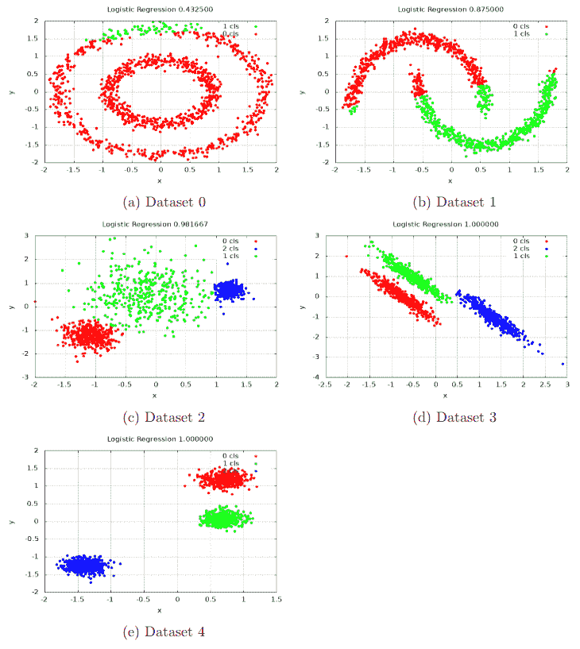

可以看到多类逻辑回归算法实现比其在`Shogun`库中的实现表现更好。但是，它在**数据集 0** 和**数据集 1** 数据集上出现了一些错误。

# 和 SVM 一起

为了使用`Shark-ML`库实现 SVM 多分类，我们应该使用与之前用于逻辑回归方法相同的方法。主要区别是二进制分类器的类型。在这种情况下，它是`KernelClassifier`班，它的教练是`CSvmTrainer`班。

在下面的示例中，我们将为模型使用两个预定义的参数，一个是 SVM 算法的 *C* 参数，第二个是内核的`gamma`。此示例中的内核对象具有`GaussianRbfKernel`类型，用于处理非线性可分离数据。

下面的代码片段显示了以数据集对象作为参数的函数声明:

```cpp
void SVMClassification(const ClassificationDataset& train,
                       const ClassificationDataset& test,
                       unsigned int num_classes) {
    ...
}
```

然后，我们定义一个内核对象，如下所示:

```cpp
double gamma = 0.5;
GaussianRbfKernel<> kernel(gamma);
```

下面的代码片段显示了如何初始化和配置一对一的分类器对象:

```cpp
OneVersusOneClassifier<RealVector> ovo;
unsigned int pairs = num_classes * (num_classes - 1) / 2;
std::vector<KernelClassifier<RealVector> > svm(pairs);
for (std::size_t n = 0, cls1 = 1; cls1 < num_classes; cls1++) {
   using BinaryClassifierType = 
        OneVersusOneClassifier<RealVector>::binary_classifier_type;
    std::vector<BinaryClassifierType*> ovo_classifiers;
    for (std::size_t cls2 = 0; cls2 < cls1; cls2++, n++) {
        // get the binary subproblem
        ClassificationDataset binary_cls_data =
            binarySubProblem(train, cls2, cls1);

        // train the binary machine
        double c = 10.0;
        CSvmTrainer<RealVector> trainer(&kernel, c, false);
        trainer.train(svm[n], binary_cls_data);
        ovo_classifiers.push_back(&svm[n]);
     }
     ovo.addClass(ovo_classifiers);
}
```

培训结束后，我们使用`ovo`对象进行评估，如下所示:

```cpp
// estimate accuracy
ZeroOneLoss<unsigned int> loss;
Data<unsigned int> output = ovo(test.inputs());
double accuracy = 1\. - loss.eval(test.labels(), output);

// process results
for (std::size_t i = 0; i != test.numberOfElements(); i++) {
    auto cluser_idx = output.element(i);
    auto element = test.inputs().element(i);
    ...
}

```

下面的截图显示了将 SVM 算法的 Shark-ML 实现应用于我们的数据集的结果:


请注意，Shark-ML SVM 算法实现对所有数据集都进行了正确的分类。

# 使用 kNN 算法

`Shark-ML`库中的 kNN 分类算法在`NearestNeighborModel`类中实现。这个类的对象可以用不同的最近邻算法初始化。两种主要类型是暴力选项和空间分割树选项。在这个示例中，我们将使用`TreeNearestNeighbors`算法，因为它对于中型数据集具有更好的性能。以下代码块显示了 kNN 算法在`Shark-ML`库中的使用:

```cpp
 void KNNClassification(const ClassificationDataset& train,
                        const ClassificationDataset& test,
                        unsigned int num_classes) {
     KDTree<RealVector> tree(train.inputs());
     TreeNearestNeighbors<RealVector, unsigned int> nn_alg(train, &tree);
     const unsigned int k = 5;
     NearestNeighborModel<RealVector, unsigned int> knn(&nn_alg, k);

     // estimate accuracy
     ZeroOneLoss<unsigned int> loss;
     Data<unsigned int> predictions = knn(test.inputs());
     double accuracy = 1\. - loss.eval(test.labels(), predictions);

     // process results
     for (std::size_t i = 0; i != test.numberOfElements(); i++) {
         auto cluser_idx = predictions.element(i);
         auto element = test.inputs().element(i);
         ...
     }
 }
```

第一步是创建`KDTree`类型的对象，它定义了训练样本的 KD-Tree 空间划分。然后，我们初始化了`TreeNearestNeighbors`类的对象，它采用了之前创建的树分区和训练数据集的实例。我们还预定义了 kNN 算法的 *k* 参数，并用算法实例和 *k* 参数初始化了`NearestNeighborModel`类的对象。

这个模型没有特定的训练方法，因为 kNN 算法使用所有的数据进行评估。因此，在这种情况下，KD-Tree 的构建可以被解释为训练步骤，因为树不会改变评估数据。因此，在我们初始化了实现 kNN 算法的对象之后，我们可以将它用作一个 functor 来对测试样本集进行分类。这个 API 技术对于`Shark-ML`库中的所有分类模型都是一样的。对于准确性评估指标，我们还使用了`ZeroOneLoss`类型的对象。

下面的截图显示了将 kNN 算法的 Shark-ML 实现应用于我们的数据集的结果:

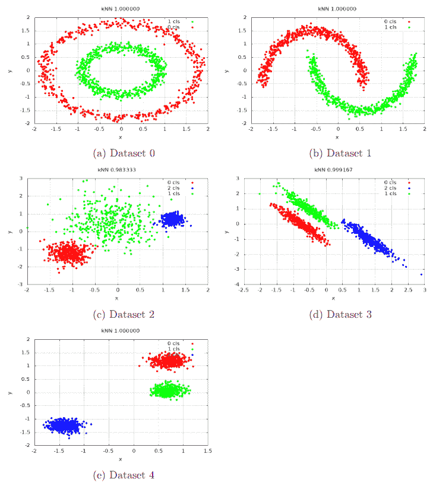

您可以看到，Shark-ML kNN 算法实现也在所有数据集上进行了正确的分类，没有任何明显的错误。

# 摘要

在本章中，我们讨论了解决分类任务的监督机器学习方法。这些方法使用训练好的模型根据对象的特征来确定对象的类别。我们考虑了两种二元分类方法:逻辑回归和支持向量机。我们研究了使用二进制分类器实现多类分类的方法。

我们还研究了最近邻方法，它可以处理多类分类而无需额外的操作。我们发现处理非线性数据需要在算法及其调整方面进行额外的改进。分类算法的实现在性能、所需内存量和学习所需时间方面有所不同。因此，分类算法的选择应该由特定的任务和业务需求来指导。此外，它们在不同库中的实现可以产生不同的结果，即使是对于相同的算法。因此，为你的软件准备几个库是有意义的。

在下一章中，我们将讨论推荐系统。我们将看到它们是如何工作的，存在哪些算法来实现它们，以及如何训练和评估它们。在最简单的意义上，推荐系统用于预测用户对哪些对象(商品或服务)感兴趣。这种系统的例子可以在亚马逊等许多在线商店或网飞等流媒体网站上看到，这些网站根据您以前的消费向您推荐新内容。

# 进一步阅读

*   **逻辑回归-详细概述**:[https://towards data science . com/逻辑回归-详细概述-46c4da4303bc](https://towardsdatascience.com/logistic-regression-detailed-overview-46c4da4303bc)
*   **从示例中理解支持向量机(SVM)算法(连同代码)**:[https://www . analyticsvidhya . com/blog/2017/09/undersing-支持向量机-示例-代码/](https://www.analyticsvidhya.com/blog/2017/09/understaing-support-vector-machine-example-code/)
*   **理解支持向量机:入门**:[https://appledmachinelearning . blog/2017/03/09/理解-支持向量机-入门/](https://appliedmachinelearning.blog/2017/03/09/understanding-support-vector-machines-a-primer/)
*   **支持向量机:核技巧；美世定理**:[https://towardsdata science . com/了解-支持向量机-第 2 部分-核-技巧-美世定理-e1e6848c6c4d](https://towardsdatascience.com/understanding-support-vector-machine-part-2-kernel-trick-mercers-theorem-e1e6848c6c4d)
*   **带内核 Trick 的 SVMs(讲座)**:[https://OCW . MIT . edu/courses/Sloan-school-management/15-097-prediction-machine-learning-and-statistics-spring-2012/讲座笔记/MIT15_097S12_lec13.pdf](https://ocw.mit.edu/courses/sloan-school-of-management/15-097-prediction-machine-learning-and-statistics-spring-2012/lecture-notes/MIT15_097S12_lec13.pdf)
*   **支持向量机——核与核技巧**:[https://cogsys . uni-bamberg . de/teaching/ss06/hs _ SVM/slides/SVM _ seminbericht _ hofmann . pdf](https://cogsys.uni-bamberg.de/teaching/ss06/hs_svm/slides/SVM_Seminarbericht_Hofmann.pdf)
*   **Python 和 R 中 K 近邻应用完整指南**:[https://kevinzakka.github.io/2016/07/13/k-nearest-neighbor](https://kevinzakka.github.io/2016/07/13/k-nearest-neighbor/)