# 八、推荐系统

推荐系统是算法、程序和服务，其主要任务是使用数据来预测用户感兴趣的对象(商品或服务)。推荐系统主要有两种类型:*基于内容的*和*协同过滤*。**基于内容的推荐系统**基于从特定产品收集的数据。他们向用户推荐与用户先前已经获得或表示感兴趣的对象相似的对象。**协同过滤推荐系统**基于这些系统的其他相似用户的反应历史，过滤出用户可能喜欢的对象。他们通常也会考虑用户之前的反应。

在本章中，我们将研究基于内容和协同过滤的推荐系统算法的实现。我们将讨论实现协同过滤算法的不同方法，仅使用线性代数库实现系统，并看看如何使用`mlpack`库来解决协同过滤问题。我们将使用明尼苏达大学计算机科学与工程系研究实验室的 GroupLens 提供的 MovieLens 数据集:[https://grouplens.org/datasets/movielens/](https://grouplens.org/datasets/movielens/)

本章将涵盖以下主题:

*   推荐系统算法综述
*   了解协同过滤方法的详细信息
*   C++ 基于项目的协同过滤示例

# 技术要求

本章所需的技术和安装如下:

*   `Eigen`库
*   `Armadillo`库
*   `mlpack`库
*   支持 C++ 17 的现代 C++ 编译器
*   CMake 构建系统版本> = 3.8

The code files for this chapter can be found at the following GitHub repo: [https://github.com/PacktPublishing/Hands-On-Machine-Learning-with-CPP/tree/master/Chapter08](https://github.com/PacktPublishing/Hands-On-Machine-Learning-with-CPP/tree/master/Chapter08)

# 推荐系统算法综述

推荐系统的任务是通知用户在给定时间内他们最感兴趣的对象。大多数情况下，这样的对象是产品或服务，但它可能是信息——例如，以推荐新闻文章的形式。

尽管有许多现有的算法，我们可以将推荐系统分为几种基本的方法。最常见的有以下几种:

*   **基于总结的**:基于平均产品评级的非个人车型
*   **基于内容的**:基于产品描述和用户兴趣交集的模型
*   **协同过滤**:基于相似用户群体兴趣的模型
*   **矩阵分解**:基于偏好矩阵分解的方法

任何推荐系统的基础都是偏好矩阵。偏好矩阵将服务的所有用户放在一个轴上，推荐对象放在另一个轴上。推荐对象通常称为**项**。在行和列(用户、项目)的交叉处，该矩阵填充了评级-这是用户对该产品的兴趣的已知指标，以给定的等级(例如，从 1 到 5)表示，如下表所示:

|  | 项目 1 | 项目 2 | 项目 3 |
| 用户 1 | one |  |  |
| 用户 2 |  | Two | four |
| 用户 3 | one | one | one |
| 用户 4 |  |  | five |
| 用户 5 | three | one |  |
| 用户 6 |  | four |  |

用户通常只评估目录中的一小部分商品，推荐系统的任务是总结这些信息，并预测用户对其他商品的态度。换句话说，您需要填写前面表格中的所有空白单元格。

人们的消费模式不同，新产品也不必一直推荐。您可以显示重复的项目，例如，当用户购买了他们肯定会再次需要的东西。根据这一原则，有以下两组项目:

*   **可重复**:比如一直需要的洗发水或者剃须刀
*   **不可重复**:比如很少重复购买的书或者电影

如果产品不能归属于这些组中的一个，单独确定重复购买的组类型是有意义的(有人通常只购买特定的品牌，但其他人可能会尝试目录中的所有东西)。

确定什么是用户感兴趣的产品也是主观的。一些用户只需要他们喜欢的类别的东西(保守的推荐)，而另一方面，另一些人对非标准商品(有风险的推荐)的反应更大。例如，视频托管服务可能只推荐他们最喜欢的电视剧中的新剧集(保守)，但可能会定期推荐新节目或新流派。理想情况下，您应该选择一种策略，使用关于客户偏好的通用信息，分别显示每个客户的推荐。

用于构建推荐模型的数据集的基本部分是用户对不同对象或项目的反应。这些反应通常被命名为用户对对象的评价。我们可以通过以下两种方式获得用户评分:

*   **明确评级**:用户对产品给出自己的评级，留下评论，或者*喜欢*页面。
*   **隐性评分**:用户明确没有表达自己的态度，但可以从他们的行为中间接得出结论。例如，如果他们买了一个产品，这意味着他们喜欢它；如果他们长时间阅读描述，这意味着有严重的兴趣。

当然，明确的偏好更好。然而，在实践中，并不是所有的服务都为用户提供了明确表达兴趣的机会，也不是所有的用户都有这样做的愿望。这两种类型的评估最常同时使用，并且可以很好地相互补充。

区分术语*预测*(兴趣度的预测)和*推荐*本身(显示推荐)也是很重要的。如何展示某样东西是与*展示什么*的任务分开的任务。*如何显示*是一个使用预测步骤中获得的估计值的任务，可以通过不同的方式实现。

在这一节中，我们讨论了推荐系统的基础。在接下来的章节中，我们将研究推荐系统的基本构件。让我们从基于内容的过滤、基于用户和项目的协同过滤以及基于矩阵分解的协同过滤的主要原理开始。

# 非个性化推荐

对于非个性化推荐，用户的潜在兴趣简单地由产品的平均评分决定:*大家都喜欢——这意味着你也会喜欢*。根据这一原则，大多数服务在用户未在系统上获得授权时工作。

# 基于内容的建议

个人推荐使用关于用户的最大可用信息，主要是关于他们以前购买的信息。基于内容的过滤是最早的方法之一。在这种方法中，产品的描述(内容)与用户的兴趣进行比较，用户的兴趣是从他们以前的评估中获得的。产品越符合这些兴趣，用户的潜在兴趣就越高。这里明显的要求是目录中的所有产品都应该有描述。

历史上，基于内容的推荐的主题是具有非结构化描述的产品:电影、书籍或文章。例如，它们的特征可以是文本描述、评论或演员表。然而，没有什么能阻止使用通常的数字或分类特征。

非结构化特征以典型的文本方式描述——单词空间中的向量(向量空间模型)。向量的每个元素都是潜在地表征用户兴趣的特征。类似地，一个项目(产品)是同一空间中的向量。

当用户与系统交互时(比如说，他们购买电影)，他们购买的商品的向量描述合并成一个向量，从而形成用户兴趣的向量。利用这个兴趣向量，我们可以找到描述最接近的产品——也就是解决寻找最近邻居的问题。

当形成产品展示的向量空间时，您可以使用瓦片区或 n-grams(连续的单词对、单词三元组或其他数量的单词)来代替单个单词。这种方法使模型更加详细，但训练需要更多的数据。

在产品描述的不同地方，关键词的权重可能会有所不同(例如，电影的描述可能由标题、简短描述和详细描述组成)。不同用户的产品描述可以有不同的权重。比如我们可以给有很多评分的活跃用户更多的权重。同样，你也可以逐项称重。对象的平均等级越高，其权重就越大(类似于 PageRank)。如果产品描述允许链接到外部来源，那么您还可以分析与产品相关的所有第三方信息。

余弦距离通常用于比较乘积表示向量。该距离测量两个向量之间的接近值。

当添加新的评估时，兴趣向量会逐渐更新(仅针对那些已更改的元素)。在更新过程中，由于用户的偏好可能会改变，所以给新的估计值多一点权重是有意义的。您会注意到，基于内容的过滤几乎完全重复了谷歌等搜索引擎中使用的查询-文档匹配机制。唯一的区别在于搜索查询的形式——内容过滤系统使用描述用户兴趣的向量，而搜索引擎使用所请求文档的关键词。当搜索引擎开始增加个性化时，这种区别被抹去得更多。

# 基于用户的协同过滤

这类系统在 90 年代开始发展。在这种方法下，推荐是基于其他相似用户的兴趣生成的。这样的推荐是很多用户**协作**的结果，因此得名。

算法的经典实现基于 **k-** **最近邻** ( **kNN** )的原理。对于每一个用户，我们寻找与他们最相似的 ***k*** (就喜好而言)。然后，我们用来自邻居的已知数据补充关于用户的信息。所以，例如，如果知道你的邻居很喜欢一部电影，而你因为某种原因没有看，这是推荐这部电影的一个很好的理由。

在这种情况下，相似性是兴趣的*相关性*的同义词，可以用多种方式来考虑——皮尔逊相关性、余弦距离、雅克卡距离、汉明距离和其他类型的距离。

该算法的经典实现有一个明显的缺点——由于计算的二次复杂性，它在实践中不太适用。与任何最近邻方法一样，它需要计算用户之间的所有成对距离(可能有数百万用户)。很容易计算出计算距离矩阵的复杂度为 <sub></sub> ，其中为用户数，为物品(商品)数。

购买高性能硬件可以部分解决这个问题。但是如果你明智地处理它，那么最好通过以下方式在算法中引入一些修正:

*   不是每次购买都更新距离，而是分批更新(例如，一天一次)。
*   不要完全重新计算距离矩阵，而是增量更新。
*   选择一些迭代和近似算法(例如**交替最小二乘** ( **ALS** ))。

满足以下假设，使算法更加实用:

1.  人们的口味不会随着时间的推移而改变(或者说确实会改变，但对每个人来说都是一样的)。
2.  如果人们的品味相同，那么他们在任何事情上都是相同的。

例如，如果两个客户喜欢相同的电影，那么他们也喜欢同一本书。当推荐的产品是同质的(例如，仅薄膜)时，通常会出现这种假设。如果不是这样，那么两个客户可能有相同的饮食习惯，但他们的政治观点可能相反；这里，算法效率较低。

用户在偏好空间中的邻域(用户的邻域)，我们通过分析来生成新的推荐，可以通过不同的方式进行选择。我们可以与系统的所有用户一起工作；我们可以设置一定的接近阈值；我们可以随机选择几个邻居，或者采取 ***k*** 最相似的邻居(这是最流行的做法)。如果我们有太多的邻居，我们会有更高的几率产生随机噪音，反之亦然。如果我们拿得太少，我们会得到更准确的推荐，但可以推荐的商品会更少。

协作方法中一个有趣的发展是基于信任的推荐，它不仅根据人们的兴趣考虑他们的接近度，还考虑他们的*社交*接近度以及他们之间的信任程度。例如，如果我们在脸书看到，一个女孩偶尔浏览一个有她朋友录音的页面，那么她相信自己的音乐品味。因此，在给女孩做推荐时，可以从她朋友的播放列表中添加新歌。

# 基于项目的协同过滤

基于项目的方法是对前面描述的经典的基于用户的方法的自然替代，并且几乎重复了它，除了一件事——它适用于转置偏好矩阵，该矩阵寻找相似的产品而不是用户。

对于每个客户端，基于用户的协同过滤系统搜索一组在先前购买方面与该用户相似的客户，然后系统对他们的偏好进行平均。这些平均偏好用作对用户的推荐。在基于项目的协作过滤的情况下，在各种产品(项目)上搜索最近的邻居——偏好矩阵的列，并且根据它们精确地进行平均。

事实上，如果一些产品彼此有意义地相似，那么用户对这些产品的反应将是相同的。因此，当我们看到一些产品的估计值之间有很强的相关性时，这可能表明这些产品彼此等价。

与基于用户的方法相比，基于项目的方法的主要优点是计算复杂度较低。当有很多用户时(几乎总是)，寻找最近邻居的任务变得难以计算。例如，对于 100 万用户，你需要计算和存储~ 5000 亿的距离。如果距离以 8 字节编码，仅距离矩阵就有 4 **太字节** ( **TB** )。如果我们采用基于项目的方法，那么计算复杂度从 <sub>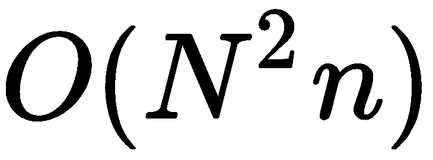</sub> 下降到 <sub>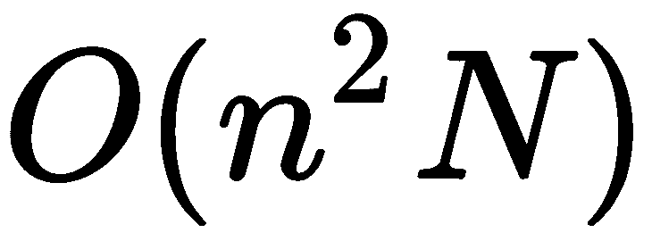</sub> ，距离矩阵的维数不超过百万分之一，而是根据项目(商品)的数量 100 乘以 100。

对产品接近度的估计比对用户接近度的评估要准确得多。这个假设是这样一个事实的直接结果，即用户通常比项目多得多，因此计算项目相关性的标准误差要小得多，因为我们有更多的信息可以利用。

在基于用户的版本中，对用户的描述通常分布非常稀疏(商品很多，但评价很少)。一方面，这有助于优化计算——我们只对存在交集的元素进行乘法运算。但是，另一方面，由于用户邻居(具有相似偏好的用户)数量有限，系统可以向用户推荐的项目列表很少。此外，用户偏好可能会随着时间的推移而改变，但商品的描述要稳定得多。

算法的其余部分几乎完全重复了基于用户的版本:它使用相同的余弦距离作为主要的接近度度量，并且对数据标准化有相同的需求。由于项目的相关性是在更高数量的观察中考虑的，因此在每次新评估后重新计算并不那么重要，这可以以批处理模式定期进行。

现在让我们看看另一种基于矩阵分解方法来概括用户兴趣的方法。

# 因子分解算法

用更广泛的特性来描述用户的兴趣是很好的——不是以*的格式，他们喜欢电影 X、Y 和 Z* ，而是以*的格式，他们喜欢浪漫喜剧片*。除了增加模型的可推广性之外，它还解决了具有大数据维度的问题——毕竟，兴趣不是由项目向量描述的，而是由明显更小的偏好向量描述的。

这种方法也被称为**频谱分解**或**高频滤波**(因为我们去除了噪声，留下了有用的信号)。代数中有很多不同类型的矩阵分解，最常用的一种叫做**奇异值分解** ( **SVD** )。

最初，SVD 方法用于选择意义相似但内容不相似的页面。最近，它开始在推荐中使用。该方法基于将原 *R* 评级矩阵分解为三个矩阵的乘积， <sub></sub> ，其中矩阵的大小为<sub>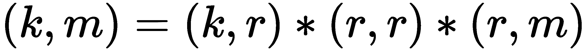</sub>*R***是分解的秩，是表征细节分解程度的参数。**

 **将这种分解应用于我们的偏好矩阵，我们可以得到以下两个因子矩阵(简要描述):

*   **U** :用户偏好的简洁描述。
*   **S** :产品特性的简洁描述。

重要的是，使用这种方法，我们不知道哪些特定特征对应于简化描述中的因素；对我们来说，它们是用一些数字编码的。因此，奇异值分解是一个未解释的模型。将因子矩阵相乘就足以获得偏好矩阵的近似值。通过这样做，我们获得了所有客户-产品对的评级。

这类算法的典型家族称为**非负矩阵分解** ( **NMF** )。通常，这种展开的计算在计算上非常昂贵。因此，在实践中，他们经常求助于他们的近似迭代变量。ALS 是一种流行的迭代算法，用于将偏好矩阵分解为两个矩阵的乘积:**用户因素(U)** 和**产品因素(I)** 。它的工作原理是最小化附加额定值上的**均方根误差** ( **RMSE** )。优化交替发生—首先是用户因素，然后是产品因素。此外，为了避免再培训，正则化系数被添加到 RMSE。

如果我们用包含用户或产品信息的新维度来补充偏好矩阵，那么我们就可以不用偏好矩阵，而是用张量。因此，我们使用更多的可用信息，并可能获得更准确的模型。

在这一节中，我们考虑了解决推荐系统任务的不同方法。现在，我们将讨论用户偏好相似性的估计方法。

# 相似性或偏好相关性

我们可以以不同的方式考虑两个用户偏好的相似性或相关性，但一般来说，我们需要比较两个向量。下面的列表显示了一些最流行的矢量比较方法。

# 皮尔逊相关系数

这个度量是一个经典的系数，在比较向量时非常适用。它的主要缺点是，当交叉点被估计为低时，相关性可能会很高。为了对抗偶然的高相关性，您可以乘以 50/min 的系数(50，等级交叉点)或任何其他阻尼系数，其影响随着估计数的增加而降低。这里显示了一个示例:

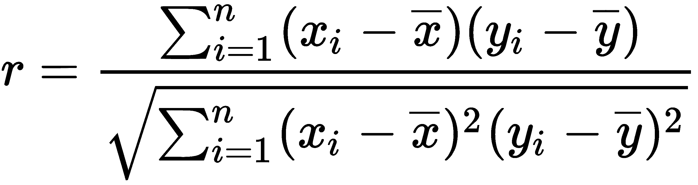

# 斯皮尔曼相关

与皮尔森的相关性相比，主要的区别是等级因素——也就是说，它不适用于评级的绝对值，而是它们的序列号。总的来说，这个结果非常接近皮尔森的相关性。这里显示了一个示例:


# 余弦距离

余弦距离是另一个经典的测量因素。如果你仔细看，标准化向量之间角度的余弦就是皮尔逊相关，同样的公式。这个距离使用余弦属性:如果两个向量是同向的(也就是说，它们之间的角度是 0)，那么它们之间的角度的余弦是 1。相反，垂直矢量之间角度的余弦为 0。这里显示了一个示例:

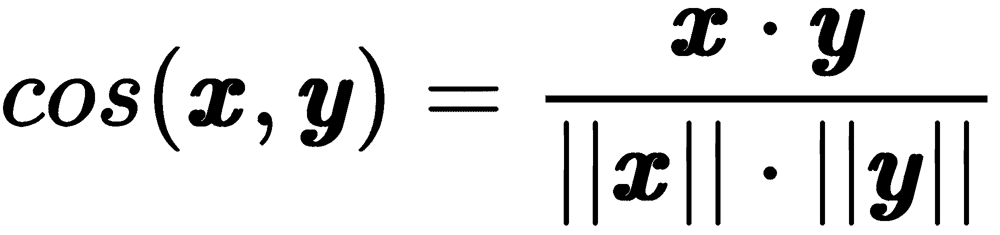

我们讨论了用户偏好相似性估计的方法。我们将讨论的下一个重要问题是用于推荐系统算法的数据准备。

# 数据缩放和标准化

所有用户对项目的评估(评级)都不同。如果有人把 5s 放在一行，与其等别人的 4s，不如先对数据进行归一化再计算——也就是把数据转换成单个尺度，这样算法就能正确地把结果相互比较。自然地，预测的估计然后需要通过逆变换转换成原始比例(并且，如果必要，四舍五入到最接近的整数)。

有几种方法可以标准化数据，详细如下:

*   **居中(平均居中)**:从用户评分中减去他们的平均评分。这种类型的标准化只与非二进制矩阵相关。
*   **标准化(z-score)** :除了居中之外，这个用用户的标准差来划分用户的评分。但是在这种情况下，在逆变换之后，评级可以超出等级(例如，五分制的六个等级)，但是这种情况非常罕见，并且可以通过四舍五入到最近的可接受估计值来解决。
*   **双标准化**:用户评分第一次标准化；第二次，按项目评分。

这些规范化技术的细节在 [第 2 章](02.html)*数据处理*中有描述。下一节将描述推荐系统的一个被称为**冷启动问题**的问题，该问题出现在系统工作的早期阶段，此时系统没有足够的数据进行预测。

# 冷启动问题

冷启动是一种典型的情况，此时还没有为推荐系统的正确操作积累足够多的数据(例如，当产品是新的或者只是很少购买)。如果只有三个用户的评分估计平均评分，这样的评估是不可靠的，用户明白这一点。在这种情况下，评级经常被人为调整。

第一种方法是不显示平均值，而是显示平滑平均值(阻尼平均值)。在评级数量较少的情况下，显示的评级更倾向于特定的安全*平均*指示器，并且一旦键入足够数量的新评级，*平均*调整就停止运行。

另一种方法是计算每个评级的置信区间。从数学上讲，我们的估计越多，平均值的变化就越小，因此，我们对其准确性就越有信心。

例如，我们可以显示区间下限(低**置信区间** ( **置信区间**)作为评级。与此同时，很明显，这样的系统相当保守，有低估新项目评级的趋势。

由于估计值被限制在一个特定的范围内(例如，从 0 到 1)，计算置信区间的常用方法在这里不太适用，这是由于分布尾部趋向于无穷大，以及区间本身的对称性。有一种更准确的方法来计算它——威尔逊置信区间。

冷启动问题也与非个性化推荐相关。这里的一般方法是用不同的试探法替换目前无法计算的部分——例如，用平均评级替换它，使用更简单的算法，或者在收集数据之前根本不使用产品。

当我们开发推荐系统时，应该考虑的另一个问题是推荐的相关性，它考虑了用户兴趣之外的因素——例如，它可以是出版物的新鲜度或用户的评分。

# 建议的相关性

在某些情况下，还必须考虑推荐的*新鲜度*。这种考虑对于论坛上的文章或帖子尤其重要。新鲜的参赛作品应该经常登上榜首。校正系数(阻尼系数)通常用于进行此类更新。以下公式用于计算媒体网站上文章的评分。

以下是*黑客*新闻杂志中的评分计算示例:


这里 *U* 表示上行票， *D* 表示表示下行票， *P* 表示表示罚款(为执行其他业务规则额外调整) *T* 表示记录时间。

以下等式显示了一个 *Reddit* 评级计算:


这里， *U* 表示上升票数， *D* 表示下降票数， *T* 表示记录时间。第一项评估记录的*质量，第二项对时间进行修正。*

没有通用的公式，每项服务都发明出最能解决其问题的公式；它只能通过经验来检验。

下一节将讨论测试推荐系统的现有方法。这不是一项简单的任务，因为在训练数据集中没有精确的目标值的情况下，通常很难估计推荐的质量。

# 评估系统质量

测试一个推荐系统是一个复杂的过程，总是会提出很多问题，主要是由于*质量*概念的模糊性。

一般来说，在机器学习问题中，有以下两种主要的测试方法:

*   使用追溯测试对历史数据进行离线模型测试
*   使用 A/B 测试来测试模型(我们运行几个选项，看看哪一个给出最好的结果)

在推荐系统的开发中，上述两种方法都得到了积极的应用。我们不得不面对的主要限制是，我们只能在用户已经评估或评级的产品上评估预测的准确性。标准的方法是交叉验证，使用**省去一个**和**省去一个**的方法。测试的多次重复和结果的平均化提供了更稳定的质量评估。

*省去一个*的方法使用在除一个项目之外的所有项目上训练并由用户评估的模型。该排除项目用于模型测试。对所有 *n* 项目执行此程序，并在获得的 *n* 质量评估中计算平均值。

*离开-p-out* 的方法是相同的，但是在每一步， <sub></sub> 点被排除在外。

我们可以将所有质量指标分为以下三类:

*   **预测精度**:估计预测评级的精度
*   **决策支持**:评估建议的相关性
*   **排名准确性指标**:评估发布的建议的排名质量

不幸的是，没有一个单一的推荐标准适用于所有场合，每个参与测试推荐系统的人都会选择它来满足他们的目标。

在下一节中，我们将形式化协同过滤方法，并展示其背后的数学原理。

# 了解协同过滤方法的详细信息

在这一节中，让我们形式化推荐系统问题。我们有一套用户、 <sub></sub> 、一套物品、 <sub>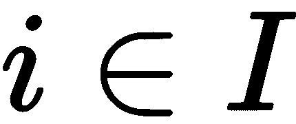</sub> (电影、曲目、产品等等)，还有一套预估、 <sub>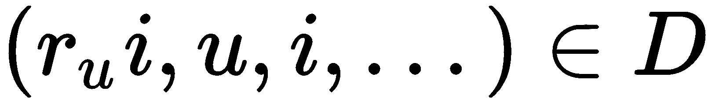</sub> 。每个评估由用户、对象、其结果以及可能的一些其他特征给出。

我们需要预测偏好如下:


我们需要预测个人推荐如下:


我们需要预测类似的物体，如下所示:

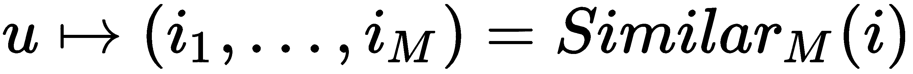

记住——协同过滤背后的主要思想是相似的用户通常喜欢相似的对象。让我们从最简单的方法开始，如下所示:

*   根据用户的 <sub></sub> 评分历史，选择一些用户相似度的条件度量。
*   将用户联合成组(集群)，这样相似的用户最终会在同一个集群中: <sub>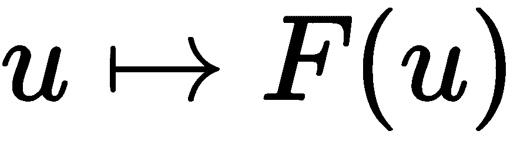。</sub>
*   将项目的用户评分预测为此对象的群集平均评分:


这个算法有几个问题，详细如下:

*   没有什么可以推荐给新用户或者非典型用户的。对于这样的用户，没有合适的具有相似用户的集群。
*   它忽略了每个用户的特殊性。从某种意义上说，我们将所有用户划分为类(模板)。
*   如果群集中没有人对该项目进行评级，预测将不起作用。

我们可以改进这种方法，用下面的公式代替硬聚类:


对于基于项目的版本，公式将是对称的，如下所示:

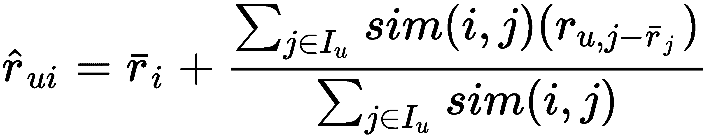

这些方法有以下缺点:

*   冷启动问题
*   对新的非典型用户或项目的不良预测
*   琐碎的建议
*   资源强度计算

为了克服这些问题，您可以使用奇异值分解。偏好(评分)矩阵可以分解为三个矩阵的乘积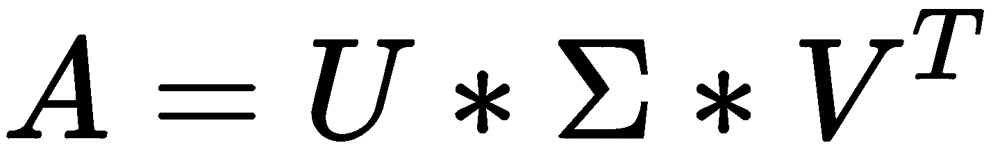。我们把前两个矩阵的乘积表示为一个矩阵，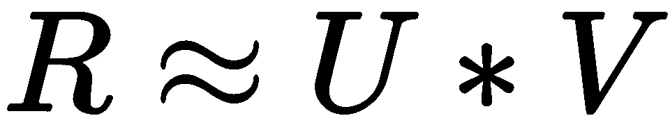，其中 *** R *** 为偏好矩阵， *** U *** 为用户参数矩阵， *** V *** 为项目参数矩阵。

为了预测用户***【U】***对某个项目的评分，我们对给定用户取向量 <sub>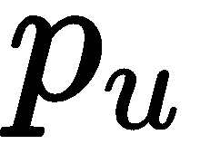</sub> (参数集)，对给定项目取向量 <sub>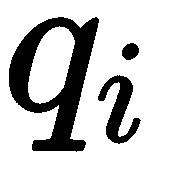</sub> 。他们的标量积就是我们需要的预测: <sub></sub> 。使用这种方法，我们可以通过用户历史来识别项目和用户兴趣的隐藏特征。例如，可能发生的情况是，在向量的第一坐标处，每个用户具有指示用户更可能是男孩还是女孩的数字，并且第二坐标是反映用户的近似年龄的数字。在项目中，第一个坐标显示的是男孩还是女孩更感兴趣，第二个坐标显示的是这个项目吸引的用户年龄组。

但是，也有几个问题。第一个是偏好矩阵***【R】***，我们并不完全知道，所以不能只取其 SVD 分解。其次，SVD 分解不是唯一的，所以即使我们找到至少一些分解，它也不太可能对我们的任务是最佳的。

在这里，我们需要机器学习。我们无法找到矩阵的奇异值分解，因为我们不知道矩阵本身。但是我们可以利用这个想法，提出一个类似于奇异值分解的预测模型。我们的模型依赖于许多参数——用户和项目的向量。对于给定的参数，为了预测估计，我们取用户向量，项目的向量，并得到它们的标量积， <sub>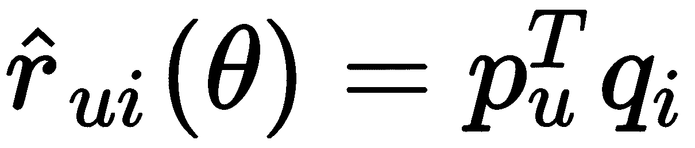</sub> 。但是由于我们不知道向量，它们仍然需要得到。这个想法是，我们有用户评级，我们可以用它来找到最佳参数，以便我们的模型可以使用以下等式尽可能准确地预测这些估计: <sub></sub> 。我们要找到这样的参数'***【θ】***，使平方误差尽可能小。我们也想以后少犯错误，但是不知道需要什么估计。因此，我们无法优化参数'***【θ】***。我们已经知道用户给出的评级，所以我们可以尝试根据我们已经有的估计来选择参数，以最小化误差。我们还可以添加另一个术语*正则化器*，如下所示:


需要正规化来打击过度拟合。要找到最佳参数，您需要优化以下函数:


有很多参数:对于每个用户，对于每个项目，我们有我们想要优化的向量。最广为人知的函数优化方法是**梯度下降** ( **GD** )。假设我们有一个由许多变量组成的函数，我们想要优化它。我们取一个初始值，然后看看我们可以移动到哪里来最小化这个值。GD 方法是一种迭代算法:它重复获取某个点的参数，查看梯度，并逆其方向步进，如下所示:


这种方法有几个问题:首先，它的工作速度非常慢；其次，它找到了局部的，而不是全局的最小值。第二个问题对我们来说并不坏，因为在我们的例子中，函数在局部极小值中的值接近全局最优值。

然而，GD 方法并不总是必要的。例如，如果我们需要计算抛物线的最小值，就没有必要用这种方法，因为我们精确地知道它的最小值在哪里。事实证明，我们试图优化的函数——误差平方和加上所有参数平方和——也是一个二次函数，非常类似于抛物线。对于每个特定的参数，如果我们固定所有其他参数，它只是一个抛物线。对于那些，我们至少可以精确地确定一个坐标。ALS 方法基于这一假设。我们交替地在一个或另一个坐标中精确地找到最小值，如下所示:


我们固定项目的所有参数，优化用户的参数，固定用户的参数，然后优化项目的参数。我们反复行动，如下所示:


这种方法运行速度相当快，您可以并行处理每一步。然而，隐式数据仍然存在问题，因为我们既没有完整的用户数据，也没有完整的项目数据。因此，我们可以惩罚更新规则中没有评级的项目。通过这样做，我们只依赖于那些有用户评级的项目，而不会对那些没有评级的项目做出任何假设。让我们定义一个权重矩阵如下:

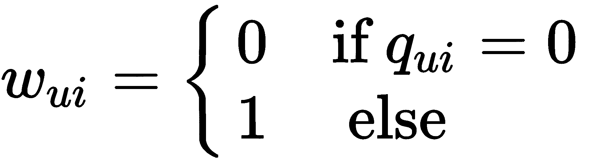

我们试图最小化的成本函数如下所示:


请注意，我们需要正则化项来避免过度拟合数据。因子向量的解如下:

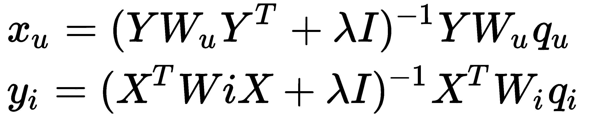

这里，和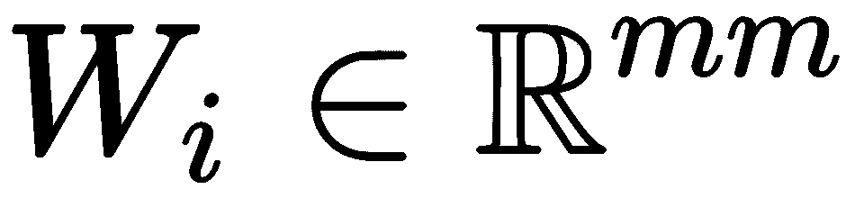是对角矩阵。

处理隐式数据的另一种方法是引入置信水平。让我们定义一组二元观察变量，如下所示:


现在，我们为每个定义置信水平。当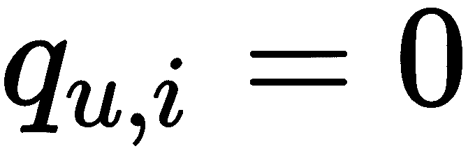的时候，我们信心低。原因可能是用户从未接触过该项目，或者该项目当时可能不可用。例如，这可以由用户为他人购买礼物来解释。因此，我们会有*低信心*。越大，我们就越有信心。例如，我们可以如下定义信心:

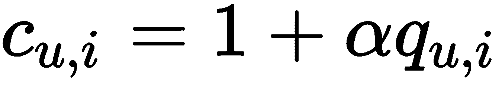

这里，是一个超参数，应该针对给定的数据集进行调整。更新后的优化函数如下:


是一个带数值 <sub></sub> 的对角矩阵。针对用户和项目评分的解决方案如下:

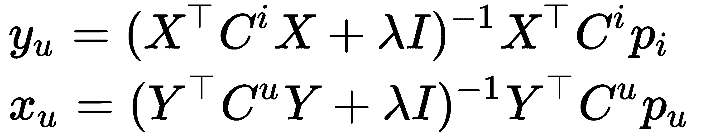

然而，计算 <sub></sub> 表达式是一个昂贵的计算问题。但是可以通过以下方式进行优化: <sub></sub> 。

这意味着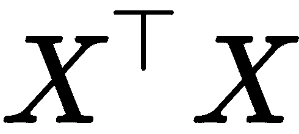可以在每个步骤预先计算， <sub></sub> 只有在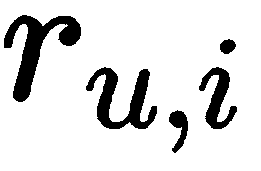为非零的地方才有非零条目。现在我们已经详细了解了协同过滤方法，接下来让我们通过考虑几个如何实现协同过滤推荐系统的例子来进一步了解它。

在接下来的章节中，我们将看看如何使用不同的 C++ 库来开发推荐系统。

# C++ 基于项目的协同过滤示例

让我们看看如何实现一个协同过滤推荐系统。作为本例的样本数据集，我们使用了明尼苏达大学计算机科学与工程系研究实验室的 GroupLens 提供的 MovieLens 数据集:[https://grouplens.org/datasets/movielens/](https://grouplens.org/datasets/movielens/)。他们提供了一个完整的数据集，有 2000 万的电影评分，一个较小的数据集用于教育，有 10 万的评分。我们建议从较小的开始，因为它允许我们更早地看到结果，更快地发现实现错误。

这个数据集由几个文件组成，但是我们只对其中的两个感兴趣: *ratings.csv* 和 *movies.csv* 。分级文件包含以下格式的行:用户标识、电影标识、分级和时间戳。在这个数据集中，用户按照 5 星标准进行评分，以半星为增量(0.5 星-5.0 星)。电影文件包含以下格式的行:电影标识、标题和流派。两个文件中的电影 ID 是相同的，所以我们可以看到用户正在对哪些电影进行评分。

# 使用特征库

对于第一个示例，让我们看看如何使用 ALS 和纯线性代数库作为后端来实现基于矩阵分解的协同过滤推荐系统。在下面的示例中，我们使用的是`Eigen`库。实现协同过滤推荐系统的步骤如下:

1.  首先，我们进行基本类型定义，如下所示:

```cpp
using DataType = float;
// using Eigen::ColMajor is Eigen restriction -  todense method always returns
// matrices in ColMajor order
using Matrix =
Eigen::Matrix<DataType, Eigen::Dynamic, Eigen::Dynamic, Eigen::ColMajor>;

using SparseMatrix = Eigen::SparseMatrix<DataType, Eigen::ColMajor>;

using DiagonalMatrix =
Eigen::DiagonalMatrix<DataType, Eigen::Dynamic, Eigen::Dynamic>;
```

2.  这些定义允许我们为矩阵类型编写更少的源代码，并快速改变浮点精度。然后，我们定义并初始化分级(首选项)矩阵、电影标题列表和二进制分级标志矩阵，如下所示:

```cpp
SparseMatrix ratings_matrix;  // user-item ratings
SparseMatrix p;               // binary variables
std::vector<std::string> movie_titles;
```

我们有一个特殊的助手函数`LoadMovies`，它将文件加载到地图容器中，如下面的代码片段所示:

```cpp
auto movies_file = root_path / "movies.csv";
auto movies = LoadMovies(movies_file);

auto ratings_file = root_path / "ratings.csv";
auto ratings = LoadRatings(ratings_file);
```

3.  加载数据后，我们用正确的大小初始化矩阵对象，如下所示:

```cpp
ratings_matrix.resize(static_cast<Eigen::Index>(ratings.size()),
                      static_cast<Eigen::Index>(movies.size()));
ratings_matrix.setZero();
p.resize(ratings_matrix.rows(), ratings_matrix.cols());
p.setZero();
movie_titles.resize(movies.size());
```

但是，因为我们已经将数据加载到地图中，我们需要将所需的评级值移动到矩阵对象中。

4.  因此，我们初始化电影标题列表，将用户标识转换为我们从零开始的顺序，并初始化二进制评分矩阵(这在处理隐式数据的算法中使用)，如下所示:

```cpp
Eigen::Index user_idx = 0;
for (auto& r : ratings) {
    for (auto& m : r.second) {
        auto mi = movies.find(m.first);
        Eigen::Index movie_idx = std::distance(movies.begin(), mi);
        movie_titles[static_cast<size_t>(movie_idx)] = mi->second;
        ratings_matrix.insert(user_idx, movie_idx) =
        static_cast<DataType>(m.second);
        p.insert(user_idx, movie_idx) = 1.0;
    }
    ++ user_idx;
}
ratings_matrix.makeCompressed();
```

5.  评级矩阵初始化后，我们定义并初始化我们的训练变量，如下所示:

```cpp
auto m = ratings_matrix.rows();
auto n = ratings_matrix.cols();

Eigen::Index n_factors = 100;
auto y = InitializeMatrix(n, n_factors);
auto x = InitializeMatrix(m, n_factors);
```

在前面的代码片段中，`y`矩阵对应用户偏好，`x`矩阵对应项目参数。此外，我们定义了分解后我们感兴趣的因素的数量。这些矩阵用随机值初始化并归一化。这种方法用于加速算法收敛，可以在下面的代码片段中看到:

```cpp
Matrix InitializeMatrix(Eigen::Index rows, Eigen::Index cols) {
    Matrix mat = Matrix::Random(rows, cols).array().abs();
    auto row_sums = mat.rowwise().sum();
    mat.array().colwise() /= row_sums.array();
    return mat;
}
```

6.  然后，我们定义并初始化正则化矩阵和单位矩阵，它们在所有学习周期中都是常数，如下所示:

```cpp
DataType reg_lambda = 0.1f;
SparseMatrix reg = (reg_lambda * Matrix::Identity(n_factors, n_factors)).sparseView();

// Define diagonal identity terms
SparseMatrix user_diag = -1 * Matrix::Identity(n, n).sparseView();
SparseMatrix item_diag = -1 * Matrix::Identity(m, m).sparseView();
```

7.  此外，因为我们实现了一个可以处理隐式数据的算法版本，所以我们需要将我们的评级矩阵转换为另一个视图，以降低计算复杂度。我们版本的算法需要形式的用户评分，并作为每个用户和项目的对角矩阵，这样我们就可以用相应的矩阵对象制作两个容器。这方面的代码可以在下面的块中看到:

```cpp
std::vector<DiagonalMatrix> user_weights(static_cast<size_t>(m));
std::vector<DiagonalMatrix> item_weights(static_cast<size_t>(n));
{
    Matrix weights(ratings_matrix);
    weights.array() *= alpha;
    weights.array() += 1;

    for (Eigen::Index i = 0; i < m; ++ i) {
        user_weights[static_cast<size_t>(i)] = 
            weights.row(i).asDiagonal();
    }
    for (Eigen::Index i = 0; i < n; ++ i) {
        item_weights[static_cast<size_t>(i)] = 
            weights.col(i).asDiagonal();
    }
}
```

现在，我们准备实施主要的学习循环。如上所述，ALS 算法可以很容易地并行化，因此我们使用`OpenMP`编译器扩展来并行计算用户和项目参数。

让我们定义主学习周期，它运行指定的迭代次数，如下所示:

```cpp
size_t n_iterations = 5;
for (size_t k = 0; k < n_iterations; ++ k) {
    auto yt = y.transpose();
    auto yty = yt * y;
    ...
    // update item parameters
    ...
    auto xt = x.transpose();
    auto xtx = xt * x;
    ...
    // update users preferences
    ...
    auto w_mse = CalculateWeightedMse(x, y, p, ratings_matrix, alpha);
}
```

下面的代码显示了如何更新项目参数:

```cpp
    #pragma omp parallel
    {
        Matrix diff;
        Matrix ytcuy;
        Matrix a, b, update_y;
        #pragma omp for private(diff, ytcuy, a, b, update_y)
        for (size_t i = 0; i < static_cast<size_t>(m); ++ i) {
            diff = user_diag;
            diff += user_weights[i];
            ytcuy = yty + yt * diff * y;
            auto p_val = p.row(static_cast<Eigen::Index>(i)).transpose();

            a = ytcuy + reg;
            b = yt * user_weights[i] * p_val;

            update_y = a.colPivHouseholderQr().solve(b);
            x.row(static_cast<Eigen::Index>(i)) = update_y.transpose();
        }
    }
```

下面的代码显示了如何更新用户的首选项:

```cpp
    #pragma omp parallel
    {
        Matrix diff;
        Matrix xtcux;
        Matrix a, b, update_x;
        #pragma omp for private(diff, xtcux, a, b, update_x)
        for (size_t i = 0; i < static_cast<size_t>(n); ++ i) {
            diff = item_diag;
            diff += item_weights[i];
            xtcux = xtx + xt * diff * x;
            auto p_val = p.col(static_cast<Eigen::Index>(i));

            a = xtcux + reg;
            b = xt * item_weights[i] * p_val;

            update_x = a.colPivHouseholderQr().solve(b);
            y.row(static_cast<Eigen::Index>(i)) = update_x.transpose();
        }
    }
```

我们有两个部分的循环体几乎是一样的，因为首先，我们用卷曲的用户选项更新项目参数，然后我们用卷曲的项目参数更新用户偏好。请注意，所有矩阵对象都被移出了内部循环体，以减少内存分配并显著提高程序性能。此外，请注意，我们分别并行化了用户和项目参数的计算，因为其中一个参数在另一个参数的计算过程中应该总是卷曲的。为了计算用户偏好和项目参数的精确值，我们使用以下公式:


*T5】X<sup>T</sup>XT9】和*T11】Y<sup>T</sup>YT15】每一步都是预计算。另外，注意这些公式是以线性方程组的形式表示的， ***X = AB*** 。我们使用`Eigen`库中的`colPivHouseholderQr`函数进行求解，得到用户和项目参数的精确值。这个线性方程组也可以用其他方法求解。选择`colPivHouseholderQr`函数是因为它在`Eigen`库实现中显示了更好的计算速度和精度比。**

为了估计我们系统的学习过程的进度，我们可以计算原始评级矩阵和预测评级矩阵之间的**均方误差** ( **均方误差**)。为了计算预测评级矩阵，我们定义了下一个函数，如下所示:

```cpp
Matrix RatingsPredictions(const Matrix& x, const Matrix& y) {
    return x * y.transpose();
}
```

为了计算均方误差，我们可以使用优化函数中的表达式，如下所示:

```cpp
DataType CalculateWeightedMse(const Matrix& x,
                              const Matrix& y,
                              const SparseMatrix& p,
                              const SparseMatrix& ratings_matrix,
                              DataType alpha) {
    Matrix c(ratings_matrix);
    c.array() *= alpha;
    c.array() += 1.0;

    Matrix diff(p - RatingsPredictions(x, y));
    diff = diff.array().pow(2.f);

    Matrix weighted_diff = c.array() * diff.array();
    return weighted_diff.array().mean();
}
```

请注意，我们必须使用权重和二进制评分来获得有意义的错误值，因为在学习过程中使用了类似的方法。直接误差计算会给出错误的结果，因为预测矩阵在原始评级矩阵为零的地方有非零预测。必须理解的是，该算法不学习评级的原始等级(从 0 到 5)，而是学习 0 到 1 范围内的预测值。它来自我们优化的函数，如下所示:


我们可以使用之前定义的电影列表来显示电影推荐。以下功能显示用户首选项和系统建议。为了识别用户喜欢什么，我们会显示用户评分值超过 3 的电影标题。我们显示系统评级等于或高于 0.8 评级系数的电影，通过运行以下代码来识别系统向用户推荐的电影:

```cpp
void PrintRecommendations(const Matrix& ratings_matrix,
                          const Matrix& ratings_matrix_pred,
                          const std::vector<std::string>& movie_titles) {
    auto n = ratings_matrix.cols();
    std::vector<std::string> liked;
    std::vector<std::string> recommended;
    for (Eigen::Index u = 0; u < 5; ++ u) {
        for (Eigen::Index i = 0; i < n; ++ i) {
            DataType orig_value = ratings_matrix(u, i);
            if (orig_value >= 3.f) {
                liked.push_back(movie_titles[static_cast<size_t>(i)]);
            }
            DataType pred_value = ratings_matrix_pred(u, i);
            if (pred_value >= 0.8f && orig_value < 1.f) {
                recommended.push_back(movie_titles[
                    static_cast<size_t>(i)]);
            }
        }
        std::cout << "\nUser " << u << " liked :";
        for (auto& l : liked) {
            std::cout << l << "; ";
        }
        std::cout << "\nUser " << u << " recommended :";
        for (auto& r : recommended) {
            std::cout << r << "; ";
        }
        std::cout << std::endl;
        liked.clear();
        recommended.clear();
    }
}
```

该功能可以如下使用:

```cpp
PrintRecommendations(ratings_matrix, RatingsPredictions(x, y), movie_titles);
```

# 使用 mlpack 库

`mlpack`库是一个通用的机器学习库，里面有很多不同的算法和命令行工具来处理数据和学习这些算法，而不需要显式编程。作为基础，该库使用`Armadillo`线性代数库进行数学计算。我们在前几章中使用的其他库没有协同过滤算法实现。

要加载`MovieLens`数据集，请使用与上一节相同的加载辅助函数。加载数据后，将其转换为适用于`mlpack::cf::CFType`类型对象的格式。这种类型实现了协同过滤算法，并且可以配置不同类型的矩阵分解方法。这种类型的对象可以使用密集和稀疏评级矩阵。在密集矩阵的情况下，它应该有三行。第一行对应用户，第二行对应项目，第三行对应评级。这种结构称为**坐标列表格式**。在稀疏矩阵的情况下，它应该是一个常规(用户、项目)表，就像前面的例子一样。所以，让我们定义分级的稀疏矩阵。它应该具有来自`Armadillo`库的`arma::SpMat<DataType>`类型，如以下代码块所示:

```cpp
 arma::SpMat<DataType> ratings_matrix(ratings.size(), movies.size());
 std::vector<std::string> movie_titles;
 {
     // fill matrix
     movie_titles.resize(movies.size());

     size_t user_idx = 0;
     for (auto& r : ratings) {
         for (auto& m : r.second) {
             auto mi = movies.find(m.first);
             auto movie_idx = std::distance(movies.begin(), mi);
             movie_titles[static_cast<size_t>(movie_idx)] = mi->second;
             ratings_matrix(user_idx, movie_idx) = 
                static_cast<DataType>(m.second);
         }
         ++ user_idx;
     }
 }
```

现在，我们可以初始化`mlpack::cf::CFType`类对象了。它取构造器中接下来的参数:评分矩阵、矩阵分解策略、邻居数、目标因子数、迭代次数、学习误差最小值，之后算法可以停止。

对于这个对象，只在***【H】***矩阵上做最近邻搜索。这意味着您可以避免计算完整的评级矩阵，使用以下观察:如果评级矩阵是 ***X = W H*** ，则适用以下情况:

```cpp
distance(X.col(i), X.col(j)) = distance(W H.col(i), W H.col(j))
```

这个表达式可以看作是在具有马氏距离的***【H】***矩阵上的最近邻搜索，如下面的代码块所示:

```cpp
 // factorization rank
 size_t n_factors = 100;
 size_t neighborhood = 50;

 mlpack::cf::NMFPolicy decomposition_policy;

 // stopping criterions
 size_t max_iterations = 20;
 double min_residue = 1e-3;

 mlpack::cf::CFType cf(ratings_matrix,
                        decomposition_policy,
                        neighborhood,
                        n_factors,
                        max_iterations,
                        min_residue);
```

请注意，作为分解策略，使用了`mlpack::cf::NMFPolicy`类型的对象。这是 ALS 方法的非负矩阵分解算法。`mlpack`库中有几种分解算法。例如，有一个在`mlpack::cf::BatchSVDPolicy`类型中实现的批量奇异值分解。这个对象的构造函数也进行完整的训练，所以在它的调用结束后，我们可以使用这个对象来获得推荐。推荐可以用`GetRecommendations`方法检索。此方法获取您想要获取的推荐数量、推荐的输出矩阵以及您想要从中获取推荐的用户的用户标识列表，如以下代码块所示:

```cpp
 arma::Mat<size_t> recommendations;
 // Get 5 recommendations for specified users.
 arma::Col<size_t> users;
 users << 1 << 2 << 3;

 cf.GetRecommendations(5, recommendations, users);

 for (size_t u = 0; u < recommendations.n_cols; ++ u) {
     std::cout << "User " << users(u) << " recommendations are: ";
     for (size_t i = 0; i < recommendations.n_rows; ++ i) {
         std::cout << movie_titles[recommendations(i, u)] << ";";
     }
     std::cout << std::endl;
 }
```

请注意，`GetRecommendations`方法返回项目标识作为其输出。因此，我们可以看到，使用这个库来实现一个推荐系统比从头开始编写要容易得多。此外，`mlpack`库中还有更多用于构建此类系统的配置选项；例如，我们可以配置邻居检测策略以及要使用的距离度量。这些配置可以显著提高您构建的系统的质量，因为您可以根据自己的特定任务进行配置。

# 摘要

在本章中，我们讨论了什么是推荐系统，以及目前存在的推荐系统类型。我们研究了构建推荐系统的两种主要方法:基于内容的推荐和协同过滤。我们确定了两种类型的协同过滤:基于用户的和基于项目的。我们研究了这些方法的实现，以及它们的优缺点。我们发现，推荐系统实现中的一个重要问题是数据量和相关算法的巨大计算复杂度。我们考虑了克服计算复杂性问题的方法，如部分数据更新和近似迭代算法，如 ALS。我们发现矩阵分解有助于解决数据不完整的问题，提高模型的可推广性，并加快计算速度。同时，我们实现了一个基于线性代数库和使用`mlpack`通用机器学习库的协同过滤系统。

看看自动编码器、可变自动编码器或应用于推荐系统任务的深度协作方法等新方法是有意义的。在最近的研究论文中，这些方法显示出比经典方法如 ALS 更令人印象深刻的结果。所有这些新方法都是非线性模型，因此它们有可能超越线性因子模型的有限建模能力。

在下一章中，我们将讨论集成学习技术。这些类型技术的主要思想是组合不同类型的机器学习算法或使用一组同类算法来获得更好的预测性能。将多个算法组合在一个集成中，可以让我们获得每个算法的最佳特性，从而弥补单个算法的不足。

# 进一步阅读

*   隐式反馈数据集的协同过滤:[http://yifanhu.net/PUB/cf.pdf](http://yifanhu.net/PUB/cf.pdf)
*   使用交替最小二乘法的协同过滤:[http://danielnee . com/2016/09/协同过滤-使用交替最小二乘法/](http://danielnee.com/2016/09/collaborative-filtering-using-alternating-least-squares/)
*   ALS 隐式协同过滤:[https://medium . com/radon-dev/ALS-隐式-协同过滤-5ed653ba39fe](https://medium.com/radon-dev/als-implicit-collaborative-filtering-5ed653ba39fe)
*   协同过滤:[https://data sciencemadesimpler . WordPress . com/tag/交替-最小二乘/](https://datasciencemadesimpler.wordpress.com/tag/alternating-least-squares/)
*   `mlpack`图书馆官方网站:[https://www.mlpack.org/](https://www.mlpack.org/)
*   `Armadillo`图书馆官方网站:[http://arma.sourceforge.net/](http://arma.sourceforge.net/)
*   *协同过滤的可变自动编码器，*作者:梁大文、胡尔·克里希南、马修·霍夫曼和托尼·耶巴拉:[https://arxiv.org/abs/1802.05814](https://arxiv.org/abs/1802.05814)
*   *基于深度学习的推荐系统:一个调查和新的视角，，，，孙，易泰:《T3》*
*   *为协同过滤训练深度自动编码器，*由奥莱克西·库恰耶夫和鲍里斯·金斯伯格:[https://arxiv.org/abs/1708.01715](https://arxiv.org/abs/1708.01715)**