# 十、用于图像分类的神经网络

近年来，我们看到了对神经网络的巨大兴趣，神经网络被成功地应用于各个领域——商业、医学、技术、地质、物理等等。神经网络已经在任何需要解决预测、分类或控制问题的地方得到应用。从直观的角度来看，这种方法很有吸引力，因为它基于人类神经系统的简化生物模型。它源于人工智能领域的研究，即试图通过模拟大脑的低级结构来再现生物神经系统学习和纠正错误的能力。神经网络是令人信服的建模方法，允许我们重现极其复杂的依赖关系，因为它们是非线性的。与其他不允许对大量变量进行依赖建模的方法相比，神经网络也能更好地应对维数灾难。

在本章中，我们将了解人工神经网络的基本概念，并向您展示如何用不同的 C++ 库实现神经网络。我们还将研究多层感知器和简单卷积网络的实现，并了解什么是深度学习及其应用。

本章将涵盖以下主题:

*   神经网络综述
*   深入研究卷积网络
*   什么是深度学习？
*   使用 C++ 库创建神经网络的示例
*   使用 LeNet 架构理解图像分类

The code files for this chapter can be found at the following GitHub repo: [https://github.com/PacktPublishing/Hands-On-Machine-Learning-with-CPP/tree/master/Chapter10](https://github.com/PacktPublishing/Hands-On-Machine-Learning-with-CPP/tree/master/Chapter10)

# 技术要求

您将需要以下技术要求来完成本章:

*   `Dlib`库
*   `Shogun`库
*   `Shark-ML`库
*   PyTorch 库
*   支持 C++ 17 的现代 C++ 编译器
*   CMake 构建系统版本> = 3.8

# 神经网络综述

在本节中，我们将讨论什么是人工神经网络及其构建模块。我们将学习人工神经元是如何工作的，以及它们与生物类似物之间的关系。我们还将讨论如何用反向传播方法训练神经网络，以及如何处理过拟合问题。

神经网络是由突触相互连接的神经元序列。神经网络的结构是直接从生物学进入编程世界的。由于这种结构，计算机具有分析甚至记忆信息的能力。换句话说，神经网络是基于人脑的，人脑包含数百万个以电脉冲形式传递信息的神经元。

人工神经网络受到生物学的启发，因为它们由功能与生物神经元相似的元素组成。这些元素可以以对应于大脑解剖结构的方式组织起来，它们展示了大脑固有的大量特性。例如，他们可以从经验中学习，将以前的先例推广到新的案例，并从包含冗余信息的输入数据中识别重要特征。

现在，让我们了解单个神经元的过程。

# 神经元

**生物神经元**由一个身体和连接身体与外界的过程组成。神经元接受刺激的过程称为**树突**。神经元传递兴奋的过程被称为“T4”轴突“T5”。每个神经元只有一个轴突。树突和轴突有相当复杂的分支结构。轴突和树突的连接被称为**突触**。神经元的主要功能是将兴奋从树突转移到轴突。但是来自不同树突的信号会影响轴突中的信号。如果总激励超过某个极限值，神经元就会发出信号，该极限值在一定范围内变化。如果信号没有发送到轴突，神经元对兴奋没有反应。神经元接收的信号强度(因此激活可能性)强烈依赖于突触活动。突触是传递这种信息的接点。每个突触都有一个长度，特殊的化学物质沿着它传递信号。这个基本电路有许多简化和例外，但大多数神经网络都是根据这些简单的特性来建模的。

人工神经元接收一组特定的信号作为输入，每一个信号都是另一个神经元的输出。每个输入都乘以相应的权重，这相当于它的突触功率。然后，将所有乘积求和，并将求和结果用于确定神经元激活水平。下图显示了一个演示这一思想的模型:


这里，由 <sub>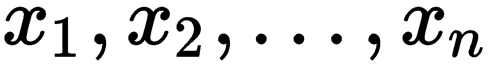</sub> 表示的一组输入信号进入人工神经元。这些输入信号对应于到达生物神经元突触的信号。每个信号乘以相应的权重， <sub></sub> ，并传递到求和块。每个重量对应一个生物突触连接的强度。求和块对应于生物神经元的主体，用代数方法组合加权输入。

<sub></sub> 信号被称为偏差，显示极限值的功能，称为偏移。这个信号允许我们改变激活功能的来源，这随后导致神经元学习速度的提高。偏置信号被加到每个神经元上。它像所有其他权重一样学习，除了它连接到信号 **+1** ，而不是前一个神经元的输出。接收信号由激活功能 **f** 处理，并给出神经信号 **y** 作为输出。激活功能是标准化输入数据的一种方式。它缩小了**和**的范围，使 **f(和)**的值属于特定区间。也就是说，如果我们有一个很大的输入数，通过激活函数传递它可以得到所需范围内的输出。有许多激活功能，我们将在本章后面详细介绍。为了了解更多关于神经网络的知识，我们将看一看它们的一些组成部分。

# 感知器和神经网络

人工神经网络的首次出现可以追溯到 1943 年由*沃伦·麦卡洛克*和*沃尔特·皮茨*发表的文章*神经活动内在思想的逻辑演算*。他们提出了人工神经元的早期模型。 *Donald Hebb* 在他 1949 年的著作*行为的组织*中，描述了神经元训练的基本原理。这些想法是几年后由美国神经生理学家弗兰克·罗森布拉特提出的。罗森布拉特于 1957 年发明了感知器，作为人脑信息感知的数学模型。这个概念最早是在 1960 年在一台 **Mark-1 电子机器**上实现的。

罗森布拉特提出并证明了**感知器收敛定理**(在 Blok、Joseph、Kesten 和其他与他合作的研究者的帮助下)。它表明，通过纠错训练的初级感知器，无论权重系数和序列刺激的初始状态如何，总能在有限的时间内得到解决方案。罗森布拉特还提出了一些相关定理的证据，表明哪些条件应该对应于人工神经网络的架构，以及它们是如何训练的。罗森布拉特还表明，感知器的架构足以获得任何可能的分类任务的解决方案。

这意味着感知器是一个*通用系统*。罗森布拉特本人确定了三层感知器(由一个 S 层、一个 A 层和一个 R 层组成)的两个基本限制:它们缺乏在新刺激或新情况下概括其特征的能力，以及它们无法处理复杂情况的事实，从而将它们分成更简单的任务。

在 1969 年神经网络日益流行的背景下，马文·明斯基和西蒙·派珀特出版了一本书，展示了感知器的基本局限性。他们表明感知器基本上不能执行许多重要的功能。而且当时并行计算的理论发展很差，感知器完全符合这个理论的原理。总的来说，明斯基在与不变表示相关的某些问题类别中展示了顺序计算优于并行计算的优势。他还证明，在解决与预测相关的问题时，感知器并不具有优于分析方法(例如统计方法)的功能优势。一些原则上可以由感知器解决的任务需要很长时间或大量的内存来解决。这些发现导致人工智能研究人员重新定位到符号计算领域，这是神经网络的对立面。此外，由于数学研究感知器的复杂性和缺乏普遍接受的术语，出现了各种不准确和误解。

随后，对神经网络的兴趣又恢复了。1986 年，大卫·鲁梅尔哈特、韩丁和罗纳德·威廉姆斯重新发现并发展了误差反向传播方法，使有效解决多层网络训练问题成为可能。这种训练方法早在 1975 年由 Verbos 开发，但当时并没有得到足够的重视。20 世纪 80 年代初，各种科学家聚集在一起研究并行计算的可能性，并对基于神经网络的认知理论表现出兴趣。因此，霍普菲尔德为人工神经系统的使用奠定了坚实的理论基础，并以所谓的霍普菲尔德网络为例。在网络的帮助下，他证明了人工神经系统可以成功地解决广泛的问题。影响对人工神经网络兴趣复苏的另一个因素是在符号计算领域缺乏重大成功。

目前使用的术语有**单层感知器(SLP)** (或者只是感知器)和**多层感知器(MLP)** 等。通常，感知器中的各层之下是一系列神经元，它们位于同一层且不相连。下图显示了这个模型:


通常，我们可以区分以下类型的神经网络层:

*   **输入**:这只是作为系统(模型)输入到达的源数据或信号。例如，这些可以是训练集中特定向量的单个分量，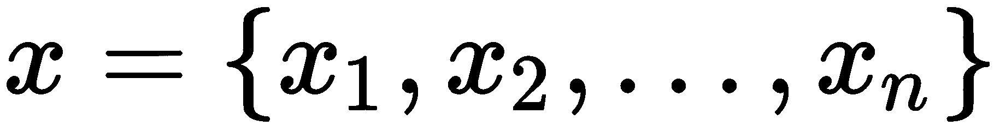。
*   **隐藏**:这是位于输入层和输出层之间的一层神经元。可以有多个隐藏层。
*   **输出**:这是聚合模型工作的最后一层神经元，它的输出作为模型工作的结果。

术语单层感知器通常被理解为由输入层和聚集该输入数据的人工神经元组成的模型。这个术语有时与术语*罗森布拉特的感知器*一起使用，但这并不完全正确，因为罗森布拉特使用了一个随机过程来建立输入数据和神经元之间的连接，以将数据转移到不同的维度，这使得解决线性不可分离数据分类时出现的问题成为可能。在罗森布拉特的工作中，感知器由 *S* 和 *A* 神经元类型和 *R* 加法器组成。 *S* 神经元为输入层， *A* 神经元为隐藏层， *R* 神经元生成模型的结果。术语的模糊性是因为权重仅用于 *R* 神经元，而恒定权重用于 *S* 和 *A* 神经元类型之间。然而，请注意，这些类型的神经元之间的连接是根据特定的随机过程建立的:

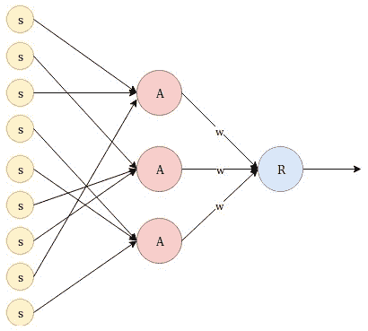

Rosenblatt perceptron

术语 MLP 指的是由输入层、一定数量的隐藏神经元层和输出层组成的模型。这可以在下图中看到:

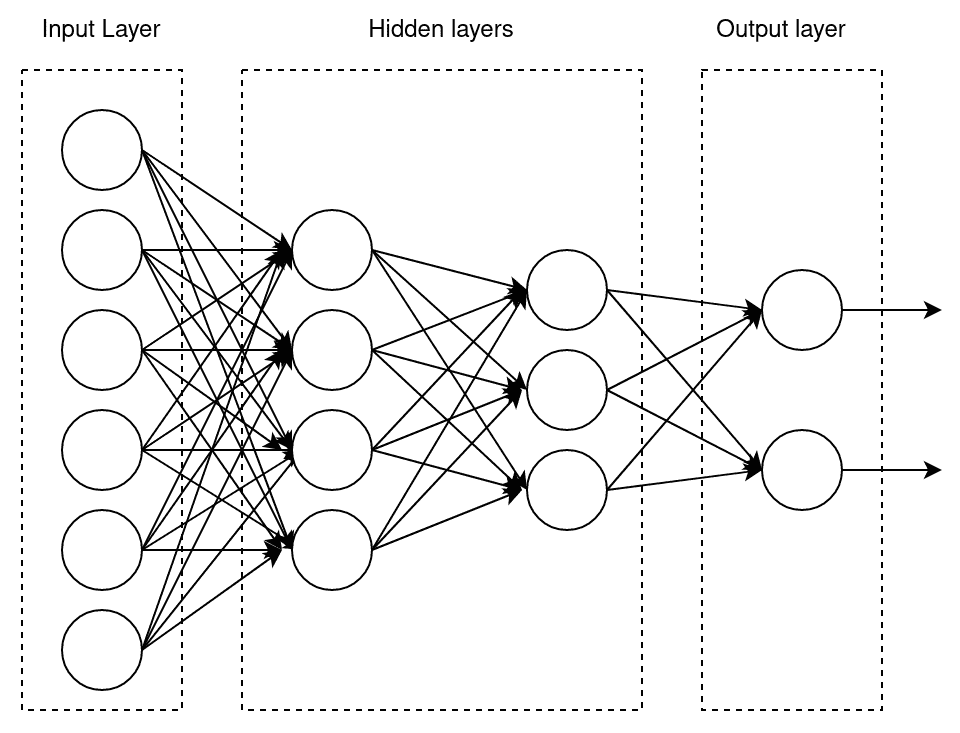

还应该注意，感知器(或神经网络)的结构包括信号传播发生的方向。在前面的例子中，所有的通信都严格地从输入神经元指向输出神经元——这被称为前馈网络。其他网络架构也可以包括神经元之间的反馈。

在感知器的架构中，我们需要注意的第二点是神经元之间的连接数量。在上图中，我们可以看到一层中的每个神经元连接到下一层中的所有神经元——这被称为**全连接层**。这样的连接不是必须的，但是我们可以在*罗森布拉特感知器*方案中看到一个具有不同类型连接的层的例子。

现在，让我们学习如何训练人工神经网络。

# 用反向传播法训练

让我们考虑一下用来训练前馈神经网络的最常见的方法:*误差反向传播法*。它与监督方法有关。因此，它需要训练示例中的目标值。

该算法的思想是基于使用神经网络的输出误差。在算法的每次迭代中，都有两次网络传递——向前和向后。在前向通路上，输入向量从网络输入传播到其输出，并形成对应于权重的当前(实际)状态的特定输出向量。然后，计算神经网络误差。在反向传递中，该误差从网络输出传播到其输入，并且神经元权重被校正。

用来计算网络误差的函数叫做*损失函数*。这种函数的一个例子是实际值和目标值之差的平方:


这里， *k* 是网络中输出神经元的数量， *y'* 是目标值， *y* 是实际输出值。算法是迭代的，采用*分步*训练的原理；在将一个训练示例提交给其输入之后，调整网络神经元的权重。在向后传递中，该误差从网络输出传播到其输入，以下规则校正神经元的权重:

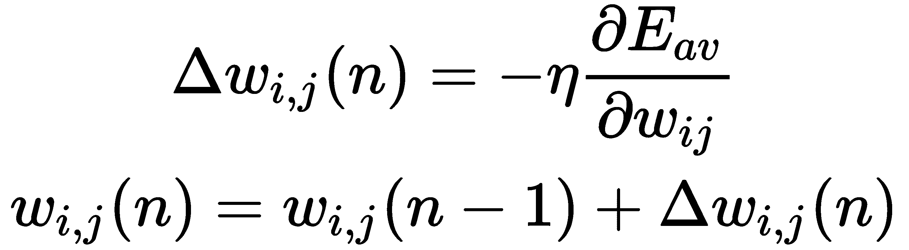

这里，是神经元的连接的权重，是允许我们控制校正步长值的学习速率参数，。为了精确地调整到最小误差，这是在学习过程中通过实验选择的(它在 0 到 1 的范围内变化)。是算法的层次数(即步数)。假设 *** i *** <sup>th</sup> 神经元的输出和如下:

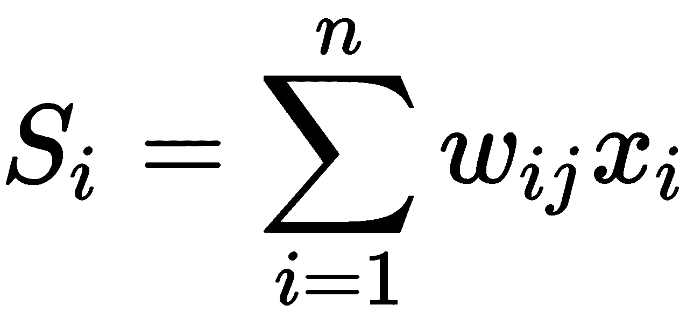

由此，我们可以展示以下内容:


在这里，我们可以看到，网络神经元激活功能的微分*f(s)*，在任何一点都必须存在且不等于零；也就是说，激活函数在整个数值轴上必须是可微的。因此，为了应用反向传播方法，通常使用乙状线激活函数，例如逻辑或双曲正切。

在实践中，直到网络被精确地调谐到误差函数的最小值，训练才继续，直到达到足够精确的近似。这个过程允许我们减少学习迭代的次数，防止网络过度拟合。

目前，已经对反向传播算法进行了许多修改。让我们来看看其中的一些。

# 反向传播方法模式

反向传播方法有三种主要模式:

*   随机的
*   一批
*   小批量

让我们看看这些模式是什么，它们之间有什么不同。

# 随机模式

在随机模式下，该方法在计算一个训练样本的网络输出之后立即引入对权重系数的修正。

随机方法比批量方法慢。假设它不执行精确的梯度下降，而是使用未开发的梯度引入一些*噪声*，它可以摆脱局部最小值并产生更好的结果。在处理大量训练数据时也更容易应用。

# 成批处理方式

对于梯度下降的批处理模式，对所有可用的训练样本立即计算损失函数，然后通过误差反向传播方法引入神经元权重系数的修正。

批处理方法比随机模式更快、更稳定，但容易停止并陷入局部极小值。此外，当它需要训练大量数据时，它需要大量的计算资源。

# 小批量模式

在实践中，小批量经常被用作妥协。在处理几个训练样本(小批量)后，调整权重。这比随机下降要少，但比批处理模式要多。

现在我们已经了解了主要的反向传播训练模式，让我们来讨论反向传播方法的问题。

# 反向传播方法问题

尽管小批量方法不是通用的，但它目前很普遍，因为它提供了计算可扩展性和学习有效性之间的折衷。它也有个别的缺陷。它的大部分问题来自无限长的学习过程。在复杂的任务中，训练网络可能需要几天甚至几周的时间。此外，在训练网络时，由于校正，权重的值会变得很大。这个问题会导致这样一个事实，即在损失函数的导数非常小的区域，所有或大多数神经元开始以巨大的值运行。因为在学习过程中返回的误差与这个导数成正比，所以学习过程实际上会冻结。

梯度下降法可以陷入局部极小值而不达到全局极小值。误差反向传播方法使用一种梯度下降；也就是说，它沿着误差面下降，不断调整权重，直到它们达到最小值。复杂网络的误差表面是崎岖不平的，由高维空间中的山丘、山谷、褶皱和沟壑组成。当附近有更深的最小值时，网络可能会陷入局部最小值。在局部极小点，所有方向都向上，网络无法脱离它。训练神经网络的主要困难归结于用于退出局部极小值的方法:每次我们离开局部极小值时，用相同的方法搜索下一个局部极小值，从而反向传播误差，直到不再可能找到摆脱它的方法。

对收敛性证明的仔细分析表明，权重修正被认为是无穷小的。这个假设在实践中是不可行的，因为它会导致无限的学习时间。步长应作为最终尺寸。如果步长固定且很小，那么收敛会太慢，而如果步长固定且太大，那么会出现瘫痪或永久不稳定。今天，已经开发了许多使用可变校正步长的优化方法。它们根据学习过程调整步长(这种算法的例子包括 Adam、Adagrad、RMSProp、Adadelta 和内斯特罗夫加速梯度)。

请注意，存在网络过度拟合的可能性。神经元太多，网络概括信息的能力就会丧失。网络可以学习为训练提供的一整套样本，但是任何其他图像，甚至非常相似的图像，都可能被错误地分类。为了防止这个问题，我们需要使用正则化，并在设计我们的网络架构时注意这一点。

# 反向传播法——一个例子

为了理解反向传播方法是如何工作的，让我们看一个例子。

我们将为所有表达式元素引入以下索引:是层的索引，是层中神经元的索引，是当前元素或连接的索引(例如，权重)。我们使用这些索引如下:


这个表达式应该理解为层中神经元的元素。

假设我们有一个由三层组成的网络，每层包含两个神经元:

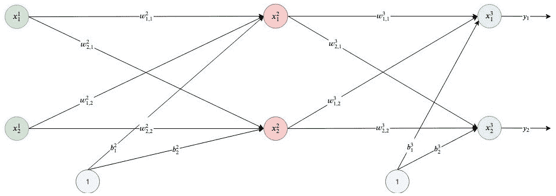

作为损失函数，我们选择实际值和目标值之差的平方:


这里，是网络输出的目标值，是网络输出层的实际结果，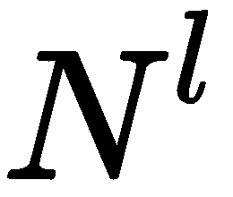是输出层的神经元数量。

该公式计算层中神经元的输出和:


这里，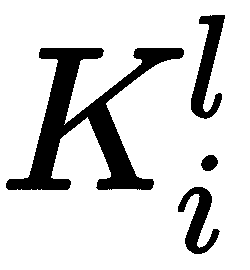是特定神经元的输入数，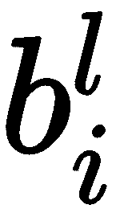是特定神经元的偏置值。

例如，对于第二层的第一个神经元，它等于:

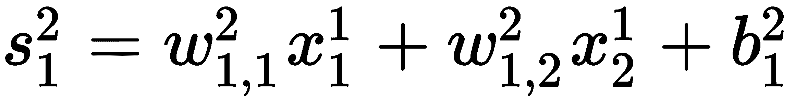

不要忘记第一层不存在权重，因为该层仅代表输入值。

决定神经元输出的激活函数应为 sigmoid，如下所示:


它的属性以及其他激活函数将在本章后面讨论。相应地，***I<sup>th</sup>T4***神经元中的***l***<sup xmlns:epub="http://www.idpf.org/2007/ops">***th***</sup>层(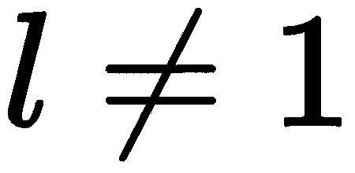)等于如下:

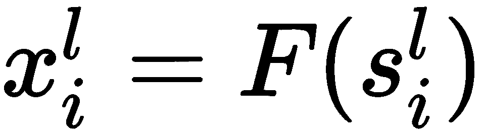

现在，我们实现随机梯度下降；也就是说，我们在每个训练示例之后校正权重，并在多维权重空间中移动。为了使误差最小，我们需要向与梯度相反的方向移动。我们必须根据相应的输出为每个权重添加纠错。下面的公式显示了我们如何计算关于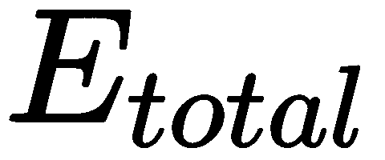输出的误差校正值:


现在我们有了误差校正值的公式，我们可以为权重更新编写一个公式:


这里，- <sub></sub> 是一个学习率值。

误差相对于权重的偏导数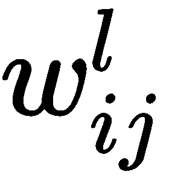使用链式法则计算，该法则应用两次。注意只影响误差之和，:

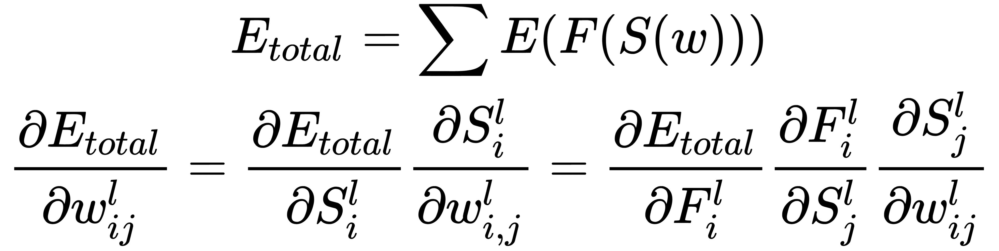

我们从输出层开始，推导出一个用于计算权重修正的表达式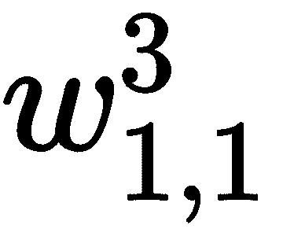。为此，我们必须按顺序计算分量。考虑如何计算我们网络的误差:

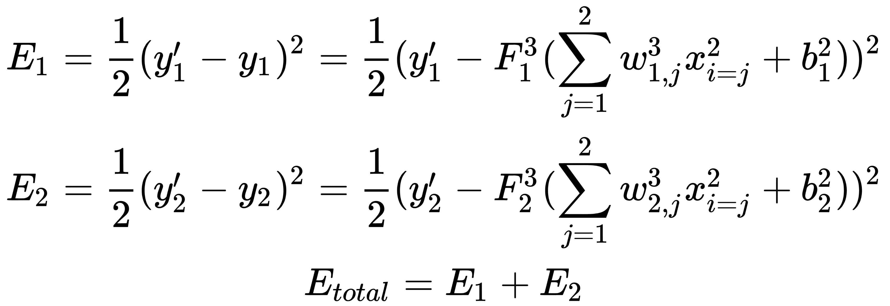

这里我们可以看到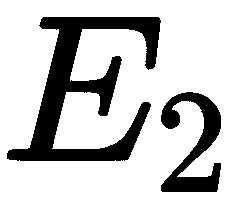并不依赖于的重量。它相对于这个变量的偏导数等于:


然后，通用表达式更改为遵循下一个公式:

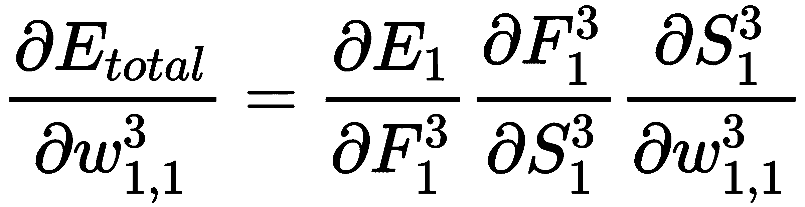

表达式的第一部分计算如下:

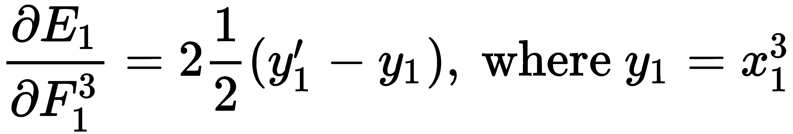

乙状结肠的导数分别是 <sub></sub> 。对于表达式的第二部分，我们得到如下结果:


第三部分是和的偏导数，计算如下:


现在，我们可以将所有东西组合成一个公式:


为了计算输出层所有权重的误差校正，我们还可以推导出一个通用公式:


这里，是网络输出层的索引。

现在，我们可以考虑如何对网络的内部(隐藏)层进行相应的计算。我们以重量为例，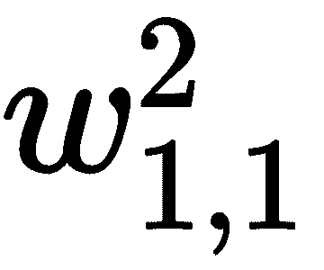。这里，方法是相同的，但有一个显著的区别——隐藏层神经元的输出被传递给输出层所有(或几个)神经元的输入，这一点必须考虑在内:

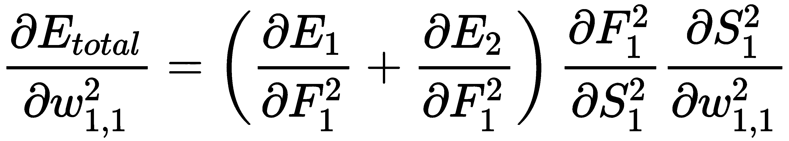


在这里，我们可以看到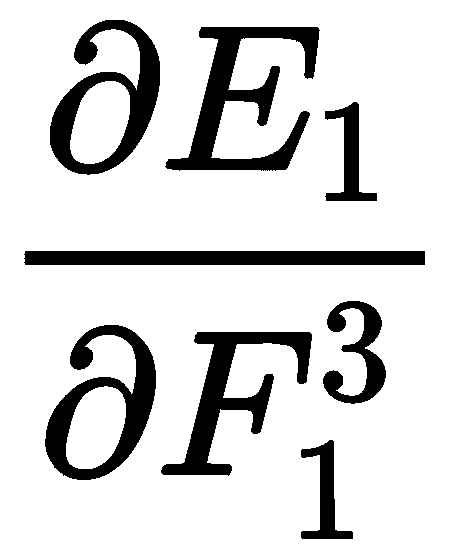和已经在上一步中计算过了，我们可以使用它们的值来执行计算:

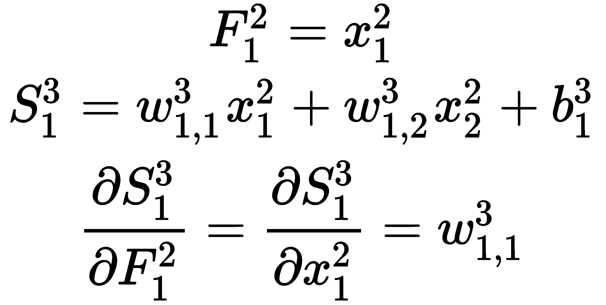

通过组合获得的结果，我们得到以下输出:


同样，我们可以使用前面步骤–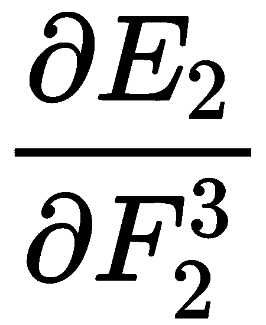和中计算的值来计算总和的第二个分量:


权重修正表达式的剩余部分<sub></sub>的获得如下，类似于输出层权重的表达式获得方式:

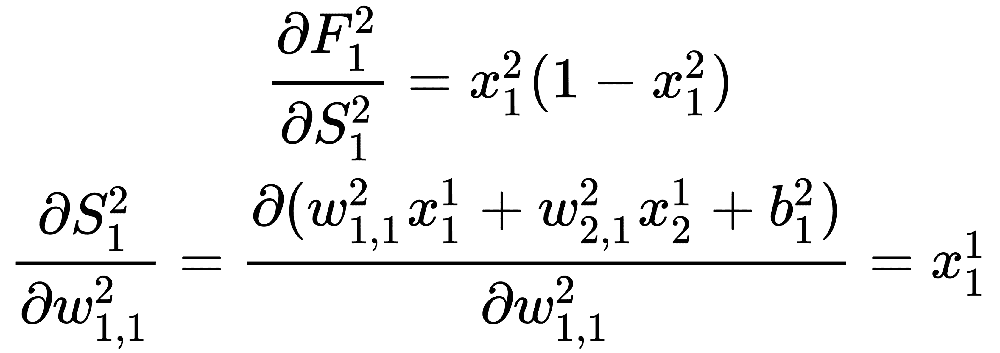

通过组合所获得的结果，我们获得了一个通用公式，我们可以使用它来计算隐藏层的权重调整的幅度:


这里， <sub xmlns:epub="http://www.idpf.org/2007/ops">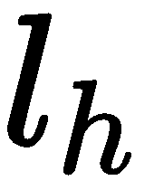</sub> 是隐藏层的指数， <sub xmlns:epub="http://www.idpf.org/2007/ops">是
层中的神经元数量，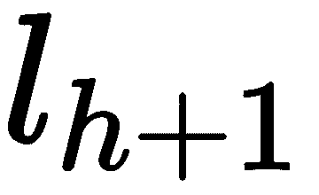。</sub>

现在，我们有了所有必要的公式来描述误差反向传播算法的主要步骤:

1.  用小的随机值初始化所有权重，(初始化过程将在后面讨论)。
2.  对所有训练样本或小批量样本按顺序重复几次:

1.  将训练样本(或小批量样本)传递给网络输入，计算并记住神经元的所有输出。这些计算了我们激活函数的所有和值。
2.  计算输出层所有神经元的误差:


3.  对于所有 ***l*** 层上的每个神经元，从倒数第二层开始，计算误差:

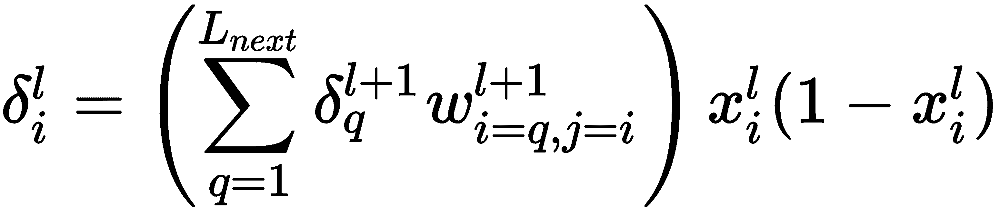

这里， ***L <sub>接下来是</sub>*** 中 ***l + 1*** 层的神经元数量。

4.  更新网络权重:

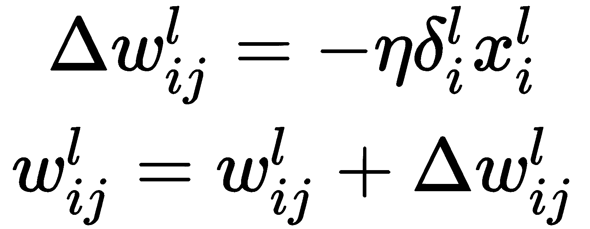

这里， <sub></sub> 是学习率值。

有许多版本的反向传播算法可以提高算法的稳定性和收敛速度。最早提出的改进之一是使用动量。在每一步，值被记忆，在下一步，我们使用当前梯度值和前一个的线性组合:

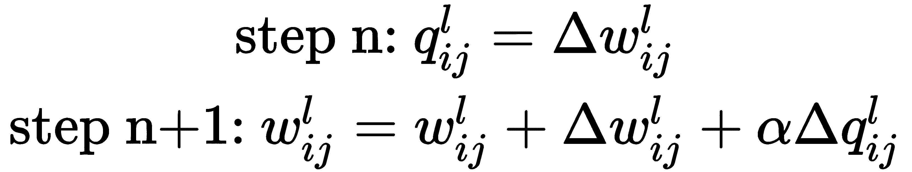

是用于额外算法调整的超参数。这个算法现在比原来的版本更常见，因为它允许我们在训练过程中获得更好的结果。

用于训练神经网络的下一个重要元素是损失函数。

# 损失函数

通过损失函数，神经网络训练被简化为优化选择权重矩阵的系数以使误差最小的过程。这个函数应该对应于任务，例如，分类问题的分类交叉熵或回归的差的平方。如果用反向传播法训练网络，可微性也是损失函数的一个基本性质。让我们看看神经网络中常用的一些损失函数:

*   **均方误差(MSE)** 损失函数广泛用于回归和分类任务。分类器可以预测连续的分数，这些分数是中间结果，作为分类过程的最后一步，它们只被转换成类别标签(通常通过阈值)。可以使用这些连续分数而不是类别标签来计算均方误差。这样做的好处是，我们避免了由于二分法而丢失信息。均方误差损失函数的标准形式定义如下:


*   **对数均方误差(MSLE)** 损失函数是均方误差的一种变体，定义如下:

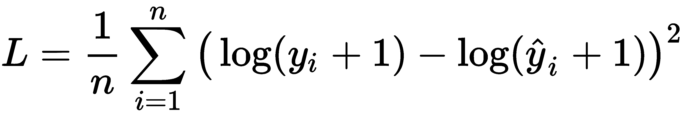

通过记录预测和目标值，我们测量的方差已经改变。当预测值和实际值都是大数字时，当我们不想惩罚预测值和目标值之间的巨大差异时，通常会使用它。此外，MSLE 惩罚低估多于高估。

*   **L2** 损失函数是实际值和目标值之差的 L2 范数的平方。其定义如下:


*   **平均绝对误差(MAE)** 损失函数用于衡量预测或预测与最终结果的接近程度:


MAE 需要复杂的工具，如线性规划来计算梯度。MAE 比 MSE 对异常值更稳健，因为它不利用平方。

*   **L1** 损失函数是实际值和目标值之差的绝对误差之和。类似于 MSE 和 L2 之间的关系，L1 在数学上类似于 MAE，除了它没有被 ***n*** 划分。其定义如下:

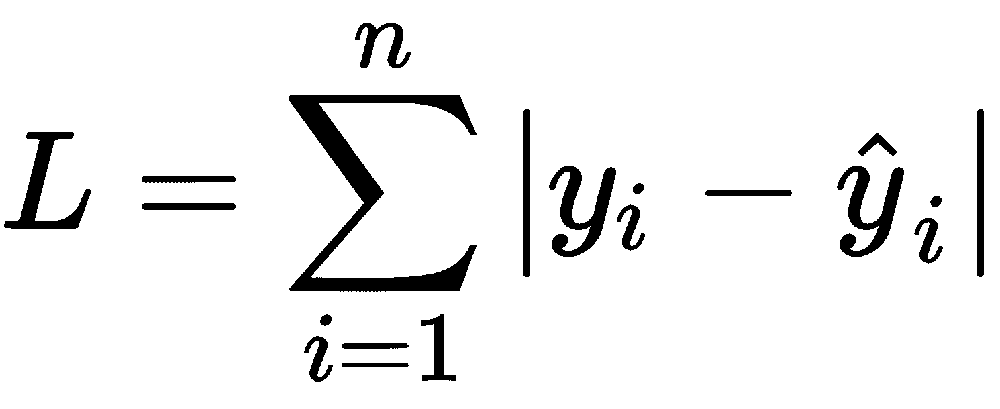

*   **交叉熵**损失函数通常用于假设标签取值为 0 或 1 的二进制分类任务。其定义如下:


交叉熵度量两个概率分布之间的差异。如果交叉熵大，这意味着两个分布之间的差异显著，而如果交叉熵小，这意味着两个分布彼此相似。交叉熵损失函数具有收敛速度快的优点，比二次损失函数更容易达到全局最优。

*   负对数似然损失函数用于神经网络的分类任务。当模型输出每个类的概率而不是类标签时使用。其定义如下:


*   **余弦接近度**损失函数计算预测值和目标值之间的余弦接近度。其定义如下:

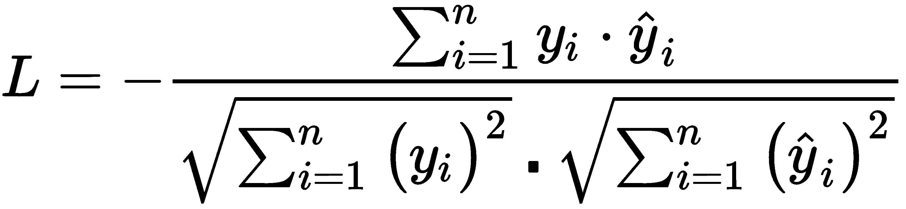

该函数与余弦相似性相同，余弦相似性是两个非零向量之间相似性的度量。这表示为它们之间角度的余弦。如果单位向量是平行的，则它们是最相似的；如果它们是正交的，则它们是最不相似的。

*   **铰链损失**功能用于训练分类器。铰链损失也称为最大余量目标，用于*最大余量*分类。它使用分类器决策函数的原始输出，而不是预测的类标签。其定义如下:


还有许多其他损失函数。复杂的网络架构通常使用几个损失函数来训练网络的不同部分。例如 *Mask RCNN* 架构，用于预测图像上的对象类别和边界，使用不同的损失函数:一个用于回归，另一个用于分类器。在下一节中，我们将讨论神经元的激活功能。

# 激活功能

人工神经元是做什么的？简单地说，它计算输入的加权和，加上偏差，并决定是排除这个值还是进一步使用它。人工神经元不知道一个阈值，可以用来计算输出值是否将神经元切换到激活状态。为此，我们添加了一个激活函数。它检查神经元产生的值，看外部连接是否应该识别这个神经元被激活，或者它是否可以被忽略。它决定了神经元的输出值，取决于输入和阈值的加权和的结果。

让我们考虑一些激活函数及其属性的例子。

# 逐步激活函数

逐步激活函数是这样工作的——如果总和值高于特定阈值，我们认为神经元被激活。否则，我们说神经元是不活跃的。

下图显示了该函数的图形:


当参数> 0(零值是阈值)时，函数返回 1(神经元已被激活)，否则函数返回 0(神经元未被激活)。这种方法很容易，但也有缺陷。想象一下，我们正在创建一个二元分类器——一个应该说*是*或*否*(激活与否)的模型。逐步函数可以为我们做到这一点——它打印 1 或 0。现在，想象一下需要更多的神经元来分类许多类的情况:类 1、类 2、类 3，甚至更多。如果一个以上的神经元被激活会发生什么？激活函数的所有神经元都衍生出 1。

在这种情况下，对于给定的对象，最终应该获得什么类的问题就出现了。我们只希望一个神经元被激活，其他神经元的激活函数应该为零(除了在这种情况下，我们可以确定网络正确定义了类)。这样的网络在训练和实现融合方面更具挑战性。如果激活函数不是二进制的，那么可能的值是*在 50 %* 激活，*在 20 %* 激活，以此类推。如果有几个神经元被激活，我们可以找到激活函数值最高的神经元。由于神经元的输出端有中间值，学习过程运行得更平稳、更快速。在逐步激活函数中，训练期间出现几个完全激活的神经元的可能性会降低(尽管这取决于我们正在训练什么以及基于什么数据)。此外，逐步激活函数在点 0 是不可微的，并且它的导数在所有其他点都等于 0。这导致我们在使用梯度下降法进行训练时遇到困难。

# 线性激活函数

线性激活函数 *y = c x* 是一条直线，与输入(即该神经元上的加权和)成正比。激活函数的这种选择允许我们获得一系列值，而不仅仅是一个二进制答案。我们可以连接几个神经元，如果一个以上的神经元被激活，则基于例如最大值的选择来做出决定。

下图显示了线性激活函数的样子:


*y = c x* 相对于 *x* 的导数为 *c* 。这个结论意味着梯度与函数的自变量无关。梯度是一个恒定的向量，而下降是根据恒定的梯度进行的。如果做出了错误的预测，那么反向传播错误的更新变化也是恒定的，并且不依赖于关于输入做出的变化。

还有一个问题:相关层。线性函数激活每一层。该函数的值作为输入进入下一层，而第二层考虑其输入端的加权和，进而包括神经元，这取决于另一个线性激活函数。我们有多少层并不重要。如果它们都是线性的，那么最后一层的最终激活函数只是第一层输入的线性函数。这意味着两层(或 *N* 层)可以替换为一层。因此，我们失去了制作图层集的能力。整个神经网络仍然类似于具有线性激活函数的层，因为线性函数的线性组合是另一个线性函数。

# 乙状结肠激活功能

乙状结肠激活函数， <sub>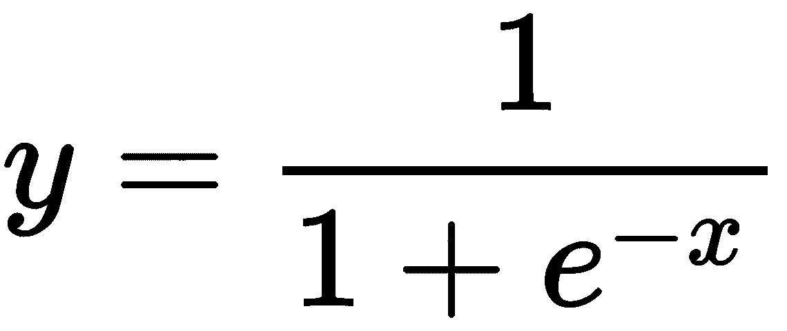</sub> ，是一个平滑函数，类似于逐步函数:


sigmoid 是一个非线性函数，sigmoid 的组合也会产生一个非线性函数。这使我们能够结合神经元层。sigmoid 激活函数不是二进制的，它使用[0，1]范围内的一组值进行激活，这与逐步函数不同。平滑的梯度也是乙状结肠的特征。在从-2 到 2 的数值范围内，的数值变化非常快。该梯度属性意味着该区域值的任何微小变化都会导致值的显著变化。该函数的这种行为表明倾向于紧贴曲线的一条边。

sigmoid 看起来是一个适合分类任务的函数。它试图将这些值带到曲线的一侧(例如，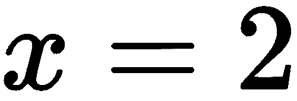处的上边缘和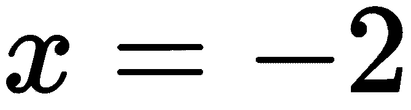处的下边缘)。这种行为使我们能够在预测中找到清晰的界限。

sigmoid 相对于线性函数的另一个优势如下:在第一种情况下，我们有一个固定的函数值范围，**【0，1】**，而线性函数在内变化。这是有利的，因为当处理激活函数上的大值时，它不会导致数值计算中的误差。

如今，sigmoid 是神经网络中最广泛的激活函数之一。但它也有我们必须考虑的缺陷。当 sigmoid 函数接近其最大值或最小值时，的输出值倾向于弱反映的变化。这意味着这些区域的梯度取小值，小值导致梯度消失。**消失梯度**问题是梯度值变得太小或消失，并且神经网络拒绝进一步学习或学习非常慢的情况。

# 双曲正切

双曲正切是另一个常用的激活函数。它可以用图形表示如下:

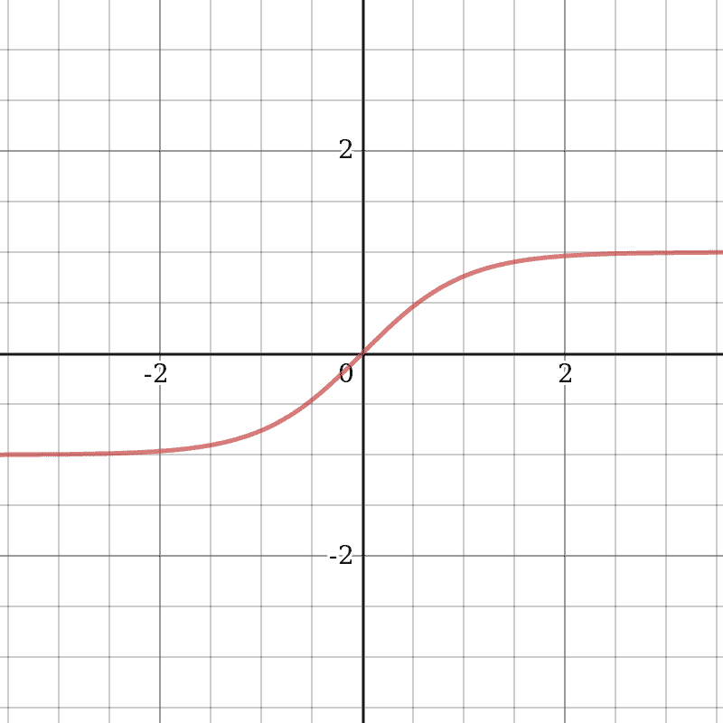

双曲正切与 sigmoid 非常相似。这是正确的乙状结肠功能，。因此，这样的函数具有与我们之前看到的 sigmoid 相同的特性。它的性质是非线性的，非常适合层的组合，函数的取值范围是。因此，担心激活函数的值会导致计算问题是没有意义的。然而，值得注意的是，正切函数的梯度比 sigmoid 的梯度具有更高的值(导数比 sigmoid 更陡)。我们选择 sigmoid 函数还是正切函数取决于梯度幅度的要求。与 sigmoid 一样，双曲正切也存在固有的消失梯度问题。

**整流线性单元** ( **热路**)、<sub>T5</sub>，如果为正则返回，否则返回:


乍一看，由于 ReLU 在第一象限是线性的，因此它似乎与线性函数具有相同的问题。但实际上，ReLU 是非线性的，ReLU 的组合也是非线性的。ReLU 的组合可以逼近任何函数。这个属性意味着我们可以使用图层，它们不会退化为线性组合。ReLU 的允许值范围是，这意味着它的值可能相当高，从而导致计算问题。但是，这个属性消除了渐变消失的问题。建议使用正则化和归一化输入数据来解决函数值较大的问题(例如，取值范围[0，1])。

让我们看看神经网络的一个特性，如激活稀疏性。想象一个有许多神经元的大神经网络。使用乙状线或双曲正切需要激活所有神经元。这个动作意味着几乎所有激活都必须被处理以计算网络输出。换句话说，激活是密集和昂贵的。

理想情况下，我们希望一些神经元不被激活，这将使激活稀疏而有效。ReLU 允许我们这样做。想象一个随机初始化权重(或归一化)的网络，其中大约 50%的激活是 0，因为 ReLU 属性，对于的负值返回 0。在这样的网络中，包含的神经元更少(稀疏激活)，网络本身变得轻量级。

由于 ReLU 的一部分是一条水平线(对于的负值)，该部分上的梯度为 0。这一特性导致在训练中不能调整重量。这种现象被称为**濒死的热鲁问题**。由于这个问题，一些神经元被关闭并且没有反应，使得神经网络的很大一部分是被动的。然而，ReLU 的变体有助于解决这个问题。例如，使用表达式将函数的水平部分(即所在的区域)替换为线性部分是有意义的。还有其他方法可以避免零梯度，但主要思想是使梯度非零，并在训练过程中逐渐恢复。

此外，ReLU 对计算资源的要求比双曲正切或 sigmoid 低得多，因为它比上述函数执行更简单的数学运算。

ReLU 的关键特性是它的计算复杂度小、非线性和对消失梯度问题的不敏感性。这使得它成为创建深度神经网络最常用的激活函数之一。

现在我们已经看到了一些激活函数，我们可以突出它们的主要属性。

# 激活函数属性

以下是在决定选择哪种激活功能时值得考虑的激活功能属性列表:

*   **非线性**:如果激活函数是非线性的，可以证明即使是两级神经网络也可以是函数的通用逼近器。
*   **连续可微性**:这个性质对于提供梯度下降优化方法是可取的。
*   **取值范围**:如果激活函数的取值集有限，由于没有大的取值，基于梯度的学习方法更加稳定，更不容易出现计算错误。如果值的范围是无限的，训练通常更有效，但必须注意避免爆炸梯度(其极值)。
*   **单调性**:如果激活函数是单调的，则保证单级模型关联的误差面是凸的。这使我们能够更有效地学习。
*   **带有单调导数的光滑函数**:表明在某些情况下，它们提供了更高的通用性。

既然我们已经讨论了用于训练神经网络的主要组件，现在是时候学习如何处理过度拟合问题了，这是在训练过程中经常出现的问题。

# 神经网络的正则化

过拟合尤其是机器学习模型和神经网络的问题之一。问题是模型只解释了训练集中的样本，从而适应训练样本，而不是学习对训练过程中没有涉及的样本进行分类(失去泛化能力)。通常，过度拟合的主要原因是模型的复杂性(就其参数数量而言)。对于可用的训练集和最终要解决的问题来说，复杂性可能太高。正则化器的任务是降低模型的复杂度，保留参数的数量。让我们考虑神经网络中最常用的正则化方法。

# 正则化的不同方法

最广泛的正则化方法是 L2 正则化、缺失正则化和批处理正则化。让我们来看看:

*   **L2 正则化**(权重衰减)通过惩罚具有最高值的权重来执行。处罚是通过使用参数最小化他们的范数来执行的，该参数是一个正则化系数，表示当我们需要最小化训练集的损失时，倾向于最小化范数。也就是说，对于每个重量，我们将术语添加到损耗函数(使用因子，以便该术语相对于参数的梯度等于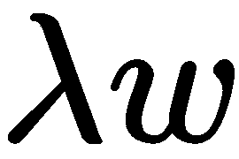而不是，以便应用误差反向传播方法)。我们必须正确选择。如果系数太小，那么正则化的效果可以忽略不计。如果太大，模型可以重置所有权重。
*   **辍学**正规化包括改变网络结构。每个神经元都可能被排除在网络结构之外，。神经元的排除意味着对于任何输入数据或参数，它都返回 0。
    被排除的神经元在反向传播算法的任何阶段都不会对学习过程做出贡献。因此，排除至少一个神经元等于学习一个新的神经网络。这个“细化”网络用于训练剩余的权重。采取梯度步骤，之后所有喷射的神经元返回到神经网络。因此，在训练的每一步，我们建立一个可能的 2 *N* 网络架构。通过架构，我们表示神经元之间的连接结构，通过 *N* ，我们表示神经元的总数。当我们评估神经网络时，神经元不再被丢弃。每个神经元输出乘以( *1 - p* )。这意味着在神经元的输出中，我们接收到所有 2 *N* 架构的响应预期。因此，使用缺失正则化训练的神经网络可以被认为是对来自 2 个 *N 个*网络的集合的响应进行平均的结果。
*   **批量归一化**保证神经网络的有效学习过程不受阻碍。当信号通过网络的内层传播时，输入信号可能会因均值和方差而显著失真，即使我们最初在网络输入端对信号进行了归一化。这种现象被称为内部协方差偏移，并且充满了不同级别或层的梯度之间的严重差异。因此，我们必须使用更强的正则化器，这减慢了学习的速度。

批量标准化为这个问题提供了一个简单的解决方案:以获得零均值和单位方差的方式标准化输入数据。在进入每一层之前执行标准化。在训练过程中，我们对批次样本进行归一化，在使用过程中，我们对基于整个训练集获得的统计数据进行归一化，因为我们无法提前看到测试数据。我们计算特定批次的平均值和方差，如下所示:

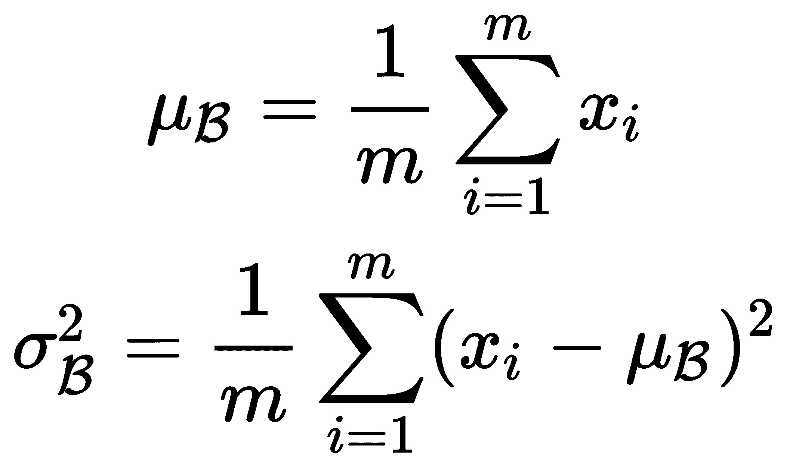

利用这些统计特征，我们转换激活函数，使其在整个批次中具有零均值和单位方差:


这里，是一个参数，在批次的标准差很小甚至等于零的情况下，保护我们不被 0 除。最后，为了获得最终的激活函数，我们需要确保在规范化过程中，我们不会失去概括的能力。由于我们对原始数据应用了缩放和移位操作，因此我们可以允许对归一化值进行任意缩放和移位，从而获得最终的激活函数:


这里，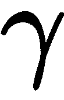和是可以训练系统的批量归一化参数(可以对训练数据用梯度下降法进行优化)。这种一般化也意味着，当直接应用神经网络的输入时，批量归一化可能是有用的。

这种方法应用于多层网络时，几乎总能成功达到目标——它加速了学习。此外，它是一个优秀的正则化器，允许我们选择学习速率、正则化器的能力和辍学率。这里的正则化是特定样本的网络结果不再具有确定性的结果(它取决于获得该结果的整个批次)的结果，这简化了泛化过程。

我们将研究的下一个重要主题是神经网络初始化。这会影响训练过程、训练速度和整体网络性能的收敛。

# 神经网络初始化

为构成模型的图层选择权重初始值的原则非常重要。将所有权重设置为 0 是学习的一个严重障碍，因为没有一个权重最初可以是活动的。为区间中的随机值**【0，1】**分配权重通常也不是最佳选择。实际上，模型性能和学习过程的收敛强烈依赖于正确的权重初始化；然而，初始任务和模型复杂性也可以发挥重要作用。即使任务的解决方案不假设对初始权重的值有很强的依赖性，一个精心选择的初始化权重的方法也会显著影响模型的学习能力。这是因为它预设了模型参数，同时考虑了损失函数。让我们来看看两种常用的初始化权重的方法。

# 泽维尔初始化方法

**泽维尔**初始化方法用于简化线性激活函数在误差正向传递和反向传递期间通过该层的信号流。这种方法也适用于 sigmoid 函数，因为它不饱和的区域也具有线性特征。在计算权重时，该方法依赖于方差为 <sub></sub> 的概率分布(如均匀分布或正态分布)，其中 <sub></sub> 和 <sub></sub> 分别是前一层和后一层的神经元数量。

# 初始化方法

**He** 初始化方法是 Xavier 方法的变体，更适合 ReLU 激活函数，因为它补偿了这个函数在定义域的一半返回零的事实。这种权重计算方法依赖于具有以下方差的概率分布:


权重初始化还有其他方法。您选择哪一个通常取决于要解决的问题、网络拓扑、使用的激活函数和损失函数。例如，对于递归网络，可以使用正交初始化方法。我们将在[第 12 章](12.html)、*导出和导入模型*中提供神经网络初始化的具体编程示例。

在前面几节中，我们研究了人工神经网络的基本组成部分，这是几乎所有类型的网络所共有的。在下一节中，我们将讨论经常用于图像处理的卷积神经网络的特征。

# 深入研究卷积网络

MLP 是最强大的前馈神经网络。它由几层组成，每一个神经元都从前一层神经元接收所有输出的副本。该模型非常适合某些类型的任务，例如，在有限数量的或多或少的非结构化参数上进行训练。

然而，让我们看看当原始数据被用作输入时，这种模型中的参数(权重)数量会发生什么变化。例如，CIFAR-10 数据集包含 32 x 32 x 3 的彩色图像，如果我们将每个像素的每个通道视为 MLP 的独立输入参数，则第一个隐藏层中的每个神经元会向模型添加大约 3000 个新参数！随着图像尺寸的增加，情况很快失控，产生用户无法在实际应用中使用的图像。

一个流行的解决方案是降低图像的分辨率，以便 MLP 变得适用。然而，当我们降低分辨率时，我们有丢失大量信息的风险。如果能够在应用质量下降之前处理信息，这样我们就不会导致模型参数数量的爆炸式增长，那就太好了。有一种非常有效的方法可以解决这个问题，那就是卷积运算。

# 卷积算子

这种方法首先用于处理图像的神经网络，但它已经成功地用于解决其他学科领域的问题。让我们考虑使用这种方法进行图像分类。

让我们假设，当形成我们感兴趣的特征(图像中对象的特征)时，彼此靠近的图像像素比位于相当远的距离的像素更紧密地相互作用。另外，如果在图像分类过程中认为一个小特征非常重要，那么在图像的哪个部分发现这个特征并不重要。

让我们来看看卷积算子的概念。我们有一个二维图像***【I】***和一个小的 ***K*** 矩阵，其维度为 *h x w* (所谓的卷积核)，以图形编码特征的方式构建。我们计算 *I * K* 的最小化图像，以所有可能的方式将核叠加到图像上，并记录原始图像和核的元素之和:


一个精确的定义假设内核矩阵是转置的，但是对于机器学习任务，这个操作是否被执行并不重要。卷积算子是有线电视新闻网卷积层的基础。该层由一定数量的核组成，(对于每个核，具有附加的位移分量，)，并且使用每个核计算前一层的输出图像的卷积，每次添加一个位移分量。最后，激活功能可以应用于整个输出图像。通常，卷积层的输入流由 *d* 信道组成；例如，输入层的红色/绿色/蓝色，在这种情况下，内核也被扩展，因此它们也由 *d* 通道组成。对于卷积层的输出图像的一个通道，获得以下公式，其中 *K* 是内核， *b* 是步幅(移位)分量:

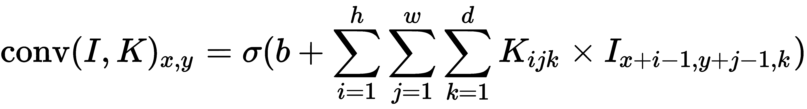

下图示意性地描述了前面的公式:


如果加法(步幅)分量不等于 1，则这可以示意性地描述如下:

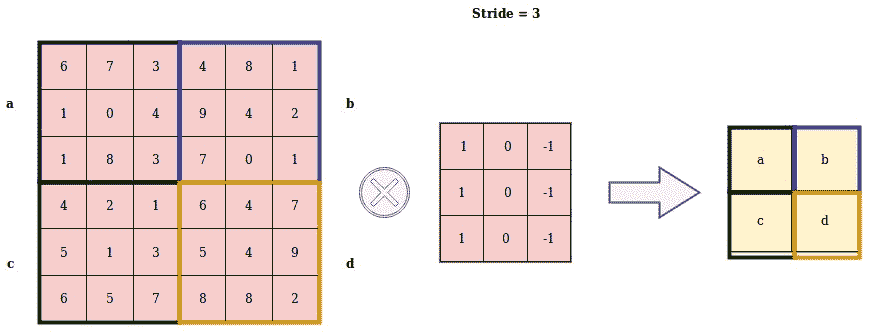

请注意，因为我们在这里所做的只是添加和缩放输入像素，所以可以使用梯度下降法从现有的训练样本中获得核，类似于在 MLP 中计算权重。MLP 可以完美地处理卷积层的功能，但是它需要更长的训练时间，以及更大量的训练数据。

请注意，卷积算子不限于二维数据:大多数深度学习框架直接开箱即用地为一维或 *N* 维卷积提供图层。还值得注意的是，尽管与完全连接的层相比，卷积层减少了参数的数量，但它使用了更多的超参数——在训练之前选择的参数。

特别是，选择以下超参数:

*   **深度**:一层会涉及多少个核和偏置系数。
*   每个仁的**高度**和**宽度**。
*   **步长(stride)** :计算结果图像的下一个像素时，每一步的核偏移了多少。通常，取的步长值等于 1，值越大，生成的输出图像的大小越小。
*   **填充**:注意卷积任何维度大于 1×1 的核都会缩小输出图像的大小。因为通常希望保持原始图像的大小，所以沿着边缘用零来补充图案。

卷积层的一次通过通过减小特定通道的长度和宽度但增加其值(深度)来影响图像。

降低图像维度并保存其常规属性的另一种方法是对图像进行下采样。执行此类操作的网络层称为**汇聚层**。

# 汇集操作

汇集层接收小的、独立的图像片段，并将每个片段组合成一个值。有几种可能的聚合方法。最直接的方法是从一组像素中取最大值。下图示意性显示了该方法:

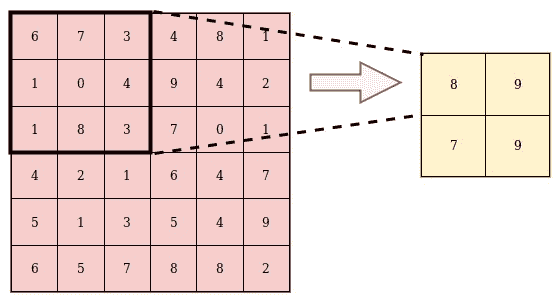

让我们考虑最大池是如何工作的。在上图中，我们有一个 6×6 的数字矩阵。池窗口的大小等于 3，因此我们可以将这个矩阵分成大小为 3×3 的四个子矩阵。然后，我们可以从每个子矩阵中选择最大数，并从这些数中制作一个大小为 2 x 2 的较小矩阵。

卷积或汇集层最重要的特征是它的感受野值，这使我们能够了解有多少信息用于处理。让我们详细讨论一下。

# 感受野

卷积神经网络体系结构的一个重要组成部分是减少从模型输入到输出的数据量，同时仍然增加信道深度。如前所述，这通常通过选择卷积步长(步幅)或汇集图层来实现。感受野决定了在输出端处理了多少来自源的原始输入。感受野的扩展允许卷积层组合低级特征(线、边)来创建高级特征(曲线、纹理):


层 *k* 的感受野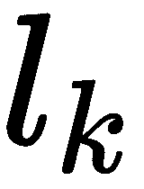可以由以下公式给出:

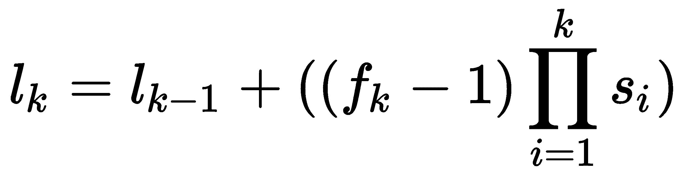

这里， <sub>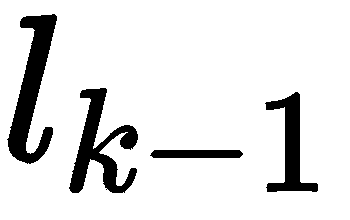</sub> 是该层的感受野， *k - 1* 、 <sub>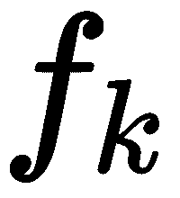</sub> 是滤子大小，是层 *i* 的步幅。所以，对于前面的例子，输入层有*射频= 1* ，隐藏层有*射频= 3* ，最后一层有*射频= 5* 。

现在我们已经熟悉了卷积神经网络的基本概念，让我们看看如何将它们结合起来，为图像分类创建一个具体的网络架构。

# 卷积网络体系结构

网络从最初阶段的少量低级过滤器发展到大量过滤器，每个过滤器都找到特定的高级属性。从一级到另一级的过渡提供了模式识别的层次结构。

最早成功应用于模式识别任务的卷积网络架构之一是 LeNet-5，由 Yann LeCun、Leon Bottou、Yosuha Bengio 和 Patrick Haffner 开发。在 20 世纪 90 年代，它被用来识别手写和打印的数字。下图显示了该体系结构:


下表解释了该体系结构的网络层:

| 数字 | 层 | 要素图(深度) | 大小 | 内核大小 | 进展 | 激活 |
| 投入 | 图像 | one | 32 x 32 | - | - | - |
| one | 盘旋 | six | 28 x 28 | 5 x 5 | one | 双曲正切 |
| Two | 平均池 | six | 14 x 14 | 2 x 2 | Two | 双曲正切 |
| three | 盘旋 | Sixteen | 10 x 10 | 5 x 5 | one | 双曲正切 |
| four | 平均池 | Sixteen | 5 x 5 | 2 x 2 | Two | 双曲正切 |
| five | 盘旋 | One hundred and twenty | 1 x 1 | 5 x 5 | one | 双曲正切 |
| six | 足球俱乐部 |  | Eighty-four | - | - | 双曲正切 |
| 输出 | 足球俱乐部 |  | Ten | - | - | softmax(软件最大值) |

请注意图层的深度和大小如何向最终图层变化。我们可以看到深度在增加，尺寸在变小。这意味着在最后一层，网络可以学习的特征数量增加了，但是它们的大小变小了。这种行为在不同的卷积网络架构中非常常见。

# 什么是深度学习？

最常见的是，深度学习一词被用来描述人工神经网络，该网络被设计用于处理大量数据，并使用复杂的算法来训练模型。深度学习的算法可以使用监督和非监督算法(强化学习)。学习过程很深，因为随着时间的推移，神经网络覆盖的层次越来越多。网络越深(也就是说，它有更多的隐藏层、过滤器和特征抽象级别)，网络的性能就越高。在大数据集上，深度学习比传统的机器学习算法具有更好的准确性。

导致当前对深度神经网络兴趣复苏的真正突破发生在 2012 年，在《ACM》杂志的*通讯中，*亚历克斯·克里哲夫斯基*、*伊利亚·苏特科弗*、*杰夫·辛顿*发表了文章*用深度卷积神经网络进行 ImageNet 分类*。作者将许多不同的学习加速技术结合在一起。这些技术包括卷积神经网络、图形处理器的智能使用和一些创新的数学技巧:优化线性神经元(ReLU)和辍学，表明在几周内，他们可以训练一个复杂的神经网络，达到超越计算机视觉传统方法的水平。*

现在，基于深度学习的系统被应用于各个领域，并成功地取代了传统的机器学习方法。使用深度学习的一些领域示例如下:

*   **语音识别**:各大商用语音识别系统(如微软 Cortana、Xbox、Skype Translator、亚马逊 Alexa、Google Now、苹果 Siri、百度、iFlytek)都是基于深度学习的。
*   **计算机视觉**:如今，深度学习图像识别系统已经能够给出比人眼更准确的结果，例如在分析医学研究图像(MRI、X 射线等)时。).
*   **新药的发现**:例如，AtomNet 神经网络被用于预测新的生物分子，并被提出用于治疗埃博拉病毒和多发性硬化症等疾病。
*   **推荐系统**:如今，深度学习被用来研究用户偏好。
*   **生物信息学**:也用于研究遗传本体的预测。

# 使用 C++ 库创建神经网络的示例

许多机器学习库都有一个用于创建和使用神经网络的应用编程接口。我们在前面章节中使用的所有库——`Shogun`、`Dlib`和`Shark-ML`——都是由神经网络支持的。但是也有专门的神经网络框架；例如，一个流行的是 PyTorch 框架。专用库和通用库的区别在于，专用库支持更多的可配置选项，并支持不同的网络类型、层和损耗功能。此外，专门的库通常有更现代的工具，这些工具被更快地引入到它们的 API 中。

在本节中，我们将使用`Shogun`、`Dlib`和`Shark-ML`库为回归任务创建一个简单的 MLP。我们还将使用 PyTorch C++ API 来创建一个更高级的网络——一个具有 LeNet5 架构的卷积深度神经网络，我们在前面的*卷积网络架构*部分已经讨论过了。我们将把这个网络用于图像分类任务。

# 回归任务的简单网络示例

让我们学习如何使用`Shogun`、`Dlib`和`Shark-ML`库为回归任务创建一个简单的 MLP。这个任务对于所有的序列样本都是一样的——MLP 应该在有限的时间间隔内学习余弦函数。在本书的代码示例中，我们可以找到数据生成和 MLP 训练的完整程序。在这里，我们将讨论用于神经网络的应用编程接口视图的程序的基本部分。请注意，我们将用于这些示例的激活函数是 Tanh 和 ReLU 函数。我们选择它们是为了更好地完成这项特殊任务。

# 德列卜

`Dlib`库有一个用于处理神经网络的应用编程接口。它还可以通过支持性能优化的 Nvidia CUDA 来构建。如果我们计划使用大量数据和深度神经网络，那么将 CUDA 或 OpenCL 技术用于图形处理器是非常重要的。

神经网络的`Dlib`库中使用的方法与该库中的其他机器学习算法相同。我们应该实例化并配置所需算法类的对象，然后使用特定的训练器在数据集上训练它。

在`Dlib`库中有用于训练神经网络的`dnn_trainer`类。这个类的对象应该用具体网络的对象和优化算法的对象初始化。最流行的优化算法是带有动量的随机梯度下降算法，我们在*反向传播方法模式*部分讨论了该算法。该算法在`sgd`类中实现。`sgd`类的对象应配置权重衰减正则化和动量参数值。`dnn_trainer`类有以下基本配置方法:`set_learning_rate`、`set_mini_batch_size`和`set_max_num_epochs`。它们分别设置学习速率参数值、小批量和最大训练时期数。此外，该培训师课程支持动态学习率变化，因此，例如，我们可以为以后的时代制定更低的学习率。学习率收缩参数可以通过`set_learning_rate_shrink_factor`方法进行配置。但是对于下面的例子，我们将使用恒定的学习速率，因为对于这个特定的数据，它给出了更好的训练结果。

实例化训练器对象的下一个基本项是神经网络类型对象。`Dlib`库使用声明式风格定义网络架构，为此，它使用 C++ 模板。因此，要定义神经网络架构，我们应该从网络的输入开始。在我们的例子中，这是`matrix<double>`类型。我们需要将它作为模板参数传递给下一个层类型；在我们的例子中，这是`fc`类型的全连接层。全连接层类型也将神经元的数量作为模板参数。为了定义整个网络，我们应该创建嵌套类型定义，直到我们到达最后一层和损失函数。在我们的例子中，这是`loss_mean_squared`类型，它实现了均方损失函数，通常用于回归任务。

下面的代码片段显示了带有`Dlib`库 API 的网络定义:

```cpp
using NetworkType = loss_mean_squared<fc<1, 
                                 htan<fc<8, 
                                 htan<fc<16, 
                                 htan<fc<32, 
                                 input<matrix<double>>>>>>>>>>;
```

该定义可按以下顺序阅读:

1.  我们从输入层开始:

```cpp
input<matrix<double>
```

2.  然后，我们添加了第一个包含 32 个神经元的隐藏层:

```cpp
fc<32, input<matrix<double>>
```

3.  之后，我们将双曲正切激活函数添加到第一个隐藏层:

```cpp
htan<fc<32, input<matrix<double>>>
```

4.  接下来，我们添加了第二个隐藏层，包含 16 个神经元和一个激活函数:

```cpp
htan<fc<16, htan<fc<32, input<matrix<double>>>>>> 
```

5.  然后，我们添加了第三个隐藏层，它有 8 个神经元和一个激活函数:

```cpp
htan<fc<8, htan<fc<16, htan<fc<32, input<matrix<double>>>>>>>>
```

6.  然后，我们添加了最后一个具有 1 个神经元且没有激活函数的输出层:

```cpp
fc<1, htan<fc<8, htan<fc<16, htan<fc<32, input<matrix<double>>>>>>>>>
```

7.  最后，我们完成了损失函数:

```cpp
loss_mean_squared<...>
```

下面的代码片段显示了带有网络定义的完整源代码示例:

```cpp
size_t n = 10000;
...
std::vector<matrix<double>> x(n);
std::vector<float> y(n);
...
using NetworkType = loss_mean_squared<
fc<1, htan<fc<8, htan<fc<16, htan<fc<32, input<matrix<double>>>>>>>>>>;
NetworkType network;
float weight_decay = 0.0001f;
float momentum = 0.5f;
sgd solver(weight_decay, momentum);
dnn_trainer<NetworkType> trainer(network, solver);
trainer.set_learning_rate(0.01);
trainer.set_learning_rate_shrink_factor(1);  // disable learning rate changes
trainer.set_mini_batch_size(64);
trainer.set_max_num_epochs(500);
trainer.be_verbose();
trainer.train(x, y);
network.clean();

auto predictions = network(new_x);
```

现在我们已经配置了训练器对象，我们可以使用`train`方法开始实际的训练过程。该方法以两个 C++ 向量作为输入参数。第一个应该包含`matrix<double>`类型的训练对象，第二个应该包含`float`类型的目标回归值。我们也可以调用`be_verbose`方法查看训练过程的输出日志。网络经过训练后，我们调用`clean`方法，让网络对象从中间训练值中清除内存，从而减少内存使用。

# 幕府将军

要用`Shogun`库创建神经网络，我们必须从定义网络的架构开始。我们使用`Shogun`库中的`CNeuralLayers`类来这样做，该类用于聚合网络层。它有不同的创建图层的方法:

*   `input`:用指定的尺寸创建输入图层
*   `logistic`:使用逻辑(sigmoid)激活功能创建一个完全连接的隐藏层
*   `linear`:使用线性激活功能创建一个完全连接的隐藏层
*   `rectified_linear`:使用 ReLU 激活功能创建一个完全连接的隐藏层
*   `leaky_rectified_linear`:使用漏 ReLU 激活功能创建一个完全连接的隐藏层
*   `softmax`:使用 softmax 激活功能创建一个完全连接的隐藏层

这些方法中的每一个都返回一个`CNeuralLayers`类的新对象，该对象包含所有先前的图层，并添加了一个新图层。因此，要添加新层，我们可以编写以下代码:

```cpp
// create the initial object
auto layers = some<CNeuralLayers>();
// add the input layer
layers = wrap(layers->input(dimensions));
// add the hidden layer
layers = wrap(layers->logistic(32));
```

每次添加新图层时，我们都会重写指向`CNeuralLayers`类型对象的指针。添加完所有图层后，我们必须调用`CNeuralLayers`类的`done`方法。然后，它返回一个已配置图层的数组，可用于创建`CNeuralNetwork`类型对象。`CNeuralNetwork`类实现网络初始化和培训的功能。在我们创建了`CNeuralNetwork`对象之后，我们必须通过调用`quick_connect`方法来连接所有的层。然后，我们可以通过调用`initialize_neural_network`方法来初始化所有层的权重。这个方法可以取一个可选参数`sigma`，它是用来随机初始化参数的高斯的标准差。

在我们配置了神经网络之后，我们应该配置优化算法。这个配置也可以用`CNeuralNetwork`对象来完成。首先，我们应该指定优化方法。该类支持梯度下降和**布赖登-弗莱彻-戈德法布-尚诺(BFGS)** 算法。BFGS 是一种二阶(基于二阶导数)迭代方法，用于求解无约束的非线性优化问题。

对于这个例子，我们选择了梯度下降法，用`NNOM_GRADIENT_DESCENT`枚举值参数调用`set_optimization`方法。其他设置是梯度下降方法配置的标准设置。`set_gd_mini_batch_size`方法设定小批量的大小。`set_l2_coefficient`方法设置正则化权重衰减参数的值。`set_gd_learning_rate`方法设置学习速率参数。`set_gd_momentum`方法设置动量参数值。使用`set_max_num_epochs`方法，我们可以设置最大训练时期数，使用`set_epsilon`方法，我们可以定义损失函数的收敛标准值。

损耗函数不能在`Shogun`库中显式配置。根据`set_labels`方法指定的标签类型自动选择。在这个例子中，我们使用了`CRegressionLabels`类型的标签，因为我们正在解决回归任务。网络训练可以通过`{train}`方法完成，该方法以`CDenseFeatures`类型的对象为对象。这包含一组所有的训练样本。

这个例子的源代码如下:

```cpp
ize_t n = 10000;
...
SGMatrix<float64_t> x_values(1, static_cast<index_t>(n));
SGVector<float64_t> y_values(static_cast<index_t>(n));
...

auto x = some<CDenseFeatures<float64_t>>(x_values);
auto y = some<CRegressionLabels>(y_values);

auto dimensions = x->get_num_features();
auto layers = some<CNeuralLayers>();
layers = wrap(layers->input(dimensions));
layers = wrap(layers->rectified_linear(32));
layers = wrap(layers->rectified_linear(16));
layers = wrap(layers->rectified_linear(8));
layers = wrap(layers->linear(1));
auto all_layers = layers->done();

auto network = some<CNeuralNetwork>(all_layers);
network->quick_connect();
network->initialize_neural_network();

network->set_optimization_method(NNOM_GRADIENT_DESCENT);
network->set_gd_mini_batch_size(64);
network->set_l2_coefficient(0.0001);  // regularization
network->set_max_num_epochs(500);
network->set_epsilon(0.0);  // convergence criteria
network->set_gd_learning_rate(0.01);
network->set_gd_momentum(0.5);

network->set_labels(y);
network->train(x);
```

要查看培训进度，我们可以通过以下调用为`Shogun`库设置更高的日志记录级别:

```cpp
shogun::sg_io->set_log_evel(shogun::MSG_DEBUG);
```

这个功能可以让我们看到很多关于整个训练过程的附加信息，可以帮助我们调试和发现我们训练的网络中的问题。

# 鲨鱼-毫升

`Shark-ML`库还具有定义、训练和评估神经网络的功能。这个过程可以分为五个部分:架构定义、损失函数定义、网络初始化、优化器配置和训练。

# 架构定义

首先，我们应该定义所有的层，并在网络中连接它们。该层可以被定义为`LinearModel`类的对象，用特定的激活函数类型进行参数化。在我们的例子中，层的类型如下:

```cpp
using DenseLayer = LinearModel<RealVector, TanhNeuron>;
```

要实例化这种类型的对象，我们必须将三个参数传递给构造函数:输入的数量、神经元(输出)的数量以及布尔值，如果该值等于*真*，则该值将启用偏差。`>>`运算符可用于连接网络中的所有层:

```cpp
auto network = layer1 >> layer2 >> layer3 >> output;
```

# 损失函数定义

在我们定义了网络结构之后，我们需要为优化算法定义损失函数。`ErrorFunction`类用于此目的。它的构造函数接受四个参数:

*   表示训练数据集的对象
*   指向表示网络结构的对象的指针
*   指向实现损失函数的对象的指针——在我们的例子中是`SquaredLoss`
*   告诉我们是否使用小批量的布尔标志

`ErrorFunction`类型对象可以配置正则化器。例如，我们可以实例化`TwoNormRegularizer`类的对象，并使用两个参数调用`ErrorFunction`类型对象中的`setRegularizer`方法:权重衰减因子值和正则化对象的指针。要完成`ErrorFunction`类型对象的配置，我们需要调用`init`方法。

# 网络初始化

网络可以用`initRandomNormal`函数随机初始化，该函数取两个参数:指向网络对象的指针和用于初始化的正态分布方差。

# 优化器配置

下一步是配置优化器。我们可以使用梯度下降优化器来完成我们的任务。为此在`Shark-ML`库中有一个名为`SteepestDescent`的类。可以配置`setLearningRate`和`setMomentum`方法。在实例化和配置之后，`init`方法应该以`ErrorFunction`类型的对象作为其参数来调用。

# 网络培训

为了开始训练，我们需要首先配置一个数据集对象。当我们定义数据集对象时，可以自动配置小批量。在本例中，这发生在我们创建`RegressionDataset`类型对象时。

为了执行一个训练步骤，我们应该使用优化器对象的`step`方法，但是我们应该知道这个方法只进行一次小批量训练。因此，要使用整个数据集执行几个时期，我们必须手动计算步数。

训练完成后，我们必须将训练好的参数从优化器对象复制到网络对象。这可以通过网络对象的`setParameterVector`方法来完成。我们可以使用`solution()`方法从优化器中获取参数。

现在我们已经描述了所有需要的组件，让我们来看看完整的编程示例。

# 完整的编程示例

以下代码片段显示了此示例的完整示例源代码:

```cpp
size_t n = 10000;
...
std::vector<RealVector> x_data(n);
std::vector<RealVector> y_data(n);
...
Data<RealVector> x = createDataFromRange(x_data);
Data<RealVector> y = createDataFromRange(y_data);
RegressionDataset train_data(x, y);
```

首先，我们定义了训练数据集的`train_data`对象，该对象由原始数据数组构成，即`x_data`和`y_data`:

```cpp
using DenseLayer = LinearModel<RealVector, TanhNeuron>;

DenseLayer layer1(1, 32, true);
DenseLayer layer2(32, 16, true);
DenseLayer layer3(16, 8, true);

LinearModel<RealVector> output(8, 1, true);
auto network = layer1 >> layer2 >> layer3 >> output;
```

然后，我们定义了我们的神经网络对象，`network`，它由三个完全连接的层组成:

```cpp
SquaredLoss<> loss;
ErrorFunction<> error(train_data, &network, &loss, true);
TwoNormRegularizer<> regularizer(error.numberOfVariables());
double weight_decay = 0.0001;
error.setRegularizer(weight_decay, &regularizer);
error.init();
```

下一步是为优化器定义损失函数。请注意，我们给`error`对象添加了一个正则化符，它概括了我们的损失函数:

```cpp
initRandomNormal(network, 0.001);
```

然后，我们网络的权重被随机初始化:

```cpp
SteepestDescent<> optimizer;
optimizer.setMomentum(0.5);
optimizer.setLearningRate(0.01);
optimizer.init(error);
```

然后，在训练准备步骤中，我们创建了优化器对象。我们还配置了动量和学习速率参数。我们用错误对象初始化了它，它提供了对损失函数的访问:

```cpp
size_t epochs = 1000;
size_t iterations = train_data.numberOfBatches();
for (size_t epoch = 0; epoch != epochs; ++ epoch) {
    double avg_loss = 0.0;
    for (size_t i = 0; i != iterations; ++ i) {
        optimizer.step(error);
        if (i % 100 == 0) {
            avg_loss += optimizer.solution().value;
        }
    }
    avg_loss /= iterations;
    std::cout << "Epoch " << epoch << " | Avg. Loss " << avg_loss << 
        std::endl;
}
```

配置了`train_data`、`network`、`optimizer`对象后，我们编写了训练周期，训练网络 1000 个纪元:

```cpp
network.setParameterVector(optimizer.solution().point);
```

训练过程完成后，我们使用存储在`optimizer`对象中的学习参数(网络权重)用`setParameterVector`方法初始化实际网络参数。

在下一节中，我们将使用`PyTorch`库实现更复杂的神经网络来解决图像分类任务。

# 使用 LeNet 架构理解图像分类

在这一节中，我们将实现一个卷积神经网络用于图像分类。我们将使用著名的手写数字数据集**修改后的国家标准技术研究院(MNIST)** ，该数据集可以在[http://yann.lecun.com/exdb/mnist/](http://yann.lecun.com/exdb/mnist/)找到。数据集是由*美国国家标准与技术研究所*提出的标准，用于使用主要基于神经网络的机器学习来校准和比较图像识别方法。

数据集的创建者使用了美国人口普查局的一组样本，随后添加了一些由美国大学学生撰写的样本。所有样本都是 28 x 28 像素的归一化、抗锯齿灰度图像。MNIST 数据库包含 60，000 幅用于训练的图像和 10，000 幅用于测试的图像。有四个文件:

*   `train-images-idx3-ubyte`:训练集图像
*   `train-labels-idx1-ubyte`:训练集标签
*   `t10k-images-idx3-ubyte`:测试集图像
*   `t10k-labels-idx1-ubyte`:测试集标签

包含标签的文件采用以下格式:

| **偏移** | **类型** | **值** | **描述** |
| Zero | 32 位整数 | 0x00000801(2049) | 幻数(MSB 优先) |
| four | 32 位整数 | 六万或一万 | 项目数 |
| eight | 无符号字符 | ？？ | 标签 |
| nine | 无符号字符 | ？？ | 标签 |
| ... | ... | ... | ... |

标签的值从 0 到 9。包含图像的文件采用以下格式:

| **偏移** | **类型** | **值** | **描述** |
| Zero | 32 位整数 | 0x00000803(2051) | 幻数(MSB 优先) |
| Zero | 32 位整数 | 六万或一万 | 图像数量 |
| Zero | 32 位整数 | Twenty-eight | 行数 |
| Zero | 32 位整数 | Twenty-eight | 列数 |
| Zero | 无符号字节 | ？？ | 像素 |
| Zero | 无符号字节 | ？？ | 像素 |
| ... | ... | ... | ... |

像素以逐行方式存储，值在[0，255]范围内。0 表示背景(白色)，而 255 表示前景(黑色)。

在这个例子中，我们使用的是 PyTorch 深度学习框架。该框架主要用于 Python 语言。然而，它的核心部分是用 C++ 编写的，并且它有一个被很好地记录和积极开发的名为 **LibPyTorch** 的 C++ 客户端 API。该框架基于名为**阿腾**的线性代数库，该库大量使用英伟达 CUDA 技术来提高性能。Python 和 c++ API 基本相同，但语言符号不同，因此我们可以使用 Python 官方文档来学习如何使用框架。本文档还包含一个部分，说明 C++ 和 Python APIs 之间的区别，以及关于 C++ API 使用的具体文章。

PyTorch 框架被广泛用于深度学习的研究。正如我们之前讨论的，该框架提供了管理大数据集的功能。它可以自动并行化从磁盘加载数据，管理数据的预加载缓冲区以减少内存使用，并限制昂贵的高性能磁盘操作。它为用户自定义数据集的实现提供了`torch::data::Dataset`基类。我们在这里只需要覆盖两个方法:`get`和`size`。这些方法不是虚拟的，因为我们必须使用 C++ 模板的多态性来继承这个类。

# 读取训练数据集

考虑`MNISTDataset`类，它提供了对 MNIST 数据集的访问。这个类的构造函数接受两个参数:一个是包含图像的文件名，另一个是包含标签的文件名。它将整个文件加载到内存中，这不是最佳做法，但是对于这个数据集，这种方法效果很好，因为数据集很小。对于更大的数据集，我们必须实现另一种从磁盘读取数据的方案，因为通常，对于真正的任务，我们无法将所有数据加载到计算机的内存中。

我们使用`OpenCV`库来处理图像，所以我们将所有加载的图像存储在`cv::Mat`类型的 C++ `vector`中。标签存储在`unsigned char`类型的向量中。我们编写了两个额外的辅助函数来从磁盘读取图像和标签:`ReadImages`和`ReadLabels`。下面的代码片段显示了这个类的头文件:

```cpp
#include <torch/torch.h>
#include <opencv2/opencv.hpp>
#include <string>

class MNISTDataset : public torch::data::Dataset<MNISTDataset> {
public:
    MNISTDataset(const std::string& images_file_name,
                 const std::string& labels_file_name);

    // torch::data::Dataset implementation
    torch::data::Example<> get(size_t index) override;
    torch::optional<size_t> size() const override;

private:
    void ReadLabels(const std::string& labels_file_name);
    void ReadImages(const std::string& images_file_name);

    uint32_t rows_ = 0;
    uint32_t columns_ = 0;
    std::vector<unsigned char> labels_;
    std::vector<cv::Mat> images_;
};
```

下面的代码片段显示了类的公共接口的实现:

```cpp
MNISTDataset::MNISTDataset(const std::string& images_file_name,
                           const std::string& labels_file_name) {
    ReadLabels(labels_file_name);
    ReadImages(images_file_name);
}
```

我们可以看到构造函数将文件名传递给了相应的加载器函数。`size`方法返回从磁盘加载到标签容器中的项目数:

```cpp

torch::optional<size_t> MNISTDataset::size() const {
 return labels_.size();
}
```

下面的代码片段显示了`get`方法的实现:

```cpp
torch::data::Example<> MNISTDataset::get(size_t index) {
 return {CvImageToTensor(images_[index]),
 torch::tensor(static_cast<int64_t>(labels_[index]),
 torch::TensorOptions()
 .dtype(torch::kLong)
 .device(torch::DeviceType::CUDA))};
}
```

`get`方法返回一个`torch::data::Example<>`类的对象。通常，这种类型保存两个值:用`torch::Tensor`类型表示的训练样本和用`torch::Tensor`类型表示的目标值。该方法使用给定的下标从相应的容器中检索图像，使用`CvImageToTensor`函数将图像转换为`torch::Tensor`类型，并将转换为`torch::Tensor`类型的标签值用作目标值。

有一组`torch::tensor`函数用于将一个 C++ 变量转换为`torch::Tensor`类型。他们自动推导变量类型，并创建一个具有相应值的张量。在我们的例子中，我们显式地将标签转换为`int64_t`类型，因为我们稍后将使用的损失函数假设目标值具有`torch::Long`类型。另外，请注意，我们将`torch::TensorOptions`作为第二个参数传递给了`torch::tensor`函数。我们指定了张量值的火炬类型，并告诉系统通过设置`torch::DeviceType::CUDA`上的`device`选项和使用`torch::TensorOptions`对象将该张量放置到图形处理器存储器中。当我们手动创建 PyTorch 张量时，我们必须明确配置它们的放置位置——在中央处理器或图形处理器中。放在不同类型内存中的张量不能一起使用。

要将 OpenCV 图像转换为张量，请编写以下函数:

```cpp
torch::Tensor CvImageToTensor(const cv::Mat& image) {
    assert(image.channels() == 1);

    std::vector<int64_t> dims{static_cast<int64_t>(1),
                              static_cast<int64_t>(image.rows),
                              static_cast<int64_t>(image.cols)};

    torch::Tensor tensor_image = torch::from_blob(
        image.data, 
        torch::IntArrayRef(dims),
        torch::TensorOptions().dtype(torch::kFloat).requires_grad(false))
        .clone();  // clone is required to copy data from temporary object
    return tensor_image.to(torch::DeviceType::CUDA);
}
```

这个函数最重要的部分是对`torch::from_blob`函数的调用。这个函数从内存中的值构造张量，这些值由作为第一个参数传递的指针引用。第二个参数应该是带有张量维度值的 C++ 向量；在我们的例子中，我们指定了一个具有一个通道和两个图像维度的三维张量。第三个论点是`torch::TensorOptions`对象。我们指定数据应该是浮点类型，并且不需要梯度计算。

PyTorch 使用自动梯度方法进行模型训练，这意味着它不构建具有预先计算的梯度依赖性的静态网络图。相反，它使用动态网络图，这意味着模块的梯度流路径在训练过程的反向过程中动态连接和计算。这样的架构允许我们在运行程序时动态改变网络的拓扑和特征。我们之前介绍的所有库都使用静态网络图。

这里使用的第三个有趣的 PyTorch 函数是`torch::Tensor::to`函数，它允许我们将张量从 CPU 内存移动到 GPU 内存，然后再移动回来。

现在，让我们学习如何读取数据集文件。

# 读取数据集文件

我们使用`ReadLabels`功能读取标签文件:

```cpp
void MNISTDataset::ReadLabels(const std::string& labels_file_name) {
    std::ifstream labels_file(labels_file_name,
                              std::ios::binary | std::ios::binary);
    labels_file.exceptions(std::ifstream::failbit | std::ifstream::badbit);
    if (labels_file) {
        uint32_t magic_num = 0;
        uint32_t num_items = 0;
        if (read_header(&magic_num, labels_file) &&
            read_header(&num_items, labels_file)) {
            labels_.resize(static_cast<size_t>(num_items));
            labels_file.read(reinterpret_cast<char*>(labels_.data()), num_items);
        }
    }
}
```

该函数以二进制模式打开文件，并读取文件中的标题记录、幻数和项目数。它还将所有项目直接读入 C++ 向量。最重要的部分是正确阅读标题记录。为此，我们可以使用`read_header`功能:

```cpp
    template <class T>
    bool read_header(T* out, std::istream& stream) {
        auto size = static_cast<std::streamsize>(sizeof(T));
        T value;
        if (!stream.read(reinterpret_cast<char*>(&value), size)) {
            return false;
        } else {
            // flip endianness
            *out = (value << 24) | ((value << 8) & 0x00FF0000) |
            ((value >> 8) & 0X0000FF00) | (value >> 24);
            return true;
        }
    }
```

该函数从输入流(在我们的例子中是文件流)中读取值，并翻转字符顺序。该函数还假设标题记录是 32 位整数值。在另一种情况下，我们将不得不考虑其他方法来翻转字符顺序。

# 正在读取图像文件

读取图像文件也非常简单；我们读取标题记录，然后依次读取图像。从标题记录中，我们得到文件中图像的总数和图像大小。然后，我们定义具有相应大小和类型的 OpenCV 矩阵对象——具有底层字节`CV_8UC1`类型的一个通道图像。我们通过将`data`对象变量返回的指针传递给流读取函数，以循环方式从磁盘直接读取图像到 OpenCV 矩阵对象。我们需要读取的数据大小是通过调用`cv::Mat::size()`函数确定的，然后调用`area`函数。然后，我们使用`convertTo` OpenCV 函数将图像从`unsigned byte`类型转换为 32 位浮点类型。这一点很重要，以便我们在网络层执行数学运算时有足够的精度。我们还对所有数据进行归一化，通过将其除以 255，使其在[0，1]的范围内。

我们调整所有图像的大小，使其大小为 32 x 32，因为 LeNet5 网络架构要求我们保持卷积滤波器的原始尺寸:

```cpp
void MNISTDataset::ReadImages(const std::string& images_file_name) {
    std::ifstream images_file(images_file_name,
                              std::ios::binary | std::ios::binary);
    labels_file.exceptions(std::ifstream::failbit | std::ifstream::badbit);
    if (labels_file) {
        uint32_t magic_num = 0;
        uint32_t num_items = 0;
        rows_ = 0;
        columns_ = 0;
        if (read_header(&magic_num, labels_file) &&
                read_header(&num_items, labels_file) &&
                read_header(&rows_, labels_file) &&
                read_header(&columns_, labels_file)) {
            assert(num_items == labels_.size());
            images_.resize(num_items);
            cv::Mat img(static_cast<int>(rows_), 
                        static_cast<int>(columns_), CV_8UC1);

            for (uint32_t i = 0; i < num_items; ++ i) {
                images_file.read(reinterpret_cast<char*>(img.data),
                         static_cast<std::streamsize>(img.size().area()));
                img.convertTo(images_[i], CV_32F);
                images_[i] /= 255;  // normalize
                cv::resize(images_[i], images_[i],
                    cv::Size(32, 32));  // Resize to 32x32 size
            }
        }
    }
}
```

现在我们已经加载了训练数据，我们必须定义我们的神经网络。

# 神经网络定义

在本例中，我们选择了 LeNet5 架构，该架构由 Yann LeCun、Leon Bottou、Yosuha Bengio 和 Patrick Haffner([http://yann.lecun.com/exdb/lenet/](http://yann.lecun.com/exdb/lenet/))开发。该架构的细节在前面的*卷积网络架构*部分已经讨论过。在这里，我们将向您展示如何使用 PyTorch 框架实现它。

PyTorch 框架中神经网络的所有结构部分都应该来自`torch::nn::Module`类。下面的代码片段显示了`LeNet5`类的头文件:

```cpp
#include <torch/torch.h>

class LeNet5Impl : public torch::nn::Module {
    public:
    LeNet5Impl();

    torch::Tensor forward(torch::Tensor x);

    private:
    torch::nn::Sequential conv_;
    torch::nn::Sequential full_;
};

TORCH_MODULE(LeNet5);
```

注意我们定义了中间实现类，叫做`LeNet5Impl`。这是因为 PyTorch 使用了基于智能指针的内存管理模型，所有的模块都应该封装在一个特殊的类型中。有一个特殊的类叫做`torch::nn::ModuleHolder`，它是`std::shared_ptr`的包装器，但是也定义了一些管理模块的附加方法。因此，如果我们想要遵循所有 PyTorch 约定，并且使用我们的模块(网络)来实现所有 PyTorch 的功能而没有任何问题，那么我们的模块类定义应该如下:

```cpp
class Name : public torch::nn::ModuleHolder<Impl> {}
```

`Impl`是我们模块的实现，它是从`torch::nn::Module`类派生出来的。有一个特殊的宏可以自动为我们做这个定义；它被称为`TORCH_MODULE`。为了使用它，我们需要指定模块的名称。

这个定义中最关键的功能是`forward`功能。在我们的例子中，这个函数接受网络的输入，并通过所有的网络层，直到从这个函数返回一个输出值。如果我们没有实现整个网络，而是实现了网络的一些*自定义层或*一些*结构部分，那么这个函数应该假设我们从前面的层或网络的其他部分获取值作为输入。此外，如果我们正在实现一个不是来自 PyTorch 标准模块的定制模块，我们应该定义`backward`函数，它应该为我们的定制操作计算梯度。*

我们模块定义中的下一个重要内容是`torch::nn::Sequential`类的使用。此类用于对网络中的顺序层进行分组，并自动在它们之间转发值。我们将网络分成两部分，一部分包含卷积层，另一部分包含最终的全连接层。

PyTorch 框架包含许多创建图层的功能。例如，`torch::nn::Conv2d`函数创建了二维卷积层。在 PyTorch 中创建图层的另一种方法是使用`torch::nn::Functional`函数将一些简单的函数包装到图层中，然后可以将其与上一层的所有输出连接起来。请注意，激活功能不是 PyTorch 中神经元的一部分，应该作为一个单独的层进行连接。下面的代码片段显示了我们的网络组件的定义:

```cpp
static std::vector<int64_t> k_size = {2, 2};
static std::vector<int64_t> p_size = {0, 0};

LeNet5Impl::LeNet5Impl() {
    conv_ = torch::nn::Sequential(
    torch::nn::Conv2d(torch::nn::Conv2dOptions(1, 6, 5)),
    torch::nn::Functional(torch::tanh),
    torch::nn::Functional(torch::avg_pool2d,
          /*kernel_size*/ torch::IntArrayRef(k_size),
               /*stride*/ torch::IntArrayRef(k_size),
              /*padding*/ torch::IntArrayRef(p_size),
            /*ceil_mode*/ false,
    /*count_include_pad*/ false),
    torch::nn::Conv2d(torch::nn::Conv2dOptions(6, 16, 5)),
    torch::nn::Functional(torch::tanh),
    torch::nn::Functional(torch::avg_pool2d,
          /*kernel_size*/ torch::IntArrayRef(k_size),
               /*stride*/ torch::IntArrayRef(k_size),
              /*padding*/ torch::IntArrayRef(p_size),
            /*ceil_mode*/ false,
    /*count_include_pad*/ false),
    torch::nn::Conv2d(torch::nn::Conv2dOptions(16, 120, 5)),
    torch::nn::Functional(torch::tanh));
    register_module("conv", conv_);

    full_ = torch::nn::Sequential(
    torch::nn::Linear(torch::nn::LinearOptions(120, 84)),
    torch::nn::Functional(torch::tanh),
    torch::nn::Linear(torch::nn::LinearOptions(84, 10)));
    register_module("full", full_);
}
```

这里，我们初始化了两个`torch::nn::Sequential`模块。它们将可变数量的其他模块作为构造函数的参数。请注意，对于`torch::nn::Conv2d`模块的初始化，我们必须传递`torch::nn::Conv2dOptions`类的实例，它可以用输入通道的数量、输出通道的数量和内核大小来初始化。我们使用`torch::tanh`作为激活功能；请注意，它被包装在`torch::nn::Functional`类实例中。平均池函数也包装在`torch::nn::Functional`类实例中，因为它不是 PyTorch C++ API 中的一个层；这是一种功能。此外，池函数接受几个参数，因此我们绑定了它们的固定值。当 PyTorch 中的函数需要尺寸值时，它假设我们提供了一个`torch::IntArrayRef`类型的实例。这种类型的对象充当具有维度值的数组的包装。我们在这里应该小心，因为这样的数组应该与包装器生存期同时存在；注意`torch::nn::Functional`在内部存储`torch::IntArrayRef`对象。这就是为什么我们将`k_size`和`p_size`定义为静态全局变量。

还有，注意`register_module`功能。它将字符串名称与模块相关联，并将其注册到父模块的内部。如果模块以这种方式注册，我们可以稍后使用基于字符串的参数搜索(通常在训练期间需要手动管理权重更新时使用)和自动模块序列化。

`torch::nn::Linear`模块定义了完全连接的层，应该用`torch::nn::LinearOptions`类型的实例进行初始化，该实例定义了输入的数量和输出的数量，即层神经元的计数。请注意，最后一层返回 10 个值，而不是一个标签，尽管我们只有一个目标标签。这是分类任务的标准方法。

下面的代码显示了`forward`函数的实现，它执行模型推断:

```cpp
torch::Tensor LeNet5Impl::forward(at::Tensor x) {
    auto output = conv_->forward(x);
    output = output.view({x.size(0), -1});
    output = full_->forward(output);
    output = torch::log_softmax(output, -1);
    return output;
}
```

该功能实现如下:

1.  我们将输入张量(图像)传递给顺序卷积组的`forward`函数。
2.  然后，我们用`view`张量方法展平它的输出，因为完全连接的层假设输入是平的。`view`方法获取张量的新维度，并返回张量视图，而无需精确复制数据； *-1* 表示我们不在乎维度的值，可以扁平化。
3.  然后，卷积组的平坦输出被传递到全连接组。
4.  最后，我们将 softmax 函数应用于最终输出。由于多重覆盖，我们无法在`torch::nn::Functional`类实例中包装`torch::log_softmax`。

softmax 函数将维度的向量转换为相同维度的向量，其中所得向量的每个坐标由范围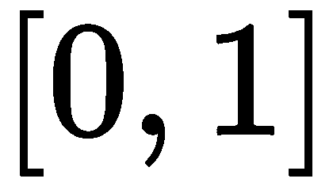中的实数表示，并且坐标之和为 1。

坐标计算如下:

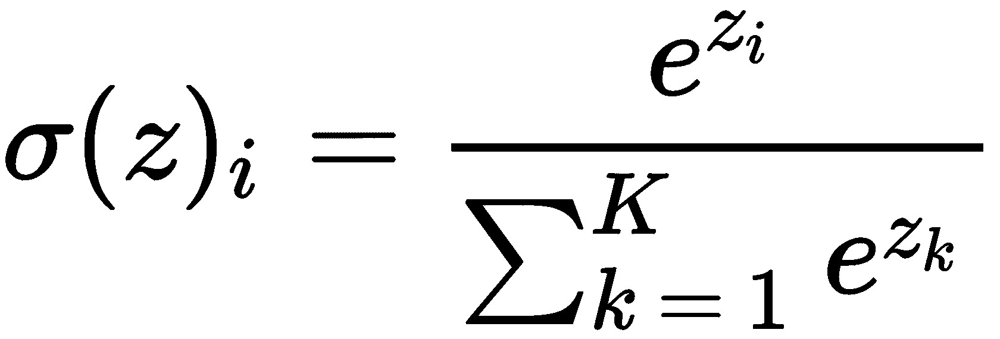

当可能类别的数量超过两个时，softmax 函数用于分类问题的机器学习(对于两个类别，使用逻辑函数)。结果向量的坐标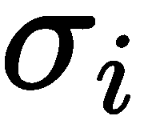可以解释为对象属于类的概率。我们选择这个函数是因为它的结果可以直接用于交叉熵损失函数，它测量两个概率分布之间的差异。目标分布可以从目标标签值直接计算出来——我们创建 10 个值的零向量，并在标签值索引的地方放一个。现在，我们有了训练神经网络所需的所有组件。

# 网络培训

首先，我们应该为训练和测试数据集创建 PyTorch 数据加载器对象。数据加载器对象负责从数据集中采样对象，并从中制作小批量。该对象可以配置如下:

1.  首先，我们初始化代表数据集的`MNISTDataset`类型对象。
2.  然后，我们使用`torch::data::make_data_loader`函数创建一个数据加载器对象。该功能将`torch::data::DataLoaderOptions`类型对象作为数据加载器的配置设置。我们将小批量设置为 256 个项目，并设置了 8 个并行数据加载线程。我们还应该配置采样器类型，但在这种情况下，我们将保留默认类型——随机采样器。

以下代码片段显示了如何初始化列车和测试数据加载器:

```cpp
auto train_images = root_path / "train-images-idx3-ubyte";
auto train_labels = root_path / "train-labels-idx1-ubyte";
auto test_images = root_path / "t10k-images-idx3-ubyte";
auto test_labels = root_path / "t10k-labels-idx1-ubyte";

// initialize train dataset
// ----------------------------------------------
MNISTDataset train_dataset(train_images.native(),
                           train_labels.native());

auto train_loader = torch::data::make_data_loader(
        train_dataset.map(torch::data::transforms::Stack<>()),
        torch::data::DataLoaderOptions().batch_size(256).workers(8));

// initialize test dataset
// ----------------------------------------------
MNISTDataset test_dataset(test_images.native(), 
                          test_labels.native());

auto test_loader = torch::data::make_data_loader(
        test_dataset.map(torch::data::transforms::Stack<>()),
        torch::data::DataLoaderOptions().batch_size(1024).workers(8));
```

请注意，我们没有将数据集对象直接传递给`torch::data::make_data_loader`函数，而是对其应用了堆叠变换映射。这种转换允许我们以`torch::Tensor`对象的形式对小批量进行采样。如果我们跳过这个转换，小批量将被采样为张量的 C++ 向量。通常，这不是很有用，因为我们不能以矢量化的方式对整个批次应用线性代数运算。

下一步初始化`LeNet5`类型的神经网络对象，这是我们之前定义的。我们将把它转移到 GPU，以提高培训和评估性能:

```cpp
LeNet5 model;
model->to(torch::DeviceType::CUDA);
```

当我们的神经网络模型被初始化时，我们可以初始化一个优化器。我们为此选择了动量优化的随机梯度下降。在`torch::optim::SGD`类中实现。这个类的对象应该用模型(网络)参数和`torch::optim::SGDOptions`类型对象初始化。所有`torch::nn::Module`类型的对象都有`parameters()`方法，该方法返回包含网络所有参数(权重)的`std::vector<Tensor>`对象。还有`named_parameters`方法，返回命名参数的字典。参数名是用我们在`register_module`函数调用中使用的名称创建的。如果我们想过滤参数并从训练过程中排除一些参数，这种方法很方便。

`torch::optim::SGDOptions`对象可以配置学习率、权重衰减正则化因子和动量值因子的值:

```cpp
double learning_rate = 0.01;
double weight_decay = 0.0001;  // regularization parameter
torch::optim::SGD optimizer(model->parameters(),
                            torch::optim::SGDOptions(learning_rate)
                                .weight_decay(weight_decay)
                                .momentum(0.5));
```

现在我们已经初始化了数据加载器、`network`对象和`optimizer`对象，我们准备开始训练周期。下面的代码片段显示了培训周期的实现:

```cpp
int epochs = 100;
for (int epoch = 0; epoch < epochs; ++ epoch) {
    model->train();  // switch to the training mode

    // Iterate the data loader to get batches from the dataset
    int batch_index = 0;
    for (auto& batch : (*train_loader)) {
        // Clear gradients
        optimizer.zero_grad();

        // Execute the model on the input data
        torch::Tensor prediction = model->forward(batch.data);

        // Compute a loss value to estimate error of our model
        // target should have size of [batch_size]
        torch::Tensor loss =
        torch::nll_loss(prediction, batch.target.squeeze(1));

        // Compute gradients of the loss and parameters of our model
        loss.backward();

        // Update the parameters based on the calculated gradients.
        optimizer.step();

        // Output the loss every 10 batches.
        if (++ batch_index % 10 == 0) {
        std::cout << "Epoch: " << epoch << " | Batch: " << batch_index
        << " | Loss: " << loss.item<float>() << std::endl;
    }
}
```

我们做了一个循环，重复 100 个时代的训练周期。在训练周期开始时，我们用`model->train()`将我们的网络对象切换到训练模式。对于一个时期，我们迭代数据加载器对象提供的所有小批处理:

```cpp
for (auto& batch : (*train_loader)){
...
}
```

对于每个小批量，我们执行下一个训练步骤，通过调用优化器对象的`zero_grad`方法清除先前的梯度值，在网络对象`model->forward(batch.data)`上向前移动一步，并用`nll_loss`函数计算损失值。该函数计算*负对数似然*损失。它需要两个参数:包含训练样本属于由向量中的位置标识的类的概率的向量和数字类标签(数字)。然后，我们称之为损失张量的`backward`方法。它递归地计算整个网络的梯度。最后，我们为优化器对象调用了`step`方法，该方法更新了所有参数(权重)及其对应的梯度值。`step`方法仅更新用于初始化的参数。

通常的做法是使用测试或验证数据来检查每个时期后的训练过程。我们可以通过以下方式做到这一点:

```cpp
model->eval();  // switch to the training mode
unsigned long total_correct = 0;
float avg_loss = 0.0;
for (auto& batch : (*test_loader)) {
    // Execute the model on the input data
    torch::Tensor prediction = model->forward(batch.data);

    // Compute a loss value to estimate error of our model
    torch::Tensor loss =
    torch::nll_loss(prediction, batch.target.squeeze(1));

    avg_loss += loss.sum().item<float>();
    auto pred = std::get<1>(prediction.detach_().max(1));
    total_correct += static_cast<unsigned long>(
    pred.eq(batch.target.view_as(pred)).sum().item<long>());
}
avg_loss /= test_dataset.size().value();
double accuracy = (static_cast<double>(total_correct) / test_dataset.size().value());
std::cout << "Test Avg. Loss: " << avg_loss << " | Accuracy: " << accuracy << std::endl;
```

首先，我们通过调用`eval`方法将模型切换到评估模式。然后我们迭代测试数据加载器中的所有批次。对于这些批次中的每一个，我们都在网络上执行前向传递，计算损失值的方式与我们在训练过程中所做的相同。为了估计模型的总损失(误差)值，我们对所有批次的损失值进行了平均。为了得到该批次的总损失，我们使用了`loss.sum().item<float>()`。这里，我们总结了批次中每个训练样本的损失，并使用`item<float>()`方法将其移动到 CPU 浮点变量。

接下来，我们计算精度值。这是正确答案和错误答案的比率。让我们用下面的方法来完成这个计算。首先，我们使用张量对象的`max`方法来确定预测的类标签:

```cpp
auto pred = std::get<1>(prediction.detach_().max(1));
```

`max`方法返回一个元组，其中的值是给定维度中输入张量每一行的最大值，以及该方法找到的每个最大值的位置索引。然后，我们将预测的标签与目标标签进行比较，并计算正确答案的数量:

```cpp
total_correct += static_cast<unsigned long>(pred.eq(batch.target.view_as(pred)).sum().item<long>());
```

我们使用`eq`张量方法进行比较。此方法返回一个布尔向量，其大小等于输入向量，当向量元素分量相等时，其值等于 1，当向量元素分量不相等时，其值等于 0。为了执行比较操作，我们为目标标签张量创建了一个与预测张量具有相同维度的视图。本次比较采用`view_as`法。然后，我们计算 1 的和，并用`item<long>()`方法将值移动到中央处理器变量。

通过这样做，我们可以看到专门的框架有更多的选项可以配置，并且对于神经网络开发来说更加灵活。它有更多的层类型，并支持动态网络图。它还有一个强大的专用线性代数库，可以用来创建新的层，以及新的丢失和激活功能。它具有强大的抽象功能，使我们能够处理大的培训数据。还有一点需要注意的是，它有一个与 Python API 非常相似的 C++ API，所以我们可以很容易地将 Python 程序移植到 C++ 中，反之亦然。

# 摘要

在这一章中，我们研究了什么是人工神经网络，研究了它们的历史，并考察了它们出现、兴起和衰落的原因，以及它们为什么成为当今发展最活跃的机器学习方法之一。在学习由弗兰克·罗森布拉特创造的感知器概念的基础知识之前，我们研究了生物神经元和人工神经元的区别。然后，我们讨论了人工神经元和网络的内部特征，如激活函数及其特征、网络拓扑和卷积层概念。我们还学习了如何用误差反向传播法训练人工神经网络。我们看到了如何为不同类型的任务选择合适的损失函数。然后，我们讨论了正则化方法，用于防止训练过程中的过拟合。

最后，我们用幕府、Dlib 和 Shark-ML C++ 机器学习库实现了一个简单的 MLP 回归任务。然后，我们用专门的神经网络框架 PyTorch 实现了一个更高级的卷积网络，用于图像分类任务。这向我们展示了专用框架相对于通用库的优势。

在下一章中，我们将讨论**循环神经网络(RNNs)** ，这是处理时间序列数据和自然语言处理的最著名和最实用的方法之一。与其他类型的神经网络的关键区别在于，RNN 元素之间的通信形成了用于处理顺序数据的有向序列，并且递归网络可以使用内部存储器来处理任意长度的序列。

# 进一步阅读

*   *分类中深度神经网络的损失函数*:[https://arxiv.org/pdf/1702.05659.pdf](https://arxiv.org/pdf/1702.05659.pdf)。
*   *神经网络和深度学习*，作者:迈克尔·尼尔森:[http://neuralnetworksanddeeplearning.com/](http://neuralnetworksanddeeplearning.com/)。
*   *神经动力学原理*，罗森布拉特，弗兰克(1962)，华盛顿州，DC:斯巴达图书。
*   *感知器*，明斯基和 Papert S. A. 1969。麻省剑桥:麻省理工学院出版社。
*   *神经网络和学习机*，西蒙·欧·海金 2008
*   *深度学习*，伊恩·古德费勒，约斯华·本吉奥，亚伦·库维尔 2016
*   pytorch github page:[https://github . com/pytorch/](https://github.com/pytorch/)。
*   PyTorch 文档网站:[https://pytorch.org/docs/](https://pytorch.org/docs/)。
*   LibPyTorch (C++)文档网站:[https://pytorch.org/cppdocs/](https://pytorch.org/cppdocs/)。