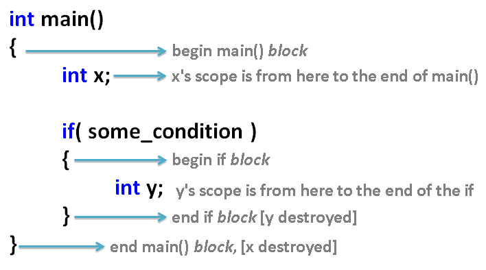
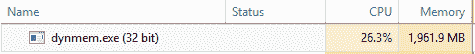
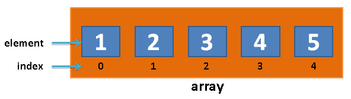

# 七、动态存储分配

在前一章中，我们讨论了类定义以及如何设计自己的定制类。我们讨论了如何通过设计您自己的定制类，来构造代表游戏或程序中实体的变量。

在本章中，我们将讨论动态内存分配以及如何在内存中为对象组创建空间。让我们来看看本章涵盖的主题:

*   重新审视构造函数和析构函数
*   动态存储分配
*   常规数组
*   C++ 风格的动态大小数组(新建[]和删除[])
*   动态 C 风格数组
*   向量

# 重新审视构造函数和析构函数

假设我们有一个简化版本的`class Player`，和以前一样，只有一个构造函数和一个析构函数:

```cpp
class Player 
{ 
  string name; 
  int hp; 
public: 
  Player(){ cout << "Player born" << endl; } 
  ~Player(){ cout << "Player died" << endl; } 
}; 
```

我们之前谈到了 C++ 中变量的*作用域*；概括地说，变量的作用域是程序中可以使用该变量的部分。变量的范围通常在声明它的块内。块只是包含在`{`和`}`之间的任何代码段。下面是一个示例程序，演示了变量范围:



In this sample program, the x variable has scope through all of main(). The y variable's scope is only inside the if block.

我们之前提到，一般来说，变量超出范围就会被销毁。让我们用`class Player`的例子来验证这个想法:

```cpp
int main() 
{ 
  Player player; // "Player born" 
}                // "Player died" - player object destroyed here 
```

该程序的输出如下:

```cpp
Player born 
Player died 
```

`Player`对象的析构函数在玩家对象的作用域末端被调用。由于变量的范围是在三行代码中定义的块，当对象超出范围时，`Player`对象将在`main()`的末尾立即被销毁。

# 动态存储分配

现在，让我们尝试动态分配一个`Player`对象。这是什么意思？

我们使用`new`关键字来分配它:

```cpp
int main() 
{ 
  // "dynamic allocation" - using keyword new! 
  // this style of allocation means that the player object will 
  // NOT be deleted automatically at the end of the block where 
  // it was declared! Note: new always returns a pointer
Player *player = new Player(); 
} // NO automatic deletion! 
```

该程序的输出如下:

```cpp
Player born 
```

玩家不会死！我们如何杀死玩家？我们必须明确调用`player`指针上的`delete`。

# 删除关键字

`delete`运算符调用被删除对象上的析构函数，如以下代码所示:

```cpp
int main() 
{ 
  // "dynamic allocation" - using keyword new! 
  Player *player = new Player(); 
  delete player; // deletion invokes dtor 
} 
```

程序的输出如下:

```cpp
Player born 
Player died 
```

因此，只有普通(或自动，也称为非指针类型)变量类型会在声明它们的块的末尾被销毁。指针类型(用`*`和`new`声明的变量)不会自动销毁，即使它们超出了范围。

这有什么用？动态分配允许您控制对象的创建和销毁时间。这个以后会派上用场的。

# 内存泄漏

因此，用`new`创建的动态分配对象不会被自动删除，除非您在它们上面显式调用`delete`。这里有风险！这被称为“T4”内存泄漏。当分配有`new`的对象从未被删除时，就会发生内存泄漏。可能发生的情况是，如果你的程序中很多对象都用`new`分配了，然后你停止使用它们，你的电脑最终会因为内存泄漏而耗尽内存。

下面是一个可笑的示例程序来说明这个问题:

```cpp
#include <iostream> 
#include <string> 
using namespace std; 
class Player 
{ 
  string name; 
  int hp; 
public: 
  Player(){ cout << "Player born" << endl; } 
  ~Player(){ cout << "Player died" << endl; } 
}; 

int main() 
{ 
  while( true ) // keep going forever, 
  { 
    // alloc.. 
    Player *player = new Player(); 
    // without delete == Memory Leak! 
  } 
} 
```

如果让这个程序运行足够长的时间，它最终会吞噬计算机的内存，如下图所示:



2 GB of RAM used for Player objects.

请注意，从来没有人打算写一个有这类问题的程序！内存泄漏问题是偶然发生的。你必须注意你的内存分配和不再使用的`delete`对象。

# 常规数组

C++ 中的数组可以声明如下:

```cpp
#include <iostream> 
using namespace std; 
int main() 
{ 
  int array[ 5 ];  // declare an "array" of 5 integers 
                   // fill slots 0-4 with values 
array[ 0 ] = 1; 
array[ 1 ] = 2; 
array[ 2 ] = 3; 
array[ 3 ] = 4; 
array[ 4 ] = 5; 
  // print out the contents 
  for( int index = 0; index < 5; index++ ) 
    cout << array[ index ] << endl; 
} 
```

这在记忆中的样子是这样的:



也就是说，`array`变量内部是五个槽或元素。每个槽内都有一个常规的`int`变量。您也可以通过传入值来声明数组，如下所示:

```cpp
int array[ ] = {6, 0, 5, 19};
```

您也可以传入`int`变量来使用存储在那里的值。

# 数组语法

那么，如何访问数组中的一个`int`值呢？要访问数组的各个元素，我们使用方括号，如下面一行代码所示:

```cpp
array[ 0 ] = 10; 
```

这与最初创建数组的语法非常相似。前一行代码会将数组槽`0`处的元素更改为`10`:


通常，要到达阵列的特定插槽，您将编写以下内容:

```cpp
array[ slotNumber ] = value to put into array; 
```

请记住，数组槽总是从`0`开始索引(有些语言可能从`1`开始，但这很不寻常，可能会引起混淆)。要进入阵列的第一个插槽，请使用`array[0]`。阵的第二个槽是`array[1]`(不是`array[2]`)。前一个数组的最后一个槽是`array[4]`(不是`array[5]`)。`array[5]`数据类型超出数组界限！(在上图中没有索引为 5 的插槽。最高指数为 4。)

不要超出数组的界限！它有时可能会起作用，但其他时候你的程序会因**内存访问冲突**而崩溃(访问不属于你的程序的内存)。一般来说，访问不属于你的程序的内存会导致你的应用崩溃，如果它不立即这样做，你的程序中就会有一个隐藏的 bug，只会偶尔引起问题。对数组进行索引时，必须始终小心。

数组内置于 C++ 中，也就是说，您不需要包含任何特殊的东西就可以立即使用数组。您可以拥有任何类型的数据数组，例如`int`、`double`、`string`数组，甚至您自己的自定义对象类型(`Player`)。

# 锻炼

1.  创建一个由五个字符串组成的数组，并在其中放入一些名称(虚构的或随机的，这并不重要)。
2.  用三个元素创建一个名为`temps`的双精度数组，并在其中存储最近三天的温度。

# 解决办法

1.  下面是一个包含五个字符串的示例程序:

```cpp
#include <iostream> 
#include <string> 
using namespace std; 
int main() 
{ 
  string array[ 5 ];  // declare an "array" of 5 strings 
                      // fill slots 0-4 with values 
array[ 0 ] = "Mariam McGonical"; 
array[ 1 ] = "Wesley Snice"; 
array[ 2 ] = "Kate Winslett"; 
array[ 3 ] = "Erika Badu"; 
array[ 4 ] = "Mohammad"; 
  // print out the contents 
  for( int index = 0; index < 5; index++ ) 
    cout << array[ index ] << endl; 
} 
```

2.  以下只是数组:

```cpp
double temps[ 3 ]; 
// fill slots 0-2 with values 
temps[ 0 ] = 0; 
temps[ 1 ] = 4.5; 
temps[ 2 ] = 11; 
```

# C++ 风格的动态大小数组(新建[]和删除[])

您可能会想到，在程序开始时，我们并不总是知道数组的大小。我们需要动态分配阵列的大小。

然而，如果你尝试过，你可能已经注意到这是行不通的！

让我们尝试使用`cin`命令从用户那里获取数组大小。让我们询问用户他想要多大的阵列，并尝试为他创建一个这样大小的阵列:

```cpp
#include <iostream> 
using namespace std; 
int main() 
{ 
  cout << "How big?" << endl; 
  int size;       // try and use a variable for size.. 
  cin >> size;    // get size from user 
  int array[ size ];  // get error
} 
```

我们得到一个错误。问题是编译器想要分配数组的大小。但是，除非变量大小标记为`const`，否则编译器在编译时无法确定其值。C++ 编译器无法在编译时调整数组的大小，因此会生成编译时错误。

要解决这个问题，我们必须动态分配数组(在“堆”上):

```cpp
#include <iostream> 
using namespace std; 
int main() 
{ 
  cout << "How big?" << endl; 
  int size;       // try and use a variable for size.. 
  cin >> size; 
  int *array = new int[ size ];  // this works 
  // fill the array and print 
for( int index = 0; index < size; index++ ) 
{ 
  array[ index ] = index * 2; 
  cout << array[ index ] << endl; 
} 
delete[] array; // must call delete[] on array allocated with  
                // new[]! 
} 
```

所以，这里的教训如下:

*   要动态分配某种类型的数组(例如`int`)，必须使用新的`int[numberOfElementsInArray]`。
*   分配有`new[]`的数组必须在后面用`delete[]`删除，否则会出现内存泄漏(那是带方括号的`delete[]`；不定期删除)！

# 动态 C 风格数组

c 风格的数组是一个遗留的话题，但是它们仍然值得讨论，因为即使它们很老了，你可能仍然会看到它们有时被使用。

我们声明 C 风格数组的方式如下:

```cpp
#include <iostream> 
using namespace std; 
int main() 
{ 
  cout << "How big?" << endl; 
  int size;       // try and use a variable for size.. 
  cin >> size; 
  // the next line will look weird.. 
  int *array = (int*)malloc( size*sizeof(int) ); // C-style 
  // fill the array and print 
for( int index = 0; index < size; index++ ) 
  { 
    //At this point the syntax is the same as with regular arrays.
    array[ index ] = index * 2; 
    cout << array[ index ] << endl; 
  } 
free( array ); // must call free() on array allocated with  
               // malloc() (not delete[]!) 
} 
```

这里强调了不同之处。

使用`malloc()`函数创建一个 C 风格的数组。malloc 这个词代表内存分配。该函数要求您传入要创建的数组的大小(以字节为单位)，而不仅仅是数组中想要的元素数量。为此，我们将请求的元素数量(`size`)乘以数组内部类型的`sizeof`。下表列出了几种典型 C++ 类型的字节大小:

| C++ 基元类型 | `sizeof`(字节大小) |
| `int` | `4` |
| `float` | `4` |
| `double` | `8` |
| `long long` | `8` |

使用`malloc()`功能分配的内存必须稍后使用`free()`释放。

# 向量

还有一种创建数组的方法，这种方法最容易使用，也是许多程序员的首选——使用向量。想象一下，在前面的任何一个例子中，你正在向一个数组中添加新的项目，在程序运行时突然用完了空间。你会怎么做？您可以创建一个全新的数组并复制所有内容，但正如您可能猜测的那样，这需要大量的额外工作和处理。那么，如果你有一种类型的阵列，在幕后为你处理类似的案件，而你甚至没有问呢？

这就是向量的作用。一个向量是标准模板库的一个成员(我们将在几章中讨论模板，所以耐心一点)，和前面的例子一样，你可以在尖括号(`<>`)中设置类型。你创建一个像这样的向量:

```cpp
vector<string> names; // make sure to add #include <vector> at the top
```

这基本上是说你正在创建一个字符串向量，称为名称。要向向量添加新项目，可以使用`push_back()`功能，如下所示:

```cpp
names.push_back("John Smith");
```

这会将您传入的项目添加到向量的末尾。你想叫多少次`push_back()`就叫多少次，只要向量用完空间，它就会自动增加大小，你什么都不用做！因此，您可以继续添加您想要的项目(在合理范围内，因为您最终可能会耗尽内存)，而不用担心内存是如何管理的。

向量还添加了其他有用的函数，例如`size()`，它告诉你一个向量包含多少项(在标准数组中，你必须自己记录这些)。

一旦你创建了一个向量，你可以把它当作一个数组来使用标准的`[]`语法访问它:

```cpp
//Make it unsigned int to avoid a signed/unsigned mismatch error
for (unsigned int i = 0; i < names.size(); i++)
{
    //If you get an error about << add #include <string> at the top
    cout << names[i] << endl; //endl tells it to go to the next line
}
```

# 摘要

本章向您介绍了 C 和 C++ 风格的数组和向量。在大多数 UE4 代码中，你会使用 UE4 编辑器内置的集合类(`TArray<T>`)，类似于向量。然而，要成为一名非常优秀的 C++ 程序员，你需要熟悉基本的 C 和 C++ 风格的数组。

我们现在已经介绍了足够多的基础 C++ 来继续下一步的 UE4，包括演员和棋子。