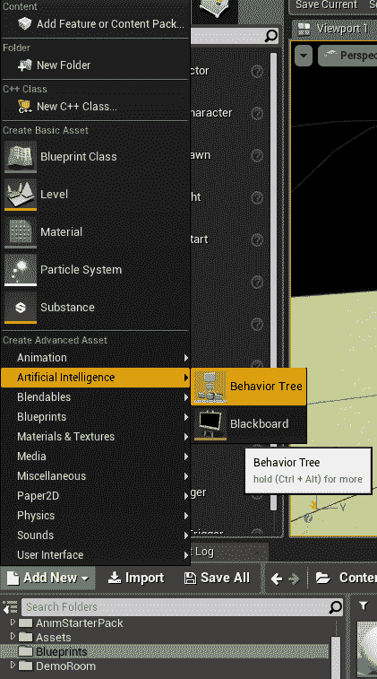
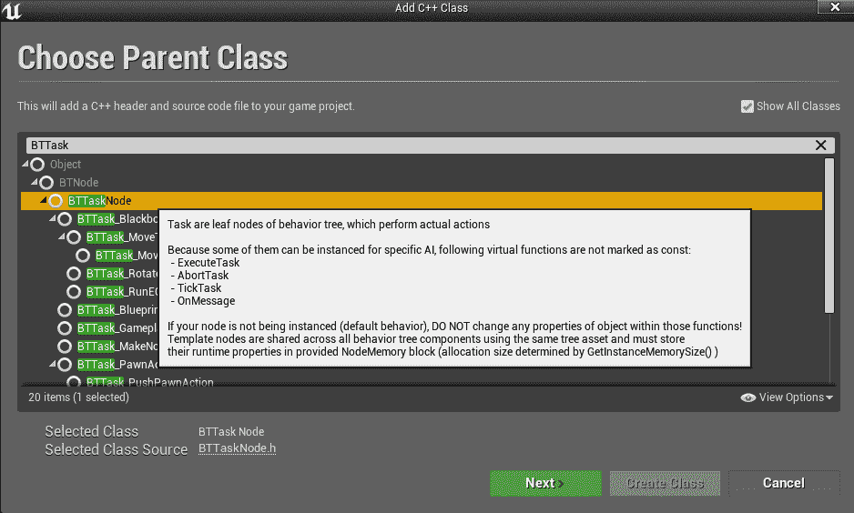
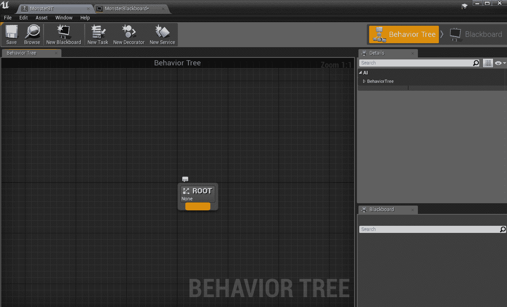
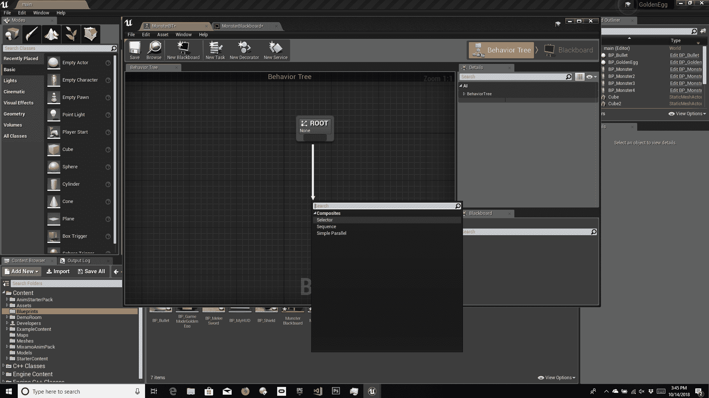
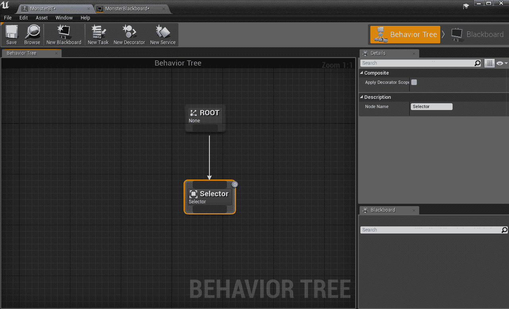
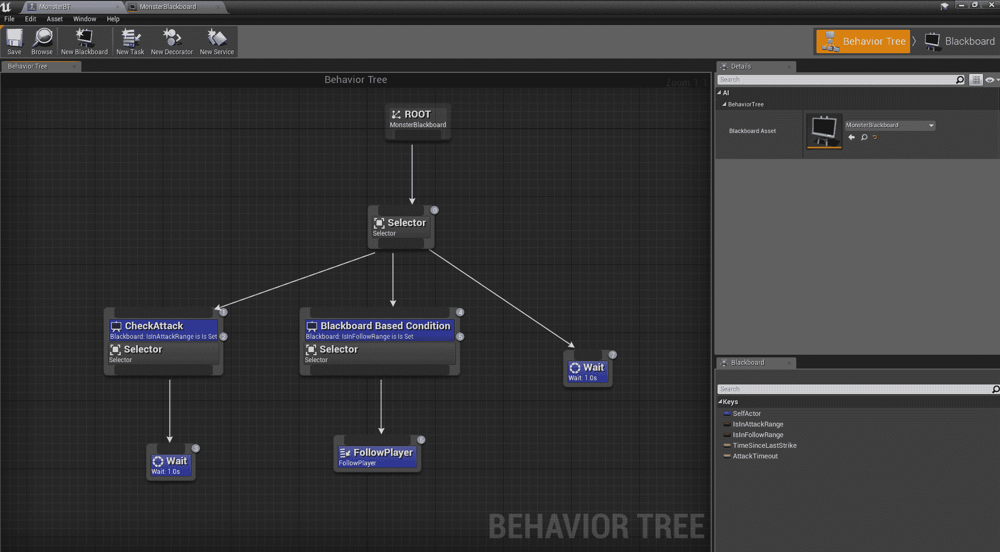
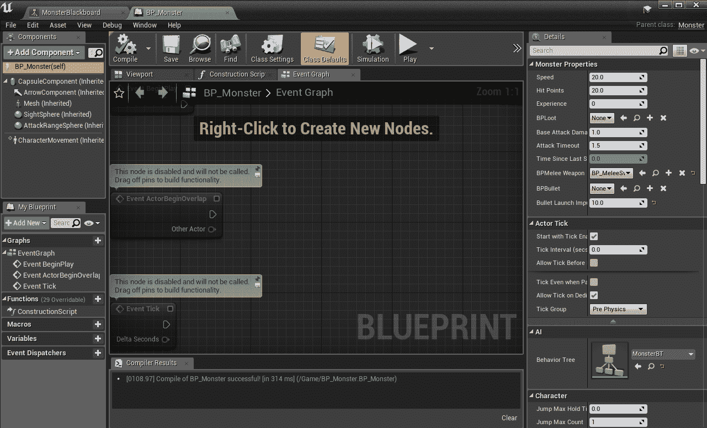
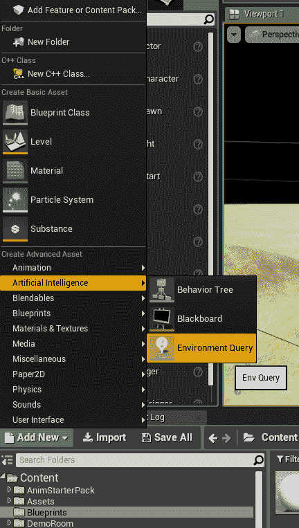

# 十二、使用高级人工智能构建更聪明的怪物

到目前为止，我们遇到的怪物并不多。他们站在一个地方，直到他们进入射程看到你，然后他们走向你，要么进行近战攻击，要么进行射击攻击，这取决于你设置了什么。在真实的游戏中，你希望你的角色做得更多，这样他们看起来更真实。这就是**人工智能** ( **AI** )的用武之地。

人工智能是一个巨大的话题，有整本书都在讨论它，但是我们将讨论 UE4 支持人工智能编程的一些方式，这样你就可以轻松地创建更真实的怪物。我们将快速概述以下主题:

*   导航-寻路和导航网格
*   行为树
*   环境查询系统
*   棉屑
*   机器学习和神经网络
*   遗传算法

如果你对学习更多感兴趣，那么你可以看看很多伟大的书籍，更深入地了解你还可以用人工智能做什么。

# 导航-寻路和导航网格

现在，我们创造的怪物只向一个方向移动——直线直接向你的位置移动。但是如果路上有山、建筑物、树木、河流或其他物体呢？在许多情况下，直线是不可能的。现在，如果怪物撞到墙上，它只会呆在那里，这不太现实。这就是寻路的好处。

# 什么是寻路？

寻路是一种找出到达目的地的路径(通常是最短和/或最简单的路径)的方法。将整个环境想象成一个网格，每个单元格中的数字表示导航有多困难。所以一个有墙挡住路的细胞会有很高的值，一条陡峭的路径会比一条容易的路径有更高的值。寻路的目标是当你把路径上的所有单元格相加时，找到整体值最低的路径。

有不同的算法或方法来处理可用的寻路。最著名的一颗叫做 A*(发音为 *A 星*)。

# 什么是 A*？

这里我们不会用 A*了，但是如果你打算以后做 AI 编程的话，你至少应该熟悉一下，所以我做一个简单的概述。A*基本上搜索角色周围的单元格，优先选择成本最低的单元格。它计算到目前为止的路径成本(通过将成本加起来直到那个点)加上一个启发式算法，一个从那个点到目标的成本猜测。

计算启发式方法有很多方法。它可以是一些简单的东西，比如直接到目标的距离(你可能会说，就像乌鸦飞一样)。如果启发式算法实际上比实际成本低，对结果会更好，所以效果很好。

一旦你找到了成本最低的细胞，再往前走一步，看看细胞周围的细胞。你继续，直到你达到目标。如果你发现自己在一个你以前去过的牢房里，这种方式的总路径成本较低，你可以用成本较低的路径代替它。这有助于您获得更短的路径。一旦你到达目标，你就可以沿着这条路往回走，你就会有一条通往目标的完整路径。

你可以在网上或人工智能书籍中找到更多关于 A*和其他寻路算法的信息。如果你在更复杂的项目中这样做，你将需要了解它们，但是对于这一点，UE4 有一个更简单更容易的方法:使用`NavMesh`。

# 使用导航网格

A `NavMesh`是 UE4 中的一个对象，你可以把它放在你的世界中，告诉它你希望角色能够导航到环境的哪个部分。为此，请执行以下步骤:

1.  增加一些障碍。您可以添加立方体、圆柱体或任何其他想要添加的东西来阻止移动，如下所示:


2.  一旦你按照你想要的方式设置了关卡，在“模式”窗口中，转到“体积”，找到“导航网格边界体积”，将它拖到关卡上，并缩放它以覆盖你想要怪物能够导航的整个区域。

If you try it now, you'll still see the monsters walk into walls and just stop. That's because we need to change the way movement is handled. We'll do this by creating our own `AIController` class.

# 创建一个控件类

让我们按照一步一步的步骤来完成:

1.  创建一个新的 C++ 类。在这种情况下，您需要选中“显示所有课程”复选框并搜索以找到`AIController`:


2.  命名类`MonsterAIController`。你的`MonsterAIController.h`应该是这样的:

```cpp
UCLASS()
class GOLDENEGG_API AMonsterAIController : public AAIController
{
    GENERATED_BODY()

public:
    //Start following the player
    void StartFollowingPlayer();
};
```

`MonsterAIController.cpp`应实现如下功能:

```cpp
void AMonsterAIController::StartFollowingPlayer()
{
    AActor *player = Cast<AActor>(
        UGameplayStatics::GetPlayerPawn(GetWorld(), 0));
    FVector playerPos = player->GetActorLocation();
    MoveToLocation(playerPos);
}
```

还要确保在文件顶部添加`#include "Kismet/GameplayStatics.h"`。

3.  回到`Monster.cpp`中的`Tick()`功能。在`else`子句中找到以下行:

```cpp
AddMovementInput(toPlayer, Speed*DeltaSeconds);
```

删除这一行，代之以:

```cpp

        if (GetController() != nullptr)
        {
            Cast<AMonsterAIController>(GetController())-
            >StartFollowingPlayer();
        }
```

同样在文件顶部添加`#include "MonsterAIController.h"`，进入`BP_Monster`，将 Ai 控制器类改为`MonsterAIController`。现在怪物可以绕着墙找到你了。如果他们不动，检查以确保`NavMesh`覆盖该区域，并且足够高以覆盖字符。

# 行为树

现在，所有控制怪物的逻辑都在`Monster.cpp`的`Tick()`功能中。但是到目前为止你所做的很简单。在大型复杂的游戏中，怪物会有更多的行为。他们可以在一个区域巡逻，直到他们看到你，或者甚至与你交流，只有在对话不顺利的情况下才会攻击。所有这一切的逻辑将变得过于复杂，以至于无法将所有东西都保存在一个函数中，甚至无法保存在`AMonster`类中。

幸运的是，UE4 还有另一种管理复杂任务的方式，那就是行为树。行为树允许您直观地设置一系列任务，使它们更容易管理。由于我们这里关注的是 C++，我们将通过这种方式创建任务本身，但是在蓝图中整体树似乎更容易管理。

行为树主要由两种不同类型的节点控制:

*   **选择器**:选择器将从左到右遍历其子节点，直到一个成功，然后返回树上。把它想象成一个`or`陈述——一旦它找到一个真实的论点，`or`本身就是真实的，所以它就完成了。
*   **序列**:相反，序列从左到右遍历孩子，直到一个失败。这更像是一个`and`语句，它一直持续下去，直到某个东西出现错误，从而使整个语句变成错误。

因此，如果您想运行多个步骤，您将使用序列，而如果您只想成功运行一个步骤并停止，您将使用选择器。

# 设置行为树

首先，您需要进入您的库(将它放在一个有意义的文件夹名称中，这样您就可以记住在哪里可以找到它，或者蓝图可以工作)，然后从添加新项中选择人工智能|行为树:



我把我的命名为`MonsterBT`。您还需要创建一个黑板。这将存储您将在行为树中使用的数据，并使您可以轻松地在人工智能控制器和行为树之间传输数据。您可以通过转到添加新项来创建它，这次选择人工智能|黑板。我把这个命名为`MonsterBlackboard`:


# 设置黑板值

接下来，您需要在刚刚创建的黑板中设置值。您可以通过选择“新密钥”，然后选择一种类型(在本例中为 Bool)来实现。为此，我添加了其中的两个，IsInAttackRange 和 IsInFollowRange:


你也可以给每个人描述它的用途。

# 设置任务

我们将创建一个 C++ 任务来处理玩家跟踪。为此，请执行以下步骤:

1.  添加一个新的 C++ 类，并基于 BTTaskNode(您需要查看所有类并搜索它):



我给新班级取名`BTTask_FollowPlayer`

2.  在`BTTaskFollowPlayer.h`中，增加以下内容:

```cpp
UCLASS()
class GOLDENEGG_API UBTTask_FollowPlayer : public UBTTaskNode
{
    GENERATED_BODY()

    virtual EBTNodeResult::Type ExecuteTask(UBehaviorTreeComponent& OwnerComp, uint8* NodeMemory) override;
    virtual void OnGameplayTaskActivated(UGameplayTask& Task) override {}
};
```

我们不会使用`OnGameplayTaskActivated`，但是，如果不声明它，您的代码可能不会编译(如果您抱怨它不在那里，这就是原因)

3.  在`BTTaskFollowPlayer.cpp`中，增加以下内容:

```cpp
#include "BTTask_FollowPlayer.h"
#include "MonsterAIController.h"

EBTNodeResult::Type UBTTask_FollowPlayer::ExecuteTask(UBehaviorTreeComponent& OwnerComp, uint8* NodeMemory)
{
    AMonsterAIController* Controller = Cast<AMonsterAIController>(OwnerComp.GetAIOwner());
    if (Controller == nullptr)
    {
        return EBTNodeResult::Failed;
    }

    Controller->StartFollowingPlayer();

    return EBTNodeResult::Succeeded;
}
```

Once you have this working, you can go back and create another `BTTask` to handle attacking too, as well as any other behaviors you might want.

# 设置行为树本身

一旦设置了任务，就该设置树本身了:

1.  双击它打开蓝图:



2.  单击根节点底部的黄色区域，并将其拖出以创建一个新节点(它是黑色的，但当鼠标滑过它时会变成黄色)。
3.  从出现的菜单中选择类型(我们将使用选择器):



The selector icon in the center tab

4.  您应该具备以下条件:



如前所述，选择器将按从左到右的顺序遍历节点，直到一个成功，然后停止。在这种情况下，我们有三种可能的状态:攻击范围内、视距内和两者都没有(忽略玩家)。首先，你要检查你是否足够接近攻击，这意味着你要检查你的黑板中的 IsInAttackRange。

不要先进行跟随，因为攻击范围在技术上仍然在跟随范围内，但是你不想使用跟随功能，所以选择器会在检查跟随范围后停止，因为这是它进行的第一次检查，所以它永远不会检查攻击范围(这是它真正应该检查的)。

要检查它需要处于哪种状态，您需要检查 Blackboard 值，这是通过使用装饰器来完成的。为此，请单击选择器的底部，并像创建节点时那样向左拖动一个新节点，这次选择一个复合选择器节点。此节点允许您右键单击；选择添加装饰器...，并确保选择了 Blackboard 类型。添加后，您可以选择顶部的蓝色装饰器。您应该能够检查键查询 IsSet 并选择您想要检查的值，在这种情况下是 IsInAttackRange(如果它没有显示，请确保在细节中设置 MonsterBlackboard 作为黑板；正常情况下应自动设置):


攻击节点最终将转到一个攻击任务，但目前，我只是放入一个等待作为占位符(一个内置任务，允许您指定等待时间，单位为秒)。

在它的右边，您还想添加另一个带有检查 IsInFollowRange 的装饰器的复合。这将使用您创建的新任务(如果它没有出现，请确保您已经编译了代码并且没有任何错误)。

在右侧，我添加了一个等待任务，以防两种情况都失败。完成后，你应该有这样的东西:



现在，您已经准备好返回并修改您现有的代码来使用所有这些。

# 更新 MonsterAIController

现在，您将为您的`AIController`类添加更多功能，以支持行为树:

1.  你的新`MonsterAIController.h`应该是这样的:

```cpp
UCLASS()
class GOLDENEGG_API AMonsterAIController : public AAIController
{
    GENERATED_BODY()

public:
    AMonsterAIController(const FObjectInitializer& ObjectInitializer);

    virtual void Possess(class APawn* InPawn) override;

    virtual void UnPossess() override;

    UBehaviorTreeComponent* BehaviorTreeCmp;

    UBlackboardComponent* BlackboardCmp;

    //Start following the player
    void StartFollowingPlayer();
    void SetFollowRange(bool val);
    void SetAttackRange(bool val);
};
```

还要确保在文件顶部添加`#include "BehaviorTree/BehaviorTreeComponent.h"`。在这里，您将覆盖构造函数以及`Possess`和`UnPossess`类。`SetFollowRange`和`SetAttackRange`功能是新的，允许您设置黑板值。

2.  在`MonsterAIController.cpp`增加以下功能:

```cpp
AMonsterAIController::AMonsterAIController(const class FObjectInitializer& ObjectInitializer)
    : Super(ObjectInitializer)
{
    BehaviorTreeCmp = ObjectInitializer.CreateDefaultSubobject<UBehaviorTreeComponent>(this, TEXT("MonsterBT"));
    BlackboardCmp = ObjectInitializer.CreateDefaultSubobject<UBlackboardComponent>(this, TEXT("MonsterBlackboard"));
}

void AMonsterAIController::Possess(class APawn* InPawn)
{
    Super::Possess(InPawn);

    AMonster* Monster = Cast<AMonster>(InPawn);
    if (Monster)
    {
        if (Monster->BehaviorTree->BlackboardAsset)
        {
            BlackboardCmp->InitializeBlackboard(*Monster->BehaviorTree->BlackboardAsset);
        }

        BehaviorTreeCmp->StartTree(*Monster->BehaviorTree);
    }
}

void AMonsterAIController::UnPossess()
{
    Super::UnPossess();

    BehaviorTreeCmp->StopTree();
}

void AMonsterAIController::SetFollowRange(bool val)
{
    BlackboardCmp->SetValueAsBool("IsInFollowRange", val);
}

void AMonsterAIController::SetAttackRange(bool val)
{
    BlackboardCmp->SetValueAsBool("IsInAttackRange", val);
}
```

另外，在文件顶部添加以下几行:

```cpp
#include "Monster.h"
#include "BehaviorTree/BehaviorTree.h"
#include "BehaviorTree/BlackboardComponent.h"
```

`StartFollowingPlayer`保持不变，所以这里没有列出，但一定要把它留在那里！现在是时候更新你的`Monster`类了(在你这样做之前你无法编译)。

# 更新怪物类

我们将在`Monster`课程中进行以下更新:

*   在`Monster.h`中，您将进行的唯一更改是添加以下代码行:

```cpp
    UPROPERTY(EditDefaultsOnly, Category = "AI")
        class UBehaviorTree* BehaviorTree;
```

*   在`Monster.cpp`中，您将对`Tick()`功能进行一些重大更改，因此这里是完整版本:

```cpp
// Called every frame
void AMonster::Tick(float DeltaSeconds)
{
    Super::Tick(DeltaSeconds);

    // move the monster towards the player 
    AAvatar *avatar = Cast<AAvatar>(
        UGameplayStatics::GetPlayerPawn(GetWorld(), 0));
    if (!avatar) return;

    FVector playerPos = avatar->GetActorLocation();
    FVector toPlayer = playerPos - GetActorLocation();
    float distanceToPlayer = toPlayer.Size();
    AMonsterAIController* controller = Cast<AMonsterAIController>(GetController());

    // If the player is not the SightSphere of the monster, 
    // go back 
    if (distanceToPlayer > SightSphere->GetScaledSphereRadius())
    {
        // If the player is OS, then the enemy cannot chase 
        if (controller != nullptr)
        {
            controller->SetAttackRange(false);
            controller->SetFollowRange(false);
        }
        return;
    }

    toPlayer /= distanceToPlayer;  // normalizes the vector 

                                   // At least face the target 
                                   // Gets you the rotator to turn something 
                                   // that looks in the `toPlayer` direction 
    FRotator toPlayerRotation = toPlayer.Rotation();
    toPlayerRotation.Pitch = 0; // 0 off the pitch 
    RootComponent->SetWorldRotation(toPlayerRotation);

    if (isInAttackRange(distanceToPlayer))
    {
        if (controller != nullptr)
        {
            controller->SetAttackRange(true);
        }

        // Perform the attack 
        if (!TimeSinceLastStrike)
        {
            Attack(avatar);
        }

        TimeSinceLastStrike += DeltaSeconds;
        if (TimeSinceLastStrike > AttackTimeout)
        {
            TimeSinceLastStrike = 0;
        }

        return;  // nothing else to do 
    }
    else
    {
        // not in attack range, so walk towards player 
        //AddMovementInput(toPlayer, Speed*DeltaSeconds);

        if (controller != nullptr)
        {
            controller->SetAttackRange(false);
            controller->SetFollowRange(true);
        }
    }
}
```

The changes are to set the values for both the attack and follow ranges. The code for attacking is still in there, but if you move TimeSinceLastStrike and AttackTimeout into the Blackboard, you can use that to move all that functionality into a `BTTask`. Now make sure everything compiles.

*   一旦编译完成，你需要打开`BP_Monster`蓝图，这样设置行为树(如果你想让单个怪物不一样，也可以在单个怪物上设置):



还要确保人工智能控制器设置为 MonsterAIController。如果你在这一点上运行游戏，功能应该是相同的，但是行为树将控制玩家的跟随。

如果你想了解更多，考虑将`Attack`代码移入`BTTask`类，并研究当你在范围之外的时候怪物能做什么(阅读下一节中可能有帮助的内容)。

# 环境查询系统

**环境查询系统** ( **EQS** )是新的，仍处于试验阶段。它们允许您在行为树中创建一个查询，以便在一个级别中搜索项目，并找到最符合您设置的条件的项目。也许你想让你的怪物在你设定的路标之间游荡，而不是在玩家不在范围内时站着不动。您可以设置一个查询来查找最接近的查询，或者使用一些其他条件。EQS 允许你这么做。

您需要在设置中启用此功能才能使用它们。为此，请执行以下步骤:

1.  转到编辑|编辑器首选项:


2.  在实验|人工智能下，勾选环境查询系统:


3.  通过转到添加新项|人工智能来添加新查询。环境查询现在将出现在行为树和黑板下:



你还需要在蓝图中创建一个`Context`和一个`Generator`(T2 将获得特定类型的所有物品，例如航路点)。要实际运行查询，您需要在行为树中创建一个“运行 EQS 查询”任务节点。有关环境查询系统如何工作的更多信息，请参见的虚幻文档。

# 棉屑

如果你有很多怪物在屏幕上同时移动，你会希望他们以一种看起来真实的方式移动。你不希望他们走到一起或者朝着不同的方向走。

人工智能研究人员对此进行了研究，并提出了一些算法来现实地处理这一问题。它们被称为群集算法，因为它们基于一群鸟的行为。

当一起行动时，怪物们必须考虑的不仅仅是到达同一个目标。他们还必须考虑到和他们一起移动的怪物。他们必须确保不要离周围的怪物太近，也不要离得太远，否则它们会散开。

在许多情况下，有一个怪物被选为领导者。那个怪物朝目标前进，其他人则专注于跟随那个首领。

网上有很多关于蜂拥的好参考。它没有内置在 UE4 中，但你可以购买扩展或编程自己的植绒系统。

# 机器学习和神经网络导论

机器学习和神经网络是一个巨大的话题，所以我在这里只做一个简单的介绍。机器学习是你如何教一个程序弄清楚如何对某件事做出反应，而不仅仅是给它制定规则。有许多不同的算法可以做到这一点，但它们都需要大量的样本数据。

基本上，你给学习程序大量的示例案例(越多越好)，*和*每个案例的结果最好。你可以用不同的方式给他们打分。通过查看这么多案例，它可以根据过去看到的结果对类似案例做出最佳猜测。有了足够的训练数据，结果可能会非常好，尽管你仍然会遇到它不能很好地工作的情况。

由于这需要如此多的数据(更不用说处理能力)，除了极少数情况，这是由游戏公司在游戏发货前完成的(如果真的完成了——这种事情往往会被削减以利于截止日期)。培训是离线进行的，程序已经学会了怎么做。

神经网络是一种特殊类型的机器学习，用来模拟大脑处理数据的方式。有些节点像神经元一样工作。可以有多层节点，每层处理前一层的结果。

数据跨多个节点发送，每个节点根据某个阈值量调整数据。只有数据可以传递回(或转发到)节点，然后节点调整这些阈值，以获得更准确的训练数据结果。一旦训练好了，这些阈值就可以用于未来的决策。

虽然我们离制造真正的人工智能还有很长的路要走，但神经网络已经被用于产生有趣的结果。神经网络已经在特定类型的音乐上进行了训练，然后生成了非常令人印象深刻(和原创)的音乐，听起来与训练它的类型相似。我也听说过有人写神经网络试图写书。不过，我认为我们距离能够编写 UE4 程序的神经网络还有很长的路要走！

# 遗传算法

回忆你的高中生物；你可能学过遗传学。来自两个不同父母的染色体结合在一起，创造了一个结合了父母双方 DNA 的孩子，随机的基因突变也可以带来改变。遗传算法基于同样的原理。

就像达尔文的适者生存一样，你可以在代码中做一些非常相似的事情。遗传算法有三个基本原则:

*   **选择**:你挑成绩最好的例子，那些是下一代的基础。
*   **交叉**:然后将这两个选定的例子结合起来，创造一个孩子，这是两者的产物，就像在生物学中一样。
*   **引入随机基因突变**:可能有一些老的没有的好的性状，或者因为那些性状被其他性状压倒而被丢弃。这意味着你不会因为一些潜在的伟大特征不在原始群体中而错过它们。

# 摘要

正如你所看到的，人工智能是一个巨大的话题，我们这里只涉及到基础知识。我们已经复习了寻路的基础知识(使用导航网格)、行为树、环境查询系统、群集、机器学习和神经网络以及遗传算法。如果你想了解更多，这里有整本书，还有很多网站，比如[http://aigamedev.com/](http://aigamedev.com/)，还有关于[https://www.gamasutra.com](https://www.gamasutra.com)的文章。

在下一节中，我们将学习施法来保护你的玩家免受怪物的伤害。