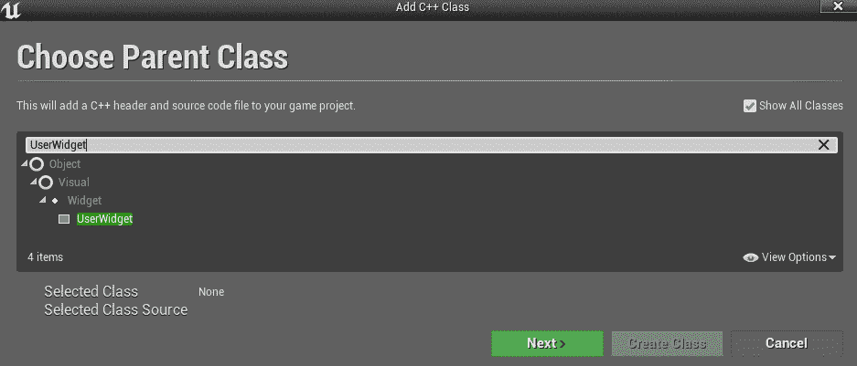
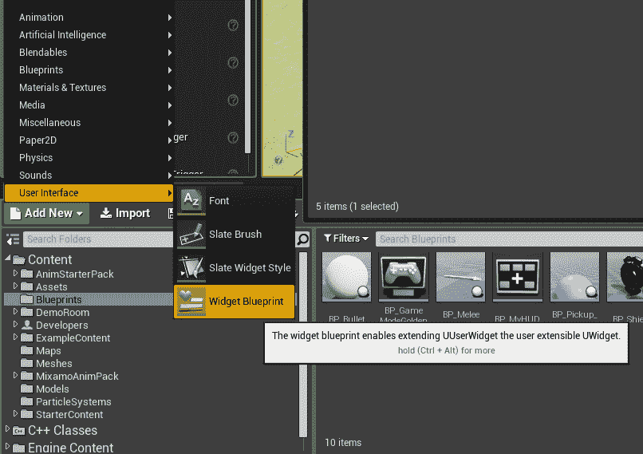
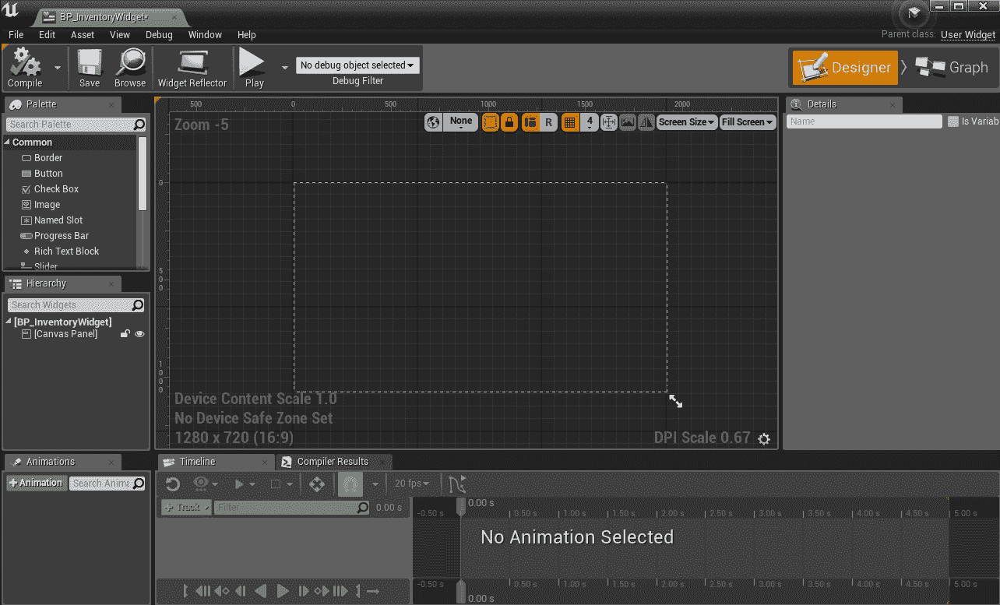
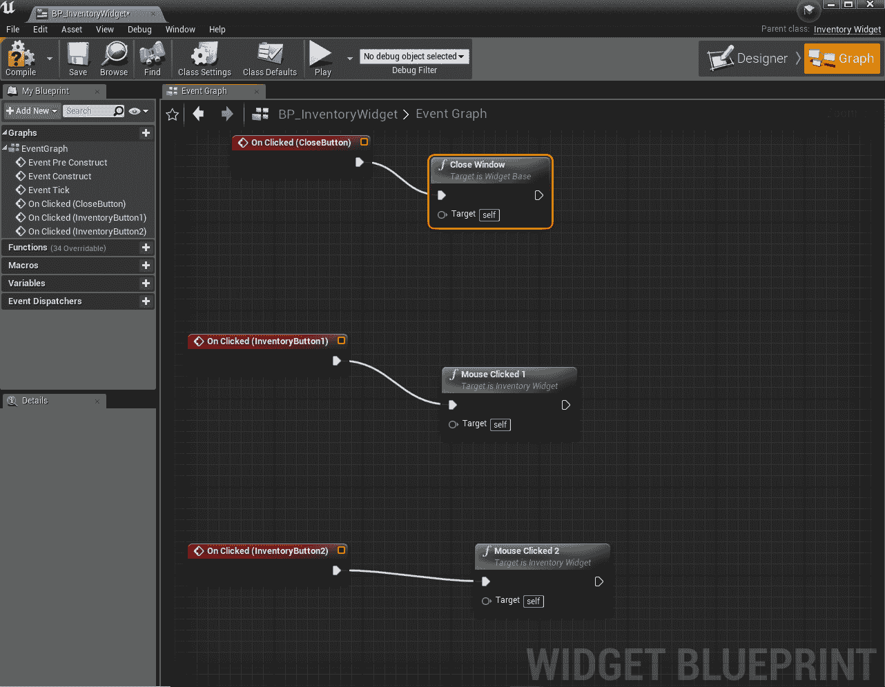
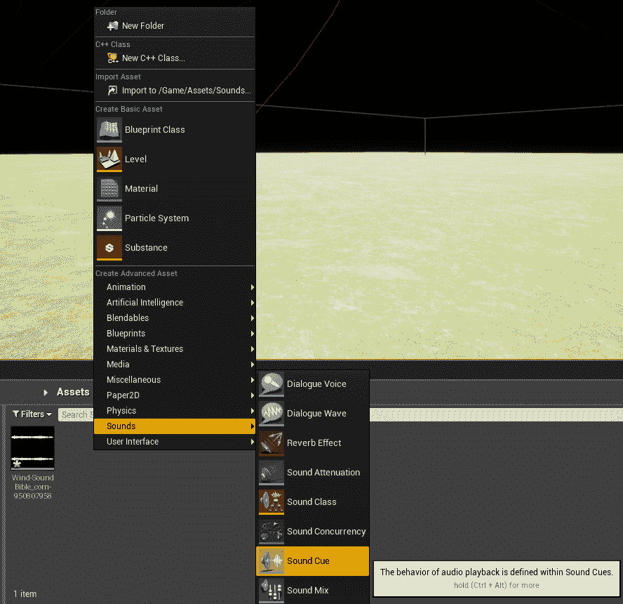
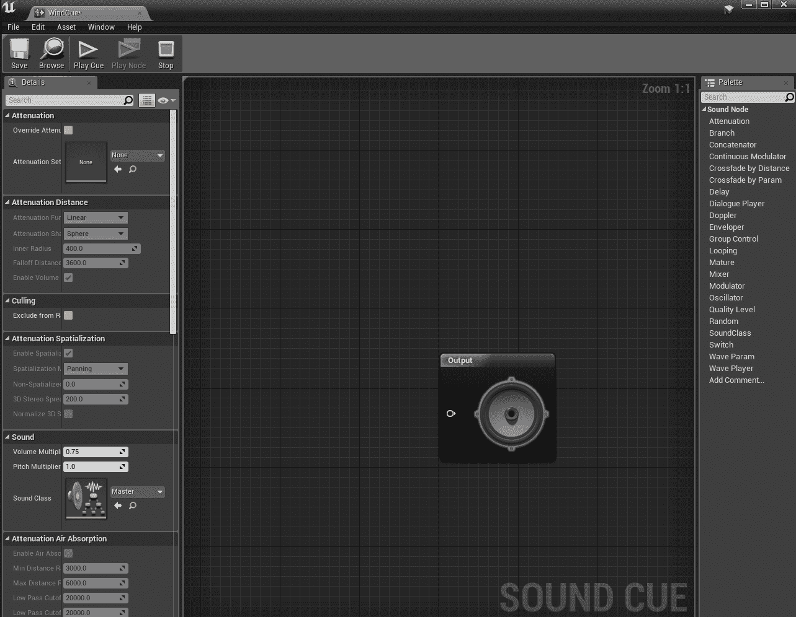
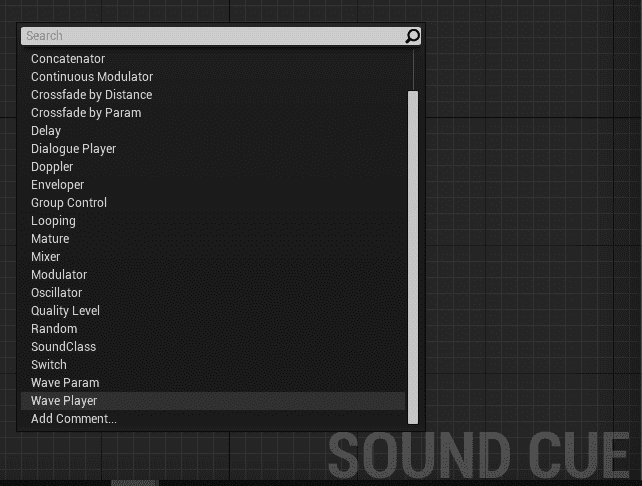
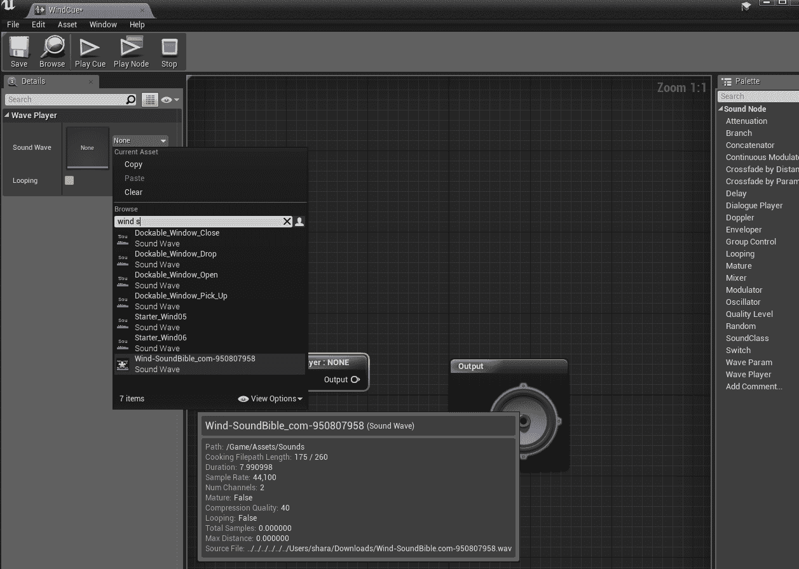
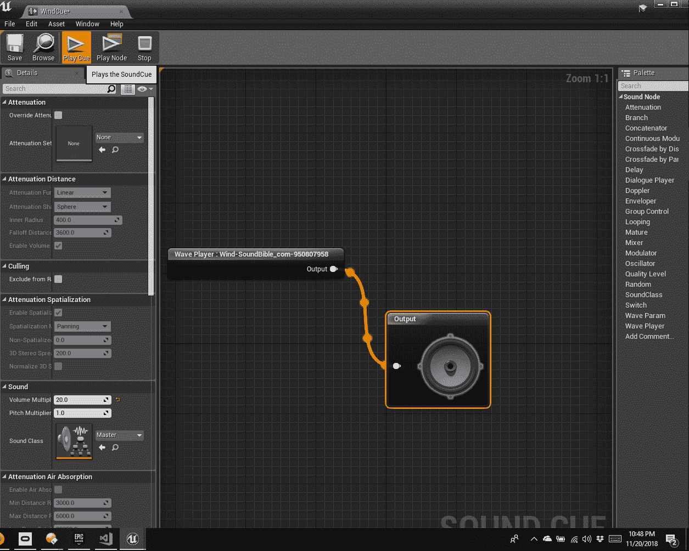

# 十四、利用 UMG 和音频改善用户界面反馈

用户反馈在游戏中非常重要，因为用户需要游戏中正在发生什么的信息(分数、hp、显示库存等)。在前面的章节中，我们已经创建了一个非常简单的 HUD 来显示你库存中的文本和物品，但是如果你想要一个看起来专业的游戏，你会想要一个比这个更好的**用户界面** ( **UI** )！

幸运的是，现在有更简单的方法来使用虚幻运动图形用户界面设计器(UMG)来构建用户界面，这是 UE4 包含的一个系统，就是为了这个目的。本章将向您展示如何使用它来继承我们之前所做的工作，并制作看起来更好、功能更多的东西。我们将开始更新清单窗口，我将建议您如何继续该过程并更新 UI 的其余部分。

另一种提供反馈的方式是通过音频，或者在游戏本身中，或者在您与它交互时通过 UI，因此我们也将介绍如何播放声音。

我们将讨论的主题如下:

*   什么是 UMG？
*   更新库存窗口
*   布局您的用户界面
*   更新您的平视显示器并添加健康栏
*   播放音频

# 什么是 UMG？

您可能已经注意到，我们在屏幕上绘制的代码非常复杂。每个元素都需要手动放在屏幕上。你可能会问自己有没有更简单的方法。还有！这是虚幻运动图形用户界面设计师，或 UMG。

UMG 通过使用特殊的蓝图简化了创建用户界面的过程，让你可以直观地布局界面。这也可以让你有一个精通技术的艺术家为你做布局，而你连接一切。我们将使用这个，但是因为这是一本 C++ 的书，我们将处理 C++ 中的大部分幕后功能。

为了使用 UMG，首先你需要在你的 Visual Studio 项目中找到`GoldenEgg.Build.cs`文件。`.cs`文件通常是 C#，而不是 C++，但是您不必担心这一点，因为我们只会对该文件进行微小的更改。找到这一行:

```cpp
PublicDependencyModuleNames.AddRange(new string[] { "Core", "CoreUObject", "Engine", "InputCore" });
```

并将以下内容添加到该列表中:

```cpp
, "UMG", "Slate", "SlateCore"
```

一旦这样做，您可能需要重新启动发动机。然后你就可以在 UMG 编码了！

# 更新库存窗口

我们将从更新库存窗口开始。我们现在拥有的不是一个真实的窗口，只是屏幕上绘制的图像和文本，但是现在您将看到如何轻松创建看起来更像真实窗口的东西——带有背景和关闭按钮，代码将会简单得多。

# WidgetBase 类

要为 UMG 小部件创建一个 C++ 类，需要基于`UserWidget`创建一个新类。要在添加新的 C++ 类时找到它，您需要选中显示所有类并搜索它:



说出你的班级`WidgetBase`。这将是您创建的任何其他小部件类的基类。这允许您将功能放在这个类中，该类将在许多不同的小部件中重用。在这种情况下，我把`CloseButton`的功能放在那里。不是所有的小部件都需要一个，但是如果你正在尝试一个标准的窗口，这通常是一个好主意。

以下是`WidgetBase.h`的代码:

```cpp
#include "CoreMinimal.h"
#include "Blueprint/UserWidget.h"
#include "UMG/Public/Components/Button.h"
#include "WidgetBase.generated.h"

/**
 * WidgetBase.h
 */
UCLASS()
class GOLDENEGG_API UWidgetBase : public UUserWidget
{
    GENERATED_BODY()

public:
    UPROPERTY(meta = (BindWidgetOptional))
    UButton* CloseButton;

    bool isOpen;

    bool Initialize();
    void NativeConstruct();

    UFUNCTION(BlueprintCallable)
    void CloseWindow();
};
```

这将设置允许您使用按钮关闭窗口的所有代码。`CloseButton`将是我们在设计蓝图中创建的按钮的名称。

线`UPROPERTY(meta = (BindWidgetOptional))`应该会自动将`CloseWindow`变量链接到我们稍后将创建的蓝图中同名的`Button`对象。如果您知道小部件将一直在那里，您可以使用`UPROPERTY(meta = (BindWidget))`来代替，但是在这种情况下，可能没有关闭窗口所需的按钮。

这里是`WidgetBase.cpp`:

```cpp
#include "WidgetBase.h"
#include "Avatar.h"
#include "Kismet/GameplayStatics.h"

bool UWidgetBase::Initialize()
{
    bool success = Super::Initialize();
    if (!success)  return false;

    if (CloseButton != NULL)
    {
        CloseButton->OnClicked.AddDynamic(this, &UWidgetBase::CloseWindow);
    }

    return true;
}

void UWidgetBase::NativeConstruct()
{
    isOpen = true;
}

void UWidgetBase::CloseWindow()
{
    if (isOpen)
    {
        AAvatar *avatar = Cast<AAvatar>(
            UGameplayStatics::GetPlayerPawn(GetWorld(), 0));

        avatar->ToggleInventory();
        isOpen = false;
    }
}
```

If the UMG includes in this chapter don't work for you you might need to add `Runtime/` to the front of the path. But they should work like this (and do work in my project).

下面一行是设置`OnClicked`事件调用特定函数的内容:

```cpp
CloseButton->OnClicked.AddDynamic(this, &UWidgetBase::CloseWindow);
```

我们不再需要像以前那样设置输入设置中的所有内容，因为 UMG 按钮已经设置为处理`OnClicked`，您只需要告诉它调用什么功能。如果由于某种原因不起作用，我将在稍后的蓝图中通过设置`OnClicked`向您展示如何解决它。由于`CloseButton`是可选的，您确实需要检查它，以确保它没有设置为`NULL`以避免错误。

`isOpen`变量用于处理常见的用户界面问题，有时点击(或按键)注册多次，导致函数被调用多次，这可能会导致错误。通过在第一次调用`OnClicked`函数时将`isOpen`设置为真，您可以确保它不会运行多次，因为它只会在值为假时运行。当然，如果你重新打开窗口，你也需要确保该值被重置，这就是`NativeConstruct()`功能的作用。

# 清单获取类

现在，您将希望创建专门的类来处理库存小部件，从`WidgetBase`派生。如果由于某种原因，你不能找到`WidgetBase`来用通常的方式创建类，取消选中过滤器下的仅参与者。称这个为`InventoryWidget`。

一旦创建了这个类，就可以开始添加代码了。首先是`InventoryWidget.h`:

```cpp
#include "CoreMinimal.h"
#include "WidgetBase.h"
#include "UMG/Public/Components/Image.h"
#include "UMG/Public/Components/TextBlock.h"
#include "UMG/Public/Components/Button.h"
#include "InventoryWidget.generated.h"

/**
 * 
 */
UCLASS()
class GOLDENEGG_API UInventoryWidget : public UWidgetBase
{
    GENERATED_BODY()

public:
    const int kNumWidgets = 2;
    //image widgets
    UPROPERTY(meta = (BindWidget))
        UImage* InventoryImage1;

    UPROPERTY(meta = (BindWidget))
        UImage* InventoryImage2;

    //text widgets
    UPROPERTY(meta = (BindWidget))
        UTextBlock* InventoryText1;

    UPROPERTY(meta = (BindWidget))
        UTextBlock* InventoryText2;

    //Invisible Buttons
    UPROPERTY(meta = (BindWidget))
        UButton* InventoryButton1;

    UPROPERTY(meta = (BindWidget))
        UButton* InventoryButton2;

    bool Initialize();

    void HideWidgets();
    void AddWidget(int idx, FString name, UTexture2D* img);

    UFUNCTION(BlueprintCallable)
    void MouseClicked1();
    UFUNCTION(BlueprintCallable)
    void MouseClicked2();
};
```

这个文件要复杂得多。我们再次使用`BindWidget`在蓝图中设置对象。虽然您可以像我们以前那样在代码中布局小部件(但是您应该能够创建一个包含图像、文本和按钮的子 idget)，为了使事情更简单，我只是在屏幕上布局了两个，并分别引用它们。你可以以后自己多加练习。

因此，在这个特殊的例子中，我们为两个图像、两个文本块和两个按钮设置了小部件。有一个`Initialize`功能来设置这些，还有添加一个小部件、隐藏所有小部件以及每个按钮的鼠标点击处理程序的功能。

那我们需要写`InventoryWidget.cpp`。首先，在文件顶部添加 includes:

```cpp
#include "InventoryWidget.h"
#include "MyHUD.h"
#include "Runtime/UMG/Public/Components/SlateWrapperTypes.h"
```

然后设置`Initialize`功能:

```cpp
bool UInventoryWidget::Initialize()
{
    bool success = Super::Initialize();
    if (!success)  return false;

    if (InventoryButton1 != NULL)
    {
        InventoryButton1->OnClicked.AddDynamic(this, &UInventoryWidget::MouseClicked1);
    }
    if (InventoryButton2 != NULL)
    {
        InventoryButton2->OnClicked.AddDynamic(this, &UInventoryWidget::MouseClicked2);
    }

    return true;
}
```

该功能设置按钮的`OnClicked`功能。然后添加处理小部件的功能:

```cpp
void UInventoryWidget::HideWidgets()
{
    InventoryImage1->SetVisibility(ESlateVisibility::Hidden);
    InventoryText1->SetVisibility(ESlateVisibility::Hidden);
    InventoryImage2->SetVisibility(ESlateVisibility::Hidden);
    InventoryText2->SetVisibility(ESlateVisibility::Hidden);
}

void UInventoryWidget::AddWidget(int idx, FString name, UTexture2D* img)
{
    if (idx < kNumWidgets)
    {
        switch (idx)
        {
        case 0:
            InventoryImage1->SetBrushFromTexture(img);
            InventoryText1->SetText(FText::FromString(name));
            InventoryImage1->SetVisibility(ESlateVisibility::Visible);
            InventoryText1->SetVisibility(ESlateVisibility::Visible);
            break;
        case 1:
            InventoryImage2->SetBrushFromTexture(img);
            InventoryText2->SetText(FText::FromString(name));
            InventoryImage2->SetVisibility(ESlateVisibility::Visible);
            InventoryText2->SetVisibility(ESlateVisibility::Visible);
            break;
        }

    }
}
```

`HideWidgets`隐藏窗口中的所有小部件，这样如果窗口中什么都没有，它们就不会出现。`AddWidget`获取图像本身的索引、名称和纹理，然后为该索引设置小部件。文本小部件有一个`SetText`功能，可以让你进入`FText` ( `FText::FromString`将其从`FString`转换为`FText`)。图像小部件具有设置图像的`SetBrushFromTexture`。

最后，您需要设置`MouseClicked`功能:

```cpp
void UInventoryWidget::MouseClicked1()
{
    // Get the controller & hud 
    APlayerController* PController = GetWorld()->GetFirstPlayerController();
    AMyHUD* hud = Cast<AMyHUD>(PController->GetHUD());
    hud->MouseClicked(0);
}

void UInventoryWidget::MouseClicked2()
{
    // Get the controller & hud 
    APlayerController* PController = GetWorld()->GetFirstPlayerController();
    AMyHUD* hud = Cast<AMyHUD>(PController->GetHUD());
    hud->MouseClicked(1);
}
```

这些只是用按钮的索引调用抬头显示器的`MouseClicked`功能(提示:这不会编译，直到那些抬头显示器功能被更新以获取索引)。如果你想进一步试验，以后你可以根据点击的按钮寻找另一种方法来获得索引，这样你就可以对所有的按钮使用相同的功能。

# 设置小部件蓝图

接下来，您需要设置蓝图。由于这是一种特殊的蓝图，建立一个有自己的类有点棘手。你不能仅仅创建一个类的蓝图，否则你将没有一个设计蓝图。相反，您必须先创建设计蓝图，然后更改父级。

为此，请进入内容浏览器并选择要放入的目录，然后选择添加新项|用户界面|小部件蓝图:



重命名`BP_InventoryWidget`然后双击打开。你应该看到这样的东西:



在中间，你将在视觉上布局屏幕，方框代表你要瞄准的理论屏幕的边缘。在左侧，调色板向您展示了可以添加到屏幕上的基本用户界面对象。您将看到许多常见对象，如图像、文本栏、进度条、按钮、复选框和滑块。这是很多你基本上免费得到的功能。一旦你到了为你的游戏设置一个设置窗口的时候，很多设置都会派上用场。

但是首先，我们需要在这上面更改父类，您将在这里这样做。选择右上角的图形和顶部工具栏上的类设置，然后在类选项的详细信息下查看，并选择按父类的下拉列表。选择清单获取:


现在我们要回到设计器，开始布置屏幕！

屏幕上应该已经有一个画布面板了。你可以点击右下角并拖动使其成为你想要的大小。画布通常应该是全屏大小。所有其他用户界面小部件将进入画布。当你拖动它时，它会在屏幕上显示你想要的各种分辨率。你会想要选择一个类似于你的目标分辨率。

然后选择调色板下的边框，并将其拖到屏幕上。这将是窗口的背景。您可以单击角并将其拖动到您想要的大小。您也可以在右侧找到颜色栏(在“详细信息”下的“外观”>“画笔颜色”旁边)，然后单击它打开颜色选择器来选择背景颜色:


您也可以在“详细信息”下重命名对象。完成后，点按并拖移屏幕上的按钮，并将其放在背景的右上角。如果它试图填充整个边框对象，请确保在层次结构中选择“画布面板”，或者将其拖到边框对象之外，然后将其拖到顶部。一定要把这个命名为`CloseButton`。如果你想让它看起来更像一个关闭按钮，你也可以放一个带有字母 X 的文本对象。您应该取消选中“详细信息”中“行为”下的“启用”，这样它就不会阻止鼠标单击。

接下来，您将需要定位两个图像对象和两个文本对象(您可以稍后添加更多)。请确保名称与您在代码中使用的名称完全匹配，否则它们将不起作用。在文本字段中，您会发现设置字体要容易得多。在“详细信息|外观”下，您会发现字体选项就像您在任何文字处理器中习惯的一样，并且您可以使用已经在您的计算机上的字体(尽管，如果您仍然想要下载字体，没有什么能阻止您)。您也可以使用之前添加的字体。

另外，对于`OnClicked`，您会想要添加一个按钮。您可以在下面添加一个，但是我使用了一个通用的用户界面方法:不可见的按钮。将一个按钮拖出来，让它覆盖其中一个按钮的图像和文本。然后进入背景色，将 alpha (A)设置为`0`。阿尔法是衡量一种颜色透明度的标准，`0`意味着你根本看不到它。

If you later have trouble clicking the buttons other objects might be in the way. Try dragging them so they are behind the button or look into ways of disabling clicks on those objects.

最后，你应该有这样的东西:


此外，当您选择了边框时，请仔细注意右侧内容下的选项。这里是您可以设置水平和垂直对齐的地方。始终尝试设置这些，因此，如果您希望某些内容始终位于屏幕的左上角，对齐方式将设置为水平向左对齐和垂直向上对齐。如果您没有为每个对象设置对齐方式，不同屏幕分辨率下的结果可能是不可预测的。我以后会更深入地探讨这个问题。

但现在，这将是你的库存窗口。它不一定要看起来和我的一模一样，所以尽情享受视觉布局吧！但是，请记住，您可能不希望它占据整个屏幕，这样您就可以在单击后看到正在施放的法术(尽管您可以在稍后单击某个法术时查看关闭窗口)。

# AMyHUD 更改

但这还不是全部！我们仍然需要修改我们现有的类来支持这个新的 Widget，从`AMyHud`类开始。为了使事情更简单，我们不会在这里复制所有以前的功能。相反，我们将只是设置`OnClicked`功能来施法，因为这将比在屏幕上拖动物品更有用。UMG 不会自动处理右键单击，但是如果您以后想要添加它，您可以自己查看更多内容，还可以查看以前的单击和拖动功能，因此如果您认为以后可能需要，您可能想要注释掉旧代码，而不是删除它。

现在，`MouseMoved`和`MouseRightClicked`功能都没有了，`MouseClicked`功能现在取一个`int`索引。我们还有`OpenInventory`和`CloseInventory`的新功能，所以`MyHUD.h`现在应该有这个:

```cpp
    void MouseClicked(int idx);

    UPROPERTY(EditAnywhere, BlueprintReadWrite, Category = "Widgets") 
        TSubclassOf<class UUserWidget> wInventory;

    UInventoryWidget* Inventory;

    void OpenInventory();
    void CloseInventory();
```

还在文件顶部添加# include“inventorywidget . h”。其他一些功能也将被修改。所以，现在我们来看看`AMyHUD.cpp`，你会看到新版本的函数有多简单。以下是处理小部件的新功能:

```cpp
void AMyHUD::DrawWidgets()
{
    for (int c = 0; c < widgets.Num(); c++)
    {
        Inventory->AddWidget(c, widgets[c].icon.name, widgets[c].icon.tex);
    }
}

void AMyHUD::addWidget(Widget widget)
{
    widgets.Add(widget);
}

void AMyHUD::clearWidgets()
{
    widgets.Empty();
}
```

我们还需要将`MouseClicked`功能更新为:

```cpp
void AMyHUD::MouseClicked(int idx)
{
    AAvatar *avatar = Cast<AAvatar>(
        UGameplayStatics::GetPlayerPawn(GetWorld(), 0));
    if (widgets[idx].bpSpell)
    {
        avatar->CastSpell(widgets[idx].bpSpell);
    }

}
```

这将根据传入的索引施放咒语。然后是打开和关闭库存的新功能:

```cpp
void AMyHUD::OpenInventory()
{
    if (!Inventory)
    {
        Inventory = CreateWidget<UInventoryWidget>(GetOwningPlayerController(), wInventory);
    }
    Inventory->AddToViewport();
    Inventory->HideWidgets();
}

void AMyHUD::CloseInventory()
{
    clearWidgets();
    if (Inventory)
    {
        Inventory->HideWidgets();
        Inventory->RemoveFromViewport();
    }
}
```

主要部分是在`Viewport`中添加或删除新的 Widget。我们还希望可视化地隐藏小部件，以防止显示空的小部件，并在窗口关闭时清除所有小部件。

我们还更改了`struct Widget`删除所有定位信息。对它的任何引用都应该被删除，但是如果你以后遇到任何错误(除非你对头像类进行了更改，否则你将无法编译)，请确保`MouseMoved`和`MouseRightClicked`已经消失或被注释掉，并且没有其他任何东西引用它们。更新、更简单的小部件应该如下所示:

```cpp
struct Widget
{
    Icon icon;
    // bpSpell is the blueprint of the spell this widget casts 
    UClass *bpSpell;
    Widget(Icon iicon)
    {
        icon = iicon;
    }
};
```

# AAvatar 更改

在`AAvatar`中，我们将主要修改`ToggleInventory`功能。较新的函数如下所示:

```cpp

void AAvatar::ToggleInventory()
{
    // Get the controller & hud 
    APlayerController* PController = GetWorld()->GetFirstPlayerController();
    AMyHUD* hud = Cast<AMyHUD>(PController->GetHUD());

    // If inventory is displayed, undisplay it. 
    if (inventoryShowing)
    {
        hud->CloseInventory();
        inventoryShowing = false;
        PController->bShowMouseCursor = false;
        return;
    }

    // Otherwise, display the player's inventory 
    inventoryShowing = true;
    PController->bShowMouseCursor = true;
    hud->OpenInventory();
    for (TMap<FString, int>::TIterator it =
        Backpack.CreateIterator(); it; ++ it)
    {
        // Combine string name of the item, with qty eg Cow x 5 
        FString fs = it->Key + FString::Printf(TEXT(" x %d"), it->Value);
        UTexture2D* tex;
        if (Icons.Find(it->Key))
        {
            tex = Icons[it->Key];
            Widget w(Icon(fs, tex));
            w.bpSpell = Spells[it->Key];
            hud->addWidget(w);
        }    
    }
    hud->DrawWidgets();
}
```

如您所见，许多相同的 HUD 功能被重用，但是`OpenInventory`和`CloseInventory`的新功能现在从这里调用，因此 HUD 可以在添加小部件之前显示窗口，并移除窗口以关闭它。

另外，从`Yaw`和`Pitch`功能中删除以下行:

```cpp
        AMyHUD* hud = Cast<AMyHUD>(PController->GetHUD());
        hud->MouseMoved();
```

同时从`MouseRightClicked`中删除以下几行(或者删除该功能，但如果删除，请确保也从`SetupPlayerInputComponent`中删除):

```cpp
        AMyHUD* hud = Cast<AMyHUD>(PController->GetHUD());
        hud->MouseRightClicked();
```

最后，从`MouseClicked`中移除这些线(因为你不想在点击不属于清单的某个地方时意外触发法术):

```cpp
    AMyHUD* hud = Cast<AMyHUD>(PController->GetHUD());
    hud->MouseClicked();
```

现在你应该可以编译了。完成后，进入业务伙伴 _ 我的 HUD，将类别默认值>小部件>工作清单下拉列表更改为业务伙伴 _ 清单。

# 关于舔的一个注意事项

您的`OnClicked`功能可能无法正常工作(我自己也遇到了这个问题)。如果你找不到解决方案，你可以用蓝图绕过，这就是为什么我让所有的鼠标点击功能蓝图可调用。

如果发生这种情况，请进入小部件蓝图的设计器，单击每个按钮，在详细信息下找到事件，然后单击单击时旁边的绿色+按钮。这会将该按钮的`OnClicked`添加到图表中并切换到该按钮。您需要返回添加其他 2 个按钮。然后，从节点中拖出并添加所需的函数。应该是这样的:



# 布局您的用户界面

当你设计一个用户界面时，有一些重要的事情要记住，UMG 有工具让你更容易做到这一点。要记住的最重要的事情之一是，你的游戏不会总是以相同的分辨率运行。如果你在玩手机游戏，可能会有很多不同分辨率的不同设备，你希望你的游戏在所有这些设备上看起来基本相同。即使是游戏机也不再摆脱这个问题，因为 Xbox One 和 PS4 现在都有 4K 选项。所以，你的游戏需要以一种让这成为可能的方式来设置。

如果你把所有的小部件都做成特定的像素大小，然后以更大的分辨率运行，它可能会非常小，看起来不可读，按钮也很难点击。在较小的分辨率下，它可能太大而无法显示在屏幕上。所以，记住这一点。

您之前设置的画布面板将直观地向您展示它在您想要的尺寸下的外观。但是对于不同的尺寸，你需要记住几件事。

首先，一定要用主播。在详细信息下，您将看到锚的下拉列表。当您打开它时，您应该会看到如下内容:


蓝线左上角的九个选项是对齐对象。行与屏幕的顶部、中间和底部对齐，而列与左侧、中间和右侧对齐。因此，如果你有一些你总是想出现在屏幕左上角的东西(比如分数，或健康条)，你会选择左上角的选项。如果你想让其他东西水平和垂直居中，选择第二行，第二列。白色小方块基本上给你展示了定位。

剩下的选项给了你在整个屏幕上拉伸东西的方法(不管它是什么尺寸)。所以，如果你想在顶部、中部或底部水平拉伸一些东西，看看右边的栏。垂直的话，看下排。如果你想让一个窗口在整个屏幕上延伸，右下角的那个就很好。

如果您想要缩放调色板中的所有内容以适应屏幕大小，也可以从调色板中添加缩放框。尽管如果您有想要保持固定大小的内容，例如图像，您可以选中“内容大小”来防止它自动调整大小。

如果你想变得更高级，你可以添加代码来检查屏幕大小，并交换出部分或整个用户界面，但这超出了本书的范围，所以如果你想以后自己尝试，请记住这一点！

Another important things to keep in mind with your UI is localization. If you want to release your game anywhere outside your own country you will need to localize. This means you will have to get used to not just hardcoding text but use the built-in localization system to add string ids you've set up instead of hardcoding the text. The code will look for specific ids and swap them for the appropriate localized text. You can look into the built-in localization system here: [https://docs.unrealengine.com/en-us/Gameplay/Localization](https://docs.unrealengine.com/en-us/Gameplay/Localization).

This will also affect how you lay out your UI. The first time you localize your game in German, you'll find out that everything is twice as long! While you may be able to get your translators to come up with shorter ways to say the same thing, you will probably want to make text blocks longer than you think they need to be, or consider finding ways to make the text shrink to fit or scroll.

# 更新您的平视显示器并添加健康栏

我不会在这里给出完整的说明，但这里有一些关于更新你的平视显示器的提示。一旦你这样做了，它将进一步简化你的代码！

# 创建抬头显示器类

您需要为新的抬头显示器创建一个从 WidgetBase 派生的新类。在这种情况下，您将需要画布面板，但没有背景。确保所有的东西都能在整个屏幕上延伸。

您会希望将大部分用户界面保留在角落，因此您可以在屏幕的左上角添加一个进度条小部件来显示运行状况。此外，考虑添加一个文本小部件来告诉它是什么和/或将实际数字放在屏幕上。

对于消息，您可以将文本小部件与屏幕的中上对齐，并使用它们来显示文本。

# 添加健康栏

如果您添加了推荐的进度条小部件，您会发现现在绘制健康条要容易得多。您需要像使用其他小部件一样获得对它的引用。然后，你所需要做的就是调用`SetPercent`来显示当前的健康状况(并在它改变时重置它)。

你不再需要自己画整个东西，但是你可以使用`SetFillColorAndOpacity`自定义它的外观！

# 播放音频

我们将回到你的代码中，做最后一件真正有助于你的游戏反馈的事情，然而在某种程度上，它往往是任何人在创建游戏时考虑的最后一件事:音频。

音频确实可以增强你的游戏，从点击按钮时播放声音到添加音效、对话框、背景音乐和氛围。如果你晚上一个人在树林里散步，蟋蟀的鸣叫声，你自己的脚步声，不祥的音乐真的可以设定心情。或者，你可以用鸟叫声和快乐的音乐来营造完全不同的心情。一切都取决于你！

我们只是在你施放暴风雪法术时增加一个声音。所以寻找一种自由风的声音。有很多网站提供免版税的声音文件。如果你使用它们，他们中的一些人希望你在你的学分中提到它们。为此，我在一个名为[SoundBible.com](http://www.soundbible.com)的网站上找到了一个公共域声音，这意味着任何人都可以使用它。但是找一个你喜欢的。

有些网站可能会让你注册下载声音。如果你有野心，你甚至可以自己录一张！

I used a .wav file, a standard format, although other formats will probably work. But for small sounds, you may want to stick to .wav because MP3s use compression, which might slow down your game slightly because it needs to de-compress it.

有了喜欢的文件后，为声音创建一个文件夹，并将声音文件从文件管理器拖到其中。然后右键单击同一个文件夹，选择声音|声音提示:



将其重命名为 WindCue，并双击它以在蓝图编辑器中打开它。应该是这样的:



SoundCue 是我们设置声音的地方。首先，右键单击任意位置并选择波形播放器添加一个:



然后，选择波形播放器。在详细信息中，您将看到声波选项。选择下拉列表，搜索您添加的`.wav`文件进行选择:



然后，从波形播放器的输出中单击并拖动到输出中(带有小扬声器图像)。这会把它连接起来。要测试它，您可以选择播放提示，当声音传输到输出时，您应该会听到并看到线路亮起橙色:



如果你不喜欢它听起来的样子，试试细节下面的选项。我用的那个太安静了，不符合我的要求，所以我增加了音量倍增器，让它大得多。

现在我们已经设置好了声音，是时候将它添加到代码中了。在这种情况下，我们将更新`AMyHUD`类。首先，在`MyHUD.h`的顶部增加以下一行:

```cpp
#include "Sound/SoundCue.h"
```

另外，在同一文件中添加以下内容:

```cpp
UPROPERTY(EditAnywhere, BlueprintReadWrite, Category = "Sound")
    USoundCue* audioCue;
```

您会希望将`SoundCue`引用存储在蓝图中，以便于更新。

现在，转到`MyHUD.cpp`并在调用`CastSpell`后将以下行添加到您的`MouseClicked`功能中:

```cpp
        UGameplayStatics::PlaySound2D(this, audioCue);
```

这实际上会播放声音。确保该文件中有`#include "Kismet/GameplayStatics.h"`以使其工作。在这种情况下，由于它是正确的球员无论何时你投它，一个 2D 的声音将是好的。如果你想让你环境中的东西(比如怪物)发出自己的声音，你会想研究 3D 声音。UE4 会让你这么做的！

现在，回到编辑器并编译所有内容，然后回到 HUD 蓝图。您需要将您创建的`SoundCue`添加到蓝图中。

您可以从下拉列表中选择它，并像这样搜索它:


现在，保存、编译并运行游戏。跑来跑去，直到你获得一个暴雪法术，然后点击 *I* 打开库存。点击暴雪咒语。你不仅应该看到施法，还应该听到它！

# 摘要

您现在已经很好地了解了如何使用 UMG 创建用户界面，以及如何添加音频来进一步增强您的体验！还有很多工作要做，但是考虑一下那种做法！

我们已经完成了代码，但还没有完成书。接下来，我们将看看如何获取我们所拥有的，并在虚拟现实中查看它！我会给你一些提示，然后我们会以 UE4 中一些其他高级特性的概述来结束。