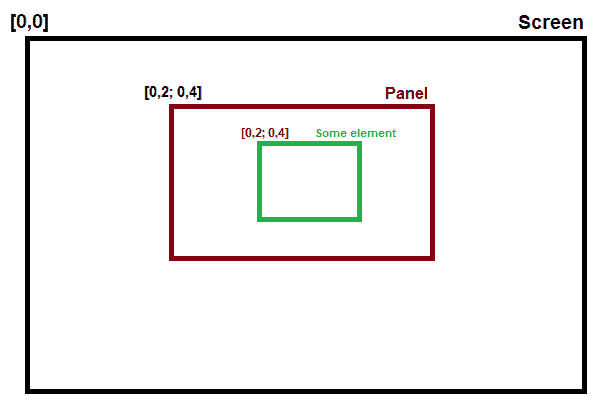
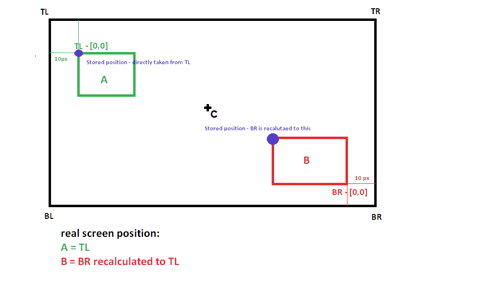
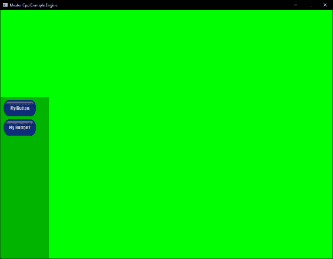
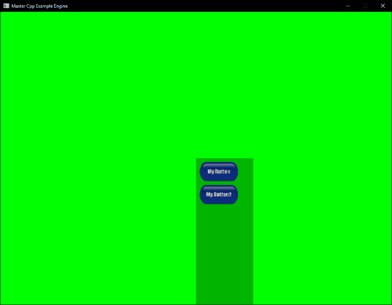

# 六、创建图形用户界面

在游戏中，用户交互是设计中极其重要的一部分。能够为用户提供视觉信息和视觉选择是**图形用户界面** ( **图形用户界面**)的作用。像本书中讨论的许多其他系统一样，也有现有的库可供使用。开源游戏开发世界中最常见的一个是**疯狂漩涡 GUI** ( **CEGUI** )。虽然 CEGUI 是一个非常健壮的 GUI 系统实现，但是这种健壮带来了复杂性，老实说，大多数时候你真的只需要一个文本标签，一个简单的按钮，也许还有一个复选框和图标支持。有了这些简单的构件，你可以创造很多。

在本章中，我们将构建构建块并创建一个简单的图形用户界面系统。应该注意的是，从头开始创建一个完整的、生产就绪的图形用户界面系统是一项艰巨的任务，而不是一个章节的任务。因此，我们将专注于核心概念，并构建一个可以在以后扩展和扩展的系统。我们的图形用户界面将不使用任何应用编程接口细节，并将继续建立在前面章节创建的结构基础上。本章涵盖的主题如下:

*   坐标系和定位
*   添加控制逻辑
*   呈现图形用户界面

本章的完整代码示例可以在代码存储库中的`Chapter06`文件夹中找到。为了简洁起见，我将从这些部分中省略一些不重要的代码行，并且可能会更频繁地跳转到文件和类。

# 坐标系和定位

每个图形用户界面系统最重要的部分之一是对象/元素如何在屏幕上定位。在大多数情况下，图形应用编程接口使用称为屏幕空间的坐标，通常以绝对范围[-1，1]表示。虽然这有利于渲染，但在尝试开发我们的图形用户界面系统时，这可能会导致一些问题。让我们以使用绝对系统的想法为例。在这个系统中，我们将显式地将图形用户界面中的每个元素设置为一个真实的像素坐标。这可能很容易实现，但只有当游戏的分辨率保持不变时才会起作用。如果我们在任何时候改变分辨率，元素将保持锁定在它们的像素坐标，并且不会缩放以匹配新的分辨率。

另一种选择是创建一个相对系统，其中每个图形用户界面元素的位置将相对于其他元素或屏幕位置进行描述。这种方法比绝对系统好得多，但仍然存在一些缩放问题。例如，如果我们有一个元素放在屏幕的左上角，有一个小的偏移量，如果在任何时候游戏的分辨率改变了，我们使用的间距也会改变。

我们要构建的是 CEGUI 采用的一种有点类似的方法，它是前面提到的两种解决方案的组合。在此过程中，我们还将添加现代图形用户界面中使用的另一种常见约定:在*面板*中包含分组元素。我们希望将 GUI 元素分组到面板中有几个很好的理由。第一个是，如果我们想移动一堆元素，比如一个带有生命值、弹药和物品指示器的状态栏，如果我们将它们分组在一个面板中，我们只需要移动面板，所有的元素就会跟着移动，正确定位。这就引出了原因二:通过将面板中的元素组合在一起，我们可以定义元素相对于面板位置的位置，而不是将元素位置设置为像素坐标，甚至相对于屏幕位置。

以下是描述该设计布局的示意图:



可以看到，采用了相对和绝对定位相结合的方式，但这次相对的起点不是整个屏幕的原点**【0，0】**，而是我们面板的原点**【0，0】**。虽然面板的原点在屏幕上已经有了一些坐标，但是我们并不使用这些坐标来设置元素的位置。

理论上，我们现在在面板中有可扩展的元素，但是我们仍然需要一种方法来将面板锁定在适当的位置，而不管屏幕分辨率如何。这就是图形用户界面锚系统的概念。很有可能，如果你以前使用过图形用户界面，你会看到主播们在行动。在我们的例子中，为了节省时间，我们将稍微简化这个概念。在我们的系统中，每个面板都能够相对于五个锚点之一设置其原点:左上角、右上角、左下角、右下角和中心。

下图演示了这一概念:



好的，那么我们如何实现这些概念并在代码中设计它们呢？让我们从一个所有其他元素都将继承的`IGUIElement`类开始。看看`IGUIElement`班:

```cpp
class IGUIElement
{
public:
virtual void Update() = 0;
glm::vec2 GetPosition() { return m_position; };
protected:
glm::vec2 m_position;
};
}
```

首先，我们的元素没有那么复杂。每个元素都有一个`Update()`函数，以及一个返回元素位置的 getter 函数。我们将在本章的后面详细介绍这门课。

我们可以实现的系统的下一部分是面板的概念。先来看看`IGUIPanel.h`的头文件:

```cpp
...
static enum class GUIAnchorPos {
TopRight,
TopLeft,
BottomRight,
BottomLeft,
Center
};
...
```

文件以一个名为`GUIAnchorPos`的`enum class`的声明开始；这`enum`将让元素访问计算的锚点。我们将它变成一个枚举类，而不仅仅是`IGUIPanel`类中的`enum`，因为这将允许元素访问锚点，而不需要`IGUIPanel`实例。稍后，我们将看到一个函数，它将这些枚举值连接到已经计算的屏幕位置:

```cpp
...
IGUIPanel(glm::vec4 panelBounds = glm::vec4(0,0,200,480),
glm::vec2 panelAnchor = glm::vec2(0,0),
glm::vec2 offset = glm::vec2(0,0));
...
```

感兴趣的文件的下一部分是构造函数。这里，我们请求传入一个向量 4 来定义要创建的面板的边界。接下来，我们请求向量二作为面板锚点的原点位置，以及向量二作为面板位置的偏移量或*填充*。您还会注意到，我们还为每个参数提供了一些默认值。我们这样做有几个原因，但最大的原因是我们希望能够创建图形用户界面元素，并默认将它们附加到面板上。通过提供默认值，如果我们确实创建了一个图形用户界面元素，并且没有现有的面板来连接它，我们可以创建一个，而不需要在创建时传递值。我们将在本章稍后部分重新讨论这一点。让我们继续执行:

```cpp
IGUIPanel::IGUIPanel(glm::vec4 panelBounds, glm::vec2 panelAnchor, glm::vec2 offset) : m_bounds(panelBounds), m_offset(offset)
{
  m_Pos = panelAnchor + m_offset;
  m_panelWidth = m_bounds.z;
  m_panelHeight = m_bounds.w;
}
```

对于`IGUIPanel`构造函数的实现，我们首先要计算的是面板在屏幕上的位置。我们通过将面板的锚点与已经传递的偏移量相加，并将其存储在受保护的成员变量`m_Pos`中来实现这一点。接下来，我们计算面板的宽度和高度；我们使用传入的边界值来实现这一点。我们将它们分别存储在名为`m_panelWidth`和`m_panelHeight`的受保护成员变量中。

现在我们已经有了面板构造器，我们可以继续设置面板如何保存它们的元素。为此，我们只需创建一个名为`m_GUIElementList`的`IGUIElements`指针向量。然后，我们可以开始创建一些公共方法来访问和操作面板的元素列表:

```cpp
...
  void IGUIPanel::AddGUIElement(IGUIElement & GUIElement)
  {
     m_GUIElement.List.push_back(&GUIElement);
  }
...
```

首先，在`IGUIPanel.cpp`文件中，我们创建一个`AddGUIElement()`函数，向面板中添加新元素。该函数实现对面板元素列表的`push_back()`方法的调用，推入给定的`GUIElement`引用:

```cpp
virtual std::vector<IGUIElements*>& GetGUIElementList() 
{ 
   return m_ GetGUIElementList; 
};
```

跳到`IGUIPanel.h`文件，我们实现一个 getter 函数，`GetGUIElementList()`，提供对私有元素列表的公共访问:

```cpp
void IGUIPanel::Update()
{
  for (auto const& element : m_ m_GUIElement.List)
  {
     element ->Update();
  }
}
```

切换回`IGUIPanel.cpp`文件，我们可以看看面板类的`Update()`函数的实现。该更新将遍历面板的元素列表，然后为列表中的每个元素调用`Update()`函数。这将允许面板控制其元素的更新，并提供实现概念的结构，例如在隐藏的面板上暂停元素更新:

```cpp
IGUIPanel::~IGUIPanel()
{
  std::for_each(m_GUIElementList.begin(),
  m_ GUIElementList.end(),
  std::default_delete<IGUIElement>());
}
```

最后，我们需要记住在调用析构函数时清理所有属于面板的元素。为此，我们将使用`standard`库的`for_each()`方法。我们之所以使用这种方法，主要是因为这是一个例子，也是因为我想向你们介绍这种方法。`for_each()`方法采用三个参数。前两个应用于范围，第三个是要执行的函数。在我们的例子中，我们将在我们所经过的每个元素上调用`default_delete()`，并且我们再次使用这个方法作为向您介绍函数的手段。`default_delete()`函数实际上是一个函数对象类，其类似函数的调用采用模板化的对象类型并删除它。这可以与简单地使用 delete 进行删除操作的非专用版本或专用于数组的版本`delete[]`进行比较。这个类是专门为与`unique_ptr`一起使用而设计的，并且提供了一种删除`unique_ptr`对象的方法，没有开销。

好了，现在我们已经有了`IGUIPanel`类，我们可以继续构建我们的图形用户界面系统所需的一些更复杂的元素。对于本例，我们将添加一个支持标签的基本按钮:

```cpp
...
class IGUIButton : public IGUIElement
{
 public:
 IGUIButton(glm::vec4& bounds,
 glm::vec2& position,
 GLTexture* texture,
 std::string label,
 SpriteFont* font,
 glm::vec2& fontScale = glm::vec2(1.0f),
 IGUIPanel* panel = NULL);
 ~IGUIButton();
 virtual void Update() override;
...
```

在`IGUIButton.h`文件中，我们可以看到按钮继承了我们的基本`IGUIElement`。这当然意味着我们可以访问父类的所有函数和受保护成员，包括`m_position`和`GetPosition()`函数，因此我们在这里不重新定义它们。当我们在看`IGUIButton.h`的时候，我们也可以看一下构造器，我们在那里定义按钮在创建时需要传递什么。在我们的示例按钮中，我们正在寻找按钮的边界(大小)、位置、绘制按钮时要使用的纹理、按钮的标签(要显示的文本)、标签要使用的字体、字体的比例(我们给出的默认值为`1.0f`)，最后是添加按钮的面板，除非另有说明，否则我们默认为`NULL`。当我们继续这一章时，我们将更深入地研究这些参数。

转移到构造函数的实现，在`IGUIButton::IGUIButton(glm::vec4 & bounds, glm::vec2 & position, std::string label, GLTexture * texture, SpriteFont* font, glm::vec2& fontScale, IGUIPanel* panel)`之前的`IGUIButton.cpp`中:

```cpp

m_texture(*texture),
m_buttonLabel(label),
m_spriteFont(font),
m_fontScale(fontScale),
m_panel(panel)
{
   m_bounds = bounds;
   if (m_panel != NULL)
   {
   m_position = *m_panel->GetPosition() + position;
```

在大多数情况下，我们只是将内部成员变量设置为传入的值，但是有一点需要注意的是我们如何处理面板值。在构造函数体中，我们执行检查，看存储在`m_panel`中的值是否不为空。如果该检查为真，我们可以继续设置按钮元素相对于面板位置的位置。为此，我们首先调用面板的`GetPosition()`函数，将返回值与传入的位置值相加，并将计算结果保存在`m_position`成员变量中。通过将按钮的位置设置为面板的关系原点，这将部分地给出我们想要的，但是由于我们的默认面板元素的原点是左下角，结果将是按钮被放置在面板的底部。这不一定是期望的行为。为了纠正这一点，我们需要根据面板顶部以及面板中任何已有的元素计算按钮新的 *y* 轴值:

```cpp
//Move to just below the last element in the list
if (!m_panel->GetGUIElementList().empty())
{
  IGUIElement* lastElement = m_panel-> GetGUIElementList().back();
  m_position.y = lastElement ->GetPosition().y -
  lastElement ->GetBounds().w -
  10.0f; // Used as default padding (should be dynamic)
}
else
{
   //Move to top of panel
   m_position.y += m_panel->GetBounds()->w - m_bounds.w;
   }
  }
}
```

首先，我们要检查添加按钮的面板中是否已经存在任何元素。我们通过使用`GetGUIElementList().empty()`函数检查面板的向量来做到这一点。如果面板的元素列表不是空的，那么我们需要面板列表中最后一个元素的位置。为此，我们创建了一个名为`lastElement`的临时元素，并使用`GetGUIElementList().back()`将其分配给面板列表中的最后一个元素。有了存储的元素，我们就可以用它来计算按钮的 *y* 轴值。我们通过从存储元素的高度(`GetBounds().w`)和默认填充值中减去存储元素的 *y* 轴值来实现这一点，在本例中，我们将默认填充值设置为`10.0f`。在一个完整的图形用户界面实现中，您可能希望将这个填充值动态化。最后，如果面板是空的，这是第一个元素，我们通过计算面板的高度(`GetBounds()->w`)减去新按钮的高度来设置按钮的 *y* 轴。这将把按钮元素放在面板的最顶端。

我们现在有一个面板系统，它创建了一个元素类和一个实现的按钮元素。我们需要做的最后一件事是构建一个高级类来将系统粘合在一起。我们将创建一个`IGUI`类，它将容纳面板，为其他游戏系统提供对图形用户界面方法的访问，并且，正如我们将在下一节中看到的，提供输入、更新和绘制机制。让我们跳到`IGUI.cpp`文件中的构造函数实现:

```cpp
IGUI::IGUI(Window& window) : m_window(window)
{
...
m_BL = new glm::vec2( 
                      0,
                      0
                      );
m_BR = new glm::vec2( 
                      m_window.GetScreenWidth(),
                      0
                      );
m_TL = new glm::vec2( 
                      0,
                      m_window.GetScreenHeight()
                      );
m_TR = new glm::vec2( 
                      m_window.GetScreenWidth(),                     
                      m_window.GetScreenHeight()
                     );
m_C = new glm::vec2( 
                     m_window.GetScreenWidth() * 0.5f,                 
                     m_window.GetScreenHeight() * 0.5f
                     );
 ...
```

在`IGUI`类的构造函数中，我们将为`IGUI`实例持有的所有面板定义锚点。我们将这些值存储在私有成员变量中:屏幕左下方为`m_BL`，屏幕右下方为`m_BR`，左上角为`m_TL`，右上角为`m_TR`，屏幕中央为`m_C`。我们使用设置`m_window`窗口对象返回用于计算锚点的屏幕的宽度和高度。我们将在稍后的课程中看到如何使用这些点为面板提供锚。

接下来，让我们看看我们将用于向`IGUI`实例添加元素和面板的函数:

```cpp
void IGUI::AddGUIElement(IGUIElement& GUIElement)
{
   if (!m_GUIPanelsList.empty())
  {
   m_GUIPanelsList[0]->AddGUIObject(GUIElement);
   }
   else
   {
   IGUIPanel* panel = new IGUIPanel();
   m_GUIPanelsList.push_back(panel);
   m_GUIPanelsList[0]->AddGUIObject(GUIElement);
   }
}
```

从`AddGUIElement`函数开始，这个函数，顾名思义，给 GUI 增加了一个 GUI 元素。默认情况下，该元素将被添加到图形用户界面面板列表中的第一个面板中，该列表存储在`m_GUIPanelsList`向量中。如果面板列表为空，我们将创建一个新的面板，将其添加到列表中，最后将元素添加到该面板中:

```cpp
void IGUI::AddGUIPanel(IGUIPanel& GUIPanel)
{
  m_GUIPanelsList.push_back(&GUIPanel);
}
```

`AddGUIPanel()`功能很简单。我们采用`push_back()`向量方法，将传入的`IGUIPanel`对象添加到图形用户界面的面板列表中。

我们需要看的定位系统的最后一部分是`GetAnchorPos()`功能。该函数将根据计算出的屏幕值返回面板的锚定位置，我们之前在`IGUI`构造器中看到了这些值以及面板本身的大小:

```cpp
...
glm::vec2* IGUI::GetAnchorPos(GUIAnchorPos anchorPos, glm::vec4 bounds)
{
  switch (anchorPos)
  {
    case(GUIAnchorPos::TopRight):
    m_TR->y -= bounds.w;
    m_TR->x -= bounds.z;
    return m_TR;
    break;
    case(GUIAnchorPos::TopLeft):
    m_TL->y -= bounds.w;
    return m_TL;
    break;
    case(GUIAnchorPos::BottomRight):
    m_BR->x -= bounds.z;
    return m_BR;
    break;
    case(GUIAnchorPos::BottomLeft):
    return m_BL;
    break;
    case(GUIAnchorPos::Center):
    m_C->y -= bounds.w;
    return m_C;
    break;
  }
}
...
```

我们从传递两个值开始。第一个是`GUIAnchorPos`，你可能还记得之前我们在`IGUIPanel.h`文件中定义`enum`类的那一章。第二个是面板的边界，用矢量四对象描述。在函数内部，我们有一个 switch case 语句，用来确定要计算的锚点。

如果情况与`TopRight`枚举值匹配，首先我们修改锚点的 *y* 轴值。我们这样做是因为我们使用左下角作为默认原点，所以我们需要修改它，这样左上角就是锚点的新原点。接下来，我们修改锚点的 *x* 轴值。我们这样做是因为我们需要将锚点从屏幕的右上角移动面板对象的宽度。如果不修改 *x* 轴值，面板会向右拉屏。

接下来，如果案例与 TopLeft 枚举值匹配，我们修改锚点的 *y* 轴值。如前所述，我们这样做是为了说明我们坐标系的原点是左下角。这次我们不需要修改 *x* 轴值，因为当我们从左向右绘制时，我们的面板会出现在屏幕上。

如果案例匹配`BottomRight`枚举值，我们需要修改 *x* 轴值。如前所述，我们需要将锚点向左移动面板的宽度，以确保面板将在屏幕上绘制。这次我们不需要修改 *y* 轴，因为锚点将匹配屏幕底部默认坐标系的 *y* 原点。

如果情况与`BottomLeft`枚举值匹配，我们只需返回未修改的锚点，因为它与坐标系的默认原点匹配。

最后，如果案例匹配`Center`枚举值，我们将只修改 *y* 轴值，因为我们只需要考虑左下角的默认原点。构造器中计算的 *x* 轴值将面板向右移动，将其正确定位在屏幕中心。

这照顾到我们的图形用户界面系统的定位和锚定系统。我们现在有了一个坚实的框架，可以在本章的其余部分继续发展。接下来，我们将看看如何向我们的图形用户界面系统添加输入控件。

# 添加控制逻辑

图形用户界面不仅仅是你在屏幕上看到的。可以说，幕后还运行着逻辑，提供与对象交互所需的功能。如果鼠标在一个元素上移动，如果选择了一个复选框，或者如果点击了一个按钮，那么处理将会发生什么都是图形用户界面输入系统的一部分。在本节中，我们将构建必要的体系结构来为我们的图形用户界面处理鼠标输入。

虽然有几种不同的方法可以实现系统来处理图形用户界面的输入，但我认为这是向您介绍我最喜欢的编程模式之一观察者的绝佳机会。`Observer`是最广为人知的模式之一，来自**四人帮**。`Observer`非常常用，以至于 Java 有一个专门的核心库，`java.util.Observer`和 C#以事件关键字的形式将其合并到语言本身中。

我认为解释`Observer`模式最简单的方法是，当你有对象在做另一个类或对象感兴趣的各种事情时，你可以*订阅*到*事件*，并在这些对象执行它们感兴趣的功能时得到通知。很可能你在你的开发冒险中已经见过和/或使用过`Observer`模式。事实上，我们已经在这本书里看到了。SDL 库使用自己的`Observer`模式来处理输入。我们利用它根据用户的输入执行任务。以下是我们用来处理游戏输入的 SDL 事件实现:

```cpp
SDL_Event event;
while (SDL_PollEvent(&event))
{
  m_game->OnSDLEvent(event);
}
```

我们将要构建的是一些更基本的东西，但是它将让您很好地理解如何为图形用户界面实现输入系统，并且您有望熟悉未来开发的灵活模式。

首先，在`IGUIElement`头文件中，我们创建了一个名为`GUIEvent`的新`enum`类:

```cpp
enum class GUIEvent
{
 HoverOver,
 Released,
 Clicked,
};
```

这个`enum`类定义了我们的图形用户界面元素可以监听的不同类型的事件。接下来，仍然在我们的`IGUIElement`类头文件中，我们需要添加一个完全虚拟的函数，`OnNotify()`:

```cpp
virtual void OnNotify(IGUIElement& element, GUIEvent event) = 0;
```

该函数将被每个元素类型覆盖，并在事件发生时被调用。实现该功能的元素可以*监听*与它们相关的事件，并在必要时执行操作。`OnNotify()`取两个参数:一个`IGUIElement()`，定义哪个元素受影响，事件类型。这两个参数将为我们提供确定如何处理发送的每个事件所需的所有信息。

让我们看看我们的`IGUIButton()`对象类中的`OnNotify()`实现:

```cpp
void IGUIButton::OnNotify(IGUIElement & button, GUIEvent event)
{
   If(event == GUIEvent::HoverOver)
  {
   //Handle Hover
  }
}
```

在`IGUIButton::OnNotify`实现中，我们可以听到不同类型的事件被传入。在本例中，我们正在检查传入的事件是否是`HoverOver`事件。如果是，我们添加一个注释，说明当按钮悬停在上面时，我们将在哪里执行任何需要的操作。说到设置*监听器*，真的是这样。接下来，我们需要将我们的图形用户界面输入系统连接到当前的输入系统，并开始发送事件通知。让我们继续，看看`IGUI`对象类中的`CheckInput()`函数实现:

```cpp
void IGUI::CheckInput(InputManager inputManager)
{
   float pointX = inputManager.GetMouseCoords().x;
   float pointY = inputManager.GetMouseCoords().y;
   for (auto &panel : m_GUIPanelsList) // access by reference to avoid                  
                                          copying
   {
    for (auto& object : panel->GetGUIElementList())
    {
    //Convert Y coordinate position to top upper left origin, y-down
     float convertedY =
     m_window.GetScreenHeight() -
     (object->GetPosition().y + object->GetBounds().w);
     if (pointX < object->GetPosition().x + (object->GetBounds().z) &&
     pointX >(object->GetPosition().x - (object->GetBounds().z)) &&
     pointY < convertedY + object->GetBounds().w &&
     pointY > convertedY - object->GetBounds().w)
    {
      object->OnNotify(*object, GUIEvent::HoverOver); 
      }
    }
  }
}
```

我们将一件一件地看一看。首先，我们从传入的`InputManager`对象中获取当前鼠标坐标，并将它们保存到临时变量中:

```cpp
void IGUI::CheckInput(InputManager inputManager)
{
float pointX = inputManager.GetMouseCoords().x;
float pointY = inputManager.GetMouseCoords().y;
```

接下来，我们需要使用一个嵌套的`for`循环来遍历 GUI 中的所有面板，并依次遍历附加到每个面板的所有元素:

```cpp
for (auto &panel : m_GUIPanelsList) // access by reference to avoid copying
{
for (auto& object : panel->GetGUIElementList())
{
```

在嵌套循环内部，我们将做一个简单的*点击*测试，看看我们是否在按钮的绑定中。然而，首先，我们需要做一个快速的计算。在本章前面的坐标和位置部分，您可能记得我们进行了转换，将锚点的 *y* 轴移动到左上角。现在我们需要反其道而行之，将元素位置的 *y* 轴转换回左下角。我们需要这样做的原因是，鼠标光标的屏幕坐标系与按钮的位置相同:

```cpp
float convertedY = m_window.GetScreenHeight() -
                  (object->GetPosition().y + object->GetBounds().w);
```

我们在循环中需要做的最后一件事是执行实际的*击中*或边界检查。为此，我们检查并查看鼠标光标的 *x* 轴值是否在按钮的屏幕区域内。我们还使用之前转换的 *y* 值在 *y* 轴上检查同样的事情。如果所有这些条件都满足，那么我们可以向元素发送`HoverOver`事件通知:

```cpp
if (pointX <element->GetPosition().x + (element->GetBounds().z) &&
pointX >(element->GetPosition().x - (element->GetBounds().z)) &&
pointY < convertedY + element->GetBounds().w &&
pointY > convertedY - element->GetBounds().w)
{
   object->OnNotify(*object, GUIEvent::HoverOver);
}
...
```

有了这个，我们就有了一个工作事件系统，虽然很粗糙。我们需要放置的最后一块拼图是将其连接到游戏引擎的当前输入处理系统。为此，我们在`ExampleScreen`类`m_gui->CheckInput(m_game->GetInputManager());`的`CheckInput()`函数中添加了一行简单的代码:

```cpp
void ExampleScreen::CheckInput(float deltaTime)
{
   SDL_Event event;
   while (SDL_PollEvent(&event))
   {
   m_game->OnSDLEvent(event);
   }
   ...
   m_gui->CheckInput(m_game->GetInputManager());
   ...
}
```

这照顾到了本章示例的逻辑实现。重构和调优肯定还有空间，但这应该会为您提供一个扩展的良好起点。我建议继续下一步，添加更多的功能，甚至是新的元素。在下一节中，我们将通过向我们的图形用户界面系统添加渲染并最终在屏幕上绘制我们的示例来结束这一章。

# 呈现图形用户界面

有了所有的定位和输入逻辑，我们现在可以通过实现一些基本的渲染来完成我们的图形用户界面系统。好消息是，我们已经有了一个强大的基础设施，用于我们在本书前面构建的主要渲染。我们将利用这个基础设施在屏幕上呈现我们的图形用户界面。基本上，在渲染图形用户界面时，您有两个真正的选择。您可以将图形用户界面渲染为纹理，然后将创建的纹理混合到最终绘制的场景中。另一个选项是在场景顶部的每一帧中将所有内容渲染为几何图形。两者都有各自的问题，但我认为在大多数情况下，创建一个纹理并混合该纹理会比将图形用户界面元素渲染为几何图形慢。

为了让事情稍微简单一点，并更专注于实现，我们从一个更简单的方法开始，分别呈现每个元素。当然，如果图形用户界面中有很多元素，这并不是最有利于性能的渲染方式。在我们的例子中，我们不会有大量的元素，如果您正在构建诸如开始游戏/菜单图形用户界面之类的东西，这个解决方案以其当前的形式将是绰绰有余的。注意你的帧速率，如果你注意到一个下降，那么很可能你有太多的平局。

我们处理解决方案的最佳方式是使用与渲染模型时相同的方法，只是略有不同。我们将再次使用着色器来绘制几何图形，因为这将为我们提供许多控制，并能够执行我们可能想要添加的任何混合、遮罩、图案和效果。对于我们的图形用户界面示例，我们将重用前面章节中的纹理顶点和片段着色器。在下一章中，我们将深入研究高级着色器和绘制技术。

那么，让我们深入研究一下实现。将此添加到`IGUI.h`文件中:

```cpp
std::unique_ptr<Camera2D> m_camera = nullptr; 

        std::unique_ptr<ShaderManager> m_textureProgram = nullptr; 
        std::unique_ptr<SpriteBatch> m_spriteBatch = nullptr; 

```

然后将其添加到`IGUI`对象的构造函数中:

```cpp
IGUI::IGUI(Window& window) : m_window(window)
{
   m_camera = std::make_unique<Camera2D>();
   ...
   m_textureProgram = std::make_unique<BookEngine::ShaderManager>();
   m_spriteBatch = std::make_unique<BookEngine::SpriteBatch>();
}
```

这里，我们指定了一个着色器纹理程序，一个精灵批处理，和一个 2D 相机。这款相机与我们之前在书中创建的 3D 版本略有不同。我不会深入探讨 2D 相机，因为它稍微超出了本章的范围，但我要提到的是，主要的变化是，我们正在为 2D 绘图构建一个正交矩阵。我们给了每个图形用户界面实例自己的着色器，相机和精灵批处理。将由实例来处理最终设置。

对于我们的例子来说，`ExampleGUI`是`IGUI`类的实现。看看`OnInit()`功能，我们可以看到这些资源的设置:

```cpp
void ExampleGUI::OnInit()
{
m_textureProgram->CompileShaders(
                        "Shaders/textureShading.vert",
                        "Shaders/textureShading.frag");
m_textureProgram->AddAttribute("vertexPosition");
m_textureProgram->AddAttribute("vertexColor");
m_textureProgram->AddAttribute("vertexUV");
m_textureProgram->LinkShaders();
m_spriteBatch->Init();
m_camera->Init(m_window.GetScreenWidth(), 
               m_window.GetScreenHeight());
m_camera->SetPosition(glm::vec2(
                                m_window.GetScreenWidth() * 0.5f, 
                                m_window.GetScreenHeight()* 0.5f));
panel = new BookEngine::IGUIPanel(
                                glm::vec4(0, 0, 150, 500),
                                *GetAnchorPos(
                                   BookEngine::GUIAnchorPos:BottomLeft,
                                    glm::vec4(0, 0, 150, 500)
                                  ),
                                  glm::vec2(0,0));
AddGUIPanel(*panel);

      BookEngine::GLTexture texture
    =BookEngine::ResourceManager::GetTexture("Textures/button.png");

button = new BookEngine::IGUIButton(
    glm::vec4(0, 0, 100, 50),
    glm::vec2(10, -10),"My Button", &texture,
    new BookEngine::SpriteFont("Fonts/Impact_Regular.ttf", 72),
       glm::vec2(0.2f), panel);

       AddGUIElement (*button);
}
```

我们将把它一点一点地分解。首先，我们需要编译我们的图形用户界面所需的`Shaders`，所以我们添加着色器所需的属性，最后链接它们以供使用。这应该很熟悉:

```cpp
m_textureProgram->CompileShaders(
"Shaders/textureShading.vert",
"Shaders/textureShading.frag");
m_textureProgram->AddAttribute("vertexPosition");
m_textureProgram->AddAttribute("vertexColor");
m_textureProgram->AddAttribute("vertexUV");
m_textureProgram->LinkShaders();
Next, we call Init on the sprite batch for the GUI instance:
m_spriteBatch->Init();
```

然后，我们在 2D 相机实例上调用`Init`，传递屏幕宽度和高度。在`Init`之后，我们通过将屏幕的高度和宽度值分成两半来将摄像机的位置设置到屏幕的中间:

```cpp
m_camera->Init(m_window.GetScreenWidth(), 
               m_window.GetScreenHeight());
m_camera->SetPosition(glm::vec2(
                       m_window.GetScreenWidth() * 0.5f,
                       m_window.GetScreenHeight()* 0.5f));
```

现在我们已经有了着色器程序、精灵批处理和相机设置，我们继续创建图形用户界面元素。首先是面板元素，它是我们使用本章前面创建的架构创建的。我们将其锚点设置为屏幕的左下方。创建面板后，我们通过调用类继承的`AddGUIPanel`函数将其添加到图形用户界面实例中:

```cpp
panel = new BookEngine::IGUIPanel(glm::vec4(0, 0, 150, 500),
                                 *GetAnchorPos(
                                 BookEngine::GUIAnchorPos:BottomLeft,                                  
                                 glm::vec4(0, 0, 150, 500)
                                 ),
  glm::vec2(0,0));
  AddGUIPanel(*panel);
```

创建面板并将其添加到图形用户界面实例的面板列表中，然后我们向该面板添加一个按钮。为此，我们首先创建一个临时变量来保存我们想要为这个按钮加载的纹理。然后我们创建按钮本身。我们再次使用本章前面构建的结构。我们传入`My Button`的标签和刚加载的纹理。一旦完成，我们调用`AddGUIElement()`功能并将按钮添加到面板:

```cpp
BookEngine::GLTexture texture = BookEngine::ResourceManager::GetTexture("Textures/button.png");
button = new BookEngine::IGUIButton(
           glm::vec4(0, 0, 100, 50),
           glm::vec2(10, -10),
           "My Button",
           &texture,
           new BookEngine::SpriteFont("Fonts/Impact_Regular.ttf", 72),
glm::vec2(0.2f), panel);
AddGUIElement (*button);
```

现在我们的元素已经就位，并且渲染组件已经创建和设置好了，我们可以最终确定图形用户界面系统的渲染管道。为了做到这一点，我们将依靠我们在对象中创建的继承结构。为了启动绘制调用链，我们从`ExampleGUI`类及其`Draw()`函数实现开始:

```cpp
void ExampleGUI::Draw() 
{ 

    ... 

    m_textureProgram->Use(); 

    ... 

    m_spriteBatch->Begin(); 

    //Draw all of the panels 
    for (auto const&panel : m_GUIPanelsList) 
    { 
        panel->Draw(*m_spriteBatch); 
    } 

    m_spriteBatch->End(); 
    m_spriteBatch->BatchRender(); 
    m_textureProgram->UnUse(); 

} 
```

着眼于我们的图形用户界面实现的一个重要方面，我们从指定渲染图形用户界面元素时要使用的着色器程序开始`Draw()`功能。接下来，我们启动将用于图形用户界面元素的精灵批处理。然后，在精灵批处理的开始和精灵批处理的结束之间，我们使用`for`循环遍历图形用户界面面板列表中的所有面板，并调用其`Draw()`函数实现。一旦`for`循环完成，我们就结束精灵批处理，调用`BatchRender()`方法渲染批处理中的所有对象，最后通过调用着色器程序上的`UnUse()`方法关闭该函数。

让我们沿着绘制链往下走一层，看看 IGUIPanel 的绘制函数实现:

```cpp
void IGUIPanel::Draw(SpriteBatch& spriteBatch) 
    { 
spriteBatch.Draw(glm::vec4(m_Pos.x,  
m_Pos.y, 
m_panelWidth,  
m_panelHeight), 
 glm::vec4(0,0,1,1), 
BookEngine::ResourceManager::GetTexture( 
"Textures/background.png").id,  
-0.1f,  
ColorRGBA8(0,0,0,75) 
); 

        for (auto const&element : m_GUIElementList) 
        { 
            element->Draw(spriteBatch); 
        } 
    } 
```

在`IGUIPanel::Draw()`函数中，我们首先将面板本身添加到从调用对象传入的 sprite 批处理中。这将绘制一个稍微不透明的黑色背景。理想情况下，您希望将用于背景的纹理设为非硬编码值，并允许为每个实例设置该值。将面板添加到 sprite 批次进行绘制后，我们再次使用`for`循环遍历面板元素列表中的每个元素，并调用其`Draw()`函数实现。这有效地将其应用到绘制链的下一层。

对于`IGUIElement`类，我们只需创建一个纯虚函数，继承的元素必须实现它:

```cpp
virtual void Draw(SpriteBatch& spriteBatch) = 0;
```

这意味着我们现在可以进入绘制链示例中的最后一个环节，看看`IGUIButton::Draw()`函数的实现:

```cpp
void IGUIButton::Draw(SpriteBatch& spriteBatch)   { 
        ... 

        spriteBatch.Draw(glm::vec4(m_position.x, 
 m_position.y,  
m_bounds.z,  
m_bounds.w),  
uvRect,  
m_texture.id,  
0.0f,  
ColorRGBA8(255, 255, 255, 255)); 

        char buffer[256]; 
        m_spriteFont->Draw(spriteBatch,  
buffer,  
glm::vec2( 
m_position.x + (m_bounds.z * 0.5f),  
(m_position.y + (m_bounds.w * 0.5f)) - ((m_spriteFont->GetFontHeight() * m_fontScale.y) * 0.5f) 
), 
                            m_fontScale,  
0.2f,  
BookEngine::ColorRGBA8(255, 255, 255, 255), 
Justification::MIDDLE);         
    } 

```

同样，这些功能的实现并不太复杂。我们将元素添加到要绘制的调用对象传入的 sprite 批处理中。这样做的效果是，所有面板及其元素将被添加到单个图形用户界面实例的 sprite 批处理中，这将比每个面板和对象按顺序绘制本身的性能高得多。`Draw()`函数中的最后一个代码块是对 Sprite Font 实例的`Draw()`方法的调用。我不会详细讨论 Sprite Font 类是如何工作的，因为它不在本章的讨论范围之内，但我会查看代码文件，以了解它是如何工作的。`SpriteFont`类的作用很像`Sprite`类，只是它提供了一种在屏幕上绘制字体/文本的方法。在这个例子中，我们使用它来绘制按钮的标签。

这就结束了牵引链。我们现在需要做的就是把 GUI 的头部`Draw()`调用连接到主游戏的`Draw()`调用。为此，我们在`ExampleScreen`类的`Draw()`函数中添加一行来调用图形用户界面实例的`Draw()`方法:

```cpp
void EditorScreen::Draw()
{ 
... 
    m_gui->Draw(); 
} 

```

现在，我很高兴地说，我们有一个简单但完整的工作图形用户界面系统。您可以运行示例演示来查看完整的图形用户界面运行情况。如果您想要查看面板如何受到每个定义的锚点的影响，您只需要在`ExampleGUI`类中设置面板时更改`BookEngine::GUIAnchorPos`值:

```cpp
 panel = new BookEngine::IGUIPanel(glm::vec4(0, 0, 150, 500), 
*GetAnchorPos( 
BookEngine::GUIAnchorPos::BottomRight, 
glm::vec4(0, 0, 150, 500) 
), 
 glm::vec2(0,0)); 
```

以下是正在运行的图形用户界面截图，其锚点更改为`BottomLeft`、`BottomRight`、`TopLeft`、`TopRight`和`Center`:

`BottomRight`截图如下图所示:



`BottomLeft`截图如下图所示:


`TopLeft`截图如下图所示:


`TopRight`截图如下图所示:


`Center`截图如下图所示:



# 摘要

在本章中，我们介绍了大量信息。我们讨论了创建图形用户界面所需的不同方面。我们完成了它的实现，深入到了工作 GUI 背后的核心架构。我们开发了一个面板和元素架构，包括控制定位的锚点。我们使用`Observer`设计模式实现了一个用户输入结构，并通过对在屏幕上显示图形用户界面元素所需的渲染管道进行编码来完善它。在下一章中，我们将深入探讨游戏开发中使用的一些高级渲染技术。