# 将模板用于泛型编程

在本章中，我们将学习高级模板编程技术。这些技术包括根据提供的类型更改模板类实现的能力，如何处理不同类型的参数，包括如何正确转发它们，如何在运行时和编译时优化代码，以及如何使用 C++17 中添加的一些新功能。这一点很重要，因为它可以更好地理解模板编程是如何工作的，以及如何确保模板按照您期望的方式运行。

很多时候，我们编写模板代码时假设它是以一种方式执行的，而实际上，它是以另一种方式执行的，要么生成不可靠的代码，要么生成有意外性能损失的代码，要么两者都有。本章将解释如何避免这些问题，并为编写合适的通用程序提供基础。

本章中的配方如下:

*   实施 SFINAE
*   学习完美转发
*   使用`if constexpr`
*   使用元组处理参数包
*   使用特征来改变模板实现的行为
*   学习如何实施`template<auto>`
*   使用显式模板声明

# 技术要求

要编译和运行本章中的示例，您必须拥有运行 Ubuntu 18.04 的计算机的管理权限，并且具有功能性互联网连接。在运行这些示例之前，请安装以下内容:

```cpp
> sudo apt-get install build-essential git cmake
```

如果这安装在 Ubuntu 18.04 以外的任何操作系统上，则需要 GCC 7.4 或更高版本以及 CMake 3.6 或更高版本。

# 实施 SFINAE

在本食谱中，我们将学习如何使用**替代失败不是错误** ( **SFINAE** )。这个方法很重要，因为通常我们创建模板时并没有确保传递给模板的类型是我们所期望的。这可能导致意想不到的行为、次优的性能，甚至是错误的、不可靠的代码。

SFINAE 允许我们明确在我们的模板中期望什么类型。它还为我们提供了一种方法，可以根据提供的类型来改变模板的行为。对于一些人来说，SFINAE 的问题是这个概念很难理解。我们在这个食谱中的目标是揭开 SFINAE 的神秘面纱，并展示如何在自己的代码中使用它。

# 准备好

开始之前，请确保满足所有技术要求，包括安装 Ubuntu 18.04 或更高版本，并在终端窗口中运行以下内容:

```cpp
> sudo apt-get install build-essential git cmake
```

这将确保您的操作系统拥有适当的工具来编译和执行本食谱中的示例。完成后，打开一个新的终端。我们将使用这个终端来下载、编译和运行我们的示例。

# 怎么做...

您需要执行以下步骤来尝试此食谱:

1.  从新的终端，运行以下命令下载源代码:

```cpp
> cd ~/
> git clone https://github.com/PacktPublishing/Advanced-CPP-CookBook.git
> cd Advanced-CPP-CookBook/chapter04
```

2.  要编译源代码，请运行以下命令:

```cpp
> cmake .
> make recipe01_examples
```

3.  编译源代码后，您可以通过运行以下命令来执行该配方中的每个示例:

```cpp
> ./recipe01_example01
The answer is: 23
The answer is: 42

> ./recipe01_example02
The answer is: 42

> ./recipe01_example03
The answer is: 42

> ./recipe01_example04
The answer is: 42

> ./recipe01_example05
The answer is: 42
The answer is: 42
The answer is: 42.12345678
```

在下一节中，我们将逐一介绍这些示例，并解释每个示例程序的功能以及它与本食谱中所教授的课程之间的关系。

# 它是如何工作的...

在这个食谱中，你将学习如何在你自己的代码中加入 SFINAE。首先，我们必须先了解什么是 SFINAE，标准库如何使用它来实现`type`特性。不知道`type`特性是如何实现的，就很难理解如何使用它们。

首先，用 SFINAE 最重要的是要理解它的名字是怎么说的，那就是一个*的换人失败并不是一个错误*。这意味着当模板类型被替换时，如果发生故障，编译器将*而不是*产生错误。例如，我们可以编写以下内容:

```cpp
#include <iostream>

struct the_answer
{
    using type = unsigned;
};

template<typename T>
void foo(typename T::type t)
{
    std::cout << "The answer is not: " << t << '\n';
}

template<typename T>
void foo(T t)
{
    std::cout << "The answer is: " << t << '\n';
}

int main(void)
{
    foo<the_answer>(23);
    foo<int>(42);

    return 0;
}
```

这里描述了其中每一个的输出:

```cpp
The answer is: 23
The answer is: 42
```

在这个例子中，我们已经创建了两个版本的`foo()`函数。第一个版本采用了一个具有 T2 别名的类型，我们用它来创建函数的参数。第二个版本只是取`T`类型本身。然后我们使用两个版本的`foo()`函数，一个带有整数，另一个带有定义`type`别名的结构。

前面例子的要点是，当我们调用`foo()`函数的`foo<int>()`版本时，当编译器试图将`int`类型与采用带有`type`别名的类型的`foo()`函数的版本相匹配时，它不会产生错误。这就是 SFINAE。它只是说，当编译器尝试采用给定的类型并将其与模板匹配时，如果出现故障，编译器将不会生成错误。唯一会发生错误的情况是编译器找不到合适的替代。比如我们评论出第二版`foo()`会怎么样？让我们看看:

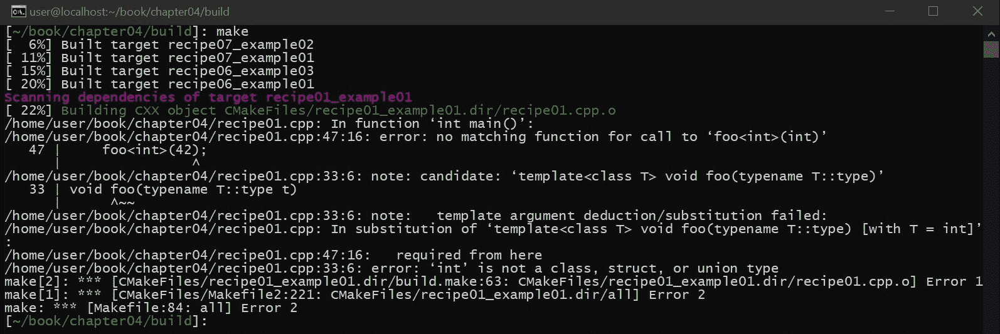

从前面的错误输出可以看出，编译器甚至说该错误是替换错误。根据提供的类型，我们提供的模板不是有效的候选模板。

这个例子的另一个重要收获是，编译器能够根据提供的类型在我们的`foo()`函数的两个不同版本之间进行选择。我们可以利用这一点。具体来说，这使我们能够根据所提供的类型做不同的事情。我们所需要的是一种方法来编写我们的`foo()`函数，这样我们就可以根据我们提供的类型来启用/禁用不同版本的模板。

这就是`std::enable_if`发挥作用的地方。`std::enable_if`将 SFINAE 的思想带到下一步，允许我们定义一个类型，如果它的参数为真。否则，它将生成替换错误，故意迫使编译器选择模板的不同版本。`std::enable_if`定义如下:

```cpp
template<bool B, class T = void>
struct enable_if {};

template<class T>
struct enable_if<true, T> { typedef T type; };
```

这首先定义了一个采用`bool B`的结构和一个默认为`void`的`T`类型。当`bool`为真时，它定义了这种`struct`类型的特殊化。具体来说，当`bool`值为`true`时，返回所提供的类型，如前所述，默认为`void`。要了解这是如何使用的，让我们看一个例子:

```cpp
#include <iostream>
#include <type_traits>

template<typename T>
constexpr auto is_int()
{ 
    return false; 
}

template<>
constexpr auto is_int<int>()
{ 
    return true; 
}

template<
    typename T,
    std::enable_if_t<is_int<T>(), int> = 0
    >
void the_answer(T is)
{
    std::cout << "The answer is: " << is << '\n';
}

int main(void)
{
    the_answer(42);
    return 0;
}
```

输出如下:


在这个例子中，我们创建了一个名为`is_int()`的函数，它总是返回`false`。然后我们为返回`true`的`int`创建这个函数的模板专门化。接下来，我们创建一个接受任何类型的函数，但是我们将`std::enable_if_t`(添加的`_t`部分是 C++17 中为`::type`添加的简写)添加到使用我们的`is_int()`函数的模板定义中。如果提供的`T`类型是`int`，我们的`is_int()`功能将返回`true`。

`std::enable_if`默认不做任何事情。但是，如果是`true`，它会返回一个`type`别名，在前面的示例中，它是我们作为`std::enable_if`的第二个参数传递的`int`类型。这是说如果`std::enable_if`是`true`，它会返回一个`int`类型。然后我们将这个`int`类型设置为`0`，这是一个有效的做法。这不会导致失败；我们的模板函数成为一个有效的替代，因此被使用。综上所述，如果`T`是`int`类型，`std::enable_if`变成了`int`类型本身，然后我们设置为`0`，编译没有问题。如果我们的`T`型不是`int`，那么`std::enable_if`就变成了虚无。试图将 nothing 设置为`0`会导致编译错误，但由于这是 SFINAE，编译器错误只会变成替换错误。

让我们看看错误案例。如果我们将`42`设置为`42.0`，这是一个`double`，而不是`int`，我们会得到以下结果:


从前面的错误可以看出，编译器是在说`enable_if`中没有名为`type`的类型。如果看`std::enable_if`的定义，这是意料之中的，因为`std::enable_if`如果是假的就什么都不做。它只创建一个名为`type`的类型，如果它是真的。

为了更好地理解这是如何工作的，让我们看另一个例子:

```cpp
#include <iostream>
#include <type_traits>

template<
    typename T,
    std::enable_if_t<std::is_integral_v<T>>* = nullptr
    >
void the_answer(T is)
{
    std::cout << "The answer is: " << is << '\n';
}

int main(void)
{
    the_answer(42);
    return 0;
}
```

输出如下:


在前面的例子中，我们使用了`std::is_integral_v`，它和我们的`is_int()`函数做同样的事情，不同的是它是由标准库提供的，可以处理 CV 类型。事实上，标准库有这些函数的不同版本的大量列表，包括不同的类型、继承属性、CV 属性等等。如果您需要检查任何类型的`type`属性，标准库有一个您可以使用的`std:is_xxx`功能。

前面的例子与我们前面的例子几乎相同，不同之处在于我们在`std::enable_if`方法中不返回`int`。相反，我们使用`* = nullptr`。这是因为`std::enable_if`默认返回`void`。`*`字符将这个空位变成一个空位指针，然后我们将其设置为`nullptr`。

在下一个示例中，我们展示了这方面的另一个变化:

```cpp
#include <iostream>
#include <type_traits>

template<typename T>
std::enable_if_t<std::is_integral_v<T>>
the_answer(T is)
{
    std::cout << "The answer is: " << is << '\n';
}

int main(void)
{
    the_answer(42);
    return 0;
}

```

输出如下:


在这个例子中，我们函数的`void`是由`std::enable_if`创建的。如果`T`不是整数，则不返回`void`，我们会看到这个错误(而不是代码编译并允许我们首先执行它):

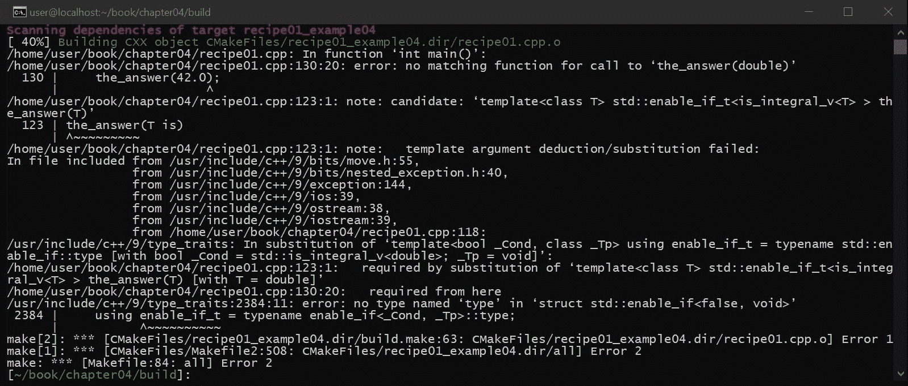

总之，`std::enable_if`将创建一个名为`type`的类型，它基于您提供的类型。默认情况下，这里是`void`，但是你可以输入任何你想要的类型。此功能不仅可用于为我们的模板强制一种类型，还可用于根据我们提供的类型定义不同的函数，如本例所示:

```cpp
#include <iostream>
#include <type_traits>
#include <iomanip>

template<
    typename T,
    std::enable_if_t<std::is_integral_v<T>>* = nullptr
    >
void the_answer(T is)
{
    std::cout << "The answer is: " << is << '\n';
}

template<
    typename T,
    std::enable_if_t<std::is_floating_point_v<T>>* = nullptr
    >
void the_answer(T is)
{
    std::cout << std::setprecision(10);
    std::cout << "The answer is: " << is << '\n';
}

int main(void)
{
    the_answer(42);
    the_answer(42U);
    the_answer(42.12345678);

    return 0;
}

```

前面代码的输出如下:

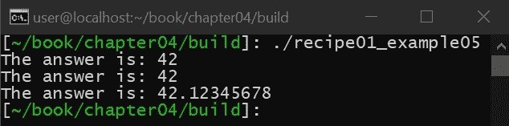

就像我们在这个食谱中的第一个例子一样，我们已经创建了同一个函数的两个不同版本。SFINAE 允许编译器根据提供的类型选择最合适的版本。

# 学习完美转发

在这个食谱中，我们将学习如何使用完美转发。这个方法很重要，因为在编写模板时，我们通常会将模板参数传递给其他函数。如果我们不使用完美转发，我们可能会无意中将 r 值引用转换为 l 值引用，导致发生潜在的复制而不是移动，在某些情况下，这可能是次优的。完美转发还为编译器提供了一些提示，可以利用这些提示来改进函数的内联和展开。

# 准备好

开始之前，请确保满足所有技术要求，包括安装 Ubuntu 18.04 或更高版本，并在终端窗口中运行以下内容:

```cpp
> sudo apt-get install build-essential git cmake
```

这将确保您的操作系统拥有适当的工具来编译和执行本食谱中的示例。完成后，打开一个新的终端。我们将使用这个终端来下载、编译和运行我们的示例。

# 怎么做...

您需要执行以下步骤来尝试此食谱:

1.  从新的终端，运行以下命令下载源代码:

```cpp
> cd ~/
> git clone https://github.com/PacktPublishing/Advanced-CPP-CookBook.git
> cd Advanced-CPP-CookBook/chapter04
```

2.  要编译源代码，请运行以下命令:

```cpp
> cmake .
> make recipe02_examples
```

3.  编译源代码后，您可以通过运行以下命令来执行该配方中的每个示例:

```cpp
> ./recipe02_example01
l-value
l-value

> ./recipe02_example02
l-value
r-value

> ./recipe02_example03
l-value: 42
r-value: 42
```

在下一节中，我们将逐一介绍这些示例，并解释每个示例程序的功能以及它与本食谱中所教授的课程之间的关系。

# 它是如何工作的...

在这个食谱中，我们将学习如何使用完美的转发，以确保当我们在模板中传递参数时(也就是说，转发我们的参数)，我们这样做的方式不会抹去 r 值。为了更好地理解这个问题，让我们看看下面的例子:

```cpp
#include <iostream>

struct the_answer
{ };

void foo2(const the_answer &is)
{
    std::cout << "l-value\n";
}

void foo2(the_answer &&is)
{
    std::cout << "r-value\n";
}

template<typename T>
void foo1(T &&t)
{
    foo2(t);
}

int main(void)
{
    the_answer is;
    foo1(is);
    foo1(the_answer());

    return 0;
}

```

输出如下:

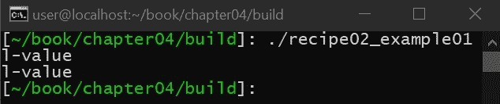

在前面的例子中，我们有两个不同版本的`foo()`函数:一个采用 l 值引用，一个采用 r 值引用。然后我们从一个模板函数中调用`foo()`。该模板函数采用转发引用(也称为通用引用)，它是与`auto`或模板函数配对的 r 值引用。最后，从我们的主函数，我们调用我们的模板，看看调用了哪个`foo()`函数。我们第一次调用模板时，会传入一个 l 值。因为我们被赋予了一个 l 值，通用引用变成了 l 值，我们的`foo()`函数的 l 值版本被调用。问题是，我们第二次调用模板函数时，我们给了它一个 r 值，但它调用了我们的`foo()`函数的 l 值版本，尽管它被赋予了 r 值。

这里常见的错误是，即使模板函数采用通用引用，并且我们有一个版本的`foo()`函数也采用 r 值，我们假设这个`foo()`函数将被调用。斯科特·迈耶斯在他的许多关于普遍参考的讲座中很好地解释了这一点。问题是，当你使用一个通用参考时，它变成了一个 l 值。传递`names`参数的行为，这意味着它必须是一个 l 值。它强制编译器转换为 l 值，因为它看到您在使用它，即使您所做的只是传递参数。应该注意的是，我们的例子并不使用优化进行编译，因为如果编译器可以安全地确定变量没有被使用，它可以自由地优化 l 值。

为了防止这个问题，我们需要告诉编译器我们希望转发该参数。通常，我们会用`std::move()`来表示这个。问题是，如果最初给我们一个 l 值，我们就不能使用`std::move()`，因为那样会将 l 值转换成 r 值。这就是标准库有`std::forward()`的原因，它是使用以下内容实现的:

```cpp
static_cast<T&&>(t)
```

`std::forward()`所做的只是将参数转换回其原始参考类型。这告诉编译器，如果该参数最初是 r 值，则将其显式视为 r 值，如下例所示:

```cpp
#include <iostream>

struct the_answer
{ };

void foo2(const the_answer &is)
{
    std::cout << "l-value\n";
}

void foo2(the_answer &&is)
{
    std::cout << "r-value\n";
}

template<typename T>
void foo1(T &&t)
{
    foo2(std::forward<T>(t));
}

int main(void)
{
    the_answer is;
    foo1(is);
    foo1(the_answer());

    return 0;
}

```

输出如下:

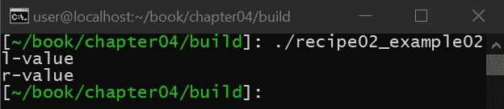

前面的例子与第一个例子相同，唯一的区别是我们使用`std::forward()`在模板函数中传递参数。这一次，当我们用 r 值调用我们的模板函数时，它调用我们的`foo()`函数的 r 值版本。这叫**完美转发**。它确保我们在传递参数时保持 CV 属性和 l-/r 值属性。需要注意的是，完美转发只有在使用模板函数或`auto`时才有效。这意味着完美转发通常只在编写包装器时有用。标准库包装器的一个很好的例子是`std::make_unique()`。

像`std::make_unique()`这样的包装器的一个问题是，您可能不知道需要传递多少参数。也就是说，您可能最终需要包装器中的可变模板参数。完美转发通过以下方式支持这一点:

```cpp
#include <iostream>

struct the_answer
{ };

void foo2(const the_answer &is, int i)
{
    std::cout << "l-value: " << i << '\n';
}

void foo2(the_answer &&is, int i)
{
    std::cout << "r-value: " << i << '\n';
}

template<typename... Args>
void foo1(Args &&...args)
{
    foo2(std::forward<Args>(args)...);
}

int main(void)
{
    the_answer is;

    foo1(is, 42);
    foo1(the_answer(), 42);

    return 0;
}
```

输出如下:


前面的例子之所以有效，是因为传递给我们的`foo()`函数的变量模板参数被逗号分隔的完美转发列表所取代。

# 使用 if constexpr

在这个食谱中，我们将学习如何在 C++17 中使用一个名为`constexpr if`的新功能。这个食谱很重要，因为它将教你如何创建在运行时评估的`if`语句。具体来说，这意味着分支逻辑是在编译时而不是运行时选取的。这允许您在编译时改变函数的行为，而不牺牲性能，这在过去只能用宏来完成，这在模板编程中是没有用的，正如我们将要展示的。

# 准备好

开始之前，请确保满足所有技术要求，包括安装 Ubuntu 18.04 或更高版本，并在终端窗口中运行以下内容:

```cpp
> sudo apt-get install build-essential git
```

这将确保您的操作系统拥有适当的工具来编译和执行本食谱中的示例。完成后，打开一个新的终端。我们将使用这个终端来下载、编译和运行我们的示例。

# 怎么做...

您需要执行以下步骤来尝试此食谱:

1.  从新的终端，运行以下命令下载源代码:

```cpp
> cd ~/
> git clone https://github.com/PacktPublishing/Advanced-CPP-CookBook.git
> cd Advanced-CPP-CookBook/chapter04
```

2.  要编译源代码，请运行以下命令:

```cpp
> cmake .
> make recipe03_examples
```

3.  编译源代码后，您可以通过运行以下命令来执行该配方中的每个示例:

```cpp
> ./recipe03_example01
The answer is: 42

> ./recipe03_example02
The answer is: 42
The answer is: 42.12345678
```

在下一节中，我们将逐一介绍这些示例，并解释每个示例程序的功能以及它与本食谱中所教授的课程之间的关系。

# 它是如何工作的...

有时，我们希望改变程序的行为，但是我们正在创建的代码总是不变的，这意味着编译器能够确定分支本身的值，如下例所示:

```cpp
if (!NDEBUG) {}
```

这是很多代码中常用的`if`语句，包括标准库。如果启用调试，该代码的评估结果为`true`。我们通过在代码中添加调试语句来使用它，调试语句可以关闭。编译器足够聪明，可以看到`NDEBUG`是`true`还是`false`，并且要么添加代码，要么完全删除代码。换句话说，编译器可以进行简单的优化，减少代码的大小，并删除不需要的分支，因为它知道这个`if`语句的值在运行时永远不会改变。问题是，这个技巧依赖于编译器很聪明的事实。逻辑的移除是隐式可信的，这通常会导致对编译器正在做什么的假设。C++17 增加了一个`constexpr if`语句，允许我们改为显式。它允许我们告诉编译器:我提供的语句应该在编译时计算，而不是在运行时计算。真正强大的是，当这个假设不成立时，我们会得到编译时错误，这意味着我们隐式信任编译器执行的优化，我们现在可以在编译时验证，如果假设为假，我们会被告知可以修复问题，如下例所示:

```cpp
#include <iostream>

constexpr auto answer = 42;

int main(void)
{
    if constexpr (answer == 42) {
        std::cout << "The answer is: " << answer << '\n';
    }
    else {
        std::cout << "The answer is not: " << answer << '\n';
    }

    return 0;
}

```

输出如下:

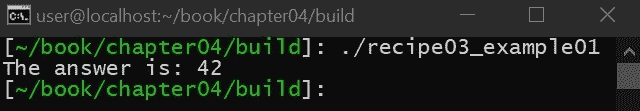

在前面的例子中，我们创建了`constexpr`并在编译时而不是运行时对其求值。如果我们将`constexpr`更改为实际变量，`constexpr if`将导致以下错误:


然后，我们可以在模板函数中使用它，根据给定的类型更改模板函数的行为，如下例所示:

```cpp
#include <iostream>
#include <iomanip>

template<typename T>
constexpr void foo(T &&t)
{
    if constexpr (std::is_floating_point_v<T>) {
        std::cout << std::setprecision(10);
    }

    std::cout << "The answer is: " << std::forward<T>(t) << '\n';
}

int main(void)
{
    foo(42);
    foo(42.12345678);
    return 0;
}
```

在前面的例子中，我们使用`std::is_floating_point_v`类型特征来确定我们得到的类型是否是浮点型的。如果类型不是浮点，这将返回`constexpr false`，编译器可以优化出来。由于我们使用的是`constexpr if`，我们可以确保我们的`if`语句实际上是`constexpr`而不是运行时条件。

# 使用元组处理参数包

在本食谱中，我们将学习如何使用`std::tuple`处理可变参数列表。这一点很重要，因为变量参数列表用于包装函数，包装函数不知道传递给它的参数，而是将这些参数转发给传递给它的函数。但是，在一些用例中，您会关心传递的参数，并且您必须有一种处理这些参数的方法。这个食谱将展示如何做到这一点，包括如何处理任何数量的论点。

# 准备好

开始之前，请确保满足所有技术要求，包括安装 Ubuntu 18.04 或更高版本，并在终端窗口中运行以下内容:

```cpp
> sudo apt-get install build-essential git cmake
```

这将确保您的操作系统拥有适当的工具来编译和执行本食谱中的示例。完成后，打开一个新的终端。我们将使用这个终端来下载、编译和运行我们的示例。

# 怎么做...

您需要执行以下步骤来尝试此食谱:

1.  从新的终端，运行以下命令下载源代码:

```cpp
> cd ~/
> git clone https://github.com/PacktPublishing/Advanced-CPP-CookBook.git
> cd Advanced-CPP-CookBook/chapter04
```

2.  要编译源代码，请运行以下命令:

```cpp
> cmake .
> make recipe04_examples
```

3.  编译源代码后，您可以通过运行以下命令来执行该配方中的每个示例:

```cpp
> ./recipe04_example01

> ./recipe04_example02
the answer is: 42

> ./recipe04_example03
The answer is: 42

> ./recipe04_example04
2
2

> ./recipe04_example05
The answer is: 42
```

在下一节中，我们将逐一介绍这些示例，并解释每个示例程序的功能以及它与本食谱中所教授的课程之间的关系。

# 它是如何工作的...

变量模板为程序员提供了定义模板函数的能力，而不需要定义所有的参数。这些在包装函数中大量使用，因为它们防止包装器必须知道函数的参数，如本例所示:

```cpp
#include <iostream>

template<typename... Args>
void foo(Args &&...args)
{ }

int main(void)
{
    foo("The answer is: ", 42);
    return 0;
}
```

如前面的例子所示，我们已经创建了一个`foo`函数，它可以接受任意数量的参数。在本例中，我们使用了通用引用符号`Args &&...args`，这确保了 CV 限定符和 l-/r-value 被保留，这意味着我们可以使用`std::forward()`将变量参数列表传递给任何其他函数，而性能损失尽可能小。`std::make_unique()`等功能大量使用变量参数。

但是，有时您可能想要访问提供的列表中的某个参数。为此，我们可以使用`std::tuple`。这是一个数据结构，接受可变数量的参数，并提供`std::get()`函数从`std::tuple`获取任何数据，如本例所示:

```cpp
#include <tuple>
#include <iostream>

int main(void)
{
    std::tuple t("the answer is: ", 42);
    std::cout << std::get<0>(t) << std::get<1>(t) << '\n';
    return 0;
}
```

输出如下:


在上例中，我们创建了`std::tuple`，然后使用`std:get()`功能将`std::tuple`的内容输出到`stdout`。如果您试图访问超出范围的数据，编译器会在编译时知道，并给您一个类似如下的错误:

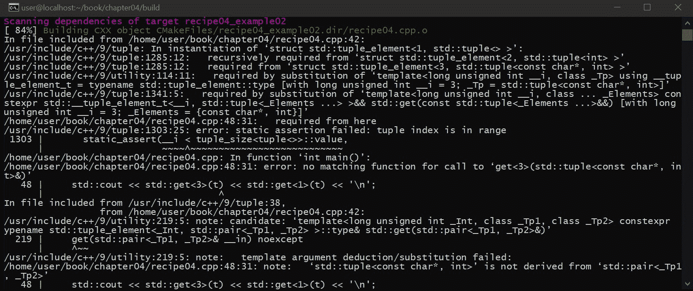

使用`std::tuple`，我们可以从变量参数列表中访问数据，如下所示:

```cpp
#include <tuple>
#include <iostream>

template<typename... Args>
void foo(Args &&...args)
{
    std::tuple t(std::forward<Args>(args)...);
    std::cout << std::get<0>(t) << std::get<1>(t) << '\n';
}

int main(void)
{
    foo("The answer is: ", 42);
    return 0;
}
```

输出如下:

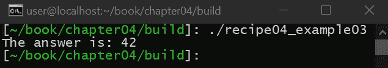

在前面的例子中，我们创建了一个带有可变参数列表的函数。然后我们使用`std::forward()`将这个列表传递给`std::tuple`以保持 l/r 值。最后，我们使用`std::tuple`来访问参数。如果我们不使用`std::forward()`，我们最终会得到传递给`std::tuple`的数据的 l 值版本。

前面例子的明显问题是我们已经将`0`和`1`索引硬编码到了`std::tuple`中。变量参数不是运行时的动态参数数组。相反，它们是一种表达方式*我不在乎我被赋予的参数*，这就是为什么它们通常被包装器使用。包装器包装的是关心参数的东西。在`std::make_unique()`的情况下，功能是创建`std::unique_ptr`。为此，`std::make_unique()`将为您分配`std::unique_ptr`，使用变量参数列表初始化新分配的类型，然后为您提供指向此类型的指针到`std::unique_ptr`，如本例所示:

```cpp
template<
    typename T, 
    typename... Args
    >
void make_unique(Args &&...args)
{
    return unique_ptr<T>(new T(std::forward<Args>(args)...));
}
```

包装器不关心传递的参数。`T`的构造函数有。如果你试图访问变量参数，你是在说*我确实关心参数*，在这种情况下，如果你关心，你必须对正在传递的参数的布局有所了解。

但是，有一些技巧可以让您处理未知数量的参数。尝试这样做的最大问题是，处理变量参数的库工具最好在运行时使用，这在大多数情况下没有帮助，如下例所示:

```cpp
#include <tuple>
#include <iostream>

template<typename... Args>
void foo(Args &&...args)
{
    std::cout << sizeof...(Args) << '\n';
    std::cout << std::tuple_size_v<std::tuple<Args...>> << '\n';
}

int main(void)
{
    foo("The answer is: ", 42);
    return 0;
}

```

输出如下:


在前面的示例中，我们试图获取变量参数列表中参数数量的总大小。我们可以使用变量版本的`sizeof()`函数或者使用`std::tuple_size`特性来实现。问题是这在编译时没有帮助我们，因为我们不能使用这个大小信息循环参数(因为编译时逻辑没有`for`循环)。

为了克服这一点，我们可以使用一种叫做编译时递归的技巧。这个技巧使用模板来创建一个递归模板函数，它将循环遍历变量参数列表中的所有参数。看看这个例子:

```cpp
#include <tuple>
#include <iostream>

template<
    std::size_t I = 0,
    typename ... Args,
    typename FUNCTION
    >
constexpr void
for_each(const std::tuple<Args...> &t, FUNCTION &&func)
{
    if constexpr (I < sizeof...(Args)) {
        func(std::get<I>(t));
        for_each<I + 1>(t, std::forward<FUNCTION>(func));
    }
}
```

我们从一个执行所有魔法的模板函数开始。这个第一个模板参数是`I`，它是一个从`0`开始的整数。下一个是变量模板参数，最后一个是函数类型。我们的模板函数采用`std::tuple`，我们希望迭代它(在这种情况下，我们显示一个常量版本，但是我们可以重载它来提供一个非常量版本)，以及我们希望为`std::tuple`中的每个元素调用的函数。换句话说，这个函数将循环遍历`std::tuple`中的每个元素，并调用提供的函数，每个元素迭代一次，就像`for_each()`一样，我们习惯于在其他语言或 C++库中运行时使用它。

在这个函数中，我们检查是否已经达到元组的总大小。如果没有，我们获取元组中`I`当前值的元素，将其传递给提供的函数，然后用`I++`再次调用我们的`for_each()`函数。要使用此`for_each()`功能，我们可以执行以下操作:

```cpp
template<typename... Args>
void foo(Args &&...args)
{
    std::tuple t(std::forward<Args>(args)...);
    for_each(t, [](const auto &arg) {
        std::cout << arg;
    });
}
```

这里，我们得到了一个变量参数列表，我们希望遍历这个列表，并将每个参数输出到`stdout`。为此，我们像以前一样创建`std::tuple`，但这次，我们将`std::tuple`传递给我们的`for_each()`功能:

```cpp
int main(void)
{
    foo("The answer is: ", 42);
    std::cout << '\n';

    return 0;
}
```

输出如下:


就像我们在前面的例子中所做的那样，我们用一些我们希望输出到`stdout`的文本调用我们的`foo`函数，因此演示了如何使用`std:tuple`处理变量函数参数，即使我们不知道我们将被给出的参数总数。

# 使用类型特征控制函数和对象

创建 C++11 时，C++必须处理的一个问题是如何处理调整`std::vector`的大小，T0 可以采用任何类型，包括可以从`std::move()`抛出的类型。调整大小时，会创建新的内存，并将旧向量中的元素移动到新向量中。这非常有效，因为如果`std::move()`不能抛出，调整大小可以安全地执行，因为一旦调整大小功能开始将元素从一个数组移动到另一个数组，就不会出现错误。

然而，如果`std::move()`可以抛出，有可能在通过循环的部分路径上，可能会出现错误。然而，`resize()`函数无法将旧内存恢复正常，因为试图移动到旧内存也会引发异常。在这种情况下，`resize()`执行复制而不是移动。副本确保旧内存中有每个对象的有效副本；因此，如果抛出异常，原始数组保持不变，可以根据需要抛出异常。

在本食谱中，我们将探索如何通过使用特征改变模板类的行为来实现这一点。

# 准备好

开始之前，请确保满足所有技术要求，包括安装 Ubuntu 18.04 或更高版本，并在终端窗口中运行以下内容:

```cpp
> sudo apt-get install build-essential git cmake
```

这将确保您的操作系统拥有适当的工具来编译和执行本食谱中的示例。完成后，打开一个新的终端。我们将使用这个终端来下载、编译和运行我们的示例。

# 怎么做...

您需要执行以下步骤来尝试此食谱:

1.  从新的终端，运行以下命令下载源代码:

```cpp
> cd ~/
> git clone https://github.com/PacktPublishing/Advanced-CPP-CookBook.git
> cd Advanced-CPP-CookBook/chapter04
```

2.  要编译源代码，请运行以下命令:

```cpp
> cmake .
> make recipe05_examples
```

3.  编译源代码后，您可以通过运行以下命令来执行该配方中的每个示例:

```cpp
> ./recipe05_example01
noexcept: r-value
can throw: l-value

> ./recipe05_example02
move
move
move
move
move
--------------
copy
copy
copy
copy
copy
```

在下一节中，我们将逐一介绍这些示例，并解释每个示例程序的功能以及它与本食谱中所教授的课程之间的关系。

# 它是如何工作的...

C++增加了一个叫做`std::move_if_noexcept()`的函数。如果移动构造函数/赋值运算符不能抛出，此函数将转换为 r 值，否则将转换为 l 值。例如，看看下面的代码:

```cpp
#include <iostream>

struct the_answer_noexcept
{
    the_answer_noexcept() = default;

    the_answer_noexcept(const the_answer_noexcept &is) noexcept
    {
        std::cout << "l-value\n";
    }

    the_answer_noexcept(the_answer_noexcept &&is) noexcept
    {
        std::cout << "r-value\n";
    }
};
```

为此，我们将执行以下步骤:

1.  首先，我们将创建一个具有不能抛出的移动/复制构造函数的类:

```cpp
struct the_answer_can_throw
{
    the_answer_can_throw() = default;

    the_answer_can_throw(const the_answer_can_throw &is)
    {
        std::cout << "l-value\n";
    }

    the_answer_can_throw(the_answer_can_throw &&is)
    {
        std::cout << "r-value\n";
    }
};
```

2.  接下来，我们将提供一个类，它有一个可以抛出的移动/复制构造函数。最后，让我们使用`std::move_if_noexcept()`来查看当试图移动上述每个类的实例时，是发生了移动还是复制:

```cpp
int main(void)
{
    the_answer_noexcept is1;
    the_answer_can_throw is2;

    std::cout << "noexcept: ";
    auto is3 = std::move_if_noexcept(is1);

    std::cout << "can throw: ";
    auto is4 = std::move_if_noexcept(is2);

    return 0;
}

```

前面代码的输出如下:

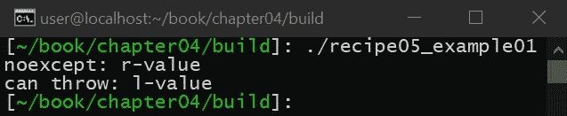

如前面的示例所示，在一种情况下，调用移动构造函数，而在另一种情况下，根据执行移动时该类型是否可以引发异常来调用复制构造函数。

3.  现在，让我们创建一个带有调整大小功能的简单模拟向量，演示如何使用特征改变我们的`template`类的行为:

```cpp
#include <memory>
#include <iostream>
#include <stdexcept>

template<typename T>
class mock_vector
{
public:
    using size_type = std::size_t;

    mock_vector(size_type s) :
        m_size{s},
        m_buffer{std::make_unique<T[]>(m_size)}
    { }

    void resize(size_type size)
        noexcept(std::is_nothrow_move_constructible_v<T>)
    {
        auto tmp = std::make_unique<T[]>(size);

        for (size_type i = 0; i < m_size; i++) {
            tmp[i] = std::move_if_noexcept(m_buffer[i]);
        }

        m_size = size;
        m_buffer = std::move(tmp);
    }

private:
    size_type m_size{};
    std::unique_ptr<T[]> m_buffer{};
};
```

我们的模拟向量有一个内部缓冲区和一个大小。创建向量时，我们使用给定的大小分配内部缓冲区。然后，我们提供了一个`resize()`函数，该函数可用于在给定新大小的情况下调整内部缓冲区的大小。我们要做的第一件事是创建新的内部缓冲区，然后循环遍历每个元素以及从一个缓冲区到另一个缓冲区的元素。如果`T`不能抛出，则在循环执行过程中不会触发异常，在这种情况下，新的缓冲区将有效。如果`T`能够抛出，将会出现一个副本。如果触发异常，旧缓冲区尚未被新缓冲区替换。相反，新的缓冲区将与复制的所有元素一起被删除。

为此，让我们创建一个可以引入移动构造函数/赋值运算符的类:

```cpp
struct suboptimal
{
    suboptimal() = default;

    suboptimal(suboptimal &&other)
    {
        *this = std::move(other);
    }

    suboptimal &operator=(suboptimal &&)
    {
        std::cout << "move\n";
        return *this;
    }

    suboptimal(const suboptimal &other)
    {
        *this = other;
    }

    suboptimal &operator=(const suboptimal &)
    {
        std::cout << "copy\n";
        return *this;
    }
};
```

让我们也添加一个不能从移动构造函数/赋值运算符抛出的类:

```cpp
struct optimal
{
    optimal() = default;

    optimal(optimal &&other) noexcept
    {
        *this = std::move(other);
    }

    optimal &operator=(optimal &&) noexcept
    {
        std::cout << "move\n";
        return *this;
    }

    optimal(const optimal &other)
    {
        *this = other;
    }

    optimal &operator=(const optimal &)
    {
        std::cout << "copy\n";
        return *this;
    }
};
```

最后，我们将使用这两个类创建一个向量，并尝试调整其大小:

```cpp
int main(void)
{
    mock_vector<optimal> d1(5);
    mock_vector<suboptimal> d2(5);

    d1.resize(10);
    std::cout << "--------------\n";
    d2.resize(10);

    return 0;
}

```

前面代码的输出如下:


如前面的例子所示，当我们试图调整类的大小时，当移动不能抛出时执行移动，否则执行复制。换句话说，类的行为根据`T`类型的特征而变化。

# 学习如何实现模板

C++能够创建模板已经很长时间了，这允许程序员在给定类型的情况下创建类和函数的泛型实现。但是，您也可以提供非类型参数。

在 C++17 中，您现在可以使用`auto`来提供泛型、非类型模板参数。在这个食谱中，我们将探索如何使用这个功能。这很重要，因为它允许您在代码中创建更多的通用模板。

# 准备好

开始之前，请确保满足所有技术要求，包括安装 Ubuntu 18.04 或更高版本，并在终端窗口中运行以下内容:

```cpp
> sudo apt-get install build-essential git cmake
```

这将确保您的操作系统拥有适当的工具来编译和执行本食谱中的示例。完成后，打开一个新的终端。我们将使用这个终端来下载、编译和运行我们的示例。

# 怎么做...

您需要执行以下步骤来尝试此食谱:

1.  从新的终端，运行以下命令下载源代码:

```cpp
> cd ~/
> git clone https://github.com/PacktPublishing/Advanced-CPP-CookBook.git
> cd Advanced-CPP-CookBook/chapter04
```

2.  要编译源代码，请运行以下命令:

```cpp
> cmake .
> make recipe06_examples
```

3.  编译源代码后，您可以通过运行以下命令来执行该配方中的每个示例:

```cpp
> ./recipe06_example01
The answer is: 42
> ./recipe06_example02
The answer is: 42
The answer is: 42
> ./recipe06_example03
The answer is: 42
```

在下一节中，我们将逐一介绍这些示例，并解释每个示例程序的功能以及它与本食谱中所教授的课程之间的关系。

# 它是如何工作的...

在 C++17 之前，您可以在模板中提供非类型模板参数，但是您必须在定义中声明变量类型，如下例所示:

```cpp
#include <iostream>

template<int answer>
void foo()
{
    std::cout << "The answer is: " << answer << '\n';
}

int main(void)
{
    foo<42>();
    return 0;
}

```

输出如下:

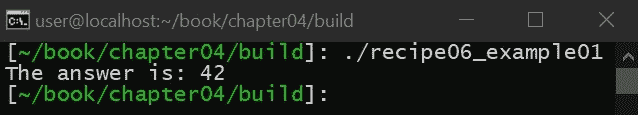

在前面的例子中，我们创建了一个`int`类型的模板参数变量，并将该变量的值输出到`stdout`。在 C++17 中，我们现在可以执行以下操作:

```cpp
#include <iostream>

template<auto answer>
void foo()
{
    std::cout << "The answer is: " << answer << '\n';
}

int main(void)
{
    foo<42>();
    return 0;
}
```

输出如下:


如前所示，我们现在可以状态`auto`，而不必状态`int`。这允许我们创建一个可以接受多个非类型模板参数的函数。我们还可以使用类型特征来确定允许哪些非类型参数，如本例所示:

```cpp
#include <iostream>
#include <type_traits>

template<
    auto answer,
 std::enable_if_t<std::is_integral_v<decltype(answer)>, int> = 0
 >
void foo()
{
    std::cout << "The answer is: " << answer << '\n';
}

int main(void)
{
    foo<42>();
    return 0;
}
```

输出如下:

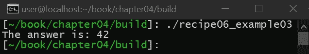

在前面的示例中，我们的模板非类型参数只能是整数类型。

# 使用显式模板声明

在本食谱中，我们将探索如何通过创建显式模板声明来加快模板类的编译。这很重要，因为模板需要编译器根据需要创建类的实例。在某些情况下，显式模板声明可以为程序员提供一种方法，通过缓存最有可能使用的模板类型来加速编译，从而避免包含模板的整个定义。

# 准备好

开始之前，请确保满足所有技术要求，包括安装 Ubuntu 18.04 或更高版本，并在终端窗口中运行以下内容:

```cpp
> sudo apt-get install build-essential git cmake
```

这将确保您的操作系统拥有适当的工具来编译和执行本食谱中的示例。完成后，打开一个新的终端。我们将使用这个终端来下载、编译和运行我们的示例。

# 怎么做...

您需要执行以下步骤来尝试此食谱:

1.  从新的终端，运行以下命令下载源代码:

```cpp
> cd ~/
> git clone https://github.com/PacktPublishing/Advanced-CPP-CookBook.git
> cd Advanced-CPP-CookBook/chapter04
```

2.  要编译源代码，请运行以下命令:

```cpp
> cmake .
> make recipe07_examples
```

3.  编译源代码后，您可以通过运行以下命令来执行该配方中的每个示例:

```cpp
> ./recipe07_example01 
The answer is: 42
The answer is: 42
The answer is: 42.1
> ./recipe07_example02 
The answer is: 4
```

在下一节中，我们将逐一介绍这些示例，并解释每个示例程序的功能以及它与本食谱中所教授的课程之间的关系。

# 它是如何工作的...

每次编译器看到使用给定类型的模板类时，它都会隐式创建该类型的一个版本。然而，这可能会发生多次，降低编译器的速度。但是，如果预期使用的类型是预先已知的，这个问题可以使用显式模板专门化来解决。看看这个例子:

```cpp
#include <iostream>

template<typename T>
class the_answer
{
public:
    the_answer(T t)
    {
        std::cout << "The answer is: " << t << '\n';
    }
};
```

之前，我们创建了一个简单的结构，在构建过程中输出到`stdout`。通常，一旦看到类的第一个专门化，编译器就会创建这个类。但是，我们可以执行以下操作:

```cpp
template class the_answer<int>;
template class the_answer<unsigned>;
template class the_answer<double>;
```

这类似于一个类原型，它显式地创建了我们期望使用的专门化。这些必须在代码中使用之前声明(这意味着它们通常在模板定义之后声明)；然而，一旦它们被陈述，它们可以如下使用:

```cpp
int main(void)
{
    the_answer{42};
    the_answer{42U};
    the_answer{42.1};

    return 0;
}
```

代码的输出如下:

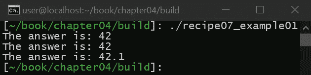

如前面的例子所示，我们可以像平常一样创建模板的实例，但是，在这种情况下，我们可以在大量使用这个类的情况下加快编译器的速度。这是因为，在源代码中，我们不需要包含模板的实现。为了演示这一点，让我们看另一个更复杂的例子。在头文件(称为`recipe07.h`)中，我们将使用以下内容创建我们的模板:

```cpp
template<typename T>
struct the_answer
{
    T m_answer;

    the_answer(T t);
    void print();
};
```

如您所见，我们有一个`template`类，它没有实现所提供的函数。然后，我们将在其自己的源文件中使用以下内容提供该模板的实现:

```cpp
#include <iostream>
#include "recipe07.h"

template<typename T>
the_answer<T>::the_answer(T t) :
    m_answer{t}
{ }

template<typename T>
void the_answer<T>::print()
{
    std::cout << "The answer is: " << m_answer << '\n';
}

template class the_answer<int>;
```

正如您在前面的示例中看到的，我们添加了一个显式的模板声明。这确保了我们为期望的类生成实现。编译器将为我们期望显式创建的类创建实例，就像我们通常编写的任何其他源代码一样。不同的是，我们可以为我们想要的任何类型显式定义这个类。最后，我们将这段代码称为:

```cpp
#include "recipe07.h"

int main(void)
{
    the_answer is{42};
    is.print();

    return 0;
}
```

输出如下:


如您所见，如果用显式类型定义类，而不是使用普通头文件的模板类，我们可以用同样的方式调用我们的类，普通头文件很小，没有完整的实现，允许编译器加快速度。