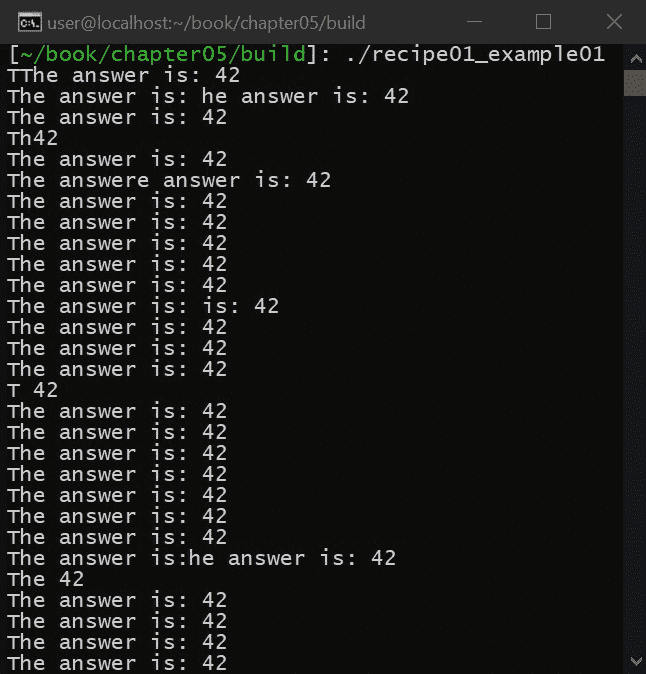
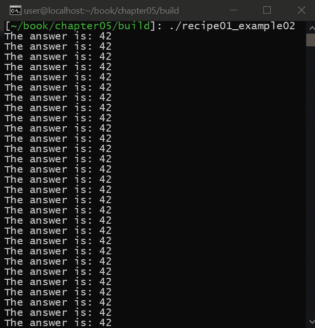
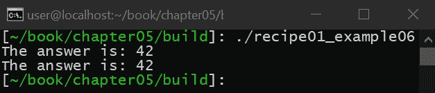
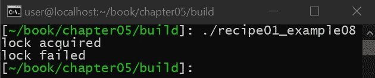
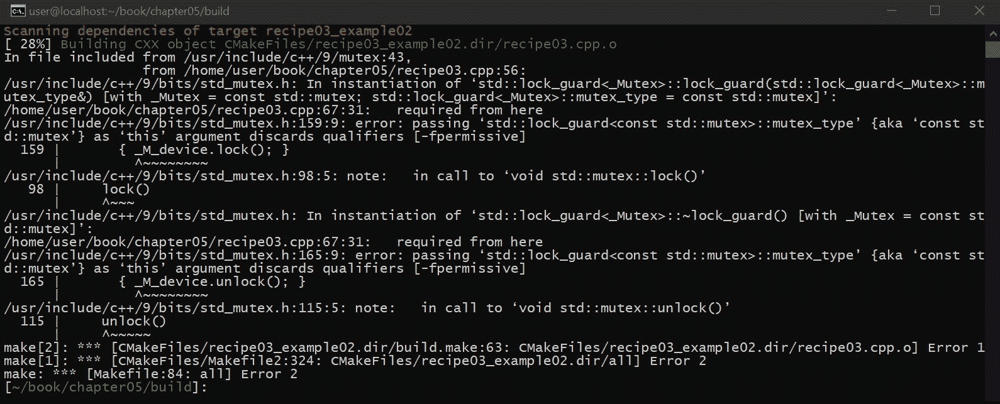
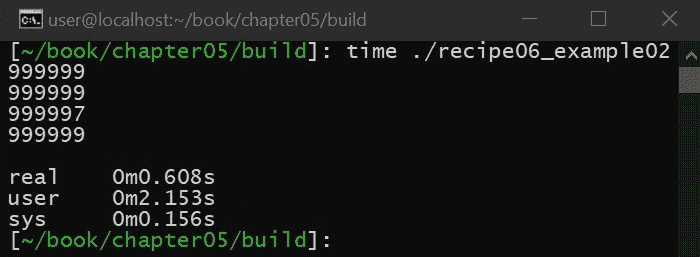
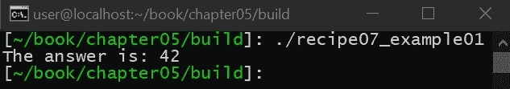

# 五、并发和同步

在本章中，我们将学习如何在 C++ 中正确处理并发、同步和并行。在这里，您必须具备 C++ 和 C++ 线程的一般知识。本章很重要，因为使用 C++ 通常需要使用共享资源，如果没有正确实现线程安全，共享资源很容易被破坏。我们将从`std::mutexes`的广泛概述开始，它提供了一种同步 C++ 线程的方法。然后，我们将研究原子数据类型，它为安全处理并行性提供了另一种机制。

本章有一些菜谱，演示了如何在使用 C++ 线程时处理不同的场景，包括处理`const &`、线程安全包装、阻塞与异步编程以及 C++ 承诺和未来。这一点很重要，因为这一知识在处理多个执行线程时至关重要。

本章涵盖以下配方:

*   使用互斥体
*   使用原子数据类型
*   理解`const &`可变性在多线程环境中的含义
*   使类线程安全
*   同步包装器以及如何实现它们
*   阻塞操作与异步编程
*   带着承诺和未来工作

# 技术要求

要编译和运行本章中的示例，您必须拥有运行 Ubuntu 18.04 的计算机的管理权限，并且具有功能性互联网连接。在运行这些示例之前，您必须安装以下内容:

```cpp
> sudo apt-get install build-essential git cmake
```

如果这安装在 Ubuntu 18.04 以外的任何操作系统上，则需要 GCC 7.4 或更高版本以及 CMake 3.6 或更高版本。

# 使用互斥体

在这个食谱中，我们将学习为什么以及如何在 C++ 中使用互斥体。在 C++ 中使用多线程时，建立线程间共享的资源是很常见的。正如我们将在本食谱中演示的那样，试图同时使用这些共享资源会导致能够破坏资源的竞争条件。

互斥体(在 C++ 中，这被写成`std::mutex`)是一个用于保护共享资源的对象，确保多个线程可以以受控的方式访问共享资源。这可以防止它变得腐败。

# 准备好

在我们开始之前，请确保满足所有技术要求，包括安装 Ubuntu 18.04 或更高版本，并在终端窗口中运行以下内容:

```cpp
> sudo apt-get install build-essential git
```

这将确保您的操作系统拥有适当的工具来编译和执行本食谱中的示例。完成后，打开一个新的终端。我们将使用这个终端来下载、编译和运行我们的示例。

# 怎么做...

您需要执行以下步骤来尝试此食谱:

1.  从新的终端，运行以下命令下载源代码:

```cpp
> cd ~/
> git clone https://github.com/PacktPublishing/Advanced-CPP-CookBook.git
> cd Advanced-CPP-CookBook/chapter05
```

2.  要编译源代码，请运行以下命令:

```cpp
> cmake .
> make recipe01_examples
```

3.  编译源代码后，您可以通过运行以下命令来执行该配方中的每个示例:

```cpp
> ./recipe01_example01
The answer is: 42
The answer is: 42
The answer is: 42
The
 answer is: 42
The answer is: 42
...

> ./recipe01_example02
The answer is: 42
The answer is: 42
The answer is: 42
The answer is: 42
The answer is: 42
...

> ./recipe01_example03
...

> ./recipe01_example04
The answer is: 42

> ./recipe01_example05
The answer is: 42
The answer is: 42
The answer is: 42
The answer is: 42
The answer is: 42
...

> ./recipe01_example06
The answer is: 42
The answer is: 42

> ./recipe01_example07

> ./recipe01_example08
lock acquired
lock failed
```

在下一节中，我们将逐一介绍这些示例，并解释每个示例程序的功能以及它与本食谱中所教授的课程之间的关系。

# 它是如何工作的...

在本食谱中，我们将学习如何使用`std::mutex`来保护共享资源不被破坏。首先，让我们先回顾一下当多个线程同时访问资源时，资源是如何变得损坏的:

```cpp
#include <thread>
#include <string>
#include <iostream>

void foo()
{
    static std::string msg{"The answer is: 42\n"};
    while(true) {
        for (const auto &c : msg) {
            std::clog << c;
        }
    }
}

int main(void)
{
    std::thread t1{foo};
    std::thread t2{foo};

    t1.join();
    t2.join();

    // Never reached
    return 0;
}
```

执行时，我们会得到以下输出:



在前面的例子中，我们创建了一个函数，在一个循环中输出到`stdout`。然后我们创建两个线程，每个线程执行前面定义的函数。正如您所看到的，当两个线程都执行时，结果输出会损坏。这是因为当一个线程正在将其文本输出到`stdout`时，另一个线程同时输出到`stdout`，导致一个线程的输出与另一个线程的输出混合。

为了处理这个问题，我们必须确保，一旦其中一个线程试图将其文本输出到`stdout`，应该允许它在另一个线程能够输出之前完成其输出。换句话说，每个线程必须轮流输出到`stdout`。当一个线程正在输出时，另一个线程必须等待轮到它。为此，我们将利用一个`std::mutex`对象。

# std::互斥

互斥体是一个用于保护共享资源的对象，以确保共享资源的使用不会导致损坏。为此，`std::mutex`具有`lock()`功能和`unlock()`功能。锁定功能*获取对共享资源(有时称为关键部分)的*访问。`unlock()` *释放*这个之前获得的权限。在另一个线程已经执行了`lock()`之后，任何执行`lock()`功能的尝试都将导致该线程必须等待`unlock()`功能被执行。

`std::mutex`如何实现取决于 CPU 的架构和操作系统；然而，一般来说，互斥体可以用一个简单的整数来实现。如果整数为`0`，`lock()`函数将整数设置为`1`并返回，告知互斥被获取。如果整数为`1`，表示互斥已经被获取，`lock()`函数会等待(即阻塞)直到整数变为`0`，然后将整数设置为`1`返回。如何实现这种等待取决于操作系统。比如`wait()`函数可以永远循环，直到整数变成`0`，称为**自旋锁**，也可以执行一个`sleep()`函数，等待一段时间，让其他线程和进程在互斥锁的同时执行。释放函数总是将整数设置为`0`，这意味着不再获取互斥体。确保互斥体正常工作的诀窍是确保使用原子操作读取/写入整数。如果使用非原子操作，整数本身将遭受互斥体试图防止的共享资源损坏。

例如，考虑以下情况:

```cpp
#include <mutex>
#include <thread>
#include <string>
#include <iostream>

std::mutex m{};

void foo()
{
    static std::string msg{"The answer is: 42\n"};
    while(true) {
        m.lock();
        for (const auto &c : msg) {
            std::clog << c;
        }
        m.unlock();
    }
}

int main(void)
{
    std::thread t1{foo};
    std::thread t2{foo};

    t1.join();
    t2.join();

    // Never reached
    return 0;
}
```

该示例在运行时输出以下内容:



在前面的例子中，我们创建了输出到`stdout`的相同函数。不同的是，在输出到`stdout`之前，我们通过执行`lock()`功能获取`std::mutex`。输出到`stdout`后，我们通过执行`unlock()`函数释放互斥体。`lock()`和`unlock()`功能之间的代码称为**临界区**。关键区域的任何代码在任何给定时间只能由一个线程执行，确保我们对`stdout`的使用不会被破坏。

通过控制对共享资源的访问(例如，使用互斥体)来确保共享资源不会被破坏，这称为**同步**。尽管大多数需要线程同步的场景并不复杂，但有些场景可能会产生需要整个大学课程才能覆盖的线程同步方案。由于这个原因，线程同步被认为是计算机科学中非常难以正确编程的范例。

在本食谱中，我们将介绍其中的一些场景。首先，让我们讨论一个叫做**僵局**的东西。当线程在调用`lock()`函数时进入无休止的等待状态时，就会发生死锁。死锁通常极难调试，并且是由以下几种原因造成的:

*   由于程序员错误或获取互斥锁的线程崩溃，线程从未调用`unlock()`
*   同一线程在调用`unlock()`之前多次调用`lock()`函数
*   每个线程以不同的顺序锁定多个互斥体

为了演示这一点，让我们看下面的例子:

```cpp
#include <mutex>
#include <thread>

std::mutex m{};

void foo()
{
    m.lock();
}

int main(void)
{
    std::thread t1{foo};
    std::thread t2{foo};

    t1.join();
    t2.join();

    // Never reached
    return 0;
}
```

在前面的例子中，我们创建了两个线程，这两个线程都试图锁定互斥体，但从不调用`unlock()`。因此，第一个线程获取互斥体，然后返回而不释放它。当第二个线程试图获取互斥体时，它会被迫等待第一个线程执行`unlock()`，但它永远不会这样做，从而导致死锁(即程序永远不会返回)。

在这个例子中，死锁很容易识别和纠正；然而，在现实场景中，识别死锁要复杂得多。让我们看看下面的例子:

```cpp
#include <array>
#include <mutex>
#include <thread>
#include <string>
#include <iostream>

std::mutex m{};
std::array<int,6> numbers{4,8,15,16,23,42};

int foo(int index)
{
    m.lock();
    auto element = numbers.at(index);
    m.unlock();

    return element;
}

int main(void)
{
    std::cout << "The answer is: " << foo(5) << '\n';
    return 0;
}
```

在前面的例子中，我们编写了一个函数，在给定索引的情况下返回数组中的一个元素。此外，我们获取了一个保护数组的互斥体，并在返回之前释放互斥体。这里的挑战是我们必须`unlock()`函数可以返回的互斥体，它不仅包括从函数返回的每个可能的分支，还包括可能引发异常的所有可能情况。在上例中，如果提供的索引大于数组，`std::array`对象将引发异常，导致函数在有机会调用`unlock()`之前返回，如果另一个线程共享该数组，将导致死锁。

# 标准::锁定 _ 防护

C++ 提供了一个`std::lock_guard`对象来简化`std::mutex`对象的使用，而不是在代码中乱丢`try` / `catch`块来防止死锁，死锁假设程序员甚至能够在不出错的情况下确定每个可能发生的情况。

例如，考虑以下代码:

```cpp
#include <mutex>
#include <thread>
#include <iostream>

std::mutex m{};

void foo()
{
    static std::string msg{"The answer is: 42\n"};

    while(true) {
        std::lock_guard lock(m);
        for (const auto &c : msg) {
            std::clog << c;
        }
    }
}

int main(void)
{
    std::thread t1{foo};
    std::thread t2{foo};

    t1.join();
    t2.join();

    // Never reached
    return 0;
}
```

执行时，我们会看到以下内容:


如前例所示，当我们在互斥体上正常调用`lock()`时，使用`std::lock_guard`。`std::lock_guard`在互斥体创建时调用`lock()`函数，在互斥体销毁时调用`unlock()`(一个叫做**资源获取是初始化**或 **RAII** 的成语)。无论函数如何返回(无论是从正常返回还是从异常返回)，互斥体总是会被释放，确保死锁是不可能的，防止程序员必须准确地确定函数可能返回的每个可能的场景。

虽然`std::lock_guard`能够在`unlock()`从未被调用的情况下防止死锁，但是在`unlock()`被调用之前同一线程多次调用`lock()`的情况下，它不能防止死锁的发生。为了处理这种情况，C++ 提供了`std::recursive_mutex`。

# std::递归 _ 互斥

每次同一线程调用`lock()`函数时，递归互斥体都会递增存储在互斥体内的整数，而不会导致`lock()`函数等待。比如释放互斥体(即互斥体中的整数为`0`，线程`#1`调用`lock()`函数时，互斥体中的整数设置为`1`。正常情况下，如果线程`#1`再次调用`lock()`功能，`lock()`功能会看到整数为`1`，进入等待状态，直到整数设置为`0`。相反，递归互斥体将确定哪个线程正在调用`lock()`函数，如果获取互斥体的线程是调用`lock()`函数的同一个线程，互斥体中的整数将使用原子操作再次递增(现在导致`2`)。对于要释放的互斥体，线程必须调用`unlock()`，使用原子操作递减整数，直到互斥体中的整数为`0`。

递归互斥允许同一个线程想调用多少次`lock()`函数就调用多少次，防止多次调用`lock()`函数并导致死锁，代价是`lock()`和`unlock()`函数必须包含一个附加的函数调用来获取线程的`id()`实例，这样互斥就可以确定哪个线程在调用`lock()`和`unlock()`。

例如，考虑以下代码片段:

```cpp
#include <mutex>
#include <thread>
#include <string>
#include <iostream>

std::recursive_mutex m{};

void foo()
{
    m.lock();
    m.lock();

    std::cout << "The answer is: 42\n";

    m.unlock();
    m.unlock();
}

int main(void)
{
    std::thread t1{foo};
    std::thread t2{foo};

    t1.join();
    t2.join();

    return 0;
}
```

前面的示例导致以下结果:



在前面的例子中，我们定义了一个函数，它为递归互斥体调用`lock()`函数两次，输出到`stdout`，然后调用`unlock()`函数两次。然后我们创建两个执行这个函数的线程，导致`stdout`没有损坏，也没有死锁。

# 标准::共享 _ 互斥

到目前为止，我们的同步原语已经序列化了对共享资源的访问。也就是说，当访问关键区域时，每个线程必须一次执行一个。尽管这确保了不会发生损坏，但对于某些类型的场景来说，这是低效的。为了更好地理解这一点，我们必须首先研究是什么导致了腐败。

让我们考虑一个由两个线程同时递增的整数变量。递增整数变量的过程如下:`i = i + 1`。

让我们这样写:

```cpp
int i = 0;

auto tmp = i;
tmp++ ;
i = tmp; // i == 1
```

为了防止损坏，我们使用互斥来确保如果两个线程递增整数，它们会同步递增:

```cpp
auto tmp_thread1 = i;
tmp_thread1++ ;
i = tmp_thread1; // i == 1

auto tmp_thread2 = i;
tmp_thread2++ ;
i = tmp_thread2; // i == 2
```

当这些操作混合时(也就是说，当两个操作在不同的线程中同时执行时)，就会发生损坏。例如，考虑以下代码:

```cpp
auto tmp_thread1 = i; // 0
auto tmp_thread2 = i; // 0
tmp_thread1++ ; // 1
tmp_thread2++ ; // 1
i = tmp_thread1; // i == 1
i = tmp_thread2; // i == 1
```

整数不是`2`，而是`1`，因为在第一个增量允许结束之前就读取了整数。这种情况是可能的，因为两个线程都试图写入同一个共享资源。我们称这些类型的线程为**生产者**。

但是，如果我们创建一百万个线程同时读取共享资源，会怎么样。由于整数从不改变，无论线程以什么顺序执行，它们都将读取相同的值，因此不可能损坏。我们称这些线程为**消费者**。如果我们只有消费者，我们就不需要线程同步，因为损坏是不可能的。

最后，如果我们有同样的 100 万消费者，但我们在组合中增加了一个生产者，会发生什么？现在，我们必须使用线程同步，因为生产者可能正在试图向消费者试图读取的整数写入一个值，这将导致一个损坏的结果。为了防止这种情况，我们必须使用互斥来保护整数。然而，如果我们使用`std::mutex`，所有 100 万消费者将不得不相互等待，即使消费者自己可以安全地同时执行而不用担心腐败。只有当制作人试图执行时，我们才会担心。

为了处理这个明显的性能问题，C++ 提供了`std::shared_mutex`对象。例如，考虑以下代码:

```cpp
#include <mutex>
#include <shared_mutex>
#include <thread>
#include <iostream>

int count_rw{};
const auto &count_ro = count_rw;

std::shared_mutex m{};

void reader()
{
    while(true) {
        std::shared_lock lock(m);
        if (count_ro >= 42) {
            return;
        }
    }
}

void writer()
{
    while(true) {
        std::unique_lock lock(m);
        if (++ count_rw == 100) {
            return;
        }
    }
}

int main(void)
{
    std::thread t1{reader};
    std::thread t2{reader};
    std::thread t3{reader};
    std::thread t4{reader};
    std::thread t5{writer};

    t1.join();
    t2.join();
    t3.join();
    t4.join();
    t5.join();

    return 0;
}
```

在前面的例子中，我们创建了一个生产者函数(称为`reader`函数)和一个消费者函数(称为`writer`函数)。生产者使用`std::unique_lock()`锁定互斥，而消费者使用`std::shared_lock()`锁定互斥。每当使用`std::unique_lock()`锁定互斥体时，所有其他线程都必须等待(生产者和消费者都一样)。但是，如果使用`std::shared_lock()`锁定互斥体，则使用`std::shared_lock()`锁定互斥体的额外尝试不会导致线程等待。

只有当`std::unique_lock()`被调用时，等待才会发生。这使得消费者可以在不等待对方的情况下执行。只有当生产者试图执行时，消费者才必须等待，防止消费者相互序列化，最终导致更好的性能(特别是如果消费者的数量是 100 万)。

需要注意的是，我们使用`const`关键字来保证消费者不是生产者。这个简单的技巧确保了程序员不会意外地认为他们已经编程了一个消费者，而事实上，他们已经创建了一个生产者，因为如果发生这种情况，编译器会警告程序员。

# 标准::定时互斥

最后，我们还没有处理获取互斥锁的线程崩溃的场景。在这种情况下，任何试图获取相同互斥体的线程都将进入死锁状态，因为崩溃的线程永远没有机会调用`unlock()`。防止此问题的一种方法是使用`std::timed_mutex`。

例如，考虑以下代码:

```cpp
#include <mutex>
#include <thread>
#include <iostream>

std::timed_mutex m{};

void foo()
{
    using namespace std::chrono;

    if (m.try_lock_for(seconds(1))) {
        std::cout << "lock acquired\n";
    }
    else {
        std::cout << "lock failed\n";
    }
}

int main(void)
{
    std::thread t1{foo};
    std::thread t2{foo};

    t1.join();
    t2.join();

    return 0;
}
```

执行此操作时，我们会得到以下结果:



在前面的例子中，我们告诉 C++ 线程只允许等待 1 秒钟。如果互斥体已经被获取，并且在 1 秒钟后没有被释放，`try_lock_for()`函数将退出并返回 false，允许线程优雅地退出并处理错误，而不会进入死锁。

# 使用原子数据类型

在这个食谱中，我们将学习如何在 C++ 中使用原子数据类型。原子数据类型提供了读写简单数据类型(即布尔或整数)的能力，而不需要线程同步(即使用`std::mutex`和 friends)。为了实现这一点，原子数据类型使用特殊的中央处理器指令来实现，这些指令确保当一个操作被执行时，它是作为单个原子操作来完成的。

例如，递增一个整数可以写成如下形式:

```cpp
int i = 0;

auto tmp = i;
tmp++ ;
i = tmp; // i == 1
```

原子数据类型确保执行该增量，使得没有其他同时增量整数的尝试会交错，从而导致损坏。CPU 是如何做到这一点的，不在本书讨论范围之内。这是因为这在现代超标量流水线式 CPU 中极其复杂，这些 CPU 支持在多个内核和套接字上并行、无序和推测地执行指令。

# 准备好

在我们开始之前，请确保满足所有技术要求，包括安装 Ubuntu 18.04 或更高版本，并在终端窗口中运行以下内容:

```cpp
> sudo apt-get install build-essential git
```

这将确保您的操作系统拥有适当的工具来编译和执行本食谱中的示例。完成后，打开一个新的终端。我们将使用这个终端来下载、编译和运行我们的示例。

# 怎么做...

您需要执行以下步骤来尝试此食谱:

1.  从新的终端，运行以下命令下载源代码:

```cpp
> cd ~/
> git clone https://github.com/PacktPublishing/Advanced-CPP-CookBook.git
> cd Advanced-CPP-CookBook/chapter05
```

2.  要编译源代码，请运行以下命令:

```cpp
> cmake .
> make recipe02_examples
```

3.  编译源代码后，您可以通过运行以下命令来执行该配方中的每个示例:

```cpp
> ./recipe02_example01
count: 711
atomic count: 1000
```

在下一节中，我们将逐一介绍这些示例，并解释每个示例程序的功能以及它与本食谱中所教授的课程之间的关系。

# 它是如何工作的...

在这个食谱中，我们将学习如何使用 C++ 的原子数据类型。原子数据类型仅限于简单的数据类型，如整数，由于这些数据类型实现起来极其复杂，因此只支持简单的操作，如加、减、增和减。

让我们看一个简单的例子，它不仅演示了如何在 C++ 中使用原子数据类型，还演示了为什么原子数据类型如此重要:

```cpp
#include <atomic>
#include <thread>
#include <iostream>

int count{};
std::atomic<int> atomic_count{};

void foo()
{
    do {
        count++ ;
        atomic_count++ ;
    }
    while (atomic_count < 99999);
}

int main(void)
{
    std::thread t1{foo};
    std::thread t2{foo};

    t1.join();
    t2.join();

    std::cout << "count: " << count << '\n';
    std::cout << "atomic count: " << atomic_count << '\n';

    return 0;
}
```

当执行这段代码时，我们会得到以下结果:


在前面的例子中，我们有两个整数。第一个整数是普通的 C/C++ 整数类型，而第二个是原子数据类型(整数类型)。然后我们定义一个循环直到原子数据类型为`1000`的函数。最后，我们从两个线程执行这个函数，这意味着我们的全局整数同时增加了两个线程。

如您所见，这个简单测试的输出显示，简单的 C/C++ 整数数据类型的值与原子数据类型的值不同，但两者的增量相同。其原因可以从该功能的组装中看出(在英特尔中央处理器上)，如下所示:


要增加一个整数(未启用优化)，编译器必须将内存内容移入寄存器，将`1`添加到寄存器中，然后将寄存器的结果写回内存。由于该代码在两个不同的线程中同时执行，因此该代码会交错，从而导致损坏。原子数据类型不会遇到同样的问题。这是因为增加原子数据类型的过程发生在单个特殊指令中，中央处理器确保在其他中央处理器上执行该指令，而不会将其内部状态与其他指令的相同内部状态交错。

原子数据类型通常用于实现同步原语，如`std::mutex`(尽管实际上`std::mutex`是使用测试和设置指令实现的，这些指令使用类似的原理，但执行速度往往比原子指令快)。这些数据类型也可以用来实现称为无锁数据结构的特殊数据结构，它能够在多线程环境中运行，而不需要`std::mutex`。无锁数据结构的好处是，在以更复杂的 CPU 硬件和其他类型的性能损失为代价处理线程同步时，没有等待状态(当 CPU 遇到原子指令时，硬件提供的大多数 CPU 优化不得不被暂时禁用)。所以，像计算机科学中的任何事情一样，他们有他们的时间和地点。

# 理解常量和可变在多线程环境中的含义

在本食谱中，我们将学习如何处理标记为`const`，但包含必须用于确保线程同步的`std::mutex`的对象。这个方法很重要，因为将`std::mutex`存储为类的私有成员很有用，但是，一旦这样做，将该对象的实例作为常量引用(即`const &`)传递将导致编译器错误。在这个食谱中，我们将演示为什么会出现这种情况，以及如何克服它。

# 准备好

在我们开始之前，请确保满足所有技术要求，包括安装 Ubuntu 18.04 或更高版本，并在终端窗口中运行以下内容:

```cpp
> sudo apt-get install build-essential git
```

这将确保您的操作系统拥有适当的工具来编译和执行本食谱中的示例。完成后，打开一个新的终端。我们将使用这个终端来下载、编译和运行我们的示例。

# 怎么做...

您需要执行以下步骤来尝试此食谱:

1.  从新的终端，运行以下命令下载源代码:

```cpp
> cd ~/
> git clone https://github.com/PacktPublishing/Advanced-CPP-CookBook.git
> cd Advanced-CPP-CookBook/chapter05
```

2.  要编译源代码，请运行以下命令:

```cpp
> cmake .
> make recipe03_examples
```

3.  编译源代码后，您可以通过运行以下命令来执行该配方中的每个示例:

```cpp
> ./recipe03_example01
The answer is: 42

> ./recipe03_example03
The answer is: 42
```

在下一节中，我们将逐一介绍这些示例，并解释每个示例程序的功能以及它与本食谱中所教授的课程之间的关系。

# 它是如何工作的...

在这个食谱中，我们将学习如何将`std::mutex`添加到一个类的私有成员中，同时仍然能够处理`const`场景。一般来说，有两种方法可以确保对象是线程安全的。第一种方法是将`std::mutex`置于全球层面。这样做可以确保对象可以作为常量引用传递，或者对象本身可以具有标记为`const`的功能。

为此，请考虑以下代码示例:

```cpp
#include <mutex>
#include <thread>
#include <iostream>

std::mutex m{};

class the_answer
{
public:
    void print() const
    {
        std::lock_guard lock(m);
        std::cout << "The answer is: 42\n";
    }
};

int main(void)
{
    the_answer is;
    is.print();

    return 0;
}
```

在前面的例子中，我们创建了一个对象，当执行`print()`功能时，该对象输出到`stdout`。`print()`函数被标记为`const`，这告诉编译器`print()`函数不会修改任何类成员(也就是说，该函数是只读的)。由于`std::mutex`是全局的，对象的常量限定符被维护，代码编译和执行没有问题。

全局`std::mutex`对象的问题在于，该对象的每个实例都必须使用相同的`std::mutex`对象。如果用户有意这样做，这很好，但是如果您希望对象的每个实例都有自己的`std::mutex`对象(例如，当对象的同一个实例可能由多个线程执行时)怎么办？

为此，让我们使用以下示例来看看这是如何发生的:

```cpp
#include <mutex>
#include <thread>
#include <iostream>

class the_answer
{
    std::mutex m{};

public:
    void print() const
    {
        std::lock_guard lock(m);
        std::cout << "The answer is: 42\n";
    }
};

int main(void)
{
    the_answer is;
    is.print();

    return 0;
}
```

如果我们试图对此进行编译，我们会得到以下结果:



在前面的例子中，我们所做的只是取前面的例子并将`std::mutex`作为私有成员移动到类内部。因此，当我们试图编译该类时，我们会得到一个编译器错误。这是因为`print()`函数被标记为`const`，这告诉编译器`print()`函数不会修改类的任何成员。问题是当你试图锁定`std::mutex`时，你必须修改它，导致编译器错误。

为了克服这一点，我们必须告诉编译器通过将`std::mutex`标记为可变来忽略这个错误。将成员标记为可变告诉编译器，即使对象作为常量引用传递或者对象定义了常量函数，也允许修改该成员。

例如，代码在标记为`mutable`的`const`上是这样出现的:

```cpp
#include <mutex>
#include <thread>
#include <iostream>

class the_answer
{
    mutable std::mutex m{};

public:
    void print() const
    {
        std::lock_guard lock(m);
        std::cout << "The answer is: 42\n";
    }
};

int main(void)
{
    the_answer is;
    is.print();

    return 0;
}
```

正如您在前面的例子中所看到的，一旦我们将`std::mutex`标记为可变的，代码就会如我们所期望的那样编译和执行。需要注意的是`std::mutex`是少数可以接受使用可变的例子之一。可变关键字很容易被滥用，导致代码无法按预期编译或运行。

# 使类线程安全

在这个食谱中，我们将学习如何使一个类线程安全(也就是说，如何确保一个类的公共成员函数可以在任何时间被任何数量的线程同时调用)。大多数类，尤其是那些由 C++ 标准库提供的类，不是线程安全的，相反，假设用户将根据需要添加线程同步原语，如`std::mutex`对象。这种方法的问题在于，每个对象都有两个必须在代码中跟踪的实例:类本身及其`std::mutex`。用户还必须用使用`std::mutex`保护类的自定义版本包装每个对象的函数，导致不仅有两个对象必须被管理，而且还有一堆 C 风格的包装函数。

这个方法很重要，因为它将演示如何通过创建一个线程安全类来解决代码中的这些问题，该类将所有内容组合成一个类。

# 准备好

在我们开始之前，请确保满足所有技术要求，包括安装 Ubuntu 18.04 或更高版本，并在终端窗口中运行以下内容:

```cpp
> sudo apt-get install build-essential git
```

这将确保您的操作系统拥有适当的工具来编译和执行本食谱中的示例。完成后，打开一个新的终端。我们将使用这个终端来下载、编译和运行我们的示例。

# 怎么做...

您需要执行以下步骤来尝试此食谱:

1.  从新的终端，运行以下命令下载源代码:

```cpp
> cd ~/
> git clone https://github.com/PacktPublishing/Advanced-CPP-CookBook.git
> cd Advanced-CPP-CookBook/chapter05
```

2.  要编译源代码，请运行以下命令:

```cpp
> cmake .
> make recipe04_examples
```

3.  编译源代码后，您可以通过运行以下命令来执行该配方中的每个示例:

```cpp
> ./recipe04_example01
```

在下一节中，我们将逐一介绍这些示例，并解释每个示例程序的功能以及它与本食谱中所教授的课程之间的关系。

# 它是如何工作的...

在这个食谱中，我们将学习如何通过实现我们自己的线程安全堆栈来创建一个线程安全类。C++ 标准库不提供线程安全的数据结构，因此，如果希望将数据结构用作跨多个线程的全局资源，可以手动添加线程安全。这可以通过实现包装函数或创建包装类来实现。

创建包装函数的优点是，对于全局对象，所需的代码量通常更小，更容易理解，而线程安全类的优点是，您可以创建类的多个实例，因为`std::mutex`是独立的。

这可以通过下面的代码示例来尝试:

```cpp
#include <mutex>
#include <stack>
#include <iostream>

template<typename T>
class my_stack
{
    std::stack<T> m_stack;
    mutable std::mutex m{};

public:

    template<typename ARG>
    void push(ARG &&arg)
    {
        std::lock_guard lock(m);
        m_stack.push(std::forward<ARG>(arg));
    }

 void pop()
    {
        std::lock_guard lock(m);
        m_stack.pop();
    }

    auto empty() const
    {
        std::lock_guard lock(m);
        return m_stack.empty();
    }
};
```

在前面的例子中，我们实现了自己的堆栈。这个栈有`std::stack`和`std::mutex`作为成员变量。然后我们重新实现`std::stack`提供的一些功能。每个函数首先尝试获取`std::mutex`，然后调用`std::stack`中的相关函数。在`push()`函数的情况下，我们利用`std::forward`来确保传递给`push()`函数的参数得到保留。

最后，我们可以像使用`std::stack`一样使用自定义堆栈。例如，看看下面的代码:

```cpp
int main(void)
{
    my_stack<int> s;

    s.push(4);
    s.push(8);
    s.push(15);
    s.push(16);
    s.push(23);
    s.push(42);

    while(s.empty()) {
        s.pop();
    }

    return 0;
}
```

如您所见，`std::stack`和我们的自定义堆栈唯一的区别是我们的堆栈是线程安全的。

# 同步包装器以及如何实现它们

在本食谱中，我们将学习如何制作线程安全的同步包装器。默认情况下，C++ 标准库不是线程安全的，因为不是所有的应用都需要这个功能。确保 C++ 标准库线程安全的一种机制是创建一个线程安全的类，它将您希望使用的数据结构以及`std::mutex`作为私有成员添加到类中，然后重新实现数据结构的函数，首先获取`std::mutex`，然后将函数调用转发到数据结构。这种方法的问题是，如果数据结构是一个全局资源，那么会有很多额外的代码添加到您的程序中，使得生成的代码难以阅读和维护。

这个方法很重要，因为它将演示如何通过制作线程安全的同步包装来解决代码中的这些问题。

# 准备好

在我们开始之前，请确保满足所有技术要求，包括安装 Ubuntu 18.04 或更高版本，并在终端窗口中运行以下内容:

```cpp
> sudo apt-get install build-essential git
```

这将确保您的操作系统拥有适当的工具来编译和执行本食谱中的示例。完成后，打开一个新的终端。我们将使用这个终端来下载、编译和运行我们的示例。

# 怎么做...

您需要执行以下步骤来尝试此食谱:

1.  从新的终端，运行以下命令下载源代码:

```cpp
> cd ~/
> git clone https://github.com/PacktPublishing/Advanced-CPP-CookBook.git
> cd Advanced-CPP-CookBook/chapter05
```

2.  要编译源代码，请运行以下命令:

```cpp
> cmake .
> make recipe05_examples
```

3.  编译源代码后，您可以通过运行以下命令来执行该配方中的每个示例:

```cpp
> ./recipe05_example01
```

在下一节中，我们将逐一介绍这些示例，并解释每个示例程序的功能以及它与本食谱中所教授的课程之间的关系。

# 它是如何工作的...

在本食谱中，我们将学习如何创建线程安全的同步包装器，它允许我们将线程安全添加到 C++ 标准库数据结构中，默认情况下，这些数据结构不是线程安全的。

为此，我们将为打算使用的 C++ 标准库中的每个函数创建包装函数。这些包装函数将首先尝试获取`std::mutex`，然后将相同的函数调用转发到 C++ 标准库数据结构。

为此，请考虑下面的代码示例:

```cpp
#include <mutex>
#include <stack>
#include <iostream>

std::mutex m{};

template<typename S, typename T>
void push(S &s, T &&t)
{
    std::lock_guard lock(m);
    s.push(std::forward<T>(t));
}

template<typename S>
void pop(S &s)
{
    std::lock_guard lock(m);
    s.pop();
}

template<typename S>
auto empty(S &s)
{
    std::lock_guard lock(m);
    return s.empty();
}
```

在前面的例子中，我们已经为`push()`、`pop()`和`empty()`函数创建了一个包装函数。这些函数试图在调用数据结构之前获取我们的全局`std::mutex`对象，在本例中，数据结构是一个模板。模板的使用创造了所谓的概念。我们的包装函数可以被任何实现`push()`、`pop()`和`empty()`的数据结构使用。另外，请注意，我们在`push()`函数中使用`std::forward`来确保被推参数的 l 值和 CV 限定符保持不变。

最后，我们可以像使用数据结构的函数一样使用包装器，唯一的区别是数据结构作为第一个参数传递。例如，看看下面的代码块:

```cpp
int main(void)
{
    std::stack<int> mystack;

    push(mystack, 4);
    push(mystack, 8);
    push(mystack, 15);
    push(mystack, 16);
    push(mystack, 23);
    push(mystack, 42);

    while(empty(mystack)) {
        pop(mystack);
    }

    return 0;
}
```

正如您在前面的示例中看到的，我们的同步包装器的使用很简单，同时确保我们创建的堆栈现在是线程安全的。

# 阻塞操作与异步编程

在本食谱中，我们将学习阻塞操作和异步操作之间的区别。这个方法很重要，因为阻塞操作会序列化单个 CPU 上每个操作的执行。如果每个操作的执行必须以串行顺序执行，这通常没问题；但是，如果这些操作可以并行执行，异步编程可能是一种有用的优化，确保在一个操作等待的同时，其他操作仍然可以在同一个 CPU 上执行。

# 准备好

在我们开始之前，请确保满足所有技术要求，包括安装 Ubuntu 18.04 或更高版本，并在终端窗口中运行以下内容:

```cpp
> sudo apt-get install build-essential git
```

这将确保您的操作系统拥有适当的工具来编译和执行本食谱中的示例。完成后，打开一个新的终端。我们将使用这个终端来下载、编译和运行我们的示例。

# 怎么做...

您需要执行以下步骤来尝试此食谱:

1.  从新的终端，运行以下命令下载源代码:

```cpp
> cd ~/
> git clone https://github.com/PacktPublishing/Advanced-CPP-CookBook.git
> cd Advanced-CPP-CookBook/chapter05
```

2.  要编译源代码，请运行以下命令:

```cpp
> cmake .
> make recipe06_examples
```

3.  编译源代码后，您可以通过运行以下命令来执行该配方中的每个示例:

```cpp
> time ./recipe06_example01
999999
999999
999999
999999

real 0m1.477s
...

> time ./recipe06_example02
999999
999999
999999
999999

real 0m1.058s
...

> time ./recipe06_example03
999999
999999
999998
999999

real 0m1.140s
...
```

在下一节中，我们将逐一介绍这些示例，并解释每个示例程序的功能以及它与本食谱中所教授的课程之间的关系。

# 它是如何工作的...

阻塞操作是必须在下一个操作发生之前完成的操作。大多数程序是串行编写的，这意味着每条指令必须在下一条指令之前执行。然而，问题是有些操作可以并行执行(即并发或异步执行)。在最好的情况下，序列化这些操作会导致较差的性能，并且在某些情况下，如果阻塞的操作正在等待另一个永远没有机会执行的操作，则实际上会导致死锁(程序进入无休止的等待状态)。

为了演示阻塞操作，让我们检查以下内容:

```cpp
#include <vector>
#include <iostream>
#include <algorithm>

constexpr auto size = 1000000;

int main(void)
{
    std::vector<int> numbers1(size);
    std::vector<int> numbers2(size);
    std::vector<int> numbers3(size);
    std::vector<int> numbers4(size);
```

前面的代码创建了一个主函数，其中有四个`int`类型的`std::vector`对象。在以下步骤中，我们将使用这些向量来演示阻塞操作:

1.  首先，我们创建四个可以存储整数的向量:

```cpp
    std::generate(numbers1.begin(), numbers1.end(), []() {
      return rand() % size;
    });
    std::generate(numbers2.begin(), numbers2.end(), []() {
      return rand() % size;
    });
    std::generate(numbers3.begin(), numbers3.end(), []() {
      return rand() % size;
    });
    std::generate(numbers4.begin(), numbers4.end(), []() {
      return rand() % size;
    });
```

2.  接下来，我们使用`std::generate`用随机数填充每个数组，这产生了一个带有数字和随机顺序的数组:

```cpp
    std::sort(numbers1.begin(), numbers1.end());
    std::sort(numbers2.begin(), numbers2.end());
    std::sort(numbers3.begin(), numbers3.end());
    std::sort(numbers4.begin(), numbers4.end());
```

3.  接下来，我们对整数数组进行排序，这是本例的主要目标，因为执行此操作需要一段时间:

```cpp
    std::cout << numbers1.back() << '\n';
    std::cout << numbers2.back() << '\n';
    std::cout << numbers3.back() << '\n';
    std::cout << numbers4.back() << '\n';

    return 0;
}
```

4.  最后，我们输出每个数组中的最后一个条目，通常是`999999`(但不一定是，因为数字是使用随机数生成器生成的)。

前面例子的问题是操作可以并行执行，因为每个数组都是独立的。为了解决这个问题，我们可以异步执行这些操作，这意味着数组将被并行创建、填充、排序和输出。例如，考虑以下代码:

```cpp
#include <future>
#include <thread>
#include <vector>
#include <iostream>
#include <algorithm>

constexpr auto size = 1000000;

int foo()
{
    std::vector<int> numbers(size);
    std::generate(numbers.begin(), numbers.end(), []() {
      return rand() % size;
    });

    std::sort(numbers.begin(), numbers.end());
    return numbers.back();
}
```

我们要做的第一件事是实现一个名为`foo()`的函数，该函数创建我们的向量，用随机数填充它，对列表进行排序，并返回数组中的最后一个条目(与前面的示例相同，只是我们一次只处理一个数组，而不是`4`):

```cpp
int main(void)
{
    auto a1 = std::async(std::launch::async, foo);
    auto a2 = std::async(std::launch::async, foo);
    auto a3 = std::async(std::launch::async, foo);
    auto a4 = std::async(std::launch::async, foo);

    std::cout << a1.get() << '\n';
    std::cout << a2.get() << '\n';
    std::cout << a3.get() << '\n';
    std::cout << a4.get() << '\n';

    return 0;
}
```

然后我们使用`std::async`执行这个`foo()`函数四次，得到相同的四个数组，就像我们前面的例子一样。本例中的`std::async()`函数与手动执行四个线程的功能相同。`std::aync()`的结果是一个`std::future`对象，一旦函数完成执行，它就存储函数的结果。我们在这个例子中做的最后一件事是使用`get()`函数，一旦函数准备好，就返回它的值。

如果我们对这些函数的结果进行计时，我们可以看到异步版本比阻塞版本更快。下面的代码显示了这一点(`real`时间是寻找的时间):



`std::async()`函数也可以用来在同一个线程中异步执行我们的数组函数。例如，考虑以下代码:

```cpp
int main(void)
{
    auto a1 = std::async(std::launch::deferred, foo);
    auto a2 = std::async(std::launch::deferred, foo);
    auto a3 = std::async(std::launch::deferred, foo);
    auto a4 = std::async(std::launch::deferred, foo);

    std::cout << a1.get() << '\n';
    std::cout << a2.get() << '\n';
    std::cout << a3.get() << '\n';
    std::cout << a4.get() << '\n';

    return 0;
}
```

正如你在前面的例子中看到的，我们将操作从`std::launch::async`改为`std::launch::deferred`，这导致每个函数在需要函数的结果时(即调用`get()`函数时)执行一次。如果您不确定函数是否需要首先执行(也就是说，只在需要时执行函数)，这很有用，缺点是程序的执行速度较慢，因为线程通常不被用作优化方法。

# 带着承诺和未来工作

在这个食谱中，我们将学习如何使用 C++ 承诺和未来。C++ `promise`是 C++ 线程的参数，而 C++ `future`是线程的返回值，可以用来手动实现`std::async`调用的相同功能。这个方法很重要，因为对`std::aync`的调用要求每个线程停止执行以获得其结果，而手动实现 C++ `promise`和 **`future`** 允许用户在线程仍在执行时获得线程的返回值。

# 准备好

在我们开始之前，请确保满足所有技术要求，包括安装 Ubuntu 18.04 或更高版本，并在终端窗口中运行以下内容:

```cpp
> sudo apt-get install build-essential git
```

这将确保您的操作系统拥有适当的工具来编译和执行本食谱中的示例。完成后，打开一个新的终端。我们将使用这个终端来下载、编译和运行我们的示例。

# 怎么做...

您需要执行以下步骤来尝试此食谱:

1.  从新的终端，运行以下命令下载源代码:

```cpp
> cd ~/
> git clone https://github.com/PacktPublishing/Advanced-CPP-CookBook.git
> cd Advanced-CPP-CookBook/chapter05
```

2.  要编译源代码，请运行以下命令:

```cpp
> cmake .
> make recipe07_examples
```

3.  编译源代码后，您可以通过运行以下命令来执行该配方中的每个示例:

```cpp
> ./recipe07_example01
The answer is: 42

> ./recipe07_example02
The answer is: 42
```

在下一节中，我们将逐一介绍这些示例，并解释每个示例程序的功能以及它与本食谱中所教授的课程之间的关系。

# 它是如何工作的...

在这个食谱中，我们将学习如何手动使用 C++ `promise`和`future`来提供一个与参数并行执行的函数，以及获取函数的返回值。首先，让我们用下面的代码来演示这是如何以最简单的形式完成的:

```cpp
#include <thread>
#include <iostream>
#include <future>

void foo(std::promise<int> promise)
{
    promise.set_value(42);
}

int main(void)
{
    std::promise<int> promise;
    auto future = promise.get_future();

    std::thread t{foo, std::move(promise)};
    t.join();

    std::cout << "The answer is: " << future.get() << '\n';

    return 0;
}
```

上面的示例在执行时会产生以下结果:



正如您在前面的代码中看到的，C++ `promise`是线程化函数的参数。线程通过设置`promise`参数返回其值，该参数又设置了一个 C++ `future`，用户可以从它提供给线程的`promise`参数中获得该值。需要注意的是，我们使用`std::move()`来防止`promise`参数被复制(编译器会禁止，因为 C++ `promise`是一个只移动的类)。最后，我们使用`get()`函数获得线程的结果，就像使用`std::async`获得线程执行的结果一样。

手动使用`promise`和`future`的好处之一就是可以在线程完成之前得到线程的结果，让线程继续做功。例如，看看以下内容:

```cpp
#include <thread>
#include <iostream>
#include <future>

void foo(std::promise<int> promise)
{
    promise.set_value(42);
    while (true);
}

int main(void)
{
    std::promise<int> promise;
    auto future = promise.get_future();

    std::thread t{foo, std::move(promise)};

    future.wait();
    std::cout << "The answer is: " << future.get() << '\n';

    t.join();

    // Never reached
    return 0;
}
```

执行时会产生以下结果:


在前面的例子中，我们创建了同一个线程，但是我们在线程中永远循环，这意味着线程永远不会返回。然后我们以同样的方式创建线程，但是一旦线程准备好就输出 C++ `future`的结果，我们可以使用`wait()`函数来确定。