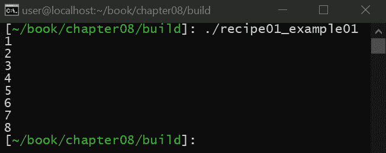

# 八、创建和实现您自己的容器

在本章中，您将学习如何通过利用 C++ 标准模板库已经提供的现有容器，在 C++ 中创建自己的自定义容器。这一章很重要，因为在很多情况下，您的代码会有在标准模板库容器上执行的常见操作，这些操作会在整个代码中重复(实现线程安全就是这种情况)。本章中的方法将教您如何轻松地将这些重复的代码封装到一个定制的容器中，而不必从头开始编写自己的容器，也不必用难以测试和验证的重复逻辑来乱丢代码。

在本章中，您将学习实现自定义包装容器所需的技能，能够确保`std::vector`始终保持有序。第一个食谱将教你如何创建这个包装的基本知识。第二个方法将扩展第一个方法，教你如何根据容器的运行方式重新定义容器的接口。在这种情况下，由于容器总是按照排序的顺序，您将了解为什么提供一个`push_back()`函数没有意义，即使我们正在做的只是创建一个包装器(包装器的添加改变了容器本身的概念)。在第三个食谱中，你将学习使用迭代器的技巧，以及为什么在这个例子中，只能支持`const`迭代器。最后，我们将向容器中添加几个额外的 API，以提供完整的实现。

本章中的配方如下:

*   使用 std::vector 的简单包装
*   添加标准::集合应用编程接口的相关部分
*   使用迭代器
*   添加标准::矢量应用编程接口的相关部分

# 技术要求

为了编译和运行本章中的示例，读者必须拥有运行 Ubuntu 18.04 的计算机的管理权限，并且具有功能性互联网连接。在运行这些示例之前，读者必须安装以下内容:

```cpp
> sudo apt-get install build-essential git cmake
```

如果这安装在 Ubuntu 18.04 以外的任何操作系统上，则需要 GCC 7.4 或更高版本以及 CMake 3.6 或更高版本。

章节的代码文件可以在[https://github . com/packt publishing/Advanced-CPP-cook book/tree/master/chapter 08](https://github.com/PacktPublishing/Advanced-CPP-CookBook/tree/master/chapter08)找到。

# 使用 std::vector 的简单包装

在本食谱中，我们将学习如何通过包装现有的标准模板库容器来创建自己的自定义容器，以便根据需要提供自定义功能。在后面的食谱中，我们将在这个定制容器的基础上最终创建一个基于`std::vector`的完整容器。

这个方法很重要，因为利用现有容器的代码通常伴随着公共逻辑，每次使用该容器时都会复制该逻辑。这个配方(以及这一整章)将教你如何将这个重复的逻辑封装到你自己的容器中，以便它可以被独立测试。

# 准备好

开始之前，请确保满足所有技术要求，包括安装 Ubuntu 18.04 或更高版本，并在终端窗口中运行以下内容:

```cpp
> sudo apt-get install build-essential git cmake
```

这将确保您的操作系统拥有适当的工具来编译和执行本食谱中的示例。完成后，打开一个新的终端。我们将使用这个终端来下载、编译和运行我们的示例。

# 怎么做...

通过以下步骤来尝试配方:

1.  从新的终端，运行以下命令下载源代码:

```cpp
> cd ~/
> git clone https://github.com/PacktPublishing/Advanced-CPP-CookBook.git
> cd Advanced-CPP-CookBook/chapter08
```

2.  要编译源代码，请运行以下命令:

```cpp
> cmake .
> make recipe01_examples
```

3.  编译源代码后，您可以通过运行以下命令来执行该配方中的每个示例:

```cpp
> ./recipe01_example01
1
2
3
4
5
6
7
8

> ./recipe01_example02
1
2
3

> ./recipe01_example03
3
elements: 4 42 
3
elements: 4 8 15 42 
3
elements: 4 8 15 16 23 42 
```

在下一节中，我们将逐一介绍这些例子，并解释每一个例子是做什么的，以及它与本食谱中所教授的课程之间的关系。

# 它是如何工作的...

在这个食谱中，我们将学习如何在`std::vector`周围创建一个简单的包装容器。大多数情况下，**标准模板库** ( **STL** )容器足以执行您的应用程序可能需要的任务，一般来说，应该避免创建您自己的容器，因为它们很复杂，很难正确处理。

但是，有时您可能会发现自己在容器上重复执行相同的操作。当这种情况发生时，将这些常见的操作包装到一个包装器容器中通常是有帮助的，该容器可以独立地进行单元测试，以确保容器能够按预期工作。例如，STL 容器不是线程安全的。如果您需要一个容器在每次访问该容器时都具有线程安全功能，那么您首先需要确保您对该容器拥有独占访问权限(例如，通过锁定一个`std::mutex`)，然后才能进行容器操作。这种模式将在整个代码中重复出现，增加了进入死锁的机会。这个问题可以通过创建一个容器包装器来防止，该包装器为容器的每个公共成员添加一个`std::mutex`。

在这个方法中，让我们考虑一个例子，在这个例子中，我们创建了一个向量(也就是说，连续内存中的元素数组，您必须能够直接访问它)，这个向量必须始终保持排序顺序。首先，我们需要一些标题:

```cpp
#include <vector>
#include <algorithm>
#include <iostream>
```

为了实现我们的容器，我们将利用`std::vector`。虽然我们可以从头开始实现自己的容器，但大多数时候这是不需要的，应该避免，因为这样的任务非常耗时和复杂。我们需要`std::sort`和`iostream`的`algorithm`表头进行测试。让我们补充如下:

```cpp
template<
    typename T,
    typename Compare = std::less<T>,
    typename Allocator = std::allocator<T>
    >
class container
{
    using vector_type = std::vector<T, Allocator>;
    vector_type m_v;

public:
```

容器的定义将从其模板定义开始，模板定义与`std::vector`的定义相同，只是增加了`Compare`类型，用于定义我们希望容器排序的顺序。默认情况下，容器将按升序排序，但这可以根据需要进行更改。最后，容器将有一个私有成员变量，它是这个容器包装的`std::vector`的一个实例。

为了让容器与 C++ 实用程序、模板函数甚至一些关键的语言特性一起正常运行，容器将需要定义与`std::vector`相同的别名，如下所示:

```cpp
    using value_type = typename vector_type::value_type;
    using allocator_type = typename vector_type::allocator_type;
    using size_type = typename vector_type::size_type;
    using difference_type = typename vector_type::difference_type;
    using const_reference = typename vector_type::const_reference;
    using const_pointer = typename vector_type::const_pointer;
    using compare_type = Compare;
```

正如您所看到的，没有必要自己手动定义别名。相反，我们可以简单地从`std::vector`本身转发别名的声明。这种情况的例外是`compare_type`别名，因为这是我们添加到包装容器中的一个别名，它代表模板类用于最终将提供给`std::sort`的比较操作的类型。

我们也不包括引用别名的非常数版本。原因是我们的容器必须始终保持`std::vector`有序。如果我们向用户提供对存储在`std::vector`中的元素的直接写访问，用户可以将`std::vector`置于无序状态，而我们的定制容器没有能力根据需要重新排序。

接下来，让我们定义我们的构造函数(映射到`std::vector`提供的相同构造函数)。

# 默认构造函数

下面定义了我们的默认构造函数:

```cpp
    container() noexcept(noexcept(Allocator()))
    {
        std::cout << "1\n";
    }
```

由于`std::vector`的默认构造函数产生一个空向量，因此我们没有额外的逻辑必须添加，因为空向量是默认排序的。接下来，我们必须定义一个接受自定义分配器的构造函数。

# 自定义分配器构造函数

我们的自定义分配器构造函数定义如下:

```cpp
    explicit container(
        const Allocator &alloc
    ) noexcept :
        m_v(alloc)
    {
        std::cout << "2\n";
    }
```

和前面的构造函数一样，这个构造函数创建了一个空向量，但是有一个已经存在的分配器。

# 计算构造函数

接下来的两个构造函数允许 API 的用户设置向量的最小大小，如下所示:

```cpp
    container(
        size_type count,
        const T &value,
        const Allocator &alloc = Allocator()
    ) :
        m_v(count, value, alloc)
    {
        std::cout << "3\n";
    }

    explicit container(
        size_type count,
        const Allocator &alloc = Allocator()
    ) :
        m_v(count, alloc)
    {
        std::cout << "4\n";
    }
```

第一个构造函数将创建`count`元素的向量，所有元素都用`value`的值初始化，而第二个构造函数将创建具有默认值的元素(例如，整数向量将被初始化为零)。

# 复制/移动构造函数

为了支持复制和移动容器的能力，我们需要实现如下的复制和移动构造函数:

```cpp
    container(
        const container &other,
        const Allocator &alloc
    ) :
        m_v(other.m_v, alloc)
    {
        std::cout << "5\n";
    }

    container(
        container &&other
    ) noexcept :
        m_v(std::move(other.m_v))
    {
        std::cout << "6\n";
    }
```

因为我们的自定义包装容器必须始终保持排序顺序，所以将一个容器复制或移动到另一个容器不会改变容器中元素的顺序，这意味着这些构造函数也不需要排序操作。然而，我们确实特别注意通过复制或移动我们的容器封装的内部`std::vector`来确保复制和移动正确发生。

为了完整起见，我们还提供了一个移动构造函数，它允许我们像`std::vector`一样，在提供自定义分配器的同时进行移动，如下所示:

```cpp
    container(
        container &&other,
        const Allocator &alloc
    ) :
        m_v(std::move(other.m_v), alloc)
    {
        std::cout << "7\n";
    }
```

接下来，我们将提供一个接受初始化列表的构造函数。

# 初始化列表构造函数

最后，我们还将添加一个接受初始值设定项列表的构造函数，如下所示:

```cpp
    container(
        std::initializer_list<T> init,
        const Allocator &alloc = Allocator()
    ) :
        m_v(init, alloc)
    {
        std::sort(m_v.begin(), m_v.end(), compare_type());
        std::cout << "8\n";
    }
```

如前面的代码所示，初始化列表可以以任何顺序为`std::vector`提供初始元素。因此，我们必须在向量初始化后对列表进行排序。

# 使用

让我们测试这个容器，以确保每个构造函数都按预期工作:

```cpp
int main(void)
{
    auto alloc = std::allocator<int>();

    container<int> c1;
    container<int> c2(alloc);
    container<int> c3(42, 42);
    container<int> c4(42);
    container<int> c5(c1, alloc);
    container<int> c6(std::move(c1));
    container<int> c7(std::move(c2), alloc);
    container<int> c8{4, 42, 15, 8, 23, 16};

    return 0;
}
```

如前面的代码块所示，我们通过调用每个构造函数来测试我们的构造函数，这将产生以下输出:



如您所见，每个构造函数都按预期成功执行了。

# 向我们的容器中添加元素

有了我们的构造函数，我们还需要提供手动向容器添加数据的能力(例如，如果我们最初使用默认构造函数创建了容器)。

首先，让我们关注一下`std::vector`提供的`push_back()`功能:

```cpp
    void push_back(const T &value)
    {
        m_v.push_back(value);
        std::sort(m_v.begin(), m_v.end(), compare_type());

        std::cout << "1\n";
    }

    void push_back(T &&value)
    {
        m_v.push_back(std::move(value));
        std::sort(m_v.begin(), m_v.end(), compare_type());

        std::cout << "2\n";
    }
```

如前面的代码片段所示，`push_back()`函数具有与版本`std::vector`相同的函数签名，允许我们简单地将函数调用转发给`std::vector`。问题是，将一个值推到`std::vector`的末尾可能会导致`std::vector`进入无序状态，要求我们在每次推送时对`std::vector`进行重新排序(要求`std::vector`始终保持有序的结果)。

解决这个问题的一种方法是向容器包装器添加另一个成员变量，该变量跟踪`std::vector`何时被污染。实现这些功能的另一种方法是按排序顺序添加元素(也就是说，遍历向量排序顺序并将元素放在适当的位置，根据需要移动剩余的元素)。如果元素很少被添加到`std::vector`中，那么这种方法可能会优于调用`std::sort`。然而，如果元素被大量添加到`std::vector`中，那么受污染的方法可能会表现得更好。

创建容器包装器的一个主要好处是，这些类型的优化可以在不改变依赖于容器本身的代码的情况下实现和测试。两种实现(或其他)都可以被实现、测试和比较，以确定哪种优化最适合您的特定需求，而使用容器的代码永远不会改变。这不仅清理了代码，而且增加的封装触及了面向对象设计的核心，确保代码中的每个对象只有一个目的。在容器包装器的情况下，目的是封装以排序顺序维护`std::vector`的操作。

为了完整起见，我们还会增加`push_back()`的`emplace_back()`版本，就像`std::vector`一样:

```cpp
    template<typename... Args>
    void emplace_back(Args&&... args)
    {
        m_v.emplace_back(std::forward<Args>(args)...);
        std::sort(m_v.begin(), m_v.end(), compare_type());

        std::cout << "3\n";
    }
```

与等效的`std::vector`相比，`emplace_back()`函数的不同之处在于，我们的版本不返回对所创建元素的引用。这是因为排序会使引用无效，从而无法返回有效的引用。

# 推送/定位的使用

最后，让我们测试一下我们的`push_back()`和`emplace`函数，以确保它们被正确调用，如下所示:

```cpp
int main(void)
{
    int i = 42;
    container<int> c;

    c.push_back(i);
    c.push_back(std::move(i));
    c.emplace_back(42);

    return 0;
}
```

如前面的代码片段所示，我们调用每个版本的`push_back()`以及`emplace_back()`函数，以确保它们按照预期被正确调用，结果如下:


我们可以更进一步，向我们的测试容器添加更好的测试数据，如下所示:

```cpp
int main(void)
{
    int i = 42;
    container<int> c;

    c.emplace_back(4);
    c.push_back(i);
    c.emplace_back(15);
    c.push_back(8);
    c.emplace_back(23);
    c.push_back(std::move(16));

    return 0;
}
```

如前面的代码片段所示，我们将整数`4`、`42`、`15`、`8`、`23`和`16`添加到向量中。在下一个配方中，我们将从`std::set`中窃取 API，以向我们的容器提供更好的`push`和`emplace`API，以及一个输出函数，以更好地了解`std::vector`包含什么以及它包含元素的顺序。

# 添加标准::集合应用编程接口的相关部分

在这个食谱中，我们将学习如何将`std::set`中的 API 添加到我们在第一个食谱中创建的自定义容器中。具体来说，我们将了解为什么`std::vector::push_back()`和`std::vector::emplace_back()`在与我们的自定义容器一起使用时没有意义，该容器总是以排序顺序维护其内部元素。

# 准备好

开始之前，请确保满足所有技术要求，包括安装 Ubuntu 18.04 或更高版本，并在终端窗口中运行以下内容:

```cpp
> sudo apt-get install build-essential git cmake
```

这将确保您的操作系统拥有适当的工具来编译和执行本食谱中的示例。完成后，打开一个新的终端。我们将使用这个终端来下载、编译和运行我们的示例。

# 怎么做...

通过以下步骤来尝试配方:

1.  从新的终端，运行以下命令下载源代码:

```cpp
> cd ~/
> git clone https://github.com/PacktPublishing/Advanced-CPP-CookBook.git
> cd Advanced-CPP-CookBook/chapter08
```

2.  要编译源代码，请运行以下命令:

```cpp
> cmake .
> make recipe02_examples
```

3.  编译源代码后，您可以通过运行以下命令来执行该配方中的每个示例:

```cpp
> ./recipe02_example01 
elements: 4 
elements: 4 42 
elements: 4 15 42 
elements: 4 8 15 42 
elements: 4 8 15 23 42 
elements: 4 8 15 16 23 42 
```

在下一节中，我们将逐一介绍这些示例，并解释每个示例程序的功能以及它与本食谱中所教授的课程之间的关系。

# 它是如何工作的...

在本章的第一个食谱中，我们创建了一个定制的容器包装器，它模仿了一个`std::vector`，但是它确保了向量中的元素始终保持有序的顺序，包括添加`std::vector::push_back()`函数和`std::vector::emplace_back()`函数。在本食谱中，我们将把`std::set::insert()`和`std::set::emplace()`功能添加到我们的定制容器中。

因为我们的容器包装器总是确保`std::vector`是有序的，所以在向量的前面、后面或中间添加一个元素没有区别。无论元素添加到向量的哪个位置，都必须在访问向量之前对其进行排序，这意味着无论元素添加到哪个位置，元素的添加顺序都可能发生变化。

这种对元素添加位置的不关心类似于`std::set`。`std::set`向集合中添加元素，然后返回`true`或`false`，这取决于被测试的元素是否是集合的成员。`std::set`提供`insert()`和`emplace()`功能，为器械包添加元素。让我们将这些相同的 API 添加到自定义容器中，如下所示:

```cpp
    void insert(const T &value)
    {
        push_back(value);
    }

    void insert(T &&value)
    {
        push_back(std::move(value));
    }

    template<typename... Args>
    void emplace(Args&&... args)
    {
        emplace_back(std::forward<Args>(args)...);
    }
```

正如您在前面的代码片段中看到的，我们添加了一个`insert()`函数(复制和移动)，以及一个`emplace()`函数，它只不过是调用它们的`push_back()`和`emplace_back()`等价物，确保传递给这些函数的参数被正确转发。这些应用编程接口和我们在之前的配方*中添加的应用编程接口之间的唯一区别是函数本身的名称，该配方使用了一个简单的 std::vector* 包装器。

虽然这样的改变看起来微不足道，但这很重要，因为它重新定义了容器的 API 和用户之间的概念。`push_back()`和`emplace_back()`函数建议将元素添加到向量的后面，而事实上并不是。相反，它们被简单地添加到`std::vector`中，并且`std::vector`的顺序根据所添加元素的值而改变。因此，`push_back()`和`emplace_back()`功能是需要的，但是应该要么重命名，要么标记为私有，以确保用户只使用`insert()`和`emplace()`版本来正确管理期望。当编写您自己的容器(甚至是包装器)时，坚持最少惊讶的原则是很重要的，这确保了用户正在使用的应用编程接口将按照应用编程接口可能建议的方式工作。

# 使用迭代器

在本食谱中，我们将学习如何向我们在第一个食谱中开始的自定义容器添加迭代器支持，该容器包装了一个`std::vector`，确保其内容始终保持排序顺序。

为了增加迭代器支持，我们将学习如何转发`std::vector`已经提供的迭代器(我们不会从头实现迭代器，因为这是本书范围之外的一个主题，因为从头实现容器非常困难)。

# 准备好

开始之前，请确保满足所有技术要求，包括安装 Ubuntu 18.04 或更高版本，并在终端窗口中运行以下内容:

```cpp
> sudo apt-get install build-essential git cmake
```

这将确保您的操作系统拥有适当的工具来编译和执行本食谱中的示例。完成后，打开一个新的终端。我们将使用这个终端来下载、编译和运行我们的示例。

# 怎么做...

你需要通过以下步骤来尝试这个食谱:

1.  从新的终端，运行以下命令下载源代码:

```cpp
> cd ~/
> git clone https://github.com/PacktPublishing/Advanced-CPP-CookBook.git
> cd Advanced-CPP-CookBook/chapter08
```

2.  要编译源代码，请运行以下命令:

```cpp
> cmake .
> make recipe03_examples
```

3.  编译源代码后，您可以通过运行以下命令来执行该配方中的每个示例:

```cpp
> ./recipe03_example01 
elements: 4 8 15 16 23 42 

> ./recipe03_example02 
elements: 4 8 15 16 23 42 
elements: 4 8 15 16 23 42 
elements: 42 23 16 15 8 4 
elements: 1 4 8 15 16 23 42 
elements: 4 8 15 16 23 42 
elements: 
```

在下一节中，我们将逐一介绍这些示例，并解释每个示例程序的功能以及它与本食谱中所教授的课程之间的关系。

# 它是如何工作的...

我们的定制容器包装的`std::vector`已经提供了迭代器的有效实现，可以用于我们的容器。然而，我们需要转发`std::vector`提供的 API 的特定部分，以确保迭代器正常工作，包括关键的 C++ 特性，例如基于范围的循环。

首先，让我们将最后一个剩余的构造函数`std::vector`添加到我们的自定义容器中:

```cpp
    template <typename Iter>
    container(
        Iter first,
        Iter last,
        const Allocator &alloc = Allocator()
    ) :
        m_v(first, last, alloc)
    {
        std::sort(m_v.begin(), m_v.end(), compare_type());
    }
```

如前面的代码片段所示，我们给定的迭代器类型没有定义。迭代器可以来自我们容器的另一个实例，也可以直接来自`std::vector`，它不按排序顺序存储元素。即使迭代器来自我们定制容器的实例，迭代器存储元素的顺序也可能与容器元素的顺序不同。因此，我们必须在`std::vector`初始化后对其进行排序。

除了构造，重要的是我们的定制容器还包括`std::vector`提供的基于迭代器的别名，因为这些别名是容器正确使用 c++ API 所必需的。下面是它的示例代码片段:

```cpp
    using const_iterator = typename vector_type::const_iterator;
    using const_reverse_iterator = typename vector_type::const_reverse_iterator;
```

如前面的代码片段所示，像第一个配方中定义的别名一样，我们只需要转发声明`std::vector`已经提供的别名，这样我们的定制容器也可以利用它们。不同的是，我们不包括这些迭代器别名的非常数版本。由于我们的自定义容器必须始终保持数据的排序顺序，因此我们必须限制用户直接修改迭代器内容的能力，因为这可能会导致容器元素的顺序发生变化，而我们的容器无法根据需要重新排序。相反，应通过使用`insert()`、`emplace()`和`erase()`对容器进行修改。

C++ template-based functions rely on these aliases to properly implement their features, which also include range-based for loops.

最后，`std::vector`提供的一系列基于迭代器的成员函数也应该通过我们的定制容器转发。下面的代码描述了这一点:

```cpp
    const_iterator begin() const noexcept
    {
        return m_v.begin();
    }

    const_iterator cbegin() const noexcept
    {
        return m_v.cbegin();
    }
```

第一组成员函数是`begin()`函数，它提供了一个迭代器来表示`std::vector`中的第一个元素。与别名一样，我们不转发这些成员函数的非常数版本。此外，为了完整起见，我们包括了这些函数的`c`版本。在 C++ 17 中，这些是可选的，因为如果愿意，您可以使用`std::as_const()`来代替。下一组迭代器是`end()`迭代器，它提供了一个表示`std::vector`结尾的迭代器(不要与表示`std::vector`中最后一个元素的迭代器混淆)。下面的代码显示了这一点:

```cpp
    const_iterator end() const noexcept
    {
        return m_v.end();
    }

    const_iterator cend() const noexcept
    {
        return m_v.cend();
    }
```

如前面的代码片段所示，和大多数成员函数一样，我们只需要将 API 转发到我们的定制容器封装的私有`std::vector`中。这个相同的过程可以对`rbegin()`和`rend()`重复，它们提供了与前面相同的 API，但是返回一个反向迭代器，它以相反的顺序遍历`std::vector`。

接下来，我们实现基于迭代器的`emplace()`函数，如下所示:

```cpp
    template <typename... Args>
    void emplace(const_iterator pos, Args&&... args)
    {
        m_v.emplace(pos, std::forward<Args>(args)...);
        std::sort(m_v.begin(), m_v.end(), compare_type());
    }
```

虽然提供`emplace()` API 提供了一个更完整的实现，但是应该注意的是，只有进一步优化以利用元素添加到容器的方式中的预期位置，它才会有用。这与对`std::vector`进行排序的更好方法相结合。

虽然前面的实现是可行的，但是它的性能很可能类似于我们在第一个配方中实现的`emplace()`版本。由于自定义容器始终保持排序顺序，元素插入到`std::vector`的位置无关紧要，因为`std::vector`的新顺序将改变被添加元素的位置。这是当然的，除非 position 参数的添加为 API 提供了一些额外的支持来更好地优化添加，而我们的实现并没有这样做。因此，除非`pos`参数用于优化，否则前面的函数可能是多余和不必要的。

与前面的`emplace()`函数一样，我们不试图返回表示添加到容器中的元素的迭代器，因为这个迭代器在排序后变得无效，并且没有足够的关于添加到`std::vector`中的内容的信息来重新定位迭代器(例如，如果存在重复，就无法知道哪个元素实际上刚刚被添加)。

最后，我们实现`erase`功能，如下所示:

```cpp
    const_iterator erase(const_iterator pos)
    {
        return m_v.erase(pos);
    }

    const_iterator erase(const_iterator first, const_iterator last)
    {
        return m_v.erase(first, last);
    }
```

与`emplace()`功能不同，从`std::vector`中移除元素不会改变`std::vector`的顺序，因此不需要排序。还需要注意的是，我们版本的`erase()`功能返回了`const`版本。这再次是因为我们不能支持迭代器的非常数版本。

最后，现在我们已经能够访问存储在容器中的元素，让我们创建一些测试逻辑来确保我们的容器按照预期工作:

```cpp
int main(void)
{
    container<int> c{4, 42, 15, 8, 23, 16};
```

首先，我们将从初始值设定项列表中创建一个容器，其中包含没有顺序的整数。在这个容器被创建之后，存储这些元素的`std::vector`应该是有序的。为了证明这一点，让我们遍历容器并输出结果:

```cpp
    std::cout << "elements: ";

    for (const auto &elem : c) {
        std::cout << elem << ' ';
    }

    std::cout << '\n';
```

如前面的代码片段所示，我们首先向`stdout`输出一个标签，然后使用基于范围的 for 循环迭代我们的容器，一次输出一个元素。最后，在所有元素都输出到`stdout`后，我们输出一个新的行，结果如下:

```cpp
elements: 4 8 15 16 23 42
```

正如预期的那样，该输出按排序顺序排列。

需要注意的是，我们的 for 循环范围必须将每个元素定义为`const`。这是因为我们不支持迭代器的非常数版本。任何使用这些迭代器的非常数版本的尝试都会导致编译器错误，如下例所示:

```cpp
    for (auto &elem : c) {
        elem = 42;
    }
```

前面的代码导致以下编译器错误(这是有意的):

```cpp
/home/user/book/chapter08/recipe03.cpp: In function ‘int main()’:
/home/user/book/chapter08/recipe03.cpp:396:14: error: assignment of read-only reference ‘elem’
  396 | elem = 42;
```

发生此编译器错误的原因是因为 for 循环的范围也可以写成如下形式:

```cpp
    std::cout << "elements: ";

    for (auto iter = c.begin(); iter != c.end(); iter++) {
        auto &elem = *iter;
        std::cout << elem << ' ';
    }

    std::cout << '\n';
```

如前面的代码片段所示，元素没有被标记为`const`，因为 ranged for 循环使用了`begin()`和`end()`成员函数，从而产生了读写迭代器(除非您明确声明`const`)。

我们还可以为新的`emplace()`函数创建一个测试，如下所示:

```cpp
    c.emplace(c.cend(), 1);

    std::cout << "elements: ";
    for (const auto &elem : c) {
        std::cout << elem << ' ';
    }
    std::cout << '\n';
```

这将产生以下输出:

```cpp
elements: 1 4 8 15 16 23 42
```

如前面的输出所示，数字`1`按照排序顺序添加到我们的容器中，尽管我们告诉容器将我们的元素添加到`std::vector`的末尾。

我们还可以颠倒前面的操作，验证我们的`erase()`功能是否正常工作，如下所示:

```cpp
    c.erase(c.cbegin());

    std::cout << "elements: ";
    for (const auto &elem : c) {
        std::cout << elem << ' ';
    }
    std::cout << '\n';
```

这将产生以下输出:

```cpp
elements: 4 8 15 16 23 42
```

可以看到，新增的`1`已经成功移除。

# 添加标准::矢量应用编程接口的相关部分

在这个食谱中，我们将通过添加`std::vector`已经提供的剩余 API 来完成我们在本章前三个食谱中构建的定制容器。在这个过程中，我们将删除没有意义的或者我们不能支持的 API，因为我们的定制容器必须将`std::vector`中的元素保持在有序的顺序中。

这个方法很重要，因为它将向您展示如何正确地创建一个包装容器，该容器可以用容器所需的逻辑(例如，线程安全，或者在我们的例子中，元素顺序)来封装现有的容器。

# 准备好

开始之前，请确保满足所有技术要求，包括安装 Ubuntu 18.04 或更高版本，并在终端窗口中运行以下内容:

```cpp
> sudo apt-get install build-essential git cmake
```

这将确保您的操作系统拥有适当的工具来编译和执行本食谱中的示例。完成后，打开一个新的终端。我们将使用这个终端来下载、编译和运行我们的示例。

# 怎么做...

通过以下步骤来尝试配方:

1.  从新的终端，运行以下命令下载源代码:

```cpp
> cd ~/
> git clone https://github.com/PacktPublishing/Advanced-CPP-CookBook.git
> cd Advanced-CPP-CookBook/chapter08
```

2.  要编译源代码，请运行以下命令:

```cpp
> cmake .
> make recipe04_examples
```

3.  编译源代码后，您可以通过运行以下命令来执行该配方中的每个示例:

```cpp
> ./recipe04_example01 
elements: 4 8 15 16 23 42 
elements: 4 8 15 16 23 42 
elements: 4 8 15 16 23 42 
elements: 42 
elements: 4 8 15 16 23 42 
elements: 4 8 15 16 23 42 
c1.at(0): 4
c1.front(): 4
c1.back(): 42
c1.data(): 0xc01eb0
c1.empty(): 0
c1.size(): 6
c1.max_size(): 2305843009213693951
c1.capacity(): 42
c1.capacity(): 6
c1.size(): 0
c1.size(): 42
c1.size(): 0
c1.size(): 42
elements: 4 8 15 16 23 
==: 0
!=: 1
 <: 1
<=: 1
 >: 0
>=: 0
```

在下一节中，我们将逐一介绍这些示例，并解释每个示例程序的功能以及它与本食谱中所教授的课程之间的关系。

# 它是如何工作的...

目前，我们的定制容器能够被构建、添加、迭代和删除。然而，容器不支持直接访问容器的能力，也不支持简单的操作，例如`std::move()`或比较。为了解决这些问题，让我们从添加缺失的`operator=()`重载开始:

```cpp
    constexpr container &operator=(const container &other)
    {
        m_v = other.m_v;
        return *this;
    }

    constexpr container &operator=(container &&other) noexcept
    {
        m_v = std::move(other.m_v);
        return *this;
    }    
```

第一个`operator=()`重载为复制分配提供支持，而第二个重载为移动分配提供支持。因为我们只有一个已经提供了适当的复制和移动语义的私有成员变量，所以我们不需要担心自我赋值(或移动)，因为`std::vector`函数的复制和移动实现将为我们处理这一点。

如果您自己的定制容器有额外的私有元素，那么很可能需要自我赋值检查。例如，考虑以下代码:

```cpp
    constexpr container &operator=(container &&other) noexcept
    {
        if (&other == this) {
            return *this;
        }

        m_v = std::move(other.m_v);
        m_something = other.m_something;

        return *this;
    }
```

剩余的`operator=()`重载取一个初始化列表，如下所示:

```cpp
    constexpr container &operator=(std::initializer_list<T> list)
    {
        m_v = list;
        std::sort(m_v.begin(), m_v.end(), compare_type());

        return *this;
    }
```

如前面的代码片段所示，像初始化列表构造函数一样，我们必须在赋值后对`std::vector`重新排序，因为初始化列表可以以任何顺序提供。

接下来要实现的成员函数是`assign()`函数。下面的代码片段显示了这一点:

```cpp
    constexpr void assign(size_type count, const T &value)
    {
        m_v.assign(count, value);
    }

    template <typename Iter>
    constexpr void assign(Iter first, Iter last)
    {
        m_v.assign(first, last);
        std::sort(m_v.begin(), m_v.end(), compare_type());
    }

    constexpr void assign(std::initializer_list<T> list)
    {
        m_v.assign(list);
        std::sort(m_v.begin(), m_v.end(), compare_type());
    }
```

这些函数类似于`operator=()`重载，但不提供返回值或支持附加功能。让我们看看如何:

*   第一个`assign()`功能用特定的`value`计数次数填充`std::vector`。由于该值从不改变，`std::vector`将始终按排序顺序排列，在这种情况下，无需对列表进行排序。
*   第二个`assign()`函数取一个迭代器范围，类似于这个函数的构造器版本。像那个函数一样，传递给这个函数的迭代器可能来自原始的`std::vector`或者我们定制容器的另一个实例，但是排序顺序不同。为此，我们必须在作业后整理`std::vector`。
*   最后，`assign()`函数还提供了一个初始化列表版本，与我们的`operator=()`重载相同。

还需要注意的是，我们已经在每个功能中添加了`constexpr`。这是因为我们的定制容器中的大多数功能只不过是将一个调用从定制容器转发到`std::vector`，在某些情况下，还会调用`std::sort()`。`constexpr`的添加告诉编译器将代码视为编译时表达式，使其能够在启用优化时优化掉额外的函数调用(如果可能)，从而确保我们的自定义包装器具有尽可能小的开销。

过去，这种类型的优化是使用`inline`关键字进行的。在 C++ 11 中添加的`constexpr`不仅能够为编译器提供`inline`提示，还能告诉编译器这个函数可以在编译时使用，而不是在运行时使用(这意味着编译器可以在编译代码时执行这个函数，以执行定制的编译时逻辑)。然而，在我们这里的例子中，运行时使用`std::vector`是不可能的，因为需要分配。因此，`constexpr`的使用只是为了优化，在大多数编译器上，`inline`关键字会提供类似的好处。

还有很多`std::vector`也支持的附加功能，比如`get_allocator()`、`empty()`、`size()`、`max_size()`，都只是直接转发。让我们把重点放在我们的定制容器中到目前为止缺少的访问器上:

```cpp
    constexpr const_reference at(size_type pos) const
    {
        return m_v.at(pos);
    }
```

我们提供的第一个直接访问`std::vector`的功能是`at()`功能。与我们的大多数成员职能一样，这是一个直接的前进。然而，与`std::vector`不同，我们没有计划增加`std::vector`提供的`operator[]()`过载。`at()`函数和`operator[]()`重载的区别在于`operator[]()`不检查以确保提供的索引在边界内(也就是说，它不访问`std::vector`边界外的元素)。

`operator[]()`重载的功能类似于标准的 C 数组。这个操作符(被称为下标操作符)的问题是，缺少边界检查为可靠性和安全性缺陷进入您的程序打开了大门。因此，C++ 核心准则不鼓励使用下标运算符或任何其他形式的指针算法(任何试图通过使用指针计算数据位置而不进行显式边界检查的方法)。

为了防止使用`operator[]()`过载，我们不包括它。

像`std::vector`一样，我们也可以添加`front()`和`back()`访问器，如下所示:

```cpp
    constexpr const_reference front() const
    {
        return m_v.front();
    }

    constexpr const_reference back() const
    {
        return m_v.back();
    }
```

前面的附加访问器为获取我们的`std::vector`中的第一个和最后一个元素提供了支持。与`at()`功能一样，我们只支持使用`std::vector`已经提供的这些功能的`const_reference`版本。

现在我们来看代码片段`data()`函数:

```cpp
    constexpr const T* data() const noexcept
    {
        return m_v.data();
    }
```

`data()`功能也是如此。我们只能支持这些成员函数的`const`版本，因为提供这些函数的非常量版本将为用户提供对`std::vector`的直接访问，允许他们插入无序数据，而容器没有能力根据需要重新排序。

现在让我们关注比较运算符。我们首先将比较运算符的原型定义为容器的朋友。这是需要的，因为比较运算符通常实现为非成员函数，因此需要对容器的私有访问来比较它们包含的`std::vector`实例。

例如，考虑以下代码片段:

```cpp
    template <typename O, typename Alloc>
    friend constexpr bool operator==(const container<O, Alloc> &lhs,
                                     const container<O, Alloc> &rhs);

    template <typename O, typename Alloc>
    friend constexpr bool operator!=(const container<O, Alloc> &lhs,
                                     const container<O, Alloc> &rhs);

    template <typename O, typename Alloc>
    friend constexpr bool operator<(const container<O, Alloc> &lhs,
                                    const container<O, Alloc> &rhs);

    template <typename O, typename Alloc>
    friend constexpr bool operator<=(const container<O, Alloc> &lhs,
                                     const container<O, Alloc> &rhs);

    template <typename O, typename Alloc>
    friend constexpr bool operator>(const container<O, Alloc> &lhs,
                                    const container<O, Alloc> &rhs);

    template <typename O, typename Alloc>
    friend constexpr bool operator>=(const container<O, Alloc> &lhs,
                                     const container<O, Alloc> &rhs);
```

最后，我们按如下方式实现比较运算符:

```cpp
template <typename O, typename Alloc>
bool constexpr operator==(const container<O, Alloc> &lhs,
                          const container<O, Alloc> &rhs)
{
    return lhs.m_v == rhs.m_v;
}

template <typename O, typename Alloc>
bool constexpr operator!=(const container<O, Alloc> &lhs,
                          const container<O, Alloc> &rhs)
{
    return lhs.m_v != rhs.m_v;
}
```

和成员函数一样，我们只需要将调用转发到`std::vector`，因为不需要实现自定义逻辑。这同样适用于其余的比较运算符。

例如，我们可以如下实现`>`、`<`、`>=`和`<=`比较运算符:

```cpp
template <typename O, typename Alloc>
bool constexpr operator<(const container<O, Alloc> &lhs,
                         const container<O, Alloc> &rhs)
{
    return lhs.m_v < rhs.m_v;
}

template <typename O, typename Alloc>
bool constexpr operator<=(const container<O, Alloc> &lhs,
                          const container<O, Alloc> &rhs)
{
    return lhs.m_v <= rhs.m_v;
}

template <typename O, typename Alloc>
bool constexpr operator>(const container<O, Alloc> &lhs,
                         const container<O, Alloc> &rhs)
{
    return lhs.m_v > rhs.m_v;
}

template <typename O, typename Alloc>
bool constexpr operator>=(const container<O, Alloc> &lhs,
                          const container<O, Alloc> &rhs)
{
    return lhs.m_v >= rhs.m_v;
}
```

就是这样！这就是如何通过利用现有的容器来实现自己的容器。

正如我们所看到的，在大多数情况下，没有必要从头实现容器，除非您需要的容器不能使用 C++ 标准模板库已经提供的容器之一来实现。

使用这种方法，不仅可以创建自己的容器，而且更重要的是，可以将代码中重复的功能封装到一个可以独立测试和验证的容器中。这不仅提高了应用程序的可靠性，还使它们更容易阅读和维护。

在下一章中，我们将探讨如何在 C++ 中使用智能指针。