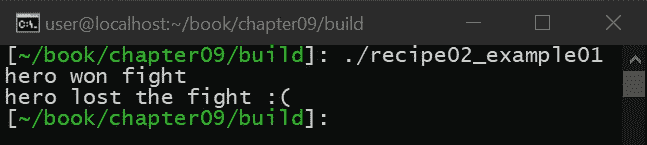

# 探索类型擦除

在本章中，您将了解什么是类型擦除(也称为类型擦除)，以及如何在您自己的应用程序中使用它。本章很重要，因为类型擦除提供了处理不同类型对象的能力，而不需要对象共享一个公共基类。

本章首先简单解释了类型擦除，解释了类型擦除在 C 语言中是如何工作的，以及如何使用继承在 C++中执行类型擦除。下一个方法将提供一种使用 C++模板进行类型擦除的不同方法，它将教您如何使用 C++概念来定义类型的规范，而不是类型本身。

接下来，我们将介绍经典的 C++类型擦除模式。这个食谱将教你擦除类型信息的技巧，提供创建类型安全的通用代码的能力。最后，我们将以一个使用类型擦除来实现委托模式的综合示例来结束，这是一种提供包装任何类型的可调用对象的能力的模式，被像 ObjC 这样的语言大量使用。

本章中的配方如下:

*   如何删除具有继承性的类型
*   使用 C++模板编写泛型函数
*   学习 C++类型的橡皮擦模式
*   实现委托模式

# 技术要求

要编译和运行本章中的示例，您必须拥有运行 Ubuntu 18.04 的计算机的管理权限，并且具有功能性互联网连接。在运行这些示例之前，您必须安装以下内容:

```cpp
> sudo apt-get install build-essential git cmake
```

如果这安装在 Ubuntu 18.04 以外的任何操作系统上，则需要 GCC 7.4 或更高版本以及 CMake 3.6 或更高版本。

本章的代码文件可以在[https://github . com/packt publishing/Advanced-CPP-cook book/tree/master/chapter 09](https://github.com/PacktPublishing/Advanced-CPP-CookBook/tree/master/chapter09)找到。

# 如何删除具有继承性的类型

在这个食谱中，我们将学习如何使用继承来删除类型。当讨论类型擦除时，通常不考虑继承，但在现实中，它是 C++中使用的最常见的类型擦除形式。这个方法很重要，因为它将讨论什么是类型擦除，以及为什么它在日常应用中如此有用，而不仅仅是删除类型信息——这是 c 语言中常见的做法。

# 准备好

开始之前，请确保满足所有技术要求，包括安装 Ubuntu 18.04 或更高版本，并在终端窗口中运行以下内容:

```cpp
> sudo apt-get install build-essential git cmake
```

这将确保您的操作系统拥有适当的工具来编译和执行本食谱中的示例。完成后，打开一个新的终端。我们将使用这个终端来下载、编译和运行我们的示例。

# 怎么做...

让我们按照以下步骤来尝试这个食谱:

1.  从新的终端，运行以下命令下载源代码:

```cpp
> cd ~/
> git clone https://github.com/PacktPublishing/Advanced-CPP-CookBook.git
> cd Advanced-CPP-CookBook/chapter09
```

2.  要编译源代码，请运行以下命令:

```cpp
> cmake .
> make recipe01_examples
```

3.  编译源代码后，您可以通过运行以下命令来执行该配方中的每个示例:

```cpp
> ./recipe01_example01 
1
0
```

在下一节中，我们将逐一介绍这些示例，并解释每个示例程序的功能，以及它与本食谱中所教授的课程之间的关系。

# 它是如何工作的...

类型擦除(或类型擦除)只是移除、隐藏或减少关于对象、功能等的类型信息的行为。在 C 语言中，类型擦除一直被使用。看看这个例子:

```cpp
int array[10];
memset(array, 0, sizeof(array));
```

在前面的例子中，我们创建了一个`10`元素的数组，然后我们使用`memset()`函数将数组清零。C 语言中的`memset()`函数看起来是这样的:

```cpp
void *memset(void *ptr, int value, size_t num)
{
    size_t i;
    for (i = 0; i < num; i++) {
        ((char *)ptr)[i] = value;    
    }

    return ptr;
}
```

如前面的代码片段所示，`memset()`函数取的第一个参数是`void*`。然而，前面例子中的数组是整数数组。`memset()`函数实际上并不关心您提供了什么类型，只要您提供了一个指向该类型的指针和一个以字节为单位表示该类型总大小的大小。`memset()`函数然后将提供的指针类型转换为代表一个字节的类型(在 C 语言中，这通常是`char`或无符号的`char`，然后逐字节设置该类型的值。

在 C 中使用`void*`是类型擦除的一种形式。在 C++中，这种类型(双关)的擦除通常是不鼓励的，因为获取类型信息的唯一方法是使用`dynamic_cast()`，这很慢(它需要运行时类型信息查找)。虽然在 C++中有很多方法可以执行类型擦除而不需要`void *`，但是让我们把重点放在继承上。

在大多数文献中，继承通常不被描述为类型擦除，但它可能是最广泛使用的类型擦除形式。为了更好地探索这是如何工作的，让我们看一个常见的例子。假设我们正在创建一个有多个超级英雄可供用户选择的游戏。每个超级英雄在某个时刻都要攻击坏人，但是超级英雄如何攻击坏人，每个英雄都不一样。

例如，考虑以下代码片段:

```cpp
class spiderman
{
public:
    bool attack(int x, int) const
    {
        return x == 0 ? true : false;
    }
};
```

如前面的代码片段所示，我们的第一个英雄不在乎坏人是在地上还是在空中(也就是说，无论坏人的垂直距离如何，英雄都会成功击中坏人)，但是如果他们不在特定的水平位置，就会错过坏人。同样，我们也可能有另一个英雄如下:

```cpp
class captain_america
{
public:
    bool attack(int, int y) const
    {
        return y == 0 ? true : false;
    }
};
```

第二个英雄与我们的第一个完全相反。这个英雄可以在地面上的任何地方成功击中坏人，但是如果坏人在地面上的任何地方，这个英雄就会错过(英雄可能够不到他们)。

在下面的例子中，两个超级英雄同时在和坏人战斗:

```cpp
    for (const auto &h : heroes) {
        std::cout << h->attack(0, 42) << '\n';
    }
```

虽然我们可以在战斗中一次给每个超级英雄打一个电话，但如果我们能在战斗中循环每个英雄，看看哪个英雄击中了坏人，哪个英雄错过了坏人，那就方便多了。

在前面的例子中，我们有一个假设的英雄数组，我们循环遍历，检查哪个英雄命中，哪个英雄没有命中。在这个例子中，我们不关心英雄的类型(也就是说，我们不关心英雄具体是我们的第一个英雄还是第二个英雄)，我们只关心每个英雄实际上是一个英雄(而不是一个无生命的物体)，以及英雄有能力攻击坏人。换句话说，我们需要一种方法来删除每个超级英雄的类型，这样我们就可以将两个英雄放在一个数组中(除非每个英雄都是相同的，否则这是不可能的)。

正如您可能已经猜到的，在 C++中实现这一点最常见的方法是使用继承(但是正如我们将在本章后面展示的，这不是唯一的方法)。首先，我们必须首先定义一个名为`hero`的基类，每个英雄都将继承这个基类，如下所示:

```cpp
class hero
{
public:
    virtual ~hero() = default;
    virtual bool attack(int, int) const = 0;
};
```

在我们的例子中，每个英雄之间唯一的共同功能是他们都可以攻击坏人，`attack()`功能对所有英雄都是一样的。因此，我们创建了一个纯虚拟基类，其中有一个名为`attack()`的纯虚拟函数，每个英雄都必须实现它。还需要注意的是，一个类要成为纯虚函数，所有成员函数都必须设置为`0`，该类的析构函数必须显式标记为`virtual`。

现在我们已经定义了什么是英雄，我们可以修改我们的英雄来继承这个纯虚拟基类，如下所示:

```cpp
class spiderman : public hero
{
public:
    bool attack(int x, int) const override
    {
        return x == 0 ? true : false;
    }
};

class captain_america : public hero
{
public:
    bool attack(int, int y) const override
    {
        return y == 0 ? true : false;
    }
};
```

如图所示，两个英雄都继承了英雄的纯虚拟定义，并根据需要覆盖了`attack()`功能。有了这个修改，我们现在可以创建我们的英雄列表如下:

```cpp
int main(void)
{
    std::array<std::unique_ptr<hero>, 2> heros {
        std::make_unique<spiderman>(),
        std::make_unique<captain_america>()
    };

    for (const auto &h : heros) {
        std::cout << h->attack(0, 42) << '\n';
    }

    return 0;
}
```

从前面的代码中，我们观察到以下情况:

*   我们创建一个`hero`指针数组(使用`std::unique_ptr`来存储英雄的寿命，这个话题将在下一章讨论)。
*   然后这个数组被初始化为包含两个英雄(每个英雄一个)。
*   最后，我们循环每个英雄，看看英雄是成功攻击坏人还是失手。
*   当调用`hero::attack()`函数时，调用会根据需要通过使用继承自动路由到正确的`spiderman::attack()`和`captain_america::attack()`函数。

该阵列正在以类型安全的方式擦除每个英雄的类型信息，以将每个英雄放入一个容器中。

# 使用 C++模板编写泛型函数

在这个食谱中，我们将学习如何利用 C++模板擦除(或忽略)类型信息。您将学习如何使用 C++模板来实现 C++概念，以及如何在 C++标准库中使用这种类型的擦除。这个方法很重要，因为它将教会你如何更好地将你的 API 设计成不依赖于特定类型的规范(或者，换句话说，如何编写通用代码)。

# 准备好

开始之前，请确保满足所有技术要求，包括安装 Ubuntu 18.04 或更高版本，并在终端窗口中运行以下内容:

```cpp
> sudo apt-get install build-essential git cmake
```

这将确保您的操作系统拥有适当的工具来编译和执行本食谱中的示例。完成后，打开一个新的终端。我们将使用这个终端来下载、编译和运行我们的示例。

# 怎么做...

让我们按照以下步骤来尝试这个食谱:

1.  从新的终端，运行以下命令下载源代码:

```cpp
> cd ~/
> git clone https://github.com/PacktPublishing/Advanced-CPP-CookBook.git
> cd Advanced-CPP-CookBook/chapter09
```

2.  要编译源代码，请运行以下命令:

```cpp
> cmake .
> make recipe02_examples
```

3.  编译源代码后，您可以通过运行以下命令来执行该配方中的每个示例:

```cpp
> ./recipe02_example01 
hero won fight
hero lost the fight :(
```

在下一节中，我们将逐一介绍这些示例，并解释每个示例程序的功能以及它与本食谱中所教授的课程之间的关系。

# 它是如何工作的...

C++最古老、使用最广泛的特性之一是 C++模板。像继承一样，C++模板通常不被描述为类型擦除的一种形式，但它们确实是。类型擦除只不过是删除或者在这种情况下忽略类型信息的行为。

然而，与 C 语言不同的是，C++中的类型擦除通常试图避免移除类型信息，而倾向于在保留类型安全性的同时处理类型的严格定义。实现这一点的一种方法是通过使用 C++模板。为了更好地解释这一点，让我们从一个简单的 C++模板示例开始:

```cpp
template<typename T>
T pow2(T t)
{
    return t * t;
}
```

在前面的例子中，我们创建了一个简单的函数，可以计算任何给定输入的 2 的幂。例如，我们可以这样调用这个函数:

```cpp
std::cout << pow2(42U) << '\n'
std::cout << pow2(-1) << '\n'
```

当编译器看到使用`pow2()`函数时，它会自动为您生成以下代码(幕后):

```cpp
unsigned pow2(unsigned t)
{
    return t * t;
}

int pow2(int t)
{
    return t * t;
}
```

如前面的代码片段所示，编译器创建了两个版本的`pow2()`函数:一个版本接受无符号值并返回无符号值，另一个版本接受整数并返回整数。编译器创建这两个版本是因为第一次使用`pow2()`函数时，我们为其提供了无符号值，而第二次使用`pow2()`函数时，我们为其提供了`int`。

然而，就我们的代码而言，我们实际上并不关心函数提供的是什么类型，只要提供的类型能够成功执行`operator*()`。换句话说，`pow2()`函数的用户和`pow2()`函数的作者都在安全地忽略(或擦除)从概念角度传递给函数和从函数返回的类型信息。然而，编译器非常了解所提供的类型，并且必须根据需要安全地处理每种类型。

这种类型擦除的形式按照 API 的规范执行擦除，在 C++中，这种规范被称为概念。与大多数规定输入和输出类型的应用编程接口不同(例如，`sleep()`函数接受一个无符号整数，并且只接受一个无符号整数)，一个概念特别忽略了类型，而是定义给定类型必须提供什么属性。

例如，前面的`pow2()`功能有以下要求:

*   提供的类型必须是整数类型或提供`operator *()`。
*   提供的类型必须是可复制构造的或可移动构造的。

如前面的代码片段所示，`pow2()`函数并不关心给它什么类型，只要提供的类型满足某些最低要求。让我们研究一个更复杂的例子，演示如何将 C++模板用作类型擦除的一种形式。假设我们有两个不同的英雄在和坏人战斗，每个英雄都提供了攻击坏人的能力，如下代码所示:

```cpp
class spiderman
{
public:
    bool attack(int x, int) const
    {
        return x == 0 ? true : false;
    }
};

class captain_america
{
public:
    bool attack(int, int y) const
    {
        return y == 0 ? true : false;
    }
};
```

如前面的代码片段所示，每个英雄都提供了攻击坏人的能力，但是除了碰巧两个英雄都提供了具有相同函数签名的`attack()`函数之外，两个英雄都没有任何共同点。我们也没有能力给每个英雄增加继承(可能我们的设计无法处理继承增加的额外`vTable`开销，也可能英雄定义是提供给我们的)。

现在假设我们有一个复杂的函数，必须为每个英雄调用`attack()`函数。我们可以为每个英雄编写相同的逻辑(也就是手动复制逻辑)，或者我们可以编写一个 C++模板函数来为我们处理这个问题，如下所示:

```cpp
template<typename T>
auto attack(const T &t, int x, int y)
{
    if (t.attack(x, y)) {
        std::cout << "hero won fight\n";
    }
    else {
        std::cout << "hero lost the fight :(\n";
    }
}
```

如前面的代码片段所示，我们可以利用 C++模板的类型擦除属性将攻击逻辑封装到单个模板函数中。前面的代码不关心它提供的是什么类型，只要该类型提供了一个`attack()`函数，该函数接受两个整数类型并返回一个整数类型(最好是`bool`，但任何整数都可以)。换句话说，只要所提供的类型符合一个约定的概念，这个模板函数就可以工作，为编译器提供了一种为我们处理特定类型逻辑的方法。

我们可以如下调用前面的函数:

```cpp
int main(void)
{
    attack(spiderman{}, 0, 42);
    attack(captain_america{}, 0, 42);

    return 0;
}
```

这将产生以下输出:



虽然这个例子展示了 C++模板如何被用作类型擦除的一种形式(至少对于创建概念的规范来说)，但是当讨论类型擦除时，有一种特定的模式被称为类型擦除模式或者仅仅是类型擦除。在下一个食谱中，我们将探索如何利用我们在前两个食谱中所学的知识来擦除类型信息，同时仍然支持容器等简单的东西。

# 还有更多...

在本食谱中，我们学习了如何使用概念来忽略(或擦除)特定于类型的知识，从而要求一个类型实现最少的一组特征。这些特性可以使用 SFINAE 来实现，这是我们在[第 4 章](04.html)、*使用通用编程模板*中详细讨论的主题。

# 请参见

在[第 13 章](13.html)、*奖励–使用 C++20 特性*中，我们还将讨论如何使用添加到 C++20 中的新特性来执行一个概念。

# 学习 C++类型的橡皮擦模式

在这个食谱中，我们将了解 C++中的类型擦除模式是什么，以及我们如何利用它来一般性地擦除类型信息，而不牺牲类型安全性或要求我们的类型继承纯虚拟基类。这个方法很重要，因为类型擦除模式在 C++标准库中被大量使用，它提供了一种简单的方法来封装没有任何共同点的数据类型，除了提供一组相似的 API，同时仍然支持容器之类的东西。

# 准备好

开始之前，请确保满足所有技术要求，包括安装 Ubuntu 18.04 或更高版本，并在终端窗口中运行以下内容:

```cpp
> sudo apt-get install build-essential git cmake
```

这将确保您的操作系统拥有适当的工具来编译和执行本食谱中的示例。完成后，打开一个新的终端。我们将使用这个终端来下载、编译和运行我们的示例。

# 怎么做...

让我们按照以下步骤来尝试这个食谱:

1.  从新的终端，运行以下命令下载源代码:

```cpp
> cd ~/
> git clone https://github.com/PacktPublishing/Advanced-CPP-CookBook.git
> cd Advanced-CPP-CookBook/chapter09
```

2.  要编译源代码，请运行以下命令:

```cpp
> cmake .
> make recipe03_examples
```

3.  编译源代码后，您可以通过运行以下命令来执行该配方中的每个示例:

```cpp
> ./recipe03_example01 
1
0
```

在下一节中，我们将逐一介绍这些示例，并解释每个示例程序的功能以及它与本食谱中所教授的课程之间的关系。

# 它是如何工作的...

当我们通常想到 C++类型擦除时，这就是我们想到的例子。当我们必须利用一组对象时，类型擦除模式是需要的，就像它们是相关的一样，它们可能共享也可能不共享一个公共基类(也就是说，它们要么不使用继承，要么如果它们使用继承，它们可能不从同一组类继承)。

例如，假设我们有以下类:

```cpp
class spiderman
{
public:
    bool attack(int x, int) const
    {
        return x == 0 ? true : false;
    }
};

class captain_america
{
public:
    bool attack(int, int y) const
    {
        return y == 0 ? true : false;
    }
};
```

如前面的代码片段所示，每个类定义了不同类型的英雄。我们想做这样的事情:

```cpp
for (const auto &h : heros) {
    // something
}
```

问题是，每个类都不是从相似的基类继承而来的，所以我们不能只创建每个类的一个实例并将它们添加到`std::array`中，因为编译器会抱怨类不一样。我们可以在`std::array`中存储每个类的原始`void *`指针，但是当需要使用`void *`时，我们必须`dynamic_cast()`回到每个类型来做任何有用的事情，如下所示:

```cpp
    std::array<void *, 2> heros {
        new spiderman,
        new captain_america
    };

    for (const auto &h : heros) {
        if (ptr = dynamic_cast<spiderman>(ptr)) {
            // something
        }

        if (ptr = dynamic_cast<captain_america>(ptr)) {
            // something
        }
    }
```

`void *`的使用是类型擦除的一种形式，但这远远不理想，因为`dynamic_cast()`的使用很慢，我们添加的每一种新类型只会增加`if`语句的数量，并且这种实现与 C++核心指南相去甚远。

然而，还有另一种方法可以解决这个问题。假设我们希望运行`attack()`函数，这个函数在每个英雄类之间恰好是相同的(也就是说，每个英雄类至少遵循一个共享的概念)。如果每个类都使用了下面的基类，我们可以只使用继承，如下所示:

```cpp
class base
{
public:
    virtual ~base() = default;
    virtual bool attack(int, int) const = 0;
};
```

问题是，我们的英雄类不是从这个基类继承的。因此，让我们创建一个包装类，如下所示:

```cpp
template<typename T>
class wrapper :
    public base
{
    T m_t;

public:
    bool attack(int x, int y) const override
    {
        return m_t.attack(x, y);
    }
};
```

如前面的代码片段所示，我们创建了一个继承自基类的模板包装类。这个包装器将一个实例存储到给定的任何类型，然后覆盖在纯虚拟基类中定义的`attack()`函数，该函数将对它的调用转发到包装器正在存储的实例。

现在，我们可以按如下方式创建阵列:

```cpp
    std::array<std::unique_ptr<base>, 2> heros {
        std::make_unique<wrapper<spiderman>>(),
        std::make_unique<wrapper<captain_america>>()
    };
```

`std::array`将`std::unique_ptr`存储到我们的基类中，然后我们用我们需要的每种类型创建我们的包装类(它继承了基类)，以存储在数组中。编译器为我们需要存储在数组中的每种类型创建一个包装器版本，由于包装器继承了基类，无论我们给包装器什么类型，数组总是可以根据需要存储结果包装器。

现在，从这个数组中，我们可以执行以下操作:

```cpp
    for (const auto &h : heros) {
        std::cout << h->attack(0, 42) << '\n';
    }
```

这就是:C++中的类型擦除。这种模式利用 C++模板赋予对象相同的继承属性，即使对象本身不直接使用继承。

# 用类型擦除实现委托

在这个食谱中，我们将学习如何实现委托模式，这是一个已经存在多年的模式(并且被其他一些语言大量使用，比如 ObjC)。这个方法很重要，因为它将教会你什么是委托，以及如何在你自己的应用程序中利用这个模式来提供更好的可扩展性，而不需要你的 API 使用继承。

# 准备好

开始之前，请确保满足所有技术要求，包括安装 Ubuntu 18.04 或更高版本，并在终端窗口中运行以下内容:

```cpp
> sudo apt-get install build-essential git cmake
```

这将确保您的操作系统拥有适当的工具来编译和执行本食谱中的示例。完成后，打开一个新的终端。我们将使用这个终端来下载、编译和运行我们的示例。

# 怎么做...

让我们按照以下步骤来尝试这个食谱:

1.  从新的终端，运行以下命令下载源代码:

```cpp
> cd ~/
> git clone https://github.com/PacktPublishing/Advanced-CPP-CookBook.git
> cd Advanced-CPP-CookBook/chapter09
```

2.  要编译源代码，请运行以下命令:

```cpp
> cmake .
> make recipe04_examples
```

3.  编译源代码后，您可以通过运行以下命令来执行该配方中的每个示例:

```cpp
> ./recipe04_example01
1
0

> ./recipe04_example02
1
0

> ./recipe04_example03
1
0

> ./recipe04_example04
0
1
0
```

在下一节中，我们将逐一介绍这些示例，并解释每个示例程序的功能以及它与本食谱中所教授的课程之间的关系。

# 它是如何工作的...

如果你读过一本关于 C++的书，你可能已经看过苹果和橘子的例子，它演示了面向对象编程是如何工作的。想法如下:

*   苹果是一种水果。
*   橘子是一种水果。
*   苹果不是橘子，但两者都是水果。

这个例子旨在教你如何使用继承将代码组织成逻辑对象。苹果和橙子共享的逻辑被写入名为`fruit`的对象，而苹果或橙子特有的逻辑被写入从基础`fruit`对象继承的`apple`或`orange`对象。

然而，这个例子也展示了如何扩展水果的功能。通过子类化一个水果，我可以创建一个苹果，它能做的比`fruit`基类更多。这种扩展类功能的想法在 C++中很常见，我们经常想到用继承来实现它。在这个食谱中，我们将探索如何做到这一点，而不需要苹果或橙子通过一种叫做委托的东西来利用继承。

假设你正在创建一个游戏，你希望实现一个英雄和坏人战斗的战场。在你的代码中的某个时候，战斗中的每个英雄都需要攻击坏人。问题是英雄在战斗中来来去去，因为他们需要时间来恢复，所以你真的需要维护一个能够攻击坏人的英雄列表，你只需要遍历这个动态变化的英雄列表，看看他们的攻击是否成功。

每个英雄可以存储一个英雄列表，这些英雄组成一个公共基类的子类，然后运行一个每个英雄覆盖的`attack()`函数，但是这需要使用继承，这可能是不希望的。我们也可以使用类型擦除模式包装每个英雄，然后存储指向我们包装器基类的指针，但是这将是我们的`attack()`函数所特有的，我们相信还会有其他需要这些类型扩展的情况。

输入委托模式，它是类型擦除模式的扩展。使用委托模式，我们可以编写如下代码:

```cpp
int main(void)
{
    spiderman s;
    captain_america c;

    std::array<delegate<bool(int, int)>, 3> heros {
        delegate(attack),
        delegate(&s, &spiderman::attack),
        delegate(&c, &captain_america::attack)
    };

    for (auto &h : heros) {
        std::cout << h(0, 42) << '\n';
    }

    return 0;
}
```

如前面的代码片段所示，我们已经定义了两个不同类的实例，它们并不相同，然后我们创建了一个存储三个委托的数组。委托的模板参数采用`bool(int, int)`的函数签名，而委托本身似乎是由一个函数指针以及我们之前创建的类实例中的两个成员函数指针创建的。然后，我们能够遍历每个委托并调用它们，有效地独立调用函数指针和每个成员函数指针。

委托模式提供了将不同的可调用对象封装成一个具有公共类型的单个对象的能力，只要这些对象共享相同的函数签名，就能够调用这些可调用对象。更重要的是，委托可以封装函数指针和成员函数指针，为应用编程接口的用户提供在需要时存储私有状态的能力。

为了解释这是如何工作的，我们将从简单开始，然后以我们的例子为基础，直到最终实现。让我们从一个基类开始，如下所示:

```cpp
template<
    typename RET,
    typename... ARGS
    >
class base
{
public:
    virtual ~base() = default;
    virtual RET func(ARGS... args) = 0;
};
```

如前面的代码片段所示，我们已经创建了一个纯虚拟基类的模板。模板参数是`RET`(定义返回值)和`ARGS...`(定义变量列表的参数)。然后我们创建了一个名为`func()`的函数，它接受我们的参数列表并返回模板返回类型。

接下来，让我们使用类型擦除模式定义一个从基类继承的包装器(如果您还没有阅读前面的方法，请现在阅读):

```cpp
template<
    typename T,
    typename RET,
    typename... ARGS
    >
class wrapper :
    public base<RET, ARGS...>
{
    T m_t{};
    RET (T::*m_func)(ARGS...);

public:

    wrapper(RET (T::*func)(ARGS...)) :
        m_func{func}
    { }

    RET func(ARGS... args) override
    {
        return std::invoke(m_func, &m_t, args...);
    }
};
```

就像类型橡皮擦模式一样，我们有一个包装器类，它存储我们类型的一个实例，然后提供一个包装器可以调用的函数。不同之处在于，可以调用的函数不是静态定义的，而是由提供的模板参数定义的。此外，我们还存储了一个具有相同函数签名的函数指针，它由包装器的构造函数初始化，并使用`std::invoke`在`func()`函数中调用。

与典型的类型擦除示例相比，这个额外的逻辑提供了定义我们希望从存储在包装器中的对象调用的任何函数签名的能力，而不是提前定义它(这意味着我们希望调用的函数可以在运行时而不是编译时确定)。

然后，我们可以如下创建委托类:

```cpp
template<
    typename RET,
    typename... ARGS
    >
class delegate
{
    std::unique_ptr<base<RET, ARGS...>> m_wrapper;

public:

    template<typename T>
    delegate(RET (T::*func)(ARGS...)) :
        m_wrapper{
            std::make_unique<wrapper<T, RET, ARGS...>>(func)
        }
    { }

    RET operator()(ARGS... args)
    {
        return m_wrapper->func(args...);
    }
};
```

与类型擦除模式一样，我们存储一个指向包装器的指针，它是从委托的构造函数创建的。这里需要认识的重要细节是`T`类型没有在委托本身中定义。相反，`T`类型仅在用于创建包装器实例化的委托的构造过程中是已知的。这意味着委托的每个实例都是相同的，即使委托存储了包装不同类型的包装。这允许我们如下使用委托。

假设我们有两个不共享一个公共基础的英雄，但是提供了一个具有相同签名的`attack()`函数:

```cpp
class spiderman
{
public:
    bool attack(int x, int)
    {
        return x == 0 ? true : false;
    }
};

class captain_america
{
public:
    bool attack(int, int y)
    {
        return y == 0 ? true : false;
    }
};
```

我们可以利用我们的委托类来存储英雄类的实例，并按照如下方式调用它们的攻击函数:

```cpp
int main(void)
{
    std::array<delegate<bool, int, int>, 2> heros {
        delegate(&spiderman::attack),
        delegate(&captain_america::attack)
    };

    for (auto &h : heros) {
        std::cout << h(0, 42) << '\n';
    }

    return 0;
}
```

这将产生以下输出:


虽然我们已经在创建委托方面取得了显著的进展(至少它是有效的)，但是这种早期实现存在一些问题:

*   委托的签名是`bool, int, int`，这是误导性的，因为我们真的想要一个像`bool(int, int)`这样的函数签名，这样代码是自文档化的(委托的类型是单个函数签名，而不是三个不同的类型)。
*   该委托不能处理标记为`const`的功能。
*   我们必须在包装器中存储委托对象的一个实例，这防止我们为同一个对象创建多个函数的委托。
*   我们不支持非成员函数。

让我们逐一解决这些问题。

# 向我们的委托添加函数签名

虽然向我们的委托添加函数签名作为模板参数可以在不需要 C++17 的情况下完成，但是 C++17 中的用户定义类型推导使这个过程变得简单。下面的代码片段显示了这一点:

```cpp
template<
    typename T,
    typename RET,
    typename... ARGS
    >
delegate(RET(T::*)(ARGS...)) -> delegate<RET(ARGS...)>;
```

如前面的代码片段所示，用户定义的类型推断告诉编译器如何获取我们的委托构造函数，并将其转换为我们希望使用的模板签名。如果没有这个用户定义的类型推导指南，`delegate(RET(T::*)(ARGS...))`构造函数将导致委托被推导为`delegate<RET, ARGS...>`，这不是我们想要的。相反，我们希望编译器推导出`delegate<RET(ARGS...)>`。我们的委托实现没有其他需要改变的地方。我们只需要告诉编译器如何执行类型推导。

# 给我们的代表增加持续的支持

我们的委托当前不能接受标记为`const`的成员函数，因为我们没有为委托提供能够这样做的包装。例如，我们的英雄的`attack()`功能目前是这样的:

```cpp
class spiderman
{
public:
    bool attack(int x, int)
    {
        return x == 0 ? true : false;
    }
};
```

然而，我们希望我们的英雄`attack()`函数如下所示，因为它们不修改任何私有成员变量:

```cpp
class spiderman
{
public:
    bool attack(int x, int) const
    {
        return x == 0 ? true : false;
    }
};
```

为了支持这一更改，我们必须创建一个支持这一更改的包装器，如下所示:

```cpp
template<
    typename T,
    typename RET,
    typename... ARGS
    >
class wrapper_const :
    public base<RET, ARGS...>
{
    T m_t{};
    RET (T::*m_func)(ARGS...) const;

public:

    wrapper_const(RET (T::*func)(ARGS...) const) :
        m_func{func}
    { }

    RET func(ARGS... args) override
    {
        return std::invoke(m_func, &m_t, args...);
    }
};
```

如前所示，这个包装器与我们之前的包装器相同，区别在于我们存储的函数签名有一个添加的`const`实例。为了让委托使用这个附加的包装，我们还必须提供一个附加的委托构造函数，如下所示:

```cpp
    template<typename T>
    delegate(RET (T::*func)(ARGS...) const) :
        m_wrapper{
            std::make_unique<wrapper_const<T, RET, ARGS...>>(func)
        }
    { }
```

这意味着我们还需要一个额外的用户定义类型扣除指南，如下所示:

```cpp
template<
    typename T,
    typename RET,
    typename... ARGS
    >
delegate(RET(T::*)(ARGS...) const) -> delegate<RET(ARGS...)>;
```

通过这些修改，我们现在可以支持标记有`const`的成员函数。

# 为我们的代表增加一对多支持

目前，我们的包装器为每种类型存储一个实例。这种方法通常用于类型擦除，但是在我们的例子中，它阻止了为同一个对象创建多个委托的能力(也就是说，不支持一对多)。为了解决这个问题，我们将在包装器中存储一个指向对象的指针，而不是对象本身，如下所示:

```cpp
template<
    typename T,
    typename RET,
    typename... ARGS
    >
class wrapper :
    public base<RET, ARGS...>
{
    const T *m_t{};
    RET (T::*m_func)(ARGS...);

public:

    wrapper(const T *t, RET (T::*func)(ARGS...)) :
        m_t{t},
        m_func{func}
    { }

    RET func(ARGS... args) override
    {
        return std::invoke(m_func, m_t, args...);
    }
};
```

如前所示，我们所做的唯一更改是存储一个指向我们正在包装的对象的指针，而不是对象本身，这也意味着我们需要在构造函数中初始化这个指针。要使用这个新的包装，我们必须修改我们的委托构造函数，如下所示:

```cpp
    template<typename T>
    delegate(const T *t, RET (T::*func)(ARGS...)) :
        m_wrapper{
            std::make_unique<wrapper<T, RET, ARGS...>>(t, func)
        }
    { }
```

这反过来意味着我们必须更新用户定义的类型扣减指南，如下所示:

```cpp
template<
    typename T,
    typename RET,
    typename... ARGS
    >
delegate(const T *, RET(T::*)(ARGS...)) -> delegate<RET(ARGS...)>;
```

通过这些修改，我们现在可以如下创建代理:

```cpp
int main(void)
{
    spiderman s;
    captain_america c;

    std::array<delegate<bool(int, int)>, 2> heros {
        delegate(&s, &spiderman::attack),
        delegate(&c, &captain_america::attack)
    };

    for (auto &h : heros) {
        std::cout << h(0, 42) << '\n';
    }

    return 0;
}
```

如前所述，委托获取指向每个对象的指针，这意味着我们可以创建任意多的委托，包括在需要时创建指向其他成员函数指针的委托。

# 向我们的委托添加对非成员函数的支持

最后，我们需要修改委托来增加对非成员函数的支持。看看这个例子:

```cpp
bool attack(int x, int y)
{
    return x == 42 && y == 42 ? true : false;
}
```

为此，我们只需添加另一个包装器，如下所示:

```cpp
template<
    typename RET,
    typename... ARGS
    >
class fun_wrapper :
    public base<RET, ARGS...>
{
    RET (*m_func)(ARGS...);

public:

    fun_wrapper(RET (*func)(ARGS...)) :
        m_func{func}
    { }

    RET func(ARGS... args) override
    {
        return m_func(args...);
    }
};
```

如前所示，与我们的原始包装器一样，我们存储了指向我们希望调用的函数的指针，但是在这种情况下，我们不需要存储指向对象的指针，因为没有对象(因为这是非成员函数包装器)。要使用这个新包装，我们必须添加另一个委托构造函数，如下所示:

```cpp
    delegate(RET (func)(ARGS...)) :
        m_wrapper{
            std::make_unique<fun_wrapper<RET, ARGS...>>(func)
        }
    { }
```

这意味着我们还必须提供另一个用户定义的类型扣除指南，如下所示:

```cpp
template<
    typename RET,
    typename... ARGS
    >
delegate(RET(*)(ARGS...)) -> delegate<RET(ARGS...)>;
```

经过所有的修改，我们终于能够使用本食谱开头定义的委托:

```cpp
int main(void)
{
    spiderman s;
    captain_america c;

    std::array<delegate<bool(int, int)>, 3> heros {
        delegate(attack),
        delegate(&s, &spiderman::attack),
        delegate(&c, &captain_america::attack)
    };

    for (auto &h : heros) {
        std::cout << h(0, 42) << '\n';
    }

    return 0;
}
```

执行此操作时，我们会得到以下输出:


该委托可以通过添加另一组包装器来进一步扩展以支持 lambda 函数，并且委托中的`std::unique_pointer`的需求可以被移除以支持放置新的，使用成员函数包装器大小的小缓冲区(或者，换句话说，移除动态内存分配)，这有时被称为小大小优化。