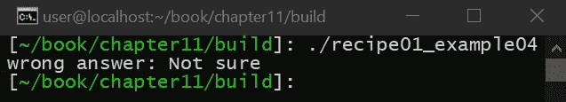
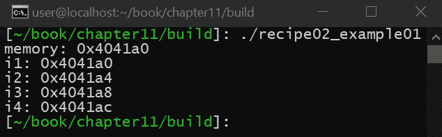
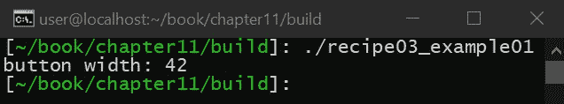
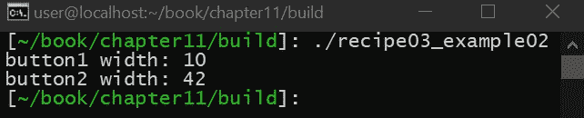
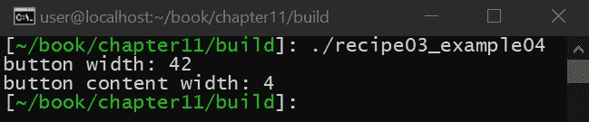
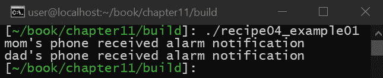
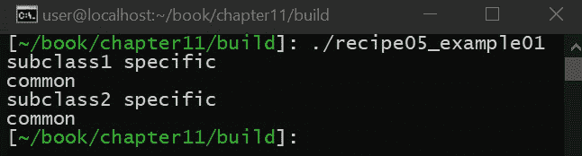

# 十一、C++ 中的常见模式

在本章中，您将学习 C++ 中的各种设计模式。设计模式为正确解决不同类型的问题提供了一种通用的方法，通常，设计模式会在互联网上、会议上以及工作中的饮水机前讨论它们的优缺点。

本章的目标是向您介绍一些更流行、不太流行甚至有争议的模式，让您了解设计模式试图解决的不同类型的问题。这是重要的一章，因为它将教会你解决困难问题的技巧，教会你解决别人过去经历过的常见问题的现有方法。当你在自己的应用中遇到问题时，学习这些设计模式的子集将为自己发现其他设计模式奠定基础。

本章中的配方如下:

*   学习工厂模式
*   正确使用单一模式
*   用装饰器模式扩展您的对象
*   添加与观察者模式的通信
*   利用静态多态性提高性能

# 技术要求

要编译和运行本章中的示例，您必须拥有运行 Ubuntu 18.04 的计算机的管理权限，并且具有功能性互联网连接。在运行这些示例之前，您必须安装以下内容:

```cpp
> sudo apt-get install build-essential git cmake 
```

如果这安装在 Ubuntu 18.04 以外的任何操作系统上，则需要 GCC 7.4 或更高版本以及 CMake 3.6 或更高版本。

本章的代码文件可以在[https://github . com/packt publishing/Advanced-CPP-cook book/tree/master/chapter 11](https://github.com/PacktPublishing/Advanced-CPP-CookBook/tree/master/chapter11)找到。

# 学习工厂模式

在这个食谱中，我们将学习工厂模式是什么，如何实现，以及何时使用。这个方法很重要，尤其是在单元测试中，因为工厂模式提供了添加接缝的能力(也就是说，代码中的有意位置提供了进行更改的机会)，能够更改另一个对象分配的对象类型，包括为测试分配假对象的能力。

# 准备好

开始之前，请确保满足所有技术要求，包括安装 Ubuntu 18.04 或更高版本，并在终端窗口中运行以下内容:

```cpp
> sudo apt-get install build-essential git cmake
```

这将确保您的操作系统拥有适当的工具来编译和执行本食谱中的示例。完成后，打开一个新的终端。我们将使用这个终端来下载、编译和运行我们的示例。

# 怎么做...

执行以下步骤来尝试工厂模式的代码:

1.  从新的终端，运行以下命令下载源代码:

```cpp
> cd ~/
> git clone https://github.com/PacktPublishing/Advanced-CPP-CookBook.git
> cd Advanced-CPP-CookBook/chapter11
```

2.  要编译源代码，请运行以下命令:

```cpp
> cmake .
> make recipe01_examples
```

3.  编译源代码后，您可以通过运行以下命令来执行该配方中的每个示例:

```cpp
> ./recipe01_example01

> ./recipe01_example02

> ./recipe01_example03
correct answer: The answer is: 42

> ./recipe01_example04
wrong answer: Not sure

> ./recipe01_example05
correct answer: The answer is: 42
```

在下一节中，我们将逐一介绍这些示例，并解释每个示例程序的功能，以及它与本食谱中所教授的课程之间的关系。

# 它是如何工作的...

工厂模式为分配资源的对象提供了一种改变对象分配的类型的方法。为了更好地理解这种模式是如何工作的，以及它为什么如此有用，让我们看下面的例子:

```cpp
class know_it_all
{
public:
    auto ask_question(const char *question)
    {
        (void) question;
        return answer("The answer is: 42");
    }
};
```

如前面的代码所示，我们从一个名为`know_it_all`的类开始，当被问及一个问题时，它会提供一个答案。在这种特殊情况下，无论问什么问题，它总是返回相同的答案。答案定义如下:

```cpp
class answer
{
    std::string m_answer;

public:
    answer(std::string str) :
        m_answer{std::move(str)}
    { }
};
```

如前所示，答案是一个简单的类，它被构造为一个字符串，并在内部存储该字符串。需要注意的是，在这种情况下，该 API 的用户实际上不能提取答案类存储的字符串，这意味着这些 API 的使用如下:

```cpp
int main(void)
{
    know_it_all universe;
    auto ___ = universe.ask_question("What is the meaning of life?");
}
```

如前所示，我们可以问一个问题，并提供一个结果，但我们不确定实际提供了什么结果。这种类型的问题在面向对象编程中一直存在，测试这种逻辑是为什么整本书都以对象嘲讽为主题的众多原因之一。模拟是一个对象的假版本，专门设计用于验证测试的输出(不像假的，它只不过是一个提供测试输入的对象)。然而，在前面的例子中，模拟仍然需要一种方法来创建，以便验证函数的输出。输入工厂模式。

让我们按如下方式修改答案类:

```cpp
class answer
{
    std::string m_answer;

public:
    answer(std::string str) :
        m_answer{std::move(str)}
    { }

    static inline auto make_answer(std::string str)
    { return answer(str); }
};
```

如前面的代码所示，我们添加了一个静态函数，允许`answer`类创建自身的实例。我们没有改变这样一个事实，即`answer`类不提供提取其内容的能力，只是`answer`类是如何创建的。然后我们可以修改`know_it_all`类如下:

```cpp
template<factory_t factory = answer::make_answer>
class know_it_all
{
public:
    auto ask_question(const char *question)
    {
        (void) question;
        return factory("The answer is: 42");
    }
};
```

如前面的代码所示，这里唯一的区别是`know_it_all`类为`factory_t`取了一个模板参数，并使用它来创建答案类，而不是直接创建`answer`类。`factory_t`定义如下:

```cpp
using factory_t = answer(*)(std::string str);
```

这默认为我们添加到`answer`类的静态`make_answer()`函数。前面的例子以最简单的形式演示了工厂模式。我们不直接创建对象，而是将对象的创建委托给另一个对象。前面的实现没有改变这两个类的使用方式，如下所示:

```cpp
int main(void)
{
    know_it_all universe;
    auto ___ = universe.ask_question("What is the meaning of life?");
}
```

如上图所示，`main()`逻辑保持不变，但这种新方法确保了`know_it_all`类专注于回答问题，而不用担心如何创建`answer`类本身，将该任务留给不同的对象。这种微妙变化背后的真正力量是，我们现在可以为`know_it_all`级提供不同的工厂，导致不同的`answer`级被退回。为了演示这一点，让我们创建一个新的`answer`类，如下所示:

```cpp
class expected_answer : public answer
{
public:
    expected_answer(std::string str) :
        answer{str}
    {
        if (str != "The answer is: 42") {
            std::cerr << "wrong answer: " << str << '\n';
            exit(1);
        }

        std::cout << "correct answer: " << str << '\n';
    }

    static inline answer make_answer(std::string str)
    { return expected_answer(str); }
};
```

如上图所示，我们已经创建了一个新的`answer`类，它对原来的`answer`类进行了子分类。这个新类检查它在构造过程中给出的值，并根据它提供的字符串输出成功或失败。我们可以如下使用这个新的`answer`类:

```cpp
int main(void)
{
    know_it_all<expected_answer::make_answer> universe;
    auto ___ = universe.ask_question("What is the meaning of life?");
}
```

以下是结果输出:


使用前面的方法，我们不需要修改原始的`answer`类，就不能问不同的问题来查看`know_it_all`类是否提供了正确的答案。例如，假设`know_it_all`类是这样实现的:

```cpp
template<factory_t factory = answer::make_answer>
class know_it_all
{
public:
    auto ask_question(const char *question)
    {
        (void) question;
        return factory("Not sure");
    }
};
```

我们测试了这个版本的`know_it_all`类，如下所示:

```cpp
int main(void)
{
    know_it_all<expected_answer::make_answer> universe;
    auto ___ = universe.ask_question("What is the meaning of life?");
}
```

结果如下:



需要注意的是，工厂模式有几种实现方式。前面的方法使用模板参数来改变`know_it_all`类创建答案的方式，但是我们也可以使用运行时方法，如本例所示:

```cpp
class know_it_all
{
    std::function<answer(std::string str)> m_factory;

public:
    know_it_all(answer(*f)(std::string str) = answer::make_answer) :
        m_factory{f}
    { }

    auto ask_question(const char *question)
    {
        (void) question;
        return m_factory("The answer is: 42");
    }
};
```

如上图所示，我们从一个自定义的`know_it_all`构造函数开始，该构造函数存储一个工厂函数的指针，同样默认为我们的`answer`类，但是如果我们选择的话，它提供了更改工厂的能力，如下图所示:

```cpp
int main(void)
{
    know_it_all universe(expected_answer::make_answer);
    auto ___ = universe.ask_question("What is the meaning of life?");
}
```

如果我们愿意，我们还可以在这个类中添加一个 setter，以便在运行时更改这个函数指针。

# 正确使用单一模式

在这个食谱中，我们将学习如何在 C++ 11 和更高版本中正确地实现单例模式，以及什么时候使用单例模式是合适的。这个方法很重要，因为它将教你何时使用单例模式，该模式提供了单个全局资源的明确定义，确保资源保持全局，而不可能有多个副本。

# 准备好

开始之前，请确保满足所有技术要求，包括安装 Ubuntu 18.04 或更高版本，并在终端窗口中运行以下内容:

```cpp
> sudo apt-get install build-essential git cmake
```

这将确保您的操作系统拥有适当的工具来编译和执行本食谱中的示例。完成后，打开一个新的终端。我们将使用这个终端来下载、编译和运行我们的示例。

# 怎么做...

执行以下步骤来尝试单例模式:

1.  从新的终端，运行以下命令下载源代码:

```cpp
> cd ~/
> git clone https://github.com/PacktPublishing/Advanced-CPP-CookBook.git
> cd Advanced-CPP-CookBook/chapter11
```

2.  要编译源代码，请运行以下命令:

```cpp
> cmake .
> make recipe01_examples
```

3.  编译源代码后，您可以通过运行以下命令来执行该配方中的每个示例:

```cpp
> ./recipe02_example01
memory: 0x4041a0
i1: 0x4041a0
i2: 0x4041a4
i3: 0x4041a8
i4: 0x4041ac

> ./recipe02_example02
memory: 0x4041a0
i1: 0x4041a0
i2: 0x4041a4
i3: 0x4041a0
i4: 0x4041a4

> ./recipe02_example03
memory: 0x4041a0
i1: 0x4041a0
i2: 0x4041a4
i3: 0x4041a8
i4: 0x4041ac

> ./recipe02_example04
memory: 0x4041a0
i1: 0x4041a0
i2: 0x4041a4
i3: 0x4041a8
i4: 0x4041ac
```

在下一节中，我们将逐一介绍这些示例，并解释每个示例程序的功能以及它与本食谱中所教授的课程之间的关系。

# 它是如何工作的...

单例模式在 C++ 中已经存在了几年，可以说它是所有 C++ 中最有争议的模式之一，因为它的全局特性在您的应用中引入了耦合(类似于全局变量如何引入耦合)。单例模式实现了一个单一的全局资源。具体来说，它创建了一个保持全局范围的对象，同时确保不存在自身的副本。关于是否应该在您的代码中使用单例模式的争论不会在本书中得到回答，因为这取决于您的用例，但是让我们至少讨论一下这种模式的一些优点和缺点。

**优势:**单体模式为只能包含单个实例的全局资源提供了一个明确定义的接口。不管我们喜欢与否，全局资源存在于我们所有的应用中(例如，堆内存)。如果需要这样的全局资源，并且您有一个处理耦合的机制(例如，像希波莫克这样的模仿引擎)，那么单例模式是确保全局资源得到正确管理的好方法。

**缺点:**以下是缺点:

*   单例模式定义了一个全局资源，像任何全局资源(例如，一个全局变量)一样，任何使用单例对象的代码都与单例紧密耦合。在面向对象的设计中，应该总是避免耦合，因为它防止了伪造代码可能依赖的资源的能力，这限制了测试时的灵活性。
*   单一模式隐藏了依赖性。检查对象的接口时，无法确定对象的实现是否依赖于全局资源。大多数人认为这可以用好的文档来处理。
*   单例模式在应用的整个生命周期中保持其状态。当单元测试作为单例的状态从一个单元测试进行到下一个单元测试时，尤其如此(也就是说，缺点是显而易见的)，大多数人认为这违反了什么是单元测试。

总的来说，应该始终避免全球资源。句号。确保您的代码被正确地编写，以便在需要单个全局资源时强制执行单例设计模式。让我们讨论下面的例子。

假设您正在为嵌入式设备编写应用，并且您的嵌入式设备有一个额外的内存池，可以映射到您的应用中(例如，视频或网络设备的设备内存)。现在，假设您只能拥有这些额外的内存池中的一个，并且您需要实现一组 API 来从这个池中分配内存。在我们的示例中，我们将使用以下内容实现这个内存池:

```cpp
uint8_t memory[0x1000] = {};
```

接下来，我们将实现一个内存管理器类来分配该池中的内存，如下所示:

```cpp
class mm
{
    uint8_t *cursor{memory};

public:
    template<typename T>
    T *allocate()
    {
        if (cursor + sizeof(T) > memory + 0x1000) {
            throw std::bad_alloc();
        }

        auto ptr = new (cursor) T;
        cursor += sizeof(T);

        return ptr;
    }
};
```

如前面的代码所示，我们已经创建了一个内存管理器类，该类存储了一个指向内存缓冲区的指针，该缓冲区包含我们的单个全局资源。然后，我们创建一个简单的分配函数，根据需要处理这些内存(没有释放能力，这使得算法非常简单)。

由于这是一个全局资源，我们按如下方式全局创建该类:

```cpp
mm g_mm;
```

最后，我们可以使用新的内存管理器，如下所示:

```cpp
int main(void)
{
    auto i1 = g_mm.allocate<int>();
    auto i2 = g_mm.allocate<int>();
    auto i3 = g_mm.allocate<int>();
    auto i4 = g_mm.allocate<int>();

    std::cout << "memory: " << (void *)memory << '\n';
    std::cout << "i1: " << (void *)i1 << '\n';
    std::cout << "i2: " << (void *)i2 << '\n';
    std::cout << "i3: " << (void *)i3 << '\n';
    std::cout << "i4: " << (void *)i4 << '\n';
}
```

在前面的示例中，我们分配了四个整数指针，然后输出内存块的地址和整数指针的地址，以确保算法按预期工作，从而产生以下输出:



如前所示，内存管理器会根据需要正确分配内存。

前面实现的问题是，内存管理器只是一个类，就像任何其他类一样，这意味着它可以被创建任意多次，也可以被复制。为了更好地说明为什么这是一个问题，让我们看看下面的例子。让我们创建两个内存管理器，而不是创建一个:

```cpp
mm g_mm1;
mm g_mm2;
```

接下来，让我们按如下方式使用这两种内存管理器:

```cpp
int main(void)
{
    auto i1 = g_mm1.allocate<int>();
    auto i2 = g_mm1.allocate<int>();
    auto i3 = g_mm2.allocate<int>();
    auto i4 = g_mm2.allocate<int>();

    std::cout << "memory: " << (void *)memory << '\n';
    std::cout << "i1: " << (void *)i1 << '\n';
    std::cout << "i2: " << (void *)i2 << '\n';
    std::cout << "i3: " << (void *)i3 << '\n';
    std::cout << "i4: " << (void *)i4 << '\n';
}
```

如前所示，唯一的区别是我们现在使用两个内存管理器，而不是一个。这将产生以下输出:


如前所示，内存已被双重分配，这可能会导致损坏和未定义的行为。出现这种情况的原因是内存缓冲区本身是一种全局资源，这是我们无法改变的。内存管理器本身没有做任何事情来确保这种情况不会发生，因此，该 API 的用户可能会意外地创建第二个内存管理器。请注意，在我们的示例中，我们显式地创建了第二个副本，但是第二个副本可能通过简单地传递内存管理器而出现，在此过程中无意中创建了副本。

为了解决这个问题，我们必须处理两个特定的场景:

*   创建多个内存管理器实例
*   复制内存管理器

为了解决这两个问题，现在让我们展示单例模式:

```cpp
class mm
{
    uint8_t *cursor{memory};
    mm() = default;
```

如上图所示，我们从标记为`private`的构造函数开始。将构造函数标记为`private`可以防止内存管理器创建自己的内存管理器实例。相反，要获得内存管理器的实例，我们将使用以下`public`函数:

```cpp
    static auto &instance()
    {
        static mm s_mm;
        return s_mm;
    }
```

前面的这个函数创建了内存管理器的静态(即全局)实例，然后返回对这个实例的引用。使用这个函数，API 的用户只能从这个函数获得内存管理器的一个实例，这个函数总是只返回对全局定义资源的引用。换句话说，没有编译器的抱怨，就无法创建额外的类实例。

创建单例类的最后一步如下:

```cpp
    mm(const mm &) = delete;
    mm &operator=(const mm &) = delete;
    mm(mm &&) = delete;
    mm &operator=(mm &&) = delete;
```

如前所示，复制和移动构造函数/运算符被显式删除。这解决了第二个问题。通过移除复制构造函数和运算符，无法创建全局资源的副本，从而确保该类仅作为单个全局对象存在。

为了使用这个单例类，我们将执行以下操作:

```cpp
int main(void)
{
    auto i1 = mm::instance().allocate<int>();
    auto i2 = mm::instance().allocate<int>();
    auto i3 = mm::instance().allocate<int>();
    auto i4 = mm::instance().allocate<int>();

    std::cout << "memory: " << (void *)memory << '\n';
    std::cout << "i1: " << (void *)i1 << '\n';
    std::cout << "i2: " << (void *)i2 << '\n';
    std::cout << "i3: " << (void *)i3 << '\n';
    std::cout << "i4: " << (void *)i4 << '\n';
}
```

这将产生以下输出:


如果我们尝试自己创建内存管理器的另一个实例，我们会得到类似于下面的错误:

```cpp
/home/user/book/chapter11/recipe02.cpp:166:4: error: ‘constexpr mm::mm()’ is private within this context
  166 | mm g_mm;
```

最后，由于 singleton 类是一个单一的全局资源，我们可以创建包装器来消除冗长，如下所示:

```cpp
template<typename T>
constexpr T *allocate()
{
    return mm::instance().allocate<T>();
}
```

这种变化可以如下使用:

```cpp
int main(void)
{
    auto i1 = allocate<int>();
    auto i2 = allocate<int>();
    auto i3 = allocate<int>();
    auto i4 = allocate<int>();

    std::cout << "memory: " << (void *)memory << '\n';
    std::cout << "i1: " << (void *)i1 << '\n';
    std::cout << "i2: " << (void *)i2 << '\n';
    std::cout << "i3: " << (void *)i3 << '\n';
    std::cout << "i4: " << (void *)i4 << '\n';
}
```

如前所示，`constexpr`包装器提供了一种简单的方法来消除我们的单例类的冗长性，如果内存管理器不是单例的话，这是很难做到的。

# 用装饰器模式扩展您的对象

在本食谱中，我们将学习如何实现装饰器模式，该模式提供了扩展类功能的能力，而不需要继承，继承本质上是静态的。这个方法很重要，因为继承不支持在运行时扩展类的能力，装饰器模式解决了这个问题。

# 准备好

开始之前，请确保满足所有技术要求，包括安装 Ubuntu 18.04 或更高版本，并在终端窗口中运行以下内容:

```cpp
> sudo apt-get install build-essential git cmake
```

这将确保您的操作系统拥有适当的工具来编译和执行本食谱中的示例。完成后，打开一个新的终端。我们将使用这个终端来下载、编译和运行我们的示例。

# 怎么做...

执行以下步骤来尝试此食谱:

1.  从新的终端，运行以下命令下载源代码:

```cpp
> cd ~/
> git clone https://github.com/PacktPublishing/Advanced-CPP-CookBook.git
> cd Advanced-CPP-CookBook/chapter11
```

2.  要编译源代码，请运行以下命令:

```cpp
> cmake .
> make recipe03_examples
```

3.  编译源代码后，您可以通过运行以下命令来执行该配方中的每个示例:

```cpp
> ./recipe03_example01
button width: 42

> ./recipe03_example02
button1 width: 10
button2 width: 42

> ./recipe03_example03
button width: 74

> ./recipe03_example04
button width: 42
button content width: 4
```

在下一节中，我们将逐一介绍这些示例，并解释每个示例程序的功能以及它与本食谱中所教授的课程之间的关系。

# 它是如何工作的...

在这个食谱中，我们将学习如何实现装饰器模式。首先，让我们看一个简单的例子:假设我们正在编写一个 C++ 应用，它将托管一个网站。在我们的网站中，我们需要定义一个用户可以点击的按钮，但我们需要计算按钮的宽度，给定一个额外的边距，增加按钮的总大小:

```cpp
class margin
{
public:
    int width()
    {
        return 32;
    }
};
```

如前所示，我们已经创建了一个名为`margin`的类，它返回所讨论的边距的宽度(为了简化我们的示例，我们将只关注宽度)。然后，我们可以如下定义我们的按钮:

```cpp
class button : public margin
{
public:
    int width()
    {
        return margin::width() + 10;
    }
};
```

如上图所示，我们按钮的总宽度是按钮本身的宽度加上边距的宽度。然后我们可以得到按钮的宽度，如下所示:

```cpp
int main()
{
    auto b = new button();
    std::cout << "button width: " << b->width() << '\n';
}
```

这将产生以下输出:



前面示例的问题是按钮必须始终有边距，因为按钮直接继承了边距类。有一些方法可以防止这种情况(例如，我们的按钮可以有一个配置选项来确定按钮是否返回有边距的宽度)，但是在这个食谱中，我们将使用装饰器模式来解决这个问题，允许我们创建两个按钮:一个有边距的按钮，一个没有边距的按钮。让我们试试这个:

1.  首先，让我们定义如下纯虚拟基类:

```cpp
class base
{
public:
    virtual int width() = 0;
};
```

如上图所示，纯虚拟基类定义了`width`函数。

2.  然后，我们可以如下实现我们的按钮:

```cpp
class button : public base
{
public:
    int width() override
    {
        return 10;
    }
};
```

如上图所示，按钮继承基类并返回宽度`10`。利用前面的，我们可以开始`button`永远是`10`的宽度，按钮没有边距的概念。

3.  要给按钮添加边距，我们首先必须创建一个装饰器类，如下所示:

```cpp
class decorator : public base
{
    std::unique_ptr<base> m_base;

public:
    decorator(std::unique_ptr<base> b) :
        m_base{std::move(b)}
    { }

    int width()
    {
        return m_base->width();
    }
};
```

装饰器模式从指向`base`指针的私有成员开始，该指针在装饰器的构造函数中设置。装饰器还定义了`width`函数，但是将调用转发给基类。

4.  现在，我们可以创建一个 margin 类，它是一个装饰器，如下所示:

```cpp
class margin : public decorator
{
public:
    margin(std::unique_ptr<base> b) :
        decorator{std::move(b)}
    { }

    int width()
    {
        return decorator::width() + 32;
    }
};
```

如上图所示，margin 类返回添加了附加的`32`的对象的宽度。

5.  然后，我们可以如下创建两个按钮:

```cpp
int main()
{
    auto button1 = std::make_unique<button>();
    auto button2 = std::make_unique<margin>(std::make_unique<button>());

    std::cout << "button1 width: " << button1->width() << '\n';
    std::cout << "button2 width: " << button2->width() << '\n';
}
```

这将产生以下输出:



装饰器模式的最大优势是它允许我们在运行时扩展一个类。例如，如果需要，我们可以创建一个带有两个边距的按钮:

```cpp
int main()
{
    auto b =
        std::make_unique<margin>(
            std::make_unique<margin>(
                std::make_unique<button>()
            )
        );

    std::cout << "button width: " << b->width() << '\n';
}
```

否则，我们可以创建另一个装饰器。为了演示这一点，让我们如下扩展我们的基类:

```cpp
class base
{
public:
    virtual int width() = 0;
    virtual int content_width() = 0;
};
```

前面的基类现在定义了一个宽度和一个内容宽度(按钮内部我们可以实际使用的空间量)。现在，我们可以如下创建按钮:

```cpp
class button : public base
{
public:
    int width() override
    {
        return 10;
    }

    int content_width() override
    {
        return width() - 1;
    }
};
```

如上图所示，我们的按钮有一个静态宽度，内容宽度等于宽度本身减去 1(为按钮的边框留出空间)。然后我们定义我们的装饰器如下:

```cpp
class decorator : public base
{
    std::unique_ptr<base> m_base;

public:
    decorator(std::unique_ptr<base> b) :
        m_base{std::move(b)}
    { }

    int width() override
    {
        return m_base->width();
    }

    int content_width() override
    {
        return m_base->content_width();
    }
};
```

如前所示，唯一的区别是装饰器现在必须转发宽度和内容宽度函数。我们的利润装饰器如下所示:

```cpp
class margin : public decorator
{
public:
    margin(std::unique_ptr<base> b) :
        decorator{std::move(b)}
    { }

    int width() override
    {
        return decorator::width() + 32;
    }

    int content_width() override
    {
        return decorator::content_width();
    }
};
```

与 web 编程的情况一样，边距会增加对象的大小。它不会改变对象内部内容的空间，因此，边距返回内容宽度，不做任何修改。通过前面的更改，我们现在可以添加一个填充装饰器，如下所示:

```cpp
class padding : public decorator
{
public:
    padding(std::unique_ptr<base> b) :
        decorator{std::move(b)}
    { }

    int width() override
    {
        return decorator::width();
    }

    int content_width() override
    {
        return decorator::content_width() - 5;
    }
};
```

填充装饰器与边距装饰器相反。它不会改变对象的大小，它会减少给予对象内部内容的空间总量。因此，它不会改变宽度，但会减小内容的大小。

要使用我们的新装饰器创建按钮，我们可以使用以下内容:

```cpp
int main()
{
    auto b =
        std::make_unique<margin>(
            std::make_unique<padding>(
                std::make_unique<button>()
            )
        );

    std::cout << "button width: " << b->width() << '\n';
    std::cout << "button content width: " << b->content_width() << '\n';
}
```

如前所示，我们创建了一个添加了边距和填充的按钮，这将产生以下输出:



装饰器模式提供了创建不同按钮的能力，而不需要编译时继承，这将要求我们对我们能想到的每一种可能的按钮类型都有不同的按钮定义。然而，应该注意的是，装饰模式是以增加分配和函数调用的重定向为代价的，所以这种运行时灵活性是有代价的。

# 添加与观察者模式的通信

在这个食谱中，我们将学习如何实现观察者模式。观察者模式为一个类提供了向另一个类注册的能力，以便在事件发生时接收通知。Qt 语言通过使用它的 singles 和 slots 机制来提供这个特性，同时需要 MOC 编译器来使它工作。这个方法很重要，因为我们将学习如何使用标准的 C++ 在不需要 Qt 的情况下实现观察者模式。

# 准备好

开始之前，请确保满足所有技术要求，包括安装 Ubuntu 18.04 或更高版本，并在终端窗口中运行以下内容:

```cpp
> sudo apt-get install build-essential git cmake
```

这将确保您的操作系统拥有适当的工具来编译和执行本食谱中的示例。完成后，打开一个新的终端。我们将使用这个终端来下载、编译和运行我们的示例。

# 怎么做...

执行以下步骤来尝试此食谱:

1.  从新的终端，运行以下命令下载源代码:

```cpp
> cd ~/
> git clone https://github.com/PacktPublishing/Advanced-CPP-CookBook.git
> cd Advanced-CPP-CookBook/chapter11
```

2.  要编译源代码，请运行以下命令:

```cpp
> cmake .
> make recipe04_examples
```

3.  编译源代码后，您可以通过运行以下命令来执行该配方中的每个示例:

```cpp
> ./recipe04_example01 
mom's phone received alarm notification
dad's phone received alarm notification
```

在下一节中，我们将逐一介绍这些示例，并解释每个示例程序的功能以及它与本食谱中所教授的课程之间的关系。

# 它是如何工作的...

观察者模式为观察者提供了在事件发生时得到通知的能力。为了解释这是如何工作的，让我们从下面的纯虚拟基类开始:

```cpp
class observer
{
public:
    virtual void trigger() = 0;
};
```

如上图所示，我们已经定义了`observer`，它必须实现一个`trigger()`函数。然后，我们可以创建这个纯虚拟基类的两个不同版本，如下所示:

```cpp
class moms_phone : public observer
{
public:
    void trigger() override
    {
        std::cout << "mom's phone received alarm notification\n";
    }
};

class dads_phone : public observer
{
public:
    void trigger() override
    {
        std::cout << "dad's phone received alarm notification\n";
    }
};
```

如前面的代码所示，我们已经创建了两个不同的类，这两个类都子类化了观察者纯虚拟类，覆盖了触发器函数。然后，我们可以实现一个类，该类生成观察者可能感兴趣的事件，如下所示:

```cpp
class alarm
{
    std::vector<observer *> m_observers;

public:
    void trigger()
    {
        for (const auto &o : m_observers) {
            o->trigger();
        }
    }

    void add_phone(observer *o)
    {
        m_observers.push_back(o);
    }
};
```

如前面的代码所示，我们从`std::vector`开始，它存储任意数量的观察者。然后我们提供一个触发函数，它代表我们的事件。当这个函数被执行时，我们循环通过所有的观察者，并通过调用他们的`trigger()`函数通知他们这个事件。最后，我们提供了一个函数，允许观察者订阅所讨论的事件。

下面演示了如何使用这些类:

```cpp
int main(void)
{
    alarm a;
    moms_phone mp;
    dads_phone dp;

    a.add_phone(&mp);
    a.add_phone(&dp);

    a.trigger();
}
```

输出如下:



如前所示，当警报类被触发时，观察者会收到事件通知，并根据需要处理通知。

# 利用静态多态性提高性能

在这个食谱中，我们将学习如何在不需要虚拟继承的情况下创建多态性。相反，我们将使用编译时继承(称为静态多态性)。这个方法很重要，因为静态多态性不会导致与运行时、虚拟继承(因为不需要 vTable)相同的性能和内存使用损失，代价是可读性和无法利用虚拟子类化的运行时优势。

# 准备好

开始之前，请确保满足所有技术要求，包括安装 Ubuntu 18.04 或更高版本，并在终端窗口中运行以下内容:

```cpp
> sudo apt-get install build-essential git cmake
```

这将确保您的操作系统拥有适当的工具来编译和执行本食谱中的示例。完成后，打开一个新的终端。我们将使用这个终端来下载、编译和运行我们的示例。

# 怎么做...

执行以下步骤来尝试配方:

1.  从新的终端，运行以下命令下载源代码:

```cpp
> cd ~/
> git clone https://github.com/PacktPublishing/Advanced-CPP-CookBook.git
> cd Advanced-CPP-CookBook/chapter11
```

2.  要编译源代码，请运行以下命令:

```cpp
> cmake .
> make recipe05_examples
```

3.  编译源代码后，您可以通过运行以下命令来执行该配方中的每个示例:

```cpp
> ./recipe05_example01
subclass1 specific
common
subclass2 specific
common
> ./recipe05_example02
subclass1 specific
common
subclass2 specific
common
```

在下一节中，我们将逐一介绍这些示例，并解释每个示例程序的功能以及它与本食谱中所教授的课程之间的关系。

# 它是如何工作的...

多态性的主要目标之一是提供覆盖对象如何执行特定功能的能力，同时提供跨一组对象提供公共逻辑的能力。虚拟继承的问题是，如果您希望使用基类作为接口，重写的能力需要使用虚拟表(即虚拟表，这是处理虚拟继承所需的额外内存块)。

例如，考虑以下代码:

```cpp
class base
{
public:
    virtual void foo() = 0;

    void common()
    {
        std::cout << "common\n";
    }
};
```

让我们从之前定义的基类开始。它提供了一个纯粹的`foo()`函数(也就是说，子类必须实现这个函数)，同时还提供了自己的公共逻辑。然后，我们可以创建如下两个子类:

```cpp
class subclass1 : public base
{
public:
    void foo() override
    {
        std::cout << "subclass1 specific\n";
    }
};

class subclass2 : public base
{
public:
    void foo() override
    {
        std::cout << "subclass2 specific\n";
    }
};
```

如前所示，我们将基类子类化，并用特定于子类的功能覆盖`foo()`函数。然后，我们可以从基类调用子类特定的`foo()`函数，如下所示:

```cpp
int main(void)
{
    subclass1 s1;
    subclass2 s2;

    base *b1 = &s1;
    base *b2 = &s2;

    b1->foo();
    b1->common();

    b2->foo();
    b2->common();
}
```

这将产生以下输出:



这种类型的运行时多态性需要使用 vTable，这不仅会增加每个对象的内存占用，还会导致性能损失，因为每个函数调用都需要 vTable 查找。如果不需要虚拟继承的运行时属性，静态多态性可以提供相同的功能，而不会带来损失。

首先，让我们如下定义基类:

```cpp
template<typename T>
class base
{
public:
    void foo()
    { static_cast<T *>(this)->foo(); }

    void common()
    {
        std::cout << "common\n";
    }
};
```

像我们前面的例子一样，基类没有实现`foo()`函数，而是需要一个子类来实现这个函数(这使得静态转换可以将其转换为类型`T`)。

然后，我们可以如下实现子类:

```cpp
class subclass1 : public base<subclass1>
{
public:
    void foo()
    {
        std::cout << "subclass1 specific\n";
    }
};

class subclass2 : public base<subclass2>
{
public:
    void foo()
    {
        std::cout << "subclass2 specific\n";
    }
};
```

和前面的例子一样，子类只是实现了`foo()`函数。在这种情况下，不同之处在于继承需要使用模板参数，这消除了`foo()`函数重写的需要，因为基类从不使用虚函数。

前面的静态多态性允许我们从基类执行`foo()`函数，如下所示:

```cpp
template<typename T>
void test(base<T> b)
{
    b.foo();
    b.common();
}
```

如上图所示，`test()`函数没有任何关于每个子类的信息。它只有关于基类(或接口)的信息。该`test()`功能可以如下执行:

```cpp
int main(void)
{
    subclass1 c1;
    subclass2 c2;

    test(c1);
    test(c2);
}
```

这再次导致相同的输出:


如上图所示，如果多态类型在编译时是已知的，静态多态可以用来消除对`virtual`的需求，从而消除对 vTable 的需求。这种类型的逻辑在使用模板类时特别有用，在模板类中，基类型是已知的，而子类类型是未知的(并且是提供的)，这使得模板函数只需要基接口。