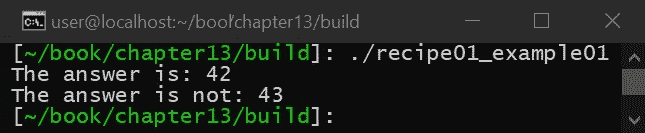
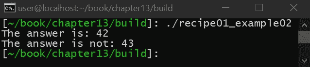
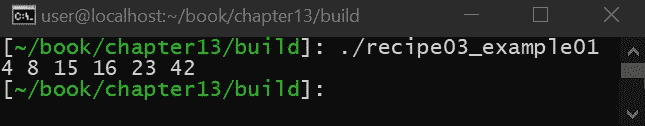
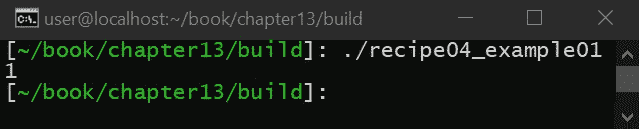
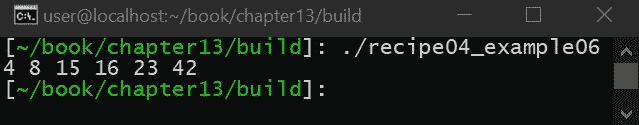

# 奖励-使用 C++20 特性

在本章中，您将快速了解一些即将添加到 C++20 中的特性。这一章很重要，因为与 C++14 和 C++17 不同，C++20 为语言增加了几个改变游戏规则的特性，这些特性将永远改变 C++的面貌。

它首先介绍了 C++20 概念，这是一种定义任意类型需求的新机制。C++20 Concepts 承诺改变我们使用模板和`auto`进行编程的方式，提供一种定义一个类型需要什么的机制。然后我们将转向 C++20 Modules，这是一个不再需要`#include`的新特性，改变了我们在 C++中定义接口的方式。C++ Modules 是对语言的巨大改变，需要对整个标准库以及我们的构建工具进行彻底的检查。接下来，我们将快速了解一下`std::span`和 C++范围。最后，我们将简要介绍 C++20 的另一个改变游戏规则的补充，叫做 Coroutines。

本章中的配方如下:

*   查看 C++20 中的概念
*   使用 C++20 中的模块
*   引入`std::span`，数组的新观点
*   在 C++20 中使用范围
*   学习如何在 C++20 中使用 Coroutines

# 技术要求

要编译和运行本章中的示例，您必须拥有运行 Ubuntu 19.04 的计算机的管理权限，并且具有功能性互联网连接。请注意，本书的其余部分使用 Ubuntu 18.04。由于我们将讨论仍在开发中的 C++20，因此在这一特定章节中，我们需要最新、最棒的 GCC 版本。在运行这些示例之前，您必须安装以下内容:

```cpp
> sudo apt-get install build-essential git cmake
```

如果这安装在 Ubuntu 18.04 以外的任何操作系统上，则需要 GCC 7.4 或更高版本以及 CMake 3.6 或更高版本。

本章的代码文件可以在[//github . com/packt publishing/Advanced-CPP-cook book/tree/master/chapter 13](https://github.com/PacktPublishing/Advanced-CPP-CookBook/tree/master/chapter13https://github.com/PacktPublishing/Advanced-CPP-CookBook/tree/master/chapter13)找到。

# 查看 C++20 中的概念

在这个食谱中，我们将讨论 C++即将增加的内容，它有望彻底改变我们对称为 C++20 Concepts 的模板编程的看法。今天的 C++很大程度上依赖于使用 SFINAE 来约束适用于任何给定模板函数的类型。如[第 4 章](04.html)、*使用模板进行泛型编程*所见，SFINAE 很难写，读起来很混乱，编译速度也很慢。这个食谱很重要，因为 C++20 后的模板编程不仅更容易编码和调试，还将降低模板编程的人力成本，使其更容易阅读和理解。

# 准备好

开始之前，请确保满足所有技术要求，包括安装 Ubuntu 19.04 或更高版本，并在终端窗口中运行以下内容:

```cpp
> sudo apt-get install build-essential git cmake
```

这将确保您的操作系统拥有适当的工具来编译和执行本食谱中的示例。完成后，打开一个新的终端。我们将使用这个终端来下载、编译和运行我们的示例。

# 怎么做...

您需要执行以下步骤来尝试配方:

1.  从新的终端，运行以下命令下载源代码:

```cpp
> cd ~/
> git clone https://github.com/PacktPublishing/Advanced-CPP-CookBook.git
> cd Advanced-CPP-CookBook/chapter13
```

2.  要编译源代码，请运行以下命令:

```cpp
> cmake .
> make recipe01_examples
```

3.  编译源代码后，您可以通过运行以下命令来执行该配方中的每个示例:

```cpp
> ./recipe01_example01
The answer is: 42
The answer is not: 43

> ./recipe01_example02
The answer is: 42
The answer is not: 43
```

在下一节中，我们将逐一介绍这些示例，并解释每个示例程序的功能以及它与本食谱中所教授的课程之间的关系。

# 它是如何工作的...

为了最好地解释 C++20 Concepts 将如何帮助模板编程，我们今天将从一个用 C++编程接口的简单例子开始。接口定义了**应用程序编程接口** ( **应用编程接口**)的实现和应用编程接口的用户之间的契约，并在面向对象编程中大量使用，以将应用编程接口的接口从其实现细节中抽象出来。

让我们从下面的纯虚拟界面开始:

```cpp
class interface
{
public:
    virtual ~interface() = default;
    virtual void foo() = 0;
};
```

C++中前面的纯虚拟接口定义了一个`foo()`函数。这个 API 的客户端不需要知道`foo()`是如何实现的。他们只关心接口的定义和`foo()`的函数签名，来理解`foo()`应该如何表现。使用这个接口，我们可以定义这个接口的实现，如下所示:

```cpp
class A :
    public interface
{
public:
    void foo() override
    {
        std::cout << "The answer is: 42\n";
    }
};
```

如前面的例子所示，我们创建了一个名为`A`的类，它继承了接口并覆盖了`foo()`函数来实现它。我们可以用另一个实现做同样的事情，如下所示:

```cpp
class B :
    public interface
{
public:
    void foo() override
    {
        std::cout << "The answer is not: 43\n";
    }
};
```

如前面的例子所示，`B`类为接口提供了接口的替代实现。该接口的客户端可以按如下方式使用该接口:

```cpp
class client
{
    interface &m_i;

public:
    client(interface &i) :
        m_i{i}
    { }

    void bar()
    {
        m_i.foo();
    }
};
```

客户实际上不需要知道任何关于`A`或`B`的事情。它只包括接口的定义，并使用接口来访问任何特定的实现。我们可以按如下方式使用该客户端:

```cpp
int main(void)
{
    A a;
    B b;

    client c1(a);
    client c2(b);

    c1.bar();
    c2.bar();
}
```

如前面的例子所示，我们首先创建`A`和`B`的实例，然后创建两个不同的客户端，分别为`A`和`B`提供接口实现。最后，我们为每个客户端执行`bar()`函数，得到如下输出:



如前面的截图所示，客户端不知道接口是以两种不同的方式定义的，因为客户端只关心接口本身。这种技术在很多 C++文献中有所展示，特别是为了实现所谓的面向对象设计原则。标准操作规程设计原则代表以下内容:

*   **单一责任原则**:这就保证了如果一个对象必须改变，它改变的原因只有一个(即一个对象不提供多个责任)。
*   **打开-关闭原理**:这保证了一个对象可以在不被修改的情况下进行扩展。
*   **利斯科夫替换原则**:这确保了当使用继承时，子类实现它们覆盖的函数的行为，而不仅仅是函数的签名。
*   **接口隔离原则**:这样可以保证一个对象有尽可能小的接口，这样对象的客户端就不会被迫依赖不使用的 API。
*   **依赖反转原理**:这保证了对象只依赖接口，不依赖实现。

这些原则的结合旨在确保您在 C++中使用面向对象编程随着时间的推移更容易理解和维护。然而，现有的面向开源软件和 C++的文献的一个问题是，它提倡大量使用纯虚拟接口，这是有代价的。必须给每个类一个额外的虚拟表(即 vTable)，所有函数调用都会遇到虚拟函数重载的额外开销。

解决这个问题的一种方法是使用静态接口(这在现有文献中并不经常讨论)。为了最好地解释这是如何工作的，让我们从接口的定义开始，如下所示:

```cpp
#include <iostream>

template<typename DERIVED>
class interface
{
public:
    constexpr void foo()
    {
        static_cast<DERIVED *>(this)->foo_override();
    }
};
```

如前面的例子所示，我们将利用静态多态性来实现我们的接口。前面的类采用名为`DERIVED`的类型，并将接口的一个实例强制转换为`DERIVED`类，调用已经被覆盖的`foo`函数的一个版本。`A`现在的实现是这样的:

```cpp
class A :
    public interface<A>
{
public:
    void foo_override()
    {
        std::cout << "The answer is: 42\n";
    }
};
```

如前例所示，`A`现在继承的不是接口，而是`A`的接口。当调用界面中的`foo()`函数时，界面会将调用重定向到`A`的`foo_override()`函数。我们可以使用相同的方法实现`B`:

```cpp
class B :
    public interface<B>
{
public:
    void foo_override()
    {
        std::cout << "The answer is not: 43\n";
    }
};
```

如前例所示，`B`能够提供自己的接口实现。需要注意的是，到目前为止，在这个设计模式中，我们还没有使用`virtual`，这意味着我们已经创建了一个接口和该接口的实现，而不需要虚拟继承，因此没有与这个设计相关的开销。事实上，编译器能够移除从`foo()`到`foo_override()`的调用重定向，确保抽象的使用与纯虚拟接口的使用相比不提供任何额外的运行时成本。

`A`和`B`的客户端可以实现如下:

```cpp
template<typename T>
class client
{
    interface<T> &m_i;

public:
    client(interface<T> &i) :
        m_i{i}
    { }

    void bar()
    {
        m_i.foo();
    }
};
```

如前面的代码片段所示，此示例中的客户端与上一示例中的客户端之间的唯一区别是，此客户端是一个模板类。静态多态性要求关于接口的信息类型在编译时是已知的。这在大多数设计中是没问题的，因为早期使用纯虚拟接口并不是因为我们想要执行运行时多态性和类型擦除的能力，而是为了确保客户端只遵守接口而不遵守实现。在这两种情况下，每个客户端的实现都是静态的，并且在编译时是已知的。

为了使用客户端，我们可以使用一些 C++17 类类型的演绎来保证我们的`main()`函数保持不变，如下所示:

```cpp
int main(void)
{
    A a;
    B b;

    client c1(a);
    client c2(b);

    c1.bar();
    c2.bar();
}
```

执行前面的示例会产生以下结果:



如前一张截图所示，代码执行相同的操作。这两种方法的唯一区别是，一种方法使用纯虚拟继承，这带来了运行时成本，而第二种方法使用静态多态性，这带来了人为成本。具体来说，前面的例子对于大多数初学者来说很难理解。在具有嵌套依赖关系的大型项目中，静态多态性的使用非常难以理解和阅读。

前面例子的另一个问题是，当给出错误的类型时，编译器没有足够的关于接口和该接口的客户端的信息来提供合理的错误消息。看看这个例子:

```cpp
int main(void)
{
    client c(std::cout);
}
```

这将导致以下编译器错误:

```cpp
/home/user/book/chapter13/recipe01.cpp: In function ‘int main()’:
/home/user/book/chapter13/recipe01.cpp:187:23: error: class template argument deduction failed:
  187 | client c(std::cout);
      | ^
/home/user/book/chapter13/recipe01.cpp:187:23: error: no matching function for call to ‘client(std::ostream&)’
/home/user/book/chapter13/recipe01.cpp:175:5: note: candidate: ‘template<class T> client(interface<T>&)-> client<T>’
  175 | client(interface<T> &i) :
      | ^~~~~~

...
```

前面的错误信息几乎没有用，尤其是对于初学者。为了克服这些问题，C++20 Concepts 承诺提供一个更清晰的模板编程实现。为了更好地解释这一点，让我们看看如何使用 C++20 概念实现接口:

```cpp
template <typename T>
concept interface = requires(T t)
{
    { t.foo() } -> void;
};
```

如前面的例子所示，我们已经定义了一个名为`interface`的 C++20 概念。给定一个类型`T`，这个概念要求`T`提供一个名为`foo()`的函数，该函数不接受输入也不返回输出。我们可以这样定义`A`:

```cpp
class A
{
public:
    void foo()
    {
        std::cout << "The answer is: 42\n";
    }
};
```

如前面的代码片段所示，`A`不再需要利用继承。它只是提供了一个`foo()`函数，给出了一个普通的 C++类定义。`B`也是这样实施的:

```cpp
class B
{
public:
    void foo()
    {
        std::cout << "The answer is not: 43\n";
    }
};
```

再一次，继承不再需要。该接口的客户端实现如下:

```cpp
template<interface T>
class client
{
    T &m_i;

public:
    client(T &i) :
        m_i{i}
    { }

    void bar()
    {
        m_i.foo();
    }
};
```

如前面的例子所示，我们已经定义了一个采用模板类型`T`并调用其`foo()`函数的类。在前面的静态多态示例中，我们可以用完全相同的方式实现客户端。这种方法的问题在于，客户无法确定类型`T`是否符合界面。静态断言结合 SFINAE，例如`std::is_base_of()`，可以用来解决这个问题，但是每个依赖于接口的对象都必须包含这个逻辑。然而，使用 C++20 概念，这种简单性可以在不需要继承或任何复杂的模板技巧(如 SFINAE)的情况下实现。那么，让我们看看我们可以用什么来代替以下内容:

```cpp
template<typename T>
```

可以使用以下内容来代替:

```cpp
template<interface T>
```

今天 C++模板编程的问题是`typename`关键字没有告诉编译器任何关于类型本身的信息。SFINAE 提供了一种方法来解决这个问题，它以巨大的人力成本定义了一个类型的某些特征，因为 SFINAE 的理解更加复杂，当事情出错时，由此产生的编译器错误一点用都没有。C++20 Concepts 通过定义一个称为 Concept 的类型的属性来解决所有这些问题，然后使用该概念代替`typename`，为编译器提供确定给定类型是否符合该概念所需的所有信息。当出现问题时，编译器可以提供一个简单的错误消息，说明所提供的类型缺少什么。

C++20 Concepts 是一个即将推出的令人兴奋的新功能，它有望彻底改变我们使用 C++模板编程的方式，以更复杂的编译器和 C++规范为代价，降低使用模板的总体人力成本。

# 使用 C++20 中的模块

在这个食谱中，我们将了解更多关于 C++20 的一个新特性，叫做模块。这个食谱很重要，因为 C++20 模块不再需要`#include`前进。今天的 C++代码通常分为头文件和源文件。每个源文件都是单独编译的，并且必须重新编译它包含的头文件(以及包含的头文件包含的任何头文件)，导致编译速度慢、依赖顺序问题以及 C 风格宏的过度使用。相反，可选地，库将使用 C++20 Modules 包括在内，改变我们编程的方式，甚至像“Hello World”这样的简单应用程序。

# 准备好

开始之前，请确保满足所有技术要求，包括安装 Ubuntu 19.04 或更高版本，并在终端窗口中运行以下内容:

```cpp
> sudo apt-get install build-essential git cmake
```

这将确保您的操作系统拥有适当的工具来编译和执行本食谱中的示例。完成后，打开一个新的终端。我们将使用这个终端来下载、编译和运行我们的示例。

# 怎么做...

您需要执行以下步骤来尝试此食谱:

1.  从新的终端，运行以下命令下载源代码:

```cpp
> cd ~/
> git clone https://github.com/PacktPublishing/Advanced-CPP-CookBook.git
> cd Advanced-CPP-CookBook/chapter13
```

2.  要编译源代码，请运行以下命令:

```cpp
> cmake .
> make recipe02_examples
```

3.  编译源代码后，您可以通过运行以下命令来执行该配方中的每个示例:

```cpp
> ./recipe02_example01
Hello World

> ./recipe02_example03
The answer is: 42
```

在下一节中，我们将逐一介绍这些示例，并解释每个示例程序的功能以及它与本食谱中所教授的课程之间的关系。应该注意的是，源代码中的示例 2 和示例 4 无法编译，因为在编写本文时，GCC 还不支持 C++ Modules。

# 它是如何工作的...

C++20 模块提供了一种新的方法来包含 C++中使用的 API 的定义。下面我们来看看如何用 C++编写一个简单的`Hello World`应用的例子:

```cpp
#include <iostream>

int main(void)
{
    std::cout << "Hello World\n";
}
```

要使用 C++20 模块编写相同的应用程序，您需要执行以下操作:

```cpp
import std.core;

int main(void)
{
    std::cout << "Hello World\n";
}
```

虽然区别很细微，但在引擎盖下，已经发生了很多变化，使前面的代码成为可能。让我们看一个更复杂的例子，如下所示:

```cpp
#include <string>

template<size_t number>
class the_answer
{
public:
    auto operator()() const
    {
        return "The answer is: " + std::to_string(number);
    }
};

#define CHECK(a) (a() == "The answer is: 42")
```

在前面的代码中，我们定义了一个头文件，它定义了一个名为`the_answer`的类模板。为了实现这个模板，我们必须包含`string`库。我们还在这个头部添加了一个宏来测试我们的类。我们可以如下使用这个标题:

```cpp
#include <iostream>
#include "header.h"

int main(void)
{
    the_answer<42> is;
    std::cout << is() << '\n';
}
```

如前面的代码片段所示，我们包含了我们的头，创建了一个模板类的实例，并使用它来输出一条消息。执行时，我们会得到以下输出:


虽然这是一个简单的例子，展示了一个实现 C++ functor 的类模板，但是这段代码有一些问题:

*   `the_answer`的实现依赖于`string`库。这意味着，无论何时使用`header.h`，您不仅包括`the_answer`的定义，还包括`string`库的完整定义，包括其所有依赖项。这种类型的依赖链导致大量的构建时间成本。
*   客户端也可以访问`CHECK()`宏。在 C++中，没有办法命名一个宏，导致宏冲突的可能性。
*   前面的例子很小，因此很容易编译，但是假设我们的头是`30,000`行模板代码，其中混合了几个自己的包含。现在，假设我们必须在数百个源文件中包含我们的头。这种情况的结果将是非常长的编译时间，因为每次编译一个源文件，它必须一次又一次地重新编译同一个巨大的头文件。

为了理解 C++ Modules 如何解决这些问题，让我们看看使用模块时同样的代码会是什么样子:

```cpp
import std.string;
export module answers;

export
template<size_t number>
class the_answer
{
public:
    auto operator()() const
    {
        return "The answer is: " + std::to_string(number);
    }
};

#define CHECK(a) (a() == "The answer is: 42")
```

如前面的代码片段所示，我们的自定义库包括字符串的定义，然后使用`export`模块创建一个名为`answers`的新 C++模块。然后我们用`export`定义来定义我们的类模板。每当编译一个头时(实际上，每当编译任何代码时)，编译器通常首先将人类可读的 C++语法转换成一种叫做**中间表示** ( **IR** )的东西。然后，这种红外线被转换成二进制组件。问题是头文件包含的代码(如宏和包含)无法转换为这种类型的表示，这意味着编译器每次看到头文件时，都必须将代码转换为 IR，然后每次都转换为二进制。

C++ Modules 提供了一种语法和一组规则，使编译器能够将头文件转换为 IR，并将该 IR 的结果与生成的其他对象文件一起存储。编译器可以根据需要多次使用该红外，无需不断重复执行红外转换过程的代码。为了了解前面的代码是如何使用的，我们来看看下面的代码:

```cpp
import answers;
import std.core;

int main(void)
{
    the_answer<42> is;
    std::cout << is();
}
```

如这里所示，我们包括`std::cout`的定义和我们的`answers`模块。不同的是`main()`函数不需要将`answers`和`std.core`定义从 C++语法转换成编译器的 IR，减少了`main()`源文件的编译时间。`main()`源文件也可以创建一个名为`CHECK()`的宏，而不会与我们`answers`模块中的同一个宏发生冲突，因为宏是无法导出的。

# 介绍 std::span，一种新的数组视图

在这个食谱中，我们将学习如何使用`std::span`，这是 C++20 附带的一个新功能。这个配方很重要，因为`std::span`是指南支持库`gsl::span`的后代，该库是用于确保您的 C++符合核心指南的库的核心组件。在本食谱中，我们不仅将介绍`std::span`，还将解释如何在您自己的代码中使用它，以及为什么它有助于用数组的大小封装数组，并为一般使用数组提供方便的应用编程接口。

# 准备好

开始之前，请确保满足所有技术要求，包括安装 Ubuntu 19.04 或更高版本，并在终端窗口中运行以下内容:

```cpp
> sudo apt-get install build-essential git cmake
```

这将确保您的操作系统拥有适当的工具来编译和执行本食谱中的示例。完成后，打开一个新的终端。我们将使用这个终端来下载、编译和运行我们的示例。

# 怎么做...

您需要执行以下步骤来尝试配方:

1.  从新的终端，运行以下命令下载源代码:

```cpp
> cd ~/
> git clone https://github.com/PacktPublishing/Advanced-CPP-CookBook.git
> cd Advanced-CPP-CookBook/chapter13
```

2.  要编译源代码，请运行以下命令:

```cpp
> cmake .
> make recipe03_examples
```

3.  编译源代码后，您可以通过运行以下命令来执行该配方中的每个示例:

```cpp
> ./recipe03_example01
4 8 15 16 23 42 

> ./recipe03_example02
4 8 15 16 23 42 

> ./recipe03_example03
4 8 15 16 23 42 

> ./recipe03_example04
4 8 15 16 23 42 

> ./recipe03_example05
size: 6
size (in bytes): 24
size: 6
size (in bytes): 24
size: 6
size (in bytes): 24

> ./recipe03_example06
42 
```

在下一节中，我们将逐一介绍这些示例，并解释每个示例程序的功能以及它与本食谱中所教授的课程之间的关系。

# 它是如何工作的...

在这个食谱中，我们将探索`std::span`是什么以及为什么需要它。在 C++中(甚至在 C 中)，为了将数组传递给函数，实现了以下操作:

```cpp
void foo(const int *array, size_t size)
{
    for (auto i = 0; i < size; i++) {
        std::cout << array[i] << ' ';
    }

    std::cout << '\n';
}
```

如前例所示，我们创建了一个名为`foo()`的函数，该函数获取指向数组的指针以及数组的大小。然后我们使用这些信息将数组的内容输出到`stdout`。

我们可以按如下方式执行该功能:

```cpp
int main(void)
{
    int array[] = {4, 8, 15, 16, 23, 42};
    foo(array, sizeof(array)/sizeof(array[0]));
}
```

这将产生以下输出:



前面代码的问题是它不符合 C++核心指南。具体来说，我们被迫独立于数组本身存储数组的大小。如果阵列及其大小变得不同步，这可能会导致问题(这在大型项目中是可能的)。与数组相关的指针的使用也防止了范围内的`for`循环的使用，这意味着我们必须手动遍历数组，如果`for`循环没有被正确构造，这也可能导致潜在的稳定性问题。最后，我们需要使用`sizeof()`手工计算数组的大小，如图所示，这个操作很容易出错。

解决这个问题的一种方法是使用模板函数，如下所示:

```cpp
template<size_t N>
void foo(const int (&array)[N])
{
    for (auto i = 0; i < N; i++) {
        std::cout << array[i] << ' ';
    }

    std::cout << '\n';
}
```

如前面的代码片段所示，我们定义了一个模板函数，它引用了一个大小为`N`的整数数组。然后我们可以使用`N`遍历这个数组。我们甚至可以在数组上使用远程`for`循环，因为编译器在编译时知道数组的大小。该代码可以如下使用:

```cpp
int main(void)
{
    int array[] = {4, 8, 15, 16, 23, 42};
    foo(array);
}
```

如这里所示，我们做了一些改进。我们不再传递可能导致`NULL`指针违规的指针。我们不再使用`sizeof()`手工计算数组的大小，也不再需要独立于数组本身存储数组的大小。前面代码的问题是，每次数组的大小改变时，我们必须编译一个完全不同版本的`foo()`函数。如果`foo()`功能很大，这可能是个问题。这段代码也不支持动态分配的数组(换句话说，数组是否使用`std::unique_ptr`分配)。

为了解决这个问题，C++20 增加了`std::span`类。看看这个例子:

```cpp
void foo(const std::span<int> &s)
{
    for (auto i = 0; i < s.size(); i++) {
        std::cout << s[i] << ' ';
    }

    std::cout << '\n';
}
```

如前面的代码片段所示，我们已经使用`std::span`创建了`foo()`函数，它存储了一个整数数组。像大多数其他 C++容器一样，我们可以获得数组的大小，并且可以使用下标运算符来访问数组的单个元素。要使用这个函数，我们只需像使用模板函数一样调用它，如下所示:

```cpp
int main(void)
{
    int array[] = {4, 8, 15, 16, 23, 42};
    foo(array);
}
```

使用`std::span`，我们现在可以为不同大小的数组提供相同的`foo()`功能，我们甚至可以使用动态内存(换句话说，`std::unique_ptr`)分配数组，而不必重新实现`foo()`功能。远程`for`循环甚至工作如预期:

```cpp
void foo(const std::span<int> &s)
{
    for (const auto &elem : s) {
        std::cout << elem << ' ';
    }

    std::cout << '\n';
}
```

要使用带有动态记忆的`foo()`，我们可以做以下操作:

```cpp
int main(void)
{
    auto ptr1 = new int[6]();
    foo({ptr1, 6});
    delete [] ptr1;

    std::vector<int> v(6);
    foo({v.data(), v.size()});

    auto ptr2 = std::make_unique<int>(6);
    foo({ptr2.get(), 6});
}
```

如前面的例子所示，我们使用动态创建的三种不同类型的内存运行`foo()`函数。第一次运行`foo()`时，我们使用`new()` / `delete()`分配内存。如果您试图保持 C++核心指南的兼容性，您可能对这种方法不感兴趣。第二种和第三种方法使用`std::vector`或`std::unique_ptr`分配内存。两者都有其固有的缺点:

*   `std::vector`存储自己的`size()`，但也存储容量，默认情况下，初始化内存。
*   `std::unique_ptr`不存储自己的`size()`，也默认初始化内存。

目前，C++没有一种数组类型能够分配未初始化内存的动态数组，同时还存储数组的大小(并且只存储其大小)。`std::span`但是，根据您的需要，可以结合使用上述方法来管理阵列。

还需要注意的是，在前面的例子中我们创建`std::span`的时候，我们根据元素总数而不是字节总数传递给它数组的大小。`std::span`能够为您提供两者，如下所示:

```cpp
void foo(const std::span<int> &s)
{
    std::cout << "size: " << s.size() << '\n';
    std::cout << "size (in bytes): " << s.size_bytes() << '\n';
}
```

如果我们运行前面的`foo()`实现，通过前面提到的动态内存示例，我们会得到以下结果:


最后，我们可以使用跨度创建额外的子跨度，如下所示:

```cpp
void foo2(const std::span<int> &s)
{
    for (const auto &elem : s) {
        std::cout << elem << ' ';
    }

    std::cout << '\n';
}
```

在前面的`foo2()`函数中，我们取一个跨度，并使用一个排列的`for`循环输出它的所有元素。然后，我们可以使用以下内容来创建子跨度:

```cpp
void foo1(const std::span<int> &s)
{
    foo2(s.subspan(5, 1));
}
```

`subspan()`功能的结果是另一个`std::span`。不同的是，它内部存储的指针已经被`5`元素推进了，而`size()`存储的是现在的`1`。

# 在 C++20 中使用范围

在本食谱中，我们将学习如何使用 C++ Ranges，这是 C++20 附带的一个新功能集。Ranges 提供了方便的函数来处理任何模拟一系列对象或值的东西。例如，4、8、15、16、23、42 是一个整数范围。在今天的 C++中，根据您正在做的事情，处理范围可能会很麻烦。这个方法很重要，因为 C++范围消除了许多与使用范围相关的复杂性，确保您的代码随着时间的推移更容易阅读和维护。

# 准备好

开始之前，请确保满足所有技术要求，包括安装 Ubuntu 19.04 或更高版本，并在终端窗口中运行以下内容:

```cpp
> sudo apt-get install build-essential git cmake
```

这将确保您的操作系统拥有适当的工具来编译和执行本食谱中的示例。完成后，打开一个新的终端。我们将使用这个终端来下载、编译和运行我们的示例。

# 怎么做...

要执行此配方，请执行以下步骤:

1.  从新的终端，运行以下命令下载源代码:

```cpp
> cd ~/
> git clone https://github.com/PacktPublishing/Advanced-CPP-CookBook.git
> cd Advanced-CPP-CookBook/chapter13
```

2.  要编译源代码，请运行以下命令:

```cpp
> cmake .
> make recipe04_examples
```

3.  编译源代码后，您可以通过运行以下命令来执行该配方中的每个示例:

```cpp
> ./recipe04_example01 
1

> ./recipe04_example02
42

> ./recipe04_example03
42

> ./recipe04_example04
4 8 15 16 23 42 

> ./recipe04_example05
4 8 15 16 23 42 

> ./recipe04_example06
4 8 15 16 23 42 
```

在下一节中，我们将逐一介绍这些示例，并解释每个示例程序的功能以及它与本食谱中所教授的课程之间的关系。

# 它是如何工作的...

C++ Ranges 是对 C++20 的一个受欢迎的补充，因为它提供了一种处理任何对象或值列表的简单方法。为了最好地解释这是如何工作的，让我们看看下面的例子(注意，在这些食谱中，我们将使用 Ranges v3，同时等待 GCC 支持 Ranges，因为 v3 是 C++20 采用的实现):

```cpp
#include <iostream>
#include <range/v3/algorithm/count.hpp>

int main(void)
{
    auto list = {4, 8, 15, 16, 23, 42};
    std::cout << ranges::count(list, 42) << '\n';
}
```

如前面的代码片段所示，我们创建了一个整数列表(在这个特定的例子中，我们创建了一个简单的初始化列表)。然后，我们使用`ranges::count()`函数来计算值`42`在列表中出现的总次数，得到以下输出:



范围也可用于搜索:

```cpp
#include <iostream>
#include <range/v3/algorithm/find.hpp>

int main(void)
{
    auto list = {4, 8, 15, 16, 23, 42};
    if (auto i = ranges::find(list, 42); i != ranges::end(list)) {
        std::cout << *i << '\n';
    }
}
```

如前面的例子所示，我们已经创建了相同的整数初始化列表，并使用范围来返回迭代器。这个迭代器可以用来遍历列表或者获取定位值。初始值设定项列表已经支持迭代器，Ranges 所做的一件事是将这一功能扩展到其他类型，包括简单的 C 风格数组:

```cpp
#include <iostream>
#include <range/v3/algorithm/find.hpp>

int main(void)
{
    int list[] = {4, 8, 15, 16, 23, 42};
    if (auto i = ranges::find(list, 42); i != ranges::end(list)) {
        std::cout << *i << '\n';
    }
}
```

前面的例子使用了一个 C 风格的数组而不是初始化列表，如图所示，Ranges 提供了一个迭代器来处理 C 风格的数组，这是目前不可能的。

Ranges 还提供了一些方便的算法。例如，考虑以下代码:

```cpp
#include <iostream>
#include <range/v3/algorithm/for_each.hpp>

int main(void)
{
    auto list = {4, 8, 15, 16, 23, 42};

    ranges::for_each(list, [](const int &val){
        std::cout << val << ' ';
    });

    std::cout << '\n';
}
```

在前面的例子中，我们已经创建了一个整数列表。然后我们在整数的整个范围内循环，并在这个列表上执行一个 lambda。虽然这可以使用传统的循环来完成，比如在 C++11 中添加的基于范围的循环，`for_each`可以简化您的逻辑(取决于您的用例)。

范围还提供了将一个列表转换成另一个列表的能力。考虑以下示例:

```cpp
#include <iostream>
#include <range/v3/view/transform.hpp>

class my_type
{
    int m_i;

public:
    my_type(int i) :
        m_i{i}
    { }

    auto get() const
    {
        return m_i;
    }
};
```

我们将从创建自己的类型开始这个例子。如前面的代码片段所示，我们有一个名为`my_type`的新类型，它由一个整数构成，并使用`get()`函数返回该整数。然后，我们可以扩展前面的示例，将整数列表转换为自定义类型列表，如下所示:

```cpp
int main(void)
{
    using namespace ranges::views;

    auto list1 = {4, 8, 15, 16, 23, 42};
    auto list2 = list1 | transform([](int val){
        return my_type(val);
    });

    for(const auto &elem : list2) {
        std::cout << elem.get() << ' ';
    }

    std::cout << '\n';
}
```

如前面的例子所示，我们创建了初始的整数列表，然后使用`ranges::views::transform`函数将该列表转换为第二个自定义类型列表。然后，我们可以使用传统的基于范围的`for`循环来迭代这个新列表。

最后，Ranges 还提供了一些操作，允许您实际修改现有的范围。例如，考虑以下代码:

```cpp
#include <vector>
#include <iostream>
#include <range/v3/action/sort.hpp>

int main(void)
{
    using namespace ranges;

    std::vector<int> list = {4, 42, 15, 8, 23, 16};
    list |= actions::sort;

    for(const auto &elem : list) {
        std::cout << elem << ' ';
    }

    std::cout << '\n';
}
```

在前面的例子中，我们使用`actions::sort`函数对向量列表进行排序，得到如下输出:



如前面的例子所示，C++20 Ranges 为我们提供了一种使用管道操作符对`std::vector`进行排序的简单方法，而不是必须使用`std::sort`，明确定义了我们的开始和结束迭代器。

# 学习如何在 C++20 中使用 Coroutines

在这个食谱中，我们将简要地浏览一下 C++20 中一个即将推出的名为 Coroutines 的特性。与 C++20 中添加的其他一些特性不同，Coroutines 在今天的 C++中是不可能的。协同程序提供了暂停函数执行并产生结果的能力。一旦结果被使用，函数就可以在它停止的地方继续执行。这个配方很重要，因为 C++20 将在 C++中增加一流的支持(即新的关键字)来支持 Coroutines，并且这个新特性很可能在不久的将来开始出现在库和示例中。

# 准备好

开始之前，请确保满足所有技术要求，包括安装 Ubuntu 19.04 或更高版本，并在终端窗口中运行以下内容:

```cpp
> sudo apt-get install build-essential git cmake
```

这将确保您的操作系统拥有适当的工具来编译和执行本食谱中的示例。完成后，打开一个新的终端。我们将使用这个终端来下载、编译和运行我们的示例。

# 怎么做...

要尝试此食谱，请执行以下步骤:

1.  从新的终端，运行以下命令下载源代码:

```cpp
> cd ~/
> git clone https://github.com/PacktPublishing/Advanced-CPP-CookBook.git
> cd Advanced-CPP-CookBook/chapter13
```

2.  要编译源代码，请运行以下命令:

```cpp
> cmake .
> make recipe05_examples
```

3.  编译源代码后，您可以通过运行以下命令来执行该配方中的每个示例:

```cpp
> ./recipe05_example01 
0 2 4 6 8 10 
```

在下一节中，我们将逐一介绍这些示例，并解释每个示例程序的功能以及它与本食谱中所教授的课程之间的关系。

# 它是如何工作的...

如前所述，Coroutines 提供了暂停和恢复函数执行的能力。为了演示这在 C++20 中是如何工作的，我们将简单地看一个简单的例子:

```cpp
auto
even_numbers(size_t s, size_t e)
{
    std::vector<int> nums;

    if (s % 2 != 0 || e % 2 != 0) {
        std::terminate();
    }

    for (auto i = s; i <= e; i += 2) {
        nums.push_back(i);
    }

    return nums;
}
```

在前面的例子中，我们创建了一个名为`even_numbers()`的函数，在给定的范围内，返回偶数的`std::vector`。然后，我们可以如下使用该函数:

```cpp
int main(void)
{
    for (const auto &num : even_numbers(0, 10)) {
        std::cout << num << ' ';
    }

    std::cout << '\n';
}
```

这将产生以下输出:


前面实现的问题是，这段代码需要使用`std::vector`来创建一个要迭代的数字范围。借助 Coroutines，我们将能够实现如下功能:

```cpp
generator<int>
even_numbers(size_t s, size_t e)
{
    if (s % 2 != 0 || e % 2 != 0) {
        std::terminate();
    }

    for (auto i = s; i < e; i += 2) {
        co_yield i;
    }

    co_return e;
}
```

从前面的代码中，我们可以看到以下内容:

*   我们现在不返回`std::vector`，而是返回`generator<int>`。
*   当我们循环遍历循环中的每个偶数值时，我们称之为`co_yield`。这使得`even_numbers()`函数返回所提供的值，同时保留其位置。
*   一旦`even_numbers()`函数恢复，它将返回到最初执行`co_yield`的地方，这意味着该函数现在可以继续执行，产生下一个偶数。
*   这个过程一直持续到`for`循环结束，Coroutine 返回最后一个偶数。

要使用该功能，我们的`main()`代码不会改变:

```cpp
int main(void)
{
    for (const auto &num : even_numbers(0, 10)) {
        std::cout << num << ' ';
    }

    std::cout << '\n';
}
```

不同的是，我们不是返回`std::vector`，而是返回 Coroutine 提供的整数。