# 一、可移植的 C++ 软件剖析

## 学习目标

本章结束时，您将能够:

*   建立代码构建测试过程
*   描述编译的各个阶段
*   破译复杂的 C++ 类型系统
*   用单元测试配置项目
*   将源代码转换为目标代码
*   编写可读的代码并调试它

在本章中，我们将学习建立将在整本书中使用的代码构建测试模型，编写漂亮的代码，并执行单元测试。

## 简介

C++ 是最古老、最流行的语言之一，可以用来编写高效的代码。它既像 C 一样“接近金属”，又像 Java 一样具有高级的面向对象特性。作为一种高效的低级语言，C++ 成为游戏、模拟和嵌入式系统等效率至上的领域的首选语言。同时，作为一种具有泛型、引用和无数其他高级特性的面向对象语言，它适合由多人开发和维护的大型项目。

几乎任何编程经验都包括组织代码库和使用他人编写的库。C++ 也不例外。除非您的程序很简单，否则您会将代码分发到需要组织的多个文件中，并且您会使用各种库来完成任务，通常比您的代码更加高效和健壮。不使用任何第三方库的 C++ 项目是边缘案例，不代表使用许多库的大多数项目。这些项目及其库有望在不同的硬件架构和操作系统中工作。因此，如果要用 C++ 开发任何有意义的东西，花时间在项目设置上并理解用于管理依赖关系的工具是很重要的。

大多数现代和流行的高级语言都有标准工具来维护项目、构建项目以及处理它们的库依赖关系。其中许多都有存放库和工具的存储库，这些工具可以自动从这些存储库中下载和使用库。例如，Python 有`pip`，负责下载和使用程序员想要使用的库的适当版本。同样的，JavaScript 有`npm`，Java 有`maven`，Dart 有`pub`，C#有`NuGet`。在大多数语言中，您会列出库的名称和您想要使用的版本，工具会自动下载并使用库的兼容版本。这些语言受益于这样一个事实，即程序是在一个受控的环境中构建和运行的，在该环境中满足了一定级别的硬件和软件要求。另一方面，C++ 有望在各种不同架构的环境中工作，包括非常原始的硬件。因此，C++ 程序员在构建程序和执行依赖管理时不会那么娇纵。

## 管理 C++ 项目

在 C++ 世界中，我们有几个工具可以帮助管理项目源及其依赖关系。比如`pkg-config`、`自动工具`、`make`、`CMake`都是社区中最引人注目的。与其他高级语言的工具相比，这些工具的使用要复杂得多。`CMake`作为管理 C++ 项目及其依赖关系的事实标准已经在这些项目中兴起。它比`make`更固执己见，被大多数 IDEs(集成开发环境)接受为直接的项目格式。

虽然`CMake`有助于管理项目及其依赖关系，但这种体验仍然远远不是更高级的语言，在更高级的语言中，您可以列出您想要使用的库及其版本，其他一切都为您考虑。使用 CMake，您仍然有责任在您的开发环境中正确安装库，并且您应该为每个库使用兼容的版本。在具有大量包管理器的流行 Linux 发行版中，您可以轻松安装大多数流行库的二进制版本。但是，有时，您可能需要自己编译和安装库。这是整个 C++ 开发人员体验的一部分，您将通过更多地了解自己选择的开发平台来获得这一体验。在这里，我们将更加关注如何正确设置我们的 CMake 项目，包括理解和解决与库相关的问题。

### 代码构建测试运行循环

为了将我们的讨论建立在坚实的基础上，我们将立即从一个实际的例子开始。我们将从一个 C++ 代码基础模板开始，您可以将其用作自己项目的起点。我们将看到如何在命令行上使用 CMake 构建和编译它。我们还将为 C/C++ 开发人员设置 Eclipse IDE，并导入我们的 CMake 项目。集成开发环境的使用将为我们提供易于创建源代码的工具，并使我们能够一行行地调试程序，以查看程序执行过程中到底发生了什么，并以明智的方式纠正我们的错误，而不是反复试验和迷信。

### 打造一个 CMake 项目

C++ 项目事实上的标准是使用 CMake 来组织和构建项目。在这里，我们将使用一个基本的模板项目作为起点。以下是示例模板的文件夹结构:


###### 图 1.1:示例模板的文件夹结构

在上图中，**。gitignore** 文件列出了不应该添加到`git`版本控制系统的文件模式。这种被忽略的文件包括构建过程的输出，这些输出是在本地创建的，不应该在计算机之间共享。

**中的文件包括**和 **src** 文件夹是实际的 C++ 源文件， **CMakeLists.txt** 文件是通过处理**源代码编译规则**、**库依赖项**和其他项目设置将项目粘合在一起的 CMake 脚本文件。CMake 规则是独立于平台的高级规则。CMake 用它们创建各种类型的`为不同平台制作`文件。

用 CMake 构建一个项目是一个两步的过程。首先，我们让 CMake 为将编译和构建项目的本机构建系统生成平台相关的配置文件。然后，我们将使用生成的文件来构建项目。CMake 可以为其生成配置文件的平台相关构建系统包括 **UNIX** **Makefiles** 、 **Ninja** **构建文件**、 **NMake** **Makefiles** 、**MinGW****Makefiles**。这里的选择取决于使用的平台、这些工具的可用性以及个人偏好。**UNIX****Makefiles**是 **Unix** 和 **Linux** 的事实标准，而 **NMake** 是其 **Windows** 和 **Visual Studio** 的对应物。 **MinGW** 则是 **Windows** 中类似**的 Unix 环境，其中 **Makefiles** 也在使用。 **Ninja** 是一个现代化的构建系统，与其他构建系统相比，它提供了非凡的速度，加上多平台支持，我们选择在这里使用。此外，除了这些命令行构建系统之外，我们还可以为 **Visual Studio** 、 **XCode** 、 **Eclipse CDT** 和许多其他项目生成 ide 项目，并在 IDE 内部构建我们的项目。因此， **CMake** 是一个元工具，它将为实际构建项目的另一个系统创建配置文件。在下一节中，我们将解决一个练习，其中我们将使用 **CMake** 生成**忍者** **构建文件**。**

### 练习 1:使用 CMake 生成忍者构建文件

在本练习中，我们将使用`CMake`生成`忍者构建文件`，用于构建 C++ 项目。我们将首先从一个`git`存储库中下载我们的源代码，并将使用 CMake 和 Ninja 来构建它。本练习的目的是使用 CMake 生成 Ninja 构建文件，构建项目，然后运行它们。

#### 注意

GitHub 资源库的链接可以在这里找到:[https://GitHub . com/trainingypbackt/Advanced-CPlusPlus/tree/master/lesson 1/练习 01/project](https://github.com/TrainingByPackt/Advanced-CPlusPlus/tree/master/Lesson1/Exercise01/project) 。

执行以下步骤完成练习:

1.  In a terminal window, type the following command to download the `CxxTemplate` repository from GitHub onto your local system:

    ```cpp
    git clone https://github.com/TrainingByPackt/Advanced-CPlusPlus/tree/master/Lesson1/Exercise01/project
    ```

    前一个命令的输出类似于以下内容:

    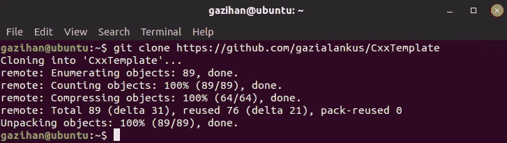

    ###### 图 1.2:从 GitHub 签出示例项目

    现在你在`CxxTemplate`文件夹中有了源代码。

2.  通过在终端中键入以下命令，导航到`CxxTemplate`文件夹:

    ```cpp
    cd CxxTemplate
    ```

3.  现在，您可以通过键入以下命令列出项目中的所有文件:

    ```cpp
    find .
    ```

4.  Generate our Ninja build file using the `cmake` command in the `CxxTemplate` folder. To do that, write the following command:

    ```cpp
    cmake -Bbuild -H. -GNinja
    ```

    前面命令的输出如下:

    

    ###### 图 1.3:生成忍者构建文件

    让我们解释前面命令的部分内容。通过`-Bbuild`，我们告诉 CMake 使用`构建`文件夹来生成构建工件。由于此文件夹不存在，CMake 将创建它。借助`–h .`，我们告诉 CMake 使用当前文件夹作为源。通过使用一个单独的`构建`文件夹，我们将保持源文件的干净，所有的构建工件将保存在`构建`文件夹中，由于我们的`，Git 忽略了这个文件夹。gitignore`文件。借助`–GNinja`，我们告诉 CMake 使用忍者构建系统。

5.  Run the following commands to list the project files and to check the files that were created inside the `build` folder:

    ```cpp
    ls
    ls build
    ```

    前面的命令将在终端中显示以下输出:

    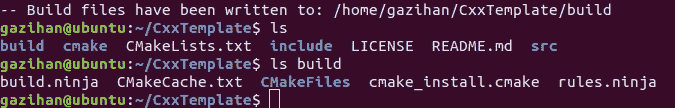

    ###### 图 1.4:构建文件夹中的文件

    很明显，前面的文件将出现在构建文件夹中。 **build.ninja** 和 **rules.ninja** 在前面的输出中是 Ninja build 文件，可以在这个平台中实际构建我们的项目。

    #### 注意

    通过使用 CMake，我们不需要编写忍者构建文件，并且避免了提交到 Unix 平台。相反，我们有一个元构建系统，可以为其他平台(如 UNIX/Linux、MinGW 和 Nmake)生成低级构建文件。

6.  Now, go into the `build` folder and build our project by typing the following commands in the terminal:

    ```cpp
    cd build
    ninja
    ```

    您应该会看到如下所示的最终输出:

    

    ###### 图 1.5:用忍者建造

7.  Type `ls` in the **build** folder and check whether we have generated the `CxxTemplate` executable or not:

    ```cpp
    ls
    ```

    前面的命令在终端中产生以下输出:

    

    ###### 图 1.6:运行 ninja 后构建文件夹中的文件

    在上图中，可以看到生成了`CxxTemplate`可执行文件。

8.  In the terminal, type the following command to run the `CxxTemplate` executable:

    ```cpp
    ./CxxTemplate
    ```

    终端中的前一个命令将提供以下输出:

    

###### 图 1.7:运行可执行文件

`src/CxxTemplate.cpp`文件中的下面一行负责写入前面的输出:

```cpp
std::cout << "Hello CMake." << std::endl;
```

现在你已经在 Linux 中成功构建了一个 CMake 项目。忍者和 CMake 配合得相当好。你只需要运行一次 CMake，Ninja 会检测是否应该再次调用 CMake，并为你调用它。例如，即使你在你的`CMakeLists.txt`文件中添加了新的源文件，你只需要在终端中键入`忍者`命令，它就会自动运行 CMake 为你更新忍者构建文件。既然您已经了解了在 Linux 中构建 CMake 项目，在下一节中，我们将了解如何将 CMake 项目导入到 Eclipse CDT 中。

## 将一个项目导入 Eclipse CDT

忍者构建文件对于在 Linux 中构建我们的项目非常有用。然而，一个 CMake 项目是可移植的，也可以用于其他构建系统和 ide。许多 ide 接受 CMake 作为它们的配置文件，并在您修改和构建项目时提供无缝的体验。在本节中，我们将讨论如何将一个 CMake 项目导入到 Eclipse CDT 中，这是一个流行的跨平台 C/C++ IDE。

有多种方法可以将 Eclipse CDT 与 CMake 一起使用。CMake 提供的默认选项是 IDE 项目的单向生成。在这里，您只需创建一次集成开发环境项目，对集成开发环境项目所做的任何修改都不会变回原始的 CMake 项目。如果您将项目作为一个 CMake 项目来管理，并使用 Eclipse CDT 进行一次性构建，这将非常有用。然而，如果您想在 Eclipse CDT 中进行开发，这并不理想。

在 Eclipse CDT 中使用 CMake 的另一种方法是使用自定义的`cmake4eclipse`插件。使用这个插件的时候，不要放弃你的`CMakeLists.txt`文件，单向切换到 Eclipse CDT 自己的项目经理。相反，您继续通过`CMakeLists.txt`文件来管理您的项目，该文件仍然是您项目的主要配置文件。Eclipse CDT 积极地与您的`CMakeLists.txt`文件合作来构建您的项目。您可以在您的`CMakeLists.txt`中添加或删除源文件并进行其他更改，并且`cmake4eclipse`插件会在每次构建时将这些更改应用到 Eclipse CDT 项目中。您将有一个很好的集成开发环境体验，同时保持您的 CMake 项目最新。这种方法的好处是，您可以随时退出使用 Eclipse CDT，稍后使用您的`CMakeLists.txt`文件切换到另一个构建系统(如 Ninja)。我们将在下面的练习中使用第二种方法。

### 练习T1】E2:将 CMake 文件导入 Eclipse CDT

在上一个练习中，您开发了一个 CMake 项目，并且希望开始使用 Eclipse CDT IDE 来编辑和构建该项目。在本练习中，我们将使用`cmake4eclipse`插件将我们的 CMake 项目导入到 Eclipse CDT IDE 中。执行以下步骤完成练习:

1.  打开 Eclipse CDT。
2.  Create a new C++ project in the location of our current project (the folder that contains the `CMakeLists.txt` file and the **src** folder). Go to **File** | **New** | **Project**. A **New Project** dialog box appears like the one in the following screenshot:

    

    ###### 图 1.8:新建项目对话框

3.  Select the **C++ Project** option and click on the **Next** button. A **C++ Project** dialog box appears like the one in the following screenshot:

    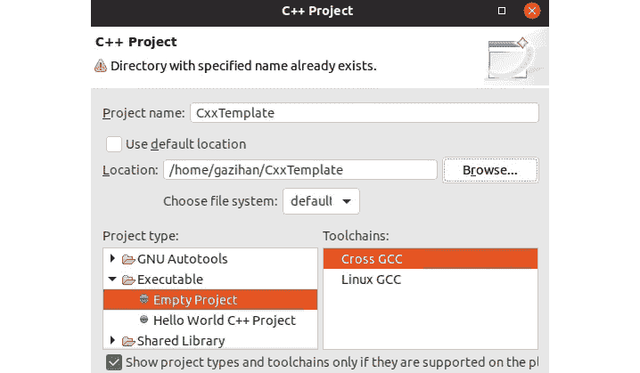

    ###### 图 1.9: C++ 项目对话框

4.  接受一切，包括切换到 C/C++ 视角，点击**完成**。
5.  Click on the **Restore** button at the top-left corner to view the newly created project:

    

    ###### 图 1.10:恢复按钮

6.  Click on the **CxxTemplate** project. Go to **Project** | **Properties**, then select **Tool Chain Editor** under **C/C++ Build** from the left pane and set **Current builder** to **CMake Builder (portable)**. Then, click on the **Apply and Close** button:

    

    ###### 图 1.11:项目属性

7.  Then, choose the **Project** | **Build All** menu item to build the project:

    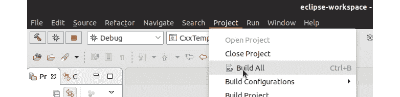

    ###### 图 1.12:构建项目

8.  In the following **Console** pane, you will see the output of CMake as if you called it from the command line, followed by a call to `make all` that actually builds our project:

    

    ###### 图 1.13:构建输出

9.  If you did not get any errors in the previous steps, you can run the project using the menu item **Run** | **Run**. If you are given some options, choose **Local C/C++ Application** and **CxxTemplate** as the executable:

    

    ###### 图 1.14:运行项目

10.  当它运行时，您将在**控制台**窗格中看到程序的输出，如下所示:


###### 图 1.15:项目输出

您已经使用 Eclipse CDT 成功地构建并运行了一个 CMake 项目。在下一个练习中，我们将通过添加新的源文件和新的类来频繁地改变我们的项目。

### 练习 3:向 CMake 和 Eclipse CDT 添加新的源文件

当您开发大得多的 C++ 项目时，您将倾向于随着项目的增长向其中添加新的源文件，以满足设定的期望。在本练习中，我们将添加一个新的`。cpp`和`。h`文件对到我们的项目，看看 CMake 和 Eclipse CDT 是如何配合这些变化一起工作的。我们将使用新建类向导在项目中添加这些文件，但是您也可以使用任何其他文本编辑器创建它们。执行以下步骤向 CMake 和 Eclipse CDT 添加新的源文件:

1.  First, open the project that we have been using until now. In the **Project Explorer** pane on the left, expand the root entry, **CxxTemplate**, and you will see the files and folders of our project. Right-click the **src** folder and select **New** | **Class** from the pop-up menu:

    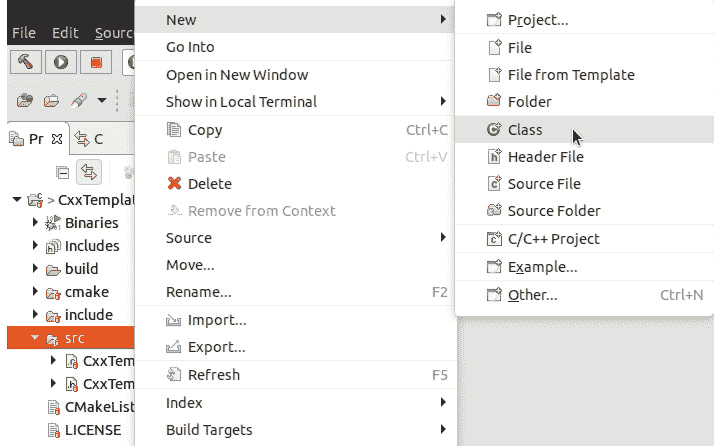

    ###### 图 1.16:创建一个新类

2.  在打开的对话框中，为类名键入**一个类**。点击**完成**按钮，会看到 **ANewClass.cpp** 和 **ANewClass.h** 文件生成在 **src** 文件夹下。
3.  Now, let's write some code into the `ANewClass` class and access it from the **CxxTemplate** class that we already had. Open `ANewClass.cpp` and change the beginning of the file to match the following, and then save the file:

    ```cpp
    #include "ANewClass.h"
    #include <iostream>
    void ANewClass::run() {
        std::cout << "Hello from ANewClass." << std::endl;
    }
    ```

    您将会看到 Eclipse 通过一条**未找到成员声明**消息来警告我们:

    

    ###### 图 1.17:分析仪警告

    产生这个错误是因为我们需要将它添加到我们的`ANewClass.h`文件中。这样的警告可以通过 IDEs 中的分析器来实现，并且非常有用，因为它们可以帮助您在键入时修复代码，而无需运行编译器。

4.  Open the `ANewClass.h` file, add the following code, and save the file:

    ```cpp
    public:
        void run(); // we added this line
        ANewClass();
    ```

    你应该看到`中的错误。cpp`文件走了。如果它没有消失，可能是因为您可能忘记保存其中一个文件。你应该养成按 *Ctrl + S* 保存当前文件的习惯，或者按 *Shift + Ctrl + S* 保存所有你编辑过的文件。

5.  Now, let's use this class from our other class, `CxxTemplate.cpp`. Open that file, perform the following modifications, and save the file. Here, we are first importing header files and in the constructor of `CxxApplication`, we are printing text to the console. Then, we are creating a new instance of `ANewClass` and calling its `run` method:

    ```cpp
    #include "CxxTemplate.h"
    #include "ANewClass.h"
    #include <string>
    ...
    CxxApplication::CxxApplication( int argc, char *argv[] ) {
      std::cout << "Hello CMake." << std::endl;
      ::ANewClass anew;
      anew.run();
    }
    ```

    #### 注意

    这个文件的完整代码可以在这里找到:[https://github . com/trainingypbackt/Advanced-CPlusPlus/blob/master/lesson 1/execute 03/src/cxxtemplate . CPP](https://github.com/TrainingByPackt/Advanced-CPlusPlus/blob/master/Lesson1/Exercise03/src/CxxTemplate.cpp)。

6.  Try to build the project by clicking on the **Project** | **Build All** menu options. You will get some undefined reference errors in two lines. This is because our project is built with CMake's rules and we did not let CMake know about this new file. Open the `CMakeLists.txt` file, make the following modification, and save the file:

    ```cpp
    add_executable(CxxTemplate
      src/CxxTemplate.cpp  
      src/ANewClass.cpp
    )
    ```

    尝试再次构建项目。这次你应该看不到任何错误。

7.  使用**运行** | **运行**菜单选项运行项目。您应该会在终端中看到以下输出:


###### 图 1.18:程序输出

您修改了一个 CMake 项目，向其中添加了新文件，并且运行良好。请注意，我们在`src`文件夹中创建了文件，并让`CMakeLists.txt`文件知道了 CPP 文件。如果您不使用 Eclipse，您可以简单地继续使用常见的 CMake 构建命令，您的程序将成功运行。到目前为止，我们已经检查了来自 GitHub 的示例代码，并用普通的 CMake 和 Eclipse IDE 构建了它。我们还在 CMake 项目中添加了一个新的类，并在 Eclipse IDE 中重新构建了它。现在您知道如何构建和修改 CMake 项目了。在下一节中，我们将执行一个向项目中添加新的源文件-头文件对的活动。

### 活动 1:向项目添加一个新的源文件-头文件对

在开发 C++ 项目时，随着项目的增长，您会向其中添加新的源文件。出于各种原因，您可能希望添加新的源文件。例如，假设您正在开发一个会计应用，在该应用中，您在项目的许多地方计算利率，并且您希望在单独的文件中创建一个函数，以便在整个项目中重用它。为了简单起见，这里我们将创建一个简单的求和函数。在本练习中，我们将向项目中添加一个新的源文件-头文件对。执行以下步骤完成活动:

1.  在 Eclipse IDE 中打开我们在前面的练习中创建的项目。
2.  将`SumFunc.cpp`和`SumFunc.h`文件对添加到项目中。
3.  创建一个名为`sum`的简单函数，返回两个整数的和。
4.  从`CxxTemplate`类构造函数调用该函数。
5.  在 Eclipse 中构建和运行项目。

预期输出应该类似于以下内容:


###### 图 1.19:最终输出

#### 注意

这项活动的解决方案可以在第 620 页找到。

在下一节中，我们将讨论如何为我们的项目编写单元测试。通常将项目分成许多类和函数，它们一起工作来实现期望的目标。您必须用单元测试来管理这些类和函数的行为，以确保它们以预期的方式运行。

## 单元测试

单元测试通常是编程的重要部分。基本上，单元测试是一些小程序，它们在各种场景中使用我们的类并产生预期的结果，在我们的项目中以并行的文件层次结构存在，最终不会出现在实际的可执行文件中，而是由我们在开发过程中单独执行，以确保我们的代码以预期的方式运行。我们应该为我们的 C++ 程序编写单元测试，以确保它们在每次更改后都像预期的那样运行。

### 准备 U nit 测试

有几个 C++ 测试框架我们可以和 CMake 一起使用。我们将使用**谷歌测试**，它比其他选项有几个好处。在下一个练习 e 中，我们将使用谷歌测试为单元测试准备我们的项目。

### 练习 4:准备我们的单元测试项目

我们已经安装了谷歌测试，但我们的项目没有设置为使用谷歌测试进行单元测试。除了安装，还有一些设置需要在我们的 CMake 项目中进行，以便进行谷歌测试单元测试。按照以下步骤实施本练习:

1.  打开 Eclipse CDT，选择我们一直在使用的 CxxTemplate 项目。
2.  创建一个名为**测试**的新文件夹，因为我们将在那里执行所有测试。
3.  Edit our base `CMakeLists.txt` file to allow tests in the **tests** folder. Note that we already had code to find the `GTest` package that brings `GoogleTest` capability to CMake. We will add our new lines just after that:

    ```cpp
    find_package(GTest)
    if(GTEST_FOUND)
    set(Gtest_FOUND TRUE)
    endif()
    if(GTest_FOUND)
    include(GoogleTest)
    endif()
    # add these two lines below
    enable_testing()
    add_subdirectory(tests)
    ```

    这就是我们需要添加到主`CMakeLists.txt`文件中的全部内容。

4.  在我们的**测试**文件夹中创建另一个**文件。这将被使用，因为我们在主 **CMakeLists.txt** 文件中有**add _ 子目录(测试)**行。这个**测试/CMakeLists.txt** 文件将管理测试源。**
5.  Add the following code in the `tests/CMakeLists.txt` file:

    ```cpp
    include(GoogleTest)
    add_executable(tests CanTest.cpp)
    target_link_libraries(tests GTest::GTest)
    gtest_discover_tests(tests)
    ```

    让我们一行行地剖析这段代码。第一行引入了谷歌测试功能。第二行创建**测试**可执行文件，它将包括我们所有的测试源文件。在这种情况下，我们只有一个 **CanTest.cpp** 文件，它将只是验证测试工作。之后，我们将 **GTest** 库链接到**测试**可执行文件。最后一行标识了可执行的**测试**中的所有单独测试，并将它们添加到**中作为测试。这样，各种测试工具将能够告诉我们哪些单独的测试失败了，哪些通过了。**

6.  创建一个`测试/CanTest.cpp`文件。添加这段代码只是为了验证测试正在运行，而不是实际测试我们实际项目中的任何东西:

    ```cpp
    #include "gtest/gtest.h"
    namespace {
    class CanTest: public ::testing::Test {};
    TEST_F(CanTest, CanReallyTest) {
      EXPECT_EQ(0, 0);
    }
    }  
    int main(int argc, char **argv) {
      ::testing::InitGoogleTest(&argc, argv);
      return RUN_ALL_TESTS();
    }
    ```

`TEST_F`线为单独测试。现在，`EXPECT_EQ(0，0)`正在测试零是否等于零，如果我们真的能运行测试，总是会成功的。稍后，我们将在这里添加我们自己的类的结果，以针对各种值进行测试。现在，我们已经在我们的项目中为谷歌测试进行了必要的设置。接下来，我们将构建并运行这些测试。

### 构建、运行、和编写单元测试

现在，我们将讨论如何构建、运行和编写单元测试。到目前为止，我们的例子是一个简单的虚拟测试，已经准备好构建和运行。稍后，我们将添加更有意义的测试，并查看通过和失败测试的输出。在下面的练习中，我们将为我们在前面练习中创建的项目构建、运行和编写单元测试。

### 练习 5:构建 g 并运行测试

到目前为止，您已经创建了一个设置了`GoogleTest`的项目，但是您没有构建或运行我们创建的测试。在本练习中，我们将构建并运行我们创建的测试。由于我们使用`add _ 子目录`添加了我们的`测试`文件夹，构建项目将自动构建测试。运行测试需要更多的努力。执行以下步骤完成练习:

1.  在 Eclipse CDT 中打开我们的 CMake 项目。
2.  To build the tests, simply build the project just like you did before. Here is the output of building the project one more time from Eclipse after a full build using **Project** | **Build All**:

    

    ###### 图 1.20:构建操作及其输出

3.  If you do not see this output, your console may be in the wrong view. You can correct it as shown in the following figures:

    

    ###### 图 1.21:查看正确的控制台输出

    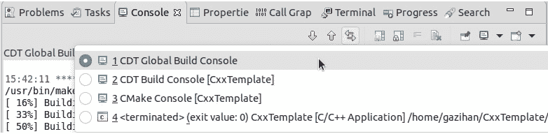

    ###### 图 1.22:查看正确的控制台输出

    如您所见，我们的项目现在有两个可执行的目标。他们都生活在`构建`文件夹中，就像任何其他构建神器一样。它们的位置是`构建/调试/扩展`和`构建/调试/测试/测试`。因为它们是可执行文件，所以我们可以简单地运行它们。

4.  We ran `CxxTemplate` before and will not see any extra output now. Run the other executable by typing the following command in the terminal while we are in our project folder:

    ```cpp
    ./build/Debug/tests/tests
    ```

    上述代码在终端中生成以下输出:

    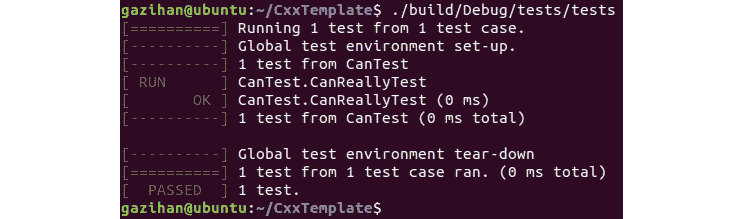

    ###### 图 1.23:运行可执行的测试

    这是我们的`测试`可执行文件的简单输出。如果你想看看测试是否通过，你可以简单地运行这个。然而，测试远不止于此。

5.  One of the ways you can run your tests is by using the `ctest` command. Write the following commands in the terminal while you are in the project folder. We go to the folder where the `tests` executable resides, run `ctest` there, and come back:

    ```cpp
    cd build/Debug/tests
    ctest
    cd ../../..
    ```

    这是您将看到的输出:

    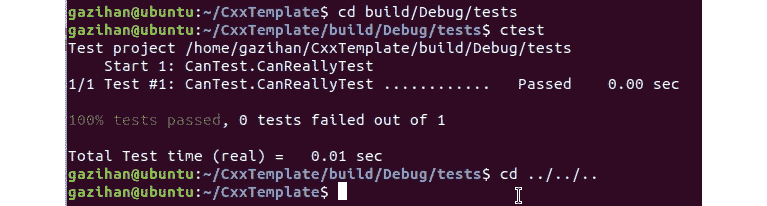

    ###### 图 1.24:运行 ctest

    #### 注意

    `ctest`命令可以运行您的`测试`可执行文件，其中有许多选项，包括自动将测试结果提交到在线仪表板的能力。在这里，我们将简单地运行`ctest`命令；它的其他特性留给感兴趣的读者作为练习。您可以键入`ctest - help`或访问在线文档，在[https://cmake.org/cmake/help/latest/manual/ctest.1.html#](https://cmake.org/cmake/help/latest/manual/ctest.1.html#)进一步了解`ctest`。

6.  运行测试的另一种方法是在 Eclipse 中以一种漂亮的图形报告格式运行它们。为此，我们将创建一个测试感知的运行配置。在 Eclipse 中，点击**运行** | **运行配置…** ，右键点击左侧 **C/C++ 单元**，选择**新配置**。
7.  Change the name from **CxxTemplate Debug** to **CxxTemplate Tests** as follows:

    

    ###### 图 1.25:更改运行配置的名称

8.  Under **C/C++ Application**, select the **Search Project** option:

    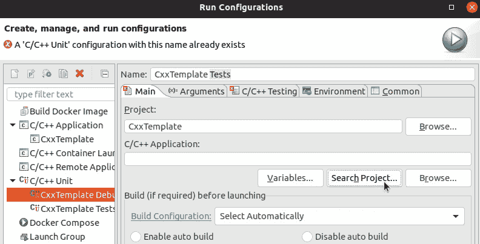

    ###### 图 1.26:运行配置

9.  Choose **tests** in the new dialog:

    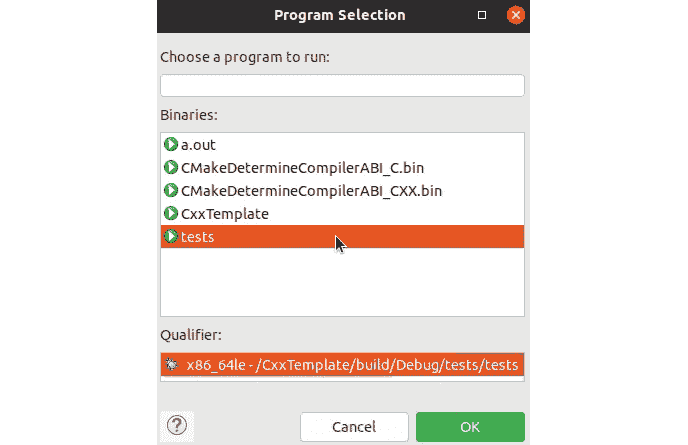

    ###### 图 1.27:创建测试运行配置并选择可执行的测试

10.  Next, go to the **C/C++ Testing** tab and select **Google Tests Runner** in the dropdown. Click on **Apply** at the bottom of the dialog and click on the **Run** option for the test that we have to run for the first time:

    

    ###### 图 1.28:运行配置

11.  在接下来的运行中，您可以点击工具栏中播放按钮旁边的下拉菜单，或者选择**运行** | **运行历史**选择**扩展测试**:


###### 图 1.29:最终确定运行配置设置并选择要运行的配置

结果将类似于下面的截图:


###### 图 1.30:运行单元测试的结果

这是一份很好的报告，包含了所有测试的条目——目前只有一个。如果不想离开集成开发环境，您可能更喜欢这样。此外，当您有许多测试时，这个界面可以帮助您有效地过滤它们。现在，您已经构建并运行了使用谷歌测试编写的测试。您以几种不同的方式运行它们，包括直接执行测试、使用`ctest`和使用 Eclipse CDT。在下一节中，我们将解决一个练习，其中我们将实际测试代码的功能。

### 练习 6:测试代码的功能

您已经运行了简单的测试，但是现在您想要编写测试功能的有意义的测试。在最初的活动中，我们创建了`SumFunc.cpp`，它具有`sum`功能。现在，在本练习中，我们将为该文件编写一个测试。在本测试中，我们将使用`求和`功能将两个数字相加，并验证结果是否正确。让我们用之前的`sum`函数回忆一下以下文件的内容:

*   `src/SumFunc.h` :

    ```cpp
    #ifndef SRC_SUMFUNC_H_
    #define SRC_SUMFUNC_H_
    int sum(int a, int b);
    #endif /* SRC_SUMFUNC_H_ */
    ```

*   `src/SumFunc.cpp` :

    ```cpp
    #include "SumFunc.h"
    #include <iostream>
    int sum(int a, int b) {
      return a + b;
    }
    ```

*   `CMakeLists.txt`相关行:

    ```cpp
    add_executable(CxxTemplate
      src/CxxTemplate.cpp  
      src/ANewClass.cpp
      src/SumFunc.cpp
    )
    ```

另外，让我们回忆一下我们的`cantest . CPP`文件，它有我们单元测试的`main()`功能:

```cpp
#include "gtest/gtest.h"
namespace {
class CanTest: public ::testing::Test {};
TEST_F(CanTest, CanReallyTest) {
  EXPECT_EQ(0, 0);
}
}  
int main(int argc, char **argv) {
  ::testing::InitGoogleTest(&argc, argv);
  return RUN_ALL_TESTS();
}
```

执行以下步骤完成练习:

1.  在 Eclipse CDT 中打开我们的 CMake 项目。
2.  Add a new test source file (`tests/SumFuncTest.cpp`) with the following content:

    ```cpp
    #include "gtest/gtest.h"
    #include "../src/SumFunc.h"
    namespace {
      class SumFuncTest: public ::testing::Test {};
      TEST_F(SumFuncTest, CanSumCorrectly) {
        EXPECT_EQ(7, sum(3, 4));
      }
    }
    ```

    请注意，这没有`main()`功能，因为`CanTest.cpp`有一个功能，这些功能将链接在一起。其次，注意这包括`SumFunc.h`，它在项目的 **src** 文件夹中，在测试中用作`sum(3，4)`。这就是我们在测试中使用项目代码的方式。

3.  Make the following change in the `tests/CMakeLists.txt` file to build the test:

    ```cpp
    include(GoogleTest)
    add_executable(tests CanTest.cpp SumFuncTest.cpp ../src/SumFunc.cpp) # added files here
    target_link_libraries(tests GTest::GTest)
    gtest_discover_tests(tests)
    ```

    注意，我们添加了测试(`SumFuncTest.cpp`)和它测试的代码(`../src/SumFunc.cpp`)转换为可执行文件，因为我们的测试代码使用的是实际项目中的代码。

4.  Build the project and run the test as before. You should see the following report:

    

    ###### 图 1.31:运行测试后的输出

    我们可以将这样的测试添加到我们的项目中，所有的测试都会出现在屏幕上，如前面的截图所示。

5.  Now, let's add one more test that will actually fail. In the `tests/SumFuncTest.cpp` file, make the following change:

    ```cpp
    TEST_F(SumFuncTest, CanSumCorrectly) {
      EXPECT_EQ(7, sum(3, 4));
    }
    // add this test
    TEST_F(SumFuncTest, CanSumAbsoluteValues) {
      EXPECT_EQ(6, sum(3, -3));
    }
    ```

    请注意，该测试假设输入的绝对值相加，这是不正确的。这个调用的结果是`0`，但是在这个例子中预计是`6`。这是我们在项目中添加这个测试所必须做的唯一改变。

6.  Now, build the project and run the test. You should see this report:

    

    ###### 图 1.32:构建报告

    从上图中可以看到，前两次测试通过，最后一次测试失败。当我们看到这个输出时，有两种选择:要么我们的项目代码是错误的，要么测试是错误的。在这种情况下，我们的测试是错误的。这是因为我们的 **CanSumAbsoluteValues** 测试用例期望`6`等于`sum(3，-3)`。这是因为我们假设我们的函数对提供的整数的绝对值求和。然而，事实并非如此。我们的函数只是将给定的数字相加，不管它们是正数还是负数。因此，这个测试有一个错误的假设，失败了。

7.  让我们更改测试并修复它。更改测试，使我们预期`-3`和`3`之和为`0`。重命名测试，以反映该测试的实际作用:

    ```cpp
    TEST_F(SumFuncTest, CanSumCorrectly) {
      EXPECT_EQ(7, sum(3, 4));
    }
    // change this part
    TEST_F(SumFuncTest, CanUseNegativeValues) {
      EXPECT_EQ(0, sum(3, -3));
    }
    ```

8.  现在运行它，并在报告中观察所有测试是否通过:

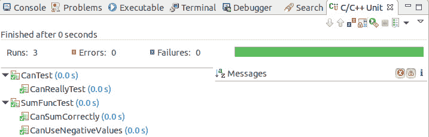

###### 图 1.33:测试执行成功

最后，我们已经在我们的系统和项目中使用 CMake 建立了谷歌测试。我们还使用谷歌测试在终端和 Eclipse 中编写、构建和运行单元测试。理想情况下，您应该为每个类编写单元测试，并涵盖所有可能的用法。您还应该在每次重大更改后运行测试，并确保不破坏现有代码。在下一节中，我们将执行形成一个添加新类及其测试的活动。

### 活动 2:在测试中添加一个新类

当您开发一个 C++ 项目时，您会随着项目的增长向其中添加新的源文件。您还为他们编写测试，以确保他们正常工作。在本练习中，我们将添加一个模拟`1D`直线运动的新类。该类将具有用于`位置`和`速度`的双字段。它还将有一个`advanceTimeBy()`方法，该方法接收一个双`dt`参数，该参数基于`速度`的值修改`位置`。双数值用`EXPECT_DOUBLE_EQ`代替`EXPECT_EQ`。在本活动中，我们将向项目中添加一个新类及其测试。按照以下步骤执行本活动:

1.  打开我们在 Eclipse 集成开发环境中创建的项目。
2.  将`LinearMotion1D.cpp`和`LinearMotion1D.h`文件对添加到包含`LinearMotion1D`类的项目中。在这个类中，创建两个双字段:`位置`和`速度`。另外，创建一个`提前时间比(双 dt)`功能，修改`位置`。
3.  在`测试/linear motion 1 test . CPP`文件中为此编写测试。写两个代表两个不同方向运动的测试。
4.  在 Eclipse IDE 中构建并运行它。
5.  验证测试是否通过。

最终测试结果应该类似于以下内容:


###### 图 1.34:最终测试结果

#### 注意

这项活动的解决方案可以在第 622 页找到。

添加新类及其测试是 C++ 开发中非常常见的任务。我们创建类有各种原因。有时，我们有一个很好的软件设计计划，我们创建它所需要的类。其他时候，当一个类变得过于庞大和单一时，我们会以一种有意义的方式将它的一些职责分离给另一个类。让这个任务变得实际很重要，这样可以防止你拖拖拉拉，最终得到一个巨大的整体类。在下一节中，我们将讨论编译和链接阶段会发生什么。这将让我们更好地了解 C++ 程序下正在发生的事情。

## 了解编译、链接和目标文件内容

使用 C++ 的一个主要原因是效率。C++ 让我们可以控制内存管理，这就是为什么理解对象在内存中的布局很重要。此外，C++ 源文件和库被编译成目标硬件的目标文件并链接在一起。通常，C++ 程序员必须处理链接器问题，这就是为什么理解编译步骤并能够研究目标文件很重要。另一方面，大型项目是由团队长时间开发和维护的，这就是为什么创建干净和可理解的代码很重要。与任何其他软件一样，C++ 项目中会出现错误，需要通过观察程序行为来仔细识别、分析和解决。因此，学习如何调试 C++ 代码也很重要。在下一节中，我们将学习如何创建高效的、与其他代码配合良好的、可维护的代码。

### 编译和链接步骤

C++ 项目是作为一组源代码文件和项目配置文件创建的，这些文件组织了源代码和库依赖项。在编译步骤中，首先将这些源转换为目标文件。在链接步骤中，这些目标文件被链接在一起形成可执行文件，这是项目的最终输出。项目使用的库也在这一步链接。

在接下来的练习中，我们将使用我们现有的项目来观察编译和链接阶段。然后，我们将手动重新创建它们，以更详细地查看流程。

### 练习 7:识别构建步骤

您一直在构建项目，而没有调查构建操作的细节。在本练习中，我们将研究项目构建步骤的细节。执行以下操作来完成练习:

1.  打开终端。
2.  通过键入以下命令导航到`构建`文件夹，我们的`Makefile`文件位于该文件夹中:

    ```cpp
    cd build/Debug
    ```

3.  Clean the project and run the build in `VERBOSE` mode using the following command:

    ```cpp
    make clean 
    make VERBOSE=1 all
    ```

    您将在终端中获得构建过程的详细输出，这可能看起来有点拥挤:

    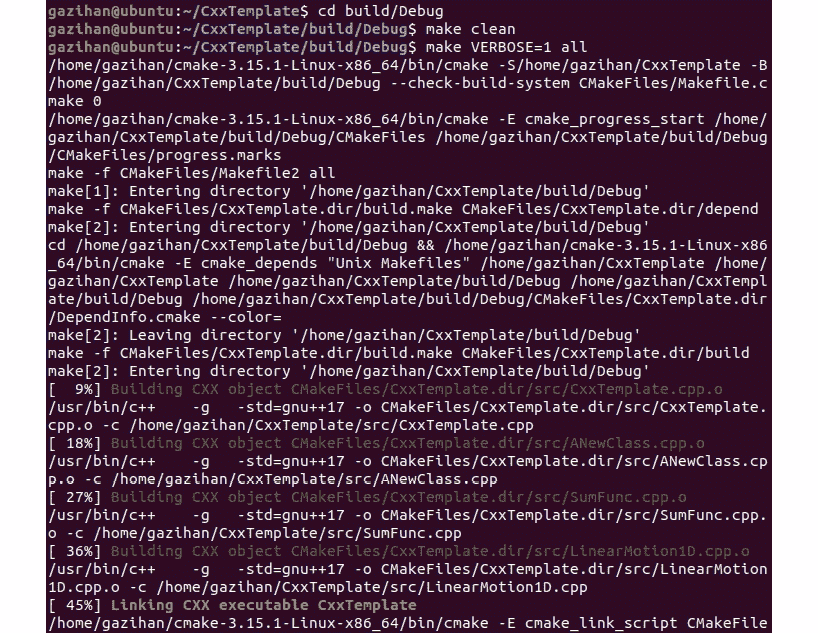

    ###### 图 1.35:构建过程第 1 部分

    

    ###### 图 1.36:构建过程第 2 部分

    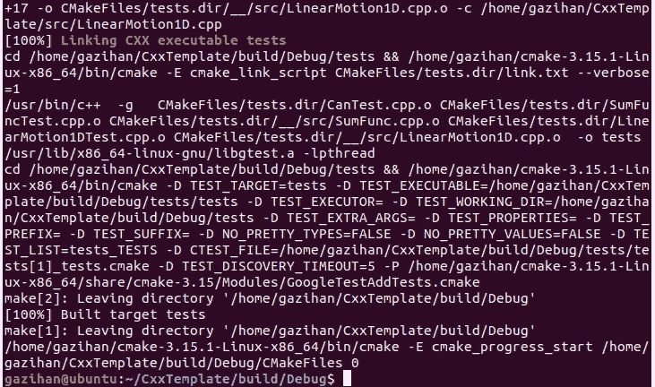

    ###### 图 1.37:完整的构建输出

    下面是这个输出中的一些行。以下几行是与主可执行文件的编译和链接相关的重要内容:

    ```cpp
    /usr/bin/c++    -g   -pthread -std=gnu++ 1z -o CMakeFiles/CxxTemplate.dir/src/CxxTemplate.cpp.o -c /home/username/Packt/Cpp2019/CxxTemplate/src/CxxTemplate.cpp
    /usr/bin/c++    -g   -pthread -std=gnu++ 1z -o CMakeFiles/CxxTemplate.dir/src/ANewClass.cpp.o -c /home/username/Packt/Cpp2019/CxxTemplate/src/ANewClass.cpp
    /usr/bin/c++    -g   -pthread -std=gnu++ 1z -o CMakeFiles/CxxTemplate.dir/src/SumFunc.cpp.o -c /home/username/Packt/Cpp2019/CxxTemplate/src/SumFunc.cpp
    /usr/bin/c++    -g   -pthread -std=gnu++ 1z -o CMakeFiles/CxxTemplate.dir/src/LinearMotion1D.cpp.o -c /home/username/Packt/Cpp2019/CxxTemplate/src/LinearMotion1D.cpp
    /usr/bin/c++  -g   CMakeFiles/CxxTemplate.dir/src/CxxTemplate.cpp.o CMakeFiles/CxxTemplate.dir/src/ANewClass.cpp.o CMakeFiles/CxxTemplate.dir/src/SumFunc.cpp.o CMakeFiles/CxxTemplate.dir/src/LinearMotion1D.cpp.o  -o CxxTemplate -pthread 
    ```

4.  The `c++ ` command here is just a symbolic link to the `g++ ` compiler. To see that it's actually a chain of symbolic links, type the following command:

    ```cpp
    namei /usr/bin/c++
    ```

    您将看到以下输出:

    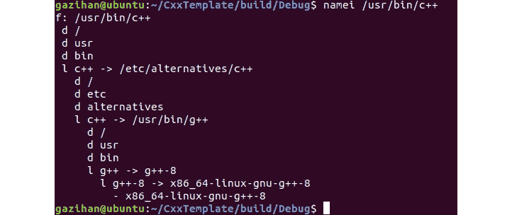

    ###### 图 1.38:用于/usr/bin/c++ 的符号链接链

    因此，我们将在整个讨论中交替使用`c++ `和`g++ `。在我们前面引用的构建输出中，前四行是编译每个`。cpp`源文件并创建相应的`。o`对象文件。最后一行是将这些目标文件链接在一起，创建`CxxTemplate`可执行文件。下图直观地展示了这一过程:

    

    ###### 图 1.39:c++ 项目的执行阶段

    如上图所示，作为目标的一部分添加到 CMake 的 CPP 文件，连同它们包含的头文件一起，被编译成目标文件，这些文件随后被链接在一起以创建目标可执行文件。

5.  为了进一步理解这个过程，让我们自己执行编译步骤。在终端中，转到项目文件夹，使用以下命令创建一个名为`mybuild`的新文件夹:

    ```cpp
    cd ~/CxxTemplate
    mkdir mybuild
    ```

6.  然后，运行以下命令将 CPP 源文件编译为目标文件:

    ```cpp
    /usr/bin/c++ src/CxxTemplate.cpp -o mybuild/CxxTemplate.o -c 
    /usr/bin/c++ src/ANewClass.cpp -o mybuild/ANewClass.o -c 
    /usr/bin/c++ src/SumFunc.cpp -o mybuild/SumFunc.o -c 
    /usr/bin/c++ src/LinearMotion1D.cpp -o mybuild/LinearMotion1D.o -c 
    ```

7.  Go into the `mybuild` directory and see what's there using the following command:

    ```cpp
    cd mybuild
    ls 
    ```

    我们看到如下预期的输出。这些是我们的目标文件:

    

    ###### 图 1.40:编译的目标文件

8.  下一步，将目标文件链接在一起，形成我们的可执行文件。键入以下命令:

    ```cpp
    /usr/bin/c++  CxxTemplate.o ANewClass.o SumFunc.o LinearMotion1D.o  -o CxxTemplate 
    ```

9.  Now, let's see our executable among the list of files here by typing the following command:

    ```cpp
    ls 
    ```

    这将在下图中显示新的`CxxTemplate`文件:

    

    ###### 图 1.41:链接的可执行文件

10.  Now, run our executable by typing the following command:

    ```cpp
    ./CxxTemplate
    ```

    看看我们之前的输出:

    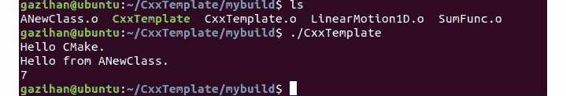

###### 图 1.42:可执行文件输出

现在，您已经检查了构建过程的细节并自己重新创建了它们，在下一节中，让我们来探索链接过程。

### 连接步骤

在这一节中，让我们来看看两个源文件之间的连接，以及它们如何在同一个可执行文件中结束。请看下图中的**求和**功能:


###### 图 1.43:链接过程

**sum** 函数的主体在 **SumFunc.cpp** 中定义。它在 **SumFunc.h** 中有一个远期申报。这样，想要使用 **sum** 函数的源文件就可以知道它的签名了。一旦他们知道它的签名，他们就可以调用它，并相信实际的函数定义将在运行时存在，而实际上与定义函数的 **SumFunc.cpp** 没有任何交互。

编译后，调用 **sum** 函数的 **CxxTemplate.cpp** 将该调用携带到其目标文件中。但是，它不知道函数定义在哪里。 **SumFunc.cpp** 的对象文件有这个定义，但是和 **CxxTemplate.o** 还没有关系。

在链接步骤中，链接器将 **CxxTemplate.o** 中的调用与 **SumFunc.o** 中的定义进行匹配。因此，该调用在可执行文件中运行良好。如果链接器没有找到 **sum** 函数的定义，它会给出一个链接器错误。

链接器通过名称和参数找到**和**函数。这叫做**解析符号**。对象文件中定义的类、函数和变量放在符号表中，对符号的每个引用都通过在该表中查找来解析。当符号不存在时，您会收到一个`符号无法解析`错误。

这让我们经历了构建过程的两个阶段:`编译`和`链接`。请注意，当我们手动编译源代码时，我们使用了比 CMake 更简单的命令。请随意输入`man g++ `查看所有选项。后来，我们讨论了链接和如何解决符号。我们还讨论了链接步骤中可能出现的问题。在下一节中，我们将了解目标文件。

### 深入:查看对象文件

为了使链接步骤没有错误，我们需要让所有的符号引用与我们的符号定义相匹配。大多数时候，我们可以通过查看源文件来分析事情将如何解决。有时，在复杂的情况下，我们可能很难理解为什么一个符号没有被解析。在这种情况下，查看对象文件的内容来研究引用和定义对于解决问题可能很有用。除了链接器错误之外，理解目标文件内容以及链接一般是如何工作的对 C++ 程序员来说也很有用。了解幕后发生的事情可能有助于程序员更好地理解整个过程。

当我们的源代码被编译成目标文件时，我们的语句和表达式被转换成汇编代码，这是中央处理器理解的低级语言。汇编中的每条指令都包含一个操作，后面是操作符，它们是中央处理器的寄存器。有向寄存器加载数据和从寄存器加载数据以及对寄存器中的值进行操作的指令。Linux 中的`objdump`命令帮助我们查看这些目标文件的内容。

#### 注意

我们将利用编译器资源管理器，这是一个很好的在线工具，更容易使用，你可以在左边的窗口写代码，在右边，你可以看到编译后的汇编代码。这是编译器浏览器的链接:https://godbolt.org。

### 练习 8:探索编译代码

在本练习中，我们将使用编译器资源管理器来编译一些简单的 C++ 代码，在这些代码中我们定义并调用一个函数。我们将研究编译后的程序集代码，以了解如何准确解析名称和进行调用。这将使我们更好地理解幕后发生了什么，以及我们的代码是如何以可执行格式工作的。执行以下步骤完成练习:

1.  Add the following code in **Compiler Explorer**:

    ```cpp
    int sum(int a, int b) {
        return a + b;
    }
    int callSum() {
        return sum(4, 5);
    }
    ```

    我们有两个功能；一个在呼叫另一个。下面是编译后的输出:

    

    ###### 图 1.44:编译后的代码

    虽然不太清楚，但你或多或少能看出它在做什么。我们不打算深入讨论汇编代码的细节，但我们将重点关注在链接器阶段如何解析符号。现在让我们关注以下几行:

    ```cpp
    sum(int, int):

    ...
    callSum():

    ...
            call  sum(int, int)

    ...
    ```

    `调用 sum(int，int)`行实现了您所期望的:它调用前面的`sum`函数，并将参数放在一些寄存器中。这里重要的一点是，函数是由它们的名称和参数类型按顺序标识的。链接器用这个签名寻找合适的函数。请注意，返回值不是签名的一部分。

2.  Disable the **Demangle** checkbox and see how these function names are actually stored:

    

    ###### 图 1.45:没有解混的编译代码

    这里，我们的台词变成了这样:

    ```cpp
    _Z3sumii:

    ...
    _Z7callSumv:

    ...
            call    _Z3sumii

    ...
    ```

    前面是这些函数的错误名称。在`_Z`之后，数字告诉我们函数名有多长，以便正确解释下面的字母。在函数名之后，没有参数的是`v`，参数的是`I``int`。您可以更改这些函数签名来查看其他可能的类型。

3.  Now, let's look at how classes are compiled. Add the following code into **Compiler Explorer** under the existing code:

    ```cpp
    class MyClass {
    private:
        int a = 5;
        int myPrivateFunc(int i) {
            a = 4;
            return i + a;
        }
    public:
        int b = 6;
        int myFunc(){ 
            return sum(1, myPrivateFunc(b));
        }
    };
    MyClass myObject;
    int main() {
        myObject.myFunc();
    }
    ```

    以下是这些新增行的编译版本:

    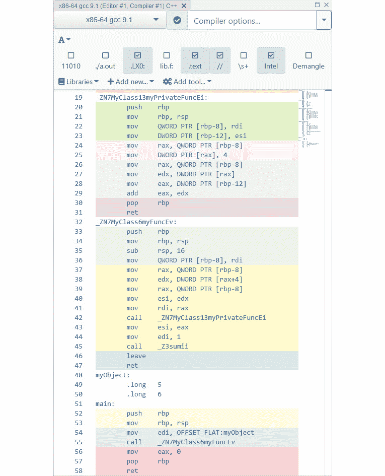

###### 图 1.46:编译版本

您可能会惊讶于编译代码中没有类定义。这些方法类似于全局函数，但有一点不同:它们的变形名称包含类名，并且它们接收对象实例作为参数。创建实例只是为类的字段分配空间。

在链接器阶段，这些损坏的函数名被用来匹配调用者和被调用者。对于找不到被调用方的调用方，我们会得到链接器错误。大多数链接器错误可以通过仔细检查源代码来解决。但是，在某些情况下，使用`objdump`查看对象文件内容有助于找到问题的根源。

## 调试 C++ 代码

在开发 C++ 项目时，您可能会遇到不同级别的问题:

*   首先，您可能会收到编译器错误。这可能是因为您在语法上犯了一个错误，或者对类型的错误选择，等等。编译器是你必须跳过的第一个环，它会捕捉到你可能犯的一些错误。
*   第二个环是接头。在那里，一个典型的错误是使用声明的东西，但没有实际定义。当您为库使用了错误的头文件时，这种情况经常发生，头文件会通告任何源文件或库中都不存在的特定签名。一旦你也跳过链接环，你的程序就可以执行了。
*   现在，下一个要跳过的环是避免任何运行时错误。您的代码可能已经正确编译和链接，但它可能正在做一些不起作用的事情，例如取消对空指针的引用或除以零。

要查找和修复运行时错误，您必须以某种方式与正在运行的应用进行交互并对其进行监控。一种常用的技术是向代码中添加`打印`语句，并监控它生成的日志，希望将应用行为与日志相关联，以查明代码中有问题的区域。虽然这适用于某些情况，但有时您需要更仔细地查看执行情况。

调试器是对抗运行时错误的更好工具。调试器可以让你一行一行地运行代码，继续运行并暂停在你想要的行上，调查内存的值，暂停在错误上，等等。这让您可以观察程序运行时内存中到底发生了什么，并识别导致不需要的行为的代码行。

`gdb`是可以调试 C++ 程序的规范命令行调试器。然而，这可能很难使用，因为调试本质上是一项可视化任务——您希望能够同时查看代码行、变量值和程序输出。幸运的是，Eclipse CDT 包含一个易于使用的可视化调试器。

### 练习 9:使用 Eclipse CDT 进行调试

您只是在运行您的项目并查看输出。现在你想学习如何详细调试你的代码。在本练习中，我们将探索 Eclipse CDT 的调试功能。执行以下步骤完成练习:

1.  在 Eclipse CDT 中打开 CMake 项目。
2.  To ensure that we have an existing run configuration, click **Run** | **Run Configurations**. There, you should see a **CxxTemplate** entry under **C/C++ Application**.

    #### 注意

    既然我们之前运行了我们的项目，它应该在那里。如果没有，请返回并重新创建。

3.  关闭对话框继续。
4.  To start the debugger, find the toolbar entry that looks like an insect (bug) and click on the dropdown next to it. Select **CxxTemplate** to debug the main application. If it asks you to switch to the debug perspective, accept. Now, this is what Eclipse will look like:

    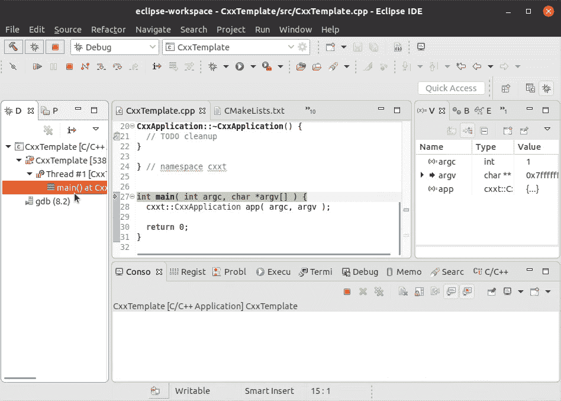

    ###### 图 1.47: Eclipse 调试屏幕

    此时，我们的代码冻结在我们的`main()`函数的第一行，该函数在代码视图的中间用绿色高亮和箭头显示。在左边，我们看到正在运行的线程，其中只有一个。在右边，我们看到了在这种情况下可以访问的变量。在底部，我们看到了 Eclipse 在幕后实际调试可执行文件时使用的 **gdb** 输出。现在，我们的主要功能没有太多需要调试的地方。

5.  单击**运行**菜单下的**跳过**，或者在工具栏中单击几次，应用将很快终止。最后，你会看到`libc-start.c`库，它是`主`功能的调用者。完成后，您可以关闭它并切换到源文件。当你不再看到红色的停止按钮时，你就知道程序执行结束了。
6.  Edit our `main` function by adding the following code:

    ```cpp
    int i = 1, t = 0;
    do {
      t += i++ ;
    } while (i <= 3);
    std::cout << t << std::endl;
    ```

    增量后操作符与偶尔的`do-while`循环混合在一起，对某些人来说可能会令人头疼。这是因为我们试图在头脑中执行算法。然而，我们的调试器完全能够一步一步地运行它，并向我们展示在执行过程中到底发生了什么。

7.  Start debugging after adding the preceding code. Click on the dropdown next to the **Debug** button in the toolbar and select **CxxTemplate**. Press *F6* a couple of times to step over in the code. It will show us how the variables change as well as the line of code that will be executed next:

    

    ###### 图 1.48:跳过代码

8.  Seeing the variables change after the execution of each line of code makes the algorithm much clearer to understand. As you press *F6*, note that the following are the values after each execution of the `t += i++ ;` line:

    

    ###### 图 1.49:随时间变化的状态

    前面的输出清楚地解释了值是如何变化的，以及为什么在最后打印`6`。

9.  Explore other features of the debugger. While the variable view is useful, you can also hover over any variable and browse its value:

    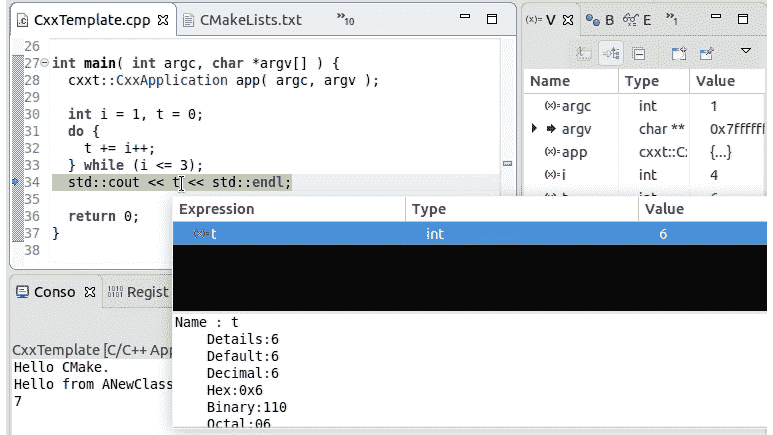

    ###### 图 1.50:调试器的视图选项

    此外，**表达式**视图可以帮助您计算从您浏览的值中不清楚的东西。

10.  Click on **Expression** on the right-hand side and click on the **Add** button:

    

    ###### 图 1.51:添加表达式

11.  Type **t+i** and hit *Enter*. Now you see the total in the list of expressions:

    

    ###### 图 1.52:带有新表达式的表达式视图

    可以按工具栏中的红方，也可以选择**运行** | **终止**随时停止调试。另一个特性是断点，它告诉调试器每当它到达一个标有断点的行时就暂停。到目前为止，我们一直在一行行地遍历我们的代码，这在大型项目中可能非常耗时。相反，您通常希望继续执行，直到它到达您感兴趣的代码。

12.  Now, instead of going line by line, add a breakpoint in the line that does the printing. For this, double-click on the area to the left of the line number of this line. In the following figure, the dot represents a breakpoint:

    

    ###### 图 1.53:使用断点

13.  Now start the debugger. As usual, it will start paused. Now select **Run** | **Resume** or click on the toolbar button. It will run the three executions of the loop and pause at our breakpoint. This way, we saved time by stepping through code that we are not investigating:

    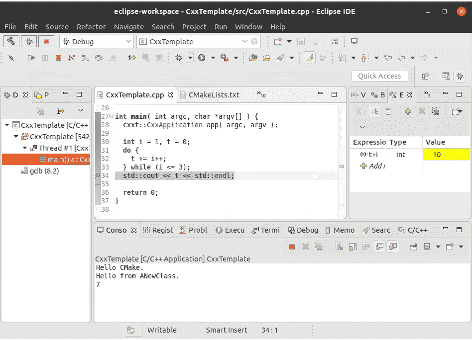

    ###### 图 1.54:使用调试器

14.  当我们一直在处理我们添加的循环时，我们忽略了创建`应用`对象的线。**跳过**命令跳过了这一行。然而，我们也可以选择进入这一行的构造函数调用。为此，我们将使用**运行** | **进入**或相应的工具栏按钮。
15.  Stop the debugger and start it again. Click on **Step Over** to go to the line where the application is created:

    

    ###### 图 1.55:使用调试器–单步执行选项

16.  突出显示的是下一行，如果我们再次单步执行，它将被执行。相反，请按“进入”按钮。这将带我们进入构造函数调用:


###### 图 1.56:使用调试器——单步执行选项

这是一个方便的功能，可以更深入地了解函数，而不是简单地跳过它。另外，请注意左侧调试视图中的调用堆栈。您可以随时点击下方的尝试再次查看呼叫者的上下文。

这是对 Eclipse CDT 调试器的简单介绍，它在引擎盖下使用 GDB 给你一个可视化的调试体验。当试图更好地理解运行时错误并纠正导致错误的错误时，您可能会发现调试很有用。

## 编写可读代码

虽然可视化调试器在识别和消除运行时错误或意外的程序行为方面非常有用，但是最好编写一开始就不太可能有问题的代码。做到这一点的一种方法是努力编写更容易阅读和理解的代码。然后，在代码中发现问题变得更像是识别英语句子之间的矛盾，而不是解决神秘的谜题。当你以一种可以理解的方式编写代码时，你的错误往往会在你编写代码时变得很明显，当你回来解决漏掉的问题时，你会更容易发现。

经过一些不愉快的维护经历，你意识到你写的程序的主要目的不是让计算机做你想做的事情，而是告诉读者当程序运行时计算机会做什么。这通常意味着您需要做更多的打字工作，IDEs 可以提供帮助。这也可能意味着您有时编写的代码在执行时间或使用的内存方面不是最佳的。如果这与你所学的相违背，考虑一下你可能用极少量的效率来换取不正确的风险。由于我们拥有巨大的处理能力和内存，您可能会让您的代码变得不必要的神秘，并且在徒劳地追求效率的过程中可能会出错。在接下来的部分中，我们将列出一些经验法则，这些法则可能有助于您编写可读性更强的代码。

### 缩进和格式化

与许多其他编程语言一样，C++ 代码由程序块组成。一个函数有一组语句，这些语句构成了它的块。循环的块语句将在迭代中执行。如果给定条件为真，则执行`if`语句块，否则执行相应的`else`语句块。

花括号，或者单语句块没有花括号，通知计算机，而空格形式的缩进通知人类读者关于块结构。缺少缩进，或者误导性缩进，会使读者很难理解代码的结构。因此，我们应该努力保持代码的良好缩进。考虑以下两个代码块:

```cpp
// Block 1
if (result == 2) 
firstFunction();
secondFunction();
// Block 2
if (result == 2) 
  firstFunction();
secondFunction();
```

虽然它们在执行上是相同的，但是在第二个中更清楚的是`firstFunction()`只有在`结果`为`2`时才会执行。现在考虑以下代码:

```cpp
if (result == 2) 
  firstFunction();
  secondFunction();
```

这简直是误导。如果读者不小心，他们可能很容易认为只有当`结果`为`2`时，才会执行`secondFunction()`。但是，这段代码在执行方面与前面两个示例完全相同。

如果你觉得修改缩进会让你慢下来，你可以使用编辑器的格式化工具来帮助你。在 Eclipse 中，您可以选择一段代码并使用 **Source** | **修正缩进**来修复该选择的缩进，或者使用 **Source** | **Format** 来修复代码的其他格式问题。

除了缩进之外，其他格式规则，如将大括号放在正确的行，在二进制运算符周围插入空格，以及在每个逗号后插入空格，也是非常重要的格式规则，您应该遵守这些规则来保持代码格式良好且易于阅读。

在 Eclipse 中，您可以在**窗口** | **首选项** | **C/C++** | **代码样式** | **格式化程序**或在**项目** | **属性** | **C/C++ 常规** | **格式化程序**中设置每个工作区的格式化规则。您可以选择一种行业标准样式，如 K & R 或 GNU，也可以修改它们并创建自己的样式。当您使用**源代码** | **格式**来格式化您的代码时，这变得尤为重要。例如，如果您选择使用空格进行缩进，但是 Eclipse 的格式规则设置为制表符，那么您的代码将变成制表符和空格的混合。

### 使用有意义的名称作为标识符

在我们的代码中，我们使用标识符来命名许多项目——变量、函数、类名、类型等等。对于计算机来说，这些标识符只是一个字符序列，用来区分它们。然而，对于读者来说，它们要多得多。标识符应该完整而明确地描述它所代表的项目。同时，它不应该太长。此外，它应该遵守正在使用的风格标准。

考虑以下代码:

```cpp
studentsFile File = runFileCheck("students.dat");
bool flag = File.check();
if (flag) {
    int Count_Names = 0;
    while (File.CheckNextElement() == true) {
        Count_Names += 1;
    }
    std::cout << Count_Names << std::endl;
}
```

虽然这是一段完全有效的 C++ 代码，但很难阅读。让我们列出它的问题。首先，我们来看看标识符的样式问题。`学生文件`类名以小写字母开头，应该改为大写。`文件`变量应该以小写字母开头。`Count_Names`变量应该以小写字母开头，不应该有下划线。`CheckNextElement`方法应该以小写字母开头。虽然这些规则看起来很随意，但是命名的一致性带来了关于名称的额外信息——当你看到一个以大写字母开头的单词时，你马上就会明白它一定是一个类名。此外，使用不符合标准的名字只会分散注意力。

现在，让我们超越风格，检查名称本身。第一个有问题的名字是`runFileCheck`函数。方法是一个返回值的动作:它的名字应该清楚地解释它做什么以及它返回什么。“检查”是一个过度使用的词，对大多数情况来说太模糊了。是的，我们检查过了，它就在那里——那我们该怎么办？在这种情况下，似乎我们实际上读取了文件并创建了一个`文件`对象。在这种情况下，`运行文件检查`应该改为`读取文件`。这清楚地解释了正在采取的行动，而返回值正是您所期望的。如果您想更具体地了解返回值，`readAsFile`可能是另一种选择。同样的，`检查`的方法也比较模糊，应该是`存在`代替。`CheckNextElement`方法也比较模糊，应该是`next elements`代替。

另一个被过度使用的模糊词是`标志`，常用于布尔变量。这个名字暗示了一种开/关的情况，但没有给出它的价值意味着什么的线索。在这种情况下，其`真`值表示文件存在，`假`值表示文件不存在。命名布尔变量的技巧是，当变量的值为`真`时，设计一个正确的问题或语句。在本例中，`文件存在`和`文件不存在`是两个不错的选择。

我们的下一个错误命名的变量是`Count_Names`，或`countNames`，其大写正确。对于整数来说，这是一个不好的名字，因为这个名字并没有暗示一个数字——它暗示了一个产生数字的动作。取而代之的是，像`numNames`或`nameCount`这样的标识符可以清楚地传达出里面的数字是什么意思。

### 保持算法清晰简单

当我们阅读代码时，所采取的步骤和流程应该是有意义的。间接完成的事情——函数的副产品，以效率的名义一起完成的多个动作，等等——让读者很难理解你的代码。例如，让我们看看下面的代码:

```cpp
int *input = getInputArray();
int length = getInputArrayLength();
int sum = 0;
int minVal = 0;
for (int i = 0; i < length; ++ i) {
  sum += input[i];
  if (i == 0 || minVal > input[i]) {
    minVal = input[i];
  }
  if (input[i] < 0) {
    input[i] *= -1;
  }
}
```

这里，我们有一个在循环中处理的数组。乍一看，不太清楚这个循环到底在做什么。变量名有助于我们理解正在发生的事情，但是我们必须在头脑中运行算法，以确保这些名字所宣传的东西确实发生在这里。这个循环中有三种不同的操作。首先，我们要找到所有元素的总和。其次，我们正在寻找数组中的最小元素。第三，我们取这些运算后每个元素的绝对值。

现在考虑这个替代版本:

```cpp
int *input = getInputArray();
int length = getInputArrayLength();
int sum = 0;
for (int i = 0; i < length; ++ i) {
  sum += input[i];
}
int minVal = 0;
for (int i = 0; i < length; ++ i) {
  if (i == 0 || minVal > input[i]) {
    minVal = input[i];
  }
}
for (int i = 0; i < length; ++ i) {
  if (input[i] < 0) {
    input[i] *= -1;
  }
}
```

现在一切都清楚多了。第一个循环找到输入的总和，第二个循环找到最小元素，第三个循环找到每个元素的绝对值。虽然它更清晰，更容易理解，但您可能会觉得自己在做三个循环，因此浪费了 CPU 资源。创建更高效代码的动力可能会迫使您合并这些循环。请注意，您在这里获得的效率提升微乎其微；你的程序的时间复杂度仍然是 O(n)。

在创建代码时，可读性和效率是两个经常竞争的限制因素。如果你想开发可读和可维护的代码，你应该优先考虑可读性。然后，您应该努力开发同样高效的代码。否则，可读性低的代码有难以维护的风险，或者更糟的是，有难以识别和修复的错误的风险。当你的程序产生不正确的结果时，或者当增加新功能的成本变得太高时，你的程序的高效率将变得无关紧要。

### 练习 10:使代码可读

下面的代码中有样式和缩进问题。空格使用不一致，缩进不正确。此外，关于单语句`的决定，如果`块是否有花括号是不一致的。下面这段代码在缩进、格式、命名和清晰度方面有问题:

```cpp
//a is the input array and Len is its length
void arrayPlay(int *a, int Len) { 
    int S = 0;
    int M = 0;
    int Lim_value = 100;
    bool flag = true;
    for (int i = 0; i < Len; ++ i) {
    S += a[i];
        if (i == 0 || M > a[i]) {
        M = a[i];
        }
        if (a[i] >= Lim_value) {            flag = true;
            }
            if (a[i] < 0) {
            a[i] *= 2;
        }
    }
}
```

让我们修复这些问题，并使其与常见的 C++ 代码风格兼容。执行以下步骤完成本练习:

1.  打开 Eclipse CDT。
2.  Create a new **ArrayPlay.cpp** file in the **src** folder and paste the preceding code. Make sure you do not have any text selected. Then, go to **Source** | **Format** from the top menu and accept the dialog to format the entire file. This makes our code look like the following:

    ```cpp
    //a is the input array and Len is its length
    void arrayPlay(int *a, int Len) { 
        int S = 0;
        int M = 0;
        int Lim_value = 100;
        bool flag = true;
        for (int i = 0; i < Len; ++ i) {
            S += a[i];
            if (i == 0 || M > a[i]) {
                M = a[i];
            }
            if (a[i] >= Lim_value) {
                flag = true;
            }
            if (a[i] < 0) {
                a[i] *= 2;
            }
        }
    }
    ```

    现在代码更容易理解了，让我们试着理解它的作用。感谢评论，我们了解到我们有一个输入数组`a`，长度为`Len`。更好的名字是`输入`和`输入`。

3.  让我们进行第一个更改，并将`a`重命名为`输入`。如果您正在使用 Eclipse，您可以选择**重构** | **重命名**来重命名一个事件，所有其他事件也将被重命名。对`透镜`进行同样的操作，并将其重命名为`输入长度`。
4.  更新后的代码如下所示。请注意，我们不再需要注释，因为参数名称是不言自明的:

    ```cpp
    void arrayPlay(int *input, int inputLength) {
        int S = 0;
        int M = 0;
        int Lim_value = 100;
        bool flag = true;
        for (int i = 0; i < inputLength; ++ i) {
            S += input[i];
            if (i == 0 || M > input[i]) {
                M = input[i];
            }
            if (input[i] >= Lim_value) {
                flag = true;
            }
            if (input[i] < 0) {
                input[i] *= 2;
            }
        }
    }
    ```

5.  我们在循环之前定义了几个其他变量。让我们试着理解他们。似乎它对`S`所做的一切就是给它添加每个元素。所以，`S`一定是`sum`。另一方面，`M`似乎是最小的元素——我们把它命名为`最小的`。
6.  `Lim_value` seems to be a threshold, where we simply want to know whether it has been crossed. Let's rename it `topThreshold`. The `flag` variable is set to true if this threshold is crossed. Let's rename it to `isTopThresholdCrossed`. Here is the state of the code after these changes with **Refactor** | **Rename**:

    ```cpp
    void arrayPlay(int *input, int inputLength) {
        int sum = 0;
        int smallest = 0;
        int topThreshold = 100;
        bool isTopThresholdCrossed = true;
        for (int i = 0; i < inputLength; ++ i) {
            sum += input[i];
            if (i == 0 || smallest > input[i]) {
                smallest = input[i];
            }
            if (input[i] >= topThreshold) {
                isTopThresholdCrossed = true;
            }
            if (input[i] < 0) {
                input[i] *= 2;
            }
        }
    }
    ```

    现在，让我们看看如何让这段代码更简单、更容易理解。前面的代码正在做这些事情:计算输入元素的总和，找到最小的一个，确定是否超过了最高阈值，并将每个元素乘以 2。

7.  由于所有这些都是在同一个循环中完成的，所以算法现在不是很清楚。修复它，并有四个独立的循环:

    ```cpp
    void arrayPlay(int *input, int inputLength) {
        // find the sum of the input
        int sum = 0;
        for (int i = 0; i < inputLength; ++ i) {
            sum += input[i];
        }
        // find the smallest element
        int smallest = 0;
        for (int i = 0; i < inputLength; ++ i) {
            if (i == 0 || smallest > input[i]) {
                smallest = input[i];
            }
        }
        // determine whether top threshold is crossed
        int topThreshold = 100;
        bool isTopThresholdCrossed = true;
        for (int i = 0; i < inputLength; ++ i) {
            if (input[i] >= topThreshold) {
                isTopThresholdCrossed = true;
            }
        }
        // multiply each element by 2
        for (int i = 0; i < inputLength; ++ i) {
            if (input[i] < 0) {
                input[i] *= 2;
            }
        }
    }
    ```

现在代码清晰多了。虽然很容易理解每个块在做什么，但我们也添加了注释，使其更加清晰。在这一节中，我们更好地理解了我们的代码是如何转换成可执行文件的。然后，我们讨论了用代码识别和解决可能的错误的方法。我们最后讨论了如何编写不太可能有问题的可读代码。在下一节中，我们将解决一个活动，其中我们将使代码更易读。

### 活动 3:提高代码可读性

您可能有不可读且包含 bug 的代码，要么是因为您匆忙编写的，要么是从其他人那里收到的。您希望更改代码以消除其错误并使其更易读。我们有一段代码需要改进。逐步改进它，并使用调试器解决问题。执行以下步骤来实施本活动:

1.  下面你会找到 **SpeedCalculator.cpp** 和 **SpeedCalculator.h** 的来源。它们包含`速度计算器`类。将这两个文件添加到您的项目中。
2.  在你的`main()`函数中创建这个类的一个实例，并调用它的`run()`方法。
3.  修复代码中的样式和命名问题。
4.  简化代码，使其更容易理解。
5.  运行代码并在运行时观察问题。
6.  使用调试器来解决问题。

这是您将添加到项目中的**速度计算器. cpp** 和**速度计算器. h** 的代码。作为本活动的一部分，您将修改它们:

```cpp
// SpeedCalculator.h
#ifndef SRC_SPEEDCALCULATOR_H_
#define SRC_SPEEDCALCULATOR_H_
class SpeedCalculator {
private:
    int numEntries;
    double *positions;
    double *timesInSeconds;
    double *speeds;
public:
    void initializeData(int numEntries);
    void calculateAndPrintSpeedData();
};
#endif /* SRC_SPEEDCALCULATOR_H_ */
```

```cpp
//SpeedCalculator.cpp
#include "SpeedCalculator.h"
#include <cstdlib>
#include <ctime>
#include <iostream>
#include <cassert>
void SpeedCalculator::initializeData(int numEntries) {
    this->numEntries = numEntries;
    positions = new double[numEntries];
    timesInSeconds = new double[numEntries];
    srand(time(NULL));
    timesInSeconds[0] = 0.0;
    positions[0] = 0.0;
    for (int i = 0; i < numEntries; ++ i) {
    positions[i] = positions[i-1] + (rand()%500);
    timesInSeconds[i] = timesInSeconds[i-1] + ((rand()%10) + 1);
    }
}
void SpeedCalculator::calculateAndPrintSpeedData() {
    double maxSpeed = 0;
    double minSpeed = 0;
    double speedLimit = 100;
    double limitCrossDuration = 0;
    for (int i = 0; i < numEntries; ++ i) {
        double dt = timesInSeconds[i+1] - timesInSeconds[i];
        assert (dt > 0);
        double speed = (positions[i+1] - positions[i]) / dt;
            if (maxSpeed < speed) {
                maxSpeed = speed;
            }
            if (minSpeed > speed) {
                minSpeed = speed;
            }
        if (speed > speedLimit) {
            limitCrossDuration += dt;
        }
        speeds[i] = speed;
    }
    std::cout << "Max speed: " << maxSpeed << std::endl;
        std::cout << "Min speed: " << minSpeed << std::endl;
        std::cout << "Total duration: " << 
timesInSeconds[numEntries - 1] - timesInSeconds[0] << " seconds" << std::endl;
    std::cout << "Crossed the speed limit for " << limitCrossDuration << " seconds"<< std::endl;
    delete[] speeds;
}
```

#### 注意

这项活动的解决方案可以在第 626 页找到。

## 总结

在本章中，我们学习了如何创建可移植和可维护的 C++ 项目。我们首先学习了如何创建 CMake 项目，以及如何将它们导入到 Eclipse CDT 中，让我们可以选择使用命令行还是 IDE。本章的其余部分集中在消除我们项目中的各种问题。首先，我们学习了如何将单元测试添加到项目中，以及如何使用它们来确保我们的代码按预期工作。我们继续讨论了代码的编译和链接步骤，并观察了目标文件的内容，以便更好地理解可执行文件。然后，我们学习了如何在 IDE 中可视化地调试代码，以消除运行时错误。我们用一些帮助创建可读、可理解和可维护的代码的经验法则结束了这次讨论。这些方法将在你的 C++ 之旅中派上用场。在下一章中，我们将了解更多关于 C++ 的类型系统和模板。