# 二、不允许鸭子——类型和推导（一）

## 学习目标

本章结束时，您将能够:

*   实现您自己的行为类似于内置类型的类
*   实现控制编译器创建哪些函数的类(零规则/五规则)
*   像往常一样，使用自动变量开发函数
*   通过使用强类型编写更安全的代码来实现类和函数

本章将为您提供一个良好的 C++ 类型系统基础，并允许您编写自己的类型在该系统中工作。

## 简介

C++ 是一种强类型、静态类型的语言。编译器使用与所使用的变量及其上下文相关的类型信息来检测和防止某些类别的编程错误。这意味着每个对象都有一个类型，并且该类型永远不会改变。相比之下，动态类型语言(如 Python 和 PHP)将这种类型检查推迟到运行时(也称为后期绑定)，变量的类型可能会在应用程序执行过程中发生变化。这些语言使用鸭子测试而不是变量类型——也就是说，“如果它像鸭子一样走路和说话，那么它一定是一只鸭子。”静态类型的语言，如 C++ 依赖于类型来确定变量是否可以用于给定的目的，而动态类型的语言依赖于某些方法和属性的存在来确定其适用性。

C++ 最初被描述为“带类的 C”。这是什么意思？基本上，C 语言提供了一组内置的基本类型——int、float、char 等等——以及这些项的指针和数组。您可以使用结构将它们聚合到相关项的数据结构中。C++ 将此扩展到类，这样您就可以用操作符完全定义自己的类型，从而使它们成为语言中的一流公民。从最初的卑微开始，C++ 已经发展成为不仅仅是“带类的 C”，因为它现在可以表达面向对象的范式(封装、多态、抽象和继承)、函数范式和泛型编程(模板)。

在这本书里，我们将关注 C++ 支持面向对象范式意味着什么。随着您作为开发人员的经验的增长，以及您接触到 Clojure、Haskell、Lisp 和其他函数式语言，它们将帮助您编写健壮的 C++ 代码。像 Python、PHP 和 Ruby 这样的动态类型语言已经影响了我们编写 C++ 代码的方式。随着 C++ 17 的到来，引入了`std::variant`类——一个保存我们选择的任何类型(在编译时)的类，其行为非常像动态语言中的变量。

在前一章中，我们学习了如何使用 CMake 创建可移植和可维护的 C++ 项目。我们学习了如何在项目中加入单元测试来帮助编写正确的代码，以及如何在问题出现时进行调试。我们学习了工具链如何获取我们的代码，并通过程序管道运行它来生成可执行文件。最后，我们总结了一些帮助我们创建可读、可理解和可维护代码的经验法则。

在这一章中，我们将对 C++ 类型系统进行一次旋风式的旅行，一边走一边声明和使用我们自己的类型。

## C++ 类型

作为一种强类型和静态类型的语言，C++ 提供了几种基本类型，并且能够定义自己的类型，并根据需要提供或多或少的功能来解决手头的问题。本节将首先介绍基本类型，初始化它们，声明一个变量，并将一个类型与之相关联。然后，我们将探讨如何声明和定义一个新类型。

### C++ 基本类型

C++ 包括几个*基本类型*，或者*内置类型*。C++ 标准定义了每种类型的最小内存大小及其相对大小。编译器识别这些基本类型，并有内置的规则来定义哪些操作可以在这些类型上执行，哪些不能。类型之间的隐式转换也有规则；例如，从 int 类型转换为 float 类型。

#### 注意

参见[https://en.cppreference.com/w/cpp/language/types](https://en.cppreference.com/w/cpp/language/types)的**基本类型**部分，了解所有内置类型的简要说明。

### C++ 文字

C++ 文字用于告诉编译器，当您声明变量或赋值给变量时，您希望与变量相关联的值。上一节中的每个内置类型都有一种与之关联的文字形式。

#### 注意

参见[https://en.cppreference.com/w/cpp/language/expressions](https://en.cppreference.com/w/cpp/language/expressions)的**文字**部分，了解每种类型文字的简要说明。

## 指定类型–变量

由于 C++ 是一种静态类型的语言，所以在声明变量时需要指定变量的类型。当您声明一个函数时，有必要指定返回类型和传递给它的参数类型。在声明变量时，有两种方法可以指定变量的类型:

*   **明确地**:你作为程序员，正在精确地规定类型是什么。
*   **隐式**(使用 auto):您告诉编译器查看用于初始化变量的值并确定其类型。这就是众所周知的(自动)**式推演**。

标量变量的一般声明形式如下:

```cpp
type-specifier var;                       // 1\. Default-initialized variable
type-specifier var = init-value;          // 2\. Assignment initialized variable
type-specifier var{init-value};           // 3\. Brace-initialize variable
```

`类型说明符`表示您希望与`变量`关联的类型(基本或用户定义的)。所有这三种形式都会导致编译器分配一些存储来保存值，并且所有将来对`变量`的引用都将引用该位置。`初始化值`用于初始化存储位置。默认初始化对内置类型不起任何作用，并将根据函数重载解析调用用户定义类型的构造函数来初始化存储。

编译器必须知道要分配多少内存，并提供一个运算符来确定一个类型或变量有多大–`size of`。

根据我们的声明，编译器将在计算机内存中留出空间来存储变量引用的数据项。考虑以下声明:

```cpp
int value = 42;     // declare value to be an integer and initialize to 42
short a_value{64};  // declare a_value to be a short integer and initialize
                    //    to 64
int bad_idea;       // declare bad_idea to be an integer and DO NOT 
                    // initialize it. Use of this variable before setting
                    // it is UNDEFINED BEHAVIOUR.
float pi = 3.1415F; // declare pi to be a single precision floating point
                    // number and initialize it to pi.
double e{2.71828};  // declare e to be a double precision floating point
                    // number and initialize it to natural number e.
auto title = "Sir Robin of Loxley"; // Let the compiler determine the type
```

如果这些是在函数的范围内声明的，那么编译器会从所谓的堆栈中为它们分配内存。这方面的内存布局可能如下所示:


###### 图 2A.1:变量的内存布局

编译器将按照我们声明变量的顺序分配内存。之所以会出现未使用的内存，是因为编译器会分配内存，这样基本类型通常会被自动访问，并与适当的内存边界对齐以提高效率。注意`标题`是`const char *`类型，这是一个**指针**，我们接下来将与`const`一起讨论。**“洛克斯利的罗宾爵士”**字符串将存储在加载程序时初始化的内存的不同部分。我们稍后将讨论程序内存。

标量声明语法的轻微修改为我们提供了声明值数组的语法:

```cpp
type-specifier ary[count];                          // 1\. Default-initialized 
type-specifier ary[count] = {comma-separated list}; // 2\. Assignment initialized 
type-specifier ary[count]{comma-separated list};    // 3\. Brace-initialized
```

对于多维数组，可以这样做:

```cpp
type-specifier ary2d[countX][countY]; 
type-specifier ary3d[countX][countY][countZ];
// etc...
```

请注意，`count`、`countX`和前面声明中的其他项目必须在编译时计算为常数，否则将导致错误。此外，逗号分隔的初始值设定项列表中的项数必须小于或等于`计数`，否则将再次出现编译错误。在下一节中，我们将应用到目前为止在练习中学到的概念。

#### 注意

在解决本章中的任何实际问题之前，请下载本书的 GitHub 资源库([https://github.com/TrainingByPackt/Advanced-CPlusPlus](https://github.com/TrainingByPackt/Advanced-CPlusPlus))并导入 Eclipse 中的 2A 课文件夹，以便您可以查看每个练习和活动的代码。

### 练习 1:声明变量和探索大小

本练习将设置本章的所有练习，然后让您熟悉声明和初始化内置类型的变量。还将向您介绍**自动申报**、**阵列**和的**尺寸。让我们开始吧:**

1.  打开 Eclipse(用在*第 1 章*、*便携式 C++ 软件剖析*中)，如果出现启动器窗口，点击启动。
2.  转到**文件**，在**新建****下选择**项目……**，转到选择 C++ 项目(不是 C/C++ 项目)。**
***   点击**下一步>** ，清除**使用默认位置**复选框，输入**第二课**作为**项目名称**。*   选择**项目类型**的**空项目**。然后，点击**浏览……**并导航到包含第 2 课示例的文件夹。*   点击**打开**选择文件夹并关闭对话框。*   点击**下一步>** 、**下一步>** ，然后**完成**。*   为了帮助您完成练习，我们将配置工作区，以便在构建之前自动保存文件。进入**窗口**，选择**偏好设置**。在**通用**下，打开**工作区**，选择**构建**。*   在构建之前，勾选**自动保存框，然后点击**应用并关闭**。***   就像*章**1**解析可移植 C++ 软件*一样，这是一个基于 CMake 的项目，所以我们需要改变当前的构建器。点击**项目浏览器**中的**第 2 课**，然后点击**项目**菜单下的**属性**。从左窗格中选择 C/C++ 构建下的工具链编辑器，并将当前构建器设置为 Cmake 构建(可移植)。*   Click **Apply and Close**. Then, choose the **Project** | **Build All** menu item to build all the exercises. By default, the console at the bottom of the screen will display the **CMake Console [Lesson2A]**:

    

    ###### 图 2A.2: CMake 控制台输出

    *   In the top-right corner of the console, click on the **Display Selected Console** button and then select **CDT Global Build Console** from the list:

    

    ###### 图 2A.3:选择不同的控制台

    这将显示构建的结果—它应该显示 0 个错误和 3 个警告:

    

    ###### 图 2A.4:构建过程控制台输出

    *   As the build was successful, we want to run Exercise1\. At the top of the window, click on the drop-down list where it says **No Launch Configurations**:

    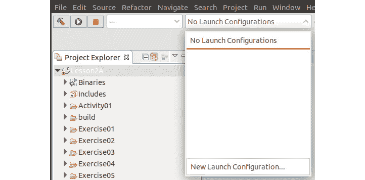

    ###### 图 2A.5:启动配置菜单

    *   点击**新启动配置…** 。保持默认值不变，点击**下一步>T3。***   Change **Name** to **Exercise1** and then click **Search Project**:

    

    ###### 图 2A.6:练习 1 启动配置

    *   从二进制文件窗口显示的程序列表中，单击**练习 1** 并单击**确定**。*   Click **Finish**. This will result in exercise1 being displayed in the Launch Configuration drop-down box:

    

    ###### 图 2A.7:更改启动配置

    *   To run **Exercise1**, click on the **Run** button. Exercise1 will execute and display its output in the console:

    

    ###### 图 2A.8:练习 1 的输出

    这个程序没有任何价值——它只是在你的系统上输出各种类型的大小。但这说明程序是有效的，可以编译。请注意，系统的数字可能不同(尤其是 sizeof(title)值)。

    *   In the **Project Explorer**, expand **Lesson2A**, then **Exercise01**, and double-click on **Exercise1.cpp** to open the file for this exercise in the editor:

    ```cpp
    int main(int argc, char**argv)
    {
        std::cout << "\n\n------ Exercise 1 ------\n";
        int value = 42;     // declare value to be an integer & initialize to 42
        short a_value{64};  // declare a_value to be a short integer & 
                            // initialize to 64
        int bad_idea;       // declare bad_idea to be an integer and DO NOT 
                            // initialize it. Use of this variable before 
                            // setting it is UNDEFINED BEHAVIOUR.
        float pi = 3.1415F; // declare pi to be a single precision floating 
                            // point number and initialize it to pi.

        double e{2.71828};  // declare e to be a double precision floating point
                            // number and initialize it to natural number e.
        auto title = "Sir Robin of Loxley"; 
                            // Let the compiler determine the type
        int ary[15]{};      // array of 15 integers - zero initialized
        // double pi = 3.14159;  // step 24 - remove comment at front
        // auto speed;           // step 25 - remove comment at front
        // value = "Hello world";// step 26 - remove comment at front
        // title = 123456789;    // step 27 - remove comment at front
        // short sh_int{32768};  // step 28 - remove comment at front
        std::cout << "sizeof(int) = " << sizeof(int) << "\n";
        std::cout << "sizeof(short) = " << sizeof(short) << "\n";
        std::cout << "sizeof(float) = " << sizeof(float) << "\n";
        std::cout << "sizeof(double) = " << sizeof(double) << "\n";
        std::cout << "sizeof(title) = " << sizeof(title) << "\n";
        std::cout << "sizeof(ary) = " << sizeof(ary)
                  << " = " << sizeof(ary)/sizeof(ary[0]) 
                  << " * " << sizeof(ary[0]) << "\n";
        std::cout << "Complete.\n";
        return 0;
    }
    ```

    关于前面的程序需要注意的一点是，main 函数的第一条语句实际上是一条可执行语句，而不是声明。C++ 允许你在任何地方声明一个变量。它的前身 C 最初要求所有变量必须在任何可执行语句之前声明。

    #### 最佳实践

    声明一个尽可能接近它将被使用的地方的变量并初始化它。

    *   在编辑器中，通过删除行首的分隔符(`//`)取消标记为`步骤 24`的行的注释:

    ```cpp
    double pi = 3.14159;  // step 24 - remove comment at front    
    // auto speed;           // step 25 - remove comment at front
    // value = "Hello world";// step 26 - remove comment at front
    // title = 123456789;    // step 27 - remove comment at front
    // short sh_int{32768};  // step 28 - remove comment at front
    ```

    *   Click on the **Run** button again. This will cause the program to be built again. This time, the build will fail with an error:

    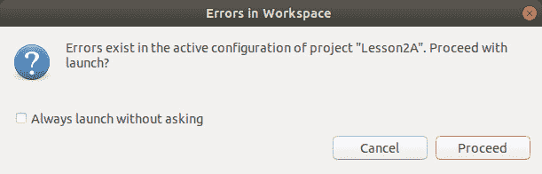

    ###### 图 2A.9:工作空间对话框中的错误

    *   Click on **Cancel** to close the dialog. If **CDT Build Console [Lesson2A]** is not displayed, then select it as the active console:

    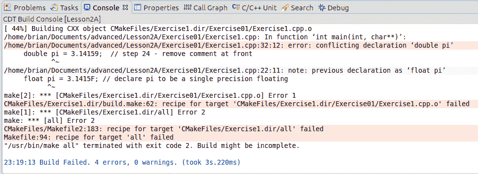

    ###### 图 2A.10:重复声明错误

    这一次，构建失败了，因为我们试图重新定义变量的类型，即 pi。编译器会给出有用的信息，告诉我们需要在哪里进行修复。

    *   将注释分隔符恢复到行首。在编辑器中，通过删除行首的分隔符(//)取消标记为`步骤 25`的行的注释:

    ```cpp
    // double pi = 3.14159;  // step 24 - remove comment at front    
    auto speed;           // step 25 - remove comment at front
    // value = "Hello world";// step 26 - remove comment at front
    // title = 123456789;    // step 27 - remove comment at front
    // short sh_int{32768};  // step 28 - remove comment at front
    ```

    *   Click on the **Run** button again. When the Errors in Workspace dialog appears, click **Cancel**:

    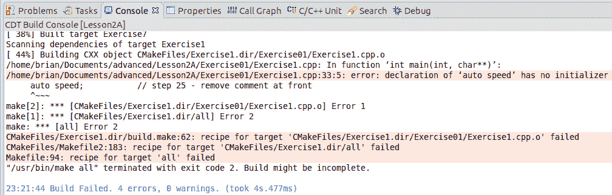

    ###### 图 2A.11:自动声明错误-没有初始化

    同样，构建失败了，但是这一次，我们没有给编译器足够的信息来推断速度的类型——自动类型变量必须被初始化。

    *   将注释分隔符恢复到行首。在编辑器中，通过删除行首的注释起始分隔符(//),取消标记为`步骤 26`的行的注释:

    ```cpp
    // double pi = 3.14159;  // step 24 - remove comment at front    
    // auto speed;           // step 25 - remove comment at front
    value = "Hello world";// step 26 - remove comment at front
    // title = 123456789;    // step 27 - remove comment at front
    // short sh_int{32768};  // step 28 - remove comment at front
    ```

    *   Click on the **Run** button again. When the Errors in Workspace dialog appears, click **Cancel**:

    

    ###### 图 2A.12:将不正确的值类型分配给变量

    这一次，构建失败了，因为我们试图将错误的数据类型，即“Hello world”，它是一个 const char*，分配给 int 类型的变量，即`值`。

    *   将注释分隔符恢复到行首。在编辑器中，取消标记为`的行的注释步骤 27`，方法是删除行首的分隔符(//):

    ```cpp
    // double pi = 3.14159;  // step 24 - remove comment at front    
    // auto speed;           // step 25 - remove comment at front
    // value = "Hello world";// step 26 - remove comment at front
    title = 123456789;    // step 27 - remove comment at front
    // short sh_int{32768};  // step 28 - remove comment at front
    ```

    *   Click on the **Run** button again. When the Errors in Workspace dialog appears, click **Cancel**:

    

    ###### 图 2A.13:将不正确的值类型分配给自动变量

    同样，构建失败是因为我们试图将错误的数据类型，即类型为`int`的 123456789 分配给 title，这是一个`const char*`。这里需要注意的一件非常有用的事情是`标题`是用`自动`类型声明的。编译器生成的错误消息告诉我们标题被推断为`const char*`类型。

    *   将注释分隔符恢复到行首。在编辑器中，通过删除行首的分隔符(//)取消标记为`步骤 28`的行的注释:

    ```cpp
    // double pi = 3.14159;  // step 24 - remove comment at front    
    // auto speed;           // step 25 - remove comment at front
    // value = "Hello world";// step 26 - remove comment at front
    // title = 123456789;    // step 27 - remove comment at front
    short sh_int{32768};  // step 28 - remove comment at front
    ```

    *   Click on the **Run** button again. When the Errors in Workspace dialog appears, click **Cancel**:

    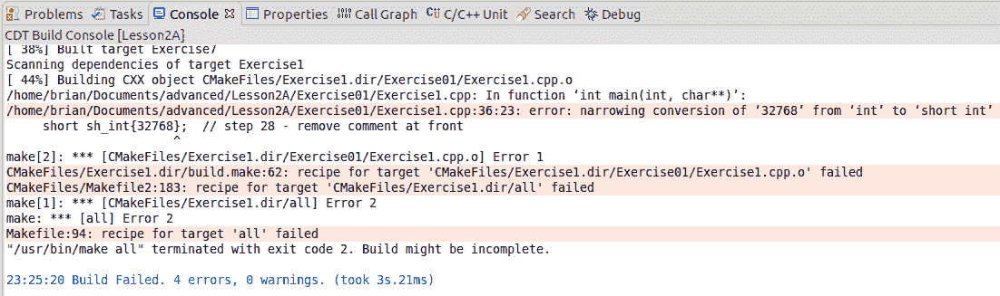

    ###### 图 2A.14:赋值太大而无法放入变量

    同样，构建失败，但这一次是因为我们试图用( **32768** )初始化`sh_int`的值不适合分配给`short`类型的内存。短的占用两个字节的内存，被认为是 16 位的有符号量。这意味着可以短时存储的数值范围是`-2^(16-1)`到`2^(16-1)-1`，或者 **-32768** 到 **32767** 。

    *   将数值从 **32768** 更改为 **32767** ，点击**运行**按钮。这一次，程序编译并运行，因为该值可以用一个`简称`来表示。*   将数值从 **32767** 更改为 **-32768** ，点击**运行**按钮。同样，程序编译并运行，因为该值可以用一个`简称`来表示。*   将注释分隔符恢复到行首。在编辑器中，进行您能想到的任何更改，使用任何基本类型及其关联的文字来探索变量声明，然后根据需要经常单击**运行**按钮。检查生成控制台中的输出是否有任何错误消息，因为这可能有助于您找到错误。**

 **在本练习中，我们学习了如何设置 Eclipse 开发、实现变量声明以及解决声明问题。

## 指定类型–功能

既然我们可以将一个变量声明为某种类型，我们就需要对这些变量做些什么。在 C++ 中，我们通过调用函数来做事情。函数是传递结果的一系列语句。这个结果可以是一个数学计算(例如指数)，然后发送到一个文件或写入一个终端。

函数允许我们将解决方案分解成更容易管理和理解的语句序列。当我们编写这些打包的语句时，我们可以在有意义的地方重用它们。如果我们需要它根据上下文以不同的方式运行，那么我们会传递一个参数。如果它返回一个结果，那么函数需要一个返回类型。

由于 C++ 是一种强类型语言，我们需要指定与我们实现的函数相关的类型——函数返回的值的类型(包括不返回)和传递给它的参数的类型(如果有的话)。

以下是一个典型的 hello world 程序:

```cpp
#include <iostream>
void hello_world()
{
  std::cout << "Hello world\n"; 
}
int main(int argc, char** argv)
{
  std::cout << "Starting program\n";
  hello_world();
  std::cout << "Exiting program\n";
  return 0;
}
```

前面的例子中已经声明了两个函数–`hello _ world()`和`main()`。`main()`函数是所有 C++ 程序的入口点，它返回一个传递给主机系统的`int`值。它被称为出口代码。

从返回类型的声明到左大括号({)的所有内容都被称为**函数原型**。它定义了三件事，即返回类型、函数名以及参数的数量和类型。

对于第一个函数，返回类型为`void`–即不返回值；它的名字是`hello_world`，没有任何争议:


###### 图 2A.15:声明一个不接受参数也不返回任何内容的函数

第二个函数返回一个`int`值，名称为`main`，并接受两个参数。这些参数分别是`argc`和`argv`，并且使`int`和*指针分别指向* `char`类型的指针:


###### 图 2A.16:接受两个参数并返回一个整数的函数的声明

功能原型之后的一切被称为**功能体**。函数体包含变量声明和要执行的语句。

函数必须在使用前声明，也就是说，编译器需要知道它的参数和返回类型。如果函数是在文件中定义的，并且在调用该函数后将在该文件中使用该函数，则可以通过在使用该函数之前提供该函数的前向声明来解决这个问题。

前向声明是通过在调用函数原型之前将以分号结束的函数原型放入文件中来实现的。对于`hello_world()`，这将按如下方式完成:

```cpp
void hello_world();
```

对于主要功能，这将按如下方式完成:

```cpp
int main(int, char**);
```

函数原型不需要参数的名称，只需要类型。但是，为了帮助该功能的用户，保留它们是一个好主意。

在 C++ 中，函数的定义可以在一个文件中，需要从不同的文件中调用。那么，第二个文件如何知道它希望调用的函数的原型呢？这是通过将正向声明放入一个单独的文件(称为头文件)并将其包含在第二个文件中来实现的。

### 练习 2:声明函数

在本练习中，我们将测试编译器在遇到函数调用并实现前向声明以解析未知函数时需要知道什么。我们开始吧。

1.  在 Eclipse 中打开**第 2 课**项目，然后在**项目浏览器**中，展开**第 2 课**，然后展开**练习 02** ，双击**练习 2.cpp** 将本练习的文件打开到编辑器中。
2.  点击**启动配置**下拉菜单，选择**新启动配置……**。
3.  将**练习 2** 配置为以**练习 2** 的名称运行。完成后，它将是当前选定的启动配置。
4.  Click on the **Run** button. Exercise 2 will run and produce the following output:

    

    ###### 图 2A.17:练习 2 程序的输出

5.  进入编辑器，通过移动`gcd`功能更改代码，使其位于`主`之后。应该是这样的:

    ```cpp
    int main(int argc, char**argv)
    {
        std::cout << "\n\n------ Exercise 2 ------\n";
        std::cout << "The greatest common divisor of 44 and 121 is " << gcd(44, 121) << "\n";
        std::cout << "Complete.\n";
        return 0;
    }
    int gcd(int x, int y)
    {
        while(y!=0)
        {
            auto c{x%y};
            x = y;
            y = c;
        }
        return x;
    }
    ```

6.  Click on the **Run** button again. When the Errors in Workspace dialog appears, click **Cancel**. In the **CDT Build Console [Lesson2A]**, we will see the reason for the failure:

    

    ###### 图 2A.18:由于未定义的功能导致的构建失败

    这一次，编译器不知道如何处理对`gcd()`函数的调用。它在需要调用函数的时候并不知道这个函数，即使它是在同一个文件中定义的，但是在调用之后。

7.  在编辑器中，将 forward 声明放在主函数定义之前。还要加一个分号(；)结尾:

    ```cpp
    int gcd(int x, int y);
    ```

8.  再次点击**运行**按钮。这一次，程序编译并恢复原始输出。

在本练习中，我们学习了如何转发声明函数，以及如何解决在使用函数之前未声明函数时出现的编译器错误。

在早期版本的 C 编译器中，这是可以接受的。程序会假设该函数存在，并返回一个 int。函数的参数可以从调用中推断出来。然而，在现代 C++ 的情况下，这是不正确的，因为在使用它之前，您必须声明一个函数、类、变量等等。在下一节中，我们将学习指针类型。

### 指针类型

因为它起源于 C 语言，也就是说，编写最佳效率的系统并直接访问硬件，C++ 允许您将变量声明为指针类型。它的格式如下:

```cpp
type-specifier* pvar = &var;
```

这和以前一样，除了两件事:

*   使用特殊声明符星号(`*`)来指示名为 pvar 的变量指向内存中的位置或地址。
*   它使用特殊运算符&符号( **&** )进行初始化，在这种情况下，它告诉编译器返回 **var** 变量的地址。

由于 C 是一种高级语言，但具有低级访问，指针允许用户直接访问内存，这在我们希望向硬件提供输入/输出并因此控制它时很有帮助。指针的另一个用途是允许向函数提供对公共数据项的访问，并消除调用函数时复制大量数据的需要，因为它默认为按值传递。要访问指针所指向的值，特殊运算符星号(`*`)用于**取消引用**位置:

```cpp
int five = 5;                // declare five and initialize it
int *pvalue = &five;         // declare pvalue as pointer to int and have it
                            // point to the location of five
*pvalue = 6;                // Assign 6 into the location five.
```

下图显示了编译器如何分配内存。`值`需要内存存储指针，而`五`需要内存存储整数值 5:


###### 图 2A.19:指针变量的内存布局

当通过指针访问用户定义的类型时，还有第二个特殊运算符(-->)也用于对成员变量和函数进行解引用。在现代 C++ 中，这些指针被称为**原始指针**，它们的使用方式发生了显著变化。在 C 和 C++ 中使用指针对程序员来说一直是一个挑战，它们的不正确使用是许多问题的根源，最常见的是资源泄漏。资源泄漏是指程序获取了一个资源(内存、文件句柄或其他系统资源)供其使用，但在使用完毕后未能释放的情况。这些资源泄漏会导致性能问题、程序故障，甚至系统崩溃。在现代 C++ 中使用原始指针来管理资源的所有权现在已经被否决了，因为智能指针出现在 C++ 11 中。智能指针(在 STL 中实现为类)现在做了在您的主机系统中成为一个好公民所需的家务。更多相关内容将在*第三章*、*能与应之间的距离-对象、指针和继承*中介绍。

在前面的代码中，当`值`被声明时，编译器分配内存只存储它将要引用的内存的地址。像其他变量一样，您应该始终确保在使用指针之前对其进行初始化，因为取消对未初始化指针的引用会导致未定义的行为。究竟分配了多少内存来存储指针取决于编译器设计的系统和处理器支持的位数。但是所有指针的大小都是一样的，不管它们指向什么类型。

指针也可以传递给函数。这允许函数访问被指向的数据，并可能对其进行修改。考虑 swap 的以下实现:

```cpp
void swap(int* data1, int* data2)
{
    int temp{*data1};         // Initialize temp from value pointed to by data1
    *data1 = *data2;          // Copy data pointed to by data2 into location 
                              // pointed to by data1
    *data2 = temp;            // Store the temporarily cached value from temp
                              // into the location pointed to by data2
}
```

这展示了如何将指针声明为函数的参数，如何使用解引用操作符`*`从指针中获取值，以及如何通过解引用操作符设置值。

以下示例使用新运算符从主机系统分配内存，并使用删除运算符将其释放回主机系统:

```cpp
char* name = new char[20];    // Allocate 20 chars worth of memory and assign it
                              // to name.
  Do something with name
delete [] name;
```

在前面的代码中，第一行使用新运算符的数组分配形式创建了一个 20 个字符的数组。它调用主机系统来分配 20 * sizeof(char)字节的内存供我们使用。具体分配多少内存由主机系统决定，但保证至少为 20 * sizeof(char)字节。如果它无法分配所需的内存，则会发生以下两种情况之一:

*   它将引发异常
*   它将返回`nullptr`。这是 C++ 11 中引入的一个特殊文字。早期，C++ 使用 0 或空值来表示无效指针。C++ 11 也使它成为强类型值。

在大多数系统中，第一个结果将是结果，您需要处理异常。第二种结果可能来自两种情况——调用 new 的 northrow 变体，即`new(STD::northrow)int[250]`，或者在异常处理开销没有足够确定性的嵌入式系统上。

最后，请注意，对 delete 的调用使用了 delete 运算符的数组形式，即带有方括号[]。确保新的和删除操作符使用相同的形式非常重要。当在用户定义的类型上使用 new 时(这将在下一节中讨论)，它不仅仅是分配内存:

```cpp
MyClass* object = new MyClass;
```

在前面的代码中，对 new 的调用分配了足够的内存来存储 MyClass，如果成功，它将继续调用构造函数来初始化数据:

```cpp
MyClass* objects = new MyClass[12];
```

在前面的代码中，对 new 的调用分配了足够的内存来存储 MyClass 的 12 个副本，如果成功，它将继续调用构造函数 12 次来初始化每个对象的数据。

请注意，在前面的代码片段中声明的`对象`和`对象`具有相同类型的**。严格来说，`对象`应该是指向 MyClass 数组的指针，但实际上是指向 MyClass 实例的指针。`对象`指向 MyClass 数组中的第一个实例。**

 **考虑以下代码摘录:

```cpp
void printMyClasses(MyClass* objects, size_t number)
{
  for( auto i{0U} ; i<number ; i++ ) { 
    std::cout << objects[i] << "\n";
  }
}
void process()
{
    MyClass objects[12];

    // Do something with objects
    printMyClasses(objects, sizeof(objects)/sizeof(MyClass));
}
```

在 process()函数中，`对象`属于“12 个 MyClass 项的数组”类型，但是当它被传递到`printMyClasses()`时，它被(编译器)转换为“指向 MyClass 的指针”类型。这是设计造成的(继承自 C)，被称为**数组衰减**，可能是新程序员出错的原因。我们可以尝试声明`printMyClasses()`如下:

```cpp
void printMyClasses(MyClass objects[12], size_t number)
```

当编译器将参数对象更改为 MyClass*时，这仍然会受到数组衰减的影响；在这种情况下，它不保留尺寸信息。数组衰减的原因是我们需要将数字传递给`printMyClasses()`函数:这样我们就知道数组中有多少项了。C++ 提供了两种处理数组衰减的机制:

*   Use of iterators to pass a range into the method. STL containers (see the *C++ Pre-Packaged Templates* section in *Chapter 2B*, *No Ducks Allowed – Templates and Deduction*) offer the `begin()` and `end()` methods so that we can obtain iterators that allow algorithms to traverse an array or part thereof.

    #### 注意

    对于 C++ 20，国际标准化组织标准委员会正在考虑包含一个被称为范围的概念，它允许在一个对象中捕获开始和结束迭代器。

*   模板的使用(参见 2B*章节中的*非类型模板参数*部分，不允许鸭子-模板和演绎*)。

### 练习 3:声明和使用指针

在本练习中，我们将实现以指针和数组为参数的函数，并在考虑数组衰减的同时比较它们的行为。让我们开始吧:

1.  在 Eclipse 中打开**第 2 课**项目，然后在项目浏览器中展开**第 2 课**，然后展开**练习 03** ，双击**练习 3.cpp** 将本练习的文件打开到编辑器中。
2.  点击**启动配置**下拉菜单，选择**新启动配置……**。将**练习 3** 配置为以**练习 3** 的名称运行。完成后，它将是当前选定的启动配置。
3.  Click on the **Run** button. Exercise 3 will run and produce the following output:

    

    ###### 图 2A.20:练习 3 的输出

4.  在编辑器中，在某处插入一个空行，点击**运行**按钮。(通过更改文件，它将强制构建系统重新编译**练习 3.cpp** 。)
5.  If we now look at the **CDT Global Build Console**, we will see two warnings from the compiler:

    

    ###### 图 2A.21:练习 3 编译器警告

    前面的截图没有显示完整的警告消息。对于这里使用的 gcc 编译器，完整的警告如下:

    ```cpp
    exercise3.cpp:22:45: warning: 'sizeof' on array function parameter 'ary' will return size of 'int*' [-Wsizeof-array-argument].
    ```

    该警告为我们提供了有关导致该问题的声明的更多信息。它可以追溯到以下函数:

    ```cpp
    void print_array_size2(int ary[10])
    {
        std::cout << "---print_array_size2---\n";
        std::cout << "sizeof(ary) = " << sizeof(ary) << "\n";
        std::cout << "elements in (ary) = " << sizeof(ary)/sizeof(ary[0]) << "\n";
    }
    ```

    在这里，我们可以看到一个数组衰减的例子——实际上，**意外的数组衰减**。自从 C 语言时代以来，数组和指针(几乎)是可以互换的。因此，就编译器而言，传递给`print_array_size2()`的参数属于`int*`类型，并且由声明 sizeof `将返回“int *”`大小的警告所证实:

    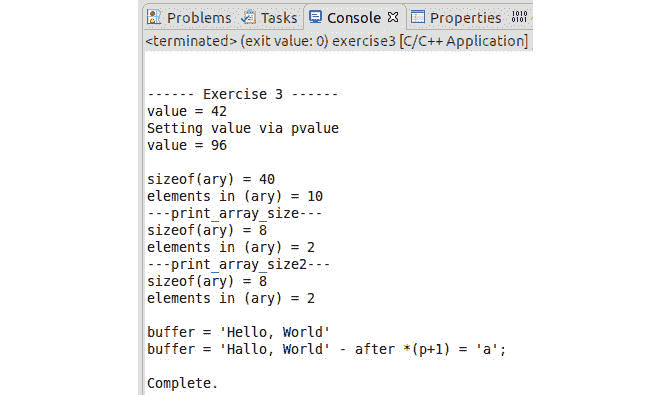

    ###### 图 2A.22:练习 3 部分输出

    **sizeof(ary)/sizeof(arg[0])**计算应返回数组中的元素数量。(ary) = 10 中的第一个**元素是从主函数生成的，并且 ary 被声明为**ary【10】**，因此是正确的。- print_array_size2 -横幅下的**元素显示了数组衰减的问题以及编译器生成警告的原因。为什么值为 2？在测试 PC 上，一个指针占用 8 个字节(64 位)，而一个 int 只占用 4 个字节，所以我们得到 8/4 = 2。****

6.  在编辑器中，找到 main()中声明 ary 的行，并将其更改为以下内容:

    ```cpp
    int ary[15]{};
    ```

7.  Click on the **Run** button. If you examine the **CDT Global Build Console**, you will see that the number of errors is still the same. This is another symptom of array decay. Let's say we're given the following function prototype:

    ```cpp
    void print_array_size2(int ary[10])
    ```

    由于参数原型不匹配，您可能会认为尝试传递`int ary[15]`会导致错误或至少是警告。如前所述，编译器将该参数视为`整数`，因此该函数也可以声明如下:

    ```cpp
    void print_array_size2(int* ary)
    ```

8.  In the editor, change the name of `print_array_size2` to `print_array_size` all through the file. Click on the **Run** button. When the Errors in Workspace dialog appears, click **Cancel**. Open the **CDT Global Build Console** and examine the error message:

    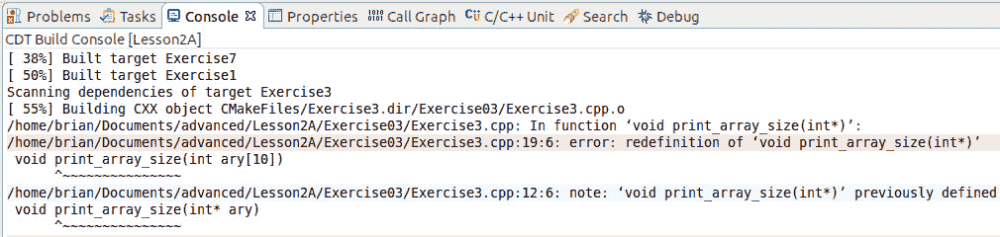

    ###### 图 2A.23:重定义错误

    这一次，编译器生成了一个指向两个 print_array_size 方法的重定义错误，这两个方法似乎具有不同的参数类型–`int * ary`和`int【10】`。这是一种确认，当用作函数的参数时，`int ary[10]`生成的结果与声明`int*` ary 时的结果相同。

9.  将文件恢复到其原始状态。
10.  In the `main()` function, locate the line with `Step 11` in a comment and remove the comment at the beginning of the line. Click on the **Run** button. When the Errors in Workspace dialog appears, click **Cancel**. Open the **CDT Global Build Console** and examine the error message:

    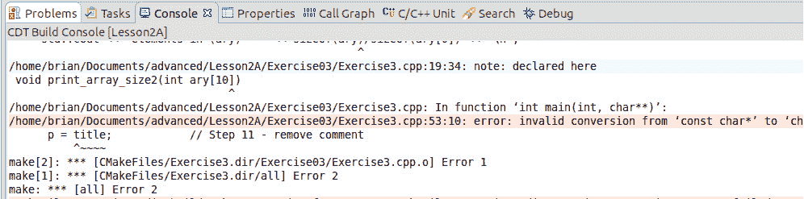

    ###### 图 2A.24:重定义错误

    完整的错误消息如下:

    ```cpp
    exercise3.cpp:53:9: error: invalid conversion from 'const char*' to 'char*' [-fpermissive]
    ```

    出现这种情况是因为编译器将标题**的类型确定为**常量字符*** 和类型**字符*** 的 p。恒量很重要。p 指针允许我们改变它所指向的值。**

11.  Take a look at the following line:

    ```cpp
    p = title; 
    ```

    将其更改为以下内容:

    ```cpp
    title = p;
    ```

12.  点击**运行**按钮。这一次，它可以正常构建和运行。将非常量指针分配给常量指针是可以的。

在本练习中，我们了解到，在将数组传递给函数时需要谨慎对待，因为关键信息(数组的大小)将在调用中丢失。

## 创建用户类型

C++ 的伟大之处在于，您可以使用 **struct** 、 **class** 、 **enum** 或 **union** 创建自己的类型，编译器会在整个代码中将它视为基本类型。在本节中，我们将探索创建我们自己的类型和我们需要编写来操作它的方法，以及编译器将为我们创建的一些方法。

### 枚举

最简单的用户定义类型是枚举。枚举在 C++ 11 中得到了彻底的修改，使它们更加类型安全，所以我们必须考虑两种不同的声明语法。在我们看如何声明它们之前，让我们弄清楚为什么我们需要它们。考虑以下代码:

```cpp
int check_file(const char* name)
{
  FILE* fptr{fopen(name,"r")};
  if ( fptr == nullptr)
    return -1;
  char buffer[120];
  auto numberRead = fread(buffer, 1, 30, fptr);
  fclose(fptr);
  if (numberRead != 30)
    return -2;
  if(is_valid(buffer))
    return -3;
  return 0;
}
```

这是许多 C 库函数的典型情况，其中返回了一个状态代码，您需要主页面来了解它们的含义。在前面的代码中，`-1`、`-2`、`-3`、`0`被称为**幻数**。你需要阅读代码来理解每个数字的含义。现在，考虑以下版本的代码:

```cpp
FileCheckStatus check_file(const char* name)
{
  FILE* fptr{fopen(name,"r")};
  if ( fptr == nullptr)
    return FileCheckStatus::NotFound;
  char buffer[30];
  auto numberRead = fread(buffer, 1, 30, fptr);
  fclose(fptr);
  if (numberRead != 30)
    return FileCheckStatus::IncorrectSize;
  if(is_valid(buffer))
    return FileCheckStatus::InvalidContents;
  return FileCheckStatus::Good;
}
```

这使用枚举类来传递结果，并将含义附加到值的名称上。函数的用户现在可以使用枚举，因为代码更容易理解和使用。因此，神奇的数字(与状态相关)已经被一个具有描述性标题的枚举值所取代。让我们通过参考以下代码来了解`文件检查状态`的声明:

```cpp
enum FileCheckStatus             // Old-style enum declaration
{
  Good,                         // = 0 - Value defaults to 0
  NotFound,                     // = 1 - Value set to one more than previous
  IncorrectSize,                // = 2 - Value set to one more than previous
  InvalidContents,              // = 3 - Value set to one more than previous
};
```

如果我们想使用神奇数字的值，那么我们可以这样声明它们:

```cpp
enum FileCheckStatus             // Old-style enum declaration
{
  Good = 0, 
  NotFound = -1,
  IncorrectSize = -2,
  InvalidContents = -3,
};
```

或者，通过颠倒顺序，我们可以设置第一个值，编译器将执行其余操作:

```cpp
enum FileCheckStatus             // Old-style enum declaration
{
  InvalidContents = -3,          // Force to -3
  IncorrectSize,                 // set to -2(=-3+1)
  NotFound,                      // Set to -1(=-2+1)
  Good,                          // Set to  0(=-1+1)
};
```

前面的函数也可以写成如下形式:

```cpp
FileCheckStatus check_file(const char* name)
{
  FILE* fptr{fopen(name,"r")};
  if ( fptr == nullptr)
    return NotFound;
  char buffer[30];
  auto numberRead = fread(buffer, 1, 30, fptr);
  fclose(fptr);
  if (numberRead != 30)
    return IncorrectSize;
  if(is_valid(buffer))
    return InvalidContents;
  return Good;
}
```

请注意，代码中缺少作用域指令`FileCheckStatus::`，但它仍然会编译并工作。这就提出了范围的问题，我们将在后面的*章节【2B】**不允许鸭子入内-模板和推导*的*可见性、寿命和访问*部分详细讨论。现在，要知道每个类型和变量都有一个作用域，旧式枚举的问题是它们的枚举数被添加到与枚举相同的作用域中。假设我们有两个定义如下的枚举:

```cpp
enum Result 
{
    Pass,
    Fail,
    Unknown,
};
enum Option
{
    Keep,
    Discard,
    Pass,
    Play
};
```

我们现在有一个问题，其中`Pass`枚举器被定义了两次，并且有两个不同的值。旧式枚举还允许我们编写有效的编译器，但显然是无意义的代码，例如:

```cpp
Option option{Keep};
Result result{Unknown};
if (option == result)
{
    // Do something
}
```

当我们试图开发意图清晰且易于理解的代码时，将结果与选项进行比较没有任何意义。问题在于，编译器会隐式地将该值转换为整数，从而能够进行比较。

C++ 11 引入了一个新概念，称为**枚举类**或**范围枚举**。前面代码的作用域枚举定义如下:

```cpp
enum class Result 
{
    Pass,
    Fail,
    Unknown,
};
enum class Option
{
    Keep,
    Discard,
    Pass,
    Play
};
```

这意味着前面的代码将不再编译:

```cpp
Option option{Keep};          // error: must use scope specifier Option::Keep
Result result{Unknown};       // error: must use scope specifier Result::Unknown
if (option == result)         // error: can no longer compare the different types
{
    // Do something
}
```

顾名思义，**作用域枚举**将枚举器放在枚举名称的作用域内。此外，作用域枚举将不再隐式转换为整数(因此 if 语句将无法编译)。您仍然可以将枚举数转换为整数，但是您需要强制转换它:

```cpp
int value = static_cast<int>(Option::Play);
```

### 练习 4:枚举-新旧学校

在本练习中，我们将实现一个程序，该程序使用枚举来表示预定义的值，并确定当它们被更改为限定范围的枚举时所需的相应更改。让我们开始吧:

1.  在 Eclipse 中打开**第 2 课**项目，然后在**项目浏览器**中，展开**第 2 课**，然后展开**练习 04** ，双击**练习 4.cpp** 在编辑器中打开本练习的文件。
2.  点击**启动配置**下拉菜单，选择**新启动配置……**。将**练习 4** 配置为使用名称**练习 4** 运行。
3.  完成后，它将是当前选定的启动配置。
4.  Click on the **Run** button. Exercise 4 will run and produce the following output:

    

    ###### 图 2A.25:练习 4 输出

5.  在编辑器中检查代码。目前，我们可以比较苹果和橘子。在`printOrange()`的定义中，将参数更改为`Orange` :

    ```cpp
    void printOrange(Orange orange)
    ```

6.  Click on the **Run** button. When the Errors in Workspace dialog appears, click **Cancel**:

    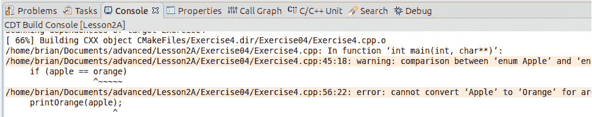

    ###### 图 2A.26:无法转换错误

    通过改变参数类型，我们迫使编译器强制执行传递给函数的值的类型。

7.  Call the `printOrange()` function twice by passing the `orange` `enum` variable in the initial call and the `apple` variable in the second call, respectively:

    ```cpp
    printOrange(orange);
    printOrange(apple);
    ```

    这表明编译器正在隐式地将橙色和苹果转换成一个`int`，以便它可以调用该函数。另外，注意关于比较`苹果`和`橙`的警告。

8.  通过取一个 int 参数并将`orange` `枚举`的定义更改为以下值来恢复`printOrange()`功能:

    ```cpp
    enum class Orange;
    ```

9.  Click on the **Run** button. When the Errors in Workspace dialog appears, click **Cancel**:

    

    ###### 图 2A.27:作用域枚举更改的多个错误

10.  Locate the first error listed for this build:

    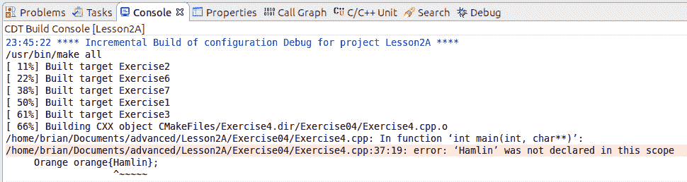

    ###### 图 2A.28:第一个作用域枚举错误

11.  关于作用域枚举，首先要注意的是，当引用枚举器时，它们必须有一个作用域说明符。因此，在编辑器中，转到并将这一行更改为以下内容:

    ```cpp
    Orange orange{Orange::Hamlin};
    ```

12.  Click on the **Run** button. When the Errors in Workspace dialog appears, click **Cancel**. Good news – the error count dropped to 8 from 9\. Check the errors in the console and locate the first one:

    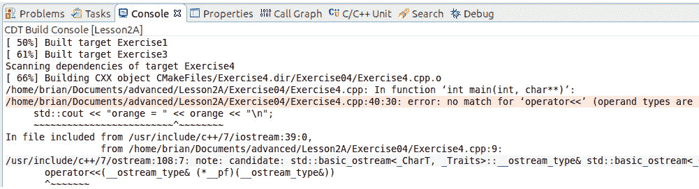

    ###### 图 2A.29:第二个作用域枚举错误

    此错误报告无法找到插入运算符(<橙色类型。因为这涉及到一个基于模板的类(我们将在后面讨论)，所以错误消息变得非常冗长。花一分钟时间查看从这个错误到下一个错误(红线)出现的所有消息。它向您展示了编译器试图做什么来编译那一行。

13.  将指示行改为如下:

    ```cpp
    std::cout << "orange = " << static_cast<int>(orange) << "\n";
    ```

14.  Click on the **Run** button. When the Errors in Workspace dialog appears, click **Cancel**. Good news – the error count dropped to 6 from 8\. Check the errors in the console and locate the first one:

    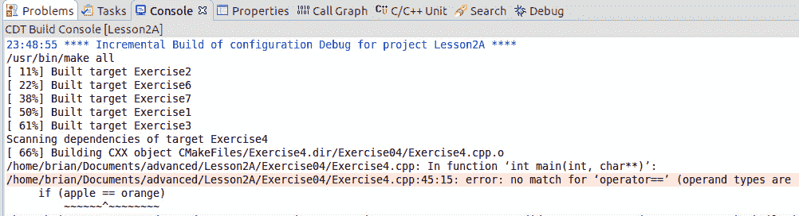

    ###### 图 2A.30:第三范围枚举错误

    这个错误报告(最后)你不能比较苹果和橘子。在这一点上，我们认为程序试图做一些没有意义的事情，没有必要试图修复其余的事情。我们可以通过再次将它转换为 int 来修复这个错误，但是我们也需要为下一个错误进行转换。最后一个错误是巴伦西亚缺少`Orange::`范围说明符。

15.  留给你一个练习，让文件以`橙色`作为范围枚举再次编译。

在本练习中，我们发现范围枚举改进了 C++ 的强类型检查，如果我们希望将它们用作整数值，那么我们需要强制转换它们，这与隐式转换的非范围枚举不同。

#### 编译器错误疑难解答

从前面的练习中可以看出，编译器可以从一个错误中生成大量的错误和警告消息。这就是为什么建议先找到第一个错误并先修复它。在 IDEs 中开发或使用带有颜色代码错误的构建系统可以使这变得更容易。

### 结构和类别

枚举是用户定义类型中的第一种，但它们并没有真正扩展语言，以便我们能够在适当的抽象级别上表达问题的解决方案。然而，结构和类允许我们捕获和分组数据，然后关联方法以一致和有意义的方式操作数据。

如果我们考虑两个矩阵的乘法， *A (m x n)* 和 *B (n x p)* ，从而得到矩阵 *C (m x p)* ，那么 C 的第 I 行和第 jth 列的等式如下:


###### 图 2A.31:第 1 行和第 2 列的方程

如果我们每次想要乘两个矩阵时都要写它，我们最终会得到许多嵌套的 for 循环。但是如果我们可以把一个矩阵抽象成一个类，那么我们可以把它简单地表达为两个整数或两个浮点数的乘积:

```cpp
Matrix a;
Matrix b;
// Code to initialize the matrices
auto c = a * b;
```

这就是面向对象设计的美妙之处——数据封装和概念的抽象被解释得如此之深，以至于我们可以很容易地理解程序试图实现什么，而不会被细节所掩盖。一旦我们确定矩阵乘法被正确实现，那么我们就可以自由地专注于在更高的层次上解决我们的问题。

下面的讨论涉及到类，但它同样适用于结构，并且主要适用于联合。在我们学习如何定义和使用类之后，我们将概述类、结构和联合之间的区别。

### 分数等级

为了向您展示如何定义和使用类，我们将开发`分数`类来实现有理数。定义后，我们可以像使用任何其他内置类型(加、减、乘、除)一样使用`分数`，而不用担心细节——这是抽象。我们现在可以在更高的层次上思考和推理一个分数，也就是抽象的层次。

`分数`类将执行以下操作:

*   包含两个整数成员变量，`m _ 分子`和`m _ 分母`
*   提供复制自身、分配给自身、乘法、除法、加法和减法的方法
*   提供写入输出流的方法

为了实现上述目标，我们有以下定义:


###### 图 2A.32:操作的定义

此外，我们执行的操作将需要通过将其减少到最低项来标准化分数。为此，分子和分母都要除以它们的最大公约数(GCD)。

### 构造函数、初始化和析构函数

用 C++ 代码表示的类定义是用于在内存中创建对象和通过对象的方法操作对象的模式。我们需要做的第一件事是告诉编译器我们希望声明一个新的类型——类。要声明`分数`类，我们从以下内容开始:

```cpp
class Fraction
{
};
```

我们将它放在头文件 **Fraction.h** 中，因为我们希望在代码的其他区域重用这个类规范。

接下来我们需要做的是引入要存储在类中的数据，在这种情况下是`m _ 分子`和`m _ 分母`。它们都是 int 类型的:

```cpp
class Fraction
{
  int m_numerator;
  int m_denominator;
};
```

我们现在已经声明了要存储的数据，并给它们起了一个名字，熟悉数学的人都会理解每个成员变量存储了什么:


###### 图 2A.33:分数公式

由于这是一个类，默认情况下，任何声明的项目都被认为是`私有的`。这意味着没有外部实体可以访问这些变量。正是这种隐藏(使数据私有，就此而言，一些方法)的特性使得 C++ 中的封装成为可能。C++ 有三个类访问修饰符:

*   **public** :这意味着成员(变量或函数)可以从类外的任何地方访问。
*   **private** :这意味着不能从类外访问成员(变量或函数)。事实上，它甚至不能被查看。私有变量和函数只能从类内部或通过友元方法或类来访问。公共函数使用私有成员(变量和函数)来实现所需的功能。
*   **受保护**:这是公私交叉。从类外部来看，变量或函数是私有的。但是，对于从声明受保护成员的类派生的任何类，它们都被视为公共的。

在我们对类的定义中，这一点不是很有用。让我们将声明更改为以下内容:

```cpp
class Fraction
{
public:
  int m_numerator;
  int m_denominator;
};
```

通过这样做，我们可以访问内部变量。`分数；`变量声明会导致编译器做两件事:

*   分配足够的内存来保存两个数据项(取决于类型，这可能涉及填充，也可能不涉及填充，即包含或添加未使用的内存来对齐成员以实现最有效的访问)。运算符的**size 可以告诉我们为我们的类分配了多少内存。**
*   通过调用**默认构造函数**初始化数据项。

这些步骤与编译器对内置类型所做的相同，也就是说，步骤 2 什么也不做，导致变量未初始化。但是这个默认构造函数是什么呢？它是做什么的？

首先，默认构造函数是一个特殊的成员函数。它是许多可能的构造函数之一，其中三个被认为是特殊成员函数。构造函数可以用零个、一个或多个参数来声明，就像任何其他函数一样，但是它们不指定返回类型。构造函数的特殊用途是初始化所有成员变量，以将对象置于定义良好的状态。如果成员变量本身是一个类，那么可能没有必要指定如何初始化变量。如果成员变量是内置类型，那么我们需要为它们提供初始值。

### 类特殊成员函数

当我们定义一个新类型(结构或类)时，编译器将为我们创建多达六(6)个特殊成员函数:

*   **默认构造函数** ( `分数::分数()`):当没有提供参数时调用(如前一节)。这可以通过没有构造函数的参数列表或定义所有参数的默认值来实现，例如`分数(int 分子=0，分母=1)`。编译器提供了一个`隐式` `内联`默认构造函数来执行成员变量的默认初始化——对于内置类型，这意味着什么也不做。
*   **析构函数** ( `分数::~分数()`):这是一个特殊的成员函数，在对象生命周期结束时调用。其目的是释放对象在其生存期内分配和保留的任何资源。编译器提供了一个`公共` `内联`成员函数，调用成员变量的析构函数。
*   **复制构造函数** ( `分数::分数(const Fraction & )`):这是另一个构造函数，其中第一个参数是`分数&`的一种形式，没有其他参数，或者其余参数都有默认值。第一个参数的形式是`分数&`、`常量分数&`、`挥发性分数&`或`常量挥发性分数&`中的一种。我们稍后会处理`const`，但不会处理本书中的`volatile`。编译器提供了一个`非显式` `公共` `内联`成员函数，通常采用`Fraction::Fraction(const Fraction&)`的形式，按照初始化的顺序复制每个成员变量。
*   **复制赋值** ( **分数&分数::运算符=(分数& )** ):这是一个名为**运算符=** 的成员函数，第一个参数是一个值或类的任何引用类型，在本例中为**分数**、**分数&** 、**常量分数&** 、**挥发分数&** 或**编译器提供了一个**公共** **内联**成员函数，通常采用**Fraction::Fraction(const Fraction&)**的形式，按照初始化的顺序复制每个成员变量。**
*   **Move Constructor**(`Fraction::Fraction(Fraction&&)`):这是 C++ 11 中引入的一种新型构造函数，其中第一个参数是`Fraction & &`的一种形式，没有其他参数，或者其余参数都有默认值。第一个参数的形式是`分数& &`、`常量分数& &`、`挥发分& &`或`常量挥发分& &`中的一种。编译器提供了一个`非显式` `公共` `内联`成员函数，通常采用`Fraction::Fraction(Fraction&&)`的形式，按照初始化的顺序移动每个成员变量。
*   **移动赋值** ( `分数&分数::运算符=(分数& & )`):这是 C++ 11 中引入的一种新型赋值运算符，是一个名为`运算符=`的成员函数，第一个参数是移动构造函数允许的任何形式。编译器提供一个`公共` `内联`成员函数，通常采用`Fraction::Fraction(Fraction&&)`的形式，按照初始化的顺序复制每个成员变量。

除了默认构造函数之外，这些函数处理管理这个类所拥有的资源——也就是说，如何复制/移动它们以及如何处置它们。另一方面，默认构造函数更像任何其他接受值的构造函数——它只初始化资源。

我们可以声明这些特殊函数中的任何一个，强制它们默认(也就是说，让编译器生成默认版本)，或者强制它们不被创建。在其他特殊函数存在的情况下，也有关于何时自动生成这些函数的规则。前四个函数在概念上相对简单，但是两个“移动”特殊成员函数需要一些额外的解释。我们将在*第 3 章*、*能够和应该之间的距离——对象、指针和继承*中详细讨论所谓的移动语义，但目前它本质上是它所指示的——它将某物从一个对象移动到另一个对象。

### 隐式与显式构造函数

前面的描述讨论了编译器生成隐式或非显式构造函数。如果存在可以用一个参数调用的构造函数，例如复制构造函数或移动构造函数，默认情况下，允许编译器在必要时调用它，以便它可以将其从一种类型转换为另一种类型，从而允许对表达式、函数调用或赋值进行编码。这并不总是一个期望的行为，我们可能希望防止隐式转换，并确保如果我们类的用户真的想要转换，那么他们必须在程序中写出来。为此，我们在构造函数的声明前加上`显式的`关键字，如下所示:

```cpp
explicit Fraction(int numerator, int denominator = 1);
```

显式关键字也可以应用于其他运算符，编译器可以将其用于类型转换。

### 类特殊成员函数–编译器生成规则

首先，如果我们声明任何其他形式的构造函数——默认、复制、移动或用户定义，将不会生成`默认构造函数`。其他特殊成员函数都不会影响其生成。

其次，声明析构函数就不会产生`析构函数`。其他特殊成员函数都不会影响其生成。

其他四个特殊函数的生成取决于析构函数或其他特殊函数之一的声明，如下表所示:

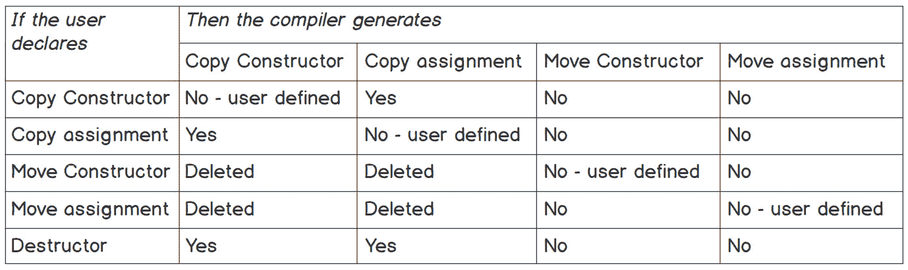

###### 图 2A.34:特殊成员函数生成规则

### 默认和删除特殊成员功能

在 C++ 11 之前，如果我们想防止使用复制构造函数或复制赋值成员函数，那么我们必须将函数声明为私有的，并且不提供函数的定义:

```cpp
class Fraction
{
public:
  Fraction();
private:
  Fraction(const Fraction&);
  Fraction& operator=(const Fraction&);
};
```

通过这种方式，我们确保了如果有人试图从类外部访问复制构造函数或复制赋值，那么编译器会生成一个错误，指出该函数不可访问。这仍然声明了函数，并且它们可以从类中访问。取消这些特殊的成员功能是一种有效的手段，但并不完美。

但是我们可以做得更好，因为 C++ 11 引入了两种新的声明形式，允许我们覆盖编译器的默认行为，如前面的规则中所定义的。

首先，我们可以通过用`= delete`后缀声明方法来强制编译器不生成方法，如下所示:

```cpp
Fraction(const Fraction&) = delete;
```

#### 注意

如果不使用参数，我们可以省略它的名称。任何函数或成员函数都是如此。事实上，根据为编译器设置的警告级别，它甚至可能会生成一个警告，指出没有使用该参数。

或者，我们可以使用`= default`后缀强制编译器生成其特殊成员函数的默认实现，如下所示:

```cpp
Fraction(const Fraction&) = default;
```

如果这只是函数的声明，那么我们也可以省略参数的名称。尽管如此，良好的实践要求我们应该命名参数以指示其用途。这样，我们类的用户就不需要查看调用函数的实现。

#### 注意

使用默认后缀声明一个特殊的成员函数被认为是用户定义的成员函数。

### 三/五法则和零法则

正如我们之前讨论的，除了默认构造函数之外，特殊成员函数处理管理这个类所拥有的资源的语义——即如何复制/移动它们以及如何处置它们。这导致了 C++ 社区中关于处理特殊函数的两条“规则”。

在 C++ 11 之前，有三的**规则，处理复制构造函数、复制赋值运算符和析构函数。它基本上声明我们需要实现这些方法中的一个，因为封装资源的管理并不简单。**

随着 C++ 11 中移动构造函数和移动赋值操作符的引入，这个规则扩展到了五的**规则。规则的本质没有改变。简单来说，特殊成员函数的数量增加到了五个。记住编译器生成的规则，还有一个额外的原因来确保所有五个特殊方法都被实现(或者强制 via = default)，那就是，如果编译器没有访问移动语义函数的权限，它将尝试使用复制语义函数，而这可能不是所期望的。**

#### 注意

有关更多详细信息，请参见 C++ 核心指南的 C.ctor:构造函数、赋值函数和析构函数部分，可以在这里找到:[http://isocpp.github.io/CppCoreGuidelines/CppCoreGuidelines](http://isocpp.github.io/CppCoreGuidelines/CppCoreGuidelines)。

### 构造函数–初始化对象

构造函数的主要任务是将对象置于稳定状态，以便对象通过其成员函数执行的任何操作都会导致一致的定义行为。虽然前面的语句适用于复制和移动构造函数，但是它们通过不同的语义(从另一个对象复制或移动)来实现这一点。

有四种不同的机制可供我们控制一个对象的初始状态。在这种情况下，C++ 有很多使用初始化的规则。我们将不详细讨论 C++ 标准的默认初始化、零初始化、值初始化、常数初始化等等。只要知道最好的方法是明确你的变量的初始化。

**第一个**也是最不可取的初始化机制是给构造函数主体中的成员变量赋值，如下所示:

```cpp
Fraction::Fraction()
{
  this->m_numerator = 0;
  this->m_denominator = 1;
}
Fraction::Fraction(int numerator, int denominator)
{
  m_numerator = numerator;
  m_denominator = denominator;
}
```

很清楚使用什么值来初始化变量。严格来说，这不是类的初始化——按照标准，初始化是在构造函数的主体被调用时完成的。这很容易维护，尤其是在这个类中。对于具有多个构造函数和许多成员变量的大型类，这可能是一个维护问题。如果您更改一个构造函数，您将需要更改所有的构造函数。它还有一个问题，如果成员变量是引用类型(我们将在后面讨论)，那么它不能在构造函数的主体中完成。

默认构造函数使用**这个**指针。每个成员函数，包括构造函数和析构函数，都用一个隐式参数调用(即使它从未声明过)–这个指针的**。**此**指向对象的当前实例。 **- >** 运算符是另一个去引用运算符，在本例中是简写，即 ***(this)。m _ 分子**。 **this- >** 的使用是可选的，可以省略。其他语言，如 Python，需要声明和使用隐式指针/引用(Python 中的约定是调用 *self* )。**

第二个**机制是成员初始化列表的使用，它的使用有一个警告。对于我们的分数类，我们有以下内容:**

```cpp
Fraction::Fraction() : m_numerator(0), m_denominator(1)
{
}
Fraction::Fraction(int numerator, int denominator) :
  m_numerator(numerator), m_denominator(denominator)
{
}
```

冒号后，、左大括号前的代码段{、in(`m _ 分子(0)、m _ 分母(1)`和`m _ 分子(分子)、m _ 分母(分母)`是成员初始化列表。我们可以在成员初始化列表中初始化一个引用类型。

#### 成员初始化列表顺序

无论成员在成员初始化列表中的放置顺序如何，编译器都将按照它们在类中声明的顺序初始化成员。

第三个****推荐的**初始化是 C++ 11 中引入的默认成员初始化。当使用赋值或括号初始值设定项声明变量时，我们定义默认初始值:**

```cpp
class Fraction
{
public:
  int m_numerator = 0;     // equals initializer
  int m_denominator{1};    // brace initializer
};
```

如果构造函数没有定义成员变量的初始值，那么这个默认值将用于初始化变量。这样做的好处是确保所有的构造函数产生相同的初始化，除非它们在构造函数的定义中被显式修改。

C++ 11 还引入了第四种初始化风格，称为构造函数委托。它是对成员初始化列表的修改，在该列表中，不列出成员变量及其初始值，而是调用另一个构造函数。以下示例是人为设计的，您不会以这种方式编写类，但它显示了构造函数委托的语法:

```cpp
Fraction::Fraction(int numerator) : m_numerator(numerator), m_denominator(1)
{
}
Fraction::Fraction(int numerator, int denominator) : Fraction(numerator)
{
  auto factor = std::gcd(numerator, denominator);
  m_numerator /= factor;
  m_denominator = denominator / factor;
}
```

从具有两个参数的构造函数中调用单参数构造函数。

### 练习 5:声明和初始化分数

在本练习中，我们将使用不同的可用技术实现类成员初始化，包括构造函数委托。让我们开始吧:

1.  在 Eclipse 中打开**第 2 课**项目，然后在**项目浏览器**中，展开**第 2 课**，然后展开**练习 05** ，双击**练习 5.cpp** 在编辑器中打开本练习的文件。
2.  点击**启动配置**下拉菜单，选择**新启动配置……**。将**练习 5** 配置为以练习 5 的名称运行。
3.  完成后，它将是当前选定的启动配置。
4.  Click on the **Run** button. **Exercise 5** will run and produce something similar to the following output:

    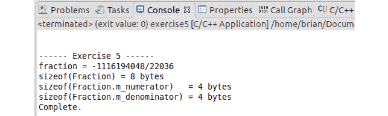

    ###### 图 2A.35:练习 5 典型输出

    为分数报告的值来自不以任何方式初始化成员变量。如果你再运行一次，你很可能会得到不同的分数。

5.  点击几次**运行**按钮。你会看到分数发生了变化。
6.  在编辑器中，将构造函数更改如下:

    ```cpp
    Fraction() : m_numerator{0}, m_denominator{1}
    {
    }
    ```

7.  Click on the **Run** button and observe the output:

    

    ###### 图 2A.36:修改后的练习 5 输出

    这一次，分数值由我们在成员初始化列表中指定的值定义。

8.  在编辑器中，添加以下两个`构造函数` :

    ```cpp
    Fraction(int numerator) : m_numerator(numerator), m_denominator(1)
    {
    }
    Fraction(int numerator, int denominator) : Fraction(numerator)
    {
      auto factor = std::gcd(numerator, denominator);
      m_numerator /= factor;
      m_denominator = denominator / factor;
    }
    ```

9.  在主功能中，将`分数`的声明改为包括初始化:

    ```cpp
    Fraction fraction{3,2};
    ```

10.  Click on the **Run** button and observe the output:

    

###### 图 2A.37:构造函数委托的例子

在本练习中，我们使用成员初始化列表和构造函数委托实现了成员变量初始化。*我们将返回到练习 7“向分数类添加运算符”中的分数。*

### 值与参考值和常量

到目前为止，我们只处理了值类型，即变量保存对象的值。指针保存我们感兴趣的值(即对象的地址)。但这会导致效率低下和资源管理问题。我们将在这里讨论如何解决效率低下的问题，但在*第 3 章*、*可以和应该之间的距离—对象、指针和继承*中讨论资源管理问题。

考虑以下问题..我们有一个 10×10 的双类型矩阵，我们希望为它编写一个求逆函数。该类声明如下:

```cpp
class Matrix10x10
{
private:
  double m_data[10][10];
};
```

如果我们取`sizeof(matrix x10x 10)`，我们会得到`sizeof(double)`x10x 10 = 800 字节。现在，如果我们为此实现一个逆矩阵函数，它的签名可能如下所示:

```cpp
Matrix10x10 invert(Matrix10x10 lhs);
Matrix10x10 mat;
// set up mat
Matrix10x10 inv = invert(mat);
```

首先，这意味着编译器需要将`mat`保存的值传递给`invert()`函数，并将 800 字节复制到堆栈上。然后，该函数做它需要做的任何事情来反转矩阵(一个 L-U 分解，行列式的计算——无论实现者选择什么方法)，然后将 800 字节的结果复制回`inv`变量。在堆栈上传递大值从来都不是一个好主意，原因有二:

*   堆栈是主机操作系统给我们程序的有限资源。
*   在系统中复制大值是低效的。

这种方法被称为按值传递。也就是说，我们希望处理的项目的值被复制到函数中。

在 C(和 C++)中，这个限制是通过使用指针来解决的。前面的代码可能变成下面的代码:

```cpp
void invert(Matrix10x10* src, Matrix10x10* inv);
Matrix10x10 mat;
Matrix10x10 inv;
// set up mat
invert(&mat, &inv);
```

这里，我们只是将 src 的地址和反向结果的目标作为两个指针传递(这是少量字节)。不幸的是，这导致每次我们使用`src`或`inv`时，函数内部的代码都必须使用取消引用运算符(`*`)，使得代码更难阅读。此外，指针的使用导致了许多问题。

C++ 引入了一种更好的方法——变量别名或引用。引用类型用&符号( **&** )运算符声明。因此，我们可以如下声明反转方法:

```cpp
void invert(Matrix10x10& src, Matrix10x10& inv);
Matrix10x10 mat;
Matrix10x10 inv;
// set up mat
invert(mat, inv);
```

请注意，调用方法不需要特殊运算符来传递引用。从编译器的角度来看，引用仍然是有一个限制的指针——它不能保存 nullptr。从程序员的角度来看，引用允许我们对代码进行推理，而不必担心在正确的地方有正确的取消引用操作符。这就是所谓的**通过参考**。

我们看到引用被传递给复制构造函数和复制赋值方法。引用的类型，当用于它们的移动等价物时，被称为**右值引用操作符**，将在*第 3 章*、*Can 和 short 之间的距离-对象、指针和继承*中解释。

`传递值`的一个优点是，我们不会无意中修改传递到方法中的变量值。现在，如果我们通过引用传递，我们不能再保证我们正在调用的方法不会修改原始变量。为了解决这个问题，我们可以将 invert 方法的签名更改如下:

```cpp
void invert(const Matrix10x10& src, Matrix10x10& inv);
```

const 关键字告诉编译器，在处理`invert()`函数的定义时，给`src`引用的值的任何部分赋值都是非法的。如果该方法试图修改 src，编译器将生成一个错误。

在指定类型–变量部分，我们发现`汽车标题`的声明导致`标题`属于`常量字符*`类型。现在，我们可以解释`const`部分。

`标题`变量是**一个指向常量**的指针。换句话说，我们不能改变存储在我们所指向的内存中的数据的值。因此，我们无法做到以下几点:

```cpp
*title = 's';
```

这是因为编译器会生成与更改常数值相关的错误。然而，我们可以改变存储在指针中的值。我们可以执行以下操作:

```cpp
title = "Maid Marian";
```

我们现在已经介绍了用作函数参数类型的引用，但是它们也可以用作成员变量而不是指针。引用和指针之间有区别:

引用必须引用实际的对象(没有 nullptr 的等价物)。引用一旦初始化就不能更改(这导致引用必须是初始化的默认成员或出现在成员初始化列表中)。只要对该对象的引用存在，该对象就必须存在(如果该对象可以在引用被销毁之前被销毁，那么如果试图访问该对象，就有可能出现未定义的行为)。

### 练习 6:声明和使用引用类型

在本练习中，我们将声明并使用引用类型，以使代码高效且易于阅读。让我们开始吧:

1.  在 Eclipse 中打开**第 2 课**项目，然后在**项目浏览器**中，展开**第 2 课**，然后展开**练习 06** ，双击**练习 6.cpp** 在编辑器中打开本练习的文件。
2.  点击**启动配置**下拉菜单，选择**新启动配置……**。将**练习 6** 配置为以练习 6 的名称运行。
3.  完成后，它将是当前选定的启动配置。
4.  Click on the **Run** button. Exercise 6 will run and produce something similar to the following output:

    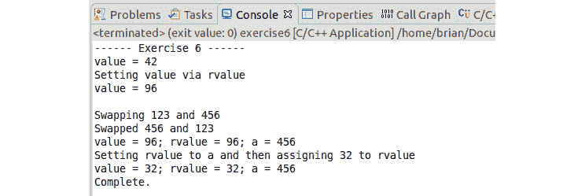

    ###### 图 2A.38:练习 6 的输出

    通过检查代码并将其与输出进行比较，我们会发现`值`变量允许我们操作(读取和写入)存储在`值`变量中的数据。我们有一个参考，`值`到`值`变量。我们还可以看到存储在`a`和`b`变量中的值是通过`swap()`函数交换的。

5.  在编辑器中，更改 swap 的函数定义:

    ```cpp
    void swap(const int& lhs, const int& rhs)
    ```

6.  点击**运行**按钮。出现“工作空间中的错误”对话框时，单击**取消**。编译器报告的第一个错误如下所示:

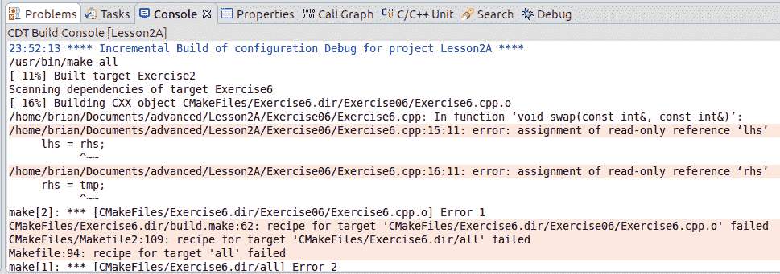

###### 图 2A.39:赋值时的只读错误

通过将参数从`int & lhs`更改为`const int & lhs`，我们已经告诉编译器在这个函数中不应该更改参数。因为我们在函数中给 lhs 赋值，编译器会生成 lhs 为只读的错误并终止。

### 执行标准操作符

要像使用内置类一样使用分数，我们需要它们与标准数学运算符(`+、-、*、/`)及其赋值对应物(`+=、-=、*=、/=`)一起工作。如果您不熟悉赋值运算符，请考虑以下两个表达式——它们产生相同的输出:

```cpp
a = a + b;
a += b;
```

为 Fraction 声明这两个运算符的语法如下:

```cpp
// member function declarations
Fraction& operator+=(const Fraction& rhs);
Fraction operator+(const Fraction& rhs) const;
// normal function declaration of operator+
Fraction operator+(const Fraction& lhs, const Fraction& rhs);
```

因为`运算符+=`方法修改左侧变量的内容(将 a 添加到 b，然后再次存储在 a 中)，所以建议将其实现为成员变量。在这种情况下，由于我们没有创建新的值，我们可以返回对现有 lhs 的引用。

另一方面，operator+方法不应该修改 lhs 或 rhs 并返回一个新对象。实现者可以自由地将其实现为成员函数或自由函数。两者都显示在前面的代码中，但应该只存在一个。关于成员函数的实现，有趣的是声明末尾的 const 关键字。这告诉编译器，当调用这个成员函数时，它不会修改对象的内部状态。虽然这两种方法都有效，但如果可能的话，`运算符+`应该作为类外的正常函数来实现。

其他运算符`–(减)`、`*(乘)`和`/(除)`也可以使用相同的方法。前面的方法实现了标准数学运算符的语义，并使我们的类型像内置类型一样工作。

### 实现输出流操作符(< <)

C++ 将输入/输出(I/O)抽象到标准库中的流类层次结构中(我们将在*章 2B* 、*不允许鸭子-模板和演绎*中讨论)。在*练习 5* 、*声明和初始化分数*中，我们看到可以将分数插入输出流，如下所示:

```cpp
std::cout << "fraction = " << fraction.getNumerator() << "/" 
                           << fraction.getDenominator() << "\n";
```

到目前为止，对于我们的 Fraction 类，我们已经通过使用`getmoleculator()`和`get 分母()`方法从外部访问数据值写出了分子和分母值，但是还有更好的方法。作为让我们的类在 C++ 中成为一流公民的一部分，在这种情况下，我们应该重载输入/输出操作符。在本章中，我们将只看输出操作符，< <，也称为插入操作符。这样，我们可以用一个更干净的版本来替换以前的代码:

```cpp
std::cout << "fraction = " << fraction << "\n";
```

我们可以将运算符重载为友元函数或普通函数(如果类提供了我们需要插入的数据的 getter 函数)。出于我们的目的，我们将其定义为一个普通函数:

```cpp
inline std::ostream& operator<< (std::ostream &out, const Fraction &rhs)
{
    out << rhs.getNumerator() << " / " << rhs.getDenominator();
    return out;
}
```

### 构建我们的代码

在我们深入研究实现操作符并将我们的 Fraction 转换为 C++ 世界中成熟类型的练习之前，我们需要简单讨论一下我们将类的各个部分放在哪里——声明和定义。声明是我们类的蓝图，指出它需要什么样的数据存储以及它将实现的方法。定义是每个方法的实际实现细节。

在像 Java 和 C#这样的语言中，声明和定义是相同的，它们必须存在于一个文件中(Java)或者跨多个文件(C#分部类)。在 C++ 中，根据类和您希望向其他类公开的程度，声明必须出现在头文件中(可以是其他文件中使用的 **#included** ),定义可以出现在三个位置之一——内嵌在定义中、**内嵌在与定义相同的文件中或单独的实现文件中。**

头文件通常用。hpp 扩展名，而实现文件通常是`*。cpp`或`*。cxx`。实施文件也称为**翻译单元**。通过将一个函数定义为内联函数，我们允许编译器以一种甚至可能不存在于最终程序中的方式优化代码——它将我们放入函数的步骤替换为我们调用函数的位置。

### 练习 7:向分数类添加运算符

在本练习中，我们旨在使用单元测试来开发功能，从而在我们的 Fraction 类中实现运算符。这使得我们的分数类成为一个真正的类型。让我们开始吧:

1.  在 Eclipse 中打开**第 2 课**项目，然后在**项目浏览器**中，展开**第 2 课**，然后展开**练习 07** ，双击**练习 7.cpp** 在编辑器中打开本练习的文件。
2.  点击**启动配置**下拉菜单，选择**新启动配置……**。将练习 7 配置为以练习 7 的名称运行。
3.  完成后，它将是当前选定的启动配置。
4.  我们还需要配置一个单元测试。在 Eclipse 中，点击名为**运行** | **运行配置…** 的菜单项，右键点击左侧 **C/C++ 单元**，选择**新配置**。
5.  将名称从`第 2A 课调试`改为`练习 7 测试`。
6.  在 **C/C++ 应用程序**下，选择**搜索项目**选项，并在新对话框中选择**测试**。
7.  Next, go to the **C/C++ Testing** tab and select **Google Tests Runner** in the dropdown. Click on **Apply** at the bottom of the dialog and click on the **Run** option for the test, which we have to run for the first time:

    

    ###### 图 2A.40:测试失败-乘法

8.  在编辑器中打开 **Fraction.cpp** 文件，找到`运算符*=`函数。用以下代码更新:

    ```cpp
    Fraction& Fraction::operator*=(const Fraction& rhs)
    {
      Fraction tmp(m_numerator*rhs.m_numerator, m_denominator*rhs.m_denominator);
      *this = tmp;
      return *this;
    }
    ```

9.  Click on the **Run** button to rerun the tests. This time, all the tests pass:

    

    ###### 图 2A.41:通过测试

10.  在您的 IDE 中，打开**测试/分数测试. cpp** 文件，找到失败的两个测试。一个测试了**操作员*=()** ，另一个测试了**操作员*(T5】。固定**操作符*=()** 如何固定**操作符*()** ？如果你在编辑器中打开 Fraction.hpp，你会发现**运算符*(T11)**函数是通过调用**运算符*=()** 为你实现的，也就是说，它被标记为内联的，是一个普通函数，而不是成员函数。一般来说，这是重载这些运算符时要采取的方法——修改调用它的对象的方法是成员函数，而必须生成新值的方法是调用成员函数的普通函数。**
11.  在编辑器中打开 **Fraction.hpp** 并更改文件顶部附近的行，使其内容如下:

    ```cpp
    #define EXERCISE7_STEP  11
    ```

12.  Click on the **Run** button to rerun the tests – this time, we have added two more tests that fail – `AddFractions` and `AddFractions2`:

    

    ###### 图 2A.42:附加测试失败

13.  在**函数. cpp** 文件中找到`运算符+=`函数。
14.  对功能进行必要的更改，点击**运行**按钮重新运行测试，直到测试通过。看看前面给出的定义其操作的等式，看看`算子*=()`是如何实现的。
15.  在编辑器中打开 **Fraction.hpp** ，将文件顶部附近的行改为这样:

    ```cpp
    #define EXERCISE7_STEP  15
    ```

16.  点击**运行**按钮重新运行测试——这次，我们又增加了两个失败的测试——`减法分数`和`减法分数 2`。
17.  在 Function.cpp 文件中找到`运算符-=`函数。
18.  对功能进行必要的更改，点击**运行**按钮重新运行测试，直到测试通过。
19.  在编辑器中打开 **Fraction.hpp** ，将文件顶部附近的行改为这样:

    ```cpp
    #define EXERCISE7_STEP  19
    ```

20.  点击**运行**按钮重新运行测试–这一次，我们又增加了两个失败的测试–**分流**和**分流 2** 。
21.  在**函数. cpp** 文件中找到`运算符/=`函数。
22.  对功能进行必要的更改，点击**运行**按钮重新运行测试，直到测试通过。
23.  在编辑器中打开 **Fraction.hpp** ，将文件顶部附近的行改为这样:

    ```cpp
    #define EXERCISE7_STEP  23
    ```

24.  点击**运行**按钮重新运行测试–这一次，我们又增加了一个失败的测试–`插入操作员`。
25.  在 Function.hpp 文件中找到`运算符< <`函数。
26.  对功能进行必要的更改，点击**运行**按钮重新运行测试，直到测试通过。
27.  从**启动配置**中，选择**练习 7** 并点击**运行**按钮。这将产生以下输出:

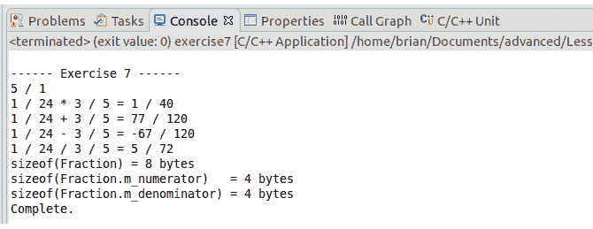

###### 图 2A.43:函数分数类

这就完成了我们现在对`分数`类的实现。当我们在*第三章*、*可以和应该之间的距离——对象、指针和继承*中考虑异常时，我们将再次回到它，这样我们就可以处理分数中的非法值(分母为 0)。

### 功能过载

C++ 支持一种称为函数重载的特性，即两个或多个函数具有相同的名称，但是它们的参数列表不同。参数的数量可以相同，但至少有一种参数类型必须不同。或者，它们可能有不同数量的参数。所以，多种功能的功能原型是不同的。但是，两个函数不能具有相同的函数名、相同的参数类型和不同的返回类型。以下是重载的一个示例:

```cpp
std::ostream& print(std::ostream& os, int value) {
   os << value << " is an int\n";
   return os;
}
std::ostream& print(std::ostream& os, float value) {
   os << value << " is a single precision float\n";
   return os;
}
std::ostream& print(std::ostream& os, double value) {
   os << value << " is a double precision float \n";
   return os;
}
// The next function causes the compiler to generate an error
// as it only differs by return type.
void print(std::ostream& os, double value) {
   os << value << " is a double precision float!\n";
}
```

到目前为止，`分式`上的多个构造函数和重载的算术运算符都是重载函数的例子，编译器在遇到这些函数中的一个时必须引用它们。考虑以下代码:

```cpp
int main(int argc, char** argv) {
   print(42);
}
```

当编译器遇到行`print(42)`时，它需要计算出调用哪个先前定义的函数，因此它执行以下过程(非常简化):


###### 图 2A.44:功能过载分辨率(简化)

C++ 标准定义了编译器如何根据如何操作(即转换)参数以获得匹配来确定最佳候选函数的规则。如果不需要转换，那么该函数是最佳匹配。

### 类、结构和联合

当您定义一个类并且没有指定访问修饰符(公共、受保护、私有)时，默认情况下所有成员都是私有的:

```cpp
class Fraction
{
  Fraction() {};            // All of these are private
  int m_numerator;
  int m_denominator;
};
```

当您定义结构且未指定访问修饰符(公共、受保护、私有)时，默认情况下，所有成员都是公共的:

```cpp
struct Fraction
{
  Fraction() {};            // All of these are public
  int m_numerator;
  int m_denominator;
};
```

还有一个区别，我们将在解释继承和多态性后再看。联合是一种不同于结构和类的数据构造，但却是相同的。联合是一种特殊类型的结构声明，其中所有成员占用相同的内存，并且在给定时间只有一个成员有效。`联盟`声明的示例如下:

```cpp
union variant
{
  int m_ivalue;
  float m_fvalue;
  double m_dvalue;
};
```

当您定义联合并且没有指定访问修饰符(公共、受保护、私有)时，默认情况下所有成员都是公共的。

联合的主要问题是，没有内在的方法知道在任何给定的时间哪个值是有效的。这是通过定义一个被称为*标记的联合*来解决的——也就是说，一个保存联合的结构和一个标识它是否是有效值的枚举。对于联合中可以包含什么和不能包含什么，还有其他限制(例如，只有一个成员可以有默认的成员初始值设定项)。我们不会在这本书里深入探讨工会。

### 活动 1:图形处理

在现代计算环境中，矩阵无处不在地被用来解决各种问题——解联立方程、分析电网或电路、对图形渲染对象进行操作，以及实现机器学习。在图形世界中，无论是二维(2D)还是三维(3D)，您想要对对象执行的所有操作都可以在矩阵乘法的帮助下完成。您的团队负责开发点的表示、变换矩阵以及您可能想要对它们执行的操作。按照以下步骤实现:

1.  从**第 2A 课/练习 01** 文件夹加载准备好的项目。
2.  创建一个名为 **Point3d** 的类，它可以默认构造为原点，或者使用一个由三个或四个值组成的初始化列表(数据直接存储在类中)。
3.  创建一个名为 **Matrix3d** 的类，它可以默认构造为一个身份矩阵，或者使用嵌套的初始化列表来提供所有的值(数据直接存储在类中)。
4.  在**点 3d** 上，重载`运算符()`，使其接受(`索引`)参数，以便返回位于`x(0)`、`y(1)`、`z(2)`和`w(3)`的值。
5.  在**矩阵 3d** 上，重载`运算符()`以获取(`行，col`列)参数，使其返回值。
6.  添加单元测试来验证上述所有特性。
7.  将`运算符*=(const Matrix3d & )`和`运算符==(const Matrix3d & )`添加到 **Matrix3d** 类中，并对它们进行单元测试。
8.  添加将两个**矩阵 3d** 对象和一个**矩阵 3d** 对象乘以一个**点 3d** 对象的自由函数。
9.  添加创建矩阵的独立方法，以平移、缩放和旋转(围绕 x、y、z 轴)及其单元测试。

执行上述步骤后，预期输出如下:


###### 图 2A.45:成功运行活动程序

就本次活动而言，我们不会担心指数超出范围的可能性。我们将在*第 3 章*、*能够和应该之间的距离——对象、指针和继承*中讨论这一点。单位矩阵是一个正方形矩阵(在我们的例子中是 4 x 4)，其中对角线上的所有值都设置为 1，其他所有值都为零。

当使用三维图形时，我们为点(顶点)和变换使用增广矩阵，以便所有的变换(平移、缩放、旋转)都可以通过使用乘法来实现。

一个`n × m`矩阵是一个由 n 行 m 个数组成的数组。例如，一个`2 x 3`矩阵可能如下所示:


###### 图 2A . 46:2x 3 的矩阵

一个三维顶点可以表示为一个`三元组(x，y，z)`。然而，我们用另一个纵坐标`w (=1 代表一个顶点，=0 代表一个方向)`来扩充它，使它成为一个`四元组(x，y，z，1)`。我们不使用元组，而是将其放在`4 x 1`矩阵中，如下所示:


###### 图 2A.47: 4x1 矩阵

如果我们将`4×1`矩阵(点)乘以一个`4×4`矩阵(变换)，我们就可以操纵该点。如果`Ti`代表一个变换，那么我们可以将这些变换相乘来实现对点的一些操作:


###### 图 2A.48:乘法变换

要乘以一个变换矩阵，`A x P = B`，我们执行以下操作:


###### 图 2A.49:乘法变换矩阵

我们也可以这样表达:


###### 图 2A.50:乘法变换的表达式

同样，两个`4×4`矩阵相乘也可以得到相同的结果，`AxB=C`:

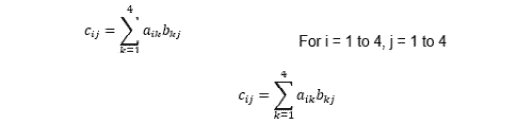

###### 图 2A . 51 4x 4 矩阵乘法的表达式:

转换的矩阵如下:

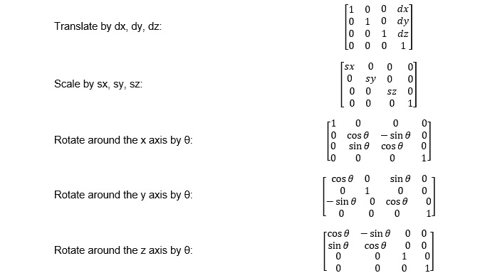

###### 图 2A.52:用于转换的矩阵列表

#### 注意

这项活动的解决方案可以在第 635 页找到。

## 总结

在这一章中，我们学习了 C++ 中的类型。首先，我们接触了内置类型，然后学习了如何创建我们自己的行为类似于内置类型的类型。我们学习了如何声明和初始化变量，了解了编译器从源代码中生成什么，将变量放在哪里，链接器如何将变量放在一起，以及在计算机内存中是什么样子。我们学习了一些围绕零规则和五规则的 C++ 部落智慧。这些构成了 C++ 的构建模块。在下一章中，我们将研究用 C++ 模板创建函数和类，并进一步探索应用于模板的类型推导。********