# 3。不允许泄漏-例外和资源

## 学习目标

本章结束时，您将能够:

*   开发类来管理资源
*   开发异常健壮的代码，这样资源就不会通过 RAII 泄漏
*   实现可以通过移动语义转移资源所有权的类
*   实现控制隐式转换的类

在本章中，您将学习如何使用类来管理资源、防止泄漏以及防止复制大量数据。

## 简介

在*章 2A* 、*不允许鸭子-类型、演绎*中，我们简单的接触了一些概念，比如智能指针和移动语义。在本章中，我们将进一步探讨它们。事实证明，这些主题与资源管理和编写健壮的代码(能够经常长时间运行而没有问题的代码)密切相关。

为了理解会发生什么，我们将探索变量在内存中的位置，以及当它们超出范围时会发生什么。

我们将研究编译器为我们输入的内容生成什么样的汇编代码，并且我们将探索当异常发生时所有这些是如何受到影响的。

### 可变范围和寿命

在*章 2B* 、*不允许鸭子-模板和演绎*中，我们讨论了可变范围和生存期。让我们快速浏览一下它们的不同类型:

**范围**:

*   **本地范围**(也称为**块范围**):这适用于在花括号(`{}`)内的块内声明的任何内容。
*   **全局/文件范围**:这适用于在正常函数或类之外声明的变量，也适用于正常函数。

**寿命**:

*   **自动生存期**:这里，局部变量在声明时创建，在退出所在范围时销毁。这些由堆栈管理。
*   **永久寿命**:这里，全局和静态局部变量都有永久寿命。
*   **动态寿命**:这里，变量是在程序员的要求下创建和销毁的(使用`新增的`和`删除操作符`)。这些变量从堆中分配内存。

我们将使用以下程序来弄清楚`局部变量`的行为——那些具有`自动寿命`和那些具有`动态寿命`的变量:


###### 图 3.1:可变范围和寿命的测试程序

当我们运行前面的程序时，会生成以下输出:

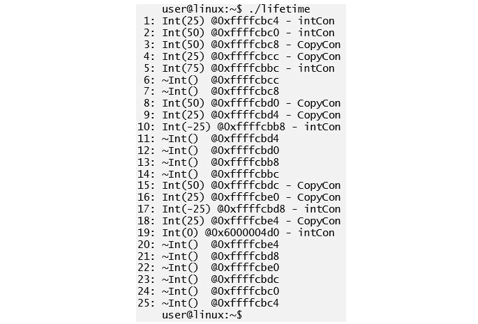

###### 图 3.2:寿命测试程序的输出

前面输出中的十六进制数(`0xnnnnnn`)是正在构造或析构的 Int 对象的地址。我们的程序从进入`第 46 行`开始，使用`主()`功能。在这一点上，程序已经做了大量的初始化，以便我们可以随时使用所有的东西。下图是两个堆栈–**电脑堆栈**和**数据堆栈**。

这些都是帮助我们解释幕后发生的事情的抽象概念。`PC 栈` ( `程序计数器栈`)用于记住程序计数器的值(一个指向需要运行的下一条指令的寄存器)，而`数据栈保存`我们正在处理的值或地址。虽然这是两个独立的堆栈，但在真正的 CPU 上，它很可能作为一个堆栈来实现。让我们看看下面的表格，其中我们使用了缩写`OLn`来表示来自前面程序输出的行号:


###### 图 3.3:测试程序执行的详细分析(第 1 部分)

下面是测试程序执行的详细分析的第二部分:

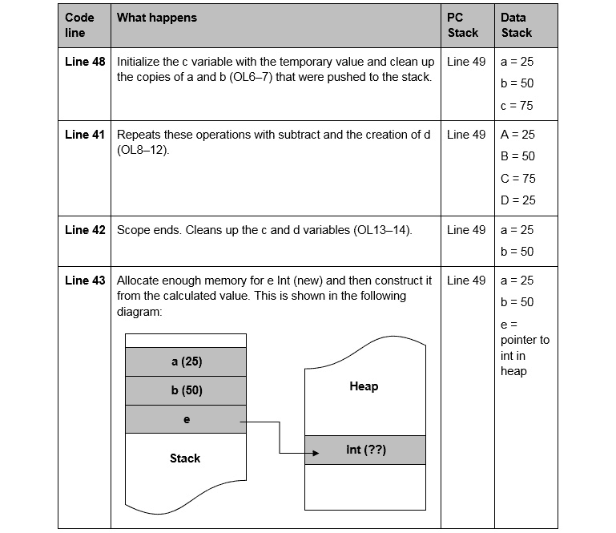

###### 图 3.4:测试程序执行的详细分析(第 2 部分)

下面是测试程序执行的详细分析的第三部分:

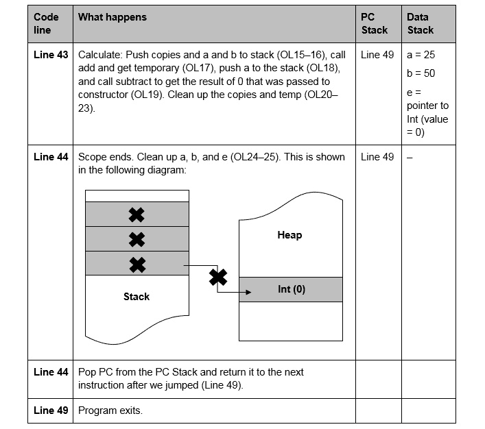

###### 图 3.5:测试程序执行的详细分析(第 3 部分)

从这个简单的程序中，我们了解到一些重要的事实:

*   当我们通过值传递时，复制构造函数被调用(就像我们在这个例子中做的那样)。
*   返回一个类型只会导致调用一个构造函数(而不是两个构造函数——一个用于创建返回对象，一个用于存储返回数据的变量)——c++调用这个**复制省略**，现在在标准中是强制的。
*   在终止作用域时(结束的花括号“`}`)，任何超出作用域的变量都会被调用析构函数。如果这是真的，那么为什么地址`0x6000004d0`没有显示析构函数调用(`~Int()`)？这就引出了下一个事实。
*   **原始指针**的析构函数只“破坏”指针，而不是它所指向的对象。这意味着当我们退出`计算()`方法时，我们泄漏了一些内存。

当我们忘记释放资源时，后两个事实对于理解和解决资源泄漏问题非常重要。我们将在处理完 C++中的异常后再来看资源管理。

## c++中的异常

我们已经看到了 C++如何用自动和动态的生存期来管理局部范围变量。当变量超出范围时，它会调用具有自动生存期的析构函数。我们还看到了原始指针在超出范围时是如何被破坏的。因为它没有清理动态生存期变量，所以我们丢失了它们。这是故事的一部分，将我们带向**资源获取是初始化** ( **RAII** )以后。但是，首先，我们需要了解异常如何改变程序的流程。

### 例外的必要性

在*章节 2A* 、*不允许鸭子–类型和演绎*中，我们被介绍到枚举，作为一种处理神奇数字的方式，用于`check_file()`功能:

```cpp
FileCheckStatus check_file(const char* name)
{
  FILE* fptr{fopen(name,"r")};
  if ( fptr == nullptr)
    return FileCheckStatus::NotFound;
  char buffer[30];
  auto numberRead = fread(buffer, 1, 30, fptr);
  fclose(fptr);
  if (numberRead != 30)
    return FileCheckStatus::IncorrectSize;
  if(is_valid(buffer))
    return FileCheckStatus::InvalidContents;
  return FileCheckStatus::Good;
}
```

上述功能使用称为**状态**或**错误代码**的技术来报告操作结果。这是用于 C 风格编程的方法，其中处理与 **POSIX API** 和 **Windows API** 相关的错误。

#### 注意

`POSIX`代表`便携式操作系统界面`。它是一个 IEEE 标准，用于 Unix 和其他操作系统之间的软件兼容性。

这意味着，方法的调用方必须检查返回值，并对每种错误类型采取适当的操作。当您可以推理出代码将生成的错误类型时，这种方法很有效。这并不总是正确的。例如，提供给程序的数据可能有问题。这导致程序中出现无法处理的异常状态。代码中具有处理错误逻辑的部分将从检测到问题的代码部分中删除。

虽然可以编写处理这种问题的代码，但它增加了处理所有错误情况的复杂性，从而使程序难以阅读，难以推理函数应该做什么，因此非常难以维护。

对于错误处理，与错误代码相比，异常具有以下优势:

*   错误代码可以忽略–异常会强制处理错误(或者程序终止)。
*   异常可以沿着堆栈向上流动，到达响应错误的最佳方法。错误代码需要从每个中间方法传播出去。
*   异常将错误的处理从主程序流中分离出来，从而使软件易于可读性和可维护性。
*   异常将检测错误的代码与处理错误的代码分开。

如果您遵循最佳实践并针对异常情况使用异常，则使用异常不会产生(时间)开销。这是因为一个实现良好的编译器会传递 C++的咒语——你不用为你不用的东西付费。这可能会消耗一些内存，您的代码可能会稍微大一点，但运行时间应该不会受到影响。

C++使用异常来处理运行时异常。通过使用异常，我们可以检测到一个错误，抛出一个异常，然后错误传播回可以处理它的位置。我们修改一下之前的程序，引入`divide()`函数，改变 calculate()函数来调用。我们还将在`main()`函数中添加日志记录，这样我们就可以探索异常的行为:

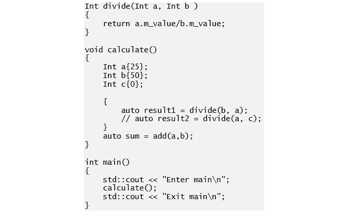

###### 图 3.6:用于调查异常的修改后的测试程序

当我们编译并运行前面的程序时，会生成以下输出:

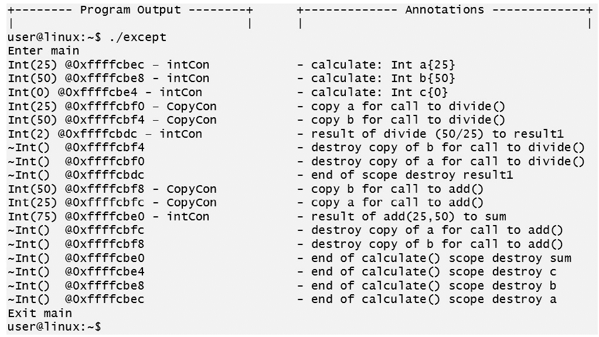

###### 图 3.7:测试程序的输出

在前面的代码中，您可以看到注释被添加到右侧。现在，我们删除程序中`结果 2`行的注释，重新编译程序，然后重新运行它。生成的新输出如下所示:


###### 图 3.8:测试程序的输出–结果 2

通过比较输出，我们可以看到每一行的前八行是相同的。前面输出的下两行相加是因为`divide()`函数被调用了两次。最后一行表示引发了异常，程序被终止。

对`divide()`函数的第二次调用试图除以零，这是一个异常操作。这导致了一个例外。如果一个整数被零除，就会导致浮点异常。这与异常在`POSIX`系统中生成的方式有关——它使用一种叫做信号的东西(我们在这里不讨论信号的细节)。当一个整数被零除时，`POSIX`系统将其映射到名为 **SIGFPE** 的信号，该信号最初是用于`浮点错误`的，但现在是更通用的`算术错误`。

#### **注**

根据 C++标准，如果零作为“`/`”运算符(除)或“`%`”运算符(模)的除数出现，则行为未定义。大多数系统会选择抛出异常。

因此，我们从前面的解释中学到了一个重要的事实:一个未处理的异常将终止程序(在内部，它调用`std::terminate()`)。我们将修复`未定义的行为`，捕捉异常，并查看输出中的变化。要修复`未定义行为`，我们需要在文件顶部添加`# include<stdexit>`，修改`divide()`功能:

```cpp
Int divide(Int a, Int b )
{
    if (b.m_value == 0)
        throw std::domain_error("divide by zero error!");
    return a.m_value/b.m_value;
}
```

当我们重新编译并运行程序时，我们会得到以下输出:


###### 图 3.9:当我们抛出异常时的输出

从前面的输出中我们可以看出，变化不大。只是我们没有得到一个`浮点异常`(核心被转储)——程序仍然终止，但是没有转储核心。然后我们在`main()`函数中添加了一个`try/catch`块，以确保异常不再被处理。


###### 图 3.10:捕捉异常

重新编译程序并运行它，以获得以下输出:

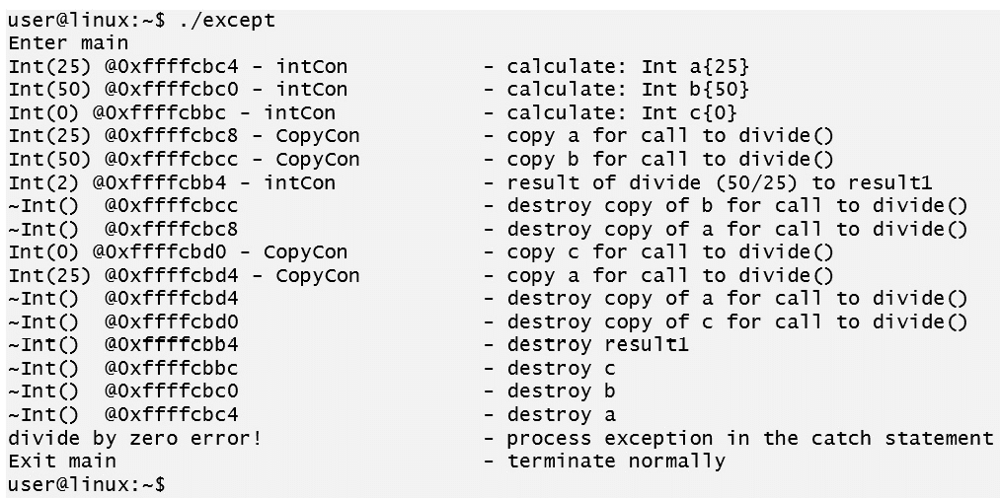

###### 图 3.11:捕获异常的程序的输出

在前面的输出中，在注释为“**copy a for call divide**”的第二行抛出异常。此后输出的所有内容都是正在处理的异常的结果。

我们的代码已经将程序控制转移到了`main()`函数中的`catch()`语句，并且已经为堆栈上构造的所有变量执行了析构函数(从在`try`子句中进行调用时开始)。

### 堆叠展开

C++语言保证的销毁所有局部函数变量的过程称为**栈展开**。当堆栈在出现异常时展开时，C++使用其定义良好的规则来销毁范围内的所有对象。

当异常发生时，函数调用堆栈开始从当前函数线性搜索回调用它的函数，再到调用它的函数，以此类推，直到找到与异常匹配的异常处理程序(由`catch`块表示)。

如果发现异常处理程序，那么堆栈展开发生，破坏堆栈中所有函数的所有局部变量。对象按照与创建时相反的顺序销毁。如果没有找到处理抛出异常的处理程序，那么程序终止(通常不警告用户)。

### 练习 1:在分数和堆栈中实现异常

在本练习中，我们将返回到我们在*章节 2A* 、*不允许鸭子–类型和演绎*和*章节 2B* 、*不允许鸭子–模板和演绎*–`分数`和`堆栈`中学习的两个类，这两个类都可能经历运行时异常。我们将更新他们的代码，以便他们可以在检测到任何问题时引发异常。按照以下步骤实施本练习:

1.  打开 Eclipse，使用在**第 3 课**示例文件夹中找到的文件创建一个名为**第 3 课**的新项目。
2.  由于这是一个基于 **CMake 的项目**，将当前的构建器改为 **CMake Build(可移植)**。
3.  进入**项目** | **构建全部**菜单构建所有练习。默认情况下，屏幕底部的控制台将显示 **CMake 控制台【第 3 课】**。
4.  配置新的**启动配置**、**L3 练习 1** 以名称**练习 1** 运行。
5.  另外，配置一个新的 C/C++单元运行配置 **L3Ex1Tests** ，运行 **L3Ex1tests** 。设置**谷歌测试运行程序**。
6.  Click on the **Run** option for the existing **18** tests to run and pass.

    

    ###### 图 3.12:现有测试全部通过(运行:18)

7.  在编辑器中打开 **Fraction.hpp** ，将文件顶部的行改为这样:

    ```cpp
    #define EXERCISE1_STEP  14
    ```

8.  Click on the **Run** button to re-run the tests – we have added one test that will attempt to create a `Fraction` with a zero denominator. The test expects that an exception has been thrown:

    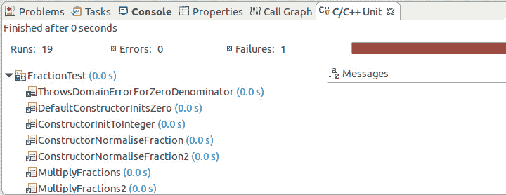

    ###### 图 3.13:新的失败测试

9.  点击失败的测试名称–现在**消息**窗口将显示预期行为和实际行为。您可能需要向右滚动才能全部阅读。在最右边，它表示“`预期……抛出一个 std::domain_error 类型的异常`”，下一行表示“`实际:它什么都不抛出`”。
10.  Double-click on the message and it will take you to the following test:

    

    ###### 图 3.14:失败的测试

    `ASSERT_THROW()`宏需要两个参数。由于`分数初始值设定项`中有一个逗号，因此有必要将整个第一个参数包装在一组额外的括号中。第二个参数将从这个构造函数中得到一个`std::domain_error`。内部`try/catch`结构存在，以确认预期的字符串在异常对象内部被捕获。如果我们不想检查这个，那么我们可以这样简单地编写测试:

    ```cpp
    ASSERT_THROW(({Fraction f1{1,0}; }), std::domain_error);
    ```

11.  在编辑器中打开文件 **Fraction.cpp** 。在文件顶部附近插入以下行:

    ```cpp
    #include <stdexcept> 
    ```

12.  修改构造函数，如果创建时分母为零，则抛出异常:

    ```cpp
    Fraction::Fraction(int numerator, int denominator) 
                           : m_numerator{numerator}, m_denominator{denominator}
    {
        if(m_denominator == 0) 
        {
            throw std::domain_error("Zero Denominator");
        }
    }
    ```

13.  点击**运行**按钮重新运行测试。 **19** 测试现在通过。
14.  在编辑器中打开 **Fraction.hpp** ，将文件顶部附近的行改为这样:

    ```cpp
    #define EXERCISE1_STEP  20
    ```

15.  点击**运行**按钮重新运行测试-新测试**失败。**
16.  点击失败的测试名称–现在**消息**窗口将显示预期行为和实际行为。您可能需要向右滚动才能全部阅读。在最右边，它表示“`预期……抛出一个类型为 std::runtime_error`的异常”，下一行表示“`实际:它抛出一个不同的类型`”。
17.  Double-click on the message again to open the failing test:

    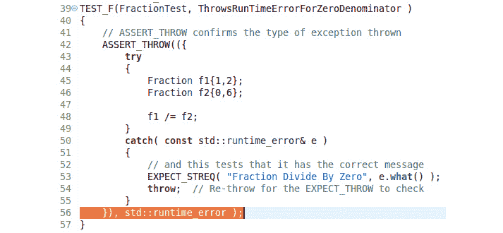

    ###### 图 3.15:另一个失败的测试

    该测试正在验证除法赋值运算符是否会为被零除抛出异常。

18.  打开**分数. cpp** 并定位`操作员/=()`功能。你会看到，在这个函数里面，它实际上使用了**分数**的构造函数，所以它会抛出一个`std::domain_error`。
19.  现在修改`运算符/=()`以在调用构造函数之前检测这个问题，这样它就会抛出一个带有预期消息的`std::runtime_error`。
20.  通过添加一个域错误来修改**分数. cpp** ，该域错误将检测除法运算符:

    ```cpp
    Fraction& Fraction::operator/=(const Fraction& rhs)
    {
        if (rhs.m_numerator == 0)
        {
            throw std::runtime_error("Fraction Divide By Zero");
        }
        Fraction tmp(m_numerator*rhs.m_denominator, 
    m_denominator*rhs.m_numerator);
        *this = tmp;
        return *this;
    }
    ```

21.  点击**运行**按钮重新运行测试。所有 **20** 测试通过。
22.  在编辑器中打开 **Stack.hpp** ，将文件顶部附近的行改为如下所示:

    ```cpp
    #define EXERCISE1_STEP  27
    ```

23.  Click on the **Run** button to re-run the tests – we have added one test that will attempt to pop from an empty stack. In the **C/C++ Unit tab** window, click on the triangle next to `FractionTest` to collapse the lists of tests and show the `StackTest`:

    

    ###### 图 3.16:弹出堆栈测试失败

24.  使用 **C/C++单元**窗口点击并定位失败的测试。确定预期异常，然后打开 **Stack.hpp** 。在文件顶部添加`# include<STD except>`，然后更新`pop()`功能，使其看起来像这样:

    ```cpp
    void pop()
    {
        if(empty())
            throw std::underflow_error("Pop from empty stack");
        m_stack.pop_back();
    } 
    ```

25.  点击**运行**按钮重新运行测试。 **21** 测试现在通过。
26.  在编辑器中打开 **Stack.hpp** ，将文件顶部的行改为如下所示:

    ```cpp
    #define EXERCISE1_STEP  31
    ```

27.  点击**运行**按钮重新运行测试-新增加的测试**失败。**
28.  使用 **C/C++单元**窗口点击并定位失败的测试。确定预期异常，然后打开 **Stack.hpp** 。更新非常数`top()`方法，使其看起来如下:

    ```cpp
    reference top()
    {
        if(empty())
            throw std::underflow_error("Top from empty stack");
        return m_stack.back();
    }
    ```

29.  点击**运行**按钮重新运行测试。 **22** 测试通过。
30.  在编辑器中打开 **Stack.hpp** ，将文件顶部的行改为如下所示:

    ```cpp
    #define EXERCISE1_STEP  35
    ```

31.  点击**运行**按钮重新运行测试-新增加的测试**失败。**
32.  使用 **C/C++单元**窗口点击并定位失败的测试。确定预期异常，然后打开 **Stack.hpp** 。更新常量`top()`方法，使其看起来如下:

    ```cpp
    const_reference top() const
    {
        if(empty())
            throw std::underflow_error("Top from empty stack");
        return m_stack.back();
    }
    ```

33.  点击**运行**按钮重新运行测试。所有 **23** 测试现在通过。

在本练习中，我们添加了运行时检查预条件，这是使用我们的`分数`和`堆栈`类的正常操作的一部分。这段代码只会在违反一个先决条件时抛出异常，表明数据或我们的程序执行方式有问题。

### 抛出异常时会发生什么？

在某个时刻，我们的程序执行以下语句:

```cpp
throw expression;
```

通过执行这个操作，我们发出了一个信号，表明出现了一个错误的情况，并且我们希望它得到处理。接下来发生的事情是一个**临时**对象，被称为**异常对象**，它被构建在一个未指定的存储中，并根据表达式进行复制初始化(它可以调用移动构造函数，并可能会被复制省略)。异常对象的类型是从表达式中静态确定的，删除了 const 和 volatile 限定符。数组类型衰减为指针，而函数类型转换为函数的指针。如果表达式的类型是格式错误的或抽象的，那么将发生编译器错误。

构造异常对象后，控件连同异常对象一起被转移到异常处理程序。所选择的异常处理程序是堆栈展开时与异常对象具有最接近匹配类型的处理程序。异常对象存在，直到最后一个 catch 子句退出，除非它被重新抛出。表达式的类型必须有一个可访问的`复制构造函数`和一个`析构函数`。

### 按值投掷或按指针投掷

知道了一个临时异常对象被创建，传递，然后销毁，抛出表达式应该使用什么类型？一个`值`还是一个`指针`？

我们还没有过多讨论在 catch 语句中指定类型。我们很快就会这么做。但是现在，请注意，要捕获指针类型(已经抛出)，捕获模式也需要是指针类型。

如果一个指向对象的指针被抛出，那么抛出方必须确保异常对象将指向的对象(因为它将是指针的副本)将保持活动状态，直到异常被处理，甚至通过`栈展开`。

指针可以指向静态变量、全局变量或从堆中分配的内存，以确保在处理异常时被指向的对象仍然存在。现在，我们已经解决了保持异常对象活动的问题。但是当处理者处理完它之后，捕手会怎么处理它呢？

异常的捕捉者不知道异常对象的创建(`全局`、`静态`或`堆`)因此不知道是否应该删除接收到的指针。因此，按指针抛出不是抛出异常的推荐方法。

抛出的对象将被复制到创建的临时异常对象，并传递给处理程序。当异常被处理后，临时对象将被销毁，程序将继续运行。关于如何处理它，没有任何含糊之处。因此，最好的做法是通过值抛出**异常。**

### 标准库异常

C++标准库将`标准::异常`定义为所有标准库异常的基类。该标准定义了以下第一级层次的`异常` / `错误`(括号中的数字表示有多少个异常源自该类):

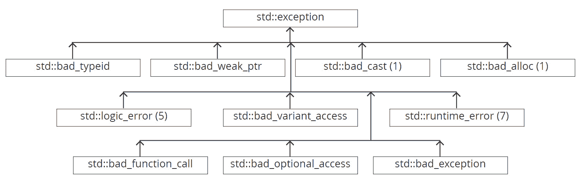

###### 图 3.17: 标准库异常层次结构(两级)

这些异常通过包括 STL 的 C++标准库来使用。创建自己的异常类的最佳实践是从一个标准异常中派生它。正如我们接下来将看到的，您的特殊异常可以被一个标准异常的处理程序捕获。

### 捕捉异常

在讨论异常的必要性时，我们引入了抛出异常的想法，但并没有真正考虑 C++如何支持捕捉异常。异常处理的过程从一段代码被包装在`try`块中开始，将其置于**异常检查**下。try 块后面是一个或多个 catch 块，它们是异常处理程序。当在 try 块内执行代码时出现异常情况时，将引发异常，并将控制权转移给异常处理程序。如果没有抛出异常，则跳过所有异常处理程序，try 块中的代码完成，正常执行继续。让我们在代码片段中表达这些概念:

```cpp
void SomeFunction()
{
  try {
    // code under exception inspection
  }
  catch(myexception e)         // first handler – catch by value
  {
    // some error handling steps
  }
  catch(std::exception* e)     // second handler – catch by pointer
  {
    // some other error handling steps
  }
  catch(std::runtime_error& e) // third handler – catch by reference
  {
    // some other error handling steps
  }
  catch(...)                   // default exception handler – catch any exception
  {
    // some other error handling steps
  }
  // Normal programming continues from here
}
```

前面的片段显示了必要的关键词–`尝试`，以及`捕捉`，并介绍了三种不同类型的捕捉模式(不包括默认处理程序):

*   **按值捕获异常**:这是一种代价高昂的机制，因为异常处理程序的处理与任何其他函数一样。按值捕获意味着必须创建异常对象的副本，然后将其传递给处理程序。第二个副本的创建减慢了异常处理过程。这种类型也可能受到对象切片的影响，其中抛出了一个子类，catch 子句是一个超类。catch 子句将只接收丢失原始异常对象属性的超类对象的副本。因此，我们应该避免按值捕获异常处理程序。
*   **通过指针捕捉异常**:正如在查看按值抛出时所讨论的，使用按指针抛出，这种风格的异常处理程序只能捕捉指针抛出的异常。因为我们只想按值抛出，所以我们应该避免使用指针捕捉异常处理程序。
*   **Catch expression by reference**: This is the recommended style of exception handler as it does not suffer from the issues related to catch-by-value and catch-by-pointer. As a reference is passed to the handler, no second copy of the exception object is made. Splicing does not occur because the reference still refers to the originally thrown exception object. And since the exception was thrown by value, the temporary exception object will be destroyed automatically when we are done with it.

    #### 注意

    处理异常时，是`按值抛出`、`按引用捕捉`。

当有多个 catch 块时，异常对象类型用于按照指定的顺序匹配处理程序。一旦找到匹配的处理程序，它就会被执行，其余的异常处理程序将被忽略。这与函数解析不同，在函数解析中，编译器会找到与参数的最佳匹配。因此，异常处理程序(catch 块)应该从更具体的到更一般的来定义。例如，默认处理程序(`catch(...)`)应该总是排在定义的最后。

### 练习 2:实现异常处理程序

在本练习中，我们将实现异常处理程序的层次结构，以管理如何处理异常。按照以下步骤实施本练习:

1.  Open the **Lesson3** project in Eclipse. Then in the **Project Explorer**, expand **Lesson3** then **Exercise02** and double click on **exceptions.cpp** to open the file for this exercise into the editor. This file contains the following code:

    ```cpp
    #include <exception>
    #include <iostream>
    void run_exceptions()
    {
        try
        {
            throw std::domain_error("We got one!!!!");
        }
        catch(...)
        {
        std::cout << "Exception caught by default handler\n";
        }
        catch(const std::exception& e)
        {
            std::cout << "Exception '" << "' caught by std::exception handler\n";
        }
        catch(const std::logic_error& e)
        {
        std::cout << "Exception '" << "' caught by std::logic_error handler\n";
        }
        catch(const std::domain_error& e)
        {
            std::cout << "Exception '" << "' caught by std::domain_error handler\n";
        }
    }
    int main()
    {
        std::cout << "\n\n------ Exercise 2 ------\n";
        run_exceptions();
        std::cout << "Complete.\n";
        return 0;
    }
    ```

    #### **注**

    所有异常处理程序都使用了相同的名称作为异常参数，即`e`。该变量的作用域只是声明它的 catch 块。

2.  点击**启动配置**下拉菜单，选择**新启动配置……**。从**搜索项目**菜单中配置**L3 练习 2** 应用程序，以名称**L3 练习 2** 运行它。
3.  完成后，将是当前选择的**启动配置**。
4.  Click on the **Run** button. Exercise 2 will run and produce the following output:

    

    ###### 图 3.18:练习 2 输出-默认处理程序捕获了异常

5.  在控制台窗口中，点击**显示选中的控制台**按钮，选择 **CDT 全局构建控制台**。滚动窗口。您会发现(如果使用 GCC 编译器的话)有五条警告消息与我们放置异常处理程序的顺序有关。(实际上，第一个警告通常是一个错误，除了`CMake`文件在编译该目标时设置了`-fpermissive`标志。)
6.  In the editor, move the default exception handler, `catch(...)`, to just after the `std::domain_error` handler. Click on the **Run** button. Exercise 2 will run and produce the following output:

    

    ###### 图 3.19:使用了标准::异常处理程序

7.  在编辑器中，将`std::exception`处理程序移到`std::domain_error`处理程序之后。点击**运行**按钮。这一次，它将报告执行了`std::logic_error`处理程序。
8.  在编辑器中，将`std:: logic_error`处理程序移到`std::domain_error`处理程序之后。点击**运行**按钮。这一次，它将报告执行了`std:: domain_error`处理程序，这实际上是我们所期望的。
9.  现在将`掷`线改为`std::logic_error`异常。点击**运行**按钮。这一次，它将报告`std::logic_error`处理程序按预期执行。
10.  现在将`抛出`线改为`标准::下溢 _ 错误`异常。点击**运行**按钮，这一次它将报告异常被`std::异常`处理程序捕获，正如预期的那样。`std::exception`是所有标准库异常的基类。

在本练习中，我们实现了一系列异常处理程序，并观察了异常处理程序的顺序如何影响捕获异常的方式以及如何使用异常层次结构。

### CMake 生成器表达式

使用`CMake`时，有时需要调整变量值。`CMake`是一个构建生成器系统，可以为很多构建工具和编译器工具链生成构建文件。由于这种灵活性，如果您想在编译器中打开某些功能，您只需要将它应用于一种特定的类型。这是因为不同供应商的命令行选项不同。例如，g++编译器启用 C++17 支持的命令行选项是`-std=c++17`，但对于`msvc`则是`/std:c++17`。如果打开 **CMakeLists.txt** 文件，定位**l3 锻炼 2**`add _ executable`，那么后面会有一行:

```cpp
target_compile_options(L3Exercise2 PRIVATE $<$<CXX_COMPILER_ID:GNU>:-fpermissive>)
```

这使用`$<CXX _ COMPILER _ ID:GNU>`变量查询来检查是否是 GCC 编译器。如果是，则生成 1(真)，否则生成 0(假)。它还使用`$ <条件:true_string >`条件表达式将`-fppermissive`添加到**l3 锻炼 2** 目标的编译器选项中，但仅限于 gcc 编译器。这些可以作为对`target_compile_options`的单独调用或通过一次调用为每个编译器类型添加。

#### 注意

有关生成器表达式的更多信息，请查看以下链接:[https://cmake . org/cmake/help/v 3.15/manual/cmake-generator-expressions . 7 . html](https://cmake.org/cmake/help/v3.15/manual/cmake-generator-expressions.7.html)。

### 异常使用指南

在 C++代码中使用异常时，请记住以下几点:

*   吟诵:**按值抛投，按参考接球**
*   **正常程序流程不要使用异常**。如果一个函数满足一个异常条件，并且不能满足它的(函数)义务，那么也只有这样，你才会抛出一个异常。如果该功能能够解决异常情况并履行其义务，那么它就不是例外。它们被命名为异常是有原因的，如果您不使用它们，您将不会产生任何处理开销。
*   **不要从析构函数**中抛出异常。请记住，由于堆栈展开，将执行局部变量析构函数。如果在堆栈展开过程中调用析构函数并引发异常，程序将终止。
*   **不要吞下异常**。不要使用默认的 catch 处理程序，也不要处理异常。引发异常是为了表明存在问题，您应该对此采取措施。忽略异常可能会导致稍后难以排除的故障。这是因为任何有用的信息都会随着被吞咽的异常而真正丢失。
*   **异常对象从抛出**中复制。

## 资源管理(在例外的世界中)

到目前为止，我们已经了解了局部变量的作用域，以及当变量超出作用域时如何处理`自动`和`动态寿命变量`——自动寿命变量(那些放在堆栈上的)被完全析构，而`动态寿命变量`(那些被程序员分配到堆中的)没有被析构:我们只是失去了对它们的任何访问。我们还看到，当抛出异常时，会找到最近的匹配处理程序，在堆栈展开过程中，抛出点和处理程序之间的所有局部变量都会被析构。

我们可以利用这些知识来编写健壮的资源管理类，这将使我们不再需要跟踪资源(动态生存期变量、文件句柄、系统句柄等)，以确保当我们使用完它们时，它们被释放(回到野外)。在正常运行和异常情况下，用于管理资源的技术被称为**资源获取是初始化** ( **RAII** )。

### 资源获取是初始化

RAII 是另一个命名不当的概念的好例子(另一个是`SFINAE`)。`RAII`或`资源获取是初始化`描述了用于管理资源的类的行为。如果把它命名为**破坏就是资源释放**可能会更好，它真正抓住了管理类试图做的事情的本质。我们可以从我们之前的讨论中推断出如何实现这一点，但是展示一个单独的例子来开发资源管理`文件`类，并展示 RAI 如何提高可读性和我们推理函数功能的能力，会更有启发性。

考虑以下代码:

```cpp
void do_something()
{
    FILE* out{};
    FILE* in = fopen("input.txt", "r");
    try 
    {
        if (in != nullptr)
        {
            // UNSAFE – an exception here will create a resource leak
            out = fopen("output.txt", "w");
            if (out != nullptr)
            {
                // Do some work
                // UNSAFE – an exception here will create resource leaks
                fclose(out);
            }
            fclose(in);
        }
    }
    catch(std::exception& e)
    {
        // Respond to the exception
    }
}
```

这段代码显示了资源管理的两个潜在问题:

*   最重要的是，在文件打开和关闭之间出现异常会导致资源泄漏。如果这是一个系统资源，其中许多会导致系统不稳定或应用程序性能受到不利影响，因为它缺乏资源。
*   此外，由于错误处理，在一个方法中管理多个资源会导致深嵌套子句。这不利于代码的可读性，因此也不利于代码的理解和可维护性。很容易忘记释放一个资源，尤其是有多个退出点的时候。

那么，我们如何管理资源，以便拥有异常安全和更简单的代码呢？这个问题并不是 C++独有的，不同的语言对它的管理也不同。`Java`、`C#`和`Python`使用垃圾收集方法，该方法会扫描创建的对象，并在它们不再被引用时进行清理。但是 C++没有垃圾收集，那么解决方案是什么呢？

考虑以下类别:

```cpp
class File {
public:
    File(const char* name, const char* access) {
        m_file = fopen(name, access);
        if (m_file == nullptr) {
            throw std::ios_base::failure("failed to open file");
        }
    }
    ~File() {
        fclose(m_file);
    }
    operator FILE*() {
        return m_file;
    }
private:
    FILE* m_file{};
};
```

此类实现以下特征:

*   构造函数获取资源。
*   如果构造函数中没有获取资源，则会引发异常。
*   当类被销毁时，资源被释放。

如果我们在`do_something()`方法中使用这个类，那么它看起来像这样:

```cpp
void do_something()
{
    try 
    {
        File in("input.txt", "r");
        File out("output.txt", "w");
        // Do some work
    }
    catch(std::exception& e)
    {
        // Respond to the exception
    }
}
```

如果在这样做的时候发生异常，那么 C++保证所有基于堆栈的对象都将调用它们的析构函数(`堆栈展开`，从而保证文件被关闭。这解决了出现异常时资源泄漏的问题，因为资源现在已被自动清理。此外，这种方法非常容易阅读，这样我们就可以理解逻辑流程，而不必担心错误处理。

该技术利用`文件`对象的生存期来获取和释放资源，确保资源不泄露。资源在管理类的构建(初始化)过程中获取，在管理类的销毁过程中释放。正是这种受范围限制的资源的行为产生了名称`资源获取是初始化`。

前面的示例涉及管理作为系统资源的文件句柄。它适用于任何需要在使用前获得，然后在完成时放弃的资源。RAII 技术可以应用于广泛的资源——打开的文件、打开的管道、分配的堆内存、打开的套接字、执行的线程、数据库连接、互斥锁/关键部分的锁定——基本上是主机系统中供应不足且需要管理的任何资源。

### 练习 3:为内存和文件句柄实现 RAII

在本练习中，我们将实现两个不同的类，它们将使用 RAII 技术管理内存或文件。按照以下步骤实施本练习:

1.  在 Eclipse 中打开**第 3 课**项目。然后在**项目浏览器**中，展开**第 3 课**，然后展开**练习 03** ，双击**练习 3.cpp** 将本练习的文件打开到编辑器中。
2.  点击**启动配置**下拉菜单，选择**新启动配置……**。从“搜索项目”菜单中配置**L3 练习 3** 应用程序，以名称**L3 练习 3** 运行它。
3.  Click on the **Run** button to run Exercise 3\. This will produce the following output:

    

    ###### 图 3.20:来自练习 3.cpp 的内存和文件泄漏

    输出显示我们分配了五次内存，地址由 new 返回。当从`main()`函数执行时，当`监视器`被析构时，它转储已分配和释放的内存报告，以及已打开但从未关闭的文件。

4.  在编辑器中，在`文件`类的**练习 3.cpp** 文件中键入以下内容:

    ```cpp
    class File {
    public:
        File(const char* name, const char* access) {
            m_file = fopen(name, access);
            if (m_file == nullptr) {
                throw std::ios_base::failure(""failed to open file"");
            }
        }
        ~File() {
            fclose(m_file);
        }
        operator FILE*() {
            return m_file;
        }
    private:
        FILE* m_file{};
    };
    ```

5.  点击**运行**按钮运行练习 3–它仍然会泄漏文件和内存，但是代码是正确的。
6.  找到`泄漏文件()`函数，并对其进行修改，使其使用新的`文件`类(与前面的代码类似)来防止文件泄漏:

    ```cpp
    void LeakFiles()
    {
        File fh1{"HelloB1.txt", "w"};
        fprintf(fh1, "Hello B2\n");
        File fh2{"HelloB2.txt", "w"};
        fprintf(fh2, "Hello B1\n");
    }
    ```

7.  Click on the **Run** button to run Exercise 3\. If you have modified `LeakFiles()` correctly, then the output will be as follows:

    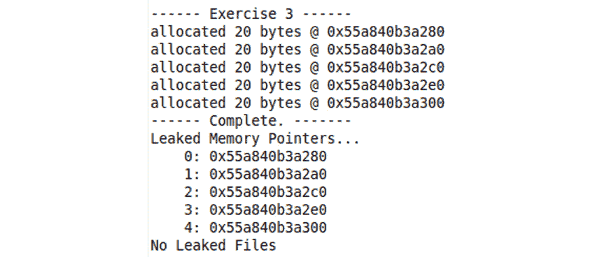

    ###### 图 3.21:没有文件泄漏

8.  现在在**练习 3.cpp** 中，添加以下`CharPointer`类:

    ```cpp
    class CharPointer
    {
    public:
        void allocate(size_t size)
        {
            m_memory = new char[size];
        }
        operator char*() { return m_memory;}
    private:
        char* m_memory{};
    };
    ```

9.  将`泄漏指针()`修改如下:

    ```cpp
    void LeakPointers()
    {
        CharPointer memory[5];
        for (auto i{0} ; i<5 ; i++)
        {
            memory[i].allocate(20); 
            std::cout << "allocated 20 bytes @ " << (void *)memory[i] << "\n";
        }
    }
    ```

10.  点击**运行**按钮运行练习 3–仍然有内存泄漏，但是代码是正确的。
11.  现在，添加以下析构函数到`字符指针`。注意`删除`运算符使用数组`[]`语法:

    ```cpp
    ~CharPointer()
    {
        delete [] m_memory;
    }
    ```

12.  再次点击**运行**按钮运行练习 3–这一次，您应该看到监视器没有报告泄漏:


###### 图 3.22:无泄漏-内存或文件

`文件`和`CharPointer`的实现提供了`RAII`设计方法，但是在设计这些时还有其他的考虑。例如，我们需要复制构造函数还是复制赋值函数？在这两种情况下，仅仅将资源从一个对象复制到另一个对象可能是一个问题，因为这可能导致两次尝试关闭文件句柄或删除内存。通常，这将导致未定义的行为。接下来，我们将根据资源管理对象的实现重新访问特殊成员函数，如`文件`或`CharPointer`。

### 特殊编码技术

*练习 3* 、*为内存和文件句柄*实现 RAII 的代码是专门编写的，这样我们可以监控内存和文件句柄的使用情况，并在退出时报告任何泄漏。访问 **monitor.h** 和 **monitor.cpp** 文件，检查用于使监视器成为可能的两种技术:

*   **Preprocessor macros**: This is the special use of a preprocessor macro to demonstrate the leaks and should not be used in production code, that is, replacing a function by text substitution.

    如果您使用视窗应用编程接口编程，您可能偶尔会发现您的方法名称与微软用于其应用编程接口方法的宏冲突。例如，如果您包含 **windows.h** ，请不要调用您的任何方法`发送消息`。如果您这样做了，那么根据您是构建 ASCII 模式还是 Unicode 模式，它将分别被`发送消息`或`发送消息`替换。

*   **定义我们自己的新处理程序**:这是一种先进的技术，除非你编写嵌入式代码，否则你不太可能需要它。

### C++最终不需要

支持异常抛出机制的其他语言(`C#`、`Java`和`可视化 Basic.NET`)有一个`try/catch/finally`范例，其中`finally`块中的代码在从 try 块退出时被调用——正常或异常。C++没有`最后`块，因为它可以访问更好的机制，确保我们不会忘记释放一个资源——RAII。由于资源由本地对象表示，本地对象的析构函数将释放资源。

这种设计模式的额外优势是，如果正在管理大量资源，那么`最后`块将按比例变大。RAII 消除了对 finally 的需求，并导致更容易维护的代码。

### RAII 和 STL

标准模板库(STL)在其许多模板和类中使用了 RAI。例如，在 C++11 中引入的智能指针，即`std::unique_ptr`和`std::shared_ptr`，通过确保在内存用完时释放内存，或者确保在其他地方使用内存时不释放内存，来帮助避免许多问题。STL 中的其他示例包括`标准::字符串`(内存)、`标准::向量`(内存)和`标准::流`(文件句柄)。

### 这个物体是谁的？

使用前面的`文件`和`字符指针`的实现，我们已经用 RAII 测试了资源管理。让我们进一步探讨它。首先，我们将定义一个不止有一个资源的类:

```cpp
class BufferedWriter
{
public:
    BufferedWriter(const char* filename);
    ~BufferedWriter();
    bool write(const char* data, size_t length);
private:
    const size_t BufferSize{4096};
    FILE* m_file{nullptr};
    size_t m_writePos{0};
    char* m_buffer{new char[BufferSize]};
};
```

该类用于缓冲对文件的写入。

#### 注意

当使用 iostream 派生类时，这通常不是必需的，因为它们已经提供了缓冲。

对`write()`函数的每次调用都会将数据添加到分配的缓冲区中，直到到达`缓冲区`，此时数据实际上被写入文件，缓冲区被重置。

但是如果我们想把这个`BufferedWriter`的实例分配给另一个实例或者复制它呢？什么是正确的行为？

如果我们只是让默认的复制构造函数/复制赋值做它们该做的事情，我们会得到一个成员方式的项目副本。这意味着我们有两个`BufferedWriter`的实例，它们持有相同的文件句柄和指向缓冲区的指针。当对象的第一个实例被销毁时，作为优秀的程序员，我们将通过关闭文件来清理文件，通过删除文件来清理内存。第二个实例现在有一个失效的文件句柄和一个指向内存的指针，我们已经告诉操作系统为下一个用户恢复。任何使用这些资源的尝试，包括销毁它们，都将导致未定义的行为，并且很可能导致程序崩溃。默认的复制构造函数/复制赋值操作符执行所谓的浅复制——也就是说，它一点一点地复制所有成员(但不是它们所引用的)。

我们拥有的两种资源可以区别对待。首先，应该只有一个类拥有`m_buffer`。处理这个问题有两种选择:

*   防止类的复制，从而防止内存的复制
*   执行`深度复制`，其中第二个实例中的缓冲区已由构造函数分配，第一个缓冲区的内容被复制

其次，应该只有一个类拥有文件句柄(`m_file`)。处理这个问题有两种选择:

*   防止类的复制，从而防止文件句柄的复制
*   将`所有权`从原实例转移到第二实例，并将原实例标记为无效或空(无论是什么意思)

实现深度复制很容易，但是我们如何转移资源的所有权呢？为了回答这个问题，我们需要再次查看临时对象和值类别。

### 临时对象

创建一个临时对象来存储表达式的中间结果，然后将结果存放到变量中(或者只是忘记)。表达式是任何返回值的代码，包括向函数传递值、从函数返回值、隐式转换、文本和二进制运算符。临时对象是`右值表达式`，它们有内存，临时为它们分配一个位置来放置表达式结果。在 C++11 之前，正是这种临时对象的创建和它们之间的数据复制导致了一些性能问题。为了解决这个问题，C++11 引入了`右值引用`来启用所谓的移动语义。

### 移动语义

一个`右值引用`(用一个双“与”符号表示，`& &`)是一个引用，它只被赋予一个`右值`，这个右值将延长右值的寿命，直到`右值引用`完成。所以，`值`可以超越定义它的表达式。借助`右值引用`，我们现在可以通过移动构造函数和移动赋值操作符实现移动语义。移动语义的目的是从被引用对象中窃取资源，从而避免昂贵的复制操作。移动完成后，被引用对象必须保持稳定状态。换句话说，被移动的对象必须保持这样一种状态，即当它被销毁时，不会导致任何未定义的行为或程序崩溃，也不会影响从它那里窃取的资源。

C++11 还引入了一个强制转换操作符`std::move()`，它将一个`左值`强制转换为一个`右值`，这样就可以调用移动构造函数或移动赋值操作符来“移动”资源。`std::move()`方法实际上并不移动数据。

需要注意的一件意想不到的事情是，在移动构造函数和移动赋值操作符中，`右值`引用实际上是一个`左值`。这意味着，如果您想确保移动语义发生在方法中，那么您可能需要在成员变量上再次使用`std::move()`。

随着 C++11 引入移动语义，它还更新了标准库，以利用这一新功能。例如，`std::string`和`std::vector`已经更新为包含移动语义。获得移动语义的好处；你只需要用最新的 C++编译器重新编译你的代码。

### 实现智能指针

智能指针是一个资源管理类，它持有指向资源的指针，并在超出范围时释放它。在本节中，我们将实现一个智能指针，观察它作为复制支持类的行为，将其演化为支持移动语义，并最终移除它对复制操作的支持:

```cpp
#include <iostream>
template<class T>
class smart_ptr
{
public:
  smart_ptr(T* ptr = nullptr) :m_ptr(ptr)
  {
  }
  ~smart_ptr()
  {
    delete m_ptr;
  }
  // Copy constructor --> Do deep copy
  smart_ptr(const smart_ptr& a)
  {
    m_ptr = new T;
    *m_ptr = *a.m_ptr;      // use operator=() to do deep copy
  }
  // Copy assignment --> Do deep copy 
  smart_ptr& operator=(const smart_ptr& a)
  {
    // Self-assignment detection
    if (&a == this)
      return *this;
    // Release any resource we're holding
    delete m_ptr;
    // Copy the resource
    m_ptr = new T;
    *m_ptr = *a.m_ptr;
    return *this;
  }
  T& operator*() const { return *m_ptr; }
  T* operator->() const { return m_ptr; }
  bool is_null() const { return m_ptr == nullptr; }
private:
  T* m_ptr{nullptr};
};
class Resource
{
public:
  Resource() { std::cout << "Resource acquired\n"; }
  ~Resource() { std::cout << "Resource released\n"; }
};
smart_ptr<Resource> createResource()
{
    smart_ptr<Resource> res(new Resource);                       // Step 1
    return res; // return value invokes the copy constructor     // Step 2
}
int main()
{
  smart_ptr<Resource> the_res;
  the_res = createResource(); // assignment invokes the copy assignment Step 3/4

  return 0; // Step 5
}
```

当我们运行这个程序时，会生成以下输出:


###### 图 3.23:智能指针程序输出

对于这样一个简单的程序，有大量的资源获取和释放。让我们把这个分开:

1.  `createResource()`内部的局部变量 res 在堆上创建并初始化(动态生存期)，导致第一条“`资源获取了`”消息。
2.  编译器可以创建另一个临时来返回值。但是，编译器已经执行了`复制省略`来移除副本(也就是说，它能够将对象直接构建到调用函数分配的堆栈位置上)。编译器有`返回值优化` ( `RVO`)和`命名返回值优化` ( `NRVO`)可以应用的优化，在 C++17 下，这些在某些情况下是强制性的。
3.  通过复制分配，临时对象被分配给 **main()** 函数中的 _res 变量。由于拷贝分配正在进行深度拷贝，因此会获取资源的另一个拷贝。
4.  当分配完成时，临时对象超出范围，我们得到第一个“资源释放”消息。
5.  当`main()`函数返回时，`的 _res`超出范围，释放第二个资源。

因此，如果资源很大，我们在`main()`中创建`RES`局部变量的方法效率非常低，因为我们在大块内存中创建和复制，因为复制分配中有深度复制。但是我们知道，当`createResource()`创建的临时变量不再需要时，那么我们就要扔掉它，释放它的资源。在这些场景中，将资源从临时实例转移(或移动)到该类型的其他实例会更有效。移动语义使得重写我们的`smart_ptr`模板成为可能，以便不进行深度复制而是转移资源。

让我们给我们的`smart_ptr`类添加移动语义:

```cpp
// Move constructor --> transfer resource
smart_ptr(smart_ptr&& a) : m_ptr(a.m_ptr)
{
  a.m_ptr = nullptr;    // Put into safe state
}
// Move assignment --> transfer resource
smart_ptr& operator=(smart_ptr&& a)
{
  // Self-assignment detection
  if (&a == this)
    return *this;
  // Release any resource we're holding
  delete m_ptr;
  // Transfer the resource
  m_ptr = a.m_ptr;
  a.m_ptr = nullptr;    // Put into safe state
  return *this;
}
```

重新运行程序后，我们得到以下输出:


###### 图 3.24:使用移动语义的智能指针程序输出

现在，因为移动赋值现在可用，编译器在这一行使用它:

```cpp
the_res = createResource(); // assignment invokes the copy assignment Step 3/4
```

`第 3 步`现在被移动分配取代，这意味着深度副本现在已经被移除。

`步骤 4`不再释放资源，因为带有注释“//”的行进入安全状态——它不再有资源可以释放，因为它的所有权被转移了。

关于`移动构造函数`和`移动赋值`需要注意的另一点是，在它们的拷贝版本中参数是常量的地方，它们在它们的移动版本中是`非常量`。这被称为`所有权转移`，这意味着我们需要修改传入的参数。

移动构造函数的另一种实现可能如下所示:

```cpp
// Move constructor --> transfer resource
smart_ptr(smart_ptr&& a) 
{
  std::swap(this->m_ptr, a.m_ptr);
}
```

本质上，我们是在交换资源，C++ STL 支持将交换作为具有许多专门化的模板。这是因为我们使用成员初始化将`m_ptr`设置为`nullptr`。因此，我们正在用存储在`a`中的值交换一个`nullptr`。

既然我们已经修复了不必要的深度复制问题，我们实际上可以从`smart_ptr()`中删除复制操作，因为所有权的转移实际上是我们想要的。如果我们将一个非临时的`smart_ptr`的实例复制到另一个非临时的`smart_ptr`的实例，那么我们将有两个对象，当它们超出范围时将删除资源，这不是期望的行为。为了删除(深度)复制操作，我们更改了成员函数的定义，如下所示:

```cpp
smart_ptr(const smart_ptr& a) = delete;
smart_ptr& operator=(const smart_ptr& a) = delete;
```

`= delete`的后缀，我们在*章节【2A】*、*不允许鸭子-类型和演绎*中看到，告诉编译器试图访问具有该原型的函数现在不是有效代码，并导致错误。

### STL 智能指针

STL 提供了我们可以用来在对象上实现 RAI 的类，而不是必须编写自己的`smart_ptr`。原版本是`std::auto_ptr()`，在 C++ 11 中被弃用，在 C++ 17 中被删除。它是在`右值`引用支持之前创建的，由于它使用复制实现了移动语义而导致了问题。C++ 11 引入了三个新模板来管理资源的生存期和所有权:

*   **std::unique_ptr** :通过指针拥有并管理一个`单个对象`，当`unique_ptr`超出范围时销毁该对象。它有两个版本:用于单个对象(使用`新建`创建)和用于对象数组(使用`新建【】`创建)。`unique_ptr`和直接使用底层指针一样高效。
*   **std::shared_ptr** :通过指针保留对象的共享所有权。它通过使用引用计数器来管理资源。分配给 shared_ptr 的 shared_ptr 的每个副本都会更新引用计数。当引用计数变为零时，这意味着没有所有者了，资源被释放/销毁。
*   **std::weak_ptr** :提供与`shared_ptr`相同资源的接口，但不修改计数器。可以检查资源是否仍然存在，但不会阻止资源被销毁。如果您确定该资源仍然存在，则可以使用它来获取该资源的`shared_ptr`。它的一个用例是多个`shared_ptrs`以循环引用结束的场景。循环引用会阻止资源的自动释放。`weak_ptr`用于打破循环，允许在应该释放资源的时候释放资源。

### std::unique_ptr

`std::unique_ptr()`是在 C++ 11 中引入的，用来代替`std::auto_ptr()`并为我们提供了`smart_ptr`所做的一切(以及更多)。我们可以重新编写我们的`smart_ptr`程序如下:

```cpp
#include <iostream>
#include <memory>
class Resource
{
public:
  Resource() { std::cout << "Resource acquired\n"; }
  ~Resource() { std::cout << "Resource released\n"; }
};
std::unique_ptr<Resource> createResource()
{
  std::unique_ptr<Resource> res(new Resource);
  return res; 
}
int main()
{
  std::unique_ptr<Resource> the_res;
  the_res = createResource(); // assignment invokes the copy assignment
  return 0;
}
```

我们可以更进一步，因为 C++ 14 引入了一个助手方法，在处理`unique_ptrs`时保证异常安全:

```cpp
std::unique_ptr<Resource> createResource()
{
  return std::make_unique<Resource>(); 
}
```

*为什么有这个必要？*考虑以下函数调用:

```cpp
some_function(std::unique_ptr<T>(new T), std::unique_ptr<U>(new U));
```

这样做的问题是，编译器可以自由地按照它喜欢的任何顺序对参数列表中的操作序列进行排序。它可以调用`新 T`，然后`新 U`，然后`STD::unique _ ptr<T>()`，最后`STD::unique _ ptr<U>()`。这个序列的问题是，如果`新 U`抛出异常，那么调用`新 T`分配的资源没有被放入`unique_ptr`中，不会被自动清理。`STD::make _ unique<>()`的使用保证了调用的顺序，使得资源的构造和`unique_ptr`的构造一起发生，不会泄露资源。在 C++17 中，对`make_unique`的需求已经被移除，在这种情况下，围绕评估顺序的规则已经被收紧。然而，使用`make _ unique<T>()`方法可能仍然是一个好主意，因为将来任何到共享 ptr 的转换都将更容易。

名称`unique_ptr`明确了模板的意图，即它是它所指向的对象的唯一所有者。这在`auto_ptr`中并不明显。同样地，`shared_ptr`也很明确，它打算共享资源。`唯一 _ptr`模板提供对以下操作员的访问:

*   **T* get()** :返回托管资源的指针。
*   **运算符 bool()** :如果实例管理资源，则返回`true`。(`get()！= nullptr`)。
*   **T &运算符*(T1):**左值**对托管资源的引用。与 ***get()** 相同。**
*   **T*运算符- > ()** :指向托管资源的指针。与`获得()`相同。
*   **T &运算符[](size_t index)** :对于`unique_ptr(new [])`，它提供对托管阵列的访问，就像它本身是一个阵列一样。返回一个`左值`引用，以便设置和获取该值。

### std::shared_ptr

当您想要共享资源的所有权时，会使用共享指针。你为什么要这么做？有几个场景非常适合资源共享，例如在图形用户界面程序中，您可能希望共享字体对象、位图对象等等。 **GoF 飞行重量设计模式**将是另一个例子。

`std::shared_ptr`提供了与`std::unique_ptr`相同的功能，但是开销更大，因为它现在必须跟踪对象的引用计数。所有为`std::unique_ptr`描述的操作符都可以在`std::shared_ptr`上使用。一个区别是创建`std::shared_ptr`的推荐方法是调用`STD::make _ shared<>()`。

在编写库或工厂时，库的作者并不总是知道用户想要如何使用已经创建的对象，因此建议从您的工厂方法中返回`unique_ptr < T >`。这样做的原因是用户可以通过赋值轻松地将`std::unique_ptr`转换为`STD::shared _ ptr`；

```cpp
std::unique_ptr<MyClass> unique_obj = std::make_unique<MyClass>();
std::shared_ptr<MyClass> shared_obj = unique_obj;
```

这将转移所有权，并使`unique_obj`为空。

#### 注意

一旦资源成为共享资源，它就不能被还原成唯一的对象。

### std::weak_ptr

弱指针是共享指针的变体，但它不包含对资源的引用计数。所以，这并不妨碍它在计数归零时被释放。考虑以下程序结构，它可能出现在正常的图形用户界面中:

```cpp
#include <iostream>
#include <memory>
struct ScrollBar;
struct TextWindow;
struct Panel
{
    ~Panel() {
        std::cout << "--Panel destroyed\n";
    }
    void setScroll(const std::shared_ptr<ScrollBar> sb) {
        m_scrollbar = sb;
    }
    void setText(const std::shared_ptr<TextWindow> tw) {
        m_text = tw;
    }
    std::weak_ptr<ScrollBar> m_scrollbar;
    std::shared_ptr<TextWindow> m_text;
};
struct ScrollBar
{
    ~ScrollBar() {
        std::cout << "--ScrollBar destroyed\n";
    }
    void setPanel(const std::shared_ptr<Panel> panel) {
        m_panel=panel;
    }
    std::shared_ptr<Panel> m_panel;
};
struct TextWindow
{
    ~TextWindow() {
        std::cout << "--TextWindow destroyed\n";
    }
    void setPanel(const std::shared_ptr<Panel> panel) {
        m_panel=panel;
    }
    std::shared_ptr<Panel> m_panel;
};
void run_app()
{
    std::shared_ptr<Panel> panel = std::make_shared<Panel>();
    std::shared_ptr<ScrollBar> scrollbar = std::make_shared<ScrollBar>();
    std::shared_ptr<TextWindow> textwindow = std::make_shared<TextWindow>();
    scrollbar->setPanel(panel);
    textwindow->setPanel(panel);
    panel->setScroll(scrollbar);
    panel->setText(textwindow);
}
int main()
{
    std::cout << "Starting app\n";
    run_app();
    std::cout << "Exited app\n";
    return 0;
}
```

执行时，它输出以下内容:


###### 图 3.25:弱指针程序输出

这表明当应用退出时，面板和`文本窗口`没有被破坏。这是因为他们彼此都持有`共享 _ptr`，因此两者的参考计数不会归零并触发销毁。如果我们用图解法描述这个结构，那么我们可以看到它有一个`共享 _ptr`循环:

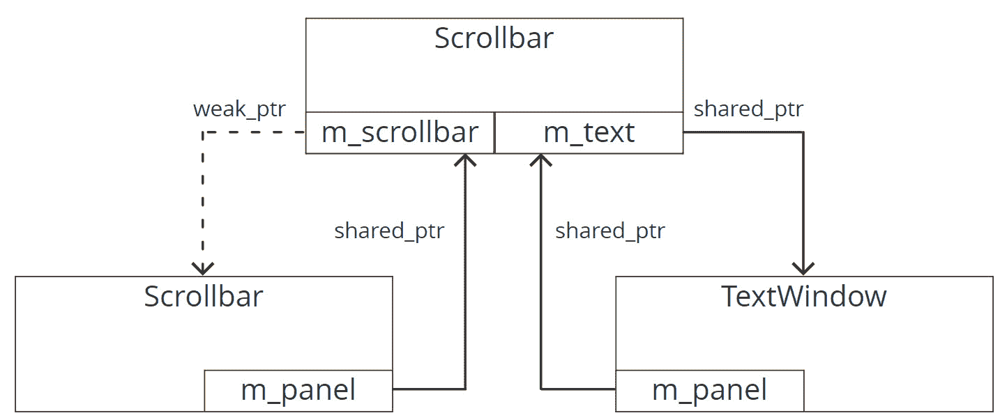

###### 图 3.26:弱 _ptr 和共享 _ptr 周期

### 智能指针和调用函数

既然我们可以管理我们的资源，我们如何使用它们？我们传递聪明的指针吗？当我们有一个智能指针(`unique_ptr`或`shared_ptr`时，我们在调用函数时有四个选项:

*   按值传递智能指针
*   通过引用传递智能指针
*   通过指针传递托管资源
*   通过引用传递托管资源

这不是一份详尽的清单，但却是需要考虑的主要清单。如何传递智能指针或其资源的答案取决于我们调用函数的意图:

*   函数的意图是仅仅使用资源吗？
*   该函数是否拥有资源的所有权？
*   该函数是否替换托管对象？

如果函数只是去`使用资源`，那么它甚至不需要知道它正在被交给一个托管资源。它只需要使用它，并且应该通过指针使用资源来调用，或者通过引用使用资源(或者甚至通过值使用资源):

```cpp
do_something(Resource* resource);
do_something(Resource& resource);
do_something(Resource resource);
```

如果您想将资源的所有权**传递给函数，那么该函数应该由智能指针通过值来调用，并使用 **std::move()** 来调用:**

```cpp
do_something(std::unique_ptr<Resource> resource);
auto res = std::make_unique<Resource>();
do_something (std::move(res));
```

当`do _ 某物()`返回时，`res`变量将为空，资源现在归`do _ 某物()`所有。

如果你想`替换被管理对象`(一个称为**重新拔插**的过程)，那么你通过引用传递智能指针:

```cpp
do_something(std::unique_ptr<Resource>& resource);
```

下面的程序将所有这些放在一起演示每个场景以及如何调用函数:

```cpp
#include <iostream>
#include <memory>
#include <string>
#include <sstream>
class Resource
{
public:
  Resource() { std::cout << "+++Resource acquired ["<< m_id <<"]\n"; }
  ~Resource() { std::cout << "---Resource released ["<< m_id <<"]\n"; }
  std::string name() const {
      std::ostringstream ss;
      ss << "the resource [" << m_id <<"]";
      return ss.str();
  }
  int m_id{++m_count};
  static int m_count;
};
int Resource::m_count{0};
void use_resource(Resource& res)
{
    std::cout << "Enter use_resource\n";
    std::cout << "...using " << res.name() << "\n";
    std::cout << "Exit use_resource\n";
}
void take_ownership(std::unique_ptr<Resource> res)
{
    std::cout << "Enter take_ownership\n";
    if (res)
        std::cout << "...taken " << res->name() << "\n";
    std::cout << "Exit take_ownership\n";
}
void reseat(std::unique_ptr<Resource>& res)
{
    std::cout << "Enter reseat\n";
    res.reset(new Resource);
    if (res)
        std::cout << "...reseated " << res->name() << "\n";
    std::cout << "Exit reseat\n";
}
int main()
{
  std::cout << "Starting...\n";
  auto res = std::make_unique<Resource>();
  // Use - pass resource by reference
  use_resource(*res);               
  if (res)
    std::cout << "We HAVE the resource " << res->name() << "\n\n";
  else
    std::cout << "We have LOST the resource\n\n";
  // Pass ownership - pass smart pointer by value
  take_ownership(std::move(res));    
  if (res)
    std::cout << "We HAVE the resource " << res->name() << "\n\n";
  else
    std::cout << "We have LOST the resource\n\n";
  // Replace (reseat) resource - pass smart pointer by reference
  reseat(res);                      
  if (res)
    std::cout << "We HAVE the resource " << res->name() << "\n\n";
  else
    std::cout << "We have LOST the resource\n\n";
  std::cout << "Exiting...\n";
  return 0;
}
```

当我们运行这个程序时，我们会收到以下输出:

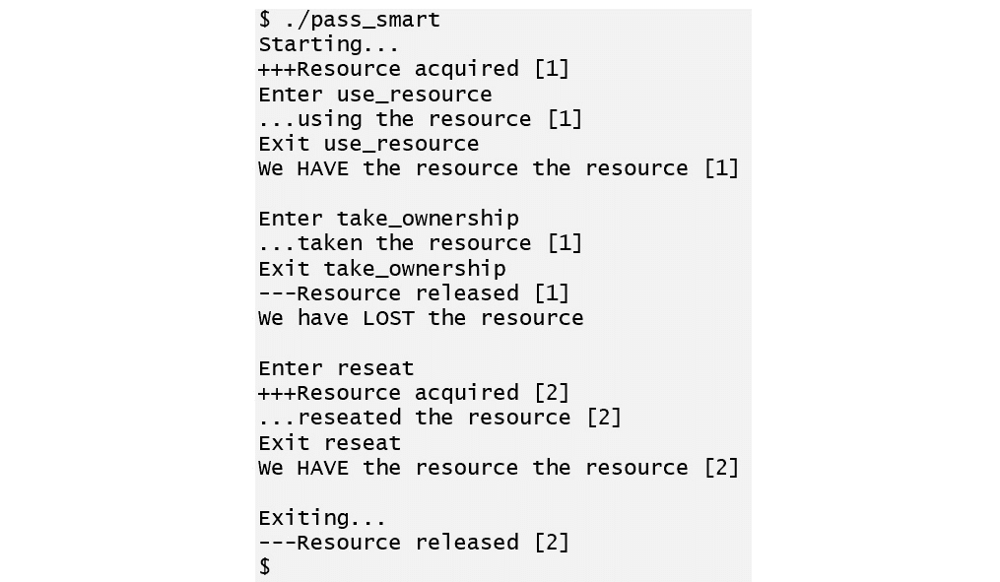

###### 图 3.27:所有权传递程序输出

#### 注意

*C++核心指南*有一整节关于*资源管理*，智能指针，以及如何使用它们这里:[http://isocpp . github . io/cppcoreiders/cppcoreiders # S-resource](http://isocpp.github.io/CppCoreGuidelines/CppCoreGuidelines#S-resource)。我们只触及了准则所涵盖的最重要的方面。

### 练习 4:用 STL 智能指针实现 RAII

在本练习中，我们将实现一个传感器工厂方法，通过`unique_ptr`返回传感器资源。我们将实现一个`unique_ptr`来保存一个数组，然后开发代码将一个`unique_ptr`转换成一个共享指针，然后再共享一些。按照以下步骤实施本练习:

1.  在 Eclipse 中打开**第 3 课**项目。然后在**项目浏览器**中，展开**第 3 课**，然后展开**练习 04** ，双击**练习 4.cpp** 将本练习的文件打开到编辑器中。
2.  点击**启动配置**下拉菜单，选择**新启动配置……**。从**搜索项目**菜单中配置**L3 练习 4** 应用程序，使其以名称**L3 练习 4** 运行。
3.  Click on the **Run** button to run Exercise 4\. This will produce the following output:

    

    ###### 图 3.28:练习 4 的输出

4.  In the editor, examine the code, particularly the factory method, that is, `createSensor(type)`.

    ```cpp
    std::unique_ptr<ISensor>
    createSensor(SensorType type)
    {
        std::unique_ptr<ISensor> sensor;
        if (type == SensorType::Light)
        {
            sensor.reset(new LightSensor);
        }
        else if (type == SensorType::Temperature)
        {
            sensor.reset(new TemperatureSensor);
        }
        else if (type == SensorType::Pressure)
        {
            sensor.reset(new PressureSensor);
        }
        return sensor;
    }
    ```

    这将创建一个名为传感器的空的唯一指针，然后根据传入的`类型`用所需的传感器重置包含的指针。

5.  在编辑器中打开练习 4.cpp，将文件顶部附近的行改为如下所示:

    ```cpp
    #define EXERCISE4_STEP  5
    ```

6.  Click on the **Run** button to compile the code, which will fail with the following error:

    

    ###### 图 3.29:步骤 5 的编译器错误

    完整的错误消息如下:

    ```cpp
    error: conversion from 'std::unique_ptr<ISensor>' to non-scalar type 'SensorSPtr {aka std::shared_ptr<ISensor>}' requested
    ```

    根据错误，我们试图将`唯一 _ptr`分配给`共享 _ptr`，这是不允许的。

7.  找到报告错误的行，并将其改为如下内容:

    ```cpp
    SensorSPtr light2 = std::move(light);
    ```

8.  Click on the **Run** button to compile and run the program. The output is as follows:

    

    ###### 图 3.30:练习 4 的成功输出(练习 4_STEP = 5 之后)

    前面的输出显示，我们创建了三个不同的传感器，光传感器指针从持有资源到移动，并且**光 2** 共享指针有两个所有者。等等！什么事？两个主人？但是我们所做的只是将资源从`light`(一个`unique_ptr`)移动到`light2`(一个`shared_ptr`)。问题实际上是模板方法:

    ```cpp
    template<typename SP>
    void printSharedPointer(SP sp, const char* message)
    ```

    第一个参数是通过值传递的，这意味着将创建一个新的`shared_ptr`副本并传递给方法进行打印。

9.  Let's fix that now by changing the template to pass-by-reference. Click on the **Run** button to compile and run the program. The following output is generated:

    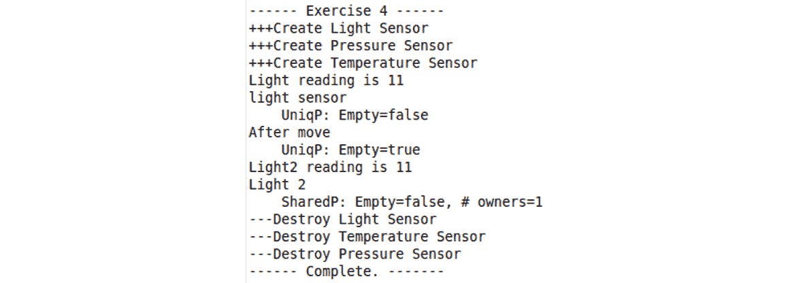

    ###### 图 3.31:已更正的 printSharedPointer 输出

10.  在编辑器中打开**练习 4.cpp** ，将文件顶部附近的行改为这样:

    ```cpp
    #define EXERCISE4_STEP  12
    ```

11.  Click on the **Run** button to compile and run the program. The following output is generated:

    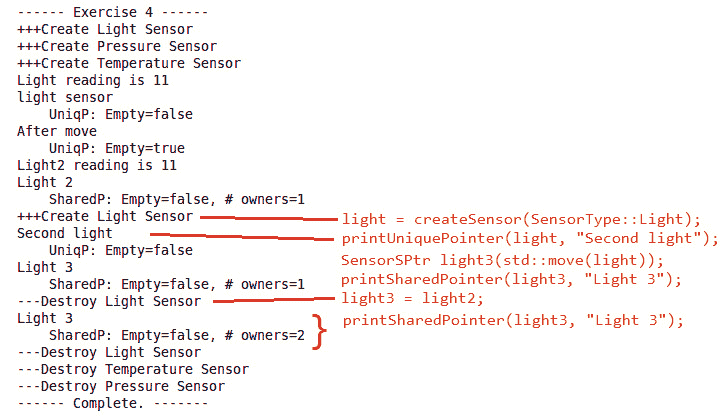

    ###### 图 3.32:练习 4 的注释步骤 12 输出

12.  将输出与`测试传感器()`方法中的代码进行比较。我们会发现我们可以很容易地分配给一个空的`unique_ptr` ( `light`)并且我们可以从一个`shared_ptr`分配给另一个(`light3 = light2`)而不需要`std::move()`。
13.  在编辑器中打开**练习 4.cpp** ，将文件顶部附近的行改为这样:

    ```cpp
    #define EXERCISE4_STEP  15
    ```

14.  Click on the **Run** button to compile and run the program. The output switches to the following:

    

    ###### 图 3.33:在 unique_ptr 中管理阵列

15.  Open the editor and find the `testArrays()` method:

    ```cpp
    void testArrays()
    {
        std::unique_ptr<int []> board = std::make_unique<int []>(8*8);
        for(int i=0  ; i<8 ; i++)
            for(int j=0 ; j<8 ; j++)
                board[i*8+j] = 10*(i+1)+j+1;
        for(int i=0  ; i<8 ; i++)
        {
            char sep{' '};
            for(int j=0 ; j<8 ; j++)
                std::cout << board[i*8+j] << sep;
            std::cout << "\n";
        }
    }
    ```

    这段代码中有几点需要注意。首先，类型被声明为 **int[]** 。我们选择了 **int** 进行本练习，但它可以是任何类型。其次，当**unique _ ptr**(c++ 17 中的 **shared_ptr** )用于管理数组时，定义**运算符[]** 。因此，我们通过从二维索引的板[i*8+j] 计算一维索引来模拟二维数组。

16.  编辑方法第一行，声明`自动`类型:

    ```cpp
    auto board = std::make_unique<int []>(8*8);
    ```

17.  点击**运行**按钮编译并运行程序——输出将与前一次运行相同。在这种情况下，auto 非常有用，因为您不再需要在类型声明中键入所有细节，也不再需要调用`make_unique()`。

在本练习中，我们实现了一个工厂功能，该功能使用`unique_ptr`来管理传感器的寿命，从而为制造的传感器提供服务。然后我们实现了代码，将它从一个`unique_ptr`更改为几个对象。最后，我们开发了一种`独特的 _ptr`技术来使用一维数组管理多维数组。

### 零/五法则——不同的视角

当我们引入 **BufferedWriter** 时，它有两个被管理的资源:内存和一个文件。然后，我们讨论了默认编译器如何生成被称为浅拷贝的拷贝操作。我们讨论了如何以不同的方式管理资源—停止拷贝、执行深度拷贝或转移所有权。我们在这种情况下决定做的事情被称为资源管理策略。你选择的政策会影响你如何执行零/五的**规则。**

在资源管理方面，一个类可以不管理任何资源，管理一个可以复制但不能移动的资源，管理一个可以移动但不能复制的资源，或者管理一个既不能复制也不能移动的资源。下列类别显示了如何表达这些内容:

```cpp
struct NoResourceToManage
{
    // use compiler generated copy & move constructors and operators
};
struct CopyOnlyResource
{
    ~CopyOnlyResource()                                      {/* defined */ }
    CopyOnlyResource(const CopyOnlyResource& rhs)            {/* defined */ }
    CopyOnlyResource& operator=(const CopyOnlyResource& rhs) {/* defined */ }
    CopyOnlyResource(CopyOnlyResource&& rhs) = delete;
    CopyOnlyResource& operator=(CopyOnlyResource&& rhs) = delete;
};
struct MoveOnlyResource
{
    ~MoveOnlyResource()                                      {/* defined */ }
    MoveOnlyResource(const MoveOnlyResource& rhs)             = delete;
    MoveOnlyResource& operator=(const MoveOnlyResource& rhs)  = delete;
    MoveOnlyResource(MoveOnlyResource&& rhs)                 {/* defined */ }  
    MoveOnlyResource& operator=(MoveOnlyResource&& rhs)      {/* defined */ }
};
struct NoMoveOrCopyResource
{
    ~NoMoveOrCopyResource()                                  {/* defined */ }
    NoMoveOrCopyResource(const NoMoveOrCopyResource& rhs)             = delete;
    NoMoveOrCopyResource& operator=(const NoMoveOrCopyResource& rhs)  = delete;
    NoMoveOrCopyResource(NoMoveOrCopyResource&& rhs)                  = delete;
    NoMoveOrCopyResource& operator=(NoMoveOrCopyResource&& rhs)       = delete;
};
```

由于在所有上下文和异常情况下管理资源的复杂性，最佳实践是，如果一个类负责管理资源，那么该类只负责管理该资源。

### 活动 1:用 RAII 和 Move 实现图形处理

在*章 2A**不准鸭子入内-类型与演绎*中，你的团队努力工作，得到了`点 3d`和`矩阵 3d`的实施。现在，您的公司想要营销该库，在他们做到这一点之前，它需要两大改进:

*   这些类必须在我们公司的命名空间中，即高级 Plus Inc .中。因此，图形的命名空间将是`accp::gfx`。
*   `点 3d`和`矩阵 3d`中矩阵的存储是类的固有部分，因此它是从堆栈而不是堆中分配的。作为库矩阵支持的发展，我们需要从堆中分配内存。当我们致力于在未来的版本中实现更大的矩阵时，我们也希望在我们的类中引入移动语义。

按照以下步骤实现:

1.  从我们当前版本的库开始(可以在**第 3 课/练习 01** 文件夹中找到)，将我们所有的类放入`acpp::gfx`命名空间。
2.  修复所有因为变更而失败的测试。(失败可能意味着编译失败，而不仅仅是运行测试。)
3.  在`Matrix3d`中，从直接在类中声明矩阵切换到堆分配的内存进行存储。
4.  通过实现复制构造函数和复制赋值操作符的深度复制实现来修复失败的测试。进行任何其他必要的更改，以适应新的内部表示。请注意，您不需要修改任何测试来让它们通过，它们只访问公共接口，这意味着我们可以在不影响客户端的情况下更改内部结构。
5.  通过在返回语句中使用`std::move`在`CreateTranslationMatrix()`中强制调用移动构造函数来触发另一个失败。在`Matrix3d`类中介绍所需的移动操作，以使测试能够编译并通过。
6.  对`点 3d`重复步骤 3 至 4。

在执行了前面的步骤之后，预期的输出从一开始就不会改变:

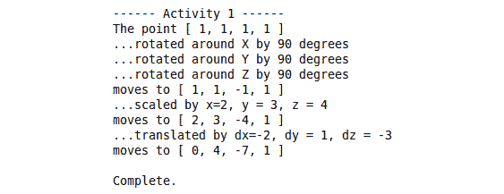

###### 图 3.34:成功转换为使用 RAII 后的活动 1 输出

#### 注意

这个活动的解决方案可以在第 657 页找到。

### 什么时候调用函数？

C++程序执行的所有操作本质上都是函数调用(尽管编译器可能会将它们优化为内联操作序列)。然而，由于**语法糖**，你正在进行函数调用可能并不明显。语法糖是编程语言中的语法，它使阅读或表达变得更容易。比如你写`a = 2 + 5`的时候，本质上是在调用`运算符=( & a，运算符+(2，5))`。只是这种语言允许我们编写第一种形式，但第二种形式允许我们重载运算符，并将这些功能扩展到用户定义的类型。

以下机制导致对函数的调用:

*   对函数的显式调用。
*   所有运算符，如+、-、*、/、%等，以及 new/delete。
*   变量声明–如果存在初始化值，将导致用参数调用构造函数。
*   用户定义的文字–我们没有处理这些，但是本质上，我们为`类型运算符“【名称(参数)`”定义了一个重载。然后我们可以编写诸如 10_km 这样的东西，这使得我们的代码更容易理解，因为它携带了语义信息。
*   从一个值到另一个值的铸造(`静态 _ 铸造< >`，`const _ 铸造< >`，`重新解释 _ 铸造< >`，以及`动态 _ 铸造< >`)。同样，我们还有另一个运算符重载，它允许我们从一种类型转换为另一种类型。
*   在函数重载期间，可能需要将一种类型转换为另一种类型，以便它与函数原型相匹配。它可以通过调用具有正确参数类型的构造函数来创建临时的，或者通过隐式调用的强制转换操作符来实现。

编译器中的每一个结果都决定了一个函数必须被调用。在确定需要调用函数后，它必须找到与名称和参数匹配的函数。这是我们将在下一节讨论的内容。

### 调用哪个函数

在*章节 2A**不允许鸭子-类型和演绎*中，我们看到功能过载解析执行如下:

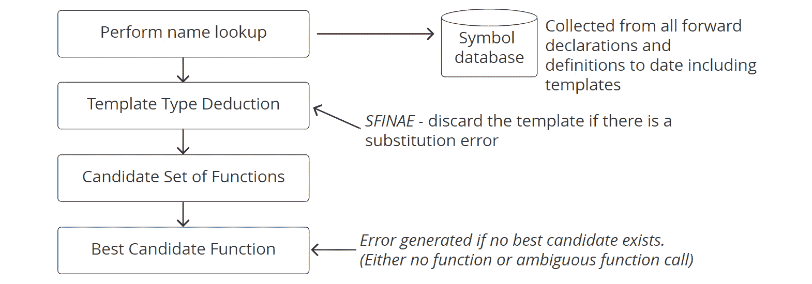

###### 图 3.35:函数霸王解析

我们真正没有深入研究的是名称查找的概念。在某个时候，编译器会遇到对`函数`函数的以下调用:

```cpp
func(a, b);
```

当这种情况发生时，它必须将其名称与引入它的声明相关联。这个过程叫做**名称查找**。对于程序中的所有项目(变量、名称空间、类、函数、函数模板和模板)，这种名称查找是正确的。对于要编译的程序，变量、名称空间和类的名称查找过程必须生成一个声明。但是，对于函数和函数模板，编译器可能会将多个具有相同名称的声明关联起来——主要是通过函数重载，由于**依赖于参数的查找** ( **ADL** )，函数重载可能会被扩展以考虑其他函数。

### 标识符

按照 C++标准的定义，**标识符**是由大写和小写拉丁字母、数字、下划线和大多数 Unicode 字符组成的序列。有效的标识符必须以非数字字符开头，并且长度任意且区分大小写。每个角色都很重要。

### 名称

**名称**用于指代实体或标签。名称是以下形式之一:

*   标识符
*   函数符号中的重载运算符名称(例如运算符-，运算符删除)
*   模板名称后跟其参数列表(向量<int>)</int>
*   用户定义的转换函数名(运算符 float)
*   用户定义的文字运算符名称(运算符" " _ms)

每个实体及其名称都是通过声明引入的，而标签的名称是通过**转到**语句或通过带标签的语句引入的。一个名称可以在一个文件(或翻译单元)中多次使用，以根据范围引用不同的实体。根据链接的不同，一个名称也可以用来指代多个文件(翻译单元)中的同一个实体，或者不同的实体。编译器使用名称查找通过**名称查找**将引入名称的声明与程序中的未知名称相关联。

### 名称查找

名称查找过程是两个过程之一，根据上下文进行选择:

*   **限定名查找**:名称出现在范围解析运算符`::`的右侧，或者可能出现在`:`之后，后跟`模板`关键字。限定名可以指命名空间成员、类成员或枚举数。`::`运算符左侧的名称定义了查找名称的范围。如果没有名称，则使用全局命名空间。
*   **不合格名称查找**:其他一切。在这种情况下，名称查找检查当前范围和所有封闭范围。

如果未限定的名称留在函数调用运算符“`)(`”中，则它使用依赖于参数的查找。

### 依赖于参数的查找

查找非限定函数名的规则集被称为`依赖于参数的查找`(称为 ADL)，或`柯尼格查找`(以安德鲁·克尼格命名，他定义了它，并且是 C++标准委员会的长期成员)。非限定函数名可以作为函数调用表达式出现，也可以作为对重载运算符的隐式函数调用的一部分出现。

ADL 基本上说，除了在非限定名称查找时考虑的范围和命名空间之外，还考虑了所有参数和模板参数的“关联命名空间”。考虑以下代码:

```cpp
#include <iostream>
#include <string>
int main()
{
    std::string welcome{"Hello there"};
    std::cout << welcome;
    endl(std::cout);
}
```

当我们编译并运行这段代码时，输出如预期的那样:

```cpp
$ ./adl.exe
Hello there
$
```

这是一种不同寻常的编写程序的方法。通常，它会这样写:

```cpp
#include <iostream>
#include <string>
int main()
{
    std::string welcome{"Hello there"};
    std::cout << welcome << std::endl;
}
```

我们在用调用`endl()`的奇怪方法来展示 ADL。但是这里有两个 ADL 查找。

第一个经历 ADL 的函数调用是`std::cout < < welcome`，编译器认为是`运算符< < (std::cout，welcome)`。名称操作符< <现在可以在可用的范围及其参数的名称空间中找到–`标准`。这个额外的命名空间将名称解析为自由方法，即在字符串头中声明的`STD::operator<<(ostream&OS，string & s)`。

第二个调用更明显`endl(std::cout)`。同样，编译器可以访问 std 名称空间来解析这个名称查找，并在标题`中找到 **std::endl**`**模板**(包含在`iostream`中)。

没有 ADL，编译器无法找到这两个函数，因为它们是由 iostream 和 string 包提供给我们的自由函数。插入符的魔力(<STD::operator<T5】(STD::cout，欢迎)。如果你考虑链式插入，那就更糟了。或者，您可以使用命名空间 std 编写“**；**”。这两个选项都不理想，这就是为什么我们需要 ADL(柯尼格查找)。

### 买者自负

我们已经看到了 ADL 如何通过包含与函数参数类型相关的名称空间来让程序员的生活变得更容易。然而，这种查找功能并不是没有风险的，在很大程度上，我们可以将风险降到最低。考虑以下示例代码:

```cpp
#include <iostream>
namespace mylib 
{
void is_substring(std::string superstring, std::string substring)
{
    std::cout << "mylib::is_substring()\n";
}
void contains(std::string superstring, const char* substring) {
    is_substring(superstring, substring);
}
}
int main() {
    mylib::contains("Really long reference", "included");
}
```

当我们编译并运行前面的程序时，我们得到了预期的输出:


###### 图 3.36: ADL 示例程序输出

C++标准委员会随后决定引入一个`is_substring()`函数，如下所示:

```cpp
namespace std {
void is_substring(std::string superstring, const char* substring)
{
    std::cout << "std::is_substring()\n";
}
}
```

如果我们将它添加到文件的顶部，编译并重新运行它，我们现在会得到以下输出:


###### 图 3.37: ADL 发布程序输出

得益于 ADL，(下一个 C++标准)编译器选择了不同的实现，更适合`is_substring()`的非限定函数调用。因为参数的隐式转换，所以不会发生冲突，这种冲突会导致歧义和编译器错误。它只是默默地采用新的方法，如果参数顺序不同，这可能会导致微妙和难以发现的错误。编译器只能检测类型和语法差异，而不能检测语义差异。

#### 注意

为了演示 ADL 是如何工作的，我们将我们的函数添加到了 std 名称空间中。名称空间用于分离关注点，并添加到其他人的名称空间中，特别是`标准库名称空间` ( `std`)不是好的做法。

那么，为什么要买者自负(买家当心)？如果您在开发中使用第三方库(包括 C++标准库)，那么当您升级库时，您需要确保对接口的更改不会因为 ADL 而给您带来问题。

### 练习 5:实施模板以防止日常生活能力问题

在本练习中，我们将演示 C++17 STL 中的一个突破性变化，它可能会在野外引起一个问题。C++11 为`std::begin(type)`和朋友介绍了模板。作为开发人员，这是通用接口的一个吸引人的表达，您可能已经为 size(类型)和 empty(类型)编写了自己的版本。按照以下步骤实施本练习:

1.  在 Eclipse 中打开**第 3 课**项目。然后在**项目浏览器**中，展开**第 3 课**，然后展开**练习 05** ，双击**练习 5.cpp** 将本练习的文件打开到编辑器中。
2.  点击**启动配置**下拉菜单，选择**新启动配置……**。从“搜索项目”菜单中配置**L3 练习 5** 应用程序，使其以名称**L3 练习 5** 运行。
3.  Click on the **Run** button to run Exercise 5\. This will produce the following output:

    

    ###### 图 3:38:成功执行练习 5

4.  对代码的检查揭示了两个助手模板:

    ```cpp
    template<class T>
    bool empty(const T& x)
    {
        return x.empty();
    }
    template<class T>
    int size(const T& x)
    {
        return x.size();
    }
    ```

5.  与所有其他练习不同，本练习被配置为在 C++ 14 下构建。打开**第 3 课**下的 **CMakeLists.txt** 文件，找到以下行:

    ```cpp
    set_property(TARGET L3Exercise5 PROPERTY CXX_STANDARD 14)
    ```

6.  将`14`改为`17`。
7.  Click on the **Run** button to compile the exercise which now fails:

    

    ###### 图 3.39:在 C++ 17 下编译失败——模糊的函数调用

8.  因为`empty()`和`size()`模板的参数是一个 std::vector，所以 ADL 引入了这些模板新包含的 STL 版本，并破坏了我们的代码。
9.  在**练习 5.cpp** 文件中，找到产生错误的两次出现的`空()`和两次出现的`大小()`，并在它们之前插入两个冒号“`::`”(范围说明符)。
10.  点击**运行**按钮，编译并运行练习。它现在愉快地编译并再次运行，因为对`空()`和`大小()`函数的调用现在被限定了。我们可以同样指定`标准::`范围。

在本练习中，我们在全局命名空间中实现了两个模板函数，如果我们在 C++ 14 标准下编译程序，这两个模板函数可以很好地工作。然而，当我们在 C++17 下编译时，我们的实现崩溃了，因为 STL 库发生了变化，我们不得不改变我们的实现，以确保编译器找到并使用我们编写的模板。

### 隐式转换

在*图 3.36* 、*函数重载解析*中确定候选函数集时，编译器必须查看名称查找过程中找到的所有可用函数，并确定参数号和类型是否与调用点匹配。在确定类型是否匹配时，它还将检查所有可用的转换，以确定是否有从类型 T1 类型(传递的参数的类型)转换为 T2 类型(为函数参数指定的类型)的机制。如果它可以将所有参数从 T1 转换为 T2，那么它会将该函数添加到候选集。

这种从 T1 类型到 T2 类型的转换被称为**隐式转换**，当在不接受该类型但接受其他类型(T2)的表达式或上下文中使用 T1 类型时，就会发生这种转换。这发生在以下环境中:

*   当调用以 T2 为参数声明的函数时，T1 作为参数传递。
*   T1 用作期望 T2 的运算符的操作数。
*   T1 用于初始化 T2 的一个新对象(包括返回语句)。
*   T1 用在`开关`语句中(在这种情况下，T2 是一个整数)。
*   T1 用于 if 语句或 **do-while** 或 **while** 循环(其中 T2 是布尔)。

如果存在从 T1 到 2 的明确转换序列，那么程序将编译。内置类型之间的转换通常由通常的算术转换决定。

### 显式–防止隐式转换

隐式转换是一个很好的特性，它使得程序员能够表达他们的意图，而且它在大多数时候都是有效的。然而，编译器在没有程序员提供提示的情况下将一种类型转换成另一种类型的能力并不总是令人满意的。考虑以下小程序:

```cpp
#include <iostream>
class Real
{
public:
    Real(double value) : m_value{value} {}
    operator float() {return m_value;}
    float getValue() const {return m_value;}
private:
    double m_value {0.0};
};
void test(bool result)
{
    std::cout << std::boolalpha;
    std::cout << "Test => " << result << "\n";
}
int main()
{
    Real real{3.14159};
    test(real);
    if ( real ) 
    {
        std::cout << "true: " << real.getValue() << "\n";
    }
    else
    {
        std::cout << "false: " << real.getValue() << "\n";
    }
}
```

当我们编译它并运行前面的程序时，我们会得到以下输出:


###### 图 3.40:隐式转换示例程序输出

嗯，这可能有点出乎意料，这编译并实际产生了一个输出。**实数**变量属于**实数**类型，它有一个要浮动的转换运算符–**运算符 float()** 。 **test()** 函数以一个 **bool** 作为参数，如果条件一定会导致一个 **bool** 。如果数值为零，编译器会将任何数值类型转换为值为 false 的**布尔**类型，如果数值不为零，则转换为 true。但是，如果这不是我们想要的行为，我们可以通过在函数声明前加上显式关键字来防止它。假设我们更改了行，它的内容如下:

```cpp
explicit operator float() {return m_value;}
```

如果我们现在试图编译它，我们会得到两个错误:


###### 图 3.41:编译错误，因为隐式转换被移除了。

这两种情况都与无法将实数类型转换为布尔值有关–首先，在调用点进行`测试()`，然后在 if 条件下进行。

现在，让我们引入一个 bool 转换运算符来解决这个问题。

```cpp
operator bool() {return m_value == 0.0;}
```

我们现在可以再次构建程序。我们将收到以下输出:


###### 图 3.42:引入 bool 运算符代替隐式转换

`布尔`值现在为假，而以前为真。这是因为浮点转换返回的值的隐式转换不是零，然后转换为 true。

从 C++ 11 开始，所有的构造函数(复制和移动构造函数除外)都被认为是转换构造函数。这意味着，如果它们不是用显式声明的，那么它们可用于隐式转换。同样，任何未声明为显式的转换运算符都可以用于隐式转换。

`C++核心指南`有两条与隐式转换相关的规则:

*   **C.46** :默认情况下，将单参数构造函数声明为显式的
*   **C.164** :避免隐式转换运算符

### 上下文转换

如果我们现在对我们的小程序做一个进一步的改变，我们可以进入所谓的上下文转换。让我们明确 bool 运算符，并尝试编译程序:

```cpp
explicit operator bool() {return m_value == 0.0;}
```

我们将收到以下输出:

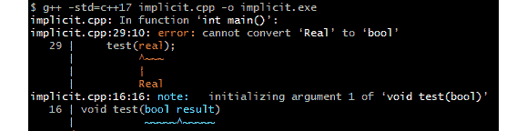

###### 图 3.43:使用显式 bool 运算符编译错误

这次我们在调用`test()`的地方只有一个错误，但不是 if 条件。我们可以通过使用 C 风格的 case (bool)或 c++`static _ cast<bool>(real)`(这是首选方法)来修复此错误。当我们添加强制转换时，程序会再次编译并运行。

那么，如果 bool 强制转换是显式的，那么 if 表达式的条件为什么不需要强制转换呢？

C++标准允许在某些上下文中使用`bool`类型，并且存在 bool 转换的声明(无论是否标记为显式)。如果发生这种情况，则允许隐式转换。这在上下文中被称为**转换为布尔**，并且可能发生在以下上下文中:

*   `的条件(或控制表达)如果`、`而`、`为`
*   内置逻辑运算符的操作数:`！`(不是)`& &`(和)和`||`(或)
*   三进制(或条件)运算符的第一个操作数`？:`。

### 练习 6:隐式和显式转换

在本练习中，我们将尝试调用函数、隐式转换、防止它们以及启用它们。按照以下步骤实施本练习:

1.  在 Eclipse 中打开**第 3 课**项目。然后在**项目浏览器**中，依次展开**第 3 课**和**练习 06** ，双击**练习 6.cpp** 将本练习的文件打开到编辑器中。
2.  点击**启动配置**下拉菜单，选择**新启动配置……**。从**搜索项目**菜单中配置**l3 锻炼 6** 应用程序，使其以名称**l3 锻炼 6** 运行。
3.  Click on the **Run** button to run Exercise 6\. This will produce the following output:

    

    ###### 图 3.44:练习 6 的默认输出

4.  在文本编辑器中，将`电压`的构造函数更改为`显式` :

    ```cpp
    struct Voltage
    {
        explicit Voltage(float emf) : m_emf(emf) 
        {
        }
        float m_emf;
    };
    ```

5.  Click on the **Run** button to recompile the code – now we get the following error:

    

    ###### 图 3.45:整数到电压的转换失败

6.  从构造函数中移除显式，并将`计算`函数改为引用:

    ```cpp
    void calculate(Voltage& v)
    ```

7.  Click on the **Run** button to recompile the code – now, we get the following error:

    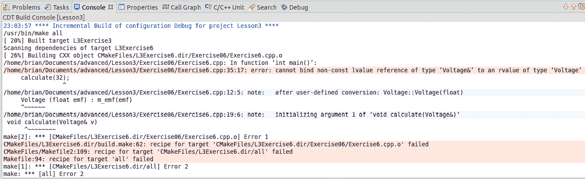

    ###### 图 3.46:整数到电压&

    同一行有我们之前运行的问题，但原因不同。所以，*隐式转换只适用于值类型*。

8.  注释掉产生错误的行，然后在调用`后，使用 _float(42)`，添加以下行:

    ```cpp
    use_float(volts);
    ```

9.  Click on the **Run** button to recompile the code – now we get the following error:

    

    ###### 图 3.47:电压转换为浮动失败

10.  现在，将以下铸造操作员添加到`电压`等级:

    ```cpp
    operator float() const
    {
        return m_emf;
    }
    ```

11.  Click on the **Run** button to recompile the code and run it:

    

    ###### 图 3.48:成功将电压转换为浮动

12.  Now, place the `explicit` keyword in front of the cast that we just added and click on the **Run** button to recompile the code. Again, we get an error:

    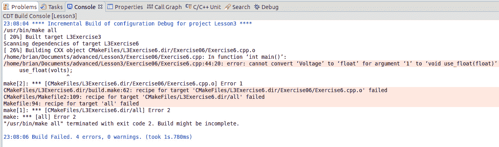

    ###### 图 3.49:无法将电压转换为浮动

13.  通过将显式声明添加到强制转换中，我们可以防止编译器使用转换运算符。更改带有错误的行，将伏特变量转换为浮点数:

    ```cpp
    use_float(static_cast<float>(volts));
    ```

14.  点击**运行**按钮重新编译代码并运行。


###### 图 3.50:电压转换成浮子，再次铸造

在本练习中，我们已经看到隐式转换可以发生在类型之间(而不是引用之间)，并且我们可以控制它们何时发生。现在我们知道如何控制这些转换，我们可以努力满足之前引用的指南`C.46`和`C.164`。

### 活动 2:实现日期计算类离子

您的团队负责开发一个库来帮助进行与日期相关的计算。特别是，我们希望能够确定两个日期和给定日期之间的天数，增加(或减去)天数以获得新的日期。本活动将开发两种新类型，并对它们进行增强，以确保程序员不会意外地让它们与内置类型进行交互。按照以下步骤实现:

1.  设计并实现一个`日期`类，将`日`、`月`和`年`存储为整数。
2.  添加访问内部日、月和年值的方法。
3.  定义一个类型，`date_t`来表示自 1970 年 1 月 1 日`纪元日期`以来的天数。
4.  向`Date`类添加一个方法，将其转换为`date_t`。
5.  从`日期 _t`值中添加一个设置`日期`类的方法。
6.  创建一个存储天数值的`Days`类。
7.  在以`日`为自变量的`日`上加上`加法`运算符。
8.  使用`显式`防止数字相加。
9.  加上`减法`运算符，从两个`日期`的`差值`中返回一个`天数`值。

完成这些步骤后，您应该会收到以下输出:

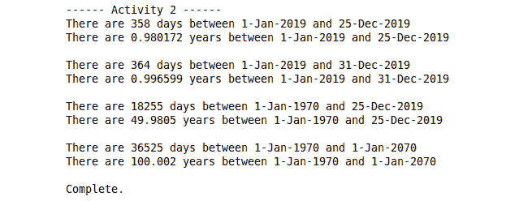

###### 图 3.51:成功的日期示例应用程序的输出

#### 注意

这项活动的解决方案可以在第 664 页找到。

## 苏〔t0〕麦理

在这一章中，我们探讨了变量的生命周期——自动的和动态的，它们存储在哪里，以及何时被析构。然后，我们使用这些信息开发了 **RAII** 技术，该技术允许我们几乎忽略资源管理，因为即使在出现异常的情况下，自动变量也会在它们被析构时清理它们。然后，我们研究了抛出异常并捕捉它们，以便我们可以在正确的级别处理异常情况。从 **RAII** 开始，我们开始讨论资源的所有权以及 **STL** 智能指针如何在这方面帮助我们。我们发现几乎所有的事情都被视为函数调用，因此允许运算符重载和隐式转换。我们发现了奇妙的(或者是可怕的？)依赖于参数的查找世界 ( **ADL** )以及它如何可能在未来绊倒我们。我们现在对 C++的基本特性有了很好的理解。在下一章中，我们将开始探索函数对象，以及如何使用 lambda 函数实现它们。当我们再次访问封装时，我们将深入研究 STL 的产品并探索 PIMPLs。