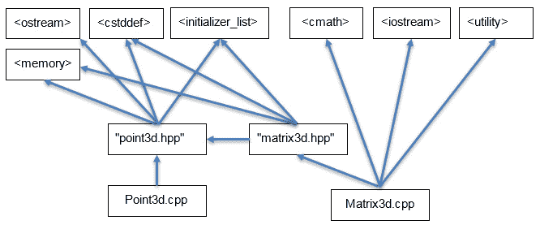
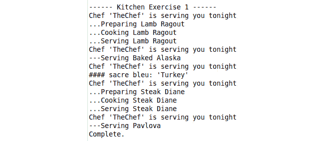
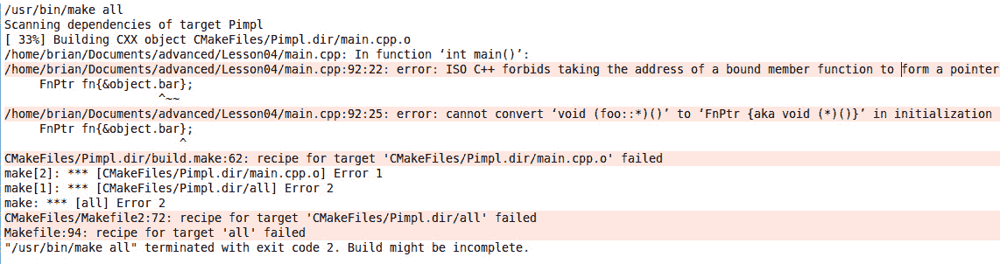
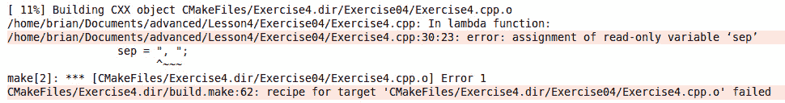

# 四、关注点分离——软件架构、函数和可变模板

## 学习目标

本章结束时，您将能够:

*   使用 PIMPL 习惯用法开发类来实现对象级封装
*   使用函子、标准::函数和 lambda 表达式实现回调系统
*   根据情况使用正确的捕获技术实现 lambdas
*   开发变量模板来实现 C#风格的事件处理委托。

本章将向您展示如何实现 PIMPL 习惯用法，以及如何为您自己的程序开发回调机制。

## 简介

在前一章中，我们学习了如何使用 RAII 实现类来正确管理资源，即使异常发生时也是如此。我们还学习了 ADL ( **自变量相关查找**)以及它如何确定要调用的函数。最后，我们讨论了如何使用显式关键字来防止编译器在类型之间进行自动转换，这就是所谓的隐式转换

在本章中，我们将研究物理和逻辑的依赖关系，看看它们如何对构建时间产生负面影响。我们还将学习如何将可见接口类从实现细节中分离出来，以提高构建速度。然后，我们将学习捕获函数和上下文，以便稍后使用`函子`、`std::function`和`lambda 表达式`调用它们。最后，我们将实现一个变量模板来提供一个基于事件的回调机制。

### 实现的指针(PIMPL)成语

随着用 C++ 实现的项目越来越大，构建时间可能会以比文件数量更快的速度增长。这是因为 C++ 构建模型使用了文本包含模型。这样做是为了让编译器能够确定类的大小和布局，导致`调用方`和`被调用方`之间的耦合，但允许优化。请记住，在使用之前，必须定义所有内容。一个名为`模块`的未来特性有望解决这个问题，但是现在我们需要了解这个问题以及用于解决这个问题的技术。

### 逻辑和物理依赖关系

当我们希望从另一个类访问一个类时，我们有一个逻辑依赖。一个类在逻辑上依赖于另一个类。如果考虑到我们在*章 2A**中开发的`图形`类、`点 3d`和`矩阵 3d`，不允许鸭子-类型和演绎*和*第 3 章*、*可以和应该之间的距离-对象、指针和继承*，我们有两个逻辑上独立的类`矩阵 3d`和`点 3d`。然而，由于我们如何实现两者之间的乘法运算符，我们创建了编译时或**物理依赖关系**。



###### 图 4.1:矩阵 3d 和点 3d 的物理依赖关系

我们可以看到，对于这些相对简单的类，头文件和实现文件之间的物理依赖关系可能会很快变得复杂。正是这种复杂性导致了大型项目的构建时间，因为物理(和逻辑)依赖项的数量增长到了数千个。在前面的图中，我们只显示了 13 个依赖项，如箭头所示。但实际上还有很多，因为包含标准库头通常会引入包含文件的层次结构。这意味着，如果一个头文件被修改，那么所有依赖于它的文件，无论是直接的还是间接的，都需要被重新编译以解释这个变化。如果对私有类成员定义的更改是该类的用户甚至不能访问的，也会发生这种重建触发器。

为了帮助加快编译时间，我们使用了保护技术来防止头文件被多次处理:

```cpp
#if !defined(MY_HEADER_INCLUDED)
#define   MY_HEADER_INCLUDED
// definitions 
#endif // !defined(MY_HEADER_INCLUDED)
```

最近，大多数编译器都支持`#pragma 一次`指令，这也达到了同样的效果。

实体(文件、类等)之间的这些关系称为**耦合**。如果对文件/类的更改导致对另一个文件/类的更改，则该文件/类是与另一个文件/类高度耦合的**。如果对文件/类的更改不会导致对其他文件/类的更改，则文件/类是**松散耦合到另一个文件/类的**。**

高度耦合的代码(文件/类)会给项目带来问题。高度耦合的代码很难改变(不灵活)，很难测试，也很难理解。另一方面，松散耦合的代码更容易更改(只修改一个类)，可测试性更高(只需要被测试的类)，更容易阅读和理解。耦合反映了逻辑和物理的依赖关系，并与之相关。

### 实现的指针(PIMPL)成语

耦合问题的一个解决方案是使用“**pumpol 习语**”(代表**指向实现习语**)。这也被称为不透明指针、编译器防火墙习惯用法甚至是**柴郡猫技术**。考虑 **Qt 库**，特别是 **Qt 平台抽象** ( **QPA** )。它是一个抽象层，隐藏了 Qt 应用所在的操作系统和/或平台的细节。实现这种层的一种方法是使用 PIMPL 习惯用法，其中公共接口向应用开发人员公开，但是如何交付功能的实现是隐藏的。Qt 实际上使用了 PIMPL 的一种变体，称为 d 指针。

例如，图形用户界面的一个特点是使用对话框，这是一个显示信息或提示用户输入的弹出窗口。可以在**对话框中声明如下:**

#### 注意

有关 QT 平台抽象(QPA)的更多信息，请访问以下链接:[https://doc.qt.io/qt-5/qpa.html#](https://doc.qt.io/qt-5/qpa.html#)。

```cpp
#pragma once
class Dialog
{
public:
    Dialog();
    ~Dialog();
    void create(const char* message);
    bool show();
private:
    struct DialogImpl;
    DialogImpl* m_pImpl;
};
```

用户可以访问使用`对话框`所需的所有功能，但不知道如何实现。注意，我们有一个声明的`对话模板`，但没有定义它。总的来说，像`对话模板`这样的类我们无能为力。但是有一件事是允许的，那就是声明一个指向它的指针。C++ 的这个特性允许我们在实现文件中隐藏实现细节。这意味着在这个简单的例子中，我们没有这个声明的任何包含文件。

实现文件 **dialogImpl.cpp** 可以实现为:

```cpp
#include "dialog.hpp"
#include <iostream>
#include <string>
struct Dialog::DialogImpl
{
    void create(const char* message)
    {
        m_message = message;
        std::cout << "Creating the Dialog\n";
    }
    bool show()
    {
        std::cout << "Showing the message: '" << m_message << "'\n";
        return true;
    }
    std::string m_message;
};
Dialog::Dialog() : m_pImpl(new DialogImpl)
{
}
Dialog::~Dialog()
{
    delete m_pImpl;
}
void Dialog::create(const char* message)
{
    m_pImpl->create(message);
}
bool Dialog::show()
{
    return m_pImpl->show();
}
```

我们注意到以下几点:

*   在定义 Dialog 所需的方法之前，我们先定义实现类`DialogImpl`。这是必要的，因为`对话框`将需要通过`m _ Pippl`来练习这些方法，这意味着需要首先定义它们。
*   `对话框`构造器和析构器负责内存管理。
*   我们只在实现文件中包含实现所需的所有必要头文件。这通过最小化包含在 **Dialog.hpp** 文件中的头的数量来减少耦合。

该程序可以按如下方式执行:

```cpp
#include <iostream>
#include "dialog.hpp"
int main()
{
    std::cout << "\n\n------ Pimpl ------\n";
    Dialog dialog;
    dialog.create("Hello World");
    if (dialog.show())
    {
        std::cout << "Dialog displayed\n";
    }
    else
    {
        std::cout << "Dialog not displayed\n";
    }
    std::cout << "Complete.\n";
    return 0;
}
```

执行时，上述程序产生以下输出:


###### 图 4.2:示例皮条客实现输出

### PIMPL 的优势和劣势

使用 PIMPL 的最大优势是它打破了类的客户端和它的实现之间的编译时依赖关系。这允许更快的构建时间，因为 PIMPL 消除了定义(头)文件中大量的`#include`指令，而是将它们推到只在实现文件中是必需的。

它还将实现与客户端分离。我们现在可以自由地更改 PIMPL 类的实现，只有那个文件需要重新编译。这可防止对隐藏成员的更改触发客户端重建的编译级联。这被称为编译防火墙。

PIMPL 成语的其他一些优点如下:

*   **数据隐藏**–实现的内部细节真正隔离在实现类中。如果这是库的一部分，那么它可以用来防止信息的泄露，例如知识产权。
*   **二进制兼容性**–类的二进制接口现在独立于私有字段。这意味着我们可以在不影响客户端的情况下向实现中添加字段。这也意味着我们可以在共享库中部署实现类(`DLL`，或者`)。所以`文件)，并且可以在不影响客户端代码的情况下自由更改。

这样的优势是有代价的。缺点如下:

*   **维护工作**–在可见类中有额外的代码将调用转发给实现类。这增加了间接性，但复杂性略有增加。
*   **内存管理**–为实现增加一个指针，现在需要我们管理内存。它还需要额外的存储来保存指针，在内存受限的系统(例如:物联网设备)中，这可能是至关重要的。**T3】**

### 用独特的 _ptr 实现 PIMPL<>

我们当前的 Dialog 实现使用一个原始指针来保存 PIMPL 实现引用。在*第 3 章*、*能与应的距离——对象、指针和继承*中，我们讨论了对象的所有权，并引入了智能指针和 RAII。PIMPL 指针指向的隐藏对象是要管理的资源，应该使用`RAII`和`std::unique_ptr`来执行。正如我们将看到的，对于使用`std::unique_ptr`实现`PIMPL`有一些警告。

让我们将对话框实现改为使用智能指针。首先，头文件改变引入`#包含<内存>`行，析构函数可以移除，因为`unique_ptr`会自动删除实现类。

```cpp
#pragma once
#include <memory>
class Dialog
{
public:
    Dialog();
    void create(const char* message);
    bool show();
private:
    struct DialogImpl;
    std::unique_ptr<DialogImpl> m_pImpl;
};
```

显然，我们从实现文件中移除了析构函数，并且修改了构造函数以使用`std::make_unique`。

```cpp
Dialog::Dialog() : m_pImpl(std::make_unique<DialogImpl>())
{
}
```

重新编译我们的新版本时， **Dialog.hpp** 和 **DialogImpl.cpp** 文件没有问题，但是我们的客户端 **main.cpp** 报告了以下错误(gcc 编译器)，如下所示:


###### 图 4.3:使用 unique_ptr 编译皮条客失败

第一个错误报告**将“sizeof”无效应用于不完整的类型“Dialog::Dialog impl”**。问题是在 **main.cpp** 文件中，当`main()`函数结束时，编译器试图为我们调用`对话框`的析构函数。正如我们在*章节**【2A】**不允许鸭子–类型和演绎*中所讨论的，编译器会为我们生成一个析构函数(当我们移除它时)。这个生成的析构函数将调用`unique_ptr`的析构函数，这就是错误的原因。如果我们看一下 **unique_ptr.h** 文件的`第 76 行`，我们会发现`运算符()`函数对于`unique_ptr`使用的默认`deleter`的实现如下(该`deleter`是`unique_ptr`在破坏它所指向的对象时调用的函数):

```cpp
void
operator()(_Tp* __ptr) const
{
    static_assert(!is_void<_Tp>::value, "can't delete pointer to incomplete type");
    static_assert(sizeof(_Tp)>0, "can't delete pointer to incomplete type");
    delete __ptr;
}
```

我们的代码在第二个`static_assert()`语句上失败，该语句终止编译并出现错误。问题是编译器试图为`STD::unique _ ptr<DialogImpl>`生成析构函数，而`DialogImpl`是不完整的类型。因此，为了解决这个问题，我们将析构函数的生成控制在`DialogImpl`是一个完整类型的点上。

为此，我们将析构函数的声明放回类中，并将其实现添加到`DialogImpl.cpp`文件中。

```cpp
Dialog::~Dialog()
{
}
```

当我们编译和运行我们的程序时，它会产生与以前完全相同的输出。事实上，如果我们只需要一个空析构函数，我们可以用下面的代码替换上面的代码:

```cpp
Dialog::~Dialog() = default;
```

如果我们编译并运行我们的程序，那么将产生以下输出:


###### 图 4.4:示例 unique_ptr Pimpl 实现输出

### 独特 _ptr < > PIMPL 特殊功能

正如 PIMPL 通常暗示的那样，可见接口类拥有实现类，移动语义是自然的。但是，同样编译器生成的析构函数实现是正确的，编译器生成的移动构造函数和移动赋值运算符会给出想要的行为，即对成员`unique_ptr`执行移动。移动操作都可能需要在赋值之前执行删除操作，因此会遇到与类型不完整的析构函数相同的问题。解决方案与析构函数相同——在头文件中声明方法，当类型完成时在实现文件中实现。因此，我们的头文件如下所示:

```cpp
class Dialog
{
public:
    Dialog();
    ~Dialog();
    Dialog(Dialog&& rhs);
    Dialog& operator=(Dialog&& rhs);
    void create(const char* message);
    bool show();
private:
    struct DialogImpl;
    std::unique_ptr<DialogImpl> m_pImpl;
};
```

虽然实现看起来像:

```cpp
Dialog::Dialog() : m_pImpl(std::make_unique<DialogImpl>())
{
}
Dialog::~Dialog() = default;
Dialog::Dialog(Dialog&& rhs) = default;
Dialog& Dialog::operator=(Dialog&& rhs) = default;
```

根据我们隐藏在实现类中的数据项，我们可能还需要 PIMPL 类的复制功能。在对话框类中使用`std::unique_ptr`可以防止自动生成复制构造函数和复制赋值运算符，因为内部成员不支持复制。此外，通过定义移动成员函数，正如我们在*章节【2A】*、*不允许鸭子–类型和演绎*中看到的，它也停止编译器生成副本版本。另外，如果编译器确实为我们生成了拷贝语义，那也只是**浅拷贝**。但是由于 PIMPL 的实现，我们需要一个**深度副本**。所以，我们需要编写自己的复制特殊成员函数。同样，定义在头文件中，实现需要在类型完整的地方完成，在 **DialogImpl.cpp** 文件中。

在头文件中，我们添加了以下声明:

```cpp
Dialog(const Dialog& rhs);
Dialog& operator=(const Dialog& rhs);
```

实现如下所示:

```cpp
Dialog::Dialog(const Dialog& rhs) : m_pImpl(nullptr)
{
    if (this == &rhs)   // do nothing on copying self
    return;
    if (rhs.m_pImpl)    // rhs has something -> clone it
        m_pImpl = std::make_unique<DialogImpl>(*rhs.m_pImpl);
}
Dialog& Dialog::operator=(const Dialog& rhs)
{
    if (this == &rhs)   // do nothing on assigning to self
        return *this;
    if (!rhs.m_pImpl)   // rhs is empty -> delete ours
    {
        m_pImpl.reset();
    }
    else if (!m_pImpl)  // ours is empty -> clone rhs
    {
        m_pImpl = std::make_unique<DialogImpl>(*rhs.m_pImpl);
    }
    else // use copy of DialogImpl
    {
        *m_pImpl = *rhs.m_pImpl;
    }
}
```

注意`if(this == & rhs)`子句。这些是为了防止对象不必要地复制自己。另外，请注意，我们需要检查`unique_ptr`是否为空，并相应地处理副本。

#### 注意

在解决本章的任何实际问题之前，下载 GitHub 资源库[https://github.com/TrainingByPackt/Advanced-CPlusPlus](https://github.com/TrainingByPackt/Advanced-CPlusPlus)并导入 Eclipse 中第 4 课的文件夹，这样您就可以查看每个练习和活动的代码。

### 练习 1:用独特的 T2 实现厨房

在本练习中，我们将通过使用`unique_ptr < >`实现`皮条客成语`来隐藏厨房如何处理订单的细节。按照以下步骤实施本练习:

1.  在 Eclipse 中打开**第 4 课**项目，然后在**项目浏览器**中，依次展开**第 4 课**和**练习 01** ，双击**练习 1.cpp** 将本练习的文件打开到编辑器中。
2.  由于这是一个基于 CMake 的项目，将当前的构建器改为 CMake Build(可移植)。
3.  点击**启动配置**下拉菜单，选择**新启动配置……**。配置**l4 练习 1** 以名称**练习 1** 运行。
4.  Click on the **Run** button. Exercise 1 will run and produce the following output:

    

    ###### 图 4.5:练习 1 程序输出

5.  Open **kitchen.hpp** in the editor, and you will find the following declaration:

    ```cpp
    class Kitchen
    {
    public:
        Kitchen(std::string chef);
        std::string processOrder(std::string order);
    private:
        std::string searchForRecipe(std::string order);
        std::string searchForDessert(std::string order);
        std::string cookRecipe(std::string recipe);
        std::string serveDessert(std::string dessert);
        std::vector<Recipe>::iterator getRecipe(std::string recipe);
        std::vector<Dessert>::iterator getDessert(std::string recipe);
        std::string m_chef;
        std::vector<Recipe> m_recipes;
        std::vector<Dessert> m_desserts;
    };
    ```

    私人部分的所有内容都是关于厨房如何向顾客交付订单的细节。它强制包含头文件**食谱. hpp** 和**甜点. hpp** ，在这些细节文件和`厨房`的客户之间建立了一个耦合。我们将把所有私有成员移到一个实现类中，并隐藏细节。

6.  在 **kitchen.hpp** 文件中，添加`#include < memory >`指令以访问`unique_ptr`。添加析构函数`~Kitchen()的声明；`然后在私段顶部增加以下两行:

    ```cpp
    struct Impl;
    std::unique_ptr<Impl> m_impl;
    ```

7.  打开**厨房. cpp** 文件，在`#包括`指令后添加以下内容:

    ```cpp
    struct Kitchen::Impl
    {
    };
    Kitchen::~Kitchen() = default;
    ```

8.  点击**运行**按钮重新构建程序。您会看到输出仍然和以前一样。
9.  从 **kitchen.hpp** 中的`Kitchen`类中移除除两个新成员之外的所有私有成员，并将其添加到`Kitchen::Impl`声明中。**厨房. hpp** 文件删除`#包含<矢量>`、`#包含【食谱. HPP】`、`#包含【甜点. HPP】`:

    ```cpp
    #pragma once
    #include <string>
    #include <memory>
    class Kitchen
    {
    public:
        Kitchen(std::string chef);
        ~Kitchen();
        std::string processOrder(std::string order);
    private:
        struct Impl;
        std::unique_ptr<Impl> m_impl;
    };
    ```

    后内容如下
10.  在 **kitchen.cpp** 文件中，将 kitchen 构造函数更改为`Kitchen::Impl`构造函数:

    ```cpp
    Kitchen::Impl::Impl(std::string chef) : m_chef{chef}
    ```

11.  对于原始方法的其余部分，将其范围更改为`厨房::Impl`而不是`厨房::`。例如，`STD::string Kitchen::process order(STD::string order)`变为`STD::string Kitchen::Impl::process order(STD::string order)`。
12.  在`Kitchen::Impl`中，添加一个带有`std::string`参数和`processOrder()`方法的构造函数。`厨房::Impl`声明现在应该如下所示:

    ```cpp
    struct Kitchen::Impl
    {
        Impl(std::string chef);
        std::string processOrder(std::string order);
        std::string searchForRecipe(std::string order);
        std::string searchForDessert(std::string order);
        std::string cookRecipe(std::string recipe);
        std::string serveDessert(std::string dessert);
        std::vector<Recipe>::iterator getRecipe(std::string recipe);
        std::vector<Dessert>::iterator getDessert(std::string recipe);
        std::string m_chef;
        std::vector<Recipe> m_recipes;
        std::vector<Dessert> m_desserts;
    };
    ```

13.  在 **kitchen.cpp** 中，在文件顶部添加`#include < vector >`、`# include“recipe . HPP”`、`#include“甜品. HPP”`。
14.  点击**运行**按钮重新构建程序，这次会出现两个未定义的引用失败–`厨房:【厨房】`和`厨房:【过程顺序】`。
15.  在 **Kitchen.cpp** 中，在`Kitchen::Impl`方法定义后，添加以下两个方法:

    ```cpp
    Kitchen::Kitchen(std::string chef) : m_impl(std::make_unique<Kitchen::Impl>(chef))
    {
    }
    std::string Kitchen::processOrder(std::string order)
    {
        return m_impl->processOrder(order);
    }
    ```

16.  点击**运行**按钮重新构建程序。程序将再次运行以产生原始输出。



###### 图 4.6:使用皮条客的厨房程序输出

在本练习中，我们采用了一个在其私有成员中包含许多细节的类，并将这些细节移动到一个 PIMPL 类中，以隐藏细节并使用前面描述的技术将接口与实现分离。

## 函数对象和λ表达式

编程中使用的一种常见模式，尤其是在实现基于事件的处理(如异步输入和输出)时，是使用**回调**。客户端注册希望收到事件发生的通知(例如:数据可供读取，或者数据传输已完成)。这种模式被称为**观察者模式**或**订户发布者模式**。C++ 支持多种技术来提供回调机制。

### 函数指针

第一种机制是使用**函数指针**。这是继承自 C 语言的遗留特性。下面的程序显示了一个函数指针的例子:

```cpp
#include <iostream>
using FnPtr = void (*)(void);
void function1()
{
    std::cout << "function1 called\n";
}
int main()
{
    std::cout << "\n\n------ Function Pointers ------\n";
    FnPtr fn{function1};
    fn();
    std::cout << "Complete.\n";
    return 0;
}
```

该程序在编译和执行时会产生以下输出:


###### 图 4.7:函数指针程序输出

严格来说，代码应该修改如下:

```cpp
FnPtr fn{&function1};
if(fn != nullptr)
    fn();
```

首先要注意的是，(`&`)运算符的地址应该用来初始化指针。其次，我们应该在调用指针之前检查它是否有效。

```cpp
#include <iostream>
using FnPtr = void (*)(void);
struct foo
{
    void bar() { std::cout << "foo:bar called\n"; }
};
int main()
{
    std::cout << "\n\n------ Function Pointers ------\n";
    foo object;
    FnPtr fn{&object.bar};
    fn();
    std::cout << "Complete.\n";
    return 0;
}
```

当我们试图编译这个程序时，我们会得到以下错误:



###### 图 4.8:编译函数指针程序时的错误

第一个错误的文本是 **ISO C++ 禁止取绑定成员函数的地址形成成员函数的指针。说'& foo::bar'** 。它告诉我们应该使用不同的形式来获取函数地址。这种情况下真正的错误是第二条错误消息:**错误:初始化**时无法将“void (foo::*)()”转换为“FnPtr { aka void(*)}”。真正的问题是，非静态成员函数在被调用时会有一个隐藏的参数——这个**指针。**

通过将上述程序更改为以下内容:

```cpp
#include <iostream>
using FnPtr = void (*)(void);
struct foo
{
    static void bar() { std::cout << "foo:bar called\n"; }
};
int main()
{
    std::cout << "\n\n------ Function Pointers ------\n";
    FnPtr fn{&foo::bar};
    fn();
    std::cout << "Complete.\n";
    return 0;
}
```

它成功编译并运行:


###### 图 4.9:使用静态成员函数的函数指针程序

当与使用回调和支持回调的操作系统通知的 C 库接口时，经常使用函数指针技术。在这两种情况下，回调接受一个参数是用户注册的数据 blob 指针的`void *`是正常的。数据块指针可以是类的`这个`指针，然后被取消引用，回调被转发到成员函数中。

在其他语言中，例如 Python 和 C#，捕捉函数指针也将捕捉调用该函数所需的足够数据，这是语言的一部分(例如:`self`或`this`)。C++ 能够通过函数调用操作符调用任何对象，我们接下来将介绍这一点。

### 什么是功能对象？

C++ 允许函数调用运算符`运算符()`重载。这就产生了使任何物体`成为可调用的`的能力。一个可调用的对象被称为**函子**。下面程序中的`Scaler`类实现了一个`函子`。

```cpp
struct Scaler
{
    Scaler(int scale) : m_scale{scale} {};
    int operator()(int value)
    {
        return m_scale * value;
    }
    int m_scale{1};
};
int main()
{
    std::cout << "\n\n------ Functors ------\n";
    Scaler timesTwo{2};
    Scaler timesFour{4};
    std::cout << "3 scaled by 2 = " << timesTwo(3) << "\n";
    std::cout << "3 scaled by 4 = " << timesFour(3) << "\n";
    std::cout << "Complete.\n";
    return 0;
}
```

创建了两个类型为`缩放器`的对象，它们被用作生成输出的线内的函数。上述程序产生以下输出:


###### 图 4.10:函子程序输出

`函子`相对于函数指针的一个优势是，它们可以包含状态，作为一个对象或者跨所有实例。另一个优点是，它们可以传递给期望函数(例如`标准::for_each`)或运算符(例如`标准::transform`)的 STL 算法。

这种用途的示例可能如下所示:

```cpp
#include <iostream>
#include <vector>
#include <algorithm>
struct Scaler
{
    Scaler(int scale) : m_scale{scale} {};
    int operator()(int value)
    {
        return m_scale * value;
    }
    int m_scale{1};
};
void PrintVector(const char* prefix, std::vector<int>& values)
{
    const char* sep = "";
    std::cout << prefix << " = [";
    for(auto n : values)
    {
        std::cout << sep << n;
        sep = ", ";
    }
    std::cout << "]\n";
}
int main()
{
    std::cout << "\n\n------ Functors with STL ------\n";
    std::vector<int> values{1,2,3,4,5};
    PrintVector("Before transform", values);
    std::transform(values.begin(), values.end(), values.begin(), Scaler(3));
    PrintVector("After transform", values);
    std::cout << "Complete.\n";
    return 0;
}
```

如果我们运行这个程序，生成的输出将如下所示:


###### 图 4.11:显示缩放器变换向量的程序输出

### 练习 2:实现功能对象

在本练习中，我们将实现两个不同的函数对象，它们可以与 STL 算法一起工作。

1.  在 Eclipse 中打开**第 4 课**项目，然后在**项目浏览器**中，依次展开**第 4 课**和**练习 02** ，双击**练习 2.cpp** 将本练习的文件打开到编辑器中。
2.  由于这是一个基于 CMake 的项目，将当前的构建器更改为 CMake 构建(可移植)。
3.  点击**启动配置**下拉菜单，选择**新启动配置……**。将**l4 练习 2** 配置为以**练习 2** 的名称运行。
4.  Click on the **Run** button. Exercise 2 will run and produce the following output:

    

    ###### 图 4.12:练习 2 初始输出

    我们要做的第一件事是通过引入一个函数对象来修复输出的格式。

5.  在编辑器中，`main()`函数的定义前添加以下类定义:

    ```cpp
    struct Printer
    {
        void operator()(int n)
        {
            std::cout << m_sep << n;
            m_sep = ", ";
        }
        const char* m_sep = "";
    };
    ```

6.  Inside the **main()** method replace the following code

    ```cpp
    std::cout << "Average of [";
    for( auto n : values )
        std::cout << n << ", ";
    std::cout << "] = ";
    ```

    **同**

    ```cpp
    std::cout << "Average of [";
    std::for_each(values.begin(), values.end(), Printer());
    std::cout << "] = ";
    ```

7.  Click on the **Run** button. The exercise will run and produce the following output:

    

    ###### 图 4.13:练习 2 改进了输出格式

8.  `打印机`类的内部状态允许我们修改格式。现在，介绍一个`聚合器`类，它允许我们计算`平均值`。在文件顶部添加以下类定义:

    ```cpp
    struct Averager
    {
        void operator()(int n)
        {
            m_sum += n;
            m_count++ ;
        }
        float operator()() const
        {
            return static_cast<float>(m_sum)/(m_count==0?1:m_count);
        }
        int m_count{0};
        int m_sum{0};
    };
    ```

9.  修改`main()`方法使用`Averager`类如下:

    ```cpp
    int main(int argc, char**argv)
    {
        std::cout << "\n------ Exercise 2 ------\n";
        std::vector<int> values {1,2,3,4,5,6,7,8,9,10};
        Averager averager = std::for_each(values.begin(), values.end(), 
        Averager());
        std::cout << "Average of [";
        std::for_each(values.begin(), values.end(), Printer());
        std::cout << "] = ";
        std::cout << averager() << "\n";
        std::cout << "Complete.\n";
        return 0;
    }
    ```

10.  点击**运行**按钮。该练习将运行并产生以下输出:


###### 图 4.14:练习 2 的平均输出

注意 **std::for_each()** 返回传递到其中的**平均器**的实例。该实例被复制到变量**平均器**中，然后包含计算平均值所需的数据。在本练习中，我们实现了两个函数对象或**函子**类:**平均器**和**打印机**，当传递到 STL 算法**时，我们可以使用它们作为函数。**

### 标准::功能< >模板

C++ 11 引入了一个通用的多态函数包装器模板，`std::function < >`，使得实现回调和其他函数相关功能变得更加容易。`std::function`保存一个被称为**目标**的可调用对象。如果不包含目标，则称为**空**。调用空的`std::function`会导致`std::bad_function_call`异常被抛出。

函数对象可以存储、复制或调用以下任何可调用对象的目标:函数、函数对象(定义`运算符()`)、成员函数指针或 lambda 表达式。我们将在*主题中讨论更多关于λ表达式的内容。*

当实例化一个`std::function`对象时，只需要提供函数签名，而不需要提供用来初始化它的值，导致一个空实例。实例化如下进行:


###### 图 4.15:标准::函数声明的结构

模板的参数，定义由`变量`存储的目标的`函数签名`。签名以返回类型(可能是 void)开始，然后在括号内放置函数将被调用的类型列表。

自由函数和带`标准::函数`的`函子`的使用是直接的。假设签名与传递给`标准::函数`模板的参数匹配，我们可以简单地将自由函数或`函子`等同于实例。

```cpp
void FreeFunc(int value);
struct Functor 
{
    void operator()(int value);
};
std::function<void(int)> func;
Functor functor;
func = FreeFunc;                     // Set target as FreeFunc
func(32);                            // Call FreeFunc with argument 32
func = functor;                      // set target as functor
func(42);                            // Call Functor::operator() with argument 42
```

然而，如果我们想在一个对象实例上使用一个方法，那么我们需要使用另一个 STL 助手模板`std::bind()`。如果我们运行以下程序:

```cpp
#include <iostream>
#include <functional>
struct Binder
{
    void method(int a, int b)
    {
        std::cout << "Binder::method(" << a << ", " << b << ")\n";
    }
};
int main()
{
    std::cout << "\n\n------ Member Functions using bind ------\n";
    Binder binder;
    std::function<void(int,int)> func;
    auto func1 = std::bind(&Binder::method, &binder, 1, 2);
    auto func2 = std::bind(&Binder::method, &binder, std::placeholders::_1, std::placeholders::_2);
    auto func3 = std::bind(&Binder::method, &binder, std::placeholders::_2, std::placeholders::_1);
    func = func1;
    func(34,56);
    func = func2;
    func(34,56);
    func = func3;
    func(34,56);
    std::cout << "Complete.\n";
    return 0;
}
```

然后我们得到以下输出:


###### 图 4.16:使用标准::bind()和标准::函数的程序输出

需要注意的几点:

*   使用类作为范围说明符引用函数`方法()`；
*   `Binder`实例的地址作为第二个参数传递给`std::bind()`，这使其成为传递给`方法()`的第一个参数。这是必要的，因为所有非静态成员都有一个隐式的`这个`指针作为第一个参数传递。
*   使用`标准::占位符`定义，我们可以绑定调用绑定方法时使用的参数，甚至可以更改传递的顺序(如`函数 3`所示)。

C++ 11 引入了一些被称为 lambda 表达式的语法糖，使得定义匿名函数变得更加容易，这些匿名函数也可以用来绑定方法并将其分配给`STD::function`instance 表达式。我们将在*主题中讨论更多关于λ表达式的内容。*

### 练习 3:用 std::函数实现回调

在本练习中，我们将利用`std::function < >`模板实现函数回调。按照以下步骤实施本练习:

1.  在 Eclipse 中打开**第 4 课**项目，然后在**项目浏览器**中，依次展开**第 4 课**和**练习 03** ，双击**练习 3.cpp** 将本练习的文件打开到编辑器中。
2.  由于这是一个基于 CMake 的项目，将当前的构建器更改为 CMake 构建(可移植)。
3.  点击**启动配置**下拉菜单，选择**新启动配置……**。将**l4 练习 3** 配置为以**练习 3** 的名称运行。
4.  Click on the **Run** button. The exercise will run and produce the following output:

    

    ###### 图 4.17:练习 3 输出(调用空的 std::函数)

5.  我们要做的第一件事是防止调用空的 **std::function** 。定位功能`测试功能模板()`行`功能(42)；`并替换为以下代码:

    ```cpp
    if (func)
    {
        func(42);
    }
    else
    {
        std::cout << "Not calling an empty func()\n";
    }
    ```

6.  Click on the **Run** button. The exercise will run and produce the following output:

    

    ###### 图 4.18:练习 3 输出(防止调用空 std::函数)

7.  将`FreeFunction()`方法添加到函数`testfunction template()`:

    ```cpp
    void FreeFunction(int n)
    {
        std::cout << "FreeFunction(" << n << ")\n";
    }
    ```

    之前的文件中
8.  在`测试功能模板()`功能中，紧接在`if (func)`之前添加以下行:

    ```cpp
    func = FreeFunction;
    ```

9.  Click on the **Run** button. The exercise will run and produce the following output:

    

    ###### 图 4.19:练习 3 输出(FreeMethod)

10.  在`TestFunctionTemplate()`函数

    ```cpp
    struct FuncClass
    {
        void member(int n)
        {
            std::cout << "FuncClass::member(" << n << ")\n";
        }
        void operator()(int n)
        {
        std::cout << "FuncClass object(" << n << ")\n";
        }
    };
    ```

    前增加新的类定义
11.  更换线路`func = free function；`代码如下:

    ```cpp
    FuncClass funcClass;
    func = funcClass;
    ```

12.  Click on the **Run** button. The exercise will run and produce the following output:

    

    ###### 4.20:练习 3 输出(对象函数调用覆盖)

13.  更换线路`func = func class；`代码如下:

    ```cpp
    func = std::bind(&FuncClass::member, &funcClass, std::placeholders::_1);
    ```

14.  Click on the **Run** button. The exercise will run and produce the following output:

    

    ###### 图 4.21:练习 3 输出(成员函数)

15.  替换行`func = STD::bind(…)；`代码如下:

    ```cpp
    func = [](int n) {std::cout << "lambda function(" << n << ")\n";};
    ```

16.  点击**运行**按钮。该练习将运行并产生以下输出:


###### 图 4.22:练习 3 输出(λ函数)

在本练习中，我们使用`std::function`模板实现了四种不同类型的函数回调——自由方法、类成员函数、类函数调用方法和一个 lambda 函数(我们接下来看)。

### 什么是λ表达式？

从 C++ 11 开始，C++ 就支持`匿名函数`，也称为`lambda 表达式`，或者只是`lambdas`。lambda 表达式最常见的两种形式是:


###### 图 4.23:λ表达式的最常见的 n 种形式

在正常情况下，编译器能够根据 **function_body** 内的返回语句推导出 lambda 的返回类型(如上图中的形式(1)所示)。但是，如果编译器不能确定返回类型，或者如果我们希望强制一个不同的类型，那么我们可以使用 form (2)。

`【捕获】`之后的所有内容都与普通函数定义相同，只是缺少名称。Lambdas 是一种在将要使用的位置定义一个短方法(只有几行)的便捷方式。lambda 经常作为参数传递，通常不会被重用。还应该注意的是，一个 lambda 可以赋给一个变量(通常用 auto 声明)。

我们可以重新编写之前的程序，其中我们使用了`Scaler`类来使用 lambda 来实现相同的结果:

```cpp
#include <iostream>
#include <vector>
#include <algorithm>
void PrintVector(const char* prefix, std::vector<int>& values)
{
    const char* sep = "";
    std::cout << prefix << " = [";
    for(auto n : values)
    {
        std::cout << sep << n;
        sep = ", ";
    }
    std::cout << "]\n";
}
int main()
{
    std::cout << "\n\n------ Lambdas with STL ------\n";
    std::vector<int> values{1,2,3,4,5};
    PrintVector("Before transform", values);
    std::transform(values.begin(), values.end(), values.begin(),
    [] (int n) {return 5*n;}
    );
    PrintVector("After transform", values);
    std::cout << "Complete.\n";
    return 0;
}
```

当这个程序运行时，输出显示矢量被缩放了 5:


###### 图 4.24:使用λ进行缩放的变换

本程序中的λ为`[](int n){ return 5 * n；}`并且有一个空的捕获子句`[]`。空的 capture 子句意味着 lambda 函数不会从周围的范围访问任何变量。如果没有参数传递给 lambda，那么参数子句`()`是可选的。

### 将数据捕获到 Lambdas 中

**捕获子句**，或者**λ引入器**(来自 C++ 规范)，允许匿名函数从周围的范围捕获数据供以后使用。函数与解析函数变量的作用域的这种组合被称为**闭包**。这种情况下的作用域是在 capture 子句中指定的一组变量绑定。在前一节中，我们说过 lambdas 是匿名函数。通过闭包添加变量捕获，lambdas 被更正确地识别为匿名函数对象。编译器用内联构造函数创建一个匿名类来捕获变量，并使用函数调用运算符`运算符()`。

capture 子句是由零个或多个捕获变量组成的逗号分隔列表。还有默认捕获的概念——要么通过引用，要么通过值。因此，捕获的基本语法是:

*   `[&]`–通过引用捕获范围内的所有自动存储持续时间变量
*   `[=]`–按值捕获范围内的所有自动存储持续时间变量(制作副本)
*   `[ & x，y]`–通过引用捕获 x，通过值捕获 y

这由编译器转换成成员变量，这些变量由匿名`函子`类的构造函数初始化。在默认捕获(`&``=`)的情况下，它们必须排在第一位，并且只捕获正文中引用的变量。默认捕获可以通过将特定变量放入默认捕获之后的 capture 子句中来覆盖。例如，`[ &，x]`将默认通过引用捕获除`x`以外的所有内容，它将通过值捕获这些内容。

但是，虽然默认捕获很方便，但它们不是首选的捕获方法。这是因为它会导致悬空引用(通过引用捕获，当被 lambda 访问时被引用的变量不再存在)或悬空指针(通过值捕获，尤其是这个指针)。显式捕获变量更清楚，这有一个额外的好处，编译器能够警告您意外的影响(例如试图捕获全局或静态变量)。

C++ 14 在 capture 子句中引入了 **init capture** ，允许更安全的代码和一些优化。init capture 在 capture 子句中声明一个变量，并将其初始化以在 lambda 中使用。一个例子是:

```cpp
int x = 5;
int y = 6;
auto fn = [z=x*x+y, x, y] ()
            {   
                std::cout << x << " * " << x << " + " << y << " = " << z << "\n"; 
            };
fn();
```

这里，`z`在 capture 子句中声明并初始化，以便可以在 lambda 中使用。如果你想在 lambda 中使用 x 和 y，那么它们必须被分别捕获。正如预期的那样，当调用 lambda 时，它会产生以下输出:

```cpp
5 * 5 + 6 = 31
```

init capture 还可以用于将可移动对象捕获到 lambda 中，或者复制类成员，如下所示:

```cpp
struct LambdaCapture
{
  auto GetTheNameFunc ()
  {
    return [myName = myName] () { return myName.c_str(); };  
  }
  std::string myName;
};
```

这将捕获成员变量的值，并碰巧赋予它相同的名称，以便在 lambda 中使用。

默认情况下，lambda 是一个常量函数，这意味着它不能更改按值捕获变量的值。如果需要修改该值，我们需要使用第三种形式的 lambda 表达式，如下所示。


###### 图 4.25:λ表达式的另一种形式

在这种情况下，`说明符`被`可变的`代替，告诉编译器我们想要修改捕获的值。如果我们不添加可变的，并且我们试图修改一个捕获的值，那么编译器将产生一个错误。

### 练习 4:实现 Lambdas

在本练习中，我们将实现 lambdas，以在 STL 算法的上下文中执行许多操作。按照以下步骤实施本练习:

1.  在 Eclipse 中打开**第 4 课**项目，然后在**项目浏览器**中，依次展开**第 4 课**和**练习 04** ，双击**练习 4.cpp** 将本练习的文件打开到编辑器中。
2.  由于这是一个基于 CMake 的项目，将当前的构建器更改为 CMake 构建(可移植的)。
3.  点击**启动配置**下拉菜单，选择**新启动配置……**。将**l4 练习 4** 配置为使用名称**练习 4** 运行。
4.  Click on the **Run** button. The exercise will run and produce the following output:

    

    ###### 图 4.26:练习 4 的初始输出

5.  程序**练习 4.cpp** 包含两种方法，`PrintVector()`和`main()`。`PrintVector()`与我们在*中介绍的版本相同什么是函数对象？*。现在修改它，使用`std::for_each()`库函数和一个 lambda 代替 ranged-for 循环。将`打印矢量()`更新为:

    ```cpp
    void PrintVector(const char* prefix, std::vector<int>& values)
    {
        const char* sep = "";
        std::cout << prefix << " = [";
        std::for_each(values.begin(), values.end(),
                [&sep] (int n)
                {
                    std::cout << sep << n;
                    sep = ", ";
                }
        );
        std::cout << "]\n";
    }
    ```

6.  点击**运行**按钮，我们得到和之前一样的输出。
7.  Examine the lambda, we have captured the local variable `sep` by reference. Remove the `&` from `sep` and click on the **Run** button. This time the compilation fails with the following error:

    

    ###### 图 4.27:修改只读变量导致编译失败

8.  更改 lambda 声明以包含`可变的`说明符:

    ```cpp
    [sep] (int n) mutable
    {
        std::cout << sep << n;
        sep = ", ";
    }
    ```

9.  点击**运行**按钮，我们得到和之前一样的输出。
10.  但是我们可以更进一步。从函数`PrintVector()`中删除`sep`的声明，并再次更改 lambda 以包括一个初始化捕获。编写以下代码来实现这一点:

    ```cpp
    [sep = ""] (int n) mutable
    {
        std::cout << sep << n;
        sep = ", ";
    }
    ```

11.  点击**运行**按钮，我们得到和以前一样的输出。如果我们重新格式化函数`PrintVector()`它现在看起来更紧凑为:

    ```cpp
    void PrintVector(const char* prefix, std::vector<int>& values)
    {
        std::cout << prefix << " = [";
        std::for_each(values.begin(), values.end(), [sep = ""] (int n) mutable
                                      { std::cout << sep << n; sep = ", ";} );
        std::cout << "]\n";
    }
    ```

12.  在`main()`方法中调用`PrintVector()`后添加以下行:

    ```cpp
    std::sort(values.begin(), values.end(), [](int a, int b) {return b<a;} );
    PrintVector("After sort", values);
    ```

13.  Click on the **Run** button and the output now adds the list of values sorted in descending order:

    

    ###### 图 4.28:递减排序λ的程序输出

14.  Change the lambda function body to be `{return a<b;}`. Click on the **Run** button and the output now shows the values sorted in ascending order:

    

    ###### 图 4.29:升序排序λ的程序输出

15.  在调用`PrintVector()`函数后，添加以下代码行:

    ```cpp
    int threshold{25};
    auto pred = [threshold] (int a) { return a > threshold; };
    auto count = std::count_if(values.begin(), values.end(), pred);
    std::cout << "There are " << count << " values > " << threshold << "\n";
    ```

16.  Click on the **Run** button and the output now reports the number of `values > 25`:

    

    ###### 图 4.30:变量中存储的 count _ if 的输出

17.  Add the following lines after the ones above and click the **Run** button:

    ```cpp
    threshold = 40;
    count = std::count_if(values.begin(), values.end(), pred);
    std::cout << "There are " << count << " values > " << threshold << "\n";
    ```

    将生成以下输出:

    

    ###### 图 4.31:重复使用预驱动器λ的错误输出

18.  程序错误地报告有`七(7)个值>40`；应该是`三(3)`。问题是，当λ被创建并存储在变量`pred`中时，它捕获了阈值的当前值`25`。将定义`pred`的线改为如下:

    ```cpp
    auto pred = [&threshold] (int a) { return a > threshold; };
    ```

19.  点击**运行**按钮，现在输出正确报告计数:


###### 图 4.32:重新使用预驱动器λ校正输出

在本练习中，我们实现了几个 lambda，使用了 lambda 表达式语法的各种特性，包括 init capture 和 mutable。

#### 使用 lambdas

虽然 lambdas 是 C++ 的一个强大特性，但是应该适当地使用它们。目标总是产生可读的代码。因此，虽然 lambda 可能很短并且很切题，但出于维护的目的，有时将功能分解到一个命名良好的方法中会更好。

## 可变模板

在*章节 2B**不允许鸭子-模板和演绎*中，我们介绍了泛型编程和模板。在 C++ 03 之前，模板已经是 C++ 的一部分。在 C++ 11 之前，模板仅限于固定数量的参数。在某些情况下，当需要可变数量的参数时，有必要为所需参数数量的每个变体编写一个模板。或者，也有像`printf()`这样的可变函数可以接受可变数量的参数。变量函数的问题在于它们不是类型安全的，因为通过`va_arg`宏的类型转换来访问参数。C++ 11 改变了这一切，引入了变量模板，单个模板可以接受任意数量的参数。C++ 17 通过引入`constexpr` if 构造改进了变量模板的编写，该构造允许基本案例模板与“`递归`模板合并。

最好的方法是实现一个变量模板，并解释它是如何工作的。

```cpp
#include <iostream>
#include <string>
template<typename T, typename... Args>
T summer(T first, Args... args) {
    if constexpr(sizeof...(args) > 0)
          return first + summer(args...);
    else
        return first;
}
int main()
{
    std::cout << "\n\n------ Variadic Templates ------\n";
    auto sum = summer(1, 3, 5, 7, 9, 11);
    std::cout << "sum = " << sum << "\n";
    std::string s1{"ab"};
    std::string s2{"cd"};
    std::string s3{"ef"};
    std::string strsum = summer(s1, s2, s3);
    std::cout << "strsum = " << strsum << "\n";
    std::cout << "Complete.\n";
    return 0;
}
```

当我们运行这个程序时，我们得到以下输出:


###### 图 4.33:变量模板程序输出

那么，变量模板有哪些部分？我们怎么读呢？考虑上述程序中的模板:

```cpp
template<typename T, typename... Args>
T summer(T first, Args... args) {
    if constexpr(sizeof...(args) > 0)
        return first + summer(args...);
    else
        return first;
}
```

在上面的代码中:

*   `类型名称...Args`声明`Args`为`模板参数包`。
*   `Args...args`是一个`功能参数包`，是一个参数包，其类型由`Args`给出。
*   `尺寸...(参数)`返回`参数`中的包装元素数量。这是一种特殊形式的群体扩张。
*   `参数...`在对`summer()`的递归调用中扩展包。

或者，您可以认为模板实际上相当于:

```cpp
template<typename T, typename T1, typename T2, ..., typename Tn>
T summer(T first, T1 t1, T2, ..., Tn tn) {
    if constexpr(sizeof...( t1, t2, ..., tn) > 0)
        return first + summer(t1, t2, ..., tn);
    else
        return first;
}
```

当编译器在示例程序中处理`summer(1，3，5，7，9，11)`时，它执行以下操作:

*   推导出`T`是 int，`Args...`是我们的参数包，带有< int，int，int，int，int >。
*   由于包中有零个以上的参数，编译器首先生成`+ summer(参数...)`用省略号拆包模板参数转换`summer(args...)`进入`夏季(3、5、7、9、11)`。
*   然后编译器生成`summer(3，5，7，9，11)`的代码。再次，导致`第一+夏季(args...)`适用于`夏季(5、7、9、11)`。
*   重复这个过程，直到编译器必须为`summer(11)`生成代码。在这种情况下，触发`常量` if 语句的 else 子句，该语句简单地首先返回**。**

 **因为类型是由模板的参数决定的，所以我们不局限于具有相同类型的参数。我们已经在 STL–`STD::function`和 std::bind 中遇到了几个变量模板。

还有另一种类型的变量模板，它将其参数转发给另一个函数或模板。这种模板本身没有什么作用，但是提供了一种标准的方法。一个例子是`make_unique`模板，可以实现为:

```cpp
template<typename T, typename... Args>
unique_ptr<T> make_unique(Args&&... args)
{
    return unique_ptr<T>(new T(std::forward<Args>(args)...));
}
```

`make_unique`必须调用新的运算符来分配内存，然后为类型调用合适的构造函数。调用构造函数所需的参数数量可能有很大差异。这种形式的变量模板引入了一些附加包扩展:

*   `Args&T3】...`表示我们有转发参考列表。
*   `标准::转发<参数>(参数)...`包含扩展在一起的参数包，并且必须具有相同数量的元素–Args 是模板参数包，Args 是函数参数包。

每当我们需要将一个函数调用转发到变量模板中的另一个函数调用时，都会使用这种模式。

### 活动 1:实现多播事件处理程序

微软最早推出`微软基础类` ( `MFC`)是在 1992 年，当时 C++ 还处于起步阶段。这意味着围绕类的许多设计选择都受到了限制。例如，事件的处理程序通常通过`OnEventXXX()`方法进行路由。这些通常使用宏作为从 MFC 类派生的类的一部分来配置。您的团队负责实现多播事件处理程序，更像 C#中可用的委托，使用包含函数对象的模板，并导致变量模板来实现变量参数列表。

在 C#中，您按如下方式声明委托:

```cpp
delegate int Handler(int parameter);
```

这使得 Handler 成为一种可以被赋值的类型，可以被调用。这基本上就是`std::function < >`在 C++ 中给我们提供的东西，除了多点投射的能力。您的团队被要求开发一个模板类`委托`，它可以以与 C#委托相同的方式执行。

*   该委托将获取一个`变量参数列表`，但只返回`void`
*   `运算符+=`将用于向委托添加新的回调
*   它将使用任一语法`委托来调用。通知(……)`或`代表(……)`

按照以下步骤开发代理模板:

1.  从**第 4 课/练习 01** 文件夹加载准备好的项目，并将项目的当前构建器配置为可移植构建。
2.  构建项目，配置启动器并运行单元测试(未通过一个虚拟测试)。建议测试运行者的名称为 **L4delegateTests** 。
3.  实现一个`委托`类，该类可以用所有需要的方法包装单个处理程序，并支持回调的单个 int 参数。
4.  更新模板类以支持多重转换。
5.  将`委托`类转换为一个模板，该模板可以接受一个模板参数，该参数定义回调使用的参数类型。
6.  将`委托`模板转换为变量模板，该模板可以接受零个或多个参数来定义传递给回调的类型。

完成上述步骤后，预期输出如下所示:


###### 图 4.34:成功实现委托的输出

#### 注意

这项活动的解决方案可以在第 673 页找到。

## 总结

在这一章中，我们实现了一种数据和方法隐藏设计方法，PIMPL，它具有减少依赖和减少构建时间的额外好处。然后，我们将函数对象直接实现为自定义类，然后实现为 lambda 函数。然后，我们通过深入到可变模板中来扩展我们的模板编程技能，最终得到一个可用于事件回调处理的模板。在下一章中，我们将学习如何使用 C++ 的特性来开发多线程程序，并通过并发结构来管理它们的协作。**