# 六、哲学家的晚餐——线程和并发

## 学习目标

本章结束时，您将能够:

*   创建同步和异步多线程应用
*   应用同步来处理数据危险和竞争条件
*   用 C++ 线程库原语开发高效的多线程代码
*   使用多线程闭包的移动语义创建线程
*   用未来、承诺和异步实现线程通信

在本章中，我们将阐明多线程编程中基本术语之间的区别，学习如何编写多线程代码，找出 C++ 标准库为数据访问同步提供了哪些资源，学习如何防止我们的代码遇到竞争条件和死锁。

## 简介

在前一章中，我们讨论了 C++ 中不同类型的依赖和耦合。我们研究了如何在 C++ 中实现常见的 API 设计模式和习惯用法，标准库提供了哪些数据结构，以及它们的功效。我们还学习了如何使用功能对象、lambdas 和捕获。这些知识将帮助我们学习如何编写清晰高效的多线程程序。

本章的标题包含并发编程中最重要的同步问题的名称——哲学家的晚餐。三言两语，这个定义如下。

三位哲学家正坐在一张圆形餐桌旁，面前摆着几碗寿司。筷子放在每个相邻的哲学家之间。一次只有一个哲学家能用两根筷子吃他们的寿司。也许每个哲学家都会拿一根筷子，然后等到有人放弃另一根筷子。哲学家是三个工作过程的类比，是共享资源的筷子。“谁先拿两根筷子”象征着**比赛状态**。当每个哲学家拿着一根筷子，等待另一根筷子出现时，就会导致**僵局**。这个类比解释了多线程过程中会出现什么问题。

我们将以对主要多线程概念的简单介绍开始本章。我们将考虑同步、异步和线程执行之间的区别。使用简单明了的例子，我们将从同步、数据危险和比赛条件开始。我们将找出它们为什么会出现在我们的代码中，以及我们如何管理它们。本章的下一部分专门介绍用于线程执行的 C++ 标准库。通过示例，我们将了解如何以及何时使用线程库原语，以及**如何移动语义**与线程进行交互。我们还将使用**期货**、**承诺**和**异步**从线程接收结果。

这一章将以一个具有挑战性的活动结束，在这个活动中，我们将通过模拟参观者和画廊工作人员来创建一个艺术画廊模拟器。我们将开发一个多线程生成器，它将同时创建和删除美术馆的访客。接下来，我们将创建一个多线程类，负责在画廊中移动访问者。它们将使用同步技术相互交互。最后，我们将创建线程安全存储，其实例将从不同的线程访问。

在下一节中，我们将阐明并发编程概念之间的细微区别:**同步**、**异步**和**线程**执行。

## 同步、异步和线程执行

并发编程的概念之间有细微的区别:`同步`、`异步`和`线程执行`。为了澄清这一点，我们将从最开始，从并发和并行程序的概念开始。

### 并发

`并发`的思想是多个任务同时执行。`并发`没有说明如何实现同时性。它仅表示在给定的时间段内将完成多个任务。任务可以是`从属`、`并行`、`同步`或`异步`。下图显示了并行工作的概念:


###### 图 5.1:并发的抽象——几个人在同一台计算机上工作

在上图中，三个人同时在一台计算机上工作。我们对他们这样做的方式不感兴趣，这与抽象的这个层次无关。

### 平行度

**并行**发生在多个任务同时执行的时候。由于硬件能力，这些任务并行工作。并行性的最好例子是多核处理器。对于并行执行，任务被分成完全独立的子任务，在不同的处理器内核中执行。之后，执行的结果可以合并。请看下图，了解并行性的概念:

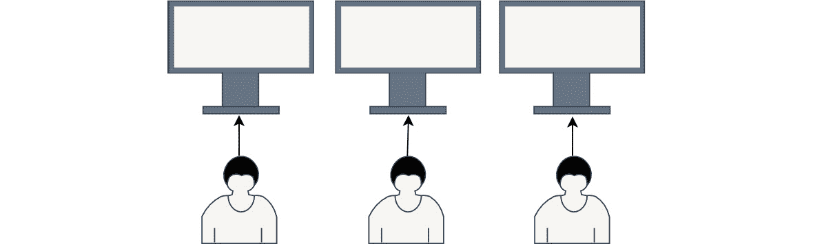

###### 图 5.2:并行性的抽象——所有的任务都由不同的人执行；他们不会互相影响

在上图中，有三个人同时在自己的电脑上工作——嗯，他们是并行工作的。

#### 注意

`并发`和`并行`不是一回事。`并行`补充并发。它告诉我们任务是如何执行的:它们彼此独立，并在不同的计算单元中运行，即处理器或内核。

现在，我们将顺利地转向线程执行概念。当我们谈论线程时，我们指的是执行线程。这是操作系统的抽象，允许我们同时执行几个任务。请记住，整个程序在单独的进程中执行。操作系统为进程分配**地址空间**、**处理器寄存器**，以及一些额外的资源。所有的工作线程都是在进程中创建的，并且共享相同的资源。每个进程至少有一个执行`main()`函数的线程。我们可以创建一个新的线程来执行，并分配一个开始函数作为这个线程的起点。

#### 注意

处理器的地址空间和寄存器称为**线程上下文**。当操作系统中断线程的工作时，它必须存储当前线程的上下文，并加载下一个线程的上下文。

让我们考虑在下面的例子中创建一个新的线程。要创建一个新的线程，我们必须包含一个`<线程>`头文件。它包含用于管理线程的类和函数。实际上，有几种可能的方法来创建`std::thread`对象和执行线程，如下所示:

*   创建一个`标准::线程`对象，无需显式初始化。记住，线程需要一个启动函数来运行它的作业。我们没有指出哪个函数是这个线程的主要函数。这意味着没有创建执行线程。让我们看看下面的代码示例，其中我们创建了一个空的`std::thread`对象:

    ```cpp
    #include <thread>
    int main()
    {
      std::thread myThread;  
      return 0;
    }
    ```

*   创建一个`std::thread`对象，并传递一个指向函数的指针作为构造函数参数。现在，执行线程将被创建，并将从我们在构造函数中传递的函数开始它的工作。让我们看看下面的代码示例:

    ```cpp
    #include <iostream>
    #include <thread>
    void printHello()
    {
        std::cout << "hello" << std::endl;
    }
    int main()
    {
      std::thread myThread(printHello);
      myThread.join();
      return 0;
    }
    ```

这里，我们创建了一个`std::thread`对象，并用函数指针对其进行了初始化。这是一个简单的函数，返回`void`，不取任何参数。然后，我们告诉主线程使用`join()`函数等待新线程完成。我们总是要`连接()`或`分离()`一个线程，直到`std::thread`对象的范围结束。如果我们不这样做，我们的应用将被操作系统使用`标准::终止`()函数终止，该函数在`标准::线程`析构函数中调用。除了函数指针之外，我们还可以传递任何可调用的对象，比如`lambda`、`std::function`，或者带有重载`运算符()`的类。

#### 注意

执行线程可以在 **std::thread** 对象销毁之前完成工作。它也可以在执行线程完成工作之前被析构。在销毁对象之前，始终将对象**标准::螺纹**连接到()或**分离()**。

现在我们已经知道了创建线程的主要语法，我们可以继续下一个重要的概念。让我们找出同步、异步和多线程执行的含义。

### 同步执行

术语“同步执行”意味着每个子任务都将按顺序逐一执行。换句话说，这意味着如果我们有几个任务要执行，每个任务只能在前一个任务完成后才可以开始工作。这个术语没有指定执行任务的方式，也没有指定任务是在一个线程中执行还是在几个线程中执行。它只告诉我们执行的顺序。让我们回到哲学家晚餐的例子。在单线程世界里，哲学家们会一个接一个地吃东西。

第一个哲学家拿了两根筷子，吃他们的寿司。然后，第二个哲学家拿了两根筷子，吃了他们的寿司。他们轮流，直到所有人都吃完寿司。请看下图，它代表了一个线程中四个任务的同步执行:

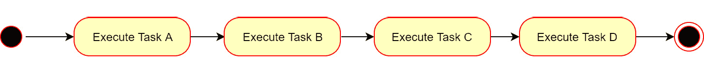

###### 图 5.3:单线程中的同步执行

这里，每个任务都等待前一个任务完成。任务也可以在多个线程中同步执行。考虑下图，它表示在多个线程中同步执行四个任务。同样，每个任务都等待前一个任务完成:

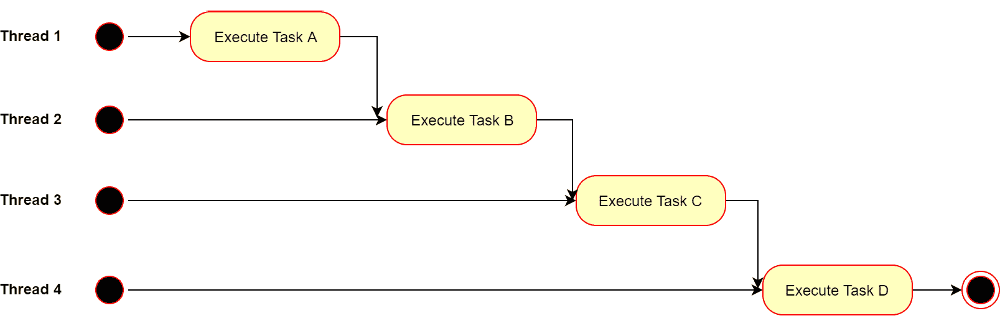

###### 图 5.4:多线程中的同步执行

在这种情况下，每个任务都在一个单独的线程中启动，但只是在前一个线程完成其工作之后。在一个多线程的世界里，哲学家们仍然会一个接一个地吃东西，但差别很小。现在，他们每个人都有自己的筷子，但只能按照严格的顺序吃饭。

#### 注意

`同步执行`表示每个任务的完成时间同步。任务的执行顺序是这里的重点。

让我们考虑在下面的代码示例上同步执行。当我们在一个线程中运行任务时，我们只是调用通常的函数。例如，我们实现了四个向终端打印消息的功能。我们以同步、单线程的方式运行它们:

```cpp
#include <iostream>
void printHello1()
{
    std::cout << "Hello from printHello1()" << std::endl;    
}
void printHello2()
{
    std::cout << "Hello from printHello2()" << std::endl;    
}
void printHello3()
{
    std::cout << "Hello from printHello3()" << std::endl;    
}
void printHello4()
{
    std::cout << "Hello from printHello4()" << std::endl;    
}
int main()
{
    printHello1();
    printHello2();
    printHello3();
    printHello4();
    return 0;
}
```

这里，我们逐个调用所有函数，每个下一个函数都在前一个函数执行之后运行。现在，让我们在不同的线程中运行它们:

```cpp
#include <iostream>
#include <thread>
void printHello1()
{
    std::cout << "Hello from printHello1()" << std::endl;    
}
void printHello2()
{
    std::cout << "Hello from printHello2()" << std::endl;    
}
void printHello3()
{
    std::cout << "Hello from printHello3()" << std::endl;    
}
void printHello4()
{
    std::cout << "Hello from printHello4()" << std::endl;    
}
int main()
{
    std::thread thread1(printHello1);
    thread1.join();
    std::thread thread2(printHello2);
    thread2.join();
    std::thread thread3(printHello3);
    thread3.join();
    std::thread thread4(printHello4);
    thread4.join();
    return 0;
}
```

在前面的代码示例中，我们创建了四个线程，并立即将它们连接起来。因此，每个线程在运行之前都完成了它的工作。如您所见，任务没有任何变化——它们仍然以严格的顺序执行。

### 异步执行

在这种情况下，可以同时执行几个任务，而不会阻塞任何线程的执行。通常，主线程启动异步操作并继续执行。执行完成后，结果被发送到主线程。通常，执行异步操作与为其创建单独的线程无关。该任务可以由其他人执行，例如另一个计算设备、远程网络服务器或外部设备。让我们回到哲学家晚餐的例子。

在`异步执行`的情况下，所有的哲学家都会有自己的筷子，并且会相互独立吃饭。寿司做好了，服务员上桌后，他们都开始吃饭，可以在自己的时间内吃完。

#### 注意

在`异步执行`中，由于所有的任务都是相互独立工作的，所以知道每个任务的完成时间并不重要。

请看下图，它代表了多线程中四个任务的异步执行:

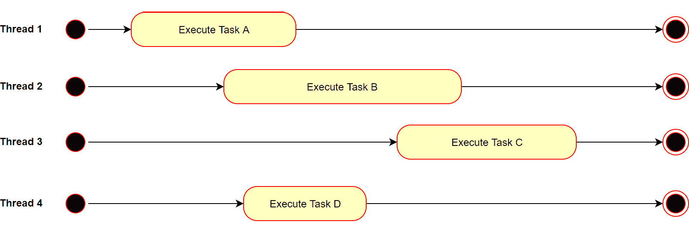

###### 图 5.5:多线程中的异步执行

他们每个人都是在不同的时间开始和结束的。让我们用一个代码示例来考虑这个异步执行。例如，我们实现了四个向终端打印消息的功能。我们用不同的线程运行它们:

```cpp
#include <iostream>
#include <thread>
#include <chrono>
void printHello1()
{
    std::cout << "Hello from thread: " << std::this_thread::get_id() << std::endl;    
}
void printHello2()
{
    std::cout << "Hello from thread: " << std::this_thread::get_id() << std::endl;    
}
void printHello3()
{
    std::cout << "Hello from thread: " << std::this_thread::get_id() << std::endl;    
}
void printHello4()
{
    std::cout << "Hello from thread: " << std::this_thread::get_id() << std::endl;    
}
int main()
{
    std::thread thread1(printHello1);
    std::thread thread2(printHello2);
    std::thread thread3(printHello3);
    std::thread thread4(printHello4);
    thread1.detach();
    thread2.detach();
    thread3.detach();
    thread4.detach();

    using namespace std::chrono_literals;
    std::this_thread::sleep_for(2s);
    return 0;
}
```

让我们看看这里会发生什么。我们使用了前面例子中的四个函数，但是它们有一点改变。我们使用`STD::this _ thread::get _ ID()`函数添加了线程唯一 ID 的打印。该函数返回`std::thread::id`对象，该对象代表线程的唯一 id。这个类为输出和比较重载了操作符，所以我们可以用不同的方式使用它。例如，我们可以检查线程标识，如果它是主线程的标识，我们可以执行一个特殊的作业。在我们的例子中，我们可以将线程标识打印到终端。接下来，我们创建了四个线程并分离它们。这意味着没有线程会等待另一个线程完成工作。从这一刻起，它们变成了**守护线程**。

他们将继续他们的工作，但是没有人知道这件事。然后，我们使用`STD::this _ thread::sleep _ for(2s)`函数让主线程等待两秒钟。我们这样做是因为当主线程完成它的工作时，应用将停止，我们将无法在终端中查看分离线程的输出。以下屏幕截图是终端输出的示例:

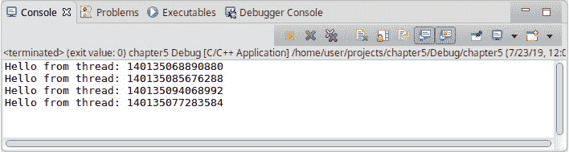

###### 图 5.6:示例执行的结果

在您的 IDE 中，输出可能会随着执行顺序的未定义而改变。异步执行的一个真实例子可以是一个互联网浏览器，您可以在其中打开多个选项卡。当一个新的选项卡打开时，应用启动一个新的线程并分离它们。尽管线程独立工作，但它们可以共享一些资源，如文件处理程序，来写日志或做其他事情。

#### 注意

`std::thread`有一个名为`get_id()`的成员函数，返回`std::thread`实例的唯一 id。如果`std::thread`实例未初始化或已连接或分离，`get_id()`将返回默认的`std::thread::id`对象。这意味着没有执行线程与当前的`std::thread`实例相关联。

让我们用一些伪代码来展示一个由另一个计算单元完成计算的例子。例如，假设我们开发了一个通过货币兑换进行计算的应用。用户输入一种货币的金额，选择另一种货币进行兑换，应用向他们显示该货币的金额。后台应用向保存所有货币汇率的远程服务器发送请求。

远程服务器计算给定货币的金额，并将结果发回。此时，您的应用会显示一个进度条，并允许用户执行其他操作。当它收到结果时，它会在窗口上显示它们。让我们看看下面的代码:

```cpp
#include <thread>
void runMessageLoop()
{
    while (true)
    {
        if (message)
        {
            std::thread procRes(processResults, message);
            procRes.detach();
        }
    }
}
void processResults(Result res)
{
    display();
}
void sendRequest(Currency from, Currency to, double amount)
{
    send();
}
void displayProgress()
{
}
void getUserInput()
{
    Currency from;
    Currency to;
    double amount;
    std::thread progress(displayProgress);
    progress.detach();
    std::thread request(sendRequest, from, to, amount);
    request.detach();
}
int main()
{
    std::thread messageLoop(runMessageLoop);
    messageLoop.detach();

    std::thread userInput(getUserInput);
    userInput.detach();    
    return 0;
}
```

让我们看看这里会发生什么。在`main()`函数中，我们创建了一个名为`messageLoop`的线程，该线程执行`runMessageLoop()`函数。一些检查服务器是否有新结果的代码可以放在这个函数中。如果收到新的结果，它会创建一个新的线程`procures`，该线程将在一个窗口中显示结果。我们还在`main()`函数中创建了另一个线程`userInput`，它从用户那里获取货币和金额，并创建了一个新的线程`request`，它将向远程服务器发送请求。发送请求后，它会创建一个新的线程`进度`，该线程将显示一个进度条，直到收到结果。因为所有的线程都是分离的，所以它们能够独立工作。当然，这只是伪代码，但主要思想很清楚——我们的应用向远程服务器发送请求，远程服务器为我们的应用执行计算。

让我们用日常生活中的一个例子来复习一下我们所学的并发概念。这是一个背景，你必须编写一个应用，并提供与之相关的所有文档和架构概念:

*   单线程工作:你自己写。
*   多线程工作:你邀请你的朋友一起写一个项目。有人编写架构概念，有人负责文档工作，你专注于编码部分。所有参与者相互交流以澄清任何问题并共享文档，例如关于规格的问题。
*   平行工作:任务是分的。有人为项目编写文档，有人设计图表，有人编写测试用例，你独立工作。参与者根本不交流。
*   同步工作:在这种情况下，你们每个人都无法理解他们应该做什么。因此，你们都决定一个接一个地工作。当架构工作完成时，开发人员开始编写代码。然后，当开发工作完成时，有人开始编写文档。
*   异步工作:在这种情况下，你雇佣一家外包公司来完成项目。当他们在开发项目时，你将会从事一些其他的任务。

现在，让我们将我们的知识应用于实践，并解决一个练习，看看它是如何工作的。

### 练习 1:以不同的方式创建线程

在本练习中，我们将编写一个创建四个线程的简单应用；其中两个将以同步方式工作，两个以异步方式工作。它们都会打印一些符号到终端，这样我们就可以看到操作系统是如何切换线程执行的。

#### 注意

在项目设置中添加 pthread 链接器标志，让编译器知道您将使用线程库。对于 Eclipse IDE，您可以按照以下路径执行此操作:**项目** - > **属性**->**C/c++ Build**->**设置** - > **G++ 链接器** - > **杂项** - > **链接器标志输入“-pthread”**。该路径对`Eclipse 版本有效:3.8.1`，不同版本可能有所不同。

执行以下步骤完成本练习:

1.  包括一些支持线程化的头文件，即`<【线程化】>`，支持流化，即`<【iostream】>`，支持功能对象，即`<【功能化】>` :

    ```cpp
    #include <iostream>
    #include <thread>
    #include <functional>
    ```

2.  实现一个自由函数`打印数字()`，在`中为`循环打印从 0 到 100 的数字:

    ```cpp
    void printNumbers()
    {
        for(int i = 0; i < 100; ++ i)
        {
            std::cout << i << " ";
        }
        std::cout << std::endl;
    }
    ```

3.  实现一个可调用对象，即一个带有重载**运算符()**的 **Printer** 类，该类在**循环中打印一个从 0 到 100000 的“*”符号。对于每一次 **200** 迭代，打印一个新的线符号以获得更易读的输出:

    ```cpp
    class Printer
    {
        public:
        void operator()()
        {
            for(int i = 0; i < 100000; ++ i)
            {
                if (!(i % 200))
                {
                    std::cout << std::endl;
                }
                std::cout << "*";
            }
        }
    };
    ```** 
4.  进入`main()`功能，然后创建一个名为`print reverse`的 lambda 对象，该对象在`中为`循环打印从 100 到 0 的数字:

    ```cpp
    int main()
    {
        auto printRevers = []()
        {
            for(int i = 100; i >= 0; --i)
            {
                std::cout << i << " ";
            }
            std::cout << std::endl;
        };
        return 0;
    }
    ```

5.  实现一个名为 **printOther** 的 **std::function** 对象，该对象在循环的**中打印从 **0** 到 **100000** 的“^”符号。每重复 **200 次**，打印一个新的线符号，以便输出更易读:

    ```cpp
    std::function<void()> printOther = []()
    {
        for(int i = 0; i < 100000; ++ i)
        {
            if (!(i % 200))
            {
                std::cout << std::endl;
            }
            std::cout << "^";
        }
    };
    ```** 
6.  创建第一个线程`thr1`，并将`printNumbers`自由函数传递给它的构造函数。加入其中:

    ```cpp
    std::thread thr1(printNumbers);
    thr1.join();
    ```

7.  创建第二个线程`thr2`，并将`print reverse`lambda 对象传递给它的构造函数。加入其中:

    ```cpp
    std::thread thr2(printRevers);
    thr2.join();
    ```

8.  创建名为`打印`的`打印机`类的实例。创建第三个线程`thr3`，并用`打印`对象初始化。使用`分离()`方法将其分离:

    ```cpp
    Printer print;
    std::thread thr3(print);
    thr3.detach();
    ```

9.  创建最后一个线程`thr4`，并用`printOther`对象初始化它。拆下来:

    ```cpp
    std::thread thr4(printOther);
    thr4.detach();
    ```

10.  在退出`main()`函数之前，添加`std::getchar()`函数调用。这避免了关闭应用。我们将有可能看到分离线程是如何工作的:

    ```cpp
    std::getchar();
    ```

11.  Run this code in your editor. You will see that `thr1` starts execution and the program waits. After `thr1` has finished, `thr2` starts execution and the program waits. This is an example of synchronous execution. After `thr2` has finished its work, threads `thr3` and `thr4` start execution. They are detached, so the program can proceed with the execution. In the following output, you will see that the symbols are mixed. This happens because the operating system performs interruptions and the threads work at the same time.

    您的输出将类似于以下内容:

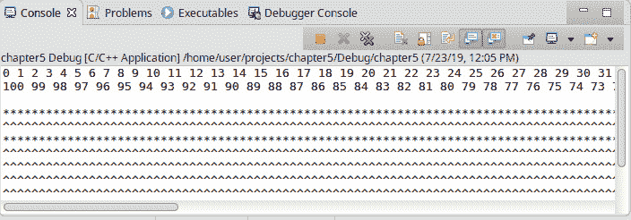

###### 图 5.7:练习执行的结果

在本练习中，我们实现了四种不同的初始化线程的方法:使用自由函数、lambda 对象、可调用对象和`std::function`对象。还有一些初始化线程的方法，但是我们将在下一节中考虑它们。我们还回顾了如何在多线程中实现同步程序。我们还试图实现异步程序，并看到线程确实同时独立工作。在下一节中，我们将了解数据危险和竞争条件，以及如何通过使用同步技术来避免它们。

## 查看同步、数据危险和比赛条件

多线程编程的关键挑战是知道线程如何处理**共享数据**。共享数据，也称为资源，不仅是变量，也是文件描述符和环境变量，甚至是 Windows 注册表。例如，如果线程只是读取数据，那么就没有问题，也不需要同步。但是，如果至少有一个线程编辑了数据，**比赛条件**可能会出现。通常，对数据的操作不是原子的，也就是说，它们需要几个步骤。即使是最简单的数值变量的增量操作也是在以下三个步骤中执行的:

1.  读取变量值。
2.  增加它。
3.  写下新值。

由于操作系统中断，线程可以在完成操作之前停止。例如，我们有线程 A 和 B，并且有一个等于 0 的变量。

线程 A 开始增量:

1.  读取变量值(var = 0)。
2.  递增(tmp = 1)。
3.  被操作系统中断。

线程 B 开始增量:

1.  读取变量值(var = 0)。
2.  递增(tmp = 1)。
3.  写入新值(var = 1)。
4.  被操作系统中断。

线程 A 继续递增:

1.  写入新值(var = 1)。

因此，我们期望变量在工作完成后等于 2，但事实上，它等于 1。请看下图，以便更好地理解这个例子:


###### 图 5.8:两个线程递增同一个共享变量

让我们回到哲学家的晚餐类比。最初的问题是一个哲学家只有一根筷子。如果他们都饿了，那么他们会赶紧去拿两根筷子。第一个抓起两根筷子的哲学家会第一个吃饭，其他人必须等待。他们将争夺木棒。

现在，让我们将我们的知识应用到实践中，并编写一些代码，看看竞争条件如何出现在我们的代码中，并可能破坏我们的数据。

### 练习 2:写一个比赛条件的例子

在本练习中，我们将编写一个简单的应用来演示比赛条件。我们将创建一个“先检查后行动”比赛条件的经典示例。我们将创建一个线程，执行两个数的除法。我们将通过引用传递这些数字。经过检查，如果股息等于 0，我们将设置一个小超时。此时在主线程中，我们将把被除数设置为 0。当子线程醒来时，它将执行到 0 的除法。这将导致应用崩溃。我们还将添加一些日志来查看执行流程。

#### 注意

默认情况下，所有变量在传递给线程时都会被复制。要将变量作为引用传递，请使用`std::ref()`函数。

首先，我们实现没有竞争条件的代码，并确保它按预期工作。请执行以下步骤:

1.  包括支持线程的头文件，即`<线程>`，支持流的头文件，即`< iostream >`，以及支持功能对象的头文件，即`<【功能性】>` :

    ```cpp
    #include <iostream>
    #include <chrono>
    #include <thread>
    ```

2.  实现`除()`函数，该函数执行两个整数的除。通过引用传递`除数`和`被除数`变量。检查股息是否等于 0。然后，添加日志:

    ```cpp
    void divide(int& divisor, int& dividend)
    {
        if (0 != dividend)
        {
            std::cout << "Dividend = " << dividend << std::endl;
            std::cout << "Result: " << (divisor / dividend) << std::endl;    
        }
        else
        {
            std::cout << "Error: dividend = 0" << std::endl;
        }
    }
    ```

3.  进入`main()`函数，创建两个名为`除数`和`被除数`的整数，并用任意非零值初始化:

    ```cpp
    int main()
    {
        int divisor = 15;
        int dividend = 5;
        return 0;
    }
    ```

4.  Create the `thr1` thread, pass the `divide` function, use `divisor` and `dividend` by reference, and then detach the thread:

    ```cpp
    std::thread thr1(divide, std::ref(divisor), std::ref(dividend));
    thr1.detach();
    std::getchar();
    ```

    #### 注意

    在`std::this_thread`命名空间中，有一个名为`sleep_for`的函数会在给定的时间段内阻塞线程。作为一个参数，它需要`标准::时间::持续时间`-一个模板类来表示时间间隔。

5.  Run this code in your editor. You will see that the `divide()` function works correctly in `thr1`. The output looks as follows:

    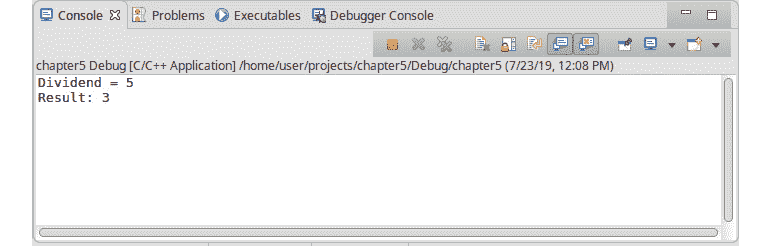

    ###### 图 5.9:正确执行练习的结果

    现在，我们将继续并做出改变，以展示比赛条件。

6.  如果处于状态，则返回到该功能并在 **2s** 中为**之后的子线程设置睡眠时间。添加日志:

    ```cpp
    if (0 != dividend)
    {
        std::cout << "Child thread goes sleep" << std::endl;
        using namespace std::chrono_literals;
        std::this_thread::sleep_for(2s);
        std::cout << "Child thread woke up" << std::endl;
        std::cout << "Dividend = " << dividend << std::endl;
        std::cout << (divisor / dividend) << std::endl;
    }
    ```** 
7.  Go back to the `main()` function and set the sleeping time in `1s` for the main thread. After that, set the `dividend` variable to `0`. Add the logs:

    ```cpp
    std::cout << "Main thread goes sleep" << std::endl;
    using namespace std::chrono_literals;
    std::this_thread::sleep_for(1s);
    std::cout << "Main thread woke up" << std::endl;
    dividend = 0;   
    std::cout << "Main thread set dividend to 0" << std::endl;
    ```

    #### 注意

    `STD::chrono _ 常值`命名空间包含用于时间表示的常值:``h``用于`小时`，``分钟``用于`分钟`，``s``用于`秒`，``ms``用于`毫秒`，``us``用于`微秒`和` `[要使用它们，您只需将它们添加到数字的末尾，例如 1、1 分钟、1 小时等。

8.  在退出`main()`函数之前，添加`std::getchar()`函数调用。这避免了我们关闭应用，我们将有可能看到分离的线程是如何工作的:

    ```cpp
    std::getchar();
    ```

9.  在编辑器中运行这段代码。你会看到主线程休眠`1s`。然后，子线程进入`if`状态，休眠`2s`，这意味着它验证了一个`红利`，它不等于`0`。然后，主线程唤醒并将`被除数`变量设置为 0。然后，子线程醒来并执行除法。但是因为现在`红利`等于`0`，应用崩溃了。如果在调试模式下运行此示例，您将看到一个`SIGFPE 异常`，并显示一条消息:“算术异常”。您将获得以下输出:


###### 图 5.10:比赛条件下练习的执行结果

在本练习中，我们考虑了“先检查后行动”的比赛条件。我们已经为线程设置了睡眠周期来模拟操作系统中断，但是在现实世界的程序中，这种情况很可能会发生，但也可能不会。这完全取决于操作系统及其调度程序。这使得调试和修复比赛状态变得非常困难。为了避免本例中的竞争情况，我们可以采取以下几种方式:

*   将变量的副本传递给线程函数，而不是传递引用。
*   使用标准库原语在线程之间同步对共享变量的访问。
*   在主线程将一个`被除数`值变为 0 之前加入子线程。

让我们再看几个方法来解决这个比赛状态。所有这些都依赖于你试图实现的任务。在下一节中，我们将考虑由 C++ 标准库提供的同步原语。

### 数据危害

以前，我们认为最无害的例子，但有时，存在数据被损坏的情况，这导致未定义的程序行为或异常终止。这种由于比赛条件或简单的错误设计造成的数据损坏被称为**数据危险**。一般来说，这个术语意味着一项工作的最终结果取决于线程的执行顺序。如果不同的线程使用共享数据或全局变量，那么由于不同线程执行任务的顺序不正确，结果可能会有所不同。这是由于多线程数据之间的依赖性造成的。这种依赖性问题有条件地分为三类:

*   一**真相依** : **写后读** (RAW)
*   一个**反依赖** : **读完**写(WAR)
*   一个**输出依赖** : **写后写** (WAW)

### 原始相关性

当一个线程计算另一个线程使用的值时，就会发生 RAW 依赖关系。例如`线程 A`应该完成它的工作，并将结果写入一个变量。`线程 B`必须读取这个变量的值并完成它的工作。在伪代码中，如下所示:

```cpp
Thread A: a = doSomeStuff();
Thread B: b = a - doOtherStuff();
```

如果`线程 B`先执行，就会出现困难。这会导致`线程 B`读取无效值。应该严格保证线程的执行顺序。`线程 B`必须读取变量的值，但只有在`线程 A`写完之后。否则，将导致未定义的行为。下图将帮助您阐明导致数据危险的原始数据依赖性:


###### 图 5.11:两个线程之间的原始数据依赖性

### 战争属地

当一个线程更改另一个线程使用的数据时，就会出现 **WAR 依赖关系**。例如，`线程 A`必须读取一个变量的值并完成它的工作。之后，`线程 B`应该做好自己的工作，将结果写入一个变量。在伪代码中，如下所示:

```cpp
Thread A: b = a - doSomeStuff();
Thread B: a = doOtherStuff();
```

如果`线程 B`先执行，就会出现困难。会导致`线程 B`在`线程 A`读取之前改变值。应该严格保证线程的执行顺序。`线程 B`只有在`线程 A`读取变量的值后，才应该将新值写入变量。下图将帮助您阐明导致数据危险的原始数据依赖性:


###### 图 5.12:两个线程之间的 WAR 数据依赖关系

### WAW 相关性

当几个线程改变同一个变量的值，并且一些线程为其计算进行读取时，就会出现 **WAW 依赖关系**。例如，`线程 A`执行其作业并将结果写入变量。`线程 B`读取变量值并执行其作业。`线程 C`执行其作业，并将结果写入同一个变量。在伪代码中，如下所示:

```cpp
Thread A: a = doSomeStuff();
Thread B: b = a - doOtherStuff();
Thread C: a = doNewStuff();
```

如果`线程 C`在线程 A 和 B 之前执行，将会出现困难。这将导致`线程 B`读取预计不会被读取的值。应该严格保证线程的执行顺序。`线程 C`必须向变量写入一个新值，但前提是`线程 A`已经写入了它的值，`线程 B`已经读取了它。下图将帮助您阐明导致数据危险的 WAW 数据依赖性:

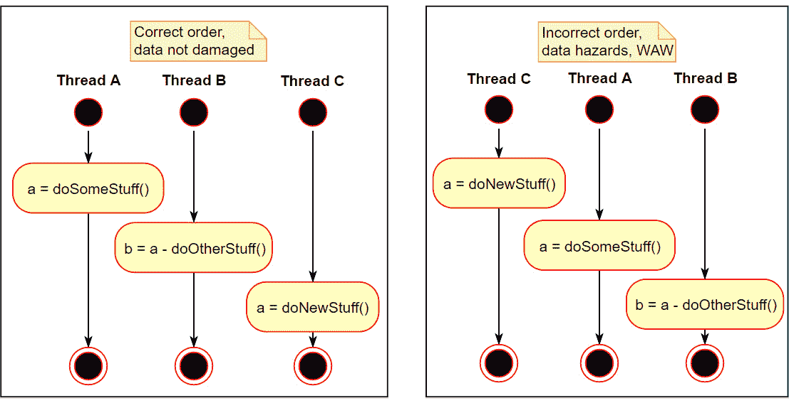

###### 图 5.13:两个线程之间的 WAW 数据依赖关系

### 资源同步

为了防止竞争和数据危害，有一个共享数据锁定机制，其中一个流打算更改或读取这些数据。这个机制叫做**资源同步**。对于同步，我们需要分配改变或读取共享资源的代码片段。这样的代码片段被称为`关键部分`。同步包括当一个线程进入时阻塞关键部分。也打算执行这个关键部分的代码的其他线程将被阻塞。当执行关键部分的线程离开它时，锁被释放。然后，故事会随着下一个线索重复。

考虑前面的例子，有一个增量，但是现在有同步访问。请记住，我们有线程 A 和 B，并且有一个等于 0 的变量。

线程 A 开始增量:

1.  进入临界区并锁定。
2.  读取变量值(var = 0)。
3.  递增(tmp = 1)。
4.  被操作系统中断。

线程 B 开始增量:

1.  试图进入临界区；它被锁定了，所以线程正在等待。

线程 A 继续递增:

1.  写入新值(var = 1)。

线程 B 继续递增:

1.  进入临界区并锁定。
2.  读取变量值(var = 1)。
3.  递增(tmp = 2)。
4.  写入新值(var = 2)。

两个线程完成后，变量包含正确的结果。因此，同步确保共享数据不会被损坏。请看下图，以更好地理解这个例子:

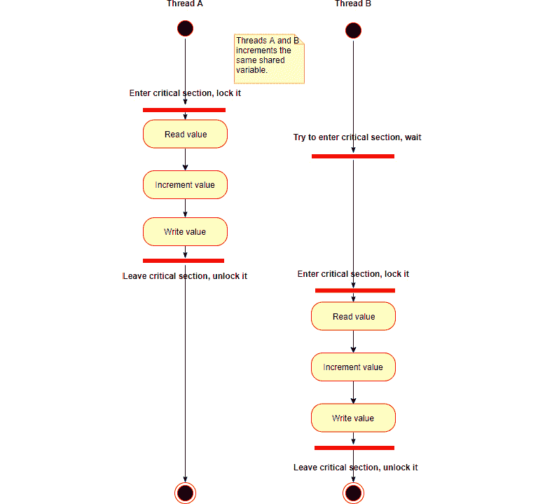

###### 图 5.14:两个线程以同步的方式增加同一个共享变量

突出关键部分并预测非同步访问的可能后果是一项非常困难的任务。因为过度同步否定了多线程工作的本质。然而，如果两个或三个线程在一个关键部分上工作得相当快，那么程序中可能会有几十个线程在关键部分被阻塞。这将大大降低程序的速度。

### 事件同步

还有另一种同步线程工作的机制–**事件同步**。这意味着当其中一个线程暂停其工作，直到另一个线程发出某个事件发生的信号时，线程的工作才会同步。例如，有`线程 A`，它接收来自另一个进程的消息。它将消息写入队列并等待新消息。还有一个线程`线程 B`，处理这些消息。它从队列中读取消息，并对它们执行一些操作。当没有消息时，`线程 B`正在休眠。当`线程 A`收到新消息时，唤醒`线程 B`并进行处理。下图清楚地说明了两个线程的事件同步:


###### 图 5.15:两个线程的事件同步

然而，即使在同步代码中也会出现竞争条件的另一个原因——类的有缺陷的接口。为了理解这是什么，让我们考虑以下示例:

```cpp
class Messages
{
    public:
    Messages(const int& size)
    : ArraySize(size)
    , currentIdx(0)
    , msgArray(new std::string[ArraySize])
    {}
    void push(const std::string& msg)
    {
        msgArray[currentIdx++ ] = msg;
    }
    std::string pop()
    {
        auto msg = msgArray[currentIdx - 1];
        msgArray[currentIdx - 1] = "";
        --currentIdx;
        return msg;
    }
    bool full()
    {
        return ArraySize == currentIdx;
    }
    bool empty()
    {
        return 0 == currentIdx;
    }
    private:
    const int ArraySize;
    int currentIdx;
    std::string * msgArray;
};
```

这里，我们有一个名为`Messages`的类，它有一个动态分配的字符串数组。在构造函数中，它获取数组的大小并创建一个给定大小的数组。它有一个函数`full()`，如果数组已满则返回`true`，否则返回`false`。它还有一个`empty()`函数，如果数组为空则返回 true，否则返回 false。在推送新值和检查数组是否为空之前，以及在从数组弹出新值之前，用户有责任检查数组是否已满。这是类接口不良导致竞争条件的一个例子。即使我们用锁保护`push()`和`pop()`功能，竞态条件也不会消失。让我们看看下面使用`消息`类的例子:

```cpp
int main()
{
    Messages msgs(10);
    std::thread thr1([&msgs](){
    while(true)
    {
        if (!msgs.full())
        {
            msgs.push("Hello");
        }
        else
        {
            break;
        }
    }});
    std::thread thr2([&msgs](){
    while(true)
    {
        if (!msgs.empty())
        {
            std::cout << msgs.pop() << std::endl;
        }
        else
        {
            break;
        }
    }});
    thr1.detach();
    thr2.detach();
    using namespace std::chrono_literals;
    std::this_thread::sleep_for(2s);
    return 0;
}
```

这里，我们创建了一个`msgs`变量，然后创建了第一个线程，该线程将值推送到`msgs`。然后，我们创建了第二个线程，它从数组中弹出值并分离它们。即使我们通过使用锁定机制来保护所有功能，其中一个线程也可以检查数组的大小，并且可以被操作系统中断。此时，另一个线程可以更改数组。当第一个线程继续工作时，它可以尝试推进到完整数组或从空数组弹出。因此，同步只有在设计良好的配对中才有效。

### 死锁

还有一个同步问题。让我们回到哲学家晚餐的例子。最初的问题是一个哲学家只有一根筷子。所以，他们可以通过互相分享筷子来一个接一个地吃寿司。虽然他们需要很长时间才能吃完寿司，但他们都会吃得很好。但是如果他们每个人同时拿着一根筷子，不想分享第二根筷子，他们就不能吃寿司，因为他们每个人都将永远等待第二根筷子。这会导致**死锁**。当两个线程正在等待另一个线程继续其工作时，就会发生这种情况。死锁的原因之一是当一个线程加入另一个线程，但是另一个线程加入第一个线程。因此，当两个线程相互连接时，它们都不能继续工作。让我们考虑以下死锁示例:

```cpp
#include <thread>
std::thread* thr1;
std::thread* thr2;
void someStuff()
{
    thr1->join();
}
void someAnotherStuff()
{
    thr2->join();
}
int main()
{
    std::thread t1(someStuff); 
    std::thread t2(someAnotherStuff);
    thr1 = &t1;
    thr2 = &t2;
    using namespace std::chrono_literals;
    std::this_thread::sleep_for(2s);
    return 0;
}
```

在主功能中，我们有两个线程，`t1`和`t2`。我们用`something()`函数初始化了`t1`线程，这做了一些有用的工作。我们还用`sometherestuff()`函数初始化了`t2`线程，这做了一些更有用的工作。在由`t2`执行的函数中，我们有指向这些线程的全局指针和指向`t1`线程的连接指针。我们还将指向`t2`线程的指针加入到函数中，该函数由`t1`执行。通过这样做，他们互相结合。这会导致死锁。

在下一节中，我们将考虑用于同步的 C++ 线程库原语以及死锁的另一个原因。

### 移动多线程闭包的语义

`std::thread`类不可复制，但是如果我们想存储几个线程，或者 10 个或者 20 个呢？当然，我们可以创建线程的数量，然后我们可以像这样连接或分离它们:

```cpp
std::thread thr1(someFunc);
std::thread thr2(someFunc);
std::thread thr3(someFunc);
std::thread thr4(someFunc);
std::thread thr5(someFunc);
thr1.join();
thr2.join();
thr3.join();
thr4.join();
thr5.join();
```

但是在 **STL 容器**中存储一堆线程更方便，比如线程的向量:

```cpp
std::vector<std::thread> threads;
```

STL 容器不能用于不支持**复制语义**的对象。感谢**移动语义**，我们可以存储具有移动构造函数的不可复制对象，并将赋值操作符移动到容器中。然后，我们可以使用带有`std::move()`函数的线程向量。为了初始化容器中的线程，我们可以做如下事情:

```cpp
for (int i = 0; i < 10; i++) 
{
    auto t = std::thread([i]()
    {
        std::cout << "thread: " << i << "\n";
    });
    threads.push_back(std::move(t));
}
```

然后，我们可以加入或分离它们:

```cpp
for (auto& thr: threads) 
{
    if (thr.joinable())
    {
        thr.join();
    }
}
```

当我们将`std::thread`对象存储为类成员时，移动语义也很有用。在这种情况下，我们应该仔细设计我们的类，删除复制构造函数和赋值操作符，并实现一个新的移动构造函数和移动赋值操作符。让我们考虑下面这样一个类的代码示例:

```cpp
class Handler
{
    std::thread  threadHandler;

public:
    Handler(const Handler&) = delete;
    Handler& operator=(const Handler&) = delete;
    Handler(Handler && obj)
    : threadHandler(std::move(obj.threadHandler))
    {}
    Handler & operator=(Handler && obj)
    {
        if (threadHandler.joinable())
        {
            threadHandler.join();
        }
        threadHandler = std::move(obj.threadHandler);
        return *this;
    }
    ~Handler()
    {
    if (threadHandler.joinable())
        {
            threadHandler.join();
        }
    }
};
```

在移动赋值操作符中，我们首先检查线程是否可连接。如果是这样，我们加入它，只有在那之后，我们才执行赋值操作。

#### 注意

如果不在线程对象上使用`join()`或`detach()`，我们就不应该将一个线程对象分配给另一个线程对象。这将导致一个`标准::终止()`函数调用。

也可以使用`std::move()`函数将对象移动到线程函数中。对于复制大对象可能有帮助，这是不可取的。让我们执行一个练习来确保对象可以被移动到线程函数中。

### 练习 3:将对象移动到线程函数

在本练习中，我们将编写一个简单的应用，演示`std::move()`如何为`std::thread`类工作。我们将创建一个同时具有复制构造函数和移动构造函数的类，以查看当我们将这个类的对象移动到`std::thread`函数中时将调用哪个。执行以下步骤完成本练习:

1.  包括支持线程的报头，即 **<线程>** ，以及支持流的报头，即**<iostream>T4:

    ```cpp
    #include <iostream>
    #include <thread>
    ```** 
2.  实现`处理程序`类，它有默认的构造函数、析构函数、复制构造函数、赋值操作符、移动构造函数和移动赋值操作符。除了打印日志，他们什么都不会做:

    ```cpp
    class Handler
    { 
    public:
        Handler()
        {
            std::cout << "Handler()" << std::endl;
        }
        Handler(const Handler&)
        {
            std::cout << "Handler(const Handler&)" << std::endl;
        }
        Handler& operator=(const Handler&)
        {
            std::cout << "Handler& operator=(const Handler&)" << std::endl;
            return *this;
        }
        Handler(Handler && obj)
        {
            std::cout << "Handler(Handler && obj)" << std::endl;
        }
        Handler & operator=(Handler && obj)
        {
            std::cout << "Handler & operator=(Handler && obj)" << std::endl;
            return *this;
        }
        ~Handler()
        {
            std::cout << "~Handler()" << std::endl;
        }
    };
    ```

3.  实现`doSomeJob()`功能，实际上这里什么都不做，只是打印一条日志消息:

    ```cpp
    void doSomeJob(Handler&& h)
    {
        std::cout << "I'm here" << std::endl;
    }
    ```

4.  进入`主()`功能，创建`处理程序`类型的`处理程序`变量。创建`thr1`，传递`doSomeJob()`函数，移动处理程序变量:

    ```cpp
    Handler handler;
    std::thread thr1(doSomeJob, std::move(handler));
    ```

5.  分离`thr1`线程，为主线程添加一个小休眠，以避免关闭应用。我们将能够看到分离线程的输出:

    ```cpp
    thr1.detach();
    using namespace std::chrono_literals; 
    std::this_thread::sleep_for(5s);
    ```

6.  Run this code in your editor. In the terminal log, from the default constructor, you will see two logs from the move operator, one log from a destructor, a message from the `doSomeJob()` function, and, finally, two other log messages from the destructor. We can see that the move constructor is called twice.

    您将获得以下输出:


###### 图 5.16:练习执行的结果

可以看到，`处理程序`对象被移动到线程函数中。尽管如此，所有没有使用`std::ref()`函数传递的参数都被复制到了线程的内存中。

让我们考虑一个有趣的问题。大家可能还记得，当我们初始化`std::thread`时，所有的构造函数参数都会被复制到线程内存中，包括一个可调用对象——一个 lambda、一个函数或者一个 std::function。但是如果我们的可调用对象不支持复制语义呢？例如，我们创建了一个只有移动构造函数和移动赋值运算符的类:

```cpp
class Converter
{
    public:
    Converter(Converter&&)
    {
    }
    Converter& operator=(Converter&&)
    {
        return *this;
    }
    Converter() = default;
    Converter(const Converter&) = delete;
    Converter& operator=(const Converter&) = delete;
    void operator()(const std::string&)
    {
        // do nothing
    }
};
```

我们如何将它传递给线程构造器？如果我们照原样传递，就会得到一个编译器错误；例如:

```cpp
int main()
{
    Converter convert;
    std::thread convertThread(convert, "convert me");
    convertThread.join();
    return 0;
}
```

您将获得以下输出:

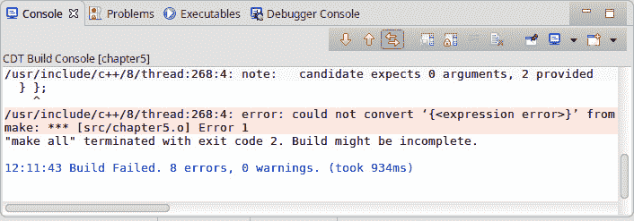

###### 图 5.17:编译错误的例子

这里有很多奇怪的错误。要解决这个问题，我们可以使用`std::move()`函数来移动可调用的:

```cpp
std::thread convertThread(std::move(convert), "convert me");
```

现在，一切都好了——代码已经编译好了，并且完全按照我们想要的方式运行。

现在，让我们考虑一个更有趣的例子。例如，您有一个需要捕捉不可复制对象的 lambda 函数，例如`unique_ptr`:

```cpp
auto unique = std::make_unique<Converter>();
```

从 C++ 14 开始，我们可以使用`std::move()`来捕捉可移动对象。因此，要捕获唯一的指针，我们可以使用以下代码:

```cpp
std::thread convertThread([ unique = std::move(unique) ] { 
        unique->operator()("convert me");
});
```

如您所见，使用`std::move`捕获 lambda 中的值非常有用。当我们不想复制某些对象时，这也很有用，因为它们可能需要很长时间才能复制。

现在，让我们将我们的知识付诸实践，并编写一个应用示例，演示如何使用线程使用`std::move`。

### 练习 4:创建和使用线程的 STL 容器

在本练习中，我们将编写一个简单的应用，其中我们将对线程使用`std::move()`。首先，我们将实现一个可移动构造的类。这个类将把小写文本转换成大写文本。然后，我们将创建这个类的实例向量。接下来，我们将创建一个`std::thread`对象的向量。最后，我们将用第一个向量中的一个对象初始化线程。

执行以下步骤完成本练习:

1.  包括用于线程支持的报头，即`<线程>`，流支持，即`< iostream >`，以及`<向量>` :

    ```cpp
    #include <iostream>
    #include <thread>
    #include <vector>
    #include <string>
    ```

2.  实现`转换器`类，它有`m_bufferIn`私有成员`const`T7】STD::vector<STD::string>&T8】类型。这是对小写字符串的原始向量的引用。它还有一个用户构造器，它接受`bufferIn`变量。然后，我们删除复制构造函数和赋值操作符。最后，我们定义重载的`运算符()`，在这里我们将所有小写符号转换为大写。转换后，我们将结果写入结果缓冲区:

    ```cpp
    class Converter
    {
        public:
        Converter(std::vector<std::string>& bufferIn)
            : m_bufferIn(bufferIn)
        {
        }
        Converter(Converter&& rhs)
            : m_bufferIn(std::move(rhs.m_bufferIn))
        {
        }
        Converter(const Converter&) = delete;
        Converter& operator=(const Converter&) = delete;
        Converter& operator=(Converter&&) = delete;
        void operator()(const int idx, std::vector<std::string>& result)
        {
            try
            {
                std::string::const_iterator end = m_bufferIn.at(idx).end();
                std::string bufferOut;
                for (std::string::const_iterator iter = m_bufferIn.at(idx).begin(); iter != end; iter++)
                {
                    if (*iter >= 97 && *iter <= 122)
                    {
                        bufferOut += static_cast<char>(static_cast<int>(*iter) - 32);
                    }
                    else
                    {
                        bufferOut += *iter;
                    }
                }
                result[idx] = bufferOut;
            }
            catch(...)
            {
                std::cout << "Invalid index" << std::endl;
            }
        }
        private:
        const std::vector<std::string>& m_bufferIn;
    };
    ```

3.  进入`主()`功能，创建一个名为`numberOfTasks`的常量值，并将其设置为`5`。然后，创建一个`转换器`对象的向量，并用`数量的任务`保留其大小。然后，创建一个`std::thread`对象的向量，并用`numberOfTasks` :

    ```cpp
    const int numberOfTasks = 5;
    std::vector<Converter> functions;
    functions.reserve(numberOfTasks);
    std::vector<std::thread> threads;
    threads.reserve(numberOfTasks); 
    ```

    保留其大小
4.  创建字符串向量，`textArr`，推五个不同的大字符串进行转换:

    ```cpp
    std::vector<std::string> textArr;
    textArr.emplace_back("In the previous topics, we learned almost all that we need to work with threads. But we still have something interesting to consider – how to synchronize threads using future results. When we considered condition variables we didn't cover the second type of synchronization with future results. Now it's time to learn that.");
    textArr.emplace_back("First of all, let's consider a real-life example. Imagine, you just passed the exam at the university. You were asked to wait some amount of time for results. So, you have time to coffee with your mates, and every 10-15 mins you check are results available. Then, when you finished all your other activities, you just come to the door of the lecture room and wait for results.");
    textArr.emplace_back("In this exercise, we will write a simple application where we will use std::move() with threads. First of all, we will implement a class that is move constructible. This class will convert lowercase text into uppercase text. Then we will create a vector of instances of this class. Next, we will create a vector of std::thread object. Finally, we will initialize threads with an object from the first vector");
    textArr.emplace_back("Let's consider one interesting issue. As you remember when we initialize std::thread all constructor arguments are copied into thread memory, including a callable object – lambda, function, std::function. But what if our callable object doesn't support copy semantic? For example, we created a class that has only move constructor and a move assignment operator:");
    textArr.emplace_back("Run this code in your editor. You will see in the terminal log from the default constructor, two logs from the move operator, then one log from a destructor, then message from the doSomeJob() function and, finally two other log messages from the destructor. We see that the move constructor is called twice. You will get the output like the following:");
    ```

5.  为循环实现**，我们将**转换器**对象推入函数向量:

    ```cpp
    for (int i = 0; i < numberOfTasks; ++ i)
    {
        functions.push_back(Converter(textArr));
    }
    ```** 
6.  创建一个字符串的结果向量，并推送五个空字符串。然后，创建一个变量作为数组元素的索引:

    ```cpp
    std::vector<std::string> result;
    for (int i = 0; i < numberOfTasks; ++ i)
    {
        result.push_back("");
    }
    int idx = 0;
    ```

7.  为循环实现另一个**，我们将**标准::线程**对象推入线程向量:

    ```cpp
    for (auto iter = functions.begin(); iter != functions.end(); ++ iter)
    {
        std::thread tmp(std::move(*iter), idx, std::ref(result));        
        threads.push_back(std::move(tmp));
        from = to;
        to += step;
    }
    ```** 
8.  为回路实施第三个**，在此我们分离**标准螺纹** :

    ```cpp
    for (auto iter = threads.begin(); iter != threads.end(); ++ iter)
    {
         (*iter).detach();
    }
    ```** 
9.  为主线程添加一个小休眠，以避免关闭应用。现在，我们可以看到分离线程是如何工作的:

    ```cpp
    using namespace std::chrono_literals; 
    std::this_thread::sleep_for(5s);
    ```

10.  最后将结果打印到终端:

    ```cpp
    for (const auto& str : result)
    {
        std::cout << str;
    }
    ```

11.  在编辑器中运行这段代码。在终端中，您可以看到所有字符串都是大写的，这意味着所有线程都被移动并成功运行。您将获得以下输出:


###### 图 5.18:练习执行的结果

在本练习中，我们练习了如何创建仅移动对象的 STL 容器。我们还考虑了如何将不可复制的对象传递给线程构造器。这些知识将在下一节帮助我们学习如何从线程中获得结果。

## 未来、承诺和异步

在前一节中，我们了解了使用线程所需的几乎所有知识。但是我们仍然有一些有趣的事情要考虑，那就是使用未来的结果同步线程。当我们考虑条件变量时，我们没有用未来的结果来覆盖第二种类型的同步。现在，是时候了解一下了。

假设有一种情况，我们运行某个线程并继续其他工作。当我们需要一个结果时，我们停下来检查它是否准备好了。这种情况描述了具有未来结果的实际工作。在 C++ 中，我们有一个名为`<【未来】>`的头文件，其中包含两个表示未来结果的模板类:`std::future < >`和`STD::shared _ future<>`。当我们需要单个未来结果时，我们使用`std::future < >`，当我们需要多个有效副本时，我们使用`STD::shared _ future<>`。我们可以将它们与`std::unique_ptr`和`std::shared_ptr`进行比较。

为了处理未来的结果，我们需要一个特殊的机制来在后台运行任务，并在稍后接收结果:`std::async()`模板函数。它将可调用作为一个参数和启动模式——延迟或异步，当然还有可调用的参数。启动模式`标准::启动::异步`和`标准::启动::延迟`指示如何执行任务。当我们通过`std::launch::async`时，我们期望该函数在单独的线程中执行。当我们通过`STD::launch::delivered`时，函数调用将被延迟，直到我们询问结果。我们也可以同时传递两者，例如`STD::launch::delivered | STD::launch::async`。这意味着运行模式将取决于实现。

现在，让我们考虑一个使用`std::async`的例子`std::future`。我们有一个`to ppercase()`函数，它将给定的字符串转换成大写:

```cpp
std::string toUppercase(const std::string& bufIn)
{
    std::string bufferOut;
    for (std::string::const_iterator iter = bufIn.begin(); iter != bufIn.end(); iter++)
    {
        if (*iter >= 97 && *iter <= 122)
        {
            bufferOut += static_cast<char>(static_cast<int>(*iter) - 32);
        }
        else
        {
            bufferOut += *iter;
        }
    }
    return bufferOut;
}
```

然后，在`main()`函数中，我们创建一个名为`result`的`std::future`变量，并使用`std::async()`返回值对其进行初始化。然后，我们使用结果对象的`get()`函数获取结果:

```cpp
#include <iostream>
#include <future>
int main()
{
    std::future<std::string> result = std::async(toUppercase, "please, make it uppercase");
    std::cout << "Main thread isn't locked" << std::endl;
    std::cout << "Future result = " << result.get() << std::endl;
    return 0;
}
```

实际上，在这里，我们创建了一个未来的对象:

```cpp
std::future<std::string> result = std::async(toUppercase, "please, make it uppercase");
```

如您所见，我们没有将启动模式传递给`std::async()`函数，这意味着将使用默认模式:`STD::launch::delivered | STD::launch::async`。您可以明确地这样做:

```cpp
std::future<std::string> result = std::async(std::launch::async, toUppercase, "please, make it uppercase");
```

在这里，我们正在等待结果:

```cpp
std::cout << "Future result = " << result.get() << std::endl;
```

如果我们的任务需要很长时间，线程会在这里一直等到结束。

一般来说，我们可以像使用`std::thread`构造函数一样使用`std::async()`函数。我们可以传递任何可调用的对象。默认情况下，所有参数都是复制的，我们可以移动变量和可调用对象，也可以通过引用传递它们。

`std::future`对象不受比赛条件保护。因此，为了从不同的线程访问它并防止损坏，我们应该使用互斥锁。但是如果我们需要共享一个未来的对象，最好用`std::shared_future`。共享的未来结果也不是线程安全的。为了避免竞争情况，我们必须使用互斥体或者在每个线程中存储线程自己的`std::shared_future`副本。

#### 注意

`std::future`对象的比赛条件非常棘手。当线程调用`get()`函数时，未来对象无效。

我们可以通过将未来交给一个建造者来创造一个共享的未来:

```cpp
std::future<std::string> result = std::async(toUppercase, "please, make it uppercase");
std::cout << "Main thread isn't locked" << std::endl;
std::shared_future<std::string> sharedResult(std::move(result));
std::cout << "Future result = " << sharedResult.get() << std::endl;
std::shared_future<std::string> anotherSharedResult(sharedResult);
std::cout << "Future result = " << anotherSharedResult.get() << std::endl;
```

如您所见，我们从`std::future`中创建了一个`std::shared_future`变量并复制了它。两个共享的未来对象指的是同一个结果。

我们还可以使用`sdt::future`对象的`share()`成员函数来创建共享的未来对象:

```cpp
std::future<std::string> result = std::async(toUppercase, "please, make it uppercase");
std::cout << "Main thread isn't locked" << std::endl;
auto sharedResult = result.share();
std::cout << "Future result = " << sharedResult.get() << std::endl;
```

请注意，在这两种情况下，`std::future`对象都将失效。

我们可以从单独的线程获得未来结果的另一种方法是使用`STD::packaged _ task<>`模板类。我们如何与他们合作？

1.  我们创建一个新的`std::packaged_task`并声明可调用函数签名:

    ```cpp
    std::packaged_task<std::string(const std::string&)> task(toUppercase);
    ```

2.  然后，我们将未来结果存储在`std::future`变量:

    ```cpp
    auto futureResult = task.get_future();
    ```

    中
3.  接下来，我们在单独的线程中运行这个任务，或者将其作为函数调用:

    ```cpp
    std::thread thr1(std::move(task), "please, make it uppercase");
    thr1.detach();
    ```

4.  Finally, we wait until the future results are ready:

    ```cpp
    std::cout << "Future result = " << futureResult.get() << std::endl;
    ```

    #### 注意

    `std::packaged_task`不可复制。因此，要在单独的线程中运行它，请使用`std::move()`函数。

还有一件重要的事情需要注意。如果您不希望线程产生任何结果，并且希望等到线程完成工作，可以使用`std::future < void >`。现在，当您调用`future.get()`时，您当前的线程将在此时等待。让我们考虑一个例子:

```cpp
#include <iostream>
#include <future>
void toUppercase(const std::string& bufIn)
{
    std::string bufferOut;
    for (std::string::const_iterator iter = bufIn.begin(); iter != bufIn.end(); iter++)
    {
        if (*iter >= 97 && *iter <= 122)
        {
            bufferOut += static_cast<char>(static_cast<int>(*iter) - 32);
        }
        else
        {
            bufferOut += *iter;
        }
    }
    using namespace std::chrono_literals;
    std::this_thread::sleep_for(2s);
    std::cout << bufferOut << std::endl;
}
int main()
{
    std::packaged_task<void(const std::string&)> task(toUppercase);
    auto futureResult = task.get_future();
    std::thread thr1(std::move(task), "please, make it uppercase");
    thr1.detach();
    std::cout << "Main thread is not blocked here" << std::endl;
    futureResult.get();
    std::cout << "The packaged_task is done" << std::endl;
    return 0;
} 
```

如您所见，通过等待另一个线程，我们使用了几种技术，如条件变量、未来结果和承诺。

现在，让我们进入标准库中的下一个重要特性——模板类`std::promise < >`。通过这个类，我们可以设置我们想要接收的类型的值，然后使用`std::future`获取它。我们如何与他们合作？为此，我们需要实现一个带有`标准::承诺`参数的函数:

```cpp
void toUppercase(const std::string& bufIn, std::promise<std::string> result)
```

工作完成后，我们需要用`std::promise`初始化一个新值:

```cpp
result.set_value(bufferOut);
```

为了在我们将要使用的地方创建`std::promise`，我们需要编写以下代码:

```cpp
std::promise<std::string> stringInUpper;
```

一旦做到这一点，我们必须创造`std::future`并从承诺中得到它；

```cpp
std::future<std::string> futureRes = stringInUpper.get_future();
```

我们需要在单独的线程中运行这个函数:

```cpp
std::thread thr(toUppercase, "please, make it uppercase", std::move(stringInUpper));
thr.detach();
```

现在，我们需要等到未来确定下来:

```cpp
futureRes.wait();
std::cout << "Result = " << futureRes.get() << std::endl;
```

使用 promises 获得结果的完整示例如下:

```cpp
#include <iostream>
#include <future>
void toUppercase(const std::string& bufIn, std::promise<std::string> result)
{
    std::string bufferOut;
    for (std::string::const_iterator iter = bufIn.begin(); iter != bufIn.end(); iter++)
    {
        if (*iter >= 97 && *iter <= 122)
        {
            bufferOut += static_cast<char>(static_cast<int>(*iter) - 32);
        }
        else
        {
            bufferOut += *iter;
        }
    }
    result.set_value(bufferOut);
}
int main()
{
    std::promise<std::string> stringInUpper;
    std::future<std::string> futureRes = stringInUpper.get_future();
    std::thread thr(toUppercase, "please, make it uppercase", std::move(stringInUpper));
    thr.detach();
    std::cout << "Main thread is not blocked here" << std::endl;
    futureRes.wait();
    std::cout << "Result = " << futureRes.get() << std::endl;
    return 0;
}
```

因此，我们几乎涵盖了编写多线程应用所需的所有内容，除了一件重要的事情——如果在单独的线程中抛出异常会发生什么？例如，您在线程中传递一个函数，它会引发异常。在这种情况下，将为此线程调用`std::terminate()`。其他线程将继续它们的工作。让我们考虑一个简单的例子。

我们有一个`getException()`函数，它生成一个带有线程 ID 的消息，并抛出`std::runtime_error`:

```cpp
#include <sstream>
#include <exception>
#include <iostream>
#include <future>
std::string getException()
{
    std::stringstream ss;
    ss << "Exception from thread: ";
    ss << std::this_thread::get_id();
    throw std::runtime_error(ss.str());
}
```

我们还有`to ppercase()`功能。该函数将给定的字符串转换为大写，并调用`getException()`函数，该函数引发异常:

```cpp
std::string toUppercase(const std::string& bufIn)
{
    std::string bufferOut;
    for (std::string::const_iterator iter = bufIn.begin(); iter != bufIn.end(); iter++)
    {
        if (*iter >= 97 && *iter <= 122)
        {
            bufferOut += static_cast<char>(static_cast<int>(*iter) - 32);
        }
        else
        {
            bufferOut += *iter;
            getException();
        }
    }
    return bufferOut;
}
```

这里是`main()`函数，我们在`试捕`块中创建新线程`thr`。我们捕捉到一个异常，并将消息打印到终端:

```cpp
int main()
{
    try
    {
        std::thread thr(toUppercase, "please, make it uppercase");
        thr.join();
    }
    catch(const std::exception& ex)
    {
        std::cout << "Caught an exception: " << ex.what() << std::endl;
    }
    return 0;
}
```

如果您在 IDE 中运行此代码，您将看到以下输出:

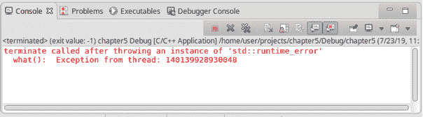

###### 图 5.19:一个例子的执行结果

我们可以看到`std::terminate()`在抛出异常后被调用。当程序中有很多线程时，很难找到线程终止的正确位置。幸运的是，我们有一些从另一个线程捕捉异常的机制。让我们把它们都考虑进去。

**std::async** 函数使用将来的结果将异常转移到调用线程。它在将来的结果中存储`标准::异常 _ptr`，并设置就绪标志。然后，当您调用`get()`、 **std::future** 时，会检查是否有任何`std::exception_ptr`存储并重新引发异常。我们所需要做的就是在`试捕`区块中放置一个`get()`调用。让我们考虑一个例子。我们将使用前面例子中的两个辅助函数，即`getException()`和`toUppercase()`。它们将保持不变。在`main()`函数中，我们创建了一个名为`result`的`std::future`对象，并使用`std::async()`函数运行`to ppercase()`函数。然后，我们在`try-catch`块中调用结果对象的`get()`函数，捕捉异常:

```cpp
#include <iostream>
#include <future>
int main()
{
    std::future<std::string> result = std::async(toUppercase, "please, make it uppercase");
    try
    {
        std::cout << "Future result = " << result.get() << std::endl;
    }
    catch(const std::exception& ex)
    {
        std::cout << "Caught an exception: " << ex.what() << std::endl;
    }
    return 0;
}
```

如果您在 IDE 中运行前面的代码，您将获得以下输出:

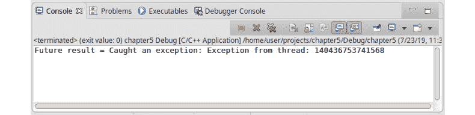

###### 图 5.20:示例执行的结果

如您所见，我们捕捉到了一个异常，现在我们可以通过某种方式处理它。`STD::packaged _ task<>`类以相同的方式处理异常——它将`std::exception_ptr`存储在将来的结果中，设置就绪标志，然后`std::future`在`get()`调用中重新抛出异常。让我们考虑一个小例子。我们将使用前面示例中的两个助手函数- `getException()`和`to ppercase()`。它们将保持不变。在`main()`函数中，我们创建了一个名为`task`的`std::packaged_task`对象。通过使用我们的`to ppercase()`函数的类型，它返回一个整数，并以两个整数作为参数。我们将`传递给`功能到`任务`对象。然后，我们创建一个名为`结果`的`std::future`对象，并使用`get_future()`函数从任务对象中获取结果。最后，我们在新线程`thr`中运行任务对象，并在`try-catch`块中调用`get()`函数的`结果`变量:

```cpp
#include <iostream>
#include <future>
int main()
{
    std::packaged_task<std::string(const std::string&)> task(toUppercase);
    auto result = task.get_future();
    std::thread thr(std::move(task), "please, make it uppercase");
    thr.detach();
    try
    {
        std::cout << "Future result = " << result.get() << std::endl;
    }
    catch(const std::exception& ex)
    {
        std::cout << "Caught an exception: " << ex.what() << std::endl;
    }
    return 0;
}
```

如果您在 IDE 中运行此代码，您将获得以下输出:

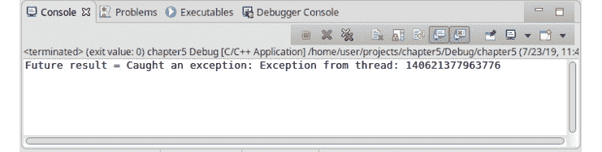

###### 图 5.21:这个例子的执行结果

`std::promise < >`类以另一种方式处理异常。它允许我们使用`set_exception()`或`set _ exception _ at _ thread _ exit()`功能手动存储异常。要在`std::promise`中设置异常，我们必须抓住它。如果我们没有捕捉到异常，将在`std::promise`的析构函数中设置错误为`STD::future _ errc::breaked _ promise`在将来的结果中。当你调用`get()`函数时，会重新抛出一个异常。让我们考虑一个例子。我们将使用上一个示例中的帮助函数–`getException()`。它保持不变。但是我们将`改为`功能，增加第三个参数`std::promise`。现在，我们将调用`中的 **getException()**`**函数，尝试**块，捕捉异常，并将其设置为`std::promise`值:

```cpp
void toUppercase(const std::string& bufIn, std::promise<std::string> result)
{
    std::string bufferOut;
    try
    {
        for (std::string::const_iterator iter = bufIn.begin(); iter != bufIn.end(); iter++)
        {
            if (*iter >= 97 && *iter <= 122)
            {
                    bufferOut += static_cast<char>(static_cast<int>(*iter) - 32);
            }
            else
            {
                bufferOut += *iter;
                getException();
            }
        }
    }
    catch(const std::exception& ex)
    {
        result.set_exception(std::make_exception_ptr(ex));
    }
    result.set_value(bufferOut);
}
```

#### 注意

有几种方法可以打破这个承诺。首先，我们可以捕捉`std::exception`并使用`STD::make _ exception _ ptr()`函数将其转换为`std::exception_ptr`。也可以使用`std::current_exception()`函数，返回`std::exception_ptr`对象。

在`main()`函数中，我们创建了一个名为`upperResult`的整数类型的承诺。我们创建了一个名为`未来`的未来结果，并将其设置为`上结果`承诺值。接下来，我们创建一个新的线程，`thr`，将`传递给它`函数，并将`上移`承诺。然后，我们调用`futureRes`对象的`wait()`函数，使调用线程等待，直到结果可用。然后，在`试捕`块中，我们调用`futureRes`对象的`get()`函数，它重新抛出一个异常:

```cpp
#include <iostream>
#include <future>
int main()
{
    std::promise<std::string> upperResult;
    std::future<std::string> futureRes = upperResult.get_future();
    std::thread thr(toUppercase, "please, make it uppercase", std::move(upperResult));
    thr.detach();
    futureRes.wait();
    try
    {
        std::cout << "Result = " << futureRes.get() << std::endl;
    }
    catch(...)
    {
        std::cout << "Caught an exception" << std::endl;
    }
    return 0;
}
```

#### 注意

当我们创建一个`std::promise < >`对象时，我们承诺我们将强制设置该值或异常。如果我们不这样做，`std::promise`的析构函数将抛出一个异常，即`STD::future _ error–STD::future _ errc::breaked _ promise`。

如果您在 IDE 中运行此代码，您将获得以下输出:


###### 图 5.22:这个例子的执行结果

这就是多线程应用中处理异常的全部方法。如您所见，这与我们在一个线程中所做的非常相似。现在，让我们将我们的知识付诸实践，并编写一个简单的应用示例，演示如何使用不同的未来结果进行同步。

### 练习 5:与未来结果同步

在本练习中，我们将编写一个简单的应用来演示如何使用未来的结果从不同的线程接收值。我们将运行`to ppercase()`可调用对象三次。我们将使用`std::async()`函数执行第一个任务，使用`STD::packaged _ task<>`模板类执行第二个任务，使用`std::thread`和`std::promise`执行最后一个任务。

执行以下步骤完成本练习:

1.  包括支持线程的头文件，即`<线程>`，支持流的头文件，即`< iostream >`，支持未来结果的头文件`<>`:

    ```cpp
    #include <iostream>
    #include <thread>
    #include <future>
    ```

2.  实现一个将给定字符串转换为大写的`to ppercase`类。它有两个重载操作符，`(`)。第一个`运算符()`获取要转换的字符串，并以大写形式返回结果值。第二个`运算符()`获取要转换的字符串和一个`std::promise`，并将返回值存储在一个 promise:

    ```cpp
    class ToUppercase
    {
        public:
        std::string operator()(const std::string& bufIn)
        {
            std::string bufferOut;
            for (std::string::const_iterator iter = bufIn.begin(); iter != bufIn.end(); iter++)
            {
                if (*iter >= 97 && *iter <= 122)
                {
                    bufferOut += static_cast<char>(static_cast<int>(*iter) - 32);
                }
                else
                {
                    bufferOut += *iter;
                }
            }
            return bufferOut;
        }
        void operator()(const std::string& bufIn, std::promise<std::string> result)
        {
            std::string bufferOut;
            for (std::string::const_iterator iter = bufIn.begin(); iter != bufIn.end(); iter++)
            {
                if (*iter >= 97 && *iter <= 122)
                {
                    bufferOut += static_cast<char>(static_cast<int>(*iter) - 32);
                }
                else
                {
                    bufferOut += *iter;
                }
            }
            result.set_value(bufferOut);
        }
    };
    ```

    中
3.  现在，创建一个`to ppercase`对象，即`ptConverter`，并创建一个`std::packaged_task`，即`upper ceresult 1`，该对象以`ptConverter`对象为参数。创建一个`标准::未来`值，并从`上半部分`设置。在单独的线程中运行该任务:

    ```cpp
    ToUppercase ptConverter;
    std::packaged_task<std::string(const std::string&)> upperCaseResult1(ptConverter);
    std::future<std::string> futureUpperResult1= upperCaseResult1.get_future();
    std::thread thr1(std::move(ptConverter), "This is a string for the first asynchronous task");
    thr1.detach(); 
    ```

4.  现在，创建第二个`来访问`对象，即`转换器`。创建一个名为`futureuperresult 2`的`std::future`对象，并从`std::async()` :

    ```cpp
    ToUppercase fConverter;
    std::future<std::string> futureUpperResult2 = std::async(fConverter, "This is a string for the asynchronous task"); 
    ```

    进行设置
5.  现在。创建第三个`来访问`对象。即`pConverter`。创建一个名为`承诺结果`的`标准::承诺`值。然后，创建一个名为`future perresult 3`的`std::future`值，并从`promiseResult`中进行设置。现在，在单独的线程中运行`pcconverter`任务，并将`promisereresult`作为参数传递:

    ```cpp
    ToUppercase pConverter;
    std::promise<std::string> promiseResult;
    std::future<std::string> futureUpperResult3 = promiseResult.get_future();
    std::thread thr2(pConverter, "This is a string for the task that returns a promise", std::move(promiseResult));
    thr2.detach(); 
    ```

6.  现在，要接收所有线程的结果，请等待`futureperresult 3`准备好，然后获取所有三个结果并打印出来:

    ```cpp
    futureUpperResult3.wait();
    std::cout  << "Converted strings: "
            << futureUpperResult1.get() << std::endl
            << futureUpperResult2.get() << std::endl
            << futureUpperResult3.get() << std::endl;
    ```

7.  Run this code in your editor. You will see the converted strings from all three threads.

    您将获得以下输出:

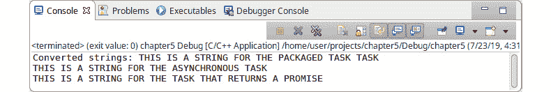

###### 图 5.23:本练习的执行结果

那么，我们在这里做了什么？我们将大型计算拆分成较小的部分，并在不同的线程中运行它们。对于长时间计算，这将提高性能。在本练习中，我们学习了如何从线程接收结果。在本节中，我们还学习了如何将在单独线程中引发的异常传递给调用线程。我们还学习了如何通过一个事件来同步几个线程的工作，不仅用条件变量，而且用未来的结果。

### 活动 1:创建一个模拟器来模拟美术馆的工作

在本活动中，我们将创建一个模拟器来模拟美术馆的工作。我们设定了参观画廊的人数上限——只能有 50 人进入。为了实现这个模拟，我们需要创建一个`Person`类，它将代表美术馆中的人。另外，我们需要一个`Persons`类，它是一个线程安全的容器。我们还需要一个`守望者`类来控制里面有多少人。如果限制超过了守望员，我们会把所有新来的人都放入等候名单。最后，我们需要一个`生成器`类，它有两个线程——一个用于创建新的访问者，另一个用于通知我们有人必须离开画廊。因此，我们将介绍如何使用线程、互斥体、条件变量、lock_guards 和 unique _ locks。这个模拟器将允许我们利用我们在本章中介绍的技术。因此，在尝试本练习之前，请确保您已经完成了本章前面的所有练习。

为了实现这个应用，我们需要描述我们的类。我们有以下课程:

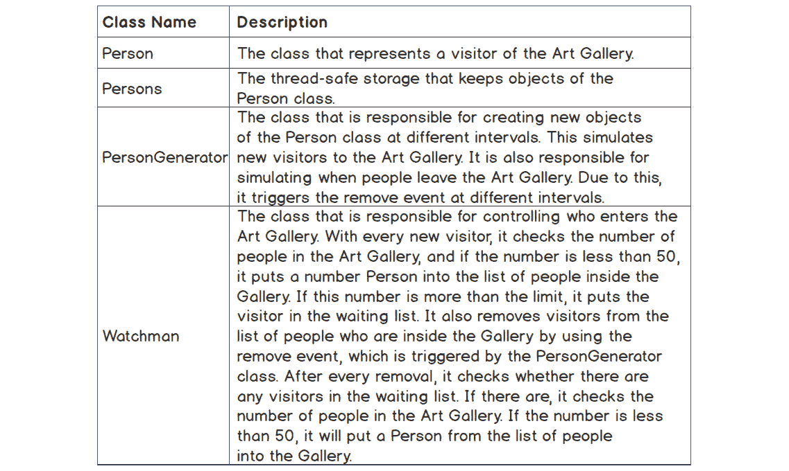

###### 图 5.24:本活动中使用的类的描述

让我们在开始实现之前创建类图。下图显示了上述所有具有关系的类:

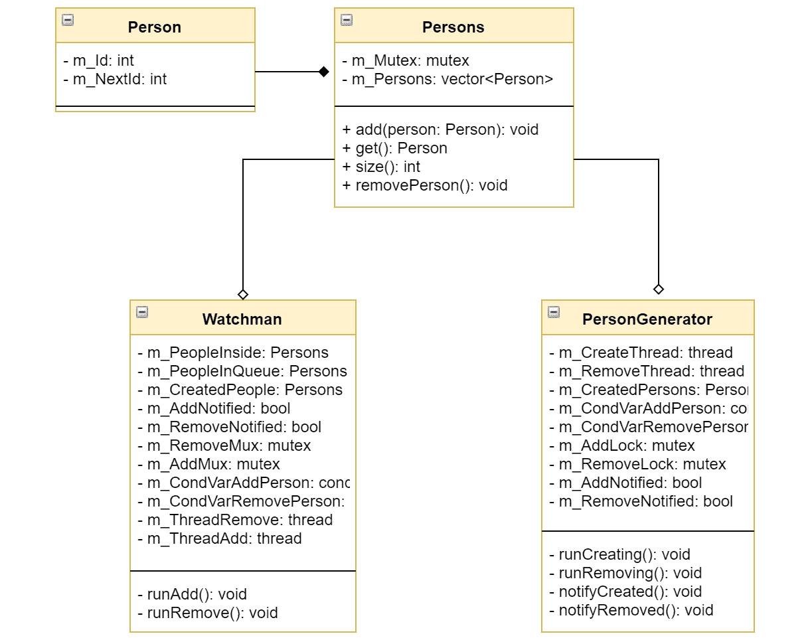

###### 图 5.25:类图

按照以下步骤实施本活动:

1.  定义并实现 Person 类，该类除了打印日志什么也不做。
2.  为包装 std::vector 类的人员创建一些线程安全存储。
3.  实现 PersonGenerator 类，在不同线程的无限循环中，创建和移除访问者，并通知 Watchman 类。
4.  创建 Watchman 类，在一个独立线程的无限循环中，根据 PersonGenerator 类的通知，将访问者从队列移动到另一个队列。
5.  在 main()函数中声明相应的对象来模拟艺术画廊及其工作方式。

在实现这些步骤之后，您应该会得到以下输出，在这里您可以看到所有实现的类的日志。确保模拟按预期进行。预期的输出应该如下所示:

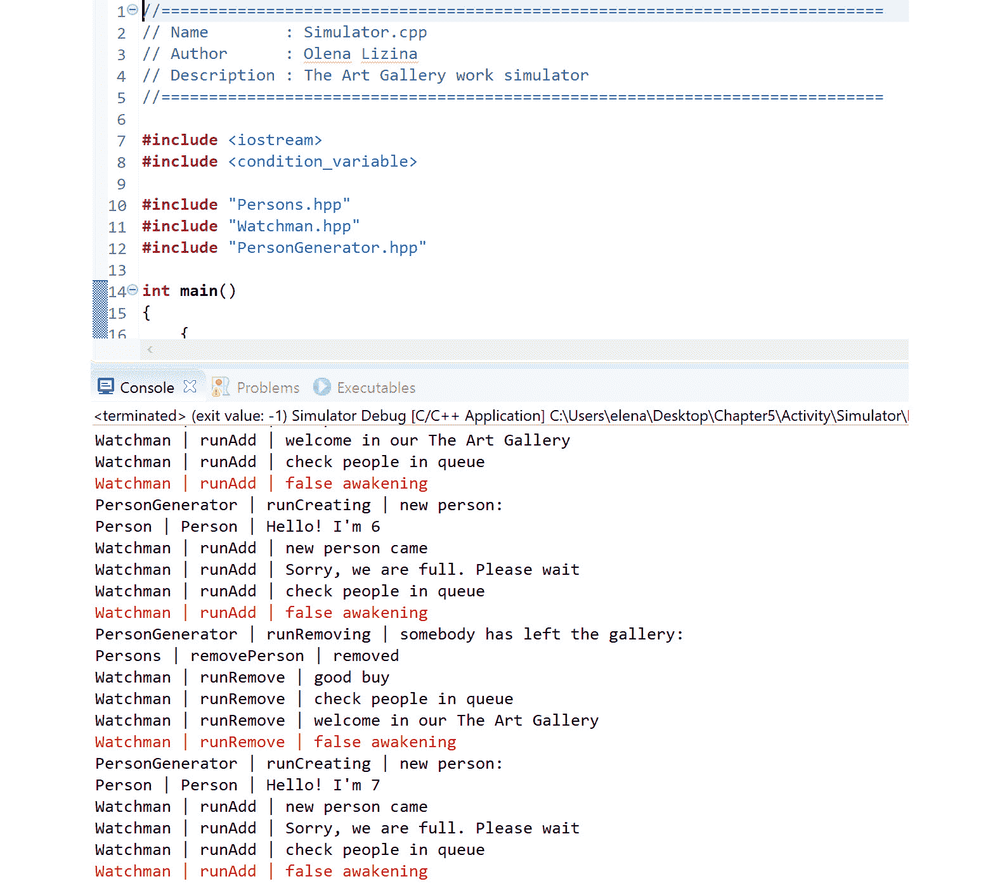

###### 图 5.26:应用执行的结果

#### 注意

这项活动的解决方案可以在第 681 页找到。

## 总结

在本章中，我们学习了如何使用 C++ 标准库支持的线程。如果我们想要编写健壮、快速和清晰的多线程应用，这是最基本的。

我们首先看一下关于并发性的一般概念——什么是并行、并发、同步、异步和线程执行。对这些概念有一个清晰的理解使我们能够理解多线程应用的架构设计。

接下来，我们研究了开发多线程应用时面临的不同问题，例如数据危险、竞争条件和死锁。了解这些问题有助于我们为项目构建一个清晰的同步架构。我们在一些实际例子中考虑了同步概念，这让我们很好地理解了在编写线程应用时可能面临的挑战。

接下来，我们尝试使用不同的标准库原语进行同步。我们试图弄清楚如何处理竞争条件，并实现了按事件同步和按数据同步的例子。接下来，我们考虑移动语义如何应用于多线程。我们从线程支持库中了解到哪些类是不可复制但可移动的。我们还考虑了移动语义如何在多线程闭包中工作。最后，我们学习了如何从不同的线程接收结果，以及如何使用期货、承诺和异步来同步线程。

我们通过建立一个艺术画廊模拟器将所有这些新技能付诸实践。我们用一个主线程和四个子线程构建了一个多线程应用。我们通过使用条件变量来实现它们之间的通信。我们通过互斥锁使用共享数据来保护它们。总之，我们利用了本章所学的一切。

在下一章中，我们将仔细研究 C++ 中的输入/输出操作和类。我们将从标准库的输入/输出支持开始。然后，我们将继续处理流和异步输入/输出操作。接下来，我们将学习线程和输入/输出的交互。我们将编写一个活动，让我们掌握 C++ 中输入/输出工作的技能。