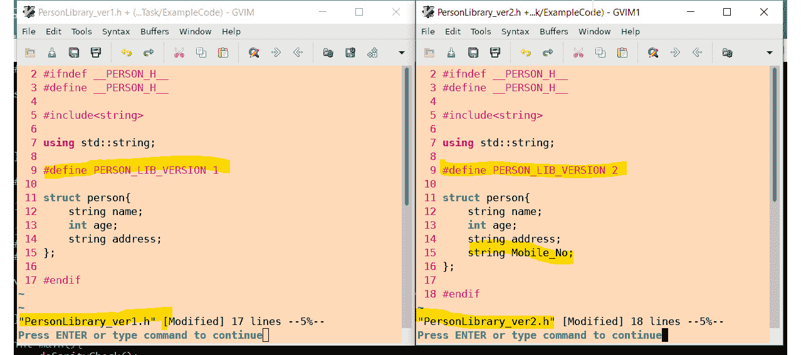
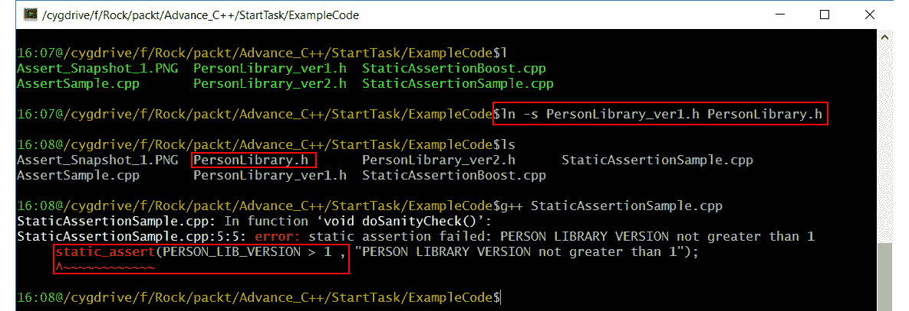
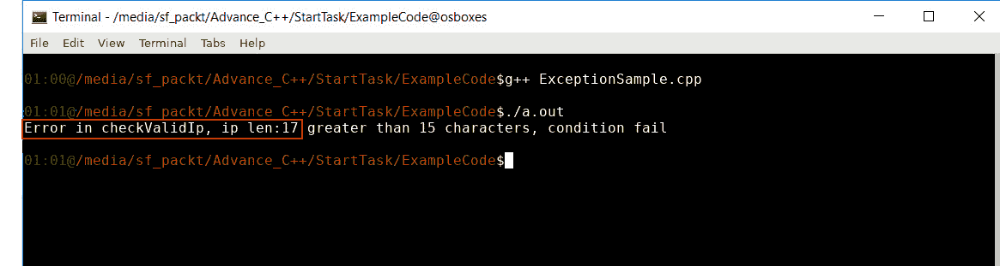
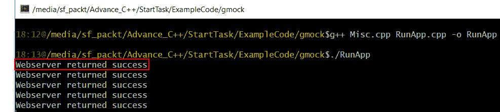
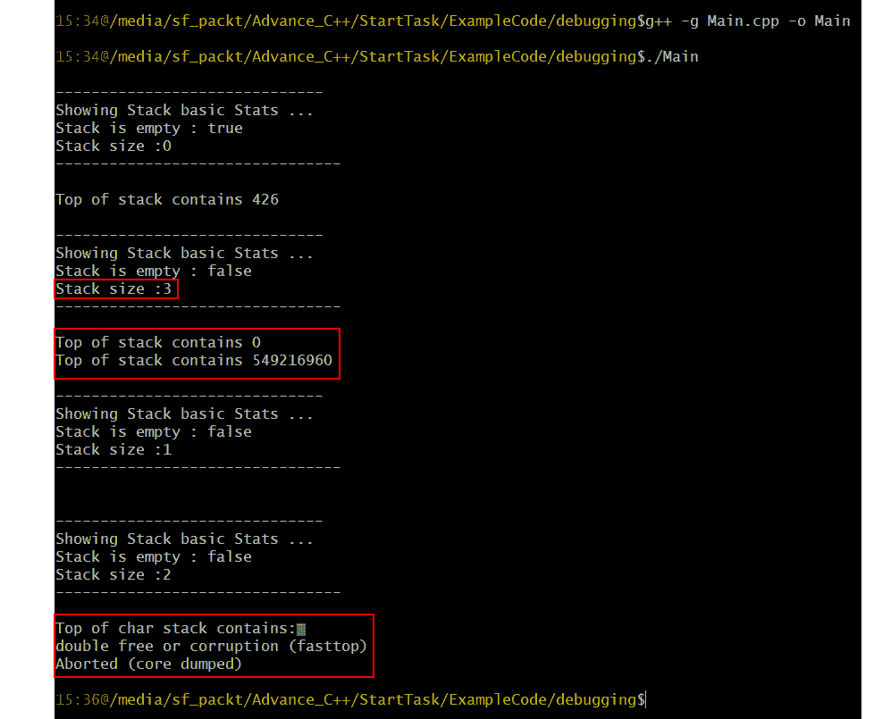
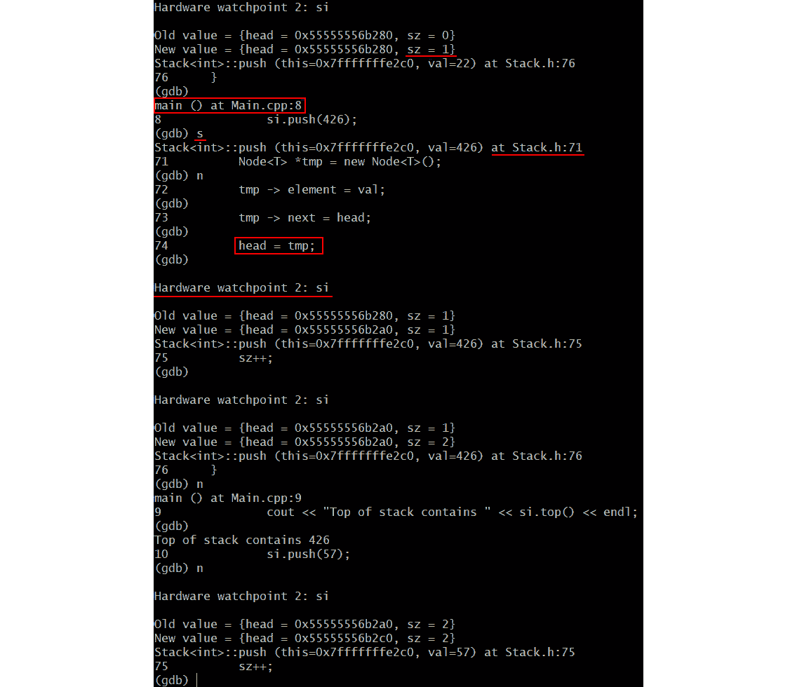
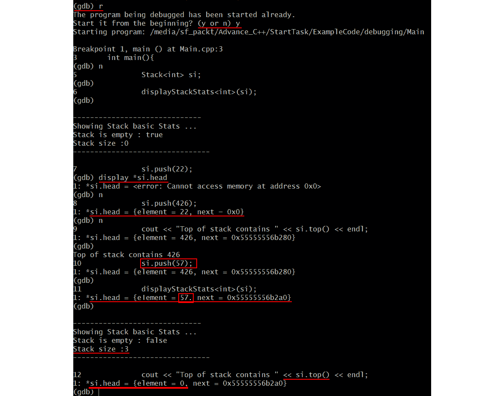

# 7。每个人都会跌倒，这是你爬起来的方式——测试和调试

## 学习目标

本章结束时，您将能够:

*   描述不同类型的断言
*   实现编译时和运行时断言
*   实现异常处理
*   描述和实现单元测试和模拟测试
*   使用断点和观察点调试 C++代码
*   在调试器中检查数据变量和 C++对象

在本章中，您将学习如何适当地添加断言，添加单元测试用例以使代码按照需求运行，并学习调试技术以发现代码中的错误并跟踪其根本原因。

## 简介

在**软件开发生命周期** ( **SDLC** )中，一旦需求收集阶段完成，那么通常会进入设计和架构阶段，其中项目的高层流程被定义并分解成更小的模块组件。当一个项目中有许多团队成员时，每个团队成员都必须被明确分配到模块的特定部分，并且他们知道自己的需求。通过这种方式，他们可以在一个隔离的环境中独立编写自己的那部分代码，并确保它可以正常工作。一旦他们的部分工作完成，他们可以将他们的模块与其他开发人员的模块集成，并确保整个项目按照要求执行。

这个概念也可以应用到小项目中，在小项目中，开发人员完全在处理一个需求，将它分解成更小的组件，在隔离的环境中开发组件，确保它按照计划执行，集成所有的小模块来完成项目，最后测试它以确保整个项目运行良好。

当整个项目被集成和执行时，需要大量的测试。可能会有一个单独的团队(称为**质量保证**，即 **QA** )专门执行这项任务。与其在项目级别发现问题，不如在每个独立的阶段测试代码。该测试需要由负责该模块的开发人员来执行。这种类型的测试被称为单元测试。在这里，开发人员可以模拟运行该模块所需的环境，并确保他们测试模块中编写的功能的特定部分。例如，让我们假设，在一个大项目中，有一个小模块，其功能是解析配置文件并获取设置环境所需的参数。如果解析文件的部分代码将一个`IP 地址`作为`字符串`，那么开发人员需要确保它的格式为`XXX。XXX.XXX.XXX`，其中`X`为`0` - `9`的数字。字符串的长度必须是有限的。

在这里，开发人员可以创建一个测试程序来执行他们的那部分代码:解析文件，将`IP 地址`提取为字符串，并测试它的格式是否正确。同样，如果配置有其他参数需要解析，并且它们需要采用特定的格式，例如`用户标识` / `密码`，日志或挂载点的文件位置等等，那么所有这些都将是该模块单元测试的一部分。在本章中，我们将解释诸如`断言`、`安全嵌套` ( `异常处理`)、`单元测试`、`嘲讽`、`断点`、`观察点`、`数据可视化`等技术，以查明错误来源并限制其增长。在下一节中，我们将探讨断言技术。

### 断言

为上述场景使用测试条件将有助于项目以更好的方式开发，因为缺陷将在基础级别而不是在后期的质量保证级别被发现。可能存在这样的场景，即使在编写单元测试用例并成功执行代码之后，当应用程序崩溃、程序意外退出或行为不符合预期时，也可能会发现问题。为了克服这种情况，通常，开发人员使用调试模式二进制文件来重新创建问题。`断言`用于确保检查条件，否则程序执行终止。

这样，问题就可以快速追踪到。此外，在`调试模式`下，开发人员可以逐行遍历程序的实际执行情况，并检查代码流是否如预期的那样，或者变量是否按预期设置并正确访问。有时，如果指针变量没有指向有效的内存位置，访问指针变量会导致意外的行为。

在编写代码时，我们可以检查必要条件是否满足。如果没有，那么程序员可能不想进一步执行代码。使用断言可以很容易地做到这一点。一个`断言`是一个宏，其中特定条件被检查，如果它不满足标准，中止被调用(程序执行被停止)并且一个错误信息被打印为一个`标准错误`。这通常是一个**运行时断言**。也可以在编译时进行断言。这个我们以后再说。在下一节中，我们将解决一个练习，其中我们将编写和测试我们的第一个断言。

### 练习 1:编写和测试我们的第一个断言

在本练习中，我们将编写一个函数来解析一个`IP 地址`，并检查它是否有效。作为我们要求的一部分，`IP 地址`将作为字符串文字在`XXX 中传递。XXX.XXX.XXX`格式。在此格式中，`X`代表从`0` - `9`的一个数字。因此，作为检查正在解析的`字符串`是否正确的测试的一部分，我们需要确保`字符串`不为`空`，并且其`长度`小于`16`。按照以下步骤实施本练习:

1.  创建一个名为**的新文件。**
2.  Open the file and write the following code to include the header files:

    ```cpp
    #include<iostream>
    #include<cassert>
    #include<cstring>
    using std::cout;
    using std::endl;
    ```

    在前面的代码中，`#include < cassert >`表明我们需要在定义 assert 的地方包含`cassert`文件。

3.  Create a function named `checkValidIp()` that will take the `IP address` as input and return a `true` value if the `IP address` meets our requirements. Write the following code to define the function:

    ```cpp
    bool checkValidIp(const char * ip){
        assert(ip != NULL);
        assert(strlen(ip) < 16);
        cout << "strlen: " << strlen(ip) << endl;
        return true;
    }
    ```

    这里，`断言(ip！=空)`表示如果传递的“`ip`变量不是`空值`，断言宏用于检查条件。如果是`空`，那么它将中止并显示一条错误消息。此外，`assert(strlen(IP)<16)`显示该 assert 用于检查“`ip`”是否为`16`字符或更少。如果不是，则中止并显示`错误信息`。

4.  Now, create a `main` function that passes a different string literal to our `checkValidIp()` function and makes sure it can be tested appropriately. Write the following code for the `main` function:

    ```cpp
    int main(){
        const char * ip;
        ip = NULL;
        bool check = checkValidIp(ip);
        cout << " IP address is validated as :" << (check ? "true" : "false") << endl;
        return 0;
    }
    ```

    在前面的代码中，我们特意将`NULL`传递给了`ip`变量，以确保`断言`被调用。

5.  Open the `Command Prompt` and go to the location where the **AssertSample.cpp** file is stored. Compile it with the `g++` compiler by typing the following command:

    ```cpp
    g++ AssertSample.cpp
    ```

    利用该命令，生成`a.out`二进制文件。

6.  Run the `a.out` binary file by typing the following command in the compiler:

    ```cpp
    ./a.out
    ```

    您将看到以下输出:

    

    ###### 图 7.1:在命令提示符下运行断言二进制文件

    在前面的截图中，您可以看到三段用红色圈起来的代码。第一个突出显示的部分显示了**的编译。cpp** 文件。第二个突出显示的部分显示了由前面的编译生成的 **a.out** 二进制文件。第三个突出显示的部分显示了为传递的**空值**抛出错误的断言。它指示调用断言的行号和函数名。

7.  Now, inside the `main` function, we will pass `ip` with a length greater than `16` and check if the `assert` is called here too. Write the following code to implement this:

    ```cpp
    ip = "111.111.111.11111";
    ```

    再次，打开编译器，编译**。cpp** 文件，并运行生成的二进制文件。编译器中将显示以下输出:

    

    ###### 图 7.2:在命令提示符下运行断言二进制文件

    在前面的截图中，断言抛出了一个错误，因为传递的`ip`长度大于`16`。

8.  Now, to satisfy the `assert` condition so that the binary runs fine, we need to update the value of `ip` inside the `main` function. Write the following code to do this:

    ```cpp
    ip = "111.111.111.111"; 
    ```

    再次，打开编译器，编译**。cpp** 文件，并运行生成的二进制文件。编译器中会显示以下输出:

    

    ###### 图 7.3:在命令提示符下运行断言二进制文件

    #### 注意

    因为我们只是在这里处理`断言`，所以我们没有给我们的`checkValidIP()`函数添加任何额外的功能。然而，我们将在*异常处理*和*单元测试*部分使用相同的例子，其中我们将为我们的函数添加更多的功能。

9.  如果我们不希望可执行文件由于生产或发布环境中的断言而中止，请从代码中删除`断言`宏调用。首先更新长度大于`16`的`ip`的值。将以下代码添加到文件中:

    ```cpp
    ip = "111.111.111.11111";
    ```

10.  Now, during compilation, pass the `-DNDEBUG` macro. This will make sure that the assert is not called in the binary. Write the following command to compile our `.cpp` file in the Terminal:

    ```cpp
    g++ -DNDEBUG AssertSample.cpp
    ```

    之后，当我们执行二进制文件时，会生成以下输出:

    

###### 图 7.4:在命令提示符下运行断言二进制文件

在上一个截图中，由于`断言`没有被调用，它将显示字符串长度为 **17** ，而**真**值为将被验证的 IP 地址。在本练习中，我们看到在执行二进制文件时调用了断言。在代码编译期间，我们也可以有一个断言。这是在 C++ 11 中引入的。它被称为**静态断言**，我们将在下一节中探讨它。

### 静态断言

有时，我们可以在编译时进行条件检查，以避免将来出现任何错误。例如，在一个项目中，我们可能会使用一个第三方库，其中声明了一些数据结构。这个结构信息，比如它的`大小`和`成员变量`，我们从它的头文件中就知道了。利用这些信息，我们可以正确地分配或释放内存，以及处理其成员变量。在具有不同版本的第三方库中，此结构属性可能会改变。然而，如果我们的项目代码仍然使用早期版本的结构，那么当我们使用它时，它会产生问题。运行二进制文件时，我们可能会在稍后阶段遇到错误。我们可以在编译时使用`静态断言`来捕捉这个错误。我们可以比较静态数据，比如库的版本号，从而确保我们的代码不会遇到任何问题。在下一节中，我们将基于此解决一个练习。

### 练习 2:测试静态断言

在本练习中，我们将通过执行`静态断言`来比较两个头文件的版本号。如果`版本号`小于`1`，则会抛出静态断言错误。执行以下步骤来实施本练习:

1.  Create a header file named **PersonLibrary_ver1.h** and add the following code:

    ```cpp
    #ifndef __PERSON_H__
    #define __PERSON_H__
    #include<string>
    using std::string;
    #define PERSON_LIB_VERSION 1
    struct person{
        string name;
        int age;
        string address;
    };
    #endif
    ```

    在前面的代码中，结构人被定义并由以下属性组成:`姓名`、`年龄`和`地址`。它还有版本号`1`。

2.  Create another header file named **PersonLibrary_ver2.h** and add the following code:

    ```cpp
    #ifndef __PERSON_H__
    #define __PERSON_H__
    #include<string>
    using std::string;
    #define PERSON_LIB_VERSION 2
    struct person{
        string name;
        int age;
        string address;
        string Mobile_No;
    };
    #endif
    ```

    在前面的代码中，定义了`结构人`，由以下属性组成:`姓名`、`年龄`、`地址`、`手机号`。它还有`版本号 2`。现在，`版本 1`是老版本，`版本 2`是新版本。下面是并排的两个头文件的截图:

    

    ###### 图 7.5:不同版本的库文件

3.  Create a file named **StaticAssertionSample.cpp** and add the following code:

    ```cpp
    #include<iostream>
    #include"PersonLibrary.h"
    void doSanityCheck(){
        static_assert(PERSON_LIB_VERSION > 1 , "PERSON LIBRARY VERSION not greater than 1");
        // Do any more sanity check before starting app ... 
    }
    int main(){
        doSanityCheck();
        return 0;
    }
    ```

    在前面的代码中，我们在构建和执行项目之前，对项目进行了健全性检查。我们已经创建了一个名为`Dosaniticheck()`的函数来执行库的版本检查。它使用静态断言完成，并在编译时执行。代码的第二行显示包含**personal library . h**文件。在`Dosaniticheck()`函数中，`static_assert()`函数检查该版本的库是否大于 1。

    #### 注意

    如果您的项目需要在库的`版本 2`或更高版本中定义的人员结构来正确执行它，我们需要匹配`版本 2`的文件，即`PERSON_LIB_VERSION`至少应该设置为`2`。如果开发人员获得了库的`版本 1`，并试图为项目创建一个二进制文件，这可能会在执行中产生问题。为了避免这种情况，在项目的主要代码中，我们在项目构建和执行之前对其进行了健全性检查。

4.  To include `version 1` of the library in our **.cpp** file, open the terminal and write the following command:

    ```cpp
    ln -s PersonLibrary_ver1.h PersonLibrary.h
    ```

    前面的命令将创建一个名为**personal library . h**的**personal library _ ver 1 . h**文件的软链接。这就像用`版本 1`模拟我们使用**personal library . h**的环境。

5.  Compile our **.cpp** file using the following command in the terminal:

    ```cpp
    g++ StaticAssertionSample.cpp
    ```

    以下是终端生成的输出:

    

    ###### 图 7.6:看到静态错误

    在前面的截图中，三个区域用红色圈起来。第一个给出了创建软链接的命令。第二个命令显示了我们创建的**personal library . h**文件。第三个区域显示了由于库的版本不匹配而引发的`static_assert`错误。

6.  Now, to compile the program correctly, remove the soft link of `ProgramLibrary` and create a new one pointing to `version2` and compile it again. This time, it will compile fine. Type the following commands into the terminal to remove a soft link:

    ```cpp
    rm PersonLibrary.h 
    ln -s PersonLibrary_ver2.h PersonLibrary.h
    g++ StaticAssertionSample.cpp
    ```

    以下是相同内容的截图:


###### 图 7.7:静态断言编译文件

如您所见，用红色标记的区域显示使用了正确版本的`personal library`，编译顺利进行。编译后，创建一个名为“**a.exe**的二进制文件。在本练习中，我们通过比较两个头文件的版本号来执行静态断言。在下一节中，我们将探讨异常处理的概念。

### 了解异常处理

正如我们之前在调试模式二进制中看到的，当某个条件不满足时，我们可以使用运行时断言来中止程序。但是在发布模式二进制或生产环境中，当客户端使用该产品时，突然中止程序并不是一个好主意。最好处理这种错误情况，并继续执行二进制文件的下一部分。

最糟糕的情况发生在二进制文件需要退出的时候。它将通过添加正确的日志消息并清除为该进程分配的所有内存来优雅地完成这项工作。对于这种情况，使用异常处理。这里，当遇到错误情况时，执行转移到一个特殊的代码块。例外情况包括以下三个部分:

*   **试块**:这里我们检查条件是否符合必要条件。
*   **掷块**:如果条件不匹配，则抛出异常。
*   **捕获块**:它捕获异常，并针对该错误条件执行必要的执行。

在下一节中，我们将解决一个练习，其中我们将对代码执行异常处理。

### 练习 3:执行异常处理

在本练习中，我们将对我们的 **AssertSample.cpp** 代码执行异常处理。我们将用异常替换断言条件。执行以下步骤来实施本练习:

1.  创建一个名为`ExceptionSample.cpp`的文件。
2.  添加以下代码添加头文件:

    ```cpp
    #include<iostream>
    #include<cstring>
    using std::cout;
    using std::endl; 
    ```

3.  Create a `checkValidIp()` function wherein we have a try-catch block. If the condition present in the try block is not satisfied, an exception will be thrown and the message in the catch block will be printed. Add the following code to accomplish this:

    ```cpp
    bool checkValidIp(const char * ip){
        try{
            if(ip == NULL)
                throw ("ip is NULL");
            if(strlen(ip) > 15)
                throw int(strlen(ip));
        }
        catch(const char * str){
            cout << "Error in checkValidIp :"<< str << endl;
            return false;
        }
        catch(int len){
            cout << "Error in checkValidIp, ip len:" << len <<" greater than 15 characters, condition fail" << endl;
            return false;
        }
        cout << "strlen: " << strlen(ip) << endl;
        return true;
    }
    ```

    在前面的代码中，您可以看到检查条件的 try 块。在 try 块中，如果`ip`为`空`，那么它将抛出(`const char *`)类型的异常。在下一种情况下，如果`ip`大于`15`，则抛出 int 参数类型的异常。该投掷由具有匹配参数(`int`或`const char *`)的正确接球完成。两个异常都返回`假`，并显示一些错误信息。或者，在`catch`块中，如果需要任何清理，您可以执行额外的步骤，或者使用异常中用于比较的变量的默认值。

    #### 注意

    存在默认异常；例如，如果有一个嵌套函数用不同的参数抛出了一个错误，那么它可以作为一个更高级别的函数用 catch(…)这样的参数来捕获。同样，在泛型 catch 中，您可以为异常处理创建默认行为。

4.  创建`main()`函数，并在其中编写以下代码:

    ```cpp
    int main(){
        const char * ip;
        ip = NULL;
        if (checkValidIp(ip)) 
            cout << "IP address is correctly validated" << endl;
        else {
            /// work on error condition 
            // if needed exit program gracefully.
            return -1;
        }
        return 0;
    }
    ```

5.  Open the terminal, compile our file, and run the binary. You will see the following output:

    

    ###### 图 7.8:带有异常处理的示例执行代码

    前面的例子抛出了`ip`为`空`的异常，优雅的退出。

6.  现在，通过提供超过`15`个字符，修改`主`功能中`ip`的值。为此，编写以下代码:

    ```cpp
    ip = "111.111.111.11111";
    ```

7.  Open the terminal, compile our file, and run the binary. You will see the following output:

    

    ###### 图 7.9:异常处理的另一个例子

    对于 **ip 字符串**，它抛出一个长度不匹配的**错误。**

8.  再次修改`主`功能中`ip`的值，少于`15`个字符。为此，编写以下代码:

    ```cpp
    ip = "111.111.111.111";
    ```

9.  打开终端，编译我们的文件，运行二进制。您将看到以下输出:


###### 图 7.10:二进制运行良好，没有抛出异常

从前面的截图可以看出，二进制文件执行正常，没有任何异常。既然您已经理解了如何处理异常，在下一节中，我们将探讨`单元测试`和`模拟测试`的概念。

## 单元测试和模拟测试

当开发人员开始编写代码时，他们需要确保代码在单元级别得到正确测试。可能会发生边界条件丢失的情况，代码在客户端运行时可能会中断。为了避免这种情况，一般来说，对代码进行`单元测试`是个好主意。`单元测试`是在代码的单元级或基础级执行的测试，开发人员可以在隔离的环境中测试他们的代码，假设运行代码的某个特性所需的设置已经完成。一般来说，将模块分解成小函数并分别测试每个函数是一种很好的做法。

例如，假设部分功能是读取配置文件，并使用配置文件中的参数设置环境。我们可以创建一个专门的函数来编写这个功能。因此，为了测试这个函数，我们可以创建一组单元测试用例，检查各种可能失败或行为不正确的组合。一旦确定了这些测试用例，开发人员就可以编写代码来覆盖功能，并确保它通过所有的单元测试用例。作为开发的一部分，这是一个很好的实践，您可以继续首先添加测试用例，并相应地添加代码，然后运行该函数的所有测试用例，并确保它们的行为适当。

有很多工具可以用来为项目编写和集成单元测试用例。几个是 **cppunit** 、 **Google Test** 、**微软单元测试框架**、 **catch** 。为了我们例子的目的，我们将致力于`谷歌测试框架`。它是免费提供的，可以与项目集成。它使用**xuit 测试框架**，并且有一个断言集合，可以用来测试测试用例的条件。在下一节中，我们将解决一个练习，其中我们将创建我们的第一个单元测试用例。

### 练习 4:创建我们的第一个单元测试用例

在本练习中，我们将处理上一节中讨论的相同场景，其中开发人员负责编写一个函数来解析`配置文件`。配置文件中传递了不同的有效参数，如`产品可执行名称`、`版本号`、`数据库连接信息`、`IP 地址`连接服务器等等。假设开发人员将在一个单独的函数中分解解析文件、设置和测试单个属性的参数的所有功能。在我们的案例中，我们假设开发人员正在编写功能，他们已经将`IP 地址`解析为`字符串`，并想推断`字符串`是否是有效的`IP 地址`。目前，匹配`IP 地址`有效的标准需要满足以下条件:

*   `字符串`不应为空。
*   `字符串`包含的字符不得超过`16`
*   `弦`应该在`XXX。XXX.XXX.XXX`格式，其中`X`必须是`0` - `9`之间的数字。

执行以下步骤来实施本练习:

1.  Create the **CheckIp.h** header file and write the following code inside it:

    ```cpp
    #ifndef  _CHECK_IP_H_
    #define _CHECK_IP_H_
    include <iostream>
    include <cstring>
    using namespace std;
    bool checkValidIp(const char *);
    #endif
    ```

    在前面的代码中，我们编写了一个名为`checkValidIp()`的函数来检查`IP 地址`是否有效。同样，为了理解`谷歌单元测试`，我们将编写最少的代码来理解这个特性。

2.  Create a **CheckIp.cpp** file and write the following code, wherein we'll check if `ip` is `not NULL` and that the length is less than `16`:

    ```cpp
    #include "CheckIp.h"
    #include<string>
    #include<sstream>
    bool checkValidIp(const char * ip){
        if(ip == NULL){
            cout << "Error : IP passes is NULL " << endl;
            return false;
        }
        if(strlen(ip) > 15){
            cout << "Error: IP size is greater than 15" << endl;
            return false;
        }
        cout << "strlen: " << strlen(ip) << endl;
        return true;
    } 
    ```

    在前面的代码中，如果两个条件都失败，函数返回`false`。

3.  调用`checkValidIp()`函数创建一个名为 **MainIp.cpp** 的新文件。这个文件，一般来说，将包含项目的主要流程，但是为了我们练习的目的，我们只是调用我们的`checkValidIP()`函数。在里面添加以下代码:

    ```cpp
    #include"CheckIp.h"
    int main(){
        const char * ip;
        //ip = "111.111.111.111";
        ip = "111.111.111.11111";
        if (checkValidIp(ip)) 
            cout << "IP address is correctly validated" << endl;
        else {
            /// work on error condition 
            // if needed exit program gracefully.
            cout << " Got error in valid ip " << endl;
            return -1;
        }
        return 0;
    } 
    ```

4.  To create test code, we'll create our first **.cpp** file, that is, **TestCases.cpp**. This will contain test cases for our `checkValidIp` function. Write the following code inside it:

    ```cpp
    #include"CheckIp.h"
    #include<gtest/gtest.h>
    using namespace std;
    const char * testIp;
    TEST(CheckIp, testNull){
        testIp=NULL;
        ASSERT_FALSE(checkValidIp(testIp));
    }
    TEST(CheckIp, BadLength){
        testIp = "232.13.1231.1321.123";
        ASSERT_FALSE(checkValidIp(testIp));
    }
    ```

    在前面代码的第二行，我们包含了 **gtest.h** 文件。我们还使用 **TEST** 函数调用测试用例，该函数接受两个参数:第一个是 **testsuite** 名称，第二个是 **testcase** 名称。对于我们的案例，我们已经创建了**测试套件** **检查点**。在**测试**块中，您将看到我们有**谷歌测试**定义了一个名为 **ASSERT_FALSE** 的**断言，它将检查条件是否为 **false** 。如果不是，它将通过测试用例，并在结果中显示相同的内容。**

    #### 注意

    一般来说，对于一个`谷歌测试`用例和测试套件，你可以将它们分组在一个公共的名称空间中，并调用`RUN_ALL_TESTS`宏，该宏运行所有附加到测试二进制文件的测试用例。对于每个测试用例，它调用`SetUp`函数进行初始化(像类中的构造函数)，然后调用实际的测试用例，最后调用`拆卸`函数(像类中的析构函数)。没有必要编写`SetUp`和`拆卸`功能，除非你必须为测试用例初始化一些东西。

5.  Now, to run the test cases, we will create the main **.cpp** file for the test cases and call the `RUN_ALL_TESTS` macro. Alternatively, we can create an executable by linking the `Google Test library` that invokes `RUN_ALL_TESTS`. For our case, we will do the latter. Open the terminal and run the following command to create a test run binary:

    ```cpp
    g++ -c CheckIp.cpp
    ```

    这将包括 **CheckIp.cpp** 的对象文件，因为其中定义了`CheckValidIp`函数。

6.  现在，键入以下命令添加创建二进制文件所需的库:

    ```cpp
    g++ CheckIp.o TestCases.cpp -lgtest -lgtest_main -pthread -o TestRun 
    ```

7.  Now, run the binary with the following command:

    ```cpp
    ./TestRun
    ```

    这显示了通过**检查点**和**测试套件**的两个测试用例。第一个测试用例**被调用并且通过。第二个测试用例， **CheckIp。BadLength** ，被称为，它也通过。这个结果可以在下面的截图中看到:**

    

    ###### 图 7.11:编译和执行测试用例

    #### 注意

    在`谷歌测试`中，我们也可以使用其他断言，但是对于我们的测试用例，我们可以使用`ASSERT_FALSE`，因为我们只检查我们通过的 IP 地址的假条件。

8.  Now, we will add more test cases to make our code robust. This is generally good practice for writing code. First, create the test cases and make sure the code runs fine for new test cases and old test cases along with the correct functionality of the code. To add more test cases, add the following code to the **TestCases.cpp** file:

    ```cpp
    TEST(CheckIp, WrongTokenCount){
        testIp = "22.13111.11";
        ASSERT_FALSE(checkValidIp(testIp));
    }
    TEST(CheckIp, WrongTokenEmpty){
        testIp = "22.131..11";
        ASSERT_FALSE(checkValidIp(testIp));
    } 
    TEST(CheckIp, WrongTokenStart){
        testIp = ".2.1.31.11";
        ASSERT_FALSE(checkValidIp(testIp));
    } 
    TEST(CheckIp, WrongTokenEnd){
        testIp = "2.13.11.1.";
        ASSERT_FALSE(checkValidIp(testIp));
    } 
    TEST(CheckIp, SpaceToken){
        testIp = "2.13.11\. 1";
        ASSERT_FALSE(checkValidIp(testIp));
    } 
    TEST(CheckIp, NonDigit){
        testIp = "2.13.b1.A1";
        ASSERT_FALSE(checkValidIp(testIp));
    } 
    TEST(CheckIp, NonValidDigit){
        testIp = "2.13.521.61";
        ASSERT_FALSE(checkValidIp(testIp));
    } 
    TEST(CheckIp, CorrectIp){
        testIp = "232.13.123.1";
        ASSERT_FALSE(checkValidIp(testIp));
    } 
    ```

    在前面的代码中，第一种和第二种情况应该会因不正确的令牌而失败。如果`IP`以“”开头，第三种情况应该会失败。如果`IP`以“.”结尾，第四种情况应该会失败。如果`IP`有中间空间，第五种情况应该会失败。如果`IP`包含任何非数字字符，第六种情况应该会失败。如果`IP`的令牌值小于`0`且大于`255`，则第七种情况应该会失败。如果`IP`令牌计数错误，最后一种情况应该会失败。

9.  现在，在 **CheckIp.cpp** 文件的`CheckValidIp()`函数中添加以下代码。处理新的测试用例需要这个代码:

    ```cpp
    if(ip[strlen(ip)-1] == '.'){
        cout<<"ERROR : Incorrect token at end"<<endl;
        return false;
    }
    isstringstream istrstr(ip);
    vector<string> tokens;
    string token;
    regex expression("[^0-9]");
    smatch m;
    while(getline(istrstr, token, '.')){
        if(token.empty()){
            cout<<"ERROR : Got empty token"<<endl;
            return false;
        }
        if(token.find(' ') != string::npos){
            cout<<"ERROR : Space character in token"<<endl;
            return false;
        }
        if(regex_search(token,m,expression)){
            cout<<"ERROR : NonDigit character in token"<<endl;
            return false;
        }
        int val = atoi(token.c_str());
        if(val<0 || val>255){
            cout<<"ERROR : Invalid digit in token"<<endl;
            return false;
        }
        tokens.push_back(token);
    }
    if(tokens.size()!=4){
        cout<<"ERROR : Incorrect IP tokens used"<<endl;
        return false;
    }
    cout<<"strlen: "<<strlen(ip)<<endl;
    return true;
    }
    ```

10.  Open the terminal and write the following command to run the binary file:

    ```cpp
    ./TestRun
    ```

    所有的测试用例都已经执行，如下图所示:


###### 图 7.12:测试用例运行的输出

前面的截图显示在`CheckIp`测试套件中有`10 个`测试用例，并且所有的测试用例运行良好。在下一节中，我们将学习使用模拟对象的单元测试。

### 使用模拟对象的单元测试

当开发人员进行单元测试时，可能会出现在具体操作发生后调用某些接口的情况。例如，正如我们在前面的场景中所讨论的，让我们假设项目的设计方式是，在执行之前，它从数据库中获取所有的配置信息。它查询数据库以获得具体参数，例如，web 服务器的`IP 地址`、`用户`、`密码`。然后，它尝试连接到 web 服务器(可能还有另一个模块处理与网络相关的任务)，或者开始处理实际项目所需的项目。之前，我们致力于测试 IP 地址的有效性。现在，我们将更进一步。让我们假设 IP 地址是从数据库中获取的，并且我们有一个实用程序类来处理连接到`数据库`和查询`IP 地址`。

现在，为了测试 IP 地址的有效性，我们需要假设数据库连接已经建立。这意味着应用程序可以正确查询数据库并获得查询结果，其中一个是`IP 地址`。只有这样，我们才能测试 IP 地址的有效性。现在，为了执行这样的测试，我们必须假设所有必要的活动已经完成，并且我们已经获得了一个`IP 地址`来进行测试。模拟对象来了，它的行为类似于真实对象。它为单元测试提供了便利，因此应用程序会有这样的印象，即 IP 地址已经从数据库中获取，但实际上，我们已经模仿了它。要创建一个模拟对象，我们需要从它需要模仿的类中继承它。在下一节中，我们将通过一个练习来更好地理解模拟对象。

### 练习 5:创建模拟对象

在本练习中，我们将通过假设所有接口都按预期工作来创建模拟对象。使用这些对象，我们将测试一些功能，例如验证`IP 地址`，检查数据库连接，以及检查`用户名`和`密码`的格式是否正确。一旦所有测试通过，我们将确认申请，并为`QA`做好准备。执行以下步骤来实施本练习:

1.  创建一个名为 **Misc.h** 的头文件，并包含必要的库:

    ```cpp
    #include<iostream>
    #include<string>
    #include<sstream>
    #include<vector>
    #include<iterator>
    #include<regex>
    using namespace std;
    ```

2.  创建一个名为`的连接数据库`的类，它将连接到数据库并返回查询结果。在类中，声明`数据库名`、用户和密码变量。另外，声明一个构造函数和两个虚函数。这两个虚函数中，第一个必须是析构函数，第二个必须是`getResult()`函数，从数据库返回查询结果。添加以下代码来实现:

    ```cpp
    class ConnectDatabase{
        string DBname;
        string user;
        string passwd;
        public:
            ConnectDatabase() {} 
            ConnectDatabase(string _dbname, string _uname, string _passwd) :
                DBname(_dbname), user(_uname), passwd(_passwd) { }
            virtual ~ConnectDatabase() {} 
            virtual string getResult(string query);
    };
    ```

3.  Create another class named `WebServerConnect`. Declare three `string` variables inside the `class`, namely `Webserver`, `uname`, and `passwd`. Create constructor and two virtual functions. Out of these two virtual functions, the first one must be a destructor, and the second one must be the `getRequest()` function. Add the following code to implement this:

    ```cpp
    class WebServerConnect{
        string Webserver;
        string uname;
        string passwd;
        public :
        WebServerConnect(string _sname, string _uname, string _passwd) :
                Webserver(_sname), uname(_uname), passwd(_passwd) { }
            virtual ~WebServerConnect() {}
            virtual string getRequest(string req);
    };
    ```

    #### 注意

    `虚拟函数`是必需的，因为我们要从前一个类创建一个`模拟类`并调用这些函数。

4.  Create a class named `App`. Create the constructors, and destructors and call all the functions. Add the following code to implement this:

    ```cpp
    class App {
        ConnectDatabase *DB;
        WebServerConnect *WB;
        public : 
            App():DB(NULL), WB(NULL) {} 
            ~App() { 
                if ( DB )  delete DB;
                if ( WB )  delete WB;
            }
            bool checkValidIp(string ip);
            string getDBResult(string query);
            string getWebResult(string query);
            void connectDB(string, string, string);
            void connectDB(ConnectDatabase *db);
            void connectWeb(string, string, string);
            void run();
    };
    ```

    在前面的代码中，app 会先查询数据库，得到`的 IP 地址`。然后，它用必要的信息连接到 web 服务器，并查询它以获得所需的信息。

5.  Create a class named **MockMisc.h** and add the following code:

    ```cpp
    #include"Misc.h"
    #include<gtest/gtest.h>
    #include<gmock/gmock.h>
    class MockDB : public ConnectDatabase {
        public :
            MockDB() {}
            virtual ~MockDB(){}
            MOCK_METHOD1(getResult, string( string) ); 
    };
    ```

    在前面的代码中，您可以看到我们已经包含了`gmock`头文件，这是创建一个模拟类所需要的。此外，`MockDB`类继承自`ConnectDatabase`类。`MOCK_METHOD1(getResult，string(字符串))；`行表示我们要模拟`获取结果`界面。因此，在单元测试过程中，我们可以直接用想要的结果调用`getResult`函数，而不需要创建`ConnectDatabase`类和运行对数据库的真实查询。这里需要注意的重要一点是，我们需要模拟的函数必须用`MOCK_METHOD[N]宏`来定义，其中 N 是接口将要取的参数个数。在我们的例子中，`获取结果`界面接受一个参数。因此，使用`MOCK_METHOD1`宏对其进行模拟。

6.  Create a file named **Misc.cpp** and add the following code:

    ```cpp
    #include"Misc.h"
    #include <unistd.h>
    string ConnectDatabase::getResult(string query){
        // dummy func, need to implement.. 
        // assuming query sent to DB is success and 
        // will return some dummy string 
        return string("DB returned success");
    }
    string WebServerConnect::getRequest(string req){
        // dummy func, need to implement.. 
        // assume no req string is sent to webserver. .
        // its returns the result returned from server. 
        return string("Webserver returned success");
    }
    void App::connectDB(string dbname, string user, string passwd){
        if ( DB )
            delete DB;
        DB = new ConnectDatabase(dbname, user, passwd);
    }
    void App::connectDB(ConnectDatabase *db){
        if ( DB )
            delete DB;
        DB = db;
    }
    void App::connectWeb(string webname, string user, string passwd){
        if ( WB )
            delete WB;
        WB = new WebServerConnect(webname, user, passwd);
    }
    string App::getDBResult(string query){
        return DB->getResult(query);
    }
    string App::getWebResult(string query) {
        return WB->getRequest(query);
    }
    void App::run(){
        if ( (DB == NULL) || (WB == NULL) )
            return ;
        while( true ){
            // read some request to be run on web and get result. .. 
            cout << getWebResult("dummy request to webserver") << endl;;
            sleep(5);
        }
    }
    bool App::checkValidIp(string ip){
        if(ip.empty()){
            cout << "ERROR : IP passed is NULL " << endl;
            return false;
        }
        if(ip.size() > 15){
            cout << "ERROR : IP size is greater than 15" <<endl;
            return false;
        }
        //check if last character in ip is not '.' as that is not captured in tokenizing
        if (ip[ip.size()-1] == '.'){
            cout <<"ERROR : Incorrect token at end" << endl;
            return false;
        }
        istringstream istrstr(ip);
        vector<string> tokens;
        string token;
        regex expression("[^0-9]");
        smatch m;
        while( getline(istrstr, token, '.') ){
            if ( token.empty() ){
                cout << "ERROR : Got empty token " << endl;
                return false;
            } 
            if ( token.find(' ') != string::npos){
                cout << "ERROR : Space character in token " << endl;
                return false;
            } 
            if ( regex_search(token, m, expression) ){
                cout << "ERROR : NonDigit character in token " << endl;
                return false;
            }
            int val = atoi(token.c_str());
            if ( val < 0 || val > 255 ){
                cout << "ERROR : Invalid Digit in token " << endl;
                return false;
            }
            tokens.push_back(token);
        }
        if ( tokens.size() != 4 ){
    cout << " ERROR : Incorect IP tokens used" << endl;
    return false;
        }
        cout << "strlen: " << ip.size() << endl;
        return true;
    }
    ```

    在前面的代码中，我们创建了一个最小的接口和虚拟参数来运行它，这样我们就可以理解实际的功能。我们已经为`getResult()`和`getRequest()`函数开发了基本功能，其中数据库查询和`网络服务器`查询返回一个默认字符串。这里`App::run()`函数假设数据库连接和 web 服务器连接都已经执行，现在可以定期执行 web 查询。在每次查询结束时，默认会返回“`Webserver 返回成功`”字符串。

7.  Now, create a file named **RunApp.cpp** and write the following code inside the main function:

    ```cpp
    #include"Misc.h"
    int main(){
        App app;
        app.connectDB("dbname","dbuser", "dbpasswd");
        string ip = app.getDBResult("dummy"); 
        // DB query to get Webserver IP
        // Similarly some miscellaneous activities to get configuratio information
        // Like querying DB to get correct username/passwd to connect to WebServer.. 
        // After getting IP from DB, check if the IP is valid..
        //app.checkValidIp(ip);
        // Now conect to webserver with parameters extracted from DB. 
        app.connectWeb("webname","user", "passwd");
        // Now run the App, like sending some request to webserver, 
        // getting result and doing activity with received data. 
        app.run();
        return 0;
    } 
    ```

    正如您在前面的代码中看到的，创建了应用程序类实例。使用这个实例，我们借助虚拟参数连接到数据库，即`数据库名`、`数据库用户`和`数据库密码`。然后，我们查询数据库以获取 IP 地址和其他配置参数。我们已经评论了`app.checkValidIp(ip)`行，因为我们假设我们从数据库获取的 Ip 地址需要验证。此外，该功能需要进行单元测试。使用`connectWeb()`功能，我们可以通过传递`网名`、`用户`、`passwd`等伪参数来连接 Web 服务器。最后，我们调用`run()`函数，该函数将在迭代中运行，从而查询 web 服务器并给出默认输出。

8.  Save all the files and open the terminal. In order to get the basic functionality required to execute the project, we'll build the binary file and execute it to see the result. Run the following command in the terminal:

    ```cpp
    g++ Misc.cpp RunApp.cpp -o RunApp
    ```

    前面的代码将在当前文件夹中创建名为`RunApp`的二进制文件。

9.  Now, write the following command to run the executable:

    ```cpp
    ./RunApp
    ```

    前面的命令在终端中生成以下输出:

    

    ###### 图 7.13:运行应用程序

    正如您在前面的截图中看到的，二进制文件及时显示了输出“`网络服务器返回成功`”。到目前为止，我们的应用程序运行良好，因为它假设所有接口都如预期的那样工作。但是我们仍然需要测试一些功能，例如验证`IP 地址`、`数据库连接`、检查`用户名`和`密码`的格式是否正确等等，然后才能为`QA`做准备。

10.  Using the same infrastructure, start unit testing each functionality. For our exercise, we'll assume that the `DB connectivity` has already been done and has been queried to get the `IP address`. After that, we can start unit testing the validity of the `IP address`. So, in our test case, the Database class needs to be mocked and the `getDBResult` function must return the `IP address`. This `IP address` will be passed to the `checkValidIP` function later, wherein we'll test it. To implement this, create a class named **TestApp.cpp** wherein we'll be calling the `checkValidIP` function:

    ```cpp
    #include"MockMisc.h"
    using ::testing::_;
    using ::testing::Return;
    class TestApp : public ::testing::Test {
        protected : 
            App testApp;
            MockDB *mdb;
            void SetUp(){
                mdb = new MockDB();
                testApp.connectDB(mdb);
            }
            void TearDown(){
            }
    };
    TEST_F(TestApp, NullIP){
        EXPECT_CALL(*mdb, getResult(_)).
                     WillOnce(Return(""));
        ASSERT_FALSE(testApp.checkValidIp(testApp.getDBResult("")));
    }
    TEST_F(TestApp, SpaceTokenIP){
        EXPECT_CALL(*mdb, getResult(_)).
                     WillOnce(Return("13\. 21.31.68"));
        ASSERT_FALSE(testApp.checkValidIp(testApp.getDBResult("")));
    }
    TEST_F(TestApp, NonValidDigitIP){
        EXPECT_CALL(*mdb, getResult(_)).
                     WillOnce(Return("13.521.31.68"));
        ASSERT_FALSE(testApp.checkValidIp(testApp.getDBResult("")));
    }
    TEST_F(TestApp, CorrectIP){
        EXPECT_CALL(*mdb, getResult(_)).
                     WillOnce(Return("212.121.21.45"));
        ASSERT_TRUE(testApp.checkValidIp(testApp.getDBResult("")));
    }
    ```

    在这里，我们使用了测试和`测试::返回`名称空间来调用模拟类接口，并返回用户定义的值，这些值用于测试用例。在`TEST_F`函数中，我们使用了`EXPECT_CALL`函数，其中我们将模拟对象的实例作为第一个参数传递，将`getResult()`函数作为第二个参数传递。`will once(Return(" ")`行声明接口需要调用一次，并将返回“”和一个空字符串。这是需要传递给`checkValidIP`函数来测试空字符串的值。这是用`ASSERT_FALSE`宏检查的。同样，可以使用数据库的模拟对象创建其他测试用例，并将 IP 地址传递给`checkValidIP`函数。为了创建各种测试用例，`Test PP`类继承自`testing::Test`类，它包含数据库的 App 实例和模拟对象。在`TestApp`类中，我们定义了两个函数，即`SetUp()`和`deterdown()`。在`SetUp()`函数中，我们创建了一个`MockDB`实例，并将其标记到 testApp 实例中。由于`拆卸()`功能不需要做任何事情，所以我们将它保留为空。其析构函数在`App`类的析构函数中调用。另外，我们在`TEST_F`函数中传递了两个参数。第一个参数是测试类，而第二个参数是测试用例的名称。

11.  Save all the files and open the terminal. Run the following command:

    ```cpp
    g++ Misc.cpp TestApp.cpp -lgtest -lgmock -lgtest_main -pthread -o TestApp
    ```

    在前面的命令中，我们还链接了`gmock 库`。现在，键入以下命令来运行测试用例:

    ```cpp
    ./TestApp
    ```

    前面的命令生成以下输出:


###### 图 7.14:运行 Gmock 测试

从前面的命令中，我们可以看到所有的测试用例都成功地执行并通过了。在下一节中，我们将讨论`断点`、`观察点`和`数据可视化`。

### 断点、观察点和数据可视化

在前一节中，我们讨论了单元测试需要在开发人员将代码签入存储库分支之前完成，并且可以被其他团队成员看到，以便他们可以将其与其他模块集成。尽管单元测试做得很好，并且开发人员签入了代码，但是无论何时代码被集成并且质量保证团队开始测试，他们都有可能发现代码中的错误。通常，在这种情况下，由于另一个模块中的更改，可能会在该模块中引发错误。对于团队来说，打击这些问题的真正原因可能会变得很困难。在这种情况下，**调试**进入画面。它确切地告诉我们代码的行为，开发人员可以获得代码执行的粒度信息。开发人员可以看到函数得到了什么参数，返回了什么值。它可以准确地告诉我们变量或指针的赋值，或者内存中的内容。这对于开发人员识别问题出在代码的哪个部分变得非常有帮助。在下一节中，我们将实现一个堆栈，并对其执行一些操作。

### 使用堆栈数据结构

考虑一个场景，开发人员被要求开发他/她自己的堆栈结构，该结构可以接受任何参数。这里的要求是堆栈结构必须遵循**后进先出** ( **后进先出**)原则，其中元素被放置在彼此之上，当它们从堆栈中移除时，最后一个元素应该首先被移除。它应该具有以下功能:

*   **按()**将新元素放在堆栈顶部
*   **top()** 显示堆栈的顶部元素(如果有)
*   **pop()** 从堆栈中移除最后插入的元素
*   **为 _empty()** 检查堆栈是否为空
*   **size()** 显示堆栈中存在的元素数量
*   **清除()**清空堆栈(如果其中有任何元素)

下面几行代码展示了如何在 **Stack.h** 头文件中包含必要的库:

```cpp
#ifndef STACK_H__
#define STACK_H__
#include<iostream>
using namespace std;
```

正如我们已经知道的，堆栈由各种操作组成。为了定义这些函数，我们将编写以下代码:

```cpp
template<typename T>
struct Node{
    T element;
    Node<T> *next;
};
template<typename T>
class Stack{
    Node<T> *head;
    int sz;
    public :
        Stack():head(nullptr), sz(0){}
        ~Stack();

        bool is_empty();
        int size();
        T top();
        void pop();
        void push(T);
        void clean();
};
template<typename T>
Stack<T>::~Stack(){
    if ( head ) clean();
}
template<typename T>
void Stack<T>::clean(){
    Node<T> *tmp;
    while( head ){
        tmp = head;
        head = head -> next;
        delete tmp;
        sz--;
    }
}
template<typename T>
int Stack<T>::size(){
    return sz;
}
template<typename T>
bool Stack<T>::is_empty(){
        return (head == nullptr) ? true : false;
}
template<typename T>
T Stack<T>::top(){
    if ( head == nullptr){
        // throw error ...
        throw(string("Cannot see top of empty stack"));
    }else {
        return head -> element;
    }
}
template<typename T>
void Stack<T>::pop(){
    if ( head == nullptr ){
        // throw error
        throw(string("Cannot pop empty stack"));
    }else {
        Node<T> *tmp = head ;
        head = head -> next;
        delete tmp;
        sz--;
    }
}
template<typename T>
void Stack<T>::push(T val){
    Node<T> *tmp = new Node<T>();
    tmp -> element = val;
    tmp -> next = head;
    head = tmp;
    sz++;
}
// Miscellaneous functions for stack.. 
template<typename T>
void displayStackStats(Stack<T> &st){
    cout << endl << "------------------------------" << endl;
    cout << "Showing Stack basic Stats ...  " << endl;
    cout << "Stack is empty : " << (st.is_empty() ? "true" : "false") << endl;
    cout << "Stack size :" << st.size() << endl;
    cout << "--------------------------------" << endl << endl;
}
#endif 
```

到目前为止，我们已经看到了如何使用`单链表`实现堆栈。每次在堆栈中调用`推送`时，都会创建一个给定值的新元素并附加到堆栈的开头。我们称之为 head 成员变量，它是 head 指向堆栈中下一个元素的地方，以此类推。当调用`pop`时，头部将从堆栈中移除，并指向堆栈的下一个元素。

让我们在 **Main.cpp** 文件中编写之前创建的 Stack 的实现。主函数有一个 try 块，用于创建整数堆栈和字符堆栈。两者都有一些推送和弹出，在这两者之间，调用堆栈的顶部来显示最新的元素。对于一堆整数，开头涉及三次推送:`22`、`426`、`57`。调用`displayStackStats()`函数时，应声明堆栈大小为`3`。然后，我们从堆栈中弹出`57`，顶部元素必须显示`426`。我们将对`char`的堆栈进行同样的操作。下面是堆栈的完整实现:

```cpp
#include"Stack.h"
int main(){
    try {
        Stack<int> si;
        displayStackStats<int>(si);
        si.push(22);
        si.push(426);
        cout << "Top of stack contains " << si.top() << endl;
        si.push(57);
        displayStackStats<int>(si);
        cout << "Top of stack contains " << si.top() << endl;
        si.pop();
        cout << "Top of stack contains " << si.top() << endl;
        si.pop();
        displayStackStats<int>(si);
        Stack<char> sc;
        sc.push('d');
        sc.push('l');
        displayStackStats<char>(sc);
        cout << "Top of char stack contains:" << sc.top() << endl;
    }
    catch(string str){
        cout << "Error : " << str << endl;
    }
    catch(...){
        cout << "Error : Unexpected exception caught " << endl;
    }
    return 0;
}
```

当我们通过编写以下命令编译 **Main.cpp** 文件时，Main 可执行文件将在调试模式下创建(因为使用了`-g`选项)。因此，如果需要，您可以调试二进制文件:

```cpp
g++ -g Main.cpp -o Main
```

我们将编写以下命令来执行二进制文件:

```cpp
./Main
```

前面的命令生成以下输出:



###### 图 7.15:使用堆栈类的主函数

在前面的输出中，对 statistics 函数的第二次调用中的红墨水显示了在 int 堆栈中显示三个元素的正确信息。但是，对 int 堆栈顶部的红墨水调用显示随机值或垃圾值。如果程序再次运行，会显示一些其他随机数，而不是`57`和`426`的期望值。同样，对于 char 的栈，用红墨水突出显示的部分，即`char`的顶部，显示的是一个垃圾值，而不是期望值，即“l”。后来，执行显示双重自由或损坏的错误，这意味着自由被再次调用到同一个内存位置。最后，可执行文件给出了核心转储。程序没有按预期执行，从显示屏上可能看不出实际错误在哪里。要调试`Main`，我们将编写以下命令:

```cpp
gdb ./Main 
```

前面的命令生成以下输出:


###### 图 7.16:调试器显示-I

在前面的截图中，以蓝色突出显示的标记显示了调试器的使用方式和显示内容。第一个标记显示使用`gdb`命令调用调试器。进入`gdb`命令后，用户进入调试器的命令模式。以下是命令模式中使用的命令的一些简要信息:

*   **b main** :这告诉调试器在主函数调用时中断。
*   **r** :它是用来运行可执行文件的简短形式。它也可以通过传递参数来运行。
*   **n** :是 next 命令的简写形式，告诉我们执行下一条语句。
*   **观察 si** :当在代码中调用`si`变量时，它的值发生变化。调试器将显示使用该变量的代码内容。
*   **s** :是命令中“**步”的简称。**

下一个要执行的语句是`si.push(22)`。由于`si`已经更新，观察点调用并显示`si`的旧值和`si`的新值，其中显示`si`的旧值为空，且`sz`为 0。在`si.push`之后，头部被更新为新值，其执行到达`Stack.h`文件的第 75 行，这是`sz`变量递增的地方。如果再次按下*回车*键，将执行。

注意，执行已经自动从主功能移到`栈::推`功能。下面是调试器上继续执行的命令的屏幕截图:



###### 图 7.17:调试器显示–二

下一个命令显示`sz`已经更新为新值`1`。按下*进入*后，代码的执行从`栈:将**第 76 行**`**上的**推回到第 8 行的主功能。这在下面的截图中突出显示。显示执行在`si.push(426)`调用时停止。一旦我们介入，就会调用`栈::推`。执行移动到`Stack.h`程序的`第 71 行`，如红墨水所示。一旦执行到`第 74 行`，如红墨水所示，手表被调用，显示`si`被更新为新值。可以看到`栈::推`功能完成后，流程回到主代码。以下是在调试器中执行的步骤的屏幕截图:


###### 图 7.18:调试器显示–三

按下*进入*后，你会看到`显示状态`在`第 11 行`被调用。在 **Main.cpp** 程序中，下一个命令显示堆栈的顶部元素，该元素在`第 12 行`被调用。但是显示屏显示的数值为`0`，而不是`57`的期望值。这是一个我们仍然无法理解的错误——为什么值会改变？但是，很明显，在前面对主函数的调用中，该值可能已经发生了变化。因此，这可能不会让我们对继续前面的调试感兴趣。但是，我们需要从头开始进行调试。

下面的屏幕截图显示了将用于调试代码的命令:



###### 图 7.19:调试器显示–四

要从头重新运行程序，必须按 *r* ，确认并继续，需要按 *y* ，也就是从头重新运行程序。它会要求确认；按下 *y* 继续。在前面的截图中，所有这些命令都以蓝色突出显示。在第 7 行的执行过程中，我们需要运行“`display *si.head`”命令，该命令将在执行的每条语句之后持续显示`si.head`存储单元的内容。如红墨水所示，将`22`推到堆栈上后，头会更新为正确的值。同样，对于值`426`和`57`，当使用 push 插入堆栈时，对 head 的调用被正确更新。

后来调用`displayStackStats`时，显示的是`3`的正确`尺寸`。但是当调用 top 命令时，头部显示的值是错误的。这用红墨水突出显示。现在，top 命令的代码没有改变 head 的值，所以很明显在前面的执行语句中出现了一个错误，即在`displayStackStats`处。

因此，我们缩小了可能存在问题的代码的范围。我们可以运行调试器来指向`显示堆栈状态`并移动到`显示堆栈状态`中，以查找导致堆栈中的值被更改的原因。下面是其中的屏幕截图，用户需要从头开始启动调试器:


###### 图 7.20:调试器显示–四

从头开始重启调试器，到达调用`displayStackStats`的第 11 行执行点后，我们需要介入。流程是进入`显示状态`功能的开始。另外，我们需要执行下一条语句。由于函数中的初始检查是清晰的，它们不会改变头部的值，我们可以按*进入*执行下一步。当我们怀疑接下来的步骤会改变我们正在寻找的变量的值时，我们需要介入。这是在前面以红色突出显示的快照中完成的。后者执行到`第 97 行`，即`显示堆栈状态`功能的最后一行。

在输入 *s* 后，执行移动到析构函数堆栈，并在第 81 行调用 clean 函数。这个清除命令删除了 **tmp** 变量，该变量的值与头部的值相同。该函数清空堆栈，这是不希望运行的。只有 **displayStackStats** 函数应该被调用并执行，以最终返回到主函数。但是析构函数可能会因为函数中的局部变量在函数完成后超出范围而被调用。这里，局部变量是在第 92 行被声明为 **displayStackStats** 函数参数的变量。因此，当调用 **displayStackStats** 函数时，创建了主函数中 **si** 变量的本地副本。这个变量在超出范围时调用堆栈的析构函数。现在 **si** 变量的指针已经被复制到临时变量中，并错误地删除了末尾的指针。这不是开发人员的本意。因此，在代码执行结束时，出现了双重自由错误。 **si** 变量在超出范围时必须调用堆栈析构函数，因为它将再次尝试释放相同的内存。要解决这个问题，很明显 **displayStackStats** 函数必须以传递参数作为引用来调用。为此，我们必须更新**堆栈. h** 文件中**显示堆栈状态**函数的代码:

```cpp
template<typename T>
void displayStackStats(Stack<T> &st){
    cout << endl << "------------------------------" << endl;
    cout << "Showing Stack basic Stats ...  " << endl;
    cout << "Stack is empty : " << (st.is_empty() ? "true" : "false") << endl;
    cout << "Stack size :" << st.size() << endl;
    cout << "--------------------------------" << endl << endl;
}
```

现在，当我们保存并编译 **Main.cpp** 文件时，将生成二进制文件:

```cpp
./Main
```

前面的命令在终端中生成以下输出:


###### 图 7.21:调试器显示–四

从前面的截图中，我们可以看到`57`和`426`的期望值显示在栈顶。`显示堆栈状态`功能还显示 int 和 char Stack 的正确信息。最后，我们使用调试器找到了错误并修复了它。在下一节中，我们将解决一个活动，其中我们将开发解析文件的函数，并编写测试用例来检查函数的准确性。

### 活动 1:使用测试用例检查功能的准确性并理解测试驱动开发(TDD)

在本练习中，我们将开发函数，这样我们就可以解析文件，然后编写测试用例来检查我们开发的函数的正确性。

大型零售组织中的一个信息技术团队希望通过将产品详细信息和客户详细信息存储在其数据库中来跟踪产品销售，作为其对账的一部分。销售部门将定期以简单的文本格式向信息技术团队提供这些数据。作为开发人员，您需要确保数据的基本健全性检查已经完成，并且在公司将记录存储到数据库之前，所有记录都被正确解析。销售部门将提供两个文本文件，保存所有销售交易的客户信息和货币信息。您需要编写解析函数来处理这些文件。这两个文件分别是 **RecordFile.txt** 和 **CurrencyConversion.txt** 。 **RecordFile.txt** 文件包含客户的详细信息、他们购买的产品以及以地区货币和外币表示的总价。 **CurrencyConversion.txt** 文件包含两个字段，即`币种`和`ConversionRatio`。

该项目环境设置的所有必要信息都保存在配置文件中。这还将保存文件名，以及其他参数(如`数据库`、`RESTAPI`等)和一个名为 **parse.conf** 的文件中的变量值。每行包含两个字段，由分隔符“=”分隔。第一行将是一个标题，说明“配置文件”。对于记录文件，变量名为`记录文件`，同样对于货币文件，变量名为`货币文件`。

以下是我们将要编写的测试条件，用于检查解析 **CurrencyConversion.txt** 文件的函数的准确性:

*   第一行应该是标题行，它的第一个字段应该包含“`Currency`”字符串。
*   `货币`字段应由三个字符组成。例如:“`美元`”、“`英镑`有效。
*   `转换比率`字段应该由浮点数组成。例如:`1.2`、`0.06`有效。
*   每行应该正好有两个字段。
*   用于记录的分隔符是“|”。

下面是我们将要编写的测试条件，用来检查用来解析 **RecordFile.txt** 文件的函数的准确性:

*   第一行应包含标题行，其第一个字段应包含“`客户标识`”字符串。
*   `客户号`、`订单号`、`产品号`、`数量`都应该是整数值。例如`12312`、`4531134`有效。
*   `合计价格(地区货币)``合计价格(美元)`应为浮点值。例如:`2433.34`、`3434.11`有效。
*   `地区货币`字段的值应该出现在**货币转换. txt** 文件或`标准::地图`中。
*   每行应该正好有九个字段，如文件的`HEADER`信息中所定义的。
*   记录的分隔符是“|”。

按照以下步骤实施本活动:

1.  解析 **parse.conf** 配置文件，其中包含项目运行的环境变量。
2.  从步骤 1 开始，正确设置`记录文件`和`当前文件`变量。
3.  使用我们从配置文件中检索到的这些变量，解析满足所有条件的货币文件。如果不满足条件，则返回适当的错误消息。
4.  用我们满足的所有条件解析记录文件。如果没有，则返回错误消息。
5.  创建一个名为`CommonHeader.h`的头文件，并声明所有的实用函数，即`isAllNumbers()`、`isDigit()`、`parceline()`、`checkFile()`、`parseConfig()`、`parsecurrency parameters()`、`fillCurrencyMap()`、`recordparsefile()`、【
6.  创建一个名为`Util.cpp`的文件，定义所有的实用函数。
7.  创建一个名为`ParseFiles.cpp`的文件，调用`parseConfig()`、`filllcurrency map()`和`parseRecordFile()`函数。
8.  编译并执行`Util.cpp`和`ParseFiles.cpp`文件。
9.  创建一个名为`ParseFileTestCases.cpp`的文件，为函数编写测试用例，即`trim()`、`isAllNumbers()`、`isDigit()`、`parsecurrenceparameters()`、`checkFile()`、`parseConfig()`、`filecorency map()`和`parseRecordFile()`
10.  编译并执行`Util.cpp`和`ParseFileTestCases.cpp`文件。

以下是解析不同文件和显示信息的流程图:


###### 图 7.22:流程图

从上面的流程图中，我们大致了解了执行流程。为了在编写代码之前有一个清晰的理解，让我们看看更精细的细节。它将有助于为每个执行块定义测试用例。

为了解析配置文件块，我们可以将步骤分为以下几个部分:

1.  检查配置文件是否存在并具有读取权限。
2.  检查它是否有适当的标题。
3.  逐行分析整个文件。
4.  对于每一行，解析以“=”作为分隔符的字段。
5.  如果上一步有 2 个字段，处理看是`货币文件`还是`记录文件`变量并适当存储。
6.  如果步骤 4 中没有 2 个字段，请转到下一行。
7.  完全解析文件后，检查上述步骤中的两个变量是否都不为空。
8.  如果为空，返回错误。

为了解析`货币文件`块，我们可以将步骤分解为以下内容:

1.  读取`CurrencyFile`的变量，看该文件是否存在，是否有读取权限。
2.  检查它是否有适当的标题。
3.  用“|”作为分隔符，逐行分析整个文件。
4.  如果每行正好有 2 个字段，可以考虑第一个作为`货币字段`，第二个作为`换算字段`。
5.  如果在步骤 3 中没有找到 2 个字段，则返回相应的错误消息。
6.  从第 4 步开始，对`币种字段`(应为 3 个字符)和`转换字段`(应为数字)进行所有检查。
7.  如果从步骤 6 通过，将`货币` / `转换`值成对存储在地图上，键为`货币`，值为数字。
8.  如果步骤 6 没有通过，返回错误说明`货币`。
9.  在完成对`货币`文件的解析后，将创建一个包含所有货币的转换值的地图。

对于解析`记录文件`块，我们可以将步骤分解为以下内容:

1.  读取`记录文件`的变量，查看文件是否存在，是否有读取权限。
2.  检查它是否有适当的标题。
3.  用“|”作为分隔符，逐行分析整个文件。
4.  如果在上述步骤中没有找到 9 个字段，则返回相应的错误消息。
5.  如果找到 9 个字段，对“活动开始”中列出的所有字段进行相应的检查。
6.  如果步骤 5 没有通过，返回适当的错误消息。
7.  如果步骤 5 通过，将记录存储在记录向量中。
8.  在完全解析记录文件之后，所有的记录将被存储在记录向量中。

在创建解析所有三个文件的流程时，我们看到对所有三个文件重复的步骤很少，例如:

检查文件是否存在且可读

检查文件是否有正确的标题信息

用分隔符解析记录

检查字段是否为`数字`在`货币`和`记录文件`中常见

检查字段是否为`数字`在`货币`和`记录文件`中很常见

以上几点将有助于重构代码。此外，还有一个解析带分隔符字段的通用函数，即`修剪函数`。因此，当我们用分隔符解析记录时，我们可以在开头或结尾用空格或制表符获取值，这可能是不需要的，所以我们需要在解析记录时修剪一次。

现在我们知道我们有以上常见的步骤，我们可以为它们编写单独的函数。从 TDD 开始，我们首先了解功能需求，然后开始编写单元测试用例来测试这些功能。然后我们编写函数，这样它将通过单元测试用例。如果很少有测试用例失败，我们就重复更新函数和执行测试用例的步骤，直到它们全部通过。

对于我们的例子，上面我们可以写`修剪`函数，

现在我们知道在修剪功能中，我们需要删除第一个和最后一个多余的空格/制表符。例如，如果字符串包含“AA”，修剪应该返回“AA”删除所有空格。

trim 函数可以返回带有预期值的新字符串，也可以更新传递给它的相同字符串。

所以现在我们可以写 trim 函数的签名:`字符串 trim(string&)；`

我们可以为它编写以下测试用例:

*   如果只有多余的字符(" ")，则返回空字符串()。
*   开头只有空字符(“AA”)的返回字符串带有结尾字符(“AA”)
*   结尾只有空字符(“AA”)，应该返回开头有字符(“AA”)的字符串
*   中间带字符(“AA”)返回带字符(“AA”)的字符串
*   中间有空格(“AA BB”)，返回相同的字符串(“AA BB”)
*   单个字符的所有步骤 3、4、5。应该返回单个字符的字符串。

要创建测试用例，请检查文件 **ParseFileTestCases.cpp** ，用于`trim`功能的测试用例写在测试套件`trim`中。现在写 **Util.cpp** 文件(所有杂项功能都写在 **Util.cpp** 中)。用文件中显示的签名编写`修剪`功能。执行`微调`功能的测试用例，检查是否通过。它没有适当地改变功能并再次测试它。重复直到所有测试用例通过。

现在我们有信心在项目中使用`修剪`功能。对其余的常用功能重复类似的步骤(`isDigit`，`isNumeric`，`parseHeader`等等)。请参考 **Util.cpp** 文件和 **ParseFiletestCases.cpp** 文件，测试所有常用功能。

完成常用函数后，我们可以分别编写解析每个文件的函数。这里要理解和学习的主要内容是如何将模块分解成小函数。找到重复的小任务，为每个任务创建小函数，以便重构。理解这些小函数的详细功能，并创建适当的单元测试用例。

完成单个函数并彻底测试它，如果失败，那么更新该函数直到它通过所有测试用例。同样，完成其他功能。然后为更大的函数编写和执行测试用例，这应该相对容易，因为我们在这些更大的函数中调用上面测试的小函数。

在实现了前面的步骤之后，我们将获得以下输出:


###### 图 7.23:所有测试运行正常

以下是后续步骤的截图:


###### 图 7.24:所有测试运行正常

#### 注意

这个活动的解决方案可以在第 706 页找到。

## 总结

在这一章中，我们研究了在编译时和运行时使用断言获取可执行文件抛出的错误的各种方法。我们还学习了静态断言。我们了解异常是如何生成的，以及如何在代码中处理它们。我们还看到了单元测试如何成为开发人员的救星，因为他们将能够在开始时识别代码中的任何问题。我们为需要在测试用例中使用的类使用了模拟对象。然后，我们了解了调试器、断点、观察点和可视化数据。我们能够使用调试器找到代码中的问题并修复它们。我们还解决了一个活动，其中我们编写了必要的测试用例来检查用于解析文件的函数的准确性。

在下一章，我们将学习如何优化我们的代码。我们将回顾处理器如何执行代码和访问内存。我们还将学习如何确定软件执行所需的额外时间。最后，我们将了解内存对齐和缓存访问。