# 九、对速度的需求——性能和优化

## 学习目标

本章结束时，您将能够:

*   手动为代码性能计时
*   使用源代码检测来测量代码执行时间
*   使用性能工具分析程序性能
*   使用 godbolt 编译器资源管理器工具来分析编译器生成的机器代码
*   使用编译器标志来生成更好的代码
*   应用能够提高性能的代码习惯用法
*   编写缓存友好的代码
*   将算法级优化应用于现实问题

在这一章中，我们将探索一些概念，这些概念将使我们能够编写快速的代码，以及一些特别适用于 C++ 的实用技术。

## 简介

在当今这个软件系统极其庞大和复杂的世界里，`稳定性`和`可维护性`通常被认为是大多数软件项目的主要目标，然而自 2000 年代以来，优化并没有被广泛认为是一个有价值的目标。这是因为硬件技术的快速发展超过了软件需求。

多年来，硬件的改进似乎将继续跟上软件的性能需求，但应用继续变得更大、更复杂。与性能较低但更容易使用解释语言(如`Python`或`Ruby`)相比，C 和 C++ 等低级本机编译语言的受欢迎程度有所下降。

然而，到 2000 年代末，每 18 个月 CPU 晶体管数量(和性能)翻一番的趋势(摩尔定律`的结果`已经停止，性能的提高已经趋于平缓。由于物理和制造成本的限制，5 到 10 千兆赫处理器在 2010 年代广泛可用的期望从未实现。然而，移动设备的快速采用以及用于数据科学和机器学习的高性能计算应用的兴起，突然复活了对快速高效代码的需求。随着大型数据中心消耗大量电力，性能功耗比已成为新的衡量标准。例如，2017 年，美国的谷歌服务器用电量超过了整个英国。

到目前为止，在本书中，我们已经了解了 C++ 语言在易用性方面是如何发展的，而没有牺牲任何优于传统语言(如 C)的性能潜力。这意味着我们可以用 C++ 编写快速代码，而不必牺牲可读性或稳定性。在下一节中，我们将学习性能测量的概念。

## 性能测量

优化最重要的方面是代码执行时间的**测量。除非我们用广泛的输入数据集来衡量我们的应用的性能，否则我们将不知道哪个部分花费的时间最多，并且我们的优化工作将被蒙在鼓里，无法保证结果。有几种测量方法，这里列出了其中一些:**

*   运行时检测或分析
*   源代码工具
*   手动执行时序
*   研究生成的汇编代码
*   通过研究使用的代码和算法进行手动估计

前面的列表是按照测量的精确度排序的(首先是最精确的)。然而，这些方法各有不同的优点。选择采用哪种方法取决于优化工作的目标和范围。为了尽可能快地实现，所有这些都是必需的。我们将在下面的章节中研究这些方法。

### 手动估算

当我们用一个更好的算法替换一个算法时，性能可能得到最大的提高。例如，考虑一个平凡函数的两个版本，它将从`1`到`n`的整数相加:

```cpp
int sum1(int n)
{
  int ret = 0;
  for(int i = 1; i <= n; ++ i)
  {
    ret += i;
  }
  return ret;
}
int sum2(int n)
{
  return (n * (n + 1)) / 2;
}
```

第一个函数`sum1`使用一个简单的循环来计算总和，并且具有与`n`成比例的运行时复杂度，而第二个函数`sum2`使用代数求和公式，并且花费与`n`无关的恒定时间。在这个非常人为的例子中，我们简单地用代数的基本知识优化了一个函数。

有许多众所周知的算法，用于每一个可以想象的操作，已经被证明是最理想的。让我们的代码尽可能快地运行的最好方法是使用算法。

掌握算法词汇是很重要的。我们不需要成为算法专家，但我们至少需要意识到各种领域中高效算法的存在，即使我们没有能力从头实现它们。稍微深入一点的算法知识将有助于我们找到程序中与众所周知的算法执行相似(如果不是完全相同)计算的部分。某些代码特性，如嵌套循环或数据的线性扫描，通常是明显的改进候选，前提是我们可以验证这些构造在代码的热点内。一个**热点**是一段运行非常频繁且对性能影响很大的代码。C++ 标准库包含许多基本算法，可以用作构建块来提高许多常见操作的效率。

### 研究生成的汇编代码

**汇编语言**是在处理器上实际执行的二进制机器代码的人类可读表示。对于任何认真学习 C++ 等编译语言的程序员来说，对汇编语言的基本理解是一笔巨大的财富。

研究为程序生成的汇编代码可以让我们对编译器如何工作以及代码效率的估计有一些很好的了解。在许多情况下，这是确定效率瓶颈的唯一可能方法。

除此之外，汇编语言的基本知识对于调试 C++ 代码是必不可少的，因为一些最难捕捉的错误是那些与低级生成代码相关的错误。

用于分析编译器生成的代码的一个非常强大和流行的在线工具是我们将在本章中使用的**编译器资源管理器**。

#### 注意

在[https://godbolt.org](https://godbolt.org)可以找到`戈德博尔特编译器浏览器`。

以下是 Godbolt 编译器浏览器的屏幕截图:


###### 图 8.1:哥德堡编译器浏览器

如您所见，Godbolt 编译器资源管理器由两个窗格组成。左边的一个是我们输入代码的地方，而右边的一个显示生成的汇编代码。左侧窗格有一个下拉列表，以便我们可以选择所需的语言。出于我们的目的，我们将使用 C++ 语言和 gcc 编译器。

右侧窗格有一些选项，我们可以用来选择编译器版本。几乎所有流行编译器的版本都存在，比如`gcc`、`clang`、`cl` ( `微软 C++ `)包括那些针对 ARM 等非 X86 架构的编译器。

#### 注意

为了简单起见，我们将英特尔处理器架构称为`x86`，尽管正确的定义是`x86/64`。我们将省略提及“`64`”，因为今天制造的几乎所有处理器都是`64 位`。尽管`x86`是英特尔发明的，但现在所有的 PC 处理器制造商都获得了使用它的许可。

为了熟悉`编译器探索者工具`的基础知识，从基础层面理解`x86`汇编代码，我们来考察一下一个简单函数的编译器生成的汇编代码，这个简单函数将`1`到`N`的整数相加。下面是需要在编译器资源管理器的左侧窗格中编写的 sum 函数:

```cpp
int sum(int n)
{
  int ret = 0;
  for(int i = 1; i <= n; ++ i)
  {
    ret += i;
  }
  return ret;
}
```

在右侧窗格中，编译器必须设置为 **x86-64 gcc 8.3** ，如下所示:


###### 图 8.2: C++ 编译器

完成后，左侧窗格的代码会自动重新编译，并且会生成汇编代码并显示在右侧窗格中。这里，输出是彩色编码的，以显示哪些汇编代码行是从哪些 C++ 代码行生成的。下面的屏幕截图显示了生成的程序集代码:

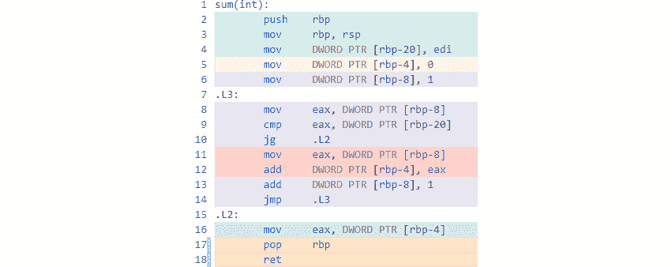

###### 图 8.3:装配结果

让我们简单分析一下前面的汇编代码。汇编语言中的每条指令都由一个**操作码**和一个或多个**操作数**组成，它们可以是寄存器、常量值或内存地址。一个**寄存器**是 CPU 中一个非常快的存储位置。在 x86 架构中，主要有 8 个寄存器，分别是 **RAX** 、 **RBX** 、 **RCX** 、 **RDX** 、 **RSI** 、 **RDI** 、 **RSP** 、 **RBP** 。英特尔 x86/x64 架构使用了一种奇怪的寄存器命名模式:

*   **RAX** 是一个通用的 64 位整数寄存器。
*   **EAX** 指的是`RAX`的底部 32 位。
*   **AX** 指的是`EAX`的底部 16 位。
*   **AL** 和 **AH** 分别指`AX`的底部和顶部 8 位。

同样的惯例也适用于其他通用寄存器，如`RBX`、`RCX`和`RDX`。`RSI`、`RDI`和`RBP`寄存器有 16 位和 32 位版本，但没有 8 位子寄存器。指令的操作码可以有几种类型，包括算术、逻辑、按位、比较或跳转操作。通常将操作码称为指令。例如，“ **mov 指令**是指`操作码`为 **mov** 的指令。下面是我们的`sum`函数的汇编代码快照:


###### 图 8.4:求和函数的汇编代码

在前面的截图中，前几行被称为一个**函数序言**，也就是用来设置**栈帧**和局部变量的指令。堆栈框架表示包含参数和局部变量的函数中的本地化数据。当函数返回时，堆栈帧被丢弃。 **mov** 指令用常数值初始化寄存器或存储单元。这里汇编代码的语法叫做**英特尔语法**。这种语法的惯例是目标操作数总是第一个。例如，`RBX MOV RAX`装配代码表示将`RBX`寄存器中的值移动到`RAX`寄存器中。

#### 注意

汇编语言通常不区分大小写，所以`EAX`和`eax`的意思是一样的。

装配中的 **DWORD PTR [rbp-8]** 表达相当于`(*(DWORD*)(rbp - 8))` C 表达。换句话说，存储器地址 **rbp-8** 作为一个`4`字节`DWORD`被访问(存储器的双字–32 位)。汇编代码中的方括号表示取消引用，很像 C/C++ 中的*运算符。`rbp`寄存器是始终包含当前正在执行的函数栈的基址的基址指针。不一定要确切知道这个堆栈框架是如何工作的，但是请记住，由于堆栈从较高的地址开始并向下移动，函数参数和局部变量的地址是从`rbp`开始的负偏移。如果您看到与`rbp`有一些负偏移，它指的是局部变量或参数。

在前面的截图中，第一条 **mov** 指令将来自 **edi** 寄存器的值放入堆栈中——在本例中，它代表传入的`n`参数。最后两条 **mov** 指令将我们代码中的`ret`变量和`i`循环变量分别初始化为`0`和`1`。

现在，检查序言和初始化之后的汇编代码的快照——这是我们对()循环的**:**


###### 图 8.5:for 循环的汇编代码

在前面的截图中，字符串后跟冒号的行被称为**标签**。它们非常类似于编程语言中的标签，如`BASIC`、`C/C++ `或`Pascal`，用作**跳转**指令的目标(汇编语言中相当于`转到`语句)。

x86 汇编上以 J 开头的指令都是跳转指令，如 **JMP** 、 **JG** 、 **JGE** 、 **JL** 、 **JLE** 、 **JE** 、 **JNE** 等等。跳转指令是有条件或无条件的 gotos。在上一个截图中， **mov** 指令将`i`变量的值从内存加载到 **eax** 寄存器中。然后，用 **cmp** 指令将其与存储器中的`n`值进行比较。

#### 注意

这里的 **JG** 指令是指**如果大于**就跳。

如果比较较大，则执行跳转到 **.L2** 标签(在循环之外)。如果没有，则继续执行下一条指令，如下所示:


###### 图 8.6:下一条指令的汇编代码

这里 **i** 的值再次重新加载到 **eax** 中，这似乎是不必要的。但是请记住，这个汇编代码没有优化，所以编译器生成的代码可能不是最佳的，并且可能包含不必要的工作。然后将 **eax** 中的值加到 **ret** 中，之后将 **1** 加到 **i** 中。最后，执行跳回 **.L3** 标签。 **.L2** 和 **.L3** 标签之间的这些指令形成了执行循环的**的代码，并汇总了直到 **n** 的整数序列，如下所示:**


###### 图 8.7:for 循环的汇编代码

这被称为**函数 epilog** 。首先，要返回的值`ret`被移入 **eax** 寄存器–这通常是存储函数返回值的寄存器。然后，堆叠框架复位，最后`ret`从`sum()`功能返回。

#### 注意

上面程序集列表中的“ret”是 RETURN 指令的助记符，不应该与我们的 C++ 代码示例中的“ret”变量混淆。

弄清楚一系列汇编指令的作用并不是一件简单的工作，但是通过观察以下几点可以获得源代码和指令之间映射的一般概念:

*   代码中的常量值可以在程序集中直接识别。
*   诸如`相加`、`子`、`imul`、`idiv`等算术运算都可以识别。
*   条件跳转映射到循环和条件。
*   可以直接读取函数调用(函数名出现在汇编代码中)。

现在，让我们观察一下代码的效果，如果我们在右上角的编译器选项字段中添加一个编译器优化标志:

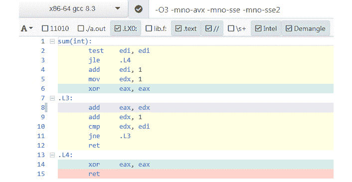

###### 图 8.8:为优化添加编译器标志

在上图截图中， **O3** 代表**最大优化**。其他标志，如 **-mno-avx** 、 **-mno-sse** 、 **-mno-sse2** ，用于防止编译器生成与当前示例无关的**向量指令**。我们可以看到编译器不再访问内存，只使用寄存器。请注意 **xor eax，eax** 这一行，它具有将`0`存储在 **eax** 中的效果——这比将常量`0`从内存加载到寄存器中更有效。由于访问内存需要几个时钟周期(从`5`到`100`时钟周期)，仅使用寄存器本身就会产生巨大的加速。

当下拉菜单中的编译器更改为 **x86-64 clang 8.0.0** 时，汇编代码发生了变化，如下图截图所示:

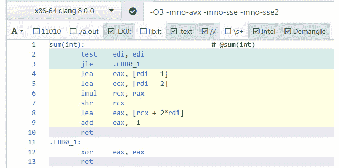

###### 图 8.9:使用新编译器的汇编代码

在前面的装配清单中，注意没有以`J`开始的指令(用于跳转)。因此，根本没有循环构造！让我们来看看编译器是如何计算`1`到`n`的和的。如果`n`的值为`< = 0`，则跳至 **.LBB0_1** 标签退出，返回`0`。让我们分析以下说明:


###### 图 8.10:使用新编译器的汇编代码

下面的代码相当于前面的指令。记住`n`在`EDI`寄存器中(因此也在 RDI 寄存器中，因为它们重叠):

```cpp
eax = n - 1;
ecx = n - 2;
rcx *= rax;
rcx >>= 1;
eax = rcx + 2 * n;
eax--;
return eax;
```

或者，如果我们将它写在一行中，它将如下所示:

```cpp
return ((n-1) * (n-2) / 2) + (n * 2) - 1;
```

如果我们简化这个表达式，我们会得到以下结果:

```cpp
((n^2 - 3n + 2) / 2) + 2n - 1
```

或者，我们可以用以下格式编写它:

```cpp
((n^2 - 3n + 2) + 4n - 2) / 2
```

这可以简化为以下内容:

```cpp
(n^2 + n) / 2
```

或者，我们可以编写以下内容:

```cpp
(n * (n+1)) / 2
```

这是数字`1`到`n`相加的封闭形式方程，也是最快的计算方法。编译器非常聪明——不仅仅是一行行地查看我们的代码，它推断我们的循环的效果是计算总和，并且它自己计算出代数。它没有计算出最简单的表达式，而是一个需要一些额外操作的等价表达式。然而，去掉循环使得这个函数非常优化。

如果我们为循环修改**中 **i** 变量的初始值或最终值来创建不同的求和，编译器仍然能够执行必要的代数操作来导出不需要循环的封闭形式解。**

这只是编译器如何变得极其高效并且看起来近乎智能的一个例子。然而，我们必须理解，这种特殊的求和优化已经被专门编程到`铿锵`编译器中。这并不意味着编译器可以对任何可能的循环计算进行这种技巧——这实际上需要编译器拥有一般的人工智能，以及世界上所有的数学知识。

让我们通过生成的汇编代码来探索编译器优化的另一个例子。请看下面的代码:

```cpp
#include <vector>
int three()
{ 
  const std::vector<int> v = {1, 2};
  return v[0] + v[1];
}
```

在编译器选项中，如果我们选择 **x86-64 clang 8.0.0** 编译器并添加 **-O3 -stdlib=libc++** ，将生成以下汇编代码:


###### 图 8.11:用新编译器生成的汇编代码

正如你在前面的截图中看到的，编译器正确地判断出向量与函数无关，并移除了所有包袱。它还在编译时做加法，并直接使用结果`3`作为常数。本节的主要内容如下:

*   给定正确的选项，编译器在优化代码时会非常聪明。
*   研究生成的汇编代码对于获得执行复杂度的高级估计非常有用。
*   对机器代码如何工作的基本理解对任何 C++ 程序员来说都是有价值的。

在下一节中，我们将学习手动执行计时。

### 手动执行计时

这是快速计时小程序最简单的方法。我们可以使用命令行工具来测量程序执行所需的时间。在 Windows 7 及更高版本上，可以使用以下 PowerShell 命令:

```cpp
powershell -Command "Measure-Command {<your program and arguments here>}"
```

在`Linux`、`MacOS`和其他`类 UNIX`系统上，可以使用`时间`命令:

```cpp
time <your program and arguments here>
```

在下一节中，我们将实现一个小程序，并研究一些关于程序执行时间的注意事项。

### 练习 1:为程序的执行计时

在本练习中，我们将编写一个对数组求和的程序。这里的想法是给求和函数计时。当我们想要测试一个独立编写的函数时，这个方法很有用。因此，测试程序的唯一目的是执行一个单一的功能。由于计算非常简单，我们将需要运行函数数千次才能获得可测量的执行时间。在这种情况下，我们将从`main()`函数调用`sumVector()`函数，传递一个随机整数的`std::vector`。

#### 注意

旨在测试单个功能的程序有时被称为**驱动程序**(不要与设备驱动程序混淆)。

执行以下步骤完成本练习:

1.  创建一个名为 **Snippet1.cpp** 的文件。
2.  定义一个名为`sumVector`的函数，该函数对循环中的每个元素进行求和:

    ```cpp
    int sumVector(std::vector<int> &v)
    {
      int ret = 0;
      for(int i: v)
      {
        ret += i;
      }

      return ret;
    }
    ```

3.  定义`主`功能。使用 C++ 11 随机数生成工具初始化`10000`元素的向量，然后调用`sumVector`函数`1000`次。编写以下代码来实现这一点:

    ```cpp
    #include <random>
    #include <iostream>
    int main()
    {
      // Initialize a random number generator
      std::random_device dev;
      std::mt19937 rng(dev());
      // Create a distribution range from 0 to 1000
      std::uniform_int_distribution<std::mt19937::result_type> dist(0,1000); 
      // Fill 10000 numbers in a vector
      std::vector<int> v;
      v.reserve(10000);
      for(int i = 0; i < 10000; ++ i)
      {
        v.push_back(dist(rng));
      }
      // Call out function 1000 times, accumulating to a total sum
      double total = 0.0;
      for(int i = 0; i < 1000; ++ i)
      {
        total += sumVector(v);
      }
      std::cout << "Total: " << total << std::endl;
    }
    ```

4.  Compile, run, and time this program on a Linux Terminal using the following commands:

    ```cpp
    $ g++ Snippet1.cpp
    $ time ./a.out
    ```

    前一个命令的输出如下:

    

    ###### 图 8.12:snippet 1 . CPP 代码的输出时序

    从前面的输出可以看出，对于这个系统，程序在`0.122`秒内执行(注意，结果会有所不同，这取决于您的系统配置)。如果我们重复运行这个定时命令，结果可能会略有变化，因为程序将在第一次运行后加载到内存中，速度会稍微快一些。最好将程序运行并计时约`5`次，得到一个平均值。我们通常对花费时间的绝对值不感兴趣，而是对优化代码时该值如何提高感兴趣。

5.  Use the following commands to explore the effect of using compiler optimization flags:

    ```cpp
    $ g++ -O3 Snippet1.cpp
    $ time ./a.out
    ```

    输出如下:

    

    ###### 图 8.13:用-O3 编译的 Snippet1.cpp 代码的输出时序

    从前面的输出来看，程序似乎变得快了大约`60`倍，这似乎相当不可思议。

6.  更改代码以执行循环`100，000 次`而不是`1，000 次`:

    ```cpp
    // Call out function 100000 times
    for(int i = 0; i < 100000; ++ i)
    {
      total += sumVector(v);
    }
    ```

7.  Recompile and time again using the following commands:

    ```cpp
    $ g++ -O3 Snippet1.cpp
    $ time ./a.out
    ```

    执行上一个命令后的输出如下:

    

    ###### 图 8.14:10，000 次迭代的 Snippet1.cpp 代码定时输出

    从前面的输出来看，似乎仍然需要完全相同的时间。这似乎是不可能的，但实际上发生的是，由于我们从未在程序中造成任何副作用，如打印总和，编译器可以自由地用空程序替换我们的代码。在功能上，根据 C++ 标准，这个程序和一个空程序是一样的，因为运行它没有副作用。

8.  Open the Compiler Explorer and paste in the entire code. Set the compiler options to `-O3` and observe the generated code:

    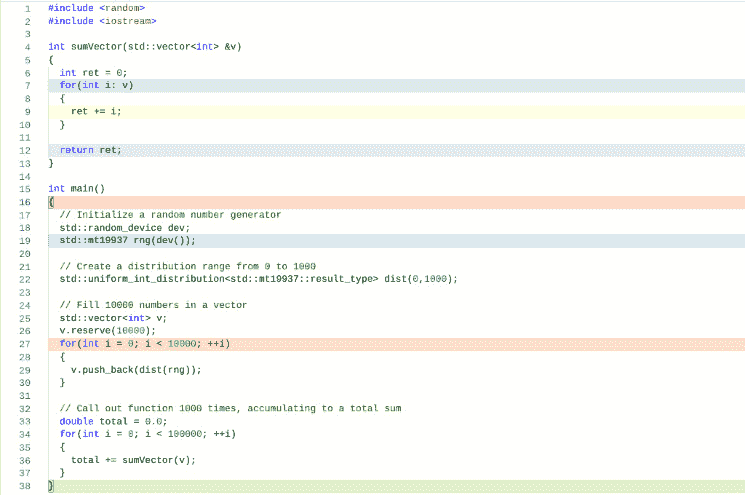

    ###### 图 8.15:编译器资源管理器中的 Snippet1.cpp 代码

    从前面的截图中可以看到，循环的**内的行没有颜色编码，也没有为它们生成汇编代码。**

9.  更改代码以确保必须通过打印一个值来执行求和，该值取决于以下行的计算:

    ```cpp
    std::cout<<"Total:"<<total<<std::endl;
    ```

10.  Here, we are just summing the result of `sumVector()` to a dummy double value many time and printing it. After you make the changes in the code, open the Terminal and write the following commands:

    ```cpp
    $ g++ -O3 Snippet1.cpp
    $ time ./a.out
    ```

    前面命令的输出如下:


###### 图 8.16:输出 Snippet1.cpp 代码的时序，附带打印值的副作用

在前面的输出中，我们可以看到程序实际上执行了计算，而不仅仅是作为一个空程序运行。将总数打印到`cout`是一个副作用，会导致编译器不省略代码。导致依赖于代码执行的副作用(如打印结果)是防止编译器优化器删除代码的一种方法。在下一节中，我们将学习如何在没有副作用的情况下给程序计时。

### 定时节目无副作用

正如在前面的练习中看到的，我们需要在程序中创建一个副作用(使用`cout`)，这样编译器就不会忽略我们编写的所有代码。让编译器相信一段代码有副作用的另一种技术是将其结果赋给一个**易变的**变量。volatile 限定符告诉编译器:“这个变量必须总是从内存中读取并写入内存，而不是从寄存器中读取。”易失性变量的主要目的是访问设备内存，这种设备内存访问必须遵循上述规则。实际上，编译器认为易变变量就像它们可以从当前程序之外的效果中改变一样，因此永远不会被优化。我们将在接下来的章节中使用这种技术。

有更高级的方法可以绕过这个问题，即通过向编译器指定特殊的汇编代码指令，而不是使用副作用。但是它们不在本介绍材料的范围内。对于下面的示例，我们将始终添加代码，以确保函数的结果用于副作用或被分配给可变变量。在以后的章节中，我们将学习如何检查编译器生成的汇编代码，并在编译器出于优化目的而省略代码时检测实例。

### 源代码工具

**插装**是一个术语，指的是在不改变程序行为的情况下，向程序添加额外代码，并在程序执行时捕获信息的过程。这可能包括性能计时(以及可能的其他度量，如内存分配或磁盘使用模式)。在源代码插装的情况下，我们手动添加代码来确定程序的执行时间，并在程序结束时记录这些数据以供分析。这种方法的优点是它的可移植性和避免任何外部工具。它还允许我们选择性地将时序添加到我们选择的代码的任何部分。

### 练习 2:编写代码计时器类

在本练习中，我们将创建一个`RAII`类，它允许我们测量单个代码块的执行时间。在接下来的练习中，我们将把它作为代码的主要计时机制。它不像其他性能测量方法那样复杂，但是更容易使用，并且服务于大多数目的。我们班的基本要求如下:

*   我们需要能够记录一段代码所花费的累计时间。
*   我们需要能够记录它被调用的次数。

执行以下步骤完成本练习:

1.  创建一个名为 **Snippet2.cpp** 的文件。
2.  包括以下标题:

    ```cpp
    #include <map>
    #include <string>
    #include <chrono>
    #include <iostream>
    #include <cstdint> 
    using std::map;
    using std::string;
    using std::cerr;
    using std::endl;
    ```

3.  Define the `Timer` class and the class member functions by writing the following code:

    ```cpp
    class Timer
    {
      static map<string, int64_t> ms_Counts;
      static map<string, int64_t> ms_Times;
      const string &m_sName;
      std::chrono::time_point<std::chrono::high_resolution_clock> m_tmStart;
    ```

    从前面的代码中可以看到，类成员由一个名称、一个起始时间戳和两个`静态映射`组成。这个类的每个实例都意味着对某个代码块计时。该块可以是一个函数范围，也可以是由花括号分隔的任何其他块。使用模式是在块的顶部定义一个`定时器`类的实例，同时传入一个名称(可以是一个函数名或一些其他方便的标签)。实例化时，记录当前时间戳，当块退出时，该类的析构函数记录该块的累计运行时间，以及该块的执行次数。时间和计数分别存储在静态地图`毫秒时间`和`毫秒计数`中。

4.  通过编写以下代码来定义`定时器`类的构造函数:

    ```cpp
    public:
      // When constructed, save the name and current clock time
      Timer(const string &sName): m_sName(sName)
      {
        m_tmStart = std::chrono::high_resolution_clock::now();
      }
    ```

5.  Define the destructor of the `Timer` class by writing the following code:

    ```cpp
      // When destroyed, add the time elapsed and also increment the count under this name
      ~Timer()
      {
        auto tmNow = std::chrono::high_resolution_clock::now();
        auto msElapsed = std::chrono::duration_cast<std::chrono::milliseconds>(tmNow - m_tmStart);
        ms_Counts[m_sName]++ ;
        ms_Times[m_sName] += msElapsed.count();
      }
    ```

    在前面的代码中，经过的时间以毫秒为单位计算。然后，我们将它添加到这个块名的累计运行时间中，并增加这个块被执行的次数。

6.  Define a `static` function named `dump()` that prints out the summary of the timed results:

    ```cpp
      // Print out the stats for each measured block/function
      static void dump()
      {
        cerr << "Name\t\t\tCount\t\t\tTime(ms)\t\tAverage(ms)\n";
        cerr << "-----------------------------------------------------------------------------------\n";
        for(const auto& it: ms_Times)
        {
          auto iCount = ms_Counts[it.first];
          cerr << it.first << "\t\t\t" << iCount << "\t\t\t" << it.second << "\t\t\t" << it.second / iCount << "\n";
        }
      }
    };
    ```

    在前面的代码中，名称、执行计数、总时间和平均时间以表格形式打印。我们在字段名称和字段值之间使用多个选项卡，使它们在控制台上垂直排列。这个功能可以按照我们的意愿修改。例如，我们可以修改这段代码，将输出转储为 CSV 文件，这样就可以将其导入到电子表格中进行进一步分析。

7.  最后定义`静态`成员完成类:

    ```cpp
    // Define static members
    map<string, int64_t> Timer::ms_Counts;
    map<string, int64_t> Timer::ms_Times;
    const int64_t N = 1'000'000'000;
    ```

8.  Now that we have defined the `Timer` class, define two simple functions that we will time as an example. One will add and the other will multiply. Since these operations are trivial, we will loop `1 billion times` so that we can have some measurable result.

    #### 注意

    C++ 14 及更高版本让我们在整数常量中使用单引号符号来提高可读性；比如我们可以写`1'000'000`而不是`1000000`。

    写出加法和乘法的函数。这两个函数只需分别将整数`1`和`N`相加并相乘:

    ```cpp
    unsigned int testMul()
    {
      Timer t("Mul");

      unsigned int x = 1;
      for(int i = 0; i < N; ++ i)
      {
        x *= i;
      }

      return x;
    }
    unsigned int testAdd()
    {
      Timer t("Add");

      unsigned int x = 1;
      for(int i = 0; i < N; ++ i)
      {
        x += i;
      }

      return x;
    }
    ```

    在前面的代码中，我们使用`无符号整数`作为变量，我们重复`加` / `乘`。我们使用了无符号类型，这样在算术运算中溢出就不会导致未定义的行为。如果我们使用签名类型，程序将有未定义的行为，并且不能保证以任何方式工作。其次，我们从`test DD()`和`testMul()`函数返回计算值，这样我们就可以确保编译器不会删除代码(因为没有副作用)。为了给这些函数计时，我们只需要在函数的开始用合适的标签声明一个`定时器`类的实例。一旦`定时器`对象被实例化，计时就开始，当该对象超出范围时计时停止。

9.  Write the `main` function, where we will simply call both test functions `10` times each:

    ```cpp
    int main()
    {
      volatile unsigned int dummy;
      for(int i = 0; i < 10; ++ i)
        dummy = testAdd();
      for(int i = 0; i < 10; ++ i)
        dummy = testMul();
      Timer::dump();
    }
    ```

    正如您在前面的代码中看到的，我们调用每个函数`10 次`，这样我们就可以演示`定时器`类对一个函数的多次运行进行计时。将函数的结果赋给易失性变量会迫使编译器假定存在全局副作用。因此，它不会省略我们测试函数中的代码。退出前，我们调用`定时器::转储`静态功能显示结果。

10.  Save the program and open a terminal. Compile and run the program with different optimization levels – on the `gcc` and `clang` compilers, this is specified by the `-ON` compiler flag, where `N` is a number from `1` to `3`. Add the `-O1` compiler flag first:

    ```cpp
    $ g++ -O1 Snippet2.cpp && ./a.out
    ```

    此代码生成以下输出:

    

    ###### 图 8.17:使用-O1 选项编译时的 Snippet2.cpp 代码性能

11.  Now, add the `-O2` compiler flag in the terminal and execute the program:

    ```cpp
    $ g++ -O2 Snippet2.cpp && ./a.out
    ```

    这将生成以下输出:

    

    ###### 图 8.18:使用-O2 选项编译时的 Snippet2.cpp 代码性能

12.  Add the `-O3` compiler flag in the terminal and execute the program:

    ```cpp
    $ g++ -O3 Snippet2.cpp && ./a.out
    ```

    这将生成以下输出:

    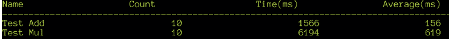

    ###### 图 8.19:使用-O3 选项编译时的 Snippet2.cpp 代码性能

    请注意，`testMul`功能仅在`O3`变得更快，但是`testdd`功能在`O2`变得更快，在`O3`变得更快。我们可以通过多次运行程序并平均时间来验证这一点。没有明显的理由说明为什么有些功能会加速，而有些则不会。我们必须彻底检查生成的代码，以了解原因。不能保证这种情况会发生在所有具有不同编译器甚至编译器版本的系统上。要记住的要点是，我们永远不能假设性能，但必须始终衡量它，如果我们认为我们所做的任何更改都会影响性能，则始终重新衡量。

13.  为了更容易地使用我们的`定时器`类来为单个函数计时，我们可以编写一个宏。C++ 11 及更高版本支持一个名为`__func__`的特殊编译器内置宏，该宏始终包含当前正在执行的函数名作为`const char*`。用它来定义一个宏，这样我们就不需要为我们的`定时器`实例指定一个标签，如下所示:

    ```cpp
    #define TIME_IT Timer t(__func__)
    ```

14.  将`TIME_IT`宏添加到这两个函数的开头，更改创建定时器对象的现有行:

    ```cpp
    unsigned int testMul()
    {
      TIME_IT;
    unsigned int testAdd()
    {
      TIME_IT;
    ```

15.  Save the program and open the terminal. Compile and run it again by using the following command:

    ```cpp
    $ g++ -O3 Snippet2.cpp && ./a.out
    ```

    前一个命令的输出如下:

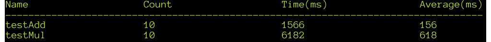

###### 图 8.20:使用宏计时时的 Snippet2.cpp 代码输出

在前面的输出中，请注意现在已经打印了实际的函数名。使用这个宏的另一个优点是，我们可以在默认情况下将它添加到所有潜在的耗时函数中，并通过简单地将定义更改为 no-op 来禁用它，这将导致计时代码永远不会运行，从而避免了大量编辑代码的需要。在接下来的练习中，我们将使用相同的 Timer 类进行计时编码。

## 运行时分析

**剖析**是一种测量程序中功能性能的非侵入式方法。剖析器的工作方式是以频繁的时间间隔(每秒数百次)对程序的当前执行地址进行采样，并记录当时正在执行的函数。这是一种统计抽样方法，具有合理的准确性。但是，有时结果可能会令人困惑，因为程序可能会在作为操作系统内核一部分的函数上花费大量时间。Linux 上最流行的运行时分析工具是 **perf** 。在下一节中，我们将使用 perf 来描述我们的程序。

### 练习 3:使用性能分析程序

`perf`可以安装在`Ubuntu`上，如下所示:

```cpp
apt-get install linux-tools-common linux-tools-generic
```

为了熟悉使用`perf`的基础知识，我们将借助`perf`工具对上一练习中的程序进行分析。执行以下步骤完成本练习:

1.  打开我们在上一个练习中创建的 **Snippet2.cpp** 文件，从两个函数中删除`TIME_IT`宏。
2.  Open the terminal, recompile the code again with the `-O3` flag, and then create a profile data sample with `perf` as follows:

    ```cpp
    $ g++ -O3 Snippet2.cpp
    $ perf record ./a.out
    ```

    前一个命令的输出如下:

    

    ###### 图 8.21:使用 perf 命令分析 Snippet2.cpp 中的代码

    这将创建一个名为`性能数据`的文件，可以对其进行分析或可视化。

3.  Now, use the following command to visualize the recorded data:

    ```cpp
    $ perf report
    ```

    执行上一个命令后，基于控制台的图形用户界面将显示以下数据:

    

    ###### 图 8.22:使用 perf 命令分析 Snippet2.cpp 中的代码

    您可以上下移动光标选择一个功能，然后按*进入*获取选项列表。

4.  突出显示`测试程序`，按*进入*，在结果列表中选择`注释测试程序`。显示了一个汇编代码列表，其中的注释描述了每行代码的执行时间百分比，如下所示:


###### 图 8.23:使用 Snippet2.cpp 代码的 perf 命令查看时序统计

注意**整数乘法** ( **IMUL)** 指令(整数乘法)占据了`99%`的执行时间。传统上，整数乘法在`x86`架构上总是很昂贵，即使在最新一代的 CPU 中也是如此。该注释视图在每个跳转或分支指令旁边显示箭头，当高亮显示时，显示它与什么比较指令相关联，以及它跳转到什么地址的线图。您可以通过按左箭头键导航到上一个视图，并使用 *q* 键退出程序。

到目前为止，我们已经研究了几种用于评估程序性能的方法。这是优化最关键的阶段，因为它告诉我们需要将我们的努力引向何处。在接下来的章节中，我们将探索各种有助于优化代码的技术。

## 优化策略

代码优化可以通过几种方式完成，例如:

*   基于编译器的优化
*   源代码微优化
*   缓存友好代码
*   算法优化

在这里，每种技术都有其利弊。我们将在接下来的章节中详细研究这些方法。粗略地说，这些是根据所需的努力和性能的潜在提高来排序的。我们将在下一节研究基于编译器的优化。

### 基于编译器的优化

将正确的选项传递给编译器可以带来许多性能上的好处。这方面的一个真实例子是英特尔创建的 Clear Linux **发行版** (Linux 发行版)。编译这个发行版是为了从所有代码中提取最大的性能，并且在大多数基准测试中比大多数其他 Linux 发行版的性能高出 30%，这是一个非常显著的加速。在 **gcc** 和 **clang** 系列编译器上，最基本的优化选项是**-O<N>T7】，其中 **N** 是数字 **1** 、 **2** 或 **3** 之一。 **-O3** 几乎启用了编译器中的所有优化，但还有其他几个未被该标志启用的优化会有所不同。**

### 循环展开

**循环展开**是编译器可以用来减少执行分支数量的技术。每次执行分支时，都会有一定的性能开销。这可以通过多次重复循环体并减少循环的执行次数来减少。程序员可以在源代码级别完成循环展开，但是现代编译器自动完成了非常好的工作。

即使现代处理器通过**分支预测**和**推测执行**电路减轻了分支的开销，循环展开仍然产生性能优势。循环展开优化可以在带有`-funroll-loops`命令行标志的`gcc`和`clang`系列编译器上启用。在下一节中，我们将测试启用和未启用循环展开的程序的性能。

### 练习 4:使用循环展开优化

在本练习中，我们将编写一个使用嵌套循环的简单程序，并在启用和不启用循环展开的情况下测试其性能。我们将理解编译器实现循环自动展开的方式。

执行以下步骤完成本练习:

1.  创建一个名为 **Snippet3.cpp** 的文件。
2.  写一个程序，取第一个`10，000 个`数字，打印出其中有多少是相互的因素(完整代码可以在 **Snippet3.cpp** 中找到):

    ```cpp
    # include <iostream>
    int main()
    {
      int ret = 0;
      for(size_t i = 1; i < 10000; ++ i)
      {
        for(size_t j = 1; j < 10000; ++ j)
        {
          if(i % j == 0)
          {
            ++ ret;
          }
        }
      }

      std::cout << "Result: " << ret << std::endl;
    }
    ```

3.  Save the program and open the terminal. Compile the program with the `-O3` flag first and time it using the following command:

    ```cpp
    $ g++ -O3 Snippet3.cpp
    $ time ./a.out
    ```

    前一个命令的输出如下:

    

    ###### 图 8.24:snippet 3 . CPP 中代码的输出

4.  Now, compile the same code with the loop unrolling enabled and time it again:

    ```cpp
    $ g++ -O3 -funroll-loops Snippet3.cpp 
    $ time ./a.out 
    ```

    前一个命令的输出如下:

    

    ###### 图 8.25:使用循环展开选项编译的 Snippet3.cpp 中的代码输出

5.  打开`Godbolt 编译器浏览器`，将前面完整的代码粘贴到左侧。
6.  On the right-hand side, select `x86-64 gcc 8.3` from the compiler options and write the `-O3` flag in the options. Assembly code will be generated. For the for loop, you'll see the following output:

    

    ###### 图 8.26:for 循环的汇编代码

    从前面的截图中，可以清楚地看到`CMP`指令将`RCX`与`10，000`进行比较，后面是条件跳转，`JNE`(不等则跳转)。就在这个代码之后，看到了外环比较，其中`RSI`被比较为`10，000`，随后是另一个条件跳转到`L4`标签。总的来说，内部条件分支和跳转执行`100，000，000`次。

7.  现在，添加以下选项:`-O3–funroll-loops`。将生成汇编代码。在这段代码中，您会注意到这个代码模式重复了八次(除了`LEA`指令，其偏移值发生了变化):


###### 图 8.27:for 循环的汇编代码

编译器决定将循环体展开八次，将条件跳转指令的执行次数减少了`87.5%`倍(约为`830 万`次)。仅这一项就使执行时间提高了`10%`，这是一个非常显著的加速。在本练习中，我们已经看到了循环展开的好处——接下来，我们将学习概要文件引导的优化。

### 轮廓导向优化

**配置文件引导优化** (PGO)是大多数编译器都支持的功能。当在启用 PGO 的情况下编译程序时，编译器会向程序中添加插装代码。运行此支持 PGO 的可执行文件会创建一个日志文件，其中包含程序执行统计信息。术语**剖析**指的是运行程序以收集性能指标的过程。通常，此分析阶段应该使用真实数据集运行，以便生成准确的日志。在这个分析运行之后，用一个特殊的编译器标志重新编译程序。此标志使编译器能够基于记录的统计执行数据执行特殊优化。使用这种方法可以获得显著的性能提升。让我们解决一个基于轮廓引导优化的练习，以更好地理解这一点。

### 练习 5:使用轮廓引导优化

在本练习中，我们将对上一练习中的代码使用概要文件引导优化。我们将了解如何使用`gcc`编译器进行配置文件引导优化。

执行以下步骤完成本练习:

1.  打开终端，在启用分析的情况下编译上一练习中的代码。包括我们需要的任何其他优化标志(在本例中为`-O3`)。编写以下代码来实现这一点:

    ```cpp
    $ g++ -O3 -fprofile-generate Snippet3.cpp
    ```

2.  Now, run the profiled version of the code by writing the following command:

    ```cpp
    $ ./a.out
    ```

    程序正常运行并打印结果，看不到其他输出-但是它生成一个包含数据的文件，这些数据将在下一步帮助编译器。请注意，在启用分析的情况下，程序的执行速度比正常情况下慢几倍。这是大型程序需要记住的。执行完上一条命令后，会生成一个名为`Snippet3.gcda`的文件，其中包含概要数据。在使用大型复杂应用时，使用生产环境中最常见的数据集和工作流来运行程序非常重要。通过在这里正确选择数据，最终的性能增益将会更高。

3.  Recompile with the PGO optimization flags, that is, `-fprofile-use` and`-fprofile-correction`, as illustrated in the following code:

    ```cpp
    $ g++ -O3 -fprofile-use -fprofile-correction Snippet3.cpp
    ```

    请注意，除了与配置文件相关的编译器选项之外，其他选项必须与上一编译步骤中的选项完全相同。

4.  Now, if we time the executable, we will see a large performance improvement:

    ```cpp
    $ time ./a.out
    ```

    前一个命令的输出如下:


###### 图 8.28:带有 PGO 优化的 Snippet3.cpp 中代码的计时结果

在本练习中，我们已经看到了使用编译器提供的配置文件引导优化所获得的性能优势。对于这段代码，性能的提高大约是`2.7x` -在更大的程序上，这可能会更高。

### 并行化

如今大多数 CPU 都有多核，甚至手机也有四核处理器。我们可以非常简单地利用编译器标志来利用这种并行处理能力，编译器标志指示它生成并行代码。代码并行化的一种机制是使用 C/C++ 语言的`OpenMP`扩展。然而，这意味着要改变源代码，并详细了解如何使用这些扩展。另一个更简单的选项是`gcc`编译器特有的特性——它提供了一个扩展的标准库，实现了大多数并行运行的算法。

#### 注意

这种自动并行化只适用于 gcc 上的 STL 算法，不是 C++ 标准的一部分。C++ 17 标准为大多数算法的并行版本提出了标准库的扩展，但是还没有被所有的编译器支持。此外，为了利用这一特性，必须对代码进行大量重写。

### 练习 6:使用编译器并行化

在本练习中，我们将使用`gcc`并行扩展功能来加速标准库函数。我们的目的是了解如何使用`gcc`并行扩展。

执行以下步骤完成本练习:

1.  创建一个名为 **Snippet4.cpp** 的文件。
2.  写一个简单的程序，用`STD::aggregate 对一个初始化的数组求和。`添加以下代码来实现:

    ```cpp
    #include <vector>
    #include <string>
    #include <iostream>
    #include <algorithm>
    #include <numeric>
    #include <cstdint> 
    using std::cerr;
    using std::endl;
    int main()
    {
      // Fill 100,000,000 1s in a vector
      std::vector<int> v( 100'000'000, 1);
      // Call accumulate 100 times, accumulating to a total sum
      uint64_t total = 0;
      for(int i = 0; i < 100; ++ i)
      {
        total += std::accumulate(v.begin(), v.end(), 0);
      }
      std::cout << "Total: " << total << std::endl;
    }
    ```

3.  Save the program and open the terminal. Compile the program normally and time the execution using the following commands:

    ```cpp
    $ g++ -O3 Snippet4.cpp
    $ time ./a.out
    ```

    前一个命令的输出如下:

    

    ###### 图 8.29:snippet 4 . CPP 中代码的输出

4.  Now, compile the code with the parallelization options, that is, `-O3 -fopenmp` and`-D_GLIBCXX_PARALLEL`:

    ```cpp
    $ g++ -O3 -fopenmp -D_GLIBCXX_PARALLEL Snippet4.cpp
    $ time ./a.out
    ```

    输出如下:


###### 图 8.30:使用并行化选项编译的 Snippet4.cpp 中的代码输出

在之前的输出中，`用户`字段显示累计的 CPU 时间，`真实`字段显示墙时间。两者之间的比例约为`7x`。这个比例会有所不同，取决于系统有多少个中央处理器内核(在这个特定的例子中，有八个内核)。对于这个系统，如果编译器能够执行`100%`并行化，这个比例可以达到 8 倍。请注意，即使使用了八个内核，执行时间的实际提升也只是`的 1.3x`左右。这可能是因为向量的分配和初始化占用了大部分时间。这是**阿姆达尔定律**的一个案例，它说当可并行部分被并行化时，程序的串行部分支配执行时间。尽管如此，我们在代码中还是获得了`1.3x`的加速，这是一个非常好的优化结果。

到目前为止，我们已经介绍了现代编译器中一些更有影响力的编译器优化特性。除此之外，还有其他几个优化标志，但它们可能不会对性能产生很大的改善。适用于具有许多不同源文件的大型项目的两个特定优化标志是**链接时间优化**或**链接时间代码生成**。这些都值得大型项目启用。在下一节中，我们将研究源代码微优化。

### 源代码微优化

这些技术涉及到在源代码中使用特定的习惯用法和模式，这些习惯用法和模式通常比它们的等价物更快。在早期，这种微优化非常有成效，因为编译器不是很聪明。但是今天，编译器技术已经非常先进了，这些微优化的效果并没有那么显著。尽管如此，使用这些是一个非常好的习惯，因为即使在没有优化的情况下编译，它们也会使代码更快。即使在开发构建中，更快的代码也能节省测试和调试的时间。我们将在下一节中查看 std::vector 容器:

### 高效使用标准::矢量容器

`std::vector`是标准库中最简单、最有用的容器之一。与普通的 C 风格数组相比，它没有开销，但是有增长的能力，以及可选的边界检查。当编译时不知道元素的数量时，您几乎应该总是使用`std::vector`。

与`std::vector`一起使用的一个常见习惯用法是在循环中调用其上的`push _ back`-随着它的增长，vector 会重新分配一个新的缓冲区，该缓冲区比现有缓冲区大一定的因子(该增长因子的确切值取决于标准库的实现)。理论上，这种重新分配的成本最小，因为它很少发生，但实际上，在向量中调整大小的操作涉及将其缓冲区的元素复制到新分配的更大缓冲区，这可能非常昂贵。

我们可以使用`reserve()`方法来避免这些多次分配和复制。当我们知道一个向量将包含多少元素时，调用`reserve()`方法来预分配存储会有很大的不同。让我们在下一节中实现一个优化向量增长的练习。

### 练习 7:优化矢量增长

在本练习中，我们将循环对`push_back`方法的效果进行计时，无论是否调用 reserve 方法。首先，我们将把前面几节中使用的`定时器`类提取到一个单独的头文件和实现文件中——这将允许我们将其用作所有后续代码片段的公共代码。执行以下步骤完成本练习:

1.  创建一个名为 **Timer.h** 的头文件。
2.  包括必要的头文件:

    ```cpp
    #include <map>
    #include <string>
    #include <chrono>
    #include <cstdint>
    ```

3.  创建一个名为`定时器`的类。在`定时器`类中，声明四个变量，即`ms_Counts`、`ms_Times`、`m_tmStart`和`m_sName`。声明一个构造函数、析构函数和`转储()`方法。添加以下代码来实现:

    ```cpp
    class Timer
    {
      static std::map<std::string, int64_t> ms_Counts;
      static std::map<std::string, int64_t> ms_Times;
      std::string m_sName;
      std::chrono::time_point<std::chrono::high_resolution_clock> m_tmStart;
      public:
        // When constructed, save the name and current clock time
        Timer(std::string sName);
        // When destroyed, add the time elapsed and also increment the count under this name
        ~Timer();
        // Print out the stats for each measured block/function
        static void dump();
    };
    ```

4.  通过编写以下代码，为时间函数定义一个名为`时间信息`的辅助宏:

    ```cpp
    // Helper macro to time functions
    #define TIME_IT Timer t(__func__)
    ```

5.  一旦创建了头文件，创建一个名为 **Timer.cpp** 的新文件，并在其中包含 **Timer.h** 文件。另外，在 **Timer.cpp** 文件中编写构造函数、析构函数和`dump()`方法的实际实现。编写以下代码来实现这一点:

    ```cpp
    #include <string>
    #include <iostream>
    #include <cstdint> 
    #include "Timer.h"
    using std::map;
    using std::string;
    using std::cerr;
    using std::endl;
    // When constructed, save the name and current clock time
    Timer::Timer(string sName): m_sName(sName)
    {
      m_tmStart = std::chrono::high_resolution_clock::now();
    }
    // When destroyed, add the time elapsed and also increment the count under this name
    Timer::~Timer()
    {
      auto tmNow = std::chrono::high_resolution_clock::now();
      auto msElapsed = std::chrono::duration_cast<std::chrono::milliseconds>(tmNow - m_tmStart);
      ms_Counts[m_sName]++ ;
      ms_Times[m_sName] += msElapsed.count();
    }
    // Print out the stats for each measured block/function
    void Timer::dump()
    {
      cerr << "Name\t\t\tCount\t\t\tTime(ms)\t\tAverage(ms)\n";
      cerr << "-----------------------------------------------------------------------------------\n";
      for(const auto& it: ms_Times)
      {
        auto iCount = ms_Counts[it.first];
        cerr << it.first << "\t\t\t" << iCount << "\t\t\t" << it.second << "\t\t\t" << it.second / iCount << "\n";
      }
    }
    // Define static members
    map<string, int64_t> Timer::ms_Counts;
    map<string, int64_t> Timer::ms_Times;
    ```

6.  现在，创建一个名为 **Snippet5.cpp** 的新文件，并使用`push_back()`方法编写两个简单地用第一个`1，000，000`整数填充向量的函数。第二个函数预先调用`reserve()`方法，但第一个函数没有。编写以下代码来实现这一点:

    ```cpp
    #include <vector>
    #include <string>
    #include <iostream>
    #include "Timer.h"
    using std::vector;
    using std::cerr;
    using std::endl;
    const int N = 1000000;
    void withoutReserve(vector<int> &v)
    {
      TIME_IT;
      for(int i = 0; i < N; ++ i)
      {
        v.push_back(i);
      }
    }
    void withReserve(vector<int> &v)
    {
      TIME_IT;
      v.reserve(N);
      for(int i = 0; i < N; ++ i)
      {
        v.push_back(i);
      }
    }
    ```

7.  Now, write the `main` function. Note the use of redundant braces to ensure that the `v1` and `v2` vectors are destroyed after every iteration of the loop:

    ```cpp
    int main()
    {
      {
        vector<int> v1;
        for(int i = 0; i < 100; ++ i)
        {
          withoutReserve(v1);
        }
      }
      {
        vector<int> v2;
        for(int i = 0; i < 100; ++ i)
        {
          withReserve(v2);
        }
      }
      Timer::dump();
    }
    ```

    我们通过引用传递向量的原因是为了防止编译器优化两个函数中的整个代码。如果我们按值传递向量，函数将没有可见的副作用，编译器可能会完全省略函数。

8.  Save the program and open the terminal. Compile the **Timer.cpp** and **Snippet5.cpp** files and run them as follows:

    ```cpp
    $ g++ -O3 Snippet5.cpp Timer.cpp
    $ ./a.out
    ```

    输出如下:


###### 图 8.31:snippet 5 . CPP 中代码的输出，显示了 vector::reserve()的效果

我们可以看到，调用`reserve()`的效果导致执行时间提高了 4%左右。在运行了很长时间的大型程序中，系统内存通常会变得非常碎片化。在这种情况下，通过使用`reserve()`预分配内存的改进可能会更好。一般来说，提前预留内存通常比动态增量快。即使是 Java 虚拟机，出于性能原因，在启动时也使用这种提前分配大量内存的技术。

### 短路逻辑运算符

`&&``| |`逻辑运算符为**短路**，即:

*   如果`||`运算符的左侧为`真`，则右侧不被评估。
*   如果左侧的`& &`算子为`假`，则右侧不评价。

通过将更不可能(或更便宜)的表达式保留在左侧，我们可以减少需要完成的工作量。在下一节中，我们将解决一个练习，并学习如何最佳地编写逻辑表达式。

### 练习 8:优化逻辑运算符

在本练习中，我们将研究与逻辑运算符一起使用时对条件表达式进行排序的影响。执行以下步骤完成本练习:

1.  创建一个名为 **Snippet6.cpp** 的新文件。
2.  包括必要的库和 Timer.h 文件，我们在前面的练习中通过编写以下代码创建了该文件:

    ```cpp
    #include <vector>
    #include <string>
    #include <iostream>
    #include <random>
    #include "Timer.h"
    using std::vector;
    using std::cerr;
    using std::endl;
    ```

3.  定义一个名为`sum1()`的函数，计算`0`和`N`之间的整数之和。每个数字只有在满足一个或两个特定标准时才会求和。第一个条件是数量必须小于`N/2`。第二个条件是，当数除以 3 时，必须返回 2 作为余数。在这里，我们将`N`设置为`100，000，000`，这样代码就有了一些可测量的时间。编写以下代码来实现这一点:

    ```cpp
    const uint64_t N = 100000000;
    uint64_t sum1()
    {
      TIME_IT;
      uint64_t ret = 0;
      for(uint64_t b=0; b < N; ++ b)
      {
        if(b % 3 == 2 || b < N/2)
        {
          ret += b;
        }
      }

      return ret;
    }
    ```

4.  Now, define another function named `sum2()`. It must contain the same logic that we wrote for the previous function, `sum1()`. The only change here is that we reverse the order of the conditional expression of the `if` statement. Write the following code to implement this:

    ```cpp
    uint64_t sum2()
    {
      TIME_IT;
      uint64_t ret = 0;
      for(uint64_t b=0; b < N; ++ b)
      {
        if(b < N/2 || b % 3 == 2)
        {
        ret += b;
        }
      }

      return ret;
    }
    ```

    请注意，在`sum2`功能中，`b < N/2`条件将在一半时间内评估为真。因此，第二个条件，即`b % 3 == 2`，只对一半的迭代进行评估。为了简单起见，如果我们假设两个条件都花费 1 个时间单位，则`sum2()`花费的总时间将是`N/2 + (2 * N/2) = N * 3/2`。在`sum1()`功能的情况下，左侧的条件评估为`真的`只有 33%的时间，其余 66%的时间，两个条件都会评估。因此，估计花费的时间为`N/3 + (2 * N * 2/3) = N * 5/3`。我们预计`sum1`和`sum2`功能之间的时间比例将为`5/3`到`3/2`–即`sum1`比`慢 11%`。

5.  在主功能中增加如下代码:

    ```cpp
    int main()
    {
      volatile uint64_t dummy = 0;
      for(int i = 0; i < 100; ++ i)
      {
        dummy = sum1();
      }
      for(int i = 0; i < 100; ++ i)
      {
        dummy = sum2();
      }
      Timer::dump();
    }
    ```

6.  Save the file and open the terminal. Compile and time the preceding program, as well as the **Timer.cpp** file, by writing the following commands:

    ```cpp
    $ g++ -O3 Snippet6.cpp Timer.cpp
    $ ./a.out
    ```

    输出如下:

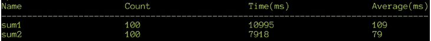

###### 图 8.32:snippet 6 . CPP 中代码的输出，显示了优化布尔条件的效果

从前面的输出可以看出，我们最终在速度上获得了大约`38%`的提升，这比预期的要多得多。为什么会这样？答案是`%`运算符执行整数除法，这比比较昂贵得多，但是编译器不会为`N/2`表达式生成除法指令，因为它是一个常数值。

`sum1()`函数代码对循环的每次迭代执行模运算，整体执行时间由除法支配。综上所述，我们必须始终考虑短路逻辑运算符，并计算表达式的每一侧是如何的，以及它执行了多少次，以便选择它们在表达式中出现的最佳顺序。这相当于做了一个概率论的期望值计算。在下一节中，我们将学习分支预测。

### 分支预测

现代处理器使用流水线架构，这类似于工厂流水线，指令沿着流水线流动，由不同的工人同时处理。在每个时钟周期之后，指令沿着流水线移动到下一级。这意味着，尽管每条指令从开始到结束可能需要许多周期，但总吞吐量是每个周期完成一条指令。

这里的缺点是，如果有一个条件分支指令，中央处理器不知道之后要加载哪组指令(因为有两种可能的选择)。这种情况被称为**流水线停滞**，处理器必须等待直到分支的条件被完全评估，浪费了宝贵的周期。

为了缓解这种情况，现代处理器使用一种叫做**分支预测**的东西——它们试图预测分支的走向。随着分支被遇到的次数越来越多，它对分支可能采取的方式越来越有信心。

尽管如此，CPU 并不是无所不知的，所以如果它开始加载一个预测分支的指令，而后来条件分支变成了另一条路，那么分支之后的整个管道都必须被清除，实际的分支需要从头开始加载。在分支指令下游的“`装配线`”上完成的所有工作都必须丢弃，任何更改都需要反转。

这是性能的一个主要瓶颈，可以避免——最简单的方法是确保分支总是尽可能地往一个方向走——就像一个循环。

### 练习 9:分支预测的优化

在本练习中，我们将探索和演示 CPU 分支预测对性能的影响。为了探索这一点，我们将在一个程序中编写两个函数——两个函数都使用两个嵌套循环执行相同的计算，这两个循环分别迭代`100`和`100，000，000`次。这两个函数的区别在于，在第一个函数中，外环是较大的一个，而在第二个函数中，外环是较小的一个。

对于第一个函数，外环退出时只失败一次分支预测，但是内环失败分支预测`100，000，000`次–每次退出。对于第二个，同样，外环退出时只失败了一次分支预测，而内环只失败了 100 次分支预测——每次都失败了。这些分支预测失败计数之间的因子`1，000，000`将导致第一个函数比第二个函数慢。执行以下步骤完成本练习:

1.  创建一个名为 **Snippet7.cpp** 的文件，并包含必要的库:

    ```cpp
    #include <vector>
    #include <string>
    #include <iostream>
    #include <random>
    #include "Timer.h"
    using std::vector;
    using std::cerr;
    using std::endl;
    ```

2.  Define a function named `sum1()` with a nested loop. The outer `for` loop should cycle `N` times, whereas the inner for loop should iterate `100` times. Set the value of `N` to `100000000`. Write the following code to implement this:

    ```cpp
    const uint64_t N = 100000000;
    uint64_t sum1()
    {
      TIME_IT;
      uint64_t ret = 0;
      for(int i = 0; i < N; ++ i)
      {
        for(int j = 0; j < 100; ++ j)
        {
          ret += i ^ j;
        }
      }
      return ret;
    }
    ```

    如果我们假设处理器预测循环中的分支(统计上，循环末端的分支指令更有可能跳到循环的开始)，那么每次 j 达到`100`–换句话说，`N`次，它就会以错误预测结束。

3.  Define a new function, `sum2()`, with a nested loop. The only change here is that we must set the inner loop count to `N` and the outer loop count to `100`. Add the following code to implement this:

    ```cpp
    uint64_t sum2()
    {
      TIME_IT;
      uint64_t ret = 0;
      for(int i = 0; i < 100; ++ i)
      {
        for(int j = 0; j < N; ++ j)
        {
          ret += i ^ j;
        }
      }
      return ret;
    }
    ```

    现在，我们的推理是分支预测失误只发生`100`次。

4.  在主功能中增加如下代码:

    ```cpp
    int main()
    {
      volatile uint64_t dummy;
      dummy = sum1();
      dummy = sum2();
      Timer::dump();
    }
    ```

5.  Save the file and open the terminal. Compile the preceding program, along with the **Timer.cpp** file, and time them using the following commands. Remember that you need to have the Timer.cpp and Timer.h files you created earlier in the same directory:

    ```cpp
    $ g++ -O3 Snippet7.cpp Timer.cpp
    $ ./a.out
    ```

    执行前一个命令的输出如下:

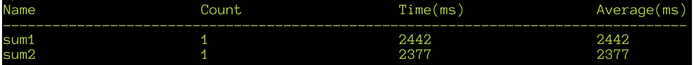

###### 图 8.33:显示分支预测优化效果的 Snippet7.cpp 中的代码输出

从前面的输出可以看出，有一个小的但肯定是显著的加速，大约为`2%`，这可以归因于处理器能够更好地预测`sum2`函数的分支。在下一节中，我们将探索更多的优化技术。

## 进一步优化

还有其他几种技术可以在您编写代码时实现；它们中的一些并不能保证产生更好的代码，但是改变你的编码习惯来反射性地做到这些，只需要很少的努力。它们不花钱，但可能会带来收益。其中一些技术如下:

*   尽可能通过`常量`引用传递非基本类型的参数。即使**移动构造函数**可以使复制变得便宜，但它们仍然比使用`常量`引用涉及更多开销。
*   使用预递增(`++ i`)或预递减(`- i`)运算符，而不是后缀版本。这对于简单类型(如整数)通常没有任何用处，但是对于带有自定义增量运算符的复杂类型可能会有用处。养成写`++ i`而不是`i++ `的习惯是很好的做法，除非后增量实际上是想要的行为。除了性能优势，这样的代码通过使用正确的操作符更清楚地声明意图。
*   尽可能晚地声明变量——在 C 语言中，在函数顶部声明每个变量是很常见的，但是在 C++ 中，由于变量可以有非平凡的构造函数，因此只在使用它们的实际块中声明它们是有意义的。
*   就**循环提升**而言，如果一个循环中有任何代码或计算不随循环迭代而变化，将其移出循环是有意义的。这包括在循环体中创建对象。通常，在循环外声明它们一次会更有效。现代编译器会自动完成这项工作，但自己动手并不需要额外的努力。
*   尽可能使用`常量`。它不会改变代码的含义，但它让编译器对您的代码做出更强的假设，这可能会导致更好的优化。除此之外，使用`const`使代码更加易读和合理。
*   整数除法、模数和乘法(尤其是不是 2 的幂的数字)是 X86 硬件上最慢的操作。如果你需要在一个循环中执行这样的操作，也许你可以做一些代数操作来摆脱它们。

正如我们提到的，几个这样的优化可能是由编译器自己完成的，但是作为一种习惯，即使在调试模式下，这样做也会使代码快速，这在调试时是一个很大的优势。我们已经研究了一些用于微优化代码的技术——完成这些所需的代码变更级别相对较小，其中一些可以带来效率的重大提高。如果您想要编写更快的代码，您应该致力于随着时间的推移将这些技术集成为默认的编码风格。在下一节中，我们将了解缓存友好代码。

## 缓存友好代码

计算机科学是在 20 世纪中期发展起来的，当时计算机几乎不存在，然而，到了 20 世纪 80 年代，大多数有用的数据结构和算法都被发现和改进了。算法复杂性分析是任何学习计算机科学的人都会遇到的一个话题——对于数据结构运算的复杂性，有很多公认的教科书定义。然而，在这些东西被分析了 50 年后，计算机已经以一种完全不同于想象的方式进化了。例如，一个常见的“事实”是列表数据结构对于插入操作来说比数组更快。这似乎是常识，因为在数组中插入一个元素需要将该元素之后的所有项移动到新的位置，而在列表中插入只是一些指针操作。我们将在下面的练习中检验这个假设。

### 练习 10:探索缓存对数据结构的影响

在本练习中，我们将研究高速缓存对 C++ 标准库中的数组和列表的影响。执行以下步骤完成本练习:

1.  创建一个名为 **Snippet8.cpp** 的文件。
2.  包括必要的库，以及 **Timer.h** 头文件。编写以下代码来实现这一点:

    ```cpp
    #include <vector>
    #include <list>
    #include <algorithm>
    #include <string>
    #include <iostream>
    #include <random>
    #include "Timer.h"
    using std::vector;
    using std::list;
    using std::cerr;
    using std::endl;
    ```

3.  创建一个常量整型变量，`N`，将其值设置为`100000` :

    ```cpp
    const int N = 100000;
    ```

4.  初始化一个随机数发生器，创建一个从`0`到`1000`的分布范围。添加以下代码来实现:

    ```cpp
    std::random_device dev;
    std::mt19937 rng(dev());
    std::uniform_int_distribution<std::mt19937::result_type> dist(0,N);
    ```

5.  创建一个名为`insertRandom()`的方法，将`0`到`N`的元素随机插入容器中。添加以下代码来实现:

    ```cpp
    template<class C> void insertRandom(C &l)
    {
      // insert one element to initialize
      l.insert(l.end(), 0);
      for(int i = 0; i < N; ++ i)
      {
        int pos = dist(rng) % l.size();
        auto it = l.begin();
        advance(it, pos);
        l.insert(it, i);
      }
    }
    ```

6.  创建一个名为`insertStart()`的方法，并在开始时将从`0`到`N`的元素插入一个容器中。添加以下代码来实现:

    ```cpp
    template<class C> void insertStart(C &l)
    {
      for(int i = 0; i < N; ++ i)
      {
        l.insert(l.begin(), i);
      }
    }
    ```

7.  创建一个名为`insertEnd()`的方法，并将从`0`到`N`的元素插入到末端的容器中。添加以下代码来实现:

    ```cpp
    template<class C> void insertEnd(C &l)
    {
      for(int i = 0; i < N; ++ i)
      {
        l.insert(l.end(), i);
      }
    }
    ```

8.  在`主`法中写下以下代码:

    ```cpp
    int main()
    {
      std::list<int> l;
      std::vector<int> v;
      // list
      {
        Timer t("list random");
        insertRandom(l);
      }

      {
        Timer t("list end");
        insertEnd(l);    
      }
      {
        Timer t("list start");
        insertStart(l);
      }
      // vector
      {
        Timer t("vect random");
        insertRandom(v);
      }

      {
        Timer t("vect end");
        insertEnd(v);    
      }
      {
        Timer t("vect start");
        insertStart(v);
      }
      cerr << endl << l.size() << endl << v.size() << endl;
      Timer::dump();
    }
    ```

9.  Save the file and open the terminal. Compile the preceding program, along with the **Timer.cpp** file, by writing the following commands:

    ```cpp
    $ g++ -O3 Snippet8.cpp Timer.cpp
    $ ./a.out
    ```

    前面的命令生成以下输出:

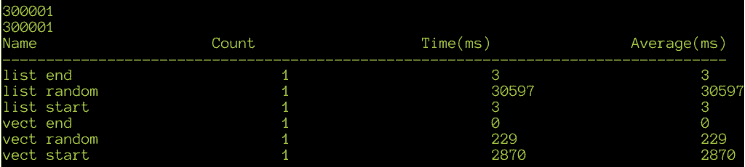

###### 图 8.34:snippet 8 . CPP 中代码的输出，对比了标准::列表和标准::向量插入的时间

从前面的输出可以看出，代码测量了在开始、结束和随机位置插入`标准::矢量`和`标准::列表`的`100000`整数所花费的时间。对于随机情况，向量显然以 100 倍或更大的因子获胜，甚至向量的最坏情况也比列表的随机情况快 10 倍。

为什么会这样？答案在于现代计算机架构的进化方式。CPU 时钟速度从 80 年代初的约`1 Mhz`提高到了 2019 年中期的`5 GHz`——时钟频率提高了`5000 倍`——虽然最早的 CPU 每个指令使用多个周期，但现代的 CPU 在单个内核上每个周期执行几条指令(由于流水线等先进技术，我们在前面已经介绍过)。

例如，原`英特尔 8088`上的`IDIV`指令需要超过 100 个时钟周期才能完成，而在现代处理器上，它可以在不到 5 个周期内完成。另一方面，内存带宽(读取或写入一个字节内存所需的时间)增长非常缓慢。

从历史上看，处理器的速度在 1980 年到 2010 年间提高了大约 16000 倍。与此同时，内存中的速度增加量级更小，不到 100 倍。因此，一条指令对内存的单次访问可能会导致中央处理器等待大量的时钟周期。这将是不可接受的性能下降，已经有很多技术来缓解这个问题。在我们探讨这一点之前，让我们在下一个练习中测量内存访问的影响。

### 练习 11:测量记忆访问的影响

在本练习中，我们将研究随机访问内存对性能的影响。执行以下步骤完成本练习:

1.  创建一个名为 **Snippet9.cpp** 的新文件。
2.  包括必要的库，以及 **Timer.h** 头文件。创建两个常量整数变量`SIZE`和`N`，并将它们的值设置为`100000000`。另外，创建一个随机数生成器和一个从`0`到`N-1`的分布范围。编写以下代码来实现这一点:

    ```cpp
    #include <vector>
    #include <list>
    #include <algorithm>
    #include <string>
    #include <iostream>
    #include <random>
    #include "Timer.h"
    using std::vector;
    using std::list;
    using std::cerr;
    using std::endl;
    const int SIZE = 100'000'000;
    const int N = 100'000'000;
    std::random_device dev;
    std::mt19937 rng(dev());
    std::uniform_int_distribution<std::mt19937::result_type> dist(0,SIZE-1);
    ```

3.  Create the `getPRIndex()` function, which returns a pseudo random index between `0` and `SIZE-1`, where `SIZE` is the number of elements in the array. Write the following code to implement this:

    #### 注意

    稍后我们将讨论为什么使用随机数。

    ```cpp
    uint64_t getPRIndex(uint64_t i)
    {
      return (15485863 * i) % SIZE;
    }
    ```

4.  编写一个名为`sum1()`的函数，随机访问一个大的数据数组，并将这些元素相加:

    ```cpp
    uint64_t sum1(vector<int> &v)
    {
      TIME_IT;
      uint64_t sum = 0;
      for(int i = 0; i < N; ++ i)
      {
        sum += v[getPRIndex(i)];
      }
      return sum;
    }
    ```

5.  编写一个名为`sum2()`的函数，在没有任何内存访问的情况下对随机数求和:

    ```cpp
    uint64_t sum2()
    {
      TIME_IT;
      uint64_t sum = 0;
      for(int i = 0; i < N; ++ i)
      {
        sum += getPRIndex(i);
      }
      return sum;
    }
    ```

6.  在主函数中，初始化向量使得`v[i] == i`，因此`sum1()`和`sum2()`之间唯一的区别是`sum1()`访问内存而`sum2()`只执行计算。像往常一样，我们使用 volatile 来防止编译器删除所有代码，因为它没有副作用。在`主()`功能中写下以下代码:

    ```cpp
    int main()
    {
      // Allocate SIZE integers
      std::vector<int> v(SIZE, 0);
      // Fill 0 to SIZE-1 values into the vector
      for(int i = 0; i < v.size(); ++ i)
      {
        v[i] = i;
      }
      volatile uint64_t asum1 = sum1(v);
      volatile uint64_t asum2 = sum2();
      Timer::dump();
    }
    ```

7.  Save the program and open the terminal. Compile and run the program by writing the following commands:

    ```cpp
    $ g++ -O3 Snippet9.cpp Timer.cpp
    $ ./a.out
    ```

    上述代码生成以下输出:

    

    ###### 图 8.35:snippet 9 . CPP 中代码的输出，对比了计算和随机存储器访问的时间

    从前面的输出中，我们可以清楚地看到性能相差约`14x`的因素。

8.  创建一个名为 **Snippet10.cpp** 的新文件，并添加与 **Snippet9.cpp** 中相同的代码。新增一个名为`sum3()`的函数，线性而非随机访问内存。另外，编辑主功能。更新后的代码如下:

    ```cpp
    uint64_t sum3(vector<int> &v)
    {
      TIME_IT;
      uint64_t sum = 0;
      for(int i = 0; i < N; ++ i)
      {
        sum += v[i];
      }
      return sum;
    }
    int main()
    {
      // Allocate SIZE integers
      std::vector<int> v(SIZE, 0);

      // Fill 0 to SIZE-1 values into the vector
      for(int i = 0; i < v.size(); ++ i)
      {
        v[i] = i;
      }
      volatile uint64_t asum1 = sum1(v);
      volatile uint64_t asum2 = sum2();
      volatile uint64_t asum3 = sum3(v);  
      Timer::dump();
    }
    ```

9.  Save the file and open the Terminal. Compile and run the program:

    ```cpp
    $ g++ -O3 Snippet10.cpp Timer.cpp
    $ ./a.out
    ```

    上述命令生成以下输出:

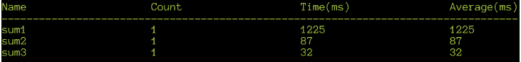

###### 图 8.36:snippet 10 . CPP 中代码的输出，对比了计算与随机和线性内存访问的时序

在前面的输出中，请注意内存访问现在比以前快了`35`倍，`2.5`倍于`sum2()`中的计算。我们使用`sum1()`中的随机存取模式来演示线性和随机存储器存取之间的对比。是什么让线性内存访问比随机访问快得多？答案在于现代处理器中用于减轻慢速内存影响的两种机制–**缓存**和**预取**–这两种机制我们将在下面的章节中讨论。

### 缓存

现代处理器在处理器寄存器和内存之间有多层高速缓冲存储器。这些缓存被标记为 L1、L2、L3、L4 等，其中 L1 离处理器最近，L4 离处理器最远。每个缓存层都比它下面的层更快(通常更小)。以下是`哈斯韦尔`系列处理器的缓存/内存大小和延迟示例:

*   L1: 32 KB，4 个周期
*   L2: 256 KB，12 个周期
*   L3: 6 MB，20 个周期
*   L4: 128 MB，58 个周期
*   内存:许多 GB，115 个周期

缓存如何帮助提高性能的一个简单模型如下:当一个内存地址被访问时，它会在 L1 缓存中被查找——如果找到了，它会从那里被检索出来。如果没有，则在 L2 缓存中查找，如果没有找到，则在三级缓存中查找，以此类推，如果在任何缓存中都没有找到，则从内存中获取。当从内存中取出时，它存储在每个缓存中，以便以后更快地访问。这种方法本身是相当无用的，因为只有当我们一次又一次地访问相同的内存地址时，它才能提高性能。第二个方面叫做**预取**，是能够让缓存真正有回报的机制。

### 预取

预取是这样一个过程，当执行内存访问时，附近的数据也被提取到缓存中，即使它没有被直接访问。预取的第一个方面与内存总线粒度有关——它可以被认为是“内存子系统可以发送给处理器的最小数据量是多少？”。在大多数现代处理器中，这是 64 位——换句话说，无论你从内存中请求一个字节还是一个 64 位的值，包含该地址的 64 位的整个`机器字`都是从内存中读取的。这些数据存储在每层缓存中，以便以后更快地访问。显然，这将立即提高内存性能——假设我们在地址`0x1000`读取一个字节的内存；我们还将该地址之后的其他 7 个字节放入缓存。如果我们访问地址为`0x1001`的字节，它来自缓存，避免了昂贵的内存访问。

预取的第二个方面更进一步——当一个地址的内存内容被读取时，处理器不仅读取那个内存字，而且读取更多。在 x86 系列处理器上，这是 32 到 128 个字节。这被称为**高速缓存行**大小——处理器总是以该大小的块读写内存。当中央处理器硬件检测到内存正在以线性方式被访问时，它会根据对后续可能被访问的地址的预测，将内存预取到一个高速缓存行中。

CPU 在检测规则访问模式(向前和向后)方面非常聪明，并且会高效预取。您还可以使用特殊指令向处理器提供提示，使其根据程序员的指示预取数据。这些指令在大多数编译器上作为内部函数提供，以避免使用内联汇编语言。当不在高速缓存中的存储器地址被读取或写入时，它被称为**高速缓存未命中**，并且是非常昂贵的事件，要不惜一切代价避免。中央处理器硬件尽最大努力减少缓存未命中，但程序员可以分析和修改数据访问模式，以最大限度地减少缓存未命中。这里对高速缓存的描述是一个简化的教学模型——实际上，中央处理器有指令和数据的 L1 高速缓存、多条高速缓存线和非常复杂的机制，以确保多个处理器能够保持它们各自的高速缓存同步。

#### 注意

在这篇著名的在线文章中可以找到对缓存实现的全面描述(以及关于内存子系统的许多其他信息):[https://lwn.net/Articles/250967/](https://lwn.net/Articles/250967/)。

### 缓存对算法的影响

了解了缓存之后，我们现在可以推断为什么我们的第一个向量对比列表示例会显示出令人惊讶的结果——从计算机科学的角度来看，以下是正确的:

**列表**:

*   迭代到第 N 个位置是 N 阶复杂度。
*   插入或删除一个元素的复杂度是 1。

**对于数组(或向量)**:

*   迭代到第 n 个位置是 1 阶复杂度。
*   在位置 N 插入或删除元素的复杂度与(S - N)成正比，其中 S 是数组的大小。

然而，对于现代体系结构，存储器访问的成本非常高，但是随后访问相邻地址的成本几乎为 0，因为它已经在高速缓存中。这意味着对非顺序位于内存中的`std::list`中的元素的迭代很可能总是导致缓存未命中，从而导致性能下降。另一方面，由于数组或`std::vector`的元素总是相邻的，缓存和预取可以大幅降低将(S-N)元素复制到新位置的总成本。因此，对这两种数据结构的传统分析宣称列表更适合随机插入，虽然在技术上是正确的，但实际上并不正确，尤其是考虑到现代 CPU 硬件明显复杂的缓存行为。当我们的程序是*数据绑定*时，算法复杂性的分析必须通过理解所谓的**数据局部性**来增加。

数据局部性可以简单地定义为从刚被访问的内存地址到先前被访问的内存地址的平均距离。换句话说，跨越彼此相距较远的地址进行内存访问是一种严重的减速，因为来自较近地址的数据很可能已经被预取到缓存中。当数据已经存在于缓存中时，称为“热”；否则，它被称为“冷”。利用缓存的代码称为**缓存友好**。另一方面，高速缓存不友好的代码会导致高速缓存行被浪费地重新加载(称为**高速缓存无效**)。在本节的剩余部分，我们将研究关于如何编写缓存友好代码的策略。

### 优化缓存友好性

在过去，代码优化包括试图最小化代码中的机器指令数量，使用更有效的指令，甚至重新排序指令以允许流水线保持满。在当今时代，编译器执行所有上述优化的程度是大多数程序员无法做到的——尤其是考虑到编译器可以在数亿条指令的整个程序中做到这一点。即使是现在，程序员的责任仍然是优化数据访问模式以利用缓存的能力。

任务非常简单——确保访问的内存接近之前访问的内存——但是实现这一点的方法需要大量的努力。

#### 注意

90 年代著名的游戏程序员和代码优化大师 Terje Mathisen，据说说过:“所有的编程都是缓存方面的练习。”2019 年的今天，这种说法比以往任何时候都更适用于这个试图编写快速代码的子领域。

提高缓存友好性有一些基本的经验法则:

*   堆栈总是“热”的，所以我们应该尽可能多地使用局部变量。
*   动态分配的对象很少彼此具有数据局部性——避免它们或者使用预先分配的对象池，以便它们在内存中是连续的。
*   基于指针的数据结构，如树，尤其是列表，由堆上分配的多个节点组成，对缓存非常不友好。
*   面向对象代码中虚拟函数的运行时分派会使指令缓存失效——避免性能关键代码中的动态分派。

在下一节中，我们将探讨堆分配的成本。

### 练习 12:探索堆分配的成本

在本练习中，我们将研究动态分配内存对性能的影响，并研究堆内存如何影响代码的性能。执行以下步骤完成本练习:

1.  创建一个名为 **Snippet11.cpp** 的文件。
2.  添加以下代码以包含必要的库:

    ```cpp
    #include <string>
    #include <iostream>
    #include <random>
    #include "Timer.h"
    using std::string;
    using std::cerr;
    using std::endl;
    ```

3.  声明一个常量变量 N 和一个名为水果的字符数组。给它们赋值:

    ```cpp
    const int N = 10'000'000;
    const char* fruits[] = 
      {"apple", "banana", "cherry", "durian", "guava", "jackfruit", "kumquat", "mango", "orange", "pear"};
    ```

4.  创建一个名为`fun1()`的函数，该函数只循环遍历水果中的每个字符串，将其复制到一个字符串中，并对该字符串的字符进行求和:

    ```cpp
    uint64_t fun1()
    {
      TIME_IT;
      uint64_t sum = 0;
      string s1;
      for(uint64_t i = 0; i < N; ++ i)
      {
        s1 = fruits[i % 10];
        for(int k = 0; k < s1.size(); ++ k) sum += s1[k];
      }
      return sum;
    }
    ```

5.  创建另一个名为`sum2()`的函数，使用本地声明的字符数组代替字符串和循环来复制:

    ```cpp
    uint64_t fun2()
    {
      TIME_IT;
      uint64_t sum = 0;
      char s1[32];

      for(uint64_t i = 0; i < N; ++ i)
      {
        char *ps1 = s1;
        const char *p1 = fruits[i % 10];
        do { *ps1++ = *p1; } while(*p1++);
        for(ps1 = s1; *ps1; ++ ps1) sum += *ps1;
      }
      return sum;
    }
    ```

6.  在`main()`函数内写下以下代码:

    ```cpp
    int main()
    {
      for(int i = 0; i < 10; ++ i)
      {
        volatile uint64_t asum1 = fun1();
        volatile uint64_t asum2 = fun2();  
      }
      Timer::dump();
    }
    ```

7.  Save the file and open the terminal. Compile and run the program:

    ```cpp
    $ g++ -O3 Snippet11.cpp Timer.cpp
    $ ./a.out
    ```

    上述命令生成以下输出:

    

    ###### 图 8.37:snippet 11 . CPP 中代码的输出，显示了堆分配对计时的影响

    从前面的输出中，请注意`fun2()`的速度几乎是`fun1()`的两倍。

8.  Now, use the `perf` command to profile:

    ```cpp
    $ perf record ./a.out
    ```

    前面的命令生成以下输出:

    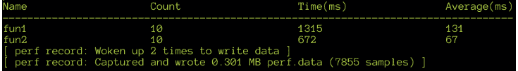

    ###### 图 8.38:在 Snippet11.cpp 中分析代码的 perf 命令的输出

9.  现在，我们可以用以下代码检查性能报告:

    ```cpp
    $ perf report
    ```

我们收到以下输出:


###### 图 8.39:snippet11 . CPP 中代码的 perf 命令定时报告的输出

在前面的输出中，请注意大约 33%的执行时间是由`std::string`构造函数、`strlen()`和`memmove()`占用的。所有这些都与在`fun1()`中使用的`std::string`相关联。尤其是堆分配是最慢的操作。

### 数组模式的结构

在许多程序中，我们经常使用相同类型的对象数组——这些对象可以代表数据库中的记录、游戏中的实体等等。一种常见的模式是遍历一个大的结构数组，并对某些字段执行操作。即使结构在内存中是顺序的，如果我们只访问几个字段，更大的结构会降低缓存的效率。

处理器可以将几个结构预取到高速缓存中，但是程序只访问高速缓存数据的一部分。因为它没有使用每个结构的每个字段，所以大部分缓存数据都会被丢弃。为了避免这种情况，可以使用另一种数据布局——我们使用一种阵列结构 ( **SoA** )模式，而不是使用结构 ( **AoS** )模式的**结构。在下一节中，我们将解决一个练习，其中我们将检查使用 SoA 模式和 AoS 模式的性能优势。**

### 练习 13:使用数组模式的结构

在本练习中，我们将研究使用 SoA 和 AoS 模式的性能优势。执行以下步骤完成本练习:

1.  创建一个名为 **Snippet12.cpp** 的文件。
2.  包括必要的库，以及`Timer.h`头文件。初始化一个随机数生成器，并创建一个从 1 到 N-1 的分布范围。创建一个常量整型变量，N，并用值 100，000，000 初始化它。添加以下代码来实现:

    ```cpp
    #include <vector>
    #include <list>
    #include <algorithm>
    #include <string>
    #include <iostream>
    #include <random>
    #include "Timer.h"
    using std::vector;
    using std::list;
    using std::cerr;
    using std::endl;
    const int N = 100'000'000;
    std::random_device dev;
    std::mt19937 rng(dev());
    std::uniform_int_distribution<std::mt19937::result_type> dist(1,N-1);
    ```

3.  编写两种不同的方式来表示数据--一种结构数组和一种数组结构。使用`uint64_t`的六个字段，这样我们就可以模拟一个更能代表真实世界程序的大尺寸结构:

    ```cpp
    struct Data1
    {
      uint64_t field1;
      uint64_t field2;
      uint64_t field3;
      uint64_t field4;
      uint64_t field5;
      uint64_t field6;
    };
    struct Data2
    {
      vector<uint64_t> field1;
      vector<uint64_t> field2;
      vector<uint64_t> field3;
      vector<uint64_t> field4;
      vector<uint64_t> field5;
      vector<uint64_t> field6;
    };
    struct Sum
    {
      uint64_t field1;
      uint64_t field2;
      uint64_t field3;
      Sum(): field1(), field2(), field3() {}
    };
    ```

4.  定义两个函数，即`sumAOS`和`sumSOA`，对前面两个数据结构的`字段 1`、`字段 2`和`字段 3`中的值求和。编写以下代码来实现这一点:

    ```cpp
    Sum sumAOS(vector<Data1> &aos)
    {
      TIME_IT;
      Sum ret;
      for(int i = 0; i < N; ++ i)
      {
        ret.field1 += aos[i].field1;
        ret.field2 += aos[i].field2;
        ret.field3 += aos[i].field3;
      }
      return ret;
    }
    Sum sumSOA(Data2 &soa)
    {
      TIME_IT;
      Sum ret;
      for(int i = 0; i < N; ++ i) 
      {
        ret.field1 += soa.field1[i];
        ret.field2 += soa.field2[i];
        ret.field3 += soa.field3[i];
      }
      return ret;
    }
    ```

5.  在`主`功能中编写以下代码:

    ```cpp
    int main()
    {
       vector<Data1> arrOfStruct;
       Data2 structOfArr;

       // Reserve space
       structOfArr.field1.reserve(N);
       structOfArr.field2.reserve(N);
       structOfArr.field3.reserve(N);
       arrOfStruct.reserve(N);
       // Fill random values
       for(int i = 0; i < N; ++ i)
       {
         Data1 temp;
         temp.field1 = dist(rng);
         temp.field2  = dist(rng);
         temp.field3 = dist(rng);
         arrOfStruct.push_back(temp);
         structOfArr.field1.push_back(temp.field1);
         structOfArr.field2.push_back(temp.field2);
         structOfArr.field3.push_back(temp.field3);
       }
      Sum s1 = sumAOS(arrOfStruct);
      Sum s2 = sumSOA(structOfArr);
      Timer::dump();
    }
    ```

6.  Save the program and open the Terminal. Run the program to time it by adding the following commands:

    ```cpp
    $ g++ -O3 Snippet12.cpp Timer.cpp
    $ ./a.out
    ```

    上述代码生成以下输出:

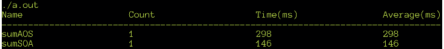

###### 图 8.40:snippet 12 . CPP 中代码的输出，对比了 AOS 模式和 SOA 模式的时间

数组结构方法的速度是数组结构方法的两倍。考虑到结构中向量的地址会相距很远，我们可能想知道为什么在 SoA 的情况下缓存行为更好。这是因为高速缓存是如何设计的，而不是像我们前面讨论的那样，将一个高速缓存视为一个单片块，而是将其分成多行。当访问存储器地址时，32 位或 64 位地址被转换成几个位的“标签”，并且使用与该标签相关联的高速缓存行。非常接近的内存地址将获得相同的标签并到达相同的缓存行。如果访问高度不同的地址，它会到达不同的高速缓存行。这种基于行的高速缓存设计对我们测试程序的影响是，好像我们对每个向量都有独立的高速缓存。

前面对高速缓存行的解释非常简单，但高速缓存行的基本概念适用。对于这种数组模式的结构来说，代码可读性可能会稍差一些，但是考虑到性能的提高，这是非常值得的。随着结构尺寸的增大，这种特殊的优化变得更加有效。此外，请记住，如果字段大小不一，填充结构会使其大小膨胀很大一部分。我们已经探索了内存延迟对性能的影响，并了解了一些帮助处理器缓存有效的方法。当编写一个对性能至关重要的程序时，我们应该记住缓存效果。有时候，首先从一个对缓存更友好的架构开始是有意义的。像往常一样，我们应该在尝试对数据结构进行彻底的改变之前，一直衡量代码的性能。优化应该集中在程序最耗时的部分，而不是它的每一部分。

### 算法优化

算法优化的最简单形式是寻找执行你的任务的库——最流行的库都是高度优化和编写良好的。比如`Boost`库提供了很多有用的库，可以在很多项目中派上用场，比如`Boost。几何`、`助推。图`、`升压。间隔`和`升压。多精度`，举几个例子。使用专业编写的库比自己创建库要容易和明智得多。例如`Boost。图`实现了十几个算法来处理拓扑图，每一个算法都是高度优化的。

许多计算可以简化为一系列标准算法组合在一起——如果做得正确，这些算法可以产生极其高效的代码——甚至经常被编译器并行化以利用多核或 SIMD。在本节的其余部分，我们将采用一个单独的程序，并尝试以各种方式对其进行优化–这将是一个字数统计程序，具有以下规格:

*   为了隔离磁盘输入/输出所花费的时间，我们将在处理之前将整个文件读取到内存中。
*   Unicode 支持将被忽略，我们将假设英语文本为 ASCII。
*   我们将使用在线提供的大量公共领域文学文本作为测试数据。

### 练习 14:优化字数统计程序

在这个冗长的练习中，我们将使用各种优化技术来优化程序。我们将执行实际程序的增量优化。我们将使用的测试数据由名为《双城记》的书组成，该书已被附加在一起 512 次。

#### 注意

本练习中使用的数据集可在此处获得:[https://github . com/trainingypbackt/Advanced-CPlusPlus/blob/master/lesson 8/练习 14/data.7z](https://github.com/TrainingByPackt/Advanced-CPlusPlus/blob/master/Lesson8/Exercise14/data.7z) 。您将需要提取这个 7zip 存档，并将结果文件(称为 data.txt)复制到您进行本练习的文件夹中。

执行以下步骤完成本练习:

1.  Write the basic boilerplate code that reads the file (the full code can be found in **SnippetWC.cpp**). This will be a common driver for all the versions of the word count that we write:

    ```cpp
    int wordCount(const string &s);
    int main(int argc, char **argv)
    {
      if(argc > 1)
      {
        TIME_IT;
        string sContent;
        ostringstream buf;
        ifstream ifs(argv[1]);
        {
          Timer t("Read file");
          buf << ifs.rdbuf(); 
          sContent = buf.str();
          sContent.push_back(' ');
        }
        cerr << wordCount(sContent) << endl;
      }
      Timer::dump();
    }
    ```

    我们将使用一个虚拟块来分隔读取文件的代码的时间，以及时间`main()`本身，以获得整体执行时间。

    请注意`push_back`在末尾添加了一个空格——这确保了数据以空格结尾，简化了我们使用的算法。

2.  写一个基本的字数统计功能。逻辑非常简单——对于字符串中的每个字符，如果该字符不是空白，而后面的字符是空白，那么它就是单词的结尾，应该被计数。由于我们的样板代码在末尾增加了一个空格，所以任何最终的单词都将被计算在内。该功能在 **Snippet13.cpp** :

    ```cpp
    int wordCount(const std::string &s)
    {
      int count = 0;
      for(int i = 0, j = 1; i < s.size() - 1; ++ i, ++ j)
      {
        if(!isspace(s[i]) && isspace(s[j]))
        {
          ++ count;
        }
      }
      return count;
    }
    ```

    中定义
3.  Let's compile, run, and get an idea of the performance. We will verify that it is working right by comparing the result of our code with the results provided by the standard `wc` program:

    ```cpp
    $ g++ -O3 Snippet13.cpp SnippetWC.cpp Timer.cpp
    $ ./a.out data.txt
    ```

    我们收到以下输出:

    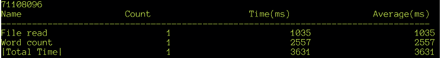

    ###### 图 8.41:带有基线字数实现的 Snippet13.cpp 中的代码输出

    让我们为厕所计划计时:

    ```cpp
    $ time wc -w data.txt
    ```

    我们收到以下输出:

    

    ###### 图 8.42:定时 wc 程序的输出

    *wc* 程序显示相同的字数，即`71108096`，所以我们知道我们的代码是正确的。我们的代码花了大约`3.6 秒`，包括读取文件，比 wc 慢很多。

4.  Our first strategy to optimize is to see if there is a better way to implement `isspace()`. Instead of a function, we can use a lookup table that can tell if a character is a space or not (the code for this can be found in **Snippet14.cpp**):

    ```cpp
    int wordCount(const std::string &s)
    {
      // Create a lookup table
      bool isSpace[256];
      for(int i = 0; i < 256; ++ i)
      {
        isSpace[i] = isspace((unsigned char)i);
      }
      int count = 0;
      int len = s.size() - 1;
      for(int i = 0, j = 1; i < len; ++ i, ++ j)
      {
        count += !isSpace[s[i]] & isSpace[s[j]];
      }
      return count;
    }
    ```

    请记住，C/C++ 中的布尔变量采用整数值 0 或 1，因此我们可以直接编写以下内容:

    ```cpp
    !isSpace[s[i]] & isSpace[s[j]]
    ```

    这意味着我们不必写这个:

    ```cpp
    (!isSpace[s[i]] && isSpace[s[j]]) ? 1 : 0
    ```

    将布尔值直接用作数字有时会导致更快的代码，因为我们避免了条件逻辑运算符&&和||，这可能会导致分支指令。

5.  Compile and test the performance now:

    ```cpp
    $ g++ -O3 Snippet14.cpp SnippetWC.cpp Timer.cpp
    $ ./a.out data.txt
    ```

    我们收到以下输出:

    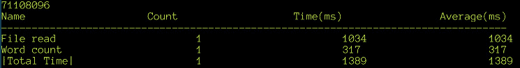

    ###### 图 8.43:snippet 14 . CPP 中代码的输出

    通过使用查找表的简单原理，我们实现了字数统计代码的 8 倍加速。我们能做得更好吗？是的–我们可以进一步理解查找表的概念–对于每对字符，有四种可能，这将导致相应的操作:

    【空间空间】:无动作，【非空间空间】:加 1 计数，【空间非空间】:无动作，【非空间，非空间】:无动作

    因此，我们可以制作一个包含`65536`条目(`256 * 256`)的表格来覆盖所有可能的字符对。

6.  Write the following code to create the table:

    ```cpp
    // Create a lookup table for every pair of chars
    bool table[65536];
    for(int i = 0; i < 256; ++ i)
    {
      for(int j = 0; j < 256; ++ j)
      {
        int idx = j + i * 256;
        table[idx] = !isspace(j) && isspace(i);
      }
    }
    ```

    字数循环如下(完整代码可在 **Snippet15.cpp** 中找到):

    ```cpp
    int count = 0;
    for(int i = 0; i < s.size() - 1; ++ i)
    {
      // grab the 2 bytes at s[i] as a 16 bit value
      unsigned short idx;
      memcpy(&idx, &s[i], 2);
      count += table[idx];
    }
    ```

    我们将字符串的每个字符作为一个 16 位的值来读取。直接将一个指针从 char*强制转换为另一个类型并取消对它的引用是未定义的行为——正确的方法是使用`memcpy()`。编译器足够聪明，可以使用 CPU 内存访问指令，而不是实际调用`memcpy()`获取 2 个字节。我们已经结束了不包含条件语句的循环，这应该会使它更快。请记住，X86 架构是*小端*-因此从字符数组中读取的 16 位值将第一个字符作为其 LSB，第二个字符作为 MSB。

7.  Now, time the code we wrote:

    ```cpp
    $ g++ -O3 Snippet15.cpp SnippetWC.cpp Timer.cpp
    $ ./a.out data.txt
    ```

    

    ###### 图 8.44:snippet 15 . CPP 中代码的输出

    这个更大的查找表使`字数()`的速度提高了 1.8 倍。让我们退后一步，从另一个角度来看这个问题，这样我们就可以有效地使用现有的标准库。这样做的好处有两个方面——首先，代码不太容易出错，其次，我们可以利用一些编译器提供的并行化。

    让我们使用标准算法重写使用`isspace`的查找表的程序版本。如果我们看一下计数单词的主循环，我们取 2 个字符，根据一些逻辑，我们将 1 或 0 累加到`计数`变量中。这是许多代码中常见的模式:

    ```cpp
    X OP (a[0] OP2 b[0]) OP (a[1] OP2 b[1]) OP (a[2] OP2 b[2]) ... OP (a[N] OP2 b[N])  
    ```

    这里`a`和`b`是大小的数组`N`，`X`是初始值，`OP`和`OP2`是运算符。有一种标准算法封装了这种模式，称为`STD::inner _ product`–它采用两个序列，在每对元素之间应用一个运算符(OP2)，并在这些元素之间应用另一个运算符(OP)，从初始值 x 开始。

8.  We can write the function as follows (the full code can be found in **Snippet16.cpp**):

    ```cpp
    int wordCount(const std::string &s)
    {
      // Create a lookup table for every char
      bool table[256];
      for(int i = 0; i < 256; ++ i)
      {
        table[i] = isspace((unsigned char)i) ? 1 : 0;
      }

      auto isWordEnd = [&](char a, char b) 
      {
        return !table[a] & table[b]; 
      };

      return std::inner_product(s.begin(), s.end()-1, s.begin()+1, 0, std::plus<int>(), isWordEnd);
    }
    ```

    这个`内积()`调用在每个`s[n]`和`s[n+1]`上应用`isWordEnd()` lambda，并在这些结果之间应用标准加法函数。实际上，当`s[n]`和`s[n+1]`在一个词尾时，我们是在加 1。

    #### 注意

    即使这看起来像是许多嵌套的函数调用，编译器也会内联所有内容，并且没有开销。

9.  Compile and time the execution of this version:

    ```cpp
    $ g++ -O3 Snippet16.cpp SnippetWC.cpp Timer.cpp
    $ ./a.out data.txt
    ```

    我们收到以下输出:

    

    ###### 图 8.45:snippet 16 . CPP 中代码的输出

    令人惊讶的是，该代码比我们在 **Snippet14.cpp** 中的初始循环版本稍快。

10.  Can we adapt the same code to use the large lookup table? Indeed, we can – the new function looks like this (the full code can be found in **Snippet17.cpp**):

    ```cpp
    int wordCount(const std::string &s)
    {
      // Create a lookup table for every pair of chars
      bool table[65536];
      for(int i = 0; i < 256; ++ i)
      {
        for(int j = 0; j < 256; ++ j)
        {
          int idx = j + i * 256;
          table[idx] = !isspace(j) && isspace(i);
        }
      }
      auto isWordEnd = [&](char a, char b) 
      {
        unsigned idx = (unsigned)a | (((unsigned)b) << 8);
        return table[idx]; 
      };
      return std::inner_product(s.begin(), s.end()-1, s.begin()+1, 0, std::plus<int>(), isWordEnd);
    }
    ```

    与之前基于循环的代码唯一不同的是，我们没有使用`memcpy()`将两个连续的字节转换为一个单词，而是使用按位`或`运算符将它们组合在一起。

11.  Compile and time the code:

    ```cpp
    $ g++ -O3 Snippet17.cpp SnippetWC.cpp Timer.cpp
    $ ./a.out data.txt
    ```

    我们收到以下输出:

    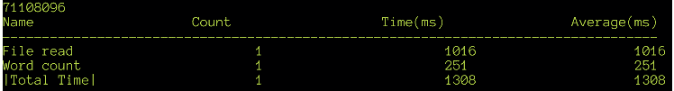

    ###### 图 8.46:snippet 17 . CPP 中代码的输出

    这段代码没有我们在 **Snippet15.cpp** 中的基于 loop 0 的版本快。这样做的原因是，在循环版本中，我们读取 2 个字节组合成一个`短的`来获得索引，这不需要计算，但是在这里，我们通过按位运算将 2 个字节读取到一个`短的`中。

12.  Now that we have the code where the bulk of the work is done by a standard library function, we can now get automatic parallelization for free – compile and test as follows:

    ```cpp
    $ g++ -O3 -fopenmp -D_GLIBCXX_PARALLEL Snippet17.cpp SnippetWC.cpp Timer.cpp
    $ ./a.out data.txt
    ```

    我们收到以下输出:

    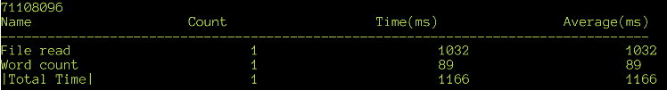

    ###### 图 8.47:带有并行化标准库的 Snippet17.cpp 中的代码输出

    显然，它不能完全并行化，所以我们在速度方面只获得了大约 2.5 倍的改进，但我们不必对代码做任何事情就能实现。我们能以同样的方式使基于循环的代码并行化吗？理论上，是的——我们可以手动使用 **OpenMP** 指令来实现这一点；然而，这需要对代码进行修改，并了解如何使用 OpenMP。 **Snippet16.cpp** 中的版本怎么样？

    ```cpp
    $ g++ -O3 -fopenmp -D_GLIBCXX_PARALLEL Snippet16.cpp SnippetWC.cpp Timer.cpp
    $ ./a.out data.txt
    ```

    我们收到以下输出:

    

    ###### 图 8.48:带有并行化标准库的 Snippet16.cpp 中的代码输出

    这个版本也有类似的改进。我们完成了吗，或者还能更快吗？著名游戏程序员迈克尔·阿布拉什(Michael Abrash)创造了首字母缩略词“T2”——它代表“没有最快的代码”。他的意思是，只要付出足够的努力，总有可能让代码变得更快。这似乎是不可能的，但人们一次又一次地找到了越来越快的计算方法——我们的代码也不例外，我们仍然可以走得更远。我们可以为优化做的权衡之一是让代码不那么通用——我们已经对代码进行了一些限制——例如，我们只处理 **ASCII** 英文文本。通过对输入数据添加更多的约束，我们可以做得更好。让我们假设文件中没有不可打印的字符。这是对我们输入数据的合理假设。如果我们假设这一点，那么我们可以简化检测空格的条件——因为所有空格字符都大于或等于 ASCII 32，所以我们可以避免查找表本身。

13.  让我们根据之前的想法实现代码(完整代码可以在 **Snippet18.cpp** 中找到):

    ```cpp
    int wordCount(const std::string &s)
    {
      auto isWordEnd = [&](char a, char b) 
      {
        return a > 32 & b < 33; 
      };
      return std::inner_product(s.begin(), s.end()-1, s.begin()+1, 0, std::plus<int>(), isWordEnd);
    }
    ```

14.  Compile and run the program:

    ```cpp
    $ g++ -O3 Snippet18.cpp SnippetWC.cpp Timer.cpp
    $ ./a.out data.txt
    ```

    我们收到以下输出:

    

    ###### 图 8.49:snippet 18 . CPP 中代码的输出，带有检测空格的简化逻辑

    这个版本的速度是并行版本的两倍，而且只有几行代码。使用并行化会更好吗？

    ```cpp
    $ g++ -O3 -fopenmp -D_GLIBCXX_PARALLEL Snippet18.cpp SnippetWC.cpp Timer.cpp
    $ ./a.out data.txt
    ```

    我们收到以下输出:

    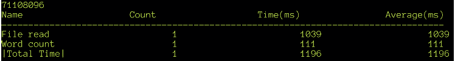

    ###### 图 8.50:带有并行化标准库的 Snippet18.cpp 中的代码输出

    不幸的是，事实并非如此——它实际上更慢。管理多线程和线程争用的开销有时比多线程代码的好处更昂贵。在这一点上，我们可以看到文件读取代码占用了大部分时间——我们能对此做些什么吗？

15.  让我们将`main()`功能更改为对其各个部分计时(完整代码可在 **SnippetWC2.cpp** 中找到):

    ```cpp
        {
          Timer t("File read");
          buf << ifs.rdbuf(); 
        }
        {
          Timer t("String copy");
          sContent = buf.str();
        }
        {
          Timer t("String push");
          sContent.push_back(' ');
        }
        int wc;
        {
          Timer t("Word count");
          wc = wordCount(sContent);
        }
    ```

16.  Compile and run the preceding code:

    ```cpp
    $ g++ -O3 Snippet18.cpp SnippetWC2.cpp Timer.cpp
    $ ./a.out data.txt
    ```

    我们收到以下输出:

    

    ###### 图 8.51:snippet 18 . CPP 中所有操作都定时的代码输出

    大部分时间由`push_back()`和复制字符串占用。由于字符串正好是文件的大小，`push_back()`最终会为字符串分配一个新的缓冲区并复制内容。如何才能消除这个`push_back()`的称呼？我们在末尾添加了一个空格，以便能够始终如一地计算最后一个单词(如果有的话)，因为我们的算法计算单词的末尾。有三种方法可以避免这种情况:计算一个单词的开头，而不是结尾；单独计算最后一个词，如果有的话；并且使用`c_str()`函数，这样我们在末尾就有了一个`NUL`字符。现在让我们依次尝试这些方法。

17.  先写主功能不用`push_back`(完整代码可以在 **SnippetWC3.cpp** 找到):

    ```cpp
    {
      Timer t("File read");
      buf << ifs.rdbuf(); 
    } 
    {
      Timer t("String copy");
      sContent = buf.str();
    }
    int wc;
    {
      Timer t("Word count");
      wc = wordCount(sContent);
    }
    ```

18.  通过将`isWordEnd()`重命名为`isWordStart()`来更改 wordCount()中的代码，并反转逻辑。如果当前字符是空格，而后续字符不是空格，那么可以将一个单词视为起始字符。此外，如果字符串以非空格开头，则多计数一个单词(完整代码可在 **Snippet19.cpp** 中找到):

    ```cpp
    int wordCount(const std::string &s)
    {
      auto isWordStart = [&](char a, char b) 
      {
        return a < 33 & b > 32; 
      };
      // Count the first word if any
      int count = s[0] > 32;
      // count the remaining
      return std::inner_product(s.begin(), s.end()-1, s.begin()+1, count, std::plus<int>(), isWordStart);
    }
    ```

19.  现在，写下第二个选择——数数最后一个单词，如果有的话。代码与 **Snippet18.cpp** 版本几乎相同，只是我们检查了最后一个字(完整代码可以在 **Snippet20.cpp** 中找到):

    ```cpp
    int count = std::inner_product(s.begin(), s.end()-1, s.begin()+1, 0, std::plus<int>(), isWordEnd);
    // count the last word if any
    if(s.back() > 32) 
    {
      ++ count;
    }
    return count;
    ```

20.  Write the third version that uses `c_str()` – all we need to do is change the parameters for `inner_product()` (the full code can be found in **Snippet21.cpp**)

    ```cpp
    int wordCount(const std::string &s)
    {
      auto isWordEnd = [&](char a, char b) 
      {
        return a > 32 & b < 33; 
      };
      const char *p = s.c_str();
      return std::inner_product(p, p + s.size(), p+1, 0, std::plus<int>(), isWordEnd);
    }
    ```

    由于`c_str()`末端有一个`NUL`，所以它的工作原理和以前一样。

21.  Compile and time all three versions:

    ```cpp
    $ g++ -O3 Snippet19.cpp SnippetWC3.cpp Timer.cpp
    $ ./a.out data.txt
    ```

    我们收到以下输出:

    

    ###### 图 8.52:snippet 19 . CPP 中代码的输出，它计算单词的开头而不是结尾

    现在输入以下命令:

    ```cpp
    $ g++ -O3 Snippet20.cpp SnippetWC3.cpp Timer.cpp
    $ ./a.out data.txt
    ```

    我们收到以下输出:

    

    ###### 图 8.53:snippet 20 . CPP 中代码的输出

    现在输入以下命令:

    ```cpp
    $ g++ -O3 Snippet21.cpp SnippetWC3.cpp Timer.cpp
    $ ./a.out data.txt
    ```

    我们收到以下输出:

    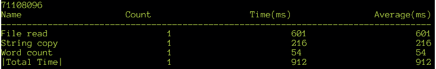

    ###### 图 8.54:snippet 21 . CPP 中代码的输出

    三者几乎同时运行，几毫秒的微小差异可以忽略不计。

22.  现在，我们可以解决字符串复制所花费的时间–我们将直接将文件读入字符串缓冲区，而不是使用`std::stringstream`(完整代码可在 **SnippetWC4.cpp** ):

    ```cpp
    string sContent;
    {
      Timer t("String Alloc");
      // Seek to end and reserve memory
      ifs.seekg(0, std::ios::end);   
      sContent.resize(ifs.tellg());
    }
    {
      Timer t("File read");
      // Seek back to start and read data
      ifs.seekg(0, std::ios::beg);
      ifs.read(&sContent[0], sContent.size());
    }
    int wc;
    {
      Timer t("Word count");
      wc = wordCount(sContent);
    }  
    ```

    中找到)
23.  Compile and run this version:

    ```cpp
    $ g++ -O3 Snippet21.cpp SnippetWC4.cpp Timer.cpp
    ```

    我们收到以下输出:

    

    ###### 图 8.55:snippetwc4 . CPP 中文件加载代码改变后的代码输出

    我们现在已经将文件读取代码所需的时间从大约 1，000 毫秒减少到 250 毫秒，提高了 4 倍。字数代码从大约`2500 毫秒`开始，减少到大约 60 毫秒——提高了 40 倍。整个程序的总性能提高了 3.6 倍。我们仍然可以问这是否是极限——事实上，TANSTATFC 仍然适用，并且还有一些事情可以做:使用`内存映射输入/输出`获得直接指向文件的缓冲区，而不是将数据读入`std::string`。这可能比分配和读取更快——它需要改变字数代码以接受一个`常量字符*`和一个长度，或者一个`标准::string_view`。使用不同的、更快的分配器来分配内存。使用`-3 月=原生`标志为原生 CPU 编译。然而，我们似乎不太可能从中获得非常大的性能提升，因为这些优化与字数统计算法本身无关。另一个最后的尝试可能是放弃 C++ 构造，使用`编译器内部函数`编写内联 SIMD 代码(这些函数被编译器直接翻译成单个汇编指令)。完成这项工作所需的知识超出了本介绍材料的范围。

24.  Nevertheless, for the curious student, an `AVX2` (256-bit SIMD) version of `wordCount()` is provided (Snippet23.cpp). This version needs the input string to have a length that is a multiple of 32 and a space at the end. This means that the main function has to be rewritten (SnippetWC5.cpp):

    ```cpp
    $ g++ -O3 -march=native Snippet22.cpp SnippetWC5.cpp Timer.cpp
    $ ./a.out data.txt
    ```

    我们收到以下输出:


###### 图 8.56:snippet 22 . CPP 中使用 SIMD 内函数的代码输出

请注意，我们需要使用`-march=native`标志，以便编译器使用 AVX SIMD 指令集。如果处理器不支持它，将导致编译错误。如果此可执行文件是为 AVX 目标编译的，并且在处理器不支持这些指令的系统上运行，程序会因“非法指令”异常而崩溃。这似乎是一个非常小的改进，但并不显著——用汇编程序或 SIMD 优化所需的努力和学习曲线通常太高，除非您的应用或行业有这些要求，否则是不合理的。SIMD 版本一次处理 32 个字节，但性能几乎没有提高。事实上，如果您使用编译器资源管理器检查其他代码片段中常规 C++ 实现的生成的汇编代码，您将看到编译器本身已经使用了 SIMD——这正好说明了编译器在让您的代码变快方面走了多远。

另一点需要注意的是，我们的文件读取和内存分配现在占用了大部分时间——抛开内存分配，我们可以得出结论，我们的代码已经成为 **I/O 绑定**而不是 **CPU 绑定**。这意味着无论我们写代码有多快，它都会受到获取数据速度的限制。我们从字数统计算法的一个非常简单的实现开始，增加了它的复杂性和速度，最后能够回到一个非常简单的实现，最终成为最快的。算法的整体速度提高了 40 倍。我们使用了许多方法，从稍微重新排列代码，到以不同的方式重新想象问题，再到执行微优化。没有一种方法可以一直有效，优化仍然是一种创造性的努力，需要想象力和技巧，通常还需要横向思维。随着编译器变得越来越聪明，超越它们变得越来越难——然而，程序员是唯一真正理解代码意图的人，而且总是有余地让代码变得更快。

### 活动 1:优化拼写检查算法

在本活动中，我们将尝试逐步优化程序。这个活动是关于一个简单的拼写检查器，它获取一个字典和一个文本文件，并打印出字典中没有的文本单词列表。在 **Speller.cpp** 中提供了一个基本的框架程序，以及一个示例字典和文本文件，分别为 **dict.txt** 和 **data.txt** 。提供了一个名为 out.txt 的文件，其中包含程序的所需输出(拼写错误单词的索引列表)。文本文件存在于`7zip 存档`中，即`活动 1.7z`。

该词典取自许多 Linux 发行版提供的 Linux 单词列表。文本文件与我们在上一个练习中使用的文件相似——它与我们在字数统计练习中使用的文件一样大，所有标点符号都被删除并转换为小写。

请注意，字典只是一个例子，所以不要假设所有有效的单词都存在于其中——输出中的许多单词很可能是拼写正确的单词。框架代码读取字典和文本文件，并调用上面的拼写检查代码(您将编写)。之后，它将结果输出与 **out.txt** 的内容进行比较，并打印程序是否按预期工作。执行拼写检查的函数返回字典中没有的单词的索引向量。因为我们只关注拼写检查算法，所以只有代码是定时的。不考虑读取文件和比较输出所花费的时间。您将开发该程序的更快版本-参考文件夹中提供的参考实现有 **Speller1.cpp** 、 **Speller2.cpp** 等。

在每一步中，您将只得到提示，告诉您应该更改什么以使其更快–只有`get 拼错()`函数中的代码将被修改，而不是任何其他代码。只要代码产生正确的结果，并且在`main()`内的代码没有改变，学生可以按照自己的意愿自由执行代码。

#### 注意

优化是一个创造性的、非确定性的过程——学生不能保证也不总是可能得出与参考实现相同的代码。如果您编写的代码的性能不如引用实现，这应该不会令人惊讶。事实上，甚至有可能您的代码比引用更快。

执行以下步骤来实施本活动:

制作一个名为 Speller1.cpp 的 Speller.cpp 的副本，并实现`get 拼错()`函数的代码。使用`std::set`及其`count()`方法实现。

1.  Write the next version of the program as Speller2.cpp, and then compile it and time it as before. Try using `std::unordered_set` rather than `std::set`. You should get about a 2x speedup with this implementation.

    在最终版本 **Speller3.cpp** 中，使用**布隆过滤器**数据结构来实现拼写检查算法。用不同数量的散列函数和不同大小的布隆过滤器进行实验，看看什么效果最好。

2.  For each of the preceding steps, compile the program and run it as follows (change the input file name as required):

    ```cpp
    $ g++ -O3 Speller1.cpp Timer.cpp
    $ ./a.out
    ```

    #### 注意

    您不应该期望时间完全如这里所示，但是如果您正确地实现了代码，速度的相对提高应该接近我们在这里看到的。

对每个步骤执行上述命令后，将生成以下输出。输出将显示代码的时序，如果输出正确，还会显示一条初始消息。以下是步骤 1 的输出:


###### 图 8.57:步骤 1 的代码输出示例

以下是步骤 2 的输出:

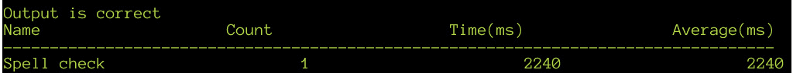

###### 图 8.58:步骤 2 的代码输出示例

以下是步骤 3 的输出:

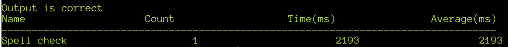

###### 图 8.59:步骤 3 的代码输出示例

#### 注意

这项活动的解决方案可以在第 725 页找到。

## 总结

在这一章中，我们已经讨论了许多复杂的材料。对于任何现代 C++ 开发人员来说，优化代码都是一项困难但必要的技能。机器学习、超现实游戏、大数据分析和高能效计算的需求使得这对于任何 C++ 专业人员来说都是一个非常重要的学习领域。我们了解到性能优化的过程分为两个阶段。

首先，优化从适当的性能测量策略开始，测试条件反映真实世界的数据和使用模式。我们已经学习了如何通过各种方法来衡量性能——学习汇编代码、手动计时、源代码插装以及使用运行时分析器。一旦我们有了准确的测量，我们就能真正理解我们程序的哪些部分实际上是慢的，并集中精力在那里获得最大的改进。第二个阶段涉及实际修改程序——我们了解了几种策略，从为代码使用最佳编译器选项开始，使用并行化特性，还使用配置文件数据来帮助编译器，然后是一些简单的代码转换，这些转换可以在不进行重大代码更改的情况下产生微小但有用的性能提升。然后，我们学习了如何通过构造循环和条件来提高性能，使代码对分支预测更加友好。

然后，我们了解了缓存对性能的显著影响，并研究了一些技术，如 SOA 模式，以使我们的代码利用现代 CPU 中的缓存。最后，我们把所有这些东西放在一起，作为一个单词计数程序和简单拼写检查器的真实例子，来实践我们所学的东西。除了本章的材料之外，还有很多其他的高级技术和理论需要学习，但是我们在这里所涵盖的应该会给任何学生未来的学习打下坚实的基础。

在这些章节的最后，您已经探索了许多与使用高级 C++ 相关的主题。在前几章中，您已经学习了如何编写可移植的软件，如何使用模板来使用类型系统，以及如何有效地使用指针和继承。然后，您已经探索了 C++ 标准库，包括流和并发，它们是构建大型现实世界应用的基本工具。在最后几节中，您学习了如何测试和调试程序，以及如何优化代码以高效运行。在广泛使用的编程语言中，C++ 可能是最复杂的，也是最具表现力的。这本书只是一个开始，它会给你一个坚实的平台来继续你的进一步学习。