# 十、附录

## 关于

包括这一部分是为了帮助学生完成书中的活动。它包括学生为实现活动目标而要执行的详细步骤。

## 第 1 章 -可移植 C++ 软件剖析

### 活动 1:向项目添加新的源文件-头文件对

在本练习中，我们将创建一个新的源文件-头文件对，其中包含一个名为`sum`的新函数。它接受两个参数并返回它们的和。该文件对将被添加到现有项目中。按照以下步骤实施本活动:

1.  First, open the Eclipse IDE with the existing project that we created in *Exercise 3*, *Adding New Source Files to CMake and Eclipse CDT*. Right-click on the **src** folder in the **Project Explorer** pane.

    #### 注意

    我们可以创建`。cpp`和`。h`单独文件或使用新建类向导，稍后删除类代码。使用新建类向导很方便，因为它还可以创建有用的样板代码。

2.  从弹出菜单中选择**新建** | **类**。键入`SumFunc`，点击**完成**按钮。
3.  Next, edit the `SumFunc.h` file to look like the following code:

    ```cpp
    #ifndef SRC_SUMFUNC_H_
    #define SRC_SUMFUNC_H_
    int sum(int a, int b);
    #endif /* SRC_SUMFUNC_H_ */
    ```

    请注意，我们实际上会删除该类，而是提供一个函数。我们可以分别创建这两个文件。然而，`add 类`函数创建了它们，并添加了一些我们将使用的样板代码。在这里，我们的文件以`include` guard 开始和结束，这是防止双重包含问题的常见策略。我们有函数的正向声明，它允许其他文件在包含这个头文件后调用函数。

4.  Next, edit the `SumFunc.cpp` file as illustrated here:

    ```cpp
    #include "SumFunc.h"
    #include <iostream>
    int sum(int a, int b) {
      return a + b;
    }
    ```

    在这个文件中，我们包含了头文件，并提供了函数的主体，它将两个给定的整数相加并返回。

5.  Edit the `CMakeFiles.txt` file so that its `add_executable` section reflects the following code:

    ```cpp
    add_executable(CxxTemplate
      src/CxxTemplate.cpp  
      src/ANewClass.cpp
      src/SumFunc.cpp
    )
    ```

    这里，我们将`src/SumFunc.cpp`文件添加到可执行源文件列表中，以便将其链接到可执行文件中。

6.  Make the following changes in `CxxTemplate.cpp`:

    ```cpp
    #include "CxxTemplate.h"
    #include "ANewClass.h"
    #include "SumFunc.h" //add this line
    ...
    CxxApplication::CxxApplication( int argc, char *argv[] ) {
      std::cout << "Hello CMake." << std::endl;
      ANewClass anew;
      anew.run();
      std::cout << sum(3, 4) << std::endl; // add this line
    }
    ```

    #### 注意

    这个文件的完整代码可以在这里找到:[https://github . com/trainingypbackt/Advanced-CPlusPlus/blob/master/lesson 1/activity 01/src/cxxtemplate . CPP](https://github.com/TrainingByPackt/Advanced-CPlusPlus/blob/master/Lesson1/Activity01/src/CxxTemplate.cpp)。

    在这里，我们添加了一行，其中我们用`3`和`4`调用`求和`函数，并将结果打印到控制台。

7.  构建并运行项目(**项目** | **构建所有** | **运行** | **运行**)。您看到的输出应该如下所示:


###### 图 1.57:输出

通过本练习，您练习了向项目中添加一个新的源文件-头文件对。这些文件对是 C++ 开发中非常常见的模式。他们可以主持全球性的活动，就像我们在这次活动中所做的那样。更常见的是，它们托管类及其定义。在整个开发过程中，您将向应用中添加更多的头文件对。因此，重要的是要习惯于添加它们，不要拖拖拉拉，这会导致难以维护和测试的大型单片文件。

### 活动 2:添加新类及其测试

在本练习中，我们将添加一个模拟`1D`直线运动的新类。该类将具有用于`位置`和`速度`的双字段。它还将有一个`advanceTimeBy()`方法，该方法接收一个双`dt`参数，该参数基于`速度`的值修改`位置`。双数值用`EXPECT_DOUBLE_EQ`代替`EXPECT_EQ`。在本活动中，我们将向项目中添加一个新类及其测试。按照以下步骤执行本活动:

1.  用我们现有的项目打开 Eclipse 集成开发环境。要创建新类，右键单击**项目浏览器**窗格中的 **src** 文件夹，并选择**新建** | **类**。键入`LinearMotion1D`作为名称并创建类。
2.  打开我们在上一步中创建的`线性运动 1D.h`文件。将`位置`和`速度` `双`场加入其中。另外，将正向引用添加到`高级时间比`方法中，该方法将一个`双 dt`变量作为参数。构造函数和析构函数已经在类中了。以下是`线性运动 1D.h`中这些变化的最终结果:

    ```cpp
    #ifndef SRC_LINEARMOTION1D_H_
    #define SRC_LINEARMOTION1D_H_
    class LinearMotion1D {
    public:
      double position;
      double velocity;
      void advanceTimeBy(double dt);
      LinearMotion1D();
      virtual ~LinearMotion1D();
    };
    #endif /* SRC_LINEARMOTION1D_H_ */
    ```

3.  现在打开`LinearMotion1D.cpp`并添加`advanced time by`方法的实现。我们的`速度`是我们班的一个场，时差是这个方法的一个参数。`位置`的变化等于`速度`乘以时间变化，所以我们计算结果并将其添加到`位置`变量中。我们还使用现有的构造器代码将`位置`和`速度`初始化为 0。以下是`LinearMotion1D.cpp`中这些变化的最终结果:

    ```cpp
    #include "LinearMotion1D.h"
    void LinearMotion1D::advanceTimeBy(double dt) {
      position += velocity * dt;
    }
    LinearMotion1D::LinearMotion1D() {
      position = 0;
      velocity = 0;
    }
    LinearMotion1D::~LinearMotion1D() {
    }
    ```

4.  为此类创建一个测试。右键点击**测试**文件夹，选择**新建** | **源文件**。键入`linear motion 1 test . CPP`作为名称并创建它。
5.  现在打开`线性运动 1 测试. cpp`。为左右两个不同方向的运动创建两个测试。对于它们中的每一个，创建一个`线性运动 1D`对象，初始化它的位置和速度，并调用`提前时间`来实际发生运动。然后，检查它是否移动到了我们预期的位置。以下是`linemotion1 test . CPP`中这些变化的最终结果:

    ```cpp
    #include "gtest/gtest.h"
    #include "../src/LinearMotion1D.h"
    namespace {
    class LinearMotion1DTest: public ::testing::Test {};
    TEST_F(LinearMotion1DTest, CanMoveRight) {
      LinearMotion1D l;
      l.position = 10;
      l.velocity = 2;
      l.advanceTimeBy(3);
      EXPECT_DOUBLE_EQ(16, l.position);
    }
    TEST_F(LinearMotion1DTest, CanMoveLeft) {
      LinearMotion1D l;
      l.position = 10;
      l.velocity = -2;
      l.advanceTimeBy(3);
      EXPECT_DOUBLE_EQ(4, l.position);
    }
    }
    ```

6.  现在修改我们的 CMake 配置文件，这样我们生成的这些源文件也可以使用。对于`线性运动 1D`类，添加其`。cpp`文件作为可执行文件，以便它被编译并与其他源文件链接在一起。以下是`CMakeLists.txt`的`add _ executive`部分变成的内容:

    ```cpp
    add_executable(CxxTemplate
      src/CxxTemplate.cpp  
      src/ANewClass.cpp
      src/SumFunc.cpp
      src/LinearMotion1D.cpp # added
    )
    ```

7.  对于我们刚刚创建的测试，编辑**测试/CMakeLists.txt** 。在这里，我们需要添加测试源文件`linear motion 1 test . CPP`，以及它所使用的类的源文件`LinearMotion1D.cpp`。因为它们在不同的目录中，所以作为`访问它们../src/LinearMotion1D.cpp`。以下是`测试/CMakeLists.txt`的`add _ executive`部分变成的内容:

    ```cpp
    add_executable(tests 
      CanTest.cpp 
      SumFuncTest.cpp 
      ../src/SumFunc.cpp
      LinearMotion1DTest.cpp # added
      ../src/LinearMotion1D.cpp # added
    )
    ```

8.  构建项目并运行测试。我们将看到所有测试都是成功的:


###### 图 1.58:所有测试都成功

在本活动中，您执行了向项目中添加新类及其测试的任务。您创建了一个模拟一维运动的类，并编写了单元测试来确保它正常工作。

### 活动 3:提高代码可读性

在本练习中，您将练习提高给定代码的质量。按照以下步骤实施本活动:

1.  打开 Eclipse CDT，在 Eclipse 中的一个源文件对中创建一个类。为此，右键单击**项目浏览器**中的 **src** 文件夹。从弹出菜单中选择**新** | **类**。
2.  输入`速度计算器`作为标题文件名，点击**完成**。它将创建两个文件:**速度计算器. h** 和**速度计算器. cpp** 。我们为上面的两个文件提供了代码。添加为每个文件提供的代码。
3.  现在我们需要将该类添加到 CMake 项目中。打开项目根目录下的 **CMakeLists.txt** 文件(在 **src** 文件夹外)，并在文件中进行以下更改:

    ```cpp
      src/LinearMotion1D.cpp
      src/SpeedCalculator.cpp # add this line
    )
    ```

4.  现在选择**文件** | **全部保存**保存所有文件，通过选择**项目** | **全部建立**来建立项目。确保没有错误。
5.  在我们的`main()`函数中创建一个`速度计算器`类的实例，并调用其`run()`方法。打开 **CxxTemplate.cpp** 并包含我们的新类，然后通过添加以下代码编辑`主`功能:

    ```cpp
    #include "SpeedCalculator.h"
    int main( int argc, char *argv[] ) {
      cxxt::CxxApplication app( argc, argv );
      // add these three lines
      SpeedCalculator speedCalculator;
      speedCalculator.initializeData(10);
      speedCalculator.calculateAndPrintSpeedData();
      return 0;
    }
    ```

6.  要修复样式，只需使用 **Source** | **Format** 并选择格式化整个文件。幸运的是，变量名没有任何问题。
7.  Simplify the code to make it more understandable. The loop in `calculateAndPrintSpeedData` is doing a couple of things at the same time. It's calculating the speed, finding the minimum and maximum values of it, checking whether we crossed a threshold, and storing the speed. If the speed was a transient value, taking it apart would mean storing it somewhere to loop on it one more time. However, since we are storing it in the speeds array anyway, we can loop one more time on it for clarity of code. Here is the updated version of the loop:

    ```cpp
    for (int i = 0; i < numEntries; ++ i) {
      double dt = timesInSeconds[i + 1] - timesInSeconds[i];
      assert(dt > 0);
      double speed = (positions[i + 1] - positions[i]) / dt;
      speeds[i] = speed;
    }
    for (int i = 0; i < numEntries; ++ i) {
      double speed = speeds[i];
      if (maxSpeed < speed) {
        maxSpeed = speed;
      }
      if (minSpeed > speed) {
        minSpeed = speed;
      }
    }
    for (int i = 0; i < numEntries; ++ i) {
      double speed = speeds[i];
      double dt = timesInSeconds[i + 1] - timesInSeconds[i];
      if (speed > speedLimit) {
        limitCrossDuration += dt;
      }
    }
    ```

    这多少有点味道的问题，但是将循环的大**变轻有助于可读性。此外，它分离了任务，并消除了它们在循环迭代期间相互交互的可能性。第一个循环创建并保存速度值。第二个循环找到最小和最大速度值。第三个循环决定了超过限速多长时间。请注意，这是一个效率稍低的实现；然而，它清楚地分离了所采取的行动，我们不必在循环的长时间迭代中在精神上分离离散的行动。**

8.  Run the preceding code and observe the problem at runtime. While the code is better in terms of style now, it suffers from several mistakes, some of which will create runtime errors. First, when we run the application, we see the following output in Eclipse:

    

    ###### 图 1.59:Eclipse CDT 中的程序输出

    注意**退出值:-1** 在顶部。当这不是`0`时，表示我们的代码有问题。

9.  Execute the program manually in the console. Here's the output we get:

    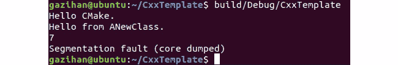

    ###### 图 1.60:终端中有错误的程序输出

    不幸的是，我们在 Eclipse 中没有得到分段错误输出，因此您必须在 Eclipse 控制台视图中检查退出值。为了找到问题，我们将在下一步中使用调试器。

10.  Press the debug toolbar button in Eclipse to start the application in debug mode. Press the resume button to continue execution. It will stop at line 40 of `SpeedCalculator.cpp`, right when an error is about to happen. If you hover over `speeds`, you realize that it is an invalid memory reference:

    

    ###### 图 1.61:无效的内存引用

11.  进一步检查后，我们意识到我们从未初始化过任何东西的`速度`指针。在我们的速度计算器功能中为它分配内存:

    ```cpp
    void SpeedCalculator::calculateAndPrintSpeedData() {
      speeds = new double[numEntries]; // add this line
      double maxSpeed = 0;
    ```

12.  Run it again. We get the following output:

    ```cpp
    Hello CMake.
    Hello from ANewClass.
    7
    CxxTemplate: SpeedCalculator.cpp:38: void SpeedCalculator::calculateAndPrintSpeedData(): Assertion `dt > 0' failed.
    ```

    请注意，这是一个断言，即代码必须确保计算出的`dt`始终大于零。这是我们确信的事情，我们希望它能帮助我们在开发过程中发现错误。Assert 语句在生产构建中被忽略，因此您可以将它们随意地放在代码中，作为在开发过程中捕捉错误的保护措施。尤其是因为与高级语言相比，C++ 缺少很多安全检查，在潜在的不安全代码中放置`断言`语句有助于捕捉错误。

13.  Let's investigate why our `dt` ended up not larger than zero. For this, we fire up the debugger again. It stops at this strange place:

    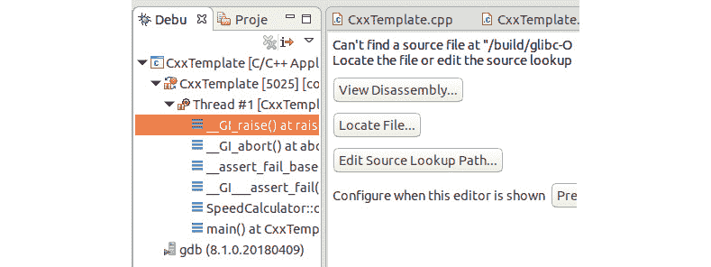

    ###### 图 1.62:调试器在没有源代码的库中停止

14.  The actual error is raised deep inside a library. However, our own functions are still on the stack and we can investigate their state at that time. Click on **SpeedCalculator** above **main** in the tree to the left:

    

    ###### 图 1.63:程序运行时的 dt 值

    看来我们的`dt`在这里变成了 **-43** (确切数值不重要)。查看**变量**视图，我们意识到`i`是 **9** ，这是我们输入数组的最后一个元素:

    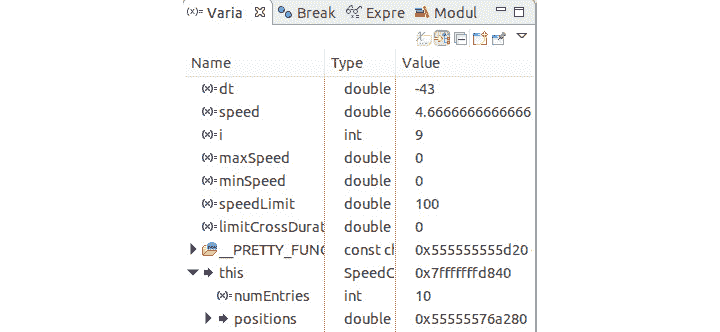

    ###### 图 1.64:变量值

    这感觉像是一个边界问题。仔细查看代码，我们意识到我们使用的是`timeseconds[10]`，这是数组中不存在的第十一个元素。进一步思考，我们意识到，当我们有 10 个位置时，我们只能有 9 个位置对减法，从而有 9 个速度。这是一个非常常见且难以捕捉的错误，因为 C++ 不会强制您留在数组中。

15.  Rework our whole code for this problem:

    ```cpp
    void SpeedCalculator::calculateAndPrintSpeedData() {
      speeds = new double[numEntries - 1];
      double maxSpeed = 0;
    ...
      for (int i = 0; i < numEntries - 1; ++ i) {
        double dt = timesInSeconds[i + 1] - timesInSeconds[i];
    ...
      for (int i = 0; i < numEntries - 1; ++ i) {
        double speed = speeds[i];
    ....
      for (int i = 0; i < numEntries - 1; ++ i) {
        double speed = speeds[i];
    ```

    最后，我们的代码似乎运行没有任何错误，正如我们在下面的输出中看到的:

    

    ###### 图 1.65:程序输出

16.  However, there is a curious point here: **Min speed** is always `0`, no matter how many times you run it. To investigate, let's put a breakpoint at the following line:

    

    ###### 图 1.66:放置断点

17.  When we debug our code, we see that it never stops here. This is obviously wrong. Upon further investigation, we realize that `minSpeed` is initially 0, and every other speed value is larger than that. We should initialize it to either something very large, or we need to get the very first element as the minimum value. Here, we choose the second approach:

    ```cpp
    for (int i = 0; i < numEntries - 1; ++ i) {
      double speed = speeds[i];
      if (i == 0 || maxSpeed < speed) { // changed
        maxSpeed = speed;
      }
      if (i == 0 || minSpeed > speed) { // changed
        minSpeed = speed;
      }
    }
    ```

    而`maxSpeed`不需要这个，保持一致就好。现在当我们运行代码时，我们看到我们不再将`0`作为我们的最小速度:

    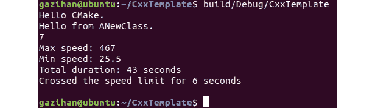

    ###### 图 1.67:程序输出

18.  Our code seems to be running fine. However, there is another mistake that we have made. When we debug our code, we see that our first elements are not zero:

    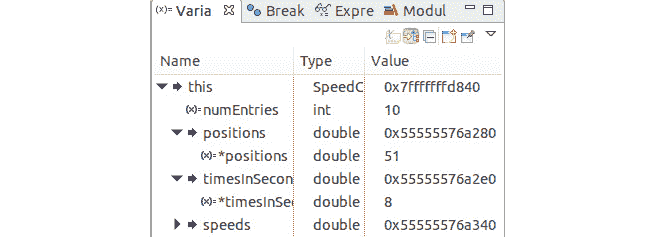

    ###### 图 1.68:变量值

19.  The pointer dereferenced the first element in the array. We had initialized elements to zero here, but they do not seem to be zero. Here is the updated code:

    ```cpp
      // add these two lines:
      timesInSeconds[0] = 0.0;
      positions[0] = 0.0;
      for (int i = 0; i < numEntries; ++ i) {
        positions[i] = positions[i - 1] + (rand() % 500);
        timesInSeconds[i] = timesInSeconds[i - 1] + ((rand() % 10) + 1);
      }
    ```

    当我们调查时，我们意识到我们从零开始循环并覆盖第一个项目。此外，我们试图访问`位置【0-1】`，这是一个错误，也是 C++ 不强制数组边界的另一个例子。当我们让循环从 1 开始时，所有这些问题都消失了:

    ```cpp
      timesInSeconds[0] = 0.0;
      positions[0] = 0.0;
      for (int i = 1; i < numEntries; ++ i) {
        positions[i] = positions[i - 1] + (rand() % 500);
        timesInSeconds[i] = timesInSeconds[i - 1] + ((rand() % 10) + 1);
      }
    ```

    以下是用更新后的代码生成的输出:

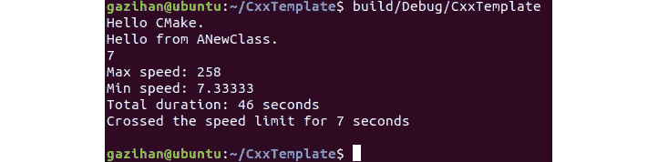

###### 图 1.69:程序输出

仅仅通过查看这段代码，我们无法区分。这些都是随机值，看起来和以前没什么不同。这样的 bug 很难发现，并且会导致随机行为，给我们留下难以跟踪的错误。您可以做些什么来避免这样的错误，包括在解引用指针时格外小心，尤其是在循环中；将代码分成函数，并为它们编写单元测试；并且自由地使用`断言`语句来执行编译器或运行时不执行的事情。

## 2A 章-不允许养鸭-类型和推导

### 活动 1:图形处理

在本练习中，我们将实现两个类(`点 3d`和`矩阵 3d`，以及乘法运算符，以便我们可以平移、缩放和旋转点。我们还将实现一些辅助方法，为转换创建必要的矩阵。按照以下步骤实施本活动:

1.  Load the prepared project from the **Lesson2A/Activity01** folder and configure the Current Builder for the project to be `CMake Build (Portable)`. Build and configure the launcher and run the unit tests (which fail). Recommend that the name that's used for the test runner is `L2AA1graphicstests`.

    #### CMake 配置

    按照*练习 1* 、*声明变量和探索大小*的*步骤 9* ，将项目配置为一个 CMake 项目。

2.  为`点 3d`类添加一个测试，以验证默认构造函数创建了一个`原点【0，0，0，1】`。
3.  打开**点 3 tests . CPP**文件，在顶部添加以下一行。
4.  Replace the failing existing test with the following test:

    ```cpp
    TEST_F(Point3dTest, DefaultConstructorIsOrigin)
    {
        Point3d pt;
        float expected[4] = {0,0,0,1};
        for(size_t i=0 ; i < 4 ; i++)
        {
            ASSERT_NEAR(expected[i], pt(i), Epsilon) << "cell [" << i << "]";
        }
    }
    ```

    这个测试需要我们写一个访问操作符。

5.  Replace the current class definition in **point3d.hpp** file with the following code:

    ```cpp
    include <cstddef>
    class Point3d
    {
    public:
        static constexpr size_t NumberRows{4};
        float operator()(const int index) const
        {
            return m_data[index];
        }
    private:
        float m_data[NumberRows];
    };
    ```

    测试现在构建并运行，但是失败了。

6.  将默认构造函数的声明添加到`点 3d`声明:

    ```cpp
    Point3d();
    ```

7.  Add the implementation to the **point3d.cpp** file:

    ```cpp
    Point3d::Point3d()
    {
        for(auto& item : m_data)
        {
            item = 0;
        }
        m_data[NumberRows-1] = 1;
    }
    ```

    测试现在构建、运行并通过。

8.  Add the next test:

    ```cpp
    TEST_F(Point3dTest, InitListConstructor3)
    {
        Point3d pt {5.2, 3.5, 6.7};
        float expected[4] = {5.2,3.5,6.7,1};
        for(size_t i=0 ; i < 4 ; i++)
        {
            ASSERT_NEAR(expected[i], pt(i), Epsilon) << "cell [" << i << "]";
        }
    }
    ```

    这个测试无法编译。因此，我们需要实现另一个构造函数——以`STD::initializer _ list<>`为参数的构造函数。

9.  在头文件中添加以下内容:

    ```cpp
    #include <initializer_list>
    ```

10.  将以下构造函数声明添加到头文件中的 Point3d 类:

    ```cpp
    Point3d(std::initializer_list<float> list);
    ```

11.  Add the following code to the implementation file. This code ignores error handling, which will be added in *Lesson 3*, *The Distance Between Can and Should – Objects, Pointers, and Inheritance*:

    ```cpp
    Point3d::Point3d(std::initializer_list<float> list)
    {
        m_data[NumberRows-1] = 1;
        int i{0};
        for(auto it1 = list.begin(); 
            i<NumberRows && it1 != list.end();
            ++ it1, ++ i)
        {
            m_data[i] = *it1;
        }
    }
    ```

    测试现在应该构建、运行并通过。

12.  Add the following test:

    ```cpp
    TEST_F(Point3dTest, InitListConstructor4)
    {
        Point3d pt {5.2, 3.5, 6.7, 2.0};
        float expected[4] = {5.2,3.5,6.7,2.0};
        for(size_t i=0 ; i < 4 ; i++)
        {
            ASSERT_NEAR(expected[i], pt(i), Epsilon) << "cell [" << i << "]";
        }
    }
    ```

    测试仍然应该构建、运行和通过。

13.  现在是时候通过将验证循环移入`点 3 测试`类中的模板化函数来重构测试用例了。在该类中添加以下模板:

    ```cpp
    template<size_t size>
    void VerifyPoint(Point3d& pt, float (&expected)[size])
    {
        for(size_t i=0 ; i< size ; i++)
        {
            ASSERT_NEAR(expected[i], pt(i), Epsilon) << "cell [" << i << "]";
        }
    }
    ```

14.  This now means that the last test can be rewritten as follows:

    ```cpp
    TEST_F(Point3dTest, InitListConstructor4)
    {
        Point3d pt {5.2, 3.5, 6.7, 2.0};
        float expected[4] = {5.2,3.5,6.7,2.0};
        VerifyPoint(pt, expected);
    }
    ```

    保持测试的可读性与产品代码的可读性一样重要。

15.  接下来，通过以下测试添加对等式和不等式运算符的支持:

    ```cpp
    TEST_F(Point3dTest, EqualityOperatorEqual)
    {
        Point3d pt1 {1,3,5};
        Point3d pt2 {1,3,5};
        ASSERT_EQ(pt1, pt2);
    }
    TEST_F(Point3dTest, EqualityOperatorNotEqual)
    {
        Point3d pt1 {1,2,3};
        Point3d pt2 {1,2,4};
        ASSERT_NE(pt1, pt2);
    }
    ```

16.  为了实现这些，在头文件中添加以下声明/定义:

    ```cpp
    bool operator==(const Point3d& rhs) const;
    bool operator!=(const Point3d& rhs) const
    {
        return !operator==(rhs);
    }
    ```

17.  现在，在。cpp 文件:

    ```cpp
    bool Point3d::operator==(const Point3d& rhs) const
    {
        for(int i=0 ; i<NumberRows ; i++)
        {
            if (m_data[i] != rhs.m_data[i])
            {
                return false;
            }
        }
        return true;
    }
    ```

18.  当我们第一次添加`点 3d`时，我们实现了一个常量访问器。添加以下测试，其中我们需要一个非常数访问器，以便我们可以将其分配给成员:

    ```cpp
    TEST_F(Point3dTest, AccessOperator)
    {
        Point3d pt1;
        Point3d pt2 {1,3,5};
        pt1(0) = 1;
        pt1(1) = 3;
        pt1(2) = 5;
        ASSERT_EQ(pt1, pt2);
    }
    ```

19.  To get this test to build, add the following accessor to the header:

    ```cpp
    float& operator()(const int index)
    {
        return m_data[index];
    }
    ```

    请注意，它返回一个引用。因此，我们可以将其分配给一个成员值。

20.  要结束`点 3d`，为默认复制构造函数和复制赋值在类声明中添加行:

    ```cpp
    Point3d(const Point3d&) = default;
    Point3d& operator=(const Point3d&) = default;
    ```

21.  现在，添加`Matrix3d`类。首先，在当前项目的顶层文件夹中创建两个空文件`matrix3d.hpp`和`matrix3d.cpp`，然后在 tests 文件夹中添加一个名为`matrix dtests . CPP`的空文件。
22.  打开顶部文件夹中的 CmakeLists.txt 文件，将 **matrix3d.cpp** 添加到以下行:

    ```cpp
    add_executable(graphics point3d.cpp main.cpp matrix3d.cpp)
    ```

23.  Open the **CMakeLists.txt** file in the **tests** folder, add `../matrix3d.cpp` to the definition of `SRC_FILES`, and add **matrix3dTests.cpp** to the definition of `TEST_FILES`:

    ```cpp
    SET(SRC_FILES 
        ../matrix3d.cpp
        ../point3d.cpp)
    SET(TEST_FILES 
        matrix3dTests.cpp
        point3dTests.cpp)
    ```

    现有的`点 3d`测试仍然应该构建，运行，并且通过，如果你做了那些正确的改变。

24.  将以下测试管道添加到`矩阵 3dTests.cpp` :

    ```cpp
    #include "gtest/gtest.h"
    #include "../matrix3d.hpp"
    class Matrix3dTest : public ::testing::Test
    {
    public:
    };
    TEST_F(Matrix3dTest, DummyTest)
    {
        ASSERT_TRUE(false);
    }
    ```

25.  构建并运行测试。我们刚刚添加的测试应该会失败。
26.  Replace DummyTest with the following test in **matrix3dTests.cpp**:

    ```cpp
    TEST_F(Matrix3dTest, DefaultConstructorIsIdentity)
    {
        Matrix3d mat;
        for( int row{0} ; row<4 ; row++)
            for( int col{0} ; col<4 ; col++)
            {
                int expected = (row==col) ? 1 : 0;
                ASSERT_FLOAT_EQ(expected, mat(row,col)) << "cell[" << row << "][" << col << "]";
            }
    }
    ```

    构建测试将会失败，因为我们还没有定义`Matrix3d`类。我们现在将在 **matrix3d.hpp** 中进行此操作。

27.  Add the following definition to **matrix3d.hpp**:

    ```cpp
    class Matrix3d
    {
    public:
        float operator()(const int row, const int column) const
        {
            return m_data[row][column];
        }
    private:
        float m_data[4][4];
    };
    ```

    测试现在将构建，但仍然失败，因为我们没有创建一个默认的构造函数来创建一个身份矩阵。

28.  将默认构造函数的声明添加到`矩阵 3d` :

    ```cpp
    Matrix3d();
    ```

    的公共部分的头文件中
29.  Add this definition to **matrix3d.cpp**:

    ```cpp
    #include "matrix3d.hpp"
    Matrix3d::Matrix3d()
    {
        for (int i{0} ; i< 4 ; i++)
            for (int j{0} ; j< 4 ; j++)
                m_data[i][j] = (i==j);
    }
    ```

    测试现在构建并通过了。

30.  稍微重构代码，使其更易读。修改标题如下:

    ```cpp
    #include <cstddef>   // Required for size_t definition
    class Matrix3d
    {
    public:
        static constexpr size_t NumberRows{4};
        static constexpr size_t NumberColumns{4};
        Matrix3d();
        float operator()(const int row, const int column) const
        {
        return m_data[row][column];
        }
    private:
        float m_data[NumberRows][NumberColumns];
    };
    ```

31.  更新 **matrix3d.cpp** 文件以使用常量:

    ```cpp
    Matrix3d::Matrix3d()
    {
        for (int i{0} ; i< NumberRows ; i++)
            for (int j{0} ; j< NumberColumns ; j++)
                m_data[i][j] = (i==j);
    }
    ```

32.  重建测试，并确保它们仍然通过。
33.  现在，我们需要添加初始化列表构造函数。为此，添加以下测试:

    ```cpp
    TEST_F(Matrix3dTest, InitListConstructor)
    {
        Matrix3d mat{ {1,2,3,4}, {5,6,7,8},{9,10,11,12}, {13,14,15,16}};
        int expected{1};
        for( int row{0} ; row<4 ; row++)
            for( int col{0} ; col<4 ; col++, expected++)
            {
                ASSERT_FLOAT_EQ(expected, mat(row,col)) << "cell[" << row << "][" << col << "]";
            }
    }
    ```

34.  添加初始化列表支持的包含文件，并在 **matrix3d.hpp** :

    ```cpp
    #include <initializer_list>
    class Matrix3d
    {
    public:
        Matrix3d(std::initializer_list<std::initializer_list<float>> list);
    ```

    中声明构造函数
35.  最后，将构造函数的实现添加到。cpp 文件:

    ```cpp
    Matrix3d::Matrix3d(std::initializer_list<std::initializer_list<float>> list)
    {
        int i{0};
        for(auto it1 = list.begin(); i<NumberRows ; ++ it1, ++ i)
        {
            int j{0};
            for(auto it2 = it1->begin(); j<NumberColumns ; ++ it2, ++ j)
                m_data[i][j] = *it2;
        }
    }
    ```

36.  为了提高测试的可读性，在测试框架中添加一个助手方法。在`矩阵 3dTest`类中，声明如下:

    ```cpp
    static constexpr float Epsilon{1e-12};
    void VerifyMatrixResult(Matrix3d& expected, Matrix3d& actual);
    ```

37.  添加辅助方法的定义:

    ```cpp
    void Matrix3dTest::VerifyMatrixResult(Matrix3d& expected, Matrix3d& actual)
    {
        for( int row{0} ; row<4 ; row++)
            for( int col{0} ; col<4 ; col++)
            {
            ASSERT_NEAR(expected(row,col), actual(row,col), Epsilon) 
    << "cell[" << row << "][" << col << "]";
            }
    }
    ```

38.  写一个测试，将两个矩阵相乘，得到一个新的矩阵(预计用手算):

    ```cpp
    TEST_F(Matrix3dTest, MultiplyTwoMatricesGiveExpectedResult)
    {
        Matrix3d mat1{ {5,6,7,8}, {9,10,11,12}, {13,14,15,16}, {17,18,19,20}};
        Matrix3d mat2{ {1,2,3,4}, {5,6,7,8},    {9,10,11,12},  {13,14,15,16}};
        Matrix3d expected{ {202,228,254,280},
                           {314,356,398,440},
                           {426,484,542,600},
                           {538,612,686,760}};
        Matrix3d result = mat1 * mat2;
        VerifyMatrixResult(expected, result);
    }
    ```

39.  In the header file, define `operator*=`:

    ```cpp
    Matrix3d& operator*=(const Matrix3d& rhs);
    ```

    然后，实现内联版本的`运算符*`(在类声明之外):

    ```cpp
    inline Matrix3d operator*(const Matrix3d& lhs, const Matrix3d& rhs)
    {
        Matrix3d temp(lhs);
        temp *= rhs;
        return temp;
    }
    ```

40.  并实现到 **matrix3d.cpp** 文件:

    ```cpp
    Matrix3d& Matrix3d::operator*=(const Matrix3d& rhs)
    {
        Matrix3d temp;
        for(int i=0 ; i<NumberRows ; i++)
            for(int j=0 ; j<NumberColumns ; j++)
            {
                temp.m_data[i][j] = 0;
                for (int k=0 ; k<NumberRows ; k++)
                    temp.m_data[i][j] += m_data[i][k] * rhs.m_data[k][j];
            }
        *this = temp;
        return *this;
    }
    ```

41.  构建并运行测试——同样，它们应该会通过。
42.  Introduce a second helper function to the test class by declaring it in the `Matrix3dTest` class:

    ```cpp
    void VerifyMatrixIsIdentity(Matrix3d& mat);
    ```

    然后，声明它以便我们可以使用它:

    ```cpp
    void Matrix3dTest::VerifyMatrixIsIdentity(Matrix3d& mat)
    {
    for( int row{0} ; row<4 ; row++)
        for( int col{0} ; col<4 ; col++)
        {
            int expected = (row==col) ? 1 : 0;
            ASSERT_FLOAT_EQ(expected, mat(row,col)) 
                                 << "cell[" << row << "][" << col << "]";
        }
    }
    ```

43.  更新一个测试来使用它:

    ```cpp
    TEST_F(Matrix3dTest, DefaultConstructorIsIdentity)
    {
        Matrix3d mat;
        VerifyMatrixIsIdentity(mat);
    }
    ```

44.  写一个健全性检查测试:

    ```cpp
    TEST_F(Matrix3dTest, IdentityTimesIdentityIsIdentity)
    {
        Matrix3d mat;
        Matrix3d result = mat * mat;
        VerifyMatrixIsIdentity(result);
    }
    ```

45.  构建并运行测试——它们应该仍然会通过。
46.  现在，我们需要能够将点和矩阵相乘。增加以下测试:

    ```cpp
    TEST_F(Matrix3dTest, MultiplyMatrixWithPoint)
    {
        Matrix3d mat { {1,2,3,4}, {5,6,7,8},    {9,10,11,12},  {13,14,15,16}};
        Point3d pt {15, 25, 35, 45};
        Point3d expected{350, 830, 1310, 1790};
        Point3d pt2 = mat * pt;
        ASSERT_EQ(expected, pt2);
    }
    ```

47.  在 **matrix3d.hpp** 中，添加 point3d.hpp 的 include 指令，并在`Matrix3d`类声明后添加以下声明:

    ```cpp
    Point3d operator*(const Matrix3d& lhs, const Point3d& rhs);
    ```

48.  将操作员的定义添加到 **matrix3d.cpp** 文件中:

    ```cpp
    Point3d operator*(const Matrix3d& lhs, const Point3d& rhs)
    {
        Point3d pt;
        for(int row{0} ; row<Matrix3d::NumberRows ; row++)
        {
            float sum{0};
            for(int col{0} ; col<Matrix3d::NumberColumns ; col++)
            {
                sum += lhs(row, col) * rhs(col);
            }
            pt(row) = sum;
        }
        return pt;
    }
    ```

49.  构建并运行测试。他们都应该再次路过。
50.  在**矩阵 3dtests.cpp** 的顶部，添加包含文件:

    ```cpp
    #include <cmath>
    ```

51.  开始添加转换矩阵工厂方法。使用以下测试，我们将开发各种工厂方法(测试应一次添加一个):

    ```cpp
    TEST_F(Matrix3dTest, CreateTranslateIsCorrect)
    {
        Matrix3d mat = createTranslationMatrix(-0.5, 2.5, 10.0);
        Matrix3d expected {{1.0, 0.0, 0.0, -0.5},
                           {0.0, 1.0, 0.0, 2.5},
                           {0.0, 0.0, 1.0, 10.0},
                           {0.0, 0.0, 0.0, 1.0}
        };
        VerifyMatrixResult(expected, mat);
    }
    TEST_F(Matrix3dTest, CreateScaleIsCorrect)
    {
        Matrix3d mat = createScaleMatrix(3.0, 2.5, 11.0);
        Matrix3d expected {{3.0, 0.0,  0.0, 0.0},
                           {0.0, 2.5,  0.0, 0.0},
                           {0.0, 0.0, 11.0, 0.0},
                           {0.0, 0.0,  0.0, 1.0}
        };	
        VerifyMatrixResult(expected, mat);
    }
    TEST_F(Matrix3dTest, CreateRotateX90IsCorrect)
    {
        Matrix3d mat = createRotationMatrixAboutX(90.0F);
        Matrix3d expected {{1.0, 0.0,  0.0, 0.0},
                           {0.0, 0.0, -1.0, 0.0},
                           {0.0, 1.0,  0.0, 0.0},
                           {0.0, 0.0,  0.0, 1.0}
        };
        VerifyMatrixResult(expected, mat);
    }
    TEST_F(Matrix3dTest, CreateRotateX60IsCorrect)
    {
        Matrix3d mat = createRotationMatrixAboutX(60.0F);
        float sqrt3_2 = static_cast<float>(std::sqrt(3.0)/2.0);
        Matrix3d expected {{1.0, 0.0,     0.0,     0.0},
                           {0.0, 0.5,    -sqrt3_2, 0.0},
                           {0.0, sqrt3_2,  0.5,    0.0},
                           {0.0, 0.0,     0.0,     1.0}
        };
        VerifyMatrixResult(expected, mat);
    }
    TEST_F(Matrix3dTest, CreateRotateY90IsCorrect)
    {
        Matrix3d mat = createRotationMatrixAboutY(90.0F);
        Matrix3d expected {{0.0, 0.0,  1.0, 0.0},
                           {0.0, 1.0,  0.0, 0.0},
                           {-1.0, 0.0, 0.0, 0.0},
                           {0.0, 0.0,  0.0, 1.0}
        };
        VerifyMatrixResult(expected, mat);
    }
    TEST_F(Matrix3dTest, CreateRotateY60IsCorrect)
    {
        Matrix3d mat = createRotationMatrixAboutY(60.0F);
        float sqrt3_2 = static_cast<float>(std::sqrt(3.0)/2.0);
        Matrix3d expected {{0.5,      0.0,   sqrt3_2,  0.0},
                           {0.0,      1.0,    0.0,     0.0},
                           {-sqrt3_2, 0.0,    0.5,     0.0},
                           {0.0,      0.0,    0.0,     1.0}
        };
        VerifyMatrixResult(expected, mat);
    }
    TEST_F(Matrix3dTest, CreateRotateZ90IsCorrect)
    {
        Matrix3d mat = createRotationMatrixAboutZ(90.0F);
        Matrix3d expected {{0.0, -1.0,  0.0, 0.0},
                           {1.0, 0.0,  0.0, 0.0},
                           {0.0, 0.0,  1.0, 0.0},
                           {0.0, 0.0,  0.0, 1.0}
        };
        VerifyMatrixResult(expected, mat);
    }
    TEST_F(Matrix3dTest, CreateRotateZ60IsCorrect)
    {
        Matrix3d mat = createRotationMatrixAboutZ(60.0F);
        float sqrt3_2 = static_cast<float>(std::sqrt(3.0)/2.0);
        Matrix3d expected {{0.5,     -sqrt3_2,   0.0,  0.0},
                           {sqrt3_2,      0.5,   0.0,  0.0},
                           {0.0,          0.0,   1.0,  0.0},
                           {0.0,          0.0,   0.0,  1.0}
        };
        VerifyMatrixResult(expected, mat);
    }
    ```

52.  向 matrix3d 头文件添加以下声明:

    ```cpp
    Matrix3d createTranslationMatrix(float dx, float dy, float dz);
    Matrix3d createScaleMatrix(float sx, float sy, float sz);
    Matrix3d createRotationMatrixAboutX(float degrees);
    Matrix3d createRotationMatrixAboutY(float degrees);
    Matrix3d createRotationMatrixAboutZ(float degrees);
    ```

53.  在 matrix3d 实现文件的顶部，添加`#include < cmath >`。
54.  最后，将以下实现添加到`matrix3d`实现文件中:

    ```cpp
    Matrix3d createTranslationMatrix(float dx, float dy, float dz)
    {
        Matrix3d matrix;
        matrix(0, 3) = dx;
        matrix(1, 3) = dy;
        matrix(2, 3) = dz;
        return matrix;
    }
    Matrix3d createScaleMatrix(float sx, float sy, float sz)
    {
        Matrix3d matrix;
        matrix(0, 0) = sx;
        matrix(1, 1) = sy;
        matrix(2, 2) = sz;
        return matrix;
    }
    Matrix3d createRotationMatrixAboutX(float degrees)
    {
        Matrix3d matrix;
        double pi{4.0F*atan(1.0F)};
        double radians = degrees / 180.0 * pi;
        float cos_theta = static_cast<float>(cos(radians));
        float sin_theta = static_cast<float>(sin(radians));
        matrix(1, 1) =  cos_theta;
        matrix(2, 2) =  cos_theta;
        matrix(1, 2) = -sin_theta;
        matrix(2, 1) =  sin_theta;
        return matrix;
    }
    Matrix3d createRotationMatrixAboutY(float degrees)
    {
        Matrix3d matrix;
        double pi{4.0F*atan(1.0F)};
        double radians = degrees / 180.0 * pi;
        float cos_theta = static_cast<float>(cos(radians));
        float sin_theta = static_cast<float>(sin(radians));
        matrix(0, 0) =  cos_theta;
        matrix(2, 2) =  cos_theta;
        matrix(0, 2) =  sin_theta;
        matrix(2, 0) = -sin_theta;
        return matrix;
    }
    Matrix3d createRotationMatrixAboutZ(float degrees)
    {
        Matrix3d matrix;
        double pi{4.0F*atan(1.0F)};
        double radians = degrees / 180.0 * pi;
        float cos_theta = static_cast<float>(cos(radians));
        float sin_theta = static_cast<float>(sin(radians));
        matrix(0, 0) =  cos_theta;
        matrix(1, 1) =  cos_theta;
        matrix(0, 1) = -sin_theta;
        matrix(1, 0) =  sin_theta;
        return matrix;
    }
    ```

55.  为了编译并通过测试，我们需要在`matrix3d` :

    ```cpp
    float& operator()(const int row, const int column)
    {
        return m_data[row][column];
    }
    ```

    的声明中增加一个访问器
56.  再次构建并运行所有测试，以显示它们都通过了。
57.  在`point3d.hpp`中，添加`< ostream >`的 include，并在末尾的 point3d 类中添加以下好友声明:

    ```cpp
    friend std::ostream& operator<<(std::ostream& , const Point3d& );
    ```

58.  在类后写操作符的内联实现:

    ```cpp
    inline std::ostream&
    operator<<(std::ostream& os, const Point3d& pt)
    {
        const char* sep = "[ ";
        for(auto value : pt.m_data)
        {
            os << sep  << value;
            sep = ", ";
        }
        os << " ]";
        return os;
    }
    ```

59.  打开 **main.cpp** 文件，删除行:

    ```cpp
    //#define ACTIVITY1
    ```

    中的注释分隔符//号
60.  构建并运行名为`图形`的应用–您需要创建一个新的运行配置。如果您对`点 3d`和`矩阵 3d`的实现是正确的，那么程序将显示以下输出:


###### 图 2A.53:成功运行活动程序

在本练习中，我们实现了两个类，它们构成了实现三维图形渲染所需的所有操作的基础。我们使用运算符重载来实现这一点，这样 Matrix3d 和 Point3d 就可以像本地类型一样使用。这可以很容易地扩展到处理点的向量，如果我们希望操纵整个对象，这是必需的。

## 章节-2B-不允许鸭子-模板和演绎

### 活动 1:开发通用“包含”模板函数

在本练习中，我们将实现几个助手类，用于检测`std::string`类案例和`std::set`案例，然后使用它们为特定容器定制 contains 函数。按照以下步骤实施本活动:

1.  从**第 2B 课/练习 01** 文件夹加载准备好的项目。构建和配置启动器并运行单元测试(未通过一个虚拟测试)。我们建议测试跑者的名字是`L2BA1tests`。
2.  Open the **containsTests.cpp** file and replace the existing test with the following:

    ```cpp
    TEST_F(containsTest, DetectNpos)
    {
        ASSERT_TRUE(has_npos_v<std::string>);
        ASSERT_FALSE(has_npos_v<std::set<int>>);
        ASSERT_FALSE(has_npos_v<std::vector<int>>);
    }
    ```

    这个测试要求我们编写一组帮助器模板来检测容器类是否支持一个名为 NPO 的静态成员变量。

3.  Add the following code to the **contains.hpp** file:

    ```cpp
    template <class T>
    auto test_npos(int) -> decltype((void)T::npos, std::true_type{});
    template <class T>
    auto test_npos(long) -> std::false_type;
    template <class T>
    struct has_npos : decltype(test_npos<T>(0)) {};
    template< class T >
    inline constexpr bool has_npos_v = has_npos<T>::value;
    ```

    测试现在运行并通过。

4.  Add the following tests to the **containsTest.cpp** file:

    ```cpp
    TEST_F(containsTest, DetectFind)
    {
        ASSERT_TRUE((has_find_v<std::string, char>));
        ASSERT_TRUE((has_find_v<std::set<int>, int>));
        ASSERT_FALSE((has_find_v<std::vector<int>, int>));
    }
    ```

    这个测试需要我们编写一组帮助器模板来检测容器类是否有一个接受一个参数的`find()`方法。

5.  Add the following code to the **contains.hpp** file:

    ```cpp
    template <class T, class A0>
    auto test_find(int) -> 
           decltype(void(std::declval<T>().find(std::declval<A0>())), 
                                                            std::true_type{});
    template <class T, class A0>
    auto test_find(long) -> std::false_type;
    template <class T, class A0>
    struct has_find : decltype(test_find<T,A0>(0)) {};
    template< class T, class A0 >
    inline constexpr bool has_find_v = has_find<T, A0>::value;
    ```

    测试现在运行并通过。

6.  添加通用容器的实现；在这种情况下，向量。在**包含测试. cpp** 文件中写下以下测试:

    ```cpp
    TEST_F(containsTest, VectorContains)
    {
        std::vector<int> container {1,2,3,4,5};
        ASSERT_TRUE(contains(container, 5));
        ASSERT_FALSE(contains(container, 15));
    }
    ```

7.  Add the basic implementation of `contains` to the **contains.hpp** file:

    ```cpp
    template<class C, class T>
    auto contains(const C& c, const T& key) -> decltype(std::end(c), true)
    {
            return std::end(c) != std::find(begin(c), end(c), key);
    }
    ```

    测试现在运行并通过。

8.  下一步是将`设置`特例的测试添加到**包含测试. cpp** :

    ```cpp
    TEST_F(containsTest, SetContains)
    {
        std::set<int> container {1,2,3,4,5};
        ASSERT_TRUE(contains(container, 5));
        ASSERT_FALSE(contains(container, 15));
    }
    ```

9.  The implementation of `contains` is updated to test for the built-in `set::find()` method:

    ```cpp
    template<class C, class T>
    auto contains(const C& c, const T& key) -> decltype(std::end(c), true)
    {
        if constexpr(has_find_v<C, T>)
        {
            return std::end(c) != c.find(key);
        }
        else
        {
            return std::end(c) != std::find(begin(c), end(c), key);
        }
    }
    ```

    测试现在运行并通过。

10.  将`字符串`特例的测试添加到**包含测试. cpp** 文件:

    ```cpp
    TEST_F(containsTest, StringContains)
    {
        std::string container{"This is the message"};
        ASSERT_TRUE(contains(container, "the"));
        ASSERT_TRUE(contains(container, 'm'));
        ASSERT_FALSE(contains(container, "massage"));
        ASSERT_FALSE(contains(container, 'z'));
    }
    ```

11.  Add the following implementation of `contains` to test for the presence of `npos` and tailor the use of the `find()` method:

    ```cpp
    template<class C, class T>
    auto contains(const C& c, const T& key) -> decltype(std::end(c), true)
    {
        if constexpr(has_npos_v<C>)
        {
            return C::npos != c.find(key);
        }
        else
        if constexpr(has_find_v<C, T>)
        {
            return std::end(c) != c.find(key);
        }
        else
        {
            return std::end(c) != std::find(begin(c), end(c), key);
        }
    }
    ```

    测试现在运行并通过。

12.  构建和运行名为`的应用包含`。创建新的运行配置。如果 contains 模板的实现是正确的，那么程序将显示以下输出:


###### 图 2B.36:成功实现包含的输出

在本练习中，我们结合 SFINAE 使用了各种模板技术，根据包含类的能力选择合适的`contains()`函数的实现。我们本可以使用一个通用的模板函数和一些专门的模板来达到同样的结果，但是我们选择了一条更少的道路，并展示了我们新发现的模板技能。

## 第三章——能与应的距离——对象、指针和继承

### 活动 1:用 RAII 和 Move 实现图形处理

在本练习中，我们将开发之前的`Matrix3d`和`Point3d`类，以使用`unique_ptr < >`来管理与实现这些图形类所需的数据结构相关联的内存。让我们开始吧:

1.  从**第 3 课/练习 01** 文件夹加载准备好的项目，并将项目的当前构建器配置为 **CMake Build(可移植)**。构建和配置启动器并运行单元测试。我们建议测试跑者的名字是 **L3A1graphicstests** 。
2.  Open **point3d.hpp** and add the lines marked with a comment to the file:

    ```cpp
    // ... lines omitted
    #include <initializer_list>
    #include <ostream>
    namespace acpp::gfx { // Add this line
    class Point3d
    {
    // ... lines omitted
    };
    } // Add this line
    ```

    请注意，添加到文件末尾的右大括号没有右分号。嵌套命名空间语法`acpp::gfx`，是 C++ 17 的一个新特性。以前，它需要两次明确使用`名称空间`关键字。另外，请注意，为了有所帮助，友好的邻居 IDE 可能会在您放入名称空间声明的行之后插入右大括号。

3.  对 **matrix3d.hpp** 、 **matrix3d.cpp** 和 **point3d.cpp** 重复相同的处理-确保包含文件不包含在命名空间的范围内。
4.  在相应的文件( **main.cpp** 、 **matrix3dTests.cpp** 和**point 3 tests . CPP**中，在完成#include 指令后，插入以下行:

    ```cpp
    using namespace acpp::gfx;
    ```

5.  现在，运行所有测试。所有 **18** 现有测试应再次通过。我们已经成功地将我们的类放入了一个命名空间。
6.  现在我们将继续转换`Matrix3d`类来使用堆分配的内存。在 **matrix3d.hpp** 文件中，添加一个`#include <内存>`行，让我们访问`unique_ptr < >`模板。
7.  接下来，更改`m_data`的申报类型:

    ```cpp
    std::unique_ptr<float[]> m_data;
    ```

8.  From this point forward, we will use the compiler and its errors to give us hints as to what needs fixing. Attempting to build the tests now reveals that we have a problem with the following two methods in the header file

    ```cpp
    float operator()(const int row, const int column) const
    {
        return m_data[row][column];
    }
    float& operator()(const int row, const int column)
    {
        return m_data[row][column];
    } 
    ```

    这里的问题是`unique_ptr`持有一个指向一维数组而不是二维数组的指针。因此，我们需要将行和列转换成一个索引。

9.  添加一个名为`get_index()`的新方法，从行和列中获取一维索引，并更新前面的函数来使用它:

    ```cpp
    float operator()(const int row, const int column) const
    {
        return m_data[get_index(row,column)];
    }
    float& operator()(const int row, const int column)
    {
        return m_data[get_index(row,column)];
    }
    private:
    size_t get_index(const int row, const int column) const
    {
        return row * NumberColumns + column;
    }
    ```

10.  重新编译后，编译器的下一个错误引用了以下内联函数:

    ```cpp
    inline Matrix3d operator*(const Matrix3d& lhs, const Matrix3d& rhs)
    {
        Matrix3d temp(lhs);   // <=== compiler error – ill formed copy constructor
        temp *= rhs;
        return temp;
    }
    ```

11.  Whereas before, the default copy constructor was sufficient for our purposes, it just did a shallow copy of all the elements of the array and that was correct. We now have indirection to the data we need to copy and so we need to implement a deep copy constructor and copy assignment. We will also need to address the existing constructors. For now, just add the constructor declarations to the class (adjacent to the other constructors):

    ```cpp
    Matrix3d(const Matrix3d& rhs);
    Matrix3d& operator=(const Matrix3d& rhs);
    ```

    尝试构建测试将会显示我们已经解决了头文件中的所有问题，并且我们可以进入实现文件。

12.  修改两个构造函数初始化`unique_ptr`如下:

    ```cpp
    Matrix3d::Matrix3d() : m_data{new float[NumberRows*NumberColumns]}
    {
        for (int i{0} ; i< NumberRows ; i++)
            for (int j{0} ; j< NumberColumns ; j++)
                m_data[i][j] = (i==j);
    }
    Matrix3d::Matrix3d(std::initializer_list<std::initializer_list<float>> list)
        : m_data{new float[NumberRows*NumberColumns]}
    {
        int i{0};
        for(auto it1 = list.begin(); i<NumberRows ; ++ it1, ++ i)
        {
            int j{0};
            for(auto it2 = it1->begin(); j<NumberColumns ; ++ it2, ++ j)
                m_data[i][j] = *it2;
        }
    }
    ```

13.  我们现在需要解决一维数组查找问题。我们需要用`m_data[get_index(i，j)]`来更改`m_data[i][j]`类型的语句。将默认构造函数改为如下内容:

    ```cpp
    Matrix3d::Matrix3d() : m_data{new float[NumberRows*NumberColumns]}
    {
        for (int i{0} ; i< NumberRows ; i++)
            for (int j{0} ; j< NumberColumns ; j++)
                m_data[get_index(i, j)] = (i==j);          // <= change here
    }
    ```

14.  将初始化列表构造函数改为如下:

    ```cpp
    Matrix3d::Matrix3d(std::initializer_list<std::initializer_list<float>> list)
          : m_data{new float[NumberRows*NumberColumns]}
    {
        int i{0};
        for(auto it1 = list.begin(); i<NumberRows ; ++ it1, ++ i)
        {
            int j{0};
            for(auto it2 = it1->begin(); j<NumberColumns ; ++ it2, ++ j)
                m_data[get_index(i, j)] = *it2;         // <= change here
        }
    }
    ```

15.  更改乘法运算符，注意索引:

    ```cpp
    Matrix3d& Matrix3d::operator*=(const Matrix3d& rhs)
    {
        Matrix3d temp;
        for(int i=0 ; i<NumberRows ; i++)
            for(int j=0 ; j<NumberColumns ; j++)
            {
                temp.m_data[get_index(i, j)] = 0;        // <= change here
                for (int k=0 ; k<NumberRows ; k++)
                    temp.m_data[get_index(i, j)] += m_data[get_index(i, k)] 
                                              * rhs.m_data[get_index(k, j)];
                                                         // <= change here
            }
        *this = temp;
        return *this;
    }
    ```

16.  有了这些改变，我们已经修复了所有的编译器错误，但是现在我们有一个链接器错误要处理——复制构造函数，我们只在步骤 11 中声明了回来。
17.  在 **matrix3d.cpp** 文件中添加以下定义:

    ```cpp
    Matrix3d::Matrix3d(const Matrix3d& rhs) : 
        m_data{new float[NumberRows*NumberColumns]}
    {
        *this = rhs;
    }
    Matrix3d& Matrix3d::operator=(const Matrix3d& rhs)
    {
        for(int i=0 ; i< NumberRows*NumberColumns ; i++)
            m_data[i] = rhs.m_data[i];
        return *this;
    }
    ```

18.  测试将会建立，所有测试都将通过。下一步是强制移动构造函数。在 **matrix3d.cpp** 中找到`createTranslationMatrix()`方法，并将返回语句更改如下:

    ```cpp
    return std::move(matrix);
    ```

19.  在**矩阵 3d.hpp** 中声明`移动`构造函数。

    ```cpp
    Matrix3d(Matrix3d&& rhs);
    ```

20.  重建测试。现在，我们得到一个与移动构造函数不存在相关的错误。
21.  将构造器的实现添加到 **matrix3d.cpp** 中，并重新构建测试。

    ```cpp
    Matrix3d::Matrix3d(Matrix3d&& rhs)
    {
        //std::cerr << "Matrix3d::Matrix3d(Matrix3d&& rhs)\n";
        std::swap(m_data, rhs.m_data);
    }
    ```

22.  重建并运行测试。他们又都过去了。
23.  Just to confirm that the move constructor is being called, add `#include <iostream>` to **matrix3d.cpp**, remove the comment from the output line in the move constructor. and re-run the test. It will report an error after the tests have completed because we sent it to the standard error channel (`cerr`). After the check, make the line a comment again.

    #### 注意

    关于移动构造函数，只需简单说明一下——我们没有像对其他构造函数那样显式初始化`m_data`。这意味着它将被初始化为空，然后与传入的参数交换，这是一个临时参数，因此在事务后不保存数组是可以接受的——它删除了一次内存分配和释放。

24.  现在让我们转换`Point3d`类，以便它可以使用堆分配的内存。在 **point3d.hpp** 文件中，添加一个`#include <内存>`行，这样我们就可以访问`unique_ptr < >`模板。
25.  接下来，将`m_data`的声明类型更改为如下所示:

    ```cpp
    std::unique_ptr<float[]> m_data;
    ```

26.  编译器现在告诉我们插入操作符(< point3d.hpp 有问题，因为我们不能在 **unique_ptr** 上使用 ranged-for:用以下内容替换实现:

    ```cpp
    inline std::ostream&
    operator<<(std::ostream& os, const Point3d& pt)
    {
        const char* sep = "[ ";
        for(int i{0} ; i < Point3d::NumberRows ; i++)
        {
            os << sep << pt.m_data[i];
            sep = ", ";
        }
        os << " ]";
        return os;
    } 
    ```

27.  打开**点 3d.cpp** 并修改默认构造函数来初始化`unique_ptr`并更改初始化循环，因为在`unique_ptr` :

    ```cpp
    Point3d::Point3d() : m_data{new float[NumberRows]}
    {
        for(int i{0} ; i < NumberRows-1 ; i++) {
            m_data[i] = 0;
        }
        m_data[NumberRows-1] = 1;
    }
    ```

    上不能使用 ranged for
28.  通过初始化`唯一 _ptr` :

    ```cpp
    Point3d::Point3d(std::initializer_list<float> list)
                : m_data{new float[NumberRows]}
    ```

    来修改其他构造函数
29.  现在所有的测试都运行并通过了，就像以前一样。
30.  现在，如果我们运行原始应用 **L3graphics** ，那么输出将与原始应用相同，但是实现使用 RAII 来分配和管理用于矩阵和点的内存。


###### 图 3.52:成功转换为使用 RAII 后的活动 1 输出

## 活动 2:实现日期计算的类

在这个活动中，我们将实现两个类，`日期`和`天数`，这将使我们很容易处理日期和它们之间的时间差。让我们开始吧:

1.  从**第 3 课/练习 02** 文件夹加载准备好的项目，并将项目的当前构建器配置为 **CMake Build(可移植)**。构建和配置启动器并运行单元测试。我们建议测试跑者的名字是 **L3A2datetests** 。该项目有虚拟文件和一个失败的测试。
2.  在编辑器中打开 **date.hpp** 文件，并在基本`Date`类中添加以下行，以允许访问存储的值:

    ```cpp
    int Day()   const {return m_day;}
    int Month() const {return m_month;}
    int Year()  const {return m_year;}
    ```

3.  Open the **dateTests.cpp** file and add the following code to the `DateTest` class:

    ```cpp
    void VerifyDate(const Date& dt, int yearExp, int monthExp, int dayExp) const
    {
        ASSERT_EQ(dayExp, dt.Day());
        ASSERT_EQ(monthExp, dt.Month());
        ASSERT_EQ(yearExp, dt.Year());
    }
    ```

    通常，随着测试的发展，您会重构这个测试，但是我们会提前把它拿出来。

4.  将现有测试中的`ASSERT_FALSE()`替换为以下测试:

    ```cpp
    Date dt;
    VerifyDate(dt, 1970, 1, 1);
    ```

5.  重建并运行测试——它们现在应该都通过了。
6.  增加以下测试:

    ```cpp
    TEST_F(DateTest, Constructor1970Jan2)
    {
        Date dt(2, 1, 1970);
        VerifyDate(dt, 1970, 1, 2);
    }
    ```

7.  为了进行这个测试，我们需要在`日期`类中添加以下两个构造函数:

    ```cpp
    Date() = default;
    Date(int day, int month, int year) :
            m_year{year}, m_month{month}, m_day{day}
    {
    }
    ```

8.  我们现在需要引入转换为/从`日期 _t`类型的函数。将以下别名添加到我们名称空间内的 **date.hpp** 文件中:

    ```cpp
    using date_t=int64_t;
    ```

9.  在`日期`类中，添加以下方法的声明:

    ```cpp
    date_t ToDateT() const;
    ```

10.  然后，添加以下测试:

    ```cpp
    TEST_F(DateTest, ToDateTDefaultIsZero)
    {
        Date dt;
        ASSERT_EQ(0, dt.ToDateT());
    }
    ```

11.  当我们在做(`TDD`)时，我们添加了方法的最小实现来通过测试。

    ```cpp
    date_t Date::ToDateT() const
    {
        return 0;
    }
    ```

12.  现在，我们添加下一个测试:

    ```cpp
    TEST_F(DateTest, ToDateT1970Jan2Is1)
    {
        Date dt(2, 1, 1970);
        ASSERT_EQ(1, dt.ToDateT());
    }
    ```

13.  我们继续添加一个又一个测试，一直在`today te()`中细化算法，先处理`1970`中的日期，然后`1-1971 年 1 月`中的日期，然后是`1973`中的日期，这意味着我们跨越了一个闰年，以此类推。用于开发`TodayTet()`方法的全套测试如下:

    ```cpp
    TEST_F(DateTest, ToDateT1970Dec31Is364)
    {
        Date dt(31, 12, 1970);
        ASSERT_EQ(364, dt.ToDateT());
    }
    TEST_F(DateTest, ToDateT1971Jan1Is365)
    {
        Date dt(1, 1, 1971);
        ASSERT_EQ(365, dt.ToDateT());
    }
    TEST_F(DateTest, ToDateT1973Jan1Is1096)
    {
        Date dt(1, 1, 1973);
        ASSERT_EQ(365*3+1, dt.ToDateT());
    }
    TEST_F(DateTest, ToDateT2019Aug28Is18136)
    {
        Date dt(28, 8, 2019);
        ASSERT_EQ(18136, dt.ToDateT());
    }
    ```

14.  为了通过所有这些测试，我们在`日期`类别的申报中添加了以下项目:

    ```cpp
    public:
        static constexpr int EpochYear = 1970;
        static constexpr int DaysPerCommonYear = 365;
        static constexpr int YearsBetweenLeapYears = 4;
    private:
        int GetDayOfYear(int day, int month, int year) const;
        bool IsLeapYear(int year) const;
        int CalcNumberLeapYearsFromEpoch(int year) const;
    ```

15.  `today Tet()`**date . CPP**的实施及配套方式如下:

    ```cpp
    namespace {
    int daysBeforeMonth[2][12] =
    {
        { 0, 31, 59, 90, 120, 151, 181, 212, 243, 273, 204, 334}, // Common Year
        { 0, 31, 50, 91, 121, 152, 182, 213, 244, 274, 205, 335}  // Leap Year
    };
    }
    namespace acpp::date
    {
    int Date::CalcNumberLeapYearsFromEpoch(int year) const
    {
        return (year-1)/YearsBetweenLeapYears
                                       - (EpochYear-1)/YearsBetweenLeapYears;
    }
    int Date::GetDayOfYear(int day, int month, int year) const
    {
        return daysBeforeMonth[IsLeapYear(year)][month-1] + day;
    }
    bool Date::IsLeapYear(int year) const
    {
        return (year%4)==0;   // Not full story, but good enough to 2100
    }
    date_t Date::ToDateT() const
    {
        date_t value = GetDayOfYear(m_day, m_month, m_year) - 1;
        value += (m_year-EpochYear) * DaysPerCommonYear;
        date_t numberLeapYears = CalcNumberLeapYearsFromEpoch(m_year);
        value += numberLeapYears;
        return value;
    }
    }
    ```

16.  现在`todayt()`工作了，我们转到它的逆，也就是`FromDateT()`。同样，我们一次建立一个测试来开发一系列日期的算法。使用了以下测试:

    ```cpp
    TEST_F(DateTest, FromDateT0Is1Jan1970)
    {
        Date dt;
        dt.FromDateT(0);
        ASSERT_EQ(0, dt.ToDateT());
        VerifyDate(dt, 1970, 1, 1);
    }
    TEST_F(DateTest, FromDateT1Is2Jan1970)
    {
        Date dt;
        dt.FromDateT(1);
        ASSERT_EQ(1, dt.ToDateT());
        VerifyDate(dt, 1970, 1, 2);
    }
    TEST_F(DateTest, FromDateT364Is31Dec1970)
    {
        Date dt;
        dt.FromDateT(364);
        ASSERT_EQ(364, dt.ToDateT());
        VerifyDate(dt, 1970, 12, 31);
    }
    TEST_F(DateTest, FromDateT365Is1Jan1971)
    {
        Date dt;
        dt.FromDateT(365);
        ASSERT_EQ(365, dt.ToDateT());
        VerifyDate(dt, 1971, 1, 1);
    }
    TEST_F(DateTest, FromDateT1096Is1Jan1973)
    {
        Date dt;
        dt.FromDateT(1096);
        ASSERT_EQ(1096, dt.ToDateT());
        VerifyDate(dt, 1973, 1, 1);
    }
    TEST_F(DateTest, FromDateT18136Is28Aug2019)
    {
        Date dt;
        dt.FromDateT(18136);
        ASSERT_EQ(18136, dt.ToDateT());
        VerifyDate(dt, 2019, 8, 28);
    }
    ```

17.  在头文件中添加以下声明:

    ```cpp
    public:
        void FromDateT(date_t date);
    private:
        int CalcMonthDayOfYearIsIn(int dayOfYear, bool IsLeapYear) const;
    ```

18.  使用以下实现，因为前面的测试一次添加一个:

    ```cpp
    void Date::FromDateT(date_t date)
    {
        int number_years = date / DaysPerCommonYear;
        date = date - number_years * DaysPerCommonYear;
        m_year = EpochYear + number_years;
        date_t numberLeapYears = CalcNumberLeapYearsFromEpoch(m_year);
        date -= numberLeapYears;
        m_month = CalcMonthDayOfYearIsIn(date, IsLeapYear(m_year));
        date -= daysBeforeMonth[IsLeapYear(m_year)][m_month-1];
        m_day = date + 1;
    }
    int Date::CalcMonthDayOfYearIsIn(int dayOfYear, bool isLeapYear) const
    {
        for(int i = 1 ; i < 12; i++)
        {
        if ( daysBeforeMonth[isLeapYear][i] > dayOfYear)
                return i;
        }
        return 12;
    }
    ```

19.  现在我们已经准备好了支持例程，我们可以实现两个日期之间的`日期`类差异的真正特征，并通过添加天数来确定新的日期。这两个操作都需要一个新的类型(类)`天`。
20.  在表头`日期`上方增加`天数`如下执行:

    ```cpp
    class Days
    {
    public:
        Days() = default;
        Days(int days) : m_days{days}     {    }
        operator int() const
        {
            return m_days;
        }
    private:
        int m_days{0};
    };
    ```

21.  第一个操作符是将`日`添加到`日`。添加以下方法声明(在`日期`类的公共部分内):

    ```cpp
    Date& operator+=(const Days& day);
    ```

22.  然后，将内联实现(在`日期`类之外)添加到头文件:

    ```cpp
    inline Date operator+(const Date& lhs, const Days& rhs )
    {
        Date tmp(lhs);
        tmp += rhs;
        return tmp;
    }
    ```

23.  编写以下测试以验证`总和`操作:

    ```cpp
    TEST_F(DateTest, AddZeroDays)
    {
        Date dt(28, 8, 2019);
        Days days;
        dt += days;
        VerifyDate(dt, 2019, 8, 28);
    }
    TEST_F(DateTest, AddFourDays)
    {
        Date dt(28, 8, 2019);
        Days days(4);
        dt += days;
        VerifyDate(dt, 2019, 9, 1);
    }
    ```

24.  `sum`操作的实际实现简单基于两种支持方式

    ```cpp
    Date& Date::operator+=(const Days& day)
    {
        FromDateT(ToDateT()+day);
        return *this;
    }
    ```

25.  增加以下测试:

    ```cpp
    TEST_F(DateTest, AddFourDaysAsInt)
    {
        Date dt(28, 8, 2019);
        dt += 4;
        VerifyDate(dt, 2019, 9, 1);
    }
    ```

26.  当我们运行测试时，它们都构建好了，这个测试通过了。但这不是理想的结果。我们不希望他们能够在我们的日期上加上整数。(未来的版本可能会增加月份和年份，那么增加一个整数意味着什么呢？).为了避免构建失败，我们将 Days 构造函数改为`显式` :

    ```cpp
    explicit Days(int days) : m_days{days}     {    }
    ```

27.  Now the build fails, so we need to fix the test by changing the addition line to cast to `Days` as follows:

    ```cpp
    dt += static_cast<Days>(4);
    ```

    所有测试都应该再次通过。

28.  我们想要的最后一个功能是两个日期之间的差异。以下是用于验证实现的测试:

    ```cpp
    TEST_F(DateTest, DateDifferences27days)
    {
        Date dt1(28, 8, 2019);
        Date dt2(1, 8, 2019);
        Days days = dt1 - dt2;
        ASSERT_EQ(27, (int)days);
    }
    TEST_F(DateTest, DateDifferences365days)
    {
        Date dt1(28, 8, 2019);
        Date dt2(28, 8, 2018);
        Days days = dt1 - dt2;
        ASSERT_EQ(365, (int)days);
    }
    ```

29.  在头文件`日期`类的公共部分添加以下函数声明:

    ```cpp
    Days operator-(const Date& rhs) const;
    ```

30.  Add the following code after the Date class in the header file:

    ```cpp
    inline Days Date::operator-(const Date& rhs) const
    {
        return Days(ToDateT() - rhs.ToDateT());
    }
    ```

    因为我们将`Days`构造函数显式化了，所以我们必须在 return 语句中调用它。随着所有这些变化的到位，所有的测试都应该通过。

31.  将`L3A2date`配置为`datetools`二进制，在编辑器中打开 main.cpp。从`活动 2`的定义中删除注释:

    ```cpp
    #define ACTIVITY2
    ```

32.  构建并运行示例应用。这将产生以下输出:

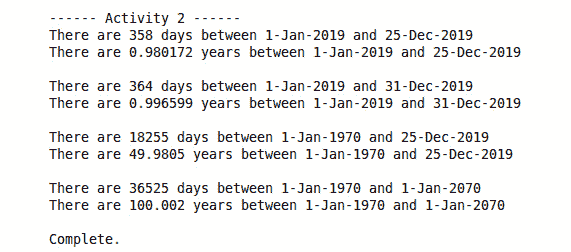

###### 图 3.53:成功的日期示例应用的输出

我们已经实现了日期和天数类的所有要求，并通过单元测试交付了它们。单元测试允许我们实现增量功能来构建两个复杂的算法，即`todayt`和`FromDateT`，它们形成了对我们想要交付的功能的底层支持。

## 第 4 章-关注点分离-软件架构、功能、可变模板

### 活动 1:实现多播事件处理程序

1.  从**第 4 课/练习 01** 文件夹加载准备好的项目，并将项目的当前构建器配置为可移植构建。构建项目，配置启动器并运行单元测试(未通过一个虚拟测试)。推荐测试运行者的名字为 *L4delegateTests* 。
2.  在**委托测试. cpp** 中，用以下测试替换失败的虚拟测试:

    ```cpp
    TEST_F(DelegateTest, BasicDelegate)
    {
        Delegate delegate;
        ASSERT_NO_THROW(delegate.Notify(42));
    }
    ```

3.  This now fails to build, so we need to add a new method to `Delegate`. As this will evolve into a template, we will do all of this development in the header file. In **delegate.hpp**, and the following definition:

    ```cpp
    class Delegate
    {
    public:
        Delegate() = default;
        void Notify(int value) const
        {
        }
    };
    ```

    测试现在运行并通过。

4.  在现有测试中添加以下行:

    ```cpp
    ASSERT_NO_THROW(delegate(22));
    ```

5.  Again, the build fails, so we update the `Delegate` definition as follows (we could have had Notify call `operator()`, but this is easier to read):

    ```cpp
    void operator()(int value)
    {
        Notify(value);
    }
    ```

    测试再次运行并通过。

6.  在添加下一个测试之前，我们将添加一些基础设施来帮助我们开发测试。处理程序最简单的方法是让它们写入`std::cout`，为了能够验证它们被调用，我们需要捕获输出。为此，通过更改`DelegateTest`类将标准输出流重新路由到不同的缓冲区，如下所示:

    ```cpp
    class DelegateTest : public ::testing::Test
    {
    public:
        void SetUp() override;
        void TearDown() override;
        std::stringstream m_buffer;
        // Save cout's buffer here
        std::streambuf *m_savedBuf{};
    };
    void DelegateTest::SetUp()
    {
        // Save the cout buffer
        m_savedBuf = std::cout.rdbuf();
        // Redirect cout to our buffer
        std::cout.rdbuf(m_buffer.rdbuf());
    }
    void DelegateTest::TearDown()
    {
        // Restore cout buffer to original
        std::cout.rdbuf(m_savedBuf);
    }
    ```

7.  同时将`<>``<>`和`<字符串>`的 include 语句添加到文件顶部。
8.  有了这个支持框架，添加以下测试:

    ```cpp
    TEST_F(DelegateTest, SingleCallback)
    {
        Delegate delegate;
        delegate += [] (int value) { std::cout << "value = " << value; };
        delegate.Notify(42);
        std::string result = m_buffer.str();
        ASSERT_STREQ("value = 42", result.c_str());
    }
    ```

9.  To make the tests build and run again, add the following code in the **delegate.h** class:

    ```cpp
    Delegate& operator+=(const std::function<void(int)>& delegate)
    {
        m_delegate = delegate;
        return *this;
    }
    ```

    以及以下代码:

    ```cpp
    private:
        std::function<void(int)> m_delegate;
    ```

    测试正在构建，但是我们的新测试失败了。

10.  将`通知()`方法更新为:

    ```cpp
    void Notify(int value) const
    {
        m_delegate(value);
    }
    ```

11.  The tests now build and our new test passes, but the original test now fails. The call to the delegate is throwing an exception, so we need to check that the delegate is not empty before calling it. Write the following code to do this:

    ```cpp
    void Notify(int value) const
    {
        if(m_delegate)
            m_delegate(value);
    }
    ```

    所有的测试现在运行并通过。

12.  我们现在需要向`代理`类添加多播支持。添加新测试:

    ```cpp
    TEST_F(DelegateTest, DualCallbacks)
    {
        Delegate delegate;
        delegate += [] (int value) { std::cout << "1: = " << value << "\n"; };
        delegate += [] (int value) { std::cout << "2: = " << value << "\n"; };
        delegate.Notify(12);
        std::string result = m_buffer.str();
        ASSERT_STREQ("1: = 12\n2: = 12\n", result.c_str());
    }
    ```

13.  Of course, this test now fails because the `operator+=()` only assigns to the member variable. We need to add a list to store our delegates. We choose vector so we can add to the end of the list as we want to call the delegates in the order that they are added. Add `#include <vector>` to the top of **delegate.hpp** and update Delegate replace **m_delegate** with **m_delegates** vector of the callbacks:

    ```cpp
    class Delegate
    {
    public:
        Delegate() = default;
        Delegate& operator+=(const std::function<void(int)>& delegate)
        {
            m_delegates.push_back(delegate);
            return *this;
        }
        void Notify(int value) const
        {
            for(auto& delegate : m_delegates)
            {
                delegate(value);
            }
        }
        void operator()(int value)
        {
            Notify(value);
        }
    private:
        std::vector<std::function<void(int)>> m_delegates;
    };
    ```

    测试全部运行并再次通过。

14.  我们现在已经实现了基本的多播`委托`类。我们现在需要将其转换为基于模板的类。通过将三个测试中`委托`的所有声明更改为`委托< int >`，更新现有测试。
15.  现在更新 Delegate 类，在类前添加`模板<类 Arg >`将其转换为模板，并用`Arg` :

    ```cpp
    template<class Arg>
    class Delegate
    {
    public:
        Delegate() = default;
        Delegate& operator+=(const std::function<void(Arg)>& delegate)
        {
            m_delegates.push_back(delegate);
            return *this;
        }
        void Notify(Arg value) const
        {
            for(auto& delegate : m_delegates)
            {
                delegate(value);
            }
        }
        void operator()(Arg value)
        {
            Notify(value);
        }
    private:
        std::vector<std::function<void(Arg)>> m_delegates;
    };
    ```

    替换四次出现的`int`
16.  所有测试现在都像以前一样运行并通过，所以它仍然适用于处理程序的`int`参数。
17.  添加以下测试并重新运行测试，以确认模板转换正确:

    ```cpp
    TEST_F(DelegateTest, DualCallbacksString)
    {
        Delegate<std::string&> delegate;
        delegate += [] (std::string value) { std::cout << "1: = " << value << "\n"; };
        delegate += [] (std::string value) { std::cout << "2: = " << value << "\n"; };
        std::string hi{"hi"};
        delegate.Notify(hi);
        std::string result = m_buffer.str();
        ASSERT_STREQ("1: = hi\n2: = hi\n", result.c_str());
    }
    ```

18.  Now it operates as a template that takes one argument. We need to convert it into a variadic template that takes zero or more arguments. Using the information from the last topic, update the template to the following:

    ```cpp
    template<typename... ArgTypes>
    class Delegate
    {
    public:
        Delegate() = default;
        Delegate& operator+=(const std::function<void(ArgTypes...)>& delegate)
        {
            m_delegates.push_back(delegate);
            return *this;
        }
        void Notify(ArgTypes&&... args) const
        {
            for(auto& delegate : m_delegates)
            {
                delegate(std::forward<ArgTypes>(args)...);
            }
        }
        void operator()(ArgTypes&&... args)
        {
            Notify(std::forward<ArgTypes>(args)...);
        }
    private:
        std::vector<std::function<void(ArgTypes...)>> m_delegates;
    };
    ```

    测试应该仍然运行并通过。

19.  Add two more tests – zero argument test, and a mutliple argument test:

    ```cpp
    TEST_F(DelegateTest, DualCallbacksNoArgs)
    {
        Delegate delegate;
        delegate += [] () { std::cout << "CB1\n"; };
        delegate += [] () { std::cout << "CB2\n"; };
        delegate.Notify();
        std::string result = m_buffer.str();
        ASSERT_STREQ("CB1\nCB2\n", result.c_str());
    }
    TEST_F(DelegateTest, DualCallbacksStringAndInt)
    {
        Delegate<std::string&, int> delegate;
        delegate += [] (std::string& value, int i) {
                std::cout << "1: = " << value << "," << i << "\n"; };
        delegate += [] (std::string& value, int i) {
            std::cout << "2: = " << value << "," << i << "\n"; };
        std::string hi{"hi"};
        delegate.Notify(hi, 52);
        std::string result = m_buffer.str();
        ASSERT_STREQ("1: = hi,52\n2: = hi,52\n", result.c_str());
    }
    ```

    所有测试运行并通过，表明我们现在已经实现了期望的`委托`类。

20.  Now, change the Run configuration to execute the program `L4delegate`. Open the **main.cpp** file in the editor and change the definition at the top of the file to the following and run the program:

    ```cpp
    #define ACTIVITY_STEP 27
    ```

    我们得到以下输出:

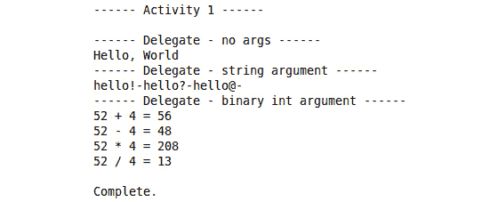

###### 图 4.35:成功实现委托的输出

在本练习中，我们首先实现了一个提供基本单委托功能的类，然后添加了多播功能。有了这个实现，单元测试就位，我们能够快速地转换成一个带有一个参数的模板，然后转换成一个可变的模板版本。根据您正在开发的功能，特定实现过渡到通用形式，然后再过渡到更通用形式的方法是正确的。可变模板的开发并不总是显而易见的。

## 第 5 章——哲学家的晚餐——线程和并发

### 活动 1:创建一个模拟器来模拟美术馆的工作

美术馆工作模拟器是一个模拟参观者和看守人行为的应用。参观者有数量限制，即只能有 50 人同时进入画廊。参观者不断来到画廊。看守人检查是否超过了访客人数的限制。如果是这样，它会要求新访客等待，并将他们放在等候名单上。如果没有，它允许他们进入画廊。参观者可以随时离开画廊。如果有人离开画廊，看守人会让等候名单上的人进入画廊。

按照以下步骤实施本活动:

1.  创建一个文件，其中包含我们这个项目需要的所有常量。
2.  添加包括警卫和第一个变量，内的**人数，代表访客人数限制为 50 人:

    ```cpp
    #ifndef COMMON_HPP
    #define COMMON_HPP
    constexpr size_t CountPeopleInside = 5;
    #endif // COMMON_HPP
    ```** 
3.  现在，为`Person`类创建一个头文件和源文件，即`Person.hpp`和`Person.cpp`。另外，添加包含防护装置。定义`人`类，删除复制构造函数和复制赋值运算符；我们将只使用用户定义的默认构造函数、移动构造函数、移动赋值运算符和默认析构函数。添加一个名为`m_Id`的私有变量；我们会用它来记录。另外，添加一个名为`m_NextId`的私有静态变量；它将用于生成唯一标识:

    ```cpp
    #ifndef PERSON_HPP
    #define PERSON_HPP
    class Person
    {
    public:
        Person();
        Person& operator=(Person&);
        Person(Person&&);
        ~Person() = default;
        Person(const Person&) = delete;
        Person& operator=(const Person&) = delete;
    private:
        int m_Id;
        static int m_NextId;
    };
    #endif // PERSON_HPP
    ```

4.  在源文件中，定义我们的静态变量，`m_NextId`。然后，在构造函数中，用`m_NextId`的值初始化`m_Id`变量。在构造函数中打印日志。实现移动复制构造函数和移动赋值运算符。现在，为我们的`人`对象实现线程安全存储。创建所需的头文件和源文件，即`Persons.hpp`和`Persons.cpp`。另外，添加包含防护装置。包括“`Person.hpp`”和`<互斥>`和`<向量>`头。使用用户定义的默认构造函数和默认析构函数定义`Persons`类。申报`添加()`功能添加人物，`获取()`获取人物并从列表中删除。定义`size()`函数获取 Person 元素的计数，以及`removePerson()`，从存储中移除任何人。在私有部分，声明一个互斥类型的变量，即`m_Mutex`，以及存储 Persons 的向量，即`m _ Persons`:T0
5.  在源文件中，声明用户定义的构造函数，其中我们将向量的大小保留为 50 个元素(以避免在增长过程中调整大小):

    ```cpp
    Persons::Persons()
    {
        m_Persons.reserve(CountPeopleInside);
    }
    ```

6.  声明`add()`函数，该函数采用`Person`类型的右值参数，锁定互斥体，并使用`std::move()`函数将`Person`添加到向量中:

    ```cpp
    void Persons::add(Person&& person)
    {
        std::lock_guard<std::mutex> m_lock(m_Mutex);
        m_Persons.emplace_back(std::move(person));
    }
    ```

7.  声明`get()`函数，该函数锁定互斥体并返回最后一个元素，然后将其从向量中移除。如果向量为空，将抛出异常:

    ```cpp
    Person Persons::get()
    {
        std::lock_guard<std::mutex> m_lock(m_Mutex);
        if (m_Persons.empty())
        {
            throw "Empty Persons storage";
        }
        Person result = std::move(m_Persons.back());
        m_Persons.pop_back();
        return result;
    }
    ```

8.  声明`size()`函数，返回向量的大小:

    ```cpp
    size_t Persons::size() const
    {
        return m_Persons.size();
    }
    ```

9.  最后，声明`removePerson()`函数，该函数锁定互斥体并从向量中移除最后一项:

    ```cpp
    void Persons::removePerson()
    {
        std::lock_guard<std::mutex> m_lock(m_Mutex);
        m_Persons.pop_back();
        std::cout << "Persons | removePerson | removed" << std::endl;
    }
    ```

10.  现在，实现 PersonGenerator 类，它负责创建和删除 Person 项。创建各自的头文件和源文件，即`PersonGenerator.hpp`和`PersonGenerator.cpp`。另外，添加包含防护装置。包括“`Person.hpp`”、`<线程>`和`<条件变量>`头文件。定义`人员生成器`类。在私有部分，定义两个`std::thread`变量，即`m_CreateThread`和`m_RemoveThread`。在一个线程中，我们将创建新的`人物`对象，并将异步通知用户移除另一个线程中的`人物`对象。定义对`人员`类型的共享变量的引用，即`m_CreatedPersons`。我们会把每一个新人都放进去。`m_CreatedPersons`将在几个线程之间共享。定义对`STD::condition _ variable`的两个引用，即`m _ convaraddperson`和`m _ convarremoveperson`。它们将用于线程之间的通信。定义对`std::mutex`变量的两个引用，即`m_AddLock`和`m_RemoveLock`。它们将用于接收对条件变量的访问。最后，定义一个`bool`值的两个引用，即`m_AddNotified`和`m_RemoveNotified`。它们将用于检查通知是真是假。另外，在私有部分，定义两个函数，这两个函数将是我们线程的启动函数–`runCreating()`和`runremove()`。接下来，定义两个将触发条件变量的函数，即`notifyCreated()`和`notifyRemoved()`。在公共部分，定义一个构造函数，它将我们在私有部分定义的所有引用作为参数。最后，定义析构函数。这将确保删除其他默认生成的函数:

    ```cpp
    #ifndef PERSON_GENERATOR_HPP
    #define PERSON_GENERATOR_HPP
    #include "Persons.hpp"
    #include <condition_variable>
    #include <thread>
    class PersonGenerator
    {
    public:
        PersonGenerator(Persons& persons,
                std::condition_variable& add_person,
                std::condition_variable& remove_person,
                std::mutex& add_lock,
                std::mutex& remove_lock,
                bool& addNotified,
                bool& removeNotified);
        ~PersonGenerator();
        PersonGenerator(const PersonGenerator&) = delete;
        PersonGenerator(PersonGenerator&&) = delete;
        PersonGenerator& operator=(const PersonGenerator&) = delete;
        PersonGenerator& operator=(PersonGenerator&&) = delete;
    private:
        void runCreating();
        void runRemoving();
        void notifyCreated();
        void notifyRemoved();
    private:
        std::thread m_CreateThread;
        std::thread m_RemoveThread;
        Persons& m_CreatedPersons;
        // to notify about creating new person
        std::condition_variable& m_CondVarAddPerson;
        std::mutex& m_AddLock;
        bool& m_AddNotified;
        // to notify that person needs to be removed
        std::condition_variable& m_CondVarRemovePerson;
        std::mutex& m_RemoveLock;
        bool& m_RemoveNotified;
    };
    #endif // PERSON_GENERATOR_HPP
    ```

11.  现在，转到源文件。包括`< stdlib.h >`文件，以便我们可以访问`srand()`和`rand()`函数，这些函数用于随机数生成。包括`< time.h >`头，这样我们就可以访问`time()`功能，以及`std::chrono`名称空间。它们用于我们与时间打交道的时候。包括`<比例>`文件，用于 typedefs，以便我们可以使用时间库:

    ```cpp
    #include "PersonGenerator.hpp"
    #include <iostream>
    #include <stdlib.h>     /* srand, rand */
    #include <time.h>       /* time, chrono */
    #include <ratio>        /* std::milli */
    ```

12.  声明构造函数并初始化除初始化列表中的线程之外的所有参数。用构造函数体中的适当函数初始化线程:

    ```cpp
    PersonGenerator::PersonGenerator(Persons& persons,
                        std::condition_variable& add_person,
                        std::condition_variable& remove_person,
                        std::mutex& add_lock,
                        std::mutex& remove_lock,
                        bool& addNotified,
                        bool& removeNotified)
        : m_CreatedPersons(persons)
        , m_CondVarAddPerson(add_person)
        , m_AddLock(add_lock)
        , m_AddNotified(addNotified)
        , m_CondVarRemovePerson(remove_person)
        , m_RemoveLock(remove_lock)
        , m_RemoveNotified(removeNotified)
    {
        m_CreateThread = std::thread(&PersonGenerator::runCreating, this);
        m_RemoveThread = std::thread(&PersonGenerator::runRemoving, this);
    }
    ```

13.  声明一个析构函数并检查线程是否可连接。如果不是，加入他们:

    ```cpp
    PersonGenerator::~PersonGenerator()
    {
        if (m_CreateThread.joinable())
        {
            m_CreateThread.join();
        }
        if (m_RemoveThread.joinable())
        {
            m_RemoveThread.join();
        }
    }
    ```

14.  声明`runCreating()`函数，这是`m_CreateThread`线程的启动函数。在这个函数中，在一个无限循环中，我们将生成一个从 1 到 10 的随机数，并使当前线程在这段时间休眠。之后，创建一个 Person 值，添加到共享容器中，并通知其他线程:

    ```cpp
    void PersonGenerator::runCreating()
    {
        using namespace std::chrono_literals;
        srand (time(NULL));
        while(true)
        {
            std::chrono::duration<int, std::milli> duration((rand() % 10 + 1)*1000);
            std::this_thread::sleep_for(duration);
            std::cout << "PersonGenerator | runCreating | new person:" << std::endl;
            m_CreatedPersons.add(std::move(Person()));
            notifyCreated();
        }
    }
    ```

15.  声明`运行删除()`功能，这是`m_RemoveThread`线程的启动功能。在这个函数中，在一个无限循环中，我们将生成一个从 20 到 30 的随机数，并使当前线程在这段时间休眠。之后，通知其他线程应该移除部分访客:

    ```cpp
    void PersonGenerator::runRemoving()
    {
        using namespace std::chrono_literals;
        srand (time(NULL));
        while(true)
        {
            std::chrono::duration<int, std::milli> duration((rand() % 10 + 20)*1000);
            std::this_thread::sleep_for(duration);
            std::cout << "PersonGenerator | runRemoving | somebody has left the gallery:" << std::endl;
            notifyRemoved();
        }
    }
    ```

16.  声明`通知创建()`和`通知删除()`功能。在它们的体内，锁定适当的互斥体，将适当的 bool 变量设置为 true，并在适当的条件变量上调用`notify_all()`函数:

    ```cpp
    void PersonGenerator::notifyCreated()
    {
        std::unique_lock<std::mutex> lock(m_AddLock);
        m_AddNotified = true;
        m_CondVarAddPerson.notify_all();
    }
    void PersonGenerator::notifyRemoved()
    {
        std::unique_lock<std::mutex> lock(m_RemoveLock);
        m_RemoveNotified = true;
        m_CondVarRemovePerson.notify_all();
    }
    ```

17.  最后，我们需要为最后一个类“守望者”创建文件，即`守望者. hpp`和`守望者. cpp`。像往常一样，添加包括警卫。包括“`Persons.hpp`”、`<线程>`、<互斥体>和`<条件变量>`头。定义`守望者`类。在私有部分，定义两个`std::thread`变量，即`m_ThreadAdd`和`m_ThreadRemove`。在其中一个线程中，我们会将新的`人物`对象移动到适当的队列中，并异步移除另一个线程中的`人物`对象。定义对共享`人员`变量的引用，即`m_CreatedPeople`、`m_PeopleInside`、`m_PeopleInQueue`。如果没有超过限制，我们将从`m_CreatedPeople`列表中取出每个新人员，并将其移动到`m_PeopleInside`列表中。否则，我们将把它们移到`m_PeopleInQueue`列表中。它们将在几个线程之间共享。定义对`标准::条件变量`的两个引用，即`m _ convaraddperson`和`m _ convarremoveperson`。它们将用于线程之间的通信。定义对`std::mutex`变量的两个引用，即`m_AddMux`和`m_RemoveMux`。它们将用于接收对条件变量的访问。最后，定义一个`bool`值的两个引用，即`m_AddNotified`和`m_RemoveNotified`。它们将用于检查通知是真是假。另外，在私有部分，定义两个函数，这两个函数将是我们线程的启动函数–`runAdd()`和`runRemove()`。在公共部分，定义一个构造函数，它将我们在私有部分定义的所有引用作为参数。现在，定义一个析构函数。确保删除所有其他默认生成的函数:

    ```cpp
    #ifndef WATCHMAN_HPP
    #define WATCHMAN_HPP
    #include <mutex>
    #include <thread>
    #include <condition_variable>
    #include "Persons.hpp"
    class Watchman
    {
    public:
        Watchman(std::condition_variable&,
                std::condition_variable&,
                std::mutex&,
                std::mutex&,
                bool&,
                bool&,
                Persons&,
                Persons&,
                Persons&);
        ~Watchman();
        Watchman(const Watchman&) = delete;
        Watchman(Watchman&&) = delete;
        Watchman& operator=(const Watchman&) = delete;
        Watchman& operator=(Watchman&&) = delete;
    private:
        void runAdd();
        void runRemove();
    private:
        std::thread m_ThreadAdd;
        std::thread m_ThreadRemove;
        std::condition_variable& m_CondVarRemovePerson;
        std::condition_variable& m_CondVarAddPerson;
        std::mutex& m_AddMux;
        std::mutex& m_RemoveMux;
        bool& m_AddNotified;
        bool& m_RemoveNotified;
        Persons& m_PeopleInside;
        Persons& m_PeopleInQueue;
        Persons& m_CreatedPeople;
    };
    #endif // WATCHMAN_HPP
    ```

18.  现在，转到源文件。包括“ **Common.hpp** ”头，以便我们可以访问变量内的**m _ counterpeople 和其他必要的头:

    ```cpp
    #include "Watchman.hpp"
    #include "Common.hpp"
    #include <iostream>
    ```** 
19.  声明构造函数并初始化除初始化列表中的线程之外的所有参数。用构造器主体中的适当函数初始化线程:

    ```cpp
    Watchman::Watchman(std::condition_variable& addPerson,
                std::condition_variable& removePerson,
                std::mutex& addMux,
                std::mutex& removeMux,
                bool& addNotified,
                bool& removeNotified,
                Persons& peopleInside,
                Persons& peopleInQueue,
                Persons& createdPeople)
        : m_CondVarRemovePerson(removePerson)
        , m_CondVarAddPerson(addPerson)
        , m_AddMux(addMux)
        , m_RemoveMux(removeMux)
        , m_AddNotified(addNotified)
        , m_RemoveNotified(removeNotified)
        , m_PeopleInside(peopleInside)
        , m_PeopleInQueue(peopleInQueue)
        , m_CreatedPeople(createdPeople)
    {
        m_ThreadAdd = std::thread(&Watchman::runAdd, this);
        m_ThreadRemove = std::thread(&Watchman::runRemove, this);
    }
    ```

20.  声明一个析构函数并检查线程是否可连接。如果不是，加入他们:

    ```cpp
    Watchman::~Watchman()
    {
        if (m_ThreadAdd.joinable())
        {
            m_ThreadAdd.join();
        }
        if (m_ThreadRemove.joinable())
        {
            m_ThreadRemove.join();
        }
    }
    ```

21.  声明`runAdd()`功能。在这里，我们创建一个无限循环。在循环中，我们在等待一个条件变量。当条件变量通知时，我们从`m_CreatedPeople`列表中选取人员，并将其移动到适当的列表中，即`m_PeopleInside`或`m_PeopleInQueue`(如果已超过限制)。然后，我们检查`m_PeopleInQueue`列表中是否有人员，如果`m _ peoplein`未满，我们将他们移入此列表:

    ```cpp
    void Watchman::runAdd()
    {
        while (true)
        {
            std::unique_lock<std::mutex> locker(m_AddMux);
            while(!m_AddNotified)
            {
                std::cerr << "Watchman | runAdd | false awakening" << std::endl;
                m_CondVarAddPerson.wait(locker);
            }
            std::cout << "Watchman | runAdd | new person came" << std::endl;
            m_AddNotified = false;
            while (m_CreatedPeople.size() > 0)
            {
                try
                {
                    auto person = m_CreatedPeople.get();
                    if (m_PeopleInside.size() < CountPeopleInside)
                    {
                        std::cout << "Watchman | runAdd | welcome in our The Art Gallery" << std::endl;
                        m_PeopleInside.add(std::move(person));
                    }
                    else
                    {
                        std::cout << "Watchman | runAdd | Sorry, we are full. Please wait" << std::endl;
                        m_PeopleInQueue.add(std::move(person));
                    }
                }
                catch(const std::string& e)
                {
                    std::cout << e << std::endl;
                }
            }
            std::cout << "Watchman | runAdd | check people in queue" << std::endl;
            if (m_PeopleInQueue.size() > 0)
            {
                while (m_PeopleInside.size() < CountPeopleInside)
                {
                    try
                    {
                        auto person = m_PeopleInQueue.get();
                        std::cout << "Watchman | runAdd | welcome in our The Art Gallery" << std::endl;
                        m_PeopleInside.add(std::move(person));
                    }
                    catch(const std::string& e)
                    {
                        std::cout << e << std::endl;
                    }
                }
            }
        }
    }
    ```

22.  接下来，声明`runRemove()`功能，我们将从`m_PeopleInside`中移除访问者。在这里，同样在无限循环中，我们在等待`m _ convarremoveperson`条件变量。当它通知线程时，我们从访问者列表中删除人员。接下来，我们将检查`m_PeopleInQueue`列表中是否有任何人，如果没有超过限制，我们将他们添加到`m _ PeopleInQueue`中:

    ```cpp
    void Watchman::runRemove()
    {
        while (true)
        {
            std::unique_lock<std::mutex> locker(m_RemoveMux);
            while(!m_RemoveNotified)
            {
                std::cerr << "Watchman | runRemove | false awakening" << std::endl;
                m_CondVarRemovePerson.wait(locker);
            }
            m_RemoveNotified = false;
            if (m_PeopleInside.size() > 0)
            {
                m_PeopleInside.removePerson();
                std::cout << "Watchman | runRemove | good buy" << std::endl;
            }
            else
            {
                std::cout << "Watchman | runRemove | there is nobody in The Art Gallery" << std::endl;
            }
            std::cout << "Watchman | runRemove | check people in queue" << std::endl;
            if (m_PeopleInQueue.size() > 0)
            {
                while (m_PeopleInside.size() < CountPeopleInside)
                {
                    try
                    {
                        auto person = m_PeopleInQueue.get();
                        std::cout << "Watchman | runRemove | welcome in our The Art Gallery" << std::endl;
                        m_PeopleInside.add(std::move(person));
                    }
                    catch(const std::string& e)
                    {
                        std::cout << e << std::endl;
                    }
                }
            }
        }
    }
    ```

23.  最后，转到`主()`功能。首先，创建我们在`守望者`和`人员生成器`类中使用的所有共享变量。接下来，创建`watcher`和`PersonGenerator`变量，并将这些共享变量传递给构造函数。在主函数的末尾读取字符以避免关闭应用:

    ```cpp
    int main()
    {
        {
            std::condition_variable g_CondVarRemovePerson;
            std::condition_variable g_CondVarAddPerson;
            std::mutex g_AddMux;
            std::mutex g_RemoveMux;
            bool g_AddNotified = false;;
            bool g_RemoveNotified = false;
            Persons g_PeopleInside;
            Persons g_PeopleInQueue;
            Persons g_CreatedPersons;
            PersonGenerator generator(g_CreatedPersons, g_CondVarAddPerson, g_CondVarRemovePerson,
                            g_AddMux, g_RemoveMux, g_AddNotified, g_RemoveNotified);
            Watchman watchman(g_CondVarAddPerson,
                    g_CondVarRemovePerson,
                    g_AddMux,
                    g_RemoveMux,
                    g_AddNotified,
                    g_RemoveNotified,
                    g_PeopleInside,
                    g_PeopleInQueue,
                    g_CreatedPersons);
        }
        char a;
        std::cin >> a;
        return 0;
    }
    ```

24.  编译并运行应用。在终端中，您将看到来自不同线程的日志，这些日志是关于创建人员以及将人员从一个列表移动到另一个列表。您的输出将类似于下面的截图:

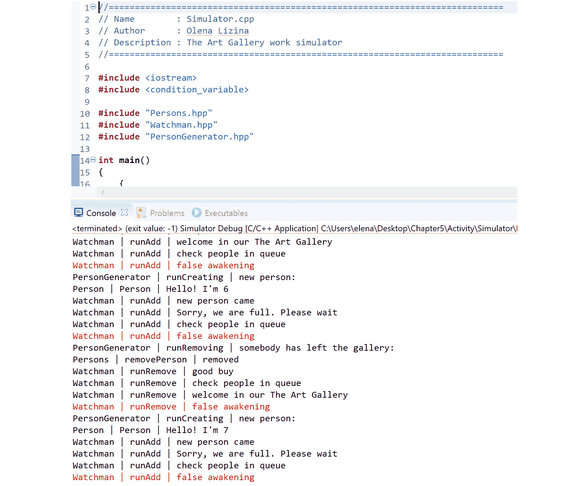

###### 图 5.27:应用执行的结果

如您所见，所有线程都以非常简单和干净的方式相互通信。我们通过使用互斥来保护我们的共享数据，这样我们就可以避免竞争条件。在这里，我们使用了一个异常来警告空列表，并在线程的函数中捕获它们，这样我们的线程就可以自己处理异常。在将线程加入析构函数之前，我们还检查了它是否是可连接的。这使我们避免了计划的意外终止。因此，这个小项目展示了我们处理线程的技巧。

## 第 6 章–流和输入/输出

### 活动 1 美术馆模拟器的记录系统

线程安全记录器允许我们同时向终端输出数据。我们通过继承`std::ostringstream`类并使用互斥体进行同步来实现这个记录器。我们将实现一个为格式化输出提供接口的类，我们的记录器将使用它来扩展基本输出。我们为不同的日志记录级别定义了宏定义，以提供一个简单明了的界面。按照以下步骤完成本活动:

1.  从第 6 课打开项目。
2.  Create a new directory called logger inside the **src/** directory. You will get the following hierarchy:

    

    ###### 图 6.25:项目的层次结构

3.  创建一个名为**记录器**的头文件和源文件。在**中，添加包括守卫。包括<字符串>头，以增加对使用字符串的支持。定义一个名为 logger 的命名空间，然后定义一个名为 **utils** 的嵌套命名空间。在 **utils** 命名空间中，声明 **LoggerUtils** 类。**
4.  在公共部分 n 中，声明以下静态函数:`getDateTime`、`getThreadId`、`getLoggingLevel`、`getFileAndLine`、`getFuncName`、`getinfouncname`、`getOutFuncName`。你的班级应该如下所示:

    ```cpp
    #ifndef LOGGERUTILS_HPP_
    #define LOGGERUTILS_HPP_
    #include <string>
    namespace logger
    {
    namespace utils
    {
    class LoggerUtils
    {
    public:
         static std::string getDateTime();
         static std::string getThreadId();
         static std::string getLoggingLevel(const std::string& level);
         static std::string getFileAndLine(const std::string& file, const int& line);
         static std::string getFuncName(const std::string& func);
         static std::string getInFuncName(const std::string& func);
         static std::string getOutFuncName(const std::string& func);
    };
    } // namespace utils
    } // namespace logger
    #endif /* LOGGERUTILS_HPP_ */
    ```

5.  在 **LoggerUtils.cpp** 中，增加需要的包括: **LoggerUtils.hpp** 表头、**T11】stream>T6】为 **std::stringstream** 支持、**T13】ctime>T10】为日期时间支持:

    ```cpp
    #include "LoggerUtils.hpp"
    #include <sstream>
    #include <ctime>
    #include <thread>
    ```**** 
6.  进入`记录器`和`实用程序`名称空间。编写所需的函数定义。在`getDateTime()`功能中，使用`localtime()`功能获取当地时间。使用`str time()`函数将其格式化为字符串。使用`标准::字符串流` :

    ```cpp
    std::string LoggerUtils::getDateTime()
    {
         time_t rawtime;
         struct tm * timeinfo;
         char buffer[80];
         time (&rawtime);
         timeinfo = localtime(&rawtime);
         strftime(buffer,sizeof(buffer),"%d-%m-%YT%H:%M:%S",timeinfo);
         std::stringstream ss;
         ss << "[";
         ss << buffer;
         ss << "]";
         return ss.str();
    }
    ```

    将其转换为所需的格式
7.  在`getThreadId()`函数中，获取当前线程 Id，并使用`std::stringstream` :

    ```cpp
    std::string LoggerUtils::getThreadId()
    {
         std::stringstream ss;
         ss << "[";
         ss << std::this_thread::get_id();
         ss << "]";
         return ss.str();
    }
    ```

    将其转换为所需格式
8.  在`getLoggingLevel()`函数中，使用`std::stringstream` :

    ```cpp
    std::string LoggerUtils::getLoggingLevel(const std::string& level)
    {
         std::stringstream ss;
         ss << "[";
         ss << level;
         ss << "]";
         return ss.str();
    }
    ```

    将给定字符串转换为所需格式
9.  在`getfilandline()`函数中，使用`std::stringstream` :

    ```cpp
    std::string LoggerUtils::getFileAndLine(const std::string& file, const int& line)
    {
         std::stringstream ss;
         ss << " ";
         ss << file;
         ss << ":";
         ss << line;
         ss << ":";
         return ss.str();
    }
    ```

    将给定的文件和行转换为所需的格式
10.  在`getFuncName()`函数中，使用`std::stringstream` :

    ```cpp
    std::string LoggerUtils::getFuncName(const std::string& func)
    {
         std::stringstream ss;
         ss << " --- ";
         ss << func;
         ss << "()";
         return ss.str();
    }
    ```

    将函数名转换为所需的格式
11.  在`getInFuncName()`函数中，使用`std::stringstream`将函数名转换为所需的格式。

    ```cpp
    std::string LoggerUtils::getInFuncName(const std::string& func)
    {
         std::stringstream ss;
         ss << " --> ";
         ss << func;
         ss << "()";
         return ss.str();
    }
    ```

12.  在`getOutFuncName()`函数中，使用`std::stringstream` :

    ```cpp
    std::string LoggerUtils::getOutFuncName(const std::string& func)
    {
         std::stringstream ss;
         ss << " <-- ";
         ss << func;
         ss << "()";
         return ss.str();
    }
    ```

    将函数名转换为所需的格式
13.  创建一个名为**的头文件**。添加包括防护装置。为每个 **LoggerUtils** 函数创建宏定义: **DATETIME** 为 **getDateTime()** 函数， **THREAD_ID** 为 **getThreadId()** 函数， **LOG_LEVEL** 为 **getLoggingLevel()** 函数， **FILE_LINE** 为**getfileadline()**函数， **FUNC 因此，头文件应该如下所示:

    ```cpp
    #ifndef LOGGERMACROSES_HPP_
    #define LOGGERMACROSES_HPP_
    #define DATETIME \
         logger::utils::LoggerUtils::getDateTime()
    #define THREAD_ID \
         logger::utils::LoggerUtils::getThreadId()
    #define LOG_LEVEL( level ) \
         logger::utils::LoggerUtils::getLoggingLevel(level)
    #define FILE_LINE \
         logger::utils::LoggerUtils::getFileAndLine(__FILE__, __LINE__)
    #define FUNC_NAME \
         logger::utils::LoggerUtils::getFuncName(__FUNCTION__)
    #define FUNC_ENTRY_NAME \
         logger::utils::LoggerUtils::getInFuncName(__FUNCTION__)
    #define FUNC_EXIT_NAME \
         logger::utils::LoggerUtils::getOutFuncName(__FUNCTION__)
    #endif /* LOGGERMACROSES_HPP_ */
    ```** 
14.  创建一个名为**的头文件和源文件**。在 **StreamLogger.hpp** 中，添加所需的包含防护装置。包括 **LoggerMacroses.hpp** 和 **LoggerUtils.hpp** 头文件。然后，包括用于**标准::互斥流**支持的 **<流>头，用于**标准::线程**支持的**线程<头，以及用于**标准::互斥流**支持的 **<互斥流>头******
15.  进入`名称空间`记录器。声明`StreamLogger`类，该类继承自`std::ostringstream`类。这种继承允许我们使用重载的左移位操作符< <进行记录。我们不设置输出设备，因此不会执行输出–只是存储在内部缓冲器中。在私有部分，声明一个名为`m_mux`的静态`std::mutex`变量。声明常量字符串，以便可以存储日志级别、文件和行以及函数名。在公共部分中，声明一个构造函数，该构造函数将日志级别、文件和行以及函数名作为参数。声明一个类析构函数。类声明应该如下所示:

    ```cpp
    namespace logger
    {
    class StreamLogger : public std::ostringstream
    {
    public:
         StreamLogger(const std::string logLevel,
                      const std::string fileLine,
                      const std::string funcName);
         ~StreamLogger();
    private:
         static std::mutex m_mux;
         const std::string m_logLevel;
         const std::string m_fileLine;
         const std::string m_funcName;
    };
    } // namespace logger
    ```

16.  在`StreamLogger.cpp`中，包含`StreamLogger.hpp`和`< iostream >`头，用于`std::cout`支持。进入`记录器`命名空间。定义构造函数并初始化初始化列表中的所有成员。然后，定义析构函数并输入它的作用域。锁定`m_mux`互斥体。如果内部缓冲区为空，则只输出日期和时间、线程 ID、日志级别、文件和行以及函数名。因此，我们将得到如下格式的行:`【datetime】【threadId】【logLevel】【文件:line:】【name()-】`。如果内部缓冲区包含任何数据，输出与缓冲区结尾相同的字符串。因此，我们将得到如下格式的行:`【datetime】【threadId】【log level】【文件:行:】【name()-】|消息`。完整的源文件应该如下所示:

    ```cpp
    #include "StreamLogger.hpp"
    #include <iostream>
    std::mutex logger::StreamLogger::m_mux;
    namespace logger
    {
    StreamLogger::StreamLogger(const std::string logLevel,
                      const std::string fileLine,
                      const std::string funcName)
              : m_logLevel(logLevel)
              , m_fileLine(fileLine)
              , m_funcName(funcName)
    {}
    StreamLogger::~StreamLogger()
    {
         std::lock_guard<std::mutex> lock(m_mux);
         if (this->str().empty())
         {
              std::cout << DATETIME << THREAD_ID << m_logLevel << m_fileLine << m_funcName << std::endl;
         }
         else
         {
              std::cout << DATETIME << THREAD_ID << m_logLevel << m_fileLine << m_funcName << " | " << this->str() << std::endl;
         }
    }
    }
    ```

17.  创建一个名为`Logger.hpp`的头文件，并添加所需的包含防护。包括`StreamLogger.hpp`和`LoggerMacroses.hpp`头。接下来，为不同的日志记录级别创建宏定义:`LOG_TRACE()`、`LOG_DEBUG()`、`LOG_WARN()`、`LOG_TRACE()`、`LOG_INFO()`、`LOG_ERROR()`、`LOG_TRACE_ENTRY()`、`LOG_TRACE_EXIT()`。完整的头文件应该如下所示:

    ```cpp
    #ifndef LOGGER_HPP_
    #define LOGGER_HPP_
    #include "StreamLogger.hpp"
    #include "LoggerMacroses.hpp"
    #define LOG_TRACE() logger::StreamLogger{LOG_LEVEL("Trace"), FILE_LINE, FUNC_NAME}
    #define LOG_DEBUG() logger::StreamLogger{LOG_LEVEL("Debug"), FILE_LINE, FUNC_NAME}
    #define LOG_WARN() logger::StreamLogger{LOG_LEVEL("Warning"), FILE_LINE, FUNC_NAME}
    #define LOG_TRACE() logger::StreamLogger{LOG_LEVEL("Trace"), FILE_LINE, FUNC_NAME}
    #define LOG_INFO() logger::StreamLogger{LOG_LEVEL("Info"), FILE_LINE, FUNC_NAME}
    #define LOG_ERROR() logger::StreamLogger{LOG_LEVEL("Error"), FILE_LINE, FUNC_NAME}
    #define LOG_TRACE_ENTRY() logger::StreamLogger{LOG_LEVEL("Error"), FILE_LINE, FUNC_ENTRY_NAME}
    #define LOG_TRACE_EXIT() logger::StreamLogger{LOG_LEVEL("Error"), FILE_LINE, FUNC_EXIT_NAME}
    #endif /* LOGGER_HPP_ */
    ```

18.  用适当的宏定义调用替换所有的`标准::cout`调用。在`Watchman.cpp`源文件中包含`logger/Logger.hpp`头文件。在`runAdd()`功能中，用不同日志级别的宏定义替换`std::cout`的所有实例。`运行添加()`功能应该如下所示:

    ```cpp
    void Watchman::runAdd()
    {
         while (true)
         {
              std::unique_lock<std::mutex> locker(m_AddMux);
              while(!m_AddNotified)
              {
                   LOG_DEBUG() << "Spurious awakening";
                   m_CondVarAddPerson.wait(locker);
              }
              LOG_INFO() << "New person came";
              m_AddNotified = false;
              while (m_CreatedPeople.size() > 0)
              {
                   try
                   {
                        auto person = m_CreatedPeople.get();
                        if (m_PeopleInside.size() < CountPeopleInside)
                        {
                             LOG_INFO() << "Welcome in the our Art Gallery";
                             m_PeopleInside.add(std::move(person));
                        }
                        else
                        {
                             LOG_INFO() << "Sorry, we are full. Please wait";
                             m_PeopleInQueue.add(std::move(person));
                        }
                   }
                   catch(const std::string& e)
                   {
                        LOG_ERROR() << e;
                   }
              }
              LOG_TRACE() << "Check people in queue";
              if (m_PeopleInQueue.size() > 0)
              {
                   while (m_PeopleInside.size() < CountPeopleInside)
                   {
                        try
                        {
                             auto person = m_PeopleInQueue.get();
                             LOG_INFO() << "Welcome in the our Art Gallery";
                             m_PeopleInside.add(std::move(person));
                        }
                        catch(const std::string& e)
                        {
                             LOG_ERROR() << e;
                        }
                   }
              }
         }
    }
    ```

19.  注意我们如何使用新的记录器。我们用括号调用宏定义，并使用左移位运算符:

    ```cpp
    LOG_ERROR() << e;
    Or
    LOG_INFO() << "Welcome in the our Art Gallery";
    ```

20.  对其余代码进行同样的替换。
21.  构建并运行应用。在终端中，您将看到日志消息以不同的日志级别和有用的信息从不同的线程中出现。过了一段时间后，您将获得类似以下内容的输出:


###### 图 6.26:活动项目的执行结果

如您所见，阅读和理解日志非常容易。如果您的需求不同，您可以很容易地更改`StreamLogger`类，将日志写入文件系统上的文件。您可以添加使用日志调试应用所需的任何其他信息，例如输出函数参数。您还可以为自定义类型重写左移位运算符，以便轻松输出调试信息。

在这个项目中，我们采用了许多我们在本章中学到的东西。我们为线程安全的输出创建了一个额外的流，我们将输出格式化为所需的表示，我们使用`std::stringstream`来执行格式化数据，我们使用宏定义来方便记录器的使用。因此，这个项目展示了我们处理并发输入/输出的技能

## 第 7 章-每个人都会跌倒，这是你爬起来的方式-测试和调试

### 活动 1:使用测试用例检查功能的准确性并理解测试驱动开发(TDD)

对于本活动，我们将开发解析 **RecordFile.txt** 和 **CurrencyConversion.txt** 文件的函数，并编写测试用例来检查函数的准确性。按照以下步骤实施本活动:

1.  创建一个名为 **parse.conf** 的配置文件并编写配置。
2.  注意这里只关注两个变量，即`current file`和`recordFile`。其余的用于其他环境变量:

    ```cpp
    CONFIGURATION_FILE
    currencyFile = ./CurrencyConversion.txt
    recordFile = ./RecordFile.txt
    DatabaseServer = 192.123.41.112
    UserId = sqluser
    Password = sqluser 
    RestApiServer = 101.21.231.11
    LogFilePath = /var/project/logs
    ```

3.  创建一个名为`CommonHeader.h`的头文件，并声明所有的实用函数，即`isAllNumbers()`、`isDigit()`、`parceline()`、`checkFile()`、`parseConfig()`、`parsecurrency parameters()`、`fillCurrencyMap()`、`recordparsefile()`、

    ```cpp
    #ifndef __COMMON_HEADER__H
    #define __COMMON_HEADER__H
    #include<iostream>
    #include<cstring>
    #include<fstream>
    #include<vector>
    #include<string>
    #include<map>
    #include<sstream>
    #include<iterator>
    #include<algorithm>
    #include<iomanip>
    using namespace std;
    // Forward declaration of global variables. 
    extern string configFile;
    extern string recordFile;
    extern string currencyFile;
    extern map<string, float> currencyMap;
    struct record;
    extern vector<record>      vecRecord;
    //Structure to hold Record Data . 
    struct record{
        int     customerId;
        string  firstName;
        string  lastName;
        int     orderId;
        int     productId;
        int     quantity;
        float   totalPriceRegional;
        string  currency;
        float   totalPriceUsd;

        record(vector<string> & in){
            customerId      = atoi(in[0].c_str());
            firstName       = in[1];
            lastName        = in[2];
            orderId         = atoi(in[3].c_str());
            productId       = atoi(in[4].c_str());
            quantity        = atoi(in[5].c_str());
            totalPriceRegional = static_cast<float>(atof(in[6].c_str()));
            currency        = in[7];
            totalPriceUsd   = static_cast<float>(atof(in[8].c_str()));
        }
    };
    // Declaration of Utility Functions.. 
    string trim (string &);
    bool isAllNumbers(const string &);
    bool isDigit(const string &);
    void parseLine(ifstream &, vector<string> &, char);
    bool checkFile(ifstream &, string &, string, char, string &);
    bool parseConfig();
    bool parseCurrencyParameters( vector<string> &);
    bool fillCurrencyMap();
    bool parseRecordFile();
    bool checkRecord(vector<string> &);
    void displayCurrencyMap();
    ostream& operator<<(ostream &, const record &);
    void displayRecords();
    #endif
    ```

4.  创建一个名为 **Util.cpp** 的文件，定义所有的实用函数。编写以下代码定义`修剪()`功能:

    ```cpp
    #include<CommonHeader.h>
    // Utility function to remove spaces and tabs from start of string and end of string.. 
    string trim (string &str) { // remove space and tab from string.
        string res("");
        if ((str.find(' ') != string::npos) || (str.find(' ') != string::npos)){ // if space or tab found.. 
            size_t begin, end;
            if ((begin = str.find_first_not_of(" \t")) != string::npos){ // if string is not empty.. 
                end = str.find_last_not_of(" \t");
                if ( end >= begin )
                    res = str.substr(begin, end - begin + 1);
            }
        }else{
            res = str; // No space or tab found.. 
        }
        str = res;
        return res;
    }
    ```

5.  编写以下代码来定义`isAllNumbers()`、`isDigit()`和`parceline()`函数:

    ```cpp
    // Utility function to check if string contains only digits ( 0-9) and only single '.' 
    // eg . 1121.23 , .113, 121\. are valid, but 231.14.143 is not valid.
    bool isAllNumbers(const string &str){ // make sure, it only contains digit and only single '.' if any 
        return ( all_of(str.begin(), str.end(), [](char c) { return ( isdigit(c) || (c == '.')); }) 
                 && (count(str.begin(), str.end(), '.') <= 1) );
    }
    //Utility function to check if string contains only digits (0-9).. 
    bool isDigit(const string &str){
        return ( all_of(str.begin(), str.end(), [](char c) { return isdigit(c); }));
    }
    // Utility function, where single line of file <infile> is parsed using delimiter. 
    // And store the tokens in vector of string. 
    void parseLine(ifstream &infile, vector<string> & vec, char delimiter){
        string line, token;
        getline(infile, line);
        istringstream ss(line);
        vec.clear();
        while(getline(ss, token, delimiter)) // break line using delimiter
            vec.push_back(token);  // store tokens in vector of string
    }
    ```

6.  编写以下代码来定义`解析当前参数()`和`检查记录()`函数:

    ```cpp
    // Utility function to check if vector string of 2 strings contain correct 
    // currency and conversion ratio. currency should be 3 characters, conversion ratio
    // should be in decimal number format. 
    bool parseCurrencyParameters( vector<string> & vec){
        trim(vec[0]);  trim(vec[1]);
        return ( (!vec[0].empty()) && (vec[0].size() == 3) && (!vec[1].empty()) && (isAllNumbers(vec[1])) );
    }
    // Utility function, to check if vector of string has correct format for records parsed from Record File. 
    // CustomerId, OrderId, ProductId, Quantity should be in integer format
    // TotalPrice Regional and USD should be in decimal number format
    // Currecny should be present in map. 
    bool checkRecord(vector<string> &split){
        // Trim all string in vector
        for (auto &s : split)
            trim(s);

        if ( !(isDigit(split[0]) && isDigit(split[3]) && isDigit(split[4]) && isDigit(split[5])) ){
            cerr << "ERROR: Record with customer id:" << split[0] << " doesnt have right DIGIT parameter" << endl;
            return false;
        }
        if ( !(isAllNumbers(split[6]) && isAllNumbers(split[8])) ){
            cerr << "ERROR: Record with customer id:" << split[0] << " doesnt have right NUMBER parameter" << endl;
            return false;
        }
        if ( currencyMap.find(split[7]) == currencyMap.end() ){
            cerr << "ERROR: Record with customer id :" << split[0] << " has currency :" << split[7] << " not present in map" << endl;
            return false;
        }
        return true;
    }
    ```

7.  编写以下代码定义`检查文件()`功能:

    ```cpp
    // Function to test initial conditions of file.. 
    // Check if file is present and has correct header information. 
    bool checkFile(ifstream &inFile, string &fileName, string parameter, char delimiter, string &error){
        bool flag = true;
        inFile.open(fileName);
        if ( inFile.fail() ){
            error = "Failed opening " + fileName + " file, with error: " + strerror(errno);
            flag = false;
        }
        if (flag){
            vector<string> split;
            // Parse first line as header and make sure it contains parameter as first token. 
            parseLine(inFile, split, delimiter);
            if (split.empty()){
                error = fileName + " is empty";
                flag = false;
            } else if ( split[0].find(parameter) == string::npos ){
                error = "In " + fileName + " file, first line doesnt contain header ";
                flag = false;
            }
        }
        return flag;
    }
    ```

8.  编写以下代码定义`parseConfig()`函数:

    ```cpp
    // Function to parse Config file. Each line will have '<name> = <value> format
    // Store CurrencyConversion file and Record File parameters correctly. 
    bool parseConfig() {
        ifstream coffle;
        string error;
        if (!checkFile(confFile, configFile, "CONFIGURATION_FILE", '=', error)){
            cerr << "ERROR: " << error << endl;
            return false;
        }
        bool flag = true;
        vector<string> split;
        while (confFile.good()){
            parseLine(confFile, split, '=');
            if ( split.size() == 2 ){ 
                string name = trim(split[0]);
                string value = trim(split[1]);
                if ( name == "currencyFile" )
                    currencyFile = value;
                else if ( name == "recordFile")
                    recordFile = value;
            }
        }
        if ( currencyFile.empty() || recordFile.empty() ){
            cerr << "ERROR : currencyfile or recordfile not set correctly." << endl;
            flag = false;
        }
        return flag;
    }
    ```

9.  编写以下代码来定义`filllcurrency map()`函数:

    ```cpp
    // Function to parse CurrencyConversion file and store values in Map.
    bool fillCurrencyMap() {
        ifstream currFile;
        string error;
        if (!checkFile(currFile, currencyFile, "Currency", '|', error)){
            cerr << "ERROR: " << error << endl;
            return false;
        }
        bool flag = true;
        vector<string> split;
        while (currFile.good()){
            parseLine(currFile, split, '|');
            if (split.size() == 2){
                if (parseCurrencyParameters(split)){
                    currencyMap[split[0]] = static_cast<float>(atof(split[1].c_str())); // make sure currency is valid.
                } else {
                    cerr << "ERROR: Processing Currency Conversion file for Currency: "<< split[0] << endl;
                    flag = false;
                    break;
                }
            } else if (!split.empty()){
                cerr << "ERROR: Processing Currency Conversion , got incorrect parameters for Currency: " << split[0] << endl;
                flag = false;
                break;
            }
        }
        return flag;
    }
    ```

10.  编写以下代码来定义`parseRecordFile()`函数:

    ```cpp
    // Function to parse Record File .. 
    bool parseRecordFile(){
        ifstream recFile;
        string error;
        if (!checkFile(recFile, recordFile, "Customer Id", '|', error)){
            cerr << "ERROR: " << error << endl;
            return false;
        }
        bool flag = true;
        vector<string> split;
        while(recFile.good()){
            parseLine(recFile, split, '|');
            if (split.size() == 9){ 
                if (checkRecord(split)){
                    vecRecord.push_back(split); //Construct struct record and save it in vector... 
                }else{
                    cerr << "ERROR : Parsing Record, for Customer Id: " << split[0] << endl;
                    flag = false;
                    break;
                }
            } else if (!split.empty()){
                cerr << "ERROR: Processing Record, for Customer Id: " << split[0] << endl;
                flag = false;
                break;
            }
        }
        return flag;
    }
    ```

11.  编写以下代码定义`displayCurrencyMap()`函数:

    ```cpp
    void displayCurrencyMap(){

        cout << "Currency MAP :" << endl;
        for (auto p : currencyMap)
            cout << p.first <<"  :  " << p.second << endl;
        cout << endl;
    }
    ostream& operator<<(ostream& os, const record &rec){
        os << rec.customerId <<"|" << rec.firstName << "|" << rec.lastName << "|" 
           << rec.orderId << "|" << rec.productId << "|" << rec.quantity << "|" 
           << fixed << setprecision(2) << rec.totalPriceRegional << "|" << rec.currency << "|" 
           << fixed << setprecision(2) << rec.totalPriceUsd << endl;
        return os;
    }
    ```

12.  编写以下代码定义`显示记录()`功能:

    ```cpp
    void displayRecords(){
        cout << " Displaying records with '|' delimiter" << endl;
        for (auto rec : vecRecord){
            cout << rec;
        }
        cout << endl;
    }
    ```

13.  创建一个名为 **ParseFiles.cpp** 的文件，并调用`parseConfig()`、`filllcurrency map()`和`parseRecordFile()`函数:

    ```cpp
    #include <CommonHeader.h>
    // Global variables ... 
    string configFile = "./parse.conf";
    string recordFile;
    string currencyFile;
    map<string, float>  currencyMap;
    vector<record>      vecRecord;
    int main(){
        // Read Config file to set global configuration variables. 
        if (!parseConfig()){
            cerr << "Error parsing Config File " << endl;
            return false;
        }
        // Read Currency file and fill map
        if (!fillCurrencyMap()){
            cerr << "Error setting CurrencyConversion Map " << endl;
            return false;
        }
        if (!parseRecordFile()){
            cerr << "Error parsing Records File " << endl;
            return false;
        }
            displayCurrencyMap();
        displayRecords();
        return 0;
    }
    ```

14.  Open the compiler. Compile and execute the **Util.cpp** and **ParseFiles.cpp** files by writing the following command:

    ```cpp
    g++ -c -g -I. -Wall Util.cpp
    g++ -g -I. -Wall Util.o ParseFiles.cpp -o ParseFiles
    ```

    将生成两者的二进制文件。

    在下面的截图中，您将看到这两个命令都存储在 build.sh 脚本中并被执行。运行此脚本后，您将看到最新的`Util.o`和`ParseFiles`文件已经生成:

    

    ###### 图 7.25:生成的新文件

15.  After running the `ParseFiles` executable, we'll receive the following output:

    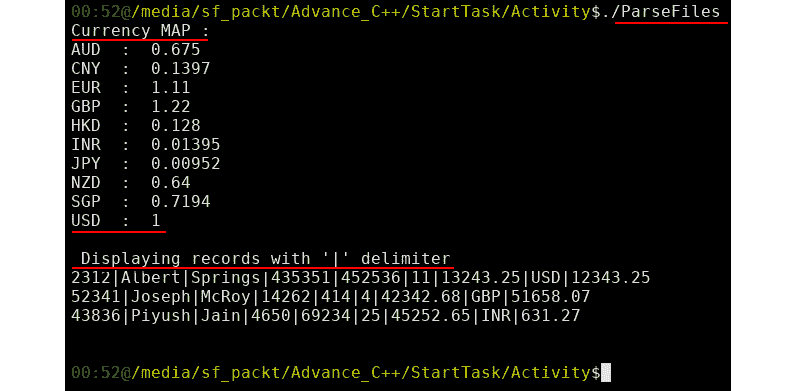

    ###### 图 7.26:生成的新文件

16.  创建一个名为**的文件，并为实用函数编写测试用例。为**修剪**功能编写以下测试用例:

    ```cpp
    #include<gtest/gtest.h>
    #include"../CommonHeader.h"
    using namespace std;
    // Global variables ... 
    string configFile = "./parse.conf";
    string recordFile;
    string currencyFile;
    map<string, float>  currencyMap;
    vector<record>      vecRecord;
    void setDefault(){
        configFile = "./parse.conf";
        recordFile.clear();
        currencyFile.clear();
        currencyMap.clear();
        vecRecord.clear();
    }
    // Test Cases for trim function ... 
    TEST(trim, empty){
        string str="    ";
        EXPECT_EQ(trim(str), string());
    }
    TEST(trim, start_space){
        string str = "   adas";
        EXPECT_EQ(trim(str), string("adas"));
    }
    TEST(trim, end_space){
        string str = "trip      ";
        EXPECT_EQ(trim(str), string("trip"));
    }
    TEST(trim, string_middle){
        string str = "  hdgf   ";
        EXPECT_EQ(trim(str), string("hdgf"));
    }
    TEST(trim, single_char_start){
        string str = "c  ";
        EXPECT_EQ(trim(str), string("c"));
    }
    TEST(trim, single_char_end){
        string str = "   c";
        EXPECT_EQ(trim(str), string("c"));
    }
    TEST(trim, single_char_middle){
        string str = "      c  ";
        EXPECT_EQ(trim(str), string("c"));
    }
    ```** 
17.  为`isAllNumbers`函数编写以下测试用例:

    ```cpp
    // Test Cases for isAllNumbers function.. 
    TEST(isNumber, alphabets_present){
        string str = "11.qwe13";
        ASSERT_FALSE(isAllNumbers(str));
    }
    TEST(isNumber, special_character_present){
        string str = "34.^%3";
        ASSERT_FALSE(isAllNumbers(str));
    }
    TEST(isNumber, correct_number){
        string str = "54.765";
        ASSERT_TRUE(isAllNumbers(str));
    }
    TEST(isNumber, decimal_begin){
        string str = ".624";
        ASSERT_TRUE(isAllNumbers(str));
    }
    TEST(isNumber, decimal_end){
        string str = "53.";
        ASSERT_TRUE(isAllNumbers(str));
    }
    ```

18.  为`isDigit`函数编写以下测试用例:

    ```cpp
    // Test Cases for isDigit funtion... 
    TEST(isDigit, alphabet_present){
        string str = "527A";
        ASSERT_FALSE(isDigit(str));
    }
    TEST(isDigit, decimal_present){
        string str = "21.55";
        ASSERT_FALSE(isDigit(str));
    }
    TEST(isDigit, correct_digit){
        string str = "9769";
        ASSERT_TRUE(isDigit(str));
    }
    ```

19.  为`解析当前参数`函数编写以下测试用例:

    ```cpp
    // Test Cases for parseCurrencyParameters function
    TEST(CurrencyParameters, extra_currency_chararcters){
        vector<string> vec {"ASAA","34.22"};
        ASSERT_FALSE(parseCurrencyParameters(vec));
    }
    TEST(CurrencyParameters, correct_parameters){
        vector<string> vec {"INR","1.44"};
        ASSERT_TRUE(parseCurrencyParameters(vec));
    }
    ```

20.  Write the following test cases for the `checkFile` function:

    ```cpp
    //Test Cases for checkFile function...
    TEST(checkFile, no_file_present){
        string fileName = "./NoFile";
        ifstream infile; 
        string parameter("nothing");
        char delimit =';';
        string err;
        ASSERT_FALSE(checkFile(infile, fileName, parameter, delimit, err));
    }
    TEST(checkFile, empty_file){
        string fileName = "./emptyFile";
        ifstream infile; 
        string parameter("nothing");
        char delimit =';';
        string err;
        ASSERT_FALSE(checkFile(infile, fileName, parameter, delimit, err));
    }
    TEST(checkFile, no_header){
        string fileName = "./noHeaderFile";
        ifstream infile; 
        string parameter("header");
        char delimit ='|';
        string err;
        ASSERT_FALSE(checkFile(infile, fileName, parameter, delimit, err));
    }
    TEST(checkFile, incorrect_header){
        string fileName = "./correctHeaderFile";
        ifstream infile; 
        string parameter("header");
        char delimit ='|';
        string err;
        ASSERT_FALSE(checkFile(infile, fileName, parameter, delimit, err));
    }
    TEST(checkFile, correct_file){
        string fileName = "./correctHeaderFile";
        ifstream infile; 
        string parameter("Currency");
        char delimit ='|';
        string err;
        ASSERT_TRUE(checkFile(infile, fileName, parameter, delimit, err));
    }
    ```

    #### 注意

    在前面的函数中用作输入参数的 **NoFile** 、 **emptyFile** 、 **noHeaderFile** 、**correcheader file**文件可以在这里找到:[https://github . com/trainingypbackt/Advanced-CPlusPlus/tree/master/lesson 7/activity 01](https://github.com/TrainingByPackt/Advanced-CPlusPlus/tree/master/Lesson7/Activity01)。

21.  Write the following test cases for the `parseConfig` function:

    ```cpp
    //Test Cases for parseConfig function...
    TEST(parseConfig, missing_currency_file){
        setDefault();
        configFile = "./parseMissingCurrency.conf";
        ASSERT_FALSE(parseConfig());
    }
    TEST(parseConfig, missing_record_file){
        setDefault();
        configFile = "./parseMissingRecord.conf";
        ASSERT_FALSE(parseConfig());
    }
    TEST(parseConfig, correct_config_file){
        setDefault();
        configFile = "./parse.conf";
        ASSERT_TRUE(parseConfig());
    }
    ```

    #### 注意

    在前面的函数中用作输入参数的**parsemissingcurrency . conf**、 **parseMissingRecord.conf** 和 **parse.conf** 文件可以在这里找到:[https://github . com/trainingypbackt/Advanced-CPlusPlus/tree/master/lesson 7/activity 01](https://github.com/TrainingByPackt/Advanced-CPlusPlus/tree/master/Lesson7/Activity01)。

22.  Write the following test cases for the `fillCurrencyMap` function:

    ```cpp
    //Test Cases for fillCurrencyMap function...
    TEST(fillCurrencyMap, wrong_delimiter){
        currencyFile = "./CurrencyWrongDelimiter.txt";
        ASSERT_FALSE(fillCurrencyMap());
    }
    TEST(fillCurrencyMap, extra_column){
        currencyFile = "./CurrencyExtraColumn.txt";
        ASSERT_FALSE(fillCurrencyMap());
    }
    TEST(fillCurrencyMap, correct_file){
        currencyFile = "./CurrencyConversion.txt";
        ASSERT_TRUE(fillCurrencyMap());
    }
    ```

    #### 注意

    在前面的函数中用作输入参数的**currency erriddelimiter . txt**、 **CurrencyExtraColumn.txt** 、 **CurrencyConversion.txt** 文件可以在这里找到:[https://github . com/trainingypbackt/Advanced-CPlusPlus/tree/master/lesson 7/activity 01](https://github.com/TrainingByPackt/Advanced-CPlusPlus/tree/master/Lesson7/Activity01)。

23.  Write the following test cases for the parseRecordFile function:

    ```cpp
    //Test Cases for parseRecordFile function...
    TEST(parseRecordFile, wrong_delimiter){
        recordFile = "./RecordWrongDelimiter.txt";
        ASSERT_FALSE(parseRecordFile());
    }
    TEST(parseRecordFile, extra_column){
        recordFile = "./RecordExtraColumn.txt";
        ASSERT_FALSE(parseRecordFile());
    }
    TEST(parseRecordFile, correct_file){
        recordFile = "./RecordFile.txt";
        ASSERT_TRUE(parseRecordFile());
    }
    ```

    在前面的函数中用作输入参数的**recorderry delimiter . txt**、**recordextrectory column . txt**、 **RecordFile.txt** 文件可以在这里找到:[https://github . com/trainingypbackt/Advanced-CPlusPlus/tree/master/lesson 7/activity 01](https://github.com/TrainingByPackt/Advanced-CPlusPlus/tree/master/Lesson7/Activity01)。

24.  Open the compiler. Compile and execute the `Util.cpp` and `ParseFileTestCases.cpp` files by writing the following commands:

    ```cpp
    g++ -c -g -Wall ../Util.cpp -I../
    g++ -c -g -Wall ParseFileTestCases.cpp 
    g++ -g -Wall Util.o ParseFileTestCases.o -lgtest -lgtest_main -pthread -o ParseFileTestCases
    ```

    下面是这个的截图。您将看到所有存储在`Test.make`脚本文件中的命令。一旦执行，它将创建用于单元测试的二进制程序，称为`解析文件测试用例`。您还会注意到，在项目中创建了一个名为`单元测试`的目录。在这个目录中，所有与单元测试相关的代码都被写入，并且一个二进制文件被创建。此外，项目的依赖库`Util.o`也是通过在`Util.cpp`文件中编译项目而创建的:

    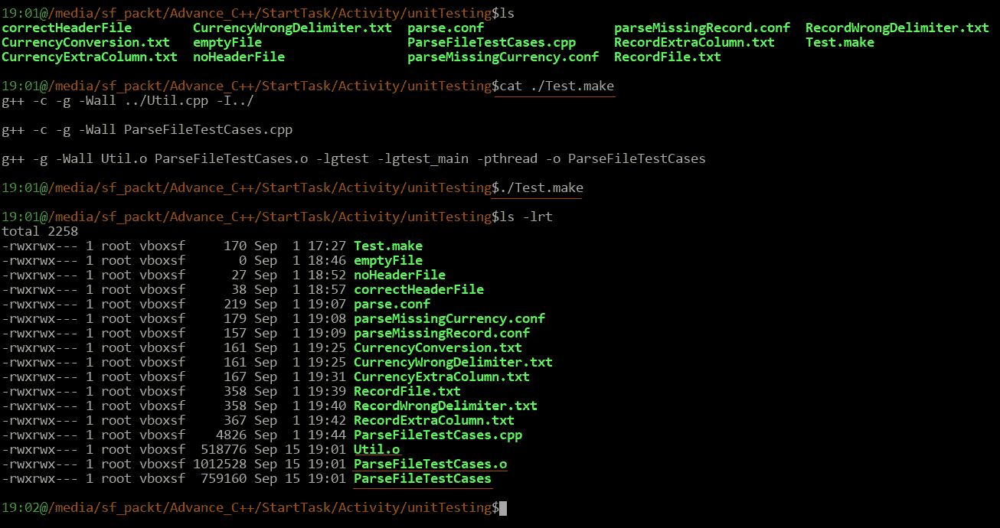

    ###### 图 7.27:执行脚本文件中的所有命令

25.  Type the following command to run all the test cases:

    ```cpp
    ./ParseFileTestCases
    ```

    屏幕上的输出将显示运行的全部测试，即 8 个测试套件中的 31 个。它还将显示单个测试套件的统计数据以及通过/失败结果:

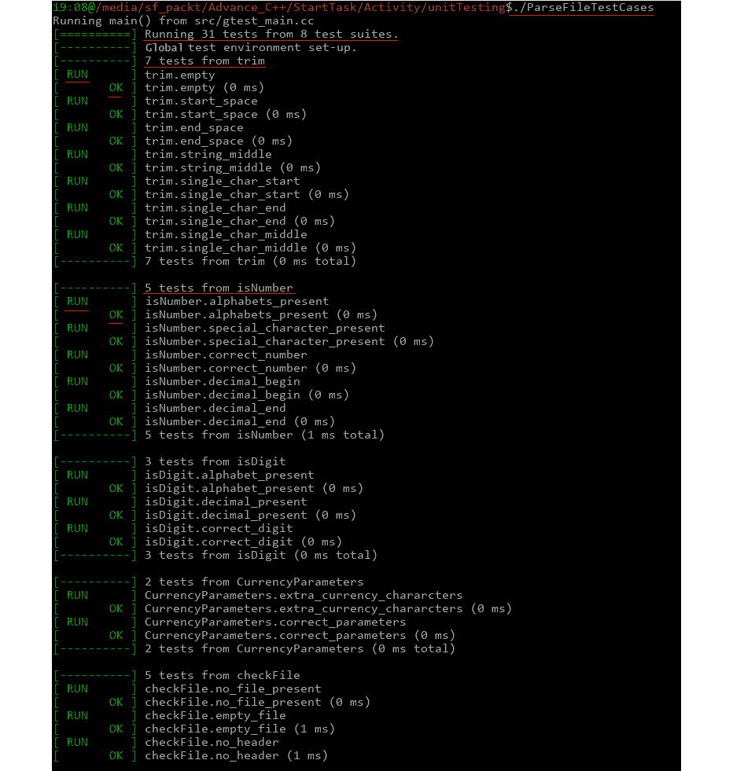

###### 图 7.28:所有测试运行正常

以下是接下来测试的截图:

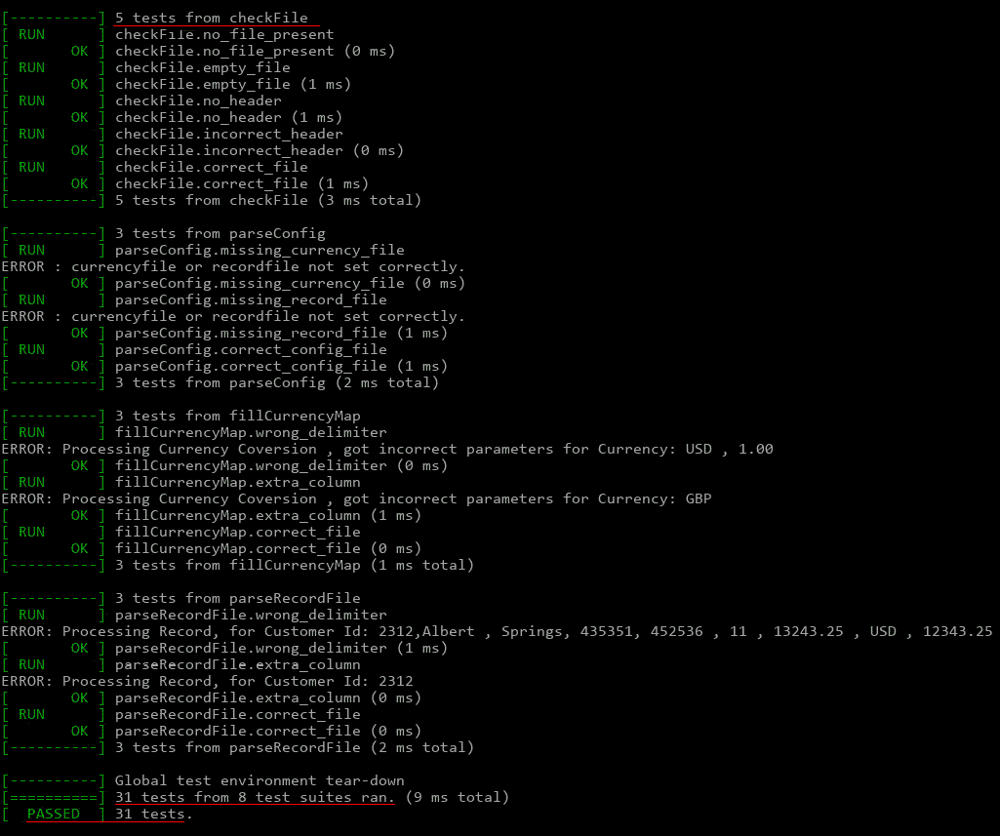

###### 图 7.29:所有测试运行正常

最后，我们通过在测试用例的帮助下解析两个文件来检查我们开发的函数的准确性。这将确保我们的项目在与具有测试用例的不同功能/模块集成时运行良好。

## 第 8 章-速度需求-性能和优化

### 活动 1:优化拼写检查算法

在本活动中，我们将开发一个简单的拼写检查演示，并尝试让它变得更快。可以用骨架文件 **Speller.cpp** 作为起点。执行以下步骤来实施本活动:

1.  对于拼写检查的第一个实现(完整代码可以在 **Speller1.cpp** 中找到)–在`get 拼错()`函数中创建字典集:

    ```cpp
    set<string> setDict(vecDict.begin(), vecDict.end());
    ```

2.  循环检查文本单词，并使用`set::count()`方法检查字典中没有的单词。将拼错的单词添加到结果向量中:

    ```cpp
    vector<int> ret;
    for(int i = 0; i < vecText.size(); ++ i)
    {
      const string &s = vecText[i];
      if(!setDict.count(s))
      {
        ret.push_back(i);
      }
    };
    ```

3.  Open the terminal. Compile the program and run it as follows:

    ```cpp
    $ g++ -O3 Speller1.cpp Timer.cpp
    $ ./a.out
    ```

    将生成以下输出:

    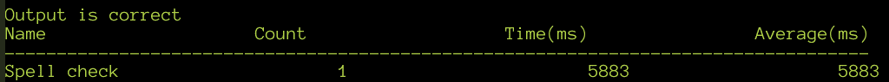

    ###### 图 8.60:步骤 1 解决方案的示例输出

4.  打开 **Speller2.cpp** 文件，将`无序 _set`头文件添加到程序中:

    ```cpp
    #include <unordered_set>
    ```

5.  接下来，将字典使用的集合类型更改为`无序 _ 集合` :

    ```cpp
    unordered_set<string> setDict(vecDict.begin(), vecDict.end());
    ```

6.  Open the Terminal. Compile the program and run it as follows:

    ```cpp
    $ g++ -O3 Speller2.cpp Timer.cpp
    $ ./a.out
    ```

    将生成以下输出:

    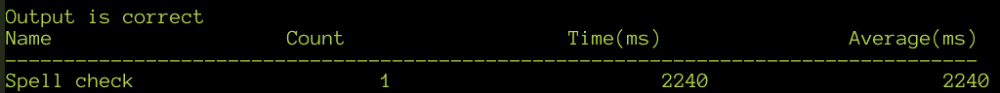

    ###### 图 8.61:步骤 2 解决方案的示例输出

7.  For the third and final version, that is, **Speller3.cpp**, we will use a bloom filter. Start by defining a hash function based on the `BKDR` function. Add the following code to implement this:

    ```cpp
    const size_t SIZE = 16777215;
    template<size_t SEED> size_t hasher(const string &s)
    {
      size_t h = 0;
      size_t len = s.size();
      for(size_t i = 0; i < len; i++)
      {
        h = h * SEED + s[i];
      }
      return h & SIZE;
    }
    ```

    这里，我们使用了一个整数模板参数，这样我们就可以用相同的代码创建任意数量的不同散列函数。注意`16777215`常量的使用，它等于`2^24–1`。这让我们可以使用快速按位“与”运算符而不是“模”运算符来保持散列整数小于`大小`。如果你想改变大小，保持它小于二的 1 次方。

8.  接下来，让我们为**中的布隆过滤器声明一个向量<bool>，并用字典中的单词填充它。使用三个散列函数。BKDR 散列可以被植入诸如 **131** 、 **3131** 、 **31313** 等值。添加以下代码来实现:

    ```cpp
    vector<bool> m_Bloom;
    m_Bloom.resize(SIZE);
    for(auto i = vecDict.begin(); i != vecDict.end(); ++ i)
    {
      m_Bloom[hasher<131>(*i)] = true;
      m_Bloom[hasher<3131>(*i)] = true;
      m_Bloom[hasher<31313>(*i)] = true;
    }
    ```</bool>** 
9.  Write the following code to create a loop that checks the words:

    ```cpp
    for(int i = 0; i < vecText.size(); ++ i)
    {
      const string &s = vecText[i];
      bool hasNoBloom = 
              !m_Bloom[hasher<131>(s)] 
          &&  !m_Bloom[hasher<3131>(s)]
          &&  !m_Bloom[hasher<31313>(s)];

      if(hasNoBloom)
      {
        ret.push_back(i);
      }
      else if(!setDict.count(s))
      {
        ret.push_back(i);
      }
    }
    ```

    首先检查布隆过滤器，如果它在字典中找到这个词，我们必须验证它，就像我们以前做的那样。

10.  Open the terminal. Compile the program and run it as follows:

    ```cpp
    $ g++ -O3 Speller3.cpp Timer.cpp
    $ ./a.out
    ```

    将生成以下输出:

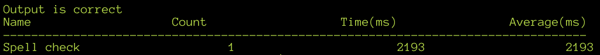

###### 图 8.62:步骤 3 解决方案的示例输出

在前面的活动中，我们试图解决一个现实世界的问题，并使其更加有效。让我们考虑三个步骤中每个实现的一些要点，如下所示:

*   对于第一个版本，使用了带有`std::set`的最明显的解决方案–然而，性能可能较低，因为 set 数据结构基于二叉树，该二叉树具有`O(log N)`的复杂性来寻找元素。
*   对于第二个版本，我们只需切换到`std::unordered_set`，就可以获得很大的性能提升，它使用哈希表作为底层数据结构。如果哈希函数好，性能会接近`O(1)`。
*   第三个版本基于**布隆过滤器**数据结构，需要一些考虑。bloom filter 的主要性能优势是因为它是一个紧凑的数据结构，实际上并没有在其中存储实际的元素，因此提供了非常好的缓存性能。

从实现的角度来看，以下准则适用:

*   `向量<布尔>`可以用作后备存储，因为它是存储和检索位的有效方式。
*   布隆过滤器的假阳性百分比应该是最小的——任何超过 5%的都是无效的。
*   有许多字符串哈希算法–引用实现中使用了 **BKDR** 哈希算法。一个全面的字符串哈希算法及其实现可以在这里找到:[http://www.partow.net/programming/hashfunctions/index.html](http://www.partow.net/programming/hashfunctions/index.html)。
*   哈希函数的数量和使用的 bloom 过滤器的大小对于获得性能优势非常关键。
*   在决定布隆过滤器应该使用什么参数时，应该考虑数据集的性质——考虑到在这个例子中，拼错的单词很少，而且大部分都在字典中。

鉴于我们收到的结果，有一些问题值得探讨:

*   为什么布隆过滤器的性能提升如此微弱？
*   使用更大或更小容量的 Bloom 过滤器会有什么影响？
*   当使用更少或更多的散列函数时会发生什么？
*   在什么条件下这个版本会比 **Speller2.cpp** 中的版本快很多？

以下是这些问题的答案:

*   Why is the improvement in performance so meager with the Bloom Filter?

    `std::unordered_set`在达到存储的值之前，执行一次哈希操作，可能还会执行几次内存访问。我们使用的布隆过滤器执行三次哈希操作和三次内存访问。因此，本质上，布隆过滤器所做的工作不仅仅是哈希表。由于我们的字典中只有 31，870 个单词，因此布隆过滤器的缓存优势就丧失了。这是另一种情况，在这种情况下，由于缓存，传统的数据结构分析与实际结果不一致。

*   What is the effect of using a larger or smaller capacity Bloom filter?

    当使用更大的容量时，哈希冲突的数量会减少，误报也会减少，但缓存行为会恶化。相反，当使用较小的容量时，哈希冲突和误报会增加，但缓存行为会改善。

*   What happens when fewer or more hash functions are used?

    使用的散列函数越多，误报就越少，反之亦然。

*   Under what conditions would this version be much faster than the one in Speller2.cpp?

    当测试几个位的成本小于访问哈希表中的值的成本时，Bloom 过滤器工作得最好。只有当布隆过滤器位完全适合缓存，而字典不适合时，这种情况才会出现。