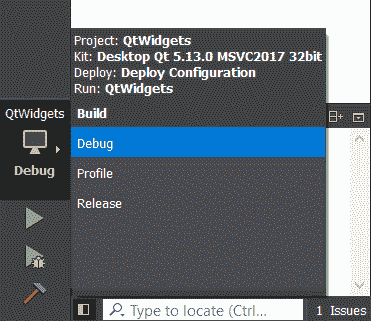
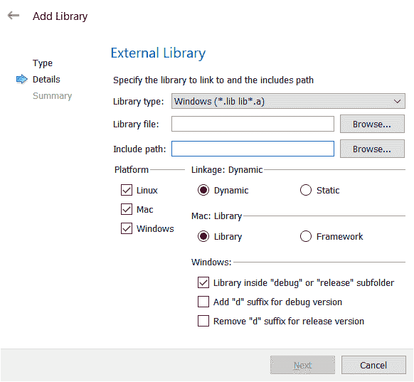

# 使用 Qt Creator 构建应用程序

使用 Qt Creator 要做的第一件事是弄清楚如何添加源文件和构建(或调试)您的项目。 本章就是这样--我们将介绍如何向项目中添加文件，如何在项目中创建库，以及如何使用调试器和控制台记录器。 这些是使用 Qt 创建高质量应用程序所需的基本技能。 在本章结束时，您将驾驶 Qt Creator 像专业人员一样开发控制台应用程序。

在本章中，我们将执行以下操作：

*   了解我们的样本库
*   查看构建菜单和`.pro`文件
*   链接到我们的样本库
*   调试 / 除错 / 除去窃听器
*   建造我们的项目
*   运行并调试我们的应用程序

# 技术要求

本章的技术要求包括 Qt 5.12.3 MinGW 64 位、Qt Creator 4.9.0 和 Windows 10。

# 入门-我们的样本库

本章的示例代码有两部分：定义公共函数的库和调用此函数的控制台应用程序。 库是分解应用程序的一种很好的方法，虽然这个示例很简单，但它也让我向您展示了如何创建库并将其包含在您的应用程序中。

我将扩展您的想象力；让我们假设您负责设置一个数学函数库。 在本例中，我们将只编写一个函数，即阶乘。 您应该能够回忆起介绍性编程中的阶乘函数；它由一个！ 定义如下：

*   0!。 是 1
*   1！ 是 1
*   不！ 是 n×(n-1)！

这是一个递归定义，我们可以用以下方式对其进行编码：

```cpp
unsigned long factorial(unsigned int n) 
{ 
    switch(n)  
    { 
        case 0: return 1; 
        case 1: return 1; 
        default: return n * factorial(n-1); 
    } 
} 
```

另一种避免函数调用成本的定义如下所示：

```cpp
unsigned long factorial(unsigned int n) 
{ 
    unsigned long result = 1; 
    for(unsigned int i = n; i > 1; i--) 
    { 
        result *= i; 
    } 
    return result; 
}
```

让我们首先创建一个实现`factorial`函数的库。 为此，请执行以下步骤：

1.  在 Qt Creator 中，从“文件”菜单中选择“新建文件”或“项目”。
2.  在对话框的左侧窗格中选择 Library，然后从中间窗格中选择 C++Library：


3.  Qt Creator 可以创建可以在应用程序之间共享的**动态链接****库**(Windows 术语中的**DLL**)、静态库或插件。 我们将创建一个静态库，因此在出现的下一个窗口中，选择 Static Linked Library 并将其命名为`MathFunctions`。 为项目选择一条合理的路径。

A statically linked library is included in your program binary and is part of your application. If multiple applications use a static library, each will have its own copy. A dynamically linked library is stored as a separate file and can be shared by multiple applications at runtime because each application loads the dynamically linked library. Qt also supports plugins, which are dynamic libraries loaded at runtime that can extend an application's functionality.

4.  Qt Creator 构建的库可以依赖于 Qt 库。 让这个库依赖于 Qt 的核心数据结构`QtCore`。 在 Select Required Modules(选择所需的模块)窗口中，选中`QtCore`，然后单击 Next(下一步)。
5.  在下一个窗口中，命名 Qt Creator 将添加到项目中的骨架文件。 单击 Next(下一步)。
6.  在 Project Management 窗口中，选择<none>作为版本控制选项(我们不会对此项目使用版本控制)，然后单击 Finish。</none>
7.  编辑`mathfunctions.h`以包含阶乘函数的静态方法声明：

```cpp
#ifndef MATHFUNCTIONS_H 
#define MATHFUNCTIONS_H 

class MathFunctions 
{ 
public: 
    MathFunctions(); 
    static unsigned long int factorial(unsigned int n); 
}; 
#endif // MATHFUNCTIONS_H  
```

8.  打开`mathfunctions.cpp`。 您可以通过以下方式之一完成此操作：在 Project 窗格中双击它，右键单击阶乘函数并选择 Switch Header/Source，或者只需按下*F4*键。 编写您的`factorial`函数；`mathfunctions.cpp`现在应该包含类似以下内容的内容：

```cpp
#include "mathfunctions.h" 

MathFunctions::MathFunctions() 
{ 
} 

unsigned long int MathFunctions::factorial(unsigned int n) 
{ 
    switch(n) 
    { 
        case 0: return 0; 
        case 1: return 1; 
        default: return n * factorial(n-1); 
    } 
} 
```

9.  单击左侧的 Projects 按钮，通过编辑 General 下的 Build 目录行，将 Release 和 Debug 构建的输出路径更改为指向同一目录。 首先对生成执行此操作，然后对调试生成配置执行此操作。 为此，请从生成目录路径中删除目录路径的发布和调试部分。 这样，在构建库时，Qt Creator 会将库的发布版本和调试版本分别放在名为`release`和`debug`的文件夹中：


在编写代码时，请注意，Qt Creator 会在不同阶段提示您使用自动建议(称为**autossuggest**)从标题中推断出的内容。 例如，一旦您键入`MathFunc`的类名，它就会自动完成类名或 C 预处理器保护；您可以使用鼠标或只需点击*r**eturn*来选择类名。

类似地，输入双冒号会告诉 Qt Creator 您正试图在`MathFunctions`类中输入内容，它会提示您输入`MathFunctions`类成员；您可以使用箭头选择`factorial`并点击*Return*，然后它就会输入该内容。

最后，键入左圆括号将提示 Qt Creator 您正在定义一个函数，并提示您使用在头文件中定义的函数的参数。 当您键入代码时，您会经常看到这种自动完成；这也是学习 Qt 的一个很好的方法，因为您可以键入类名或函数名的一部分，Qt Creator 会在整个过程中提示您一些有用的提示。 Qt Creator 还可以自动补全变量和方法名；开始键入函数名，然后按*Ctrl*+空格键查看可能补全的菜单。

在继续之前，请确保在发布和调试配置中构建您的库。 最简单的方法是单击软件左下角的构建选择器，选择 Release 或 Debug，然后单击锤子图标执行构建，如以下屏幕截图所示：



A combination of *Ctrl *+ *B* offers a mouse-free shortcut to the Build menu.

# 了解环境-使用 Build 菜单和.pro 文件

在上一章中，您了解了如何通过点击 Qt Creator 主窗口角落的锤子按钮或启动调试器来构建应用程序。 要只构建您的库或任何应用程序，您可以使用锤子图标，也可以使用 Build 菜单中的各种选项。 显而易见的选择是全部构建或全部重建。 选择全部生成将仅重新编译 Qt Creator 识别的那些需要重新生成的文件；选择全部生成将清除项目中的所有目标文件，并从头开始重新生成整个项目。

在大多数情况下，选择 Build All 就足够了，这就是您想要做的，因为这样更快。 有时，您确实希望重新构建整个项目，尤其是在出现问题、Qt 的 make 系统无法协调所有依赖项(或者您错误地指定了这些依赖项)的情况下。 选择立即构建并等待其构建，同时我们讨论其他选项。*了解景观-构建菜单和`.pro`文件。*您还可以通过选择全部清理来清理您的项目(删除所有对象文件和其他自动生成的产品)。

发布选项可用于某些外接程序工具包，这些外接程序工具包允许您将编译后的应用程序和库发布到应用程序存储区和存储库；您可以在任何 Qt Creator 外接程序的文档中找到有关这方面的更多详细信息。

每个 Qt Creator 项目背后都有一个`.pro`文件；它的功能与 Makefile 相同，实际上，它是由 Qt 工具包的 qmake 命令处理的。

A Makefile is a file that describes how your application can be built using the make utility. For more information, go to [https://www.techopedia.com/definition/16406/make](https://www.techopedia.com/definition/16406/make). Qt provides qmake, a utility that converts the `.pro` files to Makefiles; you'll work with the Qt Creator GUI most of the time to create the `.pro` files and ignore the resulting Makefile.

这些文件是声明性的，因为您声明了组成您的应用程序的文件之间的关系，而 qmake 计算出如何从那里构建您的应用程序。 在大多数情况下，您只需对`.pro`文件进行少量更改或不更改，但了解它们的工作方式并不会有什么坏处。 双击`MathFunctions.pro`，您会发现：

```cpp
QT -= gui 
TARGET = MathFunctions 
TEMPLATE = lib 
CONFIG += staticlib 
DEFINES += QT_DEPRECATED_WARNINGS
SOURCES += mathfunctions.cpp 
HEADERS += mathfunctions.h 
unix { 
    target.path = /usr/lib
    INSTALLS += target 
}
```

`.pro`文件的基本语法是变量赋值；Qt Creator 生成的文件赋值以下变量：

*   `QT`：此变量指示项目将链接到的 Qt 模块。 默认情况下，所有项目都包括`QtCore`和`QtGui`；还有太多其他模块可用，其中包括许多关键功能，如`WebEngine`的网页浏览引擎(`QtWebEngine`)和多媒体库(`QtMultimedia`)。 我们在这里的赋值表明我们使用默认的 Qt 模块，但不将它们链接到`QtGui`。
*   `TARGET`：此变量是编译后的库或可执行文件的名称。
*   `TEMPLATE`：此变量指示 qmake 应该使用哪种模板来生成二进制文件。 在我们的例子中，我们说它应该使用模板来创建一个`lib`文件--一个静态库。
*   `CONFIG`：此变量将额外的配置传递给 qmake 的模板。 这里，我们说我们需要一个静态链接库。
*   `DEFINES`：此变量指定应在整个构建过程中设置的预处理器(`-D`选项)。 在这种情况下，qmake 在检测到我们的项目中使用了不推荐使用的特性时会显示警告消息。
*   `SOURCES`和`HEADERS`：这些变量包含组成我们项目的源文件和头文件的列表。
*   `INSTALLS`：此变量指示生成的构建产品应该安装在哪里。 这里，它设置在`scope`中。 作用域允许您在 qmake 中指定条件选项；作用域的条件是变量或表达式(可能为真也可能为假)，如果变量为真，则执行后面的代码。 本文件末尾的范围是，*如果我们是为 Unix 变体构建的，请将*`target.path`*变量设置为*`/usr/lib`*，将*`INSTALLS`和*变量设置为*`target`*。*

这些是您可以在几乎任何`.pro`文件中找到的基本变量。

For more information on qmake scopes that you can use to control conditional compilation, see [https://doc.qt.io/qt-5/qmake-advanced-usage.html](https://doc.qt.io/qt-5/qmake-advanced-usage.html).

您可能想知道的另一个额外变量是`LIBS`。 现在，`LIBS`表示 Qt Creator 应该将您的项目链接到的其他库。

请注意变量的管理方式：使用`=`进行赋值，使用`+=`将项添加到列表，使用`-=`从列表中删除项。

既然我们已经了解了 Build 菜单和`.pro`文件，让我们继续学习如何将我们刚刚构建的库合并到另一个项目中。

# 链接到我们的样本库

现在，让我们创建一个依赖于我们的库的应用程序。 我们的应用程序将调用库中的阶乘函数，并静态链接到库以访问阶乘函数。 为此，您需要执行以下步骤：

1.  从文件菜单中选择关闭所有项目和编辑器。
2.  从文件菜单中选择新建文件或项目，然后使用向导创建名为`MathFunctionsTest`的新 Qt 控制台应用程序。
3.  在项目窗格中右键单击`MathFunctionsTest`，然后单击添加库。 现在，您可以选择构建树中的库、构建树外部的库、系统上的外部库(如 Unix 数学库`fftmpeg`)或您创建的另一个库。 选择外部库，然后单击下一步。

4.  通过单击标记为库文件的行旁边的 Browse...，浏览在上一节中构建的库文件。 它将位于项目文件夹中名为`build-MathFunctions-Desktop_Qt_5_12_2_MinGW_64bit-Debug`的文件夹中。 选择`release`或`debug`文件夹中的`MathFunctions`库；无论是哪一个都无关紧要。 该对话框应类似于以下屏幕截图：



5.  单击 Include Path 旁边的 Browse...浏览您的库的 Include 文件。这是您放置库标题的目录。
6.  选择静态链接。
7.  将其他值设置为默认值，单击 Next，然后单击 Finish。

Qt Creator 将在您的`.pro`文件中发挥它的魔力，添加一个`LIBS`变量，该变量包含库构建的输出和库的头文件的包含路径。

现在我们可以调用阶乘函数了。 编辑`main.cpp`以读取以下代码：

```cpp
#include <QCoreApplication>
#include "mathfunctions.h"

int main(int argc, char *argv[])
{
    QCoreApplication a(argc, argv);
    qDebug("6! is %lu", MathFunctions::factorial(6));
    return a.exec(); 
}
```

这段代码首先包括我们的库头文件。 请注意，如果在仅添加`#include`声明之后编译应用程序，您将获得`MathFunctions`库中每个元素的自动建议帮助。 这段代码使用`qDebug`而不是 C 标准库来处理其控制台输出。

`qDebug()` actually has a stream-savvy implementation too. I could have written the `qDebug` line as follows:
`qDebug() << "6! is" << MathFunctions::factorial(6);`. The code would have generated the same output. To do this, you'll need to be sure to include the  `#include <QDebug>` line.

现在在 Debug 模式下构建并运行应用程序；您应该会看到一个控制台窗口，其中包含文本 6！ 是 720。 现在，尝试在发布模式下构建和运行库...。 等等，为什么`qDebug`的调试输出还在？

`qDebug`实际上不是调试日志；它是调试信息的输出流，与构建级别无关。 如果希望在发布版本中关闭其输出，则需要编辑`.pro`文件。 双击您的`.pro`文件并添加以下行：

```cpp
CONFIG(release, debug|release): DEFINES += QT_NO_DEBUG_OUTPUT
```

这是另一个范围；它表示如果您的构建配置是`release`，则将`QT_NO_DEBUG_OUTPUT`预处理器定义添加到项目的预处理器定义列表中。

现在，如果您重新构建(不要选择 Build，但实际上选择了 Rebuild，因为您希望在整个系统中进行干净的构建)并在发布模式下运行，您将不会看到任何输出。

Qt actually defines four output streams. One is for debugging messages, another is for bonafide warnings; use `qDebug` for regular logging and `qWarning` to output messages of a higher priority. There's also `qCritical` and `qFatal` for high-priority log messages that will indicate critical failures or failures that cause the application to terminate. You can also turn off warnings in release builds in the same way; simply add the following to your `.pro` file:
`CONFIG(release, debug|release): DEFINES += QT_NO_WARNING_OUTPUT.`

如果要将文件添加到项目中，您将执行什么操作？ 您可以通过手动编辑`.pro`文件来实现这一点，如果您是一个优秀的打字员，编辑速度会更快，但是它也容易出错，如果您搞砸了，可能会导致奇怪的构建问题，或者您也可以通过右键单击您的项目并选择 Add New...来完成此操作。 或添加现有文件...。 添加新项...。 选项打开一个简短的向导，其中包含如下选项：

*   Qt 设计器窗体，我们将在下一章中讨论
*   Qt 资源文件，我们将在下一章中讨论
*   **Qt 快速标记**30-文件
*   JavaScript 文件(可以包含实现 Qt Quick 应用程序逻辑的代码)
*   完整 OpenGL 或 OpenGL/ES 中的片段或顶点的 OpenGL 着色器
*   文本文件(如项目的`Readme`文件)或临时文件，在完成编辑会话之前用作存放临时剪贴板项目的位置

在我们进入调试这个重要主题之前，让我们再看一看`.pro`文件，即我们应用程序的`.pro`文件，如下所示：

```cpp
QT -= gui

# No debug output
CONFIG(release, debug|release): DEFINES += QT_NO_DEBUG_OUTPUT

CONFIG += c++11 console
CONFIG -= app_bundle

DEFINES += QT_DEPRECATED_WARNINGS

SOURCES += main.cpp

# Default rules for deployment.
qnx: target.path = /tmp/$${TARGET}/bin
else: unix:!android: target.path = /opt/$${TARGET}/bin
!isEmpty(target.path): INSTALLS += target

# Include library
win32:CONFIG(release, debug|release): LIBS += -L$$PWD/../build-MathFunctions-Desktop_Qt_5_12_3_MinGW_64_bit-Release/release/ -lMathFunctions
else:win32:CONFIG(debug, debug|release): LIBS += -L$$PWD/../build-MathFunctions-Desktop_Qt_5_12_3_MinGW_64_bit-Debug/debug/ -lMathFunctions
else:unix: LIBS += -L$$PWD/../build-MathFunctions-Desktop_Qt_5_12_3_MinGW_64_bit-Debug/ -lMathFunctions

INCLUDEPATH += $$PWD/../MathFunctions
DEPENDPATH += $$PWD/../MathFunctions

win32-g++:CONFIG(release, debug|release): PRE_TARGETDEPS += $$PWD/../build-MathFunctions-Desktop_Qt_5_12_3_MinGW_64_bit-Release/release/libMathFunctions.a
else:win32-g++:CONFIG(debug, debug|release): PRE_TARGETDEPS += $$PWD/../build-MathFunctions-Desktop_Qt_5_12_3_MinGW_64_bit-Debug/debug/libMathFunctions.a
else:win32:!win32-g++:CONFIG(release, debug|release): PRE_TARGETDEPS += $$PWD/../build-MathFunctions-Desktop_Qt_5_12_3_MinGW_64_bit-Release/release/MathFunctions.lib
else:win32:!win32-g++:CONFIG(debug, debug|release): PRE_TARGETDEPS += $$PWD/../build-MathFunctions-Desktop_Qt_5_12_3_MinGW_64_bit-Debug/debug/MathFunctions.lib
else:unix: PRE_TARGETDEPS += $$PWD/../build-MathFunctions-Desktop_Qt_5_12_3_MinGW_64_bit-Debug/libMathFunctions.a
```

哟！ 这是相当密集的。 让我们看看能不能解开它。 它首先告诉构建系统我们不使用 QtGui。

接下来是在发布版本中禁用`qDebug`消息的指令，这在默认情况下是不会发生的。 其他的`CONFIG`选项一起说，我们正在构建一个支持`C++11`标准的控制台应用程序。 带有`SOURCES`选项的下一行表示我们有一个源文件，一个是`main.cpp`的源文件。

下一组作用域表示我们的库的路径，并处理这样的事实：我们的库在 Windows 上的不同目录中，用于发布和调试。 这与 Unix 系统不同，Unix 系统中只有一个库的内部版本变体。 在此之后是`INCLUDEPATH`和`DEPENDPATH`变量，它们指示在`MathFunctions`目录中有库头，并且应用程序依赖于这些头。 因此，如果标头上的时间戳发生更改，则应该重新构建二进制文件。

最后一个作用域指定了对输出库本身的相同依赖关系；如果库发生更改，则必须重新构建应用程序可执行文件。 这一点尤其重要，因为通过这种方式，我们可以运行 Qt Creator 的多个副本，分别编辑库和应用程序文件，并在它们更改后重新构建所需的位，以及计算出所有依赖项，并自动构建正确的位。

我们已经学习了如何将 C++库链接到我们的 Qt 项目，但是我们还没有真正完成。 接下来，我们将看看如何通过支持 Qt 提供的工具来调试我们的应用程序。

# 失物招领-调试

Qt Creator 有一个最先进的 GUI，它可以连接到**GNU 调试器**(**gdb**)或 Microsoft 的命令行调试器 CDB(如果您使用 Microsoft 工具)。

如果您已经在 MacOS、Linux 或用于 Windows 的 Qt Creator 的 MinGW 版本上安装了 Qt Creator，那么您就拥有了开始调试应用程序所需的一切。 如果您已经安装了 Microsoft Visual Studio，然后又安装了使用 Microsoft 编译器的 Qt Creator 版本，则还需要安装 Microsoft 命令行调试器才能使用 Qt Creator 的调试功能。 下面介绍如何安装命令行调试器：

1.  如果您使用的是 32 位版本的编译器和 Qt 创建器，请从[http://msdn.microsoft.com/en-us/windows/hardware/hh852365](http://msdn.microsoft.com/en-us/windows/hardware/hh852365)下载 Windows 调试工具，或者从[http://msdn.microsoft.com/en-us/windows/hardware/hh852365](http://msdn.microsoft.com/en-us/windows/hardware/hh852365)下载 64 位版本的编译器和 Qt 创建器。

2.  配置调试符号服务器的方法是：转到“工具”菜单下的“选项”，选择左侧的“调试器”项，单击“CDB 路径”窗格，然后编辑“符号路径”行旁边的文本框。

Usually, the debugger works out of the box with Qt Creator, unless you're using the Microsoft toolchain. However, if you encounter problems, consult the Qt documentation about setting up the debugger at [http://qt-project.org/doc/qt-5/debug.html](http://qt-project.org/doc/qt-5/debug.html).

下面的屏幕截图显示了我们的测试项目中的调试器，在断点处停止。 让我们来详细看看下面的截图来了解一下方向：


在屏幕截图中，您将看到以下组件(为便于参考而编号)：

1.  左侧是 Qt Creator 中用于选择视图的常用按钮行。
2.  按钮旁边是项目文件的视图和打开的文档列表。
3.  在主编辑器窗格中，每个源代码行都有一个可点击的指示器，用于设置和清除断点。
4.  调用堆栈(指示程序如何到达执行停止的行)显示在编辑器窗格下的窗格中。
5.  右上角是变量检查器，您可以在其中查看当前堆栈帧中的变量值以及任何全局变量。
6.  变量检查器下面是一个挂起的断点列表，因此您可以打开和关闭断点，而无需遍历代码。

要生成您可以在前面的屏幕截图中看到的屏幕，我单击了第 6 行的左侧，放置了一个断点，然后在确保已在构建选择器中指定了 Debug 构建之后，单击了左侧的 Debug 按钮。 Qt Creator 在 Debug 模式下构建应用程序，启动应用程序，并让它运行到第 6 行的断点。

# 设置断点和单步执行程序

断点(如果您以前从未遇到过断点)就是执行中断的点，您可以检查程序的状态。 一旦在断点处停止执行，您就可以单步执行函数或跨行执行程序，一次执行一行以查看它的行为。 在 Debug 视图中单击行号左侧可以设置或清除断点。 在断点处停止时，编辑器窗格边距中的黄色箭头指示处理器即将执行的代码行。

在断点时，调用堆栈窗格上方会出现几个按钮，使您可以控制程序流，如下面的屏幕截图所示：


按钮定义如下(同样，为便于参考，请重新编号)：

1.  绿色的“继续”按钮，它在箭头指示的行处继续执行。 您也可以通过按下*F5*功能键继续。
2.  红色的停止按钮，用于完全停止调试。
3.  跳过按钮，用于执行当前行并前进到下一行，然后再次停止。 您可以通过按*F10*跨过一行。
4.  单步执行按钮，进入下一个要调用的函数并再次停止。 您可以通过按*F11*单步执行功能。
5.  “单步执行”按钮，该按钮在再次停止之前在当前调用上下文中运行函数的其余部分。 按*Shift*+*F11*可退出当前功能。
6.  指令式按钮(看起来像一个小屏幕)，用于在一次处理源码行和一次处理一条装配线之间切换调试器。
7.  还有一个线程菜单，因此您可以看到哪个线程正在运行或已经停止。

例如，(在前面的屏幕截图中)从第 7 行开始，如果我们跨过第 8 行(按*F10*)，然后按*F11*，我们将进入阶乘函数。 此时，如果我们再次进入该函数，我们将在右侧列中看到*n*的值发生变化，并且箭头前进指向第 9 行(同样，如屏幕截图中的编号所示)。 在这里，我们可以通过几种方式调试阶乘函数：

*   我们可以通过查看右侧窗格中的变量来检查该变量的内容。 如果它位于当前调用框架之上的堆栈框架中，我们可以更改调用框架并在不同的调用框架中查看变量。
*   我们可以通过单击变量的值并输入新值来修改该变量。
*   使用一些调试器，我们可以将箭头移动到调用函数中的不同行以跳过一行或多行代码，或者倒回执行以再次运行某段代码。

不幸的是，最后一个功能不能与 Microsoft 命令行调试器一起使用，它特别强大，因为我们可以单步执行程序、观察错误、修改变量以解决错误原因，并且无需重新编译代码并重新运行可执行文件即可继续测试代码。 或者，我可以跳过一些我知道需要一段时间才能运行的代码，方法是在相关变量中替换新状态，然后从当前调用帧中的新位置继续。

此外，我们还可以做许多其他的事情，从我们如何调试应用程序到我们可以通过各种方式查看应用程序运行时的状态。 从主调试菜单中，我们可以执行以下操作：

*   通过从调试程序菜单中选择[分离]，将调试器与正在运行的进程分离(如果调试器速度变慢，并且我们知道我们的部分代码不需要调试，这会很方便)。
*   通过停止执行来中断程序执行，并通过从 Debug 菜单中选择 Interrupt 来检查当前状态(如果我们的应用程序似乎陷入了我们意想不到的长循环中并且看起来挂起了，这一点很有用)。
*   停止时，通过选择 Run to Line(运行到行)或按*Ctrl*+*F10*，运行到光标所在的行。
*   停止时，通过选择跳转到行跳到光标所在的行。 选择跳转到行使您可以跳过当前点和目标行之间的代码行。

# 检查变量和内存

“变量”窗格显示当前堆栈帧中所有变量的值。 结构显示其成员的值，因此您也可以遍历复杂的数据结构。 在变量窗格中，您还可以将变量名称和值复制到剪贴板或仅复制变量值。

在变量窗格中，有一个非常有用的功能，称为表达式求值器，它允许您为代码中的变量构造代数表达式并查看结果。 例如，如果我在阶乘函数的开头停止，n 设置为 6，我可以右键单击 Variables 窗格，选择 Insert New Expression Evaluator，然后在出现的对话框中输入公式，如`n*(n-1)`。 因此，窗格中会出现一条新行，显示表达式和值`30`。 虽然这是一个相当做作的例子，但我也可以查看指针值和指针取消引用。

我还可以在变量更改时有条件地中断执行；这称为条件断点或数据断点。 例如，让我们在`main`函数中加入一个循环，并在执行循环时中断。 要做到这一点，首先要更改`main`函数，使其读起来像下面的代码块：

```cpp
#include <QCoreApplication> 
#include <QDebug> 
#include "mathfunctions.h" 

int main(int argc, char *argv[]) 
{ 
    QCoreApplication a(argc, argv);

    int values[] = { 6, 7, 8 }; 
    for(unsigned int i = 0; i < sizeof(values)/sizeof(int); i++)
    {
        qDebug() << values[i] << "! = " << 
          MathFunctions::factorial(values[i]);
    }

    return a.exec(); 
}
```

这将迭代整数数组值中存储的值，并打印每个值的计算阶乘。 再次开始调试，让我们在`i`上添加一个数据断点。 要执行此操作，请执行以下步骤：

1.  在`main`的第一行设置断点，该行将初始化`QCoreApplication`。
2.  跳过直到出现`for`循环，然后在右窗格中右键单击`i`，并从 Add Data Breakpoint 子菜单中选择 Add Data Breakpoint at Object‘s Address。
3.  按*F5*或继续按钮继续。

当`i`设置为`0`时，执行将在第 11 行(`for`循环的开始处)停止。 每次我点击*F5*继续，应用程序都会运行，直到`i`的值因`for`循环末尾的`i++`语句而改变。

您还可以通过单击变量检查器窗格中数组名称旁边的展开箭头来检查和更改变量检查器中数组的各个值。

除了查看和更改变量值之外，您还可以查看和更改各个内存位置。 如果您正在调试二进制格式的解码器或编码器，例如，当您需要查看内存中的特定位置时，您可能希望这样做。 在变量窗格中，您可以选择几个选项来检查内存位置；其中几个选项如下所示：

*   您可以右键单击给定的变量，然后在该变量的地址处打开一个内存窗口。
*   您可以右键单击给定的变量，并在该变量指向的值处打开一个内存窗口(换句话说，取消引用指向内存位置的指针)。
*   您可以在变量窗格上单击鼠标右键并在当前堆栈帧的开头打开内存浏览器。
*   您可以右键单击变量窗格，并在内存中的任意位置打开内存浏览器。

以下屏幕截图显示了包含数组值的内存查看器：


该窗口在左侧显示内存地址，以 16 字节为一行显示内存值(首先是十六进制，然后是 ASCII)，并为打开窗口所选择的实际变量上色。 您可以选择一个值范围，然后右键单击它们以执行以下操作：

*   复制 ASCII 或十六进制值
*   在您选择的内存位置上设置数据断点
*   将执行转移到您单击的地址(如果您正在查看数据，可能不会执行此操作！)

# 检查调用堆栈

调用堆栈是应用程序在某个时间点执行时的函数调用层次结构。 虽然实际流程有所不同(通常在代码中)，但它从`main`开始，尽管调用`main`的内容因平台而异。 调用堆栈的一个明显用途是当您单击中断按钮时提供上下文；如果您的程序只是在某个地方考虑它的循环，单击中断并查看调用堆栈可以给您一个线索，了解发生了什么。

还记得我是如何根据阶乘函数本身定义阶乘函数的吗？ 如果您在阶乘中放置断点并调用它，然后在查看调用堆栈之前继续几次断点，就可以非常清楚地看到这一点。 您将看到类似于以下屏幕截图的内容：


“调用堆栈”窗口中的字段从左到右依次是堆栈级别(从堆栈顶部开始编号，然后向下移动)、正在调用的函数、在其中定义函数的文件以及当前正在执行的函数的行号。 所以，这个堆栈框架说我们在`mathfunctions.cpp`中`MathFunctions::factorial`的第 9 行，由`MathFunctions::factorial`的第 13 行调用，这是由`MathFunctions::factorial`的第 13 行调用的……。 依此类推，直到它在我们的主函数和操作系统在此之前用来设置应用程序进程的系统启动代码中触底。

如果右键单击调用堆栈窗格的一行，则可以执行以下操作：

*   重新加载堆栈，以防显示器损坏。
*   将调用堆栈的内容复制到剪贴板-非常适合错误报告。 如果您的应用程序在调试器中引发异常或崩溃，您可以复制调用堆栈并将其发送给负责该部分代码的开发人员(或者将其作为纪念品保留下来)。
*   在调用堆栈中函数调用指示的代码行中的指令地址处打开内存编辑器。
*   在调用堆栈中函数调用指示的代码行中的指令地址处打开反汇编程序。
*   反汇编内存的一个区域或当前函数。
*   调试时在“调用堆栈”窗口中显示程序的计数器地址。

仅此而已；我们已经学习了如何使用调试工具来检查我们的应用程序。 接下来，让我们学习如何构建我们的项目！

# 项目窗格和生成项目

您已经看到了`.pro`文件如何影响项目的编译，但还有比这更多的影响。 如果您单击 Qt Creator 左侧的 Projects 按钮，您将看到该项目的选项，其中包括以下内容：

*   新的生成和运行选项
*   编辑器选项
*   代码样式选项
*   依附者 / 附属国 / 附属地区 / 从属物

其中每一个都在自己的面板中。

In most cases, you won't need to monkey around with any of these settings, but you might have to tinker with the Build & Run settings, especially if you're targeting multiple platforms such as Windows and Linux with cross-compilers or Android. (I will write more about this exciting development in Qt later in this book.)

您应该知道的最后一件事是构建和运行工具包选择器。 Qt 是当今可用的最好的跨平台工具包之一，您可以很容易地发现自己正在支持多个平台(如 Linux 和 Android)或多个版本的 Qt 的系统上工作。 为了支持这一点，Qt 有构建工具包的概念，它只是支持特定平台的头文件、库和相关的东西。 您可以安装多个构建工具包，并通过选择 Open Build and Run Kit Selector 选择要编译的构建工具包。 默认情况下，如果您按照上一章中的步骤安装 Qt Creator，您将安装一个构建工具包；从 Qt 网站，您可以选择其他构建工具包。

项目模式下的不同类型设置如下：

*   对于生成设置，有用于发布和调试生成的配置选项。 在构建版本设置编辑器中，您可以控制构建产品是否放置在它们自己的目录中(默认情况下，即所谓的影子构建，您的构建输出不会与源代码混合，而是放置在它们自己的目录中)、构建的 qmake 配置(并实际看到 Qt Creator 将如何调用 qmake)、Qt Creator 如何清理您的项目，以及您需要为构建设置的任何环境变量。
*   运行设置编辑器允许您控制应用程序是在本地运行还是部署在远程主机上(并不总是受支持，但对于 Android 等平台通常是这样)，您想要传递给应用程序的任何命令行参数，以及性能分析器工具的设置，我将在[第 4 章](04.html)*，Qt Foundations*中讨论。
*   在“编辑器”面板中，可以设置此项目的特定编辑器选项。 这些设置会覆盖全局 Qt Creator 默认值，您可以通过从“工具”菜单中选择“选项”并选择“文本编辑器”选项来设置该默认设置。 这些选项包括一些细节，比如格式化代码时是使用制表符还是空格(我强烈建议您使用空格；它们与任何地方的编辑器都兼容！)、每个制表位的空格数量、是否应该自动缩进、源文件应该如何编码等等。
*   “代码样式”面板是对 Qt Creator 全局设置的另一个覆盖(这次是“选项”菜单中可用的“选项”对话框的“C++”和“Qt 快速”面板)。 在这里，您可以拾取默认样式或编辑样式。

I strongly recommend that you pick a style that matches the existing source code you're editing; if you're starting from a blank page, the Qt default style is quite readable and is my favorite.

*   如果项目文件包含多个子项目，则“依赖项”面板允许您设置生成顺序，以便以正确的顺序生成内容。 例如，我们可以选择同时打开我们的库项目和测试项目；如果这样做，我们将看到依赖项中列出了`MathFunctions`库，并且我们可以选择在构建测试应用程序之前构建项目。

我们已经了解了如何构建我们的项目。 让我们退一步，再回顾一下整个过程。

# 回顾-运行和调试您的应用程序

您将花费大量时间在 Qt Creator 中编辑、编译和调试代码，因此明智的做法是记住以下基础知识：

*   箭头键在没有调试器的情况下运行应用程序；若要调试应用程序，请选择上面有错误图标的箭头键。
*   您可以通过单击左侧的 Edit 或 Debug 视图选项在应用程序的 Editor 视图和 Debug 视图之间切换；如果您调试应用程序，Qt Creator 将自动进入 Debug 视图。
*   断点不仅仅停留在一行代码上！ 使用数据断点可以锁定仅偶尔出现的奇怪错误，或者快速跳过大型循环的前几个大项。
*   “变量”窗格让您看到的不仅仅是变量的内容；您还可以添加由多个变量和算术组成的表达式，或者查看任意的内存位置。
*   想要在调试会话期间破解错误吗？ 您可以在“变量”窗格中更改变量的值，然后继续运行，同时更改程序的状态。

希望您已经通过我们在这里介绍的所有小节学习了如何构建和调试 Qt 应用程序。 最后，让我们总结一下从本章中学到的东西。

# 简略的 / 概括的 / 简易判罪的 / 简易的

Qt Creator 的**集成开发环境**(**IDE**)包含一个编辑器和工具，用于启动编译器、链接器和调试器，以便构建和调试应用程序。 使用它，您可以启动和停止应用程序，在应用程序停止时放置断点，或者检查应用程序的变量或逻辑流。

虽然 Qt Creator 会为您管理大部分项目，但有时您只需要处理一个`.pro`文件就可以了。 您可以使用作用域来处理条件编译(例如，何时为特定平台构建，或者文件是否应该包含在发布或调试模式中)。 `.pro`文件由作用域、变量和它们的值组成；通过设置`.pro`文件提供给 qmake 的变量，qmake 可以理解项目中的依赖关系，并神奇地创建一个 Makefile 来构建应用程序。

在本章中，我们学习了如何构建自己的 C++库并将其链接到我们的 Qt 应用程序。 在那之后，我们还学习了如何使用 Qt 提供的工具构建和调试我们的应用程序。

在下一章中，我们将从构建项目的机制出发，看看 Qt Creator 的 UI 设计器，并向您简要介绍 Qt 窗口小部件和 Qt Quick 的世界。