# 五、使用 Qt 小部件开发应用

Qt 在跨平台 GUI 开发方面有着悠久的历史。 由于 GUI 设计的各个方面的控件都非常类似于本机平台的控件(或者，在许多情况下，包装本机平台的控件)，因此对于任何跨平台开发项目来说，它都是一个多功能的选择。 对于许多人来说，开始使用 Qt 小部件的最佳方式是在 Qt Creator 的设计器窗格中闲逛，就像我们在[第 3 章](03.html)，*使用 Qt Designer 设计应用*中所做的那样。 如果你是那种喜欢在打开新玩具包装前阅读文档的人，这一章是为你准备的。

在本章中，您将快速了解如何使用 Qt 小部件进行 GUI 编程。 这不是一个详尽的介绍，但将指导您了解 Qt Designer 和 Qt 文档，帮助您在开始构建应用时对可以做什么有一个更高层次的理解。 您将学习基本的应用管理、如何创建对话框和错误弹出窗口，并了解可以使用设计器创建的一些主要 GUI 元素。

接下来，您将学习如何使用 Qt 的灵活布局系统来管理这些 GUI 元素的布局，如果您要在应用中使用多个屏幕尺寸，这是应用开发的重要部分。 之后，您将了解**Model-View-Controller**(**MVC**)范例，以及它如何在 Qt 中用于列表和树视图等复杂控件。 本章最后将快速浏览一下 Qt 对 WebEngine 的支持，它允许您使用`QWebEngineView`控件将丰富的 Web 内容集成到您的应用 UI 中。

我们将介绍以下主题：

*   您的主应用及其菜单
*   创建简单的 Qt 小部件
*   使用布局管理小部件布局
*   用 Qt 进行 MVC 编程

*   使用`QWebEngineView`呈现 Web 内容
*   使用模型编辑器
*   在 Qt Creator 上启用 LSP

# 技术要求

本章的技术要求包括 Qt 5.12.3、MinGW 64 位、Qt Creator 4.9.0 和 Windows 10。

# 您的主应用及其菜单

为了使用 Qt 小部件，您需要做两件事。 首先，您需要通过在项目的`.pro`文件中添加以下行来确保在项目中包含小部件模块：

```cpp
QT += widgets 
```

其次，任何使用 Qt 小部件的文件都应该包括`QWidgets`头作为其头之一。 您可能还需要包括各个小部件的头文件，如`QButton`和`QMenuBar`：

```cpp
#include <QWidgets> 
```

Qt 提供`QGuiApplication`类(`QCoreApplication`的子类)来管理应用的生命周期，包括当今 GUI 平台所需的事件循环。 您已经看到了`QCoreApplication`，我们在[章](01.html)，*《Qt Creator 入门》*中将其用于我们的控制台应用。

您可能不会对`QGuiApplication`做太多事情，但它提供了两个信号，有助于您了解：

*   `QGuiApplication::applicationStateChanged()`：当应用状态更改时，它会发出`applicationStateChanged`信号，通知您应用是挂起、隐藏、非活动还是活动。 在移动平台上查看此信号是个好主意，在移动平台上，当您的应用处于隐藏或非活动状态时，您应该做最少的处理。
*   `QGuiApplication::lastWindowClosed()`：当应用的主窗口或父窗口关闭并即将退出时，它会发出`lastWindowClosed`信号。

除了这些信号之外，`QGuiApplication`还有一些静态方法可以很方便地确定应用的显示名称、区域设置模式是从左到右还是从右到左显示文本，以及平台名称。 有关完整列表，请参阅[https://doc.qt.io/qt-5/qguiapplication.html](https://doc.qt.io/qt-5/qguiapplication.html)上的界面文档或`QGuiApplication`的 Qt 创建者帮助文档。

`QGuiApplication`的主窗口包括一个菜单栏，您可以在其中添加菜单项。 在 Microsoft Windows 上，菜单栏是窗口的一部分；在 MacOS X 上，它是屏幕顶部的菜单栏；而基于 X-Windows 的应用(如 Linux)将它们放在窗口管理器指定的位置。 Qt 提供了`QMenuBar`类来实现水平菜单栏的功能；该类有零个或多个与其关联的`QMenu`实例，每个实例都对应于一个菜单(如文件和编辑)。 菜单项本身表示为动作，在 Qt 中实现为`QAction`类的实例。 如果我们自下而上地工作，从操作到菜单再到菜单栏，理解流程是最容易的。

`QAction`类是一个抽象的用户界面操作，可以嵌入到菜单等 Qt 小部件中。 操作可以具有以下属性：

*   `enabled`：这是一个布尔标志，指示操作是否已启用(可选)。
*   `font`：这用于显示与操作关联的任何文本。
*   `icon`：这表示一个动作。
*   `iconVisibleInMenu`：这是用于检查图标在菜单中是否可见的标志。
*   `shortcut`：这是与操作关联的键盘快捷键。
*   `text`：这是操作的文本描述。
*   `toolTip`：这是操作的工具提示。
*   `visible`：显示动作是否可见。

操作有一个触发信号，该信号在触发操作时触发，例如当用户选择相应的菜单项时。 (它们的属性也有更改信号，因此您可以监视它们何时更改，但这不太常见。)。 如果需要让操作触发其事件，就像它被调用一样，请调用它的`activate`方法。 有关更多信息，请查看[https://doc.qt.io/qt-5/qaction.html](https://doc.qt.io/qt-5/qaction.html)上的文档。

`QMenu`的实例将一个或多个逻辑上相关的操作分组；您可以将其用作下拉菜单、菜单栏的一部分或上下文菜单。 `QMenu`提供了以下方法，可用于构建菜单层次：

*   `addAction`和`removeAction`：这两个方法分别添加和删除单个`QAction`实例。
*   `clear`：此方法移除所有操作。
*   `addSeparator`：此方法在两个操作之间添加菜单分隔符。
*   `addMenu`：此方法向菜单添加子菜单。

最后，`QMenuBar`对所有下拉菜单进行分组；它使用`addMenu`和`insertMenu`方法在其指定的菜单参数之前和之后添加和插入菜单。 您可以在[https://doc.qt.io/qt-5/qmenu.html](https://doc.qt.io/qt-5/qmenu.html)和`QMenuBar`在[https://doc.qt.io/qt-5/qmenubar.html](https://doc.qt.io/qt-5/qmenubar.html)查看关于`QMenu`的文档。

Once you add or insert a menu to a menu bar, you can't remove the menu itself. This is consistent with how most GUIs behave; they don't let you remove menus entirely from the main menu bar.

实际上，所有这些都比听起来简单得多，因为您可以使用 Qt Creator Designer 来构建应用菜单。

通过打开应用主视图(基于主窗口模板`MainWindow`)的用户界面表单，您可以单击 Type here 文本并创建一个新的`QMenu`实例。 单击新的菜单栏实例会导致菜单栏下拉，第一个菜单项被标记为 Type here。 要尝试此操作，请返回到[第 1 章](01.html)，*Qt Creator*入门(或上一章中的计算器示例)中的 Qt 小部件示例应用，并尝试单击 Qt Designer 中的菜单栏。 同样，在带有标签的菜单项上键入将创建一个菜单操作；然后您可以在属性编辑器中命名该操作。

下面的屏幕截图显示了 Qt Designer 的此行为：

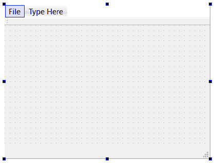

一旦你命名了一个动作，你只需要把它触发的信号连接到你的应用中的一个槽上。 通常，我们在主窗口的构造函数中执行此操作，如下所示：

```cpp
MainWindow::MainWindow(QWidget *parent) : 
    QMainWindow(parent), 
    ui(new Ui::MainWindow) 
{ 
    ui->setupUi(this); 
    connect(ui->actionAbout, &QAction::triggered, this, &MainWindow:
      :handleAbout); 
} 
```

For more information about using menus, refer to Qt's menu sample at [https://doc.qt.io/qt-5/qtwidgets-mainwindows-menus-example.html](https://doc.qt.io/qt-5/qtwidgets-mainwindows-menus-example.html).

我们已经学习了如何创建应用菜单，并使用信号和插槽机制将其链接到功能。 现在让我们继续下一节，学习不同的小部件！

# 创建简单的 Qt 小部件

使用 Qt Creator 中的小部件是体验可用小部件的最佳方式，但您可能最常使用的几个类值得一提。 我们已经讨论过菜单；接下来，让我们看看按钮、文本输入和组合框。 如果您对这些小部件中的任何一个都很好奇，可以启动 Qt Designer 并制作一个：

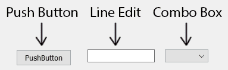

实现按钮、复选框和单选按钮的 Qt 按钮类都继承自`QAbstractButton`类。 您可以在 Qt Creator 的设计器中拖出`QAbstractButton`的任何具体子类，或者以编程方式实例化它们。 通过`QAbstractButton`，所有按钮都具有以下属性：

*   `checkable`：这是一个布尔标志，指示按钮是否具有复选框行为。 默认情况下，此属性的值为 False。
*   `checked`：表示该按钮当前是否处于选中状态。
*   `down`：这是一种指示按钮当前是否处于按下状态的布尔值。
*   `icon`：此属性保存按钮上显示的图标。
*   `shortcut`：此属性保存与按钮关联的助记符。
*   `text`：此属性保存按钮上显示的文本。

按钮提供以下信号，您可以将这些信号连接到应用中的插槽，以检测用户输入：

*   点击该按钮时，该按钮会发出`clicked`信号。
*   当按钮被按下时(即，接收到鼠标或笔下事件)，该按钮发出`pressed`信号。
*   释放按钮时，该按钮会发出`released`信号(即接收到鼠标或竖笔事件)。
*   该按钮在状态从选中变为未选中或反之亦然时发出`toggled`信号。

您可以对父容器中的多个按钮进行分组，如`QFrame`，以控制独占行为；这就是单选按钮的工作方式。 容器的一个很好的选择是`QGroupBox`小部件，它构成其内容的框架并为集合提供标题。 通过在单个`QFrame`容器中放置多个按钮(如`QRadioButtons`)并确保它们的`autoExclusive`属性为`true`(`QRadioButtons`的默认值)，单击一个单选按钮可选中该按钮，同时取消选中所有其他按钮。

让我们看看如何使用 C++代码创建按钮：

```cpp
QPushButton* button = new QPushButton("Some default text", ui->
  centralWidget);
button->setText("Click me!");
```

前面的代码是创建按钮的最小代码。 您也可以通过简单地将按钮从 Qt Designer 拖到画布上来实现这一点。 结果如下所示：

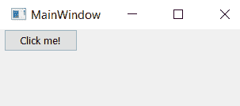

Don't forget that you should use radio buttons for options that have exclusive behavior (that is, only one item can be selected) and checkboxes for items where multiple items can be selected.

我现在已经提到图标两次了，一次是在讨论菜单，另一次是在讨论按钮，但没有真正描述它们在 Qt 中是如何工作的。 当然，您可以直接操作位图(我们将在[章 6](06.html)，*使用 Qt*绘制中进一步讨论这一点)，但对于大多数用户界面元素，您需要一个容器来表示处于各种模式和状态(如按下、释放和高亮显示)的图标。 在 Qt 中，容器是`QIcon`。

使用`QIcon`非常简单；您可以简单地从一个像素图或资源实例化一个。 例如，要将按钮图标设置为应用资源中的特定图像，只需编写以下代码：

```cpp
button->setIcon(QIcon(":/icon.png")); 
```

在幕后，`QIcon`类为您创建了三个用于不同州的附加图标。 这是因为图标实际上可以处于四种模式之一：正常、活动、禁用或选中。 您可以将多个图像应用于`QIcon`，不同的模式将显示不同的图像。 为了更好地理解这一点，我准备了一张图表，以供比较之用，如下所示：


每种模式可以处于两种状态：打开或关闭。

此外，`QIcon`将缩放图标以适应与图标相关联的用户界面元素，因此您可以以用户界面所需的最大分辨率创建图标，并依靠`QIcon`进行缩放以适应界面的各种元素。

让我们继续来看短信。 到目前为止，Qt 小部件中最常见、最易于使用的文本容器是`QLabel`类，它只是一个标签。 `QLabel`实际上可以显示文本或图像；您可以使用它的`setText`方法设置它的文本，使用它的`setPixmap`或`setPicture`方法设置它的图像。 文本可以是纯文本，也可以是富文本；富文本是 HTML4 标记的子集，因此您可以做一些简单的事情，比如设置粗体文本、带下划线的文本，甚至是超链接。 如果您使用带有`QLabel`类的超链接，您应该准备好通过连接到标签的`linkActivated`信号来捕捉用户点击，标签在用户单击链接时会发出该信号，并将该链接的 URL 作为信号的参数发送。

默认情况下，标签显示左对齐、垂直居中的内容；您可以通过调用标签的`setAlignment`方法或通过设置 Qt Creator Designer 中的 Align 属性来更改此设置。 还可以通过调用`setWordWrap`并传递`true`启用换行，或传递`false`禁用换行来设置是否发生换行，从而控制标签的换行。

让我们看看在 C++中创建`QLabel`的代码是什么样子：

```cpp
QLabel* label = new QLabel("This is some text", ui->centralWidget);
```

结果如下所示：

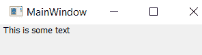

其次是文本输入；Qt 为单行文本输入提供了`QLineEdit`元素，为多行输入提供了`QTextEdit`元素。 无论主机平台是什么，都提供对编辑功能的支持，因此您通常可以使用`QLineEdit`和`QTextEdit`免费获得撤消和重做、复制和粘贴以及拖放功能。

让我们先来谈谈`QLineEdit`，因为它稍微简单一些。 这是一个允许用户编辑单行文本的小部件。 `QLineEdit`具有以下属性，您可以使用 Qt Creator Designer 或在源代码中设置这些属性：

*   `alignment`：此选项控制文本显示时的对齐方式。
*   `cursorPosition`：表示当前光标位置。
*   `displayText`：这将显示显示给用户的文本(根据`echoMode`属性的不同，文本可能会有所不同)。
*   `echoMode`：这可用于控制密码空白或常规输入行行为。
*   `hasSelectedText`：如果文本字段选择了文本，则此属性为`true`。
*   `inputMask`：它控制输入验证(稍后我将详细介绍)。
*   `maxLength`：指定输入行的最大长度(以字符为单位)。
*   `placeholderText`：当文本字段为空时，该文本显示为灰色文本。
*   `readOnly`：当为`true`时，该标志表示文本字段不可编辑。
*   `selectedText`：它包含文本字段中当前选定的文本。
*   `text`：此字段包含输入行的整个文本。

`QLineEdit`具有以下信号：

*   `cursorPositionChanged`：这由行编辑器在光标移动时发出。
*   `editingFinished`：当用户编辑完文本字段并将焦点移到下一个可聚焦元素时，行编辑器会发出此消息。
*   `returnPressed`：当用户按下键盘上的*Return*或*Enter*键时，行编辑器会发出此信息。
*   `selectionChanged`：当所选文本更改时，行编辑器会发出此消息。
*   `textChanged`：当字段中的文本发生更改时，行编辑器会发出此消息，传递字段的新文本。
*   `textEdited`：当用户更改字段中的文本时(而不是当文本以编程方式更改时)，传递字段的新文本时，行编辑器会发出此消息。

让我们来看看创建`QLineEdit`所需的最小 C++代码：

```cpp
QLineEdit* lineEdit = new QLineEdit(ui->centralWidget);
```

前面的代码产生以下结果：

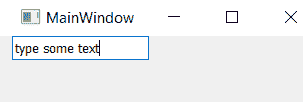

`QLineEdit`实例可以执行输入验证；您可以通过两种方式执行此操作：设置输入掩码或提供验证器。 输入掩码简单且适用于基本任务，例如验证 IP 地址或数字输入。 输入掩码是一个字符串，它指示字符串中每个位置允许的字符类别。 `QLineEdit`为输入掩码定义以下字符类：

| 输入掩码中的字符 | 字符类 |
| `A` | 需要 ASCII 字母字符：A-Z、a-z。 |
| `a` | ASCII 字母字符是允许的，但不是必需的。 |
| `N` | 需要 ASCII 字母数字字符：A-Z、a-z、0-9。 |
| `n` | 允许使用 ASCII 字母数字字符，但不是必需的。 |
| `X` | 任何必需的字符。 |
| `x` | 任何字符都是允许的，但不是必需的。 |
| `9` | 需要 ASCII 数字：0-9。 |
| `0` | ASCII 数字是允许的，但不是必需的。 |
| `D` | 需要 ASCII 数字：1-9。 |
| `d` | ASCII 数字是允许的，但不是必需的(1-9)。 |
| `#` | 允许使用 ASCII 数字或加号/减号，但不是必需的。 |
| `H` | 需要十六进制字符：a-F、a-f、0-9。 |
| `h` | 允许使用十六进制字符，但不是必需的。 |
| `B` | 需要二进制字符：0-1。 |
| `b` | 二进制字符是允许的，但不是必需的。 |
| `>` | 此字符后面的所有字母字符均为大写字母。 |
| `<` | 此字符后面的所有字母字符均为小写。 |
| `!` | 关闭大小写转换。 |
| `\` | 使用`\`转义前面列出的特殊字符，以将其用作分隔符。 |

例如，您可以使用字符串`000.000.000.000;`设置 IP 地址的输入掩码。 这将输入限制为三组四位数字，并用句点括起来。

对于更复杂的验证任务，您可以指定验证器，它是`QIntValidator`、`QDoubleValidator`或`QRegExpValidator`等类的实例，用户每次更改文本时都会调用`QLineEdit`来验证输入。 其中，最灵活的是`QRegExpValidator`，它接受正则表达式并根据正则表达式验证输入。

对于较大的文本块，您需要使用`QTextEdit`实例。 不出所料，`QTextEdit`与`QLineEdit`有很多相同的接口。 不同之处包括：

*   您不能像使用`QLineEdit`那样屏蔽密码输入。
*   如果`QTextEdit`的`acceptRichText`标志为真，则该字段可以接受表示为 HTML4 子集的富文本。
*   `QTextEdit`的富文本可作为 HTML 属性使用，而解析后的文本可作为文本属性使用。

最后是`QComboBox`，它将输入行与下拉菜单相结合，提示用户选择预存文本。 正如您可能想象的那样，它的界面类似于菜单和输入行；您可以使用`addItem`和`insertItem`向组合框追加和插入文本项。 您需要连接到它的`highlighted`和`editTextChanged`信号，当用户选择菜单项或更改文本输入行时，它会发出这些信号。

让我们来写一些代码吧！

```cpp
QComboBox* cbox = new QComboBox(ui->centralWidget);
cbox->addItem("Option 1");
cbox->addItem("Option 2");
cbox->addItem("Option 3");
```

前面的代码产生以下结果：


到目前为止，我们已经学习了如何在 Qt 中使用 C++代码创建按钮、文本输入字段和组合框。 您可以使用类似的方法创建其他类型的小部件，并将它们放入您的应用中。 但是，如果没有布局，小部件将无法正确放置。 让我们继续下一节，学习如何使用布局管理小部件定位。

# 使用布局管理小部件布局

Qt 小部件包括一个健壮的布局系统来控制小部件在显示器上的呈现。 布局基本上类似于小部件；它们可以放在应用上、命名、成为其他小部件的父级等等。

但是，与小部件不同的是，它们的唯一目的是管理小部件及其在应用中的位置。 下面的屏幕截图说明了布局的目的。 请注意，我们在这里仅显示了一种布局类型(垂直布局)，稍后我们将讨论许多其他类型的布局：

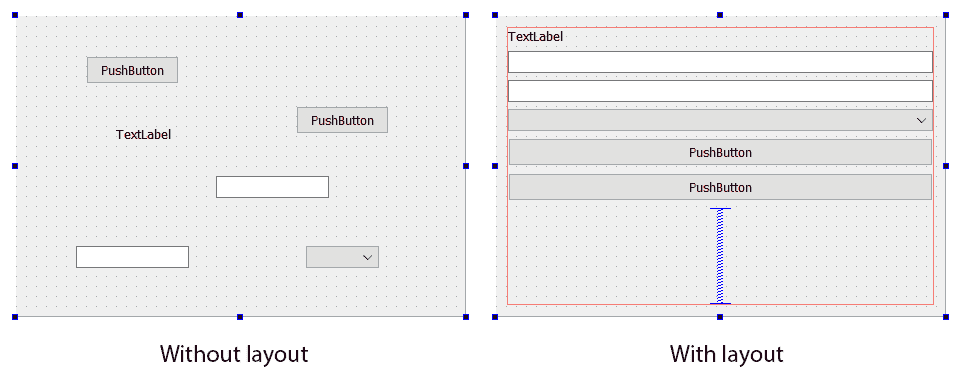

在 Qt Creator Designer 中，您可以从以下布局中进行选择：

*   `QBoxLayout`：这将水平或垂直地布局其视图子对象。
*   `QHBoxLayout`：这将水平布局其视图子对象。
*   `QVBoxLayout`：这将垂直布局其视图子对象。
*   `QFormLayout`：这将并排布局成对的小部件(如标签和文本框)，然后垂直平铺这些成对的小部件，从而提供表单的外观。
*   `QGridLayout`：这将在网格中布局小部件。
*   `QStackedLayout`：这一次只显示一个小部件。

使用这些布局中的一种很简单：只需在 Qt Creator Designer 中选择适当的布局并将其拖动到您正在构建的小部件或窗口即可。 如果要在代码中构建小部件的层次结构，请将小部件添加到布局并设置父小部件的布局，如下所示：

```cpp
QWidget *window = new QWidget(); 
QPushButton *button1 = new QPushButton("One"); 
QPushButton *button2 = new QPushButton("Two"); 
QPushButton *button3 = new QPushButton("Three"); 

QHBoxLayout *layout = new QHBoxLayout; 
layout->addWidget(button1); 
layout->addWidget(button2); 
layout->addWidget(button3); 

window->setLayout(layout); 
window->show(); 
```

前面的代码生成如下所示的结果：


布局与小部件的`sizePolicy`和`sizeHint`属性协同工作。 这些属性向布局和布局管理器提供有关小部件应该如何布局的信息。 `sizePolicy`属性是`QSizePolicy`类的实例，它控制布局首选项以在水平和垂直方向上的布局之间进行选择，在每个方向上提供以下选项：

*   `QSizePolicy::Fixed`：这里，小部件的`sizeHint`属性是小部件应该达到的唯一大小。
*   `QSizePolicy::Minimum`：在这里，小部件的大小是它所能达到的最小大小，它越大没有任何好处。
*   `QSizePolicy::Maximum`：这里，小部件的大小是它可以达到的最大大小；它可以更小，但不能更大。
*   `QSizePolicy::Preferred`：在这里，如果可以，将考虑小部件的`sizeHint`属性。
*   `QSizePolicy::Expanding`：这用于指示`sizeHint`属性是建议的，但如果它可用，则可以使用更多空间。
*   `QSizePolicy::MinimumExpanding`：这用于指示`sizeHint`是最小且足够的，但如果可用，则可以使用更多空间。

Qt 小部件中的小部件具有适用于目标平台的常规 UI 约束的大小策略，您通常不需要使用`QSizePolicy::setVerticalPolicy`或`QSizePolicy::setHorizontalPolicy`更改策略。

Use the layout classes and their defaults as much as you can in your application to ensure cross-platform compatibility and proper layout on screens of different sizes. If you're worried about individual pixel placement for your widgets, you're likely doing something wrong and will end up with a user interface that doesn't look like what you expect on at least some systems some of the time.

有关使用 Layout 类管理小部件布局的更多信息，请参阅[https://doc.qt.io/qt-5/layout.html](https://doc.qt.io/qt-5/layout.html)上的 Qt 文档。

我们了解了如何在 Qt 应用中使用不同类型的布局来管理小部件。 让我们在下一节继续学习模型-视图-控制器编程。

# 基于 Qt 的模型-视图-控制器编程

编写软件是管理抽象的练习。 你能对你的软件系统进行越多的抽象推理，你的境况就越好。 自 20 世纪 70 年代以来在 GUI 世界中出现的一个关键抽象是**模型-视图-控制器**(**MVC**)范例。 我将在这里简要讨论 MVC，但是网上有很多关于 MVC 的文章，所以如果你对它是新的，你绝对应该去你最喜欢的搜索引擎去查找它。

在 MVC 中，您将与用户界面相关的代码划分为三个逻辑组件：

*   **模型**：它负责存储要显示给用户的数据。 它是某种类型的容器，不了解您的用户界面、应该如何绘制内容，或者用户在与您的应用交互时应该触发哪些事件或方法。
*   **View**：这负责在显示器上绘制模型的内容。
*   **控制器**：它负责操作模型和视图的内容，以响应各个用户操作。

这些独立的逻辑组件中的每一个只通过定义良好的接口与下一个组件通信，如下所示：

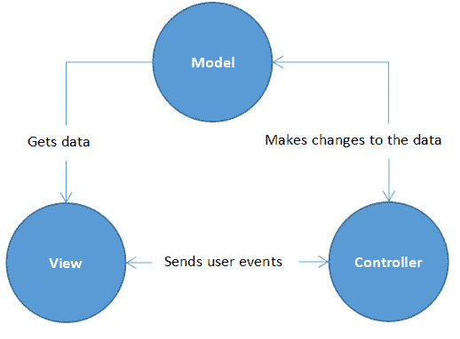

在 Qt 中，视图和控制器被简单地组合到视图中，这种排列称为**模型/视图**模式。 为了使用户界面开发尽可能通用，Qt 还引入了一个委托，它可以在共享相同视图和模型的同时轻松地进出不同的用户事件处理程序。 MVC 和模型/视图模式的共同点是数据和视图是分开的，这允许您对不同的视图使用相同的数据模型，或者将不同的模型用于相同的视图。 正如您所预期的那样，模型及其视图通过信号和插槽进行通信。

Qt 使用模型/视图模式来管理其更复杂的用户界面元素，如列表视图、表视图和树视图。 使用 Qt 模型类的视图类如下：

*   `QListView`：这显示了项目的顺序列表。
*   `QTreeView`：这显示了层次结构中项目的树状视图。
*   `QTableView`：这显示了项目的表视图。

所有这些视图都接受 Qt 的一个模型类来存储 Qt 呈现给用户的数据；Qt 提供的这些模型类都继承自以下抽象基类之一：

*   `QAbstractItemModel`：这足够灵活，可以处理以表、列表和树的形式表示数据的视图。
*   `QAbstractListModel`：这是一个更加专门化的模型超类，经过优化可以在列表视图中显示数据。
*   `QAbstractTableModel`：这是一个更加专门化的模型超类，针对在表视图中显示数据进行了优化。

大多数情况下，您不需要为您的应用创建自己的模型。 Qt 提供了几个对许多应用都足够好的具体模型实现：

*   `QStringListModel`：这可用于存储字符串的顺序列表。
*   `QStandardItemModel`：这可用于在任意树层次结构中存储项目。
*   `QFileSystemModel`：这可以用作文件系统上的数据模型。
*   `QSqlQueryModel`、`QSqlTableModel`和`QSqlRelationalTableModel`：它们可以在 SQL 数据库上使用。

If these classes don't meet your needs, you can implement a subclass of one of the abstract model classes and hook that to your view. Typically, you'd choose to do this for one of two reasons: either the existing implementation isn't performant enough for your needs (typically not a problem unless you're managing thousands of items in the model), or you're trying to put a model in front of a new data source other than memory, the filesystem, or SQL.

For example, if you were building a database browser over a MongoDB database, you might want to create a model that queries and updates the MongoDB database directly. If this is an option you need to pursue, be sure to see the Qt documentation on the topic at [https://doc.qt.io/qt-5/model-view-programming.html#creating-new-models](https://doc.qt.io/qt-5/model-view-programming.html#creating-new-models).

# 分析一个具体的模型子类

让我们花点时间看一下具体的模型子类，看看如何将数据移入移出它。 到目前为止，您将使用的最常见的模型是`QStandardItemModel`，它将其项存储为一个由`QStandardItem`实例组成的二维数组。 每个`QStandardItem`实例可以存储以下内容：

*   与模型中的项关联的数据。 这通常是一个字符串，但也可以是数字或布尔值。 您可以使用`data`方法访问它，并使用`setData`方法设置它。
*   用于在视图中呈现项的字体。 您可以使用`font`方法访问它，并使用`setFont`方法设置它。
*   与项目关联的可选图标。 您可以使用`icon`方法访问它，并使用`setIcon`方法设置它。

*   是否可以用复选标记标记该项目，如果可以，则该项目是否处于选中状态。 您可以使用`checkable`和`setCheckable`方法来指示是否可以标记该项，使用`checked`和`setChecked`来实际设置该项的检查状态。
*   是否可以将项目拖放到其中。 您可以使用`dragEnabled`、`dropEnabled`、`setDragEnabled`和`setDropEnabled`方法来获取和设置这些选项。
*   项目是否可编辑。 您可以使用`editable`和`setEditable`方法获取和设置项目的可编辑状态。
*   该项是否可选。 您可以使用`selectable`和`setSelectable`方法来获取和设置项目的可选状态。
*   该项的工具提示。 您可以使用`toolTip`和`setToolTip`方法来获取和设置项目的工具提示。

每个`QStandardItem`方法还可以有自己的行和列，使其能够存储树结构。 您可以通过调用`appendRow`、`appendColumn`、`removeRow`或`removeColumn`来操作行和列。 例如，要创建表示树的简单模型，可以编写以下代码：

```cpp
QStandardItemModel model; 
QStandardItem *parentItem = model.invisibleRootItem(); 
for (int i = 0; i < 4; ++i)
{ 
    QStandardItem *item = new QStandardItem(QString("node %0").arg(i)); 
    parentItem->appendRow(item); 
    parentItem = item; 
} 
```

这将创建一个具有根元素的模型，该模型具有四个子元素，每个子元素都在各自的行中。 有了这个模型，您就可以创建一个树视图来显示该模型，如下所示：

```cpp
QTreeView *treeView = new QTreeView(this); 
treeView->setModel(myStandardItemModel); 
```

当然，您需要知道什么时候单击某个项目；当用户单击某个项目时，`QTreeView`方法会发出`clicked`信号，因此您可以将此信号连接到类中的槽：

```cpp
connect(treeView, &QTreeView::clicked, this, &MainWindow::clicked); 
```

Qt 模型/视图视图使用`QModelIndex`类来指示模型中项目的索引；`QStandardItem`从不在模型和视图之间传递。 `QModelIndex`提供`itemFromIndex`方法在模型中指定的位置返回`QStandardItem`。 请注意，您不应该在应用中缓存`QModelIndex`实例任何时间长度，因为如果模型在您下面更改，则给定数据的索引也会更改。 同样，如果您需要某项在其模型中的索引，请调用该项的`index`方法，该方法返回模型中该项的`QModelIndex`。

# 在 Qt Creator 上使用 MVC 模型

虽然前面的示例显示了如何在 C++中将 MVC 模型完全应用于树视图，但让我们看看如何在 Qt Designer 中使用小部件实现相同的功能。 Qt Creator 中有几个小部件可以与 MVC 设计模式一起使用；它们被称为基于模型的项目视图：

*   列表视图
*   树状视图
*   表视图
*   列视图
*   撤消视图

除了呈现给用户的方式不同之外，它们都非常相似。 这些小部件是控制器和视图的实现位置。 控制器(有时称为**Delegate**)是应用逻辑的地方，例如表示层(视图)和数据层(模型)之间的交互规则。 例如，我们可以通过委托使表可编辑，并在用户完成编辑时更新模型中的数据。 视图将向用户提供 UI，委托将处理视图呈现和编辑背后的逻辑。 最后，模型是存储数据的实际容器。 可以将同一模型应用于不同的代理和视图，因为它们是分开的。 这就是使用 MVC 设计模式的优势，它为您提供了很大的灵活性。

在 Qt Designer 中，您可以在 Widget 框中找到内置的 Widget。 在本例中，我们不使用基于项目的小部件类别中的基于项目的小部件，因为这些小部件具有内置的模型，并且不能修改：


对于 GUI 设计，它非常简单。 首先，我们删除菜单栏、工具栏和状态栏，因为我们不需要这些额外的面板。 然后，我们将一个表视图放到中心小部件上，如下所示：


然后，选择中心小部件并单击位于画布上方的 Layout。 表视图现在将填满整个主窗口：

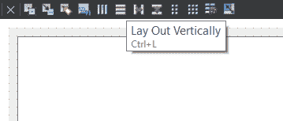

由于`QTableView`已经处理了视图和委托，我们只需要自己处理模型。 Qt 支持的机型有多种类型，如下所示：

*   `QStandardItemModel`
*   `QStringListModel`
*   `QSqlTableModel`
*   `QDirModel`

如果您愿意，甚至可以通过继承其中一个抽象模型类来创建自己的模型：

*   `QAbstractProxyModel`
*   `QAbstractListModel`
*   `QAbstractTableModel`

其中一些内置模型是为单列数据结构设计的，而另一些模型则支持多列甚至递归树状结构。 对于我们的例子，我们需要一个支持多列的模型来适应我们的表视图。

因此，在我们的`MainWindow`类的构造函数中，我们创建了一个`QStandardItemModel`对象，它为为我们的表创建多列和多行提供了很大的灵活性。 出于测试目的，我们将列计数设置为`5`，将行计数设置为`10`：

```cpp
MainWindow::MainWindow(QWidget *parent) : QMainWindow(parent), ui(new Ui::MainWindow)
{
    ui->setupUi(this);

    QStandardItemModel* model = new QStandardItemModel(this);
    model->setColumnCount(5);
    model->setRowCount(10);
```

之后，我们使用两个`for`个循环在标准模型中插入一些虚拟数据。 我们循环遍历每一列和每一行，然后创建一个带有单词`"row #, column #"`(`#`表示行号和列号)的`QStandardItem`对象，并将其附加到其各自的位置。 请注意，我在行号和列号中都添加了`1`，这样它们就不会从零开始：

```cpp
    for (int row = 0; row < model->rowCount(); row++)
    {
     for (int column = 0; column < model->columnCount(); column++)
        {
            QStandardItem *item = new QStandardItem(QString("row %0, 
              column %1").arg(row + 1).arg(column + 1));
            model->setItem(row, column, item);
        }
    }
```

最后，我们在表视图上调用`setModel`并将模型应用于它：

```cpp
    ui->tableView->setModel(model);
}
```

此外，不要忘记在顶部包括所需的标头：

```cpp
#include <QStandardItemModel>
#include <QMessageBox>
```

如果您现在构建并运行该程序，您应该看到如下所示：

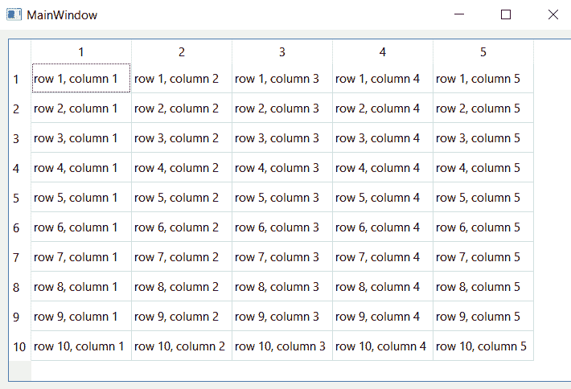

您甚至可以双击任何数据块并动态编辑数据。 这是`QTableView`类中委托的默认行为，可以通过 Qt 设计器(或 C++代码，如果愿意)禁用它。 让我们尝试通过选择表视图并将其 editTriggers 属性设置为 NoEditTriggers 来禁用它：


我们希望将双击行为改为其他行为。 让我们右键单击 Qt Designer 上的表视图，然后在弹出菜单中选择 Go to Slot。 然后，选择 DoubleClicked(QModelIndex)信号并按 OK：


系统将为您创建一个插槽功能。 我们只需弹出一个消息框，并在双击时显示数据块中的数据：

```cpp
void MainWindow::on_tableView_doubleClicked(const QModelIndex &index)
{
    QMessageBox::information(this, "Data", index.data
       (Qt::DisplayRole).toString());
}
```

在前面的代码中，我们提示一个标题为`"Data"`的信息消息框，并将数据作为消息。 我们使用`DisplayRole`指定要获取文本，而不是 DecorationRole 图标或 ToolTipRole 工具提示。 下面的屏幕截图取自官方文档，清楚地显示了不同角色之间的区别：

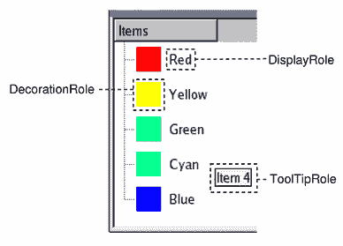

如果我们再次构建并运行该程序，则在双击表时应该会得到以下结果：

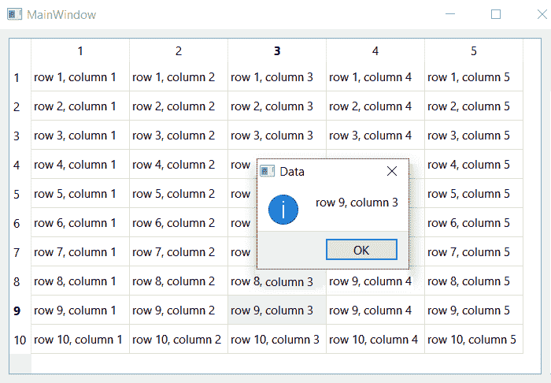

从前面的示例中，我们了解了如何实现我们自己的模型，并将其应用于我们使用 Qt Designer 创建的表视图。 同样，这些都是 Qt 的内置 MVC 设计模式，它们总是试图通过从用户中移除一些控件来使事情变得更容易。 例如，Qt 的 MVC 只适用于一种数据结构，并且内置了控制器，具有更简单的视图结构。 如果您想为您的程序提供更合适的**和**MVC 设计模式，您可以随时编写自己的设计模式，老实说，这是一项相当复杂的任务。

For more information about Qt's application of the model/view pattern, see [https://doc.qt.io/qt-5/model-view-programming.html](https://doc.qt.io/qt-5/model-view-programming.html).

我们已经学习了如何利用模型-视图-控制器编程来动态显示数据。 接下来，我们将学习如何使用 QWebEngine 显示 Web 内容。

# 使用 QWebEngineView 呈现 Web 内容

Qt 在其 Qt WebEngine 模块中包含 WebEngine 端口，这是 Chromium 和几个开源浏览器背后的流行浏览器实现。 使用 Qt WebEngine 模块，您的应用可以显示丰富的 HTML，甚至是一个功能齐全的 Web 浏览器。 创建混合应用非常容易，它既包含本地应用的功能，又具有显示来自本地资源、本地文件系统或互联网的 Web 内容的能力。

Do note that the Qt WebEngine module only works on MSVC compilers. You will get an error if you use other compilers.

要使用 Qt WebEngine 模块，您必须通过将以下内容添加到 PRO 文件来将其包含在您的应用中：

```cpp
QT += webenginewidgets 
```

访问 Qt WebEngine 小部件类的任何源文件还应包含带有以下`#include`语句的接口：

```cpp
#include <QtWebEngineWidgets>
```

此模块公开的网页表示的关键类是`QWebEngineView`；使用它就像在 Qt Creator Designer 中将其添加到布局中，然后告诉它打开文档一样简单，如下所示：

```cpp
QWebEngineView *view = new QWebEngineView(ui->centralWidget); 
view->load(QUrl("http://www.zhieng.com")); 
```

前面的代码产生以下结果：


`load`方法启动启动网络层的过程，解析 URL，获取内容，并呈现结果。 您还可以使用`QWebEngineView`的`setUrl`方法来设置它的`url`属性，该属性会触发相同的流，或者如果您在本地拥有 HTML(例如，您通过编程方式构建它或从资源中获取它)，则只需调用它的`setHtml`方法即可。

当`QWebEngineView`正在加载页面时，它会发出三个信号：

*   `loadStarted`：这是在页面开始加载时发出的。
*   `loadProgress`：当 web 视图的每个元素完成加载时，都会发出此消息。
*   `loadFinished`：页面加载完成后将发出此消息。

`QWebEngineView`具有以下属性：

*   `hasSelection`：如果用户在`QWebEngineView`中选择了区域，则为`true`。
*   `icon`：这是`QWebEngineView`的图标。
*   `selectedText`：这包含用户在`QWebEngineView`中选择的未标记文本。
*   `title`：这包含文档的标题。
*   `url`：这包含文档的 URL。
*   `zoomFactor`：这是一个实数，指示页面在呈现时应该缩放多少。 默认值`1.0`表示不应进行缩放。

`QWebEngineView`包含`QWebEnginePage`的一个实例，可通过`page`方法获得。 `QWebEnginePage`方法本身就是执行实际渲染的方法，它还有几个额外的信号，您可以监视它们来观察渲染引擎本身的行为：

*   `loadStarted`：这是在`QWebEnginePage`开始加载文档时发出的。
*   `loadFinished`：这是在`QWebEnginePage`完成页面加载时发出的。
*   `urlChanged`：当`QWebEnginePage`要在加载新网页之前更改其 URL 时发出此消息。 该信号将新的 URL 传递到连接到该信号的插槽。

在创建混合应用时，您可能希望从应用的 JavaScript 访问 C++应用中的应用数据。 `QWebChannel`类提供了`registerObject`方法，该方法允许您将`QObject`实例绑定到作为网页`window`对象的子级的槽。 例如，让我们编写以下代码片段：

```cpp
QWebEnginePage *page= myView->page(); 
QWebChannel *channel = new QWebChannel(page);
page->setWebChannel(channel);
channel->registerObject(QString("TheNameOfTheObjectUsed"), this);
```

在 JavaScript 中，对象的属性在公开的对象中以槽的形式提供，因此您可以跨 C++/JavaScript 边界共享数据。 桥还允许您通过在 JavaScript 中调用 JavaScript 对象上的信号函数来跨边界扩展脚本调用；这将导致连接到该信号的任何插槽执行。 类似地，您的 JavaScript 对象支持`connect`方法，该方法允许您将命名槽连接到 JavaScript 代码，因此从 C++调用信号将调用连接到该槽的 JavaScript 方法。

For more information about `QWebEngineView` and Qt's support for the WebEngine browser, refer to the Qt documentation at [https://doc.qt.io/qt-5/qtwebengine-overview.html](https://doc.qt.io/qt-5/qtwebengine-overview.html).

我们已经学习了如何使用 QWebEngineView 显示网页内容，并创建了我们自己的迷你网页浏览器。 在下一节中，我们将学习如何在 Qt Creator 中使用模型编辑器。

# 使用模型编辑器

模型编辑器是 Qt 工具集中的新成员。 您可以使用它来创建**通用建模语言**(**UML)**样式的模型，以可视化您的应用的行为。 这是与您的程序员沟通或向您的团队展示您的想法的好方法之一。 目前，模型编辑器仍处于 Beta 测试阶段，并将在以后的版本中进行更改。 目前，您需要在 Qt Creator 中启用它，然后才能使用它。 要执行此操作，请尝试以下步骤：

1.  转至 Help(帮助)|About Plugins(关于插件)，打开 Installed Plugins(已安装插件)窗口。 确保已选中 ModelEditor 选项。

2.  之后，您可以转到文件|新建文件或项目，然后在文件和类|建模下选择文件模型或临时模型选项来创建新模型文件。 另一个选项，State Chart，用于状态机编辑，因此与我们当前的主题无关。 请参阅以下屏幕截图以更好地了解：


3.  一旦您创建了模型文件，让我们用 Qt Creator 打开它们。 您将看到专门为模型编辑设计的全新用户界面：

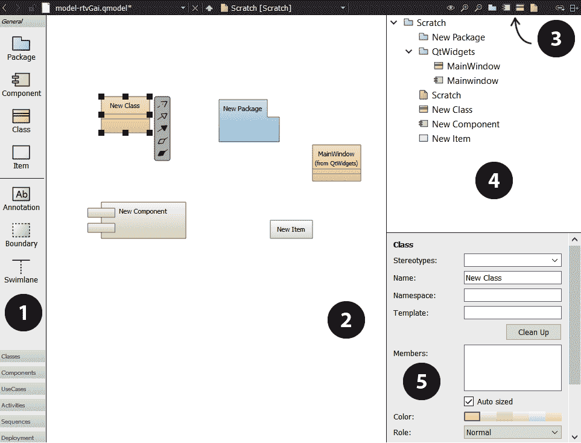

用户界面包含五个不同的部分，如下所述：

1.  元素工具栏：您可以将元素从此工具栏拖放到模型编辑器中。
2.  模型编辑器：这是模型可视化的地方。 您可以在此编辑器视图中编辑模型。
3.  工具栏按钮：您可以在这里找到一些快捷按钮，如放大、缩小、缩放到原始大小、添加包、添加组件、添加类、添加画布图。

4.  元素树：元素树以树形图的形式显示您添加到模型编辑器中的所有元素。 您可以在这里选择或删除元素，而不是在模型编辑器中进行选择或删除。
5.  属性编辑器：在此编辑刚刚选择的元素的属性。

就像任何其他 UML 建模软件一样，您可以将不同类型的图放置到编辑器视图中，并编辑其名称、颜色、角色和图元素的其他属性。 您还可以将不同的元素链接在一起，以可视化它们之间的关系。

对结果满意后，您可以转到文件->|>导出图表，将图表另存为图像。 除此方法外，您还可以选择编辑器视图中的所有元素，然后按键盘上的*Ctrl*+*C*将其转换为 300dpi 图像，然后将其存储到剪贴板中。 您可以按*Ctrl*+*V*将图像粘贴到首选的文字处理软件或图像编辑软件上。

我们已经学习了如何使用 Qt Creator 套件提供的模型编辑器。 让我们进入下一节，在您的 Qt Creator 上启用 LSP。

# 在 Qt Creator 上启用 LSP

**LSP**(**Language Server Protocol**的缩写)是最近版本中添加到 Qt 的最新功能之一。 LSP 通过添加对 C++和 QML 以外的其他编程语言的支持，使 Qt 变得更加强大。 通过为 LSP 提供客户端，Qt Creator 可以为支持 LSP 的编程语言提供以下功能：

*   代码自动完成
*   当符号发生鼠标悬停事件时突出显示该符号
*   代码共享
*   通过查看文档大纲检查代码
*   集成来自语言服务器的诊断
*   查找对符号的引用
*   导航到符号定义

这扩展了 Qt Creator 的用途，并消除了将 Qt 保持在 C++领域内的障碍。 您甚至可以使用 Qt Creator 编写 Python 项目，并在不离开 Qt 的情况下直接执行代码！ 因此，要在 Qt 创建者中启用 LSP，请转到 Help|About Plugins。 然后，在 Installed Plugins 中，查找 LanguageClient(实验性)选项，并确保选中该选项。 选中该选项后，可能需要重新启动 Qt Creator。 下面的屏幕截图显示了这一点：


在 Qt Creator 中使用替代语言之前，您需要做几件事。

1.  首先，您必须先安装语言服务器，然后 Qt 才能使用它。 例如，如果您计划使用 Python，则必须从[https://www.python.org](https://www.python.org)下载安装程序并将其安装到您的计算机上。

2.  完成后，您可以开始将语言服务器添加到您的 Qt Creator 中，方法是转到工具->->选项...--|语言客户端。
3.  然后，单击 Add 按钮。 下面的屏幕截图显示了这一点：


在应用该语言之前，请填写该语言的信息：

4.  完成后，单击确定。 您现在可以开始使用默认情况下 Qt 不支持的替代语言编写代码了！ 下面的屏幕截图就是这样一个例子：

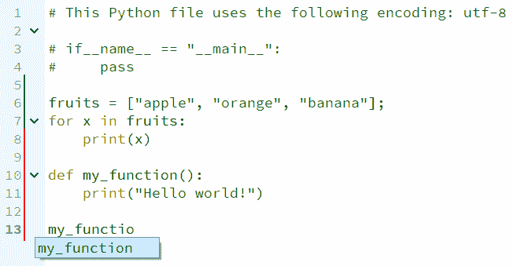

前面的屏幕截图显示了使用 Qt Creator 编写 Python 时的代码完成和语法突出显示。

Do note that currently, the LSP is still an experimental feature. It might not work very well on all languages since Python is the only language that has been fully tested. It is not recommended to use it on critical commercial projects.

在本节中，我们了解了如何在 Qt Creator 上启用 LSP。 我希望你能发现这一点很有用，它能提高你的工作质量，提高工作效率。

# 简略的 / 概括的 / 简易判罪的 / 简易的

在本章中，我们对 Qt 窗口小部件模块进行了一次旋风式的浏览。 我们了解了一些可用的基本小部件，以及它们提供的信号、插槽和属性。 我们还了解了 Qt 对 MVC 范例的应用，以及对于像和树视图这样的复杂小部件，Qt 如何将关注点分离为模型和视图，从而允许我们为应用实现新的数据模型，或者基于这些数据模型创建新的视图。 然后，我们了解了 Qt 对 WebEngine 浏览器的支持，这让我们可以构建混合应用，将 JavaScript 和 HTML 的优点与 Qt 的优点结合起来。 最后，我们了解了 Qt 小部件的新功能，以及它们如何帮助应用开发和语言支持。

在下一章中，我们将从窗口小部件转到底层绘图，我们可以使用它来实现我们自己的窗口小部件或基本的基于像素的渲染应用。