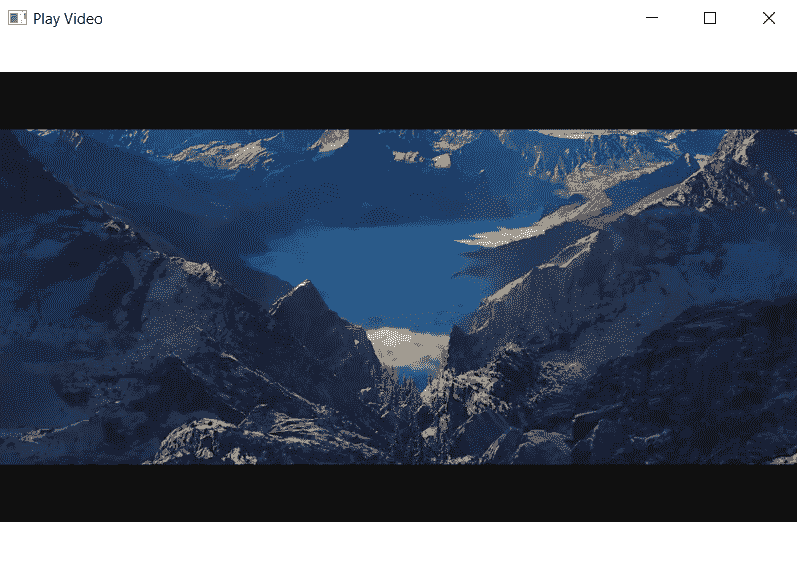
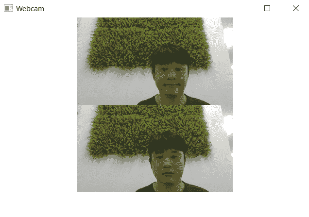

# 八、使用 Qt Quick 实现多媒体

今天的应用越来越多地使用多媒体来增强其对用户的吸引力。 音效是大多数用户界面的关键部分，许多应用都包含视频教程或其他视频内容。 有些应用甚至使用许多设备上提供的摄像头；尤其是移动应用，大多数移动设备至少有一个摄像头(如果不是两个或更多摄像头的话)。

在本章中，我们将看看 Qt Quick 对多媒体的支持。 我们将从概述可能的功能开始，这样您就可以理解使用 Qt 提供的与平台无关的多媒体支持可以构建什么，不可以构建什么。 接下来，我们将详细介绍提供音频和视频播放访问的 Qt Quick 组件，以及如何使用摄像头(如果支持)。

在本章中，我们将介绍以下主题：

*   在 Qt 中实现多媒体
*   播放音频剪辑和音效
*   播放视频剪辑
*   访问摄像机

# 技术要求

本章的技术要求包括 Qt 5.13.1 MinGW 64 位、Qt Creator 4.10.0 和 Windows 10。

本章的 GitHub 链接可在此处找到：

[https：//github.com/PacktPublishing/Application-Development-with-Qt-Creator-Third-Edition/tree/master/Chapter08](https://github.com/PacktPublishing/Application-Development-with-Qt-Creator-Third-Edition/tree/master/Chapter08).

# 在 Qt 中实现多媒体

长期以来，Qt 通过包含其音频库，在它支持的 C++平台上提供了一些对多媒体的支持。 在 Qt 5.0 及更高版本中，Qt Quick 提供了几个对象来与 Qt 提供的本地支持和 Qt 提供的底层平台进行交互。 使用这些 QML 组件，您可以执行以下操作：

*   在背景中播放声音剪辑和短音效
*   播放视频内容
*   显示相机取景器
*   从摄像机捕获摄像机内容

Qt 实际支持的内容取决于目标平台；例如，如果硬件没有摄像头，您就无法显示摄像头取景器或拍照。 在实践中，支持的级别也各不相同；例如，在我撰写本文时，Windows 上的多媒体支持非常差。 此外，Qt 可以播放的音频和视频的实际格式取决于随 Qt 安装的库，而库本身又取决于目标平台。 Linux 等平台可能需要额外的库才能完全支持许多音频和视频文件使用的视听编码器/解码器(编解码器)。

要使用我们将在本章中讨论的任何多媒体类型，您的 QML 实例必须导入`QtMultimedia`模块，如下所示：

```cpp
import QtMultimedia 5.12 
```

In this chapter, we'll focus on the Qt Quick multimedia interfaces. If you're interested in using the lower-level C++ APIs, see the Qt Multimedia documentation at [https://doc.qt.io/qt-5/multimediaoverview.html](https://doc.qt.io/qt-5/multimediaoverview.html).

我们已经了解了 Qt 中多媒体模块的功能和用法。 让我们继续下一节，了解如何支持此模块并使用它播放音频剪辑。

# 播放音频剪辑和音效

Qt Quick 提供了`SoundEffect`类型，可以在最小延迟的情况下播放短小的音效。 这对于按钮点击声音、虚拟键盘声音和提示音等内容尤其有用，因为它们是丰富且引人入胜的多媒体体验的一部分。 使用它很简单；您可以为该类型提供一个`source`字段，并调用它的`play`方法来开始播放，如下所示：

```cpp
import QtQuick 2.12
import QtQuick.Window 2.12
import QtMultimedia 5.12

Window {
    visible: true
    width: 320
    height: 240
    title: qsTr("Play Sound")

    Text {
        text: "Click Me!";
        font.pointSize: 24;
        width: 150; height: 50;

        SoundEffect {
            id: playSound
            source: "soundeffect.wav"
        }
        MouseArea {
            id: playArea
            anchors.fill: parent
            onPressed: { playSound.play() }
        }
    }
}
```

前面的代码产生以下结果：


在这里，当您单击鼠标区域时，`SoundEffect`将播放存储在应用资源中的`soundeffect.wav`文件的内容。 您可以通过调用音效的`stop`方法来停止音效，否则它会一直播放到完成。

`SoundEffect`类型有一些更改音效播放方式的附加字段：

*   `loops`字段指示调用`play`后声音在回放中循环的次数。
*   `loopsRemaining`字段表示在播放声音时还剩下多少次播放循环。
*   播放声音时，`playing`字段为真。
*   `volume`字段表示音量，范围从`0.0`(无音频)到`1.0`(最大音量)。
*   `status`字段是指示播放状态的枚举。 它可以具有下列值之一：
    *   `SoundEffect.Null`：未设置声音。
    *   `SoundEffect.Loading`：正在加载声音。
    *   `SoundEffect.Ready`：声音已准备好播放。
    *   `SoundEffect.Error`：加载或播放期间出错。

对于较长的音频位，最好使用`Audio`类型。 `Audio`类型的用法与此类似；您可以给它一个源，指示音频应该来自哪里，然后调用它的`play`方法开始回放。 您可以通过调用其`pause`方法暂停播放，通过调用其`stop`方法停止播放，或者通过调用`seek`并传递 Time to Seek 中的偏移量来查找音频中的时间偏移量(假设音频源支持查找；某些源，如 Web 流，不支持查找)。 您可以按如下方式使用它：

```cpp
import QtQuick 2.12
import QtQuick.Window 2.12
import QtMultimedia 5.12

Window {
    visible: true
    width: 320
    height: 240
    title: qsTr("Play Sound")

    Text {
        text: "Click Me!";
        font.pointSize: 24;
        width: 150; height: 50;

        Audio {
            id: playMusic
            source: "music.wav"
        }
        MouseArea {
            id: playArea
            anchors.fill: parent
            onPressed: { playMusic.play() }
        }
    }
}
```

`Audio`类型包括以下影响播放的属性：

*   `autoLoad`：默认为`true`，并强制元素在初始化时开始加载媒体。
*   `autoPlay`：默认为`false`，但是当它是`true`时，一旦元素在初始化时加载，它就开始播放。
*   `bufferProgress`：这是`0.0`到`1.0`范围内的实数，表示播放缓冲区已满的程度。
*   `duration`：这表示音频剪辑的持续时间。
*   `error`和`errorString`：它们包含回放失败时的错误信息。
*   `hasAudio`和`hasVideo`：它们分别指示剪辑是否有音频和视频。
*   `loops`：表示音频应该播放的次数。
*   `muted`：如果用户已将音频静音，则为`true`。
*   `position`：表示音频播放中的位置。
*   `seekable`：如果音频流支持查找，则此属性为`true`。
*   `volume`：表示播放音量为从`0.0`(无音频)到`1.0`(满音量)的实数。

`Audio`类型还有一个`metaData`属性，该属性包括有关正在播放的音频的信息(如果在流中编码的话)。 它包括`albumArtist`、`albumTitle`、`audioBitRate`、`category`、`comment`等字段。

与`Audio`类型类似的是`MediaPlayer`类型，它既支持音频播放，也支持视频播放(我们将在下一节看到)。 对于音频播放，其用法与`Audio`类型相同。

我们已经学习了如何使用`SoundEffect`对象播放音频剪辑和音效。 让我们进入下一节，学习如何播放视频剪辑！

# 播放视频剪辑

播放视频和播放音频一样简单；有一个`Video`类型支持播放视频并在显示器上显示视频。 这是一个视频播放器，当你点击它时，它会播放视频，当你按下空格键时，它会暂停并重新开始播放：

```cpp
import QtQuick 2.12
import QtQuick.Window 2.12
import QtMultimedia 5.12

Window {
    visible: true
    width: 800
    height: 600
    title: qsTr("Play Video")

    Video {
        id: video
        width : 800
        height : 600
        source: "video.avi"

        MouseArea {
            anchors.fill: parent
            onClicked: {
                video.play()
            }
        }

        focus: true
        Keys.onSpacePressed:
            video.playbackState == MediaPlayer.PlayingState ?
                video.pause() :
                video.play()
    }
}
```

前面的代码产生以下结果：



`Keys`类型为按下的各种键发出信号；在这里，我们将`spacePressed`信号绑定到暂停并播放视频的脚本。

除了没有`metaData`属性外，`Video`的大多数属性与`Audio`相同。 它是`Item`的子类，因此通常的定位属性(如`anchors`、`x`、`y`、`width`和`height`)可用于将项放置在其父项中。 请注意，由于性能原因，`Video`实例上的所有转换可能并不都可用；例如，通常不能自由旋转一个转换。

您也可以使用`MediaPlayer`实例和`VideoOutput`实例播放视频内容。 与`Video`一样，`VideoOutput`类型也是`Item`的子类，本质上是与`MediaPlayer`实例关联的视频编解码器呈现视频的画布。 您可以通过在其`source`属性中指定一个`MediaPlayer`实例来使用它，如下所示：

```cpp
import QtQuick 2.12
import QtQuick.Window 2.12
import QtMultimedia 5.12

Window {
    visible: true
    width: 800
    height: 600
    title: qsTr("Play Video")

    Rectangle {
 width: 800
 height: 600
 color: "black"

 MediaPlayer {
 id: player
 source: "video.avi"
 autoPlay: true
 }

 VideoOutput {
 id: videoOutput
 source: player
 anchors.fill: parent
 }
 }
}
```

前面的代码会产生以下结果：


在这里，`MediaPlayer`实例加载后将立即播放`video.avi`，视频将出现在`VideoOutput`项中，该项的大小调整为填充父矩形。 通常，您只想使用`Video`实例，除非您需要有多个播放窗口，或者显示相机取景器，这将在下一步讨论。

由于视频编解码器的性质，虽然`VideoOutput`是`Item`的子类，但并非所有变换都受支持；例如，您不能旋转视频播放器，也不能将项目放在其上面并期望它绘制子对象。 当您想到当今许多直接在主机系统的图形硬件上运行的编解码器时，这是有意义的。

`VideoOutput`只有几个属性。 这些资料如下：

*   `autoOrientation`：当`true`时，它使用屏幕方向来定位视频。
*   `contentRect`：这表示应该在`VideoOutput`项中呈现视频的内容矩形。
*   `fillMode`：这可以是渲染到内容矩形时的`Stretch`选项之一(表示视频是否应该拉伸)、`PreserveToFit`选项(保留其纵横比)或`PreserveAspectCrop`选项(通过裁剪图像来保留纵横比)。 (默认情况下，保留纵横比并使视频适合矩形。)
*   `orientation`：这使您可以将视频的方向设置为 90 度增量。 当使用`VideoOutput`类作为摄影机取景器时，这是最有用的，我们将在下一节中讨论这一点。
*   `sourceRect`：这指定应该从哪个源矩形考虑渲染视频。

我们已经学习了如何使用 Qt Quick 及其多媒体模块在 Qt 中轻松播放视频剪辑。 要了解如何访问您的网络摄像头，让我们继续下一节。

# 访问摄像机

要在硬件和 Qt 多媒体支持时访问相机，请使用`Camera`类型及其关联类型来控制相机的拍摄行为、曝光、闪光灯、对焦和图像处理设置。 使用以下代码可以简单地使用相机显示取景器：

```cpp
import QtQuick 2.12
import QtQuick.Window 2.12
import QtMultimedia 5.12

Window {
    visible: true
    width: 640
    height: 480
    title: qsTr("Webcam")

    Item {
        width: 640
        height: 480

        Camera {
            id: camera
        }

        VideoOutput {
            source: camera
            anchors.fill: parent
        }
    }
}
```

前面的代码会产生以下结果：


简而言之，`Camera`类型就像`MediaPlayer`实例一样，充当视频的源。

`Camera`类型提供了一些属性来控制其行为。 这些建议如下：

*   `imageCapture`：这是`CameraCapture`的一个实例，它定义相机应该如何捕捉图像。
*   `videoRecording`：这是`CameraRecorder`的一个实例，它定义了摄像机应该如何捕捉视频。
*   `exposure`：这是`CameraExposure`的一个实例，它控制相机曝光模式的各种选项。
*   `focus`：这是`CameraFocus`的一个实例，它控制自动和手动对焦行为。
*   `flash`：这是控制相机闪光灯的`CameraFlash`实例。
*   `imageProcessing`：这是`CameraImageProcessing`的一个实例，它控制实时图像处理流水线选项，如白平衡、饱和度和锐化。

与这些字段关联的类型不能直接实例化。

要让相机拍照，请指定`imageCapture`属性并调用其`capture`方法，如下所示：

```cpp
import QtQuick 2.12
import QtQuick.Window 2.12
import QtMultimedia 5.12

Window {
    visible: true
    width: 640
    height: 480
    title: qsTr("Webcam")

    Item {
        width: 640
        height: 360

        Camera {
            id: camera

            imageCapture {
                onImageCaptured: {
                    // Show the preview in an Image
                    photoPreview.source = preview
                }
            }
        }

        VideoOutput {
            source: camera
            focus : visible // to receive focus and capture key events
            width: 320
            height: 180
            anchors.top: parent.top
            anchors.horizontalCenter: parent.horizontalCenter

            MouseArea {
                anchors.fill: parent;
                onClicked: camera.imageCapture.capture();
            }
        }

        Image {
            id: photoPreview
            width: 320
            height: 180
            anchors.bottom: parent.bottom
            anchors.horizontalCenter: parent.horizontalCenter
        }
    }
}
```

前面的代码会产生以下结果：



在这里，相机在顶部的`VideoOutput`项中显示取景器，在底部有一个`Image`项来显示捕获的图像。 当您触摸取景器时，QML 调用`imageCapture`的`capture`方法，该方法是`Camera`的一部分，捕获图像并更新底部图像。

`Camera`项的`imageCapture`属性还有一个`capturedImagePath`属性，它是存储上次捕获的图像的路径的字符串。

录制的工作方式与此类似；您可以指定录制的属性，例如在`videoRecording`属性中指定所需的编解码器，然后调用其`record`和`stop`方法来开始和停止录制。 生成的视频将存储在属性的`actualLocation`字段指示的位置。

For more information on the actual attributes available to applications using the `Camera` type, see the Qt Multimedia documentation for the `Camera` type at [https://doc.qt.io/qt-5/cameraoverview.html](https://doc.qt.io/qt-5/cameraoverview.html)[.](http://qt-project.org/doc/qt-5/cameraoverview.html)

就是这样，我们已经成功地将我们的应用连接到网络摄像头，并且可以从其中检索图像。

# 简略的 / 概括的 / 简易判罪的 / 简易的

在本章中，您了解了 Qt Quick 提供的用于管理音频和视频媒体的类型，以及如何控制摄像机(如果存在)。 使用这些类型，您可以将音效和环境音频添加到您的应用中，这将使您的视频更令人愉悦，并帮助观众更好地了解正在播放的内容。 您还可以播放来自资源、文件系统或 Web 的视频。 此外，除了控制相机，如果有的话，你还可以用它捕捉静止和运动的图像。

在下一章中，我们将了解 Qt 对访问硬件传感器的支持，例如与设备位置、方向和电源状态相关的支持。