# 十三、使用 Qt Creator 开发嵌入式和物联网

在上一章中，我们学习了如何使用 Qt 创建移动应用，这使得 Qt 成为一个真正强大的跨平台开发套件。 更进一步，Qt 已经开始在最近的版本中增加对嵌入式设备的支持，允许高性能应用在计算能力有限的小型硬件上运行。 这包括**IoT**(**Internet o****f Things**)设备、医疗设备、汽车显示器、制造机器等。 不幸的是，嵌入式设备的 Qt 只有在您持有 Qt 商业许可证的情况下才能使用。

在本章中，我们将介绍以下主题：

*   设置嵌入式 Linux 映像
*   构建交叉编译的 Qt 应用
*   为嵌入式项目配置 Qt
*   编写您的第一个嵌入式程序
*   将 Qt 应用部署到嵌入式系统

在本章中，您将学习如何设置用于在嵌入式设备上运行的 Linux 映像，然后配置和构建 Qt 项目，使其支持您正在运行的设备。 最后，您还将学习如何编写第一个嵌入式程序并将其部署到硬件上。

# 技术要求

本章的技术要求包括 Qt(商业许可证)5.13.1、Boot2Qt Emulator、Qt Creator 4.10.1、Windows 10、GNU 工具链、Python 2.8、WinFLASHTool、Debian for Beaglebone(或其他系统)和 SSH 服务器。 您还需要物理嵌入式设备(如 Intel NUC 或 Raspberry PI)进行部署。

您可以申请 30 天的试用期来试用各种功能。 在本章的下一节中，您将了解如何申请试用许可证。 请注意，您仍然可以在不使用商业许可的情况下为嵌入式设备开发 Qt 应用，但这将需要大量的手工工作和专业知识。 除此之外，您还需要极大的耐心才能在不使用 Qt 商业许可提供的自动化方法的情况下将您的程序部署到嵌入式系统上。

# 设置嵌入式 Linux 映像

嵌入式设备过去是由硬件制造商单独定制的，因为固件必须专门为焊接到设备上的芯片创建。 这阻止了小公司和业余爱好开发人员在没有与大制造商合作的情况下设计新产品，这是相当有挑战性的，特别是对业余爱好者来说。

然而，近年来我们的技术有了很大的进步，这意味着运行我们个人电脑和手机的芯片已经变得几乎和大型制造商生产的专有智能设备一样强大。这导致大多数制造商为了使用 ARM 和 x86 芯片而改变立场，这样做可以降低他们的研发成本。这也让小公司或业余爱好开发人员可以很容易地在低预算嵌入式硬件(如 Intel NUC 或 Raspberry Pi)上制作软件原型，并仍然期望它能在实际生产硬件上工作。

基于 Linux 的系统目前被许多嵌入式项目使用，因为它们的开源特性使得它们具有高度的可定制性。 嵌入式 Linux 系统实际上与我们通常看到的运行在台式机或服务器上的 Linux 系统有很大的不同。 对于嵌入式硬件来说，这些 Linux 操作系统太过庞大和复杂，而且由于计算能力有限，在性能方面也不会很好地运行。 因此，我们需要从 Linux 系统中去掉所有不必要的组件，并构建我们自己的 Linux 映像，它很小、很简单，并且针对嵌入式设备进行了优化。

在设置我们的嵌入式 Linux 系统之前，让我们先使用商业许可安装 Qt。 请注意，您只能使用商业许可为嵌入式设备构建 Qt 应用。 开放源码许可是不允许的，您在开放源码包中找不到构建嵌入式应用所需的任何 Qt 组件。

我们来看一下如何办理营业执照登记。

# 注册 Qt 商用许可证 30 天试用期

请按照以下步骤注册 30 天试用版 Qt 商业许可证：

1.  转到[http://www.qt.i](http://www.qt.io)。
2.  单击下载。 试一试。 买。 位于网页右上角的按钮。
3.  然后，单击位于 Try Qt 列中的 Download Qt Now 按钮。 该按钮实际上不会启动任何下载，但会触发一个名为“立即请求您的免费试用”的注册表。
4.  填写表格，然后单击立即提交我的请求以提交申请表。 请注意，您必须使用商务电子邮件地址进行注册，而不是使用免费电子邮件地址(如 Gmail、Yahoo！ 邮件、Hotmail 和许多其他邮件)，因为这是不允许的。 如果您这样做，Qt 公司可能会拒绝您的免费试用请求。
5.  在 Qt 公司批准您的请求并向您发送激活链接之前，请等待几天。

一旦您获得了 30 天的试用许可，恭喜您！ 您可以开始从 Qt 安装程序下载用于嵌入式开发的组件。

# 安装 Qt 组件以创建设备

一旦您使用您的商业帐户登录 Qt 安装程序，安装程序将在 Qt for Device Creation 部分显示选项。*如果您使用开源软件许可证，则以下屏幕截图可能是您以前从未见过的内容：


正如您在前面的屏幕截图中看到的，默认情况下，Qt 为您提供了一组预构建的 Linux 映像，这些映像在流行的嵌入式开发板(如 Intel NUC、NVIDIA Jetson TX2、Raspberry PI 3 和 Toradex Colibri iMX7)上运行良好。 如果您使用的是 Qt 默认支持的这些硬件选项之一，那么您不必从头开始构建您自己的 Linux 映像-只需从 Qt 安装程序下载即可。

Qt 还为在 VirtualBox 上运行的仿真器提供了 Linux 映像。 如果您勾选了 Emulator 选项，并且您的 PC 上没有安装 VirtualBox，则会出现一个消息框，提示您在继续操作之前先安装此软件：

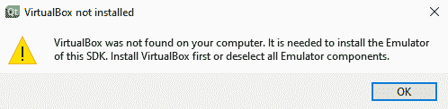

要下载 VirtualBox，只需进入[https://www.virtualbox.org](https://www.virtualbox.org)即可。 然后，导航到 Downloads 页面，选择您正在运行的操作系统(例如 Windows 主机)的下载选项。 运行安装程序，您就可以运行了。 如果您不想在每次有一些小的更改时都将应用导出到设备上，那么在仿真器上运行是测试应用的最快方式。

# 将嵌入式 Linux 映像写入存储设备

Qt 商业广告为我们提供了一个方便的工具，可以将预置的嵌入式 Linux 镜像写入拇指驱动器或 SD 卡。 这是一个名为引导至 QT 闪存向导的程序，或名为`b2qt-flashing-wizard.exe`，位于`Qt/Tools/b2qt`。 当您运行它时，系统会要求您选择正在运行的设备以及支持它的 Qt 版本。 下面的屏幕截图显示了这一点：


之后，系统将要求您选择要写入 Linux 镜像的存储设备：

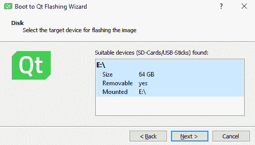

单击 Next 按钮后，Linux 映像将写入存储设备：

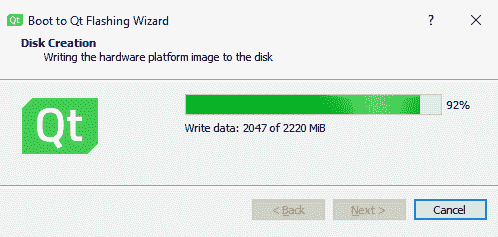

一旦完成，您就可以将您的拇指驱动器或 SD 卡插入您的嵌入式设备，并开始启动您的 Linux 系统！ 您应该看到在 Linux 系统上默认启动了 Qt 演示。

下面的照片显示了在我 6 岁的 Intel NUC 上运行的嵌入式 Qt 演示。 虽然我的机器现在已经很旧了，但性能还是不错的：


如果您的设备没有得到 Qt 公司的正式支持，那么您将需要构建自己的自定义 Linux 映像，这并不是一项简单的任务。 Qt 使用 Yockto 项目([https://www.yoctoproject.org](https://www.yoctoproject.org))中的配方来配置他们的 linux 镜像，所以如果您正在尝试构建自己的 linux 镜像，您也应该这样做。

要了解如何使用 Yockto 项目提供的工具构建您自己的自定义 Linux 映像，请查看[https://doc.qt.io/QtForDeviceCreation/qtee-custom-embedded-linux-image.html](https://doc.qt.io/QtForDeviceCreation/qtee-custom-embedded-linux-image.html)上的文档。 请注意，您只能在 Linux 系统(如 Ubuntu)上从源代码构建 Linux 映像。 你不能在 Windows 或 MacOS 系统上做到这一点。 幸运的是，Yockto 项目还为我们提供了一个构建机器人，它允许我们在云上构建，而不是在我们自己的机器上构建。

在本节中，我们了解了如何设置嵌入式 Linux 映像以在 Qt 上创建设备。 接下来，我们将学习如何构建交叉编译的 Qt 项目。

# 构建交叉编译的 Qt 应用

交叉编译是指您在一台计算机上编写代码，但在另一台运行不同操作系统或处理器的计算机上构建代码。 例如，您可以在 Windows 上开发应用，但为 Linux 计算机构建应用；或者，您可以在 x86 Linux 计算机上编写代码，但为 ARMv8 Linux 设备构建可执行文件。

在下列情况下需要交叉编译：

*   Qt 工具链或库在您正在运行的目标设备上不可用
*   目标设备非常慢，不适合编译代码
*   该设备没有任何显示或输入法

Qt 商业版使得交叉编译应用并将其部署到不同类型的嵌入式设备变得非常容易，因此除非 Qt 官方不支持该硬件，否则不推荐使用手动方式。

# 使用 Qt Creator 自动交叉编译

当您使用商业许可证在 Qt Creator 中创建项目时，您将在 Kit Selection 页面上看到比通常使用开源许可证时更多的选项。 这些工具包是您使用 Qt 安装程序选择并安装的工具包。 如果您在工具包选择页面上没有看到这些选项，请再次打开 Qt 安装程序并安装缺少的软件包。

如果工具包可用，请选择与您的硬件匹配的工具包，或者如果要在不部署到设备的情况下测试应用，请选择仿真器选项，如下所示：

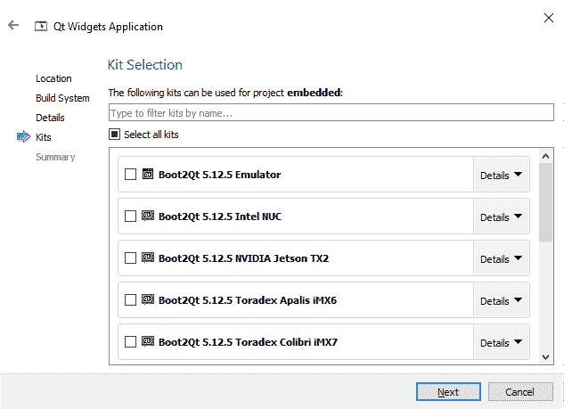

如果您是在 Qt 上创建设备的新手，那么您可能还不能在实际的硬件上部署和运行您的应用。 接下来，我们将在*将 Qt 应用部署到嵌入式系统*一节中介绍这一点。 现在，让我们为仿真器交叉编译它。 如果您的硬件是官方支持的，则在 Qt Creator 中交叉构建时不需要额外的步骤。 只需点击位于左下角的 Build 或 Run 按钮即可。 当您第一次在 Qt Creator 上运行该程序时，Qt 启动器将在仿真器中启动，而不是在您的程序中启动。 这是因为 Qt 启动器是运行仿真器时要执行的默认程序。

Qt Launcher 实质上是一个演示库，它允许您尝试 Qt 支持的不同功能来创建设备：


一旦模拟器启动，您可以尝试从 Qt Creator 再次运行您的程序，现在它应该会显示在模拟器上。 请注意，由于需要与您的 PC 共享资源，与实际硬件相比，仿真器的性能可能较差。

# 交叉编译手册

除非硬件未得到 Qt 的正式支持，否则不建议手动交叉编译。 例如，创建新项目时，在套件选择页面上找不到 Beaglebone 板卡([http://beagleboard.org/bone](http://beagleboard.org/bone)[)](http://beagleboard.org/bone)。 在这种情况下，我们别无选择，只能自己手动完成。 这是因为在开始交叉编译您的项目之前，设置它是一个非常漫长而复杂的过程。

如果像我一样，您是使用 Windows 系统开发应用的人，那么您需要从[http://gnutoolchains.com/beaglebone](http://gnutoolchains.com/beaglebone)下载 Beaglebone 的 GNU 工具链。 该软件包包括与 Beaglebone 板上运行的 LINUX 镜像兼容的 GCC 编译器、头文件和库。 您也可以从前面的链接下载 Linux 映像，而不是从 Yockto Project 网站下载。 还支持其他类型的架构，如 CubieBoard、Blackfin 和 AVR。

下载安装程序后，运行它并将 GNU 工具链安装到本地目录：

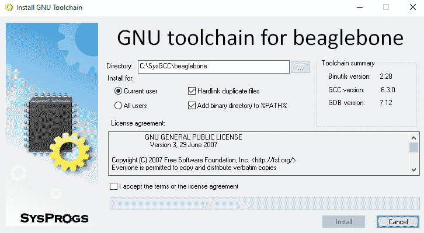

在为 Beaglebone 安装了 GNU 工具链之后，可以从[https://www.python.org/downloads](https://www.python.org/downloads)安装 Python2.8，因为我们稍后将需要它来编译 Qt 框架。 安装后，从[Linux](http://sysprogs.com/winflashtool/download)下载 WinFLASHTool 并将 http://sysprogs.com/winflashtool/download 映像写入 SD 卡，如下所示：

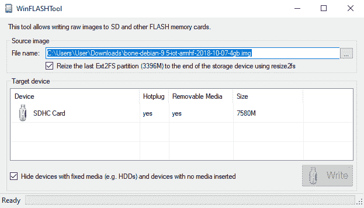

将 Linux 映像写入 SD 卡后，将其插入 Beaglebone 设备并启动。 默认情况下，Beaglebone 上的 Linux 系统应该安装并启用 SSH 服务器。 如果没有，您可以使用这里给出的终端命令自己完成(如果您使用的不是基于 Debian 的 Linux，这些命令可能会有所不同)：

1.  首先，安装`openssl-server`：

```cpp
sudo apt-get install openssh-server
```

2.  然后，启用并启动 SSH 服务：

```cpp
sudo systemctl enable ssh
sudo systemctl start ssh
```

3.  SSH 服务器启动后，您可以返回到 Windows 计算机并启动位于`C:\SysGCC\beaglebone\tools`文件夹中的`UpdateSysroot.bat`批处理文件。 此工具用于从目标 Linux 计算机获取所有库文件，并将其复制到您的 Windows 计算机：


4.  单击[选择...]按钮以连接到 Linux 计算机。 如果不能使用 username@devicename 格式连接，则使用本地 IPv4 IP 地址(例如，192.168.0.140)：

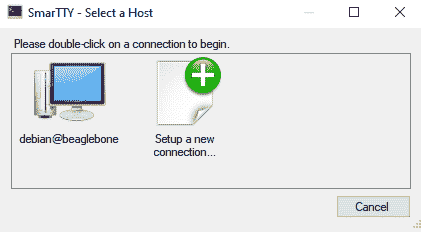

5.  连接后，单击 Synchronize 按钮开始从 Linux 机器抓取所有库文件。 这可能需要一些时间才能完成：


就这样!。 现在，您可以在 Linux 设备和 Windows 计算机之间同步库文件。

之后，我们将使用 GNU 工具链和刚刚从 Beaglebone 获取的库文件从源代码构建 Qt。 为此，让我们看一看需要什么：

1.  首先，在使用 qmake 构建整个 Qt 框架之前，我们需要构建 qmake。
2.  转到 Qt 的源文件夹，例如：`C:/Qt/5.12.5/Src`。 然后，转到`/qtbase/mkspecs`目录并复制`linux-arm-gnueabi-g++ `文件夹。
3.  将复制的文件夹重命名为`linux-arm-gnueabihf-g++ `，然后打开文件夹内的`qmake.conf`文件。 将所有`-gnueabi-`前缀更改为`-gnueabihf-`，使其与文件夹名称匹配，如下所示：

```cpp
MAKEFILE_GENERATOR = UNIX
CONFIG += incremental
QMAKE_INCREMENTAL_STYLE = sublib

include(../common/linux.conf)
include(../common/gcc-base-unix.conf)
include(../common/g++-unix.conf)

# modifications to g++.conf
QMAKE_CC = arm-linux-gnueabihf-gcc
QMAKE_CXX = arm-linux-gnueabihf-g++
QMAKE_LINK = arm-linux-gnueabihf-g++
QMAKE_LINK_SHLIB = arm-linux-gnueabihf-g++

# modifications to linux.conf
QMAKE_AR = arm-linux-gnueabihf-ar cqs
QMAKE_OBJCOPY = arm-linux-gnueabihf-objcopy
QMAKE_NM = arm-linux-gnueabihf-nm -P
QMAKE_STRIP = arm-linux-gnueabihf-strip
load(qt_config)
```

由于我们从`linux-arm-gnueabi-g++ `文件夹复制了配置文件`qmake.conf`并将其重命名为`linux-arm-gnueabihf-g++ `，因此我们还必须重命名前缀，使其与跨工具链软件包名称相匹配。 关键字*`gnueabi`表示我们从中复制的文件夹使用用于`armel`体系结构的跨工具链包，而我们用于新文件夹的关键字*`gnueabihf`使用用于`armhf`体系结构的跨工具链包。 使用的跨工具链软件包的类型将基于您正在运行的硬件。

4.  完成后，打开命令提示符，在源文件夹之外的某个位置创建一个 Build 文件夹，然后导航到 Build 文件夹：

```cpp
mkdir qt-build
cd qt-build
```

5.  然后，我们可以使用以下命令开始构建过程：

```cpp
C:\Qt\5.12.5\Src\qtbase\configure -platform win32-g++ -xplatform linux-arm-gnueabihf-g++ -release -opengl es2 -device linux-beaglebone-g++ -sysroot C:/SysGCC/beaglebone/arm-linux-gnueabihf/sysroot -prefix /usr/local/qt5
```

构建过程将需要一些时间，完成后，您应该看到`qmake.exe`现在位于`qt-build/qtbase/bin`内部。 在构建过程中可能会遇到一些错误消息，但只要已经构建了`qmake.exe`，就没有问题。 要验证这一点，请键入以下命令：

```cpp
..\qtbase\bin\qmake -v
```

您应该看到 qmake 的版本号，这意味着它是一个成功的构建。 接下来，我们将构建整个 Qt 框架。 我们需要做的第一件事是再次打开 Qt 源目录中的`qtbase`文件夹中的`configure`文件，然后在显示`Creating qmake...`文本之前添加突出显示的代码：

```cpp
# build qmake
if [ '!' -f "$outpath/bin/qmake.exe" ]; then
    echo "Creating qmake..."
    mkdir -p "$outpath/qmake" || exit
```

然后，运行以下命令开始配置 Qt 框架。 该命令类似于前一个命令，但具有`device-option`设置：

```cpp
C:\qt-everywhere-src-5.13.1\configure -platform win32-g++ -xplatform linux-arm-gnueabihf-g++ -release -opengl es2 -sysroot C:/SysGCC/beaglebone/arm-linux-gnueabihf/sysroot -prefix /usr/local/qt5 -device-option CROSS_COMPILE=C:/SysGCC/beaglebone/bin/arm-linux-gnueabihf- -qt-xcb
```

如果没有出错，则可以通过键入以下命令继续构建 Qt 框架：

```cpp
make && make install
```

请注意，每个硬件都有非常不同的设置和配置，其工作方式可能与前面的示例不同。 但是，如果发生任何情况，命令提示符应该会告诉您问题所在，因此您可能需要一些耐心来调整配置，直到它适用于您的平台。 如果您的设备正式受 Qt 支持，请使用上一小节*使用 Qt Creator*自动交叉编译中描述的内置方法。

Qt 框架搭建成功后，打开位于`C:\SysGCC\beaglebone\tools\PortableSmartty`的`SmarTTY.exe`。 然后，使用 SmarTTY 通过 SSH 连接到您的设备，我们在前面的步骤中已经了解了这一点。 接入后，进入 SCP|上传目录，如下图所示：


将弹出一个窗口，让您设置要上传的目录和远程设备上的目标位置。 将本地目录设置为`C:\SysGCC\beaglebone\arm-linux-gnueabihf\sysroot\usr\local\qt5`，将远程目录设置为`/usr/local/qt5`：

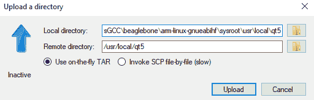

之后，按 Upload 按钮开始将文件上传到您的嵌入式设备。 就这样!。 您已经成功地将整个 Qt 库上传到嵌入式设备，然后可以在其上运行您的 Qt 应用。

接下来，我们将学习如何为嵌入式设备手动编译 Qt 应用。 在开始编译应用之前，我们需要查看 Qt Creator 上的一些设置：

1.  首先，打开 Qt Creator，进入工具|选项...，然后导航到工具包|编译器。
2.  然后，点击位于右侧的添加按钮，选择 GCC|C++。 设置编译器设置，如以下屏幕截图所示：

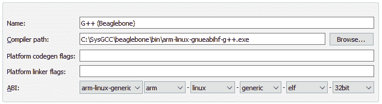

3.  对 GCC|C 重复上述步骤，并按如下方式设置设置：


4.  之后，导航到 Debuggers(调试器)选项卡，然后单击 Add(添加)按钮。 将调试器命名为`Beaglebone`，其余设置如下：

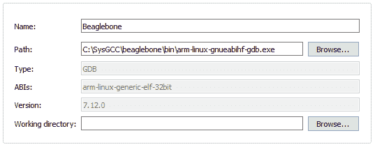

5.  然后，转到 Qt Versions 选项卡并单击 Add...。 纽扣。
6.  选择我们在前面的步骤中构建的`qmake.exe`，并将其命名为`Qt Beaglebone %{Qt:Version} (build-qt)`。
7.  最后，转到 Kits 选项卡并单击 Add 按钮。 将该工具包命名为`Beaglebone`，并链接我们在前面步骤中刚刚添加的编译器、调试器和 Qt 版本。

现在您应该能够为您的嵌入式设备交叉编译 Qt 应用了。 您将无法将生成的可执行文件启动到 Windows 计算机，因为它是 Linux 可执行文件。 我们将在本章第二节*将 Qt 应用部署到嵌入式系统*一节中讨论如何手动将应用部署到您的设备上。

在本节中，我们了解了如何在 Windows PC 上为 Linux 设备交叉编译 Qt 应用。 让我们继续下一节，学习如何为嵌入式项目配置我们的 Qt 框架。

# 为嵌入式项目配置 Qt

正如您可能已经知道的，Qt 框架附带了一组巨大的库，这些库加起来可能有几 GB 的存储空间。 即使在最低限度，这些库也可能占用高达 15 兆字节的存储空间，对于小型嵌入式设备来说，这太过分了。 为了解决这个问题，Qt 公司为我们提供了一个工具，用于在我们从嵌入式项目的源代码构建 Qt 框架之前配置我们的 Qt 包。 为了减小 Qt 库大小，我们可以挑选我们想要的特性，并丢弃不需要的特性。

该工具名为 Qt Configuration Tool 或`qconfig-gui.exe`，位于`C:\Qt\Tools\QtConfigGui`文件夹中，如下所示：


按 Run Configure(运行配置)按钮开始配置过程，该过程需要一些时间才能完成。 完成后，您可以打开命令提示符，并使用以下`mingw32-make`命令从源代码构建 Qt 库：

```cpp
cd C:\Qt\5.12.5
mingw32-make
```

构建过程根据您的配置而有所不同。您打开的功能越多，构建 Qt 库所需的时间就越长。 通常情况下，最多需要几个小时才能建成，因为 Qt 是一个非常庞大的库。 构建过程如下所示：


完成后，不要忘记运行`install`命令：

```cpp
mingw32-make install
```

这会将所有已编译的库文件复制到适当的目录，如：`C:\Qt\Qt-5.12.5`。 如果您发现需要根据需要更改功能列表，可以重新配置和重新编译。

在本节中，我们学习了如何配置 Qt 并使其更小以适合我们的嵌入式设备。 在下一节中，我们将继续使用 Qt Quick 编写我们的第一个嵌入式程序。

# 编写您的第一个嵌入式程序

在 Qt 中，为台式机、移动设备或嵌入式设备构建应用没有区别。 您可以像往常一样创建项目，但唯一的区别将是构建过程。 让我们通过转到文件|新建文件或项目管理并选择 Qt Quick Application-Empty 来创建一个 Qt Quick 项目。 确保在创建 Qt Quick 项目时勾选了 Use Virtual Keyboard(使用虚拟键盘)选项。

完成后打开`main.qml`。 默认情况下，代码包含`InputPanel`项，即虚拟键盘：

```cpp
InputPanel {
    id: inputPanel
    z: 99
    x: 0
    y: window.height
    width: window.width

    states: State {
        name: "visible"
        when: inputPanel.active
        PropertyChanges {
            target: inputPanel
            y: window.height - inputPanel.height
        }
    }
    transitions: Transition {
        from: ""
        to: "visible"
        reversible: true
        ParallelAnimation {
            NumberAnimation {
                properties: "y"
                duration: 250
                easing.type: Easing.InOutQuad
            }
        }
    }
}
```

如果您现在在模拟器上构建并运行该程序，您将看不到任何东西，因为虚拟键盘从视图中隐藏。 让我们导入`QtQuick.Controls`模块并将`TextField`项添加到我们的程序中：

```cpp
import QtQuick.Controls 2.12

Window {
    id: window
    visible: true
    width: 640
    height: 480
    title: qsTr("Hello World")

    TextField {
        id: textInput
        x: 100
        y: 100
        placeholderText: qsTr("Enter text here")
    }
```

如果您再次在模拟器上运行该程序，您应该会在屏幕上看到文本字段。 单击文本字段以触发虚拟键盘：

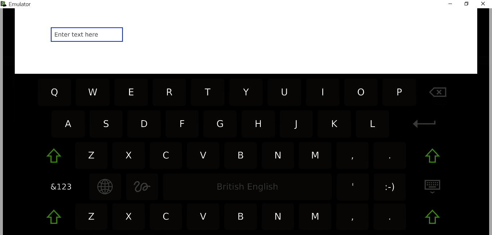

就这样。 除了虚拟键盘，Qt Quick 提供的所有其他物品都可以像桌面和移动应用一样使用。 Qt 模糊了桌面、移动和嵌入式应用开发之间的界限，简化了开发流程，使开发人员的生活更轻松。

在本节中，我们学习了如何使用 Qt Quick 开发我们的第一个嵌入式程序，以及如何启用虚拟键盘功能。 在下一节中，我们将学习如何将我们的应用部署到实际的嵌入式设备上，并使其成为默认的启动程序。

# 将 Qt 应用部署到嵌入式系统

最后，我们将学习如何将我们的应用部署到实际的物理设备上。 我们将介绍两种方法-自动方式和手动方式。 自动方式需要 Qt 商业许可证，此功能与 Qt Creator 一起提供。 另一方面，人工方式不需要商业许可，但它的过程比前者长得多。 让我们来看看每一个。

# 从 Qt Creator 自动部署

Qt 商业许可证附带一个名为**Boot to Qt Flashing Wizard**的工具，我们在*设置嵌入式 Linux 映像*一节中讨论了该工具。 与我们在*构建交叉编译的 Qt 应用*一节中讨论的在 Qt 中手动交叉编译的方式不同，Qt 商业版附带的 Linux 镜像针对嵌入式开发进行了优化，并支持从您的 Qt Creator 进行远程部署。 这意味着你不需要付出任何额外的努力就可以让它工作。

但是，在您可以轻松地部署嵌入式应用之前，您必须在 Qt Creator 中设置您的设备，以便它知道将应用导出到哪里。 这实际上与*构建交叉编译的 Qt 应用*一节中讨论的 SSH 方法非常相似，但是该功能与 Qt Creator 本身一起提供，因此这里不需要第三方程序。

要设置您的设备，请转到工具|选项...。 |设备。 在 Devices(设备)选项卡下，单击 Add(添加)...。 位于窗口右侧的按钮。 之后，将弹出一个名为 Device Configuration Wizard Selection(设备配置向导选择)的窗口：

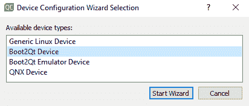

选择 Boot2Qt Device 选项，然后单击 Start Wizard。 配置向导将引导您完成几个步骤来设置设备。 设置应与您看到的内容类似，如下所示：

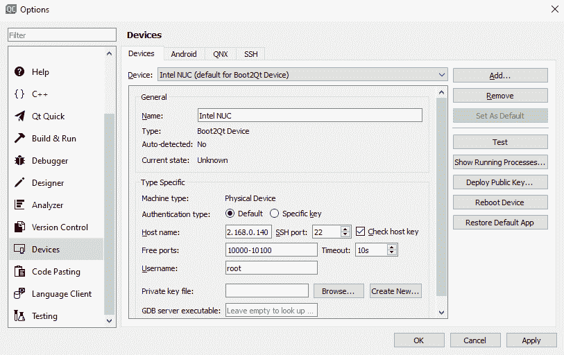

如果无法使用`username@devicename`格式连接，则改用本地 IPv4 IP 地址(即 192.168.0.140)。 IP 地址可以在运行 Boot to Qt 闪存向导提供的 Linux 映像的嵌入式设备上的 Qt 启动器中找到。 它位于网络设置窗口下的网络部分。 在获取 IP 地址之前，您的设备必须先连接到网络：

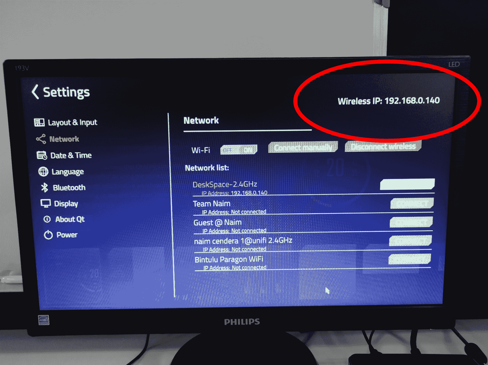

完成后，按 OK 按钮关闭选项...。 Qt Creator 中的窗口。 之后，确保您选择的是正确的套件(即 Boot2Qt 5.12.5 Intel NUC)，而不是仿真器。 之后，按 Run(运行)按钮并等待一段时间。 构建应用并将其发送到设备后，您应该会看到应用正在硬件上运行：

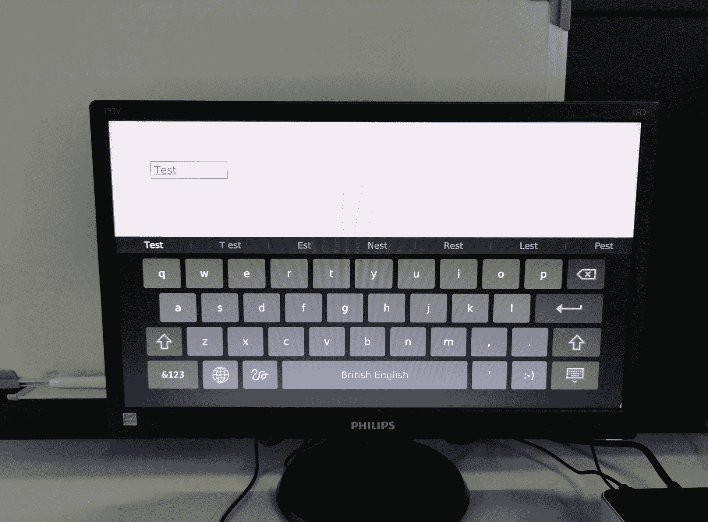

但是，如果您现在重新启动嵌入式设备，Qt 启动器将在启动时启动，而不是您的应用。 要覆盖默认启动应用，请单击左侧面板上的 Projects(项目)按钮，然后打开 Run Setting(运行设置)界面：


在 Deployment 部分下，单击 Add Deploy Step 按钮并选择 Change Default Application：

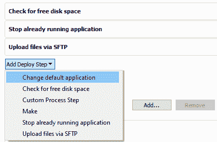

之后，选择将此应用设置为默认启动选项并保存您的项目。 再次从 Qt Creator 运行您的应用，以便在嵌入式设备上执行此步骤。 然后，重新启动您的设备，瞧！ 您的程序现在是打开设备时启动的默认应用。

# 使用 SSH 手动部署

手动将交叉编译的应用部署到嵌入式设备的方法是通过 SSH 方法，我们在*构建交叉编译的 Qt 应用*一节中已经讨论过。 在我们开始使用 SmarTTY 上传我们的 Linux 可执行文件之前，让我们先来看看 Qt 是如何做到这一点的。

如果我们探索包含来自 Qt 的 Linux 镜像的 SD 卡或拇指驱动器，我们很快就会意识到它并不像我们想象的那样是某种黑魔法。 Qt 只是将我们的 Qt 应用存储在`opt`目录中，例如，存储在`/opt/myproject/bin/myproject`目录中，并从那里启动它。

对于默认的启动应用，Qt 支持 Debian Linux 系统使用的`systemd`服务。 这些设置可以在`/lib/systemd/qtlauncher.service`中找到，如下所示：

```cpp
[Unit]
Description=B2Qt Launcher Demo
After=systemd-user-sessions.service
ConditionPathExists=!/usr/bin/b2qt

[Service]
User=root
ExecStart=-/usr/bin/appcontroller /usr/bin/qtlauncher --applications-root /data/usr/qt

[Install]
WantedBy=multi-user.target
```

这些设置基本上是告诉用户`systemd`在`systemd-user-sessions.service`启动后再启动这项服务。 然后，它将查找名为`b2qt`的快捷链接，该链接位于`/usr/bin/`。 `b2qt`快捷键实质上链接到我们的 Qt 应用(即`/opt/myproject/bin/myproject`)并启动它。

如果快捷方式链接不存在，则会启动 Qt 启动器。 就是这么简单。 因此，如果我们想要模仿这种方法，我们可以首先使用 SmarTTY 将我们的应用上传到设备的`opt`目录，方法是转到 SCP|Upload a file：


上传可执行文件后，打开`/lib/systemd`并创建一个扩展名为`.service`的新文件。 您可以复制前面的脚本并根据您的喜好进行更改，例如添加自定义描述名称、自定义目录路径等。 然后，运行以下命令以启用您的自定义服务：

```cpp
sudo systemctl enable yourservice.service
```

注意，这只适用于使用`systemd`的 Linux 系统，比如 Debian。 如果您使用的 Linux 系统运行其他一些启动管理器/初始化守护进程，如`initd`、`Runit`、`Upstart`或许多其他进程，则不能使用前面的方法。 互联网上有大量的资源可以教你如何与那些不同的初创企业经理一起做这件事。

在本节中，我们了解了如何使用自动和手动方法将 Qt 应用部署到嵌入式设备。

# 简略的 / 概括的 / 简易判罪的 / 简易的

在这一章中，我们经历了一段漫长的旅程，学习如何增强 Qt 的跨平台能力，并创建了我们的第一个嵌入式设备应用。 我们了解了如何设置嵌入式 Linux 映像，并将其写入 SD 卡或拇指驱动器，以便在设备上运行。

然后，我们学习了如何从 Windows 机器交叉编译 Qt 项目并将其导出到 Linux 设备。 这确实是一种节省时间的方法，因为嵌入式设备通常不足以编译源代码，因此对于我们来说，能够使用不同的、更强大的设置编译它并将其远程传送到我们的生产设备上，甚至不需要用 USB 电缆连接，这对我们来说真的很方便。

除此之外，我们还了解了如何配置 Qt 框架并减小其大小，使其能够适应嵌入式设备。 这一点非常重要，因为嵌入式设备(即可穿戴设备、智能机器人、医疗设备等)通常体积非常小，存储空间非常有限。

之后，我们还学习了如何在第一个嵌入式程序中触发虚拟键盘。 这一点也非常重要，因为大多数嵌入式设备没有用于用户输入的键盘或鼠标；因此，虚拟键盘在确保用户能够在不需要键盘的情况下键入信息方面发挥着重要作用。

最后，本章最酷的部分是我们学习了如何在实际的嵌入式设备上部署我们的应用，并看到我们的辛勤工作取得了成果。 我真的希望越来越多的人可以通过使用这些信息来获得力量，并生产出真正令人惊叹的产品，或许可以让世界变得更好。

在下一章中，您将学习一些提示和技巧，以帮助您改进项目的开发工作流程和生产力。