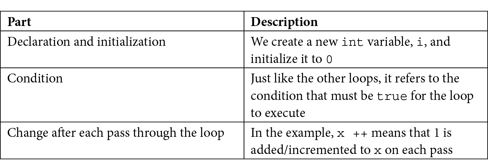

# *第 4 章*：循环、数组、开关、枚举和函数——实现游戏机制

这一章可能比这本书中的其他章节有更多的 C++ 信息。它充满了将极大地推动我们理解的基本概念。它还将开始揭示一些我们略过的模糊领域，比如函数和游戏循环。

一旦我们探索了一个完整的 C++ 语言必需品列表，我们将使用我们所知道的一切，使主要的游戏机制，树枝移动。到本章结束时，我们将为最后阶段和木材完工做好准备！！！。

在本章中，我们将介绍以下主题：

*   循环
*   阵列
*   与`switch`一起做决策
*   枚举
*   函数入门
*   创建和移动树枝

# 回路

在编程中，我们经常需要不止一次地做同样的事情。到目前为止，我们看到的一个明显的例子是游戏循环。去掉所有代码后，我们的游戏循环如下所示：

```cpp
while (window.isOpen())
{
}
```

有几种不同类型的循环，我们将在这里介绍最常用的循环。这种类型的循环的正确术语是**while**循环。

## while 循环

`while`循环非常简单。回想一下`if`语句及其计算为`true`或`false`的表达式。我们可以在`while`循环的条件表达式中使用完全相同的运算符和变量组合。

与`if`语句类似，如果表达式为`true`，则执行代码。然而，与 ToeT2 循环不同的是，它内的 C++ 代码将重复执行，直到条件为假。看看下面的代码。

```cpp
int numberOfZombies = 100;
while(numberOfZombies > 0)
{
    // Player kills a zombie
    numberOfZombies--;
    // numberOfZombies decreases each pass through the loop
}
// numberOfZombies is no longer greater than 0
```

让我们回顾一下前面代码中发生的事情。在`while`循环之外，`int numberOfZombies`被声明并初始化为`100`。然后，`while`循环开始。其条件表达式为`numberOfZombies > 0`。因此，`while`循环将继续在其体内的代码中循环，直到条件评估为`false`。这意味着前面的代码将执行 100 次。

在第一次通过循环时，`numberOfZombies`等于 100，然后是 99，然后是 98，依此类推。但一旦`numberOfZombies`等于零，它当然不再*大于*。然后，代码将跳出`while`循环，并在关闭花括号后继续运行。

就像`if`语句一样，`while`循环可能不会执行一次。请看下面的代码：

```cpp
int availableCoins = 10;
while(availableCoins > 10)
{
    // more code here.
    // Won't run unless availableCoins is greater than 10
}
```

`while`循环中的上述代码将不会执行，因为条件为 false。

请注意，表达式的复杂性或循环体中可以包含的代码量没有限制。考虑以下假设我们游戏循环的变化：

```cpp
int playerLives = 3;
int alienShips = 10;
while(playerLives !=0 && alienShips !=0 )
{
    // Handle input
    // Update the scene
    // Draw the scene
}
// continue here when either playerLives or alienShips equals 0
```

上一个`while`循环将继续执行，直到`playerLives`或`alienShips`等于零。一旦出现其中一种情况，表达式将计算为`false`，程序将从`while`循环后的第一行代码继续执行。

值得注意的是，一旦循环体被输入，它将始终至少完成一次，即使表达式在中途的计算结果为 false，因为在代码尝试开始另一个过程之前不会再次测试它。让我们来看一个例子：

```cpp
int x = 1;
while(x > 0)
{
    x--;
    // x is now 0 so the condition is false
    // But this line still runs
    // and this one
    // and me!
}
// Now I'm done!
```

前一个循环体将执行一次。我们还可以建立一个永远运行的`while`循环，毫不奇怪，它被称为**无限循环**。以下是一个例子：

```cpp
int y = 0;
while(true)
{
    y++ ; // Bigger... Bigger...
}
```

如果您发现前面的循环令人困惑，请仔细想想。循环在其条件为`true`时执行。嗯，`true`始终是`true`，因此将继续执行。

### 打破 while 循环

我们可以使用一个无限循环，这样我们就可以决定何时从循环体而不是表达式中退出循环。当我们准备离开循环体时，我们可以使用**break**关键字来完成此操作，可能如下所示：

```cpp
int z = 0;
while(true)
{
    z++ ; // Bigger... Bigger...
    break; // No you're not

    // Code doesn't reach here
}
```

在前面的代码中，循环内的代码将执行一次，直到并包括`break`语句，然后在关闭`while`循环的花括号后继续执行。

正如您可能已经猜到的那样，我们可以结合任何 C++ 决策工具，如 AutoT0}，AuthT1，以及另一个我们将在不久的时间内知道的，如我们的 To.t3t 循环和其他循环类型。考虑下面的例子：

```cpp
int x = 0;
int max = 10;
while(true)
{
    x++ ; // Bigger... Bigger...
    if(x == max){
        break;
    } // No you're not
    // code reaches here only until max = 10
}
```

在前面的代码中，`if`条件决定是否以及何时执行`break`语句。在这种情况下，代码将继续循环，直到`max`达到 10。

我们可以在很长一段时间里看 C++ 的各种排列，但是，在某些时候，我们想回到游戏中去。那么，让我们转到另一种类型的循环：`for`循环。

## 用于循环

循环的**语法比`while`循环稍微复杂一些，因为它需要三个部分来设置一个循环。首先看一下下面的代码。我们将在以下时间将其拆分：**

```cpp
for(int x = 0; x < 100; x ++)
{
    // Something that needs to happen 100 times goes here
}
```

以下是`for`循环条件的所有部分所做的：

```cpp
for(declaration and initialization; condition; change before each iteration)
```

为了进一步澄清这一点，这里有一个表格来解释三个关键部分中的每一个，如前一个`for`循环示例中所示：



我们可以改变`for`循环，这样它们可以做更多的事情。下面是另一个从 10 开始倒数的简单示例：

```cpp
for(int i = 10; i > 0; i--)
{
    // countdown
}
// blast off
```

`for`回路控制初始化、条件评估和控制变量。我们将在本章后面的游戏中使用`for`循环。

现在，我们可以继续讨论 C++ 数组的主题，它帮助我们存储大量相关数据。

# 阵列

如果一个变量是一个盒子，我们可以在其中存储特定类型的值，例如`int`、`float`或`char`，那么我们可以将数组视为一行盒子。框的行几乎可以是任何大小和类型，包括由类生成的对象。但是，所有箱子必须是同一类型的。

提示

一旦我们在倒数第二个项目中学习到一些更先进的 C++，就可以在每一个框中使用相同类型的限制。

这个阵列听起来像是在[*第 2 章*](02.html#_idTextAnchor070)*中对我们的云有用，变量、操作符和决策–设置精灵动画*。那么，我们如何创建和使用数组呢？

## 声明一个数组

我们可以声明一个`int`类型变量数组，如下所示：

```cpp
int someInts[10];
```

现在，我们有一个名为`someInts`的数组，它可以存储十个`int`值。然而，目前它是空的。

## 初始化数组元素

要向数组元素添加值，我们可以使用我们已经熟悉的语法类型，同时引入一些新语法，称为**数组表示法**。在下面的代码中，我们将`99`的值存储在数组的第一个**元素**中：

```cpp
someInts[0] = 99;
```

为了在第二个元素中存储值 999，我们需要使用以下代码：

```cpp
someInts[1] = 999;
```

我们可以在最后一个元素中存储值 3，如下所示：

```cpp
someInts[9] = 3;
```

请注意，数组的元素总是从零开始，直到数组的大小减 1 为止。与普通变量类似，我们可以操作存储在数组中的值。唯一的区别是我们将使用数组表示法，因为尽管我们的数组有一个名称-`someInts`，但单个元素没有。

在下面的代码中，我们将第一个和第二个元素添加在一起，并将答案存储在第三个元素中：

```cpp
someInts[2] = someInts[0] + someInts[1];
```

数组还可以与常规变量无缝交互，例如：

```cpp
int a = 9999;
someInts[4] = a;
```

有更多的方法可以初始化数组，现在让我们看一种方法。

### 快速初始化数组元素

我们可以按如下方式快速向元素添加值。本例使用一个`float`数组：

```cpp
float myFloatingPointArray[3] {3.14f, 1.63f, 99.0f};
```

现在，`3.14`、`1.63`和`99.0`值分别存储在第一、第二和第三位置。请记住，当使用数组表示法访问这些值时，我们将使用[0]、[1]和[2]。

还有其他初始化数组元素的方法。这个稍微抽象的示例显示了如何使用`for`循环将值 0 到 9 放入`uselessArray`数组：

```cpp
for(int i = 0; i < 10; i++)
{
    uselessArray[i] = i;
}
```

前面的代码假设`uslessArray`之前已初始化为至少包含 10 个`int`变量。

但是为什么我们需要阵列呢？

## 这些阵列对我们的游戏到底有什么作用？

我们可以在任何可以使用正则变量的地方使用数组–可能在这样的表达式中：

```cpp
// someArray[4] is declared and initialized to 9999
for(int i = 0; i < someArray[4]; i++)
{
    // Loop executes 9999 times
}
```

在游戏代码中数组的最大好处之一在本节的开头已经提到。数组可以保存对象（类的实例）。让我们想象一下，我们有一个`Zombie`类，我们想要存储一大堆。我们可以这样做：

```cpp
Zombie horde [5] {zombie1, zombie2, zombie3}; // etc...
```

`horde`数组现在保存`Zombie` 类的实例负载。每一个都是一个独立的、有生命的、呼吸的、自我决定的`Zombie`对象。然后我们可以循环通过`horde`阵列，每个阵列都通过游戏循环，移动僵尸，检查他们的头是否碰到斧头，或者他们是否成功抓住了玩家。

阵列，如果我们当时知道的话，在[*第 2 章*](02.html#_idTextAnchor070)*变量、操作符和决策中处理我们的云是完美的*精灵动画。我们可以拥有我们想要的尽可能多的云，并且编写的代码比我们为三个微不足道的云所做的要少。

提示

要完整地查看这段改进的云代码，请查看 Timber 的增强版！！！（代码和可玩游戏）在下载包中。或者，在查看代码之前，您可以尝试自己使用数组实现云。

了解所有这些数组内容的最佳方法是查看它的运行情况。我们将在实现树分支时执行此操作。

现在，我们将保留我们的云代码，以便我们能够尽快回到游戏中添加功能。但首先，让我们做更多的 C++ 决策。

# 用开关做决策

我们已经看过了`if`，它允许我们根据表达式的结果决定是否执行代码块。但有时，C++ 中的决策可以用其他更好的方法来实现。

当我们必须根据不涉及复杂组合或广泛价值范围的可能结果的明确列表做出决策时，通常应该选择`switch`。我们可以开始`switch`决定如下：

```cpp
switch(expression)
{
    // More code here
}
```

在前面的示例中，`expression`可以是一个实际表达式，也可以只是一个变量。然后，在大括号内，我们可以根据表达式的结果或变量的值做出决策。我们使用`case`和`break`关键字来实现这一点：

```cpp
case x:
    //code for x
    break;

case y:
    //code for y
    break;
```

如您所见，每个`case`表示一个可能的结果，每个`break`表示该`case`的结束以及执行离开`switch`块的点。

或者，我们也可以使用不带值的`default`关键字来运行一些代码，以防`case`语句的计算结果都不是`true`，如下所示：

```cpp
default: // Look no value
    // Do something here if no other case statements are true
    break;
```

作为最后一个抽象的例子，考虑一个复古文本冒险，玩家输入一个字母如“N”、“E”、“S”或“W”，以移动北、East、南或西。一个`switch`块可用于处理玩家的每个可能输入：

```cpp
// get input from user in a char called command
switch(command){
    case 'n':
        // Handle move here
        break;
    case 'e':
        // Handle move here
        break;
    case 's':
        // Handle move here
        break;
    case 'w':
        // Handle move here
        break;

    // more possible cases
    default:
        // Ask the player to try again
        break;
}
```

要理解我们所看到的关于`switch`的一切，最好的方法是将其付诸行动，以及我们正在学习的所有其他新概念。

接下来，我们将学习在编写更多代码之前需要了解的另一个 C++ 概念。让我们看看类枚举。

# 类枚举

**枚举**是逻辑集合中所有可能值的列表。C++ 枚举是一种很好的枚举事物的方法。例如，如果我们的游戏使用的变量只能在特定的值范围内，并且这些值在逻辑上可以形成一个集合或集合，那么枚举可能适合使用。它们将使您的代码更清晰，更不容易出错。

为了在 C++ 中声明一个类枚举，我们可以使用这两个关键字，OUTT0}，加上枚举的名称，后面是枚举可以包含的值，用一对括号括起来。

例如，检查以下枚举声明。请注意，按照惯例，枚举中的可能值应以大写形式声明：

```cpp
enum class zombieTypes {
   REGULAR, RUNNER, 
   CRAWLER, SPITTER, BLOATER 
};
```

注意，在这里，我们没有声明任何`zombieType`的实例，只声明了类型本身。如果这听起来很奇怪，就这样想吧。SFML 创建了`Sprite`、`RectangleShape`和`RenderWindow`类，但要使用这些类中的任何一个，我们必须声明该类的对象/实例。

此时，我们已经创建了一个名为`zombieTypes`的新类型，但我们没有它的实例。那么，让我们现在就这样做：

```cpp
zombieType jeremy = zombieTypes::CRAWLER;
zombieType anna = zombieTypes::SPITTER;
zombieType diane = zombieTypes::BLOATER;
/*
    Zombies are fictional creatures and any resemblance
    to real people is entirely coincidental
*/
```

接下来是我们即将添加到 Timber 中的代码类型的预览！！！。我们希望跟踪分支或玩家位于树的哪一侧，因此我们将声明一个名为`side`的枚举，如下所示：

```cpp
enum class side { LEFT, RIGHT, NONE };
```

我们可以将球员放在左边，如下所示：

```cpp
// The player starts on the left
side playerSide = side::LEFT;
```

我们可以使分支位置数组的第四级（数组从零开始）完全没有分支，如下所示：

```cpp
branchPositions[3] = side::NONE;
```

我们也可以在表达式中使用枚举：

```cpp
if(branchPositions[5] == playerSide)
{
    // The lowest branch is the same side as the player
    // SQUISHED!!
}
```

前面的代码测试数组位置[5]元素中的分支是否与玩家位于同一侧。

我们将研究一个更重要的 C++ 主题，即函数，然后我们将回到编码游戏。当我们想划分一些做某件特定事情的代码时，我们可以使用函数。

# 功能入门

C++ 函数究竟是什么？函数是变量、表达式和**控制流语句**（循环和分支）的集合。事实上，到目前为止，我们在本书中学习的任何代码都可以在函数中使用。我们编写的函数的第一部分称为**签名**。下面是一个函数签名示例：

```cpp
void shootLazers(int power, int direction);
```

如果我们加上一对大括号`{...}`和函数执行的一些代码，我们就有了一个完整的函数，即**定义**：

```cpp
void shootLazers(int power, int direction)
{
    // ZAPP!
}
```

然后，我们可以从代码的另一部分使用新函数，可能如下所示：

```cpp
// Attack the player
shootLazers(50, 180) // Run the code in the function
// I'm back again - code continues here after the function ends
```

当我们使用一个函数时，我们说我们**调用**它。在我们调用`shootLazers`时，程序的执行分支到该函数中包含的代码。该函数将一直运行到结束或被告知`return`。然后，代码将从函数调用后的第一行继续运行。我们已经在使用 SFML 提供的函数。这里不同的是，我们将学习编写和调用自己的函数。

下面是函数的另一个示例，包含使函数返回到调用它的代码的代码：

```cpp
int addAToB(int a, int b)
{
    int answer = a + b;
    return answer;
}
```

我们可以使用前面函数的调用可能如下所示：

```cpp
int myAnswer = addAToB(2, 4);
```

显然，我们不需要编写函数来将两个变量添加到一起，但是这个示例帮助我们了解函数的工作方式。首先，我们传入值`2`和`4`。在函数签名中，值`2`被分配给`int a`，值`4`被分配给`int b`。

在函数体中，`a`和`b`变量相加，用于初始化新变量`int answer`。`return answer;`线路就是这样做的。它将`answer`中存储的值返回给调用代码，导致`myAnswer`被值`6`初始化。

请注意，前面示例中的每个函数签名都略有不同。原因是 C++ 函数签名非常灵活，允许我们精确地构建我们需要的函数。

函数签名如何定义必须如何调用函数以及函数是否/如何返回值值得进一步讨论。让我们给签名的每一部分起一个名字，这样我们就可以把它分成几个部分并了解它们。

这是一个函数签名，其部分由其正式/技术术语描述：

```cpp
return type | name of function | (parameters)
```

以下是我们可以用于这些部件的几个示例：

*   返回类型 Po.T5：：To T0，，T1，，T2，等，或任何 C++ 类型或表达式。
*   **功能名称**：`shootLazers`、`addAToB`等
*   这和参数，参数，T1，T2 是一样的。

现在，让我们依次看看每个部分，从返回类型开始。

## 函数返回类型

顾名思义，返回类型是将从函数返回到调用代码的值的类型：

```cpp
int addAToB(int a, int b){

    int answer = a + b;
    return answer;

}
```

在我们前面看到的稍微单调但有用的`addAtoB`示例中，签名中的返回类型是`int`。`addAToB`函数向调用它的代码发回并返回一个适合`int`变量的值。返回类型可以是我们迄今所看到的任何 C++ 类型，也可以是我们尚未见过的 C++ 类型。

但是，函数根本不必返回值。在这种情况下，签名必须使用`void`关键字作为返回类型。使用`void`关键字时，函数体不得尝试返回值，因为这将导致错误。但是，它可以使用没有值的`return`关键字。以下是返回类型和使用`return`关键字的有效组合：

```cpp
void doWhatever(){

    // our code
    // I'm done going back to calling code here
    // no return is necessary

}
```

另一种可能性如下：

```cpp
void doSomethingCool(){

    // our code

    // I can do this if I don't try and use a value
    return;
}
```

下面的代码是更多可能函数的示例。请务必阅读注释和代码：

```cpp
void doYetAnotherThing(){
    // some code

    if(someCondition){

        // if someCondition is true returning to calling code
        // before the end of the function body
        return;
    }

    // More code that might or might not get executed

    return;

    // As I'm at the bottom of the function body
    // and the return type is void, I'm
    // really not necessary but I suppose I make it
    // clear that the function is over.
}

bool detectCollision(Ship a, Ship b){

    // Detect if collision has occurred
    if(collision)
    {
        // Bam!!!
        return true;
    }
    else
    {
        // Missed
        return false;
    }

}
```

前一个代码中的最后一个函数示例，是针对 Stutt0 的，是对我们 C++ 代码的近期的一瞥，并且演示了我们也可以将用户定义的类型作为对象传递到函数中，这样我们就可以对它们执行计算。

我们可以依次调用每个函数，如下所示：

```cpp
// OK time to call some functions
doWhatever();
doSomethingCool();
doYetAnotherThing();

if (detectCollision(milleniumFalcon, lukesXWing))
{
    // The jedi are doomed!
    // But there is always Leia.
    // Unless she was on the Falcon?
}
else
{
    // Live to fight another day
}

// Continue with code from here
```

不要担心关于`detectCollision`函数的奇怪语法；我们很快就会看到这样的代码。简单地说，我们使用返回值（`true`或`false`作为直接在`if` 语句中的表达式。

## 函数名

我们在设计自己的函数时使用的函数名几乎可以是任何东西。但最好使用词语，通常是动词，清楚地解释函数的作用。例如，查看以下函数：

```cpp
void functionaroonieboonie(int blibbityblob, float floppyfloatything)
{
    //code here
}
```

前面的函数是完全合法的，可以工作，但下面的函数名更清楚：

```cpp
void doSomeVerySpecificTask()
{
    //code here
}

int getMySpaceShipHealth()
{
    //code here
}

void startNewGame()
{
    //code here
}
```

使用前三个示例中的清晰且描述性的函数名是一种很好的做法，但是，正如我们从`functionaroonieboonie`函数中看到的，这不是编译器强制执行的规则。接下来，我们将进一步了解如何与函数共享一些值。

## 功能参数

我们知道函数可以将结果返回给调用代码。但是，如果我们需要与函数共享调用代码中的一些数据值，该怎么办？**参数**允许我们与函数共享值。在查看返回类型时，我们已经看到了参数示例。我们将看同一个例子，但更仔细一点：

```cpp
int addAToB(int a, int b)
{ 
    int answer = a + b;
    return answer; 
}
```

这里，参数是`int a`和`int b`。请注意，在函数体的第一行中，我们使用了`a + b`，就好像它们已经声明并初始化了变量一样。那是因为他们是。函数签名中的参数是它们的声明，调用函数的代码将初始化它们。

重要术语注释

请注意，我们将函数签名括号`(int a, int b)`中的变量称为参数。当我们将值从调用代码传递到函数中时，这些值称为参数。当参数到达时，参数使用这些参数初始化实际的可用变量，如：

`int returnedAnswer = addAToB(10,5);`

此外，正如我们在前面的示例中部分看到的，我们不必在参数中只使用`int`。我们可以使用任何 C++ 类型。我们也可以根据需要使用尽可能多的参数来解决问题，但最好保持参数列表尽可能短，因此尽可能易于管理。

正如我们将在未来章节中看到的，我们已经从本教程中留下了一些较酷的函数用法，这样我们就可以在我们进一步讨论函数的主题之前了解相关的 C++ 概念。

## 功能体

正文是我们一直在回避的部分，有如下评论：

```cpp
// code here
// some code
```

事实上，我们已经知道该怎么做了！到目前为止，我们所了解的任何 C++ 代码都将在函数的主体中工作。

## 功能原型

到目前为止，我们已经看到了如何编写函数，也看到了如何调用函数。然而，我们还需要做一件事，让它们发挥作用。所有功能必须有一个**原型**。原型让编译器知道我们的功能，如果没有原型，整个游戏将无法编译。幸运的是，原型很简单。

我们可以简单地重复函数的签名，后跟分号。需要注意的是，原型必须在任何调用或定义函数的尝试之前出现。下面是一个完全可用的函数的最简单的例子。仔细查看注释和代码中函数不同部分出现的位置：

```cpp
// The prototype
// Notice the semicolon on the end
int addAToB(int a, int b);

int main()
{ 
    // Call the function
    // Store the result in answer
    int answer = addAToB(2,2);

    // Called before the definition
    // but that's OK because of the prototype

    // Exit main
    return 0;

}// End of main

// The function definition
int addAToB(int a, int b)
{
    return a + b;
}
```

前面的代码演示了以下内容：

*   原型在`main`功能之前。
*   使用该函数的调用正如我们所预期的，在`main`函数中。
*   The definition is after/outside the `main` function.

    重要提示

    请注意，我们可以省略函数原型，当定义出现在函数使用之前时，直接转到定义。然而，随着我们的代码变得越来越长，并且分布在多个文件中，这几乎永远不会发生。我们将始终使用单独的原型和定义。

让我们看看如何组织我们的职能。

## 组织职能

值得指出的是，如果我们有多个函数，特别是如果它们相当长，我们的`.cpp`文件将很快变得难以处理。这违背了功能的部分目标。我们将在下一个项目中看到的解决方案是，我们可以将所有功能原型添加到我们自己的头文件（`.hpp` 或 `.h`）。然后，我们可以在另一个`.cpp`文件中对所有函数进行编码，只需在主`.cpp`文件中添加另一个`#include...`指令即可。这样，我们就可以使用任意数量的函数，而无需将它们的任何代码（原型或定义）添加到主代码文件中。

## 函数明白了！

关于函数我们应该讨论的另一点是**范围**。如果我们在函数中直接或在其中一个参数中声明变量，则该变量在该函数之外不可用/不可见。此外，在其他函数中声明的任何变量都不能在函数中看到/使用。

我们应该通过参数/参数和返回值在函数代码和调用代码之间共享值。

当一个变量由于来自另一个函数而不可用时，称其超出范围。当它可用时，就说它在范围之内。

重要提示

C++ 中任何块内声明的变量仅在该块内的范围内！这也包括循环和`if`块。在`main`顶部声明的变量在`main`的任意范围内，在游戏循环中声明的变量仅在游戏循环的范围内，依此类推。在函数或其他块中声明的变量称为**局部**变量。我们编写的代码越多，这就越有意义。每次我们在代码中遇到关于范围的问题时，我都会进行讨论，以澄清问题。下一节将讨论一个这样的问题。也有更多的 C++ 主食把这个问题公开了。它们被称为 ORT T5。参考文献 To6T6 和 Posits T8，我们将在第 9 章中学习它们，第 10 章，第 11 章，第 13 章，C++ 参考文献，SpRITE 表，和顶点数组。标准模板库，纹理管理。

## 更多关于功能的信息

我们还可以了解更多的函数，但我们已经对它们有了足够的了解，可以实现游戏的下一部分。如果所有的技术术语，如参数、签名和定义还没有完全理解，也不用担心。当我们开始使用这些概念时，它们会变得更加清晰。

## 关于函数的绝对定论——现在

您可能注意到，我们一直在调用函数，特别是 SFML 函数，方法是在函数名之前添加对象名和句点，如下所示：

```cpp
spriteBee.setPosition...
window.draw...
// etc
```

然而，在我们对函数的整个讨论中，我们看到了在没有任何对象的情况下调用函数。我们可以将函数作为类的一部分编写，也可以简单地作为独立函数编写。当我们将函数作为类的一部分编写时，我们需要该类的一个对象来调用该函数，但是当我们有一个独立的函数时，我们就不需要了。

我们将在一分钟内编写一个独立的函数，我们将从[*第 6 章*](06.html#_idTextAnchor154)、*面向对象编程开始编写函数类*。到目前为止，我们对函数的所有了解都与这两种情况相关。

现在，我们可以回到编码的木材分支！！！游戏

# 种植树枝

接下来，正如我在过去 20 页中所承诺的，我们将使用我们所学的所有新的 C++ 技术来绘制和移动树上的一些分支。

在`main`功能之外添加以下代码。为了明确起见，我的意思是之前的*是`int main()`的代码：*

```cpp
#include <sstream>
#include <SFML/Graphics.hpp>
using namespace sf;
// Function declaration
void updateBranches(int seed);
const int NUM_BRANCHES = 6;
Sprite branches[NUM_BRANCHES];
// Where is the player/branch?
// Left or Right
enum class side { LEFT, RIGHT, NONE };
side branchPositions[NUM_BRANCHES];
int main()
```

我们刚刚用新代码实现了很多东西：

*   首先，我们为一个名为`updateBranches`的函数编写了一个函数原型。我们可以看到，它不返回值（`void`，并且它接受一个名为`seed`的`int`参数。我们将很快编写函数定义，然后我们将确切地了解它的功能。
*   接下来，我们声明一个名为`NUM_BRANCHES`的`int`常量，并将其初始化为`6`。树上会有六根移动的树枝，我们很快就会看到`NUM_BRANCHES`对我们是多么有用。
*   接下来，我们声明一个名为`branches`的`Sprite`对象数组，它可以容纳六个`Sprite`实例。
*   之后，我们声明了一个名为`side`的新枚举，它有三个可能的值：`LEFT`、`RIGHT`和`NONE`。这将用于描述各个分支以及玩家在代码中的几个位置的位置。
*   Finally, in the preceding code, we initialize an array of `side` types with a size of `NUM_BRANCHES` (6). To be clear about what this achieves, we will have an array called `branchPositions` with six values in it. Each of these values is of the `side` type and can be either `LEFT`, `RIGHT`, or `NONE`.

    重要提示

    当然，您真正想知道的是为什么常量、两个数组和枚举被声明在`main`函数的之外。通过在`main`之上声明它们，它们现在拥有**全局范围**。用另一种方式来描述这一点，常量、两个数组和枚举在整个游戏中都有作用域。这意味着我们可以在`main`功能和`updateBranches`功能中的任何位置访问和使用它们。注意，使所有变量尽可能地位于实际使用的地方是一种很好的做法。使所有内容都全球化似乎很有用，但这会导致代码难以阅读且容易出错。

## 准备树枝

现在，我们将准备六个`Sprite`对象并将它们加载到`branches`数组中。在游戏循环之前添加以下突出显示的代码：

```cpp
// Position the text
FloatRect textRect = messageText.getLocalBounds();
messageText.setOrigin(textRect.left +
    textRect.width / 2.0f,
    textRect.top +
    textRect.height / 2.0f);
messageText.setPosition(1920 / 2.0f, 1080 / 2.0f);
scoreText.setPosition(20, 20);
// Prepare 6 branches
Texture textureBranch;
textureBranch.loadFromFile("graphics/branch.png");
// Set the texture for each branch sprite
for (int i = 0; i < NUM_BRANCHES; i++) {
    branches[i].setTexture(textureBranch);
    branches[i].setPosition(-2000, -2000);
    // Set the sprite's origin to dead centre
    // We can then spin it round without changing its position
    branches[i].setOrigin(220, 20);
}
while (window.isOpen())
```

在前面的代码中，我们正在执行以下操作：

1.  首先，我们声明一个 SFML`Texture`对象并将`branch.png`图形加载到其中。
2.  接下来，我们创建一个`for`循环，将`i`设置为零，并在每次通过该循环时增加`i`，直到`i`不再小于`NUM_BRANCHES`。这是完全正确的，因为`NUM_BRANCHES`是 6，`branches`阵列的位置是 0 到 5。
3.  在`for`循环中，我们使用`setTexture`为`branches`数组中的每个`Sprite`设置`Texture`，然后使用`setPosition`将其隐藏在屏幕外。
4.  最后，我们使用`setOrigin`将原点（绘制精灵时用于定位精灵的点）设置为精灵的中心。很快，我们将旋转这些精灵。将原点置于中心意味着它们将很好地旋转，而不会将精灵移出位置。

现在我们已经准备好了所有的分支，我们可以编写一些代码来在每一帧更新它们。

## 每帧更新分支精灵

在下面的代码中，我们将根据`branches`数组中所有精灵的位置以及`side`在相应`branchPositions`数组中的值来设置`branches`数组中所有精灵的位置。添加以下突出显示的代码，并在详细阅读之前先尝试理解它：

```cpp
    // Update the score text
    std::stringstream ss;
    ss << "Score: " << score;
    scoreText.setString(ss.str());
    // update the branch sprites
    for (int i = 0; i < NUM_BRANCHES; i++)
    {
        float height = i * 150;
        if (branchPositions[i] == side::LEFT)
        {
            // Move the sprite to the left side
            branches[i].setPosition(610, height);
            // Flip the sprite round the other way
            branches[i].setRotation(180);
        }
        else if (branchPositions[i] == side::RIGHT)
        {
            // Move the sprite to the right side
            branches[i].setPosition(1330, height);
            // Set the sprite rotation to normal
            branches[i].setRotation(0);
        }
        else
        {
            // Hide the branch
            branches[i].setPosition(3000, height);
        }
    }
} // End if(!paused)
/*
****************************************
Draw the scene
****************************************
```

我们刚才添加的代码是一个大的`for`循环，它将`i`设置为零，并在循环中每次增加`i`一，并一直持续到`i`不再小于 6。

在`for`循环中，一个名为`height`的新`float`变量被设置为`i * 150`。这意味着第一个分支的高度为 0，第二个分支的高度为 150，第六个分支的高度为 750。

接下来，我们有一个由`if`和`else`块组成的结构。看一看去掉代码的结构：

```cpp
if()
{
}
else if()
{
}
else
{
}
```

第一条`if`语句使用`branchPositions`数组查看当前分支是否应位于左侧。如果是，则将`branches`阵列中相应的`Sprite`设置为屏幕上的一个位置，适合左侧（610 像素）和当前`height`的任何位置。然后将精灵翻转 180 度，因为默认情况下，`branch.png`图形“挂起”在右侧。

请注意，`else if`仅在分支不在左侧时执行。它使用相同的方法查看它是否在右侧。如果是，则在右侧绘制分支（1330 像素）。然后，将精灵旋转设置为零度，以防之前旋转为 180 度。如果 x 坐标看起来有点奇怪，请记住我们将分支精灵的原点设置为其中心。

最后的`else`语句正确地假设当前`branchPosition`必须是`NONE`，并将分支隐藏在 3000 像素的屏幕外。

此时，我们的分支机构已就位，准备就绪。

## 画树枝

在这里，我们将使用另一个`for`循环从 0 到 5 逐步遍历整个`branches`阵列，并绘制每个分支精灵。添加以下突出显示的代码：

```cpp
// Draw the clouds
window.draw(spriteCloud1);
window.draw(spriteCloud2);
window.draw(spriteCloud3);
// Draw the branches
for (int i = 0; i < NUM_BRANCHES; i++) {
    window.draw(branches[i]);
}
// Draw the tree
window.draw(spriteTree);
```

当然，我们还没有编写移动所有分支的函数。一旦我们编写了这个函数，我们还需要确定何时以及如何调用它。让我们解决第一个问题并编写函数。

## 移动树枝

我们已经在`main`函数之上添加了函数原型。现在，我们可以对函数的实际定义进行编码，该函数每次调用时都会将所有分支向下移动一个位置。我们将把这个函数分为两部分进行编码，以便我们可以轻松地检查正在发生的事情。

在`main`功能的关闭曲括号后增加`updateBranches`功能*的第一部分：*

```cpp
// Function definition
void updateBranches(int seed)
{
    // Move all the branches down one place
    for (int j = NUM_BRANCHES-1; j > 0; j--) {	
        branchPositions[j] = branchPositions[j - 1];
    }
}
```

在函数的第一部分中，我们只需将所有分支向下移动一个位置，一次一个，从第六个分支开始。这是通过使`for`循环计数从 5 到 0 来实现的。请注意，`branchPositions[j] = branchPositions[j - 1];` 进行实际移动。

在前面的代码中需要注意的另一点是，在我们将位置 4 的分支移动到位置 5 之后，然后将位置 3 的分支移动到位置 4，依此类推，我们需要在树的顶部位置 0 添加一个新分支。

现在，我们可以在树的顶部生成一个新的分支。添加以下突出显示的代码，然后我们将讨论它：

```cpp
// Function definition
void updateBranches(int seed)
{
    // Move all the branches down one place
    for (int j = NUM_BRANCHES-1; j > 0; j--) {	
        branchPositions[j] = branchPositions[j - 1];
    }
    // Spawn a new branch at position 0
    // LEFT, RIGHT or NONE
    srand((int)time(0)+seed);
    int r = (rand() % 5);
    switch (r) {
    case 0:
        branchPositions[0] = side::LEFT;
        break;
    case 1:
        branchPositions[0] = side::RIGHT;
        break;
    default:
        branchPositions[0] = side::NONE;
        break;
    }
}
```

在`updateBranches`函数的最后一部分，我们使用与函数调用一起传入的整数`seed`变量。我们这样做是为了保证随机数种子总是不同的。我们将在下一章中看到我们是如何得出这个值的。

接下来，我们生成一个介于 0 和 4 之间的随机数，并将结果存储在名为`r`的`int`变量中。现在，我们使用`switch`，使用`r`作为表达式。

`case`语句意味着，如果`r`等于零，那么我们将在树的左侧顶部添加一个新分支。如果`r`等于 1，则分支向右移动。如果`r`是其他内容（2、3 或 4），则`default`确保不会在顶部添加分支。这种左、右、无的平衡使树看起来很现实，游戏也很好地运行。您可以轻松地更改代码，使分支更频繁或更少。

即使为我们的分支编写了所有这些代码，我们仍然无法在游戏中看到它们中的任何一个。这是因为在调用`updateBranches`函数之前，我们还有更多的工作要做。

如果您现在想查看分支，您可以添加一些临时代码，每次在游戏循环之前使用唯一的种子调用函数五次：

```cpp
updateBranches(1);
updateBranches(2);
updateBranches(3);
updateBranches(4);
updateBranches(5);
while (window.isOpen())
{
```

现在，您可以在适当的位置看到分支。但如果分支机构要实际移动，我们需要定期致电`updateBranches`：


提示

在继续之前，不要忘记删除临时代码。

现在，我们也可以把注意力转移到玩家身上，真正调用`updateBranches`函数。我们将在下一章中这样做。

# 总结

虽然不是最长的，但这可能是我们迄今为止覆盖最多 C++ 的章节。我们研究了可以使用的不同类型的循环，例如`for`和`while`循环。然后我们研究了数组，我们可以使用它们来处理大量变量和对象，而不必费吹灰之力。我们还学习了枚举和`switch`。本章中最大的概念可能是函数，它允许我们组织和抽象游戏代码。在本书中，我们将更深入地了解更多地方的函数。

现在我们有了一个完整的“工作”树，我们可以完成游戏了，我们将在本项目的下一章和最后一章中完成。

# 常见问题

你提到过还有几种类型的 C++ 循环。我在哪里可以找到他们？

A） 是的，请看本教程和对`do while`循环的解释：[http://www.tutorialspoint.com/cplusplus/cpp_do_while_loop.htm](http://www.tutorialspoint.com/cplusplus/cpp_do_while_loop.htm) 。

Q） 我可以假设我现在是阵列方面的专家吗？

A） 就像本书中的许多主题一样，总有更多的东西需要学习。您对阵列的了解已经足够多，可以继续学习，但如果您还想了解更多，请参阅本更全面的阵列教程：[http://www.cplusplus.com/doc/tutorial/arrays/](http://www.cplusplus.com/doc/tutorial/arrays/) 。

Q） 我可以假设我是函数方面的专家吗？

A） 就像本书中的许多主题一样，总有更多的东西需要学习。您对函数了解得足够多，可以继续学习，但如果您想了解更多，请参阅本教程：[http://www.cplusplus.com/doc/tutorial/functions/](http://www.cplusplus.com/doc/tutorial/functions/) 。